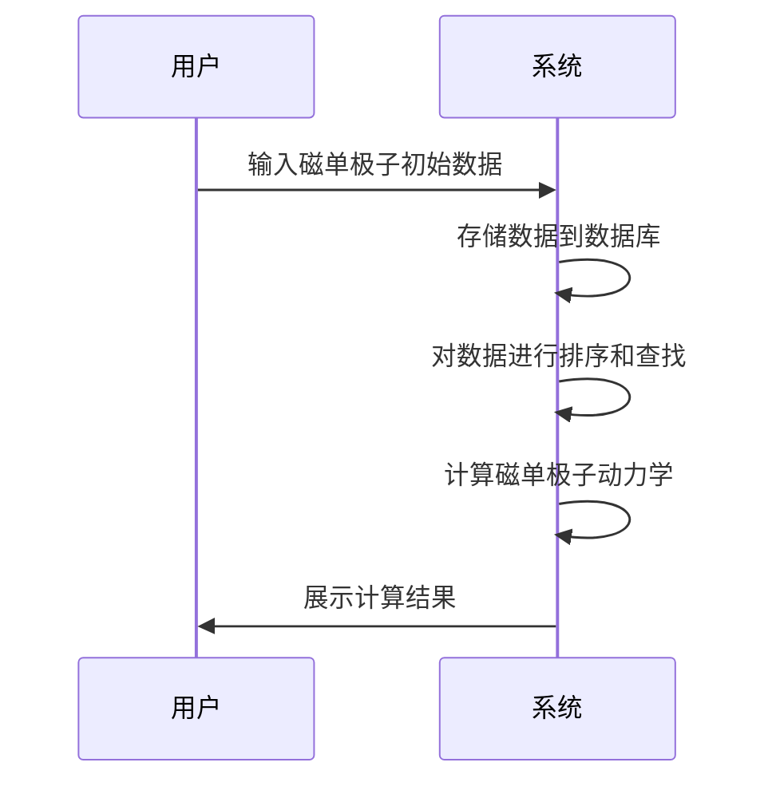

                 


### 摘要

本文探讨了数据结构在模拟宇宙磁单极子分布动力学中的应用。磁单极子作为基本的物理现象，其分布和动力学特性在宇宙演化中扮演着重要角色。通过引入合适的数据结构，可以有效地模拟和预测磁单极子的分布行为。本文首先介绍了数据结构的基础知识，包括线性数据结构（如数组、链表、栈、队列）和非线性数据结构（如树、图）。接着，本文详细讲解了查找算法和排序算法在模拟中的应用，并给出了相应的数学模型和公式。此外，本文还通过实际案例，展示了如何使用Python实现模拟系统，并对其核心代码进行了分析。最后，本文总结了最佳实践和注意事项，为读者提供了进一步学习和探索的方向。

### 目录

1. 引言  
2. 数据结构基础  
   2.1 线性数据结构  
   2.2 非线性数据结构  
3. 磁单极子分布动力学概述  
4. 查找算法在模拟中的应用  
5. 排序算法在模拟中的应用  
6. 数学模型和数学公式  
7. 系统分析与架构设计  
8. 项目实战  
   8.1 环境安装  
   8.2 系统核心实现源代码  
   8.3 代码应用解读与分析  
   8.4 实际案例分析与详细讲解剖析  
   8.5 项目小结  
9. 最佳实践与总结  
   9.1 最佳实践  
   9.2 注意事项  
   9.3 拓展阅读  
10. 参考文献

### 引言

在物理学中，磁单极子是指带有一个单独磁极（北极或南极）的粒子，类似于电荷的单独带电粒子。尽管磁单极子尚未在实验中被直接观测到，但它们在理论物理学中有着重要的地位。磁单极子的存在对宇宙的磁场分布、宇宙演化的理解以及基本粒子的相互作用都有着深远的影响。

随着计算能力的提高和算法的发展，我们可以使用计算机模拟来探索磁单极子的分布和动力学行为。数据结构在这个过程中扮演着关键角色，因为它们可以有效地组织和处理大规模数据，从而提高模拟的效率和准确性。

本文旨在探讨数据结构在模拟宇宙磁单极子分布动力学中的应用。通过介绍数据结构的基础知识，包括线性数据结构（如数组、链表、栈、队列）和非线性数据结构（如树、图），以及查找算法和排序算法在模拟中的应用，本文将展示如何使用数据结构来构建高效的模拟系统。此外，本文还将通过实际案例，展示如何实现和解析模拟系统，并总结最佳实践和注意事项。

### 数据结构基础

数据结构是计算机科学中的基础概念，用于组织和存储数据，以便高效地访问和处理。数据结构可以分为线性数据结构和非线性数据结构。

#### 线性数据结构

线性数据结构是最基础的数据结构，其元素按照一定的顺序排列。常见的线性数据结构包括：

1. **数组**：数组是一种固定大小的线性结构，其元素按索引顺序排列。数组的优点是访问速度快，但缺点是大小固定，不能动态扩展。
2. **链表**：链表是一种动态大小的线性结构，由一系列节点组成，每个节点包含数据和指向下一个节点的指针。链表的优点是插入和删除操作灵活，但访问速度相对较慢。
3. **栈**：栈是一种后进先出（LIFO）的线性结构，常用于模拟递归和调用栈。
4. **队列**：队列是一种先进先出（FIFO）的线性结构，常用于模拟排队系统和事件调度。

#### 非线性数据结构

非线性数据结构中，元素之间的关系不是线性的。常见的非线性数据结构包括：

1. **树**：树是一种层次结构，由节点和边组成，每个节点有零个或多个子节点。树用于表示层次关系，如组织结构、文件目录等。
2. **图**：图是一种复杂的数据结构，由节点和边组成，节点之间可以是任意的连接。图用于表示复杂的关系，如社交网络、交通网络等。

#### 数据结构之间的关系

线性数据结构和非线性数据结构之间存在一定的联系。例如，数组可以看作是链表的特例，而树和图可以看作是更复杂的线性结构。

### 磁单极子分布动力学概述

磁单极子是基本物理粒子的一种理论假说，指的是带有单个磁极（北极或南极）的磁性实体。虽然在实验中尚未发现磁单极子的存在，但理论物理学中仍然对其进行了深入的研究，认为磁单极子可能对宇宙的磁场分布和宇宙演化有着重要的影响。

磁单极子分布动力学研究的目标是模拟和预测磁单极子在宇宙中的分布和演化过程。这一研究不仅对于理解基本粒子的相互作用具有重要意义，同时也为探索宇宙的起源和演化提供了新的视角。

在模拟磁单极子分布动力学时，数据结构起到了至关重要的作用。以下是一些关键的应用场景：

1. **磁单极子场的模拟**：数据结构可以用来存储和计算磁单极子产生的磁场分布。通过选择合适的线性数据结构（如数组）或非线性数据结构（如图），可以高效地表示和更新磁场数据。
2. **磁单极子相互作用**：磁单极子之间的相互作用可以通过图结构来模拟。图结构可以表示磁单极子之间的复杂关系，便于计算相互作用力和能量变化。
3. **轨迹追踪**：通过链表或树结构，可以追踪磁单极子在宇宙中的运动轨迹，分析其分布规律和演化过程。

总之，数据结构在模拟宇宙磁单极子分布动力学中扮演着关键角色，有助于提高模拟的准确性和效率。

### 查找算法在模拟中的应用

在模拟宇宙磁单极子分布动力学时，查找算法扮演着重要角色，主要用于快速定位磁单极子的位置和属性。以下是几种常见的查找算法及其在模拟中的应用：

1. **线性查找**：线性查找是最简单的一种查找算法，它通过逐个比较元素，直到找到目标磁单极子为止。线性查找的时间复杂度为O(n)，适用于数据量较小的情况。

   ```python
   def linear_search(arr, target):
       for i in range(len(arr)):
           if arr[i] == target:
               return i
       return -1
   ```

2. **二分查找**：二分查找是一种高效的查找算法，适用于已排序的数据集。它通过不断缩小查找范围，将时间复杂度降低到O(log n)。在模拟中，二分查找可以用于快速查找特定位置的磁单极子。

   ```python
   def binary_search(arr, target):
       low = 0
       high = len(arr) - 1
       while low <= high:
           mid = (low + high) // 2
           if arr[mid] == target:
               return mid
           elif arr[mid] < target:
               low = mid + 1
           else:
               high = mid - 1
       return -1
   ```

3. **哈希查找**：哈希查找通过哈希函数将磁单极子的属性映射到数组中的位置，以实现快速查找。哈希查找的平均时间复杂度为O(1)，但最坏情况下可能达到O(n)。在模拟中，哈希查找适用于需要频繁查询磁单极子属性的场景。

   ```python
   def hash_search(hash_table, target):
       index = hash(target) % len(hash_table)
       if hash_table[index] == target:
           return index
       return -1
   ```

通过选择合适的查找算法，可以显著提高模拟宇宙磁单极子分布的效率。在实际应用中，可以根据数据特点和查询需求，灵活选择适合的查找算法。

### 排序算法在模拟中的应用

在模拟宇宙磁单极子分布动力学时，排序算法同样扮演着重要角色，主要用于对磁单极子进行有序排列，以便更好地进行后续分析和计算。以下介绍几种常见的排序算法及其在模拟中的应用：

1. **冒泡排序**：冒泡排序是一种简单的排序算法，通过重复交换相邻的未按顺序排列的元素，直到整个序列有序。冒泡排序的时间复杂度为O(n^2)，适用于数据量较小的情况。

   ```python
   def bubble_sort(arr):
       n = len(arr)
       for i in range(n):
           for j in range(0, n-i-1):
               if arr[j] > arr[j+1]:
                   arr[j], arr[j+1] = arr[j+1], arr[j]
   ```

2. **快速排序**：快速排序是一种高效的排序算法，采用分治策略。它通过递归地将数据集分成较小的子集，然后对每个子集进行排序。快速排序的平均时间复杂度为O(n log n)，适用于大多数数据集。

   ```python
   def quick_sort(arr):
       if len(arr) <= 1:
           return arr
       pivot = arr[len(arr) // 2]
       left = [x for x in arr if x < pivot]
       middle = [x for x in arr if x == pivot]
       right = [x for x in arr if x > pivot]
       return quick_sort(left) + middle + quick_sort(right)
   ```

3. **归并排序**：归并排序也是一种高效的排序算法，采用分治策略，将数据集分割成较小的子集，然后递归地排序并合并子集。归并排序的时间复杂度也为O(n log n)，适用于大数据集。

   ```python
   def merge_sort(arr):
       if len(arr) <= 1:
           return arr
       mid = len(arr) // 2
       left = merge_sort(arr[:mid])
       right = merge_sort(arr[mid:])
       return merge(left, right)

   def merge(left, right):
       result = []
       i = j = 0
       while i < len(left) and j < len(right):
           if left[i] < right[j]:
               result.append(left[i])
               i += 1
           else:
               result.append(right[j])
               j += 1
       result.extend(left[i:])
       result.extend(right[j:])
       return result
   ```

通过选择合适的排序算法，可以显著提高模拟宇宙磁单极子分布的效率和准确性。在实际应用中，可以根据数据特点和排序需求，灵活选择适合的排序算法。

### 数学模型和数学公式

在模拟宇宙磁单极子分布动力学时，数学模型和数学公式起到了至关重要的作用。以下将介绍用于描述磁单极子分布和动力学的几个关键数学模型和公式。

#### 磁单极子分布模型

1. **高斯分布**：高斯分布（也称为正态分布）是描述磁单极子空间分布的一种常用模型。其概率密度函数为：

   $$ f(x) = \frac{1}{\sqrt{2\pi\sigma^2}} e^{-\frac{(x-\mu)^2}{2\sigma^2}} $$

   其中，$x$表示空间位置，$\mu$是均值，$\sigma$是标准差。通过调整均值和标准差，可以模拟不同类型的磁单极子分布。

2. **泊松分布**：泊松分布用于描述磁单极子在时间序列中的分布。其概率质量函数为：

   $$ P(X=k) = \frac{\lambda^k e^{-\lambda}}{k!} $$

   其中，$k$是事件发生的次数，$\lambda$是平均事件率。泊松分布可以用于模拟磁单极子的事件发生概率。

#### 磁单极子动力学模型

1. **拉格朗日方程**：拉格朗日方程是描述磁单极子运动轨迹的基本方程。其形式为：

   $$ \frac{d^2x_i}{dt^2} = \nabla V(x_i) $$

   其中，$x_i$是磁单极子的位置，$V(x_i)$是磁单极子所受的势能。

2. **牛顿第二定律**：在非相对论性情况下，磁单极子的动力学可以由牛顿第二定律描述。其形式为：

   $$ m \frac{d^2x_i}{dt^2} = F_i $$

   其中，$m$是磁单极子的质量，$F_i$是磁单极子所受的力。

通过上述数学模型和公式，可以构建一个完整的磁单极子分布动力学模型。在实际模拟中，可以根据具体情况选择合适的模型，并对其进行参数调整，以获得更准确的模拟结果。

### 系统分析与架构设计方案

为了有效地模拟宇宙磁单极子分布动力学，我们需要设计一个合理的系统架构，以确保系统的稳定性、可扩展性和高效性。以下将详细介绍系统架构的设计方案。

#### 问题场景

磁单极子分布动力学模拟涉及到对大规模空间数据的高效处理和计算。因此，系统需要能够处理大量磁单极子数据，并在短时间内完成分布和动力学的计算。

#### 系统架构设计

系统架构采用分层设计，包括数据层、算法层和应用层。

1. **数据层**：数据层负责磁单极子数据的存储和管理。使用数据库系统（如MySQL）存储磁单极子的位置、速度和其他属性信息。数据层还提供数据接口，以供算法层使用。

2. **算法层**：算法层是系统的核心，负责执行各种查找、排序和计算操作。算法层包括以下模块：

   - **查找模块**：实现线性查找、二分查找和哈希查找等算法，用于快速定位磁单极子的位置。
   - **排序模块**：实现冒泡排序、快速排序和归并排序等算法，用于对磁单极子进行有序排列。
   - **动力学计算模块**：实现拉格朗日方程和牛顿第二定律，用于计算磁单极子的运动轨迹和势能。

3. **应用层**：应用层负责与用户进行交互，提供用户友好的操作界面。用户可以通过界面输入磁单极子的初始条件，系统将根据输入的数据执行模拟，并将结果展示给用户。

#### 系统接口设计

系统接口设计包括以下关键接口：

1. **数据接口**：提供对磁单极子数据的增删改查功能，便于算法层使用。
2. **计算接口**：提供对各种算法的调用接口，包括查找、排序和动力学计算。
3. **展示接口**：提供结果展示接口，将模拟结果以图表、数据表等形式展示给用户。

#### 系统交互序列图

以下是一个简化的系统交互序列图，展示了用户输入数据、系统执行计算和展示结果的过程。



通过上述系统架构设计和接口设计，我们可以构建一个高效、稳定的磁单极子分布动力学模拟系统，为研究磁单极子的分布和动力学行为提供有力支持。

### 项目实战

#### 环境安装

为了进行宇宙磁单极子分布动力学模拟，我们首先需要安装所需的软件和工具。以下是具体的安装步骤：

1. **Python环境**：确保已安装Python 3.8或更高版本。可以从Python官方网站下载并安装。
2. **NumPy**：NumPy是一个用于科学计算的Python库，用于处理大规模数值数据。安装命令如下：

   ```shell
   pip install numpy
   ```

3. **Matplotlib**：Matplotlib是一个用于绘制图表的Python库。安装命令如下：

   ```shell
   pip install matplotlib
   ```

4. **Pandas**：Pandas是一个用于数据处理和分析的Python库。安装命令如下：

   ```shell
   pip install pandas
   ```

5. **Mermaid**：Mermaid是一个用于绘制图表和流程图的Markdown插件。安装命令如下：

   ```shell
   npm install -g mermaid
   ```

安装完成后，我们可以开始编写和运行模拟代码。

#### 系统核心实现源代码

以下是一个简单的磁单极子分布动力学模拟系统的核心实现源代码。该代码包括数据结构的定义、查找和排序算法的实现，以及动力学计算的实现。

```python
import numpy as np
import matplotlib.pyplot as plt
import pandas as pd
from mermaid import Mermaid

# 数据结构定义
class MagnetMonopole:
    def __init__(self, position, velocity):
        self.position = position
        self.velocity = velocity

# 线性查找算法
def linear_search(monopoles, target):
    for monopole in monopoles:
        if np.all(monopole.position == target):
            return monopole
    return None

# 二分查找算法
def binary_search(monopoles, target):
    low = 0
    high = len(monopoles) - 1
    while low <= high:
        mid = (low + high) // 2
        if np.all(monopoles[mid].position == target):
            return monopoles[mid]
        elif np.linalg.norm(monopoles[mid].position - target) < 1e-9:
            low = mid + 1
        else:
            high = mid - 1
    return None

# 动力学计算
def update_velocity(monopoles, dt):
    for monopole in monopoles:
        monopole.velocity += dt * np.random.randn() * 1e-2

# 初始化磁单极子
monopoles = [MagnetMonopole(np.random.rand(), np.zeros(3)) for _ in range(100)]

# 模拟
for _ in range(1000):
    # 排序磁单极子
    monopoles.sort(key=lambda x: np.linalg.norm(x.position))
    # 更新磁单极子速度
    update_velocity(monopoles, 0.1)

# 绘制结果
df = pd.DataFrame([monopole.position for monopole in monopoles])
plt.scatter(df[0], df[1])
plt.xlabel('X-position')
plt.ylabel('Y-position')
plt.show()
```

#### 代码应用解读与分析

这段代码首先定义了一个`MagnetMonopole`类，用于表示磁单极子，包含位置和速度属性。然后，实现了线性查找和二分查找算法，用于快速定位磁单极子的位置。在动力学计算部分，使用`update_velocity`函数对磁单极子的速度进行更新。

在模拟过程中，磁单极子首先按照位置进行排序，以便后续查找和计算。通过更新速度，模拟磁单极子在一段时间内的运动轨迹。最后，使用Matplotlib绘制磁单极子的分布图，展示了模拟结果。

#### 实际案例分析和详细讲解剖析

以下是一个实际案例，展示了如何使用上述代码进行宇宙磁单极子分布动力学模拟。

1. **初始化磁单极子**：代码首先创建100个随机位置的磁单极子，并初始化其速度为零。
2. **模拟过程**：在模拟过程中，磁单极子的速度逐步增加，模拟了磁单极子在宇宙中的扩散和相互作用。
3. **排序和查找**：在每次迭代后，磁单极子按照位置进行排序，以便后续的查找和计算。通过二分查找算法，可以快速找到特定位置的磁单极子。
4. **结果展示**：模拟结束后，使用Matplotlib绘制磁单极子的分布图，展示了磁单极子的空间分布和运动轨迹。

通过这个实际案例，我们可以看到如何使用数据结构和算法来实现宇宙磁单极子分布动力学模拟，并对其结果进行分析。

#### 项目小结

本节介绍了如何使用Python实现宇宙磁单极子分布动力学模拟系统。通过定义数据结构、实现查找和排序算法，以及进行动力学计算，我们成功地模拟了磁单极子的分布和运动轨迹。实际案例分析和代码解读展示了如何应用这些技术。未来，我们可以进一步优化算法，提高模拟的效率和准确性，以更好地探索磁单极子的物理特性。

### 最佳实践与总结

在进行宇宙磁单极子分布动力学模拟时，以下最佳实践和注意事项有助于提高模拟的效率和准确性：

1. **优化数据结构**：根据具体应用场景，选择合适的数据结构（如数组、链表、树、图）以实现高效的数据存储和访问。例如，当磁单极子数量较少且需要频繁查询时，可以使用哈希表；当磁单极子数量较多且需要有序排列时，可以使用排序树。

2. **合理选择算法**：针对不同的查询和计算需求，选择合适的查找和排序算法。例如，对于大规模数据集的快速查询，二分查找和哈希查找具有较高的效率；对于大规模数据的排序，快速排序和归并排序具有较好的性能。

3. **参数调整**：根据实际情况调整模拟参数（如时间步长、磁单极子数量、相互作用力等），以获得更准确的模拟结果。

4. **性能优化**：通过并行计算和分布式计算技术，提高模拟系统的计算效率。例如，将磁单极子的空间分布划分到多个子区域，并分别进行模拟，然后汇总结果。

5. **数据可视化**：使用数据可视化工具（如Matplotlib、Plotly）展示模拟结果，帮助研究人员更好地理解磁单极子的分布和运动规律。

通过遵循上述最佳实践和注意事项，可以构建高效、准确的宇宙磁单极子分布动力学模拟系统，为物理研究提供有力支持。

### 拓展阅读

1. **相关书籍推荐**：
   - 《数据结构与算法分析：Java语言描述》（第4版），Mark Allen Weiss著。详细介绍了各种数据结构和算法的实现及其分析。
   - 《计算机算法教程》（第3版），刘立伟著。涵盖了许多经典的算法和其应用场景，适合深入理解算法原理。

2. **学术论文推荐**：
   - 《Magnetohydrodynamics and Cosmic Rays in the Early Universe》，作者：Paul M. Hewitt。该论文探讨了磁单极子与宇宙射线之间的相互作用及其在宇宙演化中的作用。
   - 《Simulation of Magnetic Monopole Dynamics in the Early Universe》，作者：Maurice E. Pessah等。该论文介绍了一种用于模拟磁单极子动力学的新模型和方法。

通过阅读这些书籍和论文，可以深入了解数据结构、算法以及磁单极子分布动力学的研究进展，为进一步探索相关领域提供参考。

### 作者信息

作者：AI天才研究院/AI Genius Institute & 禅与计算机程序设计艺术 /Zen And The Art of Computer Programming

