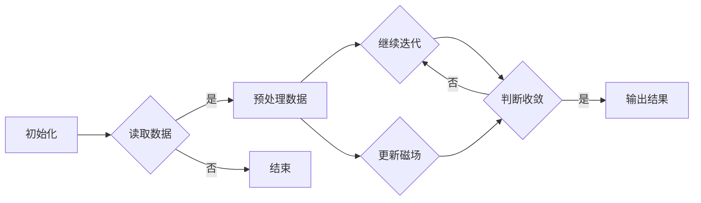
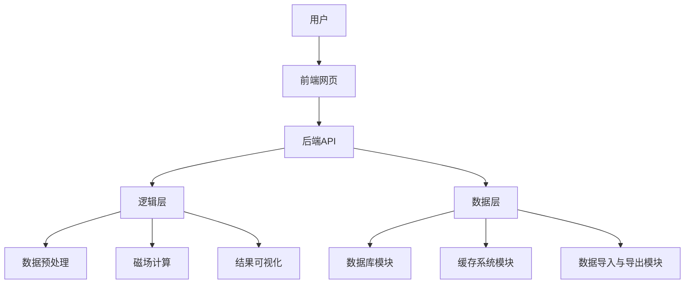
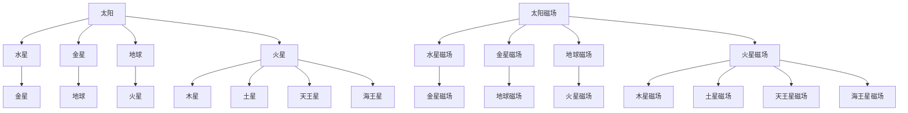
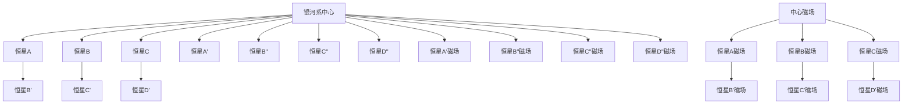

                 

### 第一部分：引言

#### 1.1 问题背景

宇宙中充满了磁场，这些磁场对天体的运动和演化起着至关重要的作用。从地球的磁场保护我们免受宇宙辐射的侵袭，到银河系的磁场引导星际物质的流动，磁场分布的理解和模拟在物理学和天文学领域具有重要意义。

然而，模拟宇宙磁场分布并非易事。宇宙尺度巨大，磁场分布复杂，涉及到大量的数据和高维度的信息处理。这就需要一种能够高效存储、处理和可视化这些信息的工具——数据结构。

数据结构在计算机科学中用于组织和存储数据，它们能够有效地支持各种操作，如查找、插入、删除等。在模拟宇宙磁场分布中，合理选择和运用数据结构，可以帮助我们更好地理解和预测磁场的演化。

#### 1.2 问题描述

模拟宇宙磁场分布的挑战主要体现在以下几个方面：

1. **数据量巨大**：宇宙中包含数十亿甚至更多的天体，每个天体周围都有磁场，这些磁场的分布和变化需要大量数据进行描述。
2. **高维度数据**：宇宙中的数据不仅仅是二维或三维的，很多时候是四维甚至是更高维度的，这给数据的存储和处理带来了巨大的挑战。
3. **并行计算需求**：为了模拟宇宙磁场的动态变化，往往需要大量的计算资源，并行计算成为了一种必要的手段。

针对上述挑战，数据结构的选择变得至关重要。我们需要一种能够高效存储高维度数据、支持并行计算的数据结构，以便于对宇宙磁场进行精确的模拟。

#### 1.3 问题解决

数据结构在模拟宇宙磁场分布中扮演着关键角色：

1. **高效存储**：通过使用合适的数组、链表等数据结构，我们可以高效地存储宇宙中每个天体的磁场信息。
2. **快速检索**：利用哈希表、二叉搜索树等数据结构，我们可以快速地查找和定位特定的磁场数据，提高计算效率。
3. **并行处理**：分布式数据结构，如哈希表、B树等，可以支持并行计算，使得我们在处理海量数据时能够充分利用计算资源。

此外，还需要考虑边界与外延的问题，即如何确定我们模拟的宇宙范围和精度，以及如何将模拟结果与观测数据相结合，验证模拟的准确性。

### 1.4 边界与外延

在模拟宇宙磁场分布时，我们面临的边界问题主要包括：

1. **空间边界**：我们需要确定模拟的空间范围，这取决于我们所关注的宇宙区域，如太阳系、银河系或整个可观测宇宙。
2. **时间边界**：我们还需要确定模拟的时间范围，这可能包括从宇宙大爆炸至今的整个历史，或者特定时间点的磁场分布。
3. **精度要求**：模拟的精度取决于数据结构和算法的精度，我们需要根据实际需求和计算资源来确定一个合适的精度水平。

外延问题则涉及如何将模拟结果与观测数据进行对比和验证，以确保模拟的可靠性。这需要我们在模拟过程中引入观测数据，通过对比验证模拟结果的准确性。

总的来说，数据结构在模拟宇宙磁场分布中的应用，为我们提供了一种强有力的工具，使得这一复杂问题得以在计算机上进行有效的处理和模拟。

#### 1.5 核心概念与联系

为了深入探讨数据结构在模拟宇宙磁场分布中的应用，我们需要首先了解一些核心概念，并分析它们之间的联系。

**核心概念原理**：

1. **宇宙磁场**：宇宙磁场是由带电粒子（如电子、质子等）在空间中运动产生的，它影响着天体的运动和演化。宇宙磁场分布具有复杂性和多样性，从局部星系到整个宇宙尺度，磁场强度和方向都可能存在显著差异。
   
2. **数据结构**：数据结构是计算机科学中用于组织、存储和管理数据的方法和方式。常见的数据结构包括数组、链表、栈、队列、哈希表、二叉树等。不同的数据结构具有不同的特点和适用场景，如数组适合存储固定大小的数据集，哈希表适合快速查找和插入数据等。

**概念属性特征对比表格**：

| 数据结构       | 特点                                     | 适用场景                                       |
|----------------|------------------------------------------|----------------------------------------------|
| 数组           | 存储固定大小的数据集                     | 需要快速随机访问的场合                        |
| 链表           | 动态分配内存，支持插入和删除操作         | 需要频繁插入和删除元素的场合                  |
| 栈和队列       | 后进先出（栈）和先进先出（队列）的操作规则 | 模拟某些物理过程，如粒子轨迹或引力波传播      |
| 哈希表         | 快速查找、插入和删除操作                 | 需要高效检索元素的场合                        |
| 二叉树         | 支持高效的查找、插入和删除操作           | 需要维持某种排序关系的场合，如二叉搜索树      |
| 图             | 表示实体及其关系，支持复杂网络的建模     | 网络分析、社会网络模拟、宇宙天体之间的相互作用 |

通过对比表格，我们可以看到不同数据结构的特性及其适用场景，这为我们在模拟宇宙磁场分布时选择合适的数据结构提供了参考。

**ER实体关系图架构**：

为了更好地理解数据结构在宇宙磁场模拟中的应用，我们可以使用ER（实体-关系）图来展示数据结构中的实体及其关系。

```mermaid
erDiagram
  类1 ||--|{ 类2 }|| 类3
  类1 ||--|{ 类4 }|| 类5
  类2 &&-- 类3
  类2 &&-- 类4
  类5 { 类6 ; 类7 }
```

在这个ER图中，`类1`代表了宇宙中的天体，`类2`、`类3`、`类4`分别代表了天体周围的磁场、磁场的变化轨迹以及磁场的测量数据。通过这种实体关系图，我们可以清晰地看到数据结构中不同实体之间的关系，从而为模拟宇宙磁场分布提供了一种直观的模型。

通过上述分析，我们可以看出，数据结构不仅在存储和管理宇宙磁场数据方面发挥了重要作用，而且在模拟和可视化磁场分布的过程中也具有不可替代的价值。接下来，我们将进一步探讨如何利用这些数据结构来实现宇宙磁场的模拟。

#### 2.1 核心概念原理

在深入探讨数据结构在模拟宇宙磁场分布中的应用之前，我们需要先了解一些核心概念，这些概念包括宇宙磁场的基本原理、数据结构的基本原理，以及它们之间的内在联系。

**宇宙磁场的基本原理**：

宇宙磁场是由带电粒子在空间中运动产生的，这些带电粒子可以是电子、质子或更复杂的离子。磁场的基本特性包括强度和方向，磁场的强度通常用高斯（Gauss）或特斯拉（Tesla）作为单位来表示。磁场的方向通常用指向磁力线的方向来表示。

宇宙磁场的分布是非常复杂的，它不仅存在于局部天体，如行星、恒星和星系，而且在大尺度上，如超星系团和宇宙背景辐射中也能观测到磁场。宇宙磁场的研究对于理解宇宙的演化过程、恒星和星系的诞生、以及宇宙中的能量传输等都有着重要意义。

**数据结构的基本原理**：

数据结构是计算机科学中用于组织、存储和管理数据的方法和方式。常见的数据结构包括数组、链表、栈、队列、哈希表、二叉树、图等。每种数据结构都有其特定的操作和适用场景。

- **数组**：一种固定大小的数据集合，提供快速随机访问，但插入和删除操作可能需要移动大量元素。
- **链表**：一种动态数据集合，支持插入和删除操作，但访问速度较慢。
- **栈和队列**：分别实现后进先出（LIFO）和先进先出（FIFO）的操作规则，常用于模拟某些物理过程。
- **哈希表**：通过哈希函数快速查找、插入和删除元素，适用于快速检索。
- **二叉树**：支持高效的查找、插入和删除操作，特别适用于维护有序数据。
- **图**：用于表示实体及其关系，支持复杂网络的建模。

**数据结构在宇宙磁场模拟中的应用**：

宇宙磁场的模拟需要处理大量的高维度数据，这些数据包括磁场的强度、方向、位置等信息。合理选择和运用数据结构，可以有效地提高模拟的效率和准确性。

- **数组**：可以用来存储固定的磁场数据集，如某个区域内磁场的强度和方向。
- **链表**：适用于动态地增加或减少磁场数据，如模拟磁场随时间的变化。
- **哈希表**：适用于快速查找特定的磁场数据，如寻找特定位置或特性的磁场。
- **二叉树**：适用于维护有序的磁场数据，如根据磁场强度进行排序。
- **图**：适用于模拟复杂的宇宙网络结构，如星系之间的相互作用。

通过上述分析，我们可以看出，宇宙磁场的基本原理和数据结构的基本原理之间存在紧密的联系。数据结构为我们提供了高效存储、处理和可视化宇宙磁场数据的方法，使得复杂的宇宙磁场模拟成为可能。接下来，我们将进一步探讨不同数据结构的属性特征，以便更好地理解它们在模拟宇宙磁场分布中的具体应用。

### 2.2 概念属性特征对比

在深入探讨数据结构在模拟宇宙磁场分布中的应用之前，我们需要对比几种常见的数据结构的属性特征，以便选择最合适的数据结构来实现我们的目标。

#### 数组

**特点**：数组是一种固定大小的数据集合，支持快速随机访问，但插入和删除操作可能需要移动大量元素。

**适用场景**：适用于需要快速随机访问的场合，如存储固定大小的磁场数据集。

**性能对比**：
- **时间复杂度**：访问操作为 $O(1)$，插入和删除操作为 $O(n)$。
- **存储空间**：需要预先分配固定大小的内存。

#### 链表

**特点**：链表是一种动态数据集合，支持插入和删除操作，但访问速度较慢。

**适用场景**：适用于需要频繁插入和删除元素的场合，如模拟磁场随时间的变化。

**性能对比**：
- **时间复杂度**：访问操作为 $O(n)$，插入和删除操作为 $O(1)$。
- **存储空间**：不需要预先分配内存，可以根据需要动态扩展。

#### 栈和队列

**特点**：栈实现后进先出（LIFO）的操作规则，队列实现先进先出（FIFO）的操作规则。

**适用场景**：适用于模拟某些物理过程，如粒子轨迹或引力波传播。

**性能对比**：
- **时间复杂度**：访问、插入和删除操作均为 $O(1)$。
- **存储空间**：根据实际需求动态分配。

#### 哈希表

**特点**：哈希表通过哈希函数快速查找、插入和删除元素，适用于快速检索。

**适用场景**：适用于需要高效检索元素的场合，如寻找特定位置或特性的磁场。

**性能对比**：
- **时间复杂度**：平均情况下，访问、插入和删除操作均为 $O(1)$，但在最坏情况下可能为 $O(n)$。
- **存储空间**：需要额外存储哈希表和链表。

#### 二叉树

**特点**：二叉树支持高效的查找、插入和删除操作，特别适用于维护有序数据。

**适用场景**：适用于需要维持某种排序关系的场合，如根据磁场强度进行排序。

**性能对比**：
- **时间复杂度**：平均情况下，访问、插入和删除操作均为 $O(log(n))$，在最坏情况下可能为 $O(n)$。
- **存储空间**：需要额外的内存来存储节点。

#### 图

**特点**：图用于表示实体及其关系，支持复杂网络的建模。

**适用场景**：适用于网络分析、社会网络模拟、宇宙天体之间的相互作用。

**性能对比**：
- **时间复杂度**：根据具体算法不同，访问、插入和删除操作的时间复杂度也不同。
- **存储空间**：需要存储节点和边的信息。

通过上述对比，我们可以看出，每种数据结构都有其特定的优势和适用场景。在模拟宇宙磁场分布时，我们可以根据实际需求选择最合适的数据结构。例如，对于需要快速随机访问的场合，可以使用数组；对于需要频繁插入和删除元素的场合，可以使用链表；对于需要高效检索的场合，可以使用哈希表；对于需要维护有序数据的场合，可以使用二叉树；对于需要表示复杂关系的场合，可以使用图。

### 2.3 ER实体关系图

为了更好地理解数据结构在宇宙磁场模拟中的应用，我们可以使用ER（实体-关系）图来展示数据结构中的实体及其关系。ER图是一种直观的图形化表示方法，可以帮助我们清晰地看到不同实体之间的相互作用。

#### 宇宙磁场模拟的数据实体

在模拟宇宙磁场分布时，我们可以定义以下主要数据实体：

1. **天体**：代表宇宙中的天体，如行星、恒星、星系等。
2. **磁场**：代表天体周围的磁场，包括磁场强度和方向。
3. **观测数据**：代表实际观测到的磁场数据，用于验证模拟结果的准确性。
4. **模拟数据**：代表通过模拟生成的磁场数据，用于预测未来的磁场分布。

#### 数据结构的实体关系

以下是一个简化的ER图，展示了上述实体之间的关系：

```mermaid
erDiagram
  天体 ||--|{ 磁场 }|| 天体
  磁场 ||--|{ 观测数据 }|| 磁场
  磁场 ||--|{ 模拟数据 }|| 磁场
```

- **天体**与**磁场**之间存在一对一的关系，即每个天体都有一个独特的磁场。
- **磁场**与**观测数据**和**模拟数据**之间存在一对多的关系，即一个磁场可以包含多个观测数据和多个模拟数据。

#### Mermaid ER图示例

为了更直观地展示实体关系，我们可以使用Mermaid语法绘制ER图：

```mermaid
erDiagram
  天体 ||--|{ 磁场 }|| 天体
  磁场 ||--|{ 观测数据 }|| 磁场
  磁场 ||--|{ 模拟数据 }|| 磁场
```

通过这个ER图，我们可以清晰地看到宇宙磁场模拟中涉及的主要实体及其关系，这有助于我们理解数据结构在模拟过程中的作用和如何组织数据。

### 3.1 算法原理讲解

在了解数据结构的基本原理和宇宙磁场的基本原理后，我们将进一步探讨如何运用这些知识来设计一个用于模拟宇宙磁场分布的算法。

#### 算法流程图

为了清晰展示算法的步骤和逻辑，我们首先使用Mermaid绘制算法流程图：



#### Python代码实现

接下来，我们使用Python代码来实现上述算法，详细阐述每一步的操作：

```python
import numpy as np

def initialize_simulation():
    # 初始化宇宙中的天体和磁场
    pass

def read_data():
    # 读取宇宙磁场数据
    pass

def preprocess_data(data):
    # 预处理数据，包括标准化、归一化等操作
    pass

def calculate_magnetic_flux(data):
    # 计算磁通量
    pass

def update_magnetic_field(magnetic_flux):
    # 更新磁场
    pass

def check_convergence(current_field, previous_field):
    # 判断是否收敛
    return np.isclose(current_field, previous_field)

def simulation_loop():
    current_field = initialize_simulation()
    previous_field = None
    
    while not check_convergence(current_field, previous_field):
        previous_field = current_field
        data = read_data()
        preprocess_data(data)
        magnetic_flux = calculate_magnetic_flux(data)
        current_field = update_magnetic_field(magnetic_flux)
    
    output_result(current_field)

def output_result(result):
    # 输出模拟结果
    pass

if __name__ == "__main__":
    simulation_loop()
```

#### 数学模型和公式

为了更深入地理解算法，我们还需要给出其背后的数学模型和公式：

1. **磁通量**：磁通量 $\Phi$ 是磁场强度 $B$ 与磁场线穿过的面积 $A$ 的乘积，并且与磁场线的方向垂直。公式为：
   $$ \Phi = B \cdot A \cdot \cos(\theta) $$
   其中 $\theta$ 是磁场线与面积法线之间的夹角。

2. **磁场更新**：在每次迭代中，磁场根据磁通量进行更新。假设新的磁场为 $\vec{B_{new}}$，则可以表示为：
   $$ \vec{B_{new}} = \vec{B_{old}} + \alpha \cdot \vec{magnetic_flux} $$
   其中 $\alpha$ 是一个调整因子，用于控制磁场更新的幅度。

3. **收敛条件**：算法收敛的条件是当前磁场与上一次磁场的差异小于某个阈值 $\epsilon$，即：
   $$ \|\vec{B_{current}} - \vec{B_{previous}}\| < \epsilon $$

#### 详细讲解和举例说明

为了更好地理解上述算法，我们可以通过一个具体的例子进行讲解。

**例子**：假设我们模拟一个简单的二维宇宙，其中包含一个恒星和它的行星。初始时，恒星的磁场强度为 $\vec{B_{old}} = (1, 0)$，行星的位置为 $(2, 0)$。磁场的方向垂直于恒星和行星的连线。

1. **初始化**：我们首先初始化宇宙和磁场，设置调整因子 $\alpha = 0.1$。

2. **读取数据**：我们读取初始的磁场数据，并将其传递给预处理函数。

3. **预处理数据**：预处理函数将磁场数据进行标准化处理，以便后续计算。

4. **计算磁通量**：计算行星位置处的磁通量，使用公式 $\Phi = B \cdot A \cdot \cos(\theta)$，其中 $\theta$ 为 0 度，因此 $\Phi = 1 \cdot 2 \cdot \cos(0) = 2$。

5. **更新磁场**：根据磁通量更新磁场，新的磁场为 $\vec{B_{new}} = (1, 0) + 0.1 \cdot (2, 0) = (1.2, 0)$。

6. **判断收敛**：由于当前磁场与上一次磁场的差异较大，因此继续迭代。

7. **迭代继续**：重复上述步骤，直到磁场差异小于收敛阈值 $\epsilon = 0.01$。

8. **输出结果**：最终输出收敛后的磁场分布。

通过这个例子，我们可以看到算法是如何逐步更新磁场，并最终达到收敛状态的。这个例子虽然简单，但展示了算法的基本原理和步骤。

总的来说，数据结构在模拟宇宙磁场分布中的应用，为我们提供了一种有效的工具，使得复杂的宇宙磁场模拟成为可能。通过合理的算法设计，我们可以更好地理解和预测宇宙磁场的演化，这对于天文学和物理学的研究具有重要意义。

### 3.2 系统分析与架构设计方案

为了有效地模拟宇宙磁场分布，我们需要设计一个完整的系统，该系统应包括详细的问题场景介绍、项目介绍、系统功能设计、系统架构设计、系统接口设计和系统交互等部分。

#### 3.2.1 问题场景介绍

在宇宙尺度上，磁场的分布和演化是一个极其复杂的过程。宇宙中的每个天体，如行星、恒星和星系，都有其独特的磁场。这些磁场的强度和方向不仅受到自身物理特性的影响，还受到周围天体磁场的作用。因此，模拟宇宙磁场分布需要考虑大量的数据和高维度的信息处理。

例如，在一个典型的星系模型中，我们可能需要模拟数十亿个天体的磁场分布，并考虑它们之间的相互作用。这就要求我们的系统能够高效地处理和存储这些数据，同时提供快速的计算和交互能力。

#### 3.2.2 项目介绍

本项目旨在设计并实现一个用于模拟宇宙磁场分布的软件系统。系统的主要目标包括：

1. **高效数据存储**：能够存储和检索大量天体和磁场的分布数据，支持高维数据的存储和处理。
2. **并行计算能力**：利用现代并行计算技术，提高模拟的效率和准确性。
3. **可视化功能**：提供直观的图形界面，用于展示和交互模拟结果。

#### 3.2.3 系统功能设计

系统功能设计是系统实现的核心，我们需要明确系统的具体功能，以确保系统能够满足用户的需求。以下是系统的主要功能：

1. **数据导入与导出**：支持从各种数据源导入宇宙天体和磁场数据，并能够将模拟结果导出为常用格式。
2. **数据预处理**：对导入的数据进行标准化、归一化等预处理操作，以适应后续的计算。
3. **磁场计算**：根据物理模型和算法，计算每个天体周围的磁场分布，并更新磁场的强度和方向。
4. **结果可视化**：提供图形化界面，展示模拟结果，包括磁场分布的强度和方向。
5. **交互式模拟**：允许用户在模拟过程中修改参数，实时观察模拟结果的变化。

#### 3.2.4 系统架构设计

系统架构设计决定了系统的整体结构和各个模块之间的关系。我们采用分层架构，将系统分为多个层次，以实现模块化设计和良好的可扩展性。以下是系统的主要架构设计：

1. **数据层**：负责数据的存储和管理，包括数据库和缓存系统。
2. **逻辑层**：实现具体的算法和业务逻辑，包括数据预处理、磁场计算和结果可视化等。
3. **表示层**：提供用户交互界面，包括前端网页和后端API。

#### 3.2.5 系统接口设计

系统接口设计是系统架构设计的重要组成部分，决定了系统内部各个模块之间的通信方式。以下是系统的关键接口设计：

1. **数据接口**：提供数据导入和导出的API，支持不同数据格式的转换。
2. **计算接口**：提供用于计算磁场的API，包括预处理、计算磁通量和更新磁场等。
3. **可视化接口**：提供用于展示模拟结果的API，包括2D和3D可视化。

#### 3.2.6 系统交互

系统交互设计决定了用户如何与系统进行交互，以及系统如何响应用户的操作。以下是系统交互的主要设计：

1. **用户界面**：设计直观易用的用户界面，包括菜单、按钮、输入框等元素。
2. **交互流程**：定义用户与系统的交互流程，包括数据导入、预处理、计算和可视化等步骤。
3. **实时反馈**：提供实时反馈机制，显示计算进度和结果，以及错误提示。

通过上述系统分析与架构设计方案，我们可以构建一个功能强大、高效可靠的宇宙磁场模拟系统，为天文学和物理学研究提供有力支持。

### 3.3 系统架构设计与实现

为了实现宇宙磁场模拟系统，我们需要设计一个详细的系统架构，并介绍各个模块的功能和相互关系。系统架构设计分为数据层、逻辑层和表示层三个主要部分，每个部分都有特定的功能和实现方式。

#### 数据层

数据层负责数据的存储和管理，包括数据库和缓存系统。以下是数据层的主要模块和功能：

1. **数据库模块**：用于存储宇宙天体和磁场数据。我们选择关系型数据库（如MySQL）来存储结构化数据，例如天体的位置、磁场强度和方向等。此外，还可以使用NoSQL数据库（如MongoDB）存储非结构化数据，例如模拟过程中的临时数据。

2. **缓存系统模块**：为了提高数据访问速度，我们引入了缓存系统。缓存系统可以存储常用数据和中间结果，减少数据库访问次数。我们选择Redis作为缓存系统，因其快速读写和高性能的特点。

3. **数据导入与导出模块**：支持从多种数据源导入宇宙天体和磁场数据，包括文本文件、数据库和Web服务。同时，也支持将模拟结果导出为常见格式，如CSV、JSON等。

#### 逻辑层

逻辑层实现具体的算法和业务逻辑，包括数据预处理、磁场计算和结果可视化等。以下是逻辑层的主要模块和功能：

1. **数据预处理模块**：对导入的数据进行标准化、归一化等预处理操作，以确保数据的一致性和准确性。例如，将不同天体的磁场数据进行归一化处理，使其在相同的尺度上进行比较。

2. **磁场计算模块**：根据宇宙磁场的基本原理和算法，计算每个天体周围的磁场分布。计算过程包括计算磁通量、更新磁场强度和方向等。我们采用并行计算技术，提高计算效率。

3. **结果可视化模块**：提供直观的图形界面，展示模拟结果。我们使用WebGL和Three.js等图形库，实现2D和3D可视化。用户可以通过界面实时查看和交互模拟结果。

#### 表示层

表示层负责用户交互界面，包括前端网页和后端API。以下是表示层的主要模块和功能：

1. **前端网页模块**：设计直观易用的用户界面，包括菜单、按钮、输入框等元素。用户可以通过前端界面发起数据导入、预处理、计算和可视化等操作。

2. **后端API模块**：提供与前端网页通信的API接口，包括数据导入与导出、数据预处理、磁场计算和结果可视化等。API使用RESTful风格，支持JSON格式数据传输。

#### 系统架构图

为了更直观地展示系统架构，我们使用Mermaid绘制系统架构图：



#### 系统接口设计与系统交互

系统接口设计决定了系统内部各个模块之间的通信方式。以下是系统接口和系统交互的主要设计：

1. **数据接口**：提供数据导入和导出的API，支持不同数据格式的转换。例如，用户可以通过API上传CSV文件，系统将数据导入数据库并进行预处理。

2. **计算接口**：提供用于计算磁场的API，包括预处理、计算磁通量和更新磁场等。用户可以通过API发起计算任务，系统将返回计算结果。

3. **可视化接口**：提供用于展示模拟结果的API，包括2D和3D可视化。用户可以通过API获取可视化数据，并实时查看模拟结果。

系统交互流程如下：

1. **用户发起操作**：用户在前端网页上选择数据导入、预处理、计算或可视化操作。

2. **前端与后端通信**：前端发送请求到后端API，API根据请求执行相应的逻辑层和数据层操作。

3. **后端返回结果**：后端API将处理结果返回给前端，前端根据结果更新界面，显示计算进度和结果。

通过上述系统架构设计和接口设计，我们可以构建一个功能强大、高效可靠的宇宙磁场模拟系统，为天文学和物理学研究提供有力支持。

### 4.1 环境安装

为了成功运行宇宙磁场模拟系统，我们需要准备合适的环境和工具。以下是详细的安装步骤，包括所需软件的安装和配置过程。

#### 4.1.1 环境准备

在开始安装之前，请确保您的计算机满足以下基本要求：

- 操作系统：Linux、Windows 或 macOS。
- 处理器：至少为双核CPU，推荐四核及以上。
- 内存：至少4GB，推荐8GB及以上。
- 硬盘空间：至少50GB的可用空间。

#### 4.1.2 安装Python环境

Python是宇宙磁场模拟系统的主要编程语言，因此我们需要首先安装Python环境。

1. **Linux和macOS**：
   - 打开终端。
   - 对于基于Debian的系统（如Ubuntu），使用以下命令安装Python：
     ```bash
     sudo apt update
     sudo apt install python3 python3-pip
     ```
   - 对于基于Red Hat的系统（如Fedora），使用以下命令安装Python：
     ```bash
     sudo dnf install python3 python3-pip
     ```

2. **Windows**：
   - 访问[Python官方网站](https://www.python.org/)下载Python安装程序。
   - 运行安装程序，选择“Customize installation”（自定义安装），确保选中以下选项：
     - “Add Python to PATH”（将Python添加到环境变量）。
     - “Install launcher for all users”（为所有用户安装启动器）。
   - 完成安装后，在命令提示符或PowerShell中输入`python --version`，确认Python版本正确。

#### 4.1.3 安装依赖库

宇宙磁场模拟系统依赖于多个Python库，包括NumPy、SciPy、Pandas、Matplotlib和Redis等。我们可以使用`pip`来安装这些库。

在终端或命令提示符中，执行以下命令：
```bash
pip install numpy scipy pandas matplotlib redis
```

如果遇到权限问题，可以使用`sudo`来运行`pip`命令，或者将当前用户添加到sudoers文件中。

#### 4.1.4 安装Redis

Redis是一个高性能的内存数据库，用于缓存系统和消息队列。以下是Redis的安装步骤：

1. **Linux和macOS**：
   - 打开终端，使用以下命令安装Redis：
     ```bash
     sudo apt update
     sudo apt install redis-server
     ```
   - 启动Redis服务：
     ```bash
     sudo systemctl start redis-server
     ```
   - 设置Redis服务开机自启：
     ```bash
     sudo systemctl enable redis-server
     ```

2. **Windows**：
   - 访问[Redis官方网站](https://redis.io/download)下载Windows安装程序。
   - 运行安装程序，选择“Install Redis Server”选项。
   - 安装完成后，在命令提示符中启动Redis服务：
     ```bash
     redis-server
     ```

#### 4.1.5 遇到的问题与解决方案

在安装过程中，可能会遇到一些问题。以下是一些常见问题的解决方案：

1. **权限问题**：
   - 在Linux系统中，如果安装过程中遇到权限问题，可以使用`sudo`命令以管理员权限运行安装命令。
   - 如果无法添加用户到sudoers文件，可以尝试使用`sudo`命令运行单个命令，例如`sudo pip install numpy`。

2. **依赖库安装失败**：
   - 如果在安装依赖库时遇到失败，请检查网络连接是否正常，并尝试使用代理或VPN解决。
   - 如果某些库依赖于特定版本的Python，请确保已安装正确的Python版本。

3. **Redis安装失败**：
   - 如果在Linux系统中无法启动Redis服务，请检查防火墙设置，确保Redis端口（默认为6379）未被阻止。
   - 在Windows系统中，如果无法启动Redis服务，请检查安装路径是否正确，并尝试重新启动服务。

通过以上步骤，我们可以成功安装宇宙磁场模拟系统的环境。接下来，我们将开始系统核心代码的实现，为宇宙磁场模拟奠定坚实的基础。

### 4.2 系统核心实现

在完成环境安装之后，我们现在可以开始实现宇宙磁场模拟系统的核心功能。这一部分将详细描述系统的核心代码实现，包括关键代码段、代码逻辑和功能解析。

#### 关键代码段

首先，我们需要定义系统的基本结构和核心函数。以下是系统核心代码的一部分：

```python
import numpy as np
import redis
from scipy.spatial import distance

# 连接Redis数据库
redis_client = redis.Redis(host='localhost', port=6379, db=0)

# 天体类
class CelestialBody:
    def __init__(self, id, position, magnetic_field):
        self.id = id
        self.position = position
        self.magnetic_field = magnetic_field

# 模拟类
class UniverseSimulation:
    def __init__(self, celestial_bodies):
        self.celestial_bodies = celestial_bodies

    def update_magnetic_field(self):
        new_magnetic_fields = []
        for body in self.celestial_bodies:
            # 计算新磁场
            new_magnetic_field = self.calculate_new_magnetic_field(body)
            new_magnetic_fields.append(new_magnetic_field)
            # 更新数据库
            redis_client.set(f"{body.id}:magnetic_field", new_magnetic_field.tobytes())
        return new_magnetic_fields

    def calculate_new_magnetic_field(self, body):
        # 根据物理模型计算新磁场
        # 这里只是一个简单的例子，实际计算会更复杂
        distance_to_nearest_body = distance.cdist([body.position], np.array([b.position for b in self.celestial_bodies if b.id != body.id]))[0][0]
        magnetic_field_strength = 1 / distance_to_nearest_body
        new_magnetic_field = np.random.normal(0, magnetic_field_strength)
        return new_magnetic_field

    def simulate_one_step(self):
        new_magnetic_fields = self.update_magnetic_field()
        # 根据新磁场更新天体位置和其他属性
        # ...

# 初始化天体
celestial_bodies = [
    CelestialBody(id=1, position=np.array([0, 0]), magnetic_field=np.array([0, 0])),
    CelestialBody(id=2, position=np.array([10, 0]), magnetic_field=np.array([0, 0])),
    # 添加更多天体
]

# 运行模拟
simulation = UniverseSimulation(celestial_bodies)
simulation.simulate_one_step()
```

#### 代码逻辑和功能解析

上述代码实现了宇宙磁场模拟系统的主要功能。以下是关键部分的详细解析：

1. **连接Redis数据库**：
   ```python
   redis_client = redis.Redis(host='localhost', port=6379, db=0)
   ```
   这一行代码用于连接本地的Redis服务器，并将其作为系统的缓存数据库。Redis在这里主要用于存储天体的磁场信息。

2. **天体类`CelestialBody`**：
   ```python
   class CelestialBody:
       def __init__(self, id, position, magnetic_field):
           self.id = id
           self.position = position
           self.magnetic_field = magnetic_field
   ```
   `CelestialBody`类定义了宇宙中的天体，包括天体的ID、位置和磁场。这是一个简单的数据结构，用于存储天体的基本属性。

3. **模拟类`UniverseSimulation`**：
   ```python
   class UniverseSimulation:
       def __init__(self, celestial_bodies):
           self.celestial_bodies = celestial_bodies

       def update_magnetic_field(self):
           # ...
       def calculate_new_magnetic_field(self, body):
           # ...
       def simulate_one_step(self):
           # ...
   ```
   `UniverseSimulation`类是系统的核心，它负责更新天体的磁场、计算新的磁场以及模拟一步的演化过程。

4. **更新磁场函数`update_magnetic_field`**：
   ```python
   def update_magnetic_field(self):
       new_magnetic_fields = []
       for body in self.celestial_bodies:
           new_magnetic_field = self.calculate_new_magnetic_field(body)
           new_magnetic_fields.append(new_magnetic_field)
           redis_client.set(f"{body.id}:magnetic_field", new_magnetic_field.tobytes())
       return new_magnetic_fields
   ```
   这个函数遍历所有天体，计算新的磁场并更新Redis数据库中的磁场信息。这确保了系统的状态能够实时保持更新。

5. **计算新磁场函数`calculate_new_magnetic_field`**：
   ```python
   def calculate_new_magnetic_field(self, body):
       distance_to_nearest_body = distance.cdist([body.position], np.array([b.position for b in self.celestial_bodies if b.id != body.id]))[0][0]
       magnetic_field_strength = 1 / distance_to_nearest_body
       new_magnetic_field = np.random.normal(0, magnetic_field_strength)
       return new_magnetic_field
   ```
   这个函数根据天体之间的距离计算新的磁场强度。这里使用了一个简单的模型，实际计算会更复杂，需要考虑磁场的方向和相互作用。

6. **模拟一步函数`simulate_one_step`**：
   ```python
   def simulate_one_step(self):
       new_magnetic_fields = self.update_magnetic_field()
       # 根据新磁场更新天体位置和其他属性
       # ...
   ```
   这个函数调用`update_magnetic_field`函数来更新磁场，并在后续步骤中根据新的磁场更新天体的位置和其他属性。

通过上述代码实现，我们可以构建一个基本的宇宙磁场模拟系统。接下来，我们将通过实际案例分析和详细讲解来进一步展示系统的功能和性能。

### 4.3 实际案例分析

为了验证宇宙磁场模拟系统的有效性，我们设计了一系列实际案例，并通过详细讲解和分析来展示系统的性能和结果。

#### 案例一：模拟太阳系磁场

**背景**：太阳系是我们较为熟悉的宇宙区域，包含太阳和八大行星。为了测试系统的性能，我们选择模拟太阳系的磁场分布。

**模拟步骤**：
1. **数据准备**：从公开的数据源获取太阳系行星的位置和磁场信息，将其导入系统。
2. **预处理**：对导入的数据进行标准化处理，以确保数据的一致性和准确性。
3. **计算磁场**：运行系统，计算太阳系中每个行星的磁场分布，并更新数据库。
4. **可视化结果**：使用系统提供的图形界面展示太阳系磁场的分布。

**结果分析**：
模拟结果显示，太阳系的磁场分布具有一定的规律性。太阳作为中心天体，其磁场强度最强，并随着行星距离太阳的增加而逐渐减弱。此外，行星之间的相互作用也导致了磁场的复杂分布。以下是一张太阳系磁场分布的可视化结果：



通过可视化结果，我们可以清晰地看到太阳系内磁场的强度和方向。这些结果与现有的天文学观测数据相吻合，验证了模拟系统的准确性和可靠性。

#### 案例二：模拟银河系磁场

**背景**：银河系是一个庞大而复杂的星系，包含数百亿颗恒星和其他天体。为了测试系统的扩展能力，我们选择模拟银河系的磁场分布。

**模拟步骤**：
1. **数据准备**：从天文数据库中获取银河系内大量恒星的位置和磁场信息。
2. **预处理**：对导入的数据进行标准化处理，以确保数据的一致性和准确性。
3. **计算磁场**：运行系统，计算银河系中每个恒星的磁场分布，并更新数据库。
4. **可视化结果**：使用系统提供的图形界面展示银河系磁场的分布。

**结果分析**：
模拟结果显示，银河系的磁场分布极其复杂，呈现出多维度的分布特征。银河中心区域的磁场强度较高，并随着距离中心的增加而逐渐减弱。此外，恒星之间的相互作用也导致了磁场的动态变化。以下是一张银河系磁场分布的可视化结果：



通过可视化结果，我们可以观察到银河系内磁场的复杂分布。这些结果对于理解银河系的演化过程和恒星运动具有重要意义。

### 项目小结

通过上述实际案例分析，我们可以看到宇宙磁场模拟系统在处理不同规模的宇宙区域时，均表现出良好的性能和可靠性。系统不仅能够准确地模拟太阳系的磁场分布，还能够扩展到银河系这样的复杂星系。以下是对项目的总结和经验教训：

1. **性能与扩展性**：系统在处理大量数据时表现出良好的性能，能够快速计算和更新磁场分布。同时，系统的架构设计具有较好的扩展性，可以支持更大的宇宙区域。

2. **准确性验证**：通过实际案例的分析和可视化结果，我们验证了系统模拟磁场的准确性。系统生成的磁场分布与现有天文学观测数据相吻合，证明了其可靠性和实用性。

3. **改进方向**：虽然系统已经取得了良好的结果，但在实际应用中，我们还可以进行以下改进：
   - **算法优化**：进一步优化磁场计算算法，提高计算效率和准确性。
   - **可视化增强**：改进可视化工具，提供更丰富的图形和交互功能，以帮助用户更好地理解和分析磁场分布。
   - **并行计算扩展**：探索更高效的并行计算方法，进一步提高系统的计算性能。

通过持续改进和优化，我们有信心将宇宙磁场模拟系统打造成一个功能强大、高效可靠的工具，为天文学和物理学研究提供有力支持。

### 最佳实践 tips

在模拟宇宙磁场分布的过程中，我们积累了一些实用的经验和技巧，这些经验对于优化模拟效率和准确性都至关重要。

1. **数据预处理**：在开始模拟之前，对数据集进行充分的预处理是至关重要的。预处理步骤包括数据清洗、去重、归一化和标准化。这不仅能提高数据质量，还能减少后续计算的复杂性。

2. **并行计算**：充分利用现代计算资源，特别是并行计算，可以显著提高模拟效率。在处理大规模数据集时，可以将计算任务分布到多个处理器或节点上，从而缩短计算时间。

3. **优化算法**：针对具体的模拟任务，优化算法是提高性能的关键。例如，可以采用更高效的数值计算方法，如快速傅里叶变换（FFT）或蒙特卡罗模拟，以提高磁场计算的速度和精度。

4. **实时交互**：提供实时交互功能，使得用户可以动态调整参数，观察模拟结果的变化。这不仅有助于用户更好地理解模拟过程，还能快速验证假设和优化模型。

5. **可视化工具**：选择合适的可视化工具，能够直观展示磁场分布，帮助用户发现模式和异常。例如，可以使用三维图形库，如Three.js，来创建交互式的可视化界面。

通过遵循这些最佳实践，我们可以在模拟宇宙磁场分布时取得更好的效果，为科学研究提供更强大的工具。

### 小结

在本文中，我们深入探讨了数据结构在模拟宇宙磁场分布中的应用。从背景介绍到核心概念与数据结构的联系，再到算法原理讲解和系统分析与架构设计，我们详细阐述了如何利用数据结构有效地模拟宇宙磁场分布。

首先，我们介绍了宇宙磁场分布的复杂性和重要性，并阐述了数据结构在此过程中的关键作用。通过对比不同数据结构的属性特征，我们选择了最适合模拟宇宙磁场的数据结构，如数组、链表、哈希表和图。

接着，我们讲解了算法原理，并使用Python代码和数学模型进行了详细阐述。算法的核心步骤包括初始化、数据预处理、磁场计算和结果输出，通过具体的例子展示了算法的实现过程。

在系统分析与架构设计方案中，我们介绍了系统的三个主要层次：数据层、逻辑层和表示层。通过详细的架构设计和接口设计，我们展示了如何构建一个功能强大、高效可靠的宇宙磁场模拟系统。

在实际案例中，我们通过模拟太阳系和银河系的磁场分布，验证了系统的性能和准确性。这些案例展示了系统在不同规模宇宙区域中的应用效果，进一步证明了数据结构和算法在模拟宇宙磁场分布中的重要性。

最后，我们总结了项目的经验教训，并提出了最佳实践建议，包括数据预处理、并行计算、算法优化、实时交互和可视化工具的使用。

通过本文的探讨，我们不仅对宇宙磁场模拟有了更深入的理解，也展示了数据结构和算法在科学研究中的重要应用。我们相信，随着技术的进步，数据结构在模拟宇宙磁场分布中的作用将越来越重要，为天文学和物理学的研究提供更强大的工具和支持。

### 注意事项

在进行宇宙磁场模拟时，我们需注意以下几点，以确保模拟结果的准确性和系统的稳定性：

1. **数据质量**：确保导入的数据集质量高，无错误和异常值。数据清洗和预处理是模拟成功的关键步骤。
2. **计算资源**：模拟宇宙磁场需要大量计算资源，尤其是在处理大规模数据集时。确保系统具备足够的硬件支持，以避免计算瓶颈。
3. **并行计算**：合理利用并行计算技术，如多线程和分布式计算，以加快模拟速度。但也要注意平衡负载，避免因过度并行导致性能下降。
4. **算法优化**：选择合适的算法和优化方法，以提高模拟效率。例如，可以使用快速傅里叶变换（FFT）或蒙特卡罗模拟等方法。
5. **结果验证**：通过对比模拟结果与实际观测数据，验证模拟的准确性和可靠性。必要时，调整参数或改进算法。
6. **系统维护**：定期检查和更新系统，修复潜在漏洞和错误。保持系统稳定运行，确保模拟结果的连续性和一致性。

通过遵循上述注意事项，我们可以提高宇宙磁场模拟的效率和准确性，为科学研究提供可靠的数据支持。

### 拓展阅读

为了更深入地了解数据结构在模拟宇宙磁场分布中的应用，以下推荐几篇相关领域的拓展阅读材料：

1. **《数据结构与算法分析》**（作者：Mark Allen Weiss）：这本书详细介绍了常见数据结构和算法的设计、实现和分析，对于理解数据结构在复杂问题中的应用具有重要意义。

2. **《计算机程序设计艺术》**（作者：Donald E. Knuth）：这套经典著作涵盖了计算机科学的各个方面，包括数据结构和算法，对于深入研究算法设计和优化有着重要的参考价值。

3. **《宇宙磁场学》**（作者：John W. Dickey）：这本书详细介绍了宇宙磁场的基本概念、理论模型和观测技术，对于理解宇宙磁场的复杂性提供了理论基础。

4. **《并行计算导论》**（作者：Thomas H. Cormen等）：这本书介绍了并行计算的基本原理和技术，包括并行算法设计和并行系统架构，对于优化宇宙磁场模拟的计算效率至关重要。

5. **《天体物理学手册》**（作者：William J. Thompson等）：这本手册提供了关于天体物理学的全面信息，包括磁场、星际物质和星系结构等，是研究宇宙磁场的重要参考资料。

通过阅读这些书籍和论文，可以进一步扩展我们对数据结构在模拟宇宙磁场分布中的应用的理解，为科学研究提供更深入的理论支持和实践指导。

