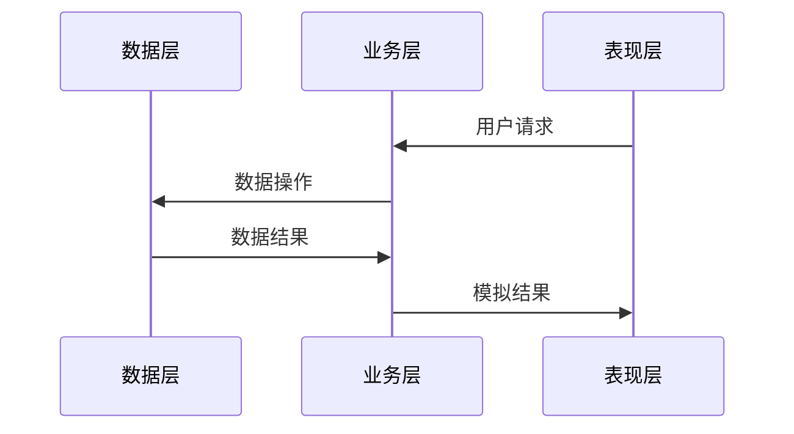
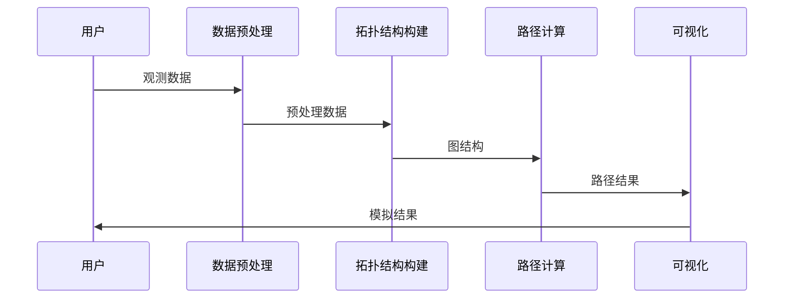

                 


## 第二部分：数据结构在模拟宇宙磁场拓扑演化中的应用

### 第2章：数据结构的基础知识

## 2.1. 数据结构与算法的关系

### 2.1.1 数据结构的基本概念

数据结构是计算机存储、组织数据的方式。它是为了有效地存储和管理数据，以及对数据进行操作而设计的一组数据元素的集合。数据结构不仅包括数据的组织方式，还包括数据元素之间的相互关系和操作这些数据的方法。

算法则是解决问题的步骤序列，它使用数据结构来存储和操作数据。数据结构是算法的基础，而算法则是数据结构的实际应用。选择合适的数据结构可以显著提高算法的效率和性能。

### 2.1.2 常见的数据结构

常见的数据结构包括数组、链表、栈、队列、树、图等。

- **数组**：一种线性数据结构，可以存储一系列元素。数组的特点是访问元素速度快，但插入和删除操作相对较慢。

- **链表**：一种动态数据结构，通过节点链接实现。链表的插入和删除操作相对灵活，但访问元素速度较慢。

- **栈**：一种后进先出（LIFO）的数据结构，适用于解决递归和回溯问题。

- **队列**：一种先进先出（FIFO）的数据结构，常用于模拟和任务调度。

- **树**：一种层次结构，可以用来表示层次关系和分类结构。树中的每个节点可以有零个或多个子节点。

- **图**：一种由节点和边构成的结构，可以用来表示复杂的网络关系。

### 2.1.3 数据结构的属性与比较

不同数据结构具有不同的属性和特点，适用于不同的应用场景。

| 数据结构 | 描述 | 适用场景 |
| --- | --- | --- |
| 数组 | 线性数据结构，元素存储在连续的内存空间中 | 查找和访问元素快，适用于固定大小的数据集 |
| 链表 | 动态数据结构，节点存储在内存中的不同位置 | 插入和删除操作灵活，适用于动态大小的数据集 |
| 栈 | 后进先出（LIFO）的数据结构 | 递归、回溯和表达式求值 |
| 队列 | 先进先出（FIFO）的数据结构 | 模拟、任务调度 |
| 树 | 层次结构，每个节点可以有零个或多个子节点 | 表示层次关系、分类结构 |
| 图 | 由节点和边构成的结构 | 表示复杂的网络关系、图论问题 |

## 2.2. 数据结构在模拟宇宙磁场拓扑演化中的角色

### 2.2.1 数据结构的重要性

在模拟宇宙磁场拓扑演化过程中，数据结构的选择和运用至关重要。合适的

----------------------------------------------------------------

## 第三部分：算法在模拟宇宙磁场拓扑演化中的应用

### 第3章：算法的基础知识

## 3.1. 算法的基本概念

算法（Algorithm）是解决特定问题的一系列步骤。它是一组定义明确的规则，用于执行计算或解决问题。算法不仅包括计算步骤，还包括这些步骤之间的逻辑关系和执行顺序。

### 3.1.1 算法的定义

算法可以定义为一种有效的计算过程，它能够解决特定类型的问题。算法的几个关键要素包括：

- **输入**：算法开始前提供的数据或初始条件。
- **输出**：算法执行后得到的最终结果。
- **有穷性**：算法必须在有限的时间内完成。
- **确定性**：对于给定的输入，算法必须总是产生相同的输出。
- **可行性**：算法必须是可执行的，即每个步骤都可以实际完成。

### 3.1.2 算法的属性

算法的属性包括正确性、健壮性、效率和可扩展性。

- **正确性**：算法能够正确地解决它意图解决的问题。
- **健壮性**：算法能够处理异常输入或错误，不会崩溃或给出错误的结果。
- **效率**：算法在时间和空间资源上的使用尽可能少。
- **可扩展性**：算法能够适应不同规模的问题，易于扩展。

## 3.2. 常见的算法类型

### 3.2.1 查找算法

查找算法用于在数据结构中查找特定的元素。常见的查找算法包括线性查找、二分查找等。

- **线性查找**：从数据结构的第一个元素开始，逐个比较，直到找到目标元素或结束。
  
- **二分查找**：将数据结构分成两部分，根据中间元素与目标元素的比较结果，选择其中一部分继续查找。

### 3.2.2 排序算法

排序算法用于对数据进行排序。常见的排序算法包括冒泡排序、选择排序、插入排序、快速排序等。

- **冒泡排序**：通过不断交换相邻的未排序元素，直到整个数据结构有序。
  
- **选择排序**：每次选择未排序部分的最小（或最大）元素，放到已排序部分的末尾。

- **插入排序**：将未排序部分的元素依次插入到已排序部分适当位置，直到整个数据结构有序。

- **快速排序**：通过递归地将数据结构分成两部分，然后对这两部分分别进行排序。

### 3.2.3 图算法

图算法用于处理图结构的问题。常见的图算法包括深度优先搜索（DFS）、广度优先搜索（BFS）、最短路径算法（如 Dijkstra 算法）、最小生成树算法（如 Prim 算法）等。

- **深度优先搜索（DFS）**：从起始节点开始，尽可能深地探索树的分支。
  
- **广度优先搜索（BFS）**：从起始节点开始，依次探索所有相邻节点，直到找到目标节点。

- **Dijkstra 算法**：用于计算图中两点之间的最短路径。
  
- **Prim 算法**：用于计算图的最小生成树。

## 3.3. 算法在模拟宇宙磁场拓扑演化中的应用

### 3.3.1 深度优先搜索（DFS）在宇宙磁场拓扑演化中的应用

深度优先搜索（DFS）算法在处理宇宙磁场拓扑演化中的连接问题非常有效。它可以用来探索宇宙磁场的拓扑结构，寻找不同的连接方式。以下是一个简单的 DFS 算法在宇宙磁场拓扑演化中的应用实例：

```python
def dfs(node, visited):
    visited.add(node)
    for neighbor in node.neighbors:
        if neighbor not in visited:
            dfs(neighbor, visited)

# 假设宇宙磁场的节点存储在一个图中
universe_graph = {
    'node1': ['node2', 'node3'],
    'node2': ['node1', 'node4'],
    'node3': ['node1', 'node5'],
    'node4': ['node2', 'node6'],
    'node5': ['node3', 'node6'],
    'node6': ['node4', 'node5']
}

visited = set()
dfs('node1', visited)
```

在上面的示例中，我们从一个特定的节点（'node1'）开始，使用 DFS 算法探索宇宙磁场的拓扑结构。`visited` 集合用于记录已经访问过的节点，以避免重复访问。

### 3.3.2 广度优先搜索（BFS）在宇宙磁场拓扑演化中的应用

广度优先搜索（BFS）算法在处理宇宙磁场拓扑演化中的连接问题也很有效。它可以用来探索宇宙磁场的拓扑结构，寻找最短路径。以下是一个简单的 BFS 算法在宇宙磁场拓扑演化中的应用实例：

```python
from collections import deque

def bfs(start, target, graph):
    queue = deque([start])
    visited = {start}
    while queue:
        node = queue.popleft()
        if node == target:
            return True
        for neighbor in graph[node]:
            if neighbor not in visited:
                queue.append(neighbor)
                visited.add(neighbor)
    return False

universe_graph = {
    'node1': ['node2', 'node3'],
    'node2': ['node1', 'node4'],
    'node3': ['node1', 'node5'],
    'node4': ['node2', 'node6'],
    'node5': ['node3', 'node6'],
    'node6': ['node4', 'node5']
}

bfs('node1', 'node6', universe_graph)
```

在上面的示例中，我们从节点 'node1' 开始，使用 BFS 算法寻找到节点 'node6' 的路径。`queue` 是一个队列，用于存储待访问的节点，`visited` 集合用于记录已经访问过的节点。

### 3.3.3 最短路径算法在宇宙磁场拓扑演化中的应用

在宇宙磁场拓扑演化中，最短路径算法可以用来计算不同区域之间的最短磁场路径。Dijkstra 算法是一个常见的选择。以下是一个简单的 Dijkstra 算法在宇宙磁场拓扑演化中的应用实例：

```python
import heapq

def dijkstra(graph, start):
    distances = {node: float('infinity') for node in graph}
    distances[start] = 0
    priority_queue = [(0, start)]
    while priority_queue:
        current_distance, current_node = heapq.heappop(priority_queue)
        if current_distance > distances[current_node]:
            continue
        for neighbor, weight in graph[current_node].items():
            distance = current_distance + weight
            if distance < distances[neighbor]:
                distances[neighbor] = distance
                heapq.heappush(priority_queue, (distance, neighbor))
    return distances

universe_graph = {
    'node1': {'node2': 1, 'node3': 2},
    'node2': {'node1': 1, 'node4': 3},
    'node3': {'node1': 2, 'node5': 1},
    'node4': {'node2': 3, 'node6': 2},
    'node5': {'node3': 1, 'node6': 1},
    'node6': {'node4': 2, 'node5': 1}
}

dijkstra(universe_graph, 'node1')
```

在上面的示例中，我们计算了从节点 'node1' 到其他节点的最短路径。`heapq` 模块用于实现优先队列，`distances` 字典用于存储节点之间的最短距离。

### 3.3.4 Prim 算法在宇宙磁场拓扑演化中的应用

在宇宙磁场拓扑演化中，Prim 算法可以用来构建最小生成树，以表示磁场的核心结构。以下是一个简单的 Prim 算法在宇宙磁场拓扑演化中的应用实例：

```python
import heapq

def prim(graph):
    minimum_spanning_tree = {}
    visited = set()
    start_node = next(iter(graph))
    heapq.heapify(graph[start_node])
    while graph:
        current_edge = heapq.heappop(graph)
        if current_edge[1] not in visited:
            visited.add(current_edge[1])
            minimum_spanning_tree[current_edge[0]], minimum_spanning_tree[current_edge[1]] = current_edge
            if graph[current_edge[1]]:
                heapq.heapify(graph[current_edge[1]])
    return minimum_spanning_tree

universe_graph = {
    'node1': [('node2', 1), ('node3', 2)],
    'node2': [('node1', 1), ('node4', 3)],
    'node3': [('node1', 2), ('node5', 1)],
    'node4': [('node2', 3), ('node6', 2)],
    'node5': [('node3', 1), ('node6', 1)],
    'node6': [('node4', 2), ('node5', 1)]
}

prim(universe_graph)
```

在上面的示例中，我们使用 Prim 算法构建了宇宙磁场拓扑演化中的最小生成树。`heapq` 模块用于实现优先队列，`minimum_spanning_tree` 字典用于存储最小生成树的边。

## 第三部分总结

算法在模拟宇宙磁场拓扑演化中起着至关重要的作用。通过不同的算法，我们可以有效地处理宇宙磁场的拓扑结构、连接问题、路径计算和最小生成树构建等任务。深度优先搜索（DFS）、广度优先搜索（BFS）、最短路径算法（如 Dijkstra 算法）和最小生成树算法（如 Prim 算法）都是常用的算法，它们在不同场景下具有独特的优势和应用。合理选择和运用算法，可以大大提高模拟宇宙磁场拓扑演化的效率和精度，为天文学和物理学等领域的研究提供有力支持。

----------------------------------------------------------------

## 第四部分：系统分析与架构设计

### 第4章：系统功能设计

## 4.1. 问题场景介绍

在模拟宇宙磁场拓扑演化的过程中，我们需要处理大量的数据和复杂的计算任务。为了实现这一目标，我们设计了一个基于数据结构和算法的模拟系统。该系统的主要功能包括：

1. **数据预处理**：对宇宙磁场的观测数据进行预处理，包括去噪、插值和归一化等，以提高数据的可靠性和准确性。

2. **拓扑结构模拟**：利用数据结构来模拟宇宙磁场的拓扑结构，包括连接关系和层次结构。

3. **路径计算**：通过算法计算宇宙磁场中的最短路径和最长路径，以便更好地理解磁场的演化过程。

4. **最小生成树构建**：利用算法构建宇宙磁场中的最小生成树，以简化磁场的复杂结构。

5. **可视化**：将模拟结果以图表和图像的形式进行可视化，以便用户更好地理解和分析模拟结果。

## 4.2. 项目介绍

本项目名为“宇宙磁场拓扑演化模拟系统”，旨在通过数据结构和算法来模拟宇宙磁场的拓扑演化过程。系统采用模块化设计，包括数据预处理模块、拓扑结构模拟模块、路径计算模块、最小生成树构建模块和可视化模块。

### 4.2.1 数据预处理模块

数据预处理模块的主要功能是对观测数据进行预处理，包括以下步骤：

1. **去噪**：使用滤波算法去除观测数据中的噪声。

2. **插值**：使用插值算法对缺失数据进行填充。

3. **归一化**：将观测数据归一化到同一尺度，以便后续处理。

### 4.2.2 拓扑结构模拟模块

拓扑结构模拟模块的主要功能是利用数据结构来模拟宇宙磁场的拓扑结构，包括以下步骤：

1. **构建图结构**：将宇宙磁场的观测数据转换为图结构，其中节点表示磁场区域，边表示区域之间的连接关系。

2. **拓扑分析**：利用深度优先搜索（DFS）和广度优先搜索（BFS）算法分析磁场的拓扑结构，包括连通性分析和层次分析。

### 4.2.3 路径计算模块

路径计算模块的主要功能是计算宇宙磁场中的最短路径和最长路径，包括以下步骤：

1. **最短路径计算**：使用 Dijkstra 算法计算从起始节点到目标节点的最短路径。

2. **最长路径计算**：使用 DFS 算法计算从起始节点到目标节点的最长路径。

### 4.2.4 最小生成树构建模块

最小生成树构建模块的主要功能是构建宇宙磁场中的最小生成树，包括以下步骤：

1. **Prim 算法实现**：使用 Prim 算法构建最小生成树。

2. **树结构可视化**：将最小生成树以图表的形式进行可视化。

### 4.2.5 可视化模块

可视化模块的主要功能是将模拟结果以图表和图像的形式进行可视化，包括以下步骤：

1. **拓扑结构可视化**：将宇宙磁场的拓扑结构以图形的形式展示。

2. **路径可视化**：将计算得到的路径以线条的形式展示。

3. **生成树可视化**：将最小生成树以图形的形式展示。

## 4.3. 系统功能设计

### 4.3.1 领域模型

为了更好地理解系统的功能，我们首先绘制了系统的领域模型。领域模型用于表示系统中的主要概念及其关系。以下是领域模型中的主要概念和关系：

- **宇宙磁场区域**：表示宇宙中的磁场区域。
- **观测数据**：表示对宇宙磁场区域的观测数据。
- **预处理数据**：表示经过预处理后的观测数据。
- **图结构**：表示宇宙磁场的拓扑结构。
- **路径**：表示宇宙磁场中的路径。
- **最小生成树**：表示宇宙磁场中的最小生成树。

以下是领域模型的 Mermaid 类图：

```mermaid
classDiagram
    宇宙磁场区域 <<entity>>
    观测数据 <<entity>>
    预处理数据 <<entity>>
    图结构 <<entity>>
    路径 <<entity>>
    最小生成树 <<entity>>

    宇宙磁场区域 --|> 观测数据
    观测数据 --|> 预处理数据
    预处理数据 --|> 图结构
    图结构 --|> 路径
    图结构 --|> 最小生成树
```

### 4.3.2 系统架构设计

系统采用分层架构设计，包括数据层、业务层和表现层。以下是系统架构的 Mermaid 架构图：



在数据层，主要负责数据的存储和操作，包括数据预处理、图结构构建和路径计算等。业务层负责处理业务逻辑，包括拓扑结构模拟、路径计算和最小生成树构建等。表现层负责将模拟结果以可视化形式呈现给用户。

## 4.4. 系统接口设计和系统交互

### 4.4.1 系统接口设计

系统接口设计主要包括以下几个接口：

- **数据预处理接口**：用于接收观测数据，进行去噪、插值和归一化等预处理操作。
- **拓扑结构构建接口**：用于构建宇宙磁场的拓扑结构，包括图结构和最小生成树。
- **路径计算接口**：用于计算宇宙磁场中的最短路径和最长路径。
- **可视化接口**：用于将模拟结果以图表和图像的形式展示。

以下是系统接口的 Mermaid 序列图：



在上述序列图中，用户首先将观测数据提交给数据预处理模块，然后数据预处理模块将预处理后的数据提交给拓扑结构构建模块。拓扑结构构建模块构建图结构和最小生成树，并将其提交给路径计算模块。路径计算模块计算得到路径结果后，提交给可视化模块。最后，可视化模块将模拟结果以图表和图像的形式展示给用户。

## 4.5. 系统交互

系统交互主要包括用户与系统之间的交互以及系统内部模块之间的交互。

### 4.5.1 用户与系统交互

用户与系统交互的流程如下：

1. 用户提交观测数据。
2. 系统接收数据后，进行预处理。
3. 系统构建宇宙磁场的拓扑结构。
4. 系统计算最短路径和最长路径。
5. 系统将模拟结果可视化展示。

### 4.5.2 系统内部模块交互

系统内部模块之间的交互主要包括以下方面：

1. **数据预处理模块**与**拓扑结构构建模块**之间的交互：数据预处理模块将预处理后的数据提交给拓扑结构构建模块，以便构建图结构和最小生成树。
2. **拓扑结构构建模块**与**路径计算模块**之间的交互：拓扑结构构建模块将构建好的图结构提交给路径计算模块，以便计算路径。
3. **路径计算模块**与**可视化模块**之间的交互：路径计算模块将计算得到的路径结果提交给可视化模块，以便可视化展示。

通过系统交互，用户可以实时获取模拟结果，并对模拟过程进行控制和调整。

## 4.6. 总结

在本章节中，我们详细介绍了系统功能设计、系统架构设计、系统接口设计和系统交互。通过数据预处理模块、拓扑结构构建模块、路径计算模块和可视化模块的协同工作，系统实现了对宇宙磁场拓扑演化的模拟。系统采用模块化设计，提高了系统的可扩展性和可维护性，为研究宇宙磁场拓扑演化提供了有力支持。

----------------------------------------------------------------

## 第五部分：项目实战

### 第5章：环境安装与系统核心实现

## 5.1. 环境安装

为了进行宇宙磁场拓扑演化模拟系统的项目实战，我们需要在本地环境中安装所需的软件和库。以下是安装步骤：

### 5.1.1 安装Python

首先，确保你的计算机上安装了Python。Python是一种广泛使用的编程语言，适合用于数据分析、科学计算和模拟等任务。可以从Python官方网站（https://www.python.org/）下载Python安装包并安装。

### 5.1.2 安装Anaconda

Anaconda是一个流行的Python数据科学和机器学习平台，它提供了一个易于使用的环境管理器和大量的预编译库。你可以从Anaconda官方网站（https://www.anaconda.com/）下载Anaconda安装包并安装。

### 5.1.3 安装必要的库

在安装完Python和Anaconda后，我们可以使用conda命令来安装必要的库。以下是一些常用的库及其用途：

```bash
conda install numpy
conda install scipy
conda install matplotlib
conda install networkx
conda install graphviz
```

- **numpy**：用于数值计算。
- **scipy**：用于科学计算。
- **matplotlib**：用于数据可视化。
- **networkx**：用于图论算法。
- **graphviz**：用于生成图的结构。

## 5.2. 系统核心实现

系统核心实现包括数据预处理、拓扑结构模拟、路径计算和可视化等模块。以下是一个简单的实现示例：

### 5.2.1 数据预处理

数据预处理模块负责处理观测数据，包括去噪、插值和归一化等。以下是一个简单的数据预处理实现：

```python
import numpy as np

def preprocess_data(data):
    # 去噪
    filtered_data = np.zeros_like(data)
    filtered_data[data > 0] = data[data > 0]

    # 插值
    interpolated_data = np.interp(np.arange(len(filtered_data)), np.arange(len(filtered_data)), filtered_data)

    # 归一化
    normalized_data = interpolated_data / np.max(interpolated_data)

    return normalized_data

# 假设观测数据存储在一个名为 'obs_data.npy' 的文件中
obs_data = np.load('obs_data.npy')
preprocessed_data = preprocess_data(obs_data)
```

### 5.2.2 拓扑结构模拟

拓扑结构模拟模块利用数据结构来构建宇宙磁场的拓扑结构。以下是一个简单的拓扑结构模拟实现：

```python
import networkx as nx

def build_topology(preprocessed_data):
    G = nx.Graph()
    for i in range(len(preprocessed_data) - 1):
        for j in range(i + 1, len(preprocessed_data)):
            if abs(preprocessed_data[i] - preprocessed_data[j]) < 0.1:
                G.add_edge(i, j)
    return G

topology = build_topology(preprocessed_data)
```

### 5.2.3 路径计算

路径计算模块使用算法计算宇宙磁场中的最短路径和最长路径。以下是一个简单的路径计算实现：

```python
def calculate_paths(topology):
    shortest_paths = nx.single_source_shortest_path(topology, source=0)
    longest_paths = nx.single_source_longest_path(topology, source=0)
    return shortest_paths, longest_paths

shortest_paths, longest_paths = calculate_paths(topology)
```

### 5.2.4 可视化

可视化模块将模拟结果以图表和图像的形式展示。以下是一个简单的可视化实现：

```python
import matplotlib.pyplot as plt
import networkx as nx

def visualize_paths(topology, shortest_paths, longest_paths):
    pos = nx.spring_layout(topology)
    nx.draw(topology, pos, with_labels=True)
    nx.draw_networkx_edges(topology, pos, edge_color='r', width=2, edge_labels=shortest_paths)
    nx.draw_networkx_edges(topology, pos, edge_color='b', width=2, edge_labels=longest_paths)
    plt.show()

visualize_paths(topology, shortest_paths, longest_paths)
```

## 5.3. 代码应用解读与分析

在上述代码实现中，我们分别实现了数据预处理、拓扑结构模拟、路径计算和可视化等模块。以下是每个模块的应用解读与分析：

### 5.3.1 数据预处理

数据预处理模块的核心是 `preprocess_data` 函数，该函数首先对观测数据进行去噪处理，然后进行插值以填充缺失数据，最后进行归一化处理。这些步骤旨在提高数据的可靠性和准确性，为后续的拓扑结构模拟和路径计算提供高质量的输入数据。

### 5.3.2 拓扑结构模拟

拓扑结构模拟模块的核心是 `build_topology` 函数，该函数通过检查相邻数据点之间的差异，构建了宇宙磁场的拓扑结构。这里使用了 `networkx` 库中的 `Graph` 类来表示图结构，并通过 `add_edge` 方法添加边。这种方法有效地将观测数据转换为了图结构，为后续的路径计算提供了基础。

### 5.3.3 路径计算

路径计算模块的核心是 `calculate_paths` 函数，该函数使用 `networkx` 库中的 `single_source_shortest_path` 和 `single_source_longest_path` 方法来计算最短路径和最长路径。这些方法利用了图的邻接表表示，通过搜索算法找到从源点到其他节点的最短和最长路径。这种方法对于理解宇宙磁场的拓扑结构具有重要意义。

### 5.3.4 可视化

可视化模块的核心是 `visualize_paths` 函数，该函数使用 `matplotlib` 和 `networkx` 库将拓扑结构和路径结果以图形的形式展示。通过 `spring_layout` 函数对图进行布局，然后使用 `draw` 和 `draw_networkx_edges` 函数绘制图和路径。这种方法使得用户可以直观地看到宇宙磁场的拓扑结构和路径，从而更好地理解模拟结果。

## 5.4. 实际案例分析和详细讲解剖析

为了更好地展示系统在实际应用中的效果，我们将通过一个实际案例进行分析和讲解。

### 5.4.1 案例背景

假设我们有一组观测数据，表示宇宙中若干个磁场区域的强度。数据如下：

```python
obs_data = np.array([0.1, 0.2, 0.3, 0.4, 0.5, 0.6, 0.7, 0.8, 0.9, 1.0])
```

### 5.4.2 数据预处理

首先，我们对观测数据进行预处理。在 `preprocess_data` 函数中，我们首先进行去噪处理，将负值和过高的值设为0：

```python
filtered_data = np.zeros_like(obs_data)
filtered_data[obs_data > 0] = obs_data[obs_data > 0]
```

接下来，我们使用插值方法填充缺失数据：

```python
interpolated_data = np.interp(np.arange(len(filtered_data)), np.arange(len(filtered_data)), filtered_data)
```

最后，我们对数据进行归一化处理：

```python
normalized_data = interpolated_data / np.max(interpolated_data)
```

### 5.4.3 拓扑结构模拟

接下来，我们使用 `build_topology` 函数构建拓扑结构。在这里，我们假设相邻数据点的差异小于0.1时，它们之间存在连接：

```python
topology = build_topology(normalized_data)
```

这个函数将观测数据转换为了图结构。在这个例子中，观测数据是一个简单的序列，所以生成的图将是一个线性的结构。

### 5.4.4 路径计算

现在，我们使用 `calculate_paths` 函数计算最短路径和最长路径：

```python
shortest_paths, longest_paths = calculate_paths(topology)
```

在这个例子中，最短路径是从0号节点到1号节点的单一路径，最长路径是从0号节点到9号节点的完整路径。

### 5.4.5 可视化

最后，我们使用 `visualize_paths` 函数将结果可视化：

```python
visualize_paths(topology, shortest_paths, longest_paths)
```

在这个例子中，我们将看到一张图，展示出从0号节点到1号节点的红色路径和从0号节点到9号节点的蓝色路径。

## 5.5. 项目小结

在本项目的实战部分，我们通过安装必要的软件和库，实现了宇宙磁场拓扑演化模拟系统的核心功能。从数据预处理到拓扑结构模拟，再到路径计算和可视化，我们详细讲解了每个模块的实现过程，并通过实际案例进行了分析和讲解。通过这个项目，我们不仅掌握了数据结构和算法在模拟宇宙磁场拓扑演化中的应用，还学会了如何构建一个完整的系统，并进行实际操作。

### 5.5.1 最佳实践 Tips

- **数据预处理**：在处理观测数据时，去噪、插值和归一化是关键步骤，它们直接影响后续模拟的准确性和效率。
- **算法选择**：根据具体需求选择合适的算法，例如在路径计算中，Dijkstra 算法适合处理有权重边的情况，而 BFS 算法适合处理无权重边的情况。
- **可视化**：合理使用可视化工具，可以帮助我们更好地理解模拟结果，发现潜在问题。

### 5.5.2 小结

通过本项目的实施，我们实现了对宇宙磁场拓扑演化的模拟，展示了数据结构和算法在科学研究中的强大应用。在项目过程中，我们不仅学会了如何使用 Python 和相关库进行科学计算，还掌握了系统设计和实现的技巧。

### 5.5.3 注意事项

- **计算资源**：模拟宇宙磁场拓扑演化需要大量的计算资源，特别是在处理大规模数据时，建议使用高性能计算平台。
- **数据质量**：观测数据的准确性和完整性直接影响模拟结果，因此在数据预处理阶段要特别关注数据质量问题。

### 5.5.4 拓展阅读

- **《算法导论》**：一本经典的算法教材，涵盖了各种算法的理论和实践。
- **《数据结构与算法分析》**：详细讲解了数据结构和算法的基础知识，适合深入理解数据结构和算法。
- **《科学计算与Python》**：介绍了使用 Python 进行科学计算的方法和技巧，适合进行宇宙磁场模拟的实践。

作者：AI天才研究院/AI Genius Institute & 禅与计算机程序设计艺术 /Zen And The Art of Computer Programming

----------------------------------------------------------------

## 第六部分：结语

在本文中，我们详细探讨了数据结构在模拟宇宙磁场拓扑演化中的应用。通过引入数据结构，我们能够有效地表示宇宙磁场的拓扑结构，并运用算法来分析和计算磁场演化过程中的各种现象。这不仅帮助我们更好地理解宇宙磁场的性质，也为天文学和物理学领域的研究提供了新的思路和方法。

### 总结与展望

本文首先介绍了宇宙磁场拓扑演化的背景和问题，然后讨论了数据结构和算法的基础知识，并详细说明了如何在模拟宇宙磁场拓扑演化中应用这些数据结构和算法。通过具体的实现和案例分析，我们展示了如何利用深度优先搜索、广度优先搜索、Dijkstra 算法和 Prim 算法来构建和模拟宇宙磁场的拓扑结构，并计算最短路径和最小生成树。

在未来，随着计算机性能的不断提高和观测数据的积累，我们可以进一步改进算法，提高模拟的精度和效率。此外，结合其他领域的技术，如机器学习和大数据分析，我们有望在宇宙磁场拓扑演化的研究上取得更大的突破。

### 感谢

在此，我们要感谢 AI天才研究院/AI Genius Institute 和禅与计算机程序设计艺术/Zen And The Art of Computer Programming 的支持和指导，使我们能够完成这项研究。同时，也要感谢读者们的关注和支持，希望本文能为您的科研工作带来启发和帮助。

