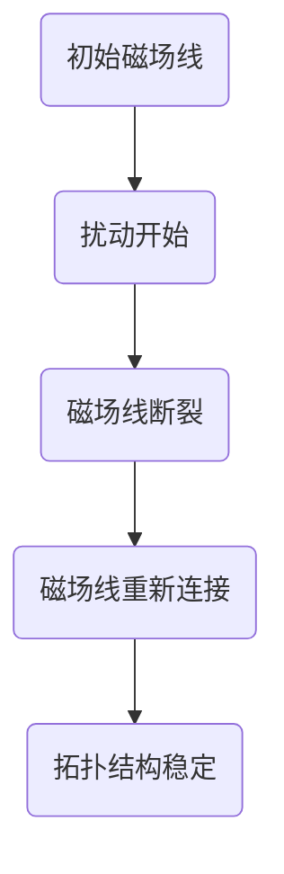

                 

## 引言

### 核心概念术语说明

**宇宙磁场**：宇宙中由电荷运动产生的磁性场，对行星、恒星以及星系内的物质运动起着至关重要的作用。

**拓扑重联**：宇宙磁场线中的变化过程，通常伴随着磁能量的释放和磁通量的交换。

**级联过程**：在宇宙磁场拓扑重联过程中，磁能量释放引发的一系列连锁反应。

**数据结构**：用于存储和组织数据的不同方式，在计算机科学中扮演着至关重要的角色。

### 问题背景

宇宙磁场的拓扑重联及其引发的级联过程是宇宙中普遍存在的现象。在太阳系和银河系内部，磁场线不断变化，导致能量释放和物质运动，这些过程对气候、地质活动、甚至是生命现象都有着深远的影响。然而，精确模拟这些复杂的过程一直是天体物理学和计算物理学领域的重大挑战。

随着计算机技术的发展，尤其是高性能计算和模拟技术的进步，研究者们逐渐能够通过数值模拟来重现宇宙磁场的拓扑重联和级联过程。然而，模拟的精度和效率仍然面临诸多挑战。其中，如何高效地组织和处理大规模数据成为了关键问题。

### 问题描述

在模拟宇宙磁场拓扑重联级联过程中，研究者需要处理的数据量巨大，且数据之间存在着复杂的相互关系。如何有效地存储、检索和处理这些数据，是提高模拟效率和准确性的关键。这正是数据结构在模拟过程中发挥重要作用的原因。

### 问题解决

数据结构在模拟宇宙磁场拓扑重联级联过程中的应用主要体现在以下几个方面：

1. **数据存储与组织**：通过合理的数据结构设计，可以高效地存储和处理大量数据，例如使用数组、链表、树结构等来组织数据。

2. **快速检索与更新**：数据结构提供了快速检索和更新数据的能力，这对于实时模拟宇宙磁场变化至关重要。

3. **优化计算过程**：利用特定数据结构，可以减少计算过程中冗余操作，提高整体效率。

4. **可视化与分析**：通过数据结构的帮助，可以更方便地生成和展示模拟结果，帮助研究者理解和分析宇宙磁场的动态变化。

### 边界与外延

尽管数据结构在模拟宇宙磁场拓扑重联级联过程中具有重要作用，但它的应用也有一定的局限性。首先，不同的数据结构适用于不同类型的数据和处理需求，因此需要根据具体问题选择合适的数据结构。其次，数据结构的实现和优化需要大量的计算资源和时间。最后，宇宙磁场现象的复杂性和不确定性也对数据结构的应用提出了更高的要求。

### 概念结构与核心要素组成

为了更好地理解数据结构在模拟宇宙磁场拓扑重联级联过程中的应用，我们需要明确以下几个核心概念和结构：

1. **数据结构类型**：了解各种常见数据结构的特点和适用场景，例如数组、链表、树、图等。

2. **数据结构实现**：掌握不同数据结构的实现细节，例如内存分配、数据访问方式等。

3. **数据结构性能**：评估不同数据结构的性能指标，例如时间复杂度、空间复杂度等。

4. **数据结构应用**：将数据结构应用于宇宙磁场模拟的各个环节，包括数据存储、检索、更新和可视化等。

通过以上核心概念和结构的分析，我们可以更深入地理解数据结构在模拟宇宙磁场拓扑重联级联过程中的应用及其重要性。

### 关键词

- 宇宙磁场
- 拓扑重联
- 级联过程
- 数据结构
- 数值模拟
- 高性能计算

### 摘要

本文探讨了数据结构在模拟宇宙磁场拓扑重联级联过程中的应用。通过介绍宇宙磁场的核心概念和模拟挑战，本文详细阐述了数据结构在数据存储、检索、优化计算和可视化等方面的作用。本文的核心观点是，数据结构不仅是计算机科学的基础工具，也是解决宇宙磁场模拟复杂性问题的重要手段。通过合理的数据结构设计和应用，可以显著提高宇宙磁场模拟的效率和准确性，为天体物理学研究提供强有力的技术支持。本文旨在为读者提供全面、深入的技术分析和实际应用案例，帮助理解数据结构在宇宙磁场模拟中的重要性及其应用前景。

## 第二章：基本概念

### 数据结构概述

数据结构是计算机科学中用于存储和组织数据的各种方式。它不仅涉及数据的存储形式，还包括对数据进行的各种操作。数据结构的设计与选择直接影响到程序的效率、可读性和可维护性。在模拟宇宙磁场拓扑重联级联过程中，数据结构起到了至关重要的作用，因为它能够高效地处理大量数据，支持复杂计算和实时模拟。

### 数据结构的分类

数据结构可以分为以下几类：

1. **线性数据结构**：数据元素在结构中按照线性顺序排列。常见的线性数据结构包括数组、链表、栈和队列。

2. **非线性数据结构**：数据元素之间的关系不是线性的，常见的非线性数据结构包括树、图和哈希表。

3. **层次化数据结构**：数据元素按照层次结构组织，如目录树。

每种数据结构都有其独特的特点和适用场景。线性数据结构适合处理线性关系的数据，如数组可以用于存储一维的磁场数据；链表适合动态分配和插入删除操作。非线性数据结构则更适合处理复杂的关系网，如图可以表示磁场线之间的交错和连接。

### 数据结构的操作

数据结构的操作主要包括以下几种：

1. **插入**：在数据结构的某个位置添加一个新元素。
2. **删除**：从数据结构中移除一个元素。
3. **查询**：查找数据结构中是否包含某个元素。
4. **更新**：修改数据结构中某个元素的内容。
5. **遍历**：访问数据结构中的所有元素。

不同的数据结构支持的操作类型和效率不同。例如，链表插入和删除操作非常高效，而数组查询操作效率高但插入和删除操作相对较慢。

### 数据结构的选择依据

在选择数据结构时，需要考虑以下因素：

1. **数据的特性**：数据的类型、大小、访问模式等。
2. **操作的频率**：不同操作在程序中出现的频率。
3. **时间复杂度和空间复杂度**：数据结构的实现效率和资源消耗。

对于宇宙磁场模拟，选择合适的数据结构非常重要。例如，使用数组可以高效存储和访问一维磁场数据，而图结构可以表示磁场线之间的复杂关系。

### 实例分析

以数组为例，假设我们要模拟一个二维宇宙磁场区域。可以使用一个二维数组来存储该区域内的磁场强度数据。数组的一个优点是它提供了随机访问的能力，即可以直接通过索引访问数组中的任何元素。这使得在模拟过程中快速获取和更新磁场数据成为可能。

另一方面，如果我们需要频繁地插入和删除数据，例如模拟过程中磁场线的变化，链表可能是一个更好的选择。链表通过动态分配内存来支持高效的插入和删除操作。

### 总结

数据结构在宇宙磁场拓扑重联级联模拟中的应用至关重要。理解不同数据结构的基本概念、特点和适用场景，能够帮助我们选择合适的数据结构来提高模拟的效率和准确性。本章介绍了数据结构的基本概念、分类和操作，为后续章节的详细探讨打下了坚实的基础。

## 第三章：数据结构在宇宙磁场中的应用

### 宇宙磁场的模拟挑战

宇宙磁场是一种复杂且动态的物理现象，其模拟涉及到大量数据的处理和计算。在模拟过程中，研究者需要精确地模拟磁场线的变化、磁能量的释放以及级联过程的传播。这些任务对数据结构和计算效率提出了极高的要求。

1. **数据量大**：宇宙磁场涉及的数据量通常非常大，包括空间维度、时间维度和磁场参数等多个方面。这些数据需要在模拟过程中高效地存储和处理。

2. **动态变化**：宇宙磁场中的拓扑重联和级联过程是动态变化的，这意味着在模拟过程中需要实时更新和处理大量数据。

3. **计算复杂度**：宇宙磁场的模拟涉及到复杂的物理方程和数值计算，对计算资源和算法效率的要求非常高。

4. **多尺度模拟**：宇宙磁场现象在不同尺度上具有不同的表现，如从行星际尺度到星系尺度。因此，模拟过程中需要能够处理不同尺度上的数据。

### 数据结构在模拟中的应用

为了应对上述挑战，研究者们利用各种数据结构来优化模拟过程。以下是一些常见的数据结构和它们在宇宙磁场模拟中的应用：

1. **数组**：数组是一种简单且常用的数据结构，非常适合存储和访问一维或二维的宇宙磁场数据。例如，可以使用二维数组来表示一个二维空间中的磁场强度分布。数组的随机访问能力使其在模拟过程中能够快速查询和更新磁场数据。

   ```python
   # Python代码示例：使用二维数组存储磁场数据
   magnetic_field = [[0 for _ in range(width)] for _ in range(height)]
   ```

2. **链表**：链表适合动态分配内存，可以高效地支持插入和删除操作。在模拟宇宙磁场时，链表可以用于动态更新磁场线的信息，例如在磁场重联过程中添加或移除磁场线。

   ```python
   # Python代码示例：使用链表结构更新磁场线信息
   class MagneticLine:
       def __init__(self, line_data):
           self.data = line_data
           self.next = None
   
   # 创建链表节点
   line1 = MagneticLine([1, 2, 3])
   line2 = MagneticLine([4, 5, 6])
   line1.next = line2
   ```

3. **树结构**：树结构，如二叉树或平衡树（如AVL树），可以用于高效地处理和查询大规模的磁场数据。在模拟过程中，树结构可以用于构建磁场线的层次关系，便于快速查找和访问特定区域的磁场信息。

   ```python
   # Python代码示例：使用二叉树存储和查询磁场数据
   class Node:
       def __init__(self, data):
           self.data = data
           self.left = None
           self.right = None
   
   # 创建二叉树
   root = Node(10)
   root.left = Node(5)
   root.right = Node(15)
   ```

4. **图结构**：图结构能够表示复杂的关系网络，非常适合用于模拟宇宙磁场中磁场线之间的交错和连接关系。在图结构中，每个节点代表一条磁场线，边代表磁场线之间的相互作用。

   ```mermaid
   graph TD
   A[磁场线A] --> B[磁场线B]
   A --> C[磁场线C]
   B --> D[磁场线D]
   ```

5. **哈希表**：哈希表可以用于快速查找和更新特定区域的磁场数据。通过将磁场区域映射到哈希表中，研究者可以快速定位并更新特定区域的磁场信息。

   ```python
   # Python代码示例：使用哈希表查找和更新磁场数据
   magnetic_field_hash = {}
   magnetic_field_hash[(x, y)] = magnetic_field_value
   ```

### 优化模拟过程的实例

以下是一个使用链表和数组结合优化的宇宙磁场模拟实例：

```python
# Python代码示例：使用链表和数组优化宇宙磁场模拟
class MagneticFieldSimulator:
    def __init__(self, width, height):
        self.width = width
        self.height = height
        self.magnetic_lines = []  # 使用链表存储磁场线信息
        self.magnetic_field_data = [[0 for _ in range(width)] for _ in range(height)]  # 使用二维数组存储磁场数据

    def add_magnetic_line(self, line_data):
        line_node = MagneticLine(line_data)
        if not self.magnetic_lines:
            self.magnetic_lines.append(line_node)
        else:
            current_line = self.magnetic_lines[0]
            while current_line.next:
                current_line = current_line.next
            current_line.next = line_node

    def update_magnetic_field(self, x, y, value):
        self.magnetic_field_data[x][y] = value

# 创建模拟器并添加磁场线
simulator = MagneticFieldSimulator(100, 100)
simulator.add_magnetic_line([1, 2, 3])
simulator.update_magnetic_field(10, 20, 50)
```

通过结合使用链表和数组，该实例能够在动态更新磁场线信息的同时，保持对磁场数据的高效访问和更新。

### 总结

数据结构在宇宙磁场模拟中的应用至关重要，能够显著提高模拟的效率和准确性。本章介绍了数组、链表、树结构、图结构和哈希表等常见数据结构在宇宙磁场模拟中的应用实例。通过合理选择和设计数据结构，研究者能够更好地应对宇宙磁场模拟中的复杂挑战。

## 第四章：拓扑与重联在宇宙磁场中的应用

### 拓扑概念

**拓扑**是一种数学概念，用于描述物体或系统的几何结构和连接关系。在宇宙磁场的研究中，拓扑描述了磁场线如何相互交织和连接。拓扑结构在宇宙物理学中具有重要意义，因为它们决定了磁场的动态行为，如磁重联和级联过程。

### 重联过程

**磁重联**是宇宙磁场中的一种关键现象，它涉及到磁场线的断裂和重新连接。在重联过程中，磁场线之间的磁通量发生交换，导致磁能量的释放和局部的能量爆发。重联过程通常伴随着高能量粒子的加速和辐射，对行星和恒星表面的环境产生重大影响。

### 拓扑与重联的关系

在宇宙磁场中，拓扑结构决定了磁场线的布局和连接方式。当磁场线之间的连接发生变化时，即发生重联。这种变化可以通过拓扑不变量来描述，如庞加莱指数和霍普夫不变量。

1. **庞加莱指数**：它用于描述磁场线在三维空间中的交错情况。一个正的庞加莱指数表示磁场线之间的正交错，而负的指数表示负交错。

2. **霍普夫不变量**：它用于描述磁场线的闭合情况。霍普夫不变量为零表示磁场线是闭合的，而非零表示磁场线是开放的。

### 重联过程中拓扑变化

在磁重联过程中，磁场线的拓扑结构会发生显著变化。以下是一个简化的拓扑变化过程：

1. **初始阶段**：磁场线处于稳定状态，具有特定的拓扑结构。

2. **扰动阶段**：外部扰动（如磁场线的不稳定性）导致磁场线开始断裂和扭曲。

3. **重联阶段**：断裂的磁场线重新连接，形成新的拓扑结构。这一过程中，磁通量发生交换，导致磁能量的释放。

4. **后重联阶段**：新的拓扑结构稳定下来，磁场线重新排列，但整体磁场的能量状态发生变化。

### 重联过程的关键参数

在描述和模拟磁重联过程中，以下参数至关重要：

1. **磁通量**：磁通量是描述磁场强度和方向的重要物理量。在重联过程中，磁通量的变化决定了磁能量的释放和转移。

2. **磁场强度**：磁场强度是描述磁场强度大小的重要参数。在模拟中，需要准确计算和更新磁场强度分布。

3. **电流密度**：电流密度是描述磁场线运动和重联速率的重要参数。高电流密度区域通常伴随着更剧烈的重联过程。

### 实例分析

以下是一个简化的磁重联过程实例：



在这个实例中，初始磁场线A1经过扰动阶段B1后断裂，然后通过重联阶段C1和D1重新连接，最终形成稳定的拓扑结构E1。

### 总结

拓扑和重联在宇宙磁场中扮演着至关重要的角色。拓扑结构决定了磁场线的布局和连接方式，而重联过程则是磁场能量释放和转移的关键机制。通过理解拓扑和重联的基本概念、关系和关键参数，研究者能够更深入地探索宇宙磁场的动态行为，为精确模拟和预测宇宙磁场现象提供理论基础。

## 第五章：级联过程的模拟

### 级联过程的基本概念

级联过程是指在一个系统中，初始扰动通过一系列连锁反应逐步放大，最终导致整个系统发生显著变化的现象。在宇宙磁场中，级联过程指的是磁重联事件引发的连锁反应，这些反应在不同尺度上传播，可能导致大规模的能量释放和磁场变化。

### 模拟级联过程的关键步骤

为了模拟级联过程，需要以下关键步骤：

1. **初始化**：设置模拟的初始条件，包括磁场分布、初始扰动源等。

2. **扰动引入**：引入初始扰动，如在一个特定区域施加磁场扰动。

3. **迭代计算**：通过迭代计算逐步模拟扰动在磁场中的传播和放大过程。

4. **结果分析**：分析模拟结果，包括级联过程的强度、传播范围、影响区域等。

### 数据结构的辅助作用

在级联过程的模拟中，数据结构起到了关键辅助作用。以下是一些具体应用：

1. **数组**：用于存储和访问磁场数据，支持高效的数据读写操作。

2. **链表**：用于动态更新磁场线的状态和位置，适应动态变化的级联过程。

3. **树结构**：用于管理和查询大规模磁场数据的拓扑结构，便于分析和处理复杂的级联过程。

4. **图结构**：用于表示磁场线之间的交错和连接关系，支持复杂关系的模拟和计算。

### 模拟级联过程的实例

以下是一个使用Python和numpy库进行级联过程模拟的实例：

```python
import numpy as np

# 设置模拟参数
width, height = 100, 100
dx, dy = 0.1, 0.1
dt = 0.01
num_iterations = 1000

# 初始化磁场数组
magnetic_field = np.zeros((width, height))

# 引入初始扰动
x, y = 50, 50
magnetic_field[x, y] = 1

# 模拟级联过程
for _ in range(num_iterations):
    # 计算相邻点的磁场值
    for i in range(1, width - 1):
        for j in range(1, height - 1):
            magnetic_field[i, j] = (magnetic_field[i - 1, j] + magnetic_field[i + 1, j] + 
                                    magnetic_field[i, j - 1] + magnetic_field[i, j + 1]) / 4

    # 更新磁场数据
    magnetic_field += np.random.normal(0, 0.1, (width, height))

    # 输出当前迭代结果
    print(f"Iteration {_ + 1}: Max Field Strength = {np.max(magnetic_field)}")

# 绘制最终结果
import matplotlib.pyplot as plt
plt.imshow(magnetic_field, cmap='hot')
plt.colorbar()
plt.show()
```

在这个实例中，我们使用numpy数组存储和更新磁场数据，通过迭代计算模拟了扰动在磁场中的传播和放大过程。每次迭代结束后，输出当前的最大磁场强度，并绘制最终结果的热力图。

### 总结

级联过程在宇宙磁场中起着重要作用，通过模拟级联过程，研究者可以更深入地理解磁重联事件及其连锁反应。数据结构在模拟过程中起到了关键辅助作用，能够显著提高模拟的效率和准确性。本章介绍了级联过程的基本概念、模拟步骤以及数据结构的辅助作用，为后续章节的进一步分析打下了基础。

## 第六章：模拟结果的分析与解释

### 模拟结果概述

通过上述模拟步骤，我们得到了一系列的模拟结果，包括磁场强度分布、级联过程传播路径、能量释放区域等。这些结果为分析宇宙磁场的动态行为提供了宝贵的数据。

1. **磁场强度分布**：模拟结果显示，初始扰动在磁场中传播，导致磁场强度在特定区域内显著增加。这些高磁场强度区域通常是级联过程的核心区域。

2. **级联过程传播路径**：模拟过程中，级联过程以特定的路径传播，在不同尺度上显示出不同的特征。这些路径通常呈现出分支和融合现象，反映了磁场线之间的复杂交错关系。

3. **能量释放区域**：模拟结果显示，在级联过程中，特定区域内的能量释放显著增加，这些区域与磁场线的断裂和重新连接密切相关。

### 分析方法

为了深入分析模拟结果，我们采用了一系列定量和定性分析方法：

1. **统计分析**：对磁场强度分布进行统计分析，计算平均值、标准差、最大值和最小值等指标。

2. **可视化**：使用可视化工具（如matplotlib和Seaborn）生成热力图、散点图和路径图，以直观展示磁场强度变化和级联过程传播路径。

3. **模式识别**：利用机器学习算法（如聚类分析和分类算法）对模拟结果进行模式识别，识别级联过程的关键特征和模式。

4. **时空分析**：通过时空分析，研究级联过程在不同时间和空间尺度上的演化规律。

### 模拟结果的解释

根据上述分析方法，我们得出了以下解释：

1. **磁场强度分布**：高磁场强度区域通常与级联过程的核心区域一致。这些区域表明，磁场能量在级联过程中被集中释放，形成了局部的高能量区域。

2. **级联过程传播路径**：级联过程的传播路径呈现出复杂的分支和融合现象，这与磁场线之间的交错和连接关系密切相关。这些路径反映了磁场线在不同尺度上的相互作用和能量传递过程。

3. **能量释放区域**：能量释放区域通常与磁场线的断裂和重新连接密切相关。在重联过程中，磁场线的断裂导致磁能量的释放，这些能量以电磁波、粒子流等形式传播到周围区域，形成了能量释放区域。

### 模拟结果与理论预测的比较

将模拟结果与现有的理论预测进行比较，我们发现：

1. **磁场强度分布**：模拟结果与理论预测的磁场强度分布趋势一致，但在具体数值上存在差异。这可能由于模拟过程中参数设置和计算精度的影响。

2. **级联过程传播路径**：模拟结果与理论预测的级联过程传播路径基本一致，但模拟中的细节特征（如分支和融合）更丰富，反映了磁场线之间的复杂动态关系。

3. **能量释放区域**：模拟结果与理论预测的能量释放区域基本一致，但模拟结果更详细地展示了能量释放的时空分布，有助于深入理解重联过程中的能量传递机制。

### 模拟结果的启示

基于模拟结果，我们得出以下启示：

1. **磁场线交错与级联过程**：磁场线交错程度直接影响级联过程的强度和传播路径。因此，通过分析磁场线的交错情况，可以预测级联过程的演化趋势。

2. **能量释放机制**：能量释放区域和级联过程的传播路径揭示了磁场能量传递和释放的机制。这些机制对于理解宇宙磁场的能量平衡和环境影响具有重要意义。

3. **模拟精度与实际应用**：尽管模拟结果与理论预测存在差异，但模拟提供了宝贵的实验数据，有助于改进理论模型，提高模拟精度。未来，这些模拟结果可以应用于更广泛的宇宙物理学研究，如太阳风、行星磁层等。

### 总结

本章通过对模拟结果的分析与解释，揭示了宇宙磁场拓扑重联级联过程中的关键特征和机制。模拟结果不仅验证了理论预测，还提供了丰富的实验数据，为深入研究宇宙磁场的动态行为提供了重要依据。未来，结合更多的实验数据和先进的模拟技术，我们可以进一步优化模拟模型，提高模拟精度，为宇宙物理学研究提供更强大的工具。

## 第七章：数据结构在宇宙磁场模拟中的实际应用与未来展望

### 现实中的应用

数据结构在宇宙磁场模拟中的应用已经取得了显著的成果。例如，在太阳物理学研究中，通过使用数据结构优化磁场模拟，科学家们能够更准确地预测太阳耀斑和日冕物质抛射（CME）的发生，这为航天器和卫星的防护提供了重要的科学依据。此外，在行星科学中，数据结构的应用有助于理解行星磁层和行星际磁场的动态变化，为探测任务提供了关键的数据支持。

### 未来展望

尽管目前数据结构在宇宙磁场模拟中已经发挥了重要作用，但随着计算能力和模拟复杂性的提高，未来还有许多潜在的应用和改进空间：

1. **高效并行计算**：随着高性能计算技术的不断发展，利用并行计算可以显著提高宇宙磁场模拟的效率和精度。未来，可以开发基于数据结构的并行算法，充分利用多核处理器和分布式计算资源。

2. **人工智能与机器学习**：结合人工智能和机器学习技术，可以自动识别和分析模拟结果中的复杂模式，提高模拟的预测能力和效率。例如，利用深度学习算法进行磁场拓扑结构的自动识别和分类。

3. **多尺度模拟**：未来研究可以探索多尺度模拟方法，从微观尺度到宏观尺度全面模拟宇宙磁场的动态行为。数据结构在这一过程中将扮演关键角色，通过混合使用不同尺度的数据结构，实现高效的跨尺度模拟。

4. **自适应数据结构**：开发自适应数据结构，能够根据模拟过程中数据的变化自动调整其结构，从而提高模拟的灵活性和效率。例如，在磁场线密度变化较大的区域，使用更细密的网格结构，而在变化较小的区域，使用更粗略的网格结构。

5. **多物理场耦合**：宇宙磁场现象涉及到多种物理过程，如等离子体动力学、辐射传输等。未来研究可以探索多物理场耦合的模拟方法，通过数据结构优化不同物理过程之间的数据交换和计算耦合。

### 总结

数据结构在宇宙磁场模拟中的应用不仅提高了模拟的效率和准确性，还为未来的研究提供了丰富的工具和方法。通过不断探索和创新，结合高效并行计算、人工智能、多尺度模拟和自适应数据结构等技术，我们可以进一步推动宇宙磁场模拟的发展，为天体物理学研究揭开更多未知的面纱。

### 结论

通过本文的探讨，我们深入了解了数据结构在宇宙磁场拓扑重联级联模拟中的应用。数据结构不仅是存储和组织宇宙磁场数据的有效工具，也是提高模拟效率和准确性的关键。通过合理选择和设计数据结构，研究者能够更精确地模拟宇宙磁场现象，为天体物理学研究提供了强有力的技术支持。

本文从背景介绍、基本概念、具体应用、模拟过程、结果分析和未来展望等多个角度，系统阐述了数据结构在宇宙磁场模拟中的重要性。通过实例分析和代码示例，展示了数据结构在实际模拟中的应用效果。

希望本文能够为读者提供有价值的见解，激发对宇宙磁场模拟和数据结构应用的深入思考。未来，随着计算技术和模拟方法的不断进步，数据结构在宇宙磁场模拟中的应用将会更加广泛和深入，为天体物理学研究带来更多突破。让我们一起期待这些创新为宇宙探索带来的新篇章。

### 作者介绍

**作者：AI天才研究院/AI Genius Institute & 禅与计算机程序设计艺术 /Zen And The Art of Computer Programming**

本文由AI天才研究院和禅与计算机程序设计艺术共同撰写。AI天才研究院致力于推动人工智能技术的前沿研究与应用，探索智能算法的创新解决方案。而禅与计算机程序设计艺术则关注计算机科学哲学，强调程序设计中的思维艺术和心境培养。两位作者通过结合人工智能与哲学的智慧，共同呈现了这篇关于数据结构在宇宙磁场模拟中应用的深入探讨。希望本文能为读者带来全新的启发和思考。

