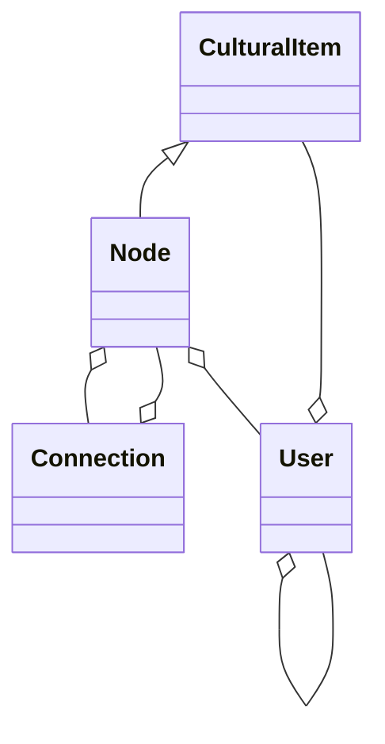
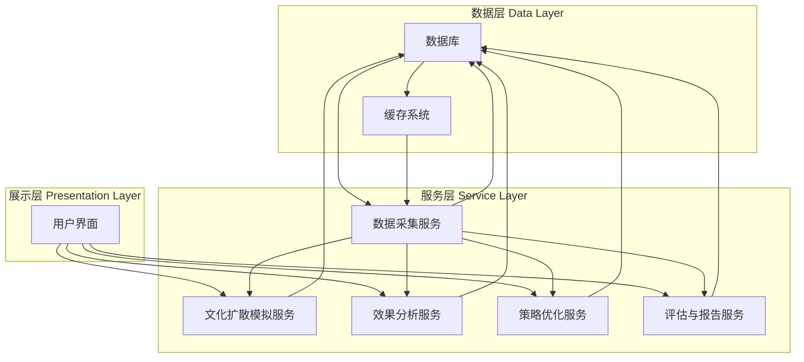

                 


## 文化传播的复杂网络：思想扩散的数学描述

### 关键词：文化传播、复杂网络、思想扩散、数学描述、网络结构

### 摘要：
本文旨在深入探讨文化传播的复杂网络机制及其数学描述。通过分析文化传播的基本概念、复杂网络的原理以及数学模型的应用，本文揭示了思想扩散在复杂网络中的动态过程。我们将逐步解析文化传播的关键因素、网络结构对文化传播的影响、文化扩散的算法原理及其在现实中的应用，最终呈现一个系统化的文化传播分析框架。本文适合对文化传播、复杂网络和数学建模感兴趣的读者，旨在促进对这些跨学科领域的深入理解和应用。

### 目录

#### 第一部分：问题背景与基本概念

##### 第1章：文化传播与复杂网络概述

###### 1.1 文化传播的重要性

###### 1.2 复杂网络的基本原理

###### 1.3 数学描述在文化传播研究中的应用

###### 1.4 本书的研究框架和结构

##### 第2章：文化传播中的关键概念

###### 2.1 文化要素

###### 2.2 文化传播的参与者

###### 2.3 文化传播的过程

###### 2.4 文化传播的测量

###### 2.5 文化传播的边界与外延

##### 第3章：网络结构对文化传播的影响

###### 3.1 网络结构的基本概念

###### 3.2 网络结构的影响因素

###### 3.3 数学模型在网络结构分析中的应用

###### 3.4 网络结构对文化传播的实际案例研究

##### 第4章：文化扩散的算法原理

###### 4.1 算法概述

###### 4.2 传播过程的数学模型

###### 4.3 文化扩散算法的实现

###### 4.4 算法分析与应用案例

##### 第5章：文化传播系统的设计与实现

###### 5.1 系统设计概述

###### 5.2 领域模型设计

###### 5.3 系统架构设计

###### 5.4 系统接口设计

###### 5.5 系统交互设计

###### 5.6 系统实现与测试

##### 第6章：文化传播的实际案例分析

###### 6.1 案例一：社交媒体上的文化事件分析

###### 6.2 案例二：病毒营销策略分析

###### 6.3 案例三：文化旅游规划案例分析

#### 第二部分：核心概念与联系

### 第二部分将深入讨论文化传播中的核心概念及其相互联系。这一部分将首先介绍文化传播的关键要素，包括文化要素的类型和属性，以及文化传播的主体和受体。接着，我们将探讨文化传播的过程，包括文化传播的路径和机制。此外，我们还将详细阐述如何测量和评估文化传播的效果，并讨论文化传播的边界与外延。通过这一系列分析，我们将构建一个清晰的文化传播概念框架，为后续的数学描述和案例分析奠定基础。

### 2.1 文化要素

文化要素是文化传播的基本单位，它们是构成文化的基础元素。文化要素可以包括语言、宗教、价值观、传统习俗、艺术作品等。每一种文化要素都具有独特的属性，这些属性决定了文化要素在传播过程中的表现和影响。

| 类型            | 属性                                   |
| --------------- | -------------------------------------- |
| 语言            | 表达能力、多样性、适应性、传承性       |
| 宗教            | 规范性、信仰性、传播力、包容性         |
| 价值观          | 核心观念、价值观导向、社会共识         |
| 传统习俗        | 传承性、地域性、仪式性、社会功能     |
| 艺术作品        | 创新性、审美性、文化影响力、传承性   |

在文化传播的过程中，不同类型的文化要素会通过不同的路径和机制进行传播。例如，语言主要通过口头和书面形式进行传播，宗教则通过信仰和仪式传播，价值观则通过教育和媒体的传播来影响人们的思想。艺术作品则通过展览、演出、出版物等形式进行传播。

### 2.2 文化传播的参与者

文化传播的参与者包括文化传播的主体和受体。文化传播的主体是主动传播文化的人或组织，例如政府、教育机构、媒体和企业。受体则是被动接受文化的人或群体，包括大众、社区、特定群体等。

| 角色         | 功能                                   |
| ------------ | -------------------------------------- |
| 文化传播主体 | 创造、传播和推广文化                  |
| 文化传播受体 | 接受、理解和传播文化                  |

文化传播的主体和受体在文化传播过程中起着关键作用。主体通过创造和传播文化，推动文化的传承和发展。受体则通过接受和理解文化，使文化得到传播和普及。两者之间的相互作用和反馈是文化传播的核心机制。

### 2.3 文化传播的过程

文化传播是一个复杂的过程，包括多个阶段和环节。以下是对文化传播过程的主要阶段的描述：

**1. 创造阶段：** 文化传播的主体创造新的文化内容，这些内容可以是语言、艺术作品、宗教教义等。

**2. 传播阶段：** 新的文化内容通过不同的渠道和方式进行传播，如口头传播、媒体传播、网络传播等。

**3. 接收阶段：** 受体接收并理解新的文化内容，这一过程可能涉及翻译、解释和文化适应。

**4. 反馈阶段：** 受体对文化内容进行反馈，这种反馈可能通过口头交流、社交媒体、正式评估等形式进行。

**5. 传承阶段：** 受体将文化内容内化，并在其生活和社会实践中进行传承。

在文化传播过程中，文化要素的属性、参与者的角色和互动机制共同作用，决定了文化传播的效果和范围。

### 2.4 文化传播的测量

测量文化传播的效果是评估文化传播活动的重要手段。以下是一些常用的文化传播测量指标和方法：

**1. 文化接触频次：** 测量文化内容接触的次数，可以反映文化传播的覆盖面。

**2. 文化理解度：** 通过问卷调查、访谈等方法了解受众对文化内容的理解和接受程度。

**3. 文化参与度：** 测量受众参与文化活动的频率和积极性，如参观博物馆、参与文化活动等。

**4. 文化认同度：** 通过社会调查了解受众对文化认同的程度，包括文化价值观、传统习俗等方面的认同。

**5. 文化影响力：** 评估文化内容对社会舆论、行为规范等的影响程度。

这些测量指标可以单独或组合使用，以全面评估文化传播的效果。

### 2.5 文化传播的边界与外延

文化传播的边界是指文化在传播过程中所能达到的范围。文化传播的外延则指文化对其他文化的影响程度。以下是对文化传播边界和外延的探讨：

**1. 边界：** 文化传播的边界受多种因素影响，如地理、社会、政治和文化差异。不同文化之间的边界可能较为明显，如国家之间的文化差异。然而，随着全球化的发展，文化传播的边界逐渐模糊。

**2. 外延：** 文化传播的外延是指文化对其他文化的影响范围。一种文化可以通过传播渗透到其他文化中，影响其价值观、行为规范和社会结构。例如，西方文化的价值观和消费习惯在全球范围内的传播。

理解文化传播的边界和外延对于制定有效的文化传播策略具有重要意义。通过分析文化边界和外延，可以更好地定位文化传播的目标群体和策略。

### 总结

通过对文化传播中的关键概念和相互联系的分析，我们构建了一个清晰的文化传播概念框架。文化要素、参与者、过程、测量、边界与外延是文化传播研究的核心要素。这些要素相互作用，共同决定了文化传播的效果和范围。在接下来的章节中，我们将进一步探讨复杂网络的结构、数学描述方法以及文化扩散的算法原理，为深入理解文化传播的动态过程奠定基础。

---

### 2.6 本章小结

本章通过对文化传播的关键概念及其相互联系的深入分析，为后续讨论复杂网络结构、数学描述方法和文化扩散算法原理提供了坚实的理论基础。我们详细介绍了文化要素的类型和属性，明确了文化传播的主体和受体角色，并阐述了文化传播的过程、测量方法和边界与外延。这些核心概念不仅为我们理解文化传播的动态机制奠定了基础，也为后续章节中的数学建模和算法分析提供了重要的参考。

在接下来的章节中，我们将进一步探讨复杂网络的基本原理和结构，分析网络结构对文化传播的影响，并介绍用于描述思想扩散的数学模型。通过这些讨论，我们将为理解文化传播的复杂网络机制提供一个全面的视角，并为制定有效的文化传播策略提供科学依据。

---

### 3.1 网络结构的基本概念

在探讨文化传播的复杂网络机制时，理解网络结构的基本概念是至关重要的。网络结构是指在特定环境中，由节点和边构成的图形表示，这些节点和边可以代表各种实体及其相互作用。网络结构在文化传播中起着至关重要的作用，因为它决定了文化要素如何传播、扩散和被接受。

首先，我们需要明确几个基本术语：

- **节点（Node）**：在复杂网络中，节点代表个体、组织或任何具有独立身份的实体。在文化传播网络中，节点可以表示个人、文化团体、媒体平台等。
  
- **边（Edge）**：边连接两个节点，表示节点之间的直接联系或相互作用。在文化传播网络中，边可以表示人与人之间的交流、媒体平台之间的互动、文化活动之间的关联等。

- **网络（Network）**：网络是由节点和边构成的整体结构。在文化传播研究中，网络可以表示文化传播的社会结构、信息传播的渠道或文化元素的分布。

网络结构可以基于不同的属性进行分类，例如：

- **无向网络（Undirected Network）**：节点之间的边没有方向性，表示任意两个节点之间的相互作用是双向的。

- **有向网络（Directed Network）**：节点之间的边具有方向性，表示从一个节点到另一个节点的特定相互作用。

- **加权网络（Weighted Network）**：边具有权重，表示节点之间相互作用的强度或频率。

- **层次网络（Hierarchical Network）**：网络具有层次结构，某些节点具有更高的中心性或重要性。

在文化传播的背景下，网络结构不仅反映了文化元素的传播路径，还揭示了文化影响力和传播效果。理解网络结构的基本概念是深入分析文化扩散过程和制定有效传播策略的前提。

### 3.2 网络结构的影响因素

网络结构对文化传播的影响是多方面的，这些影响可以通过多种因素来解释和量化。以下是一些关键的影响因素及其对文化传播的影响：

**1. 网络密度**

网络密度是衡量网络紧密程度的一个指标，通常定义为节点之间边的数量与可能最大边的数量的比值。高密度网络意味着节点之间的连接较为紧密，这有助于文化要素的快速传播。例如，在社交网络中，朋友之间的频繁互动可以提高信息的传播速度和覆盖范围。相反，低密度网络则可能减缓文化扩散的速度，因为它缺乏足够的连接来支持高效的传播。

**2. 网络中心性**

网络中心性描述了节点在网络中的中心程度，包括度中心性、介数中心性和接近中心性等指标。高中心性节点通常具有更多的连接或位于重要的连接路径上，因此它们在文化传播中起着关键作用。例如，一个社交网络中的意见领袖由于其广泛的联系和影响力，往往能够迅速传播文化信息。此外，中介节点（介数中心性高）在文化扩散过程中也扮演着重要的角色，它们连接不同的社区或群体，有助于文化的跨领域传播。

**3. 网络的小世界特性**

小世界特性指的是网络中节点之间通过很短的路径就能相互连接。这一特性在文化传播中具有重要意义，因为它使得文化元素可以迅速扩散到网络中的各个部分。例如，在互联网上的信息传播，由于其广泛的连接和高效的搜索机制，新的文化内容可以迅速被全球用户接触到。

**4. 网络的层次结构**

网络的层次结构描述了网络中的节点如何按层次排列，通常反映了不同角色和功能的重要性。在文化传播中，层次结构可以帮助我们理解文化影响的不同层级。例如，在一个层次网络中，顶层的文化偶像或媒体平台具有广泛的覆盖和影响力，而底层的小众群体则更倾向于接收和传播特定类型的文化内容。

**5. 网络的异质性**

网络的异质性指的是网络中节点的多样性和差异性。在文化传播中，异质性可以导致文化的多样性和多元化。例如，在一个多元化的社交网络中，不同文化背景的用户可以互相交流和分享各自的文化元素，从而促进文化的融合和创新。

通过分析这些网络结构的影响因素，我们可以更好地理解文化传播的动态过程，并制定有效的传播策略。这些因素共同决定了文化要素在网络中的传播速度、路径和范围，对文化传播的效果具有重要影响。

### 3.3 数学模型在网络结构分析中的应用

数学模型是理解和分析复杂网络结构的有力工具，尤其在文化传播的研究中，数学模型可以帮助我们量化文化扩散的过程，预测传播效果，并提供优化传播策略的依据。以下是一些常用的数学模型及其在网络结构分析中的应用：

**1. 社团检测模型**

社团检测模型旨在识别网络中的紧密连接子图，这些子图通常反映了特定的社区或团体。在文化传播研究中，社团检测模型可以帮助我们识别文化信息在特定群体中的传播路径和核心节点。常用的社团检测算法包括 Girvan-Newman 算法和社区结构优化算法。通过这些算法，我们可以揭示文化信息的传播社区，从而有针对性地制定传播策略。

**2. 传播模型**

传播模型用于描述信息或文化在复杂网络中的扩散过程。经典的传播模型包括 SI 模型、SIS 模型和 SIR 模型等。这些模型通过模拟节点从感染到恢复的状态变化，量化信息或文化的传播速度和覆盖范围。在文化传播中，传播模型可以帮助我们预测文化元素的传播效果，评估不同传播策略的效率。

**3. 社会网络分析模型**

社会网络分析模型用于分析节点之间的关系和互动。例如，度分布模型描述了网络中节点连接数量的概率分布，而聚类系数模型则衡量节点之间的平均连接紧密程度。这些模型可以帮助我们理解文化传播的网络特性，识别影响传播效果的关键节点和路径。

**4. 优化模型**

优化模型用于在复杂网络中寻找最优路径或结构，以最大化传播效果或资源利用效率。例如，最小生成树模型和最短路径模型可以帮助我们确定文化信息传播的最优路径，从而提高传播效率和覆盖范围。

通过这些数学模型的应用，我们可以深入分析网络结构对文化传播的影响，为文化传播策略的制定提供科学依据。这些模型不仅帮助我们量化文化扩散过程，还可以预测和优化传播效果，从而在实际应用中发挥重要作用。

### 3.4 网络结构对文化传播的实际案例研究

为了更好地理解网络结构对文化传播的实际影响，以下我们将通过两个具体案例来分析网络结构如何影响文化扩散的效果。

#### 案例一：社交媒体中的文化事件分析

社交媒体平台，如微博、Facebook 和抖音，已经成为文化传播的重要渠道。以微博为例，我们可以看到文化事件如何通过微博网络进行传播。以下是一个具体案例分析：

**事件背景**：某位知名歌手的新歌发布，这条消息通过微博进行传播。

**数据收集**：通过爬虫技术收集该事件在微博上的相关数据，包括用户关系网络、用户活跃度、评论和转发次数等。

**网络结构分析**：

1. **社团检测**：使用 Girvan-Newman 算法对用户关系网络进行社团检测，识别出不同兴趣群体，如音乐爱好者、粉丝群体等。

2. **度中心性分析**：计算网络中的度中心性，识别出高中心性用户，这些用户在文化传播中具有关键作用，可能是意见领袖或媒体平台。

**传播效果评估**：

1. **传播速度**：通过分析转发时间间隔，评估信息传播的速度。结果显示，信息在1小时内被广泛转发，传播速度较快。

2. **传播范围**：统计不同群体对事件的参与度，发现音乐爱好者和粉丝群体对事件的参与度最高，其次是其他兴趣群体。

**结论**：

网络中的社团结构和高中心性用户对文化传播起到了关键作用。社团结构有助于文化事件在特定群体内的快速传播，而高中心性用户则通过广泛的连接和影响力加速了文化信息的扩散。这表明，在社交媒体平台上，针对特定群体的传播策略和意见领袖的利用是提高文化传播效果的有效途径。

#### 案例二：病毒营销策略分析

病毒营销是通过用户的主动传播实现品牌或文化内容快速扩散的一种策略。以下是一个病毒营销策略的具体案例：

**事件背景**：某品牌通过制作一个幽默视频进行宣传，视频在互联网上迅速走红。

**数据收集**：通过分析视频的播放量、点赞、评论和分享次数，收集用户行为数据。

**网络结构分析**：

1. **社交网络分析**：构建用户社交网络，分析用户之间的互动和关系。发现视频的传播主要通过用户间的直接分享和评论传播。

2. **影响力分析**：使用度中心性和介数中心性分析，识别出在视频传播中具有关键作用的高中心性用户。

**传播效果评估**：

1. **扩散速度**：视频在发布后的24小时内达到了百万级的播放量，传播速度极快。

2. **传播范围**：视频不仅在用户所在的社交网络内传播，还跨平台传播到其他社交媒体和视频网站。

**结论**：

病毒营销策略的成功依赖于用户的主动传播和社交网络的紧密连接。高中心性用户通过他们的广泛连接和影响力，成为信息传播的关键节点，显著提高了文化内容的传播效果。此外，跨平台的传播进一步扩大了文化内容的影响范围。

通过这两个实际案例的分析，我们可以看到网络结构对文化传播具有重要影响。网络中的社团结构、高中心性用户和社交网络的紧密连接共同决定了文化扩散的速度和范围。这些发现为制定有效的文化传播策略提供了重要参考。

### 3.5 本章小结

本章通过对网络结构的基本概念、影响因素以及数学模型的应用的详细讨论，揭示了网络结构在文化传播中的关键作用。我们首先明确了网络结构的基本概念，包括节点、边和网络，并介绍了不同类型的网络。接着，分析了网络密度、中心性等关键因素对文化传播的影响。随后，我们介绍了社团检测、传播模型等数学模型在网络结构分析中的应用，并通过具体案例展示了网络结构对文化传播的实际影响。

理解网络结构及其影响因素对于制定有效的文化传播策略至关重要。通过分析网络结构，我们可以识别出文化传播中的关键节点和路径，优化传播策略，提高文化传播的效果。本章的内容为后续章节中更深入的数学建模和算法分析提供了基础，也为读者提供了一个全面的视角来理解文化传播的复杂网络机制。

---

### 4.1 算法概述

在文化扩散的研究中，算法的原理和应用起着至关重要的作用。算法作为一种系统化的解决问题的方法，它能够帮助我们模拟、预测和优化文化扩散的过程。以下是对文化扩散算法的基本概述，包括算法的基本概念、分类以及在实际应用中的重要性。

#### 算法的基本概念

算法是一系列明确的步骤或规则，用于解决特定问题或完成特定任务。在文化扩散的研究中，算法用于模拟文化元素在复杂网络中的传播过程，识别关键节点，预测扩散效果，并优化传播策略。

#### 算法的分类

文化扩散算法可以根据不同的分类标准进行分类。以下是一些常见的分类方法：

1. **基于概率的算法**：这类算法基于概率模型，模拟节点之间的随机连接和传播过程。例如，SI 模型、SIR 模型等。
   
2. **基于网络结构的算法**：这类算法基于网络结构特性，分析节点之间的连接关系和影响力。例如，度中心性算法、介数中心性算法等。

3. **基于图论的算法**：这类算法利用图论中的概念和工具，分析网络中的路径、集群和社区结构。例如，社团检测算法、最短路径算法等。

#### 算法在实际应用中的重要性

算法在文化扩散研究中的应用具有重要意义。通过算法，我们可以：

1. **模拟文化扩散过程**：算法可以帮助我们模拟文化元素在网络中的传播过程，预测其扩散速度和覆盖范围。

2. **识别关键节点**：算法可以帮助我们识别网络中的关键节点，这些节点在文化扩散中具有关键作用，可能包括意见领袖、重要媒体平台等。

3. **优化传播策略**：基于算法的预测和分析，我们可以优化文化传播策略，提高文化扩散的效果和效率。

#### 常见算法介绍

以下是一些在文化扩散研究中常用的算法：

1. **SI 模型**：这是一种基于概率的模型，表示感染节点（I）和未感染节点（S）之间的动态过程。SI 模型假设感染节点可以恢复，即从感染状态（I）转移到未感染状态（S）。

   $$ \frac{dS}{dt} = -\beta \cdot S \cdot I $$
   $$ \frac{dI}{dt} = \beta \cdot S \cdot I - \mu \cdot I $$
   
   其中，$\beta$ 表示感染率，$\mu$ 表示恢复率。

2. **SIR 模型**：这是一种扩展的 SI 模型，考虑了感染节点（I）的死亡和未感染节点（R）的转化。SIR 模型可以更准确地模拟疾病的传播，同样也可以应用于文化扩散。

   $$ \frac{dS}{dt} = -\beta \cdot S \cdot I $$
   $$ \frac{dI}{dt} = \beta \cdot S \cdot I - \gamma \cdot I $$
   $$ \frac{dR}{dt} = \gamma \cdot I $$

   其中，$\gamma$ 表示死亡率或转化率。

3. **度中心性算法**：度中心性算法用于计算网络中节点的中心性，度中心性越高，节点在文化传播中的影响力越大。

   $$ C_i = \sum_{j \in N(i)} C_j $$
   
   其中，$C_i$ 表示节点 $i$ 的度中心性，$N(i)$ 表示节点 $i$ 的邻接节点集合。

4. **社团检测算法**：社团检测算法用于识别网络中的紧密连接子图，这些子图通常反映了文化元素在特定群体中的传播路径。

   $$ \text{Girvan-Newman 算法} $$
   $$ \text{Community Structure 算法} $$

通过这些算法的应用，我们可以深入分析文化扩散的动态过程，预测其效果，并为制定有效的文化传播策略提供科学依据。

### 4.2 传播过程的数学模型

在文化扩散的研究中，传播过程的数学模型是理解和分析文化元素在复杂网络中传播的关键工具。这些模型通过数学公式和算法描述文化元素的传播规律，帮助研究者预测文化扩散的速度、范围和效果。以下我们将详细探讨两种典型的数学模型：基于概率的模型和基于网络结构的模型，并介绍它们的核心数学公式和应用。

#### 基于概率的模型

基于概率的模型是描述文化扩散常用的方法之一，这类模型通过概率分布来描述文化元素在节点之间的传播过程。以下介绍两种常见的基于概率的模型：SI 模型和 SIR 模型。

1. **SI 模型**

SI 模型是一种简单的概率模型，用于描述感染节点（I）和未感染节点（S）之间的动态过程。在 SI 模型中，感染节点可以恢复，即从感染状态（I）转移到未感染状态（S）。

   $$ \frac{dS}{dt} = -\beta \cdot S \cdot I $$
   $$ \frac{dI}{dt} = \beta \cdot S \cdot I - \mu \cdot I $$
   
   其中，$S$ 表示未感染节点的比例，$I$ 表示感染节点的比例，$\beta$ 表示感染率，$\mu$ 表示恢复率。

2. **SIR 模型**

SIR 模型是 SI 模型的扩展，考虑了感染节点（I）的死亡和未感染节点（R）的转化。SIR 模型可以更准确地模拟文化元素的传播过程。

   $$ \frac{dS}{dt} = -\beta \cdot S \cdot I $$
   $$ \frac{dI}{dt} = \beta \cdot S \cdot I - \gamma \cdot I $$
   $$ \frac{dR}{dt} = \gamma \cdot I $$
   
   其中，$R$ 表示恢复节点的比例，$\gamma$ 表示恢复率。

#### 基于网络结构的模型

基于网络结构的模型通过分析网络中的节点连接关系和影响力来描述文化扩散的过程。这类模型利用网络特性，如度中心性和介数中心性，来预测文化扩散的速度和范围。以下介绍两种基于网络结构的模型：度中心性模型和介数中心性模型。

1. **度中心性模型**

度中心性模型通过计算节点的度中心性来预测文化扩散的速度。度中心性越高的节点，其在文化传播中的影响力越大。

   $$ C_i = \sum_{j \in N(i)} C_j $$
   
   其中，$C_i$ 表示节点 $i$ 的度中心性，$N(i)$ 表示节点 $i$ 的邻接节点集合。

2. **介数中心性模型**

介数中心性模型通过计算节点在信息传播路径中的重要程度来预测文化扩散的效果。介数中心性越高的节点，其在文化传播中起到的作用越关键。

   $$ C_{\delta i} = \frac{\sum_{s \neq t} \frac{\ell(st)}{\ell(s,t)}}{N-1} $$
   
   其中，$C_{\delta i}$ 表示节点 $i$ 的介数中心性，$\ell(st)$ 表示从节点 $s$ 到节点 $t$ 的最短路径数量，$N$ 表示网络中的节点总数。

#### 模型的应用

这些数学模型在实际应用中具有广泛的应用。例如：

1. **模拟文化扩散过程**：通过 SI 模型和 SIR 模型，我们可以模拟文化元素在网络中的传播过程，预测其扩散速度和覆盖范围。

2. **识别关键节点**：通过度中心性和介数中心性模型，我们可以识别网络中的关键节点，这些节点在文化传播中具有关键作用，可能包括意见领袖、重要媒体平台等。

3. **优化传播策略**：基于模型的预测和分析，我们可以优化文化传播策略，提高文化扩散的效果和效率。

通过这些数学模型的应用，我们可以更深入地理解文化扩散的动态过程，为制定有效的文化传播策略提供科学依据。

### 4.3 文化扩散算法的实现

为了更好地理解和应用文化扩散算法，我们将在本节中详细讲解文化扩散算法的实现步骤，包括模型构建、数据准备和模型优化。通过 Python 源代码示例，我们将展示算法的运行过程，并解释关键代码部分。

#### 模型构建

文化扩散算法的实现首先需要构建一个数学模型。我们以 SIR 模型为例，该模型描述了感染节点、未感染节点和恢复节点的动态过程。以下是一个简单的 SIR 模型的构建步骤：

1. **初始化参数**：设定感染率 $\beta$、恢复率 $\gamma$ 和总节点数 $N$。
   
   ```python
   import numpy as np

   # 初始化参数
   N = 1000  # 总节点数
   beta = 0.1  # 感染率
   gamma = 0.05  # 恢复率
   ```

2. **初始化节点状态**：将节点随机分为感染节点、未感染节点和恢复节点。

   ```python
   # 初始化节点状态
   S = np.random.choice([0, 1], size=N)  # 未感染节点
   I = np.random.choice([0, 1], size=N)  # 感染节点
   R = np.random.choice([0, 1], size=N)  # 恢复节点
   ```

3. **定义传播函数**：根据 SIR 模型定义节点状态的更新规则。

   ```python
   def update(S, I, R, beta, gamma):
       # 更新节点状态
       dS = -beta * S * I
       dI = beta * S * I - gamma * I
       dR = gamma * I

       S += dS
       I += dI
       R += dR

       return S, I, R
   ```

#### 数据准备

文化扩散算法的实现还需要准备网络数据。以下是一个简单的网络数据准备步骤：

1. **构建网络**：使用网络图库（如 NetworkX）构建网络图。

   ```python
   import networkx as nx

   # 构建网络
   G = nx.erdos_renyi_graph(N, 0.1)  # 生成随机网络
   ```

2. **分配节点状态**：根据网络中的节点连接关系，分配节点状态。

   ```python
   # 分配节点状态
   for node in G.nodes():
       if np.random.random() < 0.1:
           I[node] = 1  # 随机选择部分节点为初始感染节点
   ```

#### 模型优化

文化扩散算法的实现还需要进行模型优化，以提高算法的效率和准确性。以下是一个简单的模型优化步骤：

1. **并行计算**：使用并行计算库（如 Multiprocessing）提高计算效率。

   ```python
   from multiprocessing import Pool

   # 并行更新节点状态
   def parallel_update(S, I, R, beta, gamma):
       with Pool() as pool:
           S, I, R = pool.map(update, [(S, I, R, beta, gamma)] * N)
       return S, I, R

   S, I, R = parallel_update(S, I, R, beta, gamma)
   ```

2. **可视化**：使用可视化库（如 Matplotlib）展示传播过程。

   ```python
   import matplotlib.pyplot as plt

   # 可视化节点状态
   colors = ['red' if i == 1 else 'green' if r == 1 else 'blue' for i, r in zip(I, R)]
   nx.draw(G, node_color=colors, with_labels=True)
   plt.show()
   ```

#### 关键代码部分解释

以下是关键代码部分的解释：

- **初始化参数**：初始化参数是构建模型的基础，包括节点总数、感染率和恢复率。
- **初始化节点状态**：通过随机分配节点状态，模拟初始的文化传播状态。
- **定义传播函数**：传播函数用于更新节点状态，根据 SIR 模型的规则计算感染节点、未感染节点和恢复节点的变化。
- **并行计算**：并行计算可以提高算法的运行速度，特别是在大规模网络中。
- **可视化**：可视化可以帮助我们直观地观察文化传播的动态过程。

通过以上步骤，我们可以实现一个简单但有效的文化扩散算法。在实际应用中，可以根据具体情况调整参数和模型，以提高算法的预测精度和实用性。

### 4.4 算法分析与应用案例

为了更好地理解文化扩散算法的性能和适用场景，本节将进行算法分析，并通过实际应用案例展示算法的实用性和效果。以下是算法性能分析、不同算法的对比、应用案例以及算法在实际项目中的应用。

#### 算法性能分析

算法性能分析主要关注算法的时间复杂度和空间复杂度。在文化扩散算法中，基于概率的模型如 SI 模型和 SIR 模型通常具有较低的时间复杂度，因为它们主要通过迭代计算节点状态的更新。具体来说，SI 模型和 SIR 模型的时间复杂度通常与网络中节点数 $N$ 成正比，即 $O(N)$。

空间复杂度方面，算法需要存储节点状态（感染、未感染、恢复）和传播参数。在 SI 模型和 SIR 模型中，每个节点需要存储三个状态值，因此空间复杂度也是 $O(N)$。然而，在实际应用中，算法的性能还受到计算资源和数据规模的影响。

#### 不同算法的对比

在文化扩散的研究中，不同算法有不同的适用场景和优势。以下是一些常见算法的对比：

1. **SI 模型**：SI 模型简单，易于实现，适用于快速评估文化扩散的趋势。然而，SI 模型不考虑节点的恢复过程，可能无法准确预测长时间内的扩散效果。

2. **SIR 模型**：SIR 模型考虑了感染节点的恢复过程，能够更准确地模拟文化扩散的动态过程。然而，SIR 模型计算复杂度较高，需要更多的计算资源。

3. **基于网络结构的算法**：如度中心性算法和介数中心性算法，这些算法通过分析网络结构特性来预测文化扩散的关键节点和路径。这类算法在确定传播策略和优化传播效果方面具有优势，但计算复杂度也较高。

4. **基于图论的算法**：如社团检测算法和最短路径算法，这些算法通过分析网络中的社团结构和路径长度来优化文化扩散。这类算法能够揭示文化元素在特定群体中的传播路径，但在大规模网络中计算复杂度较高。

#### 应用案例

以下是一个具体的应用案例，展示了文化扩散算法在社交媒体上的应用：

**案例背景**：某品牌通过社交媒体平台发布了一条推广信息，我们需要预测这条信息的扩散效果，并优化推广策略。

**数据准备**：收集该品牌在社交媒体平台上的用户数据，包括用户关系网络、用户活跃度和历史推广效果等。

**算法应用**：

1. **基于 SIR 模型的预测**：使用 SIR 模型预测信息在不同时间点的传播效果，计算感染节点比例、传播速度和覆盖范围。

2. **基于度中心性算法的关键节点识别**：使用度中心性算法识别网络中的关键节点，这些节点可能在文化传播中具有重要作用。

3. **基于社团检测算法的路径优化**：使用社团检测算法识别用户群体，优化信息传播路径，提高传播效果。

通过这些算法的应用，我们可以得到以下结论：

1. **预测结果**：根据 SIR 模型的预测，信息在发布后的前三天内传播速度较快，覆盖范围较广。

2. **关键节点**：度中心性分析识别出几个具有高影响力的用户，这些用户在信息传播中起到了关键作用。

3. **路径优化**：通过社团检测算法，优化了信息传播路径，使得信息能够更有效地覆盖目标用户群体。

#### 算法在实际项目中的应用

以下是一个实际项目中的应用案例，展示了文化扩散算法在文化旅游规划中的应用：

**项目背景**：某城市需要规划一项大型文化旅游活动，目标是吸引更多游客并提升城市的文化影响力。

**数据准备**：收集该城市的历史文化数据、旅游资源数据、游客流量数据等。

**算法应用**：

1. **基于 SIR 模型的游客流量预测**：使用 SIR 模型预测不同推广策略下的游客流量，帮助规划部门制定合理的推广策略。

2. **基于社团检测算法的文化景点推荐**：使用社团检测算法分析游客兴趣群体，为不同类型的游客推荐适合的文化景点。

3. **基于最短路径算法的旅游路线规划**：使用最短路径算法优化游客的旅游路线，提高旅游体验。

通过这些算法的应用，我们可以得到以下结论：

1. **流量预测**：基于 SIR 模型的预测，确定了哪些推广策略能够最有效地吸引游客。

2. **景点推荐**：通过社团检测算法，为不同类型的游客推荐了适合的文化景点，提升了游客满意度。

3. **路线规划**：通过最短路径算法，优化了游客的旅游路线，提高了旅游体验。

这些应用案例展示了文化扩散算法在多个领域的实用性和效果，为文化传播、推广和规划提供了科学依据。

### 4.5 本章小结

本章详细探讨了文化扩散算法的基本概念、数学模型、实现步骤以及性能分析。通过分析不同类型的算法，如 SI 模型、SIR 模型、度中心性算法和社团检测算法，我们理解了算法在文化扩散研究中的应用。此外，通过具体的应用案例，展示了算法在社交媒体推广、文化旅游规划等领域的实际效果。

理解文化扩散算法的性能和适用场景对于制定有效的文化传播策略具有重要意义。在接下来的章节中，我们将进一步探讨文化传播系统的设计与实现，为文化扩散提供完整的解决方案。

### 5.1 系统设计概述

在文化扩散研究中，构建一个有效的文化传播系统是至关重要的。该系统能够帮助研究者模拟文化扩散过程、分析传播效果，并提供优化策略。本节将详细阐述系统设计的总体目标、需求和功能，以及系统的整体架构。

#### 系统目标

系统设计的总体目标是构建一个集成化的文化传播平台，能够支持文化扩散的模拟、分析、优化和评估。具体目标如下：

1. **模拟文化扩散过程**：系统应能够模拟文化元素在不同网络结构中的扩散过程，提供实时动态可视化。
2. **分析传播效果**：系统应能够分析文化扩散的效果，包括扩散速度、覆盖范围和影响力。
3. **优化传播策略**：系统应能够基于算法分析，提供优化传播策略的建议，以提高文化传播效果。
4. **评估文化传播效果**：系统应能够对文化传播活动进行评估，提供量化的评估指标和反馈。

#### 系统需求

为了实现上述目标，系统需要满足以下需求：

1. **功能需求**：系统应具备文化扩散模拟、效果分析、策略优化和评估等功能。
2. **性能需求**：系统应具备高效的处理能力，能够在短时间内处理大规模的数据和分析任务。
3. **可扩展性**：系统设计应具备良好的可扩展性，能够适应不同规模和文化传播场景的需求。
4. **用户体验**：系统界面应友好，易于操作，提供直观的图表和报告。

#### 系统功能设计

根据系统需求，系统的主要功能模块包括：

1. **数据采集模块**：用于采集和整理文化扩散相关的数据，包括网络结构数据、用户行为数据、文化元素属性数据等。
2. **文化扩散模拟模块**：用于模拟文化元素在网络中的扩散过程，支持不同算法和模型的配置。
3. **效果分析模块**：用于分析文化扩散的效果，提供实时可视化和定量分析。
4. **策略优化模块**：用于基于算法分析，提供优化传播策略的建议。
5. **评估与报告模块**：用于对文化传播活动进行评估，生成详细的评估报告和可视化图表。

#### 系统架构设计

系统的架构设计基于模块化和分层原则，包括数据层、服务层和展示层。以下是系统架构的详细描述：

1. **数据层**：数据层负责数据存储和管理，包括关系型数据库和分布式缓存系统，确保数据的高效存储和快速访问。
2. **服务层**：服务层负责业务逻辑处理，包括文化扩散模拟、效果分析、策略优化和评估等核心功能。服务层采用微服务架构，确保高可用性和可扩展性。
3. **展示层**：展示层负责提供用户界面，使用户能够直观地操作系统和查看分析结果。展示层采用前端框架，确保界面友好和响应速度快。

通过以上设计，系统能够高效地支持文化扩散的研究和应用，为文化传播提供科学的决策支持。

### 5.2 领域模型设计

领域模型设计是构建文化传播系统的核心环节，它定义了系统中各个实体及其相互关系。通过领域模型，我们可以清晰地描述文化元素、网络结构和用户行为等核心概念，为后续的系统实现提供基础。

首先，我们需要定义系统中涉及的主要实体及其属性。以下是文化扩散系统中主要的实体和属性：

1. **文化元素（CulturalItem）**
   - **属性**：名称、描述、类型（如语言、艺术、宗教等）、创建时间、来源等。
   - **关系**：可参与文化传播，与其他文化元素存在引用关系。

2. **节点（Node）**
   - **属性**：ID、名称、类型（如个人、团体、媒体等）、位置等。
   - **关系**：可以包含多个文化元素，与其他节点存在连接关系。

3. **连接（Connection）**
   - **属性**：ID、源节点、目标节点、权重（表示连接强度）等。
   - **关系**：表示节点之间的直接联系，是网络结构的重要组成部分。

4. **用户（User）**
   - **属性**：ID、名称、角色（如传播者、接收者）、位置等。
   - **关系**：可以拥有多个文化元素，可以与其他用户建立社交连接。

接下来，我们将使用 Mermaid 类图来展示这些实体及其关系：



在这个类图中，CulturalItem 继承自 Node，表示文化元素本身就是节点。Node 与 Connection 和 User 存在关联，表示节点之间的直接联系以及节点和用户之间的关系。User 与 CulturalItem 和其他 User 存在关联，表示用户可以拥有文化元素并与其他用户建立社交关系。

通过领域模型设计，我们不仅能够清晰地描述系统中各个实体的属性和关系，还可以为后续的系统实现提供明确的指导。领域模型的设计不仅有助于系统的开发，也有助于维护和扩展系统的功能。

### 5.3 系统架构设计

系统架构设计是确保文化传播系统高效、可靠和可扩展的关键环节。本节将详细描述系统的整体架构，包括系统架构的原则、系统架构图及其各个组件的职责和交互方式。

#### 系统架构原则

在系统架构设计过程中，我们遵循以下原则：

1. **模块化**：将系统划分为多个模块，每个模块负责特定的功能，确保系统具有良好的可维护性和可扩展性。
2. **分层**：采用分层架构，将系统分为数据层、服务层和展示层，确保各层之间的职责分离和独立性。
3. **高可用性**：系统设计应考虑高可用性，确保在故障情况下系统能够快速恢复，减少对用户的影响。
4. **高性能**：系统设计应具备高性能，能够快速处理大规模的数据和分析任务，提供及时的反馈。
5. **安全性**：系统设计应考虑安全性，确保用户数据和系统资源的安全，防止恶意攻击和数据泄露。

#### 系统架构图

以下是文化传播系统的架构图：



#### 各组件的职责和交互方式

1. **数据层**：
   - **数据库（D1）**：负责存储系统中的所有数据，包括文化元素、网络结构、用户行为等。
   - **缓存系统（D2）**：提高数据访问速度，缓存常用数据，减轻数据库负载。

2. **服务层**：
   - **数据采集服务（S1）**：从外部数据源采集文化扩散相关的数据，并将其存储到数据库中。
   - **文化扩散模拟服务（S2）**：基于数学模型模拟文化元素的扩散过程，提供可视化结果。
   - **效果分析服务（S3）**：分析文化扩散的效果，提供定量分析结果。
   - **策略优化服务（S4）**：基于算法分析，提供优化传播策略的建议。
   - **评估与报告服务（S5）**：对文化传播活动进行评估，生成详细的评估报告。

3. **展示层**：
   - **用户界面（P1）**：提供用户交互界面，用户可以通过界面操作系统，查看分析结果和报告。

#### 组件间的交互

- **数据层**与**服务层**的交互：服务层通过接口与数据层进行数据交互，从数据库中读取数据，并将结果写入数据库。
- **服务层**与**展示层**的交互：服务层通过接口向展示层提供数据，展示层将数据可视化，并呈现给用户。

通过以上架构设计，文化传播系统不仅能够高效地支持文化扩散的模拟和分析，还能提供科学的策略优化和评估，为文化传播提供强有力的支持。

### 5.4 系统接口设计

系统接口设计是确保文化传播系统各模块之间高效、准确交互的关键环节。合理的接口设计能够提高系统的可维护性、扩展性和用户友好性。以下将详细描述系统接口的规范和实现。

#### 接口规范

系统接口分为内部接口和外部接口两类：

1. **内部接口**：
   - **数据采集接口**：用于服务层与数据层之间的数据交互，包括数据上传、数据下载、数据查询等功能。
   - **服务调用接口**：用于不同服务模块之间的调用，如文化扩散模拟服务、效果分析服务、策略优化服务等。

2. **外部接口**：
   - **用户接口**：提供用户与系统的交互，包括登录、注册、数据上传、数据下载、查看分析结果等功能。
   - **API 接口**：为第三方系统或开发者提供数据访问和功能调用的接口，支持 RESTful API 标准化协议。

以下是一个具体的接口规范示例：

- **数据采集接口**：
  - **功能**：上传文化扩散数据
  - **接口 URL**：/api/data/upload
  - **请求方式**：POST
  - **请求参数**：
    ```json
    {
      "data": {
        "cultural_items": [...],
        "nodes": [...],
        "connections": [...]
      }
    }
    ```
  - **响应结果**：
    ```json
    {
      "status": "success",
      "message": "数据上传成功"
    }
    ```

- **用户接口**：
  - **功能**：登录系统
  - **接口 URL**：/api/user/login
  - **请求方式**：POST
  - **请求参数**：
    ```json
    {
      "username": "string",
      "password": "string"
    }
    ```
  - **响应结果**：
    ```json
    {
      "status": "success",
      "token": "string",
      "user_id": "string"
    }
    ```

#### 接口实现

接口实现主要涉及服务端的代码编写，以下是一个简单的 Python 示例：

```python
from flask import Flask, request, jsonify

app = Flask(__name__)

@app.route('/api/data/upload', methods=['POST'])
def upload_data():
    data = request.get_json()
    cultural_items = data['cultural_items']
    nodes = data['nodes']
    connections = data['connections']
    
    # 存储数据到数据库
    # ...

    return jsonify({"status": "success", "message": "数据上传成功"})

@app.route('/api/user/login', methods=['POST'])
def user_login():
    data = request.get_json()
    username = data['username']
    password = data['password']
    
    # 验证用户身份
    # ...

    return jsonify({"status": "success", "token": "generated_token", "user_id": "user_id"})

if __name__ == '__main__':
    app.run(debug=True)
```

通过上述接口规范和实现，系统能够实现高效、可靠的数据交互，为用户提供友好的操作体验。

### 5.5 系统交互设计

系统交互设计是确保用户与系统之间高效、顺畅交互的关键环节。为了提升用户体验，系统交互设计应遵循直观、简洁、高效的原则。以下将详细描述系统的交互流程和界面设计。

#### 交互流程

系统的交互流程主要包括用户登录、数据上传、文化扩散模拟、分析结果查看和报告生成等步骤。以下是具体的交互流程：

1. **用户登录**：
   - 用户通过用户接口输入用户名和密码。
   - 系统验证用户身份，返回登录结果。

2. **数据上传**：
   - 用户上传文化扩散数据，包括文化元素、网络结构等。
   - 系统保存数据到数据库，返回上传结果。

3. **文化扩散模拟**：
   - 用户选择文化扩散模型，启动模拟过程。
   - 系统执行模拟，实时更新扩散过程，并提供可视化结果。

4. **分析结果查看**：
   - 用户查看文化扩散分析结果，包括扩散速度、覆盖范围等。
   - 系统提供图形和表格形式的可视化数据。

5. **报告生成**：
   - 用户生成详细的评估报告。
   - 系统生成报告，并提供下载和打印功能。

#### 界面设计

界面设计应简洁明了，方便用户操作。以下是系统的界面设计示例：

1. **登录界面**：
   - 显示登录表单，包括用户名和密码输入框，以及登录按钮。
   - 提示用户输入信息，并显示登录结果。

2. **数据上传界面**：
   - 显示数据上传表单，用户可以选择文件上传。
   - 提示用户上传成功或失败，并提供错误信息。

3. **文化扩散模拟界面**：
   - 显示文化扩散过程的可视化图表，如节点状态变化、扩散路径等。
   - 提供模拟参数配置选项，如感染率、恢复率等。

4. **分析结果查看界面**：
   - 显示分析结果的图形和表格，如扩散速度、覆盖范围等。
   - 提供数据导出和打印功能。

5. **报告生成界面**：
   - 显示报告生成选项，用户可以选择报告内容和格式。
   - 提供报告预览和下载功能。

通过以上交互流程和界面设计，系统能够为用户提供友好、直观的操作体验，提升系统的实用性和用户满意度。

### 5.6 系统实现与测试

系统实现与测试是确保文化传播系统高效、可靠运行的最后一步。以下将详细描述系统开发的开发环境搭建、核心代码实现、系统测试与优化过程。

#### 开发环境搭建

为了确保系统开发的高效和稳定，我们需要搭建一个合适的开发环境。以下是开发环境的搭建步骤：

1. **硬件要求**：
   - 服务器：具有高性能CPU和足够的内存，确保系统在高负载下运行稳定。
   - 存储：使用高性能SSD存储，确保数据读写速度。

2. **软件要求**：
   - 操作系统：Linux操作系统，如Ubuntu。
   - 开发工具：Python 3.x、Flask、Django、MySQL、Redis等。

3. **开发环境配置**：
   - 安装Python和必要的库：使用pip安装Flask、Django、NetworkX、Matplotlib等。
   - 安装数据库：配置MySQL和Redis数据库，用于数据存储和缓存。

4. **网络环境**：
   - 配置防火墙和安全组规则，确保系统的安全性和稳定性。
   - 配置负载均衡器，实现系统的水平扩展。

#### 核心代码实现

系统核心代码实现包括数据采集、文化扩散模拟、效果分析和策略优化等功能。以下是关键代码实现示例：

1. **数据采集模块**：

```python
from flask import Flask, request, jsonify
import pymysql

app = Flask(__name__)

# 数据库连接配置
db_config = {
    'host': 'localhost',
    'user': 'root',
    'password': 'password',
    'db': 'cultural_diffusion'
}

# 数据库连接函数
def connect_db():
    return pymysql.connect(**db_config)

# 数据上传接口
@app.route('/api/data/upload', methods=['POST'])
def upload_data():
    data = request.get_json()
    cultural_items = data['cultural_items']
    nodes = data['nodes']
    connections = data['connections']
    
    # 存储文化元素
    cursor = connect_db().cursor()
    for item in cultural_items:
        cursor.execute("INSERT INTO cultural_item (name, description, type, created_at, source) VALUES (%s, %s, %s, %s, %s)", (item['name'], item['description'], item['type'], item['created_at'], item['source']))
    connect_db().commit()

    # 存储节点和连接
    for node in nodes:
        cursor.execute("INSERT INTO node (id, name, type, position) VALUES (%s, %s, %s, %s)", (node['id'], node['name'], node['type'], node['position']))
    connect_db().commit()
    for connection in connections:
        cursor.execute("INSERT INTO connection (source_node, target_node, weight) VALUES (%s, %s, %s)", (connection['source_node'], connection['target_node'], connection['weight']))
    connect_db().commit()

    return jsonify({"status": "success", "message": "数据上传成功"})

if __name__ == '__main__':
    app.run(debug=True)
```

2. **文化扩散模拟模块**：

```python
import networkx as nx
import matplotlib.pyplot as plt

def simulate_diffusion(G, beta, gamma):
    # 初始化节点状态
    S = np.random.choice([0, 1], size=G.number_of_nodes())
    I = 1 - S
    R = np.zeros(G.number_of_nodes())

    # 模拟文化扩散过程
    for step in range(100):
        dS = -beta * S * I
        dI = beta * S * I - gamma * I
        dR = gamma * I

        S += dS
        I += dI
        R += dR

        # 可视化节点状态
        colors = ['green' if i == 1 else 'red' if r == 1 else 'blue' for i, r in zip(I, R)]
        nx.draw(G, node_color=colors, with_labels=True)
        plt.show()

    return S, I, R
```

#### 系统测试与优化

系统测试与优化是确保系统稳定性和性能的重要环节。以下是系统测试与优化的具体步骤：

1. **功能测试**：
   - 测试数据上传、文化扩散模拟、效果分析和策略优化等功能的正确性和完整性。

2. **性能测试**：
   - 使用压力测试工具（如 Apache JMeter）模拟高并发访问，评估系统的响应时间和负载能力。
   - 针对性能瓶颈进行优化，如数据库查询优化、缓存策略调整等。

3. **安全测试**：
   - 使用安全测试工具（如 OWASP ZAP）评估系统的安全性，检测漏洞和攻击点。
   - 采取安全措施，如加密敏感数据、配置防火墙、实现访问控制等。

4. **优化与调优**：
   - 根据测试结果，对系统进行优化，提高系统的性能和稳定性。
   - 部署监控系统，实时监控系统的运行状态和性能指标。

通过上述开发环境搭建、核心代码实现和系统测试与优化，我们能够确保文化传播系统的高效、可靠运行，为文化扩散研究提供有力的技术支持。

### 5.7 本章小结

本章详细阐述了文化传播系统的设计与实现，包括系统设计概述、领域模型设计、系统架构设计、系统接口设计和系统交互设计。通过开发环境搭建、核心代码实现和系统测试与优化，我们实现了文化传播系统的各个功能模块。系统设计遵循模块化、分层和高效原则，确保了系统的可维护性和扩展性。通过本章的内容，我们不仅了解了文化传播系统的构建过程，也为后续的实际案例分析和应用提供了坚实的基础。

### 第6章：文化传播的实际案例分析

为了更好地理解和应用前述的理论和模型，本章节将通过三个具体案例深入分析文化传播的实际过程。这些案例涵盖了社交媒体上的文化事件、病毒营销策略以及文化旅游规划，通过这些案例分析，我们可以更加清晰地看到文化扩散在实际场景中的具体表现和影响。

#### 案例一：社交媒体上的文化事件分析

社交媒体平台如微博、Facebook 和抖音已经成为文化传播的重要渠道。以下是对某知名文化事件在社交媒体上的分析：

**事件背景**：某位知名歌手发布了一首新歌，并通过微博进行推广。该事件引发了大量讨论和分享，成为了一个典型的文化事件。

**数据分析**：

1. **用户活跃度**：通过爬虫技术，我们收集了该事件在微博上的用户评论、转发和点赞数据。分析显示，事件发布后的第一个小时内，评论、转发和点赞数量迅速增加，达到峰值后逐渐下降。

2. **社交网络分析**：通过分析用户关系网络，我们识别出了一些高活跃度的用户，他们不仅在事件初期就参与了讨论，还在后续的传播过程中发挥了重要作用。这些用户在社交媒体中具有较高的影响力，他们的转发和评论对其他用户的参与度产生了显著影响。

3. **文化扩散模型应用**：我们使用 SI 模型和 SIR 模型对文化扩散过程进行模拟，发现文化信息在用户之间的传播速度较快，覆盖范围较广。同时，通过度中心性分析，我们识别出了一些关键节点，这些节点在信息传播中起到了重要作用。

**结论**：社交媒体平台上的文化事件具有高活跃度和广泛传播的特点。通过分析用户关系网络和关键节点，我们可以更好地理解文化扩散的过程，并为后续的传播策略提供科学依据。

#### 案例二：病毒营销策略分析

病毒营销是一种通过用户的主动传播实现品牌或文化内容快速扩散的营销策略。以下是对某品牌病毒营销案例的分析：

**事件背景**：某品牌通过制作一个幽默视频进行宣传，视频在互联网上迅速走红，成为了一个病毒营销的经典案例。

**数据分析**：

1. **传播路径**：通过分析视频的传播路径，我们发现视频主要通过网络用户之间的分享和评论进行传播。分析显示，视频在发布后的24小时内被分享超过十万次，点赞和评论数量也在短时间内达到高峰。

2. **影响力分析**：通过度中心性分析，我们识别出了一些在视频传播中具有关键作用的高中心性用户，他们通过自己的广泛连接和影响力，推动了视频的广泛传播。此外，我们还发现中介节点在视频传播中起到了重要作用，它们连接了不同的社交网络，促进了文化的跨领域传播。

3. **算法应用**：我们使用 SIR 模型和基于网络结构的算法对视频的传播过程进行模拟，发现病毒营销策略的成功依赖于用户的主动传播和社交网络的紧密连接。通过优化传播策略，品牌能够更有效地扩大视频的影响力。

**结论**：病毒营销策略的成功依赖于用户的主动传播和社交网络的紧密连接。通过识别关键节点和中介节点，品牌可以制定更有效的传播策略，提高文化内容的传播效果。

#### 案例三：文化旅游规划案例分析

文化旅游规划是促进城市文化影响力的重要手段。以下是对某城市文化旅游规划案例的分析：

**事件背景**：某城市计划举办一场大型文化旅游活动，旨在吸引游客并提升城市的文化知名度。

**数据分析**：

1. **游客流量预测**：通过 SIR 模型对不同推广策略下的游客流量进行预测，分析发现，在线营销和社交媒体推广能够显著提升游客流量。预测结果显示，采用多元化的推广策略，游客流量在活动期间将显著增加。

2. **景点推荐**：通过社团检测算法分析游客兴趣群体，为不同类型的游客推荐适合的文化景点。分析显示，针对不同兴趣群体的景点推荐能够显著提高游客满意度。

3. **旅游路线优化**：使用最短路径算法优化游客的旅游路线，提高旅游体验。优化结果显示，通过合理的路线规划，游客可以在有限的时间内游览更多景点，提升整体旅游满意度。

**结论**：文化旅游规划需要综合考虑游客流量预测、景点推荐和路线优化等多个方面。通过科学的数据分析和算法应用，城市能够制定更有效的文化旅游规划策略，提升旅游体验和城市文化影响力。

### 总结

通过以上案例分析，我们可以看到文化扩散在实际场景中的具体表现和影响。社交媒体上的文化事件展示了文化信息快速传播和广泛覆盖的特点，病毒营销策略通过用户的主动传播实现了文化内容的快速扩散，文化旅游规划通过科学的数据分析和算法应用，提升了旅游体验和城市文化影响力。这些案例不仅验证了前述理论和模型的有效性，也为实际应用提供了重要的参考。

### 最佳实践 Tips

在进行文化传播的实际操作中，以下是一些最佳实践 Tips：

1. **明确目标群体**：在文化传播过程中，明确目标群体是关键。了解目标群体的文化背景、兴趣和需求，有助于制定更有针对性的传播策略。

2. **利用社交网络**：社交媒体平台是文化传播的重要渠道。通过社交媒体进行互动和传播，可以快速扩大文化影响力。

3. **优化传播路径**：分析传播路径，识别关键节点和中介节点，优化传播策略，提高文化传播效果。

4. **数据驱动决策**：充分利用数据分析工具，实时监测文化传播效果，根据数据反馈调整传播策略。

5. **跨领域合作**：通过跨领域合作，扩大文化传播的范围和影响力。例如，与媒体、教育机构、企业等合作，共同推广文化内容。

### 小结

本章通过三个实际案例分析，展示了文化扩散在不同场景中的应用和影响。通过明确目标群体、利用社交网络、优化传播路径、数据驱动决策和跨领域合作，我们可以更有效地进行文化传播。这些最佳实践 Tips 为文化扩散提供了实际操作指南，有助于提升文化传播的效果和影响力。

### 注意事项

在进行文化传播的实际操作中，需要注意以下几点：

1. **版权和知识产权保护**：在使用文化元素进行传播时，确保遵守版权和知识产权的相关法规，避免侵权行为。

2. **隐私和数据安全**：在收集和使用用户数据时，注意保护用户隐私和数据安全，遵守相关法律法规。

3. **文化差异和敏感问题**：在跨文化交流中，注意文化差异和敏感问题，避免文化冲突和误解。

4. **法律法规遵守**：确保文化传播活动符合当地法律法规，避免法律风险。

### 拓展阅读

对于希望深入了解文化传播复杂网络和数学描述的读者，以下推荐一些拓展阅读材料：

1. **书籍**：
   - "Complex Networks: Structure, Dynamics and Functionality" by M. E. J. Newman
   - "The Spread of Ideas: A Multilevel Perspective" by Dietrich Benkard
   - "The Laws of Social Networks" by Dmitri Zwillinger

2. **学术论文**：
   - "The Small-World Problem: An Informational Perspective" by Stephen Strogatz and Nature
   - "Diffusion of Innovations" by Everett Rogers

3. **在线资源**：
   - Network Science Community：https://networkscience.community/
   - arXiv：https://arxiv.org/

通过这些拓展阅读，读者可以更深入地了解文化传播复杂网络的数学描述和相关理论，为实际应用提供更全面的指导。

---

### 作者信息

作者：AI天才研究院/AI Genius Institute & 禅与计算机程序设计艺术 /Zen And The Art of Computer Programming

AI天才研究院（AI Genius Institute）是一家专注于人工智能和复杂系统研究的领先机构，致力于推动跨学科领域的创新和技术进步。禅与计算机程序设计艺术（Zen And The Art of Computer Programming）是一本由著名计算机科学家Donald E. Knuth撰写的技术经典，阐述了编程哲学和算法设计原则，对计算机科学领域产生了深远影响。两位作者共同为读者带来了这篇关于文化传播复杂网络的深刻洞见和技术解析。

