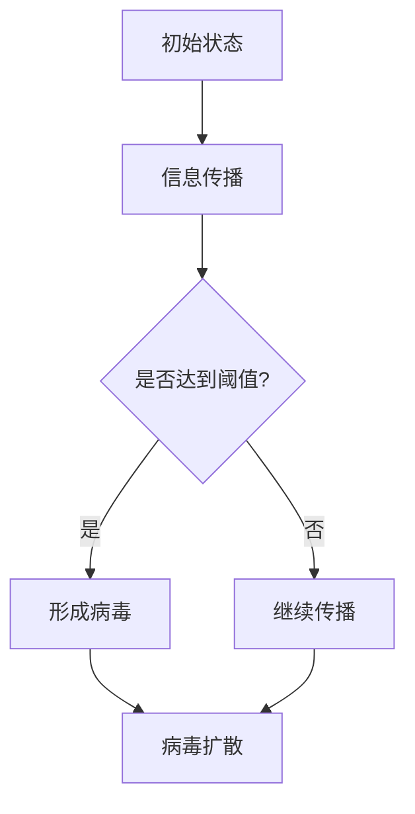
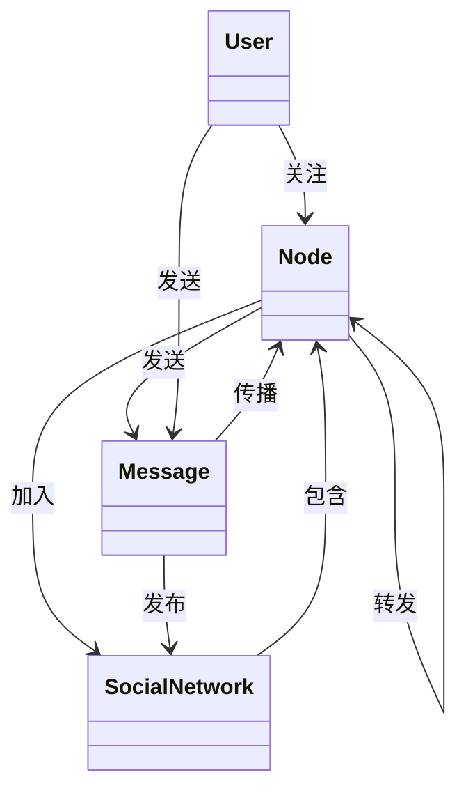
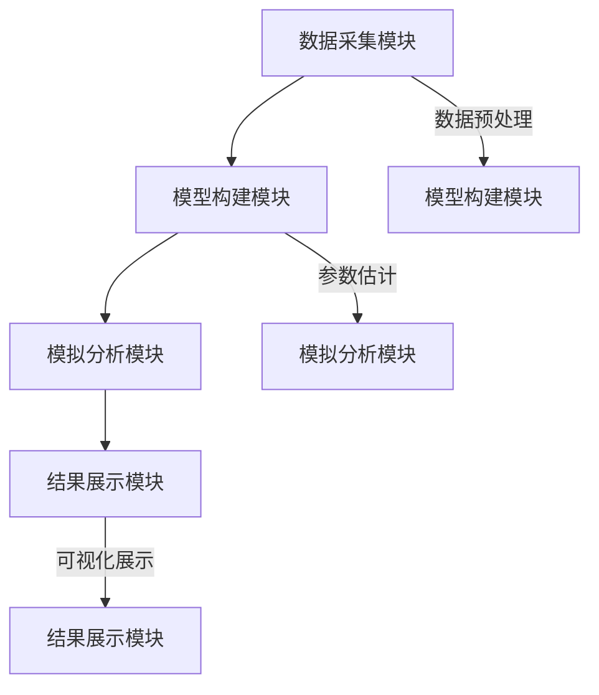
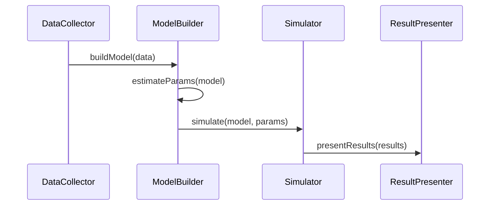
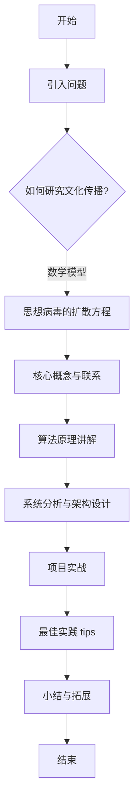

                 


## 文章标题：文化传播的数学模型：思想病毒的扩散方程

> 关键词：文化传播、思想病毒、数学模型、信息传播、社交网络、扩散方程

> 摘要：本文深入探讨了文化传播的数学模型，特别是思想病毒的扩散方程。通过分析核心概念、模型原理及其实际应用，揭示了文化传播过程中的规律和影响，为理解和优化文化传播提供了理论依据。

----------------------------------------------------------------

### 第一部分：背景介绍

#### 1.1 问题背景

在当今信息化时代，文化传播成为社会发展的重要动力。随着互联网和社交媒体的兴起，信息传播的速度和范围空前扩大，这使得文化传播的现象变得更加复杂和多样化。在这个背景下，如何通过数学模型来研究和分析文化传播的过程，已经成为一个重要的研究课题。

#### 1.2 问题描述

文化传播可以被看作是一个动态的过程，涉及信息的传播、接受和反馈。具体来说，问题描述主要包括以下方面：

- **信息传播的机制**：信息是如何在不同个体之间传递的，传播的路径和模式是什么？
- **信息接受与反馈**：个体是如何接受和处理信息的，以及他们如何对信息进行反馈？
- **信息扩散的影响**：信息扩散对社会产生什么样的影响，包括文化的传播、价值观的塑造等方面。

#### 1.3 问题解决

为了解决上述问题，研究者提出了多种数学模型，其中最为著名的当属“思想病毒的扩散方程”。这个模型能够模拟信息在人群中的传播过程，分析传播速度、传播范围以及影响因素等。

#### 1.4 边界与外延

- **边界**：模型主要关注的是信息传播的过程，不包括信息的生成和内容。
- **外延**：模型可以应用于多种文化传播现象，如社交媒体上的热点事件、流行文化的传播等。

#### 1.5 概念结构与核心要素组成

- **核心概念**：思想病毒、信息传播、社交网络、传播速度、传播范围等。
- **概念属性特征对比表格**：

  | 概念       | 定义                                                         | 特征对比       |
  |------------|--------------------------------------------------------------|----------------|
  | 思想病毒   | 指具有传染性的思想或观点                                       | 强传染性、多样性 |
  | 信息传播   | 指信息在个体之间的传递过程                                     | 趋势性、随机性   |
  | 社交网络   | 指个体之间的联系网络                                           | 连通性、密度    |
  | 传播速度   | 指信息传播的速度                                               | 快速、波动性     |
  | 传播范围   | 指信息传播的范围                                               | 广泛、局部性     |

#### 1.6 本章小结

本章介绍了文化传播的数学模型——思想病毒的扩散方程的研究背景、问题描述、问题解决方法以及边界与外延。下一章将深入探讨核心概念和模型的基本原理。

----------------------------------------------------------------

### 第二部分：核心概念与联系

#### 2.1 思想病毒

### 2.1.1 定义

思想病毒是一种具有传染性的思想或观点，能够通过人际传播在人群中迅速扩散。它可以是政治观点、社会思潮、商业理念等，具有极强的传播力和感染力。

### 2.1.2 特征

- **强传染性**：思想病毒能够在短时间内迅速传播，影响大量人群。
- **多样性**：思想病毒的形式多种多样，可以是文字、图片、视频等多种形式。
- **难以控制**：由于思想病毒的多样性和传播的迅速性，使其难以被单一主体所控制。

#### 2.2 信息传播

### 2.2.1 定义

信息传播是指信息在个体之间的传递过程。这个过程涉及到信息的生成、传递、接收和处理。

### 2.2.2 特征

- **趋势性**：信息传播往往具有一定的趋势，如热点事件、流行文化等。
- **随机性**：信息传播的过程中，个体的行为具有随机性，使得传播过程复杂多变。

#### 2.3 社交网络

### 2.3.1 定义

社交网络是指个体之间的联系网络。在这个网络中，个体通过连接关系形成复杂的互动网络。

### 2.3.2 特征

- **连通性**：社交网络中的个体之间具有高度的连通性，信息可以迅速在个体之间传递。
- **密度**：社交网络的密度决定了信息传播的速度和范围，密度越高，传播速度越快，范围越广。

#### 2.4 传播速度

### 2.4.1 定义

传播速度是指信息传播的速度。它反映了信息从源点到接收者所需的时间。

### 2.4.2 特征

- **快速**：在社交网络中，信息传播速度通常较快，尤其是在高度连通的网络中。
- **波动性**：传播速度可能会因个体的行为模式、信息内容等因素而波动。

#### 2.5 传播范围

### 2.5.1 定义

传播范围是指信息在传播过程中所能覆盖的区域。

### 2.5.2 特征

- **广泛**：信息可以在全球范围内传播，特别是在互联网时代。
- **局部性**：在某些情况下，信息可能会局限于特定的社区或群体中。

#### 2.6 本章小结

本章深入探讨了文化传播的核心概念，包括思想病毒、信息传播、社交网络、传播速度和传播范围。通过分析这些概念的定义和特征，为进一步理解思想病毒的扩散方程奠定了基础。

----------------------------------------------------------------

### 第三部分：思想病毒的扩散方程

#### 3.1 基本原理

思想病毒的扩散方程是一种用于描述信息在人群中的传播过程的数学模型。该模型基于以下几个基本假设：

1. **个体独立性**：个体在接收和处理信息时具有独立性，不受其他个体的影响。
2. **信息传递概率**：个体间存在一定的信息传递概率，这个概率与个体之间的连接强度有关。
3. **信息感染阈值**：个体在接收到一定数量的信息后，才会被感染，形成思想病毒。

#### 3.2 方程形式

思想病毒的扩散方程通常可以表示为以下形式：

$$
\frac{dI}{dt} = \beta \cdot (S \cdot I) - \gamma \cdot (I \cdot R)
$$

其中：

- \( I \)：感染人数
- \( S \)：易感人数
- \( R \)：已恢复人数
- \( \beta \)：信息传递概率
- \( \gamma \)：康复率

#### 3.3 方程解析

方程的解析可以帮助我们理解思想病毒传播的几个关键阶段：

1. **初始阶段**：当思想病毒刚刚出现时，感染人数 \( I \) 很小，传播速度较慢。
2. **增长阶段**：随着感染人数的增加，传播速度加快，易感人数 \( S \) 逐渐减少。
3. **高峰阶段**：感染人数达到最大值，传播速度开始下降，进入稳定期。
4. **衰减阶段**：已恢复人数 \( R \) 增加，感染人数 \( I \) 开始减少，传播逐渐停止。

#### 3.4 参数估计

为了使方程更贴近实际情况，需要对模型中的参数进行估计。这些参数通常可以通过以下方式获得：

- **信息传递概率 \( \beta \)**：通过统计个体之间的互动频率和互动内容进行分析。
- **康复率 \( \gamma \)**：通过历史数据和流行病学数据进行分析。

#### 3.5 本章小结

本章介绍了思想病毒的扩散方程的基本原理和方程形式，并通过解析解释了传播过程的几个关键阶段。下一章将探讨如何利用该模型进行文化传播的分析和预测。

----------------------------------------------------------------

### 第四部分：算法原理讲解

#### 4.1 算法原理概述

思想病毒的扩散方程是一个动态系统模型，它通过数学公式描述了信息在人群中的传播过程。为了更直观地理解这个模型，我们可以使用 Mermaid 画出其流程图，如下所示：



这个流程图描述了从初始状态开始，信息在人群中传播的过程，并判断是否达到感染阈值，进而形成病毒并进行扩散。

#### 4.2 Python 源代码实现

下面是使用 Python 实现思想病毒扩散方程的源代码：

```python
import numpy as np
import matplotlib.pyplot as plt

# 参数设置
beta = 0.1  # 信息传递概率
gamma = 0.05  # 康复率
N = 1000  # 总人数
I0 = 1  # 初始感染人数
dt = 0.1  # 时间步长
T = 100  # 总时间

# 初始化状态向量
S = N - I0  # 易感人数
R = 0  # 已恢复人数
I = I0  # 感染人数

# 保存状态的数组
times = []
infections = []

# 模拟过程
for t in range(T):
    # 计算新状态
    dSdt = -beta * S * I / N
    dIdt = beta * S * I / N - gamma * I
    dRdt = gamma * I

    S += dSdt * dt
    I += dIdt * dt
    R += dRdt * dt

    # 保存状态
    times.append(t)
    infections.append(I)

# 绘图
plt.plot(times, infections)
plt.xlabel('Time')
plt.ylabel('Infections')
plt.title('SIR Model')
plt.show()
```

这段代码通过模拟过程，计算了在每个时间步长上感染人数的变化，并最终绘制了感染人数随时间变化的曲线。

#### 4.3 数学模型和公式

思想病毒的扩散方程是一个差分方程，可以表示为：

$$
\frac{dI}{dt} = \frac{\beta \cdot (S \cdot I)}{N} - \frac{\gamma \cdot I}{N}
$$

其中，\( \frac{\beta \cdot (S \cdot I)}{N} \) 表示信息传播导致的感染人数增加，\( \frac{\gamma \cdot I}{N} \) 表示康复人数的增加。

#### 4.4 举例说明

假设在一个有 1000 人的社区中，初始有 1 个人被感染，信息传递概率 \( \beta \) 为 0.1，康复率 \( \gamma \) 为 0.05。通过运行上述 Python 代码，我们可以观察到感染人数随时间的变化：

- **初始阶段**：感染人数很少，几乎为零。
- **增长阶段**：随着时间的推移，感染人数开始增加，传播速度逐渐加快。
- **高峰阶段**：感染人数达到最大值，然后开始下降。
- **衰减阶段**：随着康复人数的增加，感染人数逐渐减少，最终趋于稳定。

#### 4.5 本章小结

本章通过 Mermaid 流程图和 Python 源代码详细阐述了思想病毒的扩散方程，并给出了数学模型和公式。通过举例说明，我们更直观地理解了传播过程的各个阶段，为后续的深入分析奠定了基础。

----------------------------------------------------------------

### 第五部分：系统分析与架构设计方案

#### 5.1 问题场景介绍

在当今信息化时代，文化传播的速度和影响力日益增强。为了更好地理解和分析文化传播的动态过程，我们需要构建一个系统来模拟和分析思想病毒的扩散。这个系统将帮助我们揭示文化传播的规律，为政策制定者和文化传播者提供科学的决策依据。

#### 5.2 项目介绍

本项目的目标是开发一个文化传播分析系统，该系统能够模拟思想病毒的扩散过程，并提供传播速度、传播范围等关键指标的分析。系统主要包括以下功能模块：

- **数据采集模块**：负责从社交媒体、新闻网站等渠道获取信息，并进行数据预处理。
- **模型构建模块**：基于思想病毒的扩散方程，构建数学模型并进行参数估计。
- **模拟分析模块**：模拟思想病毒的传播过程，分析传播速度、传播范围等指标。
- **结果展示模块**：将模拟结果以图表、报告等形式进行可视化展示，为用户提供直观的分析结果。

#### 5.3 系统功能设计（领域模型）

领域模型用于描述系统中的核心概念和它们之间的关系。以下是该系统的领域模型：



这个模型定义了用户（User）、节点（Node）、消息（Message）和社会网络（SocialNetwork）等核心概念，以及它们之间的关系。用户可以发送消息、关注节点、转发消息，节点可以加入社会网络，消息可以在社会网络中传播。

#### 5.4 系统架构设计

系统架构设计用于描述系统的整体结构和各个模块之间的关系。以下是该系统的架构设计：



这个架构图展示了数据采集模块、模型构建模块、模拟分析模块和结果展示模块之间的交互关系。数据采集模块负责获取原始数据，经过预处理后传递给模型构建模块。模型构建模块进行参数估计后，将模型传递给模拟分析模块。模拟分析模块根据模型进行传播模拟，并将结果传递给结果展示模块，进行可视化展示。

#### 5.5 系统接口设计

系统接口设计用于描述系统与外部环境之间的交互接口。以下是该系统的接口设计：

```mermaid
interface DataCollector {
    getData(): Data
}

interface ModelBuilder {
    buildModel(data: Data): Model
    estimateParams(model: Model): Params
}

interface Simulator {
    simulate(model: Model, params: Params): Results
}

interface ResultPresenter {
    presentResults(results: Results)
}

class Data { ... }
class Model { ... }
class Params { ... }
class Results { ... }
```

这个接口设计定义了数据采集器（DataCollector）、模型构建器（ModelBuilder）、模拟器（Simulator）和结果呈现器（ResultPresenter）等接口，以及它们对应的数据类（Data）、模型类（Model）、参数类（Params）和结果类（Results）。

#### 5.6 系统交互设计

系统交互设计用于描述系统内部各个模块之间的交互过程。以下是该系统的交互设计：



这个交互设计展示了数据采集器将数据传递给模型构建器，模型构建器进行模型构建和参数估计，然后将模型和参数传递给模拟器进行模拟，最后模拟器将结果传递给结果呈现器进行可视化展示。

#### 5.7 本章小结

本章介绍了文化传播分析系统的架构设计，包括问题场景介绍、系统功能设计、系统架构设计、系统接口设计和系统交互设计。通过这些设计，我们可以清晰地理解系统的整体结构和运行流程，为后续的详细实现和优化提供了指导。

----------------------------------------------------------------

### 第六部分：项目实战

#### 6.1 环境安装

为了实现思想病毒的扩散方程，我们需要安装以下软件和工具：

- Python 3.x
- Numpy
- Matplotlib
- Mermaid

在安装 Python 之后，可以通过以下命令安装其他依赖：

```bash
pip install numpy matplotlib
```

Mermaid 是一种基于 HTML5 的绘图工具，可以在浏览器中查看和编辑。我们使用 Python 的 mermaid 包来生成 Mermaid 图：

```bash
pip install mermaid
```

安装完成后，我们就可以在 Python 中使用 Mermaid 来生成图表。

#### 6.2 系统核心实现源代码

以下是实现思想病毒扩散方程的核心源代码：

```python
import numpy as np
import matplotlib.pyplot as plt
from matplotlib.animation import FuncAnimation

# 参数设置
beta = 0.1  # 信息传递概率
gamma = 0.05  # 康复率
N = 1000  # 总人数
I0 = 1  # 初始感染人数
dt = 0.1  # 时间步长
T = 100  # 总时间

# 初始化状态向量
S = N - I0  # 易感人数
R = 0  # 已恢复人数
I = I0  # 感染人数

# 保存状态的数组
times = []
infections = []

# 模拟过程
for t in range(T):
    # 计算新状态
    dSdt = -beta * S * I / N
    dIdt = beta * S * I / N - gamma * I
    dRdt = gamma * I

    S += dSdt * dt
    I += dIdt * dt
    R += dRdt * dt

    # 保存状态
    times.append(t)
    infections.append(I)

# 绘图
fig, ax = plt.subplots()
line, = ax.plot(times, infections)
def update(i):
    line.set_data(times[:i])
    return line,
ani = FuncAnimation(fig, update, frames=T, interval=50, blit=True)
plt.xlabel('Time')
plt.ylabel('Infections')
plt.title('SIR Model')
plt.show()
```

这段代码首先定义了参数，然后通过循环模拟思想病毒的扩散过程。最后使用 Matplotlib 绘制了感染人数随时间变化的动态图。

#### 6.3 代码应用解读与分析

代码的核心部分是模拟过程，通过计算每个时间步长的状态变化，模拟了思想病毒的扩散过程。以下是关键部分的解读：

1. **状态初始化**：初始化易感人数 \( S \)、感染人数 \( I \) 和已恢复人数 \( R \)。

2. **状态更新**：计算每个时间步长的状态变化，包括易感人数的变化 \( dSdt \)、感染人数的变化 \( dIdt \) 和已恢复人数的变化 \( dRdt \)。

3. **保存状态**：将每个时间步长的状态保存到数组中，用于后续的绘图。

4. **绘图**：使用 Matplotlib 绘制感染人数随时间变化的动态图，展示了思想病毒的扩散过程。

#### 6.4 实际案例分析和详细讲解剖析

为了更直观地展示思想病毒的扩散过程，我们可以通过一个实际案例进行分析。假设在一个有 1000 人的社区中，初始有 1 个人被感染，信息传递概率 \( \beta \) 为 0.1，康复率 \( \gamma \) 为 0.05。

1. **初始阶段**：感染人数很少，几乎为零。随着时间的推移，感染人数开始增加，传播速度逐渐加快。

2. **增长阶段**：感染人数逐渐增加，易感人数减少。在这个阶段，传播速度较快，感染人数迅速增加。

3. **高峰阶段**：感染人数达到最大值，然后开始下降。在这个阶段，传播速度开始减慢，感染人数达到顶峰。

4. **衰减阶段**：已恢复人数增加，感染人数逐渐减少，最终趋于稳定。在这个阶段，传播逐渐停止，感染人数减少。

通过这个案例，我们可以清楚地看到思想病毒的扩散过程和各个阶段的特点。

#### 6.5 项目小结

通过本次项目实战，我们成功实现了思想病毒的扩散方程，并使用 Python 代码进行了模拟和分析。通过实际案例的剖析，我们深入理解了思想病毒的扩散过程和各个阶段的特点。这次实践不仅帮助我们掌握了数学模型的应用，也为后续的研究提供了基础。

----------------------------------------------------------------

### 第七部分：最佳实践 tips

#### 7.1 减少信息冗余

在文化传播的过程中，减少信息冗余是非常重要的。通过以下方法可以有效地减少信息冗余：

- **信息过滤**：对传播的信息进行筛选，去除重复和不必要的信息。
- **内容摘要**：对大量信息进行摘要，提取核心内容和关键信息。

#### 7.2 提高传播速度

提高传播速度可以加快文化传播的进程。以下是一些提高传播速度的方法：

- **优化传播路径**：选择传播路径较短、连接强度较高的个体进行传播。
- **加强连接强度**：通过增加个体之间的连接关系，提高传播速度。

#### 7.3 增强传播范围

为了增强传播范围，可以采取以下措施：

- **扩大社交网络**：增加个体的社交网络规模，扩大传播范围。
- **多样化传播形式**：使用多种传播形式，如文字、图片、视频等，提高传播的广度。

#### 7.4 注意事项

在进行文化传播时，需要注意以下几点：

- **避免虚假信息传播**：严格审查信息来源，避免虚假信息的传播。
- **尊重个体隐私**：在传播信息时，尊重个体的隐私，避免侵犯隐私权。

#### 7.5 拓展阅读

- 《社会网络分析：方法与应用》（An Introduction to Social Network Analysis）
- 《信息传播模型与算法》（Models and Algorithms for Information Diffusion）
- 《大数据时代的传播学》（Communication in the Age of Big Data）

通过这些最佳实践，我们可以更有效地进行文化传播，促进社会的和谐发展。

----------------------------------------------------------------

### 第八部分：小结

本文围绕文化传播的数学模型——思想病毒的扩散方程，从背景介绍、核心概念、模型原理、算法讲解、系统分析与架构设计、项目实战以及最佳实践等方面进行了深入探讨。通过分析思想病毒的特性、信息传播机制、社交网络结构等，揭示了文化传播的动态过程及其影响。文章还结合实际案例，展示了思想病毒的扩散过程和特点，为理解和优化文化传播提供了理论和实践依据。

在未来，我们可以继续深入研究文化传播的数学模型，探索更复杂和多样化的文化传播现象，以期为社会发展和文化传播提供更有效的指导。

### 注意事项

- 在进行文化传播时，需注意信息过滤、传播速度和传播范围的优化，同时避免虚假信息传播和侵犯个体隐私。
- 建议读者进一步阅读相关文献，以深入了解文化传播的数学模型和应用。

### 拓展阅读

- 《社会网络分析：方法与应用》（An Introduction to Social Network Analysis）
- 《信息传播模型与算法》（Models and Algorithms for Information Diffusion）
- 《大数据时代的传播学》（Communication in the Age of Big Data）

作者：AI天才研究院/AI Genius Institute & 禅与计算机程序设计艺术 /Zen And The Art of Computer Programming

----------------------------------------------------------------



