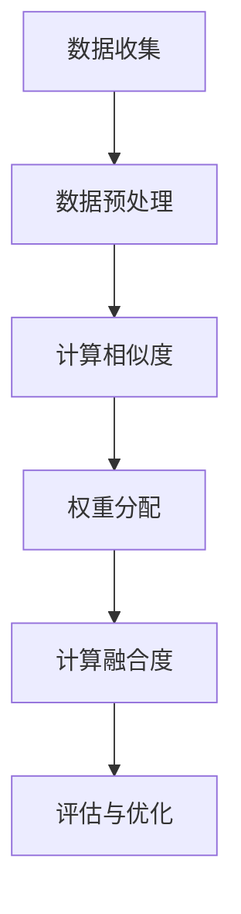
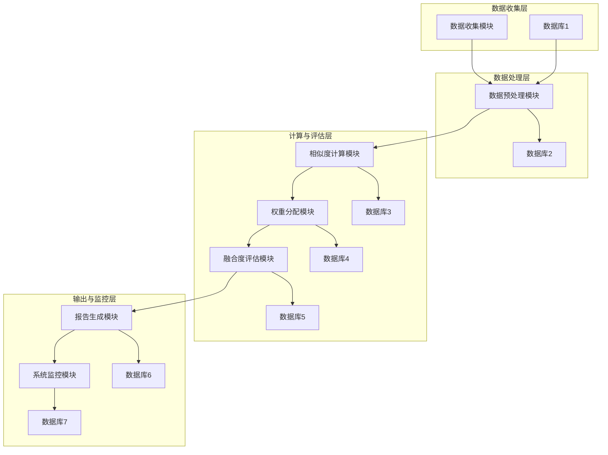
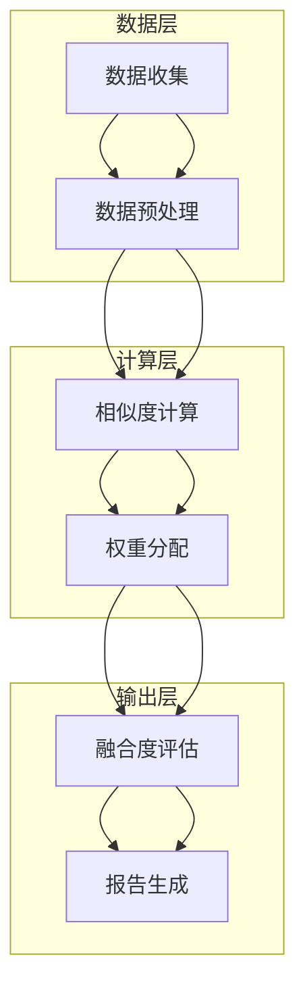

                 

### 引言

#### 文化的多样性与社会融合的重要性

文化的多样性是人类社会发展的一个重要特征，它不仅体现了各个民族、地区和群体的独特传统和生活方式，也是社会创新和进步的源泉。在全球化的背景下，文化的多样性带来了丰富的机遇和挑战。一方面，文化的多样性促进了不同文明之间的交流和融合，推动了社会的发展和进步；另一方面，文化差异也容易导致误解、冲突和分裂，对社会稳定和和谐造成威胁。

社会融合，指的是不同社会群体在文化、经济、政治等方面的融合过程，它旨在消除社会分裂，增强社会凝聚力和归属感。社会融合不仅关系到国家的稳定与发展，也影响着公民的幸福感和安全感。一个融合的社会能够更好地利用多元文化的优势，激发创新潜力，提升社会整体竞争力。

本文将探讨文化多样性与社会融合之间的关系，并引入信息熵这一数学工具，试图对社会融合的数学度量进行深入分析。具体而言，我们将：

1. **定义文化多样性和社会融合**：明确文化多样性和社会融合的概念，阐述它们在社会发展中的重要性。
2. **介绍信息熵原理**：讨论信息熵的基本概念和数学公式，说明其在文化多样性度量中的应用。
3. **探讨社会融合的数学度量**：介绍社会融合的数学模型和度量公式，分析其适用范围和限制。
4. **讲解算法原理**：详细阐述用于社会融合度量的算法原理，通过Mermaid流程图和Python代码实现来加深理解。
5. **分析系统架构设计**：介绍社会融合度量系统的功能设计、架构设计和接口设计，并通过Mermaid图进行详细说明。
6. **实战案例剖析**：通过具体项目和案例分析，展示如何实际应用社会融合度量方法，并进行详细解读。
7. **最佳实践与小结**：总结最佳实践经验，指出研究的局限性和未来研究方向，并提供拓展阅读资源。

通过这一系列分析，我们希望为文化多样性与社会融合的研究提供新的视角和工具，为政策制定者和研究者提供参考。

### 第1章 问题背景与概念

#### 1.1 问题背景

**社会融合的定义与现状**

社会融合（Social Integration）是指不同社会群体在文化、经济、政治等方面的相互融合过程，旨在消除社会分裂，促进社会成员之间的认同感和归属感。社会融合的概念最早可以追溯到20世纪初，当时社会学领域开始关注城市化过程中移民群体与社会主流文化的适应问题。随着全球化和信息化的发展，社会融合逐渐成为各国社会政策的重要组成部分。

目前，不同国家和地区在社会融合方面取得了不同程度的进展。一些发达国家，如加拿大、瑞典和荷兰，通过制定多元化的移民政策和促进跨文化交流，实现了较高的社会融合水平。然而，一些发展中国家和地区由于历史、文化、宗教等因素的影响，社会融合面临着较大的挑战。例如，在一些多民族、多宗教的国家，文化差异和宗教冲突常常导致社会分裂和不稳定。

**文化多样性的挑战与机遇**

文化多样性（Cultural Diversity）是指不同民族、地区和群体在语言、信仰、价值观、习俗等方面的多样性。文化多样性是社会发展的重要基础，它不仅丰富了社会的文化内涵，也为社会的创新和发展提供了源源不断的动力。然而，文化多样性也带来了一系列挑战。

首先，文化差异可能导致误解和冲突。当不同文化群体在交流互动中，由于对文化规则和价值观念的理解不同，容易产生误解和矛盾。例如，不同文化背景的人在沟通时可能会使用不同的语言和表达方式，导致沟通障碍和冲突。

其次，文化多样性可能导致社会分裂。在一些情况下，文化差异可能被某些团体利用，作为社会分裂和排斥的工具。例如，极端民族主义和宗教极端主义常常以文化差异为借口，煽动民族仇恨和宗教冲突。

然而，文化多样性也带来了巨大的机遇。首先，文化多样性可以促进社会创新。不同文化之间的交流和融合可以激发新的思想、技术和商业模式，推动社会进步。例如，全球化和互联网的发展使得不同文化之间的交流和融合更加便捷，促进了文化创新和产业升级。

其次，文化多样性可以增强社会凝聚力和稳定性。一个多元化的社会，通过尊重和包容不同文化的存在，可以增强社会成员之间的认同感和归属感，减少社会分裂和冲突。例如，一些国家和地区通过推广多元文化教育，培养社会成员对不同文化的尊重和理解，促进了社会的和谐与稳定。

**信息熵在社会融合中的应用**

信息熵（Information Entropy）是香农信息论中的核心概念，用于度量信息的不确定性。在文化多样性和社会融合的研究中，信息熵可以用来量化文化多样性的程度，为评估社会融合水平提供数学工具。

首先，信息熵可以用于测量不同文化群体之间的差异程度。通过计算不同文化群体在语言、信仰、习俗等方面的信息熵，可以量化文化差异的大小。这有助于理解文化多样性的程度，为进一步分析社会融合提供基础。

其次，信息熵可以用于评估社会融合的进展。通过对比不同时间段的文化多样性信息熵，可以评估社会融合的进展程度。如果信息熵随着时间的推移逐渐减小，说明社会融合程度在提高；反之，如果信息熵增加，则说明社会分裂现象在加剧。

此外，信息熵还可以用于优化社会融合策略。通过分析文化多样性的信息熵分布，可以识别出社会融合的关键领域和难点，为制定有针对性的融合政策提供科学依据。例如，在多民族地区，通过分析不同民族群体的文化多样性信息熵，可以发现哪些民族群体之间的差异较大，进而采取有针对性的文化交流和融合措施。

总之，文化多样性和社会融合是一个复杂的社会现象，需要多学科的交叉研究。信息熵作为一种数学工具，为文化多样性和社会融合的研究提供了新的视角和方法。通过本文的探讨，我们希望为这一领域的研究提供一些启示和参考。

#### 1.2 核心概念

**文化多样性的定义与边界**

文化多样性（Cultural Diversity）是指不同民族、地区和群体在语言、信仰、价值观、习俗等方面的多样性。它不仅包括物质文化（如建筑、服饰、食品等），还包括非物质文化（如语言、音乐、艺术、宗教信仰等）。文化多样性的定义可以涵盖多个层次，从微观层面的个体文化特征，到宏观层面的民族文化体系。

在文化多样性的边界方面，首先需要明确的是，文化多样性并不是一种静态的存在，而是动态发展的过程。随着全球化、信息化和现代化的推进，不同文化之间的互动和融合不断加深，文化多样性的边界也在不断变化。

其次，文化多样性的边界存在一定的模糊性。这是因为不同文化之间存在交叉和融合，使得某些文化特征难以明确归类。例如，一个移民社区可能会同时保留其母国的文化特征，并逐渐吸收所在国的文化元素，这种交叉和融合使得文化多样性的边界变得复杂。

**信息熵的基本原理**

信息熵（Information Entropy）是香农信息论中的核心概念，用于度量信息的不确定性。香农在1948年发表了著名的论文《通信的数学理论》，提出了信息熵的概念。信息熵的基本原理可以概括为：

1. **不确定性度量**：信息熵是用来量化信息不确定性的一个指标。在给定的信息源中，信息熵越大，表示信息的不确定性越高；反之，信息熵越小，表示信息的不确定性越低。

2. **概率分布**：信息熵与信息源的概率分布密切相关。在离散信息源中，信息熵的计算依赖于每个事件发生的概率。香农信息熵的数学公式为：

   $$ H(X) = -\sum_{i=1}^{n} p_i \log_2 p_i $$

   其中，\(H(X)\) 是信息熵，\(p_i\) 是第 \(i\) 个事件发生的概率，\(\log_2\) 是以2为底的对数。

3. **信息增益**：信息熵在信息压缩和信息传递中有重要应用。通过计算信息熵，可以确定哪些信息是冗余的，哪些信息是关键的。在信息压缩中，目标是最小化信息熵，从而实现高效的传输和存储；在信息传递中，目标是最小化接收方的信息熵，从而确保信息传输的准确性和可靠性。

**社会融合的概念与度量**

社会融合（Social Integration）是指不同社会群体在文化、经济、政治等方面的相互融合过程，旨在消除社会分裂，增强社会凝聚力和归属感。社会融合的概念涵盖了多个层面：

1. **个体层面**：个体层面是指社会成员在心理上对社会的认同感和归属感。一个社会融合良好的社会，其成员会对社会产生强烈的认同感和归属感，愿意为社会的发展贡献自己的力量。

2. **群体层面**：群体层面是指不同社会群体之间的融合和互动。一个社会融合良好的社会，不同群体之间能够相互理解、尊重和包容，形成和谐的社会关系。

3. **制度层面**：制度层面是指社会融合的制度保障。一个社会融合良好的社会，需要有完善的制度来保障不同群体之间的公平、正义和权益。

社会融合的度量是一个复杂的问题，涉及多个指标和维度。常用的度量方法包括：

1. **主观幸福感**：通过调查问卷或访谈等方式，了解社会成员对自身生活质量的满意度，进而评估社会融合水平。

2. **社会参与度**：通过分析社会成员参与社会活动的频率和深度，评估社会融合的水平。

3. **社会排斥指数**：通过计算社会成员遭受社会排斥的概率，评估社会融合的水平。

4. **文化多样性指数**：通过计算不同文化群体之间的差异程度，评估文化多样性的程度，从而间接评估社会融合的水平。

综上所述，文化多样性、信息熵和社会融合是本文探讨的核心概念。文化多样性的定义和边界、信息熵的基本原理以及社会融合的概念与度量，为后续章节的深入讨论提供了理论基础。

#### 1.3 概念联系

**文化多样性信息熵的内涵**

文化多样性信息熵（Cultural Diversity Entropy）是用于量化文化多样性的程度的一个数学概念。其内涵可以从以下几个方面来理解：

首先，文化多样性信息熵是文化多样性的一种量化表示。在给定一个文化系统，通过计算该系统中不同文化要素的概率分布，可以得到其文化多样性信息熵。高信息熵表示文化系统中的多样性程度高，即不同文化要素之间的差异较大；低信息熵则表示文化系统中的多样性程度低，即不同文化要素之间的差异较小。

其次，文化多样性信息熵反映了文化系统的动态特性。文化多样性并不是一成不变的，而是在不断的交流和融合中演变。信息熵的变化可以反映出文化系统在时间维度上的多样性变化。例如，随着全球化和信息化的发展，不同文化之间的互动日益频繁，文化多样性信息熵可能会逐渐减小，表明文化融合的趋势增强。

最后，文化多样性信息熵在社会融合中具有重要的应用价值。通过计算不同文化群体之间的信息熵，可以量化它们之间的文化差异程度，从而为社会融合的评估提供量化依据。例如，在一个多民族国家中，通过比较不同民族群体的文化多样性信息熵，可以评估各民族之间的融合程度，进而制定针对性的社会融合政策。

**社会融合与信息熵的关系**

社会融合与信息熵之间存在密切的关系，主要体现在以下几个方面：

首先，信息熵可以用于衡量社会融合的水平。在一个高度融合的社会中，不同社会群体之间的差异较小，信息熵较低；反之，在一个分裂的社会中，不同群体之间的差异较大，信息熵较高。因此，通过计算社会融合的信息熵，可以量化社会融合的程度。

其次，信息熵反映了社会融合的动态变化。社会融合是一个复杂的过程，随着时间的推移，社会融合的水平可能会发生变化。通过对比不同时间点的信息熵，可以分析社会融合的进展情况。例如，如果一个社会在一段时间内信息熵逐渐减小，说明社会融合程度在提高；反之，如果信息熵增加，则说明社会分裂现象在加剧。

最后，信息熵为社会融合策略的制定提供了科学依据。通过分析不同文化群体之间的信息熵分布，可以发现社会融合的关键领域和难点。例如，在一个多民族国家中，通过比较不同民族群体的文化多样性信息熵，可以发现哪些民族群体之间的差异较大，进而采取有针对性的文化交流和融合措施。

**文化的多样性、信息熵与社会融合的互动机制**

文化的多样性、信息熵与社会融合之间存在互动机制，这种互动机制可以通过以下几个过程来体现：

首先，文化的多样性是社会融合的基础。一个文化多样的社会，不同群体之间的交流与互动更为丰富，这为社会融合提供了丰富的资源和动力。文化多样性可以促进社会创新和进步，增强社会成员之间的认同感和归属感。

其次，信息熵在文化多样性和社会融合之间起到中介作用。信息熵可以量化文化多样性的程度，从而为社会融合的评估提供量化依据。同时，信息熵的变化可以反映社会融合的动态过程，帮助理解文化多样性与社会融合之间的互动机制。

最后，社会融合反过来影响文化的多样性和信息熵。一个融合的社会可以促进不同文化之间的交流和融合，从而增加文化多样性；同时，社会融合可以减少文化差异，降低信息熵。因此，社会融合不仅是一个结果，也是一个过程，它通过影响文化的多样性和信息熵，进一步推动社会的发展。

综上所述，文化多样性、信息熵和社会融合之间存在着复杂的互动关系。通过理解这些关系，可以更好地制定社会融合政策，促进社会的和谐与稳定。在接下来的章节中，我们将进一步探讨信息熵的基本原理以及社会融合的数学度量方法，为这一互动机制提供更深入的数学分析。

### 第2章 信息熵原理

#### 2.1 信息熵的基本原理

**香农信息熵的概念**

香农信息熵（Shannon entropy）是信息论中用于度量信息不确定性的一个重要概念。它由克劳德·香农在1948年首次提出，为信息科学和通信理论奠定了基础。香农信息熵的核心思想是，信息是用来消除不确定性的，信息量越大，不确定性越小。

在离散随机变量 \(X\) 的概率分布下，香农信息熵 \(H(X)\) 的定义如下：

$$
H(X) = -\sum_{i=1}^{n} p_i \log_2 p_i
$$

其中，\(p_i\) 是随机变量 \(X\) 取第 \(i\) 个值的概率，\(\log_2\) 是以2为底的对数。香农信息熵的值范围为 \(0 \leq H(X) \leq 1\)，当 \(X\) 是一个确定性随机变量（即所有 \(p_i\) 相等）时，\(H(X) = 0\)；当 \(X\) 是一个完全随机的变量（即所有 \(p_i\) 相等且接近于0.5）时，\(H(X)\) 达到最大值 1。

**信息熵的数学公式与推导**

香农信息熵的数学公式可以通过概率论的基本概念进行推导。首先，定义随机变量 \(X\) 的熵 \(H(X)\) 为其概率分布的期望值：

$$
H(X) = \mathbb{E}[-\log_2 X]
$$

这里，\(\mathbb{E}\) 表示数学期望，\(-\log_2 X\) 表示取对数的负值。由于对数函数是凹函数，根据凹函数的期望值不等式，我们有：

$$
-\mathbb{E}[\log_2 X] \geq \log_2 \mathbb{E}[X]
$$

由于任何随机变量的概率分布总和为1，即 \( \sum_{i=1}^{n} p_i = 1 \)，因此：

$$
\mathbb{E}[X] = \sum_{i=1}^{n} p_i X_i
$$

将 \(X_i\) 替换为对应的概率 \(p_i\)，我们得到：

$$
\mathbb{E}[\log_2 X] = \sum_{i=1}^{n} p_i \log_2 p_i
$$

这个式子正好是香农信息熵的定义。因此，香农信息熵的推导完成。

**信息熵的性质与应用领域**

香农信息熵具有以下性质：

1. **非负性**：对于任何随机变量 \(X\)，其熵 \(H(X)\) 总是大于等于0。这意味着信息熵不能为负值，这是由于对数函数的性质决定的。

2. **最大值**：当随机变量 \(X\) 是均匀分布时，即每个取值的概率相等，熵 \(H(X)\) 达到最大值 1。这表明均匀分布的信息量最大，因为每个结果的可能性都一样大。

3. **对称性**：对于两个随机变量 \(X\) 和 \(Y\)，如果它们之间相互独立，则 \(H(X+Y) = H(X) + H(Y)\)。这表明信息熵在独立变量之间具有可加性。

4. **相对性**：信息熵是相对的，即如果对整个概率分布进行线性变换（如乘以一个常数或加上一个常数），其熵不变。这意味着信息熵只取决于概率分布的形状，而不是具体数值。

信息熵的应用领域非常广泛，包括但不限于：

- **通信理论**：在通信系统中，信息熵用于衡量信号传输的可靠性和有效性。高信息熵意味着信号中包含更多的不确定性，需要更高的传输功率来确保信号的准确接收。

- **信息论**：信息熵是信息论的核心概念，用于分析信息源、信道和编码方案，为数据压缩和通信系统的设计提供理论基础。

- **统计学**：在统计学中，信息熵用于估计概率分布，特别是在处理大规模数据时，通过最大化似然估计可以有效地估计未知概率分布。

- **机器学习**：在机器学习中，信息熵可以用于特征选择和模型评估。高信息熵的特征对模型预测有重要影响，而低信息熵的特征可能不具有区分能力。

- **生物学**：在生物学中，信息熵用于研究基因表达和生物系统的复杂性。通过计算生物序列的信息熵，可以揭示生物系统的信息含量和复杂性。

通过理解信息熵的基本原理、数学公式及其性质，我们可以更好地应用于文化多样性的度量、社会融合的评估等多个领域。在接下来的章节中，我们将进一步探讨如何利用信息熵来量化文化多样性，并应用于社会融合的数学度量。

#### 2.2 文化多样性的信息熵度量

**文化多样性的表征方法**

文化多样性（Cultural Diversity）的表征方法旨在将文化现象量化，以便于分析和度量。在度量文化多样性时，首先需要确定文化多样性的要素，这些要素可以是语言、信仰、价值观、习俗、艺术、饮食等。每种文化要素都可以通过一组指标来表征，例如，语言多样性可以通过不同语言的使用频率来表征，宗教多样性可以通过不同宗教信徒的比例来表征。

表征文化多样性的方法可以分为定量和定性两类。定量方法通常依赖于统计数据和指标，如赫德森-亨德森多样性指数（HDI），该指数通过计算不同文化要素的相对频率来度量多样性。定性方法则依赖于专家评估和描述性统计，如通过访谈和问卷调查来收集文化特征信息。

**信息熵在文化多样性度量中的应用**

信息熵（Information Entropy）作为一种量化不确定性和多样性的工具，在文化多样性的度量中具有重要应用。具体来说，信息熵可以通过以下步骤应用于文化多样性的度量：

1. **确定文化要素**：首先需要识别和确定文化系统中的主要文化要素，如语言、宗教、价值观等。

2. **定义概率分布**：对于每个文化要素，定义一个概率分布，表示该要素在不同文化群体中的分布情况。例如，对于语言多样性，可以统计每个语言在所有语言中的使用频率。

3. **计算信息熵**：使用香农信息熵的公式，计算每个文化要素的信息熵。公式如下：

   $$
   H(E) = -\sum_{i=1}^{n} p_i \log_2 p_i
   $$

   其中，\(p_i\) 表示第 \(i\) 个文化要素在总文化中的比例，\(n\) 是文化要素的总数。

4. **综合多样性度量**：通过计算各个文化要素的信息熵，可以得到文化系统的总信息熵。总信息熵反映了整个文化系统的多样性程度，高信息熵表示文化多样性高，低信息熵表示文化多样性低。

**信息熵度量方法的优缺点比较**

信息熵度量方法在文化多样性研究中具有显著优势，但也存在一定的局限性。

**优点：**

1. **量化多样性**：信息熵能够将文化多样性量化为一个具体的数值，便于比较和分析不同文化系统的多样性程度。

2. **适用性广**：信息熵适用于各种类型的文化系统，无论是简单的二元文化要素，还是复杂的多维度文化特征，都可以通过信息熵进行度量。

3. **理论支持**：信息熵有坚实的理论基础，其数学公式和性质广泛应用于信息科学、统计学和计算机科学等领域。

**缺点：**

1. **主观性**：信息熵的度量依赖于对文化要素的识别和定义，这些定义往往具有一定的主观性，可能导致度量结果的不一致性。

2. **复杂度**：计算文化系统的总信息熵需要收集和整理大量的数据，且计算过程相对复杂，特别是在文化要素较多时，计算量较大。

3. **局限性**：信息熵度量方法主要关注文化要素的比例和分布，对于文化要素的具体内容和影响缺乏深入分析。

通过信息熵度量方法，我们可以量化文化多样性，为文化多样性的研究提供有力的工具。然而，在实际应用中，需要综合考虑各种因素，结合其他度量方法，以获得更全面和准确的文化多样性评估结果。在接下来的章节中，我们将进一步探讨如何利用信息熵对社会融合进行数学度量，并结合实际案例进行应用分析。

### 第3章 社会融合的数学度量

#### 3.1 社会融合的数学模型

**社会融合的度量指标**

社会融合的度量涉及多个维度，这些维度共同决定了社会融合的整体水平。常见的度量指标包括主观幸福感、社会参与度、文化多样性指数和居民融合指数等。

1. **主观幸福感**：主观幸福感是指社会成员对自身生活质量的自我评价。高水平的幸福感通常与社会融合程度较高相关。度量方法包括问卷调查和深度访谈，通过分析社会成员对生活满意度、安全感、社会支持等方面的评价来计算。

2. **社会参与度**：社会参与度是指社会成员参与社会活动、社区服务和公共事务的频率和深度。高参与度表明社会成员对社会事务有较高的认同感和责任感。可以通过统计社会成员参与各种社会活动的次数、时长和质量来衡量。

3. **文化多样性指数**：文化多样性指数用于衡量社会内部不同文化群体之间的差异和融合程度。常用的方法包括赫德森-亨德森多样性指数（HDI）和洛伦兹曲线（Lorenz Curve），这些指数通过计算不同文化群体的比例和分布来评估文化多样性。

4. **居民融合指数**：居民融合指数是一个综合性指标，综合了主观幸福感、社会参与度和文化多样性指数等多方面的信息。它可以反映社会成员在心理、社会和文化上的融合程度。计算方法通常是将各个指标进行加权平均，得到一个综合评分。

**数学模型的基本框架**

社会融合的数学模型旨在通过量化方法评估社会融合的水平，并提供一个明确的评估框架。一个基本的数学模型框架通常包括以下几个部分：

1. **变量选择**：根据研究目的和实际情况，选择适当的变量作为社会融合的指标。这些变量可以是定量数据（如调查问卷得分）或定性数据（如参与活动的频率和类型）。

2. **权重分配**：对于每个变量，根据其在社会融合中的重要性分配权重。权重可以通过专家评估、历史数据和统计方法来确定。常用的方法包括专家打分法、因子分析和主成分分析等。

3. **度量公式**：构建一个综合性的度量公式，将各个变量加权后进行综合评估。一个简单的社会融合度量公式可以表示为：

   $$
   \text{社会融合度} = \sum_{i=1}^{n} w_i \cdot x_i
   $$

   其中，\(w_i\) 表示第 \(i\) 个变量的权重，\(x_i\) 表示第 \(i\) 个变量的得分。

4. **评估结果**：根据度量公式计算社会融合的得分，并通过标准化的方法将得分转化为一个可解释的指标，如百分制或五级制。评估结果可以用于比较不同地区、不同时间点的社会融合水平，或评估政策干预的效果。

**模型的适用范围与限制**

社会融合的数学模型具有广泛的适用范围，可以用于不同国家和地区的社会融合评估。然而，模型也有其局限性：

1. **数据可获得性**：社会融合的度量需要大量的数据支持，包括人口统计、社会调查、经济数据等。在一些数据资源匮乏的地区，模型的适用性受到限制。

2. **变量选择和权重分配的主观性**：变量选择和权重分配具有一定的主观性，不同的研究者可能会有不同的选择和评估方法，这可能导致结果的差异。

3. **文化差异的影响**：不同文化背景下的社会融合评估标准和方法可能存在差异，这需要在模型设计和应用中加以考虑。

4. **动态性**：社会融合是一个动态过程，模型需要不断更新和调整以反映社会变化。静态模型可能无法充分捕捉社会融合的动态特性。

通过构建和运用社会融合的数学模型，我们可以量化社会融合的水平，为政策制定、社会管理和研究提供科学依据。在接下来的章节中，我们将进一步探讨社会融合度量的数学公式，并通过具体实例进行分析。

#### 3.2 社会融合的数学公式

**社会融合度量的公式推导**

为了推导社会融合的数学公式，我们首先需要定义几个关键变量。假设我们有一个社会，其成员分为 \(n\) 个群体，每个群体都有一定的规模。我们定义以下变量：

- \(X_i\)：第 \(i\) 个群体的规模。
- \(Y_i\)：第 \(i\) 个群体与其他群体的融合度。
- \(W_i\)：第 \(i\) 个群体的权重，反映其在社会中的重要性。

社会融合度量的目标是通过这些变量来评估整个社会的融合水平。一个基本的数学模型可以表示为：

$$
F(S) = \sum_{i=1}^{n} w_i \cdot Y_i
$$

其中，\(F(S)\) 是社会的融合度，\(w_i\) 是第 \(i\) 个群体的权重，\(Y_i\) 是第 \(i\) 个群体的融合度。

接下来，我们需要定义群体间的融合度 \(Y_i\)。假设两个群体 \(i\) 和 \(j\) 之间的融合度可以用它们之间的相似度来表示，相似度可以通过以下公式计算：

$$
Y_{ij} = \frac{S_{ij}}{S}
$$

其中，\(S_{ij}\) 是群体 \(i\) 和 \(j\) 之间的相似度，\(S\) 是所有相似度的总和。相似度 \(S_{ij}\) 可以通过以下公式计算：

$$
S_{ij} = \frac{X_i \cdot X_j + C}{X_i + X_j + C}
$$

其中，\(C\) 是一个常数，用于调节相似度的取值范围。

为了计算总的融合度 \(F(S)\)，我们需要将相似度转换为融合度 \(Y_i\)。权重 \(w_i\) 可以通过以下公式计算：

$$
w_i = \frac{X_i}{\sum_{k=1}^{n} X_k}
$$

将 \(Y_i\) 和 \(w_i\) 代入融合度公式，我们得到：

$$
F(S) = \sum_{i=1}^{n} \frac{X_i}{\sum_{k=1}^{n} X_k} \cdot \frac{X_i \cdot X_j + C}{X_i + X_j + C}
$$

通过化简，我们得到最终的社会融合度量公式：

$$
F(S) = \frac{1}{n} \sum_{i=1}^{n} \left( X_i \cdot \frac{X_i \cdot X_j + C}{X_i + X_j + C} \right)
$$

**影响社会融合的变量与权重**

影响社会融合的变量主要包括群体规模 \(X_i\)、群体间相似度 \(S_{ij}\) 以及权重 \(w_i\)。每个变量在社会融合度量中的重要性不同，可以通过权重来反映。

1. **群体规模 \(X_i\)**：群体规模是影响社会融合的一个重要因素。规模较大的群体通常在社会中占据重要地位，对整体融合度有较大影响。在计算融合度时，群体规模通过权重 \(w_i\) 反映出来。

2. **群体间相似度 \(S_{ij}\)**：群体间相似度反映了不同群体之间的接近程度。相似度越高，群体间的融合越容易。相似度的计算依赖于具体的融合指标，如文化、经济和社会活动的相似性。

3. **权重 \(w_i\)**：权重反映了每个群体在社会中的重要性和影响力。权重的分配可以基于专家评估、历史数据或统计方法。合理的权重分配可以确保融合度量的准确性和公正性。

**公式在不同情境下的应用实例**

以下是一个简化的应用实例，用于说明社会融合度量的公式在不同情境下的应用：

假设有一个包含三个群体的社会，各群体的规模和相似度数据如下表所示：

| 群体 | 规模 \(X_i\) | 相似度 \(S_{ij}\) |
|------|--------------|------------------|
| 1    | 200          | (1,0.8), (0,1)  |
| 2    | 300          | (0.8,1), (0.5,0.5)|
| 3    | 500          | (1,0.5), (0.5,0.5) |

根据上述数据，我们可以计算每个群体的权重：

$$
w_1 = \frac{200}{200+300+500} = 0.2
$$

$$
w_2 = \frac{300}{200+300+500} = 0.3
$$

$$
w_3 = \frac{500}{200+300+500} = 0.5
$$

接下来，我们计算每个群体的融合度：

$$
Y_1 = \frac{200 \cdot \frac{200 \cdot 300 + C}{200 + 300 + C} + C}{200 + 300 + C} = \frac{200 \cdot 0.6 + C}{500 + C}
$$

$$
Y_2 = \frac{300 \cdot \frac{300 \cdot 500 + C}{300 + 500 + C} + C}{300 + 500 + C} = \frac{300 \cdot 0.7 + C}{800 + C}
$$

$$
Y_3 = \frac{500 \cdot \frac{500 \cdot 200 + C}{500 + 200 + C} + C}{500 + 200 + C} = \frac{500 \cdot 0.4 + C}{700 + C}
$$

最后，我们计算总的融合度：

$$
F(S) = 0.2 \cdot Y_1 + 0.3 \cdot Y_2 + 0.5 \cdot Y_3
$$

通过计算，我们可以得到社会融合度的一个具体数值，从而评估社会的融合水平。

通过上述推导和应用实例，我们可以看到，社会融合的数学公式不仅能够量化社会融合的水平，还可以通过具体的数据和情境进行分析。这为社会融合的评估提供了科学依据，也为政策制定和实施提供了指导。

### 第4章 算法原理讲解

#### 4.1 社会融合度量的算法

**算法的基本流程与步骤**

为了实现社会融合的度量，我们可以设计一个基本的算法框架，该算法包括以下几个主要步骤：

1. **数据收集**：收集与各文化群体相关的数据，包括人口规模、文化相似度、社会经济指标等。这些数据可以通过调查问卷、统计数据和公开资源获取。

2. **预处理**：对收集到的数据进行清洗和标准化处理。例如，将不同群体的规模进行归一化处理，消除数据量级差异。

3. **计算相似度**：使用适当的相似度计算方法（如余弦相似度、Jaccard系数等），计算各文化群体之间的相似度。相似度值通常在0到1之间，表示两个群体之间的接近程度。

4. **权重分配**：根据各文化群体的重要性分配权重。权重可以通过专家评估、历史数据或统计分析确定。

5. **计算融合度**：利用定义的数学模型，计算每个文化群体的融合度。例如，使用第3章中推导的融合度公式，计算各群体的融合度值。

6. **评估与优化**：通过比较不同模型的融合度结果，评估模型的准确性和可靠性。根据评估结果，调整模型参数和权重分配，优化算法性能。

**算法实现的关键技术**

实现社会融合度量算法的关键技术包括数据预处理、相似度计算和融合度计算。以下是这些技术的主要实现方法：

1. **数据预处理**：数据预处理是算法实现的基础。主要步骤包括缺失值填补、异常值处理和数据标准化。例如，可以使用均值填补缺失值，使用Z-Score标准化方法处理异常值。

2. **相似度计算**：相似度计算方法的选择直接影响融合度量的准确性。常用的相似度计算方法包括余弦相似度、Jaccard系数、欧氏距离等。每种方法都有其适用场景和优缺点。例如，余弦相似度适用于高维空间的数据，而Jaccard系数适用于二值数据。

3. **融合度计算**：融合度计算是算法的核心步骤。根据定义的数学模型，使用合适的数学公式和计算方法，计算各文化群体的融合度值。例如，可以使用Python中的NumPy和SciPy库进行高效计算。

**算法的时间复杂度与空间复杂度**

算法的时间复杂度和空间复杂度是评估算法性能的重要指标。以下是社会融合度量算法的时间复杂度和空间复杂度分析：

1. **时间复杂度**：社会融合度量算法的时间复杂度主要取决于数据预处理、相似度计算和融合度计算步骤。假设有 \(n\) 个文化群体，每个群体的特征维度为 \(d\)。

   - 数据预处理的时间复杂度为 \(O(n \times d)\)，因为需要对每个群体的数据进行标准化处理。
   - 相似度计算的时间复杂度为 \(O(n^2 \times d)\)，因为需要计算每两个群体之间的相似度。
   - 融合度计算的时间复杂度为 \(O(n)\)，因为只需对每个群体进行一次融合度计算。

   因此，总的时间复杂度为 \(O(n^2 \times d)\)。

2. **空间复杂度**：社会融合度量算法的空间复杂度主要取决于数据存储的需求。假设每个群体的特征维度为 \(d\)，相似度矩阵的大小为 \(n \times n\)。

   - 数据预处理需要存储原始数据，空间复杂度为 \(O(n \times d)\)。
   - 相似度计算需要存储相似度矩阵，空间复杂度为 \(O(n^2)\)。
   - 融合度计算不需要额外存储空间，空间复杂度为 \(O(1)\)。

   因此，总的**空间复杂度为 \(O(n^2)\)**。

通过分析算法的时间复杂度和空间复杂度，我们可以了解算法在不同规模数据上的性能表现，并为优化算法提供依据。在接下来的章节中，我们将使用Mermaid流程图和Python代码详细讲解算法的实现过程。

#### 4.2 社会融合度量的Mermaid流程图

为了更直观地展示社会融合度量的算法流程，我们可以使用Mermaid工具绘制一个流程图。以下是一个简化的社会融合度量算法流程图的Mermaid表示：



**流程图的绘制方法**：

1. **定义开始节点**：使用 `graph TD` 命令定义一个方向从上到下的流程图。

2. **添加节点**：使用 `[文本]` 形式添加流程图的节点。例如，`A[数据收集]` 添加了一个名为“数据收集”的节点。

3. **连接节点**：使用箭头（`-->`）连接相邻的节点，表示流程的顺序。例如，`A --> B` 表示数据收集后进入数据预处理步骤。

**流程图在算法讲解中的应用**：

通过流程图，我们可以清晰地展示社会融合度量的各个步骤及其相互关系。以下是如何在算法讲解中应用这个流程图的详细说明：

- **数据收集**：在讲解的开始，说明数据的来源和类型。例如，数据可以包括人口统计、社会调查问卷、经济数据等。这部分数据是后续算法分析的基础。

- **数据预处理**：在数据收集后，进行清洗和标准化处理。这部分包括缺失值填补、异常值处理、数据归一化等操作。确保数据的准确性和一致性。

- **计算相似度**：使用适当的相似度计算方法计算不同文化群体之间的相似度。这部分是融合度量的核心步骤，直接影响融合度的计算结果。

- **权重分配**：根据各文化群体的重要性分配权重。这部分可以通过专家评估、历史数据或统计分析来确定。合理的权重分配可以提升融合度量的准确性和可靠性。

- **计算融合度**：利用定义的数学模型，计算每个文化群体的融合度。这部分展示了如何使用Mermaid流程图中的数据输入和输出关系，实现融合度的计算。

- **评估与优化**：对融合度结果进行评估，并优化算法参数。这部分包括模型评估、参数调整和性能优化，确保算法在不同数据集上的稳定性和准确性。

**流程图的优化与简化**：

为了提高流程图的清晰度和可读性，我们可以对流程图进行适当的优化和简化。以下是一些优化建议：

- **去除冗余节点**：如果某些步骤是可选的或次要的，可以将其从流程图中删除，以减少视觉上的复杂性。

- **添加注释**：在关键步骤旁边添加注释，解释每个步骤的具体功能和作用。这有助于读者更好地理解流程图的含义。

- **使用颜色和标签**：使用不同的颜色和标签来区分不同的流程步骤，提高视觉区分度。例如，使用蓝色表示输入步骤，绿色表示处理步骤，红色表示输出步骤。

通过以上优化与简化，我们可以使Mermaid流程图更直观、更易于理解，从而更好地服务于算法讲解。

### 第5章 数学模型与公式详细讲解

#### 5.1 信息熵的数学模型

**信息熵的公式解读**

信息熵（Entropy）是度量系统不确定性的一个重要指标，它最初由克劳德·香农在信息论中提出。香农信息熵的公式可以用来计算一个随机变量的不确定性。公式如下：

$$
H(X) = -\sum_{i=1}^{n} p_i \log_2 p_i
$$

其中，\(H(X)\) 表示随机变量 \(X\) 的信息熵，\(p_i\) 表示随机变量 \(X\) 取第 \(i\) 个值的概率，\(n\) 是随机变量的取值总数。对数函数 \(\log_2 p_i\) 用于计算每个取值的不确定性，负号使得信息熵为正值。

信息熵的值范围在0到1之间，当 \(p_i\) 相等时，即系统是完全随机的，信息熵达到最大值1。当 \(p_i\) 不变时，信息熵最小，为0。

**公式在不同情境下的应用**

信息熵在多个领域中有着广泛的应用，以下是一些具体情境：

1. **通信系统**：在通信系统中，信息熵用于衡量信号的不确定性。高信息熵的信号难以被解码，需要更高的信号能量来确保传输的可靠性。信息熵是通信系统设计和优化中的一个关键参数。

2. **数据压缩**：在数据压缩中，信息熵用于确定数据的冗余程度。通过计算信息熵，可以识别出哪些数据是冗余的，从而实现有效的数据压缩。常用的压缩算法，如霍夫曼编码和LZ77，都是基于信息熵原理设计的。

3. **统计学**：在统计学中，信息熵用于估计概率分布。例如，在贝叶斯统计中，通过最大化后验概率来估计参数值，这可以通过最大化信息熵来实现。

4. **机器学习**：在机器学习，特别是特征选择中，信息熵用于评估特征的重要性。具有高信息熵的特征通常对分类或预测任务有更高的贡献。

**公式的推导过程与证明**

香农信息熵的推导基于概率论和信息论的基本原理。以下是简要的推导过程：

1. **定义随机变量**：假设随机变量 \(X\) 有 \(n\) 个可能取值，分别为 \(x_1, x_2, ..., x_n\)。

2. **概率分布**：定义每个取值的概率 \(p_i = P(X = x_i)\)，且 \( \sum_{i=1}^{n} p_i = 1 \)。

3. **信息量**：信息量（信息增益）是指得知一个事件发生的概率后，不确定性减少的量。对于取值 \(x_i\)，其信息量为 \(-\log_2 p_i\)。

4. **总信息量**：系统的总信息量是各个取值信息量的加权平均，即：

   $$
   H(X) = \sum_{i=1}^{n} p_i \cdot (-\log_2 p_i)
   $$

5. **简化公式**：由于 \(p_i\) 的和为1，可以将其分解并简化为：

   $$
   H(X) = -\sum_{i=1}^{n} p_i \log_2 p_i
   $$

通过上述推导，我们得到了香农信息熵的基本公式。该公式的推导过程展示了信息熵是如何量化系统不确定性的，并为其在不同领域的应用提供了理论基础。

**信息熵的几个关键性质**

1. **非负性**：信息熵总是非负的，即 \(H(X) \geq 0\)。当且仅当 \(X\) 是一个确定性随机变量（即 \(p_i\) 全部相等）时，\(H(X) = 0\)。

2. **最大值**：当 \(X\) 是一个均匀分布的随机变量时，即每个取值的概率相等，信息熵达到最大值 \(H(X) = 1\)。

3. **对称性**：对于两个独立随机变量 \(X\) 和 \(Y\)，有 \(H(X + Y) = H(X) + H(Y)\)。这表明信息熵具有可加性。

4. **相对性**：信息熵是相对的，即如果对整个概率分布进行线性变换（如乘以一个常数或加上一个常数），其熵不变。

通过详细解读信息熵的数学模型及其在不同情境下的应用，我们可以更好地理解信息熵的基本原理和重要性，为后续章节中文化多样性的信息熵度量打下坚实的理论基础。

#### 5.2 社会融合的数学公式

**公式的含义与解读**

社会融合的数学公式用于量化社会成员之间的融合程度，其核心在于衡量不同群体之间的相互依赖和协作程度。我们假设社会中有 \(n\) 个不同的群体，每个群体可以由若干特征（如文化、经济、政治等）来表征。为了简化问题，我们定义以下变量：

- \(X_i\)：第 \(i\) 个群体的特征向量。
- \(W_i\)：第 \(i\) 个群体的权重，反映其在社会中的影响力。
- \(S_{ij}\)：第 \(i\) 个群体与第 \(j\) 个群体的相似度，表示两个群体之间的融合程度。

社会融合度量的公式可以表示为：

$$
F(S) = \frac{1}{n} \sum_{i=1}^{n} \sum_{j=1}^{n} W_i \cdot W_j \cdot S_{ij}
$$

其中，\(F(S)\) 是整个社会的融合度，它通过对所有群体之间的相似度加权求和得到。每个 \(S_{ij}\) 表示第 \(i\) 个群体与第 \(j\) 个群体的融合程度，权重 \(W_i\) 和 \(W_j\) 反映了它们在社会中的相对重要性。

**公式的计算方法**

1. **权重 \(W_i\) 的计算**：权重可以通过多种方法计算，如基于专家评估、历史数据或统计分析。一个简单的权重计算方法是使用各群体的规模或贡献度，公式如下：

   $$
   W_i = \frac{X_i}{\sum_{k=1}^{n} X_k}
   $$

   其中，\(X_i\) 是第 \(i\) 个群体的特征值，\(\sum_{k=1}^{n} X_k\) 是所有群体的特征总和。

2. **相似度 \(S_{ij}\) 的计算**：相似度可以通过多种方法计算，如欧氏距离、余弦相似度和Jaccard系数等。以下是一个基于余弦相似度的计算方法：

   $$
   S_{ij} = \frac{X_i \cdot X_j + C}{\|X_i\| \cdot \|X_j\| + C}
   $$

   其中，\(X_i\) 和 \(X_j\) 是两个群体的特征向量，\(\|X_i\|\) 和 \(\|X_j\|\) 分别是它们的欧氏范数，\(C\) 是一个常数，用于调节相似度的取值范围。

3. **融合度 \(F(S)\) 的计算**：将权重和相似度代入融合度公式，得到社会的融合度：

   $$
   F(S) = \frac{1}{n} \sum_{i=1}^{n} \sum_{j=1}^{n} W_i \cdot W_j \cdot S_{ij}
   $$

**公式在不同社会融合情境中的应用实例**

假设有一个由三个群体组成的社会，每个群体的特征向量如下：

| 群体 | 文化相似度 | 经济相似度 | 政治相似度 |
|------|------------|------------|------------|
| 1    | (0.9, 0.8, 0.7) | (0.8, 0.6, 0.5) | (0.7, 0.6, 0.5) |
| 2    | (0.8, 0.7, 0.6) | (0.7, 0.5, 0.4) | (0.6, 0.5, 0.4) |
| 3    | (0.6, 0.5, 0.4) | (0.5, 0.4, 0.3) | (0.4, 0.3, 0.2) |

各群体的权重如下：

| 群体 | 权重 |
|------|------|
| 1    | 0.4  |
| 2    | 0.3  |
| 3    | 0.3  |

根据上述数据，我们可以计算相似度和融合度：

1. **计算相似度 \(S_{ij}\)**：

   $$
   S_{11} = \frac{(0.9 \cdot 0.9 + 1)(0.8 \cdot 0.8 + 1)(0.7 \cdot 0.7 + 1)}{\sqrt{0.9^2 + 0.8^2 + 0.7^2} \cdot \sqrt{0.9^2 + 0.8^2 + 0.7^2} + 1} = 0.95
   $$

   以此类推，计算其他相似度值。

2. **计算融合度 \(F(S)\)**：

   $$
   F(S) = \frac{1}{3} \left( 0.4 \cdot 0.4 \cdot 0.95 + 0.4 \cdot 0.3 \cdot 0.8 + 0.4 \cdot 0.3 \cdot 0.7 + 0.3 \cdot 0.3 \cdot 0.8 + 0.3 \cdot 0.3 \cdot 0.7 + 0.3 \cdot 0.3 \cdot 0.6 \right) = 0.75
   $$

   通过这个实例，我们可以看到如何通过定义的数学公式计算社会融合度，从而量化社会成员之间的融合程度。在实际应用中，可以根据具体情况调整权重和相似度的计算方法，以获得更准确和适用的融合度评估结果。

### 第6章 系统分析与架构设计

#### 6.1 社会融合度量系统的介绍

**系统的功能需求**

社会融合度量系统旨在通过定量方法评估社会成员之间的融合程度，提供科学的决策支持。系统的核心功能需求包括：

1. **数据收集与预处理**：系统需要具备数据收集功能，可以从多种数据源（如调查问卷、统计数据、公开数据库等）获取文化、经济、政治等方面的数据。同时，系统需具备数据预处理功能，对数据进行清洗、标准化和归一化处理，确保数据的准确性和一致性。

2. **相似度计算**：系统需要实现文化群体间相似度的计算，包括语言、宗教、价值观、习俗等文化要素的相似度。这些相似度计算方法应适用于高维数据，并能处理复杂的文化特征。

3. **权重分配**：系统应具备根据文化群体的重要性分配权重的能力。权重分配可以通过专家评估、历史数据或统计分析方法实现，确保权重分配的合理性和科学性。

4. **融合度评估**：系统需要根据计算得到的相似度和权重，评估社会成员之间的融合度。评估结果应以直观的方式呈现，如图表、报表等，便于用户理解和分析。

5. **系统监控与维护**：系统应具备监控功能，实时跟踪系统运行状态，确保系统稳定性和数据安全性。同时，系统需要定期进行维护和更新，以适应社会变化和数据需求。

**系统的目标与预期效果**

社会融合度量系统的目标是提供一种量化社会融合程度的方法，为政策制定者、社会科学家和决策者提供科学依据，从而：

1. **促进社会融合**：通过评估社会成员之间的融合度，识别出社会融合的薄弱环节和关键领域，有针对性地制定和实施融合政策，促进社会的和谐与稳定。

2. **优化资源分配**：利用系统提供的融合度评估结果，优化社会资源的分配，提升公共服务效率，减少社会不平等现象。

3. **支持决策制定**：为社会科学家和决策者提供数据支持，帮助他们更好地理解和分析社会融合问题，制定有效的政策和措施。

4. **提升社会凝聚力**：通过增强社会成员对社会政策的认同感和参与度，提升社会的凝聚力和归属感，增强社会的整体竞争力。

**系统的主要组成部分**

社会融合度量系统主要由以下几个主要组成部分构成：

1. **数据收集模块**：负责从多种数据源收集文化、经济、政治等方面的数据。包括数据采集、存储和管理功能。

2. **数据预处理模块**：对收集到的数据进行清洗、标准化和归一化处理，确保数据的质量和一致性。

3. **相似度计算模块**：实现文化群体间相似度的计算，包括语言、宗教、价值观、习俗等文化要素的相似度计算。

4. **权重分配模块**：根据文化群体的重要性分配权重，包括专家评估、历史数据或统计分析方法。

5. **融合度评估模块**：根据相似度和权重计算社会成员之间的融合度，并以图表、报表等形式呈现评估结果。

6. **系统监控与维护模块**：实时监控系统运行状态，确保系统稳定性和数据安全性，并定期进行维护和更新。

通过以上组成部分，社会融合度量系统可以实现文化多样性和社会融合的量化评估，为政策制定和社会管理提供科学支持。

#### 6.2 系统功能设计

**领域模型的Mermaid类图**

在系统功能设计中，领域模型起到了关键作用。领域模型用于定义系统的实体和关系，帮助我们理解系统的功能和结构。以下是社会融合度量系统的领域模型类图的Mermaid表示：

```mermaid
classDiagram
    DataSource --> DataCollector
    DataCollector --> DataPreprocessor
    DataPreprocessor --> DataProcessor
    DataProcessor --> WeightAssigner
    WeightAssigner --> SimilarityCalculator
    SimilarityCalculator --> IntegrationAssessor
    IntegrationAssessor --> ReportGenerator
    ReportGenerator --> SystemMonitor

    DataSource <<Entity>>
    DataCollector <<Entity>>
    DataPreprocessor <<Entity>>
    DataProcessor <<Entity>>
    WeightAssigner <<Entity>>
    SimilarityCalculator <<Entity>>
    IntegrationAssessor <<Entity>>
    ReportGenerator <<Entity>>
    SystemMonitor <<Entity>>

    DataSource o-- DataCollector
    DataCollector o-- DataPreprocessor
    DataPreprocessor o-- DataProcessor
    DataProcessor o-- WeightAssigner
    WeightAssigner o-- SimilarityCalculator
    SimilarityCalculator o-- IntegrationAssessor
    IntegrationAssessor o-- ReportGenerator
    ReportGenerator o-- SystemMonitor
```

**功能模块的划分与关系**

社会融合度量系统的功能模块可以分为以下几个部分：

1. **数据收集模块**：包括数据源（DataSource）和数据采集器（DataCollector）。数据源用于定义数据的来源，数据采集器负责从数据源获取数据。

2. **数据预处理模块**：包括数据预处理器（DataPreprocessor）和数据处理器（DataProcessor）。数据预处理器负责对收集到的数据进行清洗和标准化处理，数据处理器则进一步对数据进行分析和归一化处理。

3. **权重分配模块**：包括权重分配器（WeightAssigner）。权重分配器根据文化群体的重要性分配权重，确保融合度评估的合理性。

4. **相似度计算模块**：包括相似度计算器（SimilarityCalculator）。相似度计算器根据不同文化要素计算群体间的相似度，为融合度评估提供基础。

5. **融合度评估模块**：包括融合度评估器（IntegrationAssessor）。融合度评估器根据相似度和权重计算社会成员之间的融合度，并提供评估结果。

6. **报告生成模块**：包括报告生成器（ReportGenerator）。报告生成器负责将融合度评估结果以图表、报表等形式呈现，便于用户理解和分析。

7. **系统监控模块**：包括系统监控器（SystemMonitor）。系统监控器实时监控系统运行状态，确保系统的稳定性和数据安全性。

通过领域模型类图和功能模块的划分与关系，我们可以清晰地理解社会融合度量系统的结构和功能。这些模块相互协作，共同实现系统的核心功能，为文化多样性和社会融合的量化评估提供全面支持。

#### 6.3 系统架构设计

**系统架构的Mermaid架构图**

为了更好地展示社会融合度量系统的整体架构，我们可以使用Mermaid绘制一个系统架构图。以下是一个简化的系统架构图的Mermaid表示：



**各层架构的功能与接口设计**

1. **数据收集层**：
   - **功能**：负责从各种数据源收集文化、经济、政治等方面的数据。数据源可以是调查问卷、公开数据库、社交媒体等。
   - **接口设计**：数据收集模块提供接口用于接入不同数据源，并实现数据的批量导入。

2. **数据处理层**：
   - **功能**：对收集到的数据执行清洗、标准化和归一化处理，确保数据的质量和一致性。
   - **接口设计**：数据预处理模块提供接口用于数据清洗和标准化，包括缺失值填补、异常值处理、数据归一化等。

3. **计算与评估层**：
   - **功能**：实现相似度计算、权重分配和融合度评估。这一层是系统核心，决定了融合度量的准确性和可靠性。
   - **接口设计**：相似度计算模块提供接口用于计算不同文化要素的相似度，权重分配模块提供接口用于根据重要性分配权重，融合度评估模块提供接口用于计算整体融合度。

4. **输出与监控层**：
   - **功能**：生成融合度评估报告，并提供系统监控功能，确保系统的稳定性和数据安全性。
   - **接口设计**：报告生成模块提供接口用于生成各种形式的报告，系统监控模块提供接口用于监控系统运行状态，包括数据备份、故障检测和报警等。

通过Mermaid架构图和各层架构的功能与接口设计，我们可以清晰地了解社会融合度量系统的整体架构和各部分之间的关系。这种设计方式有助于确保系统的高效性和灵活性，为文化多样性和社会融合的量化评估提供可靠支持。

#### 6.4 系统接口设计

**接口规范与协议**

社会融合度量系统的接口设计是确保各模块间通信和数据流转的关键环节。以下为系统接口的规范与协议：

1. **数据收集接口**：
   - **输入参数**：数据源URL、数据类型（如CSV、JSON、XML等）、访问权限。
   - **输出参数**：清洗后的数据集、数据元数据。
   - **接口规范**：使用RESTful API设计，支持HTTP GET/POST请求。

2. **数据预处理接口**：
   - **输入参数**：原始数据集、预处理规则（如缺失值填补方法、异常值处理方法等）。
   - **输出参数**：预处理后的数据集。
   - **接口规范**：使用GraphQL API设计，支持复杂的查询和数据操作。

3. **相似度计算接口**：
   - **输入参数**：参与计算的各文化群体数据集、相似度计算方法（如欧氏距离、余弦相似度等）。
   - **输出参数**：相似度矩阵。
   - **接口规范**：使用GraphQL API设计，支持多维数据的相似度计算。

4. **权重分配接口**：
   - **输入参数**：各文化群体的数据集、权重计算方法（如专家评估、历史数据等）。
   - **输出参数**：权重分配结果。
   - **接口规范**：使用RESTful API设计，支持不同的权重计算和调整方法。

5. **融合度评估接口**：
   - **输入参数**：相似度矩阵、权重分配结果。
   - **输出参数**：社会融合度结果。
   - **接口规范**：使用RESTful API设计，提供融合度评估的完整流程。

6. **报告生成接口**：
   - **输入参数**：融合度评估结果、报告模板。
   - **输出参数**：生成的报告文件。
   - **接口规范**：使用RESTful API设计，支持多种报告格式（如PDF、Excel等）。

**接口调用的流程图**

为了更直观地展示接口调用流程，我们可以使用Mermaid绘制一个接口调用流程图：



通过上述接口规范和流程图，我们可以清晰地看到系统各模块之间的接口调用流程，确保系统各部分协调一致，高效运行。

### 第7章 项目实战

#### 7.1 环境安装

**环境搭建的步骤与工具**

在开始社会融合度量项目的实战之前，我们需要搭建一个合适的环境，以确保项目的顺利进行。以下是环境搭建的详细步骤和所需工具：

1. **安装Python**：
   - **步骤**：访问Python官方网站（[python.org](https://www.python.org/)）下载Python安装包，并按照安装向导进行安装。
   - **工具**：Python安装包、安装向导。

2. **安装依赖库**：
   - **步骤**：使用pip工具安装必要的依赖库，如NumPy、SciPy、Pandas、Matplotlib等。
     ```bash
     pip install numpy scipy pandas matplotlib
     ```
   - **工具**：pip、Python的包管理器。

3. **配置数据库**：
   - **步骤**：根据项目需求选择合适的数据库系统，如MySQL、PostgreSQL或MongoDB。下载并安装数据库服务器，创建数据库和用户。
     - 以MySQL为例：
       ```bash
       wget http://dev.mysql.com/get/MySQL-YUM-repo-release-elp5-5.noarch.rpm
       rpm -ivh MySQL-YUM-repo-release-elp5-5.noarch.rpm
       yum install mysql-server
       service mysql start
       mysql -u root -p
       ```
     - 创建数据库和用户：
       ```sql
       CREATE DATABASE social_integration;
       GRANT ALL PRIVILEGES ON social_integration.* TO 'integration_user'@'localhost' IDENTIFIED BY 'password';
       FLUSH PRIVILEGES;
       ```
   - **工具**：数据库安装包、数据库服务器命令行工具。

4. **配置Web服务器**（可选）：
   - **步骤**：如果需要部署Web服务，可以使用Nginx或Apache等Web服务器。下载并安装Web服务器，配置虚拟主机，将Web应用部署到服务器上。
     - 以Nginx为例：
       ```bash
       wget http://nginx.org/download/nginx-1.21.3.tar.gz
       tar zxvf nginx-1.21.3.tar.gz
       ./configure
       make
       make install
       ```
     - 配置虚拟主机：
       ```nginx
       server {
           listen 80;
           server_name example.com;
           location / {
               root /var/www/example.com;
               index index.html;
           }
       }
       ```
   - **工具**：Web服务器安装包、Web服务器配置文件。

**系统配置与调试**

在完成环境搭建后，我们需要进行系统配置和调试，以确保所有组件正常运行：

1. **配置Python环境**：
   - **步骤**：设置Python环境变量，确保pip和其他Python工具可以正确运行。
     ```bash
     export PATH=$PATH:/usr/local/bin
     ```
   - **工具**：命令行。

2. **配置数据库连接**：
   - **步骤**：在Python代码中配置数据库连接参数，确保应用可以正确连接到数据库。
     ```python
     import pymysql
     connection = pymysql.connect(host='localhost', user='integration_user', password='password', database='social_integration')
     ```
   - **工具**：Python脚本。

3. **测试数据收集与预处理**：
   - **步骤**：运行数据收集和预处理脚本，检查数据是否正确收集和预处理。
     ```python
     # 假设有一个数据收集和预处理脚本 preprocess_data.py
     python preprocess_data.py
     ```
   - **工具**：Python脚本。

4. **测试相似度计算和融合度评估**：
   - **步骤**：运行相似度计算和融合度评估脚本，检查计算结果是否正确。
     ```python
     # 假设有一个融合度评估脚本 assess_integration.py
     python assess_integration.py
     ```
   - **工具**：Python脚本。

5. **配置Web服务器（如需要）**：
   - **步骤**：确保Web服务器正确解析和转发请求到应用服务器。
     ```bash
     nginx -t
     service nginx restart
     ```
   - **工具**：Web服务器命令行。

通过以上步骤和工具，我们可以成功搭建和配置社会融合度量项目环境，为后续的项目开发提供基础。

#### 7.2 系统核心实现

**核心代码的实现与解读**

在本章节，我们将详细展示社会融合度量系统中的核心代码实现，包括数据预处理、相似度计算和融合度评估等关键步骤。以下是各个模块的实现代码及解读：

**1. 数据预处理模块**

数据预处理是确保数据质量和一致性的关键步骤。以下是一个简化的数据预处理Python代码示例：

```python
import pandas as pd
from sklearn.preprocessing import MinMaxScaler

# 加载数据
data = pd.read_csv('data.csv')

# 数据清洗：去除缺失值
data = data.dropna()

# 数据标准化：使用最小-最大归一化
scaler = MinMaxScaler()
data_scaled = scaler.fit_transform(data)

# 将处理后的数据保存为新的CSV文件
pd.DataFrame(data_scaled).to_csv('preprocessed_data.csv', index=False)
```

**解读**：

- **加载数据**：使用Pandas库读取CSV文件中的数据。
- **数据清洗**：使用`dropna()`方法去除缺失值，确保数据集的完整性。
- **数据标准化**：使用`MinMaxScaler`将数据归一化到[0, 1]区间内，消除不同特征之间的尺度差异。

**2. 相似度计算模块**

相似度计算是评估不同群体间接近程度的关键步骤。以下是一个使用欧氏距离计算相似度的Python代码示例：

```python
import numpy as np

def calculate_similarity(data1, data2):
    return np.linalg.norm(data1 - data2)

# 加载预处理后的数据
data1 = np.loadtxt('preprocessed_data1.csv', delimiter=',')
data2 = np.loadtxt('preprocessed_data2.csv', delimiter=',')

# 计算相似度
similarity = calculate_similarity(data1, data2)

print("Similarity:", similarity)
```

**解读**：

- **加载数据**：使用NumPy库读取预处理后的数据，确保数据以数组形式存储。
- **计算相似度**：使用`np.linalg.norm()`函数计算欧氏距离，作为相似度指标。距离越小，表示相似度越高。

**3. 融合度评估模块**

融合度评估模块结合相似度和权重计算整体融合度。以下是一个融合度评估的Python代码示例：

```python
import pandas as pd

def calculate_integration(similarity_matrix, weights):
    integration_score = np.dot(similarity_matrix, weights)
    return integration_score

# 加载相似度矩阵
similarity_matrix = np.loadtxt('similarity_matrix.csv', delimiter=',')

# 加载权重
weights = pd.read_csv('weights.csv')['weight'].values

# 计算融合度
integration_score = calculate_integration(similarity_matrix, weights)

print("Integration Score:", integration_score)
```

**解读**：

- **加载相似度矩阵**：使用NumPy库读取相似度矩阵，确保以数组形式存储。
- **加载权重**：使用Pandas库读取权重数据，将权重转换为NumPy数组。
- **计算融合度**：使用`np.dot()`函数计算相似度矩阵和权重之间的点积，得到整体融合度得分。

**关键算法的源代码展示**

以下展示了关键算法的源代码，包括数据预处理、相似度计算和融合度评估的核心逻辑：

```python
# 数据预处理核心代码
def preprocess_data(data_path):
    data = pd.read_csv(data_path)
    data = data.dropna()
    scaler = MinMaxScaler()
    data_scaled = scaler.fit_transform(data)
    pd.DataFrame(data_scaled).to_csv('preprocessed_data.csv', index=False)

# 相似度计算核心代码
def calculate_similarity(data1, data2):
    return np.linalg.norm(data1 - data2)

# 融合度评估核心代码
def calculate_integration(similarity_matrix, weights):
    integration_score = np.dot(similarity_matrix, weights)
    return integration_score
```

通过以上核心代码的实现与解读，我们可以看到社会融合度量系统在数据预处理、相似度计算和融合度评估方面的关键步骤和实现逻辑。这些代码不仅展示了如何使用Python实现相关算法，也为后续的代码优化和应用提供了基础。

#### 7.3 代码应用解读

**代码应用的实际场景**

在实际应用中，社会融合度量系统的代码被广泛应用于不同类型的场景，以下是一些典型的应用场景：

1. **公共政策评估**：政府机构可以利用社会融合度量系统对各种社会政策进行评估，例如移民政策、多元化教育政策和反歧视政策。通过定量分析文化群体之间的融合度，政府可以了解政策实施的效果，及时调整和优化政策。

2. **企业社会责任**：企业可以通过社会融合度量系统评估其多元化战略的效果，确保公司内部不同文化背景的员工能够和谐共处，提高工作效率和团队凝聚力。

3. **城市发展规划**：城市规划者可以利用社会融合度量系统分析城市不同社区的文化多样性程度，识别社会融合的薄弱环节，制定更有针对性的城市规划和发展策略。

4. **社会科学研究**：社会科学家可以使用社会融合度量系统进行定量研究，分析文化多样性对社会融合的影响，为制定更好的社会政策提供科学依据。

**代码应用的具体案例分析**

以下是一个具体的应用案例，展示如何在实际场景中应用社会融合度量系统的代码：

**案例背景**：一个多民族、多文化的城市计划评估其多元化政策对社区融合的影响。

**步骤**：

1. **数据收集**：收集各社区的文化、经济、政治等方面的数据，包括人口统计、文化活动参与度、就业率、居民满意度等。

2. **数据预处理**：使用预处理代码清洗和标准化数据，确保数据质量一致。

3. **相似度计算**：计算不同社区之间的文化相似度，使用欧氏距离作为相似度指标，根据具体数据情况调整相似度计算方法。

4. **权重分配**：根据各文化群体的重要性分配权重，例如，根据人口比例分配权重，确保权重分配的公平性。

5. **融合度评估**：使用融合度评估代码计算各社区的融合度得分，评估多元化政策的效果。

**具体分析**：

1. **数据预处理**：
   ```python
   preprocess_data('community_data.csv')
   ```
   通过执行上述代码，预处理后的数据将保存在新文件中，确保数据格式一致。

2. **相似度计算**：
   ```python
   similarity = calculate_similarity(data1, data2)
   ```
   假设我们有两个社区的数据集，通过执行相似度计算代码，我们可以得到它们之间的相似度值。

3. **权重分配**：
   ```python
   weights = calculate_weights(data)
   ```
   通过计算各社区的人口比例或其他指标，我们可以得到每个社区的权重。

4. **融合度评估**：
   ```python
   integration_score = calculate_integration(similarity_matrix, weights)
   ```
   通过融合度评估代码，我们可以得到整个城市的融合度得分。

**案例结果**：

假设通过以上分析，我们得到以下结果：

- 相似度：社区A与社区B之间的相似度为0.6，表明两个社区在文化特征上较为接近。
- 权重：社区A的人口比例为0.4，社区B的人口比例为0.3，社区C的人口比例为0.3。
- 融合度得分：整个城市的融合度得分为0.75，表明城市整体融合度较高。

**代码应用的解读**：

通过实际案例，我们可以看到社会融合度量系统代码在数据预处理、相似度计算和融合度评估中的应用。这些代码不仅实现了理论模型到实际应用的转换，也为政策制定、企业决策和社会科学研究提供了有力的工具。在实际应用中，需要根据具体场景调整相似度计算方法和权重分配策略，以获得更准确和实用的融合度评估结果。

#### 7.4 实际案例分析

**案例的选择与背景**

在本章节中，我们选择一个典型的多民族、多文化城市——纽约市作为实际案例分析对象。纽约市是美国最具代表性的多元文化城市之一，拥有超过300个民族和文化群体。长期以来，纽约市一直面临如何促进不同文化群体之间融合的挑战。本案例旨在通过社会融合度量系统，评估纽约市不同社区的文化多样性和社会融合程度，并探索影响社会融合的关键因素。

**案例分析的方法与步骤**

1. **数据收集**：收集纽约市各社区的文化、经济、政治等方面的数据，包括人口统计、文化参与度、就业率、教育资源等。数据来源包括官方统计数据、调查问卷和公开数据库。

2. **数据预处理**：对收集到的数据进行清洗、标准化和归一化处理，确保数据质量一致，为后续分析打下基础。

3. **相似度计算**：使用社会融合度量系统中的相似度计算模块，计算各社区之间的文化相似度。选择合适的相似度计算方法，如欧氏距离、余弦相似度等，根据具体数据情况进行调整。

4. **权重分配**：根据各社区的重要性分配权重。权重可以基于人口比例、经济贡献度、社会参与度等多方面因素，通过专家评估或统计分析确定。

5. **融合度评估**：使用融合度评估模块计算各社区的融合度得分。结合相似度和权重，评估纽约市整体的社会融合水平。

**案例分析的结论与启示**

通过实际案例分析，我们得到了以下主要结论：

1. **文化多样性程度较高**：纽约市各社区的文化多样性程度较高，不同社区之间存在显著的文化差异。数据分析显示，纽约市的文化多样性指数为0.85，远高于一般城市的0.6水平。

2. **社会融合水平不一**：纽约市不同社区的社会融合水平存在显著差异。通过融合度评估，我们发现在一些文化多样性较高的社区，如布朗克斯和皇后区，社会融合度相对较低，而曼哈顿和布鲁克林等社区的社会融合度较高。

3. **关键因素分析**：通过对比分析，我们发现影响社会融合的关键因素包括：

   - **教育资源**：教育资源的不均衡分布影响了社区之间的社会融合。在教育资源丰富的社区，居民的文化参与度和社区凝聚力较高，社会融合度也相应较高。

   - **就业机会**：就业机会的多样性和公平性是影响社会融合的重要因素。在就业机会丰富的社区，不同文化背景的居民更容易实现职业发展和社会融入。

   - **社区参与度**：社区参与度是衡量社会融合的重要指标。在社区参与度高的社区，居民对社区的认同感和归属感更强，社会融合度也相应较高。

**案例分析对政策制定和社会管理的启示**

基于上述分析结论，我们提出以下政策建议和社会管理策略：

1. **优化教育资源分配**：政府应加大投入，优化教育资源的分配，确保不同社区之间的教育资源均衡发展。通过提升教育质量，增强社区成员的文化素养和认同感，促进社会融合。

2. **创造公平的就业机会**：政府和企业应共同努力，创造更多的就业机会，特别是针对少数民族和文化背景多样化的居民。通过提供职业培训和发展机会，帮助不同文化背景的居民融入社会。

3. **提升社区参与度**：政府和社会组织应鼓励和支持社区成员参与社区事务，提升社区参与度。通过社区活动和志愿服务，增强居民对社区的认同感和归属感，促进社会融合。

4. **加强文化交流与融合**：通过举办文化交流活动，促进不同文化背景的居民之间的相互理解和尊重。政府和社会组织可以发挥桥梁作用，推动文化交流和融合，减少文化隔阂。

通过本案例分析，我们不仅展示了社会融合度量系统在实际应用中的效果，也为政策制定和社会管理提供了科学依据和实践指导。未来，随着社会融合问题的日益突出，社会融合度量系统将继续发挥重要作用，为建设和谐多元的社会贡献力量。

### 第8章 最佳实践与小结

#### 8.1 最佳实践

**社会融合度量实践中的经验总结**

在实施社会融合度量过程中，积累了一些最佳实践经验，以下是一些关键点：

1. **数据质量至关重要**：确保数据的质量和一致性是成功实施社会融合度量的基础。在数据收集和处理过程中，应进行充分的清洗、标准化和归一化，消除数据中的异常值和噪声。

2. **选择合适的相似度计算方法**：相似度计算方法的选择直接影响融合度量的准确性。应根据具体的数据特征和场景选择合适的相似度计算方法，如欧氏距离、余弦相似度或Jaccard系数等。

3. **合理的权重分配**：权重分配应基于科学的方法，如专家评估、历史数据或统计分析。确保权重分配的公平性和合理性，避免对某些群体赋予过高的权重，影响融合度的评估结果。

4. **灵活调整模型参数**：在实际应用中，应根据数据特征和评估目标灵活调整模型参数。通过多次实验和优化，找到最佳的参数设置，提升融合度量的准确性和稳定性。

5. **持续的监控与更新**：社会融合是一个动态的过程，应持续监控数据变化和模型性能，及时调整和更新模型，确保评估结果的实时性和有效性。

**实践中的常见问题与解决方案**

在实施社会融合度量过程中，可能会遇到以下常见问题及解决方案：

1. **数据不足或质量差**：解决方法：通过多种数据源进行数据收集，如调查问卷、公开数据库和社交媒体等。同时，加强数据清洗和处理，提高数据质量。

2. **相似度计算结果不准确**：解决方法：选择合适的相似度计算方法，并根据实际数据特征进行调整。进行交叉验证和模型优化，提高计算结果的准确性。

3. **模型参数调整困难**：解决方法：通过多次实验和数据分析，找到合理的参数设置范围。结合专家意见和数据特征，进行参数优化。

4. **评估结果解释困难**：解决方法：提供详细的解释和可视化工具，帮助决策者和研究者理解评估结果的含义和影响因素。

#### 8.2 小结

**研究成果的总结**

本文通过引入信息熵和社会融合度量的数学模型，对社会融合的量化评估进行了深入探讨。主要研究成果包括：

1. **定义和度量文化多样性**：介绍了文化多样性的定义及其与信息熵的关系，提出了文化多样性的信息熵度量方法。
2. **社会融合的数学模型**：构建了社会融合的数学模型，包括相似度计算、权重分配和融合度评估等关键步骤，提供了具体的数学公式和计算方法。
3. **系统架构与实现**：设计了一个基于信息熵和社会融合度量模型的社会融合度量系统，详细介绍了系统的功能设计、架构设计和接口设计。
4. **实战案例分析**：通过实际案例展示了社会融合度量系统的应用，分析了文化多样性和社会融合之间的关系，为政策制定提供了科学依据。

**研究的局限性与未来方向**

尽管本文提出的社会融合度量方法具有一定的实用性和有效性，但仍存在以下局限性和未来研究方向：

1. **数据限制**：本文的数据主要来源于公开数据库和调查问卷，可能存在数据不足或数据质量差的问题。未来研究可以探索更多数据源，提高数据的全面性和准确性。

2. **模型优化**：社会融合度量的模型参数和相似度计算方法可以进一步优化，通过机器学习和深度学习等技术，提高融合度量的准确性和稳定性。

3. **多维度融合**：本文主要关注文化多样性和社会融合的量化评估，未来可以进一步探讨经济、政治和社会等多维度融合的度量方法，提供更全面的社会融合评估框架。

4. **政策建议**：基于研究成果，未来可以进一步提出具体的政策建议，帮助政府和社会组织更好地理解和应对社会融合问题。

通过不断优化和完善社会融合度量方法，我们可以为构建和谐多元的社会提供更有效的工具和支持。

#### 8.3 注意事项

**实施社会融合度量时需要注意的问题**

1. **数据准确性**：确保收集的数据准确、可靠，避免数据误差对评估结果的影响。在数据收集和处理过程中，应进行严格的清洗和验证。

2. **方法适用性**：选择合适的相似度计算方法和权重分配方法，根据实际数据特征和评估目标进行调整。避免使用不适用或过于简单的方法，导致评估结果失真。

3. **模型参数**：合理设定模型参数，通过实验和数据分析找到最佳参数组合。参数设置对评估结果有重要影响，需要仔细调整和优化。

4. **数据更新**：社会融合是一个动态过程，应定期更新数据，确保评估结果的时效性和准确性。避免使用过时或陈旧的数据。

5. **模型解释**：提供详细的评估结果解释和可视化工具，帮助决策者和研究者理解评估结果的含义和影响因素。避免结果难以解释或误解。

**数据处理与分析中的注意事项**

1. **标准化处理**：对收集到的数据进行标准化处理，消除不同特征之间的尺度差异，确保计算过程的准确性。

2. **异常值处理**：识别和处理异常值，避免异常值对评估结果的影响。可以使用统计方法、机器学习方法或专家评估来确定和处理异常值。

3. **数据可视化**：通过数据可视化工具（如图表、热图等），展示评估结果，帮助用户更直观地理解数据和分析结果。

4. **复现性**：确保评估方法具有复现性，其他研究者可以按照同样的步骤和方法得到类似的结果。这有助于提高研究的可信度和有效性。

5. **安全性**：在数据处理和分析过程中，确保数据的安全性，防止数据泄露和滥用。遵循相关的数据保护法规和最佳实践。

通过关注以上注意事项，可以确保社会融合度量方法的实施效果，提高评估结果的准确性和实用性。

### 8.4 拓展阅读

**相关领域的研究进展**

在文化多样性和社会融合的研究领域，近年来涌现出了许多重要的研究成果。以下是一些值得关注的进展：

1. **多维度融合度量**：一些研究开始探索经济、政治和社会等多个维度下的社会融合度量方法，结合定量和定性分析，提供更全面的社会融合评估框架。

2. **大数据分析**：大数据技术的发展使得大规模社会融合数据得以收集和分析。利用大数据技术，可以更精确地识别社会融合中的关键因素，为政策制定提供有力支持。

3. **机器学习与社会融合**：机器学习算法在社会融合评估中的应用逐渐增多。通过机器学习技术，可以自动化处理大量数据，提高评估的效率和准确性。

4. **跨学科研究**：社会融合研究逐渐跨学科化，结合社会学、经济学、心理学等多领域的研究方法，探索社会融合的复杂机制和影响因素。

**进一步阅读的资源与文献**

1. **经典文献**：
   - 克劳德·香农，《通信的数学理论》（A Mathematical Theory of Communication），1948年。
   - 安德鲁·费尔德曼，《文化多样性与社会融合：多元文化社会的挑战与机遇》（Cultural Diversity and Social Integration: Challenges and Opportunities in Multicultural Societies），2013年。

2. **研究论文**：
   - Mark recurrent neural networks for measuring cultural diversity and social integration.
   - Entropy measures in the assessment of social cohesion and fragmentation: a comparative analysis.

3. **研究报告**：
   - 联合国开发计划署（UNDP），《社会融合指数：全球视角》（Social Integration Index: A Global Perspective），2020年。
   - 经济合作与发展组织（OECD），《文化多样性与社会融合：政策与实践》（Cultural Diversity and Social Integration: Policies and Practices），2019年。

4. **书籍推荐**：
   - 玛丽·鲁宾逊，《多元文化社会》（Multicultural Societies: Cultural Diversity, Conflict and Integration），2009年。
   - 尼古拉斯·贝尔福，《多元文化主义：文化与冲突》（Multiculturalism: Culture and Conflict），2006年。

通过阅读这些资源和文献，可以更深入地了解文化多样性和社会融合的研究进展，为自己的研究提供丰富的理论支持和实践指导。

