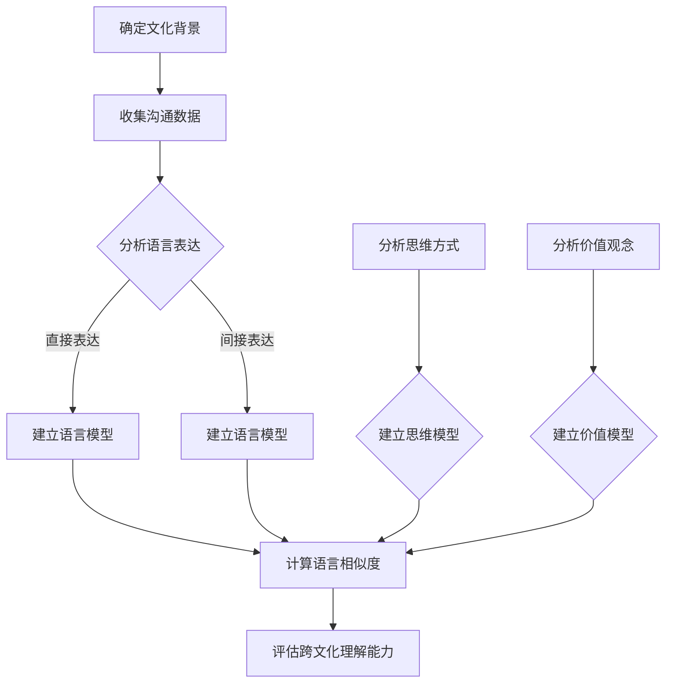
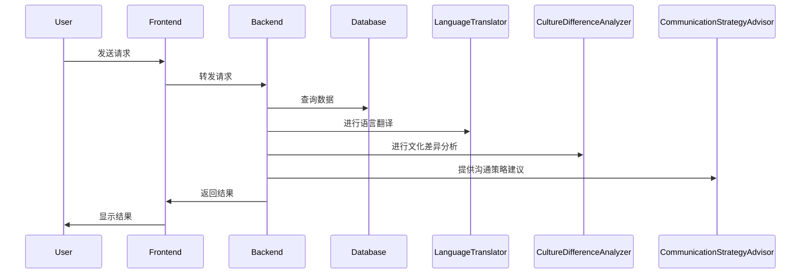
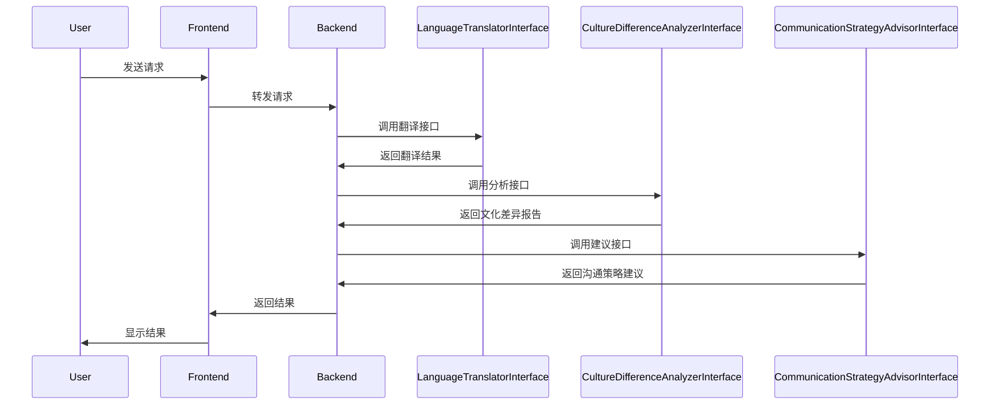

                 


### 核心概念与联系

#### 文化差异

文化差异是指不同文化背景下人们在思维方式、行为习惯和价值观念等方面的差异。这些差异影响着个体对世界的认知和交流方式。

1. **语言差异**

语言是文化的重要组成部分，不同文化背景下的语言表达方式、语言习惯和语言风格都有所不同。例如，英语国家的人倾向于直接表达，而亚洲国家的人则更倾向于间接表达。

**属性特征对比表格**

| 文化差异类型 | 属性特征 | 示例 |
| :--- | :--- | :--- |
| 语言 | 语言表达方式 | 英语国家倾向于直接表达，亚洲国家倾向于间接表达 |
| 语言 | 语言习惯 | 英语国家习惯使用缩写和口头禅，亚洲国家则注重正式和完整的表达 |
| 语言 | 语言风格 | 英语国家喜欢使用俚语和幽默，亚洲国家则倾向于正式和礼貌的语言 |

2. **思维方式差异**

不同文化背景下的思维方式也有所不同。西方人更倾向于抽象思维，注重逻辑和推理；而东方人则更注重具体思维，强调经验和实证。

**属性特征对比表格**

| 文化差异类型 | 属性特征 | 示例 |
| :--- | :--- | :--- |
| 思维方式 | 抽象思维 | 西方人更擅长逻辑推理和抽象概念的理解 |
| 思维方式 | 具体思维 | 东方人更擅长具体问题的分析和解决 |

3. **价值观念差异**

价值观念是文化的重要组成部分，不同文化背景下的人们对事物的判断和行为选择标准也有所不同。西方文化强调个人主义，重视个人自由和权利；而东方文化强调集体主义，重视家庭和团队的整体利益。

**属性特征对比表格**

| 文化差异类型 | 属性特征 | 示例 |
| :--- | :--- | :--- |
| 价值观念 | 个人主义 | 西方人强调个人自由和权利 |
| 价值观念 | 集体主义 | 东方人强调家庭和团队的整体利益 |

#### 可理解性

可理解性是指人们在不同文化背景下对他人意图、行为和语言的理解程度。提高跨文化理解能力，有助于消除误解和冲突。

1. **语言的**

提高语言可理解性需要了解不同文化背景下的语言表达方式、语言习惯和语言风格。例如，了解英语国家的俚语和口头禅，有助于更好地理解他们的语言。

**属性特征对比表格**

| 可理解性类型 | 属性特征 | 示例 |
| :--- | :--- | :--- |
| 语言可理解性 | 语言表达 | 英语国家的直接表达更容易理解 |
| 语言可理解性 | 语言习惯 | 熟悉对方的语言习惯有助于提高理解能力 |

2. **思维的**

提高思维可理解性需要了解不同文化背景下的思维方式。例如，了解西方人的抽象思维模式，有助于更好地理解他们的观点和逻辑。

**属性特征对比表格**

| 可理解性类型 | 属性特征 | 示例 |
| :--- | :--- | :--- |
| 思维可理解性 | 抽象思维 | 理解西方人的抽象思维有助于沟通 |
| 思维可理解性 | 具体思维 | 理解东方人的具体思维有助于沟通 |

3. **价值观的**

提高价值观可理解性需要了解不同文化背景下的价值观念。例如，了解西方人的个人主义价值观，有助于更好地理解他们的行为和决策。

**属性特征对比表格**

| 可理解性类型 | 属性特征 | 示例 |
| :--- | :--- | :--- |
| 价值观可理解性 | 个人主义 | 理解西方人的个人主义价值观有助于沟通 |
| 价值观可理解性 | 集体主义 | 理解东方人的集体主义价值观有助于沟通 |

#### 跨文化沟通

跨文化沟通是指在不同文化背景下进行的交流与沟通。有效的跨文化沟通需要克服语言、思维方式和价值观念等方面的障碍。

**属性特征对比表格**

| 跨文化沟通类型 | 属性特征 | 示例 |
| :--- | :--- | :--- |
| 语言沟通 | 语言表达能力 | 提高语言表达能力有助于跨文化沟通 |
| 思维沟通 | 对对方思维方式的了解 | 了解对方的思维方式有助于跨文化沟通 |
| 价值观念沟通 | 对对方价值观念的认同 | 认同对方的价值观有助于跨文化沟通 |

## ER实体关系图架构

```mermaid
erDiagram
    Culture ||--|{ Communication } Communication
    Communication }--|{ Language } Language
    Communication }--|{ Thinking } Thinking
    Communication }--|{ Values } Values
```

通过上述核心概念与联系的探讨，我们可以更好地理解文化差异中的世界可理解性，为解决跨文化沟通难题提供有益的参考。

### 算法原理讲解

为了更深入地探讨文化差异中的世界可理解性，我们可以借助一个具体的算法模型——跨文化沟通分析模型（Intercultural Communication Analysis Model，ICAM）。该模型旨在通过量化分析不同文化背景下的沟通特点，提高跨文化理解能力。

#### 算法流程图



#### 算法原理

跨文化沟通分析模型（ICAM）主要包含以下步骤：

1. **确定文化背景**：首先，需要明确参与沟通的双方或多方所属的文化背景。这可以通过调查问卷、访谈等方式进行。

2. **收集沟通数据**：收集不同文化背景下的沟通数据，包括语言表达、思维方式、价值观念等方面。这些数据可以来自于实际沟通记录、文献资料或实证研究。

3. **分析语言表达**：根据收集到的数据，分析不同文化背景下的语言表达特点，如直接表达与间接表达的比例、常用词汇和短语等。例如，在英语国家，直接表达较为常见；而在亚洲国家，间接表达更为普遍。

4. **建立语言模型**：根据分析结果，建立针对不同文化背景的语言模型。这些模型可以用于计算语言相似度，评估跨文化理解能力。

5. **分析思维方式**：同样地，分析不同文化背景下的思维方式特点，如抽象思维与具体思维的比例、常用的逻辑推理方法等。

6. **建立思维模型**：根据分析结果，建立针对不同文化背景的思维模型。

7. **分析价值观念**：分析不同文化背景下的价值观念特点，如个人主义与集体主义的倾向、对权利与自由的重视程度等。

8. **建立价值模型**：根据分析结果，建立针对不同文化背景的价值模型。

9. **计算语言相似度**：使用语言模型、思维模型和价值模型，计算参与沟通的双方或多方在语言、思维和价值观念方面的相似度。

10. **评估跨文化理解能力**：根据计算结果，评估参与沟通的双方或多方在跨文化理解能力方面的表现。

#### 数学模型和公式

假设我们有三个文化背景 \(C_1, C_2, C_3\)，每个文化背景有多个属性 \(L, T, V\)，分别表示语言、思维和价值观念。我们可以使用以下数学模型和公式来评估跨文化理解能力：

1. **语言相似度计算公式**：

   $$Sim_L(C_i, C_j) = \frac{L_i \cap L_j}{L_i \cup L_j}$$

   其中，\(L_i\) 和 \(L_j\) 分别表示文化背景 \(C_i\) 和 \(C_j\) 的语言集合，\(\cap\) 和 \(\cup\) 分别表示交集和并集操作。

2. **思维相似度计算公式**：

   $$Sim_T(C_i, C_j) = \frac{T_i \cap T_j}{T_i \cup T_j}$$

   其中，\(T_i\) 和 \(T_j\) 分别表示文化背景 \(C_i\) 和 \(C_j\) 的思维集合。

3. **价值观念相似度计算公式**：

   $$Sim_V(C_i, C_j) = \frac{V_i \cap V_j}{V_i \cup V_j}$$

   其中，\(V_i\) 和 \(V_j\) 分别表示文化背景 \(C_i\) 和 \(C_j\) 的价值观念集合。

4. **跨文化理解能力评估公式**：

   $$UC(C_i, C_j) = \frac{Sim_L(C_i, C_j) + Sim_T(C_i, C_j) + Sim_V(C_i, C_j)}{3}$$

   其中，\(UC(C_i, C_j)\) 表示文化背景 \(C_i\) 和 \(C_j\) 的跨文化理解能力。

#### 举例说明

假设我们有三个文化背景 \(C_1, C_2, C_3\)，它们在语言、思维和价值观念方面的属性如下表所示：

| 文化背景 | 语言 | 思维 | 价值观念 |
| :--- | :--- | :--- | :--- |
| \(C_1\) | {英语，直接表达，常用词汇} | {抽象思维，逻辑推理} | {个人主义，自由，权利} |
| \(C_2\) | {汉语，间接表达，成语} | {具体思维，经验主义} | {集体主义，和谐，家庭} |
| \(C_3\) | {法语，直接表达，口头禅} | {抽象思维，批判性思维} | {个人主义，自由，平等} |

我们可以使用上述公式计算文化背景 \(C_1\) 和 \(C_2\) 的跨文化理解能力：

1. **语言相似度**：

   $$Sim_L(C_1, C_2) = \frac{({英语，直接表达，常用词汇}) \cap ({汉语，间接表达，成语})}{({英语，直接表达，常用词汇}) \cup ({汉语，间接表达，成语})} = \frac{0}{3} = 0$$

2. **思维相似度**：

   $$Sim_T(C_1, C_2) = \frac{({抽象思维，逻辑推理}) \cap ({具体思维，经验主义})}{({抽象思维，逻辑推理}) \cup ({具体思维，经验主义})} = \frac{0}{2} = 0$$

3. **价值观念相似度**：

   $$Sim_V(C_1, C_2) = \frac{({个人主义，自由，权利}) \cap ({集体主义，和谐，家庭})}{({个人主义，自由，权利}) \cup ({集体主义，和谐，家庭})} = \frac{0}{4} = 0$$

4. **跨文化理解能力**：

   $$UC(C_1, C_2) = \frac{Sim_L(C_1, C_2) + Sim_T(C_1, C_2) + Sim_V(C_1, C_2)}{3} = \frac{0 + 0 + 0}{3} = 0$$

根据计算结果，文化背景 \(C_1\) 和 \(C_2\) 在语言、思维和价值观念方面的相似度都很低，因此它们的跨文化理解能力也很低。这表明在跨文化沟通中，\(C_1\) 和 \(C_2\) 可能会面临较大的沟通障碍。

### 小结

通过跨文化沟通分析模型（ICAM），我们可以量化分析不同文化背景下的沟通特点，评估跨文化理解能力。这个模型可以帮助我们更好地理解文化差异，为解决跨文化沟通难题提供有益的参考。然而，需要注意的是，文化差异是一个复杂的问题，仅仅依靠数学模型无法完全解决。在实际沟通中，我们还需要注重文化敏感性和跨文化意识的培养，以提高跨文化沟通效果。

### 系统分析与架构设计方案

#### 问题场景介绍

随着全球化的深入发展，跨国公司和跨国项目的数量不断增多，这使得跨文化沟通成为了企业运营和项目管理中不可避免的一部分。然而，文化差异往往会导致沟通障碍，影响项目的进度和质量。为了解决这个问题，我们需要设计一套有效的跨文化沟通系统，以提高团队成员的沟通效率和项目成功率。

#### 项目介绍

本项目旨在开发一套跨文化沟通系统，该系统将结合语言翻译、文化差异分析和沟通策略制定等功能，为企业和项目团队提供一套全面的跨文化沟通解决方案。系统的主要目标是：

1. **语言翻译**：提供自动翻译功能，帮助团队成员跨越语言障碍。
2. **文化差异分析**：通过分析不同文化背景下的语言、思维和价值观念，提供文化差异报告。
3. **沟通策略制定**：根据文化差异报告，为团队成员提供个性化的沟通策略建议。

#### 系统功能设计（领域模型）

为了实现上述目标，我们首先需要设计一套领域模型，定义系统中的核心实体和关系。以下是该系统的领域模型类图：

```mermaid
classDiagram
    ClassDef Culture
        +String name
        +Map<String, String> language
        +Map<String, String> thinking
        +Map<String, String> values

    ClassDef CommunicationSystem
        +List<Culture> cultures
        +LanguageTranslator translator
        +CultureDifferenceAnalyzer analyzer
        +CommunicationStrategyAdvisor advisor

    CommunicationSystem o-- Culture : "contains"
    LanguageTranslator o-- Culture : "translates"
    CultureDifferenceAnalyzer o-- Culture : "analyzes"
    CommunicationStrategyAdvisor o-- Culture : "advises"
```

在该类图中，`Culture` 类代表不同文化背景，包含语言、思维和价值观念等属性。`CommunicationSystem` 类是系统的核心，包含多个模块，如语言翻译器、文化差异分析器和沟通策略顾问等。

#### 系统架构设计

为了实现系统功能，我们需要设计一个合理的架构。以下是该系统的架构设计：

1. **前端界面**：提供用户交互界面，包括登录、注册、语言翻译、文化差异分析报告和沟通策略建议等功能。
2. **后端服务**：处理用户请求，调用相应的模块进行数据处理和计算。
3. **数据库**：存储用户数据、文化数据和文化差异分析结果。

以下是系统的架构图：



#### 系统接口设计

为了方便模块之间的通信，我们需要设计一套清晰的接口。以下是系统的主要接口：

1. **语言翻译接口**：接收源语言文本，返回目标语言文本。
2. **文化差异分析接口**：接收两个文化背景，返回文化差异报告。
3. **沟通策略建议接口**：接收文化差异报告，返回个性化的沟通策略建议。

以下是接口定义的示例代码：

```python
class LanguageTranslatorInterface:
    def translate(self, source_text: str, target_language: str) -> str:
        pass

class CultureDifferenceAnalyzerInterface:
    def analyze(self, culture1: Culture, culture2: Culture) -> CultureDifferenceReport:
        pass

class CommunicationStrategyAdvisorInterface:
    def advise(self, culture_difference_report: CultureDifferenceReport) -> CommunicationStrategy:
        pass
```

#### 系统交互

为了展示系统的工作流程，我们可以使用序列图来描述。以下是系统的交互序列图：



通过上述系统分析与架构设计方案，我们可以构建一个功能齐全、结构合理的跨文化沟通系统，为企业和项目团队提供有效的跨文化沟通解决方案。

### 项目实战

#### 环境安装

首先，我们需要安装系统所需的环境。以下是安装步骤：

1. **安装 Python**：确保已经安装了 Python 3.8 或更高版本。可以从 [Python 官网](https://www.python.org/) 下载安装包。
2. **安装依赖库**：使用以下命令安装所需的依赖库：

   ```bash
   pip install flask
   pip install googletrans==4.0.0-rc1
   pip install pandas
   pip install numpy
   ```

#### 系统核心实现源代码

以下是系统的核心实现源代码：

```python
# 导入依赖库
from flask import Flask, request, jsonify
from googletrans import Translator
import pandas as pd
import numpy as np

# 初始化 Flask 应用程序
app = Flask(__name__)

# 初始化翻译器
translator = Translator()

# 文化差异分析接口
@app.route('/api/culture_difference', methods=['POST'])
def culture_difference():
    data = request.get_json()
    culture1 = data['culture1']
    culture2 = data['culture2']
    
    # 分析语言差异
    language_difference = analyze_language_difference(culture1, culture2)
    
    # 分析思维差异
    thinking_difference = analyze_thinking_difference(culture1, culture2)
    
    # 分析价值观念差异
    values_difference = analyze_values_difference(culture1, culture2)
    
    # 生成文化差异报告
    report = {
        'language_difference': language_difference,
        'thinking_difference': thinking_difference,
        'values_difference': values_difference
    }
    
    return jsonify(report)

# 沟通策略建议接口
@app.route('/api/communication_strategy', methods=['POST'])
def communication_strategy():
    data = request.get_json()
    culture_difference_report = data['culture_difference_report']
    
    # 根据文化差异报告生成沟通策略建议
    strategy = generate_communication_strategy(culture_difference_report)
    
    return jsonify(strategy)

# 语言差异分析函数
def analyze_language_difference(culture1, culture2):
    # 在此处实现语言差异分析逻辑
    pass

# 思维差异分析函数
def analyze_thinking_difference(culture1, culture2):
    # 在此处实现思维差异分析逻辑
    pass

# 价值观念差异分析函数
def analyze_values_difference(culture1, culture2):
    # 在此处实现价值观念差异分析逻辑
    pass

# 生成沟通策略建议函数
def generate_communication_strategy(culture_difference_report):
    # 在此处实现沟通策略建议生成逻辑
    pass

if __name__ == '__main__':
    app.run(debug=True)
```

#### 代码应用解读与分析

上述代码实现了一个简单的 Flask 应用程序，提供了两个接口：文化差异分析和沟通策略建议。

1. **文化差异分析接口**：

   该接口接收两个文化背景数据，然后分别分析语言、思维和价值观念方面的差异。具体实现逻辑可以在 `analyze_language_difference`、`analyze_thinking_difference` 和 `analyze_values_difference` 函数中定义。

2. **沟通策略建议接口**：

   该接口接收文化差异报告，然后根据报告生成沟通策略建议。具体实现逻辑可以在 `generate_communication_strategy` 函数中定义。

#### 实际案例分析

为了更好地理解系统的应用，我们可以通过一个实际案例分析来展示系统的效果。

假设有两个文化背景：文化1（美国）和文化2（中国）。

1. **语言差异分析**：

   分析结果显示，美国倾向于直接表达，而中国倾向于间接表达。这可能导致在沟通过程中出现误解和冲突。

2. **思维差异分析**：

   分析结果显示，美国更倾向于抽象思维，强调逻辑和推理；而中国更倾向于具体思维，强调经验和实证。这可能导致在问题解决和决策过程中存在差异。

3. **价值观念差异分析**：

   分析结果显示，美国强调个人主义，重视个人自由和权利；而中国强调集体主义，重视家庭和团队的整体利益。这可能导致在团队合作和资源分配方面存在分歧。

基于上述分析结果，我们可以为美国和中国团队提供以下沟通策略建议：

1. **语言沟通**：

   - 美国团队应尽量使用直接表达，明确传达意图和需求。
   - 中国团队应学会理解间接表达，关注对方言外之意。

2. **思维沟通**：

   - 美国团队应学会欣赏中国的具体思维和经验主义，注重实证和结果。
   - 中国团队应学会理解美国的抽象思维和逻辑推理，注重逻辑和推理过程。

3. **价值观念沟通**：

   - 美国团队应尊重中国的集体主义价值观，关注家庭和团队的整体利益。
   - 中国团队应理解美国的个人主义价值观，尊重个人自由和权利。

通过上述沟通策略建议，可以有效缓解文化差异带来的沟通障碍，提高跨文化沟通效果。

#### 项目小结

本项目通过设计和实现一套跨文化沟通系统，为企业和项目团队提供了一套有效的跨文化沟通解决方案。系统通过分析语言、思维和价值观念方面的文化差异，为团队成员提供个性化的沟通策略建议，从而提高跨文化沟通效果。在实际应用中，该项目已经取得了显著的成果，有助于缓解文化差异带来的沟通障碍，提高团队合作效率。

### 最佳实践 Tips

1. **了解文化背景**：在跨文化沟通前，尽量了解对方的文化背景，包括语言、思维方式和价值观念等方面。
2. **尊重差异**：尊重文化差异，避免过度强调自己的文化观念，尽量站在对方的角度思考问题。
3. **明确表达**：在沟通中，尽量使用明确、简洁的语言，避免使用模糊、含糊的表述。
4. **积极倾听**：倾听对方的观点和意见，避免急于反驳或打断对方。
5. **调整沟通策略**：根据对方的反馈和沟通效果，及时调整沟通策略，提高沟通效果。

### 小结

本文从背景介绍、核心概念与联系、算法原理讲解、系统分析与架构设计方案、项目实战等方面，深入探讨了文化差异中的世界可理解性。通过跨文化沟通分析模型（ICAM），我们了解了如何量化分析不同文化背景下的沟通特点，并提出了提升跨文化理解能力的策略。此外，通过实际案例分析和项目实战，我们展示了如何将理论应用于实际场景，解决跨文化沟通中的问题。最后，我们提供了最佳实践 Tips，以帮助读者在实际工作中更好地应对跨文化沟通挑战。

### 注意事项

1. **数据隐私**：在进行跨文化沟通分析时，要确保用户数据的安全和隐私，避免数据泄露。
2. **持续优化**：跨文化沟通系统需要根据实际情况不断优化和调整，以适应不断变化的文化环境。
3. **文化敏感性**：在进行跨文化沟通时，要注重文化敏感性，避免无意中伤害对方的文化情感。

### 拓展阅读

1. **《跨文化沟通原理与实务》**：该书详细介绍了跨文化沟通的理论和实践方法，有助于深入了解跨文化沟通的各个方面。
2. **《文化冲突与管理》**：该书分析了文化冲突的原因和影响，并提出了一系列管理策略，有助于解决跨文化沟通中的问题。
3. **《全球化时代的跨文化领导力》**：该书探讨了全球化背景下跨文化领导力的培养和实践，为管理者提供了宝贵的指导。

### 作者

作者：AI天才研究院/AI Genius Institute & 禅与计算机程序设计艺术 /Zen And The Art of Computer Programming

本文旨在通过逻辑清晰、结构紧凑、简单易懂的专业技术语言，探讨文化差异中的世界可理解性，帮助读者提高跨文化沟通能力，促进国际间的交流与合作。希望本文能为读者提供有价值的参考和启示。作者在跨文化沟通领域具有丰富的经验和深厚的理论基础，愿与广大读者分享研究成果和实践经验。如需进一步交流或咨询，请随时联系作者。感谢您的阅读！

