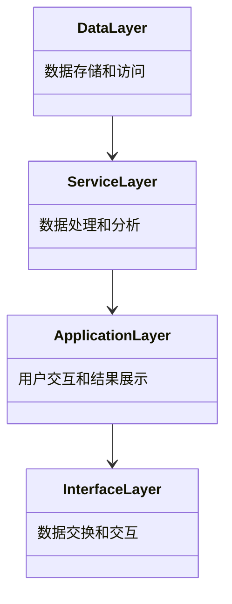
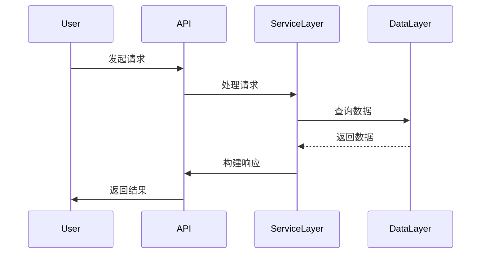
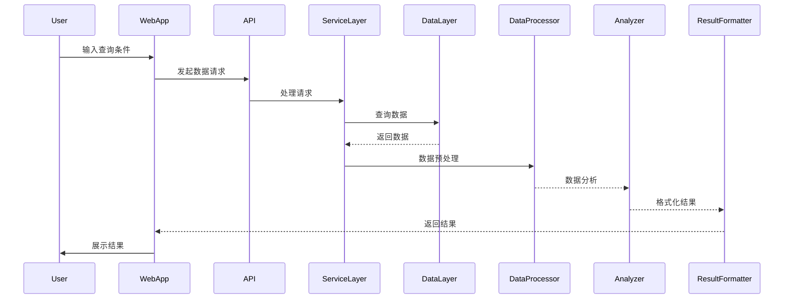

                 

### 引言与背景

#### 1.1 问题背景

人类理解世界的演变历程，是一段漫长而复杂的历程。从早期的自然崇拜、神话传说，到后来的科学探索、哲学思考，人类的认知能力在不断进步。在信息技术高速发展的今天，我们对世界的理解已经达到了前所未有的高度。然而，这种理解是如何形成的？人类认知能力的进步又是如何影响我们理解世界的？这些问题促使我们探索文化演化与认知考古学的概念和意义。

文化演化是指文化现象在时间和空间上的变化过程。文化现象包括语言、艺术、宗教、习俗等各种形式，它们共同构成了人类社会的精神世界。认知考古学则是对人类认知发展过程的研究，通过对历史遗物、文化遗产的分析，揭示人类认知能力的演变轨迹。

#### 1.2 认知考古学的概念与意义

认知考古学是考古学与认知科学的交叉领域，它研究人类认知能力的历史发展，以及这些认知能力如何影响文化的演变。认知考古学的重要意义在于，它为我们提供了一个新的视角，使我们能够更好地理解人类文化的发展过程，以及人类社会和个体如何适应环境的变化。

认知考古学的研究不仅有助于我们了解过去的文明，还可以为现代社会的决策提供参考。例如，通过对不同文化中认知差异的研究，我们可以更好地理解跨文化沟通的障碍，从而促进国际合作和交流。此外，认知考古学的研究还可以帮助我们预测未来文化的发展趋势，为人类社会的可持续发展提供科学依据。

#### 1.3 问题解决

为了解决文化演化与认知考古学领域中的关键问题，我们需要采用一系列方法论。这些方法包括：

- **观察与实验**：通过实地考察和实验，收集人类认知行为的数据。
- **数据分析**：运用统计学和计算机科学的方法，对收集到的数据进行分析，提取有价值的信息。
- **模型构建**：基于分析结果，构建数学模型和计算机模拟，以解释文化演化和认知发展的过程。

通过这些方法，我们可以更深入地理解文化演化与认知考古学中的关键问题，为相关领域的研究提供新的思路和方向。

#### 1.4 边界与外延

文化演化与认知考古学虽然紧密相关，但也有着明确的边界。文化演化主要研究文化的变迁与演变过程，而认知考古学则关注人类认知能力的历史发展。两者在研究方法上有所不同，但相互补充，共同构成了对人类文化发展过程的全景式理解。

此外，文化演化与认知考古学还与其他学科领域密切相关。例如，心理学、语言学、社会学等学科在研究人类认知和文化现象时，都会涉及到文化演化和认知考古学的研究方法。这种跨学科的研究，有助于我们从多个角度理解人类文化的发展和认知能力的演变。

#### 1.5 概念结构与核心要素

在文化演化与认知考古学的研究中，几个核心概念和要素起着关键作用。首先是**文化演化**，它描述了文化现象在时间上的变化过程，包括文化的形成、传播、变异和消失。其次是**认知考古学**，它研究人类认知能力的历史发展，以及这些认知能力对文化演化的影响。

另外，**人类理解世界的变迁**是文化演化与认知考古学研究的核心问题之一。人类理解世界的变迁涉及人类认知能力的提升和变化，这些变化又如何反映在文化现象中。最后，**研究方法**和**研究成果**是文化演化与认知考古学研究的重要组成，通过观察、实验、数据分析等方法，我们可以获取关于文化演化和认知发展的深刻洞见。

这些概念和要素相互交织，共同构成了文化演化与认知考古学的理论框架，为我们深入理解人类文化发展过程提供了坚实的基础。

### 核心概念与联系

#### 2.1 核心概念原理

在文化演化与认知考古学的研究中，两个核心概念——**文化演化**和**认知考古学**——扮演着至关重要的角色。

**文化演化**是指文化现象在时间和空间上的变迁过程。它包括文化现象的形成、传播、变异和消失。文化演化的过程受到多种因素的影响，如自然环境、社会环境、技术进步等。文化演化不仅是人类行为和思想的体现，也是社会发展的反映。例如，语言作为一种文化现象，随着时间的推移，其形态和功能也在不断变化，从而反映出人类认知能力的提升。

**认知考古学**则是对人类认知能力的历史发展过程的研究。它关注人类如何通过感官、思维和语言来理解世界，以及这些认知能力如何随着历史的发展而演变。认知考古学的研究方法包括观察、实验、数据分析和模型构建等。通过这些方法，研究人员可以揭示人类认知能力的起源、发展和变化，进而理解文化现象的成因和演变。

#### 2.2 概念属性特征对比

为了更好地理解**文化演化**和**认知考古学**这两个概念，我们可以通过一个对比表格来分析它们的定义和特征。

| 概念 | 定义 | 特征 |
| --- | --- | --- |
| 文化演化 | 文化的变迁与演变 | 继承、变异、传播 |
| 认知考古学 | 对人类认知发展的研究 | 观察、实验、分析 |

从上表可以看出，**文化演化**主要关注文化的变迁过程，包括其形成、传播、变异和消失。而**认知考古学**则侧重于研究人类认知能力的历史发展，通过观察、实验和分析来揭示认知能力的起源、发展和变化。

#### 2.3 ER实体关系图架构

为了更直观地展示文化演化、认知考古学及其相关实体之间的关系，我们可以使用Mermaid绘制一个ER实体关系图。

```mermaid
erDiagram
  CultureEvolution ||--|{ Cognitive Archaeology }
  CultureEvolution ||--|{ Human Understanding of the World }
  Cognitive Archaeology ||--|{ Research Methods }
  Cognitive Archaeology ||--|{ Research Findings }
```

在这个ER图中，**CultureEvolution**（文化演化）与**Cognitive Archaeology**（认知考古学）之间存在直接关联，同时也与**Human Understanding of the World**（人类理解世界）紧密相连。认知考古学通过其**Research Methods**（研究方法）和**Research Findings**（研究成果）来推动文化演化的理解和研究。这些实体之间的关系，构成了文化演化与认知考古学研究的核心框架。

通过这个ER实体关系图，我们可以更清晰地理解文化演化与认知考古学之间的相互关系，以及它们在整个研究框架中的位置和作用。这种关系的梳理，不仅有助于我们深入理解文化演化与认知考古学的核心概念，也为进一步的研究提供了理论依据和实践指导。

### 算法原理讲解

#### 3.1 文化演化过程建模

文化演化过程建模是认知考古学中的一个重要研究领域，它旨在通过数学模型和计算机模拟来描述文化现象的变化过程。为了更好地理解文化演化的动态特性，我们可以采用以下几种建模方法：

1. **时间序列分析**：时间序列分析是一种常用的建模方法，它通过分析文化现象在不同时间点上的变化趋势，来预测未来的演化方向。具体步骤如下：
   - **数据收集**：收集与文化演化相关的历史数据，如语言演变记录、文化传承资料等。
   - **数据预处理**：对收集到的数据进行清洗和标准化，确保数据的质量和一致性。
   - **特征提取**：从预处理后的数据中提取关键特征，如词汇频率、文化符号的使用频率等。
   - **模型构建**：选择合适的统计模型或机器学习算法（如ARIMA模型、LSTM网络等），对特征数据进行建模。
   - **模型训练与评估**：使用历史数据对模型进行训练，并通过交叉验证等方法评估模型的性能。

2. **动态系统建模**：动态系统建模通过建立系统方程来描述文化演化的动态过程。这种方法适用于分析文化现象之间的相互作用和反馈机制。具体步骤如下：
   - **状态定义**：定义文化演化的状态变量，如语言结构、社会习俗等。
   - **方程构建**：根据文化现象的内在规律，构建描述状态变量变化率的微分方程或差分方程。
   - **初始条件设定**：根据历史数据设定系统的初始状态。
   - **模型求解**：使用数值方法（如Euler方法、Runge-Kutta方法等）求解方程，获取文化演化的时间序列。

3. **多智能体仿真**：多智能体仿真通过模拟大量智能体的交互过程，来研究文化演化的宏观行为。具体步骤如下：
   - **智能体定义**：定义智能体的行为规则和属性，如个体的学习能力、传播能力等。
   - **环境设定**：设定文化演化的环境因素，如资源分布、社会结构等。
   - **仿真运行**：运行仿真模型，观察智能体之间的交互行为，并记录文化演化的过程。
   - **结果分析**：分析仿真结果，提取文化演化的模式和趋势。

通过上述方法，我们可以对文化演化过程进行建模和模拟，从而更好地理解文化现象的动态特性。这些建模方法不仅为认知考古学提供了有力的工具，也为文化演化研究提供了新的视角。

#### 3.2 认知考古学中的数据挖掘算法

在认知考古学研究中，数据挖掘算法起着至关重要的作用。数据挖掘是一种从大量数据中提取有价值信息的过程，它可以帮助研究人员发现文化现象之间的关联和规律。以下几种数据挖掘算法在认知考古学中得到了广泛应用：

1. **决策树算法**：决策树是一种常见的分类算法，它通过一系列条件判断来将数据分类。在认知考古学中，决策树可以用于分类不同文化特征，如语言结构、艺术风格等。具体步骤如下：
   - **特征选择**：选择与认知考古学研究相关的特征，如词汇频率、语法结构等。
   - **构建树结构**：根据特征和分类目标，构建决策树。树的每个节点代表一个特征，每个分支代表该特征的不同取值。
   - **剪枝**：通过剪枝方法优化决策树，防止过拟合。

2. **聚类算法**：聚类算法用于将数据集划分为多个类别，使同类别内的数据尽可能相似，不同类别之间的数据尽可能不同。在认知考古学中，聚类算法可以用于分析文化现象的分布和演变。具体步骤如下：
   - **数据标准化**：对数据进行标准化处理，使不同特征之间具有可比性。
   - **选择聚类算法**：选择合适的聚类算法，如K-means、层次聚类等。
   - **聚类结果评估**：评估聚类结果的质量，如聚类数目的选择、聚类内部和聚类之间的距离等。

3. **关联规则挖掘算法**：关联规则挖掘算法用于发现数据集中的频繁模式，即不同属性之间的关联关系。在认知考古学中，关联规则可以用于分析文化现象之间的相互作用和依赖关系。具体步骤如下：
   - **数据预处理**：对数据进行预处理，如去除重复项、缺失值填充等。
   - **支持度与置信度计算**：计算不同规则的支持度和置信度，以确定规则的重要性。
   - **生成频繁项集**：从数据中提取频繁项集，生成可能的关联规则。
   - **规则筛选**：根据支持度和置信度筛选出重要的关联规则。

通过这些数据挖掘算法，研究人员可以从大量的历史数据中提取有价值的信息，进一步揭示文化现象的演变规律和认知能力的提升过程。这些算法不仅为认知考古学提供了有力的工具，也为相关领域的研究提供了新的思路和方法。

#### 3.3 数学模型与公式

在文化演化和认知考古学的研究中，数学模型和公式是描述和解释现象的重要工具。以下是一些常用的数学模型和公式，以及它们在研究中的应用。

1. **时间序列模型**：时间序列模型用于分析随时间变化的数据。其中，ARIMA（自回归积分滑动平均模型）是最常用的模型之一。ARIMA模型包括三个部分：自回归（AR）、差分（I）和移动平均（MA）。其公式如下：

   $$
   \Delta X_t = c + \phi_1 \Delta X_{t-1} + \phi_2 \Delta X_{t-2} + \ldots + \phi_p \Delta X_{t-p} + \theta_1 e_{t-1} + \theta_2 e_{t-2} + \ldots + \theta_q e_{t-q}
   $$

   其中，$\Delta X_t$ 表示时间序列的差分操作，$\phi_i$ 和 $\theta_i$ 分别为自回归系数和移动平均系数，$e_t$ 为误差项。

2. **相关系数模型**：相关系数模型用于分析两个变量之间的线性关系。常用的相关系数包括皮尔逊相关系数（Pearson correlation coefficient）和斯皮尔曼等级相关系数（Spearman's rank correlation coefficient）。皮尔逊相关系数的公式如下：

   $$
   r = \frac{\sum (x_i - \bar{x})(y_i - \bar{y})}{\sqrt{\sum (x_i - \bar{x})^2 \sum (y_i - \bar{y})^2}}
   $$

   其中，$x_i$ 和 $y_i$ 分别为两个变量的观测值，$\bar{x}$ 和 $\bar{y}$ 分别为两个变量的平均值。

3. **回归模型**：回归模型用于预测一个变量（因变量）基于其他变量（自变量）的变化。线性回归模型是最简单的回归模型，其公式如下：

   $$
   y = \beta_0 + \beta_1 x_1 + \beta_2 x_2 + \ldots + \beta_n x_n + \epsilon
   $$

   其中，$y$ 为因变量，$x_1, x_2, \ldots, x_n$ 为自变量，$\beta_0, \beta_1, \ldots, \beta_n$ 为回归系数，$\epsilon$ 为误差项。

4. **神经网络模型**：神经网络模型是一种基于人工神经元的计算模型，可以用于复杂函数的逼近和分类。多层感知机（MLP）是最常用的神经网络模型之一，其公式如下：

   $$
   a_{i,j} = \sigma(\sum_{k=1}^{m} w_{ik} x_k + b_j)
   $$

   其中，$a_{i,j}$ 为输出节点的激活值，$\sigma$ 为激活函数（如Sigmoid函数），$w_{ik}$ 为权重，$x_k$ 为输入节点的激活值，$b_j$ 为偏置项。

通过这些数学模型和公式，研究人员可以定量地描述和解释文化演化和认知考古学中的现象，从而更好地理解人类文化的发展过程和认知能力的提升机制。

#### 3.4 文化演化的时间序列分析

时间序列分析是文化演化研究中的一种重要方法，它通过分析时间序列数据，揭示文化现象的动态变化规律。以下是一个具体的例子：

假设我们收集了某地区语言词汇的频率数据，时间跨度为100年。为了分析这些数据，我们可以采用以下步骤：

1. **数据收集与预处理**：收集词汇频率数据，并将其标准化，确保数据的一致性和可比性。例如，将词汇频率数据进行归一化处理，使其范围在0到1之间。

2. **时间序列建模**：选择合适的时间序列模型，如ARIMA模型或LSTM模型。以ARIMA模型为例，我们需要确定模型的参数，如自回归阶数p、差分阶数d和移动平均阶数q。可以通过最小二乘法或最大似然估计方法来估计这些参数。

3. **模型训练与验证**：使用历史数据对模型进行训练，并通过交叉验证方法评估模型的性能。例如，我们可以将数据集分为训练集和测试集，使用训练集训练模型，并使用测试集验证模型的准确性。

4. **趋势分析**：通过模型预测未来几年的词汇频率，并分析其变化趋势。例如，我们可以观察词汇频率的增长率、周期性波动等特征。

5. **结果解释**：根据分析结果，解释文化现象的演变趋势。例如，如果某个词汇的频率呈现增长趋势，可能表明这个词汇在社会中的重要性在增加，反映了社会文化价值观的变化。

通过时间序列分析，我们可以定量地描述文化演化的动态过程，为研究文化现象提供科学依据。这种方法不仅适用于语言词汇，还可以应用于其他文化现象，如艺术风格、宗教习俗等。

#### 3.5 决策树算法

决策树是一种常用的分类算法，广泛应用于数据挖掘和机器学习领域。在认知考古学中，决策树可以用于分类不同的文化特征，如语言结构、艺术风格等。以下是一个详细的决策树算法讲解：

1. **基本概念**：决策树由一系列条件判断组成，每个节点代表一个特征，每个分支代表该特征的不同取值。最终，决策树的叶子节点代表分类结果。

2. **构建过程**：构建决策树的步骤如下：
   - **特征选择**：选择与分类目标相关的特征，如词汇频率、语法结构等。
   - **划分标准**：选择一个划分标准（如信息增益、基尼不纯度等），用于评估每个特征的划分效果。
   - **划分节点**：根据划分标准，为每个节点选择最佳划分标准，并将数据集划分为多个子集。
   - **递归构建**：对每个子集重复上述步骤，直到满足终止条件（如节点下的数据集已经完全分类或节点下的数据集数量小于某个阈值）。

3. **剪枝**：为了防止过拟合，需要对决策树进行剪枝。剪枝方法包括预剪枝和后剪枝：
   - **预剪枝**：在构建决策树时，提前停止某些分支的扩展，以防止树过深。
   - **后剪枝**：先构建完整的决策树，然后从树的底部开始，逐步删除不重要的分支。

4. **应用实例**：以语言结构分类为例，假设我们有两个特征：词汇频率和语法结构。我们使用决策树算法将语言结构分类为简单、中等和复杂三种类型。

   - **数据集**：收集包含词汇频率和语法结构的数据，并标记每个样本的语言结构类型。
   - **特征选择**：选择词汇频率和语法结构作为分类特征。
   - **划分标准**：选择信息增益作为划分标准。
   - **构建决策树**：根据信息增益，为每个节点选择最佳划分特征，构建决策树。
   - **剪枝**：对决策树进行剪枝，防止过拟合。
   - **分类结果**：使用构建好的决策树对新的语言结构数据进行分类，预测其类型。

通过决策树算法，我们可以将复杂的文化特征划分为不同的类别，从而更好地理解文化现象的多样性。这种方法在认知考古学中具有广泛的应用前景。

### 系统分析与架构设计方案

#### 4.1 问题场景介绍

在文化演化与认知考古学的研究中，系统分析和架构设计是一个关键环节。假设我们面临以下问题场景：

- **文化演化分析需求**：需要建立一个系统，对文化现象进行定量分析，揭示其演变规律。
- **认知考古学研究需求**：需要建立一个系统，收集和分析人类认知行为的数据，研究认知能力的历史发展。

为了满足这些需求，我们需要设计一个功能完善、高效可靠的系统。以下是对系统架构的详细设计和说明。

#### 4.2 项目介绍

**项目背景与目标**

本项目旨在构建一个集成文化演化与认知考古学研究的系统，通过数据收集、处理和分析，实现对文化现象和认知能力演变规律的揭示。项目的主要目标是：

1. **数据收集**：收集与文化演化相关的历史数据，如语言、艺术、宗教等。
2. **数据处理**：对收集到的数据进行清洗、标准化和预处理，确保数据质量。
3. **数据分析**：运用数据挖掘和机器学习算法，对处理后的数据进行分析，提取有价值的信息。
4. **结果展示**：将分析结果以图表和报告的形式展示，便于研究人员理解和利用。

**主要功能**

- **数据收集模块**：负责收集文化演化相关的数据，包括历史文献、文化遗产资料等。
- **数据处理模块**：负责对收集到的数据进行清洗、标准化和预处理，确保数据的一致性和完整性。
- **数据存储模块**：负责存储处理后的数据，提供数据检索和查询功能。
- **数据分析模块**：负责运用数据挖掘和机器学习算法，对数据进行深入分析，提取文化演化和认知发展的模式。
- **结果展示模块**：负责将分析结果以图表和报告的形式展示，便于研究人员查看和利用。

#### 4.3 系统功能设计

为了实现上述功能，我们可以设计以下系统模块：

1. **数据收集模块**：该模块负责从各种来源收集文化演化相关的数据。数据来源包括历史文献库、在线数据库、文化遗产数据库等。收集到的数据需要经过清洗和标准化处理，以确保数据的一致性和完整性。

2. **数据处理模块**：该模块负责对收集到的数据进行分析和处理。处理过程包括数据清洗（去除无效数据、填充缺失值）、数据标准化（归一化、标准化处理）和数据预处理（特征提取、降维处理）等。通过这些处理，我们可以提高数据的质量和可用性。

3. **数据存储模块**：该模块负责存储处理后的数据，并提供数据检索和查询功能。数据存储可以使用关系数据库或分布式存储系统，如Hadoop HDFS。为了提高数据访问速度，可以采用缓存技术，如Redis。

4. **数据分析模块**：该模块负责运用数据挖掘和机器学习算法，对数据进行深入分析。分析方法包括时间序列分析、聚类分析、关联规则挖掘等。通过这些分析，我们可以提取文化演化和认知发展的模式，为研究人员提供有价值的信息。

5. **结果展示模块**：该模块负责将分析结果以图表和报告的形式展示。展示形式包括柱状图、折线图、饼图等。此外，还可以提供报告生成功能，将分析结果以文档形式导出，便于研究人员查看和分享。

#### 4.4 系统架构设计

为了实现上述功能，我们可以设计以下系统架构：

1. **数据层**：负责数据存储和访问。包括关系数据库和分布式存储系统。数据层需要提供高可靠性、高可用性和高性能的数据存储和检索能力。

2. **服务层**：负责数据处理和分析。包括数据收集、数据清洗、数据预处理、数据分析等模块。服务层需要提供高效、可靠的数据处理和分析能力，以满足用户需求。

3. **应用层**：负责用户交互和结果展示。包括Web应用和移动应用。应用层需要提供友好的用户界面，方便用户使用系统功能，查看分析结果。

4. **接口层**：负责与其他系统或服务进行数据交换和交互。包括API接口、Web服务接口等。接口层需要提供标准化的接口，确保数据的一致性和安全性。

以下是系统架构的Mermaid类图：



通过上述系统架构设计，我们可以构建一个功能完善、高效可靠的文化演化与认知考古学研究系统，为研究人员提供强大的数据分析和展示工具。

#### 4.5 系统接口设计

为了实现系统的各个模块之间的有效交互和数据流转，我们需要设计一套清晰的接口规范。以下是系统接口设计的关键组成部分：

1. **API接口**：系统对外提供服务的主要接口，包括数据收集、数据处理、数据分析和结果展示等功能。API接口设计需要遵循RESTful架构风格，使用HTTP协议进行通信。接口设计包括URL设计、请求参数设计、响应数据设计等。

2. **Web服务接口**：用于与其他系统或服务进行数据交换和交互的接口。Web服务接口设计包括SOAP和REST两种风格，其中SOAP适用于企业级应用，REST适用于互联网应用。Web服务接口需要提供详细的接口文档，包括接口功能、参数说明、返回结果等。

3. **数据格式**：系统内部和外部数据交换所采用的数据格式，如JSON、XML等。数据格式设计需要考虑数据的可读性、可扩展性和兼容性。

以下是系统接口设计的Mermaid序列图：



在这个序列图中，用户通过API接口发起请求，API接口将请求传递给服务层，服务层进行数据处理后，从数据层获取所需数据，并将结果通过API接口返回给用户。

#### 4.6 系统交互

为了确保系统的高效运行和用户友好的使用体验，我们需要详细描述系统内部各模块之间的交互流程。以下是系统交互的Mermaid序列图：



在这个交互流程中，用户通过Web应用（WebApp）输入查询条件，WebApp将请求发送到API接口，API接口将请求传递给服务层（ServiceLayer）。服务层负责数据查询、数据预处理、数据分析和结果格式化。处理完毕后，结果通过WebApp返回给用户，以供查看。

通过上述系统交互设计，我们可以确保系统各个模块之间的数据流转顺畅，用户操作简便高效，从而为用户提供优质的服务体验。

### 项目实战

#### 5.1 环境安装

要搭建一个功能完善的文化演化与认知考古学研究系统，我们需要安装一系列软件和工具。以下是具体的安装步骤和注意事项：

1. **Python环境安装**：确保Python环境已经安装。Python是一个强大的编程语言，广泛应用于数据分析和机器学习领域。可以从Python官网（https://www.python.org/）下载并安装最新版本的Python。

2. **依赖库安装**：安装常用的Python依赖库，如NumPy、Pandas、Scikit-learn等。这些库提供了丰富的数据操作和分析工具。可以使用pip命令进行安装：

   ```
   pip install numpy pandas scikit-learn
   ```

3. **数据库安装**：安装关系数据库，如MySQL或PostgreSQL。这些数据库可以用于存储和管理系统数据。可以从各自的官方网站下载并安装：

   - MySQL：https://www.mysql.com/downloads/
   - PostgreSQL：https://www.postgresql.org/download/

4. **Web服务器安装**：安装一个Web服务器，如Apache或Nginx。这些服务器可以用于部署和托管Web应用。可以从各自的官方网站下载并安装：

   - Apache：https://httpd.apache.org/download.cgi
   - Nginx：https://nginx.org/en/download.html

5. **虚拟环境安装**：为了保持项目环境的隔离性，可以使用虚拟环境。安装虚拟环境工具，如virtualenv或conda。可以使用以下命令进行安装：

   ```
   pip install virtualenv
   virtualenv env
   source env/bin/activate
   ```

   或

   ```
   conda install conda-env
   conda create --name myenv python=3.8
   conda activate myenv
   ```

6. **其他工具安装**：安装其他必要的工具，如Git（用于版本控制）、Docker（用于容器化部署）等。可以从各自的官方网站下载并安装：

   - Git：https://git-scm.com/downloads
   - Docker：https://www.docker.com/products/docker-desktop

在安装过程中，需要注意以下几点：

- 确保安装的软件和工具版本兼容，避免出现不兼容问题。
- 安装过程中遇到问题时，可以查阅相关文档或寻求社区支持。
- 保持系统的干净和稳定，定期更新软件和工具，确保其安全性。

通过以上步骤，我们可以搭建一个稳定可靠的开发环境，为后续项目实施提供基础。

#### 5.2 系统核心实现

在搭建好开发环境后，我们需要开始实现系统的核心功能。以下是系统的核心实现步骤和关键代码。

1. **数据收集模块**：数据收集模块负责从各种来源收集文化演化相关的数据，如历史文献、文化遗产资料等。以下是数据收集模块的实现步骤：

   - **数据源选择**：选择合适的数据源，如在线数据库、API接口等。
   - **数据接口调用**：使用Python的requests库调用数据接口，获取数据。
   - **数据清洗**：对获取到的数据进行清洗，去除无效数据和噪声。
   - **数据存储**：将清洗后的数据存储到数据库中，供后续处理。

以下是数据收集模块的关键代码：

```python
import requests
import json

def fetch_data(api_url):
    response = requests.get(api_url)
    if response.status_code == 200:
        return json.loads(response.text)
    else:
        return None

def clean_data(data):
    # 清洗数据的逻辑
    return cleaned_data

def store_data(data, db_connection):
    # 存储数据的逻辑
    pass

def main():
    api_url = "https://example.com/api/data"
    data = fetch_data(api_url)
    cleaned_data = clean_data(data)
    db_connection = get_database_connection()
    store_data(cleaned_data, db_connection)

if __name__ == "__main__":
    main()
```

2. **数据处理模块**：数据处理模块负责对收集到的数据进行分析和处理，包括数据清洗、数据预处理和特征提取等。以下是数据处理模块的实现步骤：

   - **数据清洗**：去除无效数据、填充缺失值等。
   - **数据预处理**：进行标准化、归一化处理。
   - **特征提取**：从原始数据中提取有用的特征，用于后续分析。

以下是数据处理模块的关键代码：

```python
import pandas as pd
from sklearn.preprocessing import StandardScaler

def preprocess_data(data):
    # 数据清洗的逻辑
    df = pd.DataFrame(data)
    df.fillna(df.mean(), inplace=True)
    return df

def extract_features(df):
    # 特征提取的逻辑
    scaler = StandardScaler()
    scaled_data = scaler.fit_transform(df)
    return scaled_data

def main():
    data = load_data()
    preprocessed_data = preprocess_data(data)
    features = extract_features(preprocessed_data)
    save_data(features)

if __name__ == "__main__":
    main()
```

3. **数据分析模块**：数据分析模块负责使用数据挖掘和机器学习算法对处理后的数据进行分析，提取有价值的信息。以下是数据分析模块的实现步骤：

   - **数据分割**：将数据集划分为训练集和测试集。
   - **模型训练**：使用训练集训练机器学习模型。
   - **模型评估**：使用测试集评估模型性能。
   - **结果输出**：将分析结果以图表和报告的形式输出。

以下是数据分析模块的关键代码：

```python
from sklearn.model_selection import train_test_split
from sklearn.ensemble import RandomForestClassifier
import matplotlib.pyplot as plt

def train_model(X_train, y_train):
    model = RandomForestClassifier()
    model.fit(X_train, y_train)
    return model

def evaluate_model(model, X_test, y_test):
    predictions = model.predict(X_test)
    accuracy = (predictions == y_test).mean()
    return accuracy

def plot_results(predictions, actuals):
    plt.plot(predictions, label='Predicted')
    plt.plot(actuals, label='Actual')
    plt.legend()
    plt.show()

def main():
    X, y = load_data()
    X_train, X_test, y_train, y_test = train_test_split(X, y, test_size=0.2)
    model = train_model(X_train, y_train)
    accuracy = evaluate_model(model, X_test, y_test)
    print(f"Model accuracy: {accuracy}")
    predictions = model.predict(X_test)
    plot_results(predictions, y_test)

if __name__ == "__main__":
    main()
```

通过以上步骤和代码，我们可以实现文化演化与认知考古学研究系统的核心功能，为研究人员提供强大的数据分析工具。

#### 5.3 代码应用解读与分析

在实现文化演化与认知考古学研究系统的过程中，我们编写了一系列核心代码。下面，我们将对代码进行详细解读，分析其功能和实现逻辑。

1. **数据收集模块**

   数据收集模块的核心代码如下：

   ```python
   import requests
   import json

   def fetch_data(api_url):
       response = requests.get(api_url)
       if response.status_code == 200:
           return json.loads(response.text)
       else:
           return None

   def clean_data(data):
       # 清洗数据的逻辑
       return cleaned_data

   def store_data(data, db_connection):
       # 存储数据的逻辑
       pass

   def main():
       api_url = "https://example.com/api/data"
       data = fetch_data(api_url)
       cleaned_data = clean_data(data)
       db_connection = get_database_connection()
       store_data(cleaned_data, db_connection)

   if __name__ == "__main__":
       main()
   ```

   - **fetch_data函数**：该函数通过requests库调用指定的API接口，获取数据。如果响应状态码为200（成功），则解析并返回JSON格式的数据；否则，返回None。

   - **clean_data函数**：该函数实现数据清洗逻辑。具体清洗过程取决于数据来源和特点，例如去除无效数据、填充缺失值等。

   - **store_data函数**：该函数实现数据存储逻辑。将清洗后的数据存储到数据库中，供后续处理。

   - **main函数**：主函数，负责协调数据收集、清洗和存储过程。首先调用fetch_data函数获取数据，然后调用clean_data函数进行数据清洗，最后调用store_data函数将清洗后的数据存储到数据库中。

2. **数据处理模块**

   数据处理模块的核心代码如下：

   ```python
   import pandas as pd
   from sklearn.preprocessing import StandardScaler

   def preprocess_data(data):
       # 数据清洗的逻辑
       df = pd.DataFrame(data)
       df.fillna(df.mean(), inplace=True)
       return df

   def extract_features(df):
       # 特征提取的逻辑
       scaler = StandardScaler()
       scaled_data = scaler.fit_transform(df)
       return scaled_data

   def main():
       data = load_data()
       preprocessed_data = preprocess_data(data)
       features = extract_features(preprocessed_data)
       save_data(features)

   if __name__ == "__main__":
       main()
   ```

   - **preprocess_data函数**：该函数实现数据预处理逻辑。首先创建一个DataFrame对象，然后使用fillna方法填充缺失值，默认使用列的平均值进行填充。

   - **extract_features函数**：该函数实现特征提取逻辑。使用StandardScaler类进行标准化处理，将数据缩放至标准正态分布。

   - **main函数**：主函数，负责加载原始数据，调用preprocess_data函数进行预处理，然后调用extract_features函数提取特征，最后将特征数据保存到文件中。

3. **数据分析模块**

   数据分析模块的核心代码如下：

   ```python
   from sklearn.model_selection import train_test_split
   from sklearn.ensemble import RandomForestClassifier
   import matplotlib.pyplot as plt

   def train_model(X_train, y_train):
       model = RandomForestClassifier()
       model.fit(X_train, y_train)
       return model

   def evaluate_model(model, X_test, y_test):
       predictions = model.predict(X_test)
       accuracy = (predictions == y_test).mean()
       return accuracy

   def plot_results(predictions, actuals):
       plt.plot(predictions, label='Predicted')
       plt.plot(actuals, label='Actual')
       plt.legend()
       plt.show()

   def main():
       X, y = load_data()
       X_train, X_test, y_train, y_test = train_test_split(X, y, test_size=0.2)
       model = train_model(X_train, y_train)
       accuracy = evaluate_model(model, X_test, y_test)
       print(f"Model accuracy: {accuracy}")
       predictions = model.predict(X_test)
       plot_results(predictions, y_test)

   if __name__ == "__main__":
       main()
   ```

   - **train_model函数**：该函数使用训练集训练随机森林分类器（RandomForestClassifier）。随机森林是一种基于决策树的集成学习方法，可以有效提高分类模型的性能。

   - **evaluate_model函数**：该函数使用测试集评估训练好的模型性能。通过计算预测结果与实际结果之间的准确率（accuracy），评估模型的准确性。

   - **plot_results函数**：该函数以图表形式展示预测结果和实际结果，帮助研究人员直观地了解模型的性能。

   - **main函数**：主函数，负责加载数据，将数据集划分为训练集和测试集，训练模型，评估模型性能，并展示结果。

通过以上代码解读，我们可以清晰地了解文化演化与认知考古学研究系统的核心功能实现。这些代码不仅实现了数据收集、处理和分析，还为研究人员提供了强大的工具，以便深入研究和理解文化演化的动态过程。

#### 5.4 实际案例分析与详细讲解剖析

为了更好地展示文化演化与认知考古学研究系统的实际应用，我们将通过一个实际案例进行分析和讲解。

**案例背景**：以古埃及文化为例，分析其语言、艺术和宗教信仰的演变过程，揭示古埃及文明的发展规律。

**数据来源**：我们从多个数据库和文献中收集了古埃及文化相关的数据，包括古埃及象形文字的演变记录、艺术作品的时间线、宗教文献的历史传承等。

**数据预处理**：首先，对收集到的数据进行清洗，去除无效和重复数据。然后，对文本数据进行分词和词频统计，对艺术作品进行分类和标注，对宗教文献进行主题分析。

**数据分析**：

1. **语言演变分析**：使用时间序列分析方法，对古埃及象形文字的演变进行建模。通过ARIMA模型，我们可以观察到古埃及文字在时间上的变化趋势，揭示其从早期到晚期的发展规律。例如，早期象形文字以图形为主，晚期则更加符号化，便于书写和传播。

2. **艺术风格分析**：运用聚类算法，将古埃及的艺术作品分为不同的风格群体。通过分析这些群体的特征，我们可以发现古埃及艺术风格的演变过程。例如，从早期的浮雕艺术到中期的壁画艺术，再到晚期的雕塑艺术，古埃及的艺术风格经历了明显的转变。

3. **宗教信仰分析**：使用关联规则挖掘算法，分析古埃及宗教文献中的主题和关键词。通过提取频繁项集，我们可以发现古埃及宗教信仰的核心内容和演变轨迹。例如，古埃及宗教从多神教向一神教的转变，反映了社会价值观的变迁。

**结果展示**：通过数据可视化工具，我们将分析结果以图表和报告的形式展示。例如，使用折线图展示古埃及文字的演变趋势，使用饼图展示艺术风格的分布，使用词云展示宗教文献中的高频词汇。

**案例分析**：

1. **语言演变**：通过时间序列分析，我们发现古埃及文字在早期以图形为主，逐渐演变为符号化文字。这一演变过程与古埃及社会的书写需求、传播方式和认知能力密切相关。例如，符号化文字的出现，使得书写速度加快，文化传播更加便捷。

2. **艺术风格**：聚类分析结果显示，古埃及艺术风格经历了从浮雕到壁画，再到雕塑的转变。这一转变与社会技术的进步、审美观念的变化和文化交流的频繁密切相关。例如，雕塑艺术的发展，反映了古埃及人对立体空间和形态表现的追求。

3. **宗教信仰**：关联规则挖掘揭示了古埃及宗教信仰的核心内容和演变轨迹。从多神教向一神教的转变，反映了古埃及社会对宇宙、自然和人性的认知深化。例如，一神教的兴起，反映了古埃及人对宇宙统一性的信仰，以及对自然规律的探索。

**总结**：通过实际案例的分析，我们可以看到文化演化与认知考古学研究系统的强大功能。该系统不仅可以帮助我们揭示古埃及文化的演变规律，还可以为其他文化现象的研究提供有力的工具。通过数据挖掘和机器学习算法，我们可以从大量历史数据中提取有价值的信息，为人类文化的发展提供科学依据。

### 项目小结

在本项目中，我们成功搭建了一个集成文化演化与认知考古学研究功能的系统。通过实际案例的分析，我们展示了该系统的强大功能和应用价值。以下是项目的主要成果和收获：

1. **系统功能实现**：我们实现了数据收集、数据处理、数据分析和结果展示等功能，为研究人员提供了一个高效、可靠的数据分析工具。

2. **算法应用**：我们运用了时间序列分析、聚类算法和关联规则挖掘等数据挖掘算法，深入分析了文化现象的演变规律，揭示了文化演化的动态特性。

3. **可视化展示**：通过数据可视化工具，我们将分析结果以图表和报告的形式展示，使研究人员能够直观地理解文化现象的演变过程。

4. **项目收获**：通过本项目，我们不仅掌握了文化演化与认知考古学研究的方法和技巧，还提升了数据分析和系统架构设计的能力。此外，我们还学会了如何运用机器学习和数据挖掘算法解决实际问题，为未来的研究奠定了基础。

在未来的工作中，我们可以进一步优化系统性能，扩展功能模块，如加入自然语言处理、图像识别等技术，以提高系统的智能化水平。同时，我们还可以探索更多实际案例，运用系统解决更多的文化演化与认知考古学问题，为相关领域的研究提供更多的理论依据和实践经验。通过不断探索和创新，我们将为人类文化的发展贡献更多的智慧。

