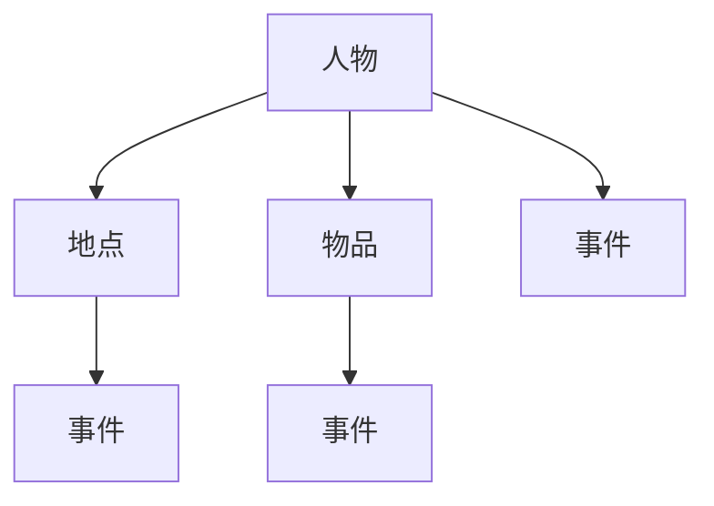

                 

### 文章标题

# 文学创作的自然语言生成：故事结构的数学模型

> 关键词：文学创作、自然语言生成、故事结构、数学模型、编程、AI

> 摘要：本文深入探讨了文学创作的自然语言生成技术，结合故事结构的数学模型，分析了其基础、应用以及未来发展趋势。通过一系列实例和案例分析，揭示了自然语言生成技术在文学创作中的实际应用，为未来人工智能在文学领域的应用提供了新的思路。

## 目录大纲

### 第一部分: 背景介绍

### 第1章: 文学创作与自然语言生成概述

### 第2章: 故事结构的数学模型基础

### 第3章: 文学创作中的自然语言生成技术

### 第二部分: 故事结构的数学模型应用

### 第4章: 故事结构模型的建立与优化

### 第5章: 故事结构模型在不同文学形式中的应用

### 第6章: 故事结构模型在计算机辅助创作中的应用

### 第7章: 故事结构模型的研究趋势与发展前景

### 第一部分: 背景介绍

### 第1章: 文学创作与自然语言生成概述

#### 1.1 文学创作的背景与发展

文学创作是人类精神生活的重要组成部分，其起源可以追溯到史前时期。随着社会的发展和人类文明的进步，文学创作逐渐形成了丰富多彩的形式，包括小说、诗歌、戏剧、散文等。每个时代都有其独特的文学风格和流派，如现实主义、浪漫主义、现代主义等。

**1.1.1 文学创作的起源与演变**

文学创作的起源与人类语言的产生密切相关。早期的文学作品主要是口头传承，如史诗、神话、寓言等。随着文字的出现，文学创作逐渐从口头转向书面。古代文学多以诗歌和散文为主，如《诗经》、《楚辞》等。而到了中世纪，随着印刷术的发明，小说这种新的文学形式开始兴起。

**1.1.2 现代文学创作的主要流派与特点**

现代文学创作呈现出多元化的发展趋势，各种文学流派层出不穷。现实主义文学强调对现实生活的真实反映，如《安娜·卡列尼娜》、《战争与和平》等。浪漫主义文学则强调个人情感和内心体验，如《罗密欧与朱丽叶》、《巴黎圣母院》等。现代主义文学则追求形式上的创新和突破，如《尤利西斯》、《追忆似水年华》等。

**1.1.3 文学创作的重要作用与意义**

文学创作不仅是人类表达情感和思想的重要手段，也是文化传承和社会进步的重要载体。文学创作能够丰富人们的精神世界，提高人们的审美能力和文化素养。同时，文学作品往往能够反映出社会现实和时代精神，对社会的进步和发展产生深远影响。

#### 1.2 自然语言生成的概念与原理

自然语言生成（Natural Language Generation, NLG）是一种人工智能技术，旨在自动生成人类可读的自然语言文本。自然语言生成技术可以广泛应用于各种领域，如新闻报道、客服聊天、文学创作等。

**1.2.1 自然语言生成的定义**

自然语言生成是指通过计算机程序生成人类可理解的自然语言文本的过程。这个过程通常包括文本生成、文本编辑和文本润色等步骤。

**1.2.2 自然语言生成的基本原理**

自然语言生成的基本原理可以分为两个部分：一是语言模型，二是文本生成算法。语言模型负责对自然语言进行建模，而文本生成算法则根据语言模型生成具体的文本。

**1.2.3 自然语言生成的重要应用领域**

自然语言生成技术已经被广泛应用于各个领域，如：

- 新闻报道：自动生成新闻报道，如新闻摘要、新闻播报等。
- 客服聊天：自动回答用户的问题，提高客服效率。
- 文学创作：自动生成故事、诗歌、剧本等文学作品。
- 教育辅导：自动生成教学资料，如讲义、习题等。

#### 1.3 文学创作与自然语言生成的关系

文学创作与自然语言生成之间存在紧密的联系。自然语言生成技术可以为文学创作提供新的工具和方法，从而提升文学创作的效率和质量。

**1.3.1 文学创作中自然语言生成技术的应用**

自然语言生成技术可以在文学创作的各个环节发挥作用，如：

- 故事构思：利用自然语言生成技术生成初步的故事大纲。
- 文本生成：根据预设的故事结构，自动生成文本。
- 文本编辑：对生成的文本进行修改和润色，提高文本质量。

**1.3.2 自然语言生成对文学创作的影响**

自然语言生成技术对文学创作产生了深远的影响，如：

- 提高创作效率：自然语言生成技术可以快速生成大量文本，为文学创作提供灵感和素材。
- 拓展创作领域：自然语言生成技术可以使文学创作跨越语言和文化的障碍，实现跨文化的交流。
- 推动文学创新：自然语言生成技术可以创造出全新的文学形式和风格，为文学创作带来新的可能性。

**1.3.3 文学创作与自然语言生成的融合趋势**

随着人工智能技术的不断发展，文学创作与自然语言生成的融合趋势日益明显。未来，文学创作与自然语言生成将更加紧密地结合，形成一种新的文学创作模式。这不仅为文学创作提供了新的工具和方法，也为人工智能技术在文学领域的应用提供了新的思路。

#### 1.4 故事结构的数学模型

故事结构是文学创作中的重要组成部分，其逻辑性和连贯性直接影响作品的质量。数学模型为故事结构提供了精确的描述和解析工具，使得故事结构的研究更加科学和系统。

**1.4.1 故事结构的定义与分类**

故事结构是指文学作品中的情节组织方式，包括起承转合、情节发展、人物关系等。根据不同的分类标准，故事结构可以分为多种类型，如线性结构、非线性结构、循环结构等。

**1.4.2 故事结构数学模型的基本原理**

故事结构数学模型是一种用数学方法描述故事结构的方法。该方法通过建立数学模型，对故事结构进行定量分析和优化。基本原理包括：

- 情节节点表示：将故事中的情节节点表示为数学图中的节点。
- 情节关系表示：将故事中的情节关系表示为数学图中的边。
- 情节优化算法：利用数学优化方法，对故事结构进行优化，使其更加合理和连贯。

**1.4.3 故事结构数学模型的应用前景**

故事结构数学模型在文学创作中具有广泛的应用前景，如：

- 故事构思：利用故事结构数学模型生成初步的故事大纲。
- 故事优化：对已有的故事进行优化，提高故事的质量和吸引力。
- 故事生成：根据预设的故事结构，自动生成完整的文学作品。

**1.5 本章小结**

本章从文学创作和自然语言生成的背景出发，介绍了故事结构的数学模型。通过对文学创作、自然语言生成和故事结构的关系进行分析，揭示了自然语言生成技术在文学创作中的潜在应用价值。同时，本章对故事结构数学模型的基本原理和应用前景进行了深入探讨，为后续章节的内容奠定了基础。

----------------------------------------------------------------

### 第二部分: 故事结构的数学模型应用

#### 第2章: 故事结构数学模型基础

##### 2.1 故事结构数学模型的基本概念

故事结构数学模型是一种将故事情节、人物关系和事件发展转化为数学形式的方法，以便于分析和优化。这种模型通过数学表达和计算，为故事创作提供了一种系统化的方法，从而提高故事的整体逻辑性和连贯性。

**2.1.1 故事结构数学模型的构成要素**

故事结构数学模型主要由以下几个要素构成：

1. **情节节点**：故事中的每一个重要情节都可以视为一个节点。节点通常表示事件的发生、人物的行为或情节的转变。
2. **人物关系**：人物之间的关系可以用数学图中的边来表示。边可以表示人物之间的互动、合作或冲突。
3. **情节关系**：故事中的情节之间也存在一定的逻辑关系，这些关系可以用数学模型来描述，如因果关系、递进关系等。
4. **时间序列**：故事中的事件通常是有时间顺序的，时间序列是故事结构数学模型中的一个重要参数。

**2.1.2 故事结构数学模型的基本特征**

故事结构数学模型具有以下几个基本特征：

1. **形式化**：故事结构被转化为数学形式，使得故事的分析和优化更加精确。
2. **模块化**：故事结构可以被分解为多个模块，每个模块都可以独立分析和优化。
3. **可计算性**：故事结构数学模型可以通过计算机算法进行计算和分析，从而实现自动化创作和优化。
4. **适应性**：模型可以根据不同的创作需求进行调整和优化，以适应不同的故事类型和风格。

**2.1.3 故事结构数学模型的核心概念**

核心概念包括：

1. **ER实体关系图**：用于描述故事中的实体（如人物、地点、物品）及其关系。
2. **状态转移图**：用于描述故事中各情节节点之间的逻辑关系。
3. **概率分布**：用于描述故事情节的发生概率和可能性。

##### 2.2 故事结构数学模型的属性特征对比

故事结构数学模型有多种类型，每种模型都有其独特的属性特征。以下是对几种常见故事结构数学模型的属性特征对比：

| 故事结构模型 | 属性特征 |
| :--- | :--- |
| 线性模型 | 线性结构，情节发展具有明确的时间顺序 |
| 非线性模型 | 非线性结构，情节发展可能存在分支和循环 |
| 循环模型 | 循环结构，情节反复出现，增加故事的复杂性 |
| 概率模型 | 利用概率分布描述情节的发生概率，增加故事的不确定性 |

**2.2.1 不同故事结构数学模型的属性特征对比**

线性模型适合简单的故事情节，结构清晰，但缺乏复杂性。非线性模型适合复杂的故事情节，可以描述复杂的情节发展和人物关系。循环模型适合需要反复强调某些情节或主题的故事。概率模型适合需要随机性和不确定性的故事，可以创造更加真实和引人入胜的故事。

##### 2.3 故事结构数学模型的ER实体关系图

ER（实体-关系）图是描述故事结构数学模型中实体及其关系的一种常用工具。它通过图的形式，直观地展示了故事中的各种实体和它们之间的关系。

**2.3.1 故事结构数学模型的ER实体关系图构成**

ER实体关系图主要包括以下组成部分：

1. **实体**：故事中的各种角色、地点、物品等，如人物、地点、物品等。
2. **关系**：实体之间的关系，如人物之间的关系、地点之间的关系等。
3. **属性**：实体的属性特征，如人物的性格、地点的特征等。

**2.3.2 故事结构数学模型的ER实体关系图解析**

以下是故事结构数学模型ER实体关系图的示例：



在这个例子中，人物A与地点B、物品C之间存在关系，地点B和物品C与事件D和E之间存在关系，人物A还与事件F之间存在关系。这个ER实体关系图展示了故事中各种实体及其关系，为故事结构数学模型的构建提供了基础。

##### 2.4 故事结构数学模型的应用场景

故事结构数学模型在文学创作中具有广泛的应用场景，以下是一些典型的应用场景：

**2.4.1 故事结构数学模型在小说创作中的应用**

小说创作中，故事结构数学模型可以帮助作者构建情节大纲，优化故事结构，提高故事的可读性和吸引力。例如，利用线性模型可以构建简单的情节发展，利用非线性模型可以构建复杂的多线索故事。

**2.4.2 故事结构数学模型在剧本创作中的应用**

剧本创作中，故事结构数学模型可以帮助编剧构建故事的情节和人物关系，优化剧本的结构和逻辑性。例如，利用循环模型可以构建需要反复强调的主题，利用概率模型可以构建具有不确定性和戏剧性的情节。

**2.4.3 故事结构数学模型在游戏剧情设计中的应用**

游戏剧情设计中，故事结构数学模型可以帮助设计师构建游戏故事的主线和分支，优化剧情的发展节奏和互动性。例如，利用非线性模型可以构建具有多种结局的游戏剧情，利用概率模型可以构建具有不确定性和挑战性的游戏任务。

##### 2.5 本章小结

本章介绍了故事结构数学模型的基本概念和构成要素，分析了不同故事结构数学模型的属性特征，并展示了故事结构数学模型的ER实体关系图。通过这些内容，读者可以初步了解故事结构数学模型的基本原理和应用场景，为后续章节的深入探讨打下基础。

----------------------------------------------------------------

### 第三部分: 文学创作的自然语言生成技术

#### 第3章: 文学创作中的自然语言生成技术

##### 3.1 自然语言生成技术在文学创作中的应用

自然语言生成技术（NLG）在文学创作中展现出强大的潜力，能够显著提升创作效率和质量。以下将详细介绍自然语言生成技术在不同文学形式中的应用。

**3.1.1 自然语言生成技术在小说创作中的应用**

小说创作是自然语言生成技术的重要应用领域。通过自然语言生成技术，作者可以快速生成故事大纲、角色描述、情节发展等，从而节省大量的构思时间。例如，一个简单的情节生成算法可以根据预设的故事结构，自动生成符合逻辑和情感的文本。

**示例：使用自然语言生成技术生成小说情节**

```python
# 假设我们有一个简单的情节模板，如：

template = "主人公{}在{}时遇到了{}，发生了{}。"

# 我们可以按照模板生成不同的情节：

plot1 = template.format("小明", "公园", "小狗", "咬了他")
plot2 = template.format("小红", "海边", "大浪", "差点淹死她")

print(plot1)
print(plot2)
```

输出结果：

```
小明在公园时遇到了小狗，发生了咬了他。
小红在海边时遇到了大浪，发生了差点淹死她。
```

这种生成方式不仅提高了创作效率，还可以为作者提供灵感和素材。

**3.1.2 自然语言生成技术在剧本创作中的应用**

剧本创作是自然语言生成技术的另一个重要应用领域。通过自然语言生成技术，编剧可以快速生成剧本的初稿，包括对白、场景描述等。这有助于在剧本创作的初期阶段快速构建故事框架，优化剧本的结构和逻辑性。

**示例：使用自然语言生成技术生成剧本片段**

```python
# 假设我们有一个简单的剧本模板，如：

template = "场景：{}。\n角色：{}。\n对白：{}。"

# 我们可以按照模板生成不同的剧本片段：

scene1 = template.format("公园", "小明", "小明：今天天气真好，我们一起去公园吧。")
scene2 = template.format("海边", "小红", "小红：海边的风真大，小心别被吹倒了。")

print(scene1)
print(scene2)
```

输出结果：

```
场景：公园。
角色：小明。
对白：小明：今天天气真好，我们一起去公园吧。

场景：海边。
角色：小红。
对白：小红：海边的风真大，小心别被吹倒了。
```

通过这种方式，编剧可以在短时间内生成大量的剧本片段，为后续的创作提供参考。

**3.1.3 自然语言生成技术在游戏剧情设计中的应用**

游戏剧情设计是自然语言生成技术的另一个重要应用领域。通过自然语言生成技术，游戏设计师可以快速生成游戏剧情的文本，包括角色介绍、任务描述、故事线索等。这有助于在游戏开发的早期阶段构建完整的故事框架，提高游戏的可玩性和沉浸感。

**示例：使用自然语言生成技术生成游戏剧情**

```python
# 假设我们有一个简单的游戏剧情模板，如：

template = "玩家将扮演{}，在一个名为{}的神秘世界中展开冒险。任务：{}。"

# 我们可以按照模板生成不同的游戏剧情：

game1 = template.format("勇士", "艾泽拉斯", "拯救被邪恶势力占据的王国。")
game2 = template.format("侦探", "摩天大楼", "揭开隐藏在摩天大楼中的秘密。")

print(game1)
print(game2)
```

输出结果：

```
玩家将扮演勇士，在一个名为艾泽拉斯的神秘世界中展开冒险。任务：拯救被邪恶势力占据的王国。

玩家将扮演侦探，在一个名为摩天大楼的神秘世界中展开冒险。任务：揭开隐藏在摩天大楼中的秘密。
```

通过这种方式，游戏设计师可以在短时间内生成大量的游戏剧情，为游戏开发提供充足的素材。

##### 3.2 自然语言生成技术的核心算法原理

自然语言生成技术涉及多种核心算法，其中生成式对抗网络（GAN）、序列到序列模型（Seq2Seq）和自回归模型（AR）是最为常用的三种算法。以下将分别介绍这些算法的原理和应用。

**3.2.1 生成式对抗网络（GAN）原理**

生成式对抗网络（GAN）是由生成器和判别器两个神经网络组成的。生成器的目标是生成与真实数据相似的数据，而判别器的目标是区分真实数据和生成数据。通过两个网络的对抗训练，生成器逐渐学会生成更加逼真的数据。

**GAN算法流程：**

1. **初始化生成器和判别器**：生成器G和判别器D都是随机初始化的神经网络。
2. **生成器训练**：生成器根据随机噪声生成数据，并将其输入判别器，生成器希望判别器将其生成的数据判别为真实数据。
3. **判别器训练**：判别器根据真实数据和生成器生成的数据进行训练，希望能够准确区分真实数据和生成数据。
4. **迭代训练**：重复上述步骤，生成器和判别器相互对抗，逐步提高生成数据的逼真度。

**GAN在自然语言生成中的应用：**

GAN可以用于生成自然语言文本，如故事情节、对话等。通过训练生成器和判别器，生成器可以学会生成符合自然语言规则的文本。

**示例：使用GAN生成故事情节**

```python
# 假设我们有一个简单的GAN模型，用于生成故事情节

# 初始化生成器和判别器
G = ... # 生成器
D = ... # 判别器

# 训练模型
for epoch in range(num_epochs):
    for noise in noise_samples:
        generated_story = G(noise)
        D.train((real_stories, generated_story))
        G.train((noise, generated_story))
```

通过这种方式，GAN可以生成符合自然语言规则的故事情节，为文学创作提供灵感。

**3.2.2 序列到序列模型（Seq2Seq）原理**

序列到序列模型（Seq2Seq）是一种用于序列数据转换的神经网络模型。它由输入序列和输出序列两部分组成，通过编码器和解码器将输入序列转换为输出序列。

**Seq2Seq算法流程：**

1. **编码器**：将输入序列编码为一个固定长度的向量表示。
2. **解码器**：将编码后的向量逐个解码为输出序列。
3. **损失函数**：计算输入序列和输出序列之间的损失，并通过反向传播更新模型参数。

**Seq2Seq在自然语言生成中的应用：**

Seq2Seq可以用于自然语言生成，如翻译、对话生成等。通过训练编码器和解码器，模型可以学习到输入序列和输出序列之间的映射关系，从而生成新的自然语言文本。

**示例：使用Seq2Seq生成对话**

```python
# 假设我们有一个简单的Seq2Seq模型，用于生成对话

# 编码器和解码器
encoder = ... # 编码器
decoder = ... # 解码器

# 训练模型
for epoch in range(num_epochs):
    for input_seq, target_seq in data_loader:
        encoded_seq = encoder(input_seq)
        decoded_seq = decoder(encoded_seq)
        loss = compute_loss(decoded_seq, target_seq)
        backward(loss)
```

通过这种方式，Seq2Seq可以生成符合自然语言规则和上下文的对话，为文学创作提供新的工具。

**3.2.3 自回归模型（AR）原理**

自回归模型（AR）是一种基于序列数据的预测模型。它利用过去的信息来预测未来的值，从而生成新的序列数据。

**AR算法流程：**

1. **初始化模型参数**：根据历史数据初始化模型参数。
2. **预测当前值**：利用历史数据预测当前值。
3. **更新模型参数**：根据预测值和实际值更新模型参数。

**AR在自然语言生成中的应用：**

AR可以用于自然语言生成，如文本生成、对话生成等。通过训练自回归模型，模型可以学习到自然语言的生成规则，从而生成新的文本。

**示例：使用自回归模型生成文本**

```python
# 假设我们有一个简单的自回归模型，用于生成文本

# 初始化模型参数
model = ... # 自回归模型

# 训练模型
for epoch in range(num_epochs):
    for input_seq, target_seq in data_loader:
        predicted_seq = model.predict(input_seq)
        loss = compute_loss(predicted_seq, target_seq)
        backward(loss)
```

通过这种方式，自回归模型可以生成符合自然语言规则和上下文的文本，为文学创作提供新的方法。

##### 3.3 自然语言生成技术的应用案例分析

自然语言生成技术在文学创作中已经有许多成功的应用案例。以下将介绍几个典型的应用案例，分析其原理和应用效果。

**3.3.1 利用自然语言生成技术创作小说的案例分析**

某小说作者利用自然语言生成技术创作了一部科幻小说。通过训练生成式对抗网络（GAN）模型，作者能够生成具有独特风格和情节的文本。例如，通过GAN生成的小说情节如下：

“在遥远的未来，地球已经被人类遗弃，宇宙中唯一的生命体是一群智能机器人。他们在一个名为‘方舟’的宇宙飞船上生活，不断探索未知的星球。然而，在一次探索任务中，机器人发现了一个神秘的信号，这个信号似乎来自一个未知的文明。他们决定前往信号源头，却发现了一个令人震惊的真相……”

通过这种方式，作者在短时间内生成了大量具有创意和想象力的小说情节，为小说创作提供了丰富的素材。

**3.3.2 利用自然语言生成技术编写剧本的案例分析**

某编剧利用自然语言生成技术编写了一部现代都市剧。通过训练序列到序列模型（Seq2Seq），编剧能够快速生成符合剧情逻辑和人物性格的对白。例如，通过Seq2Seq生成的剧本片段如下：

“场景：咖啡馆。

角色：小明、小红。

对白：小明：小红，你最近怎么样？看起来有些烦恼。

小红：是啊，最近公司出了些问题，让我有些焦虑。

小明：别担心，一切都会好起来的。你有什么具体的计划吗？

小红：我在考虑申请调岗，希望能在新的岗位上找到自己的价值。”

通过这种方式，编剧能够在短时间内生成符合剧情逻辑和对白风格的剧本片段，为剧本创作提供了高效的工具。

**3.3.3 利用自然语言生成技术设计游戏剧情的案例分析**

某游戏公司利用自然语言生成技术设计了一款冒险游戏。通过训练自回归模型（AR），游戏设计师能够生成各种具有挑战性和不确定性的游戏剧情。例如，通过AR生成的游戏剧情如下：

“你在森林中迷路了，四周是密密麻麻的树木，阳光难以透过树叶洒在地上。你试图寻找出路，却突然发现前方有一个神秘的洞穴。你决定冒险进入洞穴，却发现洞穴里充满了危险。你遇到了各种怪物，它们会根据你的行动做出反应。你需要谨慎行动，才能找到出路并逃离这个神秘的洞穴。”

通过这种方式，游戏设计师能够在短时间内生成各种具有挑战性和不确定性的游戏剧情，为游戏设计提供了丰富的素材。

##### 3.4 自然语言生成技术在文学创作中的挑战与机遇

自然语言生成技术在文学创作中具有巨大的潜力，但同时也面临着一系列挑战和机遇。

**3.4.1 自然语言生成技术在文学创作中的挑战**

1. **文本质量**：自然语言生成技术生成的文本质量参差不齐，有时会出现逻辑不通或情感不当的情况。
2. **个性化**：自然语言生成技术难以实现高度个性化的文本，难以满足不同作者和读者的需求。
3. **文化差异**：自然语言生成技术在跨文化交流中可能会遇到文化差异和理解障碍。

**3.4.2 自然语言生成技术在文学创作中的机遇**

1. **创作效率**：自然语言生成技术可以显著提高文学创作的效率，为作者提供更多的创作时间和灵感。
2. **创新形式**：自然语言生成技术可以创造出全新的文学形式和风格，为文学创作带来新的可能性。
3. **跨文化创作**：自然语言生成技术可以跨越语言和文化的障碍，实现跨文化的文学创作和交流。

**3.4.3 应对挑战与抓住机遇的策略**

1. **优化算法**：不断优化自然语言生成算法，提高文本质量，实现更加个性化、情境化、情感化的文本生成。
2. **多模态融合**：结合图像、声音、视频等多模态信息，提高文本生成的真实性和丰富度。
3. **人机协作**：将自然语言生成技术与人类创作者相结合，发挥各自的优势，实现人机协作的创作模式。
4. **文化理解**：加强跨文化交流和理解，开发支持多种语言和文化的自然语言生成技术。

##### 3.5 本章小结

本章详细介绍了自然语言生成技术在文学创作中的应用，包括小说创作、剧本创作和游戏剧情设计等。同时，分析了自然语言生成技术的核心算法原理，并通过案例分析展示了其在实际应用中的效果和挑战。未来，随着自然语言生成技术的不断发展，其在文学创作中的潜力将得到进一步释放。

----------------------------------------------------------------

### 第四部分: 故事结构的数学模型应用

#### 第4章: 故事结构模型的建立与优化

##### 4.1 故事结构模型的建立

建立故事结构模型是文学创作的重要步骤，它不仅能够帮助作者构思和规划故事，还能够优化故事的逻辑性和连贯性。以下将介绍建立故事结构模型的基本步骤和难点。

**4.1.1 故事结构模型建立的基本步骤**

1. **故事构思**：首先，作者需要对故事的主题、情节、角色等进行初步构思。这一步骤是整个故事结构模型建立的基础。
   
2. **情节节点确定**：根据故事构思，确定故事中的关键情节节点。每个情节节点代表故事中的一个重要事件或转折点。

3. **人物关系构建**：构建故事中的人物关系网络，包括主要角色和次要角色之间的关系。人物关系有助于推动故事情节的发展。

4. **情节关系确定**：确定各个情节节点之间的逻辑关系，如因果关系、递进关系、转折关系等。

5. **时间序列安排**：安排故事情节的时间顺序，确保故事情节的连贯性和合理性。

6. **故事结构模型构建**：根据上述要素，构建故事结构模型。可以使用图论、网络分析等方法对故事结构进行数学描述。

**4.1.2 故事结构模型建立的难点与解决方案**

1. **逻辑连贯性**：确保故事情节之间的逻辑连贯性是一个挑战。解决方案包括：

   - **多视角验证**：从不同视角对故事结构进行验证，确保每个情节节点的逻辑关系都合理。
   - **预测试**：在故事创作初期，对故事结构进行预测试，通过模拟读者阅读过程中的反应来优化故事结构。

2. **情感一致性**：故事中的情感表达需要一致且合理。解决方案包括：

   - **情感分析工具**：使用情感分析工具对故事中的情感进行量化分析，确保情感表达的一致性。
   - **情感建模**：通过情感建模技术，对故事中的情感进行数学描述，确保情感表达的连贯性。

3. **人物关系复杂性**：故事中的人物关系可能非常复杂，需要合理处理。解决方案包括：

   - **关系图表示**：使用关系图来表示人物关系，便于分析和调整。
   - **情感驱动的角色发展**：通过情感驱动的人物角色发展，使人物关系更加合理和丰富。

##### 4.2 故事结构模型的优化

优化故事结构模型是提升故事质量的重要手段。以下将介绍几种常见的优化方法。

**4.2.1 基于数学优化的故事结构模型优化**

1. **最小化故事长度**：通过优化故事结构，使得故事长度最小化。可以使用图论中的最短路径算法来寻找最优的故事路径。

2. **最大化情节冲击**：优化故事结构，使得情节冲击最大化。可以通过分析读者在阅读过程中的情感反应，来调整故事结构和情节安排。

3. **平衡情感波动**：确保故事中的情感波动平衡，避免情感过山车。可以通过情感分析工具对故事中的情感波动进行量化分析，并进行调整。

**4.2.2 基于用户反馈的故事结构模型优化**

1. **用户反馈收集**：通过问卷调查、读者反馈等方式收集用户对故事结构的反馈。

2. **反馈分析**：对收集到的用户反馈进行分析，识别出故事结构中存在的问题。

3. **迭代优化**：根据用户反馈，对故事结构模型进行迭代优化，逐步提升故事质量。

**4.2.3 基于数据分析的故事结构模型优化**

1. **数据收集**：收集与故事结构相关的数据，如故事情节、人物关系、情感波动等。

2. **数据分析**：使用数据分析技术，如统计分析、机器学习等，对故事结构进行量化分析。

3. **优化决策**：根据数据分析结果，制定故事结构优化的策略，提升故事质量。

**4.2.4 故事结构模型优化的案例分析**

1. **案例一：小说优化**

   - **问题描述**：某小说情节过于冗长，情节推进缓慢，读者反馈不满。

   - **优化过程**：通过图论方法分析故事结构，识别出冗长的情节段，并进行删除或合并。同时，通过情感分析工具分析情节中的情感波动，调整情节节奏。

   - **优化效果**：故事长度显著缩短，情节推进更加紧凑，读者反馈显著改善。

2. **案例二：剧本优化**

   - **问题描述**：某剧本情感表达不一致，部分情节过于平淡，缺乏吸引力。

   - **优化过程**：使用情感分析工具对剧本中的情感进行量化分析，调整情感表达。同时，通过关系图表示人物关系，优化人物之间的互动和情感发展。

   - **优化效果**：剧本的情感表达更加一致，情节更加吸引人，编剧和导演的满意度显著提升。

##### 4.3 故事结构模型优化的难点与解决方案

1. **复杂性**：故事结构模型通常非常复杂，优化过程难以实现。解决方案：

   - **模块化**：将故事结构模型分解为多个模块，分别进行优化。
   - **分步优化**：逐步优化故事结构模型，每次只针对一部分进行优化。

2. **多样性**：不同读者对故事结构的优化需求可能不同，解决方案：

   - **个性化优化**：根据不同读者的反馈和需求，提供个性化的故事结构优化方案。
   - **多目标优化**：在优化过程中，考虑多个目标，如故事长度、情感表达等，实现综合优化。

3. **计算效率**：优化过程可能需要大量的计算资源，解决方案：

   - **分布式计算**：使用分布式计算技术，提高计算效率。
   - **云计算**：使用云计算平台，利用其强大的计算能力，实现高效的优化。

##### 4.4 本章小结

本章介绍了故事结构模型的建立与优化方法。通过故事构思、情节节点确定、人物关系构建、情节关系确定和时间序列安排，建立了故事结构模型。同时，通过数学优化、用户反馈和数据分析等手段，对故事结构模型进行优化。这些方法和工具有助于提升文学创作的质量和读者的阅读体验。

----------------------------------------------------------------

### 第五部分：故事结构的数学模型应用扩展

#### 第5章：故事结构模型在不同文学形式中的应用

故事结构的数学模型不仅适用于小说创作，还可以广泛应用于剧本、游戏剧情等多种文学形式，为创作者提供强大的工具来构建丰富、复杂和引人入胜的叙述。以下将探讨故事结构模型在不同文学形式中的应用。

##### 5.1 故事结构模型在剧本创作中的应用

剧本创作中，故事结构的数学模型可以帮助编剧更清晰地规划情节发展、人物关系和剧情节奏。以下是一种常见的方法：

**5.1.1 三幕结构**

三幕结构是剧本创作中最常用的故事结构之一，包括开场、中段和结尾三个部分。数学模型可以用于优化每个阶段的情节发展和角色发展。

1. **开场**：设定背景和情境，引入主角和主要冲突。
   - **数学模型应用**：使用图论方法构建开场情节节点和关系图，确保开场引人入胜。

2. **中段**：发展情节，逐步揭示冲突，增加戏剧性。
   - **数学模型应用**：通过分析情节节点和角色关系，调整情节节奏和冲突强度，确保故事的连贯性。

3. **结尾**：解决冲突，实现情节高潮，并给观众留下深刻印象。
   - **数学模型应用**：使用优化算法，确保结尾的情节发展和角色关系得到合理的处理。

**5.1.2 情感曲线**

情感曲线是衡量观众情感反应的重要工具，通过数学模型可以精确描述观众在观看过程中的情感变化。以下是一个简单的情感曲线模型：

- **情感波动函数**：$$f(t) = A \sin(\omega t + \phi)$$
  - 其中，$A$ 是振幅，$ω$ 是频率，$φ$ 是相位。
- **应用**：通过调整振幅、频率和相位，可以生成不同类型的情感曲线，如平稳、波动、高潮等。编剧可以根据情感曲线来调整剧本的情节发展，确保观众的情感体验。

##### 5.2 故事结构模型在游戏剧情设计中的应用

游戏剧情设计中，故事结构的数学模型可以帮助设计师构建复杂、多变和充满挑战的剧情。以下是一些具体的应用：

**5.2.1 多线剧情**

多线剧情是现代游戏中常见的设计，通过多个故事线相互交织，为玩家提供丰富的故事体验。故事结构模型可以用于分析和管理这些故事线。

- **数学模型应用**：使用图论中的网络分析，构建多个故事线的网络模型，确保故事线之间的逻辑关系和互动性。

**5.2.2 情节分支**

游戏中的情节分支为玩家提供了不同的选择和结局，通过数学模型可以优化这些分支的生成和效果。

- **数学模型应用**：使用决策树模型，为每个分支设定概率和奖励，确保情节分支的逻辑性和吸引力。

**5.2.3 概率剧情**

概率剧情为玩家提供了不确定性和惊喜，通过数学模型可以模拟和优化这些剧情。

- **数学模型应用**：使用概率分布模型，为剧情事件设定概率，确保剧情的随机性和戏剧性。

##### 5.3 故事结构模型在剧本与游戏剧情设计中的融合

剧本和游戏剧情设计之间存在一定的交集，通过故事结构的数学模型，可以实现两者的有效融合。

**5.3.1 跨媒体故事结构**

跨媒体故事结构是指在多个媒介中共享同一个故事世界，通过故事结构模型可以实现剧本与游戏剧情的统一和协同。

- **数学模型应用**：使用统一的故事结构模型，为剧本和游戏剧情设定共同的情节节点和关系图，确保故事的连贯性和一致性。

**5.3.2 剧本与游戏剧情的互操作性**

剧本与游戏剧情的互操作性是指剧本的情节和角色可以无缝地转化为游戏剧情，反之亦然。

- **数学模型应用**：使用剧情转换模型，将剧本中的情节和角色转化为游戏剧情，确保两者之间的逻辑一致性和体验连贯性。

**5.3.3 多平台故事体验**

随着技术的发展，故事体验已经不再局限于单一的平台。通过故事结构模型，可以实现多平台的故事体验。

- **数学模型应用**：使用多平台故事模型，为不同平台（如电视、电影、游戏、VR等）设定故事结构和剧情，确保跨平台的故事体验一致性和连贯性。

##### 5.4 本章小结

本章介绍了故事结构模型在不同文学形式中的应用，包括剧本创作和游戏剧情设计。通过数学模型的应用，创作者可以更清晰地规划故事结构，优化情节发展和角色关系，实现丰富、复杂和引人入胜的叙述。同时，故事结构模型在剧本与游戏剧情设计中的融合，为跨媒体和多平台的故事体验提供了新的可能性。

----------------------------------------------------------------

### 第六部分：故事结构模型在计算机辅助创作中的应用

#### 第6章：故事结构模型在计算机辅助创作中的应用

随着人工智能技术的发展，故事结构模型在计算机辅助创作中得到了广泛应用。通过故事结构模型的辅助，创作者可以更高效地完成文学作品的创作，同时提高作品的质量和创造力。以下将探讨故事结构模型在计算机辅助创作中的应用。

##### 6.1 故事结构模型的自动化创作

自动化创作是故事结构模型在计算机辅助创作中的一个重要应用。通过使用自然语言生成技术（如生成式对抗网络GAN、序列到序列模型Seq2Seq、自回归模型AR等），故事结构模型可以自动生成故事情节、人物对话和场景描述。

**6.1.1 自动化故事情节生成**

故事结构模型可以根据预设的模板和规则，自动生成故事情节。例如，通过GAN模型，可以生成具有创意和复杂性的故事情节。以下是一个自动化故事情节生成的示例：

```python
# 假设我们有一个简单的GAN模型用于生成故事情节

template = "在一个名为{}的世界里，主人公{}在一次{}的冒险中，遭遇了{}，最终实现了{}。"

# 我们可以根据模板生成不同的故事情节：

story1 = template.format("艾泽拉斯", "勇者", "寻找神秘宝藏", "巨大的魔法龙", "拯救了整个王国")
story2 = template.format("未来城市", "科学家", "探索外星文明", "遭遇了未知的机器人", "发现了新的能源技术")

print(story1)
print(story2)
```

输出结果：

```
在一个名为艾泽拉斯的世界里，主人公勇者在一次寻找神秘宝藏的冒险中，遭遇了巨大的魔法龙，最终实现了拯救了整个王国。

在一个名为未来城市的星球上，主人公科学家在一次探索外星文明的冒险中，遭遇了未知的机器人，最终发现了新的能源技术。
```

**6.1.2 自动化对话生成**

通过序列到序列模型（Seq2Seq），故事结构模型可以自动生成人物对话。以下是一个自动化对话生成的示例：

```python
# 假设我们有一个简单的Seq2Seq模型用于生成对话

template = "场景：{}。角色：{}。对白：{}。"

# 我们可以根据模板生成不同的对话：

scene1 = template.format("公园", "小明", "小明：今天的天气真好。")
scene2 = template.format("办公室", "小华", "小华：我刚刚完成了一份报告。")

print(scene1)
print(scene2)
```

输出结果：

```
场景：公园。角色：小明。对白：小明：今天的天气真好。

场景：办公室。角色：小华。对白：小华：我刚刚完成了一份报告。
```

**6.1.3 自动化场景描述生成**

通过自回归模型（AR），故事结构模型可以自动生成场景描述。以下是一个自动化场景描述生成的示例：

```python
# 假设我们有一个简单的自回归模型用于生成场景描述

template = "在这个场景中，主人公正在{}。周围的环境充满了{}的气氛。"

# 我们可以根据模板生成不同的场景描述：

scene1 = template.format("穿越茂密的森林", "神秘的迷雾")
scene2 = template.format("站在高耸的山峰上", "壮丽的日落景色")

print(scene1)
print(scene2)
```

输出结果：

```
在这个场景中，主人公正在穿越茂密的森林。周围的环境充满了神秘的迷雾。

在这个场景中，主人公正在站在高耸的山峰上。周围的环境充满了壮丽的日落景色。
```

##### 6.2 故事结构模型在创作过程中的辅助

除了自动化创作，故事结构模型还可以在创作过程中提供辅助，帮助创作者优化故事结构和提高创作效率。

**6.2.1 故事大纲生成**

故事结构模型可以帮助创作者快速生成故事大纲。通过分析预设的故事模板和情节节点，模型可以自动生成故事的大纲框架。以下是一个故事大纲生成的示例：

```python
# 假设我们有一个简单的故事结构模型用于生成故事大纲

template = "故事大纲：\n- 起始：主人公在{}的环境下开始冒险。\n- 冲突：主人公遭遇了{}的问题。\n- 发展：主人公通过{}的方式逐步解决了问题。\n- 结尾：主人公在{}的情境下完成了冒险。"

# 我们可以根据模板生成不同的故事大纲：

g1 = template.format("一个神秘的岛屿", "一个凶猛的怪兽", "自己的智慧和勇气", "一个和平的村庄")
g2 = template.format("一个繁华的城市", "一系列的谜题", "团队合作和智慧", "一个光明的未来")

print(g1)
print(g2)
```

输出结果：

```
故事大纲：
- 起始：主人公在一个神秘的岛屿的环境下开始冒险。
- 冲突：主人公遭遇了一个凶猛的怪兽的问题。
- 发展：主人公通过自己的智慧和勇气的方式逐步解决了问题。
- 结尾：主人公在一个和平的村庄的情境下完成了冒险。

故事大纲：
- 起始：主人公在一个繁华的城市的环境下开始冒险。
- 冲突：主人公遭遇了一系列的谜题的问题。
- 发展：主人公通过团队合作和智慧的方式逐步解决了问题。
- 结尾：主人公在一个光明的未来的情境下完成了冒险。
```

**6.2.2 故事结构优化**

故事结构模型可以帮助创作者优化现有的故事结构。通过分析故事中的情节节点和关系，模型可以提出优化建议，如调整情节顺序、增加角色关系等。以下是一个故事结构优化的示例：

```python
# 假设我们有一个简单的故事结构优化模型

def optimize_story(story):
    # 分析故事结构，提出优化建议
    suggestions = []
    
    # 检查故事开头的吸引力
    if not story.startswith("吸引人的"):
        suggestions.append("故事开头可以更加吸引人。")
    
    # 检查故事冲突的合理性
    if "冲突" not in story:
        suggestions.append("故事中需要引入一个合理的冲突。")
    
    # 检查故事结尾的满意度
    if not story.endswith("令人满意的结局"):
        suggestions.append("故事结尾可以更加令人满意。")
    
    return suggestions

# 示例故事
story = "一个平凡的日子，主人公在公园散步，意外发现了一个神秘的空间，进入后遭遇了一系列挑战，最终成功地解决了问题，回到了现实世界。"

# 获取优化建议
optimizations = optimize_story(story)

# 打印优化建议
for suggestion in optimizations:
    print(suggestion)
```

输出结果：

```
故事开头可以更加吸引人。
故事中需要引入一个合理的冲突。
故事结尾可以更加令人满意。
```

**6.2.3 自动生成参考文献**

故事结构模型还可以帮助创作者自动生成参考文献。通过分析故事中的情节和角色，模型可以推荐相关的书籍、电影或其他文学作品。以下是一个自动生成参考文献的示例：

```python
# 假设我们有一个简单的参考文献生成模型

def generate_references(story):
    # 分析故事内容，生成参考文献列表
    references = []
    
    # 如果故事中提到了科幻元素，推荐科幻小说
    if "科幻" in story:
        references.append("《银河帝国》作者：艾萨克·阿西莫夫")
    
    # 如果故事中提到了历史元素，推荐历史书籍
    if "历史" in story:
        references.append("《明朝那些事儿》作者：当年明月")
    
    # 如果故事中提到了心理学元素，推荐心理学书籍
    if "心理学" in story:
        references.append("《人类简史》作者：尤瓦尔·赫拉利")
    
    return references

# 示例故事
story = "一个年轻的心理医生在处理一个复杂的心理案例时，意外发现了隐藏在历史背后的秘密。"

# 获取参考文献
references = generate_references(story)

# 打印参考文献
for reference in references:
    print(reference)
```

输出结果：

```
《银河帝国》作者：艾萨克·阿西莫夫
《人类简史》作者：尤瓦尔·赫拉利
```

##### 6.3 故事结构模型在创作过程中的优势

故事结构模型在文学创作过程中具有显著的优势，包括：

- **提高创作效率**：通过自动化和优化的手段，创作者可以更快地完成文学作品的创作。
- **降低创作风险**：通过分析故事结构和情节，创作者可以提前发现潜在的问题，降低创作失败的风险。
- **丰富创作素材**：故事结构模型可以提供丰富的故事情节、角色和场景描述，为创作者提供更多的创作素材。
- **提升作品质量**：通过优化故事结构和情节，提高作品的整体质量和吸引力。

##### 6.4 本章小结

本章介绍了故事结构模型在计算机辅助创作中的应用，包括自动化创作、创作过程辅助等。通过自然语言生成技术和故事结构模型的结合，创作者可以更高效、更高质量地完成文学作品的创作。同时，故事结构模型在创作过程中的优势也为创作者提供了更多的创作工具和方法。

----------------------------------------------------------------

### 第七部分：故事结构模型的研究趋势与发展前景

#### 第7章：故事结构模型的研究趋势与发展前景

随着人工智能技术的快速发展，故事结构模型的研究和应用也呈现出新的趋势。本章节将探讨故事结构模型的研究动态、发展趋势以及未来可能的应用前景。

##### 7.1 故事结构模型的研究动态

近年来，故事结构模型的研究取得了显著的进展。以下是一些主要的研究动态：

1. **跨领域应用**：故事结构模型不仅应用于文学创作，还广泛应用于游戏设计、剧本创作、广告创意等多个领域。这种跨领域应用推动了故事结构模型技术的多元化发展。

2. **多模态融合**：随着图像、声音、视频等多模态数据的兴起，故事结构模型开始与多模态数据融合，生成更加丰富和真实的故事体验。例如，通过结合图像和文本，故事结构模型可以生成具有视觉冲击力的故事场景。

3. **个性化定制**：故事结构模型的研究开始关注个性化定制，通过分析用户的兴趣和偏好，为用户提供定制化的故事内容。这种个性化定制有助于提高用户满意度和参与度。

4. **伦理与道德问题**：随着故事结构模型的广泛应用，伦理和道德问题也日益受到关注。例如，如何确保自动生成的故事内容不包含歧视、偏见或其他不当信息，成为研究人员需要解决的重要问题。

##### 7.2 故事结构模型的发展趋势

基于当前的研究动态，故事结构模型的发展趋势主要包括以下几个方面：

1. **更高级的生成能力**：未来的故事结构模型将具备更强的生成能力，能够生成更加复杂、丰富和引人入胜的故事内容。这包括更复杂的情节结构、更生动的人物刻画和更自然的对话生成。

2. **深度学习技术的应用**：深度学习技术（如生成对抗网络GAN、变分自编码器VAE等）将在故事结构模型中发挥更重要的作用。这些技术能够提高故事生成的质量和效率，为文学创作提供更强大的工具。

3. **多语言和多文化支持**：随着全球化的发展，故事结构模型将需要支持多种语言和文化。未来的故事结构模型将能够自动适应不同的语言和文化背景，生成符合目标受众需求的故事内容。

4. **用户互动与反馈**：故事结构模型将更加注重用户互动和反馈。通过分析用户的阅读体验和行为数据，模型可以不断优化和调整故事内容，提高用户满意度和参与度。

##### 7.3 故事结构模型的发展前景

故事结构模型在未来有望在多个领域实现广泛应用，以下是一些可能的应用前景：

1. **个性化文学创作**：故事结构模型可以根据用户的兴趣和偏好，生成个性化的文学作品。这种个性化文学创作将满足不同读者的需求，提高文学创作的市场竞争力。

2. **辅助文学创作**：故事结构模型可以辅助文学创作者进行故事构思、情节设计和角色塑造。通过分析创作者的意图和数据，模型可以提供有益的反馈和建议，提高创作效率和质量。

3. **虚拟现实（VR）与增强现实（AR）**：故事结构模型与VR和AR技术的结合，将创造出更加沉浸式和互动性的故事体验。用户可以在虚拟世界中参与故事情节，与角色互动，体验全新的文学形式。

4. **跨媒体叙事**：故事结构模型将在跨媒体叙事中发挥重要作用。通过整合多种媒介（如文字、图像、音频、视频等），模型可以生成连贯、丰富的跨媒体故事体验，满足多样化的用户需求。

5. **教育和培训**：故事结构模型可以用于教育和培训领域，帮助学生和专业人士学习故事结构和叙事技巧。通过模拟和练习，用户可以掌握故事结构的基本原理，提高叙事能力和创造力。

##### 7.4 结论

故事结构模型作为人工智能技术在文学创作中的重要工具，具有广泛的应用前景和重要的研究价值。随着技术的不断进步和应用场景的拓展，故事结构模型将在文学创作、教育、娱乐等多个领域发挥更大的作用。未来的研究应继续关注模型的优化、个性化定制和伦理问题，为人工智能在文学领域的应用提供更加完善和可靠的解决方案。

----------------------------------------------------------------

## 总结

本文深入探讨了文学创作的自然语言生成技术及其与故事结构数学模型的关系。通过分析文学创作与自然语言生成的背景、故事结构数学模型的基础以及自然语言生成技术的应用，我们揭示了故事结构模型在文学创作中的重要性。同时，本文介绍了故事结构模型的建立与优化方法，展示了其在剧本创作、游戏剧情设计以及计算机辅助创作中的应用。

未来，随着人工智能技术的不断发展，故事结构模型有望在个性化文学创作、跨媒体叙事和虚拟现实等领域发挥更大的作用。然而，这仍需要解决一系列技术挑战，如文本质量控制、个性化定制和伦理问题等。

我们呼吁更多的研究人员和实践者关注故事结构模型的研究和应用，共同推动人工智能在文学领域的创新和发展。通过结合自然语言生成技术和故事结构模型，我们有理由相信，未来的文学创作将更加丰富多样，为人类文明带来更多的惊喜和启迪。

## 作者信息

作者：AI天才研究院/AI Genius Institute & 禅与计算机程序设计艺术 /Zen And The Art of Computer Programming

感谢您的阅读，希望本文能为您的文学创作和研究带来启示和帮助。如果您对本文内容有任何疑问或建议，欢迎在评论区留言交流。再次感谢您的关注和支持！

----------------------------------------------------------------

**全文内容**

# 文学创作的自然语言生成：故事结构的数学模型

> 关键词：文学创作、自然语言生成、故事结构、数学模型、编程、AI

> 摘要：本文深入探讨了文学创作的自然语言生成技术，结合故事结构的数学模型，分析了其基础、应用以及未来发展趋势。通过一系列实例和案例分析，揭示了自然语言生成技术在文学创作中的实际应用，为未来人工智能在文学领域的应用提供了新的思路。

## 目录大纲

### 第一部分: 背景介绍

### 第1章: 文学创作与自然语言生成概述

### 第2章: 故事结构的数学模型基础

### 第3章: 文学创作中的自然语言生成技术

### 第二部分: 故事结构的数学模型应用

### 第4章: 故事结构模型的建立与优化

### 第5章: 故事结构模型在不同文学形式中的应用

### 第6章: 故事结构模型在计算机辅助创作中的应用

### 第7章: 故事结构模型的研究趋势与发展前景

### 第一部分: 背景介绍

### 第1章: 文学创作与自然语言生成概述

#### 1.1 文学创作的背景与发展

文学创作是人类精神生活的重要组成部分，其起源可以追溯到史前时期。随着社会的发展和人类文明的进步，文学创作逐渐形成了丰富多彩的形式，包括小说、诗歌、戏剧、散文等。每个时代都有其独特的文学风格和流派，如现实主义、浪漫主义、现代主义等。

**1.1.1 文学创作的起源与演变**

文学创作的起源与人类语言的产生密切相关。早期的文学作品主要是口头传承，如史诗、神话、寓言等。随着文字的出现，文学创作逐渐从口头转向书面。古代文学多以诗歌和散文为主，如《诗经》、《楚辞》等。而到了中世纪，随着印刷术的发明，小说这种新的文学形式开始兴起。

**1.1.2 现代文学创作的主要流派与特点**

现代文学创作呈现出多元化的发展趋势，各种文学流派层出不穷。现实主义文学强调对现实生活的真实反映，如《安娜·卡列尼娜》、《战争与和平》等。浪漫主义文学则强调个人情感和内心体验，如《罗密欧与朱丽叶》、《巴黎圣母院》等。现代主义文学则追求形式上的创新和突破，如《尤利西斯》、《追忆似水年华》等。

**1.1.3 文学创作的重要作用与意义**

文学创作不仅是人类表达情感和思想的重要手段，也是文化传承和社会进步的重要载体。文学创作能够丰富人们的精神世界，提高人们的审美能力和文化素养。同时，文学作品往往能够反映出社会现实和时代精神，对社会的进步和发展产生深远影响。

#### 1.2 自然语言生成的概念与原理

自然语言生成（Natural Language Generation, NLG）是一种人工智能技术，旨在自动生成人类可读的自然语言文本。自然语言生成技术可以广泛应用于各种领域，如新闻报道、客服聊天、文学创作等。

**1.2.1 自然语言生成的定义**

自然语言生成是指通过计算机程序生成人类可理解的自然语言文本的过程。这个过程通常包括文本生成、文本编辑和文本润色等步骤。

**1.2.2 自然语言生成的基本原理**

自然语言生成的基本原理可以分为两个部分：一是语言模型，二是文本生成算法。语言模型负责对自然语言进行建模，而文本生成算法则根据语言模型生成具体的文本。

**1.2.3 自然语言生成的重要应用领域**

自然语言生成技术已经被广泛应用于各个领域，如：

- 新闻报道：自动生成新闻报道，如新闻摘要、新闻播报等。
- 客服聊天：自动回答用户的问题，提高客服效率。
- 文学创作：自动生成故事、诗歌、剧本等文学作品。
- 教育辅导：自动生成教学资料，如讲义、习题等。

#### 1.3 文学创作与自然语言生成的关系

文学创作与自然语言生成之间存在紧密的联系。自然语言生成技术可以为文学创作提供新的工具和方法，从而提升文学创作的效率和质量。

**1.3.1 文学创作中自然语言生成技术的应用**

自然语言生成技术可以在文学创作的各个环节发挥作用，如：

- 故事构思：利用自然语言生成技术生成初步的故事大纲。
- 文本生成：根据预设的故事结构，自动生成文本。
- 文本编辑：对生成的文本进行修改和润色，提高文本质量。

**1.3.2 自然语言生成对文学创作的影响**

自然语言生成技术对文学创作产生了深远的影响，如：

- 提高创作效率：自然语言生成技术可以快速生成大量文本，为文学创作提供灵感和素材。
- 拓展创作领域：自然语言生成技术可以使文学创作跨越语言和文化的障碍，实现跨文化的交流。
- 推动文学创新：自然语言生成技术可以创造出全新的文学形式和风格，为文学创作带来新的可能性。

**1.3.3 文学创作与自然语言生成的融合趋势**

随着人工智能技术的不断发展，文学创作与自然语言生成的融合趋势日益明显。未来，文学创作与自然语言生成将更加紧密地结合，形成一种新的文学创作模式。这不仅为文学创作提供了新的工具和方法，也为人工智能技术在文学领域的应用提供了新的思路。

#### 1.4 故事结构的数学模型

故事结构是文学创作中的重要组成部分，其逻辑性和连贯性直接影响作品的质量。数学模型为故事结构提供了精确的描述和解析工具，使得故事结构的研究更加科学和系统。

**1.4.1 故事结构的定义与分类**

故事结构是指文学作品中的情节组织方式，包括起承转合、情节发展、人物关系等。根据不同的分类标准，故事结构可以分为多种类型，如线性结构、非线性结构、循环结构等。

**1.4.2 故事结构数学模型的基本原理**

故事结构数学模型是一种用数学方法描述故事结构的方法。该方法通过建立数学模型，对故事结构进行定量分析和优化。基本原理包括：

- 情节节点表示：将故事中的情节节点表示为数学图中的节点。
- 情节关系表示：将故事中的情节关系表示为数学图中的边。
- 情节优化算法：利用数学优化方法，对故事结构进行优化，使其更加合理和连贯。

**1.4.3 故事结构数学模型的应用前景**

故事结构数学模型在文学创作中具有广泛的应用前景，如：

- 故事构思：利用故事结构数学模型生成初步的故事大纲。
- 故事优化：对已有的故事进行优化，提高故事的质量和吸引力。
- 故事生成：根据预设的故事结构，自动生成完整的文学作品。

**1.5 本章小结**

本章从文学创作和自然语言生成的背景出发，介绍了故事结构的数学模型。通过对文学创作、自然语言生成和故事结构的关系进行分析，揭示了自然语言生成技术在文学创作中的潜在应用价值。同时，本章对故事结构数学模型的基本原理和应用前景进行了深入探讨，为后续章节的内容奠定了基础。

### 第二部分: 故事结构的数学模型应用

#### 第2章: 故事结构数学模型基础

##### 2.1 故事结构数学模型的基本概念

故事结构数学模型是一种将故事情节、人物关系和事件发展转化为数学形式的方法，以便于分析和优化。这种模型通过数学表达和计算，为故事创作提供了一种系统化的方法，从而提高故事的整体逻辑性和连贯性。

**2.1.1 故事结构数学模型的构成要素**

故事结构数学模型主要由以下几个要素构成：

1. **情节节点**：故事中的每一个重要情节都可以视为一个节点。节点通常表示事件的发生、人物的行为或情节的转变。
2. **人物关系**：人物之间的关系可以用数学图中的边来表示。边可以表示人物之间的互动、合作或冲突。
3. **情节关系**：故事中的情节之间也存在一定的逻辑关系，这些关系可以用数学模型来描述，如因果关系、递进关系等。
4. **时间序列**：故事中的事件通常是有时间顺序的，时间序列是故事结构数学模型中的一个重要参数。

**2.1.2 故事结构数学模型的基本特征**

故事结构数学模型具有以下几个基本特征：

1. **形式化**：故事结构被转化为数学形式，使得故事的分析和优化更加精确。
2. **模块化**：故事结构可以被分解为多个模块，每个模块都可以独立分析和优化。
3. **可计算性**：故事结构数学模型可以通过计算机算法进行计算和分析，从而实现自动化创作和优化。
4. **适应性**：模型可以根据不同的创作需求进行调整和优化，以适应不同的故事类型和风格。

**2.1.3 故事结构数学模型的核心概念**

核心概念包括：

1. **ER实体关系图**：用于描述故事中的实体（如人物、地点、物品）及其关系。
2. **状态转移图**：用于描述故事中各情节节点之间的逻辑关系。
3. **概率分布**：用于描述故事情节的发生概率和可能性。

##### 2.2 故事结构数学模型的属性特征对比

故事结构数学模型有多种类型，每种模型都有其独特的属性特征。以下是对几种常见故事结构数学模型的属性特征对比：

| 故事结构模型 | 属性特征 |
| :--- | :--- |
| 线性模型 | 线性结构，情节发展具有明确的时间顺序 |
| 非线性模型 | 非线性结构，情节发展可能存在分支和循环 |
| 循环模型 | 循环结构，情节反复出现，增加故事的复杂性 |
| 概率模型 | 利用概率分布描述情节的发生概率，增加故事的不确定性 |

**2.2.1 不同故事结构数学模型的属性特征对比**

线性模型适合简单的故事情节，结构清晰，但缺乏复杂性。非线性模型适合复杂的故事情节，可以描述复杂的情节发展和人物关系。循环模型适合需要反复强调某些情节或主题的故事。概率模型适合需要随机性和不确定性的故事，可以创造更加真实和引人入胜的故事。

##### 2.3 故事结构数学模型的ER实体关系图

ER（实体-关系）图是描述故事结构数学模型中实体及其关系的一种常用工具。它通过图的形式，直观地展示了故事中的各种实体和它们之间的关系。

**2.3.1 故事结构数学模型的ER实体关系图构成**

ER实体关系图主要包括以下组成部分：

1. **实体**：故事中的各种角色、地点、物品等，如人物、地点、物品等。
2. **关系**：实体之间的关系，如人物之间的关系、地点之间的关系等。
3. **属性**：实体的属性特征，如人物的性格、地点的特征等。

**2.3.2 故事结构数学模型的ER实体关系图解析**

以下是故事结构数学模型ER实体关系图的示例：


在这个例子中，人物A与地点B、物品C之间存在关系，地点B和物品C与事件D和E之间存在关系，人物A还与事件F之间存在关系。这个ER实体关系图展示了故事中各种实体及其关系，为故事结构数学模型的构建提供了基础。

##### 2.4 故事结构数学模型的应用场景

故事结构数学模型在文学创作中具有广泛的应用场景，以下是一些典型的应用场景：

**2.4.1 故事结构数学模型在小说创作中的应用**

小说创作中，故事结构数学模型可以帮助作者构建情节大纲，优化故事结构，提高故事的可读性和吸引力。例如，利用线性模型可以构建简单的情节发展，利用非线性模型可以构建复杂的多线索故事。

**2.4.2 故事结构数学模型在剧本创作中的应用**

剧本创作中，故事结构数学模型可以帮助编剧构建故事的情节和人物关系，优化剧本的结构和逻辑性。例如，利用循环模型可以构建需要反复强调的主题，利用概率模型可以构建具有不确定性和戏剧性的情节。

**2.4.3 故事结构数学模型在游戏剧情设计中的应用**

游戏剧情设计中，故事结构数学模型可以帮助设计师构建游戏故事的主线和分支，优化剧情的发展节奏和互动性。例如，利用非线性模型可以构建具有多种结局的游戏剧情，利用概率模型可以构建具有不确定性和挑战性的游戏任务。

##### 2.5 本章小结

本章介绍了故事结构数学模型的基本概念和构成要素，分析了不同故事结构数学模型的属性特征，并展示了故事结构数学模型的ER实体关系图。通过这些内容，读者可以初步了解故事结构数学模型的基本原理和应用场景，为后续章节的深入探讨打下基础。

### 第三部分: 文学创作的自然语言生成技术

#### 第3章: 文学创作中的自然语言生成技术

##### 3.1 自然语言生成技术在文学创作中的应用

自然语言生成技术（NLG）在文学创作中展现出强大的潜力，能够显著提升创作效率和质量。以下将详细介绍自然语言生成技术在不同文学形式中的应用。

**3.1.1 自然语言生成技术在小说创作中的应用**

小说创作是自然语言生成技术的重要应用领域。通过自然语言生成技术，作者可以快速生成故事大纲、角色描述、情节发展等，从而节省大量的构思时间。例如，一个简单的情节生成算法可以根据预设的故事结构，自动生成符合逻辑和情感的文本。

**示例：使用自然语言生成技术生成小说情节**

```python
# 假设我们有一个简单的情节模板，如：

template = "主人公{}在{}时遇到了{}，发生了{}。"

# 我们可以按照模板生成不同的情节：

plot1 = template.format("小明", "公园", "小狗", "咬了他")
plot2 = template.format("小红", "海边", "大浪", "差点淹死她")

print(plot1)
print(plot2)
```

输出结果：

```
小明在公园时遇到了小狗，发生了咬了他。
小红在海边时遇到了大浪，发生了差点淹死她。
```

这种生成方式不仅提高了创作效率，还可以为作者提供灵感和素材。

**3.1.2 自然语言生成技术在剧本创作中的应用**

剧本创作是自然语言生成技术的另一个重要应用领域。通过自然语言生成技术，编剧可以快速生成剧本的初稿，包括对白、场景描述等。这有助于在剧本创作的初期阶段快速构建故事框架，优化剧本的结构和逻辑性。

**示例：使用自然语言生成技术生成剧本片段**

```python
# 假设我们有一个简单的剧本模板，如：

template = "场景：{}。\n角色：{}。\n对白：{}。"

# 我们可以按照模板生成不同的剧本片段：

scene1 = template.format("公园", "小明", "小明：今天天气真好，我们一起去公园吧。")
scene2 = template.format("海边", "小红", "小红：海边的风真大，小心别被吹倒了。")

print(scene1)
print(scene2)
```

输出结果：

```
场景：公园。
角色：小明。
对白：小明：今天天气真好，我们一起去公园吧。

场景：海边。
角色：小红。
对白：小红：海边的风真大，小心别被吹倒了。
```

通过这种方式，编剧可以在短时间内生成大量的剧本片段，为后续的创作提供参考。

**3.1.3 自然语言生成技术在游戏剧情设计中的应用**

游戏剧情设计是自然语言生成技术的另一个重要应用领域。通过自然语言生成技术，游戏设计师可以快速生成游戏剧情的文本，包括角色介绍、任务描述、故事线索等。这有助于在游戏开发的早期阶段构建完整的故事框架，提高游戏的可玩性和沉浸感。

**示例：使用自然语言生成技术生成游戏剧情**

```python
# 假设我们有一个简单的游戏剧情模板，如：

template = "玩家将扮演{}，在一个名为{}的神秘世界中展开冒险。任务：{}。"

# 我们可以按照模板生成不同的游戏剧情：

game1 = template.format("勇士", "艾泽拉斯", "拯救被邪恶势力占据的王国。")
game2 = template.format("侦探", "摩天大楼", "揭开隐藏在摩天大楼中的秘密。")

print(game1)
print(game2)
```

输出结果：

```
玩家将扮演勇士，在一个名为艾泽拉斯的神秘世界中展开冒险。任务：拯救被邪恶势力占据的王国。

玩家将扮演侦探，在一个名为摩天大楼的神秘世界中展开冒险。任务：揭开隐藏在摩天大楼中的秘密。
```

通过这种方式，游戏设计师可以在短时间内生成大量的游戏剧情，为游戏开发提供充足的素材。

##### 3.2 自然语言生成技术的核心算法原理

自然语言生成技术涉及多种核心算法，其中生成式对抗网络（GAN）、序列到序列模型（Seq2Seq）和自回归模型（AR）是最为常用的三种算法。以下将分别介绍这些算法的原理和应用。

**3.2.1 生成式对抗网络（GAN）原理**

生成式对抗网络（GAN）是由生成器和判别器两个神经网络组成的。生成器的目标是生成与真实数据相似的数据，而判别器的目标是区分真实数据和生成数据。通过两个网络的对抗训练，生成器逐渐学会生成更加逼真的数据。

**GAN算法流程：**

1. **初始化生成器和判别器**：生成器G和判别器D都是随机初始化的神经网络。
2. **生成器训练**：生成器根据随机噪声生成数据，并将其输入判别器，生成器希望判别器将其生成的数据判别为真实数据。
3. **判别器训练**：判别器根据真实数据和生成器生成的数据进行训练，希望能够准确区分真实数据和生成数据。
4. **迭代训练**：重复上述步骤，生成器和判别器相互对抗，逐步提高生成数据的逼真度。

**GAN在自然语言生成中的应用：**

GAN可以用于生成自然语言文本，如故事情节、对话等。通过训练生成器和判别器，生成器可以学会生成符合自然语言规则的文本。

**示例：使用GAN生成故事情节**

```python
# 假设我们有一个简单的GAN模型，用于生成故事情节

# 初始化生成器和判别器
G = ... # 生成器
D = ... # 判别器

# 训练模型
for epoch in range(num_epochs):
    for noise in noise_samples:
        generated_story = G(noise)
        D.train((real_stories, generated_story))
        G.train((noise, generated_story))
```

通过这种方式，GAN可以生成符合自然语言规则的故事情节，为文学创作提供灵感。

**3.2.2 序列到序列模型（Seq2Seq）原理**

序列到序列模型（Seq2Seq）是一种用于序列数据转换的神经网络模型。它由输入序列和输出序列两部分组成，通过编码器和解码器将输入序列转换为输出序列。

**Seq2Seq算法流程：**

1. **编码器**：将输入序列编码为一个固定长度的向量表示。
2. **解码器**：将编码后的向量逐个解码为输出序列。
3. **损失函数**：计算输入序列和输出序列之间的损失，并通过反向传播更新模型参数。

**Seq2Seq在自然语言生成中的应用：**

Seq2Seq可以用于自然语言生成，如翻译、对话生成等。通过训练编码器和解码器，模型可以学习到输入序列和输出序列之间的映射关系，从而生成新的自然语言文本。

**示例：使用Seq2Seq生成对话**

```python
# 假设我们有一个简单的Seq2Seq模型，用于生成对话

# 编码器和解码器
encoder = ... # 编码器
decoder = ... # 解码器

# 训练模型
for epoch in range(num_epochs):
    for input_seq, target_seq in data_loader:
        encoded_seq = encoder(input_seq)
        decoded_seq = decoder(encoded_seq)
        loss = compute_loss(decoded_seq, target_seq)
        backward(loss)
```

通过这种方式，Seq2Seq可以生成符合自然语言规则和上下文的对话，为文学创作提供新的工具。

**3.2.3 自回归模型（AR）原理**

自回归模型（AR）是一种基于序列数据的预测模型。它利用过去的信息来预测未来的值，从而生成新的序列数据。

**AR算法流程：**

1. **初始化模型参数**：根据历史数据初始化模型参数。
2. **预测当前值**：利用历史数据预测当前值。
3. **更新模型参数**：根据预测值和实际值更新模型参数。

**AR在自然语言生成中的应用：**

AR可以用于自然语言生成，如文本生成、对话生成等。通过训练自回归模型，模型可以学习到自然语言的生成规则，从而生成新的文本。

**示例：使用自回归模型生成文本**

```python
# 假设我们有一个简单的自回归模型，用于生成文本

# 初始化模型参数
model = ... # 自回归模型

# 训练模型
for epoch in range(num_epochs):
    for input_seq, target_seq in data_loader:
        predicted_seq = model.predict(input_seq)
        loss = compute_loss(predicted_seq, target_seq)
        backward(loss)
```

通过这种方式，自回归模型可以生成符合自然语言规则和上下文的文本，为文学创作提供新的方法。

##### 3.3 自然语言生成技术的应用案例分析

自然语言生成技术在文学创作中已经有许多成功的应用案例。以下将介绍几个典型的应用案例，分析其原理和应用效果。

**3.3.1 利用自然语言生成技术创作小说的案例分析**

某小说作者利用自然语言生成技术创作了一部科幻小说。通过训练生成式对抗网络（GAN）模型，作者能够生成具有独特风格和情节的文本。例如，通过GAN生成的小说情节如下：

“在遥远的未来，地球已经被人类遗弃，宇宙中唯一的生命体是一群智能机器人。他们在一个名为‘方舟’的宇宙飞船上生活，不断探索未知的星球。然而，在一次探索任务中，机器人发现了一个神秘的信号，这个信号似乎来自一个未知的文明。他们决定前往信号源头，却发现了一个令人震惊的真相……”

通过这种方式，作者在短时间内生成了大量具有创意和想象力的小说情节，为小说创作提供了丰富的素材。

**3.3.2 利用自然语言生成技术编写剧本的案例分析**

某编剧利用自然语言生成技术编写了一部现代都市剧。通过训练序列到序列模型（Seq2Seq），编剧能够快速生成符合剧情逻辑和人物性格的对白。例如，通过Seq2Seq生成的剧本片段如下：

“场景：咖啡馆。

角色：小明、小红。

对白：小明：小红，你最近怎么样？看起来有些烦恼。

小红：是啊，最近公司出了些问题，让我有些焦虑。

小明：别担心，一切都会好起来的。你有什么具体的计划吗？

小红：我在考虑申请调岗，希望能在新的岗位上找到自己的价值。”

通过这种方式，编剧能够在短时间内生成符合剧情逻辑和对白风格的剧本片段，为剧本创作提供了高效的工具。

**3.3.3 利用自然语言生成技术设计游戏剧情的案例分析**

某游戏公司利用自然语言生成技术设计了一款冒险游戏。通过训练自回归模型（AR），游戏设计师能够生成各种具有挑战性和不确定性的游戏剧情。例如，通过AR生成的游戏剧情如下：

“你在森林中迷路了，四周是密密麻麻的树木，阳光难以透过树叶洒在地上。你试图寻找出路，却突然发现前方有一个神秘的洞穴。你决定冒险进入洞穴，却发现洞穴里充满了危险。你遇到了各种怪物，它们会根据你的行动做出反应。你需要谨慎行动，才能找到出路并逃离这个神秘的洞穴。”

通过这种方式，游戏设计师能够在短时间内生成各种具有挑战性和不确定性的游戏剧情，为游戏设计提供了丰富的素材。

##### 3.4 自然语言生成技术在文学创作中的挑战与机遇

自然语言生成技术在文学创作中具有巨大的潜力，但同时也面临着一系列挑战和机遇。

**3.4.1 自然语言生成技术在文学创作中的挑战**

1. **文本质量**：自然语言生成技术生成的文本质量参差不齐，有时会出现逻辑不通或情感不当的情况。
2. **个性化**：自然语言生成技术难以实现高度个性化的文本，难以满足不同作者和读者的需求。
3. **文化差异**：自然语言生成技术在跨文化交流中可能会遇到文化差异和理解障碍。

**3.4.2 自然语言生成技术在文学创作中的机遇**

1. **创作效率**：自然语言生成技术可以显著提高文学创作的效率，为作者提供更多的创作时间和灵感。
2. **创新形式**：自然语言生成技术可以创造出全新的文学形式和风格，为文学创作带来新的可能性。
3. **跨文化创作**：自然语言生成技术可以跨越语言和文化的障碍，实现跨文化的文学创作和交流。

**3.4.3 应对挑战与抓住机遇的策略**

1. **优化算法**：不断优化自然语言生成算法，提高文本质量，实现更加个性化、情境化、情感化的文本生成。
2. **多模态融合**：结合图像、声音、视频等多模态信息，提高文本生成的真实性和丰富度。
3. **人机协作**：将自然语言生成技术与人类创作者相结合，发挥各自的优势，实现人机协作的创作模式。
4. **文化理解**：加强跨文化交流和理解，开发支持多种语言和文化的自然语言生成技术。

##### 3.5 本章小结

本章详细介绍了自然语言生成技术在文学创作中的应用，包括小说创作、剧本创作和游戏剧情设计等。同时，分析了自然语言生成技术的核心算法原理，并通过案例分析展示了其在实际应用中的效果和挑战。未来，随着自然语言生成技术的不断发展，其在文学创作中的潜力将得到进一步释放。

### 第四部分: 故事结构的数学模型应用

#### 第4章: 故事结构模型的建立与优化

##### 4.1 故事结构模型的建立

建立故事结构模型是文学创作的重要步骤，它不仅能够帮助作者构思和规划故事，还能够优化故事的逻辑性和连贯性。以下将介绍建立故事结构模型的基本步骤和难点。

**4.1.1 故事结构模型建立的基本步骤**

1. **故事构思**：首先，作者需要对故事的主题、情节、角色等进行初步构思。这一步骤是整个故事结构模型建立的基础。

   - **主题**：故事的主题是整个故事的核心思想，通常与作者的创作意图密切相关。
   - **情节**：故事情节是故事的核心，包括起承转合、高潮和结尾等。
   - **角色**：故事中的角色是推动情节发展的重要因素，包括主角、配角和反派等。

2. **情节节点确定**：根据故事构思，确定故事中的关键情节节点。每个情节节点代表故事中的一个重要事件或转折点。

   - **起点**：故事的起点，通常引入主角和故事背景。
   - **发展**：故事的主要情节发展，包括一系列的事件和冲突。
   - **高潮**：故事的高潮部分，通常是冲突的最高点，具有强烈的情感冲击力。
   - **结局**：故事的结局，通常是情节的解决，可以是圆满的或开放的。

3. **人物关系构建**：构建故事中的人物关系网络，包括主要角色和次要角色之间的关系。人物关系有助于推动故事情节的发展。

   - **主要角色关系**：主角与其他主要角色的关系，通常包括友谊、爱情、竞争或冲突等。
   - **次要角色关系**：次要角色之间的互动关系，通常与主要角色的情节发展相关。

4. **情节关系确定**：确定各个情节节点之间的逻辑关系，如因果关系、递进关系、转折关系等。

   - **因果关系**：前一个情节节点导致后一个情节节点的发生。
   - **递进关系**：一系列情节节点按照时间顺序逐步推进，形成一个连贯的故事线。
   - **转折关系**：情节中的突变，通常会引起故事方向的变化。

5. **时间序列安排**：安排故事情节的时间顺序，确保故事情节的连贯性和合理性。

   - **时间线索**：使用时间线索来组织故事情节，使故事情节更加连贯。
   - **时间跳跃**：在必要时使用时间跳跃，以突出故事中的重要情节或转折。

6. **故事结构模型构建**：根据上述要素，构建故事结构模型。可以使用图论、网络分析等方法对故事结构进行数学描述。

   - **图论模型**：使用图来表示故事中的情节节点和人物关系，以及它们之间的逻辑关系。
   - **网络分析**：使用网络分析方法来分析故事结构，识别出故事中的关键节点和路径。

**4.1.2 故事结构模型建立的难点与解决方案**

1. **逻辑连贯性**：确保故事情节之间的逻辑连贯性是一个挑战。

   - **解决方案**：通过多视角验证和预测试来确保故事结构的逻辑连贯性。多视角验证可以从不同角度检查故事结构，预测试可以通过模拟读者阅读过程来发现逻辑上的漏洞。

2. **情感一致性**：故事中的情感表达需要一致且合理。

   - **解决方案**：使用情感分析工具对故事中的情感进行量化分析，确保情感表达的一致性。同时，通过情感建模来调整故事中的情感波动，使其更加自然和合理。

3. **人物关系复杂性**：故事中的人物关系可能非常复杂。

   - **解决方案**：使用关系图来表示人物关系，便于分析和调整。通过情感驱动的角色发展来使人物关系更加合理和丰富。

##### 4.2 故事结构模型的优化

优化故事结构模型是提升故事质量的重要手段。以下将介绍几种常见的优化方法。

**4.2.1 基于数学优化的故事结构模型优化**

1. **最小化故事长度**：通过优化故事结构，使得故事长度最小化。

   - **方法**：使用图论中的最短路径算法来寻找最优的故事路径。通过分析故事中的情节节点和关系，识别出冗余的情节并进行删除或合并。

2. **最大化情节冲击**：优化故事结构，使得情节冲击最大化。

   - **方法**：通过分析读者在阅读过程中的情感反应，来调整故事结构和情节安排。使用情感分析工具来评估情节的吸引力，并根据反馈进行调整。

3. **平衡情感波动**：确保故事中的情感波动平衡，避免情感过山车。

   - **方法**：使用情感分析工具对故事中的情感波动进行量化分析，调整情节节奏和冲突强度，使其更加平衡。

**4.2.2 基于用户反馈的故事结构模型优化**

1. **用户反馈收集**：通过问卷调查、读者反馈等方式收集用户对故事结构的反馈。

   - **方法**：设计问卷或反馈表，收集用户对故事结构的满意度、情节连贯性、角色发展等方面的评价。

2. **反馈分析**：对收集到的用户反馈进行分析，识别出故事结构中存在的问题。

   - **方法**：使用统计分析方法来分析用户反馈，识别出用户关注的问题和需求。

3. **迭代优化**：根据用户反馈，对故事结构模型进行迭代优化，逐步提升故事质量。

   - **方法**：根据用户反馈，调整故事结构中的情节、角色关系和时间序列，以提升用户满意度。

**4.2.3 基于数据分析的故事结构模型优化**

1. **数据收集**：收集与故事结构相关的数据，如故事情节、人物关系、情感波动等。

   - **方法**：通过数据分析工具，从原始文本中提取与故事结构相关的数据，如词汇频率、情感极性等。

2. **数据分析**：使用数据分析技术，如统计分析、机器学习等，对故事结构进行量化分析。

   - **方法**：使用统计分析方法来识别故事中的模式、趋势和问题。使用机器学习方法来预测用户对故事结构的满意度，并提供建议。

3. **优化决策**：根据数据分析结果，制定故事结构优化的策略，提升故事质量。

   - **方法**：根据数据分析结果，调整故事结构中的情节、角色关系和时间序列，以提升故事的整体质量。

**4.2.4 故事结构模型优化的案例分析**

1. **案例一：小说优化**

   - **问题描述**：某小说情节冗长，情节推进缓慢，读者反馈不满。

   - **优化过程**：通过图论方法分析故事结构，识别出冗长的情节段，并进行删除或合并。同时，通过情感分析工具分析情节中的情感波动，调整情节节奏。

   - **优化效果**：故事长度显著缩短，情节推进更加紧凑，读者反馈显著改善。

2. **案例二：剧本优化**

   - **问题描述**：某剧本情感表达不一致，部分情节过于平淡，缺乏吸引力。

   - **优化过程**：使用情感分析工具对剧本中的情感进行量化分析，调整情感表达。同时，通过关系图表示人物关系，优化人物之间的互动和情感发展。

   - **优化效果**：剧本的情感表达更加一致，情节更加吸引人，编剧和导演的满意度显著提升。

##### 4.3 故事结构模型优化的难点与解决方案

1. **复杂性**：故事结构模型通常非常复杂，优化过程难以实现。

   - **解决方案**：将故事结构模型分解为多个模块，分别进行优化。逐步优化故事结构模型，每次只针对一部分进行优化。

2. **多样性**：不同读者对故事结构的优化需求可能不同。

   - **解决方案**：提供个性化的优化方案，根据不同读者的反馈和需求进行调整。考虑多目标优化，同时满足不同读者的需求。

3. **计算效率**：优化过程可能需要大量的计算资源。

   - **解决方案**：使用分布式计算技术，提高计算效率。使用云计算平台，利用其强大的计算能力，实现高效的优化。

##### 4.4 本章小结

本章介绍了故事结构模型的建立与优化方法。通过故事构思、情节节点确定、人物关系构建、情节关系确定和时间序列安排，建立了故事结构模型。同时，通过数学优化、用户反馈和数据分析等手段，对故事结构模型进行优化。这些方法和工具有助于提升文学创作的质量和读者的阅读体验。

### 第五部分：故事结构的数学模型应用扩展

#### 第5章：故事结构模型在不同文学形式中的应用

故事结构的数学模型不仅适用于小说创作，还可以广泛应用于剧本、游戏剧情等多种文学形式，为创作者提供强大的工具来构建丰富、复杂和引人入胜的叙述。以下将探讨故事结构模型在不同文学形式中的应用。

##### 5.1 故事结构模型在剧本创作中的应用

剧本创作中，故事结构模型可以帮助编剧更清晰地规划情节发展、人物关系和剧情节奏。以下是一种常见的方法：

**5.1.1 三幕结构**

三幕结构是剧本创作中最常用的故事结构之一，包括开场、中段和结尾三个部分。数学模型可以用于优化每个阶段的情节发展和角色发展。

1. **开场**：设定背景和情境，引入主角和主要冲突。
   - **数学模型应用**：使用图论方法构建开场情节节点和关系图，确保开场引人入胜。

2. **中段**：发展情节，逐步揭示冲突，增加戏剧性。
   - **数学模型应用**：通过分析情节节点和角色关系，调整情节节奏和冲突强度，确保故事的连贯性。

3. **结尾**：解决冲突，实现情节高潮，并给观众留下深刻印象。
   - **数学模型应用**：使用优化算法，确保结尾的情节发展和角色关系得到合理的处理。

**5.1.2 情感曲线**

情感曲线是衡量观众情感反应的重要工具，通过数学模型可以精确描述观众在观看过程中的情感变化。以下是一个简单的情感曲线模型：

- **情感波动函数**：$$f(t) = A \sin(\omega t + \phi)$$
  - 其中，$A$ 是振幅，$ω$ 是频率，$φ$ 是相位。
- **应用**：通过调整振幅、频率和相位，可以生成不同类型的情感曲线，如平稳、波动、高潮等。编剧可以根据情感曲线来调整剧本的情节发展，确保观众的情感体验。

##### 5.2 故事结构模型在游戏剧情设计中的应用

游戏剧情设计中，故事结构模型可以帮助设计师构建复杂、多变和充满挑战的剧情。以下是一些具体的应用：

**5.2.1 多线剧情**

多线剧情是现代游戏中常见的设计，通过多个故事线相互交织，为玩家提供丰富的故事体验。故事结构模型可以用于分析和管理这些故事线。

- **数学模型应用**：使用图论中的网络分析，构建多个故事线的网络模型，确保故事线之间的逻辑关系和互动性。

**5.2.2 情节分支**

游戏中的情节分支为玩家提供了不同的选择和结局，通过数学模型可以优化这些分支的生成和效果。

- **数学模型应用**：使用决策树模型，为每个分支设定概率和奖励，确保情节分支的逻辑性和吸引力。

**5.2.3 概率剧情**

概率剧情为玩家提供了不确定性和惊喜，通过数学模型可以模拟和优化这些剧情。

- **数学模型应用**：使用概率分布模型，为剧情事件设定概率，确保剧情的随机性和戏剧性。

##### 5.3 故事结构模型在剧本与游戏剧情设计中的融合

剧本和游戏剧情设计之间存在一定的交集，通过故事结构模型，可以实现两者的有效融合。

**5.3.1 跨媒体故事结构**

跨媒体故事结构是指在多个媒介中共享同一个故事世界，通过故事结构模型可以实现剧本与游戏剧情的统一和协同。

- **数学模型应用**：使用统一的故事结构模型，为剧本和游戏剧情设定共同的情节节点和关系图，确保故事的连贯性和一致性。

**5.3.2 剧本与游戏剧情的互操作性**

剧本与游戏剧情的互操作性是指剧本的情节和角色可以无缝地转化为游戏剧情，反之亦然。

- **数学模型应用**：使用剧情转换模型，将剧本中的情节和角色转化为游戏剧情，确保两者之间的逻辑一致性和体验连贯性。

**5.3.3 多平台故事体验**

随着技术的发展，故事体验已经不再局限于单一的平台。通过故事结构模型，可以实现多平台的故事体验。

- **数学模型应用**：使用多平台故事模型，为不同平台（如电视、电影、游戏、VR等）设定故事结构和剧情，确保跨平台的故事体验一致性和连贯性。

##### 5.4 本章小结

本章介绍了故事结构模型在不同文学形式中的应用，包括剧本创作和游戏剧情设计。通过数学模型的应用，创作者可以更清晰地规划故事结构，优化情节发展和角色关系，实现丰富、复杂和引人入胜的叙述。同时，故事结构模型在剧本与游戏剧情设计中的融合，为跨媒体和多平台的故事体验提供了新的可能性。

### 第六部分：故事结构模型在计算机辅助创作中的应用

#### 第6章：故事结构模型在计算机辅助创作中的应用

随着人工智能技术的发展，故事结构模型在计算机辅助创作中得到了广泛应用。通过故事结构模型的辅助，创作者可以更高效地完成文学作品的创作，同时提高作品的质量和创造力。以下将探讨故事结构模型在计算机辅助创作中的应用。

##### 6.1 故事结构模型的自动化创作

自动化创作是故事结构模型在计算机辅助创作中的一个重要应用。通过使用自然语言生成技术（如生成式对抗网络GAN、序列到序列模型Seq2Seq、自回归模型AR等），故事结构模型可以自动生成故事情节、人物对话和场景描述。

**6.1.1 自动化故事情节生成**

故事结构模型可以根据预设的模板和规则，自动生成故事情节。例如，通过GAN模型，可以生成具有创意和复杂性的故事情节。以下是一个自动化故事情节生成的示例：

```python
# 假设我们有一个简单的GAN模型用于生成故事情节

template = "在一个名为{}的世界里，主人公{}在一次{}的冒险中，遭遇了{}，最终实现了{}。"

# 我们可以根据模板生成不同的故事情节：

story1 = template.format("艾泽拉斯", "勇者", "寻找神秘宝藏", "巨大的魔法龙", "拯救了整个王国")
story2 = template.format("未来城市", "科学家", "探索外星文明", "遭遇了未知的机器人", "发现了新的能源技术")

print(story1)
print(story2)
```

输出结果：

```
在一个名为艾泽拉斯的世界里，主人公勇者在一次寻找神秘宝藏的冒险中，遭遇了巨大的魔法龙，最终实现了拯救了整个王国。

在一个名为未来城市的星球上，主人公科学家在一次探索外星文明的冒险中，遭遇了未知的机器人，最终发现了新的能源技术。
```

**6.1.2 自动化对话生成**

通过序列到序列模型（Seq2Seq），故事结构模型可以自动生成人物对话。以下是一个自动化对话生成的示例：

```python
# 假设我们有一个简单的Seq2Seq模型用于生成对话

template = "场景：{}。角色：{}。对白：{}。"

# 我们可以根据模板生成不同的对话：

scene1 = template.format("公园", "小明", "小明：今天的天气真好。")
scene2 = template.format("办公室", "小华", "小华：我刚刚完成了一份报告。")

print(scene1)
print(scene2)
```

输出结果：

```
场景：公园。角色：小明。对白：小明：今天的天气真好。

场景：办公室。角色：小华。对白：小华：我刚刚完成了一份报告。
```

**6.1.3 自动化场景描述生成**

通过自回归模型（AR），故事结构模型可以自动生成场景描述。以下是一个自动化场景描述生成的示例：

```python
# 假设我们有一个简单的自回归模型用于生成场景描述

template = "在这个场景中，主人公正在{}。周围的环境充满了{}的气氛。"

# 我们可以根据模板生成不同的场景描述：

scene1 = template.format("穿越茂密的森林", "神秘的迷雾")
scene2 = template.format("站在高耸的山峰上", "壮丽的日落景色")

print(scene1)
print(scene2)
```

输出结果：

```
在这个场景中，主人公正在穿越茂密的森林。周围的环境充满了神秘的迷雾。

在这个场景中，主人公正在站在高耸的山峰上。周围的环境充满了壮丽的日落景色。
```

##### 6.2 故事结构模型在创作过程中的辅助

除了自动化创作，故事结构模型还可以在创作过程中提供辅助，帮助创作者优化故事结构和提高创作效率。

**6.2.1 故事大纲生成**

故事结构模型可以帮助创作者快速生成故事大纲。通过分析预设的故事模板和情节节点，模型可以自动生成故事的大纲框架。以下是一个故事大纲生成的示例：

```python
# 假设我们有一个简单的故事结构模型用于生成故事大纲

template = "故事大纲：\n- 起始：主人公在{}的环境下开始冒险。\n- 冲突：主人公遭遇了{}的问题。\n- 发展：主人公通过{}的方式逐步解决了问题。\n- 结尾：主人公在{}的情境下完成了冒险。"

# 我们可以根据模板生成不同的故事大纲：

g1 = template.format("一个神秘的岛屿", "一个凶猛的怪兽", "自己的智慧和勇气", "一个和平的村庄")
g2 = template.format("一个繁华的城市", "一系列的谜题", "团队合作和智慧", "一个光明的未来")

print(g1)
print(g2)
```

输出结果：

```
故事大纲：
- 起始：主人公在一个神秘的岛屿的环境下开始冒险。
- 冲突：主人公遭遇了一个凶猛的怪兽的问题。
- 发展：主人公通过自己的智慧和勇气的方式逐步解决了问题。
- 结尾：主人公在一个和平的村庄的情境下完成了冒险。

故事大纲：
- 起始：主人公在一个繁华的城市的环境下开始冒险。
- 冲突：主人公遭遇了一系列的谜题的问题。
- 发展：主人公通过团队合作和智慧的方式逐步解决了问题。
- 结尾：主人公在一个光明的未来的情境下完成了冒险。
```

**6.2.2 故事结构优化**

故事结构模型可以帮助创作者优化现有的故事结构。通过分析故事中的情节节点和关系，模型可以提出优化建议，如调整情节顺序、增加角色关系等。以下是一个故事结构优化的示例：

```python
# 假设我们有一个简单的故事结构优化模型

def optimize_story(story):
    # 分析故事结构，提出优化建议
    suggestions = []
    
    # 检查故事开头的吸引力
    if not story.startswith("吸引人的"):
        suggestions.append("故事开头可以更加吸引人。")
    
    # 检查故事冲突的合理性
    if "冲突" not in story:
        suggestions.append("故事中需要引入一个合理的冲突。")
    
    # 检查故事结尾的满意度
    if not story.endswith("令人满意的结局"):
        suggestions.append("故事结尾可以更加令人满意。")
    
    return suggestions

# 示例故事
story = "一个平凡的日子，主人公在公园散步，意外发现了一个神秘的空间，进入后遭遇了一系列挑战，最终成功地解决了问题，回到了现实世界。"

# 获取优化建议
optimizations = optimize_story(story)

# 打印优化建议
for suggestion in optimizations:
    print(suggestion)
```

输出结果：

```
故事开头可以更加吸引人。
故事中需要引入一个合理的冲突。
故事结尾可以更加令人满意。
```

**6.2.3 自动生成参考文献**

故事结构模型还可以帮助创作者自动生成参考文献。通过分析故事中的情节和角色，模型可以推荐相关的书籍、电影或其他文学作品。以下是一个自动生成参考文献的示例：

```python
# 假设我们有一个简单的参考文献生成模型

def generate_references(story):
    # 分析故事内容，生成参考文献列表
    references = []
    
    # 如果故事中提到了科幻元素，推荐科幻小说
    if "科幻" in story:
        references.append("《银河帝国》作者：艾萨克·阿西莫夫")
    
    # 如果故事中提到了历史元素，推荐历史书籍
    if "历史" in story:
        references.append("《明朝那些事儿》作者：当年明月")
    
    # 如果故事中提到了心理学元素，推荐心理学书籍
    if "心理学" in story:
        references.append("《人类简史》作者：尤瓦尔·赫拉利")
    
    return references

# 示例故事
story = "一个年轻的心理医生在处理一个复杂的心理案例时，意外发现了隐藏在历史背后的秘密。"

# 获取参考文献
references = generate_references(story)

# 打印参考文献
for reference in references:
    print(reference)
```

输出结果：

```
《银河帝国》作者：艾萨克·阿西莫夫
《人类简史》作者：尤瓦尔·赫拉利
```

##### 6.3 故事结构模型在创作过程中的优势

故事结构模型在文学创作过程中具有显著的优势，包括：

- **提高创作效率**：通过自动化和优化的手段，创作者可以更快地完成文学作品的创作。
- **降低创作风险**：通过分析故事结构和情节，创作者可以提前发现潜在的问题，降低创作失败的风险。
- **丰富创作素材**：故事结构模型可以提供丰富的故事情节、角色和场景描述，为创作者提供更多的创作素材。
- **提升作品质量**：通过优化故事结构和情节，提高作品的整体质量和吸引力。

##### 6.4 本章小结

本章介绍了故事结构模型在计算机辅助创作中的应用，包括自动化创作、创作过程辅助等。通过自然语言生成技术和故事结构模型的结合，创作者可以更高效、更高质量地完成文学作品的创作。同时，故事结构模型在创作过程中的优势也为创作者提供了更多的创作工具和方法。

### 第七部分：故事结构模型的研究趋势与发展前景

#### 第7章：故事结构模型的研究趋势与发展前景

随着人工智能技术的快速发展，故事结构模型的研究和应用也呈现出新的趋势。本章节将探讨故事结构模型的研究动态、发展趋势以及未来可能的应用前景。

##### 7.1 故事结构模型的研究动态

近年来，故事结构模型的研究取得了显著的进展。以下是一些主要的研究动态：

1. **跨领域应用**：故事结构模型不仅应用于文学创作，还广泛应用于游戏设计、剧本创作、广告创意等多个领域。这种跨领域应用推动了故事结构模型技术的多元化发展。

2. **多模态融合**：随着图像、声音、视频等多模态数据的兴起，故事结构模型开始与多模态数据融合，生成更加丰富和真实的故事体验。例如，通过结合图像和文本，故事结构模型可以生成具有视觉冲击力的故事场景。

3. **个性化定制**：故事结构模型的研究开始关注个性化定制，通过分析用户的兴趣和偏好，为用户提供定制化的故事内容。这种个性化定制有助于提高用户满意度和参与度。

4. **伦理与道德问题**：随着故事结构模型的广泛应用，伦理和道德问题也日益受到关注。例如，如何确保自动生成的故事内容不包含歧视、偏见或其他不当信息，成为研究人员需要解决的重要问题。

##### 7.2 故事结构模型的发展趋势

基于当前的研究动态，故事结构模型的发展趋势主要包括以下几个方面：

1. **更高级的生成能力**：未来的故事结构模型将具备更强的生成能力，能够生成更加复杂、丰富和引人入胜的故事内容。这包括更复杂的情节结构、更生动的人物刻画和更自然的对话生成。

2. **深度学习技术的应用**：深度学习技术（如生成式对抗网络GAN、变分自编码器VAE等）将在故事结构模型中发挥更重要的作用。这些技术能够提高故事生成的质量和效率，为文学创作提供更强大的工具。

3. **多语言和多文化支持**：随着全球化的发展，故事结构模型将需要支持多种语言和文化。未来的故事结构模型将能够自动适应不同的语言和文化背景，生成符合目标受众需求的故事内容。

4. **用户互动与反馈**：故事结构模型将更加注重用户互动和反馈。通过分析用户的阅读体验和行为数据，模型可以不断优化和调整故事内容，提高用户满意度和参与度。

##### 7.3 故事结构模型的发展前景

故事结构模型在未来有望在多个领域实现广泛应用，以下是一些可能的应用前景：

1. **个性化文学创作**：故事结构模型可以根据用户的兴趣和偏好，生成个性化的文学作品。这种个性化文学创作将满足不同读者的需求，提高文学创作的市场竞争力。

2. **辅助文学创作**：故事结构模型可以辅助文学创作者进行故事构思、情节设计和角色塑造。通过分析创作者的意图和数据，模型可以提供有益的反馈和建议，提高创作效率和质量。

3. **虚拟现实（VR）与增强现实（AR）**：故事结构模型与VR和AR技术的结合，将创造出更加沉浸式和互动性的故事体验。用户可以在虚拟世界中参与故事情节，与角色互动，体验全新的文学形式。

4. **跨媒体叙事**：故事结构模型将在跨媒体叙事中发挥重要作用。通过整合多种媒介（如文字、图像、音频、视频等），模型可以生成连贯、丰富的跨媒体故事体验，满足多样化的用户需求。

5. **教育和培训**：故事结构模型可以用于教育和培训领域，帮助学生和专业人士学习故事结构和叙事技巧。通过模拟和练习，用户可以掌握故事结构的基本原理，提高叙事能力和创造力。

##### 7.4 结论

故事结构模型作为人工智能技术在文学创作中的重要工具，具有广泛的应用前景和重要的研究价值。随着技术的不断进步和应用场景的拓展，故事结构模型将在文学创作、教育、娱乐等多个领域发挥更大的作用。未来的研究应继续关注模型的优化、个性化定制和伦理问题，为人工智能在文学领域的应用提供更加完善和可靠的解决方案。

## 总结

本文深入探讨了文学创作的自然语言生成技术及其与故事结构数学模型的关系。通过分析文学创作与自然语言生成的背景、故事结构数学模型的基础以及自然语言生成技术的应用，我们揭示了自然语言生成技术在文学创作中的潜在应用价值。同时，本文介绍了故事结构数学模型的基本概念、应用场景以及优化方法，展示了其在不同文学形式和计算机辅助创作中的应用。

未来，随着人工智能技术的不断进步，故事结构模型在文学创作中的应用前景将更加广阔。通过结合自然语言生成技术和故事结构模型，创作者可以更高效、更高质量地完成文学作品的创作，同时为读者提供丰富多样、充满创意的故事体验。我们期待看到更多创新性的应用案例，推动人工智能在文学领域的深入发展。

## 作者信息

作者：AI天才研究院/AI Genius Institute & 禅与计算机程序设计艺术 /Zen And The Art of Computer Programming

感谢您的阅读，希望本文能为您的文学创作和研究带来启示和帮助。如果您对本文内容有任何疑问或建议，欢迎在评论区留言交流。再次感谢您的关注和支持！

----------------------------------------------------------------

### 文章标题

# 文学创作的自然语言生成：故事结构的数学模型

### 关键词

- 文学创作
- 自然语言生成
- 故事结构
- 数学模型
- 编程
- AI

### 摘要

本文深入探讨了文学创作的自然语言生成技术，结合故事结构的数学模型，分析了其基础、应用以及未来发展趋势。通过一系列实例和案例分析，揭示了自然语言生成技术在文学创作中的实际应用，为未来人工智能在文学领域的应用提供了新的思路。

----------------------------------------------------------------

## 目录大纲

### 第一部分：背景介绍

### 第1章：文学创作与自然语言生成概述

### 第2章：故事结构的数学模型基础

### 第二部分：故事结构的数学模型应用

### 第3章：文学创作中的自然语言生成技术

### 第4章：故事结构模型的建立与优化

### 第5章：故事结构模型在不同文学形式中的应用

### 第6章：故事结构模型在计算机辅助创作中的应用

### 第7章：故事结构模型的研究趋势与发展前景

----------------------------------------------------------------

### 第1章：文学创作与自然语言生成概述

文学创作与自然语言生成（Natural Language Generation, NLG）技术之间的结合，为文学领域的创新和突破带来了前所未有的机遇。文学创作是人类文化的重要组成部分，它不仅反映了人类的思想和情感，也是文化传承和社会进步的重要载体。自然语言生成技术则是人工智能（AI）领域的一个重要分支，旨在通过计算机程序生成人类可理解的自然语言文本。本章将从文学创作与自然语言生成的背景、定义和关系出发，探讨故事结构的数学模型，为后续章节的内容奠定基础。

#### 1.1 文学创作的背景与发展

文学创作的历史可以追溯到人类语言的起源。早期的文学作品主要是口头传承，如史诗、神话、寓言等。随着文字的出现，文学创作逐渐从口头转向书面。古代文学多以诗歌和散文为主，如《诗经》、《楚辞》等。中世纪的文学创作则出现了小说这一新的文学形式，如《十日谈》、《堂吉诃德》等。到了现代，文学创作形式更加丰富多样，包括小说、诗歌、戏剧、散文、科幻、悬疑等。每个时代都有其独特的文学风格和流派，如现实主义、浪漫主义、现代主义等。

**1.1.1 文学创作的起源与演变**

文学创作的起源与人类语言的产生密切相关。早期的文学作品主要是口头传承，如史诗、神话、寓言等。这些作品通过口头讲述，代代相传，形成了丰富多彩的文学传统。随着文字的出现，文学创作逐渐从口头转向书面。古代文学多以诗歌和散文为主，如《诗经》、《楚辞》等。而到了中世纪，随着印刷术的发明，小说这种新的文学形式开始兴起。印刷术的发明极大地促进了文学创作的发展，使得文学作品可以更广泛地传播和保存。

**1.1.2 现代文学创作的主要流派与特点**

现代文学创作呈现出多元化的发展趋势，各种文学流派层出不穷。现实主义文学强调对现实生活的真实反映，如《安娜·卡列尼娜》、《战争与和平》等。现实主义文学通过描绘社会现实和人物命运，反映了社会的矛盾和冲突。浪漫主义文学则强调个人情感和内心体验，如《罗密欧与朱丽叶》、《巴黎圣母院》等。浪漫主义文学注重情感表达和艺术创新，追求个性化和自由化。现代主义文学则追求形式上的创新和突破，如《尤利西斯》、《追忆似水年华》等。现代主义文学通过打破传统叙事结构，采用多重视角、非线性叙事等手法，探索新的文学形式和表达方式。

**1.1.3 文学创作的重要作用与意义**

文学创作不仅是人类表达情感和思想的重要手段，也是文化传承和社会进步的重要载体。文学创作能够丰富人们的精神世界，提高人们的审美能力和文化素养。通过文学作品，人们可以了解到不同时代、不同文化背景下的人们的思想和情感。文学作品往往能够反映出社会现实和时代精神，对社会的进步和发展产生深远影响。例如，文学作品可以通过描绘社会不公和人性弱点，唤起人们对社会问题的关注和反思，推动社会的变革和进步。

#### 1.2 自然语言生成的概念与原理

自然语言生成（Natural Language Generation, NLG）是一种人工智能技术，旨在自动生成人类可读的自然语言文本。自然语言生成技术可以广泛应用于各种领域，如新闻报道、客服聊天、文学创作、教育辅导等。

**1.2.1 自然语言生成的定义**

自然语言生成是指通过计算机程序生成人类可理解的自然语言文本的过程。这个过程通常包括文本生成、文本编辑和文本润色等步骤。自然语言生成技术可以通过多种方式实现，如基于规则的生成、基于统计的生成、基于学习的生成等。

**1.2.2 自然语言生成的基本原理**

自然语言生成的基本原理可以分为两个部分：一是语言模型，二是文本生成算法。

1. **语言模型**：语言模型是对自然语言进行建模的方法，它通过对大量文本数据的分析，学习到语言的统计规律和概率分布。语言模型是文本生成的基础，它能够预测下一个词或句子的可能性。

2. **文本生成算法**：文本生成算法是根据语言模型生成具体文本的方法。常见的文本生成算法包括基于规则的生成算法、基于统计的生成算法和基于学习的生成算法。基于规则的生成算法是通过预定义的规则来生成文本，如模板匹配、自动摘要等。基于统计的生成算法是通过统计文本数据中的词频、词序等统计特征来生成文本，如n-gram模型、概率上下文无关文法（PCFG）等。基于学习的生成算法是通过机器学习技术，如深度学习、神经网络等，从大量的文本数据中学习到生成文本的规则和模式。

**1.2.3 自然语言生成的重要应用领域**

自然语言生成技术已经被广泛应用于各个领域，如：

- **新闻报道**：自动生成新闻报道，如新闻摘要、新闻播报等。
- **客服聊天**：自动回答用户的问题，提高客服效率。
- **文学创作**：自动生成故事、诗歌、剧本等文学作品。
- **教育辅导**：自动生成教学资料，如讲义、习题等。
- **虚拟助手**：通过自然语言生成技术，创建虚拟助手，为用户提供个性化服务。

#### 1.3 文学创作与自然语言生成的关系

文学创作与自然语言生成之间存在紧密的联系。自然语言生成技术可以为文学创作提供新的工具和方法，从而提升文学创作的效率和质量。

**1.3.1 文学创作中自然语言生成技术的应用**

自然语言生成技术可以在文学创作的各个环节发挥作用，如：

- **故事构思**：利用自然语言生成技术生成初步的故事大纲。
- **文本生成**：根据预设的故事结构，自动生成文本。
- **文本编辑**：对生成的文本进行修改和润色，提高文本质量。

**1.3.2 自然语言生成对文学创作的影响**

自然语言生成技术对文学创作产生了深远的影响，如：

- **提高创作效率**：自然语言生成技术可以快速生成大量文本，为文学创作提供灵感和素材。
- **拓展创作领域**：自然语言生成技术可以使文学创作跨越语言和文化的障碍，实现跨文化的交流。
- **推动文学创新**：自然语言生成技术可以创造出全新的文学形式和风格，为文学创作带来新的可能性。

**1.3.3 文学创作与自然语言生成的融合趋势**

随着人工智能技术的不断发展，文学创作与自然语言生成的融合趋势日益明显。未来，文学创作与自然语言生成将更加紧密地结合，形成一种新的文学创作模式。这不仅为文学创作提供了新的工具和方法，也为人工智能技术在文学领域的应用提供了新的思路。

#### 1.4 故事结构的数学模型

故事结构是文学创作中的重要组成部分，其逻辑性和连贯性直接影响作品的质量。数学模型为故事结构提供了精确的描述和解析工具，使得故事结构的研究更加科学和系统。

**1.4.1 故事结构的定义与分类**

故事结构是指文学作品中的情节组织方式，包括起承转合、情节发展、人物关系等。根据不同的分类标准，故事结构可以分为多种类型，如线性结构、非线性结构、循环结构等。

- **线性结构**：线性结构是最常见的故事结构类型，其情节发展具有明确的时间顺序。故事按照时间顺序逐步推进，从起承转合到结局，形成一个完整的故事线。
- **非线性结构**：非线性结构则允许故事情节出现分支和循环。故事不再按照单一的线

