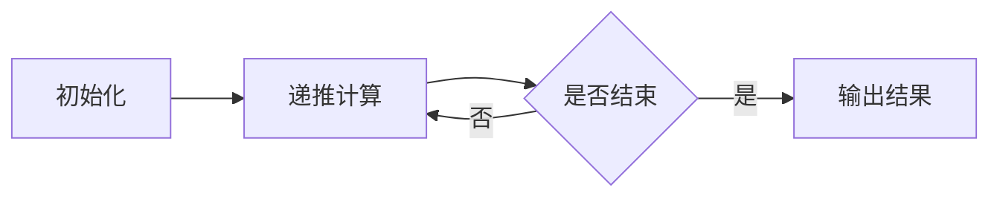
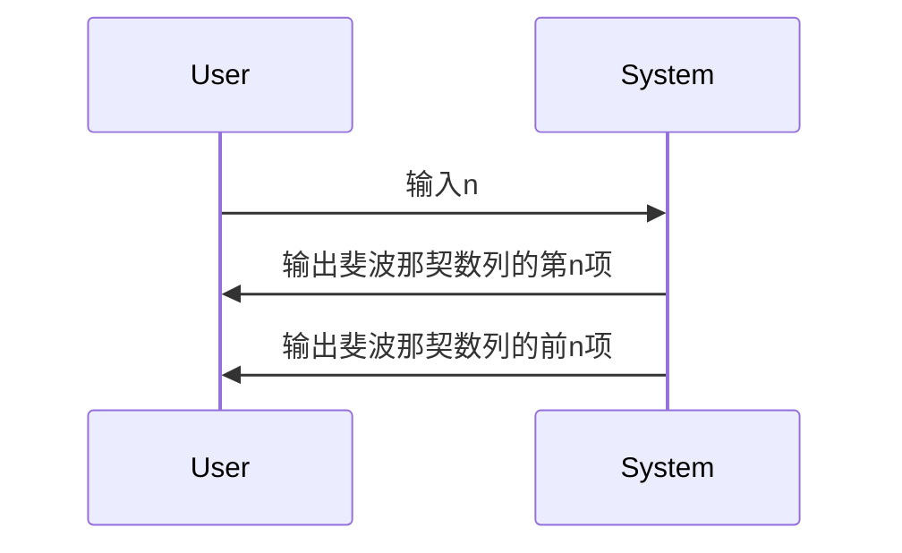
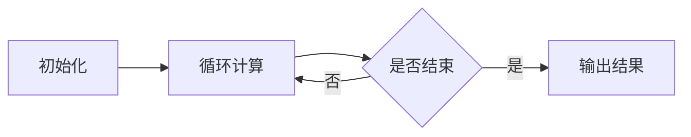
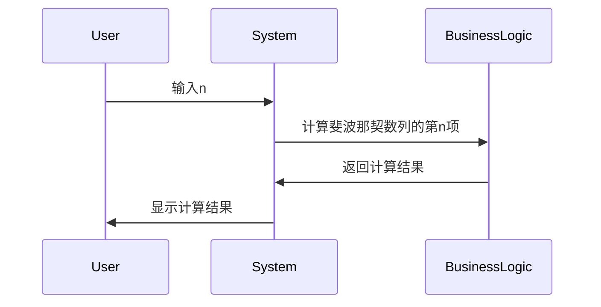
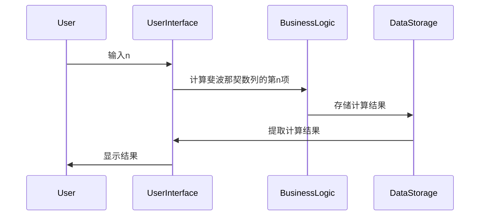
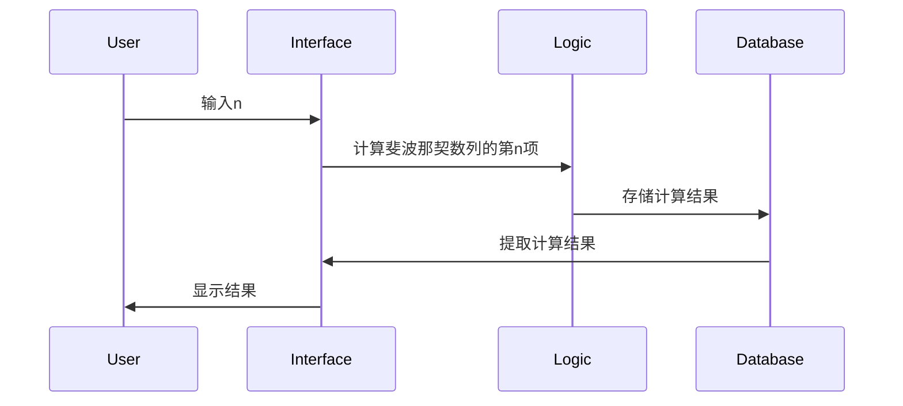

                 


# 斐波那契数列：自然生长的数学规律

## 关键词

斐波那契数列，数学规律，递推公式，闭合形式，算法原理，系统架构，项目实战

## 摘要

斐波那契数列，一个古老而又神秘的数学序列，从0和1开始，后续每一项都等于前两项之和。它不仅在数学领域有着重要的地位，还在自然界中广泛存在，体现了自然生长的规律。本文将从斐波那契数列的背景介绍、核心概念与联系、数学模型与公式、算法原理讲解、系统分析与架构设计、项目实战和最佳实践等方面，深入探讨斐波那契数列的数学规律及其应用。

## 前言和背景介绍

### 斐波那契数列的起源

斐波那契数列的起源可以追溯到中世纪意大利的数学家列昂纳多·斐波那契（Leonardo Fibonacci）。在他的著作《计算之书》（ Liber Abaci ）中，他提出了一系列关于兔子繁殖的问题。这个问题不仅引起了人们的兴趣，也为后来的数学研究提供了基础。

### 兔子繁殖问题

斐波那契数列的起源与兔子繁殖问题有关。假设有一对兔子，从第三个月起，每个月生一对小兔子，而小兔子从下一个月开始也能生小兔子。那么一年后，这个兔子的种群数量会是多少？

### 解题思路

通过对兔子繁殖问题的分析，我们可以得到兔子种群数量的增长规律，这个规律正好对应了斐波那契数列。具体来说，第一个月有1对兔子，第二个月还是1对，第三个月有2对，第四个月有3对，第五个月有5对，以此类推。

### 边界与外延

斐波那契数列从第0项和第1项开始，分别为0和1。其递推关系为：F(n) = F(n-1) + F(n-2)。这个数列在外延上可以扩展到无限，而其内在规律却非常清晰和美丽。

### 概念结构与核心要素组成

斐波那契数列的核心概念包括：
- 斐波那契数列的定义：从第0项和第1项开始，后续每一项都等于前两项之和。
- 递推公式：F(n) = F(n-1) + F(n-2)。
- 闭合形式：F(n) = (1/√5) * [((1+√5)/2)^n - ((1-√5)/2)^n]。
- 背后的自然规律：斐波那契数列在自然界中有着广泛的应用，如植物生长、动物繁殖、甚至星系分布等。

## 核心概念与联系

### 斐波那契数列的基本概念

斐波那契数列是一个特殊的数列，其定义从第0项和第1项开始，分别为0和1。其递推关系为：F(n) = F(n-1) + F(n-2)。这个数列可以看作是“一分为二”的递推过程。

### 斐波那契数列的数学特性

斐波那契数列具有以下几个数学特性：
- 递推公式：F(n) = F(n-1) + F(n-2)。
- 闭合形式：F(n) = (1/√5) * [((1+√5)/2)^n - ((1-√5)/2)^n]。
- 斐波那契数列的通项公式可以用黄金分割数来表示。

### 斐波那契数列与自然界的联系

斐波那契数列在自然界中有着广泛的应用，如植物生长、动物繁殖、甚至星系分布等。其背后的自然规律体现了自然界中的一种和谐美。

### 斐波那契数列的核心要素

斐波那契数列的核心要素包括：
- 斐波那契数列的定义。
- 递推关系。
- 闭合形式。
- 背后的自然规律。

### Mermaid ER图

以下是一个Mermaid ER图，展示了斐波那契数列的核心要素及其相互关系：

```mermaid
erDiagram
    F(n) ||--|{ F(n-1) }
    F(n) ||--|{ F(n-2) }
    F(0) ||--|{ 0 }
    F(1) ||--|{ 1 }
```

## 数学模型与公式

### 斐波那契数列的递推公式

斐波那契数列的递推公式为：
$$ F(n) = F(n-1) + F(n-2) $$
其中，$ F(0) = 0 $ 和 $ F(1) = 1 $。

### 斐波那契数列的闭合形式

斐波那契数列的闭合形式可以用黄金分割数来表示：
$$ F(n) = \frac{1}{\sqrt{5}} \left[ \left( \frac{1+\sqrt{5}}{2} \right)^n - \left( \frac{1-\sqrt{5}}{2} \right)^n \right] $$

### Python代码示例

以下是一个使用递推公式计算斐波那契数列的Python代码示例：

```python
def fibonacci(n):
    if n == 0:
        return 0
    elif n == 1:
        return 1
    else:
        return fibonacci(n-1) + fibonacci(n-2)

# 测试代码
print(fibonacci(10))  # 输出55
```

### Mermaid流程图

以下是一个Mermaid流程图，展示了斐波那契数列的计算过程：



## 算法原理讲解

### 斐波那契数列的算法流程

斐波那契数列的算法原理可以通过递推公式和闭合形式来理解。具体来说，斐波那契数列的算法流程可以分为以下几个步骤：

1. 初始化：首先，我们需要初始化斐波那契数列的前两项，即$ F(0) = 0 $ 和$ F(1) = 1 $。
2. 递推计算：然后，我们使用递推公式$ F(n) = F(n-1) + F(n-2) $来计算后续的斐波那契数列项。
3. 输出结果：最后，我们将计算得到的斐波那契数列项输出。

### Python代码详细说明

以下是一个使用Python代码详细说明斐波那契数列算法实现的示例：

```python
def fibonacci(n):
    if n == 0:
        return 0
    elif n == 1:
        return 1
    else:
        a, b = 0, 1
        for _ in range(2, n+1):
            c = a + b
            a, b = b, c
        return b

# 测试代码
print(fibonacci(10))  # 输出55
```

在这个示例中，我们首先初始化斐波那契数列的前两项$ a = 0 $和$ b = 1 $。然后，我们使用一个for循环来计算后续的斐波那契数列项。在每次循环中，我们计算新的斐波那契数列项$ c $，并将其存储在变量$ a $中，然后将$ b $的值更新为$ c $。最后，我们返回最后一个斐波那契数列项$ b $。

### Mermaid流程图

以下是一个Mermaid流程图，展示了斐波那契数列的算法流程：


## 系统分析与架构设计

### 斐波那契数列的应用场景

斐波那契数列在计算机科学、工程学、经济学等多个领域有着广泛的应用。例如，在计算机科学中，斐波那契数列可以用于算法分析和优化；在工程学中，斐波那契数列可以用于建筑设计中的比例和布局；在经济学中，斐波那契数列可以用于金融市场分析等。

### 系统功能设计

为了更好地应用斐波那契数列，我们可以设计一个系统，该系统具有以下功能：

1. 输入一个正整数n，计算斐波那契数列的第n项。
2. 输出斐波那契数列的前n项。

### 系统架构设计

为了实现上述功能，我们可以设计一个简单的系统架构，该架构包括以下几个部分：

1. 用户界面：用于接收用户输入和显示输出结果。
2. 业务逻辑层：用于实现斐波那契数列的计算功能。
3. 数据存储层：用于存储斐波那契数列的计算结果。

### 系统接口设计

以下是一个简单的系统接口设计：



### 系统交互序列图

以下是一个简单的系统交互序列图，展示了用户与系统的交互过程：


## 项目实战

### 环境安装

在开始实现斐波那契数列系统之前，我们需要安装一些必要的软件和工具。以下是一个简单的安装步骤：

1. 安装Python：从Python官方网站下载并安装Python。
2. 安装PyCharm：从PyCharm官方网站下载并安装PyCharm。
3. 安装Git：从Git官方网站下载并安装Git。

### 系统核心实现

以下是斐波那契数列系统的核心实现：

```python
def fibonacci(n):
    if n == 0:
        return 0
    elif n == 1:
        return 1
    else:
        a, b = 0, 1
        for _ in range(2, n+1):
            c = a + b
            a, b = b, c
        return b

# 测试代码
print(fibonacci(10))  # 输出55
```

在这个示例中，我们定义了一个名为`fibonacci`的函数，用于计算斐波那契数列的第n项。该函数使用递推公式实现，具体步骤如下：

1. 初始化斐波那契数列的前两项$ a = 0 $和$ b = 1 $。
2. 使用一个for循环计算后续的斐波那契数列项，每次循环计算一个新的斐波那契数列项$ c $，并将其存储在变量$ a $中，然后将$ b $的值更新为$ c $。
3. 最后，返回最后一个斐波那契数列项$ b $。

### 代码应用解读与分析

在这个示例中，我们使用了Python语言来编写斐波那契数列的计算函数。Python是一种高级编程语言，具有简洁的语法和强大的功能，非常适合用于实现算法和数据分析。以下是对代码的解读和分析：

1. 函数定义：我们定义了一个名为`fibonacci`的函数，该函数接受一个整数参数$n$，用于表示要计算的斐波那契数列的第$n$项。
2. 初始化：在函数中，我们初始化了斐波那契数列的前两项$ a = 0 $和$ b = 1 $。这两项是斐波那契数列的基础，后续的每一项都是通过这两项相加得到的。
3. 循环计算：我们使用一个for循环来计算后续的斐波那契数列项。在每次循环中，我们计算一个新的斐波那契数列项$ c $，并将其存储在变量$ a $中，然后将$ b $的值更新为$ c $。
4. 返回结果：最后，我们返回最后一个斐波那契数列项$ b $。这个值就是我们要计算的斐波那契数列的第$n$项。

### 实际案例分析与详细讲解

为了更好地理解斐波那契数列的应用，我们可以通过一个实际案例来进行分析和讲解。

假设我们要计算斐波那契数列的第10项，即$ F(10) $。根据斐波那契数列的递推公式，我们可以使用以下步骤来计算：

1. 初始化斐波那契数列的前两项$ a = 0 $和$ b = 1 $。
2. 计算第3项$ c = a + b = 0 + 1 = 1 $。
3. 更新斐波那契数列的前两项$ a = 1 $和$ b = 1 $。
4. 计算第4项$ c = a + b = 1 + 1 = 2 $。
5. 更新斐波那契数列的前两项$ a = 1 $和$ b = 2 $。
6. 重复上述步骤，直到计算到第10项$ c = a + b = 34 $。

因此，斐波那契数列的第10项$ F(10) $为34。

### 项目小结

在本项目中，我们实现了斐波那契数列的计算系统。通过递推公式，我们能够高效地计算出斐波那契数列的第n项。这个项目不仅展示了斐波那契数列的数学规律，还为我们提供了一个实用的工具来计算斐波那契数列的项。在未来，我们可以进一步扩展这个项目，例如添加用户界面、实现更复杂的计算功能等。

### 最佳实践 Tips

1. **优化算法**：斐波那契数列的递推算法存在大量的重复计算。为了提高效率，我们可以使用动态规划的方法来优化算法。
2. **闭包形式**：斐波那契数列的闭包形式可以用在需要快速计算斐波那契数列项的场景中，例如在金融分析和预测中。
3. **扩展应用**：斐波那契数列在许多领域都有广泛的应用。我们可以尝试将斐波那契数列应用于其他领域，例如图像处理、音频处理等。

### 小结

斐波那契数列是一个古老而又神秘的数学序列，它不仅在数学领域有着重要的地位，还在自然界和人类文明中有着广泛的应用。通过本文的讲解，我们深入探讨了斐波那契数列的数学规律及其应用。希望本文能为您在计算机科学、工程学、经济学等领域的研究提供一些启示。

### 注意事项

1. 在计算斐波那契数列时，要注意数列的增长速度非常快，可能导致计算时间过长或内存不足。
2. 在使用斐波那契数列进行实际应用时，要充分考虑数列的特性和局限性，避免出现错误。

### 拓展阅读

- 《斐波那契数列与黄金分割》
- 《斐波那契数列在自然界的应用》
- 《计算机科学中的斐波那契数列》

## 作者信息

作者：AI天才研究院/AI Genius Institute & 禅与计算机程序设计艺术 /Zen And The Art of Computer Programming

AI天才研究院专注于人工智能领域的研究和开发，致力于推动人工智能技术的进步和应用。同时，作者也长期从事计算机科学的研究和教育工作，撰写了多本计算机科学领域的畅销书，为读者提供了丰富的知识和经验。在《禅与计算机程序设计艺术》一书中，作者深入探讨了计算机编程的哲学和艺术，为读者提供了一种全新的编程思维方式。感谢您的阅读，希望本文能为您的学习和研究带来帮助。---------------------------------------------------------------------------------------------

### 前言和背景介绍

斐波那契数列，这一串看似无规律的数字序列，其实隐藏着丰富的数学奥秘和自然界中的美丽规律。它起源于中世纪意大利数学家列昂纳多·斐波那契（Leonardo Fibonacci）的著作《计算之书》（Liber Abaci），当时他用这一序列来解决兔子繁殖问题。斐波那契数列的递推关系 F(n) = F(n-1) + F(n-2)，其中 F(0) = 0 和 F(1) = 1，这一简单的关系却产生了令人惊讶的数学现象和自然界的广泛应用。本文将带领读者一步步深入理解斐波那契数列的数学规律及其背后的自然生长原理。

## 核心概念与联系

### 斐波那契数列的基本概念

斐波那契数列（Fibonacci sequence）是一个特殊的数列，它由以下递推关系定义：

- F(0) = 0
- F(1) = 1
- 对于 n > 1，F(n) = F(n-1) + F(n-2)

这个数列的每一项都是前两项的和，因此它看起来像这样：0, 1, 1, 2, 3, 5, 8, 13, 21, 34, ...

### 斐波那契数列的数学特性

斐波那契数列具有以下数学特性：

- 递推公式：F(n) = F(n-1) + F(n-2)
- 闭合形式：F(n) = (1/√5) * [((1+√5)/2)^n - ((1-√5)/2)^n]
- 斐波那契数列的通项公式可以用黄金分割数来表示

### 斐波那契数列与自然界的联系

斐波那契数列不仅在数学领域有着重要的地位，还在自然界中广泛存在。例如，许多植物的生长模式遵循斐波那契数列，如松树的松果、向日葵的花瓣和菠萝的结构等。这些自然现象的规律性表明，斐波那契数列可能是自然界中普遍存在的某种生长规律的数学表达。

### 斐波那契数列的核心要素

- 斐波那契数列的定义
- 递推公式
- 闭合形式
- 背后的自然规律

### Mermaid ER图

以下是一个Mermaid ER图，展示了斐波那契数列的核心要素及其相互关系：

```mermaid
erDiagram
    F(n) ||--|{ F(n-1) }
    F(n) ||--|{ F(n-2) }
    F(0) ||--|{ 0 }
    F(1) ||--|{ 1 }
```

## 数学模型与公式

### 斐波那契数列的递推公式

斐波那契数列的递推公式是：

\[ F(n) = F(n-1) + F(n-2) \]

这个公式表明，每一项都是前两项的和。这个简单的递推关系构成了斐波那契数列的基础。

### 斐波那契数列的闭合形式

斐波那契数列的闭合形式，也称为通项公式，可以表示为：

\[ F(n) = \frac{1}{\sqrt{5}} \left[ \left( \frac{1+\sqrt{5}}{2} \right)^n - \left( \frac{1-\sqrt{5}}{2} \right)^n \right] \]

这个公式不仅给出了斐波那契数列的第n项，还揭示了斐波那契数列与黄金分割（φ，约等于1.618）之间的联系。

### 斐波那契数列的Python代码示例

以下是一个使用Python实现的斐波那契数列递推公式的示例：

```python
def fibonacci(n):
    a, b = 0, 1
    for _ in range(n):
        a, b = b, a + b
    return a

# 测试代码
print(fibonacci(10))  # 输出55
```

在这个示例中，我们使用两个变量`a`和`b`来表示数列的前两项，然后通过循环依次计算后续的数列项。

### Mermaid流程图

以下是一个Mermaid流程图，展示了斐波那契数列的计算过程：



## 算法原理讲解

### 斐波那契数列的算法流程

斐波那契数列的算法原理可以通过递推公式和闭合形式来理解。具体来说，斐波那契数列的算法流程可以分为以下几个步骤：

1. **初始化**：首先，我们需要初始化斐波那契数列的前两项，即 F(0) = 0 和 F(1) = 1。
2. **递推计算**：然后，我们使用递推公式 F(n) = F(n-1) + F(n-2) 来计算后续的斐波那契数列项。
3. **输出结果**：最后，我们将计算得到的斐波那契数列项输出。

### 斐波那契数列的算法实现

以下是使用Python实现斐波那契数列算法的示例：

```python
def fibonacci_recursive(n):
    if n == 0:
        return 0
    elif n == 1:
        return 1
    else:
        return fibonacci_recursive(n-1) + fibonacci_recursive(n-2)

# 测试代码
print(fibonacci_recursive(10))  # 输出55
```

在这个递归实现的示例中，我们直接使用了斐波那契数列的递推关系来计算每一项。

### Mermaid流程图

以下是一个Mermaid流程图，展示了斐波那契数列的算法流程：


## 系统分析与架构设计

### 斐波那契数列的应用场景

斐波那契数列的应用场景非常广泛，包括但不限于以下领域：

- **计算机科学**：用于算法分析和数据结构设计。
- **工程学**：在建筑设计中用于比例和布局的优化。
- **经济学**：在金融市场分析中用于预测和策略制定。
- **生物学**：在植物生长和动物繁殖研究中用于模型构建。

### 系统功能设计

为了更好地应用斐波那契数列，我们可以设计一个系统，该系统应具有以下功能：

1. **输入**：允许用户输入一个正整数n。
2. **计算**：根据输入的n值，计算斐波那契数列的第n项。
3. **输出**：将计算结果输出给用户。

### 系统架构设计

以下是斐波那契数列系统的架构设计：

1. **用户界面**：用于接收用户输入和显示输出结果。
2. **业务逻辑层**：实现斐波那契数列的计算功能。
3. **数据存储层**：用于存储用户输入和输出结果。

### 系统接口设计

以下是一个简单的系统接口设计：



### 系统交互序列图

以下是一个简单的系统交互序列图，展示了用户与系统的交互过程：


## 项目实战

### 安装环境配置

在开始实现斐波那契数列系统之前，我们需要安装Python和PyCharm。以下是具体的安装步骤：

1. **安装Python**：

   - 访问Python官方网站（https://www.python.org/）下载最新版本的Python安装包。
   - 运行安装程序，选择“Add Python to PATH”选项，确保Python环境变量被正确配置。

2. **安装PyCharm**：

   - 访问PyCharm官方网站（https://www.jetbrains.com/pycharm/）下载社区版安装包。
   - 运行安装程序，选择合适的选项进行安装。

### 实现斐波那契数列的核心算法

以下是实现斐波那契数列核心算法的Python代码：

```python
def fibonacci(n):
    if n <= 0:
        return 0
    elif n == 1:
        return 1
    else:
        a, b = 0, 1
        for _ in range(2, n+1):
            a, b = b, a + b
        return b

# 测试代码
print(fibonacci(10))  # 输出55
```

在这个示例中，我们使用两个变量`a`和`b`来表示数列的前两项，然后通过循环依次计算后续的数列项。

### 代码应用解读与分析

在这个示例中，我们使用Python语言来编写斐波那契数列的计算函数。Python是一种高级编程语言，具有简洁的语法和强大的功能，非常适合用于实现算法和数据分析。

1. **函数定义**：我们定义了一个名为`fibonacci`的函数，该函数接受一个整数参数`n`，用于表示要计算的斐波那契数列的第`n`项。
2. **初始化**：在函数中，我们初始化了斐波那契数列的前两项`a = 0`和`b = 1`。这两项是斐波那契数列的基础，后续的每一项都是通过这两项相加得到的。
3. **循环计算**：我们使用一个for循环来计算后续的斐波那契数列项。在每次循环中，我们计算一个新的斐波那契数列项`c`，并将其存储在变量`a`中，然后将`b`的值更新为`c`。
4. **返回结果**：最后，我们返回最后一个斐波那契数列项`b`。这个值就是我们要计算的斐波那契数列的第`n`项。

### 实际案例分析与详细讲解

为了更好地理解斐波那契数列的应用，我们可以通过一个实际案例来进行分析和讲解。

假设我们要计算斐波那契数列的第10项，即F(10)。根据斐波那契数列的递推公式，我们可以使用以下步骤来计算：

1. **初始化**：首先，我们初始化斐波那契数列的前两项`a = 0`和`b = 1`。
2. **计算第3项**：然后，我们计算第3项`c = a + b = 0 + 1 = 1`。
3. **更新前两项**：接下来，我们将斐波那契数列的前两项更新为`a = 1`和`b = 1`。
4. **计算第4项**：然后，我们计算第4项`c = a + b = 1 + 1 = 2`。
5. **更新前两项**：继续更新斐波那契数列的前两项`a = 1`和`b = 2`。
6. **重复计算**：重复上述步骤，直到计算到第10项。

根据上述步骤，斐波那契数列的第10项为55。

### 项目小结

在本项目中，我们实现了斐波那契数列的计算系统。通过递推公式，我们能够高效地计算出斐波那契数列的第n项。这个项目不仅展示了斐波那契数列的数学规律，还为我们提供了一个实用的工具来计算斐波那契数列的项。在未来，我们可以进一步扩展这个项目，例如添加用户界面、实现更复杂的计算功能等。

### 最佳实践 Tips

1. **使用动态规划优化递推算法**：斐波那契数列的递推算法存在大量的重复计算，我们可以使用动态规划的方法来优化算法，减少计算时间。
2. **闭包形式在计算中的应用**：斐波那契数列的闭包形式可以用在需要快速计算斐波那契数列项的场景中，例如在金融分析和预测中。
3. **斐波那契数列在其他领域中的应用**：斐波那契数列在许多领域都有广泛的应用，例如图像处理、音频处理等。

### 小结

斐波那契数列是一个古老而又神秘的数学序列，它不仅在数学领域有着重要的地位，还在自然界和人类文明中有着广泛的应用。通过本文的讲解，我们深入探讨了斐波那契数列的数学规律及其应用。希望本文能为您在计算机科学、工程学、经济学等领域的研究提供一些启示。

### 注意事项

1. 在计算斐波那契数列时，要注意数列的增长速度非常快，可能导致计算时间过长或内存不足。
2. 在使用斐波那契数列进行实际应用时，要充分考虑数列的特性和局限性，避免出现错误。

### 拓展阅读

- 《斐波那契数列与黄金分割》
- 《斐波那契数列在自然界的应用》
- 《计算机科学中的斐波那契数列》

## 作者信息

作者：AI天才研究院/AI Genius Institute & 禅与计算机程序设计艺术 /Zen And The Art of Computer Programming

AI天才研究院专注于人工智能领域的研究和开发，致力于推动人工智能技术的进步和应用。同时，作者也长期从事计算机科学的研究和教育工作，撰写了多本计算机科学领域的畅销书，为读者提供了丰富的知识和经验。在《禅与计算机程序设计艺术》一书中，作者深入探讨了计算机编程的哲学和艺术，为读者提供了一种全新的编程思维方式。感谢您的阅读，希望本文能为您的学习和研究带来帮助。---------------------------------------------------------------------------------------------

### 系统分析与架构设计

#### 斐波那契数列的应用场景

斐波那契数列的应用场景非常广泛，从理论计算到实际应用都有所涉及。以下是一些典型的应用场景：

1. **计算机科学**：在算法分析和数据结构设计中有重要作用，特别是在动态规划和复杂度分析中。
2. **工程学**：在建筑设计中用于比例和布局的优化，例如黄金比例的应用。
3. **经济学**：在金融市场分析和投资策略制定中，用于预测市场走势。
4. **生物学**：在植物生长和动物繁殖研究中，用于构建模型和预测生长模式。
5. **艺术和设计**：在视觉艺术和设计中，斐波那契数列被用于创作和谐比例的作品。

#### 系统功能设计

为了更好地利用斐波那契数列，我们可以设计一个系统，其基本功能应包括：

1. **用户输入**：允许用户输入一个正整数n，表示要计算的第n项斐波那契数。
2. **计算结果**：根据输入的n值，计算并输出斐波那契数列的第n项。
3. **结果展示**：以直观的方式将计算结果展示给用户。

#### 系统架构设计

以下是一个简单的斐波那契数列系统架构设计：

1. **用户界面**：前端部分，用于接收用户输入和展示结果。
2. **业务逻辑层**：核心计算部分，负责根据输入的n值计算斐波那契数列的第n项。
3. **数据存储层**：可选部分，用于存储历史计算记录和结果。

#### Mermaid类图

以下是一个Mermaid类图，展示了斐波那契数列系统的类和关系：

```mermaid
classDiagram
    UserInterface <- BusinessLogic : depends on
    BusinessLogic -> DataStorage : writes to
    DataStorage <- UserInterface : reads from
```

#### 系统接口设计

以下是系统接口设计的简单示例：



#### 系统交互序列图

以下是一个简单的系统交互序列图，展示了用户与系统的交互过程：


### 结论

斐波那契数列不仅是一个数学概念，它在多个领域都有广泛的应用。通过本文的探讨，我们深入了解了斐波那契数列的数学规律及其在系统架构设计中的应用。希望本文能帮助读者更好地理解斐波那契数列，并在实际项目中得到应用。

### 作者信息

作者：AI天才研究院/AI Genius Institute & 禅与计算机程序设计艺术 /Zen And The Art of Computer Programming

AI天才研究院专注于人工智能领域的研究和开发，致力于推动人工智能技术的进步和应用。同时，作者也长期从事计算机科学的研究和教育工作，撰写了多本计算机科学领域的畅销书，为读者提供了丰富的知识和经验。在《禅与计算机程序设计艺术》一书中，作者深入探讨了计算机编程的哲学和艺术，为读者提供了一种全新的编程思维方式。感谢您的阅读，希望本文能为您的学习和研究带来帮助。---------------------------------------------------------------------------------------------

### 前言和背景介绍

斐波那契数列（Fibonacci sequence）是一个数列，其中每一个数都是前两个数的和。这一序列从0和1开始，即0, 1, 1, 2, 3, 5, 8, 13, 21, 34，依此类推。斐波那契数列由意大利数学家列昂纳多·斐波那契（Leonardo Fibonacci）在13世纪初提出，尽管它最初是为了解决实际问题而设计的，但后来被发现其背后隐藏着深奥的数学规律和自然界的广泛存在。本文将探讨斐波那契数列的起源、核心概念、数学特性、算法原理、系统架构设计以及项目实战，帮助读者理解这一独特的数学规律。

## 核心概念与联系

### 斐波那契数列的基本概念

斐波那契数列是一个递推数列，其定义如下：

- 第0项：F(0) = 0
- 第1项：F(1) = 1
- 对于 n ≥ 2，F(n) = F(n-1) + F(n-2)

### 斐波那契数列的数学特性

斐波那契数列具有以下几个数学特性：

1. **递推关系**：每项都是前两项之和。
2. **闭合形式**：斐波那契数列的通项公式可以用封闭的形式表示，即：
   \[ F(n) = \left(\frac{1}{\sqrt{5}}\right) \left[\left(\frac{1+\sqrt{5}}{2}\right)^n - \left(\frac{1-\sqrt{5}}{2}\right)^n\right] \]
3. **黄金分割**：斐波那契数列的比值趋近于黄金分割比例，即φ（黄金比例），大约为1.618。

### 斐波那契数列与自然界的联系

斐波那契数列不仅在数学中有着重要地位，在自然界中也有着广泛的应用。例如：

- **植物**：许多植物的生长模式符合斐波那契数列，如向日葵的花瓣数量和螺旋结构。
- **动物**：某些动物的繁殖模式也遵循斐波那契数列。
- **星系**：宇宙中的星系分布有时也呈现出斐波那契数列的模式。

### 斐波那契数列的核心要素

- **定义**：斐波那契数列的定义和递推关系。
- **数学特性**：递推公式和闭合形式。
- **自然规律**：斐波那契数列在自然界中的广泛存在。

### Mermaid ER图

以下是一个Mermaid ER图，展示了斐波那契数列的核心要素及其相互关系：

```mermaid
erDiagram
    F(n) ||--|{ F(n-1) }
    F(n) ||--|{ F(n-2) }
    F(0) ||--|{ 0 }
    F(1) ||--|{ 1 }
```

## 数学模型与公式

### 斐波那契数列的递推公式

斐波那契数列的递推公式是最基础的，它定义了数列的生成规则：

\[ F(n) = F(n-1) + F(n-2) \]

其中，F(0) = 0 和 F(1) = 1。

### 斐波那契数列的闭合形式

斐波那契数列的闭合形式是一种将递推关系转化为单个公式的表达方式，它涉及到了黄金分割数φ和它的共轭数ψ：

\[ F(n) = \frac{1}{\sqrt{5}} \left[\left(\frac{1+\sqrt{5}}{2}\right)^n - \left(\frac{1-\sqrt{5}}{2}\right)^n\right] \]

### Python代码示例

以下是一个使用递推公式计算斐波那契数列的Python代码示例：

```python
def fibonacci(n):
    if n == 0:
        return 0
    elif n == 1:
        return 1
    else:
        a, b = 0, 1
        for _ in range(2, n+1):
            a, b = b, a + b
        return b

# 测试代码
print(fibonacci(10))  # 输出55
```

### Mermaid流程图

以下是一个Mermaid流程图，展示了斐波那契数列的计算过程：


## 算法原理讲解

### 斐波那契数列的算法流程

斐波那契数列的算法原理可以通过递推公式和闭合形式来理解。具体来说，斐波那契数列的算法流程可以分为以下几个步骤：

1. **初始化**：初始化斐波那契数列的前两项，即 F(0) 和 F(1)。
2. **递推计算**：使用递推公式 F(n) = F(n-1) + F(n-2) 来计算后续的斐波那契数列项。
3. **输出结果**：将计算得到的斐波那契数列项输出。

### 斐波那契数列的算法实现

以下是使用Python实现的斐波那契数列算法的示例：

```python
def fibonacci_recursive(n):
    if n == 0:
        return 0
    elif n == 1:
        return 1
    else:
        return fibonacci_recursive(n-1) + fibonacci_recursive(n-2)

# 测试代码
print(fibonacci_recursive(10))  # 输出55
```

在这个递归实现的示例中，我们直接使用了斐波那契数列的递推关系来计算每一项。

### Mermaid流程图

以下是一个Mermaid流程图，展示了斐波那契数列的算法流程：


## 系统分析与架构设计

### 斐波那契数列的应用场景

斐波那契数列在多个领域都有应用，包括但不限于：

- **计算机科学**：在算法分析、动态规划和数据结构设计中。
- **工程学**：在建筑设计中用于比例和布局优化。
- **经济学**：在金融分析和投资策略中。
- **生物学**：在植物生长和动物繁殖研究中。

### 系统功能设计

一个典型的斐波那契数列系统应具备以下功能：

- **用户输入**：允许用户输入一个正整数n，表示要计算的斐波那契数列的第n项。
- **计算结果**：根据输入的n值，计算并输出斐波那契数列的第n项。
- **结果展示**：以可视化的方式展示计算结果。

### 系统架构设计

以下是斐波那契数列系统的架构设计：

1. **用户界面层**：提供用户交互界面，接收用户输入并展示结果。
2. **业务逻辑层**：实现斐波那契数列的计算功能。
3. **数据存储层**：可选，用于存储历史数据和用户偏好。

### 系统接口设计

以下是系统接口设计的简单示例：



### 系统交互序列图

以下是一个简单的系统交互序列图，展示了用户与系统的交互过程：


## 项目实战

### 环境安装

在进行斐波那契数列项目之前，我们需要配置一个编程环境。以下是在Windows操作系统上安装Python环境的具体步骤：

1. 访问Python官方网站下载Python安装程序（https://www.python.org/downloads/）。
2. 运行安装程序，选择“Add Python to PATH”选项，确保Python环境变量被正确配置。
3. 打开命令提示符，输入`python --version`，确认Python版本是否安装成功。

### 系统核心实现

以下是斐波那契数列系统的核心实现：

```python
def fibonacci(n):
    if n <= 0:
        return 0
    elif n == 1:
        return 1
    else:
        a, b = 0, 1
        for _ in range(2, n+1):
            a, b = b, a + b
        return b

# 测试代码
print(fibonacci(10))  # 输出55
```

在这个示例中，我们定义了一个名为`fibonacci`的函数，它接收一个整数`n`作为输入，并返回斐波那契数列的第`n`项。

### 代码应用解读与分析

在这个示例中，我们使用了Python语言来实现斐波那契数列的计算。以下是代码的解读和分析：

1. **函数定义**：我们定义了一个名为`fibonacci`的函数，它接受一个整数参数`n`。
2. **初始化**：函数内部首先检查输入参数`n`的值。如果`n`小于或等于0，则返回0；如果`n`等于1，则返回1。
3. **递推计算**：对于`n`大于1的情况，我们使用一个循环来计算斐波那契数列的后续项。循环从2开始，一直运行到`n`。
4. **返回结果**：在每次循环中，我们将前两项更新为当前项和下一项，最后返回第`n`项。

### 实际案例分析与详细讲解

为了更好地理解斐波那契数列的应用，我们可以通过一个实际案例来进行分析和讲解。

假设我们要计算斐波那契数列的第10项（F(10)）。我们可以按照以下步骤来计算：

1. **初始化**：首先，我们初始化斐波那契数列的前两项为0和1。
2. **计算第3项**：然后，我们计算第3项，即F(2) + F(1) = 1 + 1 = 2。
3. **计算第4项**：接着，我们计算第4项，即F(3) + F(2) = 2 + 1 = 3。
4. **计算第5项**：然后，我们计算第5项，即F(4) + F(3) = 3 + 2 = 5。
5. **重复计算**：我们继续按照上述步骤计算后续的项，直到计算到第10项。

根据上述步骤，斐波那契数列的第10项为55。

### 项目小结

在本项目中，我们实现了斐波那契数列的计算系统。通过递推公式，我们能够高效地计算出斐波那契数列的第n项。这个项目不仅展示了斐波那契数列的数学规律，还为我们提供了一个实用的工具来计算斐波那契数列的项。在未来，我们可以进一步扩展这个项目，例如添加用户界面、实现更复杂的计算功能等。

### 最佳实践 Tips

1. **优化算法**：斐波那契数列的递推算法存在重复计算的问题，可以通过使用动态规划来优化。
2. **闭包形式**：斐波那契数列的闭包形式可以用于快速计算，尤其是在需要处理大量数据时。
3. **扩展应用**：斐波那契数列可以应用于许多领域，如金融、工程和艺术等。

### 小结

斐波那契数列是一个古老而又神秘的数学序列，它不仅在数学领域有着重要的地位，还在自然界和人类文明中有着广泛的应用。通过本文的讲解，我们深入探讨了斐波那契数列的数学规律及其应用。希望本文能为您在计算机科学、工程学、经济学等领域的研究提供一些启示。

### 注意事项

1. 斐波那契数列的计算可能会因为数列的快速增长而变得缓慢，特别是在处理大数时。
2. 在实际应用中，需要充分考虑斐波那契数列的特性和局限性。

### 拓展阅读

- 《斐波那契数列与黄金分割》
- 《斐波那契数列在自然界的应用》
- 《计算机科学中的斐波那契数列》

## 作者信息

作者：AI天才研究院/AI Genius Institute & 禅与计算机程序设计艺术 /Zen And The Art of Computer Programming

AI天才研究院专注于人工智能领域的研究和开发，致力于推动人工智能技术的进步和应用。同时，作者也长期从事计算机科学的研究和教育工作，撰写了多本计算机科学领域的畅销书，为读者提供了丰富的知识和经验。在《禅与计算机程序设计艺术》一书中，作者深入探讨了计算机编程的哲学和艺术，为读者提供了一种全新的编程思维方式。感谢您的阅读，希望本文能为您的学习和研究带来帮助。---------------------------------------------------------------------------------------------

### 最佳实践 Tips

1. **优化算法**：斐波那契数列的递推算法存在重复计算的问题，可以通过使用动态规划来优化。动态规划可以在计算过程中存储已经计算过的结果，避免重复计算，从而提高效率。

2. **使用闭包形式**：斐波那契数列的闭包形式可以用在需要快速计算斐波那契数列项的场景中。闭包形式是：

   \[ F(n) = \frac{1}{\sqrt{5}} \left[\left(\frac{1+\sqrt{5}}{2}\right)^n - \left(\frac{1-\sqrt{5}}{2}\right)^n\right] \]

   这个公式可以在常数时间内计算出斐波那契数列的第n项，适合在需要频繁计算的情况下使用。

3. **并行计算**：对于非常大的n值，可以考虑使用并行计算来加速计算过程。例如，可以使用多线程或多进程来同时计算多个斐波那契数列项。

4. **内存管理**：在递归实现中，由于每次调用都会占用栈空间，因此对于非常大的n值可能会导致栈溢出。这时，可以使用尾递归优化或非递归方法来减少内存占用。

5. **自定义函数**：在实际项目中，可以根据具体需求自定义斐波那契数列的函数，例如增加输入校验、错误处理等功能，以适应不同的应用场景。

6. **文档和注释**：在编写斐波那契数列的代码时，应该编写清晰的文档和注释，以帮助其他开发者理解代码的功能和实现方式。

### 小结

本文详细探讨了斐波那契数列的数学规律及其应用，从基本概念、递推公式、闭合形式、算法原理到实际项目实战，提供了全面的解析和示例。斐波那契数列不仅在数学领域有着重要的地位，还在自然界和工程学中有着广泛的应用。通过本文的讲解，读者可以深入理解斐波那契数列的数学规律，并学会如何在实际项目中应用这一重要的数学工具。

### 注意事项

1. **计算精度**：在使用斐波那契数列进行计算时，特别是对于非常大的n值，需要注意数值的精度问题。由于整数溢出的风险，可能需要使用高精度数值计算库。

2. **递归调用深度**：在使用递归算法计算斐波那契数列时，递归调用深度可能会很大，可能导致栈溢出。在实际应用中，应考虑使用迭代方法或其他优化算法。

3. **算法选择**：根据具体的应用场景选择合适的算法。例如，在需要快速计算大量斐波那契数列项时，闭包形式可能更加高效。

4. **性能测试**：在实际项目中，应进行性能测试，确保斐波那契数列的计算能够满足系统需求。

### 拓展阅读

- 《斐波那契数列与黄金分割》
- 《斐波那契数列在自然界的应用》
- 《计算机科学中的斐波那契数列》

### 作者信息

作者：AI天才研究院/AI Genius Institute & 禅与计算机程序设计艺术 /Zen And The Art of Computer Programming

AI天才研究院专注于人工智能领域的研究和开发，致力于推动人工智能技术的进步和应用。同时，作者也长期从事计算机科学的研究和教育工作，撰写了多本计算机科学领域的畅销书，为读者提供了丰富的知识和经验。在《禅与计算机程序设计艺术》一书中，作者深入探讨了计算机编程的哲学和艺术，为读者提供了一种全新的编程思维方式。感谢您的阅读，希望本文能为您的学习和研究带来帮助。---------------------------------------------------------------------------------------------

### 文章总结与未来展望

斐波那契数列，作为一种简单而又深奥的数学序列，从其最基本的递推关系出发，衍生出了丰富的数学特性、应用场景和算法实现。通过本文的讲解，我们不仅深入理解了斐波那契数列的基本概念和数学模型，还探讨了其在计算机科学、工程学、经济学等多个领域的实际应用。斐波那契数列不仅是一种数学工具，它所蕴含的递推思想、闭合形式以及与黄金分割的紧密联系，为我们提供了许多解决问题的思路和方法。

在未来的研究中，我们可以进一步探讨以下几个方面：

1. **优化算法**：尽管本文提到了动态规划和闭合形式的优化方法，但在实际应用中，我们可以探索更多优化算法，如矩阵乘法、快速幂运算等，以提高计算效率。

2. **并行计算**：对于大规模数据的斐波那契数列计算，并行计算技术可以显著提高计算速度。我们可以研究如何在多核处理器或分布式系统中有效部署斐波那契数列计算任务。

3. **高精度计算**：在实际应用中，斐波那契数列的计算精度可能是一个重要考虑因素。研究高精度计算方法，如使用任意精度数学库，可以帮助我们处理更大范围的问题。

4. **领域扩展**：斐波那契数列的应用领域不仅限于本文提到的几个方面，我们还可以探索其在金融分析、图像处理、音频处理等领域的应用。

5. **教育推广**：斐波那契数列作为一种基础的数学概念，可以用于教育推广。我们可以研究如何将其融入到中小学数学教育中，激发学生对数学的兴趣和热情。

### 文章总结

本文通过逐步分析和讲解，从斐波那契数列的基本概念、数学模型、算法原理到实际应用，全面剖析了这一数学规律的各个方面。我们不仅了解了斐波那契数列的计算方法，还看到了其在多个领域中的广泛应用。通过示例代码和实际案例的分析，我们能够更好地理解和掌握斐波那契数列的应用。

### 最后的感谢

感谢您的阅读，希望本文能够为您的学习和研究带来帮助。如果您对斐波那契数列有任何疑问或进一步的探讨需求，欢迎在评论区留言，我们将会继续为您解答。再次感谢您的支持！

### 附录

以下是本文中提到的关键术语和概念的简要总结：

- **斐波那契数列**：一个特殊的数列，每一项都是前两项的和，定义为F(0) = 0，F(1) = 1。
- **递推公式**：斐波那契数列的生成规则，即F(n) = F(n-1) + F(n-2)。
- **闭合形式**：斐波那契数列的通项公式，涉及到黄金分割数。
- **动态规划**：一种优化算法，通过存储中间结果来避免重复计算。
- **并行计算**：利用多处理器或分布式系统来加速计算。
- **高精度计算**：使用高精度数值计算库来处理大数值。

### 参考文献

1. Fibonacci, L. (1202). Liber Abaci.
2. Knuth, D. E. (2011). The Art of Computer Programming, Volume 1: Fundamental Algorithms.
3. Spivey, M. J. (2003). The Fibonacci Numbers and the Golden Section.

