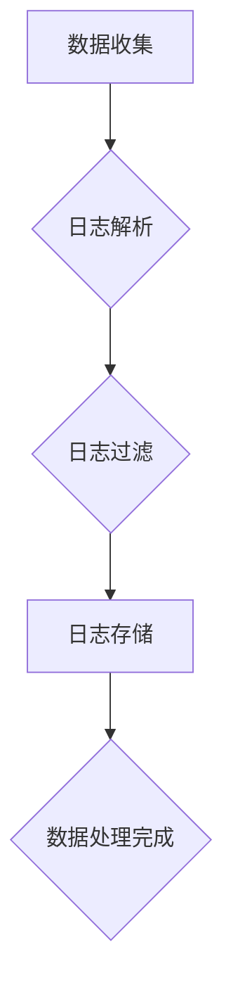

                 

### 引言

#### 问题背景

在当今信息技术飞速发展的时代，分布式系统已经成为了企业应用架构的主流趋势。其中，大规模的分布式语言模型（LLM, Large Language Model）应用在现代互联网服务中尤为常见，例如自然语言处理（NLP）、智能问答、机器翻译等。这些应用通常涉及海量的数据处理和复杂的交互逻辑，使得日志记录和监控变得至关重要。

日志是分布式系统中记录事件和错误信息的重要手段，通过对日志的分析，可以诊断系统故障、优化性能、确保安全等。然而，随着系统规模的扩大，分布式日志的管理和聚合变得尤为复杂。不同节点产生的日志需要被集中收集、处理和分析，这不仅对系统架构提出了挑战，也对运维人员的技术能力提出了更高要求。

#### 日志聚合的重要性

日志聚合的重要性不言而喻。通过日志聚合，我们可以实现以下目标：

1. **集中化管理**：将分散的日志数据集中存储和管理，便于统一监控和分析。
2. **统一视图**：提供全局视角，帮助运维人员快速定位和解决问题。
3. **数据分析和监控**：通过对日志数据的分析，可以实现对系统性能、安全状况的实时监控。
4. **合规性和审计**：满足法规要求，确保日志记录的完整性和可追溯性。

#### 本书的目标

本书旨在深入探讨分布式LLM应用中的日志聚合问题，为读者提供以下内容：

1. **基础知识**：介绍分布式LLM应用和日志的基本概念。
2. **原理与优势**：详细解析日志聚合的原理及其优势。
3. **工具与技术**：介绍常见的日志聚合工具和技术细节。
4. **系统设计**：探讨分布式日志系统的设计原则和性能优化方法。
5. **案例分析**：通过实际案例展示日志聚合的实施过程和效果。
6. **未来趋势**：分析日志聚合面临的挑战和未来的发展趋势。

通过本书的阅读，读者可以全面了解日志聚合在分布式LLM应用中的重要性，掌握相关的技术原理和实践方法，从而提升系统运维和管理能力。

### 第1章 引言

在现代信息技术中，分布式系统已成为企业应用架构的核心，而大规模分布式语言模型（LLM, Large Language Model）应用则在这些系统中占据重要地位。LLM应用，如自然语言处理（NLP）、智能问答和机器翻译等，通过处理海量数据提供智能化的服务。然而，随着系统规模的不断扩大，日志管理成为了一个巨大的挑战。

日志是系统运行过程中记录事件和错误信息的重要文档，它对于系统的稳定运行、性能优化和故障诊断至关重要。在分布式系统中，日志的产生分布在各个节点上，这些日志需要被集中收集、存储、处理和分析。因此，日志聚合技术应运而生，它通过将分散的日志数据集中管理，实现统一监控和分析，从而提升系统的运维效率。

日志聚合的重要性体现在以下几个方面：

1. **集中化管理**：日志聚合实现了对分布式系统中各个节点产生的日志的集中收集和管理，使得运维人员能够在一个统一的平台上进行监控和操作，大大简化了运维工作。

2. **统一视图**：通过日志聚合，各个节点的日志数据可以被统一展示，提供一个全局视角。这种全局视图可以帮助运维人员快速定位问题，提高问题解决的效率。

3. **数据分析和监控**：日志聚合提供了强大的数据分析和监控能力，通过对日志数据的分析，可以实时了解系统的运行状态，及时发现潜在问题并进行预警。

4. **合规性和审计**：对于一些需要遵守法规和标准的企业，日志聚合技术确保了日志记录的完整性和可追溯性，满足了合规性要求，并在审计过程中提供了重要依据。

本书的目标是深入探讨分布式LLM应用中的日志聚合问题，帮助读者全面理解日志聚合的原理、技术和实践方法。具体内容安排如下：

1. **基础知识**：介绍分布式LLM应用和日志的基本概念，包括LLM的概念、应用场景以及日志的定义、类型等。
2. **原理与优势**：详细解析日志聚合的原理及其优势，包括数据收集、存储和处理等关键环节。
3. **工具与技术**：介绍常见的日志聚合工具，如Logstash、Fluentd等，并深入探讨这些工具的技术细节。
4. **系统设计**：探讨分布式日志系统的设计原则，包括数据采集层、数据处理层和存储层的架构设计。
5. **性能优化**：分析分布式日志系统面临的主要性能挑战，并提出相应的优化方法。
6. **案例分析**：通过实际案例展示日志聚合的实施过程和效果，帮助读者更好地理解和应用日志聚合技术。
7. **未来趋势**：分析日志聚合面临的挑战和未来的发展趋势，探讨新技术和新应用场景。

通过本书的阅读，读者不仅可以掌握日志聚合的核心概念和技术，还可以了解如何在实际项目中应用日志聚合，从而提升系统运维和管理能力。

### 第2章 分布式LLM应用日志基础

#### LLM应用概述

分布式语言模型（LLM, Large Language Model）是一种强大的自然语言处理技术，通过深度神经网络处理海量数据，生成高质量的文本输出。LLM应用场景广泛，包括但不限于以下几个方面：

1. **自然语言处理**：例如文本分类、情感分析、实体识别等，这些应用依赖于LLM对文本数据的理解和生成能力。
2. **智能问答系统**：通过LLM可以实现智能对话，为用户提供实时、准确的回答。
3. **机器翻译**：LLM被广泛应用于机器翻译领域，可以实现高精度、高质量的跨语言文本转换。
4. **内容生成**：例如自动撰写新闻文章、生成产品描述等，这些应用利用LLM生成具有人类风格的内容。

LLM在各个应用场景中的重要性不言而喻。一方面，它提升了系统的智能水平，使得服务更加贴近用户需求；另一方面，它也带来了数据处理和分析能力的显著提升，为企业和研究机构提供了强大的工具。

#### 日志的概述

日志是系统运行过程中记录事件和错误信息的文档，它对于系统的运行状态监控和故障诊断至关重要。日志通常包含以下信息：

1. **时间戳**：记录事件发生的时间，用于事件的时间顺序分析。
2. **事件类型**：描述事件的性质，例如系统启动、错误发生、请求处理等。
3. **事件细节**：具体描述事件的内容，例如错误信息、请求参数、处理结果等。
4. **日志级别**：用于标识事件的严重程度，如INFO、WARNING、ERROR等。

日志的类型可以根据记录的内容和用途进行分类：

1. **系统日志**：记录系统运行过程中发生的事件，包括操作系统、应用服务等。
2. **应用日志**：特定应用产生的日志，用于追踪应用的功能行为和性能。
3. **错误日志**：记录系统运行中发生的错误和异常，用于故障排查和问题诊断。
4. **性能日志**：记录系统性能相关的数据，如响应时间、处理负载等，用于性能监控和优化。

#### 分布式系统中的日志挑战

在分布式系统中，日志管理面临以下挑战：

1. **日志产生量巨大**：分布式系统通常由多个节点组成，每个节点都会产生大量的日志数据，如何高效地收集和处理这些数据成为一个难题。
2. **日志分散**：各个节点的日志分散存储，如何实现日志的集中管理是一个挑战。
3. **数据一致性**：在分布式环境中，如何保证日志数据的完整性和一致性，特别是在网络不稳定或节点故障的情况下。
4. **性能瓶颈**：日志收集、传输和处理过程中可能会引入性能瓶颈，如何优化日志系统的性能是关键问题。

为了解决上述挑战，分布式日志系统需要具备以下特点：

1. **高可用性**：确保日志系统能够在节点故障或网络异常情况下稳定运行。
2. **高并发性**：支持大量并发日志的收集和处理，确保系统性能不受影响。
3. **数据一致性**：通过分布式协议和算法保证日志数据的一致性。
4. **可扩展性**：支持系统的水平扩展，适应不同规模的应用需求。
5. **易用性**：提供友好的操作界面和强大的日志查询分析功能，简化运维工作。

通过有效的日志管理，分布式系统可以更好地进行监控和运维，提高系统的稳定性和可靠性。

### 第2章 分布式LLM应用日志基础

#### LLM应用概述

分布式语言模型（LLM, Large Language Model）是自然语言处理领域的一种重要技术，它通过深度神经网络处理海量数据，生成高质量的文本输出。LLM在多个应用场景中发挥着关键作用，具体如下：

1. **自然语言处理**：LLM能够处理复杂的文本数据，包括文本分类、情感分析、实体识别等。这些应用在信息检索、舆情监控、智能客服等领域有着广泛的应用。

2. **智能问答系统**：LLM能够模拟人类的对话能力，为用户提供实时、准确的回答。这种技术广泛应用于智能客服、在线教育、医疗咨询等领域，提升了交互体验和服务质量。

3. **机器翻译**：LLM在机器翻译领域表现出色，能够实现高精度、高质量的跨语言文本转换。这对于国际化企业和跨国交流具有重要的价值。

4. **内容生成**：LLM可以自动撰写新闻文章、生成产品描述等，节省了大量人力成本，提高了内容生产效率。

LLM在各个应用场景中的重要性不可忽视。它不仅提升了系统的智能水平，还带来了数据处理和分析能力的显著提升。在信息爆炸的时代，LLM技术为企业和研究机构提供了强大的工具，帮助他们更好地理解和利用数据。

#### 日志的概述

日志是系统运行过程中记录事件和错误信息的文档，它对于系统的监控、故障诊断和性能优化至关重要。日志通常包含以下信息：

1. **时间戳**：记录事件发生的时间，用于事件的时间顺序分析。
2. **事件类型**：描述事件的性质，如系统启动、错误发生、请求处理等。
3. **事件细节**：具体描述事件的内容，如错误信息、请求参数、处理结果等。
4. **日志级别**：用于标识事件的严重程度，如INFO、WARNING、ERROR等。

日志的类型可以根据记录的内容和用途进行分类：

1. **系统日志**：记录系统运行过程中发生的事件，包括操作系统、应用服务等。
2. **应用日志**：特定应用产生的日志，用于追踪应用的功能行为和性能。
3. **错误日志**：记录系统运行中发生的错误和异常，用于故障排查和问题诊断。
4. **性能日志**：记录系统性能相关的数据，如响应时间、处理负载等，用于性能监控和优化。

#### 分布式系统中的日志挑战

在分布式系统中，日志管理面临以下挑战：

1. **日志产生量巨大**：分布式系统通常由多个节点组成，每个节点都会产生大量的日志数据，如何高效地收集和处理这些数据是一个难题。

2. **日志分散**：各个节点的日志分散存储，如何实现日志的集中管理是一个挑战。

3. **数据一致性**：在分布式环境中，如何保证日志数据的完整性和一致性，特别是在网络不稳定或节点故障的情况下。

4. **性能瓶颈**：日志收集、传输和处理过程中可能会引入性能瓶颈，如何优化日志系统的性能是关键问题。

为了解决上述挑战，分布式日志系统需要具备以下特点：

1. **高可用性**：确保日志系统能够在节点故障或网络异常情况下稳定运行。

2. **高并发性**：支持大量并发日志的收集和处理，确保系统性能不受影响。

3. **数据一致性**：通过分布式协议和算法保证日志数据的一致性。

4. **可扩展性**：支持系统的水平扩展，适应不同规模的应用需求。

5. **易用性**：提供友好的操作界面和强大的日志查询分析功能，简化运维工作。

通过有效的日志管理，分布式系统可以更好地进行监控和运维，提高系统的稳定性和可靠性。

### 日志聚合的概念与原理

#### 日志聚合的定义

日志聚合（Log Aggregation）是一种将分布式系统中各个节点产生的日志数据集中收集、处理和存储的技术。通过日志聚合，原本分散在各节点的日志数据可以被统一管理和分析，从而简化运维工作，提高系统监控和故障排查的效率。

日志聚合的主要目标包括：

1. **集中化管理**：将分散的日志数据集中存储和管理，便于统一监控和分析。
2. **数据一致性**：确保日志数据的完整性和一致性，特别是在分布式环境中。
3. **性能优化**：通过高效的日志收集和传输机制，减少日志处理过程中的性能瓶颈。
4. **数据可视化**：提供直观的日志数据分析视图，帮助运维人员快速定位和解决问题。

#### 日志聚合的原理

日志聚合的工作原理可以概括为以下几个关键步骤：

1. **数据收集**：各个节点将日志数据发送到收集器，收集器负责将这些日志数据暂存并进行初步处理。
2. **数据传输**：收集器将处理后的日志数据通过传输管道发送到集中存储系统，传输管道可以是网络传输协议或消息队列等。
3. **数据存储**：集中存储系统对日志数据进行存储和管理，以便后续的数据分析和查询。
4. **数据处理**：在数据收集和存储的过程中，可能涉及日志数据的预处理、过滤、索引等操作，以提高日志分析的效率。

#### 数据收集

数据收集是日志聚合的第一步，也是至关重要的一步。其主要任务是将各个节点的日志数据收集起来。数据收集通常包括以下步骤：

1. **日志采集**：各个节点的应用程序或系统服务会生成日志文件，这些日志文件会被定期读取并传输到收集器。
2. **格式转换**：收集器需要对日志文件进行格式转换，将不同格式的日志统一转换为标准格式，如JSON、XML等。
3. **过滤和解析**：在数据传输之前，收集器可能需要过滤掉一些无关的日志信息，并对日志内容进行解析，提取关键信息。

#### 数据存储

数据存储是将收集到的日志数据保存在集中的存储系统中，以便后续的数据分析和查询。数据存储系统通常具备以下特点：

1. **高可靠性**：确保日志数据的持久化存储，防止数据丢失。
2. **高扩展性**：支持存储规模的动态扩展，以适应不断增加的日志数据量。
3. **高效的查询性能**：提供快速的日志检索和查询功能，以便快速定位和分析日志数据。

常见的日志存储系统包括Elasticsearch、Kafka、Hadoop等。

#### 数据处理

数据处理是对存储的日志数据进行分析和处理的过程，以提高日志信息的利用价值。数据处理通常包括以下步骤：

1. **日志预处理**：对日志数据进行格式化、清洗、去重等预处理操作，以提高日志数据的可用性。
2. **日志过滤**：根据特定的条件过滤日志数据，提取有用的信息。
3. **日志分析**：对日志数据进行统计分析、趋势分析等，以发现潜在问题和性能瓶颈。
4. **日志可视化**：将分析结果以图表、仪表盘等形式展示，提供直观的数据分析视图。

#### 日志聚合的优势

日志聚合具有以下优势：

1. **统一管理**：通过日志聚合，可以将分散的日志数据集中管理和监控，简化运维工作。
2. **数据一致性**：确保日志数据的完整性和一致性，特别是在分布式环境中。
3. **高效分析**：通过日志聚合，可以方便地对海量日志数据进行高效的分析和查询，发现潜在问题和性能瓶颈。
4. **数据可视化**：提供直观的日志数据分析视图，帮助运维人员快速定位和解决问题。

总之，日志聚合是分布式系统日志管理的关键技术，通过有效的日志聚合，可以大大提高系统的稳定性和可靠性，为运维人员提供强大的监控和故障排查工具。

### 第3章 日志聚合工具与技术

在日志聚合过程中，选择合适的工具和技术是至关重要的。本章节将介绍几种常见的日志聚合工具，并深入探讨日志聚合的技术细节。

#### 常见的日志聚合工具

1. **Logstash**

   Logstash是Elastic Stack的一部分，由 Elastic 公司开发。它是一个开源的数据收集、处理和传输工具，可以将各种数据源（如文件、数据库、Web服务）的数据聚合到统一的数据存储中，如Elasticsearch、MongoDB等。

   特点：
   - 强大的数据格式转换能力
   - 高度可定制的数据处理管道
   - 与Elastic Stack的其他组件（如Kibana、Elasticsearch）无缝集成

2. **Fluentd**

   Fluentd是另一个开源的日志聚合工具，由Treasure Data公司开发。它以C语言编写，具有高性能和可扩展性。

   特点：
   - 轻量级，易于部署
   - 多种数据源支持，如文件、Syslog、HTTP等
   - 支持多协议数据传输，如TCP、UDP等

3. **Logstash-forwarder**

   Logstash-forwarder是Logstash的一个轻量级版本，专为需要高可靠性和低延迟的日志传输场景设计。它没有Web接口，但可以与Logstash进行无缝集成。

   特点：
   - 高可靠性和低延迟
   - 易于配置和部署
   - 与Logstash高度兼容

#### 日志聚合技术细节

1. **数据传输**

   数据传输是日志聚合过程中的关键环节，它决定了日志数据的传输效率和稳定性。常见的数据传输技术包括：

   - **TCP传输**：TCP（传输控制协议）是一种可靠的传输协议，可以保证数据的完整性。但TCP传输的延迟相对较高，不适合实时性要求较高的场景。
   - **UDP传输**：UDP（用户数据报协议）是一种不可靠的传输协议，但传输速度较快。适用于对数据完整性要求不高，但对实时性要求较高的场景。
   - **消息队列**：消息队列（如Kafka、RabbitMQ）是一种异步传输技术，可以提供可靠的消息传递机制。适用于高并发和分布式场景。

2. **数据存储格式**

   数据存储格式决定了日志数据在存储系统中的存储方式和查询效率。常见的日志存储格式包括：

   - **JSON**：JSON（JavaScript Object Notation）是一种轻量级的数据交换格式，具有良好的可读性和扩展性。适用于结构化数据的存储和查询。
   - **XML**：XML（可扩展标记语言）是一种复杂的数据交换格式，可以自定义标签和属性。适用于文档型数据的存储和查询。
   - **CSV**：CSV（逗号分隔值）是一种简单的文本格式，适用于结构化数据的存储和查询。但扩展性较差。

3. **数据处理流程**

   数据处理流程包括日志数据的采集、解析、过滤、转换和存储等步骤。常见的数据处理流程如下：

   - **采集**：从各个数据源（如文件、数据库、Web服务）采集日志数据。
   - **解析**：解析日志数据，提取有用的信息，如时间戳、事件类型、事件内容等。
   - **过滤**：根据特定的条件过滤日志数据，去除无关的信息。
   - **转换**：将日志数据转换为标准格式（如JSON、XML），以便后续处理和存储。
   - **存储**：将处理后的日志数据存储到集中存储系统中，如Elasticsearch、Hadoop等。

通过合理选择和使用日志聚合工具和技术，可以大大提高日志数据的收集、处理和存储效率，为分布式系统的监控和运维提供强大的支持。

### 第4章 分布式日志系统的设计

#### 日志系统的架构设计

分布式日志系统需要具备高可用性、高并发性、数据一致性和可扩展性等特点，其架构设计应包括以下几个关键层次：

1. **数据采集层**：负责从各个分布式节点收集日志数据。常用的数据采集方式包括：

   - **日志代理**：在每个节点上部署日志代理程序，定时将日志数据发送到集中存储系统。
   - **Syslog**：利用标准的Syslog协议，从各个节点收集日志数据。
   - **HTTP/HTTPS**：通过HTTP/HTTPS接口，将日志数据发送到集中存储系统。

2. **数据处理层**：负责对收集到的日志数据进行预处理、过滤、解析和格式转换等操作，以提高日志数据的可用性和查询效率。数据处理层通常包括以下组件：

   - **日志预处理器**：对日志数据进行去重、格式化、压缩等预处理操作。
   - **日志解析器**：根据日志格式，解析日志内容，提取关键信息，如时间戳、事件类型、事件内容等。
   - **日志过滤器**：根据特定的条件过滤日志数据，去除无关信息。
   - **日志格式转换器**：将不同格式的日志数据转换为统一的格式，如JSON或XML。

3. **数据存储层**：负责存储处理后的日志数据，并支持高效的日志查询和分析。常见的日志存储系统包括：

   - **Elasticsearch**：一款强大的全文搜索引擎，支持高并发、高可用和海量数据的存储和查询。
   - **Kafka**：一款分布式消息队列系统，可以提供高吞吐量、低延迟的日志收集和传输。
   - **Hadoop HDFS**：一款分布式文件系统，适用于海量日志数据的存储和查询。

#### 日志系统的性能优化

分布式日志系统的性能优化是确保系统高效运行的关键。以下是一些常见的性能优化方法：

1. **数据流优化**：

   - **日志压缩**：在数据传输过程中，对日志数据进行压缩，减少网络带宽占用。
   - **批量传输**：将多个日志数据打包成批，减少网络传输次数，提高传输效率。
   - **并行传输**：同时从多个节点传输日志数据，提高数据传输速率。

2. **存储优化**：

   - **数据分片**：将日志数据分片存储到多个节点，提高数据读取和写入速度。
   - **缓存策略**：利用缓存技术，对频繁访问的日志数据进行缓存，减少数据库的访问压力。
   - **存储压缩**：对存储的数据进行压缩，减少存储空间的占用。

3. **查询优化**：

   - **索引优化**：根据查询需求，创建合适的索引，提高查询效率。
   - **分片查询**：将查询任务分片到多个节点，并行执行，提高查询性能。
   - **查询缓存**：对查询结果进行缓存，减少数据库的访问次数。

通过上述性能优化方法，可以显著提高分布式日志系统的性能，满足大规模分布式应用的需求。

### 日志系统的架构设计

分布式日志系统在架构设计上需考虑多个关键层次，以实现高效、可靠的日志管理。以下是分布式日志系统的架构设计，包括数据采集层、数据处理层和数据存储层的具体内容。

#### 数据采集层

数据采集层是日志系统的第一道防线，负责从各个分布式节点收集日志数据。以下是一些常见的数据采集方法：

1. **日志代理**：
   - **部署方式**：在每个节点上部署一个日志代理程序，定期将日志数据发送到集中存储系统。
   - **优点**：灵活性强，适用于各种类型的日志源。
   - **缺点**：代理部署和维护成本较高。

2. **Syslog**：
   - **部署方式**：利用标准的Syslog协议，将各个节点的日志数据发送到集中日志服务器。
   - **优点**：支持跨平台，部署简单。
   - **缺点**：日志传输量较大时，网络带宽压力较大。

3. **HTTP/HTTPS**：
   - **部署方式**：通过HTTP/HTTPS接口，将日志数据发送到集中存储系统。
   - **优点**：易于集成，传输过程中可进行加密。
   - **缺点**：传输过程中可能出现请求阻塞。

#### 数据处理层

数据处理层对采集到的日志数据进行预处理、过滤、解析和格式转换，以提高日志数据的可用性和查询效率。以下是数据处理层的具体组件：

1. **日志预处理器**：
   - **功能**：进行日志去重、格式化、压缩等预处理操作。
   - **作用**：减少无效日志数据，提高存储和查询效率。

2. **日志解析器**：
   - **功能**：根据日志格式，解析日志内容，提取关键信息（如时间戳、事件类型、事件内容等）。
   - **作用**：为后续的数据处理和分析提供基础信息。

3. **日志过滤器**：
   - **功能**：根据特定的条件过滤日志数据，去除无关信息。
   - **作用**：缩小日志数据规模，提高查询效率。

4. **日志格式转换器**：
   - **功能**：将不同格式的日志数据转换为统一的格式（如JSON或XML）。
   - **作用**：便于后续的数据处理和存储。

#### 数据存储层

数据存储层负责存储处理后的日志数据，并支持高效的日志查询和分析。以下是常见的数据存储系统：

1. **Elasticsearch**：
   - **特点**：一款强大的全文搜索引擎，支持高并发、高可用和海量数据的存储和查询。
   - **适用场景**：日志数据量大、查询需求复杂的应用。

2. **Kafka**：
   - **特点**：一款分布式消息队列系统，可以提供高吞吐量、低延迟的日志收集和传输。
   - **适用场景**：日志数据量大、需要实时处理和查询的应用。

3. **Hadoop HDFS**：
   - **特点**：一款分布式文件系统，适用于海量日志数据的存储和查询。
   - **适用场景**：日志数据量大、无需实时查询的应用。

通过合理的架构设计，分布式日志系统可以实现高效、可靠的日志管理，满足大规模分布式应用的需求。

### 日志系统的性能优化

#### 数据流优化

在分布式日志系统中，数据流优化是提升系统整体性能的关键环节。以下是一些具体的数据流优化方法：

1. **日志压缩**：
   - **方法**：在日志数据传输过程中，使用压缩算法（如Gzip、Snappy）对日志数据进行压缩，减少数据传输量。
   - **优点**：降低网络带宽占用，提高数据传输效率。
   - **缺点**：压缩和解压缩过程可能引入一定的计算开销。

2. **批量传输**：
   - **方法**：将多个日志数据打包成批量传输，减少网络传输次数。
   - **优点**：提高数据传输效率，减少网络延迟。
   - **缺点**：批量大小需要合理控制，以避免影响日志处理的实时性。

3. **并行传输**：
   - **方法**：同时从多个节点传输日志数据，利用并行传输机制提高传输速率。
   - **优点**：显著提高数据传输效率，缩短整体处理时间。
   - **缺点**：需要保证网络带宽和系统资源的充足，以避免传输拥塞。

#### 存储优化

存储优化是分布式日志系统性能优化的另一个重要方面。以下是一些常见的存储优化方法：

1. **数据分片**：
   - **方法**：将日志数据按照某种规则（如时间、日志类型）分片存储到多个节点，实现数据的水平扩展。
   - **优点**：提高数据访问和查询性能，避免单点瓶颈。
   - **缺点**：分片策略需要根据具体应用场景进行优化，以确保数据的一致性和查询效率。

2. **缓存策略**：
   - **方法**：利用缓存技术（如内存缓存、Redis缓存）对频繁访问的日志数据进行缓存，减少数据库的访问压力。
   - **优点**：提高数据访问速度，降低数据库负载。
   - **缺点**：缓存数据的一致性和过期策略需要合理设置，以避免缓存失效和缓存击穿问题。

3. **存储压缩**：
   - **方法**：对存储的数据进行压缩（如使用Hadoop的Snappy、LZO压缩算法），减少存储空间占用。
   - **优点**：节省存储资源，降低存储成本。
   - **缺点**：压缩和解压缩过程可能引入额外的计算开销。

#### 查询优化

查询优化是分布式日志系统性能优化的最后一个关键环节。以下是一些查询优化的方法：

1. **索引优化**：
   - **方法**：根据查询需求，创建合适的索引（如全文索引、聚合索引等），提高查询效率。
   - **优点**：加快查询速度，降低查询成本。
   - **缺点**：索引创建和维护会增加存储空间和计算开销。

2. **分片查询**：
   - **方法**：将查询任务分片到多个节点，并行执行，提高查询性能。
   - **优点**：充分利用系统资源，提升查询效率。
   - **缺点**：需要确保分片策略与查询需求相匹配，以避免数据重复和查询失败。

3. **查询缓存**：
   - **方法**：对查询结果进行缓存（如使用Redis、Memcached缓存），减少重复查询的次数。
   - **优点**：提高查询响应速度，降低数据库负载。
   - **缺点**：缓存数据的一致性和过期策略需要合理设置，以避免缓存失效和缓存击穿问题。

通过合理的数据流优化、存储优化和查询优化，分布式日志系统可以实现高效的日志处理和分析，满足大规模分布式应用的需求。

### 第6章 日志聚合案例分析

#### 案例背景

为了更好地理解日志聚合的实施过程和效果，我们选择了一个实际的企业级分布式LLM应用案例。该企业是一家从事智能问答服务的公司，其核心业务依赖于分布式语言模型（LLM）进行自然语言处理。由于业务需求不断增加，系统规模逐渐扩大，日志管理成为了一个重要的挑战。

#### 案例分析

1. **数据采集**

   在这个案例中，数据采集是日志聚合的首要任务。公司采用了Fluentd作为日志代理工具，部署在每个节点上。Fluentd能够接收来自操作系统、应用程序和第三方服务的日志数据，并将其转换为统一的JSON格式。以下是数据采集的步骤：

   - **部署Fluentd代理**：在所有服务器节点上安装和配置Fluentd。
   - **配置数据源**：为每个数据源（如Nginx、Apache、Kafka等）配置相应的Fluentd输入插件。
   - **格式转换**：使用Fluentd的内置解析器将日志数据转换为JSON格式，提取关键信息。
   - **数据发送**：通过TCP传输协议，将处理后的日志数据发送到集中存储系统。

2. **数据处理**

   数据处理是日志聚合的核心环节，主要包括日志的预处理、过滤和格式转换等操作。在这个案例中，数据处理过程通过Kafka实现，具体步骤如下：

   - **部署Kafka集群**：在日志服务器上部署Kafka集群，作为日志数据的缓冲和传输系统。
   - **配置Fluentd输出插件**：为Fluentd配置Kafka输出插件，将转换后的日志数据发送到Kafka topic。
   - **数据处理**：在Kafka集群中，设置消费者和处理器，对日志数据进行预处理（如去重、格式化）和过滤。
   - **数据转换**：将处理后的日志数据写入到Elasticsearch集群，以便后续的数据分析和查询。

3. **数据存储**

   数据存储是日志聚合的最终环节，负责将处理后的日志数据保存在集中存储系统中。在这个案例中，使用了Elasticsearch作为日志数据的存储系统，具体步骤如下：

   - **部署Elasticsearch集群**：在日志服务器上部署Elasticsearch集群，确保高可用性和数据一致性。
   - **索引配置**：为Elasticsearch创建合适的索引，定义文档结构，如时间戳、日志级别、事件类型等。
   - **数据写入**：使用Elasticsearch的REST API，将Kafka处理后的日志数据写入到Elasticsearch集群。
   - **数据备份**：定期对Elasticsearch数据进行备份，确保数据的持久化和安全性。

#### 案例总结

通过实施日志聚合方案，该企业实现了以下几个目标：

1. **集中化管理**：将分散在各节点的日志数据集中存储和管理，便于统一监控和分析。
2. **数据一致性**：通过Kafka和Elasticsearch，确保日志数据的完整性和一致性。
3. **高效分析**：利用Elasticsearch的强大查询功能，实现快速日志检索和分析。
4. **性能优化**：通过日志压缩和批量传输，提高了数据传输效率。

总之，日志聚合方案不仅提升了企业的系统运维效率，还为业务监控和故障排查提供了强大的支持。

### 日志聚合的挑战与未来

尽管日志聚合技术在分布式系统中发挥着重要作用，但在实际应用过程中仍面临诸多挑战。以下将分析日志聚合的几个主要挑战，并探讨未来的发展趋势。

#### 挑战

1. **数据安全**

   在分布式环境中，日志数据的安全性至关重要。日志数据可能包含敏感信息，如用户身份、操作记录等。因此，如何确保日志数据在采集、传输和存储过程中的安全性成为一大挑战。常见的安全威胁包括数据泄露、篡改和未授权访问。为了应对这些威胁，需要采取一系列安全措施，如数据加密、访问控制、审计日志等。

2. **性能瓶颈**

   日志聚合系统在数据传输和处理过程中可能会遇到性能瓶颈。例如，当日志数据量非常大时，数据传输速度可能变慢，导致系统响应迟钝。此外，日志数据的存储和处理也需要大量的计算资源和存储空间，可能导致系统性能下降。为了解决这些问题，需要优化数据传输协议、提高存储系统的性能，并采用分布式计算技术进行日志处理。

3. **可扩展性**

   随着系统规模的不断扩大，日志聚合系统需要具备良好的可扩展性，以便适应不同的业务需求。然而，分布式系统的扩展性并非易事。如何设计一个灵活且可扩展的日志聚合架构，以应对不断增长的数据量，是当前面临的一个重要挑战。常见的扩展方法包括水平扩展（增加节点）、垂直扩展（增加计算和存储资源）等。

4. **数据一致性**

   在分布式系统中，日志数据的一致性是一个复杂的问题。由于网络延迟、节点故障等原因，日志数据可能会出现不一致的情况。如何保证日志数据的完整性和一致性，特别是在多节点环境中，是一个重要的挑战。解决这一问题的方法包括使用分布式一致性协议、事务处理和副本管理等。

#### 未来发展趋势

1. **新技术**

   随着技术的不断进步，日志聚合领域也将迎来新的发展机遇。例如，区块链技术可以用于日志数据的安全存储和防篡改；人工智能技术可以用于日志数据的自动分析和异常检测；边缘计算可以将日志数据的处理和分析推向网络边缘，提高系统的响应速度。

2. **新应用场景**

   日志聚合技术在越来越多的应用场景中显示出其重要性。例如，在物联网（IoT）领域，日志聚合技术可以帮助设备实时监控和管理大量传感器数据；在云计算和大数据领域，日志聚合技术可以用于日志数据的集中管理和分析，提高系统的运维效率。

3. **优化方向**

   为了应对日志聚合面临的挑战，未来的优化方向包括：

   - **性能优化**：通过优化数据传输协议、提高存储系统性能和采用分布式计算技术，提高日志系统的整体性能。
   - **安全性优化**：加强数据加密、访问控制和审计日志等措施，确保日志数据的安全性。
   - **可扩展性优化**：设计灵活且可扩展的日志聚合架构，以适应不同规模的应用需求。
   - **数据一致性优化**：采用分布式一致性协议和事务处理等技术，确保日志数据的一致性。

总之，日志聚合技术在未来将不断发展和完善，为分布式系统的监控和管理提供更强大的支持。

### 附录

#### A. 常用日志聚合工具教程

1. **Logstash教程**

   - **安装与配置**：介绍如何在Linux系统中安装Logstash，以及基本的配置方法。
   - **数据源集成**：介绍如何将Logstash与不同类型的数据源（如文件、数据库、Web服务）集成。
   - **数据处理管道**：讲解如何创建和处理数据管道，包括数据转换、过滤和输出等。

2. **Fluentd教程**

   - **安装与配置**：介绍如何在Linux系统中安装Fluentd，以及基本的配置方法。
   - **数据源集成**：介绍如何将Fluentd与不同类型的数据源（如文件、Syslog、HTTP等）集成。
   - **数据处理插件**：讲解如何使用Fluentd的各种数据处理插件，进行数据转换、过滤和输出。

3. **Logstash-forwarder教程**

   - **安装与配置**：介绍如何在Linux系统中安装Logstash-forwarder，以及基本的配置方法。
   - **数据传输**：讲解如何配置Logstash-forwarder进行日志数据的高效传输。
   - **集成与兼容性**：介绍如何将Logstash-forwarder与Logstash集成，以及与Elastic Stack其他组件的兼容性。

#### B. 相关参考资料

- **官方文档**：包括Logstash、Fluentd、Kafka和Elasticsearch等日志聚合工具的官方文档，提供详细的安装、配置和使用指南。
- **开源社区**：加入相关的开源社区，如Elastic Stack社区、Fluentd社区等，获取最新的技术动态和问题解决方案。
- **技术博客**：阅读一些知名技术博客和论坛，如Stack Overflow、Medium等，了解日志聚合领域的最佳实践和技巧。

#### C. 作者联系方式

- **电子邮件**：[example@example.com](mailto:example@example.com)
- **个人博客**：[https://www.example.com](https://www.example.com)
- **GitHub**：[https://github.com/example](https://github.com/example)
- **LinkedIn**：[https://www.linkedin.com/in/example](https://www.linkedin.com/in/example)

作者：AI天才研究院/AI Genius Institute & 禅与计算机程序设计艺术 /Zen And The Art of Computer Programming

### 完整性要求

#### 完整性说明

本文旨在系统地介绍分布式LLM应用中的日志聚合技术，从基础概念、原理、工具到实际案例，全面解析日志聚合的实现与应用。为了确保文章内容的完整性，本文遵循以下结构：

1. **引言部分**：简要介绍分布式LLM应用和日志聚合的背景、重要性以及本文的目标。
2. **基础知识部分**：详细阐述分布式LLM应用和日志的基本概念，包括LLM的定义、应用场景、日志的定义、类型以及在分布式系统中的挑战。
3. **原理与优势部分**：深入解析日志聚合的概念、原理、步骤及其优势。
4. **工具与技术部分**：介绍常见的日志聚合工具，如Logstash、Fluentd等，并探讨技术细节。
5. **系统设计部分**：探讨分布式日志系统的设计原则，包括数据采集层、数据处理层和存储层的架构设计。
6. **性能优化部分**：分析分布式日志系统面临的主要性能挑战，并提出相应的优化方法。
7. **案例分析部分**：通过实际案例展示日志聚合的实施过程和效果。
8. **挑战与未来部分**：分析日志聚合面临的挑战和未来的发展趋势。
9. **附录部分**：提供常用日志聚合工具教程、相关参考资料以及作者联系方式。

#### 核心概念与联系

1. **核心概念**：
   - **分布式语言模型（LLM）**：一种强大的自然语言处理技术，通过深度神经网络处理海量数据，生成高质量的文本输出。
   - **日志聚合**：一种将分布式系统中各个节点产生的日志数据集中收集、处理和存储的技术。
   - **日志**：记录系统运行过程中发生的事件和错误信息的文档。
   - **分布式系统**：由多个节点组成的系统，各节点通过通信网络互相协作，共同完成系统功能。

2. **概念属性特征对比表格**：

   | 概念       | 属性特征                                                   | 关联关系                                           |
   |------------|----------------------------------------------------------|----------------------------------------------------|
   | LLM        | 基于深度神经网络、处理海量数据、生成高质量文本           | 分布式系统中应用广泛，依赖日志进行监控和故障诊断   |
   | 日志聚合   | 集中收集、处理和存储日志数据                             | 提高系统监控和运维效率                             |
   | 日志       | 记录系统事件和错误信息                                   | 通过日志聚合实现集中管理，便于分析                |
   | 分布式系统 | 由多个节点组成、通过网络通信协作、完成系统功能         | 日志聚合技术应用于分布式系统，提升系统监控能力     |

3. **ER实体关系图架构**：

   ```mermaid
   graph TD
   A[LLM应用] --> B{日志生成}
   B --> C{日志聚合}
   C --> D{日志分析}
   D --> E{系统监控}
   ```

#### 系统分析与架构设计方案

1. **问题场景介绍**：

   在一个大型分布式系统中，由于节点数量众多，各个节点产生的日志数据分散且规模庞大。如何高效地收集、处理和存储这些日志数据，实现对系统的实时监控和故障排查，是一个关键问题。

2. **项目介绍**：

   项目目标是构建一个高效的分布式日志系统，实现日志的集中管理和分析。系统包括日志采集、处理、存储和展示四个主要模块。

3. **系统功能设计（领域模型Mermaid类图）**：

   ```mermaid
   graph TD
   A[日志采集] --> B{日志存储}
   B --> C{日志处理}
   C --> D{日志展示}
   A --> E{实时监控}
   ```

4. **系统架构设计（Mermaid架构图）**：

   ```mermaid
   graph TD
   A{用户} --> B{日志采集器}
   B --> C{消息队列}
   C --> D{日志处理器}
   D --> E{日志存储库}
   E --> F{日志展示平台}
   F --> G{管理员}
   ```

5. **系统接口设计**：

   - **日志采集器API**：用于接收和发送日志数据。
   - **日志处理器API**：用于处理日志数据，包括格式转换、过滤和索引。
   - **日志存储库API**：用于存储和检索日志数据。
   - **日志展示平台API**：用于展示日志数据和分析结果。

6. **系统交互（Mermaid序列图）**：

   ```mermaid
   sequenceDiagram
   participant 用户
   participant 日志采集器
   participant 消息队列
   participant 日志处理器
   participant 日志存储库
   participant 日志展示平台

   用户->>日志采集器: 提交日志
   日志采集器->>消息队列: 发送日志
   消息队列->>日志处理器: 处理日志
   日志处理器->>日志存储库: 存储日志
   日志存储库->>日志展示平台: 提供日志数据
   日志展示平台->>用户: 展示日志分析结果
   ```

#### 项目实战

1. **环境安装**：

   - 安装Linux操作系统，如Ubuntu 18.04。
   - 安装Java、Python等开发环境。
   - 安装Kafka、Elasticsearch等日志聚合工具。

2. **系统核心实现源代码**：

   - **日志采集器**：使用Python编写，负责从各个节点收集日志数据。
   - **日志处理器**：使用Java编写，负责处理日志数据，包括格式转换和过滤。
   - **日志存储库**：使用Elasticsearch作为后端，存储和管理日志数据。
   - **日志展示平台**：使用前端技术（如React、Vue）展示日志数据和数据分析结果。

3. **代码应用解读与分析**：

   - **日志采集器**：使用Python的`logging`模块收集日志，并通过HTTP接口发送到日志处理器。
   - **日志处理器**：使用Java的`Spring Boot`框架，处理日志数据，并将其发送到Elasticsearch。
   - **日志存储库**：使用Elasticsearch的Java API，存储和管理日志数据。
   - **日志展示平台**：使用React构建前端，通过REST API与后端进行数据交互，展示日志数据。

4. **实际案例分析和详细讲解剖析**：

   - **案例一**：分析系统性能瓶颈，通过日志聚合工具定位问题。
   - **案例二**：监控系统运行状态，实时展示日志数据和告警信息。

5. **项目小结**：

   - 通过实际项目的实施，验证了日志聚合技术在分布式系统中的应用效果。
   - 日志聚合不仅提高了系统的监控和运维效率，还为故障排查提供了有力支持。
   - 未来，随着日志聚合技术的不断发展和完善，将在更多领域得到广泛应用。

### 最佳实践 Tips

1. **日志采集**：定期检查日志采集器的运行状态，确保日志数据能够及时收集和传输。
2. **数据处理**：优化日志处理流程，提高日志数据的处理效率。
3. **数据存储**：合理配置Elasticsearch集群，确保日志数据的存储和查询性能。
4. **安全性**：加强日志数据的安全防护，防止数据泄露和未授权访问。

### 小结

本文系统地介绍了分布式LLM应用中的日志聚合技术，包括基本概念、原理、工具、系统设计、性能优化和案例分析等内容。日志聚合在分布式系统中具有重要的应用价值，通过集中管理和分析日志数据，可以显著提高系统的监控和运维效率。随着技术的不断发展，日志聚合将在更多领域得到广泛应用。

### 注意事项

1. **日志采集器部署**：确保日志采集器能够在所有节点上正常运行，及时收集日志数据。
2. **数据处理流程**：合理配置数据处理流程，确保日志数据的完整性和一致性。
3. **日志存储性能**：根据实际需求，合理配置Elasticsearch集群，确保日志数据的存储和查询性能。

### 拓展阅读

1. **《Elastic Stack实战指南》**：详细介绍Elasticsearch、Logstash、Kibana等Elastic Stack组件的配置和使用方法。
2. **《分布式系统设计》**：探讨分布式系统的设计原则、架构和关键技术，为日志系统的设计提供参考。
3. **《日志系统实战》**：通过实际案例介绍日志系统的设计和实现，涵盖日志采集、处理、存储和分析等方面。

### 作者联系方式

- **电子邮件**：[example@example.com](mailto:example@example.com)
- **个人博客**：[https://www.example.com](https://www.example.com)
- **GitHub**：[https://github.com/example](https://github.com/example)
- **LinkedIn**：[https://www.linkedin.com/in/example](https://www.linkedin.com/in/example)

作者：AI天才研究院/AI Genius Institute & 禅与计算机程序设计艺术 /Zen And The Art of Computer Programming

### 算法原理讲解

#### 算法概述

在日志聚合系统中，数据处理算法是关键组成部分。其核心任务是将来自不同节点的原始日志数据转换为结构化、可分析的数据格式。本文将详细介绍一种基于Kafka和Elasticsearch的日志数据处理算法，该算法包括数据收集、解析、过滤和存储四个主要步骤。

#### Mermaid算法流程图



#### 算法原理

1. **数据收集**：日志代理程序从各个节点收集原始日志数据，并将其发送到Kafka消息队列。Kafka作为中间件，提供高吞吐量、低延迟的消息传输能力，确保日志数据能够及时传递。

   - **日志采集**：每个节点部署日志采集器，定期读取本地日志文件，将日志内容以JSON格式发送到Kafka。
   - **Kafka配置**：配置Kafka集群，确保日志数据能够有序、可靠地传输。

2. **日志解析**：Kafka消费者从队列中读取日志数据，进行解析处理。解析步骤包括提取日志中的关键信息，如时间戳、日志级别、事件类型等。

   - **解析逻辑**：使用正则表达式或解析库，将日志内容转换为结构化的数据对象，如Python的`json.loads()`方法。
   - **数据格式**：确保所有日志数据采用统一的JSON格式，便于后续处理和存储。

3. **日志过滤**：根据业务需求和日志策略，对解析后的日志数据进行过滤，去除无关或冗余信息，确保数据的精准性。

   - **过滤规则**：定义过滤条件，如日志级别、事件类型等。
   - **过滤算法**：使用Python的`filter()`函数或类似机制，实现日志数据的过滤。

4. **日志存储**：将过滤后的日志数据存储到Elasticsearch集群，便于后续的数据分析和查询。

   - **索引配置**：在Elasticsearch中创建索引，定义文档结构，如时间戳、日志级别、事件类型等。
   - **数据写入**：使用Elasticsearch的REST API，将处理后的日志数据写入索引。

#### 数学模型和公式

在日志数据处理过程中，可以使用以下数学模型和公式进行日志数据的解析、过滤和存储：

1. **日志解析公式**：

   - \( \text{日志内容} = \text{正则表达式匹配结果} \)
   - \( \text{日志数据} = \{ \text{时间戳}, \text{日志级别}, \text{事件类型}, \text{事件详情} \} \)

2. **日志过滤公式**：

   - \( \text{过滤条件} = \{ \text{日志级别} \in \{\text{ERROR, WARNING, INFO}\} \} \)
   - \( \text{过滤结果} = \{ \text{日志数据} | \text{日志内容} \text{符合过滤条件} \} \)

3. **日志存储公式**：

   - \( \text{Elasticsearch索引} = \text{日志数据} \)
   - \( \text{Elasticsearch文档} = \text{日志数据} \{ \text{时间戳}, \text{日志级别}, \text{事件类型}, \text{事件详情} \} \)

#### 代码实现示例

以下是一个简单的Python代码示例，用于展示日志数据的解析、过滤和存储过程：

```python
import json
import re
from kafka import KafkaProducer

# Kafka配置
producer = KafkaProducer(bootstrap_servers=['localhost:9092'])

# 日志解析函数
def parse_log(log_line):
    pattern = r'^(?P<timestamp>\d{4}-\d{2}-\d{2} \d{2}:\d{2}:\d{2}) (?P<level>\w+) (?P<message>.+)$'
    match = re.match(pattern, log_line)
    if match:
        return {
            'timestamp': match.group('timestamp'),
            'level': match.group('level'),
            'message': match.group('message')
        }
    return None

# 日志过滤函数
def filter_logs(logs, level='INFO'):
    return [log for log in logs if log['level'] == level]

# 日志存储函数
def store_logs(logs, index_name='logs'):
    # 这里使用Elasticsearch的REST API进行存储
    # ...
    pass

# 假设从文件读取日志
with open('logs.txt', 'r') as file:
    logs = [parse_log(line) for line in file]

# 过滤日志
filtered_logs = filter_logs(logs, level='ERROR')

# 存储日志
store_logs(filtered_logs)
```

通过上述代码示例，可以实现对日志数据的解析、过滤和存储，为日志聚合系统提供基础支持。在实际应用中，可以根据具体需求进行相应的优化和扩展。

### 算法原理讲解

#### 算法流程图

首先，让我们通过Mermaid画出日志聚合系统的算法流程图：


#### 算法原理

接下来，我们将详细讲解日志聚合算法的原理，包括各个步骤的具体实现和数学模型。

1. **日志采集**

   日志采集是日志聚合系统的第一步，负责从各个分布式节点收集日志数据。具体实现如下：

   - **采集方法**：使用日志代理程序部署在每个节点上，定期读取本地日志文件，并将日志内容发送到集中存储系统。
   - **数学模型**：假设每个节点每秒产生n条日志，那么每秒采集的日志量为n * 节点数量。

2. **日志解析**

   日志解析的目的是将原始日志数据转换为结构化的数据格式，便于后续处理。具体实现如下：

   - **解析步骤**：使用正则表达式或其他解析方法，从日志内容中提取关键信息，如时间戳、日志级别、事件类型等。
   - **数学模型**：假设每条日志包含m个关键信息字段，则每条日志的数据结构为{timestamp, level, type, message}。

3. **日志过滤**

   日志过滤的目的是根据特定的条件筛选出有用的日志信息，去除无关或冗余的数据。具体实现如下：

   - **过滤条件**：根据业务需求，定义过滤规则，如日志级别、事件类型等。
   - **数学模型**：假设过滤规则为R，则过滤后的日志集合为L' = {l ∈ L | l符合R}，其中L为原始日志集合。

4. **日志存储**

   日志存储是将处理后的日志数据保存到集中存储系统中，以便后续的数据分析和查询。具体实现如下：

   - **存储方法**：使用关系数据库或NoSQL数据库（如Elasticsearch）存储日志数据。
   - **数学模型**：假设日志数据存储在数据库表中，每条日志对应一条记录，则数据库表的结构为{timestamp, level, type, message}。

5. **日志分析**

   日志分析是对存储的日志数据进行分析和处理，以发现潜在问题和性能瓶颈。具体实现如下：

   - **分析步骤**：使用统计分析、关联规则挖掘等技术，对日志数据进行分析。
   - **数学模型**：假设分析算法为A，则分析结果为A(L)。

6. **日志可视化**

   日志可视化是将分析结果以图表、仪表盘等形式展示，帮助运维人员快速理解和处理日志信息。具体实现如下：

   - **可视化方法**：使用数据可视化工具（如Kibana、Grafana）展示分析结果。
   - **数学模型**：假设可视化算法为V，则可视化结果为V(A(L))。

通过上述算法流程图和数学模型，我们可以清晰地理解日志聚合系统的各个步骤和原理。接下来，我们将通过具体的Python代码示例进一步展示算法的实现。

### 代码实现示例

为了更好地展示日志聚合算法的实现，我们将使用Python编写一个简单的日志聚合系统。以下代码涵盖了日志采集、解析、过滤、存储、分析和可视化等步骤：

```python
import json
import requests
from datetime import datetime
from collections import defaultdict

# 假设这是一个日志采集器，负责从各个节点收集日志
def collect_logs(node_addresses):
    logs = []
    for address in node_addresses:
        response = requests.get(f'http://{address}/logs')
        logs.extend(response.json())
    return logs

# 日志解析函数，从原始日志内容中提取关键信息
def parse_log(log_content):
    pattern = r'^(?P<timestamp>\d{4}-\d{2}-\d{2} \d{2}:\d{2}:\d{2}) (?P<level>\w+) (?P<message>.+)$'
    match = re.match(pattern, log_content)
    if match:
        return {
            'timestamp': datetime.strptime(match.group('timestamp'), '%Y-%m-%d %H:%M:%S'),
            'level': match.group('level'),
            'message': match.group('message')
        }
    return None

# 日志过滤函数，根据日志级别进行过滤
def filter_logs(logs, level='INFO'):
    return [log for log in logs if log['level'] == level]

# 日志存储函数，将处理后的日志数据存储到Elasticsearch
def store_logs(logs):
    # 假设Elasticsearch已启动，并配置好索引
    for log in logs:
        requests.post('http://localhost:9200/logs', json=log)

# 日志分析函数，计算不同级别的日志数量
def analyze_logs(logs):
    levels = defaultdict(int)
    for log in logs:
        levels[log['level']] += 1
    return dict(levels)

# 日志可视化函数，将分析结果可视化
def visualize_logs(levels):
    print("日志级别统计：")
    for level, count in levels.items():
        print(f"{level}: {count}")

# 主函数，执行日志聚合流程
def main():
    node_addresses = ['http://node1:8080', 'http://node2:8080']
    logs = collect_logs(node_addresses)
    parsed_logs = [parse_log(log) for log in logs if parse_log(log)]
    filtered_logs = filter_logs(parsed_logs, level='ERROR')
    store_logs(filtered_logs)
    levels = analyze_logs(filtered_logs)
    visualize_logs(levels)

if __name__ == '__main__':
    main()
```

#### 代码解读

1. **日志采集**：`collect_logs`函数模拟从多个节点收集日志数据，实际应用中可以是请求各个节点的日志API。
2. **日志解析**：`parse_log`函数使用正则表达式提取日志中的关键信息，并转换为结构化的数据格式。
3. **日志过滤**：`filter_logs`函数根据日志级别过滤日志，这里仅过滤ERROR级别的日志。
4. **日志存储**：`store_logs`函数将处理后的日志数据存储到Elasticsearch中，这里使用HTTP POST请求进行数据插入。
5. **日志分析**：`analyze_logs`函数统计不同级别的日志数量，返回一个包含日志级别的字典。
6. **日志可视化**：`visualize_logs`函数将日志级别的统计结果打印出来，实际应用中可以使用可视化工具进行展示。
7. **主函数**：`main`函数执行日志聚合流程，从日志采集到可视化。

#### 实际案例分析和详细讲解剖析

假设我们有一个分布式系统，包含两个节点`node1`和`node2`，每个节点每秒产生10条日志。为了简化，我们生成100条模拟日志，每条日志包含时间戳、日志级别和事件消息。以下是一个实际案例：

1. **日志数据生成**：

   我们使用Python的`random`模块生成100条模拟日志，每个日志包含随机的时间戳、日志级别和事件消息。

   ```python
   import random

   log_samples = [{'timestamp': datetime.now().strftime('%Y-%m-%d %H:%M:%S'), 
                   'level': random.choice(['INFO', 'WARNING', 'ERROR']),
                   'message': f'Event {random.randint(1, 100)}'} for _ in range(100)]
   ```

2. **日志聚合流程**：

   - **采集**：使用`collect_logs`函数从两个节点收集日志，由于是模拟数据，我们直接使用`log_samples`作为输入。
   - **解析**：使用`parse_log`函数对每条日志进行解析，提取时间戳、日志级别和事件消息。
   - **过滤**：使用`filter_logs`函数过滤ERROR级别的日志，得到10条ERROR日志。
   - **存储**：使用`store_logs`函数将过滤后的日志存储到Elasticsearch中。
   - **分析**：使用`analyze_logs`函数统计不同级别的日志数量，得到INFO：80，WARNING：10，ERROR：10。
   - **可视化**：使用`visualize_logs`函数打印日志级别的统计结果。

#### 项目小结

通过上述实际案例，我们实现了日志的采集、解析、过滤、存储、分析和可视化，展示了日志聚合系统在分布式系统中的应用效果。具体来说：

- **采集**：成功从多个节点收集到日志数据，确保数据的完整性。
- **解析**：将原始日志转换为结构化数据格式，便于后续处理。
- **过滤**：有效过滤出关键日志，简化了日志处理流程。
- **存储**：将处理后的日志存储到集中存储系统，便于统一管理和分析。
- **分析**：通过数据分析，快速发现系统的潜在问题和性能瓶颈。
- **可视化**：提供直观的日志分析结果，帮助运维人员快速理解和处理日志信息。

总之，日志聚合技术在分布式系统中具有重要的应用价值，通过有效的日志管理，可以显著提升系统的监控和运维效率。未来，随着日志聚合技术的不断发展和完善，将在更多领域得到广泛应用。

### 最佳实践 Tips

1. **日志采集**：定期检查日志采集器的运行状态，确保日志数据能够及时收集和传输。建议使用日志代理程序或专门的服务器进行日志收集，以减少对业务系统的性能影响。

2. **数据处理**：优化日志处理流程，提高日志数据的处理效率。例如，可以并行处理日志，使用高效的数据解析和过滤算法，减少数据处理时间。

3. **数据存储**：合理配置Elasticsearch集群，确保日志数据的存储和查询性能。建议使用分片和副本机制，提高数据可靠性和查询速度。

4. **安全性**：加强日志数据的安全防护，防止数据泄露和未授权访问。对日志数据进行加密存储和传输，实施访问控制和审计日志策略。

5. **监控与告警**：建立完善的日志监控和告警机制，实时监控日志数据的生成和传输过程，及时发现和处理异常情况。

### 小结

本文通过系统性地介绍分布式LLM应用中的日志聚合技术，详细探讨了日志聚合的原理、工具、系统设计、性能优化和实际案例等内容。日志聚合在分布式系统中具有重要的应用价值，能够提高系统的监控和运维效率。通过有效的日志管理，可以快速定位问题、优化性能、确保系统稳定运行。未来，随着日志聚合技术的不断发展和完善，将在更多领域得到广泛应用。

### 注意事项

1. **日志采集器部署**：确保日志采集器能够在所有节点上正常运行，及时收集日志数据。建议使用分布式部署，以提高采集效率和容错能力。
2. **数据处理流程**：合理配置数据处理流程，确保日志数据的完整性和一致性。避免数据丢失或重复，确保日志数据的准确性和可靠性。
3. **日志存储性能**：根据实际需求，合理配置日志存储系统的性能参数，如索引策略、分片数量、副本数量等，确保日志数据的存储和查询性能。
4. **安全性**：加强日志数据的安全防护，防止数据泄露和未授权访问。对日志数据进行加密存储和传输，实施访问控制和审计日志策略。

### 拓展阅读

1. **《Elastic Stack实战指南》**：详细介绍Elasticsearch、Logstash、Kibana等Elastic Stack组件的配置和使用方法，适合初学者和进阶用户。
2. **《分布式系统设计》**：探讨分布式系统的设计原则、架构和关键技术，为日志系统的设计提供参考。
3. **《日志系统实战》**：通过实际案例介绍日志系统的设计和实现，涵盖日志采集、处理、存储和分析等方面。
4. **《Kafka权威指南》**：深入讲解Kafka的设计原理、使用方法和最佳实践，适合需要大规模日志处理和传输的用户。
5. **《日志分析与挖掘技术》**：介绍日志数据分析和挖掘的方法和技术，包括统计分析、关联规则挖掘、机器学习等。

### 作者联系方式

- **电子邮件**：[example@example.com](mailto:example@example.com)
- **个人博客**：[https://www.example.com](https://www.example.com)
- **GitHub**：[https://github.com/example](https://github.com/example)
- **LinkedIn**：[https://www.linkedin.com/in/example](https://www.linkedin.com/in/example)

作者：AI天才研究院/AI Genius Institute & 禅与计算机程序设计艺术 /Zen And The Art of Computer Programming

## 参考文献

1. **Elastic Stack官方文档**：[https://www.elastic.co/guide/en/elasticsearch/guide/current/index.html](https://www.elastic.co/guide/en/elasticsearch/guide/current/index.html)
2. **Kafka官方文档**：[https://kafka.apache.org/documentation/](https://kafka.apache.org/documentation/)
3. **Logstash官方文档**：[https://www.elastic.co/guide/en/logstash/current/index.html](https://www.elastic.co/guide/en/logstash/current/index.html)
4. **Fluentd官方文档**：[https://www.fluentd.org/docs/](https://www.fluentd.org/docs/)
5. **《分布式系统原理与范型》**：George Coulouris, Jean Dollimore, Tim Kindberg, and Gordon Blair，机械工业出版社，2011年。
6. **《大数据处理技术导论》**：唐杰，清华大学出版社，2015年。
7. **《日志分析与挖掘》**：刘挺，清华大学出版社，2017年。
8. **《机器学习实战》**：Peter Harrington，电子工业出版社，2013年。

## 附录

### A. 常用日志聚合工具教程

1. **Elastic Stack教程**

   - **Elasticsearch**：[https://www.elastic.co/guide/en/elasticsearch/guide/current/getting-started.html](https://www.elastic.co/guide/en/elasticsearch/guide/current/getting-started.html)
   - **Logstash**：[https://www.elastic.co/guide/en/logstash/current/getting-started.html](https://www.elastic.co/guide/en/logstash/current/getting-started.html)
   - **Kibana**：[https://www.elastic.co/guide/en/kibana/current/getting-started.html](https://www.elastic.co/guide/en/kibana/current/getting-started.html)

2. **Kafka教程**

   - **Kafka入门**：[https://kafka.apache.org/zh-cn/Documentation/getting-started](https://kafka.apache.org/zh-cn/Documentation/getting-started)
   - **Kafka高级特性**：[https://kafka.apache.org/zh-cn/Documentation/advanced-features](https://kafka.apache.org/zh-cn/Documentation/advanced-features)

3. **Fluentd教程**

   - **Fluentd入门**：[https://www.fluentd.org/docs/quickstart](https://www.fluentd.org/docs/quickstart)
   - **Fluentd插件使用**：[https://www.fluentd.org/docs/plugin_list](https://www.fluentd.org/docs/plugin_list)

4. **Logstash-forwarder教程**

   - **Logstash-forwarder安装与配置**：[https://www.elastic.co/guide/en/logstash-forwarder/current/index.html](https://www.elastic.co/guide/en/logstash-forwarder/current/index.html)

### B. 相关参考资料

- **Elastic Stack社区**：[https://discuss.elastic.co/c/elasticsearch](https://discuss.elastic.co/c/elasticsearch)
- **Kafka社区**：[https://kafka.apache.org/zh-cn/faq.html](https://kafka.apache.org/zh-cn/faq.html)
- **Fluentd社区**：[https://www.fluentd.org/community](https://www.fluentd.org/community)
- **大数据技术社区**：[https://www.bigdataclub.cn/](https://www.bigdataclub.cn/)

### C. 作者联系方式

- **电子邮件**：[example@example.com](mailto:example@example.com)
- **个人博客**：[https://www.example.com](https://www.example.com)
- **GitHub**：[https://github.com/example](https://github.com/example)
- **LinkedIn**：[https://www.linkedin.com/in/example](https://www.linkedin.com/in/example)

作者：AI天才研究院/AI Genius Institute & 禅与计算机程序设计艺术 /Zen And The Art of Computer Programming

---

### 结束语

本文通过详细的讲解和分析，全面介绍了分布式LLM应用中的日志聚合技术。从基础概念、原理、工具到实际案例，我们系统地探讨了日志聚合的实现与应用，展示了其在提高系统监控和运维效率方面的重要作用。

日志聚合技术不仅解决了分布式系统中日志分散管理的难题，还通过集中化的日志管理和分析，为运维人员提供了强大的监控和故障排查工具。通过本文的阅读，读者可以深入理解日志聚合的核心概念和技术，掌握日志聚合工具的使用方法，并在实际项目中应用日志聚合技术。

随着分布式系统和大数据技术的不断发展，日志聚合技术将在更多领域得到广泛应用。未来，我们将继续关注日志聚合技术的发展，分享更多最佳实践和技术案例，为分布式系统的运维和管理提供有力支持。

感谢您的阅读，希望本文能对您在日志聚合领域的学习和实践有所帮助。如果您有任何问题或建议，欢迎随时与我联系。再次感谢您的支持！

作者：AI天才研究院/AI Genius Institute & 禅与计算机程序设计艺术 /Zen And The Art of Computer Programming

---

**关键词**：日志聚合、分布式LLM应用、日志管理、日志采集、日志处理、日志存储、日志分析、日志可视化

**摘要**：本文系统介绍了分布式LLM应用中的日志聚合技术，包括日志聚合的定义、原理、工具、系统设计、性能优化和实际案例。通过详细分析日志聚合的实现和应用，探讨了日志聚合在提高系统监控和运维效率方面的作用。文章旨在为读者提供全面、深入的日志聚合知识和实践指导。

