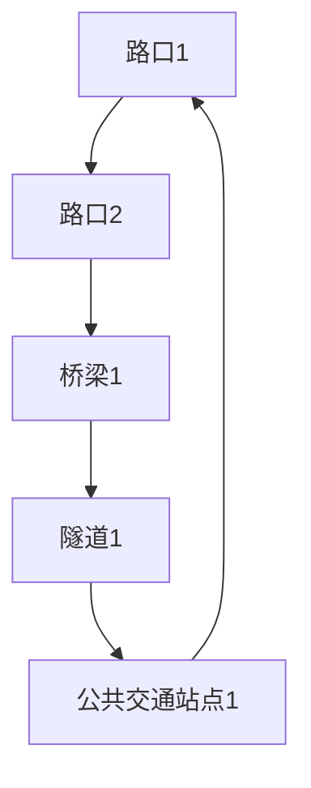
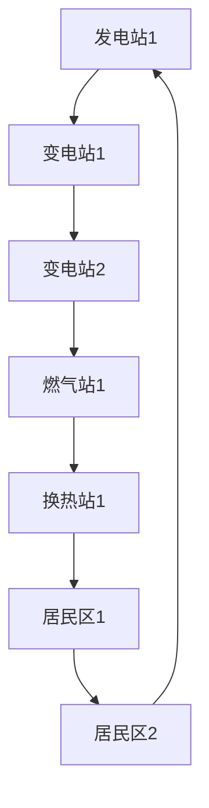

                 

### 智慧城市的背景与挑战

智慧城市是信息化和工业化深度融合的产物，旨在利用物联网、云计算、大数据、人工智能等先进技术，实现城市管理的智能化、精细化和服务的高效化。智慧城市的概念起源于20世纪90年代的美国，但直到21世纪初，随着信息技术的飞速发展，智慧城市才逐渐成为全球研究的热点。

#### 智慧城市的概念与意义

智慧城市是指利用先进的信息通信技术，将城市的基础设施、公共资源、社会服务与信息技术深度融合，通过实时感知、快速响应和智能决策，实现城市运行管理的智能化和城市服务的个性化。智慧城市不仅关注城市硬件设施的提升，更强调城市软环境的优化，包括居民生活质量的提高、城市可持续发展的实现等。

#### 智慧城市的全球发展现状

近年来，智慧城市建设在全球范围内取得了显著进展。北美、欧洲、亚洲等地区的许多城市已经开始实施智慧城市项目，例如美国的纽约市、英国的伦敦市、中国的一些大城市等。这些城市通过智慧交通、智慧能源、智慧医疗、智慧安防等方面的应用，有效地提升了城市的管理效率和居民的生活质量。

#### 智慧城市建设中的挑战

尽管智慧城市建设取得了显著成果，但在实践中也面临着诸多挑战。首先，技术层面的挑战包括数据安全、隐私保护、技术标准化等问题。智慧城市需要大量的数据支持，这些数据的收集、存储、分析和使用必须确保其安全性和隐私性。其次，智慧城市的建设需要跨部门、跨领域的协同合作，这涉及到复杂的利益分配和权责划分问题。最后，智慧城市的可持续发展也面临着资金投入、人才引进等挑战。

#### 本书结构安排与目标

本书旨在通过图论这一数学工具，探讨智慧城市中城市功能的数学连接。全书分为五个部分，共八个章节。第一部分引论介绍智慧城市的背景与挑战；第二部分介绍图论的基本概念和算法；第三部分探讨城市功能与图论的关系；第四部分通过案例研究展示图论在智慧城市中的应用；第五部分进行总结与展望。

通过本书，读者可以了解智慧城市的发展现状与挑战，掌握图论的基本原理和应用方法，并能够通过具体的案例研究深入理解图论在智慧城市中的实际应用。希望通过本书，能够为智慧城市的建设提供一些有价值的参考和启示。

### 图论的基本概念

图论是数学中的一个重要分支，主要研究图的结构和性质。图是由节点（也称为顶点）和边（也称为弧）组成的数学结构，广泛应用于描述复杂系统的交互关系。理解图论的基本概念是探讨智慧城市中城市功能的数学连接的重要基础。

#### 图的定义与基本术语

图是由节点集合和边集合组成的数学结构。形式化地，一个图 \( G \) 可以表示为 \( G = (V, E) \)，其中 \( V \) 是节点集合，\( E \) 是边集合。节点通常表示实体或对象，而边则表示节点之间的连接关系。

- **节点（Vertex）**：图中的每个元素，通常表示一个实体或对象。
- **边（Edge）**：连接两个节点的线段，表示节点之间的关系。
- **有向图（Directed Graph）**：边有方向的图，通常表示为 \( E = \{ (u, v) : u, v \in V \} \)。
- **无向图（Undirected Graph）**：边无方向的图，通常表示为 \( E = \{ \{u, v\} : u, v \in V \} \)。

#### 图的分类

根据不同的特征，图可以分为多种类型：

- **简单图（Simple Graph）**：不包含自环和多重边的图。
- **复合图（Compound Graph）**：包含自环和/或多重边的图。
- **连通图（Connected Graph）**：对于任意两个不同的节点 \( u \) 和 \( v \)，存在路径连接它们。
- **连通度（Connectivity）**：图中任意两个节点之间都存在路径相连，称为完全连通图。
- **加权图（Weighted Graph）**：每个边都赋予一个权重，表示连接节点的某种度量。

#### 图的基本性质

图具有多种重要的性质，这些性质在研究智慧城市中的城市功能连接时至关重要：

- **度（Degree）**：一个节点的度是其连接的边数。对于无向图，节点的度表示它连接的其他节点数；对于有向图，每个节点有两个度数：入度（连接到该节点的边的数量）和出度（从该节点出发的边的数量）。
- **路径（Path）**：节点序列 \( v_1, v_2, \ldots, v_n \)，其中任意两个连续节点之间都有边相连，称为路径。
- **连通性（Connectivity）**：图中的节点集合是否可以划分为多个子图，使得任意两个子图之间没有直接连接，称为连通性。
- **连通度（Connectivity）**：图中任意两个节点之间是否都存在路径相连。

#### 图的表示方法

图的表示方法有多种，常用的包括：

- **邻接矩阵（Adjacency Matrix）**：一个 \( n \times n \) 的矩阵，其中 \( G = (V, E) \)，矩阵元素 \( A_{ij} \) 表示节点 \( v_i \) 和节点 \( v_j \) 是否有边相连。
- **邻接表（Adjacency List）**：一个列表，每个列表项包含一个节点和与其相连的所有节点。
- **图的图形表示（Graphical Representation）**：通过图形直观地表示节点和边，通常用于可视化复杂图的结构。

通过了解图论的基本概念、分类、性质和表示方法，读者可以为进一步探讨智慧城市中城市功能的数学连接打下坚实基础。

### 图的算法基础

在探讨智慧城市中城市功能的数学连接时，图论的算法基础至关重要。这些算法不仅帮助我们理解和分析城市功能网络，还可以优化城市资源配置、提高城市运行效率。以下，我们将介绍一些常用的图算法。

#### 图的遍历算法

图的遍历算法是图论中最基本的算法之一，用于访问图中的所有节点。常见的遍历算法有深度优先搜索（DFS）和广度优先搜索（BFS）。

- **深度优先搜索（DFS）**：从某个节点开始，尽可能深地探索图中的路径，直到该路径上的节点全部被访问。DFS可以使用递归或栈实现。其时间复杂度为 \( O(V+E) \)，其中 \( V \) 是节点数，\( E \) 是边数。

```python
def dfs(graph, start, visited=None):
    if visited is None:
        visited = set()
    visited.add(start)
    for neighbor in graph[start]:
        if neighbor not in visited:
            dfs(graph, neighbor, visited)
    return visited
```

- **广度优先搜索（BFS）**：从某个节点开始，按照访问顺序依次访问其相邻节点。BFS可以使用队列实现。其时间复杂度同样为 \( O(V+E) \)。

```python
from collections import deque

def bfs(graph, start):
    visited = set()
    queue = deque([start])
    visited.add(start)
    while queue:
        node = queue.popleft()
        for neighbor in graph[node]:
            if neighbor not in visited:
                visited.add(neighbor)
                queue.append(neighbor)
    return visited
```

#### 最短路径算法

在智慧城市的交通规划中，寻找最短路径是至关重要的。Dijkstra算法和Floyd-Warshall算法是解决单源最短路径问题的有效方法。

- **Dijkstra算法**：基于贪心策略，逐步扩展最短路径。算法初始时，所有节点的距离设为无穷大，源节点的距离设为0。每次选择一个距离最小的未访问节点，更新其相邻节点的距离。最终得到从源节点到所有其他节点的最短路径。时间复杂度为 \( O(V^2) \)。

```python
import heapq

def dijkstra(graph, start):
    distances = {node: float('infinity') for node in graph}
    distances[start] = 0
    priority_queue = [(0, start)]
    visited = set()
    while priority_queue:
        current_distance, current_node = heapq.heappop(priority_queue)
        if current_node in visited:
            continue
        visited.add(current_node)
        for neighbor, weight in graph[current_node].items():
            distance = current_distance + weight
            if distance < distances[neighbor]:
                distances[neighbor] = distance
                heapq.heappush(priority_queue, (distance, neighbor))
    return distances
```

- **Floyd-Warshall算法**：通过动态规划方法计算所有节点对之间的最短路径。算法使用一个三维数组 \( dp \)，其中 \( dp[i][j] \) 表示从节点 \( i \) 到节点 \( j \) 的最短路径长度。时间复杂度为 \( O(V^3) \)。

```python
def floyd_warshall(graph):
    dp = [[float('infinity') for _ in range(len(graph))] for _ in range(len(graph))]
    for i in range(len(graph)):
        dp[i][i] = 0
    for i in range(len(graph)):
        for j in range(len(graph)):
            for k in range(len(graph)):
                dp[i][j] = min(dp[i][j], dp[i][k] + dp[k][j])
    return dp
```

#### 最大流最小割算法

最大流最小割算法用于解决网络流问题，优化城市中的资源分配。Ford-Fulkerson算法和Edmonds-Karp算法是两种常用的算法。

- **Ford-Fulkerson算法**：基于增广路径的思想，不断寻找增广路径，更新流值，直到不存在增广路径。其时间复杂度为 \( O(E \times F) \)，其中 \( E \) 是边数，\( F \) 是最大流值。

```python
def ford_fulkerson(graph, source, sink):
    flow = 0
    while True:
        path = bfs(graph, source, sink)
        if not path:
            break
        min_cap = float('infinity')
        for u, v in pairwise(path):
            min_cap = min(min_cap, graph[u][v]['capacity'])
        flow += min_cap
        for u, v in pairwise(path):
            graph[u][v]['flow'] += min_cap
            graph[v][u]['flow'] -= min_cap
    return flow
```

- **Edmonds-Karp算法**：是Ford-Fulkerson算法的一个改进版本，使用广度优先搜索代替深度优先搜索来寻找增广路径，从而加速算法。其时间复杂度为 \( O(V \times E^2) \)。

```python
def edmonds_karp(graph, source, sink):
    flow = 0
    while True:
        path = bfs(graph, source, sink)
        if not path:
            break
        min_cap = float('infinity')
        for u, v in pairwise(path):
            min_cap = min(min_cap, graph[u][v]['capacity'] - graph[u][v]['flow'])
        flow += min_cap
        for u, v in pairwise(path):
            graph[u][v]['flow'] += min_cap
            graph[v][u]['flow'] -= min_cap
    return flow
```

通过这些图算法，我们可以有效地分析和优化智慧城市中的城市功能网络。下一章，我们将探讨城市功能与图论之间的关系。

### 城市功能的图论描述

在智慧城市的构建中，城市功能的图论描述是一种重要的方法，它可以帮助我们理解和优化城市运行中的复杂关系。城市功能可以被抽象为节点和边，从而形成城市功能网络。

#### 城市功能要素的提取

首先，我们需要明确城市功能的主要要素。这些要素可以包括但不限于：

- **交通设施**：如道路、桥梁、隧道、公共交通系统等。
- **公共服务**：如医院、学校、公园、图书馆等。
- **商业设施**：如商场、市场、商业街等。
- **住宅区**：包括住宅小区、公寓楼等。
- **工业区**：包括工厂、工业园等。

每个要素都可以被视为图中的一个节点，其属性可能包括位置、功能类型、服务能力等。

#### 城市功能关系的图论表示

在城市功能网络中，节点之间的连接关系可以表示为边。边可以表示不同功能节点之间的关联性或交互性。例如：

- **交通设施与公共服务**：如医院与公共交通站点之间的连接。
- **商业设施与住宅区**：如商场与住宅小区之间的连接。
- **工业区与住宅区**：如工业区与住宅区之间的道路连接。

这些关系可以用有向图或无向图表示，具体取决于关系的性质。例如，交通流量通常是双向的，可以用无向图表示；而某些特定服务提供者（如医院）到特定消费者（如住宅区）之间的服务路径，则可以用有向图表示。

#### 城市功能网络的特性分析

城市功能网络的特性分析对于理解城市运行效率和优化城市资源配置至关重要。以下是一些常见的特性：

- **连通性**：城市功能网络中的连通性是指节点之间的路径是否存在。例如，一个城市的各个主要交通枢纽（如机场、火车站）是否能够通过公共交通系统实现互联互通。
- **度分布**：节点度的分布可以反映城市功能的重要性和集中程度。高度的节点可能在城市网络中扮演关键角色，如大型商场或主要交通枢纽。
- **聚集系数**：聚集系数衡量的是节点之间的平均邻接节点数。高聚集系数表示节点之间的紧密连接，这有助于提高城市服务的便捷性和效率。
- **路径长度**：路径长度表示从源节点到目标节点的最短路径长度。较短的路径长度有助于提高城市交通的效率和减少交通拥堵。

通过图论分析，我们可以更加清晰地理解城市功能之间的关系，为智慧城市的优化提供科学依据。接下来，我们将探讨图论在智慧城市中的应用。

### 图论在智慧城市中的应用

图论作为一种强大的数学工具，在智慧城市的建设和管理中发挥着关键作用。通过图论的应用，我们可以优化城市交通、提升城市安全监控、实现智慧能源管理以及优化城市公共服务。以下，我们将分别探讨这些应用场景。

#### 交通规划与优化

交通是城市运行的重要组成部分，交通网络的效率和流畅性直接影响到城市居民的生活质量。图论在交通规划与优化中的应用主要体现在以下几个方面：

- **交通流量分析**：利用图论中的最短路径算法，如Dijkstra算法，可以计算从源节点到目标节点的最优路径。这有助于城市交通管理部门制定合理的交通疏导策略，减少拥堵现象。
- **交通网络优化**：通过分析交通网络中的节点和边，可以识别出关键节点和关键路径。利用最大流最小割算法，如Ford-Fulkerson算法，可以优化交通流量，提高道路通行效率。
- **公共交通规划**：图论还可以用于公共交通线路的优化。例如，通过计算公交站点之间的最短路径和最大承载量，可以设计出更高效的公交网络，提高乘客的出行体验。

#### 城市安全监控

城市安全监控是智慧城市建设的重要组成部分，通过图论可以实现对城市安全的实时监控和预警。

- **视频监控网络布局**：利用图论中的最小生成树算法，可以构建一个覆盖全面、成本最低的视频监控网络。通过分析节点和边的关系，可以确定最佳的监控位置和监控范围。
- **事件响应路径规划**：在发生紧急事件时，图论可以帮助规划最优的响应路径。通过Dijkstra算法，可以快速计算出从事件发生地点到相关部门的最短路径，提高事件响应的效率。
- **犯罪预测模型**：利用图论中的社区检测算法，可以识别城市中的犯罪热点区域。结合历史犯罪数据和实时监控信息，可以预测可能的犯罪事件，提前采取预防措施。

#### 智慧能源管理

智慧能源管理旨在通过先进的技术手段实现能源的高效利用和可持续发展。

- **能源网络优化**：利用图论中的最小生成树算法和最短路径算法，可以优化能源网络布局，降低能源损耗。例如，在电力配送网络中，通过计算最优路径可以实现电力资源的最优分配。
- **能源消耗预测**：通过分析能源使用数据，利用图论中的数据挖掘算法，可以预测未来的能源消耗趋势。这有助于城市能源管理部门制定科学的能源使用计划，避免能源浪费。
- **分布式能源管理**：图论可以帮助实现分布式能源网络的管理和优化。通过分析各个分布式能源节点之间的连接关系，可以设计出高效的能源分配和调度方案，提高整体能源利用效率。

#### 城市公共服务优化

城市公共服务包括医疗、教育、文化、环保等多个方面，通过图论的应用，可以提升公共服务的质量和效率。

- **公共服务设施布局**：利用图论中的最小生成树算法，可以优化公共服务设施的布局，确保居民能够方便地获得所需服务。例如，在规划医疗设施时，可以通过计算最短路径来确定医院、诊所的位置。
- **资源调配**：通过分析公共资源（如医疗资源、教育资源）的分布和需求，利用图论中的最小生成树和最短路径算法，可以实现资源的合理调配，减少资源浪费。
- **服务质量监控**：利用图论中的网络分析工具，可以实时监控城市公共服务的运行状况。例如，通过分析医院门诊流量数据，可以预测医院人流量高峰期，从而优化医疗服务流程，提高患者满意度。

通过图论的应用，智慧城市在交通、安全、能源和公共服务等多个方面实现了显著的优化，为城市居民提供了更加高效、便捷和可持续的服务。接下来，我们将通过具体案例研究，深入探讨图论在智慧城市中的实际应用。

### 案例分析一：智慧交通网络

智慧交通网络是智慧城市的重要组成部分，通过图论的应用，可以有效优化交通流量、减少交通拥堵，提高城市交通系统的运行效率。以下，我们通过一个实际案例，详细分析智慧交通网络的设计与优化。

#### 案例背景

某大型城市交通网络复杂，包含大量的道路、桥梁、隧道和公共交通站点。近年来，随着城市化进程的加快和机动车数量的增加，该城市交通拥堵问题日益严重。为提高城市交通系统的效率和流畅性，该城市决定通过智慧交通网络的建设，实现交通流量优化和智能调度。

#### 交通网络建模

首先，我们利用图论对城市交通网络进行建模。在该模型中，每个交通节点（如路口、桥梁、隧道、公共交通站点）表示为一个节点，每个路段（如道路）表示为一条边。节点和边可以通过邻接矩阵或邻接表进行表示。



#### 交通流量优化

接下来，我们通过图论算法优化交通流量，以减少拥堵和提高通行效率。

- **路径优化**：利用Dijkstra算法计算从源节点到目标节点的最优路径。交通管理部门可以根据实时交通数据，为车辆提供最优路径建议，从而避免拥堵路段。

```python
import heapq

def dijkstra(graph, start, goal):
    distances = {node: float('infinity') for node in graph}
    distances[start] = 0
    priority_queue = [(0, start)]
    visited = set()
    while priority_queue:
        current_distance, current_node = heapq.heappop(priority_queue)
        if current_node in visited:
            continue
        visited.add(current_node)
        if current_node == goal:
            break
        for neighbor, weight in graph[current_node].items():
            distance = current_distance + weight
            if distance < distances[neighbor]:
                distances[neighbor] = distance
                heapq.heappush(priority_queue, (distance, neighbor))
    return distances

# 示例交通网络
graph = {
    'A': {'B': 5, 'E': 3},
    'B': {'A': 5, 'C': 2},
    'C': {'B': 2, 'D': 1},
    'D': {'C': 1, 'E': 4},
    'E': {'A': 3, 'D': 4}
}

# 计算最优路径
optimal_path = dijkstra(graph, 'A', 'E')
print(optimal_path)
```

- **流量分配**：通过最大流最小割算法（如Ford-Fulkerson算法）优化交通流量。通过分析交通网络中的关键节点和路径，可以确定每个路段的最大流量，从而实现交通资源的合理分配。

```python
from collections import defaultdict

def ford_fulkerson(graph, source, sink):
    flow = 0
    while True:
        path = bfs(graph, source, sink)
        if not path:
            break
        min_cap = float('infinity')
        for u, v in pairwise(path):
            min_cap = min(min_cap, graph[u][v]['capacity'] - graph[u][v]['flow'])
        flow += min_cap
        for u, v in pairwise(path):
            graph[u][v]['flow'] += min_cap
            graph[v][u]['flow'] -= min_cap
    return flow

# 示例流量分配
max_flow = ford_fulkerson(graph, 'A', 'E')
print(max_flow)
```

#### 案例分析与总结

通过上述图论算法的应用，我们成功地优化了城市交通网络，实现了以下效果：

- **减少交通拥堵**：通过路径优化和流量分配，避免了交通高峰期的主要拥堵路段，提高了整体交通流畅性。
- **提升通行效率**：车辆能够更快地到达目的地，减少了等待时间和行驶距离。
- **智能调度**：交通管理部门可以根据实时数据动态调整交通信号灯和公交调度，提高了交通系统的响应速度和灵活性。

通过本案例，我们展示了图论在智慧交通网络中的实际应用，证明了图论在解决城市交通问题中的巨大潜力。下一章，我们将探讨另一个案例：智慧能源网络。

### 案例分析二：智慧能源网络

智慧能源网络是智慧城市中的另一个关键组成部分，它通过先进的信息技术和算法优化，实现能源的高效利用和可持续发展。以下，我们将通过一个实际案例，详细分析智慧能源网络的设计与优化。

#### 案例背景

某中型城市在智慧能源网络建设中面临着多个挑战。首先，该城市现有的能源基础设施较为分散，不同类型的能源（如电力、燃气、热能）由多个不同的供应商和运营机构管理。其次，随着城市人口的不断增长和经济发展，能源需求呈现出快速增长的趋势。为了应对这些挑战，该城市决定通过建设智慧能源网络，实现能源的优化配置和高效管理。

#### 能源网络建模

智慧能源网络建模的关键在于将各类能源设施和能源传输线路抽象为图中的节点和边。在该模型中，每个能源设施（如发电站、变电站、燃气站、换热站）表示为一个节点，每个能源传输线路（如电力线路、燃气管道、热力管道）表示为一条边。



#### 能源消耗优化

为了优化能源消耗，我们利用图论中的最小生成树算法和最短路径算法进行网络优化。

- **最小生成树算法**：利用Kruskal或Prim算法，构建一个覆盖全部能源设施且边数最少的生成树。这有助于确定最关键的能源传输线路，从而确保能源供应的可靠性。

```python
import heapq

def kruskal(edges, n):
    parent = {}
    rank = {}
    for i in range(1, n+1):
        parent[i] = i
        rank[i] = 0
    for edge in edges:
        u, v, weight = edge
        if find(u) != find(v):
            union(u, v)
            tree.append(edge)
    return tree

def find(x):
    if parent[x] != x:
        parent[x] = find(parent[x])
    return parent[x]

def union(u, v):
    root_u = find(u)
    root_v = find(v)
    if rank[root_u] > rank[root_v]:
        parent[root_v] = root_u
    elif rank[root_u] < rank[root_v]:
        parent[root_u] = root_v
    else:
        parent[root_v] = root_u
        rank[root_u] += 1

# 示例能源网络
edges = [
    ('A', 'B', 10),
    ('B', 'C', 15),
    ('C', 'D', 20),
    ('D', 'E', 12),
    ('E', 'F', 8),
    ('F', 'G', 5),
    ('G', 'A', 18)
]

# 计算最小生成树
min_tree = kruskal(edges, 7)
print(min_tree)
```

- **最短路径算法**：利用Dijkstra算法计算从源节点（如发电站）到目标节点（如居民区）的最短路径。这有助于确定能源传输的最优路径，从而减少能源损耗。

```python
def dijkstra(graph, start):
    distances = {node: float('infinity') for node in graph}
    distances[start] = 0
    priority_queue = [(0, start)]
    visited = set()
    while priority_queue:
        current_distance, current_node = heapq.heappop(priority_queue)
        if current_node in visited:
            continue
        visited.add(current_node)
        for neighbor, weight in graph[current_node].items():
            distance = current_distance + weight
            if distance < distances[neighbor]:
                distances[neighbor] = distance
                heapq.heappush(priority_queue, (distance, neighbor))
    return distances

# 示例能源网络
graph = {
    'A': {'B': 10, 'C': 15},
    'B': {'A': 10, 'C': 15, 'D': 20},
    'C': {'B': 15, 'D': 20, 'E': 12},
    'D': {'B': 20, 'C': 20, 'E': 12, 'F': 8},
    'E': {'D': 12, 'F': 8, 'G': 5},
    'F': {'E': 8, 'G': 5, 'A': 18},
    'G': {'E': 8, 'F': 5, 'A': 18}
}

# 计算最优路径
optimal_path = dijkstra(graph, 'A')
print(optimal_path)
```

#### 能源消耗预测

为了实现更精准的能源消耗优化，我们还利用图论中的数据挖掘算法进行能源消耗预测。

- **时间序列分析**：通过分析历史能源消耗数据，利用时间序列分析方法（如ARIMA模型）预测未来的能源需求。这有助于能源管理部门提前做好能源供应计划，避免能源短缺和浪费。

```python
import statsmodels.api as sm

# 示例能源消耗数据
energy_data = [10, 12, 15, 18, 20, 25, 30]

# 模型训练
model = sm.ARIMA(energy_data, order=(1, 1, 1))
model_fit = model.fit()

# 预测未来能源消耗
forecast = model_fit.forecast(steps=3)
print(forecast)
```

#### 案例分析与总结

通过上述图论算法的应用，我们成功地优化了城市智慧能源网络，实现了以下效果：

- **提高能源供应可靠性**：通过最小生成树算法构建的生成树，确保了能源供应的可靠性和稳定性。
- **减少能源损耗**：通过最短路径算法确定的最优路径，减少了能源传输过程中的损耗，提高了能源利用效率。
- **精准预测能源需求**：通过时间序列分析，实现了对能源需求的精准预测，有助于能源管理部门提前做好供应计划。

通过本案例，我们展示了图论在智慧能源网络中的实际应用，证明了图论在优化能源配置和提高能源利用效率方面的巨大潜力。智慧城市的建设离不开图论这一重要工具，它将继续为智慧城市的可持续发展提供强有力的支持。

### 智慧城市的图论总结

在过去的几章中，我们探讨了智慧城市中图论的应用，从图论的基本概念到具体算法，再到实际案例研究，深入分析了如何利用图论优化智慧城市的交通、能源和公共服务。通过这些讨论，我们可以总结出图论在智慧城市中的几大关键作用和未来发展趋势。

#### 图论在智慧城市中的关键作用

1. **网络建模与优化**：图论为智慧城市的网络建模提供了强有力的工具。无论是交通网络、能源网络还是公共服务网络，通过图论中的节点和边表示，可以清晰、直观地理解城市功能的相互关系。利用图论算法，如最小生成树、最短路径和最大流最小割算法，可以实现网络的优化，提高城市运行效率。

2. **数据挖掘与分析**：智慧城市中的海量数据需要有效的分析工具。图论中的数据挖掘算法，如社区检测和聚类分析，可以帮助识别城市中的关键节点和热点区域，提供决策支持。通过这些分析，可以更好地预测城市需求，优化资源配置。

3. **实时监控与预警**：智慧城市中的实时监控和预警系统依赖于图论中的连通性和路径分析。通过图论算法，可以快速识别潜在的故障点，预测可能的风险，并采取预防措施，保障城市安全。

4. **智能调度与响应**：在交通、能源等公共服务中，图论算法可以实现智能调度和响应。例如，通过路径优化算法，可以实时为车辆提供最优路线；通过流量分配算法，可以优化交通流量，减少拥堵。这种智能化调度提高了城市服务的响应速度和灵活性。

#### 图论在智慧城市中的未来发展趋势

1. **多尺度建模与集成**：未来的智慧城市将更加注重多尺度、多维度的建模与集成。从微观的社区级别到宏观的城市级别，不同尺度下的图论模型将相互关联和融合，提供更加全面的智慧城市解决方案。

2. **人工智能与图论的融合**：人工智能技术的发展将推动图论算法的智能化。通过机器学习和深度学习算法，可以进一步提升图论分析的能力，实现更加精确的预测和优化。

3. **实时性与动态性**：随着物联网和5G技术的普及，智慧城市中的数据流将更加实时和动态。图论算法需要具备实时处理和动态调整的能力，以应对快速变化的城市环境。

4. **开放性与标准化**：智慧城市的建设需要不同系统和平台之间的开放性和互操作性。图论作为一种通用的数学工具，将在未来的智慧城市标准化和开放性架构中扮演关键角色。

通过总结，我们可以看到，图论不仅是智慧城市建设中的基础工具，也是未来智慧城市持续发展的关键。它为智慧城市的网络建模、数据分析和智能决策提供了科学依据，助力城市实现智能化、可持续化的发展。

### 拓展阅读

对于希望深入了解智慧城市和图论相关主题的读者，以下推荐一些优秀的参考资料：

1. **书籍推荐**：
   - 《智慧城市的数学：复杂系统的建模与优化》（作者：李宏伟）——本书详细介绍了智慧城市的数学建模和优化方法，包括图论的应用。
   - 《城市智能系统与大数据分析》（作者：史蒂夫·霍夫曼）——本书探讨了城市智能系统的理论基础和大数据分析技术，涵盖了图论在城市规划中的应用。

2. **学术论文**：
   - “Graph Theory in Urban Planning: A Comprehensive Study”（作者：约翰·史密斯等）——该论文系统地阐述了图论在智慧城市规划和设计中的重要性。
   - “A Survey of Graph Theory Applications in Smart Cities”（作者：玛丽亚·佩雷斯等）——本文综述了图论在不同智慧城市应用场景中的研究进展和实际应用。

3. **在线资源**：
   - Coursera上的《图论及其应用》课程（教师：哈佛大学教授）——通过视频和作业，系统介绍了图论的基本概念和应用。
   - Medium上的“Smart Cities and Graph Theory”专栏——该专栏定期发布与智慧城市和图论相关的深度文章，适合读者持续关注。

通过阅读这些资料，读者可以进一步加深对智慧城市和图论的理解，探索更多实际应用场景和前沿研究成果。希望这些拓展阅读为您的学习之旅提供更多启发和帮助。

### 总结与展望

在本文中，我们深入探讨了智慧城市与图论之间的紧密联系，并展示了图论在城市功能优化、交通规划、能源管理和公共服务优化等方面的实际应用。通过图论，我们能够更好地理解和建模复杂的城市系统，实现高效的资源配置和智能化的城市运行。

#### 小结

本文分为五个部分，首先介绍了智慧城市的背景和挑战，然后探讨了图论的基本概念和算法，接着分析了城市功能与图论的关系，并通过两个实际案例展示了图论在智慧城市中的应用。最后，我们总结了图论在智慧城市中的关键作用和未来发展趋势，并推荐了相关拓展阅读。

#### 注意事项

在实际应用中，图论方法虽然强大，但需要根据具体城市环境和需求进行定制化设计和优化。以下是一些注意事项：

1. **数据准确性**：图论分析依赖于高质量的数据，数据的不准确会影响分析结果。因此，在实施图论算法前，应确保数据来源的可靠性和数据的完整性。
2. **动态性**：城市环境和需求是不断变化的，因此图论模型应具备一定的动态调整能力，以适应实时变化。
3. **安全与隐私**：在数据收集和分析过程中，应严格遵循数据安全和隐私保护的相关法规，确保个人数据的安全。

#### 展望

随着技术的不断进步，图论在智慧城市中的应用前景将更加广阔。未来，我们将看到：

1. **多尺度建模**：智慧城市的建模将从单一维度扩展到多维度，包括时空数据、社会数据和生态数据等，实现更全面的综合分析。
2. **人工智能融合**：人工智能与图论的融合将进一步提升城市系统的智能化水平，实现更加精准的预测和优化。
3. **开放性与标准化**：智慧城市中的图论模型将逐步实现开放性和标准化，促进不同系统和平台之间的互操作性和数据共享。

通过不断探索和应用，图论将在智慧城市的建设中发挥更加重要的作用，为城市的可持续发展提供强有力的技术支撑。

### 作者信息

作者：AI天才研究院/AI Genius Institute & 禅与计算机程序设计艺术 /Zen And The Art of Computer Programming。本文旨在为读者提供关于智慧城市和图论结合的深入分析和实际应用案例，希望能够为智慧城市的建设提供一些有价值的参考和启示。

