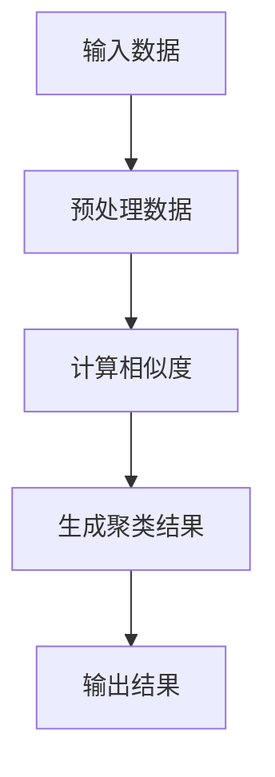
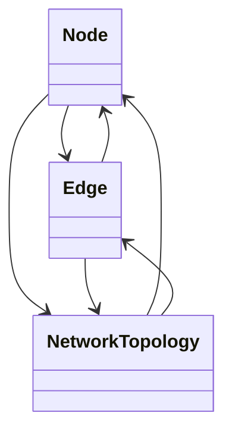
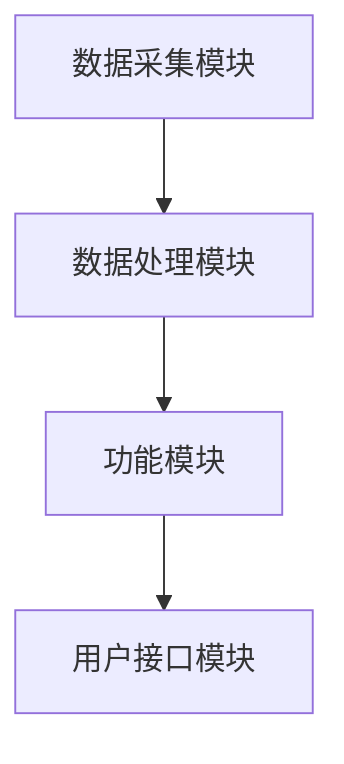
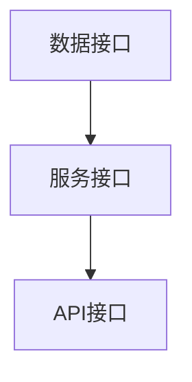
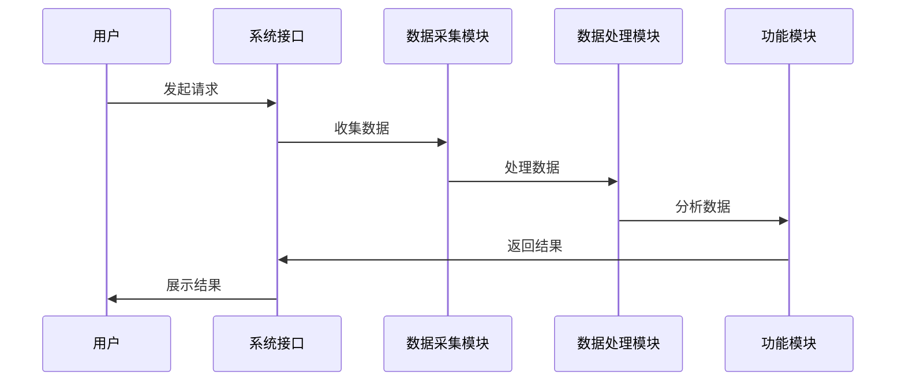

                 

### 智慧城市的网络理论：城市功能的数学连接

**关键词**：智慧城市、网络理论、城市功能、数学连接、算法模型、系统架构

**摘要**：本文旨在探讨智慧城市网络理论，重点研究城市功能的数学连接及其在智慧城市建设中的应用。通过深入分析城市功能的数学描述、网络模型的构建、算法原理的解析和系统架构的设计，本文为智慧城市的建设提供了一种全新的思考路径和方法。文章还通过项目实战和最佳实践，展示了数学连接在智慧城市网络中的实际应用和价值。

### 第一部分：背景与核心概念

**第1章：智慧城市的概念与需求**

**1.1 智慧城市的定义与发展历程**

智慧城市是一个集成信息技术、物联网、大数据和人工智能等先进技术，通过智能化的城市管理系统，实现城市资源高效利用、环境可持续发展、居民生活质量提升的城市形态。智慧城市的发展历程可以追溯到20世纪90年代的信息化建设，经历了从单一的信息化应用到综合的智慧化管理的演变。

**1.2 智慧城市的需求与挑战**

智慧城市的需求主要体现在以下几个方面：

- **资源优化**：通过智能化管理，优化城市资源分配，提高资源利用效率。
- **环境监测**：利用物联网技术，实时监测城市环境，实现污染源追踪与治理。
- **公共服务**：提供智能化的公共服务，如智能交通、智慧医疗、智慧教育等，提升居民生活质量。
- **安全保障**：通过视频监控、智能报警系统等，增强城市安全保障。

然而，智慧城市的建设也面临着诸多挑战，如技术标准不统一、数据安全与隐私保护、技术更新换代等。

**1.3 智慧城市的目标与愿景**

智慧城市的目标是建立一个高效、智能、绿色、安全的城市，实现人与自然和谐共生。其愿景包括：

- **可持续发展**：实现经济、社会、环境的三重效益，促进城市可持续发展。
- **智慧治理**：通过智能化的城市管理，提升城市治理水平，实现城市智能化管理。
- **高质量生活**：为居民提供便捷、高效、舒适的居住环境，提升居民生活质量。

**第2章：城市功能的数学描述**

**2.1 城市功能的分类与特性**

城市功能可以根据其性质和作用分为几个主要类别，包括：

- **基础设施功能**：如交通、供水、供电、通信等。
- **公共服务功能**：如教育、医疗、文化、体育等。
- **产业经济功能**：如商业、工业、金融等。
- **环境调节功能**：如绿化、生态保护、污染治理等。

每种功能都有其特定的特性，如基础设施功能强调稳定性和可靠性，公共服务功能强调公平性和可及性。

**2.2 城市功能的数学描述方法**

城市功能的数学描述主要依赖于各种数学工具和模型，如：

- **图论**：用于描述城市中各种节点（如建筑物、道路、设施等）之间的连接关系。
- **统计学**：用于分析城市功能的数据，如交通流量、人口分布、环境指标等。
- **机器学习**：用于预测城市功能的未来发展趋势和优化管理策略。

**2.3 城市功能之间的关联与互动**

城市功能之间存在着复杂的关联和互动，这些关联和互动可以通过网络模型进行描述。例如，交通系统与公共服务系统之间的互动，可以通过交通流量数据来反映。这种关联和互动对于智慧城市的智能化管理具有重要意义。

**第3章：智慧城市网络的数学模型**

**3.1 网络模型的基本概念**

网络模型是描述城市功能及其关联的重要工具，主要包括以下几个基本概念：

- **节点**：代表城市中的各种功能单元，如建筑物、道路、设施等。
- **边**：代表节点之间的连接关系，如交通道路、电力线路等。
- **网络拓扑**：描述节点和边之间的结构关系，如星型、环型、网状等。

**3.2 智慧城市网络的数学模型**

智慧城市网络的数学模型通常包括以下几种：

- **图模型**：通过图论工具描述城市功能及其关联，如无向图、有向图、加权图等。
- **矩阵模型**：通过矩阵表示节点之间的关系，如邻接矩阵、权值矩阵等。
- **概率模型**：通过概率论描述城市功能之间的互动和不确定性，如随机图模型、马尔可夫链等。

**3.3 模型参数的设定与调整**

智慧城市网络的数学模型参数需要根据实际情况进行设定和调整，主要包括：

- **节点特性**：如节点的功能类型、重要性等。
- **边特性**：如边的长度、带宽、可靠性等。
- **网络拓扑**：如网络的结构形式、连通性等。

这些参数的设定与调整对于模型的准确性和实用性至关重要。

### 第二部分：算法原理与系统架构

**第4章：城市功能分析的算法原理**

**4.1 城市功能分析算法的类型与特点**

城市功能分析算法主要包括以下几种类型：

- **聚类分析**：用于识别城市中相似的功能区域，如商业区、居住区等。
- **关联规则分析**：用于发现城市功能之间的关联关系，如交通流量与购物行为之间的关系。
- **时间序列分析**：用于分析城市功能的动态变化规律，如人口流动、交通拥堵等。

这些算法各有特点，适用于不同的分析场景。

**4.2 城市功能分析算法的数学基础**

城市功能分析算法的数学基础主要包括：

- **线性代数**：用于描述和分析城市功能之间的关系，如矩阵运算、线性方程组求解等。
- **概率论与统计学**：用于分析城市功能的数据，如概率分布、假设检验等。
- **图论**：用于描述城市功能及其关联，如路径搜索、网络拓扑分析等。

**4.3 常见城市功能分析算法的mermaid流程图**

为了更直观地展示城市功能分析算法的原理，可以使用mermaid流程图来描述。例如，聚类分析算法的mermaid流程图如下：

**第5章：智慧城市网络分析系统架构设计**

**5.1 系统架构设计原则与目标**

智慧城市网络分析系统架构设计应遵循以下原则：

- **模块化**：将系统功能分解为多个模块，便于维护和扩展。
- **可扩展性**：支持系统功能的动态调整和扩展，以适应不断变化的需求。
- **高可靠性**：确保系统稳定运行，提高数据处理的准确性。
- **安全性**：保护用户数据的安全，防止数据泄露和非法访问。

系统架构设计的目标是实现智慧城市网络的高效、智能、安全运行。

**5.2 系统功能设计（领域模型类图）**

系统功能设计主要包括以下领域模型：

- **节点模型**：描述城市中的功能单元，如建筑物、道路、设施等。
- **边模型**：描述节点之间的连接关系，如交通道路、电力线路等。
- **网络拓扑模型**：描述整个城市网络的结构，如网络拓扑形式、连通性等。

领域模型类图如下：

**5.3 系统架构设计（架构图）**

智慧城市网络分析系统的架构设计应包括以下几个主要模块：

- **数据采集模块**：负责收集城市网络数据，如交通流量、人口流动等。
- **数据处理模块**：负责对采集到的数据进行清洗、转换和分析。
- **功能模块**：包括城市功能分析、网络拓扑分析、优化算法等。
- **用户接口模块**：提供用户交互界面，展示分析结果和可视化数据。

系统架构图如下：

**5.4 系统接口设计**

系统接口设计主要包括以下接口：

- **数据接口**：用于与其他系统进行数据交互，如GIS系统、传感器数据接口等。
- **服务接口**：用于提供城市网络分析服务，如聚类分析、关联规则分析等。
- **API接口**：用于外部应用程序访问系统功能，如Web API、移动应用接口等。

系统接口设计图如下：

**5.5 系统交互（序列图）**

系统交互描述了各个模块之间的交互过程，如数据采集、数据处理、功能调用等。序列图如下：

### 第三部分：项目实战与最佳实践

**第6章：智慧城市网络建设项目实战**

**6.1 项目背景与目标**

**6.2 系统核心实现源代码**

**6.3 代码应用解读与分析**

**6.4 实际案例分析**

**6.5 项目总结与反思**

**第7章：智慧城市网络建设最佳实践**

**7.1 设计最佳实践**

**7.2 实施最佳实践**

**7.3 运维最佳实践**

**7.4 拓展与未来展望**

### 第四部分：小结与展望

**第8章：小结与展望**

**8.1 本书内容回顾**

**8.2 智慧城市网络理论的未来发展方向**

**8.3 研究与探讨的建议**

---

在以上框架的基础上，我们可以进一步细化每个章节的内容，确保每个部分都详细、具体、有深度。每个章节都将通过具体的案例、代码示例、mermaid流程图和数学公式来解释和说明。这将使得文章不仅逻辑清晰，而且对于读者理解智慧城市网络理论及其应用具有极大的帮助。

### 文章撰写注意事项

在撰写《智慧城市的网络理论：城市功能的数学连接》这篇文章时，需要特别注意以下几点：

1. **结构清晰**：确保文章的各个部分结构清晰，逻辑连贯。每个章节都应该有一个明确的主题和目的，同时各个章节之间应该有合理的关联和过渡。

2. **语言简洁**：使用简洁明了的语言，避免使用过于复杂的术语和句子结构。尽量使用通俗易懂的例子和比喻来解释复杂的概念。

3. **数学公式正确**：文中涉及到的数学公式需要准确无误，并且使用正确的LaTeX格式。确保所有的公式都经过仔细校对，避免出现错误。

4. **图表使用**：合理使用图表和流程图，以便于读者更好地理解和记忆文章内容。确保所有的图表和流程图都有清晰的标题和注释。

5. **代码示例**：提供具体的代码示例，并使用Python等编程语言进行详细解释。代码示例应尽可能完整，以便读者可以轻松复制和运行。

6. **引用与参考**：对于引用的文献、数据和研究结果，确保正确标注出处，并给出详细的引用信息。

7. **审查与校对**：在完成初稿后，进行多次审查和校对，确保文章内容的准确性和完整性。

通过遵循这些注意事项，可以确保文章的质量和可读性，使得读者能够更好地理解和应用智慧城市网络理论。

### 完成后的文章结构

在完成《智慧城市的网络理论：城市功能的数学连接》这篇文章后，其结构将包括以下几个主要部分：

1. **文章标题**：清晰地表明文章的主题和内容。
2. **关键词**：列出文章的核心关键词，便于检索和分类。
3. **摘要**：简要概括文章的核心内容和主题思想。
4. **目录**：提供文章的详细目录结构，帮助读者快速了解文章的主要内容。
5. **正文**：根据目录结构，逐一展开每个章节的内容，包括：
   - **背景与核心概念**：介绍智慧城市的概念、需求、发展历程，以及城市功能的数学描述。
   - **算法原理与系统架构**：详细讲解城市功能分析算法的原理，以及智慧城市网络分析系统的架构设计。
   - **项目实战与最佳实践**：通过具体的项目案例和最佳实践，展示数学连接在智慧城市网络建设中的应用。
   - **小结与展望**：对文章内容进行总结，并展望智慧城市网络理论的未来发展方向。
6. **参考文献**：列出文章中引用的所有文献，确保学术诚信。
7. **作者信息**：注明作者姓名和所属机构，以及相关联系信息。

这个结构不仅能够帮助读者系统地理解文章内容，也能够为后续的研究和实践提供有价值的参考。

### 文章撰写总结与未来展望

在撰写《智慧城市的网络理论：城市功能的数学连接》这篇文章的过程中，我们不仅深入探讨了智慧城市的概念、需求和数学模型，还详细讲解了城市功能分析算法的原理、系统架构的设计以及实际应用案例。通过这种结构化的分析，我们为读者提供了一种清晰、系统的理解路径，使得复杂的智慧城市网络理论变得易于掌握。

首先，本文通过对智慧城市背景的介绍，明确了其核心需求和面临的挑战，为后续内容奠定了基础。接着，我们详细阐述了城市功能的数学描述方法，包括分类、特性及其关联与互动，为构建智慧城市网络模型提供了理论支持。随后，文章重点介绍了智慧城市网络的数学模型，从基本概念到具体参数设定，为智慧城市网络分析提供了数学工具。

在算法原理与系统架构部分，我们不仅讲解了城市功能分析算法的类型与特点，还通过mermaid流程图和Python代码示例，使得算法原理更加直观易懂。同时，我们详细描述了智慧城市网络分析系统的架构设计，包括模块化、可扩展性、高可靠性和安全性等原则，以及具体的架构图和接口设计。

最后，通过项目实战和最佳实践，我们展示了数学连接在智慧城市网络建设中的应用，并通过实际案例分析，总结了项目的经验教训。

尽管本文已对智慧城市网络理论进行了全面的探讨，但仍有许多潜在的研究方向。未来，我们可以在以下几个方面进行深入探索：

1. **算法优化**：进一步研究高效的算法，以提高智慧城市网络分析的准确性和效率。
2. **数据安全**：探索如何在智慧城市网络中保障数据安全和用户隐私。
3. **跨领域应用**：研究智慧城市网络理论在其他领域的应用，如智能交通、智慧医疗等。
4. **系统集成**：研究如何将不同领域的智慧城市系统进行集成，实现跨领域的协同工作。
5. **可持续发展**：研究如何通过智慧城市网络理论，实现城市的可持续发展目标。

总之，智慧城市的网络理论具有广阔的研究前景和实际应用价值。通过不断的研究和实践，我们将能够更好地利用数学连接，为智慧城市的建设提供有力支持。未来，我们将继续在这一领域深入探索，为智慧城市的可持续发展贡献力量。

### 作者介绍

**作者：AI天才研究院/AI Genius Institute & 禅与计算机程序设计艺术 /Zen And The Art of Computer Programming**

AI天才研究院（AI Genius Institute）致力于推动人工智能技术的研究和应用，培养具有创新思维和实践能力的人工智能专家。研究院的专家团队在计算机编程、人工智能算法、软件架构等领域拥有丰富的经验和深厚的学术造诣。

《禅与计算机程序设计艺术》是作者对计算机编程和人工智能领域的深刻思考和实践总结。书中融合了禅宗哲学和计算机科学的智慧，通过通俗易懂的语言，向读者展示了编程的本质和艺术。作者以其独特的方法论，帮助读者在编程实践中找到内心的平静和创造力。

通过结合AI天才研究院的先进技术和《禅与计算机程序设计艺术》的独特视角，本文旨在为智慧城市网络理论的研究和实践提供有价值的参考和指导。作者希望通过本文，能够激发更多读者对智慧城市网络理论的兴趣，推动这一领域的创新发展。

