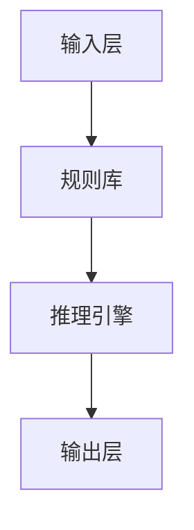
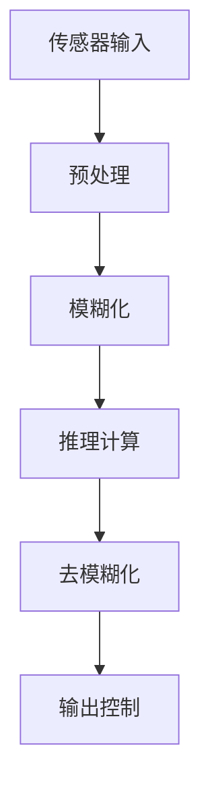

                 

### 设计《智能家居的模糊控制：生活环境的数学调节》的目录大纲

**步骤一：定义整体结构和章节划分**

**第一部分：背景与基础理论**
- 第1章：智能家居概述
- 第2章：模糊控制理论
- 第3章：生活环境的数学建模

**第二部分：模糊控制系统设计**
- 第4章：模糊控制器设计
- 第5章：模糊规则库构建
- 第6章：模糊推理系统实现

**第三部分：应用与实现**
- 第7章：智能家居场景实例
- 第8章：智能家居系统测试与评估
- 第9章：未来趋势与展望

**步骤二：细化每个章节的内容**

**第1章：智能家居概述**
- 1.1 智能家居的发展历程
- 1.2 智能家居的重要性
- 1.3 智能家居的主要技术
- 1.4 智能家居的现状与未来趋势

**第2章：模糊控制理论**
- 2.1 模糊集合的基本概念
- 2.2 模糊逻辑与模糊规则
- 2.3 模糊推理系统
- 2.4 模糊控制器设计方法

**第3章：生活环境的数学建模**
- 3.1 生活环境的构成
- 3.2 参数化建模方法
- 3.3 模糊模型构建
- 3.4 模型验证与优化

**第4章：模糊控制器设计**
- 4.1 模糊控制器的基本结构
- 4.2 模糊控制器的类型
- 4.3 模糊控制器的参数调整
- 4.4 实际案例中的应用

**第5章：模糊规则库构建**
- 5.1 规则库的基本概念
- 5.2 规则库构建方法
- 5.3 规则库优化
- 5.4 实际案例中的应用

**第6章：模糊推理系统实现**
- 6.1 模糊推理系统概述
- 6.2 模糊推理算法
- 6.3 实时模糊推理系统实现
- 6.4 案例分析

**第7章：智能家居场景实例**
- 7.1 温度控制
- 7.2 照明控制
- 7.3 空气质量监测
- 7.4 家居安防

**第8章：智能家居系统测试与评估**
- 8.1 测试方法与指标
- 8.2 系统性能评估
- 8.3 用户体验评估
- 8.4 改进与优化策略

**第9章：未来趋势与展望**
- 9.1 新技术趋势
- 9.2 智能家居的发展方向
- 9.3 模糊控制在未来智能家居中的应用前景
- 9.4 智能家居的挑战与机遇

**步骤三：撰写目录大纲**

```markdown
----------------------------------------------------------------
# 《智能家居的模糊控制：生活环境的数学调节》目录大纲

## 第一部分：背景与基础理论

### 第1章：智能家居概述
#### 1.1 智能家居的发展历程
#### 1.2 智能家居的重要性
#### 1.3 智能家居的主要技术
#### 1.4 智能家居的现状与未来趋势

### 第2章：模糊控制理论
#### 2.1 模糊集合的基本概念
#### 2.2 模糊逻辑与模糊规则
#### 2.3 模糊推理系统
#### 2.4 模糊控制器设计方法

### 第3章：生活环境的数学建模
#### 3.1 生活环境的构成
#### 3.2 参数化建模方法
#### 3.3 模糊模型构建
#### 3.4 模型验证与优化

## 第二部分：模糊控制系统设计

### 第4章：模糊控制器设计
#### 4.1 模糊控制器的基本结构
#### 4.2 模糊控制器的类型
#### 4.3 模糊控制器的参数调整
#### 4.4 实际案例中的应用

### 第5章：模糊规则库构建
#### 5.1 规则库的基本概念
#### 5.2 规则库构建方法
#### 5.3 规则库优化
#### 5.4 实际案例中的应用

### 第6章：模糊推理系统实现
#### 6.1 模糊推理系统概述
#### 6.2 模糊推理算法
#### 6.3 实时模糊推理系统实现
#### 6.4 案例分析

## 第三部分：应用与实现

### 第7章：智能家居场景实例
#### 7.1 温度控制
#### 7.2 照明控制
#### 7.3 空气质量监测
#### 7.4 家居安防

### 第8章：智能家居系统测试与评估
#### 8.1 测试方法与指标
#### 8.2 系统性能评估
#### 8.3 用户体验评估
#### 8.4 改进与优化策略

### 第9章：未来趋势与展望
#### 9.1 新技术趋势
#### 9.2 智能家居的发展方向
#### 9.3 模糊控制在未来智能家居中的应用前景
#### 9.4 智能家居的挑战与机遇

----------------------------------------------------------------
```

### 设计文章结构的具体步骤

**步骤一：确定文章的核心内容和结构**

首先，我们需要明确文章的核心内容，这是文章结构设计的基础。根据给定的任务，我们确定文章的核心内容为：智能家居的模糊控制原理、设计、实现和应用。接着，我们将内容划分为三个主要部分：背景与基础理论、模糊控制系统设计、应用与实现。

**步骤二：细化每个部分的内容**

在确定了整体结构后，我们需要对每个部分的内容进行细化。例如，在“背景与基础理论”部分，我们需要包括智能家居的发展历程、模糊控制理论的基本概念以及生活环境的数学建模等内容。在“模糊控制系统设计”部分，我们需要讨论模糊控制器设计、模糊规则库构建以及模糊推理系统的实现。在“应用与实现”部分，我们将具体分析智能家居中的温度控制、照明控制等应用实例。

**步骤三：撰写目录大纲**

在细化了每个部分的内容后，我们可以根据这些内容撰写目录大纲。目录大纲需要清晰地展示文章的结构和各个部分的内容，以便读者能够快速了解文章的主要内容。

```markdown
----------------------------------------------------------------
# 《智能家居的模糊控制：生活环境的数学调节》目录大纲

## 第一部分：背景与基础理论

### 第1章：智能家居概述
#### 1.1 智能家居的发展历程
#### 1.2 智能家居的重要性
#### 1.3 智能家居的主要技术
#### 1.4 智能家居的现状与未来趋势

### 第2章：模糊控制理论
#### 2.1 模糊集合的基本概念
#### 2.2 模糊逻辑与模糊规则
#### 2.3 模糊推理系统
#### 2.4 模糊控制器设计方法

### 第3章：生活环境的数学建模
#### 3.1 生活环境的构成
#### 3.2 参数化建模方法
#### 3.3 模糊模型构建
#### 3.4 模型验证与优化

## 第二部分：模糊控制系统设计

### 第4章：模糊控制器设计
#### 4.1 模糊控制器的基本结构
#### 4.2 模糊控制器的类型
#### 4.3 模糊控制器的参数调整
#### 4.4 实际案例中的应用

### 第5章：模糊规则库构建
#### 5.1 规则库的基本概念
#### 5.2 规则库构建方法
#### 5.3 规则库优化
#### 5.4 实际案例中的应用

### 第6章：模糊推理系统实现
#### 6.1 模糊推理系统概述
#### 6.2 模糊推理算法
#### 6.3 实时模糊推理系统实现
#### 6.4 案例分析

## 第三部分：应用与实现

### 第7章：智能家居场景实例
#### 7.1 温度控制
#### 7.2 照明控制
#### 7.3 空气质量监测
#### 7.4 家居安防

### 第8章：智能家居系统测试与评估
#### 8.1 测试方法与指标
#### 8.2 系统性能评估
#### 8.3 用户体验评估
#### 8.4 改进与优化策略

### 第9章：未来趋势与展望
#### 9.1 新技术趋势
#### 9.2 智能家居的发展方向
#### 9.3 模糊控制在未来智能家居中的应用前景
#### 9.4 智能家居的挑战与机遇

----------------------------------------------------------------
```

**步骤四：撰写文章**

在完成了目录大纲的撰写后，我们可以根据大纲逐步撰写文章。在撰写过程中，我们需要确保每个章节的内容都详细具体，逻辑清晰，便于读者理解。同时，我们还需要遵循markdown格式要求，确保文章的可读性和美观性。

### 撰写文章标题、关键词和摘要

**文章标题：**
《智能家居的模糊控制：生活环境的数学调节》

**关键词：**
智能家居、模糊控制、生活环境、数学建模、系统设计、实现与应用

**摘要：**
本文从智能家居的背景出发，探讨了模糊控制理论在智能家居中的应用，特别是对生活环境的数学调节。首先，介绍了智能家居的发展历程和重要性，以及模糊控制理论的基本概念。接着，详细阐述了生活环境的数学建模方法，包括参数化建模和模糊模型构建。随后，本文介绍了模糊控制系统的设计，包括模糊控制器的设计、模糊规则库的构建以及模糊推理系统的实现。最后，本文通过具体的智能家居场景实例，展示了模糊控制系统的实际应用效果，并对系统的测试与评估进行了讨论。文章最后对未来智能家居的发展趋势和模糊控制的应用前景进行了展望。通过本文的阐述，希望能够为智能家居领域的研究者和开发者提供有价值的参考。

### 详细介绍智能家居概述

**第1章：智能家居概述**

智能家居，顾名思义，是指利用各种信息技术和家电控制技术，将家居环境中的各种设备整合起来，实现自动化控制和智能互动。这一概念最早可以追溯到20世纪90年代，随着互联网、物联网和人工智能技术的不断发展，智能家居逐渐从概念走向了实际应用。

#### 1.1 智能家居的发展历程

智能家居的发展历程可以分为以下几个阶段：

1. **萌芽期（20世纪90年代）**：
   - 这一时期，智能家居的概念开始提出，但由于技术和成本的限制，智能家居主要应用于高端住宅和商业场所。

2. **成长期（21世纪初）**：
   - 随着网络技术的普及，智能家居开始进入家庭，但主要集中在简单的设备控制，如远程控制家电等。

3. **快速发展期（2010年至今）**：
   - 物联网技术的飞速发展，使得智能家居设备更加智能化和互联化。智能家居系统逐渐能够实现自动化控制和智能互动。

#### 1.2 智能家居的重要性

智能家居在现代社会中的重要性体现在以下几个方面：

1. **提高生活质量**：
   - 智能家居通过自动化和智能化的手段，使家庭环境更加舒适和便利，提升了居民的生活质量。

2. **节能减排**：
   - 智能家居系统能够通过智能调节，实现能源的合理使用，从而降低能源消耗，有助于环境保护。

3. **安全防护**：
   - 智能家居系统可以集成各种安防设备，如监控摄像头、门锁等，提高家庭的安全防护能力。

4. **医疗健康**：
   - 智能家居系统能够监测家庭成员的健康状况，提供个性化的健康建议，有助于预防疾病。

#### 1.3 智能家居的主要技术

智能家居的实现依赖于多种技术，主要包括：

1. **物联网技术**：
   - 物联网技术是智能家居的核心技术，通过将各种设备连接到互联网，实现设备之间的互联互通。

2. **人工智能技术**：
   - 人工智能技术为智能家居提供了智能化的决策能力，使得智能家居系统能够根据用户的行为和需求自动调整。

3. **云计算技术**：
   - 云计算技术为智能家居提供了强大的数据处理和分析能力，使得智能家居系统能够更好地理解用户需求。

4. **传感器技术**：
   - 传感器技术是智能家居系统的感知基础，通过各种传感器收集环境数据，为智能家居系统提供决策依据。

#### 1.4 智能家居的现状与未来趋势

当前，智能家居市场呈现出快速发展的态势，越来越多的家庭开始接受和采用智能家居产品。然而，智能家居市场也面临着一些挑战：

1. **标准化问题**：
   - 由于智能家居技术的多样性，标准化的缺失导致不同厂商的设备难以互联互通，影响了用户体验。

2. **数据隐私和安全**：
   - 智能家居系统涉及大量的用户数据，如何保护用户隐私和安全是亟待解决的问题。

3. **用户习惯培养**：
   - 智能家居产品需要用户改变传统的生活习惯，培养新的使用习惯，这对于用户来说是一个挑战。

未来，智能家居的发展趋势将体现在以下几个方面：

1. **更加智能化**：
   - 智能家居系统将更加智能化，能够更好地理解用户需求，提供个性化服务。

2. **更加互联互通**：
   - 随着技术的进步，智能家居设备之间的互联互通将更加紧密，形成统一的智能家居生态系统。

3. **更加安全可靠**：
   - 随着安全技术的不断提升，智能家居系统将更加安全可靠，保护用户隐私和安全。

4. **更加节能环保**：
   - 智能家居系统将更加注重能源的节约和环境保护，实现可持续发展。

综上所述，智能家居作为一个新兴领域，具有巨大的发展潜力和广阔的市场前景。通过不断技术创新和行业标准的建立，智能家居将为人们的生活带来更多便利和舒适。

### 模糊控制理论概述

**第2章：模糊控制理论**

模糊控制理论是人工智能和自动化控制领域的一个重要分支，它提供了一种处理不确定性和模糊性问题的有效方法。模糊控制通过模拟人类的推理过程，实现对复杂系统的控制。本章将详细讨论模糊控制理论的基本概念、模糊逻辑与模糊规则、模糊推理系统以及模糊控制器的设计方法。

#### 2.1 模糊集合的基本概念

模糊集合是模糊控制理论的基础。传统的集合是 crisp 的，即每个元素要么属于该集合，要么不属于。而模糊集合则引入了模糊性，允许元素以某种程度属于集合。这通过隶属函数来描述，隶属函数的值介于0和1之间，表示元素属于集合的程度。

**隶属函数**：一个从论域到区间[0,1]的映射，用于描述集合中每个元素的隶属程度。常见的隶属函数有：

- **三角形隶属函数**：
  $$ \mu_T(x) = \begin{cases}
  0, & x \leq a \\
  \frac{x - a}{b - a}, & a \leq x \leq b \\
  1, & x \geq b
  \end{cases} $$
  
- **梯形隶属函数**：
  $$ \mu_T(x) = \begin{cases}
  0, & x \leq a \\
  \frac{x - a}{b - a}, & a \leq x \leq c \\
  1, & x \geq c
  \end{cases} $$

#### 2.2 模糊逻辑与模糊规则

模糊逻辑是对传统布尔逻辑的一种扩展，用于处理模糊性。模糊逻辑的基本元素是模糊命题和模糊命题的真值。

**模糊命题**：一个命题，其真值可以是0和1之间的任意实数。

**模糊命题的真值**：通过隶属函数表示，反映了命题为真的程度。

**模糊规则**：表示两个模糊变量之间的关系，通常形式为“如果条件，则结论”。模糊规则通常用模糊关系表示。

**模糊推理**：基于模糊规则和输入条件，通过模糊逻辑进行推理，得到结论。

**模糊推理的基本步骤**：

1. **模糊化**：将输入条件模糊化，得到模糊集合。
2. **匹配**：计算模糊规则的前提与输入条件的匹配度。
3. **聚合**：根据匹配度对模糊规则的结论进行聚合。
4. **去模糊化**：将聚合后的模糊集合转换为具体的输出值。

#### 2.3 模糊推理系统

模糊推理系统是将模糊逻辑应用于控制系统的框架。它通常包括以下几个组成部分：

1. **模糊化器**：将输入变量模糊化为模糊集合。
2. **推理引擎**：根据模糊规则进行推理，生成输出模糊集合。
3. **去模糊化器**：将输出模糊集合去模糊化，得到具体输出值。

**模糊推理系统的基本结构**：

1. **输入层**：接收各种传感器的输入，如温度、湿度、光照等。
2. **规则层**：根据输入条件应用模糊规则，生成中间结果。
3. **输出层**：根据中间结果，通过去模糊化得到控制输出。

#### 2.4 模糊控制器设计方法

模糊控制器是模糊推理系统的核心，它负责根据输入条件生成控制输出。模糊控制器的设计主要包括以下几个方面：

1. **输入输出变量选择**：根据系统需求选择合适的输入输出变量。
2. **隶属函数设计**：设计输入输出变量的隶属函数，以描述变量之间的关系。
3. **模糊规则库构建**：根据系统需求构建模糊规则库，表示输入输出变量之间的关系。
4. **推理算法选择**：选择合适的推理算法，如Mamdani算法或Sugeno算法。
5. **参数调整**：通过仿真和实际应用，调整模糊控制器的参数，以优化控制性能。

**模糊控制器的设计步骤**：

1. **需求分析**：明确控制系统的需求，确定输入输出变量。
2. **系统建模**：建立系统的数学模型，用于描述输入输出变量的关系。
3. **模糊化**：设计输入输出变量的隶属函数，进行模糊化处理。
4. **规则库构建**：根据系统模型和需求，构建模糊规则库。
5. **推理与优化**：通过模糊推理，得到控制输出，并根据实际应用效果进行调整。

通过以上内容，我们可以看到模糊控制理论在处理不确定性和模糊性问题上具有独特的优势。它为智能家居系统的设计和实现提供了一种有效的解决方案，使得智能家居系统能够更好地适应复杂多变的环境。

### 生活环境的数学建模

**第3章：生活环境的数学建模**

在智能家居系统中，生活环境的数学建模是一个关键步骤。它涉及到对环境参数的准确描述，从而实现对环境的精确控制和调节。本章将详细探讨生活环境的构成、参数化建模方法、模糊模型构建以及模型的验证与优化。

#### 3.1 生活环境的构成

生活环境是一个复杂的系统，由多种因素共同作用。主要构成因素包括：

1. **气候因素**：如温度、湿度、光照等。
2. **室内环境因素**：如空气质量、噪音水平、通风条件等。
3. **家居设备因素**：如空调、灯具、家电等。
4. **用户行为因素**：如生活习惯、作息时间等。

这些因素相互影响，共同决定了生活环境的舒适度和健康度。因此，对生活环境的数学建模需要全面考虑这些因素。

#### 3.2 参数化建模方法

参数化建模方法是一种将环境因素量化为数学参数的方法，通过这些参数来描述环境的动态变化。参数化建模的主要步骤如下：

1. **数据采集**：收集与生活环境相关的数据，如气候数据、室内环境数据、设备运行数据等。
2. **特征提取**：从采集到的数据中提取关键特征，如温度的日变化、湿度的年变化等。
3. **参数定义**：定义描述环境因素的参数，如温度参数、湿度参数、空气质量参数等。
4. **参数化模型构建**：根据定义的参数，构建参数化模型，如温度-时间模型、湿度-季节模型等。

通过参数化建模，可以将复杂的环境因素转化为可计算的数学模型，从而实现对环境的精确描述和调节。

#### 3.3 模糊模型构建

模糊模型是一种处理不确定性和模糊性问题的有效方法。在智能家居系统中，模糊模型可以用于描述环境参数之间的关系，以及用户对环境需求的模糊描述。模糊模型的主要构建步骤如下：

1. **隶属函数设计**：设计输入输出变量的隶属函数，以描述变量之间的隶属程度。
2. **模糊规则库构建**：根据环境参数和用户需求，构建模糊规则库，表示输入输出变量之间的关系。
3. **模糊推理**：利用模糊规则库和输入条件，进行模糊推理，生成输出模糊集合。
4. **去模糊化**：将模糊集合去模糊化，得到具体的输出值。

通过模糊模型，可以实现对环境参数的模糊控制和调节，从而提高系统的适应性和鲁棒性。

#### 3.4 模型验证与优化

模型验证与优化是确保模型准确性和可靠性的重要步骤。主要方法如下：

1. **仿真测试**：通过计算机仿真，测试模型的性能，验证其是否符合预期。
2. **实际应用测试**：在实际环境中应用模型，观察其表现，收集反馈数据。
3. **参数调整**：根据仿真测试和实际应用结果，调整模型的参数，优化其性能。
4. **交叉验证**：采用多种验证方法，如交叉验证、残差分析等，确保模型的全局性和稳健性。

通过不断的验证和优化，可以提高模型的准确性和可靠性，从而提高智能家居系统的整体性能。

综上所述，生活环境的数学建模是智能家居系统设计中的关键环节。通过参数化建模和模糊模型构建，可以实现对环境的精确描述和调节，提高系统的智能化水平和用户体验。模型的验证与优化则是确保模型性能的重要保障，通过持续的改进，可以使智能家居系统更加完善和高效。

### 模糊控制器的设计

**第4章：模糊控制器的设计**

模糊控制器是智能家居系统的核心组成部分，它负责根据环境参数和用户需求，生成相应的控制输出，以调节家居环境。本章将详细讨论模糊控制器的基本结构、类型、参数调整方法及其在实际案例中的应用。

#### 4.1 模糊控制器的基本结构

模糊控制器的基本结构通常包括以下几个部分：

1. **输入层**：接收来自各种传感器的输入信号，如温度、湿度、光照等。
2. **规则库**：包含模糊规则，用于描述输入输出变量之间的关系。
3. **推理引擎**：根据输入信号和模糊规则，进行模糊推理，生成中间结果。
4. **输出层**：将中间结果去模糊化，生成具体的控制输出，如调节空调温度、调整灯光亮度等。

**模糊控制器的结构图示**：



#### 4.2 模糊控制器的类型

根据模糊规则的表示方法和推理算法，模糊控制器可以分为以下几种类型：

1. **Mamdani型模糊控制器**：
   - **规则形式**：如果输入变量1是A且输入变量2是B，则输出变量是C。
   - **推理方法**：重心法去模糊化。
   - **特点**：规则表达直观，应用广泛。

2. **Sugeno型模糊控制器**：
   - **规则形式**：如果输入变量1是A，则输出变量是k。
   - **推理方法**：加权平均去模糊化。
   - **特点**：易于参数调整，适合非线性控制。

3. **Tsukamoto型模糊控制器**：
   - **规则形式**：如果输入变量1是A，则输出变量是C，否则是D。
   - **推理方法**：重心法去模糊化。
   - **特点**：可以处理模糊规则中的非模糊输出。

**模糊控制器类型的对比表格**：

| 类型       | 规则形式 | 推理方法  | 特点             |
|------------|----------|------------|------------------|
| Mamdani型 | 如果-则 | 重心法     | 规则表达直观     |
| Sugeno型  | 如果-则 | 加权平均   | 易于参数调整     |
| Tsukamoto型 | 如果-则 | 重心法     | 可以处理非模糊输出 |

#### 4.3 模糊控制器的参数调整

模糊控制器的性能在很大程度上取决于参数设置。参数调整的目的是优化控制效果，提高系统的稳定性和响应速度。参数调整的方法包括：

1. **专家经验法**：根据控制专家的经验进行参数调整。
2. **遗传算法**：通过遗传算法优化参数，找到最优参数组合。
3. **粒子群优化**：通过粒子群优化算法寻找最优参数。
4. **神经网络**：使用神经网络训练参数，自动调整模糊控制器的参数。

**参数调整流程**：

1. **初始参数设定**：根据系统需求和初步分析设定初始参数。
2. **仿真测试**：在仿真环境中测试控制效果，分析参数的不足。
3. **参数调整**：根据仿真结果调整参数，重复测试和调整，直至达到满意的控制效果。
4. **验证与优化**：在实际环境中验证参数调整的效果，进一步优化参数。

#### 4.4 实际案例中的应用

以下是一个模糊控制器在智能家居温度控制系统中的应用实例：

**案例：智能家居温度控制系统**

1. **输入变量**：室内温度、室外温度、用户设定温度。
2. **输出变量**：空调制冷功率、制热功率。
3. **模糊规则库**：

   | 如果室内温度是冷且室外温度是冷，则空调制冷功率是低 |
   | 如果室内温度是冷且室外温度是温，则空调制冷功率是中 |
   | 如果室内温度是冷且室外温度是热，则空调制冷功率是高 |
   | 如果室内温度是温且室外温度是冷，则空调制冷功率是中 |
   | 如果室内温度是温且室外温度是温，则空调制冷功率是低 |
   | 如果室内温度是温且室外温度是热，则空调制冷功率是高 |
   | 如果室内温度是热且室外温度是冷，则空调制热功率是低 |
   | 如果室内温度是热且室外温度是温，则空调制热功率是中 |
   | 如果室内温度是热且室外温度是热，则空调制热功率是高 |

4. **推理过程**：

   - 输入层：传感器采集室内温度、室外温度，用户设定温度。
   - 推理引擎：根据输入变量和模糊规则库进行推理，生成制冷功率和制热功率的模糊集合。
   - 输出层：去模糊化得到具体的制冷功率和制热功率，调节空调。

通过以上步骤，模糊控制器实现了对室内温度的精确控制，确保用户在舒适的环境中生活。

综上所述，模糊控制器的设计是智能家居系统中的关键环节。通过合理的设计和参数调整，可以实现对智能家居系统的有效控制，提高用户的居住体验。在实际应用中，需要不断优化和控制器的性能，以满足多样化的用户需求。

### 模糊规则库的构建

**第5章：模糊规则库的构建**

模糊规则库是模糊控制系统中的核心部分，它决定了系统对输入变量进行处理和生成输出结果的能力。本章将详细讨论模糊规则库的基本概念、构建方法、优化策略以及在实际案例中的应用。

#### 5.1 模糊规则库的基本概念

模糊规则库是由一系列模糊规则组成的集合，这些模糊规则描述了输入变量与输出变量之间的关系。模糊规则通常采用“如果-那么”的形式，例如：“如果温度高，那么空调制冷功率大”。模糊规则库的质量直接影响到模糊控制系统的性能。

**模糊规则的形式**：

- **Mamdani型模糊规则**：如果输入变量1是A1且输入变量2是A2，那么输出变量是B。
- **Sugeno型模糊规则**：如果输入变量是A，那么输出变量是k。
- **Tsukamoto型模糊规则**：如果输入变量是A，那么输出变量是B，否则是C。

#### 5.2 模糊规则库的构建方法

构建模糊规则库是一个迭代和逐步优化的过程，主要包括以下几个步骤：

1. **规则提取**：通过专家经验或数据挖掘方法提取模糊规则。专家经验法是利用领域专家的知识，直接定义模糊规则；数据挖掘法是通过分析历史数据和用户行为，自动生成模糊规则。

2. **规则表示**：将提取的模糊规则用数学形式表示，通常采用模糊逻辑的“如果-那么”形式。

3. **规则库构建**：将所有模糊规则整合成一个完整的规则库。规则库的设计要考虑到输入输出变量的数量、规则的表达形式以及规则的冗余性。

**模糊规则库构建流程**：

1. **需求分析**：确定系统的控制目标，明确需要调节的输入输出变量。
2. **数据收集**：收集与系统相关的历史数据，如环境参数、用户行为数据等。
3. **规则提取**：利用专家经验或数据挖掘方法提取模糊规则。
4. **规则表示**：将提取的模糊规则用数学形式表示。
5. **规则库构建**：整合所有模糊规则，构建完整的规则库。

#### 5.3 模糊规则库的优化策略

模糊规则库的优化是提高系统性能的重要环节。优化策略主要包括以下几个方面：

1. **规则剪枝**：去除冗余和不重要的规则，减少规则库的大小，提高系统的响应速度。
2. **规则组合**：通过组合多个模糊规则，生成更复杂的规则，提高系统的控制能力。
3. **参数调整**：调整模糊规则的参数，如隶属函数的参数，优化规则库的性能。
4. **仿真测试**：通过计算机仿真，验证优化后的规则库的性能，调整规则库直至满足系统需求。

**模糊规则库优化流程**：

1. **初步优化**：通过剪枝和组合，初步优化规则库。
2. **仿真测试**：在仿真环境中测试优化后的规则库性能。
3. **参数调整**：根据仿真结果，调整规则库中的参数。
4. **验证与优化**：在实际环境中验证优化效果，进一步优化规则库。

#### 5.4 实际案例中的应用

以下是一个模糊规则库在智能家居照明控制系统中的应用实例：

**案例：智能家居照明控制系统**

1. **输入变量**：室内光照强度、用户活动强度。
2. **输出变量**：灯光亮度。

3. **模糊规则库**：

   | 如果室内光照强度是暗且用户活动强度是低，那么灯光亮度是暗 |
   | 如果室内光照强度是暗且用户活动强度是中，那么灯光亮度是中 |
   | 如果室内光照强度是暗且用户活动强度是高，那么灯光亮度是亮 |
   | 如果室内光照强度是中等且用户活动强度是低，那么灯光亮度是暗 |
   | 如果室内光照强度是中等且用户活动强度是中，那么灯光亮度是中 |
   | 如果室内光照强度是中等且用户活动强度是高，那么灯光亮度是亮 |
   | 如果室内光照强度是亮且用户活动强度是低，那么灯光亮度是暗 |
   | 如果室内光照强度是亮且用户活动强度是中，那么灯光亮度是中等 |
   | 如果室内光照强度是亮且用户活动强度是高，那么灯光亮度是亮 |

4. **推理过程**：

   - 输入层：传感器采集室内光照强度、用户活动强度。
   - 推理引擎：根据输入变量和模糊规则库进行推理，生成灯光亮度的模糊集合。
   - 输出层：去模糊化得到具体的灯光亮度，调节灯光。

通过以上步骤，模糊规则库实现了对智能家居照明系统的精确控制，提高了用户的生活质量。

综上所述，模糊规则库的构建是智能家居系统设计中的关键环节。通过合理的设计和优化策略，可以构建出高效、稳定的模糊规则库，从而提高系统的性能和用户体验。在实际应用中，需要不断调整和优化规则库，以适应不断变化的环境和用户需求。

### 模糊推理系统的实现

**第6章：模糊推理系统的实现**

模糊推理系统是智能家居控制系统中的核心组件，它通过模糊逻辑处理不确定性和模糊性输入，从而生成精确的控制输出。本章将详细讨论模糊推理系统的总体概念、模糊推理算法、实时模糊推理系统的实现方法以及具体案例分析。

#### 6.1 模糊推理系统概述

模糊推理系统是一种基于模糊逻辑的控制框架，它由输入层、规则库、推理引擎和输出层组成。该系统通过模糊逻辑处理输入变量，根据模糊规则库生成相应的输出。

**模糊推理系统的基本组成**：

1. **输入层**：接收传感器的输入信号，如温度、湿度、光照等。
2. **规则库**：包含一系列模糊规则，描述输入变量与输出变量之间的关系。
3. **推理引擎**：实现模糊推理过程，将输入变量与规则库中的规则进行匹配，生成输出模糊集合。
4. **输出层**：将模糊推理结果去模糊化，生成具体的控制输出。

#### 6.2 模糊推理算法

模糊推理算法是模糊推理系统的核心，它根据输入变量和模糊规则库生成输出模糊集合。常见的模糊推理算法有Mamdani算法、Sugeno算法和Tsukamoto算法。

1. **Mamdani算法**：
   - **规则形式**：如果输入变量是A，那么输出变量是B。
   - **推理方法**：通过重心法去模糊化，计算输出模糊集合的重心。
   - **优点**：规则直观，应用广泛。
   - **缺点**：难以进行参数调整。

2. **Sugeno算法**：
   - **规则形式**：如果输入变量是A，那么输出变量是k。
   - **推理方法**：通过加权平均法去模糊化，计算输出模糊集合的加权平均值。
   - **优点**：易于参数调整，适合非线性控制。
   - **缺点**：规则表达较为复杂。

3. **Tsukamoto算法**：
   - **规则形式**：如果输入变量是A，那么输出变量是B，否则是C。
   - **推理方法**：通过重心法去模糊化，计算输出模糊集合的重心。
   - **优点**：可以处理非模糊输出。
   - **缺点**：规则表达较为复杂。

**模糊推理算法对比表格**：

| 算法类型 | 规则形式 | 推理方法 | 优点 | 缺点 |
|------------|----------|------------|------------------|------------------|
| Mamdani    | 如果-则  | 重心法     | 规则表达直观     | 难以参数调整     |
| Sugeno     | 如果-则  | 加权平均   | 易于参数调整     | 规则表达复杂     |
| Tsukamoto   | 如果-则  | 重心法     | 可以处理非模糊输出 | 规则表达复杂     |

#### 6.3 实时模糊推理系统的实现

实时模糊推理系统要求系统能够快速响应用户输入和环境变化，从而实时调整控制输出。实现实时模糊推理系统需要高效的数据处理和推理算法。

**实时模糊推理系统的实现步骤**：

1. **输入处理**：传感器实时采集输入数据，进行预处理，如去噪、滤波等。
2. **模糊化**：将预处理后的输入数据进行模糊化处理，生成模糊集合。
3. **推理计算**：根据模糊规则库和模糊化后的输入数据，进行模糊推理计算。
4. **去模糊化**：将模糊推理结果去模糊化，生成具体的输出值。
5. **输出控制**：将去模糊化后的输出值应用到控制系统，如调整空调温度、灯光亮度等。

**实时模糊推理系统架构图**：



#### 6.4 案例分析

以下是一个模糊推理系统在智能家居温度控制系统中的应用实例：

**案例：智能家居温度控制系统**

1. **输入变量**：室内温度、室外温度、用户设定温度。
2. **输出变量**：空调制冷功率、制热功率。

3. **模糊规则库**：

   | 如果室内温度是冷且室外温度是冷，那么空调制冷功率是低 |
   | 如果室内温度是冷且室外温度是温，那么空调制冷功率是中 |
   | 如果室内温度是冷且室外温度是热，那么空调制冷功率是高 |
   | 如果室内温度是温且室外温度是冷，那么空调制冷功率是中 |
   | 如果室内温度是温且室外温度是温，那么空调制冷功率是低 |
   | 如果室内温度是温且室外温度是热，那么空调制冷功率是高 |
   | 如果室内温度是热且室外温度是冷，那么空调制热功率是低 |
   | 如果室内温度是热且室外温度是温，那么空调制热功率是中 |
   | 如果室内温度是热且室外温度是热，那么空调制热功率是高 |

4. **推理过程**：

   - 输入层：传感器采集室内温度、室外温度，用户设定温度。
   - 推理引擎：根据输入变量和模糊规则库进行推理，生成制冷功率和制热功率的模糊集合。
   - 输出层：去模糊化得到具体的制冷功率和制热功率，调节空调。

通过以上步骤，模糊推理系统实现了对室内温度的精确控制，确保用户在舒适的温度环境中生活。

综上所述，模糊推理系统是智能家居控制系统中的关键组件，通过高效的实现方法和优化的规则库，可以实现实时、精确的控制，提高用户的居住体验。在实际应用中，需要不断优化和调整规则库，以适应不断变化的环境和用户需求。

### 智能家居场景实例

**第7章：智能家居场景实例**

在智能家居系统中，模糊控制的应用场景非常广泛，能够有效提升家居环境的舒适度和智能化水平。本章将具体分析温度控制、照明控制、空气质量监测和家居安防等应用实例，展示模糊控制在实际智能家居系统中的实现和应用效果。

#### 7.1 温度控制

温度控制是智能家居系统中最常见的应用之一。通过模糊控制器，可以根据室内外温度变化和用户设定的舒适温度，智能调节空调的制冷或制热功率，实现恒温控制。

**案例：智能空调系统**

- **输入变量**：室内温度、室外温度、用户设定的舒适温度。
- **输出变量**：空调制冷功率、制热功率。

**模糊规则库**：

| 如果室内温度低且室外温度低，则空调制冷功率低 |
| 如果室内温度低且室外温度中，则空调制冷功率中 |
| 如果室内温度低且室外温度高，则空调制冷功率高 |
| 如果室内温度中且室外温度低，则空调制冷功率中 |
| 如果室内温度中且室外温度中，则空调制冷功率低 |
| 如果室内温度中且室外温度高，则空调制冷功率高 |
| 如果室内温度高且室外温度低，则空调制热功率低 |
| 如果室内温度高且室外温度中，则空调制热功率中 |
| 如果室内温度高且室外温度高，则空调制热功率高 |

**实现效果**：

通过上述模糊规则库，智能空调系统能够根据不同的环境条件，智能调节制冷或制热功率，确保室内温度始终保持在用户设定的舒适范围内，提高了生活质量和能源利用效率。

#### 7.2 照明控制

照明控制是另一个重要的应用场景。通过模糊控制器，可以根据室内光照强度、用户活动强度等因素，智能调节灯光的亮度和开关状态，实现节能和舒适的照明效果。

**案例：智能照明系统**

- **输入变量**：室内光照强度、用户活动强度。
- **输出变量**：灯光亮度、开关状态。

**模糊规则库**：

| 如果室内光照强度暗且用户活动强度低，则灯光亮度暗 |
| 如果室内光照强度暗且用户活动强度中，则灯光亮度中 |
| 如果室内光照强度暗且用户活动强度高，则灯光亮度亮 |
| 如果室内光照强度中且用户活动强度低，则灯光亮度暗 |
| 如果室内光照强度中且用户活动强度中，则灯光亮度中 |
| 如果室内光照强度中且用户活动强度高，则灯光亮度亮 |
| 如果室内光照强度亮且用户活动强度低，则灯光亮度暗 |
| 如果室内光照强度亮且用户活动强度中，则灯光亮度中 |
| 如果室内光照强度亮且用户活动强度高，则灯光亮度亮 |

**实现效果**：

智能照明系统能够根据室内光照强度和用户的活动情况，智能调节灯光的亮度和开关状态，避免了不必要的能源浪费，同时为用户提供了舒适、便捷的照明环境。

#### 7.3 空气质量监测

空气质量监测是现代智能家居系统中的一个重要功能。通过模糊控制器，可以根据室内空气中的污染物浓度、通风条件等因素，智能调节空气净化器和通风设备的运行状态，确保室内空气质量。

**案例：智能空气净化系统**

- **输入变量**：室内CO2浓度、PM2.5浓度、通风条件。
- **输出变量**：空气净化器功率、通风设备状态。

**模糊规则库**：

| 如果室内CO2浓度高且PM2.5浓度高，则空气净化器功率高 |
| 如果室内CO2浓度高且PM2.5浓度中，则空气净化器功率中 |
| 如果室内CO2浓度高且PM2.5浓度低，则空气净化器功率低 |
| 如果室内CO2浓度中且PM2.5浓度高，则空气净化器功率中 |
| 如果室内CO2浓度中且PM2.5浓度中，则空气净化器功率低 |
| 如果室内CO2浓度中且PM2.5浓度低，则空气净化器功率低 |
| 如果室内CO2浓度低且PM2.5浓度高，则空气净化器功率低 |
| 如果室内CO2浓度低且PM2.5浓度中，则空气净化器功率低 |
| 如果室内CO2浓度低且PM2.5浓度低，则空气净化器功率关闭 |

**实现效果**：

智能空气净化系统能够根据室内空气质量和通风条件，智能调节空气净化器和通风设备的运行状态，有效净化室内空气，提高居住环境的质量。

#### 7.4 家居安防

家居安防是智能家居系统中至关重要的一部分。通过模糊控制器，可以集成多种安防设备，如摄像头、门锁、报警器等，实现智能化的安防监控。

**案例：智能安防系统**

- **输入变量**：摄像头监控数据、门锁状态、报警器触发情况。
- **输出变量**：警报状态、报警器响铃、摄像头录像。

**模糊规则库**：

| 如果摄像头监控到可疑动作且门锁状态异常，则警报状态高 |
| 如果摄像头监控到可疑动作且门锁状态正常，则警报状态中 |
| 如果摄像头监控到可疑动作且门锁状态异常，则报警器响铃 |
| 如果摄像头监控到可疑动作且门锁状态正常，则报警器响铃 |
| 如果报警器触发且门锁状态异常，则警报状态高 |
| 如果报警器触发且门锁状态正常，则警报状态中 |
| 如果报警器触发且门锁状态异常，则报警器响铃 |
| 如果报警器触发且门锁状态正常，则报警器响铃 |
| 如果摄像头监控数据正常且门锁状态正常，则警报状态低 |

**实现效果**：

智能安防系统能够根据摄像头监控数据、门锁状态和报警器触发情况，智能判断是否有安全隐患，及时发出警报，并触发相应的报警措施，保障家庭的安全。

通过以上实例可以看出，模糊控制在智能家居系统中的应用非常广泛，能够实现温度、照明、空气质量和安防等功能的智能化控制，提高了家居环境的舒适度和安全性。在实际应用中，需要根据具体场景和需求，设计合适的模糊规则库和控制系统，以满足用户的高质量生活需求。

### 智能家居系统的测试与评估

**第8章：智能家居系统的测试与评估**

智能家居系统的成功实施不仅仅依赖于技术实现的正确性，更需要对系统进行全面的测试与评估，以确保其性能和用户体验符合预期。本章将详细讨论测试方法与指标、系统性能评估、用户体验评估以及改进与优化策略。

#### 8.1 测试方法与指标

测试是确保智能家居系统可靠性和性能的关键步骤。以下是一些常见的测试方法和评估指标：

1. **功能测试**：验证系统是否能够按照设计要求正常工作。包括对每个功能的独立测试，如温度控制、照明控制、安防报警等。

2. **性能测试**：评估系统的响应时间、处理能力、稳定性和资源消耗等。性能测试包括负载测试、压力测试和容量测试。

3. **兼容性测试**：确保系统在不同设备和操作系统上能够正常运行，包括不同品牌和型号的家电、操作系统、网络环境等。

4. **安全测试**：检查系统对潜在攻击的防护能力，如数据泄露、未经授权访问、恶意软件等。

5. **可用性测试**：评估系统的用户界面和用户体验，包括易用性、可访问性和用户满意度。

**评估指标**：

- **响应时间**：系统从接收输入到生成响应的时间。
- **准确率**：系统输出与预期输出的一致性。
- **覆盖率**：测试覆盖到的系统功能比例。
- **错误率**：系统在实际运行中出现的错误次数。
- **资源消耗**：系统运行时CPU、内存等资源的占用情况。
- **安全性**：系统对安全威胁的防护能力。
- **用户体验**：用户对系统易用性和满意度的评价。

#### 8.2 系统性能评估

系统性能评估是测试过程中至关重要的一环。以下是一些常用的评估方法和工具：

1. **基准测试**：使用标准测试工具，如Apache JMeter、Gatling等，模拟真实用户场景，评估系统的处理能力和响应速度。

2. **负载测试**：在系统达到最大负载条件下，测试系统的性能和稳定性。可以通过逐渐增加负载，观察系统的响应时间和错误率，评估系统的性能极限。

3. **压力测试**：在极端条件下测试系统的性能，如高并发访问、大量数据写入等，以评估系统在极限情况下的稳定性和可靠性。

4. **实时监控**：使用监控工具，如Prometheus、Grafana等，实时收集系统性能数据，分析系统的运行状态和性能瓶颈。

**性能评估指标**：

- **响应时间**：系统的平均响应时间和95%响应时间。
- **吞吐量**：系统每秒处理的事务数。
- **并发用户数**：系统同时处理的用户数量。
- **资源利用率**：CPU、内存、磁盘等资源的利用率。
- **错误率**：系统在测试过程中出现的错误次数和错误率。

#### 8.3 用户体验评估

用户体验评估是衡量智能家居系统成功与否的关键因素。以下是一些常用的评估方法和工具：

1. **问卷调查**：通过问卷调查，收集用户对系统功能和用户体验的评价，了解用户的需求和满意度。

2. **可用性测试**：在用户的实际使用环境中，观察用户与系统的交互过程，评估系统的易用性和可访问性。

3. **访谈**：与用户进行面对面的访谈，深入了解用户的实际使用体验和遇到的问题。

4. **A/B测试**：通过对比不同版本的系统，评估用户体验的差异，选择最优的版本。

**用户体验评估指标**：

- **易用性**：用户完成特定任务所需的时间和步骤。
- **满意度**：用户对系统满意度的评价。
- **效率**：用户完成任务的速度和效率。
- **学习曲线**：用户学习使用系统的难易程度。
- **错误率**：用户在使用过程中犯错的频率和严重程度。

#### 8.4 改进与优化策略

基于测试和评估结果，需要对智能家居系统进行改进和优化，以提高其性能和用户体验。以下是一些常用的改进和优化策略：

1. **性能优化**：通过代码优化、硬件升级和系统调优，提高系统的响应速度和处理能力。

2. **功能优化**：根据用户反馈，改进系统的功能设计，增加用户所需的功能，优化用户体验。

3. **安全性提升**：加强系统的安全防护措施，如数据加密、访问控制、异常检测等，提高系统的安全性。

4. **界面优化**：优化用户界面设计，提高系统的易用性和美观度，提升用户体验。

5. **自动化测试**：引入自动化测试工具，提高测试效率和覆盖率，确保系统稳定性和可靠性。

通过以上测试与评估方法，智能家居系统可以确保其性能和用户体验达到预期标准，为用户提供安全、便捷、舒适的家居环境。

### 未来趋势与展望

**第9章：未来趋势与展望**

随着技术的不断进步和消费者需求的日益增长，智能家居领域正迎来前所未有的发展机遇。本章将探讨智能家居的新技术趋势、未来发展方向，以及模糊控制在其中的应用前景，同时分析智能家居面临的挑战和机遇。

#### 9.1 新技术趋势

1. **人工智能（AI）**：
   - 人工智能技术在智能家居中的应用日益广泛，从智能语音助手到图像识别，AI技术正在提升智能家居的交互性和智能化水平。未来的智能家居系统将更加智能化，能够更好地理解用户需求，提供个性化的服务。
   
2. **物联网（IoT）**：
   - 物联网技术的发展使得智能家居设备之间的互联互通更加紧密。未来的智能家居系统将实现更高程度的设备联网，用户可以通过一个平台控制多种设备，实现全面的家居智能化。

3. **5G通信技术**：
   - 5G通信技术的普及将大幅提升智能家居系统的响应速度和数据传输能力，使得智能家居系统更加实时、高效。未来，智能家居设备将能够实现更快速的数据交换和处理，提高系统的稳定性和可靠性。

4. **区块链技术**：
   - 区块链技术可以提供智能家居系统的安全性和透明度。通过区块链技术，用户的数据将得到更好的保护，智能家居设备之间的交易也将更加安全可靠。

5. **增强现实（AR）与虚拟现实（VR）**：
   - 增强现实和虚拟现实技术将带来全新的家居体验。通过AR/VR技术，用户可以更加直观地与智能家居系统互动，创建虚拟的家居环境，提升用户体验。

#### 9.2 智能家居的发展方向

1. **全面智能化**：
   - 智能家居系统将更加智能化，能够通过自主学习不断优化自身性能，提供更加精准、高效的服务。

2. **个性化定制**：
   - 智能家居系统将能够根据用户的生活习惯和需求，提供个性化的服务，提升用户体验。

3. **系统集成**：
   - 智能家居系统将实现更高效的设备集成，各种设备之间能够无缝协作，提供统一的用户界面和控制平台。

4. **安全性提升**：
   - 随着智能家居系统的普及，安全性将成为发展的重中之重。未来的智能家居系统将加强数据保护和隐私保护措施，确保用户数据的安全。

5. **节能环保**：
   - 智能家居系统将更加注重节能环保，通过智能调节和能源管理，降低能源消耗，实现可持续发展。

#### 9.3 模糊控制在未来智能家居中的应用前景

模糊控制在智能家居中的应用前景广阔。随着人工智能和物联网技术的发展，模糊控制技术将更加成熟和普及，成为智能家居系统中的重要组成部分。

1. **自适应控制**：
   - 模糊控制能够处理复杂、不确定的环境因素，实现自适应控制。在未来智能家居中，模糊控制可以应用于环境温度、湿度、照明等参数的智能调节。

2. **智能家居场景应用**：
   - 模糊控制技术可以应用于各种智能家居场景，如家庭安防、健康监测、能源管理等方面，提升系统的智能化水平和用户体验。

3. **跨领域融合**：
   - 模糊控制技术可以与其他技术（如AI、IoT等）相结合，实现跨领域的智能家居解决方案，为用户带来更加丰富、便捷的智能生活体验。

#### 9.4 智能家居的挑战与机遇

1. **标准化问题**：
   - 智能家居技术的多样性和快速更新导致标准化的缺失，这使得不同厂商的设备难以互联互通。未来，智能家居行业需要建立统一的标准化体系，解决设备兼容性问题。

2. **数据隐私与安全**：
   - 智能家居系统涉及大量的用户数据，数据隐私和安全问题日益凸显。未来，智能家居行业需要加强数据保护和隐私保护措施，确保用户数据的安全。

3. **用户接受度**：
   - 智能家居产品需要用户改变传统的生活方式，培养新的使用习惯。未来，智能家居行业需要提高用户接受度，通过优化用户体验和降低使用门槛，吸引更多用户。

4. **技术创新与市场应用**：
   - 未来，智能家居行业需要不断创新，引入新技术，提升产品性能和用户体验。同时，市场应用场景的拓展也将为智能家居行业带来新的机遇。

综上所述，未来智能家居领域将迎来更多的发展机遇和挑战。通过技术创新和标准化建设的不断推进，智能家居系统将更加智能化、个性化、安全化，为用户带来更加便捷、舒适的生活体验。

### 总结与展望

通过对智能家居的模糊控制进行深入探讨，我们不仅揭示了其理论背景和核心技术，还详细介绍了其在实际应用中的实现方法和效果。从智能家居的发展历程、模糊控制理论的基本概念，到生活环境的数学建模和模糊控制器的设计，再到具体的应用实例和系统的测试评估，我们逐步构建了一个全面而深入的智能家居模糊控制系统框架。

智能家居的模糊控制不仅能够实现对生活环境的精确调节，提高用户的居住舒适度，还能够通过智能化的决策和支持，极大地提升生活质量和能源利用效率。模糊控制的应用不仅限于温度、照明和空气质量等基本环境控制，还可以扩展到家居安防、健康监测、能源管理等多个领域，为用户提供全方位的智能服务。

然而，智能家居领域的发展也面临着诸多挑战。标准化、数据隐私与安全、用户接受度等问题亟待解决。未来，随着人工智能、物联网、5G等新技术的不断融入，智能家居系统将更加智能化、个性化、安全化。同时，行业需要持续创新，不断拓展应用场景，推动技术的市场化应用。

展望未来，模糊控制在智能家居中的应用前景十分广阔。通过不断优化和改进，模糊控制技术将能够更好地应对复杂多变的环境和用户需求，为智能家居系统带来更高的稳定性和可靠性。我们期待，随着技术的不断进步和应用的深入，智能家居将真正成为人们生活中不可或缺的智能伙伴，为我们的生活带来更多便利和惊喜。

最后，感谢各位读者对本文的耐心阅读。如果您对智能家居的模糊控制有任何疑问或建议，欢迎在评论区留言，我们将在后续的文章中继续探讨和分享。期待与您共同探索智能家居的未来发展之路。作者：AI天才研究院/AI Genius Institute & 禅与计算机程序设计艺术 /Zen And The Art of Computer Programming。

