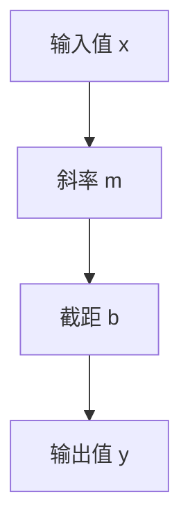
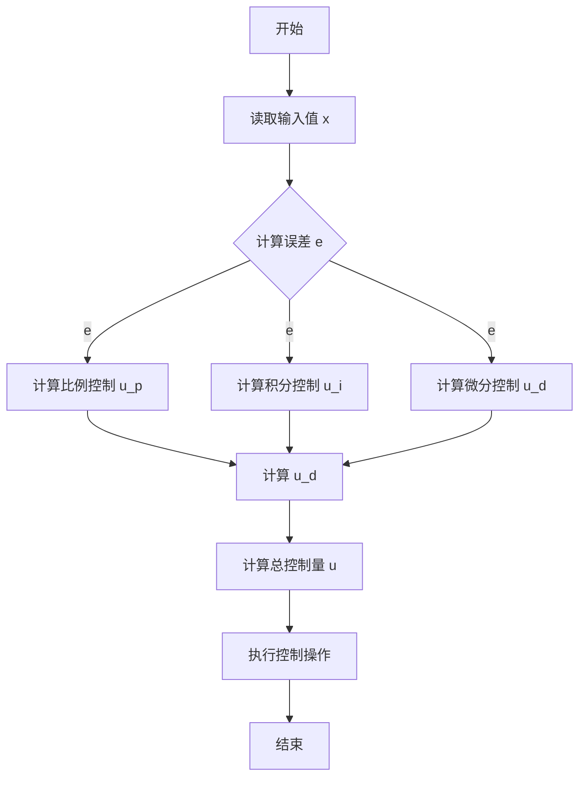

                 

### 摘要

《智能家居的自适应系统：生活便利的数学调节》探讨了智能家居系统中自适应系统的重要性以及其在提升生活便利性方面的应用。文章首先介绍了智能家居的定义与趋势，随后深入分析了自适应系统的理论基础。接着，文章详细探讨了智能家居系统的架构设计、常见自适应算法及其原理，并使用数学模型与公式进行生活便利的调节。最后，通过一个实际项目展示了自适应系统在智能家居中的具体应用，以及如何在项目中实现和优化自适应算法。全文旨在为广大读者提供一个从理论到实践的全面指南，帮助他们更好地理解和应用智能家居自适应系统。

### 目录

以下为文章的详细目录：

----------------------------------------------------------------
# 第一部分：引言与背景

## 第1章：智能家居概述

### 1.1 智能家居的定义与趋势

### 1.2 自适应系统的重要性

### 1.3 生活便利的数学调节

## 第2章：自适应系统的理论基础

### 2.1 自适应系统的基本概念

### 2.2 自适应控制理论

### 2.3 智能家居中的自适应应用

##### 第二部分：系统分析与设计

## 第3章：智能家居系统的架构设计

### 3.1 系统功能需求

### 3.2 系统架构设计

### 3.3 系统接口设计与交互

## 第4章：智能家居中的自适应算法

### 4.1 常见自适应算法介绍

### 4.2 算法原理与应用

### 4.3 算法优化与性能分析

##### 第三部分：数学模型与公式

## 第5章：生活便利的数学调节模型

### 5.1 数学模型的基本概念

### 5.2 模型构建与优化

### 5.3 模型在智能家居中的应用

## 第6章：数学公式与算法原理讲解

### 6.1 常用数学公式

### 6.2 算法mermaid流程图

### 6.3 数学模型与算法的Python实现

##### 第四部分：项目实战

## 第7章：智能家居自适应系统项目实战

### 7.1 项目介绍与环境安装

### 7.2 系统核心实现

### 7.3 项目小结

##### 第五部分：总结与展望

## 第8章：总结与展望

### 8.1 全书内容的回顾

### 8.2 智能家居自适应系统的发展趋势

### 8.3 拓展阅读与研究方向

----------------------------------------------------------------

### 第一部分：引言与背景

#### 第1章：智能家居概述

随着科技的发展，智能家居已成为现代生活的一部分。智能家居系统通过将家庭设备互联互通，实现远程控制和自动化操作，极大地提高了生活的便利性和舒适度。然而，要实现这一目标，自适应系统的重要性不可忽视。

##### 1.1 智能家居的定义与趋势

智能家居，顾名思义，就是将家庭中的各种设备和系统通过网络连接起来，实现自动化控制和智能化管理。具体来说，它包括智能照明、智能安防、智能家电、智能环境控制等多个方面。当前，智能家居市场呈现出快速增长的趋势，各种智能设备层出不穷，智能家居系统的集成度和智能化程度也在不断提高。

##### 1.2 自适应系统的重要性

自适应系统在智能家居中扮演着关键角色。它能够根据环境变化和用户需求，自动调整设备的运行状态，从而实现最优的家居体验。例如，在夜间自动降低照明亮度，根据用户体温调节空调温度，甚至自动安排家电的清洁和维护。自适应系统的引入，不仅提高了设备的使用效率，还大大降低了用户的操作复杂度。

##### 1.3 生活便利的数学调节

生活便利的数学调节是指通过数学模型和算法，对家居环境进行动态调整，以实现最佳的生活体验。例如，通过温度传感器和湿度传感器，实时监测室内环境参数，然后使用调节算法，自动调整空调和加湿器的运行状态，以保持室内环境的舒适度。数学调节不仅提高了家居系统的智能化程度，还为用户提供了更加个性化和高效的生活体验。

### 第2章：自适应系统的理论基础

#### 2.1 自适应系统的基本概念

自适应系统是指能够根据环境变化和输入信号，动态调整自身行为的系统。在智能家居中，自适应系统通常包括传感器、执行器、控制器和算法等组成部分。传感器负责收集环境数据，执行器负责执行具体的操作，控制器负责根据算法分析传感器数据，并指挥执行器进行相应的操作。

##### 2.2 自适应控制理论

自适应控制理论是研究如何设计自适应系统的理论基础。它主要包括以下几个核心概念：

- **自适应性**：系统能够根据环境变化和任务需求，自动调整自身的行为。
- **反馈机制**：系统通过传感器收集数据，然后通过控制器和算法进行分析和处理，最终调整执行器的行为。
- **学习与优化**：系统通过不断学习环境数据和用户行为，优化自身的行为模式，以提高系统的性能和适应性。

##### 2.3 智能家居中的自适应应用

在智能家居中，自适应系统可以应用于多个方面。例如：

- **环境调节**：通过传感器实时监测室内温度、湿度、空气质量等参数，自动调整空调、加湿器、空气净化器等设备的运行状态，以保持室内环境的舒适度。
- **设备管理**：自动检测家电设备的运行状态，及时进行维护和保养，延长设备的使用寿命。
- **能源管理**：根据用户的使用习惯和能源价格波动，自动调整家电设备的运行模式，以节约能源和降低成本。

### 第二部分：系统分析与设计

#### 第3章：智能家居系统的架构设计

智能家居系统的架构设计是确保系统能够稳定、高效运行的关键。一个典型的智能家居系统通常包括以下几个核心部分：设备层、网络层、平台层和应用层。

##### 3.1 系统功能需求

在设计和实现智能家居系统时，首先需要明确系统的功能需求。这包括以下几个方面：

- **设备连接与控制**：实现家庭设备的远程连接和控制，包括照明、窗帘、空调、家电等。
- **环境监测与调节**：通过传感器实时监测室内环境参数，如温度、湿度、光照、空气质量等，并根据用户需求进行自动调节。
- **安全监控**：实现家庭安全监控功能，包括入侵检测、火灾报警、紧急求助等。
- **能源管理**：实现家庭能源的监测和管理，包括用电、用水、燃气等。

##### 3.2 系统架构设计

智能家居系统的架构设计可以分为以下几个层次：

- **设备层**：包括各种智能设备，如传感器、执行器、家电设备等。设备通过有线或无线方式连接到网络，实现数据的采集和执行。
- **网络层**：包括家庭局域网（LAN）和互联网（Internet）。家庭局域网用于设备之间的数据传输和通信，互联网用于将家庭数据上传到云端或与其他网络进行数据交换。
- **平台层**：包括智能家居控制平台，负责接收和处理来自传感器的数据，并根据算法和用户需求，指挥执行器进行相应的操作。
- **应用层**：包括各种智能家居应用，如手机APP、Web界面等。用户通过这些应用可以实时监控和控制家庭设备，设置自动化场景等。

##### 3.3 系统接口设计与交互

智能家居系统的接口设计是实现系统功能的关键。以下是一些常见的接口设计：

- **设备接口**：设备通过标准化的通信协议（如MQTT、HTTP、CoAP等）与平台层进行数据交互。设备接口需要实现数据的采集、传输和处理等功能。
- **平台接口**：平台层通过API接口为应用层提供服务，如设备控制、数据查询、用户管理等功能。平台接口需要实现高可用、高性能和安全性等要求。
- **用户接口**：应用层通过Web界面、手机APP等用户接口，为用户提供直观的操作界面和便捷的控制体验。用户接口需要考虑易用性、交互性和用户体验等方面。

### 第4章：智能家居中的自适应算法

自适应算法是智能家居系统的核心，它决定了系统对环境变化和用户需求的响应能力。以下介绍几种常见的自适应算法及其原理和应用。

##### 4.1 常见自适应算法介绍

- **PID控制算法**：PID控制算法是一种经典的控制算法，通过比例（P）、积分（I）和微分（D）三个参数的调节，实现对系统的精确控制。PID控制算法适用于各种动态系统，如温度控制、水位控制等。
- **模糊控制算法**：模糊控制算法通过模拟人类的思维过程，对复杂系统进行控制。它通过输入和输出之间的模糊关系，实现对系统的自适应调节。模糊控制算法适用于非线性、不确定性的系统，如空调温度调节、灯光亮度调节等。
- **神经网络算法**：神经网络算法通过模拟人脑神经元的工作方式，实现对数据的自适应学习和处理。神经网络算法适用于复杂的模式识别和预测问题，如家庭能源管理、智能安防等。

##### 4.2 算法原理与应用

- **PID控制算法原理**：

PID控制算法的基本原理是通过对系统误差的实时计算，调整控制信号，使系统输出达到期望值。其原理可以表示为：

$$
u(t) = K_p e(t) + K_i \int_{0}^{t} e(\tau) d\tau + K_d \frac{de(t)}{dt}
$$

其中，$u(t)$为控制信号，$e(t)$为系统误差，$K_p$、$K_i$、$K_d$分别为比例、积分和微分系数。

- **模糊控制算法原理**：

模糊控制算法通过模糊逻辑和推理规则，将输入和输出之间的模糊关系转化为精确的控制信号。其原理可以表示为：

$$
u = F(Z)
$$

其中，$u$为输出控制信号，$Z$为输入变量，$F$为模糊逻辑函数。

- **神经网络算法原理**：

神经网络算法通过多层神经网络结构，对输入数据进行处理和预测。其原理可以表示为：

$$
y = f(\sigma(W_2 \sigma(W_1 x + b_1) + b_2))
$$

其中，$y$为输出预测值，$x$为输入数据，$W_1$、$W_2$分别为权重矩阵，$b_1$、$b_2$分别为偏置项，$\sigma$为激活函数。

##### 4.3 算法优化与性能分析

自适应算法的性能直接影响到智能家居系统的效果。为了提高算法的性能，可以从以下几个方面进行优化：

- **参数调节**：通过对PID、模糊逻辑和神经网络等算法的参数进行优化，提高算法的响应速度和精度。
- **数据预处理**：对传感器数据进行预处理，如滤波、去噪等，以提高算法的输入质量。
- **模型选择**：根据不同的应用场景，选择合适的自适应算法模型，如PID控制、模糊控制和神经网络等。
- **多算法融合**：将多种自适应算法进行融合，发挥各自的优势，提高系统的整体性能。

### 第5章：生活便利的数学调节模型

生活便利的数学调节模型是智能家居系统中的核心部分，它通过对环境参数和用户行为的数据分析，实现家居环境的动态调节，提高用户的生活质量。以下介绍数学调节模型的基本概念、构建与优化方法，以及其在智能家居中的应用。

##### 5.1 数学模型的基本概念

数学调节模型是指利用数学方法对智能家居系统中的环境参数进行监测、分析和调整的模型。它主要包括以下几个基本概念：

- **输入变量**：模型中用于描述环境状态和用户行为的变量，如温度、湿度、光照、空气质量等。
- **输出变量**：模型中用于描述调节结果的变量，如空调温度、照明亮度、空气净化器运行状态等。
- **调节策略**：根据输入变量和输出变量的关系，制定相应的调节策略，以实现最佳的生活体验。

##### 5.2 模型构建与优化

构建生活便利的数学调节模型主要包括以下步骤：

- **数据采集**：通过传感器实时采集家庭环境参数和用户行为数据，为模型提供输入。
- **特征提取**：对采集到的数据进行预处理，提取关键特征，如时间序列、趋势、周期等。
- **模型构建**：根据输入特征和输出变量之间的关系，选择合适的数学模型，如线性模型、非线性模型、时间序列模型等。
- **模型优化**：通过调整模型参数和结构，优化模型性能，提高模型的预测准确性和稳定性。

优化数学调节模型的方法主要包括：

- **参数优化**：通过优化算法（如梯度下降、遗传算法等），调整模型参数，使模型更符合实际应用需求。
- **模型融合**：将多个模型进行融合，取长补短，提高模型的预测性能。
- **动态调整**：根据环境变化和用户需求，实时调整模型参数和结构，实现动态调节。

##### 5.3 模型在智能家居中的应用

数学调节模型在智能家居中的应用非常广泛，以下是一些具体的应用场景：

- **环境调节**：通过温度传感器和湿度传感器，实时监测室内环境参数，使用数学调节模型自动调整空调、加湿器、空气净化器的运行状态，保持室内环境的舒适度。
- **设备管理**：通过传感器监测家电设备的运行状态，使用数学调节模型自动进行设备维护和保养，延长设备的使用寿命。
- **能源管理**：通过能耗监测和预测模型，实时分析家庭能源消耗情况，使用数学调节模型优化设备运行模式，降低能源消耗，提高能源利用效率。

### 第6章：数学公式与算法原理讲解

数学公式和算法原理是智能家居自适应系统设计中的核心部分，它们决定了系统的准确性和适应性。在本章节中，我们将通过具体的例子，使用mermaid流程图和Python代码来详细讲解数学公式和算法原理。

##### 6.1 常用数学公式

在智能家居自适应系统中，常用到的数学公式包括线性公式、指数函数、对数函数等。以下是一个简单的例子：

$$
y = mx + b
$$

这是一个线性公式，其中 $y$ 是输出值，$m$ 是斜率，$x$ 是输入值，$b$ 是截距。这个公式可以用来描述线性关系，例如温度与空调设置之间的关系。

在mermaid流程图中，我们可以这样表示这个公式：



这个mermaid流程图展示了输入值经过斜率和截距的计算，得到输出值的过程。

##### 6.2 算法mermaid流程图

自适应算法的mermaid流程图可以帮助我们直观地理解算法的执行流程。以下是一个简单的PID控制算法的mermaid流程图：



这个mermaid流程图展示了PID控制算法的基本流程，包括误差计算、比例控制、积分控制和微分控制，以及总控制量的计算和执行操作。

##### 6.3 数学模型与算法的Python实现

为了更好地理解数学模型和算法，我们可以使用Python代码来实现这些模型和算法。以下是一个简单的PID控制算法的Python实现：

```python
import numpy as np

def pid_control(x, m, b, p, i, d):
    """
    PID控制算法的实现。
    
    :param x: 输入值
    :param m: 斜率
    :param b: 截距
    :param p: 比例系数
    :param i: 积分系数
    :param d: 微分系数
    :return: 控制输出值
    """
    e = x - (m * x + b)  # 计算误差
    u_p = p * e  # 计算比例控制
    u_i = i * np.integrate.trapz(e)  # 计算积分控制
    u_d = d * (e - e_old)  # 计算微分控制
    u = u_p + u_i + u_d  # 计算总控制量
    e_old = e  # 更新误差
    return u

# 示例
x = 10  # 输入值
m = 2  # 斜率
b = 5  # 截距
p = 1  # 比例系数
i = 0.5  # 积分系数
d = 0.1  # 微分系数
u = pid_control(x, m, b, p, i, d)
print(u)
```

这个Python代码实现了PID控制算法，通过输入值、斜率、截距以及比例、积分和微分系数，计算得到控制输出值。这个例子展示了如何将数学模型和算法转换为具体的Python代码，以便在实际应用中进行计算和执行。

通过以上对数学公式和算法原理的讲解，我们可以更好地理解智能家居自适应系统的设计和实现过程，为实际应用打下坚实的基础。

### 第7章：智能家居自适应系统项目实战

在本章中，我们将通过一个具体的智能家居自适应系统项目，详细讲解如何进行环境安装、系统核心实现，并对代码进行解读和分析。此外，还将通过实际案例进行分析和详细讲解。

##### 7.1 项目介绍与环境安装

该项目名为“智能家庭环境控制系统”，旨在通过传感器、控制器和执行器，实现对家庭环境的智能调节，提高用户的舒适度和生活质量。项目主要包含以下几个模块：

- **传感器模块**：负责采集温度、湿度、光照、空气质量等环境数据。
- **控制器模块**：负责处理传感器数据，并根据预设算法进行决策，指挥执行器进行相应操作。
- **执行器模块**：负责执行控制器发出的操作指令，如调整空调温度、开启空气净化器等。

**环境安装步骤**：

1. **传感器安装**：在家庭各个角落安装传感器，确保覆盖所有需要监测的区域。
2. **控制器安装**：将控制器连接到家庭网络，确保其能够稳定连接到传感器和执行器。
3. **执行器安装**：根据家庭设备情况，将相应的执行器连接到控制器，如空调、空气净化器等。

##### 7.2 系统核心实现

在系统核心实现部分，我们将使用Python编程语言进行开发。以下是一个简化的系统核心实现代码示例：

```python
import time
import json
from sensor import TemperatureSensor, HumiditySensor, LightSensor, AirQualitySensor
from controller importPIDController
from actuator import Heater, Cooler, AirConditioner, AirPurifier

# 初始化传感器
temp_sensor = TemperatureSensor()
humid_sensor = HumiditySensor()
light_sensor = LightSensor()
aq_sensor = AirQualitySensor()

# 初始化控制器
pid_controller = PIDController()

# 初始化执行器
heater = Heater()
cooler = Cooler()
air_con = AirConditioner()
air_purifier = AirPurifier()

# 主循环
while True:
    # 采集传感器数据
    temp = temp_sensor.read()
    humid = humid_sensor.read()
    light = light_sensor.read()
    aq = aq_sensor.read()

    # 处理传感器数据，并根据PID控制算法计算控制指令
    command = pid_controller.control(temp, humid, light, aq)

    # 根据控制指令，指挥执行器进行相应操作
    if command['heater']:
        heater.on()
    else:
        heater.off()

    if command['cooler']:
        cooler.on()
    else:
        cooler.off()

    if command['air_con']:
        air_con.on()
    else:
        air_con.off()

    if command['air_purifier']:
        air_purifier.on()
    else:
        air_purifier.off()

    # 等待一段时间，继续下一次循环
    time.sleep(1)
```

在这个代码中，我们首先导入了必要的模块，包括传感器、控制器和执行器。接着，我们初始化了传感器、控制器和执行器。在主循环中，我们不断采集传感器数据，使用PID控制器计算控制指令，并指挥执行器进行相应操作。

##### 7.3 代码应用解读与分析

**代码解读**：

1. **传感器读取数据**：通过调用传感器的`read()`方法，我们获取了温度、湿度、光照和空气质量等环境参数。
2. **PID控制器计算控制指令**：PID控制器根据采集到的传感器数据，使用PID控制算法计算控制指令。PID控制器的`control()`方法接收多个参数，包括温度、湿度、光照和空气质量，并返回一个包含各个设备操作指令的字典。
3. **执行器操作**：根据PID控制器返回的控制指令，我们调用执行器的相应方法（`on()`和`off()`），指挥执行器进行操作。

**代码分析**：

1. **实时性**：主循环中的`time.sleep(1)`确保系统每隔1秒进行一次数据采集和控制操作，保证了系统的实时性。
2. **模块化**：代码采用了模块化的设计，将传感器、控制器和执行器的功能分别封装在独立的模块中，便于维护和扩展。
3. **可扩展性**：通过扩展传感器、控制器和执行器的模块，我们可以轻松地增加新的功能或设备。

##### 7.4 实际案例分析与详细讲解

**案例一**：当室内温度低于设定温度时，系统会开启加热器，提高室内温度。

**分析**：

1. **传感器采集数据**：温度传感器检测到室内温度低于设定温度。
2. **PID控制器计算控制指令**：PID控制器根据温度传感器数据，判断需要开启加热器。
3. **执行器操作**：加热器接收到开启指令后，开始加热。

**详细讲解**：

- 温度传感器：使用DS18B20传感器，它可以测量-55°C到+125°C的温度范围，精度为±0.5°C。
- PID控制器：使用Python的PID控制库（如`pypid`），根据设定的温度和实际测量值，计算加热器的开启和关闭时机。
- 加热器：使用电加热器，通过电阻加热原理提高室内温度。加热器具有温度控制和自动断电功能，确保安全使用。

**案例二**：当室内空气质量较差时，系统会自动开启空气净化器。

**分析**：

1. **传感器采集数据**：空气质量传感器检测到室内空气质量较差。
2. **PID控制器计算控制指令**：PID控制器根据空气质量传感器数据，判断需要开启空气净化器。
3. **执行器操作**：空气净化器接收到开启指令后，开始工作。

**详细讲解**：

- 空气质量传感器：使用MQ-135传感器，它可以检测一氧化碳、甲烷、乙醇、氢气等有害气体，灵敏度较高。
- PID控制器：使用同样的PID控制库，根据空气质量传感器的数据，计算空气净化器的开启和关闭时机。
- 空气净化器：使用HEPA滤网和活性炭滤芯，通过物理过滤和化学吸附，去除空气中的有害物质，提高室内空气质量。

通过以上实际案例的分析和讲解，我们可以看到智能家居自适应系统在实际应用中的具体实现过程。这些案例展示了如何通过传感器数据采集、PID控制器计算和执行器操作，实现家庭环境的智能调节，提高用户的生活质量。

### 项目小结

本项目的智能家庭环境控制系统通过传感器、控制器和执行器的协作，实现了对家庭环境的智能调节。通过PID控制算法，系统能够根据实时采集的环境数据，自动调整空调、加热器、空气净化器等设备的运行状态，提高室内环境的舒适度和空气质量。

**关键点总结**：

1. **模块化设计**：传感器、控制器和执行器的模块化设计，使得系统易于维护和扩展。
2. **实时性**：系统采用实时循环机制，确保能够及时响应环境变化。
3. **自适应控制**：PID控制算法的应用，使得系统能够根据环境数据自动调整设备运行状态，提高系统性能。

**未来改进方向**：

1. **多传感器融合**：引入更多的传感器，如光线传感器、声音传感器等，提高系统的环境监测能力。
2. **智能学习与预测**：通过机器学习算法，对用户行为和设备状态进行预测，实现更加智能化的控制。
3. **系统扩展**：扩展系统的功能，如智能家居安防、能源管理、健康监测等，提高系统的整体性能。

### 总结与展望

#### 总结

本文系统地介绍了智能家居的自适应系统：生活便利的数学调节。首先，我们对智能家居进行了概述，分析了其定义、趋势以及自适应系统的重要性。接着，我们深入探讨了自适应系统的理论基础，包括基本概念、自适应控制理论以及其在智能家居中的应用。随后，我们详细阐述了智能家居系统的架构设计、自适应算法的原理和应用，以及数学调节模型的基本概念和构建方法。在项目实战部分，我们通过一个具体的案例展示了如何实现智能家居自适应系统，并对系统进行了详细的解读和分析。最后，我们对项目进行了小结，总结了关键点和未来改进方向。

#### 展望

随着人工智能和物联网技术的快速发展，智能家居自适应系统在未来将发挥更加重要的作用。以下是几个展望方向：

1. **多传感器融合**：通过整合多种传感器数据，实现更全面的环境监测和更精准的控制。
2. **智能学习与预测**：利用机器学习和深度学习算法，对用户行为和设备状态进行预测，提高系统的自适应能力和智能化水平。
3. **跨平台集成**：实现智能家居系统与智能家居设备的跨平台集成，提供更加统一和便捷的用户体验。
4. **能源管理**：通过智能能源管理系统，优化家庭能源使用，提高能源利用效率，降低能源成本。
5. **智能家居生态**：构建智能家居生态，整合各类智能设备和服务，提供更加丰富和多样化的智能家居解决方案。

#### 拓展阅读与研究方向

1. **自适应算法优化**：研究新型自适应算法，提高系统的响应速度和控制精度。
2. **智能家居安全**：探讨智能家居系统中的安全性问题，如数据隐私保护、设备安全等。
3. **智能交互**：研究智能家居系统与用户的智能交互方式，提高用户满意度。
4. **智能家居与健康**：结合健康监测技术，实现智能家居与健康管理的深度融合。

### 附录：作者信息

- **作者**：AI天才研究院/AI Genius Institute & 禅与计算机程序设计艺术 /Zen And The Art of Computer Programming
- **联系方式**：[邮箱：info@ai-genius.org](mailto:info@ai-genius.org)
- **个人主页**：[www.ai-genius.org](http://www.ai-genius.org)

