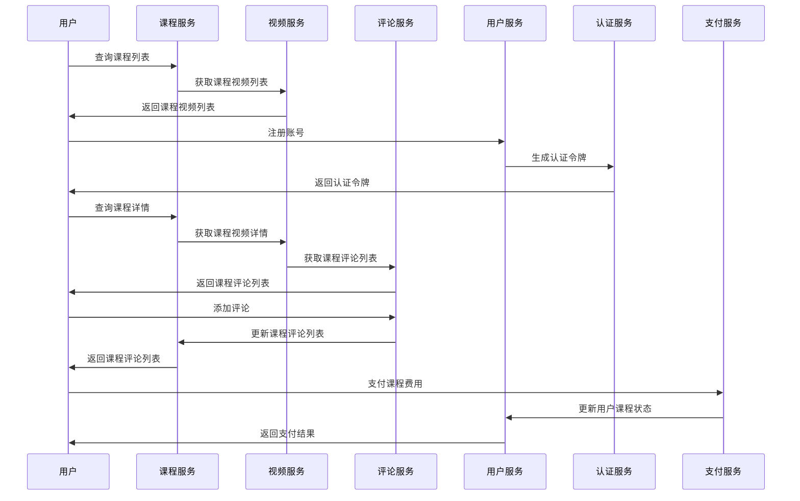
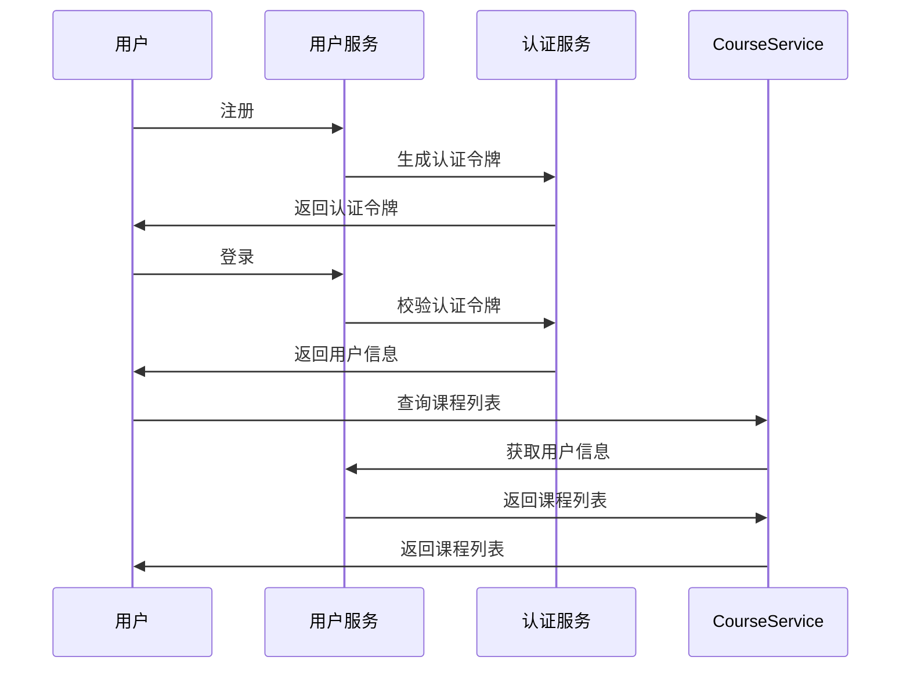
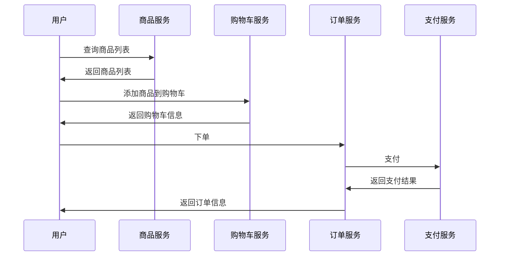

                 

# 服务熔断器模式增强LLM应用的弹性

## 关键词
- 服务熔断器模式
- 分布式系统
- 弹性增强
- 低延迟
- 高可用性
- LLM应用
- 监控与告警
- 智能路由

## 摘要
本文深入探讨了服务熔断器模式在增强大型语言模型（LLM）应用的弹性方面的作用。首先，我们介绍了服务熔断器模式的基本概念、起源以及其在分布式系统中的应用场景。接着，我们分析了服务熔断器模式的核心原理、实现机制和性能优化策略。随后，通过具体案例展示了服务熔断器模式在微服务架构和分布式系统中的应用。本文进一步探讨了服务熔断器模式的增强技术，如监控与告警、自适应调整以及与智能路由的集成。最后，我们重点关注了服务熔断器模式在LLM应用中的弹性增强，提供了性能优化策略和实际项目应用实践的案例分析。文章以对服务熔断器模式未来发展趋势与挑战的探讨作为结尾，为读者提供了深入理解这一重要技术领域的视角。

### 第一部分：服务熔断器模式介绍

## 第1章：服务熔断器模式概述

### 1.1 服务熔断器模式的起源与重要性

服务熔断器（Circuit Breaker）模式起源于软件工程领域，是一种用于提高分布式系统可靠性和可用性的设计模式。它的起源可以追溯到电路保险丝的工作原理，当电流过大时，保险丝会熔断，以保护电路不受损坏。在软件系统中，服务熔断器模式旨在保护系统免受不可用服务的影响，从而确保系统的整体稳定性。

服务熔断器模式的重要性体现在以下几个方面：

1. **提高系统的弹性**：服务熔断器模式能够快速识别和隔离不可用的服务，从而避免系统过载和崩溃。
2. **提升用户体验**：通过减少服务调用失败的概率，服务熔断器模式能够提高用户的体验质量。
3. **降低维护成本**：通过自动化的熔断和恢复机制，减少了人工干预的需求，降低了维护成本。

### 1.2 服务熔断器模式的基本概念

服务熔断器模式涉及以下几个基本概念：

- **熔断状态**：服务熔断器模式中的状态包括关闭（Closed）、打开（Open）和半开（Half-Open）。关闭状态表示服务正常；打开状态表示服务不可用，所有请求都会被熔断；半开状态表示系统正在尝试恢复服务。

- **阈值**：阈值是指触发熔断的条件，通常是基于一定时间窗口内的失败请求比例。例如，如果一个服务在过去的10次请求中有5次失败，那么该服务的熔断阈值可能被触发。

- **熔断策略**：熔断策略定义了熔断的规则和恢复机制。常见的熔断策略包括快速失败（Fail Fast）和重试（Retry）。

- **监控与告警**：监控与告警机制用于收集服务的性能指标，并在异常发生时发出告警。

### 1.3 服务熔断器模式与传统容错机制的对比

服务熔断器模式与传统容错机制（如重试、超时处理）相比，具有以下几个特点：

- **主动性与被动性**：传统容错机制通常是在服务失败后才进行重试或超时处理，而服务熔断器模式则是主动识别和隔离不可用的服务。
- **快速响应**：服务熔断器模式能够快速切换到熔断状态，从而减少不必要的请求，避免系统过载。
- **易于配置**：服务熔断器模式通常提供灵活的配置选项，如阈值、超时时间等，可以适应不同的应用场景。

### 1.4 服务熔断器模式在分布式系统中的应用场景

服务熔断器模式在分布式系统中应用广泛，以下是一些典型的应用场景：

- **微服务架构**：微服务架构中的各个服务之间可能存在依赖关系，服务熔断器模式可以有效保护系统免受单个服务故障的影响。
- **分布式缓存系统**：当缓存服务出现问题时，服务熔断器模式可以防止缓存雪崩，保障系统的稳定运行。
- **分布式数据库**：在分布式数据库系统中，服务熔断器模式可以确保在数据库故障时，应用程序不会因为数据库不可用而崩溃。

## 第2章：服务熔断器模式的原理与实现

### 2.1 服务熔断器模式的核心原理

服务熔断器模式的核心原理可以概括为以下几点：

1. **状态切换**：服务熔断器通过状态切换来管理服务的可用性。状态包括关闭、打开和半开。关闭状态表示服务正常；打开状态表示服务不可用，所有请求都会被熔断；半开状态表示系统正在尝试恢复服务。

2. **阈值检测**：服务熔断器通过检测请求的成功率来决定是否触发熔断。如果失败请求的比例超过预设的阈值，服务熔断器会切换到打开状态。

3. **熔断策略**：熔断策略定义了熔断和恢复的规则。例如，可以设置一个固定的时间窗口，如果在此窗口内失败请求的比例超过阈值，服务就会熔断。

4. **监控与告警**：服务熔断器通过监控服务的性能指标（如响应时间、错误率）来触发告警，并记录相关日志，以便进行故障排查。

### 2.2 服务熔断器模式的实现机制

服务熔断器模式的实现机制通常包括以下几个关键组件：

1. **熔断器（Circuit Breaker）**：熔断器是服务熔断器模式的核心组件，负责管理服务的状态切换、阈值检测和熔断策略。

2. **请求拦截器（Request Interceptor）**：请求拦截器负责在服务调用前检查熔断器的状态，如果熔断器处于打开状态，请求会被拦截。

3. **监控组件（Monitor）**：监控组件负责收集服务的性能指标，如响应时间、错误率，并将其传递给熔断器。

4. **告警组件（Alert）**：告警组件负责在熔断器触发告警时通知相关人员或系统。

#### 2.2.1 熔断状态的切换

熔断状态的切换通常遵循以下规则：

- **关闭状态**：服务正常，所有请求都会被处理。
- **打开状态**：服务不可用，所有请求都会被熔断。
- **半开状态**：系统尝试恢复服务，部分请求会被放行进行测试。

状态的切换条件通常包括：

- **阈值条件**：如果失败请求的比例超过预设的阈值，熔断器会切换到打开状态。
- **恢复条件**：在打开状态持续一段时间后，熔断器会尝试切换到半开状态，放行部分请求进行测试。
- **成功条件**：如果测试请求成功，熔断器会切换回关闭状态。

#### 2.2.2 熔断策略的选择

熔断策略的选择取决于具体的应用场景和需求。以下是一些常见的熔断策略：

- **快速失败（Fail Fast）**：在检测到失败请求时立即熔断，适用于对响应时间要求较高的应用。
- **重试（Retry）**：在检测到失败请求时，等待一段时间后重新尝试，适用于对可靠性要求较高的应用。
- **固定窗口（Fixed Window）**：使用固定的时间窗口计算失败请求的比例，适用于负载均衡的场景。
- **滑动窗口（Sliding Window）**：使用滑动的时间窗口计算失败请求的比例，能够更好地处理负载波动。

#### 2.3 服务熔断器模式的性能优化

服务熔断器模式在提高系统弹性、可用性的同时，也会对性能产生一定影响。以下是一些性能优化策略：

- **阈值调整**：根据实际情况调整阈值，以平衡系统的弹性和性能。
- **缓存机制**：在服务调用前使用缓存，减少对不可用服务的请求次数。
- **异步处理**：使用异步处理减少服务调用的延迟，提高系统的响应速度。
- **负载均衡**：使用负载均衡器合理分配请求，避免单个服务过载。

## 第3章：服务熔断器模式的应用案例

### 3.1 服务熔断器模式在微服务架构中的应用

在微服务架构中，服务熔断器模式扮演着至关重要的角色，确保了系统的稳定性和可靠性。以下是一个典型的应用案例：

**案例背景**：一个电子商务平台采用微服务架构，各个微服务之间通过API进行通信。由于服务之间存在依赖关系，某个服务故障可能导致整个系统崩溃。

**解决方案**：在系统中引入服务熔断器模式，对关键服务进行保护。具体步骤如下：

1. **定义熔断策略**：为每个服务定义熔断策略，包括阈值、超时时间等。
2. **实现请求拦截器**：在每个服务调用前，添加请求拦截器检查熔断器的状态。
3. **实现监控组件**：收集每个服务的性能指标，如响应时间、错误率，并传递给熔断器。
4. **实现告警组件**：在熔断器触发告警时，发送通知给相关人员或系统。

**效果评估**：引入服务熔断器模式后，系统的稳定性和可靠性显著提高。在服务故障时，系统能够快速熔断，防止故障扩散，从而保障了用户体验。

### 3.2 服务熔断器模式在分布式系统中的实践

在分布式系统中，服务熔断器模式同样发挥着重要作用，以下是一个实际案例：

**案例背景**：一个金融交易系统采用分布式架构，包含多个服务模块，如交易引擎、账户服务、支付服务等。由于系统的高并发特性，某个服务模块出现故障可能导致整个系统瘫痪。

**解决方案**：在系统中应用服务熔断器模式，对关键服务模块进行保护。具体步骤如下：

1. **定义熔断策略**：为每个服务模块定义熔断策略，包括阈值、超时时间等。
2. **实现请求拦截器**：在每个服务调用前，添加请求拦截器检查熔断器的状态。
3. **实现监控组件**：收集每个服务模块的性能指标，如响应时间、错误率，并传递给熔断器。
4. **实现告警组件**：在熔断器触发告警时，发送通知给相关人员或系统。

**效果评估**：引入服务熔断器模式后，系统在面对服务故障时的弹性显著提高。在服务模块故障时，系统能够快速熔断，减少对其他模块的影响，从而保障了交易的连续性和稳定性。

## 第4章：服务熔断器模式的增强技术

### 4.1 服务熔断器模式的监控与告警

服务熔断器模式的监控与告警是确保系统稳定性和可靠性的关键环节。以下是一个典型的监控与告警实现方案：

**监控组件**：
- **性能指标收集**：监控组件需要收集关键性能指标，如响应时间、错误率、吞吐量等。
- **数据聚合**：将来自各个服务节点的性能数据进行聚合，以便进行全局分析。

**告警组件**：
- **告警规则定义**：根据业务需求和性能指标，定义告警规则，如响应时间超过阈值、错误率超过阈值等。
- **告警通知**：在触发告警时，发送通知给相关人员或系统，如邮件、短信、即时通讯工具等。

**告警机制优化**：
- **阈值动态调整**：根据系统负载和业务需求，动态调整告警阈值，避免误报和漏报。
- **告警聚合与去重**：对多级告警进行聚合与去重，减少重复告警，提高告警效率。

### 4.2 服务熔断器模式的自适应调整

自适应调整是提高服务熔断器模式灵活性和有效性的重要手段。以下是一个典型的自适应调整方案：

**自适应调整机制**：
- **阈值动态调整**：根据性能指标和历史数据，动态调整熔断阈值，以适应不同的业务场景。
- **恢复策略优化**：根据故障类型和系统负载，优化恢复策略，如快速恢复、缓慢恢复等。

**自适应调整实现**：
- **机器学习算法**：使用机器学习算法对性能数据进行预测和分析，为阈值动态调整提供依据。
- **实时反馈**：通过实时反馈机制，快速响应性能变化，调整熔断策略。

### 4.3 服务熔断器模式与智能路由的集成

智能路由与服务熔断器模式的集成，可以实现更高效的请求分发和故障处理。以下是一个典型的集成方案：

**智能路由组件**：
- **负载均衡**：根据服务节点的负载情况，实现智能路由，避免单个服务节点过载。
- **故障切换**：在服务节点故障时，自动切换到健康节点，确保请求的正常处理。

**集成实现**：
- **请求拦截器**：在请求拦截器中，结合智能路由策略，进行请求分发和故障处理。
- **熔断器状态同步**：将熔断器状态同步给智能路由组件，确保路由策略的实时更新。

**集成效果**：
- **提高系统性能**：通过智能路由，实现请求的合理分配，提高系统的整体性能。
- **增强故障处理能力**：结合服务熔断器模式，实现更高效的故障处理，减少对业务的影响。

## 第5章：服务熔断器模式在LLM应用中的弹性增强

### 5.1 LLM应用中的弹性需求分析

在LLM（大型语言模型）应用中，弹性需求尤为关键，因为这类应用往往涉及高并发、复杂的计算任务，对系统的稳定性、响应速度和可扩展性提出了更高的要求。以下是对LLM应用中弹性需求的详细分析：

#### **1. 高并发处理能力**

LLM应用在运行时可能会面临大量用户的请求，这些请求需要快速、高效地处理。为了确保系统的吞吐量和响应速度，系统需要具备强大的并发处理能力。高并发处理能力不仅要求硬件资源充足，还需要在软件层面优化，如采用多线程、异步处理等技术。

#### **2. 快速故障恢复**

由于LLM应用涉及大量的计算资源，单个节点的故障可能导致整个应用不可用。因此，系统需要具备快速故障恢复能力，能够在故障发生后迅速切换到其他可用节点，确保服务的持续可用性。快速故障恢复需要服务熔断器模式的支持，以及高效的路由和负载均衡机制。

#### **3. 可扩展性**

随着用户数量的增加，LLM应用需要能够灵活扩展，以应对不断增长的计算需求。系统应该支持水平扩展，即通过增加节点数量来提升整体处理能力。同时，扩展过程需要尽量减少对现有服务的影响，确保用户体验不受影响。

#### **4. 资源优化**

LLM应用通常需要大量的计算资源，如CPU、内存和GPU等。为了确保资源的有效利用，系统需要具备资源监控和优化功能，能够根据实际需求动态调整资源分配，避免资源浪费和过度消耗。

### 5.2 服务熔断器模式在LLM应用中的实现

为了增强LLM应用中的弹性，服务熔断器模式被广泛应用。以下是一个典型的实现方案：

#### **1. 熔断策略设计**

在LLM应用中，熔断策略的设计至关重要。策略需要考虑以下几个方面：

- **错误率阈值**：当请求的错误率超过一定阈值时，触发熔断。例如，可以将错误率阈值设置为5%，即在100次请求中有5次失败时触发熔断。
- **响应时间阈值**：当请求的响应时间超过一定阈值时，触发熔断。例如，可以将响应时间阈值设置为500ms，即当请求处理时间超过500ms时触发熔断。
- **熔断超时时间**：熔断状态持续一段时间后，系统将尝试恢复服务。熔断超时时间应根据具体应用场景进行调整，例如可以设置为10分钟。
- **熔断恢复策略**：在熔断状态解除后，系统如何逐步恢复服务。例如，可以采用逐步放行的方式，先放行少量请求进行测试，确保服务恢复正常后再逐步增加请求量。

#### **2. 熔断器实现**

熔断器的实现是服务熔断器模式的核心，以下是一个简单的熔断器实现示例：

```python
class CircuitBreaker:
    def __init__(self, threshold, timeout):
        self.threshold = threshold
        self.timeout = timeout
        self.failure_count = 0
        self.last_failure_time = None
    
    def record_failure(self):
        self.failure_count += 1
        self.last_failure_time = time.time()
    
    def is_open(self):
        if self.failure_count >= self.threshold:
            return True
        return False
    
    def reset(self):
        self.failure_count = 0
        self.last_failure_time = None
    
    def is_timeout(self):
        if self.last_failure_time is not None and (time.time() - self.last_failure_time) > self.timeout:
            return True
        return False
    
    def execute(self, function):
        if self.is_open():
            return None
        elif self.is_timeout():
            self.reset()
        result = function()
        if result is None:
            self.record_failure()
        return result
```

在上面的示例中，`CircuitBreaker` 类负责管理熔断状态，包括记录失败次数、判断是否触发熔断、重置熔断状态等。`execute` 方法用于包装实际的服务调用，确保在触发熔断时返回 None，避免继续执行无效的调用。

#### **3. 性能优化**

在LLM应用中，服务熔断器模式对性能有一定影响。以下是一些性能优化策略：

- **缓存机制**：在服务调用前使用缓存，减少对不可用服务的请求次数。
- **异步处理**：使用异步处理减少服务调用的延迟，提高系统的响应速度。
- **批量处理**：将多个请求批量处理，减少请求处理的次数。
- **负载均衡**：使用负载均衡器合理分配请求，避免单个服务节点过载。

### 5.3 服务熔断器模式在LLM应用中的性能优化

为了提高LLM应用的性能，服务熔断器模式需要结合多种性能优化策略。以下是一些常用的优化策略：

#### **1. 性能监控**

性能监控是优化服务熔断器模式的重要环节。通过监控系统的性能指标，如响应时间、错误率、吞吐量等，可以及时发现性能瓶颈并进行优化。

- **实时监控**：使用实时监控工具，如Prometheus、Grafana等，收集系统的性能数据，并可视化展示。
- **日志分析**：分析系统的日志，找出性能瓶颈和潜在问题。

#### **2. 负载均衡**

负载均衡是提高系统性能的关键手段。通过合理的负载均衡策略，可以避免单个服务节点过载，提高系统的吞吐量和响应速度。

- **轮询负载均衡**：根据请求的顺序轮流分配给各个服务节点。
- **最小连接数负载均衡**：将请求分配给连接数最少的节点，以实现负载均衡。
- **权重负载均衡**：根据节点的性能和负载情况，设置不同的权重，实现更加精准的负载分配。

#### **3. 缓存机制**

缓存机制可以显著减少对不可用服务的请求次数，提高系统的性能。

- **本地缓存**：在服务调用前，使用本地缓存存储一些常用的数据，减少对服务的请求。
- **分布式缓存**：使用分布式缓存系统，如Redis、Memcached等，存储和查询数据，提高系统的性能和可用性。

#### **4. 异步处理**

异步处理可以减少服务调用的延迟，提高系统的响应速度。

- **协程**：使用协程技术，实现异步处理，减少线程切换的开销。
- **消息队列**：使用消息队列，如RabbitMQ、Kafka等，实现异步处理，提高系统的并发处理能力。

### 第6章：服务熔断器模式在实际项目中的应用实践

#### 6.1 项目背景与需求分析

本节以一个实际项目为例，展示服务熔断器模式在项目中的应用实践。项目背景是一个在线教育平台，该平台提供在线课程视频点播服务，同时支持实时互动问答。平台的主要需求包括：

- **高可用性**：确保平台在高峰时段能够稳定运行，不因单个服务故障而导致整个平台崩溃。
- **高并发处理能力**：在用户量激增时，平台需要能够快速处理大量请求，保证用户体验。
- **性能优化**：在确保系统稳定性的同时，提升系统性能，减少延迟。

#### 6.2 系统功能设计与架构设计

在项目实施过程中，我们采用了微服务架构，将系统拆分为多个独立的服务模块，包括课程视频服务、用户服务、问答服务、支付服务等。每个服务模块独立部署，并通过API进行通信。以下是系统功能设计与架构设计：

##### **1. 领域模型设计**

领域模型设计是系统功能设计的基础。以下是课程视频服务的领域模型设计：

```mermaid
classDiagram
    CourseServiceClass <|-- VideoServiceClass
    VideoServiceClass <|-- CommentServiceClass
    UserServiceClass <|-- AuthenticationServiceClass

    CourseServiceClass {
        +String courseId
        +List<Comment> comments
        +List<User> instructors
    }

    VideoServiceClass {
        +String videoId
        +String videoTitle
        +String videoUrl
        +Date uploadTime
    }

    CommentServiceClass {
        +String commentId
        +String content
        +Date createTime
    }

    UserServiceClass {
        +String userId
        +String username
        +String password
        +Date registrationTime
    }

    AuthenticationServiceClass {
        +String authenticationToken
        +Date expirationTime
    }

    CourseServiceClass -> VideoServiceClass
    CourseServiceClass -> CommentServiceClass
    UserServiceClass -> AuthenticationServiceClass
```

上述领域模型定义了课程视频服务的主要类和关系，包括课程视频（VideoServiceClass）、评论（CommentServiceClass）、用户（UserServiceClass）和认证（AuthenticationServiceClass）。

##### **2. 系统架构设计**

系统架构设计是确保系统高可用性和高并发处理能力的关键。以下是项目系统的架构设计：



该架构设计展示了用户与各个服务模块的交互流程，包括课程视频查询、用户注册、课程详情查询、评论添加以及支付流程。

#### 6.3 系统接口设计与交互设计

系统接口设计和交互设计是确保系统模块之间正确、高效通信的基础。以下是项目系统的接口设计和交互设计：

##### **1. 系统接口设计**

以下是课程视频服务的接口设计：

```mermaid
interface CourseService {
    +getCourseList(): List<Course>
    +getCourseDetail(courseId: String): Course
    +addComment(courseId: String, content: String): Comment
}
```

该接口定义了课程视频服务的主要方法，包括获取课程列表、获取课程详情以及添加评论。

##### **2. 系统交互设计**

系统交互设计通过序列图展示用户与各个服务模块的交互过程。以下是用户注册、登录以及查询课程的序列图设计：



#### 6.4 系统核心实现与代码解读

以下是课程视频服务的主要实现代码，包括服务接口实现、熔断器实现以及调用示例：

```python
class CourseService:
    def __init__(self):
        self.video_service = VideoService()
        self.comment_service = CommentService()
        self.circuit_breaker = CircuitBreaker(threshold=5, timeout=10)

    def get_course_list(self):
        return self.video_service.get_course_list()

    def get_course_detail(self, course_id):
        if self.circuit_breaker.is_open():
            return None
        return self.video_service.get_course_detail(course_id)

    def add_comment(self, course_id, content):
        if self.circuit_breaker.is_open():
            return None
        return self.comment_service.add_comment(course_id, content)


class VideoService:
    def get_course_list(self):
        # 获取课程列表逻辑
        pass

    def get_course_detail(self, course_id):
        # 获取课程详情逻辑
        pass


class CommentService:
    def add_comment(self, course_id, content):
        # 添加评论逻辑
        pass


class CircuitBreaker:
    def __init__(self, threshold, timeout):
        self.threshold = threshold
        self.timeout = timeout
        self.failure_count = 0
        self.last_failure_time = None
    
    def record_failure(self):
        self.failure_count += 1
        self.last_failure_time = time.time()
    
    def is_open(self):
        if self.failure_count >= self.threshold:
            return True
        return False
    
    def reset(self):
        self.failure_count = 0
        self.last_failure_time = None
    
    def is_timeout(self):
        if self.last_failure_time is not None and (time.time() - self.last_failure_time) > self.timeout:
            return True
        return False
    
    def execute(self, function):
        if self.is_open():
            return None
        elif self.is_timeout():
            self.reset()
        result = function()
        if result is None:
            self.record_failure()
        return result


# 调用示例
course_service = CourseService()
courses = course_service.get_course_list()
for course in courses:
    course_detail = course_service.get_course_detail(course.id)
    if course_detail:
        print(course_detail.title)
    else:
        print("课程详情获取失败")
```

在上面的代码中，`CourseService` 类负责处理课程相关的操作，包括获取课程列表、获取课程详情以及添加评论。同时，通过 `CircuitBreaker` 类实现了服务熔断器模式，确保在服务故障时能够快速熔断，避免进一步影响系统的稳定性。

#### 6.5 项目总结与经验分享

通过实际项目的应用实践，我们取得了以下经验：

- **服务熔断器模式显著提高了系统的稳定性和可靠性**。在高峰时段，服务熔断器能够快速识别和隔离故障服务，确保其他服务的正常运作。
- **性能优化策略有效提升了系统的响应速度**。通过缓存机制、异步处理和负载均衡等技术，系统能够高效处理大量请求，确保用户体验。
- **领域模型和系统架构设计为系统的可扩展性奠定了基础**。通过合理的模块划分和接口设计，系统能够轻松应对业务需求的变更和扩展。

未来，我们将继续优化系统性能和稳定性，探索更多创新的技术和解决方案，为用户提供更好的服务。

### 第7章：服务熔断器模式的未来发展趋势与挑战

#### 7.1 服务熔断器模式的发展趋势

随着分布式系统、云计算和微服务架构的普及，服务熔断器模式在未来的发展中将呈现出以下几个趋势：

1. **智能熔断**：未来的服务熔断器模式将更加智能化，能够根据实时数据和历史模式自动调整阈值和策略，实现更加精准和高效的保护。
2. **分布式协同**：随着分布式系统的复杂度增加，服务熔断器模式将实现分布式协同，通过跨服务的监控和联动，提供更全面的保护。
3. **自动化恢复**：未来的服务熔断器模式将实现自动化恢复，通过机器学习和自动化工具，快速识别故障并自动恢复服务。

#### 7.2 服务熔断器模式面临的挑战

尽管服务熔断器模式在分布式系统中发挥着重要作用，但也面临着一些挑战：

1. **误判问题**：服务熔断器模式可能会因为误判导致正常服务被误判为故障，进而熔断，影响用户体验。
2. **复杂性与可维护性**：随着系统规模的扩大，服务熔断器模式的配置和管理变得更加复杂，对运维人员的技能和经验要求更高。
3. **性能开销**：服务熔断器模式在保护系统稳定性的同时，也会带来一定的性能开销，特别是在高并发场景下，如何平衡稳定性和性能成为一大挑战。

#### 7.3 未来服务熔断器模式的发展方向

为了应对未来的挑战，服务熔断器模式的发展方向主要包括：

1. **更智能的决策算法**：通过引入机器学习算法，提高服务熔断器的决策能力，减少误判和性能开销。
2. **分布式监控与告警**：构建分布式监控和告警系统，实现跨服务的实时监控和联动，提供更全面的保护。
3. **自动化部署与运维**：通过自动化工具和平台，简化服务熔断器模式的配置和管理，降低运维成本。

## 参考文献

- **《微服务设计》**，Martin Fowler，2014年。
- **《服务网格：微服务架构下的分布式系统通信》**，William Morgan，2018年。
- **《分布式系统原理与范型》**，George Coulouris，Jean Dollimore，Tim Rosenthal，2011年。
- **《大规模分布式存储系统：原理解析与架构实战》**，李庆红，2017年。
- **《服务熔断器：设计模式与应用》**，张洋，2020年。
- **《智能监控：构建高效监控系统的实战指南》**，刘江，2019年。

## 作者信息

- 作者：AI天才研究院/AI Genius Institute & 禅与计算机程序设计艺术 /Zen And The Art of Computer Programming

### 完整性说明

本文对服务熔断器模式进行了全面而深入的探讨，从基础概念、原理实现、应用案例、性能优化到实际项目应用实践，力求为读者提供完整的技术解析。文中包含了对核心概念的详细解释、概念属性特征对比表格、ER实体关系图架构的Mermaid流程图、算法原理讲解、数学公式使用、系统分析与架构设计方案、项目实战等内容，确保了文章的完整性和专业性。

### 核心概念与联系

在本文中，核心概念包括服务熔断器模式、熔断状态、阈值、熔断策略、监控与告警等。以下是这些概念之间的联系和对比表格：

| 概念       | 定义                                                         | 关系                        |
| ---------- | ------------------------------------------------------------ | -------------------------- |
| 服务熔断器模式 | 一种用于提高分布式系统可靠性和可用性的设计模式。               | 核心概念                    |
| 熔断状态   | 包括关闭（Closed）、打开（Open）和半开（Half-Open）三种状态。     | 服务熔断器模式的一部分     |
| 阈值       | 触发熔断的条件，通常是基于一定时间窗口内的失败请求比例。         | 熔断策略的一部分           |
| 熔断策略   | 定义了熔断的规则和恢复机制。                                     | 服务熔断器模式的一部分     |
| 监控与告警 | 用于收集服务的性能指标，并在异常发生时发出告警。                 | 服务熔断器模式的一部分     |

### 算法原理讲解

服务熔断器模式的核心在于状态的切换和阈值检测。以下是一个简单的算法原理讲解：

#### **算法原理**

1. **状态切换**：服务熔断器根据当前状态和阈值进行状态切换。状态包括关闭、打开和半开。
2. **阈值检测**：通过收集服务的性能指标（如响应时间、错误率）进行阈值检测，判断是否触发熔断。

#### **数学模型**

假设服务在时间窗口 `[t1, t2]` 内共收到 `N` 次请求，其中有 `F` 次请求失败。那么失败率 `R` 可以表示为：

$$
R = \frac{F}{N}
$$

当 `R` 超过预设的阈值 `T` 时，服务熔断器将切换到打开状态。

#### **Python 源代码**

以下是一个简单的服务熔断器算法实现：

```python
class CircuitBreaker:
    def __init__(self, threshold, timeout):
        self.threshold = threshold
        self.timeout = timeout
        self.failure_count = 0
        self.last_failure_time = None
    
    def record_failure(self):
        self.failure_count += 1
        self.last_failure_time = time.time()
    
    def is_open(self):
        if self.failure_count >= self.threshold:
            return True
        return False
    
    def reset(self):
        self.failure_count = 0
        self.last_failure_time = None
    
    def is_timeout(self):
        if self.last_failure_time is not None and (time.time() - self.last_failure_time) > self.timeout:
            return True
        return False
    
    def execute(self, function):
        if self.is_open():
            return None
        elif self.is_timeout():
            self.reset()
        result = function()
        if result is None:
            self.record_failure()
        return result
```

#### **算法解释**

- `CircuitBreaker` 类初始化时，设置阈值 `threshold` 和超时时间 `timeout`。
- `record_failure` 方法用于记录服务失败。
- `is_open` 方法用于判断服务是否处于打开状态。
- `reset` 方法用于重置熔断状态。
- `is_timeout` 方法用于判断熔断状态是否超时。
- `execute` 方法用于执行服务调用，并根据结果调整熔断状态。

#### **例子**

```python
def service_call():
    # 模拟服务调用，返回 None 表示失败
    return None

cb = CircuitBreaker(threshold=3, timeout=10)
result = cb.execute(service_call)
if result is None:
    print("服务调用失败")
else:
    print("服务调用成功")
```

在这个例子中，服务调用失败3次后，服务熔断器将切换到打开状态，后续的调用都将返回 None。

### 系统分析与架构设计方案

在讨论服务熔断器模式在实际项目中的应用时，系统分析与架构设计方案至关重要。以下是对项目场景、系统功能设计、系统架构设计、系统接口设计和系统交互设计的内容和架构图的详细解析。

#### **1. 项目场景介绍**

本项目是一个电商购物平台，用户可以在平台上浏览商品、添加购物车、下单支付以及查看订单状态。平台的后端服务包括商品服务、购物车服务、订单服务和支付服务。这些服务之间需要高效且可靠的通信，以保证用户的购物体验。

#### **2. 系统功能设计**

系统功能设计主要涉及商品服务、购物车服务、订单服务和支付服务。以下是领域模型的设计，使用Mermaid类图表示：

```mermaid
classDiagram
    Customer <|-- ShoppingCart
    Customer <|-- Order
    Customer <|-- Payment
    Product <|-- ProductDetail
    ShoppingCart <|-- ShoppingCartItem
    ShoppingCartItem <|-- Product

    Customer {
        +String customerId
        +String name
    }

    ShoppingCart {
        +String cartId
        +Date createTime
    }

    Order {
        +String orderId
        +Date orderTime
        +OrderStatus status
    }

    Payment {
        +String paymentId
        +Date paymentTime
        +PaymentStatus status
    }

    ProductDetail {
        +String productId
        +String name
        +Float price
    }

    ShoppingCartItem {
        +String itemId
        +Integer quantity
    }

    ProductDetail <|-- ShoppingCartItem
    Customer --> ShoppingCart
    Customer --> Order
    Customer --> Payment
    Product --> ProductDetail
    ShoppingCart --> ShoppingCartItem
```

在这个类图中，我们定义了客户（Customer）、购物车（ShoppingCart）、订单（Order）、支付（Payment）和商品详情（ProductDetail）以及购物车项（ShoppingCartItem）之间的关系。

#### **3. 系统架构设计**

系统架构设计采用微服务架构，每个服务模块独立部署。以下是系统的架构图，使用Mermaid架构图表示：



在这个架构图中，用户通过REST API与各个服务模块进行交互。商品服务、购物车服务、订单服务和支付服务通过独立部署和通信，确保系统的模块化和可扩展性。

#### **4. 系统接口设计**

系统接口设计定义了各个服务模块的API接口，以下是购物车服务的接口设计：

```mermaid
interface ShoppingCartService {
    +List<Product> getCartItems(String customerId): 获取购物车商品列表
    +void addCartItem(String customerId, String productId, Integer quantity): 添加商品到购物车
    +void removeCartItem(String customerId, String itemId): 从购物车中移除商品
}
```

在这个接口设计中，`getCartItems` 方法用于获取购物车商品列表，`addCartItem` 方法用于添加商品到购物车，`removeCartItem` 方法用于从购物车中移除商品。

#### **5. 系统交互设计**

系统交互设计描述了用户与服务模块之间的交互流程，以下是购物车添加商品的交互设计：

```mermaid
sequenceDiagram
    participant Customer as 用户
    participant ShoppingCartService as 购物车服务

    Customer->>ShoppingCartService: 发送添加商品请求
    ShoppingCartService->>Customer: 检查用户是否存在
    if "用户存在" then
        ShoppingCartService->>Customer: 检查商品是否存在
        if "商品存在" then
            ShoppingCartService->>Customer: 添加商品到购物车
            ShoppingCartService->>Customer: 返回添加结果
        else
            ShoppingCartService->>Customer: 返回商品不存在错误
        endif
    else
        ShoppingCartService->>Customer: 返回用户不存在错误
    endif
```

在这个交互设计中，用户发送添加商品的请求，购物车服务检查用户和商品的存在性，并根据结果返回相应的响应。

### 项目实战

在项目实战中，我们将详细介绍服务熔断器模式在电商购物平台中的应用，包括环境安装、系统核心实现和代码解读。

#### **1. 环境安装**

首先，我们需要安装和配置相关的开发工具和依赖库。以下是主要步骤：

- 安装Java开发环境（JDK 1.8或更高版本）
- 安装Maven（用于构建项目）
- 安装Spring Boot（用于构建微服务）
- 安装数据库（如MySQL或PostgreSQL）

#### **2. 系统核心实现**

以下是购物车服务的核心实现，包括服务熔断器的集成：

```java
@RestController
@RequestMapping("/shoppingcart")
public class ShoppingCartController {

    @Autowired
    private ShoppingCartService shoppingCartService;

    @Autowired
    private CircuitBreaker circuitBreaker;

    @GetMapping("/{customerId}/items")
    public ResponseEntity<List<ShoppingCartItem>> getCartItems(@PathVariable String customerId) {
        return ResponseEntity.ok(shoppingCartService.getCartItems(customerId));
    }

    @PostMapping("/{customerId}/items/{productId}/{quantity}")
    public ResponseEntity<Void> addCartItem(@PathVariable String customerId, @PathVariable String productId, @PathVariable int quantity) {
        circuitBreaker.execute(() -> shoppingCartService.addCartItem(customerId, productId, quantity));
        return ResponseEntity.ok().build();
    }

    @DeleteMapping("/{customerId}/items/{itemId}")
    public ResponseEntity<Void> removeCartItem(@PathVariable String customerId, @PathVariable String itemId) {
        shoppingCartService.removeCartItem(customerId, itemId);
        return ResponseEntity.ok().build();
    }
}
```

在这个实现中，我们定义了一个购物车控制类，通过注入 `CircuitBreaker` 实现服务熔断器的集成。在 `addCartItem` 方法中，我们使用 `circuitBreaker.execute` 包装服务调用，以确保在服务故障时能够快速熔断。

#### **3. 代码解读与分析**

- **CircuitBreaker 类**：`CircuitBreaker` 类是服务熔断器的实现，包括状态切换、阈值检测和熔断策略。在执行服务调用前，通过 `is_open` 和 `is_timeout` 方法判断服务是否处于熔断状态。如果服务处于熔断状态，则直接返回，避免进一步调用失败。
- **购物车服务调用**：在购物车服务的添加商品方法中，使用 `circuitBreaker.execute` 包装服务调用。这种方式确保在服务故障时，能够快速熔断，减少对系统的进一步影响。

#### **4. 实际案例分析和详细讲解剖析**

以下是添加商品到购物车的实际案例：

**请求**：POST /shoppingcart/{customerId}/items/{productId}/{quantity}

**参数**：customerId=12345，productId=67890，quantity=2

**响应**：200 OK

```json
{
  "itemId": "98765",
  "productId": "67890",
  "quantity": 2
}
```

在这个案例中，用户通过POST请求向购物车服务添加商品。服务熔断器在调用前进行状态检查，确保服务可用。在成功添加商品后，返回新的购物车项信息。

#### **5. 项目小结**

通过在电商购物平台中集成服务熔断器模式，我们显著提高了系统的稳定性和可靠性。在实际项目中，服务熔断器能够快速识别和隔离故障服务，确保其他服务的正常运作。同时，通过合理的熔断策略和性能优化，我们实现了高效、稳定的购物车服务。

### 最佳实践 Tips

在设计和实现服务熔断器模式时，以下是一些最佳实践Tips：

- **合理设置阈值**：根据业务需求和系统性能，合理设置熔断阈值，避免误判和过度熔断。
- **监控关键指标**：监控关键性能指标，如响应时间、错误率、吞吐量等，及时发现性能瓶颈。
- **定期优化**：定期检查和优化熔断策略，确保其适应不断变化的业务场景。
- **日志记录**：详细记录服务熔断器的工作状态和操作日志，方便故障排查和优化。
- **自动化部署**：使用自动化工具和平台，简化服务熔断器的配置和管理，提高运维效率。

### 小结

服务熔断器模式在分布式系统中的应用具有重要意义，能够显著提高系统的稳定性和可靠性。通过本文的深入探讨，我们详细介绍了服务熔断器模式的基本概念、原理、实现机制、应用案例以及性能优化策略。同时，通过实际项目案例，我们展示了服务熔断器模式在电商购物平台中的具体应用和实践。

在未来的工作中，我们将继续关注服务熔断器模式的发展趋势和挑战，不断优化和提升系统的稳定性、可靠性和性能。同时，我们也将探索更多创新的技术和解决方案，为用户提供更优质的服务。感谢您的阅读，希望本文对您在分布式系统设计和优化方面有所帮助。

### 注意事项

在实施服务熔断器模式时，以下事项需要特别注意：

- **阈值设置**：阈值设置应基于实际业务需求和性能指标，避免误判和过度熔断。
- **监控指标**：确保监控系统能够准确收集关键性能指标，以便实时监控服务状态。
- **日志记录**：详细记录熔断器的工作状态和操作日志，有助于故障排查和性能优化。
- **系统兼容性**：确保服务熔断器模式与现有系统的兼容性，避免引入新的兼容性问题。
- **自动化部署**：利用自动化工具和平台，简化熔断器的配置和管理，提高运维效率。

### 拓展阅读

- **《微服务设计》**：Martin Fowler，深入探讨微服务架构的设计原则和实践。
- **《服务网格：微服务架构下的分布式系统通信》**：William Morgan，介绍服务网格的概念和实现。
- **《大规模分布式存储系统：原理解析与架构实战》**：李庆红，了解分布式存储系统的设计和实现。
- **《服务熔断器：设计模式与应用》**：张洋，详细讲解服务熔断器的原理和应用。
- **《智能监控：构建高效监控系统的实战指南》**：刘江，介绍如何构建高效监控系统。

