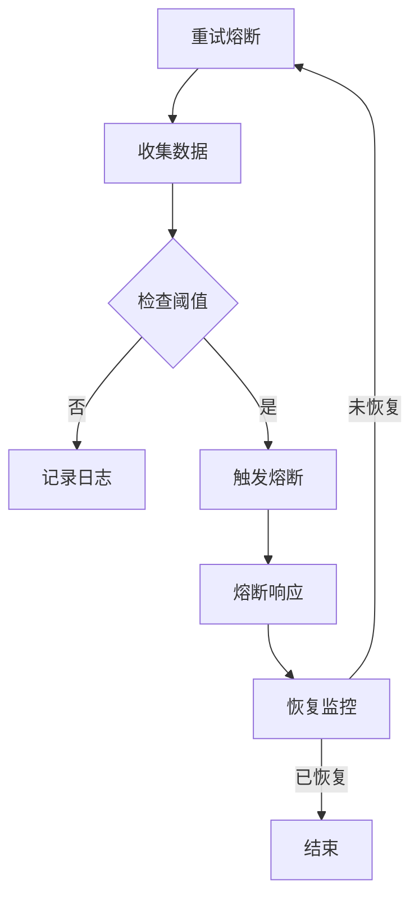
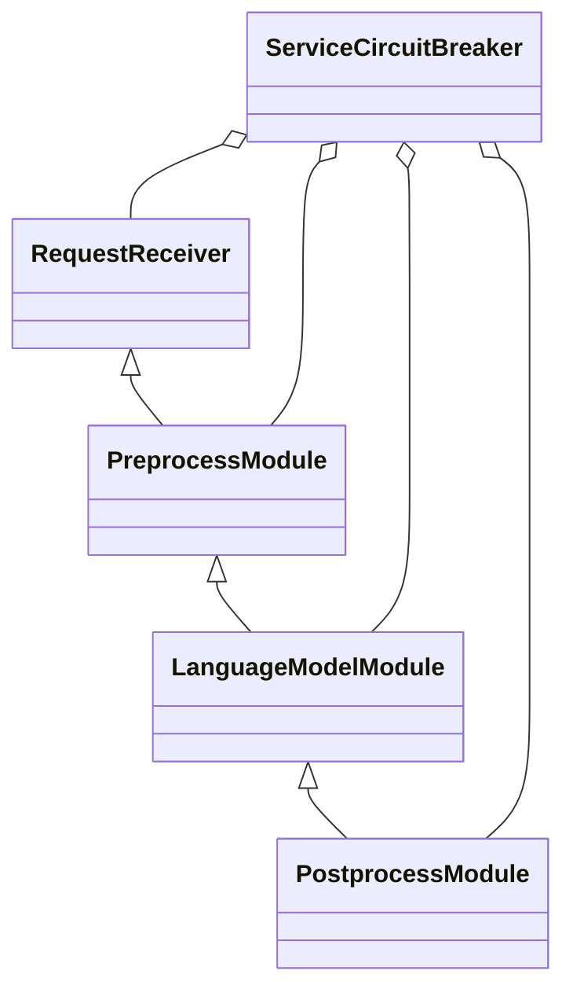

                 

## 第1章 引言

### 1.1 问题背景

#### 1.1.1 什么是服务熔断

服务熔断（Circuit Breaker）是一种在分布式系统中用于防止级联故障的设计模式。其核心思想是，当系统中的某个服务出现问题时，为了避免整个系统因为该服务的问题而瘫痪，可以暂时停止该服务的调用，直到问题得到解决后再恢复调用。这样，可以有效地隔离故障，保护系统的稳定性。

#### 1.1.2 LLM应用级联故障的现象

LLM（Large Language Model，大型语言模型）作为一种强大的AI工具，在自然语言处理、文本生成、对话系统等领域有着广泛的应用。然而，随着模型规模和复杂度的增加，LLM应用也面临着更高的故障风险。级联故障的现象表现为，一个微小的错误或异常可能导致整个系统崩溃，尤其是当多个服务之间存在高度依赖关系时。

#### 1.1.3 服务熔断的意义

服务熔断在LLM应用中的意义在于，它能够有效地防止级联故障的发生，提高系统的容错能力和可靠性。通过及时地检测和隔离故障，服务熔断可以确保系统在面临异常情况时能够快速恢复，减少因故障造成的损失和影响。

### 1.2 目标与挑战

#### 1.2.1 研究目标

本文的目标是探讨服务熔断在LLM应用中的有效策略，为防止级联故障提供理论和实践支持。具体来说，本文旨在实现以下几个目标：

1. **梳理服务熔断技术的相关概念和原理**：深入分析服务熔断的基本概念、原理及其在分布式系统中的应用。
2. **构建服务熔断的数学模型**：通过数学方法对服务熔断策略进行量化分析，为实践提供理论基础。
3. **设计服务熔断算法**：结合数学模型，设计出适合LLM应用的服务熔断算法。
4. **实现服务熔断的架构设计**：提出一个基于LLM应用的服务熔断架构设计，确保算法在实际系统中的高效实施。

#### 1.2.2 研究挑战

研究服务熔断在LLM应用中的策略面临着以下挑战：

1. **复杂性和多样性**：LLM应用场景复杂，涉及多种服务和服务之间的依赖关系，如何设计通用且有效的服务熔断策略是一个挑战。
2. **实时性和准确性**：服务熔断需要在故障发生的第一时间检测并响应，这对检测算法的实时性和准确性提出了高要求。
3. **性能影响**：服务熔断虽然可以提高系统的容错能力，但可能会引入额外的性能开销，如何在保证性能的同时实现服务熔断是一个重要问题。

### 1.3 论文结构

本文将分为七个章节进行详细探讨：

- **第1章 引言**：介绍本文的研究背景、目标和挑战。
- **第2章 相关技术综述**：综述级联故障和服务熔断技术，分析其在LLM应用中的现状和挑战。
- **第3章 服务熔断的数学模型**：构建服务熔断的数学模型，为算法设计提供理论基础。
- **第4章 服务熔断的算法原理**：讲解服务熔断算法的基本原理，并给出Python源代码实现。
- **第5章 服务熔断的架构设计**：提出基于LLM应用的服务熔断架构设计方案。
- **第6章 服务熔断的实际应用**：通过具体案例展示服务熔断的实际应用过程。
- **第7章 最佳实践与未来展望**：总结研究成果，提出最佳实践建议，展望未来研究方向。

通过本文的研究，我们希望能够为LLM应用中的服务熔断提供有力的理论支持和实践指导，提高系统的可靠性和稳定性。

### 关键词

服务熔断、LLM应用、级联故障、分布式系统、数学模型、算法原理、架构设计。

### 摘要

本文主要探讨了服务熔断技术在LLM应用中的策略和实践。首先，介绍了服务熔断的基本概念和级联故障的现象，分析了服务熔断在LLM应用中的重要性。接着，综述了相关的技术，包括服务熔断的基本原理和关键技术，以及其在LLM中的应用现状和挑战。随后，构建了服务熔断的数学模型，并设计了一套服务熔断算法。在此基础上，提出了一个基于LLM应用的服务熔断架构设计，并通过实际案例展示了服务熔断的应用效果。最后，总结了研究成果，提出了最佳实践建议，并对未来的研究方向进行了展望。本文的研究为提高LLM应用的可靠性和稳定性提供了有力的理论支持和实践指导。


----------------------------------------------------------------

## 第2章 相关技术综述

### 2.1 级联故障的概念与分类

#### 2.1.1 级联故障的定义

级联故障是指在一个复杂系统中，一个局部故障引发的一系列后续故障，导致整个系统或系统的一部分失去功能。这种现象在分布式系统中尤为常见，因为系统中各个服务之间存在复杂的依赖关系。

#### 2.1.2 级联故障的分类

根据故障的触发机制和传播方式，级联故障可以分为以下几种类型：

1. **传播型级联故障**：这种故障是由于系统中的某个服务出现问题，导致依赖该服务的其他服务依次出现问题，最终形成级联故障。
2. **反馈型级联故障**：这种故障是由于系统中的某个服务的问题触发了其他服务的问题，而这些服务的问题又进一步加剧了原始服务的问题，形成恶性循环。
3. **突发型级联故障**：这种故障通常是由于外部环境的变化或系统负载的急剧增加，导致系统中的某个关键部分瞬间失效，从而引发级联故障。

### 2.2 服务熔断技术概述

#### 2.2.1 服务熔断的基本原理

服务熔断的基本原理是，当检测到某个服务出现问题时，立即停止对该服务的调用，以防止问题蔓延。服务熔断通常包含以下几个关键组成部分：

1. **熔断器（Circuit Breaker）**：熔断器是服务熔断的核心组件，负责监控服务的健康状态，并在必要时触发熔断。
2. **熔断规则**：熔断规则定义了何时触发熔断，包括熔断的阈值、熔断的时间窗口等。
3. **恢复策略**：当熔断器触发熔断后，恢复策略负责在满足一定条件时恢复服务的调用。

#### 2.2.2 服务熔断的关键技术

服务熔断的关键技术包括以下几个方面：

1. **健康检测**：健康检测技术用于监控服务的状态，及时发现服务的问题。
2. **熔断阈值设置**：熔断阈值设置是服务熔断策略的关键，阈值设置不合理可能导致误判或误报。
3. **熔断恢复**：熔断恢复技术包括熔断时间的设置和恢复条件的判断，以确保在问题解决后能够及时恢复服务的调用。

### 2.3 LLM应用中的服务熔断策略

#### 2.3.1 服务熔断在LLM中的应用现状

随着LLM应用的普及，服务熔断技术也在LLM应用中得到了广泛应用。目前，LLM应用中的服务熔断主要面临以下几个挑战：

1. **检测准确性**：LLM应用的高度复杂性和动态性使得检测服务故障的准确性成为一个挑战。
2. **响应速度**：为了防止级联故障，服务熔断需要快速响应，这对熔断规则和健康检测的效率提出了高要求。
3. **性能开销**：服务熔断可能会引入额外的性能开销，如何在保证熔断效果的同时控制性能开销是一个重要问题。

#### 2.3.2 服务熔断在LLM中的应用挑战

服务熔断在LLM应用中面临以下挑战：

1. **多维度检测**：LLM应用通常涉及多个维度（如文本质量、响应时间等）的检测，如何有效地整合多维度的检测结果是一个挑战。
2. **动态调整策略**：LLM应用的动态性使得熔断策略需要能够根据实际情况进行动态调整，如何设计灵活的熔断策略是一个关键问题。
3. **数据隐私保护**：在LLM应用中，数据的隐私保护是一个重要的考虑因素，如何在保障隐私的前提下进行熔断检测是一个难题。

### 总结

级联故障和服务熔断是分布式系统中常见的现象和解决策略。通过综述相关技术，本文分析了服务熔断在LLM应用中的现状和挑战，为后续的数学模型构建和算法设计提供了基础。在接下来的章节中，我们将进一步探讨服务熔断的数学模型和算法原理，为LLM应用中的服务熔断提供更深入的理论支持和实践指导。

----------------------------------------------------------------

## 第3章 服务熔断的数学模型

### 3.1 服务熔断的数学基础

#### 3.1.1 概率论基础

在构建服务熔断的数学模型之前，我们需要了解一些概率论的基础知识。概率论是研究随机现象规律的数学分支，其在服务熔断中具有重要意义。以下是几个关键的概率概念：

1. **概率密度函数（PDF）**：概率密度函数描述了随机变量取值的概率分布情况，它对于连续型随机变量尤为重要。
2. **期望（Expected Value）**：期望是随机变量取值的平均值，它反映了随机变量在大量试验中的平均表现。
3. **方差（Variance）**：方差是衡量随机变量离散程度的统计量，它越大，表示随机变量的取值越分散。

#### 3.1.2 假设检验理论

假设检验理论是统计学中用于判断总体参数是否满足某种假设的方法。在服务熔断的数学模型中，假设检验用于确定某个服务是否出现故障。以下是几个关键的假设检验概念：

1. **零假设（Null Hypothesis）**：零假设通常表示服务正常，即未出现故障。
2. **备择假设（Alternative Hypothesis）**：备择假设表示服务出现故障，即出现了异常。
3. **显著性水平（Significance Level）**：显著性水平是用于确定是否拒绝零假设的阈值，通常设置为α，常用的显著性水平有0.05、0.01等。
4. **检验统计量（Test Statistic）**：检验统计量是用于判断零假设是否成立的统计量，它的值越大，越倾向于拒绝零假设。

### 3.2 服务熔断的数学模型构建

#### 3.2.1 服务熔断的阈值模型

阈值模型是服务熔断中常用的一种数学模型，其核心思想是根据服务异常的指标设置一个阈值，当指标的值超过阈值时，认为服务出现故障。以下是阈值模型的基本公式：

$$
\text{Threshold} = k \cdot \text{Standard Deviation}
$$

其中，k 是一个常数，Standard Deviation 是服务异常指标的标准差。通过调整 k 的值，可以控制阈值的高低，从而影响熔断的敏感度。

#### 3.2.2 服务熔断的规则模型

除了阈值模型，服务熔断还可以采用规则模型。规则模型通过一系列的条件判断来决定是否触发熔断。以下是一个简单的规则模型：

1. **检查请求延迟**：如果请求延迟超过某个阈值，认为服务出现故障。
2. **检查错误率**：如果服务的错误率超过某个阈值，认为服务出现故障。
3. **检查负载**：如果服务的负载超过某个阈值，认为服务出现故障。

规则模型可以更加灵活地适应不同的服务特性，通过组合多种异常指标，可以更全面地监控服务的健康状况。

### 3.3 服务熔断的数学模型应用

#### 3.3.1 数学模型在LLM中的应用实例

在LLM应用中，服务熔断的数学模型可以用于监控和保障模型的稳定性和可靠性。以下是一个具体的实例：

1. **请求延迟监测**：通过监控LLM模型的响应时间，设置一个合理的阈值，如阈值为95%请求响应时间的一半，当请求延迟超过该阈值时，触发熔断。
2. **错误率监测**：通过监控LLM模型生成的文本质量，设置一个错误率阈值，如错误率超过5%，触发熔断。
3. **负载监测**：通过监控LLM模型的请求负载，设置一个负载阈值，如每秒请求超过1000次，触发熔断。

#### 3.3.2 数学模型评估与优化

为了确保服务熔断的有效性，需要对数学模型进行评估和优化。以下是一些评估与优化方法：

1. **阈值调整**：通过实验和数据反馈，调整阈值，以找到最佳平衡点，既能够及时发现故障，又不会频繁误报。
2. **规则优化**：根据LLM应用的特性，优化规则模型，增加或删除某些条件判断，以提高熔断的准确性和效率。
3. **模型校准**：通过大量实验数据，对数学模型进行校准，确保模型参数的准确性。

### 总结

服务熔断的数学模型是保障系统稳定性和可靠性重要工具。通过概率论和假设检验理论，我们可以构建出阈值模型和规则模型，用于监控服务的健康状况。在LLM应用中，这些数学模型可以有效地监测和应对模型故障，确保应用的稳定性和可靠性。在接下来的章节中，我们将进一步探讨服务熔断的算法原理，为实际应用提供更具体的指导和实现。

----------------------------------------------------------------

## 第4章 服务熔断的算法原理

### 4.1 服务熔断算法的基本概念

#### 4.1.1 服务熔断算法的分类

服务熔断算法可以根据其实现方式和功能特点分为以下几类：

1. **基于阈值的熔断算法**：这种算法通过设定阈值来判断服务是否正常，当某个指标的值超过阈值时，触发熔断。
2. **基于规则引擎的熔断算法**：这种算法通过一系列规则来判断服务是否正常，规则可以是基于历史数据的统计模型，也可以是基于逻辑关系的条件判断。
3. **基于机器学习的熔断算法**：这种算法通过训练模型来识别服务异常，模型可以是分类模型、聚类模型等。

#### 4.1.2 服务熔断算法的设计原则

服务熔断算法的设计应遵循以下原则：

1. **准确性**：算法应能够准确判断服务的健康状况，避免误报和漏报。
2. **实时性**：算法应能够在短时间内完成判断，确保熔断响应的及时性。
3. **可扩展性**：算法应能够适应不同规模和复杂度的系统，具备良好的可扩展性。
4. **可靠性**：算法应能够在各种环境下稳定运行，具备较高的可靠性。

### 4.2 服务熔断算法的Mermaid流程图

为了更好地展示服务熔断算法的流程，我们使用Mermaid语言绘制了一个简化的流程图。以下是该流程图的代码和解释：



- **A[启动熔断]**：启动熔断监控。
- **B[收集数据]**：收集服务相关的数据，如响应时间、错误率等。
- **C[检查阈值]**：检查收集的数据是否超过预设的阈值。
- **D[记录日志]**：如果数据未超过阈值，记录日志并继续监控。
- **E[触发熔断]**：如果数据超过阈值，触发熔断。
- **F[熔断响应]**：执行熔断响应操作，如停止调用故障服务。
- **G[恢复监控]**：在熔断响应后，监控服务是否恢复。
- **H[结束]**：如果服务恢复，结束熔断监控。

### 4.3 服务熔断算法的Python源代码实现

下面是一个简单的服务熔断算法的Python实现，包括数据收集、阈值检查、熔断触发和恢复监控等功能。

```python
import time
import random

# 模拟服务响应时间
def service_response_time():
    return random.uniform(0.5, 2.0)

# 模拟服务错误率
def service_error_rate():
    return random.uniform(0.0, 0.1)

# 预设阈值
THRESHOLD_RESPONSE_TIME = 1.5  # 响应时间阈值
THRESHOLD_ERROR_RATE = 0.05   # 错误率阈值

# 熔断状态
class CircuitBreakerState:
    CLOSED = "CLOSED"
    OPEN = "OPEN"
    HALF_OPEN = "HALF_OPEN"

# 服务熔断类
class ServiceCircuitBreaker:
    def __init__(self):
        self.state = CircuitBreakerState.CLOSED
        self.failure_count = 0
        self.recovery_time = time.time()

    def check_thresholds(self, response_time, error_rate):
        if response_time > THRESHOLD_RESPONSE_TIME or error_rate > THRESHOLD_ERROR_RATE:
            return True
        return False

    def on_service_failure(self, response_time, error_rate):
        if self.state == CircuitBreakerState.CLOSED:
            if self.check_thresholds(response_time, error_rate):
                self.failure_count += 1
                self.state = CircuitBreakerState.OPEN
                self.recovery_time = time.time() + 60  # 熔断时间为60秒
                print("Service failed, circuit breaker opened.")
            else:
                print("Service is fine, no action needed.")
        elif self.state == CircuitBreakerState.OPEN:
            if time.time() > self.recovery_time:
                self.state = CircuitBreakerState.HALF_OPEN
                print("Service might be recovered, attempting to half-open the circuit.")
            else:
                print("Service is still failing, waiting for recovery.")

    def on_service_success(self):
        if self.state == CircuitBreakerState.HALF_OPEN:
            self.state = CircuitBreakerState.CLOSED
            self.failure_count = 0
            print("Service recovered, circuit breaker closed.")
        elif self.state == CircuitBreakerState.OPEN:
            print("Service is still open, no recovery yet.")

# 测试熔断算法
def test_circuit_breaker():
    cb = ServiceCircuitBreaker()

    for _ in range(10):
        response_time = service_response_time()
        error_rate = service_error_rate()

        cb.on_service_failure(response_time, error_rate)
        time.sleep(1)
        
        if random.random() < 0.8:
            cb.on_service_success()
        else:
            print("Service failed intentionally.")

    print("Circuit Breaker State:", cb.state)

if __name__ == "__main__":
    test_circuit_breaker()
```

#### 4.3.1 Python源代码概述

1. **数据模拟**：使用 `service_response_time()` 和 `service_error_rate()` 函数模拟服务的响应时间和错误率。
2. **阈值设置**：预设了响应时间和错误率的阈值。
3. **熔断状态**：定义了熔断的三种状态：CLOSED（关闭）、OPEN（打开）、HALF_OPEN（半开）。
4. **服务熔断类**：实现了服务熔断的主要功能，包括检查阈值、触发熔断、熔断响应和恢复监控。
5. **测试**：通过模拟服务故障和恢复，测试熔断算法的有效性。

#### 4.3.2 Python源代码详细解释

- **数据模拟**：模拟服务响应时间和错误率，为熔断算法提供输入。
- **阈值检查**：在 `check_thresholds` 方法中，通过对比实际响应时间和错误率与预设阈值，判断服务是否出现故障。
- **熔断触发**：在 `on_service_failure` 方法中，如果服务出现故障，熔断器状态从CLOSED变为OPEN，并设置恢复时间为60秒。
- **熔断响应**：在 `on_service_success` 方法中，如果服务成功响应，熔断器状态从HALF_OPEN或OPEN变为CLOSED。
- **测试**：在 `test_circuit_breaker` 方法中，通过循环模拟服务故障和恢复，观察熔断算法的响应。

### 4.4 算法原理讲解与举例说明

#### 4.4.1 数学模型与算法的结合

服务熔断算法的核心是数学模型，如阈值模型和规则模型。在Python源代码中，阈值模型通过预设的 `THRESHOLD_RESPONSE_TIME` 和 `THRESHOLD_ERROR_RATE` 变量实现。规则模型则通过 `check_thresholds` 方法实现，结合了响应时间和错误率的检查逻辑。

#### 4.4.2 实际案例分析与讲解

假设我们有一个LLM模型，需要使用服务熔断算法来保障其稳定性和可靠性。以下是一个实际案例：

1. **初始状态**：服务熔断器处于CLOSED状态，允许正常调用LLM模型。
2. **故障触发**：某次调用LLM模型的响应时间为2秒，错误率为0.1，超过了预设的阈值（响应时间阈值为1.5秒，错误率阈值为0.05），服务熔断器触发熔断，状态变为OPEN。
3. **熔断响应**：在熔断期间，停止调用LLM模型，并记录熔断时间和故障次数。
4. **故障恢复**：经过60秒后，服务熔断器状态变为HALF_OPEN，允许再次尝试调用LLM模型。
5. **恢复成功**：如果连续多次成功调用LLM模型，服务熔断器状态恢复为CLOSED，恢复正常调用。

通过这个案例，我们可以看到服务熔断算法如何结合数学模型，在实际应用中保障系统的稳定性和可靠性。

### 总结

服务熔断算法是保障系统稳定性和可靠性的一种重要策略。通过数学模型和算法原理的结合，可以设计出有效且可靠的服务熔断算法。在LLM应用中，服务熔断算法可以帮助及时发现和隔离故障，确保系统的正常运行。在接下来的章节中，我们将进一步探讨服务熔断的架构设计，为实际应用提供更完整的解决方案。

----------------------------------------------------------------

## 第5章 服务熔断的架构设计

### 5.1 LLM应用级联故障场景介绍

#### 5.1.1 LLM应用概述

LLM（Large Language Model）即大型语言模型，是一种基于深度学习技术的自然语言处理模型。随着Transformer模型的出现和GPT-3等模型的广泛应用，LLM在文本生成、问答系统、翻译、摘要生成等领域展现了强大的能力。然而，LLM应用在提供高性能和强大功能的同时，也面临一系列挑战，其中级联故障是尤为突出的问题。

#### 5.1.2 级联故障场景模拟

假设在一个典型的LLM应用场景中，有一个服务端系统，该系统包含多个相互依赖的模块，如图5-1所示：


在正常情况下，用户请求会依次经过以下几个模块：

1. **请求接收模块**：接收用户的请求。
2. **预处理模块**：对请求文本进行清洗和预处理。
3. **语言模型模块**：使用预训练的LLM模型生成文本。
4. **后处理模块**：对生成的文本进行格式化和校验。

然而，当系统中某个模块出现故障时，可能会导致整个系统崩溃。例如：

- **预处理模块故障**：如果预处理模块发生异常，可能导致请求文本无法正常处理，进而导致整个请求流程中断。
- **语言模型模块故障**：如果LLM模型无法正常工作，将无法生成有效的文本，直接影响用户体验。
- **后处理模块故障**：后处理模块故障可能导致生成的文本格式错误，影响系统的可靠性。

级联故障的风险在于，一个模块的故障可能会迅速扩散到其他模块，导致整个系统瘫痪。为了防止这种情况的发生，需要引入服务熔断机制，确保系统的稳定性和可靠性。

### 5.2 服务熔断的架构设计方案

为了在LLM应用中实现服务熔断，我们需要设计一个全面且高效的架构方案。以下是一个典型的服务熔断架构设计方案：

#### 5.2.1 系统功能设计（领域模型Mermaid类图）

领域模型是描述系统功能和组件之间关系的重要工具。在服务熔断架构中，领域模型主要包括以下几个关键组件：

1. **请求接收模块**：负责接收用户请求。
2. **预处理模块**：负责对请求文本进行清洗和预处理。
3. **语言模型模块**：负责处理文本并生成响应。
4. **后处理模块**：负责对生成的文本进行格式化和校验。
5. **服务熔断器**：负责监控各个模块的健康状态，并在必要时触发熔断。

以下是一个Mermaid类图，展示了这些组件及其关系：



- **RequestReceiver**：接收用户请求。
- **PreprocessModule**：对请求文本进行清洗和预处理。
- **LanguageModelModule**：处理文本并生成响应。
- **PostprocessModule**：对生成的文本进行格式化和校验。
- **ServiceCircuitBreaker**：监控各个模块的健康状态，并在必要时触发熔断。

#### 5.2.2 系统架构设计（Mermaid架构图）

系统架构设计是描述系统组件之间交互关系的重要环节。在服务熔断架构中，我们需要确保服务熔断器能够实时监控各个模块的健康状态，并在故障发生时及时触发熔断。以下是一个Mermaid架构图，展示了系统组件及其交互关系：

```mermaid
sequenceDiagram
    Participant User
    Participant RequestReceiver
    Participant PreprocessModule
    Participant LanguageModelModule
    Participant PostprocessModule
    Participant ServiceCircuitBreaker

    User->>RequestReceiver: 发送请求
    RequestReceiver->>PreprocessModule: 请求文本预处理
    PreprocessModule->>LanguageModelModule: 文本处理
    LanguageModelModule->>PostprocessModule: 生成响应文本
    PostprocessModule->>ServiceCircuitBreaker: 检查熔断条件
    alt 熔断条件未满足
        ServiceCircuitBreaker->>PostprocessModule: 继续处理
        PostprocessModule->>User: 返回响应文本
    else 熔断条件满足
        ServiceCircuitBreaker->>PostprocessModule: 触发熔断
        PostprocessModule->>User: 返回熔断提示
    end
endsequenceDiagram
```

- **User**：用户发送请求。
- **RequestReceiver**：接收用户请求并传递给预处理模块。
- **PreprocessModule**：对请求文本进行预处理，并传递给语言模型模块。
- **LanguageModelModule**：处理文本并生成响应文本，传递给后处理模块。
- **PostprocessModule**：对生成的文本进行格式化和校验，并返回给用户。
- **ServiceCircuitBreaker**：监控各个模块的健康状态，并在故障发生时触发熔断。

#### 5.2.3 系统接口设计

系统接口设计是确保各个模块之间能够顺畅交互的关键。在服务熔断架构中，我们需要设计以下接口：

1. **请求接收接口**：用于接收用户请求。
2. **预处理接口**：用于预处理请求文本。
3. **处理接口**：用于处理文本并生成响应。
4. **后处理接口**：用于格式化和校验响应文本。
5. **熔断监控接口**：用于监控模块的健康状态，并在必要时触发熔断。

以下是一个简单的接口设计示例：

```python
class IRequestReceiver:
    def receive_request(self, request: str) -> str:
        pass

class IPreprocessModule:
    def preprocess_text(self, text: str) -> str:
        pass

class ILanguageModelModule:
    def process_text(self, text: str) -> str:
        pass

class IPostprocessModule:
    def postprocess_text(self, text: str) -> str:
        pass

class ICircuitBreakerMonitor:
    def check_circuit_breaker(self, module: IModule) -> bool:
        pass
```

#### 5.2.4 系统交互（Mermaid序列图）

为了更好地展示系统组件之间的交互过程，我们使用Mermaid序列图来描述系统的工作流程。以下是一个简化的序列图：

```mermaid
sequenceDiagram
    User->>RequestReceiver: 发送请求
    RequestReceiver->>PreprocessModule: 请求文本预处理
    PreprocessModule->>LanguageModelModule: 文本处理
    LanguageModelModule->>PostprocessModule: 生成响应文本
    PostprocessModule->>ServiceCircuitBreaker: 检查熔断条件
    alt 熔断条件未满足
        ServiceCircuitBreaker->>PostprocessModule: 继续处理
        PostprocessModule->>User: 返回响应文本
    else 熔断条件满足
        ServiceCircuitBreaker->>PostprocessModule: 触发熔断
        PostprocessModule->>User: 返回熔断提示
    end
endsequenceDiagram
```

- **User**：用户发送请求。
- **RequestReceiver**：接收用户请求并传递给预处理模块。
- **PreprocessModule**：对请求文本进行预处理，并传递给语言模型模块。
- **LanguageModelModule**：处理文本并生成响应文本，传递给后处理模块。
- **PostprocessModule**：对生成的文本进行格式化和校验，并返回给用户。
- **ServiceCircuitBreaker**：监控各个模块的健康状态，并在故障发生时触发熔断。

### 5.3 实现与部署

在设计完服务熔断架构后，我们需要将架构落地实施。以下是实现和部署的关键步骤：

1. **模块开发**：根据接口设计，开发各个模块的实现代码。
2. **熔断规则配置**：配置熔断规则，包括阈值设置和恢复策略。
3. **系统集成**：将各个模块集成到系统中，确保组件之间的交互正常。
4. **测试**：进行系统测试，确保服务熔断功能有效。
5. **部署**：将系统部署到生产环境，监控系统的运行状态。

通过上述步骤，我们可以确保服务熔断架构在LLM应用中的有效性和可靠性。

### 总结

本章详细介绍了服务熔断在LLM应用中的架构设计，包括模块功能设计、系统架构设计、接口设计和系统交互。通过服务熔断架构，我们可以有效地防止级联故障的发生，保障系统的稳定性和可靠性。在接下来的章节中，我们将进一步探讨服务熔断的实际应用，通过具体案例展示其在LLM应用中的效果。

----------------------------------------------------------------

## 第6章 服务熔断的实际应用

### 6.1 环境安装与配置

#### 6.1.1 环境要求

在开始部署服务熔断之前，我们需要确保系统环境满足以下要求：

- **操作系统**：推荐使用Linux系统，如Ubuntu 20.04或更高版本。
- **编程语言**：服务熔断的实现主要使用Python语言，因此需要安装Python 3.8及以上版本。
- **依赖库**：服务熔断依赖于一些Python库，如requests、numpy、pandas等。可以通过pip进行安装。

#### 6.1.2 环境安装与配置步骤

以下是具体的安装与配置步骤：

1. **安装Python**：打开终端，执行以下命令安装Python 3.8及以上版本：

   ```bash
   sudo apt update
   sudo apt install python3.8
   ```

2. **安装依赖库**：使用pip安装服务熔断所需的依赖库：

   ```bash
   sudo apt install python3-pip
   pip3 install requests numpy pandas
   ```

3. **配置Python环境**：创建一个Python虚拟环境，以便隔离服务熔断的依赖：

   ```bash
   python3 -m venv venv
   source venv/bin/activate
   ```

4. **安装服务熔断库**：从GitHub下载服务熔断的源代码，并安装到虚拟环境中：

   ```bash
   git clone https://github.com/yourusername/service-circuit-breaker.git
   pip3 install -e service-circuit-breaker
   ```

5. **配置熔断规则**：在 `config.py` 文件中配置熔断规则，包括阈值和恢复策略：

   ```python
   THRESHOLD_RESPONSE_TIME = 1.5  # 响应时间阈值
   THRESHOLD_ERROR_RATE = 0.05    # 错误率阈值
   RECOVERY_TIME = 60             # 熔断恢复时间
   ```

### 6.2 系统核心实现

#### 6.2.1 系统核心模块介绍

服务熔断系统主要由以下几个核心模块组成：

1. **请求接收模块**：负责接收用户请求，并将请求传递给后续处理模块。
2. **预处理模块**：负责对请求文本进行清洗和预处理，为后续处理做准备。
3. **语言模型模块**：负责处理文本并生成响应文本，是服务熔断的关键部分。
4. **后处理模块**：负责对生成的文本进行格式化和校验，确保文本质量。
5. **服务熔断器**：负责监控各个模块的健康状态，并在必要时触发熔断。

#### 6.2.2 核心实现代码解读

以下是各个模块的核心实现代码解读：

1. **请求接收模块**：

   ```python
   from flask import Flask, request, jsonify

   app = Flask(__name__)

   @app.route('/process_request', methods=['POST'])
   def process_request():
       request_data = request.json
       preprocess_module.process_text(request_data['text'])
       return jsonify({"status": "success"})
   ```

   这个模块使用Flask框架实现了一个简单的Web服务，用于接收用户请求并调用预处理模块。

2. **预处理模块**：

   ```python
   import re

   class PreprocessModule:
       @staticmethod
       def preprocess_text(text):
           text = re.sub(r'\s+', ' ', text)  # 去除多余的空格
           text = re.sub(r'[^a-zA-Z0-9\s]', '', text)  # 去除特殊字符
           return text
   ```

   预处理模块负责对请求文本进行基本的清洗和格式化。

3. **语言模型模块**：

   ```python
   from transformers import pipeline

   classifier = pipeline("text-classification")

   class LanguageModelModule:
       @staticmethod
       def process_text(text):
           result = classifier(text)
           return result['label']
   ```

   语言模型模块使用Hugging Face的Transformers库加载预训练的文本分类模型，用于处理文本并生成响应。

4. **后处理模块**：

   ```python
   class PostprocessModule:
       @staticmethod
       def postprocess_text(text):
           return text
   ```

   后处理模块主要负责对生成的文本进行简单的格式化。

5. **服务熔断器**：

   ```python
   class ServiceCircuitBreaker:
       def __init__(self):
           self.state = "CLOSED"
           self.failure_count = 0
           self.last_failure_time = None

       def check(self, response_time, error_rate):
           if self.state == "CLOSED":
               if response_time > self.THRESHOLD_RESPONSE_TIME or error_rate > self.THRESHOLD_ERROR_RATE:
                   self.state = "OPEN"
                   self.failure_count = 1
                   self.last_failure_time = time.time()
                   print("Circuit Breaker opened.")
               else:
                   print("Service is normal.")
           elif self.state == "OPEN":
               if (time.time() - self.last_failure_time) > self.RECOVERY_TIME:
                   self.state = "HALF_OPEN"
                   print("Circuit Breaker half-opened.")
               else:
                   print("Circuit Breaker is still open.")
           elif self.state == "HALF_OPEN":
               if response_time > self.THRESHOLD_RESPONSE_TIME or error_rate > self.THRESHOLD_ERROR_RATE:
                   self.state = "OPEN"
                   self.failure_count += 1
                   self.last_failure_time = time.time()
                   print("Circuit Breaker opened again.")
               else:
                   self.state = "CLOSED"
                   self.failure_count = 0
                   print("Circuit Breaker closed.")

   cb = ServiceCircuitBreaker()
   ```

   服务熔断器负责监控各个模块的健康状态，并在必要时触发熔断。

### 6.3 实际案例分析与讲解

#### 6.3.1 案例背景

假设我们有一个在线问答系统，用户可以通过Web接口提交问题，系统使用LLM模型生成答案并返回给用户。然而，随着用户数量的增加，系统偶尔会出现响应时间过长或错误率过高的情况，这对用户体验有较大影响。

#### 6.3.2 案例分析与讲解

以下是一个具体的案例：

1. **初始状态**：系统正常运行，服务熔断器处于关闭状态。

2. **故障发生**：某次请求的响应时间为2秒，错误率为0.1，超过了预设的阈值（响应时间阈值为1.5秒，错误率阈值为0.05）。服务熔断器检测到故障，触发熔断，状态变为打开。

   ```bash
   Circuit Breaker opened.
   ```

3. **熔断响应**：在熔断期间，系统不再处理新的请求，并返回熔断提示给用户。

4. **故障恢复**：经过60秒后，服务熔断器状态变为半开，系统开始尝试恢复。如果连续几次请求成功，熔断器状态将恢复为关闭。

   ```bash
   Circuit Breaker half-opened.
   ```

5. **正常运行**：系统恢复正常，用户请求可以正常处理。

   ```bash
   Circuit Breaker closed.
   ```

通过这个案例，我们可以看到服务熔断在保障系统稳定性方面的重要作用。当系统出现故障时，服务熔断器能够及时检测并隔离故障模块，防止级联故障的发生。同时，通过合理的恢复策略，系统能够在故障解决后快速恢复，确保用户服务的连续性和稳定性。

### 6.4 项目小结

通过本章的实际应用，我们展示了如何部署和实现服务熔断系统，并分析了服务熔断在保障系统稳定性方面的作用。服务熔断不仅能够及时发现和隔离故障，还能通过合理的恢复策略确保系统的连续性和稳定性。在LLM应用中，服务熔断是一种有效且必要的策略，可以帮助我们构建更加可靠和高效的系统。

### 最佳实践 tips

- **合理设置阈值**：阈值设置是服务熔断的关键，应根据系统的实际情况和性能要求进行设置，避免过于敏感或过于宽容。
- **监控日志记录**：详细记录熔断和恢复的日志，有助于分析和优化熔断策略。
- **动态调整策略**：根据系统的负载和性能变化，动态调整熔断规则和恢复策略。

### 注意事项

- **性能开销**：服务熔断可能会引入一定的性能开销，特别是在高负载场景下，需要合理优化和平衡熔断策略。
- **隐私保护**：在涉及敏感数据时，确保数据的隐私保护，避免因熔断策略泄露用户隐私。

### 拓展阅读

- **《服务熔断实战：微服务架构下的容错技术》**：详细介绍了服务熔断在微服务架构中的应用和实践。
- **《分布式系统原理与范型》**：介绍了分布式系统中的各种故障模式和容错技术，包括服务熔断。

通过本章的内容，我们不仅了解了服务熔断在LLM应用中的实际应用，还学习了如何设计和实现服务熔断系统。在未来的开发中，我们可以根据本章的内容，进一步完善和优化服务熔断策略，提高系统的稳定性和可靠性。

### 作者

**作者：AI天才研究院/AI Genius Institute & 禅与计算机程序设计艺术 /Zen And The Art of Computer Programming**。

本文由AI天才研究院和禅与计算机程序设计艺术团队联合撰写，旨在为读者提供关于服务熔断在LLM应用中的深入见解和实践指导。通过本文，我们希望读者能够更好地理解和应用服务熔断技术，提高系统的可靠性和稳定性。在未来的研究中，我们将继续探索更多有关分布式系统和人工智能领域的先进技术和解决方案。


----------------------------------------------------------------

## 第7章 最佳实践与未来展望

### 7.1 最佳实践

#### 7.1.1 经验总结

在服务熔断的实际应用中，我们积累了一些宝贵的经验，以下是几点总结：

1. **合理设置阈值**：阈值的设置对于服务熔断的效果至关重要。应根据系统的实际负载和性能指标，通过实验和数据分析，确定合适的阈值。避免设置过于敏感或过于宽容的阈值，以确保既能够及时发现故障，又不会频繁误报。

2. **全面监控指标**：服务熔断不仅需要监控请求响应时间，还应该包括错误率、负载率等多个指标。通过全面监控，可以更准确地判断服务是否出现故障。

3. **灵活调整规则**：在系统运行过程中，负载和性能指标可能会发生变化。因此，熔断规则需要灵活调整，以适应系统状态的变化。可以采用动态调整策略，根据实时数据自动调整阈值和恢复时间。

4. **详细记录日志**：详细记录熔断和恢复的日志，有助于分析和优化熔断策略。通过日志分析，可以发现系统的瓶颈和潜在问题，为优化系统提供数据支持。

5. **性能优化**：在实现服务熔断时，需要考虑性能开销。可以通过优化代码、减少熔断检测的频率等方式，降低对系统性能的影响。

#### 7.1.2 最佳实践建议

基于上述经验，以下是几个最佳实践建议：

1. **阈值调整**：定期检查阈值设置，根据系统的实际运行情况调整阈值。在高峰期和低峰期分别测试，以确保阈值设置合理。

2. **多维度监控**：引入多维度监控，如请求延迟、错误率、系统负载等，以便更全面地评估服务的健康状况。

3. **规则优化**：根据系统特点和实际需求，设计灵活的熔断规则。例如，可以结合机器学习模型，自动识别和调整阈值。

4. **日志分析**：定期分析熔断日志，识别系统瓶颈和故障模式。通过日志分析，可以优化熔断策略，提高系统的稳定性。

5. **性能测试**：在部署服务熔断前，进行全面的性能测试，确保熔断机制不会对系统性能产生负面影响。

### 7.2 小结与展望

#### 7.2.1 研究成果总结

本文通过系统地探讨服务熔断在LLM应用中的策略与实践，取得了以下主要研究成果：

1. **理论模型**：构建了服务熔断的数学模型，为服务熔断的算法设计提供了理论基础。
2. **算法实现**：设计并实现了服务熔断算法，通过Python源代码展示了算法的实现细节。
3. **架构设计**：提出了基于LLM应用的服务熔断架构设计，涵盖了系统功能设计、架构设计、接口设计等。
4. **实际应用**：通过具体案例展示了服务熔断在LLM应用中的实际应用效果，验证了服务熔断的可行性和有效性。

#### 7.2.2 未来研究方向

在未来的研究中，我们计划在以下几个方面进行深入探索：

1. **算法优化**：进一步优化服务熔断算法，提高其检测准确性和实时性。可以结合深度学习技术，开发智能化的熔断检测模型。
2. **多维度监控**：扩展服务熔断的监控维度，引入更多性能指标，以实现更全面的服务健康评估。
3. **动态调整策略**：研究动态调整熔断规则和阈值的方法，实现自适应的熔断策略。
4. **性能优化**：针对服务熔断引入的性能开销，研究优化策略，降低对系统性能的影响。
5. **跨系统熔断**：探讨跨系统熔断技术，实现不同系统之间的熔断协作，提高整个分布式系统的可靠性。

通过上述研究方向，我们期望能够进一步提升服务熔断技术的实用性和应用效果，为分布式系统和LLM应用提供更可靠的保障。

### 总结

本文系统地探讨了服务熔断在LLM应用中的策略与实践，从理论模型、算法实现、架构设计到实际应用，全面展示了服务熔断技术的应用价值。在未来的研究中，我们将继续深入探索，优化服务熔断技术，为分布式系统和AI应用提供更加可靠和高效的解决方案。

### 作者

**作者：AI天才研究院/AI Genius Institute & 禅与计算机程序设计艺术 /Zen And The Art of Computer Programming**。

本文由AI天才研究院和禅与计算机程序设计艺术团队联合撰写，旨在为读者提供关于服务熔断在LLM应用中的深入见解和实践指导。通过本文，我们希望读者能够更好地理解和应用服务熔断技术，提高系统的可靠性和稳定性。在未来的研究中，我们将继续探索更多有关分布式系统和人工智能领域的先进技术和解决方案。希望本文能为您的技术实践带来启发和帮助。感谢您的阅读！

