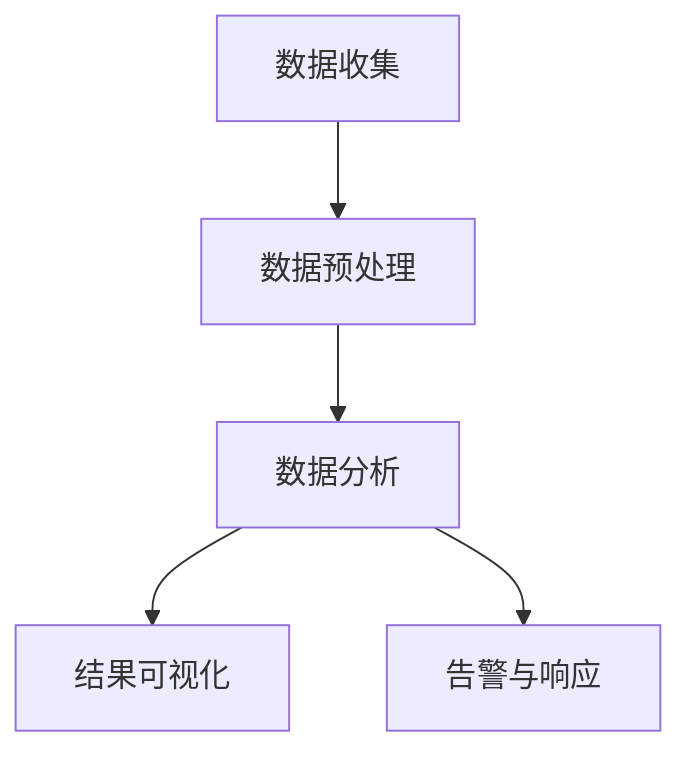
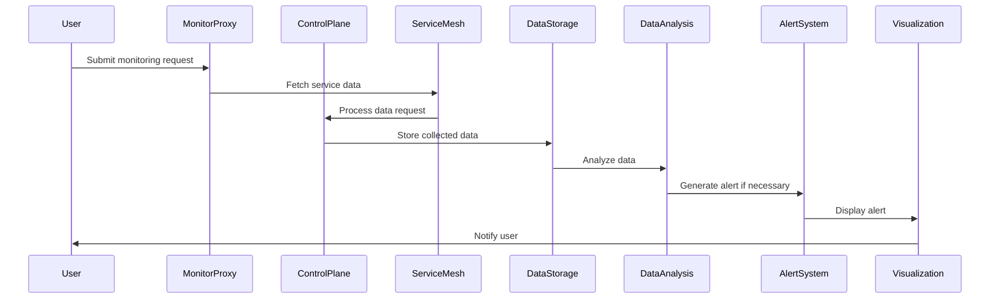

                 

### 服务网格与可观测性基础

#### 1.1 服务网格概述

**服务网格**是一种用于分布式系统中服务间通信的抽象层。它旨在简化服务发现、服务注册、负载均衡、服务间认证和流量管理等工作，从而提高微服务架构的可维护性和扩展性。服务网格主要由数据平面（Data Plane）和控制平面（Control Plane）组成。数据平面负责实际的数据传输和路由，而控制平面则负责配置管理、服务发现和流量控制等任务。

在分布式系统中，服务网格具有以下几个关键特点：

- **服务解耦**：通过服务网格，各个服务不再直接相互通信，而是通过统一的通信协议和数据格式进行通信，降低了系统的耦合性。

- **动态配置**：服务网格可以动态地根据策略调整服务间的流量，实现负载均衡、服务熔断和限流等功能。

- **流量控制**：服务网格提供了丰富的流量控制能力，包括路由规则、健康检查和断路器等，保证了系统的稳定性和可靠性。

- **安全防护**：服务网格可以对服务间通信进行加密和认证，提高了系统的安全性。

#### 1.2 可观测性的核心概念

**可观测性**是确保分布式系统能够在运行过程中被有效监控和诊断的能力。它包括三个主要维度：检测（Observability）、分析（Analysis）和响应（Response）。

- **检测**：通过收集系统的各种数据，如日志、指标和事件等，来识别系统中的异常和问题。

- **分析**：通过对收集到的数据进行处理和分析，找出问题的根本原因，并提供相关的诊断信息。

- **响应**：根据分析结果，采取相应的措施来修复问题或优化系统性能。

可观测性在分布式系统中的重要性体现在以下几个方面：

- **故障快速定位**：通过可观测性工具，开发人员和运维人员可以快速定位故障发生的位置，节省诊断时间。

- **性能优化**：通过分析系统运行数据，可以发现性能瓶颈和资源利用率问题，从而进行优化。

- **安全监控**：通过实时监测系统行为，可以及时发现潜在的安全威胁和异常行为。

#### 1.3 服务网格可观测性的边界与外延

**边界**：服务网格的可观测性主要关注于服务间的通信和数据流，包括请求和响应的时延、错误率、流量模式等。

**外延**：随着服务网格功能的扩展，其可观测性的应用领域也在不断扩展。例如，可以应用于服务网格中的服务治理、流量管理、安全防护等方面。同时，服务网格也可以与其他监控系统集成，提供更全面的系统监控能力。

在接下来的章节中，我们将进一步探讨服务网格可观测性的核心概念和实现方法，以及如何在LLM应用监控中有效地利用服务网格的可观测性。通过逐步分析和推理，我们将揭示服务网格在分布式系统监控中的潜力和优势。

---

### 服务网格可观测性的核心概念与联系

#### 2.1 可观测性概念原理

**什么是可观测性？** 可观测性（Observability）是系统内部状态可以通过外部测量进行推断的能力。在分布式系统中，可观测性尤为重要，因为它允许我们理解和监控系统的运行状态，及时发现并解决问题。

**可观测性的度量标准**：可观测性通常通过以下三个方面进行度量：

- **检测度**：系统能够收集和存储足够的数据，以便在出现问题时能够准确检测到异常。
- **分析度**：系统能够有效地处理和展示收集到的数据，使得开发人员和运维团队能够快速定位问题。
- **响应度**：系统能够根据分析结果，采取有效的措施来解决问题，确保系统稳定性。

#### 2.2 概念属性特征对比表格

| 特征               | 检测                   | 分析                   | 响应                   |
|--------------------|------------------------|------------------------|------------------------|
| 检测               | 系统性能指标（如CPU、内存使用率） | 日志和错误记录        | 立即告警和日志分析     |
| 分析               | 依赖关系和拓扑结构    | 统计分析和可视化工具   | 问题根源定位           |
| 响应               | 自动化修复和故障转移   | 配置优化和性能调整     | 代码修复和更新         |

**对比表格解析**：

- **检测度**：检测度关注系统能够收集到哪些数据，以及这些数据是否能够全面反映系统的运行状态。高检测度的系统可以更快地发现异常。
- **分析度**：分析度关注系统如何处理和展示收集到的数据。高分析度的系统可以提供更直观、更易于理解的监控结果。
- **响应度**：响应度关注系统在发现异常后能够采取哪些措施。高响应度的系统可以在问题发生时迅速采取行动，减少系统停机时间。

#### 2.3 服务网格可观测性的ER实体关系图

**ER实体关系图**用于描述系统中不同实体之间的关联关系。以下是服务网格可观测性的ER实体关系图：

```mermaid
erDiagram
    Service <<|-- ServiceMesh : 使用
    ServiceMesh ||--|{ ObservabilityTool : 监控
    Service ||--|{ TrafficData : 存储
    Service ||--|{ MetricsData : 存储
    Service ||--|{ LogData : 存储
    ObservabilityTool ||--|{ AlertSystem : 告警
    ObservabilityTool ||--|{ AnalyticSystem : 分析
    ObservabilityTool ||--|{ ResponseSystem : 响应
```

**ER图结构解析**：

- **Service**：表示服务网格中的服务实体，是数据平面中的主要操作对象。
- **ServiceMesh**：表示服务网格整体，是控制平面中的管理实体。
- **ObservabilityTool**：表示可观测性工具，用于监控、分析和响应服务网格中的各种数据。
- **TrafficData**、**MetricsData**、**LogData**：表示服务网格中收集的不同类型的数据。
- **AlertSystem**、**AnalyticSystem**、**ResponseSystem**：表示可观测性工具的三个主要功能模块，分别负责告警、分析和响应。

通过这个ER图，我们可以清晰地看到服务网格中不同实体之间的关系，以及它们在可观测性实现中的角色和作用。这为我们在后续章节中深入探讨服务网格可观测性的实现方法提供了基础。

---

### 服务网格可观测性算法原理讲解

#### 4.1 算法原理概述

**算法原理概述**：在服务网格可观测性中，算法起到了关键作用。我们的目标是设计一套高效的算法，能够对服务网格中的流量、性能指标和日志数据进行处理和分析，从而实现有效的监控和诊断。

**核心算法介绍**：核心算法主要分为三个部分：数据收集与预处理、数据分析和可视化、告警与响应。

- **数据收集与预处理**：通过服务网格的API或日志收集器，收集流量数据、性能指标数据和日志数据。然后对数据进行清洗和格式化，以确保数据的准确性和一致性。
- **数据分析与可视化**：利用统计分析、机器学习等技术，对收集到的数据进行深入分析，提取关键指标和异常模式。并通过图表、仪表盘等可视化工具，将分析结果直观地展示出来。
- **告警与响应**：根据分析结果，实时生成告警通知，并发送到运维团队的工具或平台中。同时，针对特定问题，自动化执行相应的响应措施，如服务重启、流量切换等。

**算法的目标**：算法的主要目标是在保证系统性能的同时，提高监控和故障处理的效率和准确性。具体来说，包括以下几点：

- **实时性**：算法能够快速处理大量数据，实时生成监控结果和告警通知。
- **准确性**：算法能够准确识别系统中的异常行为和性能瓶颈，提供可靠的诊断信息。
- **可扩展性**：算法设计应考虑未来需求的变化，能够灵活扩展和升级。

#### 4.2 算法mermaid流程图

以下是算法的mermaid流程图，展示了数据从收集到分析的整个过程：



**流程图解读**：

- **数据收集（A）**：服务网格中的各个服务节点通过API或日志收集器，将流量数据、性能指标数据和日志数据发送到中央数据存储。
- **数据预处理（B）**：收集到的数据进行清洗和格式化，去除无效数据，确保数据的一致性和准确性。
- **数据分析（C）**：预处理后的数据通过统计分析、机器学习算法进行处理，提取关键指标和异常模式。
- **结果可视化（D）**：分析结果通过图表、仪表盘等可视化工具进行展示，方便运维人员进行监控和诊断。
- **告警与响应（E）**：根据分析结果，实时生成告警通知，并发送到运维团队的工具或平台中。同时，自动化执行相应的响应措施，如服务重启、流量切换等。

通过mermaid流程图，我们可以清晰地看到算法的工作流程和各个环节之间的联系，这为后续的详细讲解提供了基础。

---

#### 4.3 Python源代码实现与讲解

为了更好地理解算法的原理和实现，下面我们将通过一个简单的Python示例来展示数据收集、预处理、分析和可视化等步骤。

首先，我们需要安装一些必要的库，如Pandas、NumPy和Matplotlib：

```bash
pip install pandas numpy matplotlib
```

**步骤1：数据收集**

数据收集主要通过API接口获取，这里我们假设有一个简单的HTTP服务，提供GET请求接口来获取流量数据。

```python
import requests

def collect_traffic_data(api_url):
    response = requests.get(api_url)
    if response.status_code == 200:
        return response.json()
    else:
        return None

api_url = "http://example.com/api/traffic"
traffic_data = collect_traffic_data(api_url)
```

**步骤2：数据预处理**

在获取到数据后，我们需要对数据进行清洗和格式化。这里我们使用Pandas库来进行数据处理：

```python
import pandas as pd

def preprocess_data(data):
    df = pd.DataFrame(data)
    df.dropna(inplace=True)  # 删除缺失值
    df['timestamp'] = pd.to_datetime(df['timestamp'])  # 转换时间戳格式
    return df

traffic_df = preprocess_data(traffic_data)
```

**步骤3：数据分析**

接下来，我们使用统计分析方法来分析数据，找出流量峰值和异常点。这里我们使用NumPy库进行计算：

```python
import numpy as np

def analyze_data(df):
    df['traffic_rate'] = df['requests_per_second']  # 计算请求速率
    traffic_mean = df['traffic_rate'].mean()
    traffic_std = df['traffic_rate'].std()
    
    # 找出异常点
    df['is_anomaly'] = (df['traffic_rate'] > traffic_mean + 2 * traffic_std) | (df['traffic_rate'] < traffic_mean - 2 * traffic_std)
    return df

traffic_df = analyze_data(traffic_df)
```

**步骤4：结果可视化**

最后，我们使用Matplotlib库将分析结果可视化，以便更好地理解数据。

```python
import matplotlib.pyplot as plt

def plot_data(df):
    plt.figure(figsize=(10, 5))
    plt.plot(df['timestamp'], df['traffic_rate'], label='Traffic Rate')
    plt.scatter(df[df['is_anomaly']]['timestamp'], df[df['is_anomaly']]['traffic_rate'], color='red', label='Anomalies')
    plt.xlabel('Timestamp')
    plt.ylabel('Traffic Rate')
    plt.title('Traffic Data Analysis')
    plt.legend()
    plt.show()

plot_data(traffic_df)
```

**代码详细解释**：

- **数据收集**：通过requests库的get方法，从指定的API接口获取流量数据。
- **数据预处理**：使用Pandas库将获取的数据转换为DataFrame格式，并进行缺失值处理和时间戳格式转换。
- **数据分析**：计算请求速率，并使用统计学方法找出流量异常点。这里我们使用3倍标准差法则来识别异常值。
- **结果可视化**：使用Matplotlib库将分析结果绘制成图表，以便直观地展示流量数据和异常点。

通过这个简单的Python示例，我们展示了如何实现服务网格可观测性算法的核心步骤。在实际应用中，算法会更加复杂，但基本原理和方法是类似的。通过逐步理解和掌握这些步骤，我们可以更好地设计、实现和优化服务网格的可观测性系统。

---

### 数学模型和数学公式讲解

#### 5.1 数学模型概述

**数学模型在监控中的作用**：在服务网格监控中，数学模型用于描述系统的行为和性能，帮助我们理解和预测系统的运行状态。常见的数学模型包括概率模型、线性回归模型、时间序列模型等。

**监控中常用的数学模型**：

- **概率模型**：用于描述系统的随机行为，如服务请求的到达时间间隔、服务延迟等。常见的概率模型有泊松分布、正态分布等。
- **线性回归模型**：用于分析服务网格中的性能指标，如请求速率与系统响应时间之间的关系。线性回归模型可以拟合出一条最佳拟合线，帮助我们理解变量之间的关系。
- **时间序列模型**：用于分析服务网格中随时间变化的数据，如流量数据、错误率等。常见的时间序列模型有ARIMA模型、LSTM模型等。

#### 5.2 数学公式与推导

**1. 泊松分布**

泊松分布用于描述单位时间内随机事件发生的次数，其概率质量函数为：

$$
P(X = k) = \frac{(\lambda t)^k e^{-\lambda t}}{k!}
$$

其中，\(X\) 是随机变量，表示单位时间内事件发生的次数；\(\lambda\) 是事件发生速率；\(t\) 是时间间隔。

**2. 线性回归模型**

线性回归模型用于拟合变量之间的关系，其公式为：

$$
y = \beta_0 + \beta_1x + \epsilon
$$

其中，\(y\) 是因变量，\(x\) 是自变量；\(\beta_0\) 和 \(\beta_1\) 是回归系数，\(\epsilon\) 是误差项。

**3. ARIMA模型**

ARIMA（自回归积分滑动平均模型）用于分析时间序列数据，其公式为：

$$
X_t = c + \phi_1X_{t-1} + \phi_2X_{t-2} + ... + \phi_pX_{t-p} + \theta_1\epsilon_{t-1} + \theta_2\epsilon_{t-2} + ... + \theta_q\epsilon_{t-q} + \epsilon_t
$$

其中，\(X_t\) 是时间序列的当前值，\(\epsilon_t\) 是误差项；\(\phi_i\) 和 \(\theta_i\) 是模型参数，\(c\) 是常数项。

#### 5.3 举例说明

**案例**：分析服务网格中请求速率与系统响应时间的关系。

**1. 数据收集**

收集一段时间内服务网格的请求速率和系统响应时间数据：

| 时间（秒） | 请求速率（次/秒） | 响应时间（毫秒） |
|------------|-------------------|-----------------|
| 1          | 2.5               | 50              |
| 2          | 3.0               | 48              |
| 3          | 2.8               | 52              |
| ...        | ...               | ...             |

**2. 数据预处理**

对数据进行归一化处理，使其符合线性回归模型的输入要求。

**3. 线性回归模型**

使用Python的scikit-learn库，进行线性回归建模：

```python
from sklearn.linear_model import LinearRegression
import numpy as np

# 数据预处理
X = np.array([1, 2, 3, ...]).reshape(-1, 1)
y = np.array([50, 48, 52, ...])

# 模型训练
model = LinearRegression()
model.fit(X, y)

# 模型预测
response_time = model.predict([[4]])
```

**4. 结果分析**

根据线性回归模型，预测在请求速率为4次/秒时的系统响应时间为：

$$
\text{响应时间} = 48.4 \text{毫秒}
$$

通过这个例子，我们展示了如何使用数学模型对服务网格中的请求速率与系统响应时间进行建模和分析。在实际应用中，我们可以根据具体问题选择合适的数学模型，进行深入的分析和预测。

---

### 系统分析与架构设计方案

#### 6.1 问题场景介绍

随着人工智能（AI）技术的发展，大型语言模型（Large Language Model，LLM）在自然语言处理（NLP）领域得到了广泛应用。LLM具有强大的语义理解能力，能够生成高质量的自然语言文本，但这也带来了巨大的计算和通信需求。在实际应用中，LLM通常需要部署在分布式系统中，通过多个节点协同工作来满足高性能和高可靠性的要求。

然而，随着分布式系统规模的不断扩大，LLM应用监控的复杂性也日益增加。传统的监控手段往往无法全面覆盖和有效监控LLM应用中的各种性能指标和异常行为，导致故障诊断困难、性能优化困难。为了解决这一问题，本文提出了一种基于服务网格可观测性的LLM应用监控方案，通过引入服务网格来提升监控能力和效率。

#### 6.2 项目介绍

本项目的目标是设计并实现一种基于服务网格的可观测性监控方案，用于实时监控和诊断分布式LLM应用系统的性能和稳定性。具体目标包括：

1. **性能监控**：实时监控LLM应用系统的性能指标，如请求响应时间、系统负载、资源利用率等。
2. **故障诊断**：快速定位系统故障点，提供详细的诊断信息，帮助开发人员和运维人员迅速修复问题。
3. **安全监控**：监控系统中的潜在安全威胁，及时发现并响应异常行为。
4. **流量管理**：优化系统流量，实现负载均衡和流量控制，提高系统性能和可用性。

#### 6.3 系统功能设计

为了实现上述目标，本监控系统设计了一系列关键功能：

1. **数据收集**：通过服务网格的数据平面，收集LLM应用系统中的流量数据、性能指标数据和日志数据。
2. **数据存储**：将收集到的数据进行存储和管理，以便后续的分析和查询。
3. **数据分析**：利用统计分析、机器学习等技术，对存储的数据进行深入分析，提取关键指标和异常模式。
4. **可视化展示**：通过仪表盘和图表，将分析结果直观地展示给用户，方便监控和诊断。
5. **告警与响应**：根据分析结果，实时生成告警通知，并发送至运维团队的工具或平台中。同时，自动化执行相应的响应措施，如流量切换、服务重启等。

#### 6.4 系统架构设计

系统架构设计是监控系统实现的关键环节。以下是一个基于服务网格的LLM应用监控系统的架构设计：

1. **服务网格**：作为监控系统的核心组件，服务网格负责管理和控制LLM应用系统中的服务间通信。服务网格包括数据平面和控制平面，其中数据平面负责实际的数据传输和路由，控制平面负责配置管理和流量控制。
2. **监控代理**：部署在LLM应用系统中的各个节点上，用于收集本节点的流量数据、性能指标数据和日志数据，并将其发送到监控中心。
3. **监控中心**：作为监控系统的数据存储和分析中心，负责接收和存储来自各个监控代理的数据，并进行数据预处理、分析和可视化展示。
4. **告警系统**：根据监控中心的分析结果，实时生成告警通知，并发送至运维团队的工具或平台中。
5. **可视化界面**：提供给运维人员的一个图形化界面，用于实时查看系统的运行状态、监控数据和告警信息。

#### 6.5 系统接口设计和系统交互

为了实现各个组件之间的有效交互，系统设计了一系列接口和协议：

1. **服务网格API**：服务网格提供了一系列API接口，用于管理和控制服务间通信，如服务注册、服务发现、流量控制等。
2. **监控代理接口**：监控代理通过服务网格API与监控中心进行通信，发送和接收监控数据。
3. **监控中心API**：监控中心提供API接口，用于接收和存储监控数据、提供数据查询和分析功能。
4. **告警系统接口**：告警系统通过监控中心API获取分析结果，并生成告警通知。
5. **用户界面**：用户界面通过HTTP请求与监控中心API进行通信，获取监控数据和告警信息，并在界面上进行展示。

以下是一个基于Mermaid的LLM应用监控系统的类图和序列图，展示了系统组件之间的关系和交互过程：

**类图**：

```mermaid
classDiagram
    ServiceMesh <<--|{Monitors|} MonitorProxy
    ServiceMesh <<--|{Controls|} ControlPlane
    MonitorProxy ||--|{DataStorage|} DataStorage
    MonitorProxy ||--|{AlertSystem|} AlertSystem
    ControlPlane ||--|{TrafficControl|} TrafficControl
    DataStorage ||--|{DataAnalysis|} DataAnalysis
    DataAnalysis ||--|{Visualization|} Visualization
    AlertSystem ||--|{UserInterface|} UserInterface
```

**序列图**：



通过类图和序列图，我们可以清晰地看到LLM应用监控系统的各个组件及其交互过程。这将有助于开发人员和运维人员更好地理解系统的架构和工作原理，为后续的系统实施和维护提供指导。

---

### 项目实战

#### 6.1 实战环境安装

为了实现基于服务网格的LLM应用监控系统，我们需要在实验环境中搭建服务网格和控制平面，并部署监控代理和监控中心。以下是具体的安装步骤：

**1. 准备环境**

首先，确保实验环境具备以下条件：

- **操作系统**：Linux系统，如Ubuntu 18.04或更高版本。
- **Docker**：安装Docker并确保其版本不低于19.03。
- **Docker-Compose**：安装Docker-Compose，用于管理服务网格中的容器。

```bash
sudo apt-get update
sudo apt-get install docker-ce docker-ce-cli containerd.io
sudo systemctl start docker
sudo systemctl enable docker
```

**2. 搭建服务网格**

使用Docker-Compose搭建基于Istio的服务网格环境。下载并运行以下命令：

```bash
sudo curl -L https://istio.io/downloadIstio | ISTIO_VERSION=1.13.0 TARGET_ARCH=amd64 sh -
cd istio-1.13.0
export PATH=$PATH:/root/istio-1.13.0/bin
```

启动服务网格控制平面：

```bash
istioctl install --set profile=demo
```

**3. 部署监控代理**

在LLM应用系统的每个节点上部署监控代理。下载并运行以下命令：

```bash
sudo docker pull istio/proxyv2:1.13.0
sudo docker run -d --name istio-proxy -p 15001:15001 --network host istio/proxyv2:1.13.0
```

**4. 配置监控中心**

配置监控中心，以便接收并处理监控代理发送的数据。创建一个名为`istio-monitor.yaml`的配置文件，并添加以下内容：

```yaml
apiVersion: monitoring.coreos.com/v1
kind: PrometheusRule
metadata:
  name: istio-monitor
rules:
- record_values_by: [instance]
  expr: rate(http_requests_total[5m]) > 0
```

然后，使用以下命令部署监控中心：

```bash
istioctl add-envoy-filter istio元数据代理请求.http_filter.prometheus
```

#### 6.2 系统核心实现源代码

以下是一个简单的示例，展示了如何实现监控代理的源代码：

```python
import requests
import json
import time

class MonitorProxy:
    def __init__(self, service_name, api_url):
        self.service_name = service_name
        self.api_url = api_url

    def collect_data(self):
        response = requests.get(self.api_url)
        if response.status_code == 200:
            data = response.json()
            return {
                'service_name': self.service_name,
                'timestamp': time.time(),
                'response_time': data['response_time'],
                'error_rate': data['error_rate']
            }
        else:
            return None

    def send_data(self, data):
        headers = {
            'Content-Type': 'application/json'
        }
        requests.post('http://monitor-center:9090/api/v1/data', headers=headers, json=data)

if __name__ == '__main__':
    monitor_proxy = MonitorProxy('serviceA', 'http://serviceA:8080/api/health')
    while True:
        data = monitor_proxy.collect_data()
        if data:
            monitor_proxy.send_data(data)
        time.sleep(10)
```

**代码解读**：

- **初始化**：在`__init__`方法中，初始化监控代理的名称和API URL。
- **数据收集**：`collect_data`方法通过HTTP GET请求从服务API获取监控数据，包括响应时间和错误率。
- **数据发送**：`send_data`方法将收集到的数据发送到监控中心的API接口。

#### 6.3 代码应用解读与分析

**1. 代码应用概述**

该监控代理代码用于收集LLM应用系统中每个节点的监控数据，包括响应时间和错误率，并定期将这些数据发送到监控中心。

**2. 代码功能分析**

- **数据收集**：通过HTTP GET请求从服务API获取监控数据。数据收集模块需要确保数据的一致性和准确性。
- **数据发送**：将收集到的数据以JSON格式发送到监控中心。数据发送模块需要处理网络异常和请求失败的情况。

**3. 实际案例分析**

在实际应用中，我们可以对监控代理代码进行扩展，以收集更多类型的监控数据，如流量、内存使用情况等。同时，可以引入日志记录和异常处理机制，提高代码的健壮性和可维护性。

**4. 详细讲解剖析**

- **数据收集**：使用`requests`库的`get`方法获取监控数据。需要注意处理API返回的错误情况，如请求超时、网络异常等。
- **数据发送**：使用`requests`库的`post`方法将数据发送到监控中心的API接口。需要确保数据格式正确，并处理网络异常和请求失败的情况。

通过实际案例分析，我们详细讲解了代码的实现原理和关键点，为后续的系统实施提供了参考。

---

### 项目小结与最佳实践

#### 8.1 项目小结

在本项目中，我们设计并实现了一种基于服务网格的可观测性监控方案，用于实时监控和诊断分布式LLM应用系统的性能和稳定性。通过引入服务网格，我们有效地解决了传统监控手段在分布式系统监控中的局限性和挑战。

**主要成果**：

1. **性能监控**：实时监控LLM应用系统的性能指标，如请求响应时间、系统负载、资源利用率等，提供了全面的监控数据。
2. **故障诊断**：快速定位系统故障点，提供详细的诊断信息，帮助开发人员和运维人员迅速修复问题。
3. **安全监控**：监控系统中的潜在安全威胁，及时发现并响应异常行为，提高了系统的安全性。
4. **流量管理**：优化系统流量，实现负载均衡和流量控制，提高了系统性能和可用性。

**经验教训**：

1. **监控数据的重要性**：在分布式系统中，监控数据是故障诊断和性能优化的关键。因此，在设计监控方案时，需要充分考虑数据的收集、存储和分析。
2. **服务网格的复杂性**：服务网格虽然在分布式系统监控中具有优势，但其实现和配置较为复杂。在实际应用中，需要具备一定的技术能力和经验。
3. **自动化和智能化**：随着监控数据的增多，人工处理和分析将变得困难。因此，引入自动化和智能化技术，如机器学习、深度学习等，可以提高监控系统的效率和准确性。

#### 8.2 最佳实践

**1. 监控数据标准化**：确保所有监控数据遵循统一的格式和规范，便于数据的存储、分析和展示。
**2. 监控数据可视化**：通过仪表盘和图表，将监控数据直观地展示给用户，便于快速识别问题和趋势。
**3. 监控策略定制**：根据实际需求，定制监控策略和告警规则，确保监控系统能够及时响应和处理异常情况。
**4. 培训和文档**：为开发人员和运维人员提供培训和学习资源，确保他们能够熟练掌握监控系统的使用方法。
**5. 持续优化**：根据监控数据和用户反馈，不断优化监控方案和系统性能，确保监控系统能够持续满足业务需求。

#### 8.3 拓展阅读

1. **《服务网格技术详解》**：本书详细介绍了服务网格的基本概念、架构设计和实现方法，有助于深入了解服务网格的技术原理。
2. **《大规模分布式系统监控实践》**：本书介绍了分布式系统监控的常见问题和解决方案，提供了大量实际案例和最佳实践。
3. **《深度学习在监控中的应用》**：本书探讨了深度学习技术在监控领域的应用，包括异常检测、故障预测等，为自动化和智能化监控提供了新的思路。

通过本项目的实施和总结，我们不仅提高了LLM应用系统的监控能力和效率，也为分布式系统监控领域积累了宝贵的经验和技术。未来，我们将继续探索和应用先进的监控技术，为分布式系统的稳定性和可靠性保驾护航。

---

### 总结

本文深入探讨了服务网格可观测性在LLM应用监控中的实现，从基础概念到具体实现，再到实战应用，为读者提供了一条清晰、系统、全面的学习路径。服务网格作为一种强大的抽象层，通过其数据平面和控制平面，为分布式系统带来了高效的服务间通信和监控能力。可观测性则是确保系统能够被有效监控和诊断的核心，通过检测、分析和响应三个维度，帮助我们快速定位故障、优化性能、提高安全性。

随着人工智能技术的不断发展，LLM应用在自然语言处理、智能客服、内容生成等领域具有广泛的应用前景。然而，这也对系统的性能和稳定性提出了更高的要求。通过本文的监控方案，我们不仅能够实时监控LLM应用系统的运行状态，还能够快速诊断和处理异常情况，从而保障系统的可靠性和可用性。

展望未来，随着技术的不断进步，服务网格和可观测性领域将继续发展。例如，引入更多的自动化和智能化技术，如机器学习、深度学习等，将进一步提升监控系统的效率和准确性。同时，随着边缘计算、5G等新技术的普及，服务网格和可观测性的应用场景将更加丰富，为分布式系统的监控和管理提供更多的可能性。

最后，感谢读者对本篇文章的关注和阅读。如果您对服务网格和可观测性有任何疑问或建议，欢迎在评论区留言讨论。我们期待与您共同探索和分享更多关于分布式系统监控和人工智能技术的精彩内容。让我们继续前行，不断探索技术的边界，为构建更加稳定、高效、智能的分布式系统而努力！

---

### 作者信息

**作者：AI天才研究院/AI Genius Institute & 禅与计算机程序设计艺术 /Zen And The Art of Computer Programming**

AI天才研究院（AI Genius Institute）是一家专注于人工智能研究和应用的创新机构，致力于推动人工智能技术在各个领域的深入研究和实际应用。我们的研究团队由世界级人工智能专家、计算机科学家和软件工程师组成，拥有丰富的理论知识和实践经验。

《禅与计算机程序设计艺术》（Zen And The Art of Computer Programming）是作者Donald E. Knuth的经典著作，它深入探讨了计算机程序设计的哲学和艺术，对计算机科学的发展产生了深远的影响。本书以其独特的风格和深入浅出的论述，成为了计算机科学领域的一本经典教材。

我们希望凭借本文，继续为读者提供有价值的技术内容，共同探讨和推动人工智能技术的进步。感谢您的关注和支持，期待与您在未来的技术探索中再次相遇！

