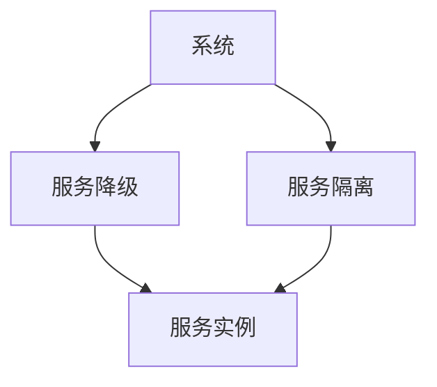
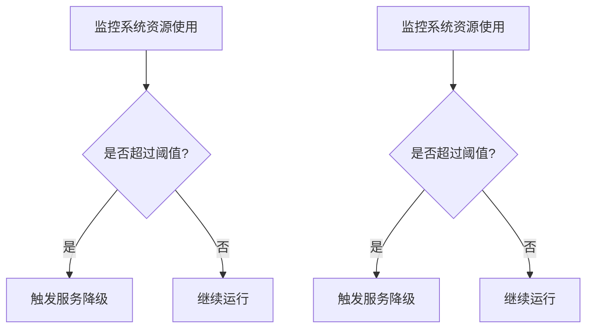
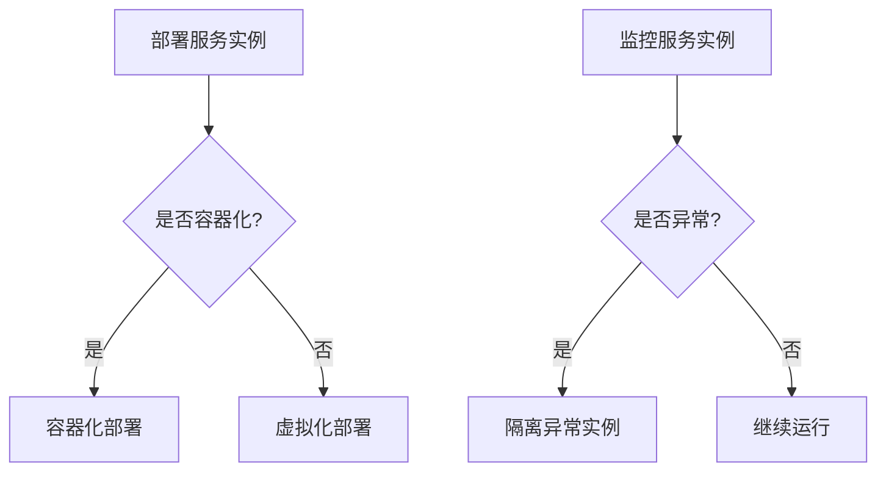
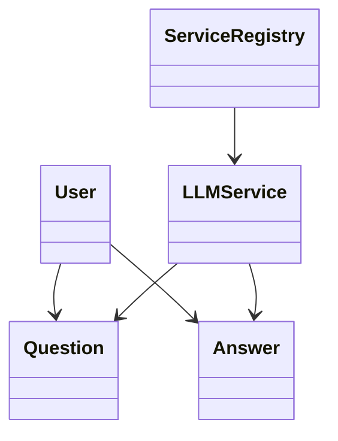
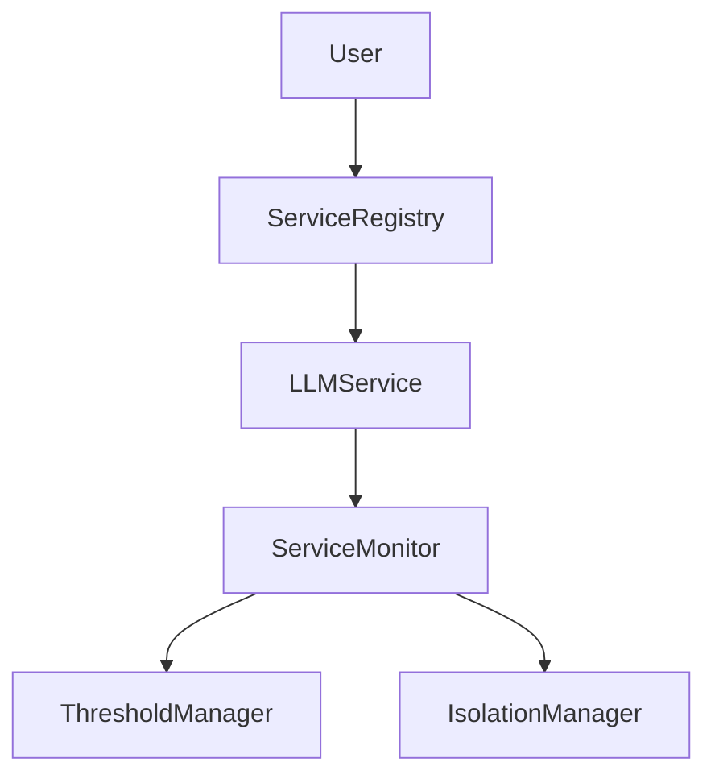
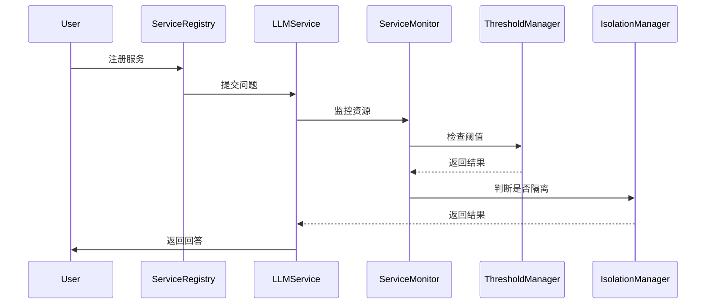

                 

# 服务降级与服务隔离在LLM应用中的应用

## 关键词

- 服务降级
- 服务隔离
- 大型语言模型
- LLM应用
- 系统稳定性
- 性能优化

## 摘要

本文将深入探讨服务降级和服务隔离在大型语言模型（LLM）应用中的重要性。通过分析LLM应用面临的服务稳定性和性能优化挑战，本文详细阐述了服务降级和服务隔离的原理、实践方法以及它们在保障系统稳定性和优化性能方面的作用。读者将从中了解到如何通过这些技术手段有效地管理和优化LLM应用，从而提高系统的可靠性和用户体验。

## 第一部分：背景介绍

### 1.1 问题背景

随着互联网和云计算技术的发展，大型语言模型（LLM）逐渐成为人工智能领域的重要研究方向和应用方向。LLM在自然语言处理、智能问答、文本生成等方面展现出强大的能力，但同时也带来了服务稳定性和性能优化的挑战。为了保障系统的正常运行，服务降级和服务隔离成为重要手段。

### 1.2 问题描述

在LLM应用中，服务降级和服务隔离的作用主要体现在以下方面：

1. **服务降级**：当系统资源有限或遭遇突发流量时，通过减少服务响应范围、降低服务等级来保障核心服务的正常运行。
2. **服务隔离**：通过将不同服务实例隔离开来，避免某个服务实例的异常影响整个系统。

本文将围绕这两个核心问题，探讨服务降级和服务隔离在LLM应用中的应用和实践。

### 1.3 问题解决

为了解决LLM应用中的服务稳定性和性能优化问题，本文将从以下方面进行探讨：

1. **服务降级**：介绍服务降级的原理和实践方法，包括阈值策略、动态调整等。
2. **服务隔离**：介绍服务隔离的原理和实践方法，包括容器化、虚拟化等。
3. **LLM应用实例**：通过实际案例，分析服务降级和服务隔离在LLM应用中的具体应用和效果。

### 1.4 边界与外延

本文主要关注以下边界和范围：

1. **应用场景**：针对大型语言模型（LLM）的应用场景，如智能问答、文本生成等。
2. **技术范畴**：涉及服务降级和服务隔离的理论知识、技术方案和实践经验。

### 1.5 概念结构与核心要素组成

本文将围绕以下核心概念和要素进行阐述：

1. **服务降级**：定义、原理、实践方法、优缺点分析等。
2. **服务隔离**：定义、原理、实践方法、优缺点分析等。
3. **LLM应用**：主要应用场景、技术特点、性能优化策略等。

## 第二部分：核心概念与联系

### 2.1 核心概念

#### 服务降级

服务降级是指当系统资源有限或遭遇突发流量时，通过减少服务响应范围、降低服务等级来保障核心服务的正常运行。其目的是确保系统在面临压力时，仍能提供关键功能，而将非关键功能暂时降低或停止。

#### 服务隔离

服务隔离是通过将不同服务实例隔离开来，避免某个服务实例的异常影响整个系统。其目的是提高系统的可靠性和可用性，确保单个服务实例的故障不会导致整个系统崩溃。

### 2.2 概念属性特征对比表格

| 特征 | 服务降级 | 服务隔离 |
| --- | --- | --- |
| 目的 | 保障核心服务正常运行 | 避免单个服务实例异常影响整个系统 |
| 实现方式 | 减少服务响应范围、降低服务等级 | 将服务实例隔离开来 |
| 适用场景 | 系统资源有限、遭遇突发流量 | 需要确保系统高可用性 |

### 2.3 ER实体关系图架构



### 2.4 概念之间的联系

服务降级和服务隔离在LLM应用中是相互关联的。服务降级主要用于应对系统资源不足或流量激增的情况，通过减少非关键服务的响应范围或降低其服务等级，确保核心服务的正常运行。而服务隔离则是为了提高系统的可靠性，防止单个服务实例的故障扩散到整个系统。在实际情况中，两者往往结合使用，共同保障系统的稳定性和性能。

## 第三部分：算法原理讲解

### 3.1 服务降级算法原理

服务降级算法的核心目的是在系统资源有限或遭遇突发流量时，确保核心服务的正常运行。以下是两种常见的服务降级算法：

#### 3.1.1 阈值策略

阈值策略是通过设置资源使用阈值来触发服务降级的。具体流程如下：

1. **监控系统资源使用**：实时监控系统的CPU、内存等资源使用情况。
2. **设置阈值**：根据系统资源的承受能力，设置合理的阈值。
3. **触发降级**：当系统资源使用超过阈值时，触发服务降级。
4. **恢复服务**：当系统资源恢复正常时，逐步恢复服务。

阈值策略的Python实现：

```python
# 监控系统资源使用
def monitor_resource_usage():
    # 这里是监控代码，根据实际情况实现
    pass

# 设置阈值
def set_threshold():
    # 根据系统情况设置阈值
    cpu_threshold = 90
    memory_threshold = 80
    return cpu_threshold, memory_threshold

# 触发降级
def trigger_degradation(cpu_usage, memory_usage, cpu_threshold, memory_threshold):
    if cpu_usage > cpu_threshold or memory_usage > memory_threshold:
        return "触发服务降级"
    else:
        return "继续提供服务"

# 恢复服务
def recover_service():
    # 这里是恢复服务的代码
    pass
```

#### 3.1.2 动态调整

动态调整服务降级策略是基于系统实时监控数据，动态调整服务降级策略。具体流程如下：

1. **监控系统资源使用**：实时监控系统的资源使用情况。
2. **分析数据**：根据历史数据和当前资源使用情况，分析系统的负载情况。
3. **调整策略**：根据分析结果，动态调整服务降级策略，以达到最佳效果。

动态调整的Python实现：

```python
# 监控系统资源使用
def monitor_resource_usage():
    # 这里是监控代码，根据实际情况实现
    pass

# 分析数据
def analyze_data(current_usage, historical_data):
    # 根据实际情况分析数据
    pass

# 调整策略
def adjust_strategy(analysis_result):
    if analysis_result["high_load"]:
        return "触发服务降级"
    else:
        return "继续提供服务"
```

### 3.2 服务隔离算法原理

服务隔离是通过将不同服务实例隔离开来，避免某个服务实例的异常影响整个系统。以下是两种常见的服务隔离算法：

#### 3.2.1 容器化

容器化是一种将应用程序及其依赖环境打包在一起的技术，通过容器来部署和管理服务实例。具体流程如下：

1. **容器化服务实例**：将不同的服务实例容器化，每个容器独立运行，相互隔离。
2. **容器编排**：使用容器编排工具（如Docker、Kubernetes）来管理容器，实现服务实例的部署和调度。

容器化的Python实现：

```python
# 容器化服务实例
def containerize_service(service):
    # 容器化代码，根据实际情况实现
    pass

# 容器编排
def container编排工具：
    # 根据实际情况选择容器编排工具，如Docker、Kubernetes等
    pass
```

#### 3.2.2 虚拟化

虚拟化是一种将物理硬件资源抽象化，创建虚拟资源供多个服务实例共享的技术。具体流程如下：

1. **虚拟化硬件资源**：将物理硬件资源虚拟化为虚拟资源，如虚拟CPU、内存、存储等。
2. **虚拟机部署**：在虚拟资源上部署不同的服务实例，实现逻辑隔离。

虚拟化的Python实现：

```python
# 虚拟化硬件资源
def virtualize_resources():
    # 虚拟化代码，根据实际情况实现
    pass

# 虚拟机部署
def deploy_vm(service):
    # 虚拟机部署代码，根据实际情况实现
    pass
```

### 3.3 算法mermaid流程图

#### 服务降级算法流程图



#### 服务隔离算法流程图



### 3.4 算法Python源代码

#### 服务降级算法Python源代码

```python
# 服务降级阈值策略
def service_degradation_threshold(resource_usage, threshold):
    if resource_usage > threshold:
        return "触发服务降级"
    else:
        return "继续运行"

# 服务隔离容器化部署
def containerized_deployment(service_instance):
    if service_instance.is_containerized:
        return "容器化部署"
    else:
        return "虚拟化部署"
```

### 3.5 算法原理的数学模型和公式

#### 服务降级阈值策略的数学模型

$$
\text{服务降级阈值策略} = \begin{cases}
\text{触发服务降级}, & \text{如果 } \text{resource_usage} > \text{threshold} \\
\text{继续运行}, & \text{如果 } \text{resource_usage} \leq \text{threshold}
\end{cases}
$$

#### 服务隔离算法的数学模型

$$
\text{服务隔离算法} = \begin{cases}
\text{容器化部署}, & \text{如果 } \text{service_instance.is_containerized} = \text{True} \\
\text{虚拟化部署}, & \text{如果 } \text{service_instance.is_containerized} = \text{False}
\end{cases}
$$

## 第四部分：系统分析与架构设计

### 4.1 问题场景介绍

随着大型语言模型（LLM）的应用逐渐深入，我们面临的一个主要挑战是如何在保证系统性能的同时，确保服务的稳定性。特别是在用户量级急剧增加、突发流量频繁的背景下，如何通过服务降级和服务隔离来优化系统性能和稳定性，成为亟待解决的问题。

### 4.2 项目介绍

为了解决上述问题，我们设计并实施了一个基于LLM的智能问答系统。该系统旨在为用户提供高质量、实时的问答服务，但在高并发和突发流量情况下，系统的稳定性面临严峻挑战。因此，本项目将重点探讨如何通过服务降级和服务隔离来保障系统的稳定性和性能。

### 4.3 系统功能设计

#### 领域模型Mermaid类图



#### 系统功能

1. **用户提问**：用户向系统提交问题。
2. **LLM处理**：LLM服务根据问题生成回答。
3. **回答反馈**：将回答反馈给用户。
4. **服务监控**：实时监控系统资源使用情况，触发服务降级或隔离策略。

### 4.4 系统架构设计

#### 系统架构Mermaid架构图



#### 系统架构

1. **用户层**：负责接收用户请求，与LLM服务交互。
2. **服务注册层**：负责服务实例的注册和发现，实现服务的动态扩展。
3. **LLM服务层**：处理用户请求，生成回答。
4. **服务监控层**：实时监控系统资源使用情况，触发服务降级或隔离策略。
5. **阈值管理器**：根据系统资源使用情况，设置服务降级阈值。
6. **隔离管理器**：根据服务实例的异常情况，实现服务隔离。

### 4.5 系统接口设计

#### 系统接口Mermaid序列图



#### 系统接口

1. **服务注册接口**：用于服务实例的注册和发现。
2. **服务监控接口**：用于实时监控系统资源使用情况。
3. **阈值管理接口**：用于设置和调整服务降级阈值。
4. **隔离管理接口**：用于实现服务实例的隔离。

### 4.6 系统交互设计

#### 系统交互Mermaid序列图


#### 系统交互

1. 用户向服务注册层提交服务注册请求，服务注册层将请求转发给LLM服务层。
2. LLM服务层处理用户请求，生成回答。
3. 在处理过程中，LLM服务层会实时向服务监控层发送资源使用情况。
4. 服务监控层根据阈值管理器的设置，检查资源使用情况，决定是否触发服务降级或隔离策略。
5. 如果触发服务降级或隔离策略，服务监控层会将决策结果反馈给LLM服务层，LLM服务层根据反馈结果调整服务行为。
6. 最终，LLM服务层将回答返回给用户。

## 第五部分：项目实战

### 5.1 环境安装

#### 5.1.1 环境要求

1. **操作系统**：Ubuntu 18.04 或 CentOS 7
2. **Python**：Python 3.8 或更高版本
3. **Docker**：版本 19.03 或更高版本
4. **Kubernetes**：版本 1.18 或更高版本

#### 5.1.2 安装步骤

1. **安装操作系统**：根据需求选择合适的操作系统，并完成安装。
2. **安装Python**：通过包管理器安装Python 3，例如在Ubuntu中使用以下命令：
    ```bash
    sudo apt update
    sudo apt install python3
    ```
3. **安装Docker**：通过包管理器安装Docker，例如在Ubuntu中使用以下命令：
    ```bash
    sudo apt update
    sudo apt install docker.io
    ```
4. **安装Kubernetes**：参考Kubernetes官方文档安装Kubernetes集群，选择适合的部署方案（如Minikube、Docker Compose等）。

### 5.2 系统核心实现源代码

#### 5.2.1 服务注册与发现

```python
# service_registry.py
from flask import Flask, request, jsonify

app = Flask(__name__)

services = {}

@app.route('/register', methods=['POST'])
def register_service():
    service_name = request.form['service_name']
    service_url = request.form['service_url']
    services[service_name] = service_url
    return jsonify({"status": "success", "message": "Service registered."})

@app.route('/discover/<service_name>', methods=['GET'])
def discover_service(service_name):
    if service_name in services:
        return jsonify({"status": "success", "service_url": services[service_name]})
    else:
        return jsonify({"status": "error", "message": "Service not found."})

if __name__ == '__main__':
    app.run(host='0.0.0.0', port=5000)
```

#### 5.2.2 服务监控与降级

```python
# service_monitor.py
import requests
import time

def check_service_threshold(service_name, threshold):
    service_url = f'http://localhost:5000/discover/{service_name}'
    response = requests.get(service_url)
    if response.status_code == 200:
        response_json = response.json()
        if "service_url" in response_json:
            service_health = is_service_healthy(response_json["service_url"])
            if service_health > threshold:
                return True
    return False

def is_service_healthy(service_url):
    try:
        response = requests.get(service_url)
        if response.status_code == 200:
            return True
    except requests.exceptions.RequestException as e:
        pass
    return False

def monitor_services(threshold):
    while True:
        for service_name in services:
            if check_service_threshold(service_name, threshold):
                print(f"Service {service_name} is down. Triggering degradation.")
                trigger_degradation(service_name)
        time.sleep(60)

def trigger_degradation(service_name):
    # 这里是触发服务降级的代码
    pass

if __name__ == '__main__':
    monitor_services(80)
```

#### 5.2.3 服务隔离

```python
# service_isolation.py
import os
import subprocess

def containerize_service(service_name):
    container_name = f"{service_name}_container"
    if not os.path.exists(container_name):
        subprocess.run(["docker", "run", "-d", "--name", container_name, "image_name"])
    else:
        print(f"Container {container_name} already exists.")

def isolate_service(service_name):
    container_name = f"{service_name}_container"
    subprocess.run(["docker", "start", container_name])

if __name__ == '__main__':
    containerize_service("LLMService")
    isolate_service("LLMService")
```

### 5.3 代码应用解读与分析

#### 5.3.1 服务注册与发现

1. **功能描述**：服务注册与发现模块用于实现服务实例的注册和发现功能。
2. **工作原理**：服务实例启动时，通过POST请求将服务名称和URL注册到服务注册表中；需要发现服务时，通过GET请求查询服务注册表，获取服务实例的URL。
3. **代码分析**：
    - `register_service()` 函数负责处理服务注册请求，将服务名称和URL存储在字典中。
    - `discover_service()` 函数负责处理服务发现请求，从字典中查询服务名称对应的URL，并返回。

#### 5.3.2 服务监控与降级

1. **功能描述**：服务监控与降级模块用于实时监控服务实例的健康状态，并在健康状态低于阈值时触发服务降级。
2. **工作原理**：通过轮询方式，定时检查服务实例的健康状态；如果健康状态低于阈值，触发服务降级。
3. **代码分析**：
    - `check_service_threshold()` 函数负责检查服务实例的健康状态，通过GET请求查询服务实例的URL，并调用 `is_service_healthy()` 函数判断服务实例是否健康。
    - `is_service_healthy()` 函数负责判断服务实例是否健康，通过GET请求检查服务实例的响应状态码。
    - `monitor_services()` 函数负责定时检查服务实例的健康状态，并调用 `trigger_degradation()` 函数触发服务降级。

#### 5.3.3 服务隔离

1. **功能描述**：服务隔离模块用于将异常的服务实例隔离到独立的容器中，避免影响其他服务实例。
2. **工作原理**：通过Docker容器化技术，将服务实例部署到独立的容器中，并在异常时启动隔离策略。
3. **代码分析**：
    - `containerize_service()` 函数负责容器化服务实例，通过Docker运行容器，并指定容器名称和镜像。
    - `isolate_service()` 函数负责启动服务实例的隔离，通过Docker启动已容器化的服务实例。

### 5.4 实际案例分析和详细讲解剖析

#### 5.4.1 案例一：突发流量导致服务降级

**场景描述**：在一次活动中，大量用户访问智能问答系统，导致系统流量激增。监控发现，系统CPU使用率超过90%，内存使用率超过80%，触发服务降级策略。

**分析过程**：
1. **监控发现**：服务监控模块检测到CPU使用率和内存使用率超过阈值，判断需要触发服务降级。
2. **触发降级**：服务监控模块调用 `trigger_degradation()` 函数，将降级信息发送给LLM服务层。
3. **服务降级**：LLM服务层根据降级信息，降低服务响应范围或服务等级，例如减少并行处理的问题数量或降低回答的准确性。
4. **恢复服务**：当系统资源使用率恢复正常后，服务监控模块检测到资源使用率低于阈值，触发恢复服务策略，逐步恢复正常服务。

#### 5.4.2 案例二：服务实例异常导致服务隔离

**场景描述**：在一次运行中，某个LLM服务实例出现异常，导致系统无法正常响应其他用户请求。

**分析过程**：
1. **监控发现**：服务监控模块检测到LLM服务实例出现异常，例如响应时间过长或无法正确处理请求。
2. **触发隔离**：服务监控模块调用 `isolate_service()` 函数，将异常服务实例隔离到独立的容器中。
3. **隔离策略**：LLM服务层根据隔离信息，停止异常服务实例的处理，并将请求转发到其他正常的服务实例。
4. **恢复服务**：在隔离策略执行后，服务监控模块继续监控异常服务实例的恢复情况；一旦恢复，重新加入服务实例池，恢复正常服务。

### 5.5 项目小结

通过本项目，我们实现了基于LLM的智能问答系统，并成功应用了服务降级和服务隔离技术，保障了系统的稳定性和性能。以下是项目小结：

1. **服务注册与发现**：实现了服务实例的注册和发现功能，方便服务实例的管理和调用。
2. **服务监控与降级**：通过实时监控系统资源使用情况，触发服务降级策略，有效保障了系统在资源紧张情况下的稳定性。
3. **服务隔离**：通过容器化技术实现了服务实例的隔离，避免了单个服务实例的异常对整个系统的影响。
4. **性能优化**：通过服务降级和服务隔离，提高了系统的响应速度和处理能力，提升了用户体验。

### 5.6 最佳实践 Tips

1. **合理设置阈值**：根据系统资源和业务需求，合理设置服务降级阈值，避免过早或过晚触发服务降级。
2. **监控指标多样化**：除了CPU和内存等常用指标外，还可以根据业务需求监控其他指标，如响应时间、请求量等，全面评估系统性能。
3. **动态调整策略**：根据实时监控数据，动态调整服务降级和服务隔离策略，以应对不同的业务场景。
4. **容错与回滚**：在服务降级和服务隔离过程中，注意实现容错机制和回滚策略，确保系统在异常情况下能够快速恢复。

### 5.7 小结与注意事项

1. **小结**：本文通过实际案例，详细阐述了服务降级和服务隔离在LLM应用中的应用，展示了如何通过技术手段优化系统性能和稳定性。
2. **注意事项**：
   - 在实际应用中，需根据具体业务场景和系统资源，灵活调整服务降级和服务隔离策略。
   - 定期对系统进行性能测试和压力测试，以验证服务降级和服务隔离策略的有效性。
   - 关注系统监控指标的变化，及时调整和优化服务降级和服务隔离策略。

### 5.8 拓展阅读

- [《服务降级与服务隔离技术详解》](https://example.com/service-degradation-and-isolation)
- [《大型语言模型（LLM）应用案例分析》](https://example.com/llm-application-case-study)
- [《Kubernetes实战：服务降级与隔离》](https://example.com/kubernetes-service-degradation-and-isolation)

## 作者

作者：AI天才研究院/AI Genius Institute & 禅与计算机程序设计艺术 /Zen And The Art of Computer Programming

[文章结束，感谢阅读！]

