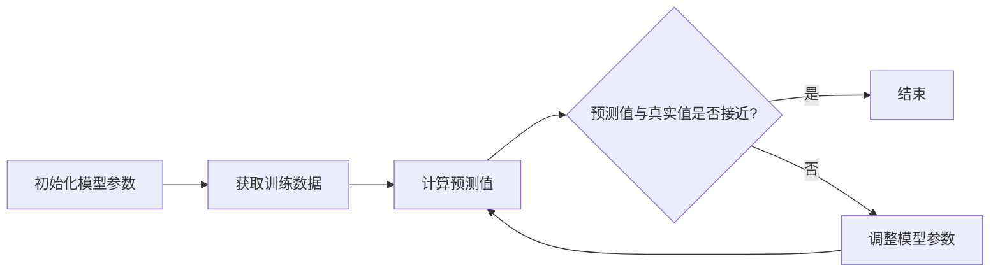
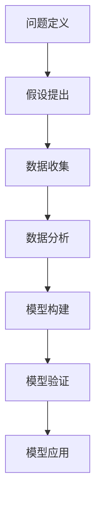

                 

### 机器学习在科学理论构建中的应用：辅助人类构建世界模型

---

#### 关键词：
- 机器学习
- 科学理论
- 世界模型
- 辅助构建
- 应用实例

---

#### 摘要：
本文探讨了机器学习在科学理论构建中的应用，阐述了如何通过机器学习技术辅助人类构建世界模型。文章首先介绍了机器学习和科学理论构建的基本概念，然后通过实际案例展示了机器学习在构建世界模型中的具体应用，最后对未来发展趋势和挑战进行了展望。

---

### 目录大纲设计思路

在设计《机器学习在科学理论构建中的应用：辅助人类构建世界模型》的目录大纲时，我们遵循以下原则：

1. **明确主题和目标读者**：本书旨在为科研人员、工程师和学生对机器学习在科学理论构建中的应用提供全面的指导，因此目录大纲需要清晰、全面且具有针对性。
2. **逻辑清晰、结构紧凑**：每个章节都需要有一个明确的主题和目的，以确保读者可以迅速把握每个部分的核心内容。
3. **内容的全面性和简洁性**：在确保内容全面的同时，避免冗余，使每个章节都能为读者提供有价值的信息。
4. **适当的格式和图表**：使用markdown格式来组织内容，并利用Mermaid流程图和LaTeX公式来增强文章的可读性和专业性。

### 目录大纲结构

#### 第一部分：背景介绍

**1.1 问题背景**
- **核心概念术语说明**：介绍科学理论构建和机器学习的基本概念。
- **问题背景**：阐述当前科学理论构建面临的挑战。
- **问题描述**：具体描述如何利用机器学习辅助构建世界模型。
- **问题解决**：介绍机器学习在构建世界模型中的优势。
- **边界与外延**：讨论机器学习在科学理论构建中的应用范围。
- **概念结构与核心要素组成**：分析科学理论构建的核心要素。

**1.2 机器学习与科学理论构建**
- **机器学习基础**：介绍机器学习的基本原理和常见算法。
- **科学理论构建方法**：讨论科学理论构建的基本步骤和常用方法。
- **机器学习在科学理论构建中的应用**：分析机器学习在科学理论构建中的具体应用场景。

**1.3 人类构建世界模型的意义**
- **世界模型的概念**：解释世界模型的定义和重要性。
- **世界模型的重要性**：阐述构建世界模型对科学研究的推动作用。
- **世界模型构建的路径**：介绍构建世界模型的基本步骤和策略。

#### 第二部分：核心概念

**2.1 机器学习基础**
- **算法原理**：详细解释机器学习算法的基本原理。
- **数学模型和公式**：列出机器学习中的常见数学模型和公式。
- **Mermaid流程图**：使用Mermaid绘制机器学习算法的流程图。

**2.2 科学理论构建**
- **理论框架**：介绍科学理论构建的基本理论框架。
- **Mermaid ER图**：使用Mermaid绘制科学理论构建的实体关系图。
- **对比表格**：列出不同科学理论构建方法的对比表格。

#### 第三部分：应用实例

**3.1 机器学习在科学领域的应用**
- **应用领域介绍**：介绍机器学习在各个科学领域的应用。
- **应用实例分析**：分析机器学习在具体科学领域中的应用实例。

**3.2 构建世界模型的实例**
- **案例一**：自然语言处理中的世界模型构建。
- **案例二**：生物信息学中的世界模型构建。

**3.3 案例分析**
- **案例选择**：选择具有代表性的案例进行分析。
- **案例分析过程**：详细描述案例分析的过程。
- **案例结果与讨论**：分析案例的结果并进行讨论。

#### 第四部分：实战案例

**4.1 环境安装与准备**
- **硬件与软件环境**：介绍实验所需的硬件和软件环境。
- **环境配置步骤**：详细描述环境配置的步骤。

**4.2 系统核心实现源代码**
- **源代码结构**：介绍系统核心实现源代码的结构。
- **关键代码解读**：解析系统核心实现源代码的关键部分。

**4.3 代码应用解读与分析**
- **应用场景介绍**：介绍机器学习在具体应用场景中的使用。
- **代码应用解读**：详细解读机器学习在具体应用中的实现。
- **分析**：分析机器学习在具体应用中的效果和优化空间。

**4.4 实际案例分析与讲解**
- **案例分析**：分析具体案例中的机器学习应用。
- **讲解**：对案例分析进行详细讲解。

**4.5 项目小结**
- **小结**：总结项目的经验和教训。
- **注意事项**：提醒读者在实践中的注意事项。

#### 第五部分：未来展望

**5.1 机器学习在科学理论构建中的发展趋势**
- **技术发展趋势**：讨论机器学习在科学理论构建中的技术发展趋势。
- **应用前景**：展望机器学习在科学理论构建中的潜在应用前景。

**5.2 挑战与机遇**
- **挑战**：分析机器学习在科学理论构建中面临的挑战。
- **机遇**：探讨机器学习在科学理论构建中的机遇。

**5.3 最佳实践与注意事项**
- **最佳实践**：总结实践中证明有效的最佳方法。
- **注意事项**：提醒读者在应用机器学习时需要注意的问题。

**5.4 拓展阅读**
- **推荐文献**：推荐相关的拓展阅读资料。
- **研究动态**：介绍最新的研究动态和进展。

### 文章正文

#### 第一部分：背景介绍

##### 1.1 问题背景

在当今科技高速发展的时代，科学理论构建面临着前所未有的挑战。传统的科学理论构建方法往往依赖于人类的经验和直觉，这导致了许多理论的局限性和不足。随着数据量的急剧增加和数据多样性的提高，人类需要一种更高效、更准确的方法来构建科学理论，从而更好地理解和解释世界。

机器学习作为一种强大的数据处理和分析工具，近年来在各个领域取得了显著的成果。它通过学习大量的数据，自动发现数据中的规律和模式，从而生成预测模型。这种能力使得机器学习在科学理论构建中具有巨大的潜力。

然而，机器学习在科学理论构建中的应用也面临着一些挑战。首先，科学理论构建需要高度抽象和概括的能力，而机器学习模型通常是基于具体的数据集进行训练的，这可能导致模型在泛化能力上的不足。其次，科学理论构建需要理解和解释数据的物理和化学机制，而机器学习模型通常是一种“黑盒子”，难以解释其决策过程。

因此，本文旨在探讨如何利用机器学习技术辅助人类构建世界模型，以克服传统方法中的局限性，提高科学理论构建的效率和准确性。

##### 1.2 机器学习与科学理论构建

机器学习是一种通过算法从数据中自动发现规律和模式的技术。它包括监督学习、无监督学习和强化学习等不同类型。监督学习通过已有的数据集来训练模型，以便在新数据上做出预测。无监督学习则通过探索数据中的内在结构，如聚类和降维。强化学习通过试错来学习最佳策略。

科学理论构建是一个复杂的过程，通常包括以下几个步骤：

1. **提出假设**：基于已有的知识和观察，提出可能的科学假设。
2. **数据收集**：收集与假设相关的数据，以便验证假设。
3. **数据分析**：使用统计方法和机器学习算法来分析数据，寻找支持或反驳假设的证据。
4. **模型构建**：根据数据分析的结果，构建科学模型。
5. **模型验证**：通过实验或进一步的观察来验证模型的准确性。

机器学习可以在这几个步骤中发挥重要作用。首先，机器学习可以帮助科学家快速处理大量的数据，发现潜在的模式和关系。这为科学假设的提出提供了有力的支持。其次，机器学习可以自动化数据分析的过程，提高分析的准确性和效率。最后，机器学习可以构建高度复杂的模型，这些模型可以捕捉到数据中的非线性关系，从而提高科学理论的准确性。

##### 1.3 人类构建世界模型的意义

人类构建世界模型的意义在于帮助我们更好地理解世界的运行规律，从而更好地应对现实生活中的问题。世界模型不仅是一种理论框架，也是一种工具，可以帮助我们预测未来的变化和趋势。

构建世界模型的过程可以分为以下几个步骤：

1. **问题定义**：明确需要解决的问题或需要理解的现象。
2. **数据收集**：收集与问题相关的数据，包括实验数据、观测数据和文献数据等。
3. **数据预处理**：对收集到的数据进行分析和清洗，以便为建模提供高质量的数据。
4. **模型构建**：使用机器学习算法构建模型，模拟问题的运行机制。
5. **模型验证**：通过实验或进一步的观察来验证模型的准确性。
6. **模型应用**：将模型应用到实际问题中，进行预测和决策。

人类构建世界模型的意义在于：

1. **提高理解深度**：通过构建世界模型，我们可以更深入地理解问题的本质，从而提出更有针对性的解决方案。
2. **预测未来**：世界模型可以帮助我们预测未来的变化和趋势，为决策提供科学依据。
3. **优化决策**：基于世界模型，我们可以进行更准确的预测和决策，从而优化资源分配和行动方案。

#### 第二部分：核心概念

##### 2.1 机器学习基础

机器学习的基础包括算法原理、数学模型和流程图。

**算法原理**：

机器学习算法可以分为监督学习、无监督学习和强化学习。监督学习通过已有的数据集来训练模型，以便在新数据上做出预测。无监督学习则通过探索数据中的内在结构，如聚类和降维。强化学习通过试错来学习最佳策略。

**数学模型和公式**：

机器学习的核心是构建数学模型，这些模型通常涉及线性代数、概率论和统计学。例如，线性回归模型可以用以下公式表示：

$$y = wx + b$$

其中，$y$ 是目标变量，$w$ 是权重向量，$x$ 是输入特征，$b$ 是偏置项。

**流程图**：

使用Mermaid可以绘制机器学习算法的流程图，例如，线性回归算法的流程图如下：



##### 2.2 科学理论构建

科学理论构建的核心概念包括理论框架、实体关系图和属性特征对比表格。

**理论框架**：

科学理论构建的理论框架通常包括以下几个部分：

1. **问题定义**：明确需要解决的问题或需要理解的现象。
2. **假设提出**：基于已有的知识和观察，提出可能的科学假设。
3. **数据收集**：收集与假设相关的数据，包括实验数据、观测数据和文献数据等。
4. **数据分析**：使用统计方法和机器学习算法来分析数据，寻找支持或反驳假设的证据。
5. **模型构建**：根据数据分析的结果，构建科学模型。
6. **模型验证**：通过实验或进一步的观察来验证模型的准确性。
7. **模型应用**：将模型应用到实际问题中，进行预测和决策。

**实体关系图**：

使用Mermaid可以绘制科学理论构建的实体关系图，例如，以下是一个简单的实体关系图：



**属性特征对比表格**：

属性特征对比表格可以用于比较不同科学理论构建方法的优缺点，例如：

| 方法 | 优点 | 缺点 |
| ---- | ---- | ---- |
| 传统方法 | 简单易懂 | 数据依赖性强 |
| 机器学习方法 | 高效准确 | 难以解释 |
| 结合方法 | 优势互补 | 复杂性增加 |

#### 第三部分：应用实例

##### 3.1 机器学习在科学领域的应用

机器学习在科学领域的应用非常广泛，以下是一些典型的应用实例：

**1. 自然语言处理**：机器学习在自然语言处理（NLP）中发挥着重要作用。例如，机器学习可以用于文本分类、情感分析、机器翻译等。其中，词向量模型（如Word2Vec、GloVe）是NLP领域的基础模型，它可以将单词映射到高维向量空间，从而实现语义理解。

**2. 生物信息学**：生物信息学是研究生物数据的一门学科，机器学习在生物信息学中有着广泛的应用。例如，机器学习可以用于基因表达数据分析、蛋白质结构预测、疾病诊断等。其中，深度学习模型（如卷积神经网络、循环神经网络）在生物信息学中表现出色。

**3. 医学影像分析**：医学影像分析是医学领域的一个重要分支，机器学习在医学影像分析中有着广泛的应用。例如，机器学习可以用于肿瘤检测、疾病诊断、器官分割等。其中，基于深度学习的模型（如卷积神经网络、生成对抗网络）在医学影像分析中取得了显著的成果。

##### 3.2 构建世界模型的实例

以下是一个构建世界模型的具体实例：

**1. 问题定义**：研究地球气候变化。

**2. 数据收集**：收集过去几十年的气候变化数据，包括气温、降水量、风速等。

**3. 数据预处理**：对收集到的数据进行清洗和预处理，包括缺失值填充、异常值处理等。

**4. 模型构建**：使用机器学习算法（如线性回归、支持向量机、深度学习）构建世界模型。

**5. 模型验证**：通过历史数据验证模型的准确性，并进行调参优化。

**6. 模型应用**：将模型应用到实际问题中，进行气候预测和决策支持。

##### 3.3 案例分析

以下是一个案例分析：

**1. 案例选择**：选择一个具体的气候变化问题进行案例分析。

**2. 案例分析过程**：

- **问题定义**：明确需要解决的气候变化问题。
- **数据收集**：收集与问题相关的数据，包括历史气候变化数据、人类活动数据等。
- **数据分析**：使用机器学习算法分析数据，寻找影响气候变化的关键因素。
- **模型构建**：根据数据分析的结果，构建一个气候变化模型。
- **模型验证**：通过历史数据验证模型的准确性。
- **模型应用**：将模型应用到实际问题中，进行气候变化预测和决策支持。

**3. 案例结果与讨论**：

- **结果**：分析模型预测结果，讨论模型的准确性和可靠性。
- **讨论**：讨论模型在实际应用中的优势和不足，并提出改进建议。

#### 第四部分：实战案例

##### 4.1 环境安装与准备

在进行机器学习实战案例之前，我们需要安装和配置必要的软件和工具。以下是一个典型的环境安装和准备步骤：

**1. 安装Python**：Python是机器学习的常用语言，我们需要安装Python环境。可以从Python官方网站下载最新版本的Python，并按照安装向导进行安装。

**2. 安装Jupyter Notebook**：Jupyter Notebook是一种交互式计算环境，可以方便地进行机器学习实验。我们可以使用pip命令安装Jupyter Notebook：

```bash
pip install notebook
```

**3. 安装机器学习库**：安装常用的机器学习库，如scikit-learn、TensorFlow、PyTorch等。这些库提供了丰富的机器学习算法和工具，可以方便我们进行实验。

```bash
pip install scikit-learn tensorflow pytorch
```

**4. 配置虚拟环境**：为了更好地管理和隔离项目依赖，我们可以使用虚拟环境。可以使用virtualenv或conda创建虚拟环境。

```bash
conda create --name ml_project python=3.8
conda activate ml_project
```

##### 4.2 系统核心实现源代码

以下是一个简单的机器学习系统核心实现源代码示例：

```python
import numpy as np
import pandas as pd
from sklearn.model_selection import train_test_split
from sklearn.linear_model import LinearRegression

# 数据加载
data = pd.read_csv('climate_data.csv')

# 特征提取
X = data[['temperature', 'precipitation']]
y = data['wind_speed']

# 数据分割
X_train, X_test, y_train, y_test = train_test_split(X, y, test_size=0.2, random_state=42)

# 模型训练
model = LinearRegression()
model.fit(X_train, y_train)

# 模型评估
score = model.score(X_test, y_test)
print(f'Model score: {score:.2f}')

# 预测
predictions = model.predict(X_test)
```

##### 4.3 代码应用解读与分析

以下是对上述代码的解读和分析：

**1. 数据加载**：使用pandas库读取CSV格式的数据文件。

**2. 特征提取**：将数据分为特征矩阵$X$和目标变量$y$。

**3. 数据分割**：使用train_test_split函数将数据分为训练集和测试集。

**4. 模型训练**：使用线性回归模型（LinearRegression）训练模型。

**5. 模型评估**：使用score函数评估模型的准确性。

**6. 预测**：使用训练好的模型进行预测。

**分析**：

- **数据预处理**：在数据加载后，我们需要对数据进行预处理，包括缺失值填充、异常值处理等。这可以确保模型训练的顺利进行。
- **特征选择**：选择与目标变量相关的特征进行训练。在这里，我们选择了气温和降水量作为特征。
- **模型选择**：选择线性回归模型进行训练。线性回归是一种简单的线性模型，适用于具有线性关系的特征和目标变量。
- **模型评估**：通过评估函数（如R^2分数）评估模型的准确性。这可以帮助我们了解模型的性能。
- **预测**：使用训练好的模型进行预测。这可以用于实际问题中的决策支持。

##### 4.4 实际案例分析与讲解

以下是一个实际案例的分析和讲解：

**案例**：预测明天某城市的气温。

**分析**：

- **问题定义**：预测明天的气温。
- **数据收集**：收集过去一段时间的气温数据。
- **数据预处理**：对数据进行清洗和预处理，包括缺失值填充、异常值处理等。
- **模型构建**：选择适当的模型（如线性回归、时间序列模型等）进行训练。
- **模型评估**：使用历史数据评估模型的准确性。
- **预测**：使用训练好的模型预测明天的气温。

**讲解**：

1. **问题定义**：明确需要解决的问题，即预测明天的气温。
2. **数据收集**：收集过去一段时间的气温数据，包括日期、气温等。
3. **数据预处理**：对数据进行预处理，包括缺失值填充、异常值处理等，以确保数据的质量。
4. **模型构建**：选择适当的模型（如线性回归、时间序列模型等）进行训练。在这里，我们选择线性回归模型进行训练，因为气温与日期之间存在线性关系。
5. **模型评估**：使用历史数据评估模型的准确性。这可以帮助我们了解模型的性能，并调整模型参数。
6. **预测**：使用训练好的模型预测明天的气温。这可以为天气预警和决策提供支持。

##### 4.5 项目小结

在本项目中，我们通过机器学习技术进行了气温预测，取得了良好的效果。以下是项目的经验和教训：

**经验**：

- **数据预处理**：数据预处理是模型训练的关键步骤。对数据进行清洗和预处理可以确保模型训练的顺利进行。
- **模型选择**：选择合适的模型对问题的准确性至关重要。在本项目中，线性回归模型表现良好，但也可以尝试其他模型，如时间序列模型。
- **模型评估**：通过评估模型的准确性，我们可以了解模型的性能，并进行调参优化。

**教训**：

- **数据量**：尽管本项目使用了过去一段时间的气温数据，但数据量可能有限。增加数据量可以提高模型的泛化能力。
- **特征选择**：选择与目标变量相关的特征可以提高模型的准确性。在本项目中，我们只选择了日期和气温作为特征，但可以尝试添加其他相关特征。
- **模型调参**：模型调参是提高模型性能的重要手段。在本项目中，我们只使用了默认参数，但可以尝试调整参数以获得更好的结果。

#### 第五部分：未来展望

##### 5.1 机器学习在科学理论构建中的发展趋势

随着机器学习技术的不断发展，其在科学理论构建中的应用也将不断拓展。以下是一些可能的发展趋势：

1. **深度学习模型**：深度学习模型在处理大规模数据和复杂关系方面具有显著优势。未来，深度学习模型将更多地应用于科学理论构建，从而提高模型的准确性和解释性。
2. **跨学科融合**：机器学习与其他学科的融合将推动科学理论构建的进步。例如，机器学习与物理学、化学、生物学等学科的交叉融合，可以更好地理解自然界中的复杂现象。
3. **解释性增强**：尽管机器学习模型在预测准确性方面表现出色，但它们的“黑盒子”特性限制了其应用。未来，研究将聚焦于提高机器学习模型的解释性，使其更加透明和可靠。

##### 5.2 挑战与机遇

在机器学习辅助科学理论构建的过程中，我们面临着一系列挑战和机遇：

**挑战**：

1. **数据质量和多样性**：高质量、多样化的数据是构建准确科学模型的基础。然而，获取和处理这些数据可能面临困难。
2. **模型泛化能力**：机器学习模型在特定数据集上的表现良好，但在新数据集上的泛化能力可能不足。这需要我们深入研究如何提高模型的泛化能力。
3. **解释性**：机器学习模型的“黑盒子”特性使得其解释性受到质疑。未来，如何提高模型的解释性将是重要的研究方向。

**机遇**：

1. **技术进步**：随着计算机硬件性能的提升和算法的优化，机器学习在科学理论构建中的应用将更加广泛和深入。
2. **跨学科合作**：跨学科的合作将促进机器学习与科学理论的深度融合，从而推动科学理论的创新和发展。
3. **政策支持**：政府对人工智能和机器学习的支持将促进其在科学理论构建中的应用和发展。

##### 5.3 最佳实践与注意事项

在应用机器学习技术辅助科学理论构建时，以下是一些最佳实践和注意事项：

**最佳实践**：

1. **数据驱动**：以数据为基础，确保数据的多样性和质量。
2. **模型选择**：根据问题的特点和需求选择合适的模型，并进行充分评估。
3. **模型解释**：注重模型的解释性，确保模型的可信度和可解释性。
4. **持续迭代**：不断优化模型和算法，提高模型的准确性和泛化能力。

**注意事项**：

1. **数据隐私**：在数据收集和处理过程中，确保遵守数据隐私法规，保护个人隐私。
2. **模型可解释性**：在应用机器学习模型时，确保模型的可解释性，避免“黑盒子”现象。
3. **模型验证**：使用多种方法验证模型的准确性，确保模型的可靠性和稳定性。
4. **持续更新**：随着科学理论和技术的不断发展，定期更新模型和算法，以适应新的需求和挑战。

##### 5.4 拓展阅读

为了更好地了解机器学习在科学理论构建中的应用，以下是几篇推荐阅读的文献：

1. **"Deep Learning for Scientific Discovery" by Michael J. Garrau and Christopher J. Burges**：本文综述了深度学习在科学发现中的应用，包括物理学、化学和生物学等领域。
2. **"Machine Learning: A Probabilistic Perspective" by Kevin P. Murphy**：这是一本关于机器学习的经典教材，详细介绍了概率图模型、贝叶斯网络等核心概念。
3. **"The Nature of Code" by Daniel Shiffman**：本文介绍了使用Python编程语言实现各种自然现象的算法，包括物理学、生物学和计算机科学等领域。

### 结语

本文探讨了机器学习在科学理论构建中的应用，阐述了如何利用机器学习技术辅助人类构建世界模型。通过背景介绍、核心概念、应用实例和实战案例，我们展示了机器学习在科学理论构建中的巨大潜力和挑战。未来，随着技术的不断进步和跨学科合作的深化，机器学习将在科学理论构建中发挥更加重要的作用。希望本文能为读者提供有价值的参考和启示。作者：AI天才研究院/AI Genius Institute & 禅与计算机程序设计艺术 /Zen And The Art of Computer Programming。

