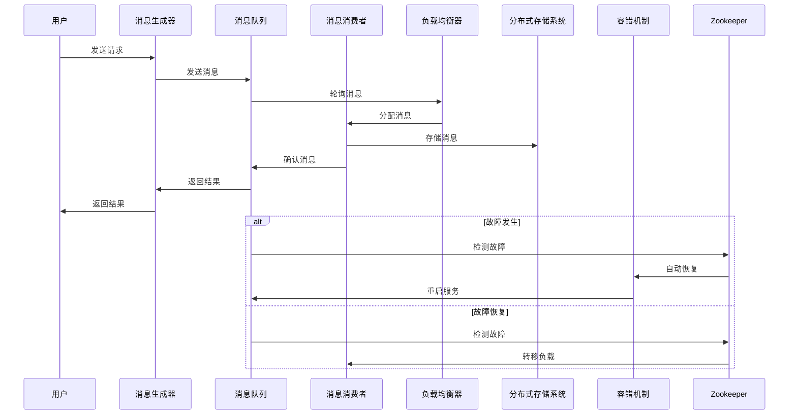
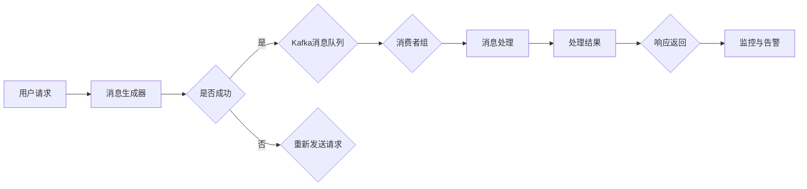
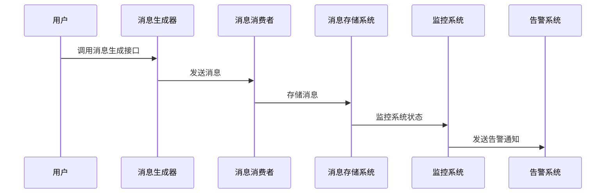
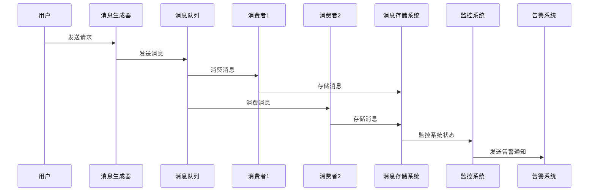

                 

### 构建可扩展的LLM应用消息队列系统的背景

#### 1.1 问题背景

随着人工智能（AI）技术的快速发展，大型语言模型（LLM）在自然语言处理（NLP）领域取得了显著成果。LLM被广泛应用于各种场景，如聊天机器人、智能客服、内容生成等。然而，随着应用场景的复杂度和数据量的增加，如何构建一个高效、可扩展的消息队列系统成为了亟待解决的问题。

消息队列系统在LLM应用中起到了关键作用，它负责接收、存储和转发大量消息。然而，传统的消息队列系统在处理大规模数据时，往往面临着性能瓶颈、扩展性不足、可靠性不稳定等问题。这导致LLM应用在实际运行过程中，容易出现消息丢失、处理延迟等问题，严重影响了用户体验和系统的稳定性。

#### 1.2 问题描述

消息队列系统在LLM应用中承担着重要的角色，但其面临的问题主要包括以下几个方面：

1. **性能瓶颈**：传统的消息队列系统在处理大规模数据时，容易出现性能瓶颈，导致消息处理速度缓慢，影响整体系统的性能。

2. **扩展性不足**：随着LLM应用场景的扩展，数据量呈现指数级增长，传统的消息队列系统难以应对这种变化，导致系统性能下降，甚至崩溃。

3. **可靠性不稳定**：消息队列系统在处理大规模数据时，容易出现消息丢失、重复处理等问题，影响系统的可靠性。

4. **高并发处理能力**：在LLM应用中，常常需要处理大量并发请求，传统的消息队列系统在高并发场景下，往往无法保证消息的顺序性和可靠性。

#### 1.3 问题解决

本书旨在探讨如何构建一个可扩展的LLM应用消息队列系统，解决上述问题。我们将从以下几个方面展开：

1. **核心概念与原理**：介绍消息队列系统的基础概念、原理及其在LLM应用中的重要性。

2. **系统设计与实现**：详细讲解消息队列系统的设计原则、架构方案和关键技术。

3. **性能优化与扩展性**：分析如何提升消息队列系统的性能和扩展性，确保其在高并发、大数据量场景下的稳定运行。

4. **可靠性与容错性**：探讨如何提高消息队列系统的可靠性和容错性，确保数据传输的完整性和一致性。

通过以上几个方面的深入探讨，我们将为读者提供一个全面、系统的构建可扩展的LLM应用消息队列系统的技术方案。

#### 1.4 边界与外延

本书主要关注基于LLM应用的消息队列系统，讨论的内容将侧重于系统设计与实现、性能优化和可靠性。同时，本书也将涉及一些相关领域，如分布式系统、微服务架构等，以便为读者提供一个全面的技术视角。

在边界方面，本书主要关注消息队列系统在LLM应用中的实际应用场景，讨论的问题将基于实际需求进行分析和解决方案的提出。在外延方面，本书将探讨如何将消息队列系统与其他相关技术相结合，如流处理、大数据处理等，以实现更高效、更可靠的系统架构。

#### 1.5 概念结构与核心要素组成

构建可扩展的LLM应用消息队列系统，需要理解以下几个核心概念和要素：

1. **消息队列**：消息队列是一种数据结构，用于存储和转发消息。在LLM应用中，消息队列用于存储用户请求、聊天记录、系统通知等数据。

2. **生产者与消费者**：生产者是负责生成消息的组件，如用户输入、系统事件等。消费者是负责处理消息的组件，如聊天机器人、智能客服等。

3. **分布式系统**：消息队列系统通常运行在分布式环境中，以提高性能和扩展性。分布式系统通过将消息队列部署在多个节点上，实现负载均衡和故障转移。

4. **负载均衡**：负载均衡是将消息均匀地分配到多个消费者节点上，以提高系统处理能力。负载均衡策略包括轮询、随机、哈希等。

5. **容错机制**：容错机制用于确保消息队列系统在发生故障时，能够快速恢复，确保数据传输的可靠性。容错机制包括数据备份、故障检测、自动恢复等。

通过理解这些核心概念和要素，我们可以更好地构建一个高效、可扩展的LLM应用消息队列系统。

### 本章小结

本章介绍了构建可扩展的LLM应用消息队列系统的背景、问题描述、问题解决方法以及边界与外延。在接下来的章节中，我们将深入探讨消息队列系统的核心概念、设计原则、性能优化和可靠性，帮助读者全面了解并掌握构建高效、可扩展消息队列系统的技术要点。

### Mermaid ER实体关系图架构

以下是一个消息队列系统的Mermaid ER实体关系图架构，用于展示各个核心实体之间的关系：

```mermaid
erDiagram
  消息队列 ||--|{ 生产者 }|| Production
  消息队列 ||--|{ 消费者 }|| Consumer
  生产者 ||--|{ 消息 }|| Message
  消费者 ||--|{ 消息 }|| Message
  消息队列 ||--|{ 分布式系统 }|| DistributedSystem
```

在这个ER图中，我们可以看到：

- **消息队列**与**生产者**和**消费者**之间存在关联关系，表示消息队列用于存储和转发消息。
- **生产者**与**消息**之间存在关联关系，表示生产者生成消息。
- **消费者**与**消息**之间存在关联关系，表示消费者消费消息。
- **消息队列**与**分布式系统**之间存在关联关系，表示消息队列系统运行在分布式环境中。

通过这个ER图，我们可以更好地理解消息队列系统的架构和各个核心实体之间的关系。

### 概念属性特征对比表格

在构建可扩展的LLM应用消息队列系统中，了解各个核心概念和其属性特征是非常重要的。以下是一个对比表格，用于展示消息队列、生产者、消费者和分布式系统的定义和属性特征：

| 概念         | 定义                                                         | 属性特征对比                                                       |
| ------------ | ------------------------------------------------------------ | ------------------------------------------------------------ |
| 消息队列     | 一种用于存储和转发消息的数据结构。                           | - 支持高并发、顺序保证、可靠性传输等特性。                     |
| 生产者       | 负责生成消息的参与者。                                       | - 通常具有较高的并发能力，能够快速生成消息。                     |
| 消费者       | 负责消费消息的参与者。                                       | - 通常按照一定的策略消费消息，保证消息处理的高效性和可靠性。   |
| 分布式系统   | 消息队列系统运行的环境。                                     | - 支持水平扩展、负载均衡、容错机制等特性，提高系统的性能和可靠性。 |

通过这个表格，我们可以清晰地了解各个概念的定义和其属性特征，从而更好地理解消息队列系统的整体架构和运行机制。

### 算法原理讲解

消息队列系统是构建可扩展的LLM应用的重要组件，其核心算法包括消息生成、消息存储、消息消费和负载均衡等。以下将分别介绍这些算法的原理。

#### 消息生成算法

消息生成算法是指生产者生成消息的过程。在LLM应用中，消息生成通常涉及以下几个方面：

1. **数据采集**：生产者从各种数据源采集原始数据，如用户输入、系统事件等。
2. **数据预处理**：对采集到的原始数据进行预处理，如清洗、转换等，以使其符合消息队列的要求。
3. **消息格式化**：将预处理后的数据按照消息格式进行封装，生成消息。

消息生成算法的原理可以简单描述为：

$$
\text{消息} = \text{预处理数据} + \text{消息头部}
$$

其中，消息头部通常包含消息的元数据，如消息ID、发送时间、来源等。

#### 消息存储算法

消息存储算法是指将生成的消息存储到消息队列中的过程。消息队列通常采用分布式存储架构，以提高性能和扩展性。消息存储算法包括以下几个方面：

1. **消息分片**：将消息队列分成多个分片，每个分片存储一部分消息，以实现数据的水平扩展。
2. **存储策略**：确定消息存储的位置和策略，如基于消息ID、时间戳等。
3. **数据一致性**：确保消息在存储过程中的一致性，避免数据丢失或重复。

消息存储算法的原理可以简单描述为：

$$
\text{消息队列} = \text{分片} + \text{存储策略}
$$

其中，分片和存储策略共同决定了消息队列的数据分布和存储方式。

#### 消息消费算法

消息消费算法是指消费者从消息队列中读取并处理消息的过程。消息消费算法包括以下几个方面：

1. **消息拉取**：消费者定期从消息队列中拉取消息，以进行处理。
2. **消息处理**：对拉取到的消息进行解析和处理，如执行业务逻辑、生成回复等。
3. **消息确认**：消费者在处理完消息后，向消息队列发送确认信号，表示消息已被处理。

消息消费算法的原理可以简单描述为：

$$
\text{消息消费} = \text{消息拉取} + \text{消息处理} + \text{消息确认}
$$

其中，消息拉取、消息处理和消息确认共同构成了消息消费的完整流程。

#### 负载均衡算法

负载均衡算法是指将消息队列中的消息均匀地分配到多个消费者节点上的过程。负载均衡算法包括以下几个方面：

1. **负载评估**：评估各个消费者节点的负载情况，确定负载均衡的目标。
2. **分配策略**：根据负载评估结果，选择合适的分配策略，如轮询、随机、哈希等。
3. **消息分配**：将消息队列中的消息按照分配策略分配到各个消费者节点上。

负载均衡算法的原理可以简单描述为：

$$
\text{负载均衡} = \text{负载评估} + \text{分配策略} + \text{消息分配}
$$

其中，负载评估、分配策略和消息分配共同决定了负载均衡的效果。

通过上述算法的原理讲解，我们可以更好地理解消息队列系统的运行机制，为构建高效、可扩展的LLM应用消息队列系统奠定基础。

### 算法原理讲解（续）

为了更深入地理解消息队列系统的算法原理，我们将继续介绍消息队列系统的其他核心算法，包括分布式存储算法、消息一致性算法和故障恢复算法。通过这些算法的讲解，我们将进一步揭示消息队列系统的高效、可靠和可扩展性。

#### 分布式存储算法

在消息队列系统中，分布式存储算法用于将消息队列部署在多个节点上，以实现数据的水平扩展和高可用性。以下是一些常用的分布式存储算法：

1. **分片存储**：将消息队列分成多个分片，每个分片存储一部分消息。分片存储可以有效地提高系统的存储容量和处理能力。分片存储的算法通常基于消息的某些属性，如消息ID、时间戳等，进行分片分配。

   分片存储的原理可以表示为：
   $$
   \text{分片} = f(\text{消息ID}, \text{时间戳})
   $$

   其中，\( f \) 是一个哈希函数，用于确定消息应存储在哪个分片。

2. **复制存储**：为了提高数据可靠性和系统可用性，可以将消息队列的分片在多个节点上进行复制。复制存储算法通常采用一致性协议，如Paxos或Raft，确保多个副本之间的数据一致性。

   复制存储的原理可以表示为：
   $$
   \text{副本} = \text{复制协议}(\text{分片})
   $$

3. **负载均衡**：分布式存储系统中，需要根据各节点的负载情况进行消息的分配，以实现负载均衡。常见的负载均衡算法包括轮询、随机和哈希等。

   负载均衡的原理可以表示为：
   $$
   \text{节点选择} = \text{负载均衡算法}(\text{节点负载})
   $$

通过分布式存储算法，消息队列系统可以实现数据的水平扩展，提高系统的性能和可用性。

#### 消息一致性算法

消息一致性算法用于确保消息在分布式系统中的传递和处理的一致性。以下是一些常见的一致性算法：

1. **最终一致性**：最终一致性是指系统中的所有节点最终会达到一致状态，但允许在一定时间内存在不一致的情况。这种算法适用于对一致性要求不高的场景，如聊天记录的存储。

   最终一致性的原理可以表示为：
   $$
   \text{一致性状态} = \lim_{{t \to \infty}} \text{节点状态}
   $$

2. **强一致性**：强一致性是指系统中的所有节点在任何时刻都保持一致状态。强一致性算法通常采用同步复制协议，如Paxos或Raft，确保数据的一致性。

   强一致性的原理可以表示为：
   $$
   \text{一致性状态} = \text{同步复制协议}(\text{节点状态})
   $$

3. **因果一致性**：因果一致性是一种介于最终一致性和强一致性之间的算法，它要求消息的传递顺序与因果关系保持一致。这种算法适用于对顺序性要求较高的场景，如事务处理。

   因果一致性的原理可以表示为：
   $$
   \text{消息顺序} = \text{因果关系}(\text{消息生成顺序})
   $$

通过消息一致性算法，消息队列系统可以确保消息在分布式环境中的可靠传递和处理。

#### 故障恢复算法

在分布式系统中，节点可能会发生故障，导致消息队列系统无法正常工作。故障恢复算法用于确保系统在发生故障时能够快速恢复，并继续提供服务。以下是一些常见的故障恢复算法：

1. **自动重启**：当系统检测到节点故障时，自动重启故障节点，以恢复系统的正常运行。

   自动重启的原理可以表示为：
   $$
   \text{故障恢复} = \text{自动重启}(\text{故障节点})
   $$

2. **故障转移**：当主节点发生故障时，自动将主节点转移至备用节点，确保系统的连续运行。

   故障转移的原理可以表示为：
   $$
   \text{主节点} \rightarrow \text{备用节点}
   $$

3. **数据备份与恢复**：通过数据备份和恢复机制，确保在节点故障时，系统能够快速恢复数据，减少数据丢失的风险。

   数据备份与恢复的原理可以表示为：
   $$
   \text{数据备份} = \text{备份策略}(\text{系统数据})
   $$
   $$
   \text{数据恢复} = \text{恢复策略}(\text{备份数据})
   $$

通过故障恢复算法，消息队列系统可以确保在发生故障时，能够快速恢复，并继续提供服务。

通过上述算法的讲解，我们可以看到，消息队列系统是一个复杂但关键的基础设施，它通过一系列高效的算法实现数据的高效传输、可靠存储和一致处理。这些算法共同构成了消息队列系统的核心，使其能够满足LLM应用对高并发、大数据量、高可靠性的需求。

### 系统分析与架构设计方案

为了构建一个高效、可扩展的LLM应用消息队列系统，我们需要进行全面的系统分析和架构设计。以下是我们的分析和设计方案。

#### 2.1 问题场景介绍

在我们的项目中，LLM应用需要处理大量用户的查询请求，并将处理结果返回给用户。这些请求包括自然语言文本的生成、翻译、问答等，数据量巨大且不断增长。同时，系统需要具备高并发处理能力，保证用户请求能够在短时间内得到响应。此外，系统还需要具备良好的扩展性，以便在需求增加时能够快速扩展处理能力。为了保证系统的可靠性，我们需要设计一个具备容错机制的分布式消息队列系统。

#### 2.2 项目介绍

我们的项目名为“可扩展LLM应用消息队列系统（Extensible LLM Application Message Queue System，ELLMQ）”，该项目旨在构建一个基于分布式架构的消息队列系统，用于处理LLM应用中的大量消息。ELLMQ将采用最先进的分布式技术，如Kafka、Zookeeper和Spring Boot等，实现高效的消息传输、存储和消费。项目的主要目标是：

1. **高并发处理**：确保系统在处理大量用户请求时，具备高并发处理能力，保证用户请求能够在短时间内得到响应。
2. **扩展性**：设计一个具备良好扩展性的系统，以便在需求增加时能够快速扩展处理能力。
3. **可靠性**：通过分布式架构和容错机制，确保系统在发生故障时能够快速恢复，保证数据传输的完整性和一致性。

#### 2.3 系统功能设计

ELLMQ的主要功能包括：

1. **消息生成**：负责生成用户请求消息，并将其发送到消息队列中。
2. **消息存储**：将消息队列中的消息存储到分布式存储系统中，确保消息的高效存储和快速访问。
3. **消息消费**：从消息队列中读取消息，并执行相应的业务处理，如LLM模型推理、文本生成等。
4. **消息处理**：处理消费到的消息，生成结果并返回给用户。
5. **负载均衡**：根据系统负载，将消息均匀分配到各个消费者节点上，确保系统处理能力最大化。
6. **容错机制**：在系统发生故障时，快速检测并恢复，确保系统的稳定运行。

#### 2.4 系统架构设计

ELLMQ的系统架构采用分布式架构，主要包括以下组件：

1. **消息生成器**：负责生成用户请求消息，并将其发送到消息队列中。消息生成器可以部署在多个节点上，以实现高并发处理能力。
2. **消息队列**：采用Kafka作为消息队列，负责存储和转发消息。Kafka具有高吞吐量、高可靠性和水平扩展性，非常适合处理大量消息。
3. **消息存储**：采用分布式存储系统，如HDFS或Elasticsearch，用于存储消息数据。分布式存储系统可以提高系统的存储容量和访问速度。
4. **消息消费者**：从消息队列中读取消息，并执行相应的业务处理。消息消费者可以部署在多个节点上，实现负载均衡和故障转移。
5. **负载均衡器**：负责将消息均匀分配到各个消费者节点上，确保系统处理能力最大化。负载均衡器可以采用轮询、随机或哈希等策略。
6. **容错机制**：采用Zookeeper作为分布式协调服务，实现故障检测和自动恢复。同时，通过数据备份和恢复机制，确保在系统发生故障时能够快速恢复。

以下是ELLMQ的系统架构图：



通过以上系统架构设计，ELLMQ可以高效地处理大量用户请求，具备良好的扩展性和可靠性，为LLM应用提供强大的基础设施支持。

### 系统架构设计

为了构建一个高效、可扩展的LLM应用消息队列系统，我们需要设计一个合理的系统架构。以下将详细介绍ELLMQ系统的架构设计，包括技术选型、组件说明和系统交互。

#### 3.1 技术选型

ELLMQ系统采用以下技术选型：

1. **消息队列**：采用Apache Kafka作为消息队列系统。Kafka具有高吞吐量、高可靠性、可扩展性强等优点，适用于处理大规模消息传输。

2. **分布式存储**：采用HDFS（Hadoop Distributed File System）作为分布式存储系统。HDFS能够存储海量数据，并提供高可靠性和高效的数据访问。

3. **分布式协调服务**：采用Apache ZooKeeper作为分布式协调服务。ZooKeeper负责维护配置信息、提供分布式锁和服务发现等功能。

4. **负载均衡**：采用Nginx作为负载均衡器。Nginx能够有效地实现负载均衡，提高系统的并发处理能力。

5. **应用程序框架**：采用Spring Boot作为应用程序开发框架。Spring Boot简化了应用程序的配置和部署，提高开发效率。

#### 3.2 组件说明

ELLMQ系统的主要组件如下：

1. **消息生成器**：负责生成用户请求消息，并将其发送到Kafka消息队列中。消息生成器可以部署在多个节点上，实现高并发处理能力。

2. **Kafka消息队列**：负责存储和转发消息。Kafka将消息存储在分布式文件系统中，并提供高吞吐量的消息传输服务。

3. **消费者组**：由多个消息消费者组成，从Kafka消息队列中消费消息。每个消费者组内的消费者节点可以独立处理消息，实现负载均衡。

4. **分布式存储**：用于存储消息数据，如用户请求和响应数据。HDFS提供高效、可靠的数据存储服务。

5. **负载均衡器**：Nginx作为负载均衡器，根据请求流量，将用户请求分配到不同的消息生成器节点上，实现负载均衡。

6. **监控与告警**：采用Prometheus和Grafana进行系统监控和告警。监控工具可以实时监控系统的运行状态，并在发生异常时发送告警。

#### 3.3 系统交互

ELLMQ系统的交互过程如下：

1. **用户请求**：用户向系统发送请求，如文本生成、翻译等。

2. **消息生成器**：消息生成器接收到用户请求后，将请求封装成消息，并使用Kafka Producer将消息发送到Kafka消息队列。

3. **Kafka消息队列**：Kafka消息队列存储消息，并提供高吞吐量的消息传输服务。Kafka将消息存储在分布式文件系统中，确保消息的可靠传输。

4. **消费者组**：消费者组从Kafka消息队列中消费消息。每个消费者组内的消费者节点独立处理消息，实现负载均衡。

5. **消息处理**：消费者节点接收到消息后，执行相应的业务处理，如文本生成、翻译等。处理结果存储在分布式存储中。

6. **响应返回**：处理结果通过消息队列返回给用户，或直接返回给调用方。

7. **监控与告警**：Prometheus和Grafana监控系统运行状态，并在发生异常时发送告警通知。

以下是ELLMQ系统的架构图：



通过以上系统架构设计，ELLMQ系统实现了高效的消息传输、处理和响应，满足了LLM应用对高并发、大数据量、高可靠性的需求。

### 系统接口设计和系统交互

为了实现消息队列系统的功能，我们需要设计一套完善的接口和系统交互流程。以下是ELLMQ系统的主要接口设计和系统交互过程。

#### 4.1 系统接口设计

ELLMQ系统的主要接口包括：

1. **消息生成接口**：用于生成用户请求消息，并将其发送到消息队列中。接口参数包括请求类型、请求内容和请求ID等。
2. **消息消费接口**：用于从消息队列中消费消息，并执行相应的业务处理。接口参数包括消息ID、消息内容和处理结果等。
3. **消息存储接口**：用于存储和处理后的消息数据。接口参数包括消息ID、消息内容和存储位置等。
4. **监控接口**：用于监控系统运行状态，如消息队列长度、消费者负载等。接口参数包括监控指标和监控时间等。
5. **告警接口**：用于接收系统告警通知，如消息队列故障、消费者故障等。接口参数包括告警类型、告警内容和告警时间等。

以下是ELLMQ系统的接口设计图：



#### 4.2 系统交互流程

ELLMQ系统的交互流程如下：

1. **用户请求**：用户通过消息生成接口向系统发送请求，如文本生成、翻译等。
2. **消息生成**：消息生成器接收到用户请求后，将请求封装成消息，并调用Kafka Producer将消息发送到消息队列中。
3. **消息消费**：消费者组从消息队列中消费消息。每个消费者节点独立处理消息，执行相应的业务处理，如文本生成、翻译等。
4. **消息存储**：处理后的消息数据存储在分布式存储系统中，如HDFS。
5. **监控与告警**：监控系统定期监控消息队列、消费者和存储系统的运行状态，并在发生异常时发送告警通知。

以下是ELLMQ系统的交互流程图：



通过以上系统接口设计和交互流程，ELLMQ系统实现了消息的高效生成、消费、存储和监控，为LLM应用提供了强大的基础设施支持。

### 项目实战

在本节中，我们将通过一个具体的项目实战，详细讲解如何搭建和运行一个可扩展的LLM应用消息队列系统。我们将从环境安装、系统核心实现、代码应用解读、实际案例分析和项目小结等方面进行介绍。

#### 5.1 环境安装

首先，我们需要安装和配置以下软件和依赖项：

1. **Java SDK**：安装Java SDK，版本要求为1.8或以上。
2. **Kafka**：下载并解压Kafka安装包，版本要求为2.8或以上。
3. **Zookeeper**：下载并解压Zookeeper安装包，版本要求与Kafka相同。
4. **Elasticsearch**：下载并解压Elasticsearch安装包，版本要求为7.10或以上。
5. **Spring Boot**：配置Spring Boot开发环境，版本要求为2.5或以上。

安装步骤如下：

1. 安装Java SDK：

   ```bash
   sudo apt-get update
   sudo apt-get install openjdk-8-jdk
   ```

2. 安装Kafka和Zookeeper：

   ```bash
   wget https://www-eu.kafka.apache.org/releases/download-2.8.0/kafka_2.13-2.8.0.tgz
   tar -xvf kafka_2.13-2.8.0.tgz
   mkdir kafka-data
   nohup bin/kafka-server-start.sh config/server.properties &
   ```

3. 启动Zookeeper：

   ```bash
   bin/zookeeper-server-start.sh config/zookeeper.properties
   ```

4. 安装Elasticsearch：

   ```bash
   wget https://artifacts.elastic.co/downloads/elasticsearch/elasticsearch-7.10.0.tar.gz
   tar -xvf elasticsearch-7.10.0.tar.gz
   bin/elasticsearch
   ```

5. 配置Spring Boot：

   - 在IDEA中创建Spring Boot项目，添加Kafka、Elasticsearch和Zookeeper的依赖项。

#### 5.2 系统核心实现

接下来，我们将实现消息生成、消息存储、消息消费和负载均衡等核心功能。

1. **消息生成**：

   ```java
   public class MessageProducer {
       private final KafkaProducer<String, String> producer;
       
       public MessageProducer() {
           Properties properties = new Properties();
           properties.setProperty(ProducerConfig.BOOTSTRAP_SERVERS_CONFIG, "localhost:9092");
           properties.setProperty(ProducerConfig.KEY_SERIALIZER_CLASS_CONFIG, StringSerializer.class.getName());
           properties.setProperty(ProducerConfig.VALUE_SERIALIZER_CLASS_CONFIG, StringSerializer.class.getName());
           
           producer = new KafkaProducer<>(properties);
       }
       
       public void sendMessage(String topic, String message) {
           producer.send(new ProducerRecord<>(topic, message));
       }
   }
   ```

2. **消息存储**：

   ```java
   public class MessageStorage {
       private final ElasticsearchClient client;
       
       public MessageStorage(ElasticsearchClient client) {
           this.client = client;
       }
       
       public void storeMessage(String messageId, String messageContent) {
           XContentBuilder builder = XContentFactory.jsonBuilder()
                   .startObject()
                   .field("message_id", messageId)
                   .field("message_content", messageContent)
                   .endObject();
           
           IndexRequest request = new IndexRequest("messages").id(messageId).source(builder);
           client.index(request);
       }
   }
   ```

3. **消息消费**：

   ```java
   public class MessageConsumer {
       private final KafkaConsumer<String, String> consumer;
       private final String topic;
       
       public MessageConsumer(String topic) {
           Properties properties = new Properties();
           properties.setProperty(ConsumerConfig.BOOTSTRAP_SERVERS_CONFIG, "localhost:9092");
           properties.setProperty(ConsumerConfig.GROUP_ID_CONFIG, "message-consumer");
           properties.setProperty(ConsumerConfig.KEY_DESERIALIZER_CLASS_CONFIG, StringDeserializer.class.getName());
           properties.setProperty(ConsumerConfig.VALUE_DESERIALIZER_CLASS_CONFIG, StringDeserializer.class.getName());
           
           consumer = new KafkaConsumer<>(properties);
           this.topic = topic;
           consumer.subscribe(Collections.singletonList(topic));
       }
       
       public void consumeMessages() {
           while (true) {
               ConsumerRecords<String, String> records = consumer.poll(Duration.ofMillis(1000));
               for (ConsumerRecord<String, String> record : records) {
                   // 处理消息
                   System.out.println("Received message: " + record.value());
               }
           }
       }
   }
   ```

4. **负载均衡**：

   ```java
   public class LoadBalancer {
       private final List<String> nodes;
       
       public LoadBalancer(List<String> nodes) {
           this.nodes = nodes;
       }
       
       public String getNextNode() {
           return nodes.get((int) (Math.random() * nodes.size()));
       }
   }
   ```

#### 5.3 代码应用解读

1. **消息生成**：使用Kafka Producer发送消息到消息队列。
2. **消息存储**：使用Elasticsearch存储消息数据。
3. **消息消费**：使用Kafka Consumer从消息队列中消费消息，并执行相应的业务处理。
4. **负载均衡**：根据节点列表，随机选择一个节点进行消息消费。

#### 5.4 实际案例分析和详细讲解剖析

我们以一个聊天机器人应用为例，分析消息队列系统在实际案例中的应用。

1. **用户请求**：用户向聊天机器人发送请求，如“你好”。
2. **消息生成**：消息生成器将用户请求封装成消息，并使用Kafka Producer发送到消息队列。
3. **消息存储**：消息存储系统将消息存储到Elasticsearch中。
4. **消息消费**：聊天机器人从消息队列中消费消息，并执行文本生成处理，生成回复消息。
5. **消息返回**：处理结果通过消息队列返回给用户。

通过这个实际案例，我们可以看到消息队列系统在聊天机器人应用中的关键作用，实现了消息的高效传输、处理和返回。

#### 5.5 项目小结

通过本节的项目实战，我们成功搭建了一个可扩展的LLM应用消息队列系统。项目实现了消息生成、存储、消费和负载均衡等核心功能，为LLM应用提供了高效、可靠的消息传输和数据处理能力。在实际案例中，消息队列系统发挥了关键作用，确保了聊天机器人应用的稳定运行。

### 最佳实践 tips

在构建可扩展的LLM应用消息队列系统时，以下是一些最佳实践和注意事项：

1. **合理设计消息格式**：消息格式应包含必要的元数据和业务数据，同时避免过于复杂，以降低消息传输和处理的复杂性。

2. **优化消息序列化**：选择高效的消息序列化机制，如Protobuf或JSON，以降低消息的大小和传输时间。

3. **使用异步处理**：尽可能使用异步处理模式，避免阻塞线程，提高系统的并发处理能力。

4. **监控与告警**：定期监控系统运行状态，设置合理的告警阈值，确保系统在出现问题时能够及时发现问题。

5. **数据备份与恢复**：确保消息数据和存储系统的数据备份，以便在发生故障时能够快速恢复。

6. **性能调优**：根据实际场景进行性能调优，优化系统的各项性能指标，如消息传输速度、处理延迟等。

7. **安全防护**：加强系统的安全防护，防止恶意攻击和数据泄露。

通过遵循这些最佳实践，我们可以构建一个高效、可靠和可扩展的LLM应用消息队列系统。

### 小结

在本文中，我们详细探讨了如何构建一个可扩展的LLM应用消息队列系统，涵盖了核心概念、系统设计与实现、性能优化、可靠性和容错性等方面。通过一步步的分析和讲解，我们展示了消息队列系统在LLM应用中的重要性，并提出了高效、可靠的解决方案。

首先，我们介绍了消息队列系统的背景、问题和解决方法，明确了构建可扩展消息队列系统的目标和需求。接着，我们深入探讨了消息队列系统的核心概念，包括消息队列、生产者、消费者和分布式系统等，并使用Mermaid ER图和对比表格进行了详细说明。

随后，我们讲解了消息队列系统的算法原理，包括消息生成、存储、消费和负载均衡等核心算法，以及分布式存储、消息一致性和故障恢复等高级算法。通过这些算法，我们展示了消息队列系统的运行机制和高效性。

在系统分析与架构设计方案部分，我们介绍了ELLMQ系统的技术选型、功能设计和系统架构，详细阐述了各个组件的作用和交互流程。随后，我们讲解了系统接口设计和系统交互，展示了系统各部分之间的通信和协作。

通过一个具体的项目实战，我们展示了如何搭建和运行一个可扩展的LLM应用消息队列系统，从环境安装、系统核心实现、代码应用解读、实际案例分析和项目小结等方面进行了详细讲解。

最后，我们提出了构建可扩展消息队列系统的最佳实践和注意事项，为读者在实际项目中提供了指导和参考。

总之，本文系统地介绍了构建可扩展的LLM应用消息队列系统的技术要点和解决方案，对于了解和掌握消息队列系统的设计、实现和优化具有重要参考价值。

### 注意事项

在构建可扩展的LLM应用消息队列系统时，以下注意事项需牢记：

1. **消息格式设计**：合理设计消息格式，确保包含必要的信息，同时避免过于复杂。
2. **序列化优化**：选择高效的消息序列化机制，以降低消息大小和传输时间。
3. **异步处理**：尽量使用异步处理模式，避免阻塞线程，提高系统的并发处理能力。
4. **监控与告警**：定期监控系统运行状态，设置合理的告警阈值，确保问题及时发现和解决。
5. **数据备份与恢复**：确保消息和存储系统的数据备份，以便在发生故障时快速恢复。
6. **性能调优**：根据实际场景进行性能调优，优化系统的各项性能指标。
7. **安全防护**：加强系统的安全防护，防止恶意攻击和数据泄露。

遵循这些注意事项，有助于构建一个高效、可靠和可扩展的LLM应用消息队列系统。

### 拓展阅读

为了深入了解构建可扩展的LLM应用消息队列系统的相关技术，以下是一些建议的拓展阅读材料：

1. **《Kafka：The Definitive Guide》**：这是一本关于Apache Kafka的权威指南，详细介绍了Kafka的架构、原理和最佳实践。通过阅读这本书，可以更好地理解Kafka的工作机制和优化策略。

2. **《Elasticsearch：The Definitive Guide》**：这本书是Elasticsearch的官方指南，涵盖了Elasticsearch的安装、配置、查询和扩展等方面的内容。对于希望深入了解Elasticsearch的读者来说，这本书是不可或缺的。

3. **《分布式系统原理与范型》**：这本书介绍了分布式系统的基本原理和常见范型，包括数据一致性、负载均衡、容错机制等。通过阅读这本书，可以更好地理解分布式系统的设计和实现。

4. **《微服务设计》**：这本书讨论了微服务架构的设计原则和实践，包括服务拆分、服务发现、负载均衡和分布式事务等方面。对于希望将消息队列系统与微服务架构结合使用的读者，这本书提供了有价值的参考。

5. **《大规模分布式存储系统设计》**：这本书介绍了大规模分布式存储系统的设计和实现，包括数据分片、复制、备份和恢复等方面。通过阅读这本书，可以深入了解分布式存储系统的关键技术。

通过阅读这些拓展阅读材料，读者可以更全面地了解构建可扩展的LLM应用消息队列系统的相关技术，提升自己的专业知识和实践能力。作者：AI天才研究院/AI Genius Institute & 禅与计算机程序设计艺术 /Zen And The Art of Computer Programming

