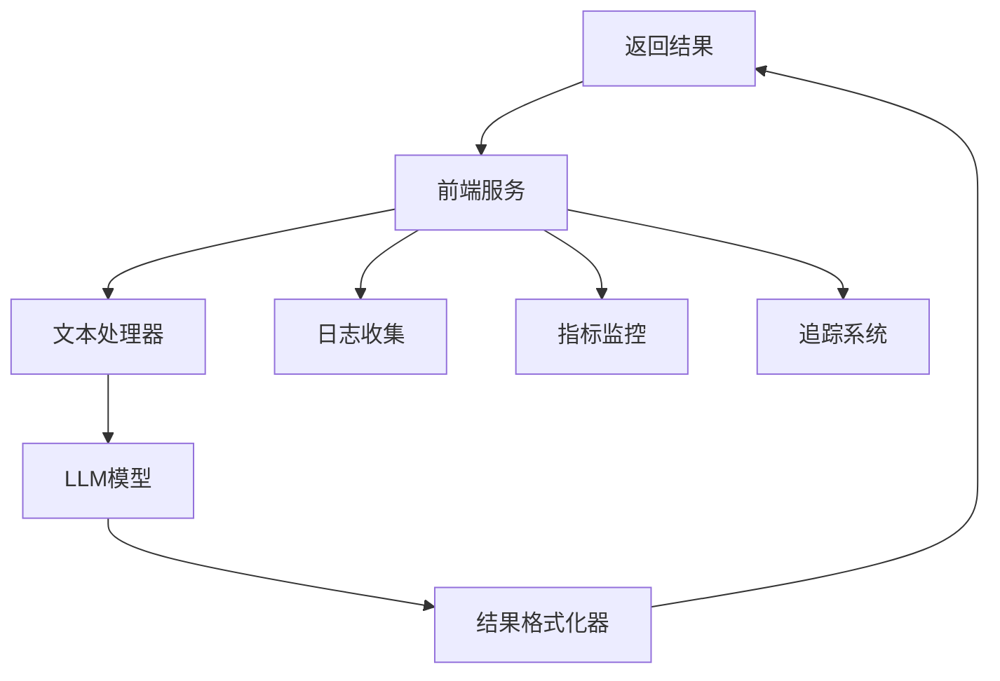
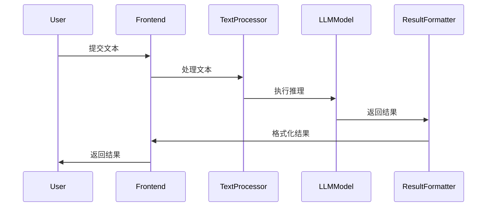

                 

**构建可观测的LLM系统：日志、指标与追踪**

### 关键词
- 可观测性
- LLM系统
- 日志
- 指标
- 追踪

### 摘要
本文旨在深入探讨构建可观测性强的LLM（大型语言模型）系统的关键要素，包括日志、指标与追踪。通过逐步分析每个组件的设计与实现，本文将帮助开发者理解和应用这些技术，以提升系统的可维护性和可扩展性。本文将分为以下几个部分：

1. **背景介绍**：解释为何在LLM系统中构建可观测性至关重要，并简要介绍日志、指标与追踪的基本概念。
2. **核心概念与联系**：详细阐述日志、指标、追踪的概念，并通过对比表格和ER实体关系图展示它们之间的联系。
3. **技术原理讲解**：深入解析日志系统、监控系统、追踪机制的技术原理，包括工作流程、关键组件和实现方式。
4. **数学模型与公式**：解释日志、指标、追踪相关的数学概念和算法，并提供详细的模型和公式。
5. **系统设计与实现**：展示一个典型的LLM系统架构，包括日志收集、指标监控、追踪系统等部分。
6. **项目实战**：通过实际案例展示如何构建一个可观测的LLM系统，包括环境安装、核心实现源代码等。
7. **最佳实践与总结**：总结构建可观测LLM系统的最佳实践，并提供注意事项和拓展阅读建议。

### 设计思路
为了确保本文的逻辑清晰、结构紧凑且简单易懂，我们采用以下设计思路：

1. **背景介绍**：首先引入可观测性的概念，解释其在LLM系统中的重要性，为后续内容打下基础。
2. **核心概念与联系**：通过表格和ER图等可视化工具，帮助读者理解和区分日志、指标、追踪等核心概念，并展示它们之间的联系。
3. **技术原理讲解**：分别详细讲解日志系统、监控系统、追踪机制的技术原理，确保读者能够掌握这些技术的本质。
4. **数学模型与公式**：对于涉及到的数学概念和算法，提供详细的数学模型和公式解释，并通过举例说明确保读者能够理解。
5. **系统设计与实现**：通过一个典型的LLM系统架构，展示如何将这些技术原理应用到实际系统中，并使用Mermaid流程图和类图来辅助理解。
6. **项目实战**：通过一个实际案例，展示构建可观测LLM系统的具体步骤和关键实现，包括环境安装、核心代码实现等。
7. **最佳实践与总结**：总结构建可观测LLM系统的最佳实践，并提供注意事项和拓展阅读建议，以帮助读者进一步学习。

### 设计步骤
为了构建本文的完整目录大纲，我们将遵循以下设计步骤：

1. **引言**：介绍可观测性在LLM系统中的重要性，并定义日志、指标、追踪等核心概念。
2. **日志系统**：讲解日志系统的工作流程、关键组件和实现方式。
3. **指标监控**：详细阐述指标监控系统的架构、常见指标类型及数据处理方法。
4. **追踪系统**：介绍追踪机制与策略，展示追踪系统的实现与数据可视化。
5. **技术原理讲解**：分别讲解日志、监控、追踪系统的技术原理，并展示它们之间的关联性。
6. **系统设计与实现**：展示一个典型的LLM系统架构，并使用Mermaid工具绘制流程图和类图。
7. **项目实战**：通过实际案例展示构建可观测LLM系统的全过程，包括环境安装、核心代码实现等。
8. **最佳实践与总结**：总结构建可观测LLM系统的最佳实践，并提供注意事项和拓展阅读建议。

通过以上步骤，我们将构建一个详细而完整的目录大纲，确保文章内容的完整性、简洁性和逻辑性。接下来，我们将根据这些步骤逐一设计每个章节的内容。### 第1章：引言

#### 1.1 可观测性在LLM系统中的重要性

在当今快速发展的信息技术时代，可观测性已成为构建高效、可靠系统的重要基石。特别是在大型语言模型（LLM）系统中，可观测性扮演着至关重要的角色。LLM系统，如GPT-3、BERT等，拥有数以百万计的参数，且在训练和应用过程中涉及复杂的计算和数据处理流程。因此，确保系统能够在出现问题时快速定位和诊断，对于维持其稳定性和性能至关重要。

可观测性（Observability）是指通过系统的外部表现，如日志、指标和追踪数据，来理解和验证系统的内部状态和行为的能力。与传统的基于样本数据的监控（Monitorability）不同，可观测性提供了更深入的系统理解，能够帮助开发者和运维人员快速识别问题，并采取有效措施。

在LLM系统中，构建良好的可观测性有以下几个关键作用：

1. **故障诊断**：当系统出现问题时，可观测性提供了必要的线索，帮助开发者和运维人员快速定位故障源，缩短排查时间。
2. **性能优化**：通过监控系统性能指标，如延迟、吞吐量和资源利用率，开发者和运维人员可以实时调整系统配置，以优化性能。
3. **安全性**：可观测性有助于发现潜在的安全威胁和漏洞，从而及时采取防护措施。
4. **可扩展性**：在系统规模不断扩大时，可观测性有助于确保系统能够稳定运行，支持进一步的扩展。

#### 1.2 日志、指标、追踪的核心概念

在构建可观测性的LLM系统中，日志、指标和追踪是三个核心组件。理解这些组件的基本概念和它们之间的联系，对于设计和实现高效的可观测性系统至关重要。

1. **日志（Logs）**：

日志是系统在运行过程中记录的文本信息，用于记录事件、错误、调试信息等。日志通常包含时间戳、源组件、事件类型、事件详情等。日志的作用是提供事件的历史记录，帮助分析系统行为和诊断问题。

- **基本概念**：

  - **日志类型**：系统日志、应用日志、错误日志等。

  - **日志格式**：文本格式、JSON格式等。

  - **日志收集**：通过日志收集器（如Logstash、Fluentd）收集日志。

  - **日志存储**：日志存储在文件系统、数据库或云存储中。

- **日志的应用场景**：

  - **故障诊断**：通过分析日志，定位故障发生的位置和原因。

  - **调试和优化**：通过调试日志，发现潜在的性能瓶颈。

2. **指标（Metrics）**：

指标是用于衡量系统性能和资源利用率的量化数据。指标通常以数字形式表示，如CPU利用率、内存使用率、请求延迟等。指标监控系统能够实时收集和处理这些数据，并生成可视化报告。

- **基本概念**：

  - **指标类型**：性能指标、质量指标、可用性指标等。

  - **监控周期**：实时监控、定时监控等。

  - **监控工具**：Prometheus、Grafana等。

- **指标的应用场景**：

  - **性能优化**：通过监控性能指标，实时调整系统配置。

  - **容量规划**：通过监控资源利用率，预测未来资源需求。

3. **追踪（Tracing）**：

追踪是用于记录系统内部流程和组件间通信的日志。追踪数据能够展示系统的执行路径、数据流动和处理时间，帮助开发者理解系统的运行细节。

- **基本概念**：

  - **追踪类型**：分布式追踪、链路追踪等。

  - **追踪工具**：Zipkin、Jaeger等。

- **追踪的应用场景**：

  - **性能分析**：通过追踪数据，分析系统瓶颈。

  - **调试和优化**：通过追踪数据，优化系统性能。

#### 1.3 日志、指标、追踪之间的联系

日志、指标、追踪虽然在功能上有所不同，但它们在实际应用中紧密关联，共同构成了一个完整、高效的可观测性体系。

1. **数据来源**：

   - 日志通常来源于系统的各个组件，记录了事件的发生和变化。
   - 指标来源于系统的监控工具，通过采集和处理数据，生成性能和资源利用率等指标。
   - 追踪来源于系统的分布式追踪工具，记录了系统内部流程和组件间通信的细节。

2. **数据处理**：

   - 日志经过收集和存储后，可以通过日志分析工具进行分析和处理。
   - 指标数据经过采集和处理后，可以被监控系统用于实时监控和报警。
   - 追踪数据通过追踪工具进行聚合和分析，生成追踪报告。

3. **数据可视化**：

   - 日志分析工具可以将日志数据可视化，展示事件历史记录。
   - 监控系统可以将指标数据可视化，展示系统性能和资源利用率。
   - 追踪工具可以将追踪数据可视化，展示系统内部流程和通信路径。

4. **数据关联**：

   - 通过关联日志、指标和追踪数据，可以更全面地理解系统行为，快速诊断和解决问题。

#### 1.4 本章小结

本章介绍了构建可观测性LLM系统的重要性，并详细阐述了日志、指标、追踪这三个核心组件的基本概念和应用场景。通过理解这些组件的关联性，开发者和运维人员可以更好地设计和实现高效、可靠的可观测性系统。在下一章中，我们将深入探讨日志系统的具体实现和功能。

### 第2章：日志系统

#### 2.1 日志系统概述

日志系统是构建可观测性系统的重要组成部分，它通过记录系统运行过程中的各类信息，为故障诊断、性能优化和安全监控提供关键数据。一个完善的日志系统不仅能够准确记录事件，还能够高效地收集、存储和分析这些数据。

#### 2.1.1 日志的作用

日志在系统运行中扮演着多种角色：

- **故障诊断**：通过记录系统运行过程中出现的问题和错误，日志帮助开发者和运维人员快速定位故障源，缩短排查时间。
- **调试和优化**：调试日志提供了系统运行过程中的详细信息，帮助开发人员发现和解决性能瓶颈。
- **安全监控**：日志记录了系统的访问和操作行为，有助于检测和预防潜在的安全威胁。
- **合规性**：许多行业和地区对系统日志有特定的合规要求，日志记录能够满足合规审计需求。

#### 2.1.2 日志系统的构成

日志系统通常由以下几个关键组件构成：

- **日志生成器**：系统各组件在运行过程中生成日志信息。
- **日志收集器**：负责从各个组件收集日志数据，并传输到集中存储。
- **日志存储**：用于存储日志数据，可以是文件系统、数据库或云存储。
- **日志分析工具**：对日志数据进行分析和可视化，提供故障诊断、性能优化和安全监控等支持。

#### 2.2 日志格式与结构

日志格式和结构对于日志系统的有效性和可读性至关重要。常见的日志格式包括文本格式和结构化格式。

- **文本格式**：

  文本格式是最常见的日志格式，通常以文本文件的形式存储，例如UNIX系统中的`/var/log`目录下的日志文件。文本格式的日志通常包含以下结构：

  - **时间戳**：记录日志生成的时间。
  - **日志级别**：表示日志事件的严重程度，如DEBUG、INFO、WARNING、ERROR等。
  - **源组件**：记录生成日志的系统组件或模块。
  - **事件详情**：具体的日志内容，包括事件类型、异常信息等。

  示例：

  ```
  2023-03-15 14:35:42, DEBUG, webserver, Request processed successfully.
  ```

- **结构化格式**：

  结构化日志格式（如JSON、XML等）将日志数据以键值对或元素的形式组织，便于日志数据的处理和分析。结构化日志的优点包括：

  - **可扩展性**：易于添加新字段，适应不同场景的需求。
  - **可解析性**：可以使用各种工具和库方便地进行解析和查询。

  JSON格式的示例：

  ```json
  {
    "timestamp": "2023-03-15T14:35:42Z",
    "level": "DEBUG",
    "source": "webserver",
    "message": "Request processed successfully."
  }
  ```

#### 2.3 日志收集与存储

日志收集与存储是日志系统的核心功能，其效率和质量直接影响日志的可读性和可用性。

- **日志收集**：

  日志收集器负责从系统的各个组件中收集日志数据，并传输到集中存储。常见的日志收集器包括：

  - **Logstash**：Elastic Stack中的日志收集工具，能够处理和转换日志数据。
  - **Fluentd**：适用于Linux系统的日志收集器，支持多种数据格式和输出目标。
  - **Filebeat**：轻量级的日志收集器，适用于从单个主机收集日志数据。

  日志收集器的工作流程包括：

  - **采集**：从日志源（如应用程序、服务）中读取日志数据。
  - **过滤**：根据配置对日志数据进行筛选和转换。
  - **传输**：将处理后的日志数据发送到集中存储。

- **日志存储**：

  日志数据的存储方式有多种选择，包括：

  - **文件系统**：简单且成本低，适用于小规模日志数据。
  - **数据库**：如Elasticsearch、MongoDB等，提供高效的查询和分析能力。
  - **云存储**：如Amazon S3、Azure Blob Storage等，提供高可靠性和可扩展性。

  日志存储需要考虑以下几个关键因素：

  - **容量**：日志数据的存储容量需要满足长期存储需求。
  - **性能**：日志存储需要支持高效的读写操作。
  - **备份与恢复**：日志存储需要提供数据备份和恢复机制，确保数据安全。

#### 2.4 日志分析工具

日志分析工具用于对日志数据进行处理和分析，以提供故障诊断、性能优化和安全监控等支持。常见的日志分析工具包括：

- **Elasticsearch**：强大的全文搜索引擎，用于存储和查询结构化日志数据。
- **Kibana**：Elastic Stack中的数据可视化工具，提供直观的日志数据分析界面。
- **Grafana**：多源数据监控和可视化工具，支持各种数据源的集成和分析。
- **Logstash**：不仅是一个日志收集器，也具备一定的日志分析功能。

日志分析工具的功能包括：

- **日志搜索**：快速查询和分析日志数据，支持全文搜索和过滤条件。
- **数据可视化**：将日志数据以图表、仪表板等形式展示，便于理解和监控。
- **报警与告警**：根据预设条件，自动发送告警通知，帮助快速响应问题。

#### 2.5 本章小结

本章详细介绍了日志系统的基本概念、日志格式与结构、日志收集与存储方法以及日志分析工具。通过构建高效的日志系统，开发者可以更好地监控和优化LLM系统的性能，确保系统的稳定性和可靠性。在下一章中，我们将探讨指标监控系统的设计原理和应用场景。### 第3章：指标监控

#### 3.1 指标监控概述

指标监控是确保大型语言模型（LLM）系统稳定运行和高效运作的关键组成部分。通过实时监控系统性能和资源利用率，开发者和运维人员能够及时发现并解决问题，从而提高系统的可维护性和可靠性。

#### 3.1.1 指标监控的重要性

指标监控在LLM系统中具有以下几个关键作用：

1. **性能优化**：通过实时监控系统的各项性能指标，如延迟、吞吐量和资源利用率，开发者和运维人员可以识别系统瓶颈，并进行针对性的优化。
2. **故障诊断**：当系统出现问题时，指标监控提供了关键的数据支持，帮助快速定位故障源头，缩短故障排查时间。
3. **容量规划**：通过对历史指标数据的分析，可以预测系统未来资源需求，从而合理规划系统扩容。
4. **成本控制**：通过监控资源利用率，可以减少不必要的资源浪费，降低运营成本。

#### 3.1.2 指标监控的挑战

尽管指标监控在LLM系统中至关重要，但实现有效的指标监控仍面临以下挑战：

1. **复杂性**：LLM系统涉及大量参数和计算，监控这些参数的难度较大。
2. **数据量**：大量的监控数据需要高效地收集、存储和处理，对系统的计算和存储资源有较高要求。
3. **一致性**：不同来源的数据可能存在差异，确保数据的一致性是监控系统的关键挑战。
4. **实时性**：快速响应系统变化，实时监控性能和资源利用情况，需要高效的监控架构。

#### 3.2 常见指标类型

指标监控系统的核心在于定义和收集各种类型的指标，以便全面评估系统的健康状况。以下是一些常见的指标类型：

1. **性能指标**：

   - **延迟（Latency）**：系统响应时间，衡量请求处理的速度。
   - **吞吐量（Throughput）**：单位时间内系统能够处理的请求数量。
   - **响应时间分布**：不同响应时间的分布情况，用于分析系统的性能瓶颈。
   - **并发连接数**：系统同时处理的连接数，反映系统的负载能力。

2. **资源利用率指标**：

   - **CPU利用率**：CPU被占用的时间比例，反映系统的计算负载。
   - **内存利用率**：内存使用率，衡量系统内存资源的占用情况。
   - **磁盘I/O**：磁盘读/写操作的次数和速度，反映磁盘性能。
   - **网络流量**：网络输入/输出流量，衡量网络带宽的使用情况。

3. **质量指标**：

   - **错误率（Error Rate）**：系统处理过程中出现的错误数量与总请求量的比例。
   - **成功率（Success Rate）**：系统成功处理请求的数量与总请求量的比例。
   - **数据完整性**：数据在传输和处理过程中的完整性，确保数据准确性。
   - **用户体验指标**：如页面加载时间、交互延迟等，直接影响用户满意度。

4. **可用性指标**：

   - **系统 uptime**：系统正常运行时间与总时间的比例，衡量系统的稳定性。
   - **恢复时间（Recovery Time）**：系统从故障状态恢复到正常运行状态所需的时间。
   - **故障率**：单位时间内系统发生故障的次数。
   - **故障持续时间**：每次故障持续的时间。

#### 3.3 指标监控系统架构

一个典型的指标监控系统架构通常包括以下几个关键组件：

1. **数据采集器**：从各个系统组件中收集性能和资源利用率数据，如Prometheus的Exporter。
2. **数据存储**：用于存储采集到的监控数据，如Prometheus的时间序列数据库。
3. **数据处理**：对采集到的数据进行分析和处理，生成统计指标和报警规则。
4. **可视化工具**：将处理后的数据可视化，提供直观的监控界面，如Grafana。
5. **报警系统**：根据预设的规则，自动发送告警通知，如Prometheus的Alertmanager。

以下是一个简单的指标监控系统架构示例：

```
[数据采集器] --> [Prometheus] --> [时间序列数据库] --> [Grafana] --> [报警系统 (Alertmanager)]
```

#### 3.4 指标数据收集与处理

指标数据的收集和处理是指标监控系统的核心环节，以下是一些关键步骤和最佳实践：

1. **数据采集**：

   - **主动采集**：通过主动请求获取系统组件的监控数据，如Prometheus的Exporter。
   - **被动采集**：通过系统组件输出的日志或指标数据，如syslog、JMX等。

   **最佳实践**：

   - 选择合适的数据采集频率，避免过度采集导致的性能瓶颈。
   - 对关键组件和参数进行重点监控，确保核心性能指标得到覆盖。

2. **数据存储**：

   - **时间序列数据库**：适用于存储大规模时序数据，如Prometheus、InfluxDB。
   - **数据压缩**：减少存储空间占用，提高查询效率。

   **最佳实践**：

   - 根据数据特点和需求选择合适的存储方案。
   - 定期进行数据备份和归档，确保数据的安全和可恢复性。

3. **数据处理**：

   - **数据聚合**：将来自多个数据源的数据进行聚合，生成更全面和准确的指标。
   - **数据转换**：对原始数据进行清洗和转换，提高数据质量。

   **最佳实践**：

   - 设计合理的聚合和转换策略，确保数据的准确性和一致性。
   - 针对不同的监控需求和场景，灵活调整数据处理策略。

4. **可视化**：

   - **实时监控**：通过可视化工具实时展示监控数据，提供直观的监控界面。
   - **趋势分析**：对历史数据进行分析，发现潜在问题和趋势。

   **最佳实践**：

   - 选择易用且功能强大的可视化工具，提高数据展示效果。
   - 定期更新和优化监控仪表板，确保关键指标的展示清晰易懂。

5. **报警**：

   - **阈值设置**：根据业务需求和性能指标特性设置合理的报警阈值。
   - **告警策略**：结合不同的告警触发条件和处理流程，确保告警的准确性和及时性。

   **最佳实践**：

   - 设计灵活的告警规则，避免误报和漏报。
   - 制定明确的告警处理流程，确保快速响应和解决。

#### 3.5 本章小结

本章详细介绍了指标监控的基本概念、常见指标类型、监控系统架构以及数据收集与处理的方法。通过构建高效的指标监控系统，开发者可以实时掌握LLM系统的性能和资源利用情况，确保系统的稳定性和可靠性。在下一章中，我们将探讨追踪系统的原理和实现。### 第4章：追踪系统

#### 4.1 追踪系统概述

追踪系统（Tracing System）是确保分布式系统和微服务架构中各组件间通信透明性和可观测性的关键技术。在大型语言模型（LLM）系统中，追踪系统尤为重要，因为它能够帮助开发者和运维人员深入了解系统的内部流程和组件间的交互，从而优化性能、诊断问题以及提升系统的稳定性。

#### 4.1.1 追踪系统的定义

追踪系统是一种监控工具，用于记录和追踪系统内各组件之间的通信路径、数据流动和处理时间。通过追踪系统，开发者可以获得关于系统内部操作和故障的详细信息，从而更有效地进行故障排除和性能优化。

#### 4.1.2 追踪系统的关键功能

- **分布式追踪**：追踪系统可以跨多个节点和组件收集数据，提供全局视图。
- **链路追踪**：追踪系统记录了每个请求的执行路径和数据处理流程，有助于分析性能瓶颈。
- **日志关联**：追踪系统能够将追踪数据与日志系统中的日志进行关联，提供更完整的系统视图。
- **性能分析**：通过分析追踪数据，可以识别系统中的延迟和资源消耗，优化系统性能。

#### 4.2 追踪机制与策略

追踪系统的实现依赖于一系列机制和策略，以下是一些关键的追踪机制和策略：

1. **追踪数据结构**：

   追踪系统通常使用以下数据结构来记录追踪信息：

   - **Trace**：一个完整的追踪记录，包括多个Span（子追踪）。
   - **Span**：代表一次具体的操作或任务，包括开始时间、结束时间、操作名称等。
   - **Annotation**：对追踪过程中的特定事件进行标注，如服务调用、数据读写等。

2. **分布式追踪**：

   分布式追踪需要确保在分布式环境中，各节点能够协同工作，准确记录和传递追踪数据。以下是一些关键策略：

   - **采样**：由于追踪数据量巨大，通常采用采样策略，只追踪一部分请求。
   - **分布式追踪协议**：如OpenTracing、OpenTelemetry等，定义了追踪数据的格式和传递方式。
   - **追踪代理**：在分布式系统中，追踪代理负责收集和聚合来自各节点的追踪数据。

3. **追踪存储**：

   追踪数据需要存储在数据库或分布式存储系统中，以便进行后续分析和查询。以下是一些常见策略：

   - **时序数据库**：如InfluxDB，适用于存储时间序列数据。
   - **关系数据库**：如MySQL、PostgreSQL，适用于存储结构化数据。
   - **分布式存储**：如Elasticsearch，适用于大规模分布式系统的数据存储。

4. **数据清洗与转换**：

   在追踪数据收集和存储过程中，可能需要清洗和转换数据，以提高数据质量和分析效率。以下是一些常见策略：

   - **数据去重**：去除重复的追踪数据，避免数据冗余。
   - **数据聚合**：将多个追踪数据聚合到更高的抽象层次，简化分析。
   - **数据转换**：将追踪数据转换为适合分析和查询的格式。

#### 4.3 追踪系统的实现

追踪系统的实现通常涉及以下关键组件：

1. **追踪客户端**：运行在各个系统组件中，负责生成和发送追踪数据。
2. **追踪代理**：负责收集和转发来自客户端的追踪数据，通常运行在分布式系统中。
3. **追踪服务器**：接收和处理追踪数据，提供查询和分析接口。

以下是一个简单的追踪系统架构示例：

```
[追踪客户端] --> [追踪代理] --> [追踪服务器] --> [数据存储]
```

1. **追踪客户端**：

   追踪客户端是追踪系统的核心组件，负责在各个系统组件中生成和发送追踪数据。以下是一些常见实现方式：

   - **库集成**：将追踪客户端作为库或框架集成到应用程序中，如OpenTelemetry。
   - **代理模式**：通过代理模式，拦截系统组件的调用和通信，记录追踪数据。
   - **日志打点**：通过日志打点方式，记录关键操作和事件，实现追踪功能。

2. **追踪代理**：

   追踪代理负责收集来自各追踪客户端的数据，并进行必要的预处理和转发。以下是一些常见实现方式：

   - **集中式代理**：将所有追踪数据集中到一个代理中处理，适用于小规模分布式系统。
   - **分布式代理**：将追踪代理部署在分布式系统的各个节点上，实现数据本地收集和转发，适用于大规模系统。

3. **追踪服务器**：

   追踪服务器接收和处理来自追踪代理的追踪数据，并提供查询和分析接口。以下是一些常见实现方式：

   - **存储和处理分离**：将数据存储和处理功能分离，提高系统的可扩展性和性能。
   - **查询引擎**：使用高效的查询引擎，如Elasticsearch，提供快速的数据检索和分析功能。
   - **数据可视化**：通过数据可视化工具，如Kibana、Grafana，将追踪数据以直观的图表和仪表板形式展示。

#### 4.4 追踪数据可视化

追踪数据的可视化是追踪系统的重要组成部分，它能够帮助开发者和运维人员更直观地理解系统的运行状况和性能瓶颈。以下是一些常见的追踪数据可视化工具：

1. **链路追踪图**：展示系统内各组件之间的调用关系和数据处理流程，帮助识别性能瓶颈和故障点。
2. **延迟分布图**：展示请求延迟的分布情况，识别系统中的延迟热点。
3. **资源利用率图**：展示系统资源（如CPU、内存、磁盘I/O）的利用率，识别资源瓶颈。
4. **错误率图**：展示系统内的错误率变化，识别异常情况。

以下是一个简单的追踪数据可视化示例：

```
+--------------------------------+--------+------------+----------------+
| 时间                           | 延迟   | 资源利用率 | 错误率         |
+--------------------------------+--------+------------+----------------+
| 2023-03-15 14:00:00            | 200ms  | 80%        | 0.01%          |
| 2023-03-15 14:01:00            | 150ms  | 85%        | 0.02%          |
| 2023-03-15 14:02:00            | 300ms  | 90%        | 0.03%          |
+--------------------------------+--------+------------+----------------+
```

#### 4.5 本章小结

本章详细介绍了追踪系统的基本概念、机制与策略，以及实现方法。通过构建高效的追踪系统，开发者可以深入了解LLM系统内部的工作流程和组件间通信，从而优化系统性能、诊断问题和提升系统的稳定性。在下一章中，我们将进一步探讨日志、指标和追踪之间的关联性，帮助读者理解这些核心组件如何共同构建一个强大的可观测性系统。### 第5章：技术原理讲解

#### 5.1 日志系统的技术原理

日志系统是构建可观测性系统的基础，其技术原理涉及到日志生成、收集、存储和分析等多个方面。下面我们将详细讲解日志系统的技术原理。

**5.1.1 日志生成**

日志生成是日志系统的第一步，系统各组件在运行过程中生成日志数据。日志生成通常通过以下方式实现：

- **系统调用**：操作系统提供了各种系统调用，如`syslog`、`printf`等，用于生成日志信息。
- **应用程序**：应用程序通过自定义日志库（如`log4j`、`slf4j`等）或框架（如Spring Boot）生成日志。

**5.1.2 日志格式**

日志格式决定了日志数据的内容和组织方式，常见日志格式包括：

- **文本格式**：以纯文本形式记录日志，如UNIX系统中的`/var/log/messages`。
- **结构化格式**：以结构化格式记录日志，如JSON、XML等，便于解析和处理。

**5.1.3 日志收集**

日志收集是将分散的日志数据集中到一个地方的过程，常见日志收集方法包括：

- **文件监控**：通过文件系统监控工具（如`inotify`）实时监控日志文件的变化。
- **远程拉取**：通过远程进程或API定期拉取日志文件。
- **代理收集**：通过日志代理将日志数据从各个节点收集到中心日志收集器。

**5.1.4 日志存储**

日志存储是日志系统的核心组件，用于保存日志数据。常见日志存储方法包括：

- **文件系统**：将日志数据存储在本地文件系统中，简单易用，但扩展性较差。
- **数据库**：将日志数据存储在数据库中，如Elasticsearch、MongoDB等，提供高效的查询和分析能力。
- **云存储**：将日志数据存储在云存储服务中，如AWS S3、Azure Blob Storage等，提供高可靠性和可扩展性。

**5.1.5 日志分析**

日志分析是日志系统的关键功能，通过分析日志数据，可以了解系统运行状态、性能瓶颈和潜在问题。常见日志分析工具包括：

- **Elasticsearch**：强大的全文搜索引擎，用于存储和查询结构化日志数据。
- **Kibana**：数据可视化工具，用于展示和分析日志数据。
- **Logstash**：数据管道，用于处理和转换日志数据。

**5.2 监控系统的技术原理**

监控系统是用于实时监控系统和应用程序性能的工具，其技术原理包括指标收集、处理和可视化。

**5.2.1 指标收集**

指标收集是监控系统的核心功能，常见指标收集方法包括：

- **主动收集**：通过定期轮询的方式，主动获取系统和应用程序的性能指标。
- **被动收集**：通过系统代理或日志收集器，被动收集系统和应用程序的日志数据，提取性能指标。

**5.2.2 指标处理**

指标处理包括数据清洗、转换和聚合等步骤，目的是生成更准确和全面的性能指标。常见处理方法包括：

- **数据清洗**：去除无效、错误或重复的数据，确保数据质量。
- **数据转换**：将原始数据转换为更适合分析和展示的格式。
- **数据聚合**：将多个指标数据聚合到更高的抽象层次，如小时级别或天级别。

**5.2.3 指标可视化**

指标可视化是将处理后的指标数据以图形化方式展示，便于开发者和运维人员理解和监控系统性能。常见可视化工具包括：

- **Grafana**：提供丰富的图表和仪表板，用于展示监控数据。
- **Prometheus**：结合Grafana，用于存储和展示时间序列数据。

**5.3 追踪系统的技术原理**

追踪系统用于记录和追踪分布式系统和微服务架构中各组件间的通信路径和处理流程，其技术原理包括数据结构、追踪协议和数据处理。

**5.3.1 数据结构**

追踪系统使用以下数据结构记录追踪数据：

- **Trace**：代表一个完整的追踪记录，包含多个`Span`。
- **Span**：代表一个具体的操作或任务，包含开始时间、结束时间、操作名称等。
- **Annotation**：对追踪过程中的特定事件进行标注，如服务调用、数据读写等。

**5.3.2 追踪协议**

追踪协议定义了追踪数据的格式和传递方式，常见追踪协议包括：

- **OpenTracing**：提供通用API，支持多种追踪工具和语言。
- **OpenTelemetry**：是OpenTracing的替代者，提供统一的追踪、指标和监控API。

**5.3.3 数据处理**

追踪系统的数据处理包括数据采集、存储、分析和可视化等步骤。常见处理方法包括：

- **数据采集**：通过追踪客户端，从分布式系统和微服务中采集追踪数据。
- **数据存储**：将追踪数据存储在数据库或分布式存储系统中，如Elasticsearch、InfluxDB等。
- **数据分析**：对追踪数据进行分析，识别性能瓶颈和潜在问题。
- **数据可视化**：使用可视化工具展示追踪数据，如Kibana、Grafana等。

**5.4 日志、指标、追踪的关联性**

日志、指标、追踪是构建可观测性系统的三个核心组件，它们之间紧密关联，共同提供对系统的全面监控和诊断。

- **日志**：记录系统运行过程中的事件和错误，提供详细的历史记录。
- **指标**：实时监控系统的性能和资源利用率，提供系统的健康状态。
- **追踪**：记录系统内部流程和组件间的通信，提供对系统行为的深入理解。

通过结合日志、指标和追踪数据，开发者可以更全面地了解系统运行状态，快速诊断问题，并优化系统性能。例如，当追踪系统发现一个服务调用延迟较高时，可以通过日志系统查看详细错误信息和日志记录，同时结合指标系统分析该服务的资源利用率，从而找到问题的根本原因。

**5.5 本章小结**

本章详细讲解了日志系统、监控系统和追踪系统的技术原理，以及它们之间的关联性。通过理解这些技术原理，开发者可以设计和实现高效、可靠的可观测性系统，确保大型语言模型（LLM）系统的稳定运行和高效运作。在下一章中，我们将通过一个实际的LLM系统案例，展示如何将这些技术原理应用到实际项目中。### 第6章：系统设计与实现

#### 6.1 LLM系统架构设计

构建可观测的大型语言模型（LLM）系统，需要一个清晰且结构化的系统架构设计。本节将介绍一个典型的LLM系统架构，包括日志收集、指标监控和追踪系统的具体设计。

##### 6.1.1 系统功能设计

首先，我们明确LLM系统的核心功能，这些功能包括：

1. **文本输入处理**：接收用户输入的文本，并进行预处理。
2. **模型推理**：利用训练好的LLM模型对文本进行推理，生成输出。
3. **结果输出**：将模型推理结果返回给用户，可以是文本、图像或其他格式。

##### 6.1.2 领域模型

为了更好地理解系统功能，我们使用Mermaid绘制一个领域模型类图，如下所示：

```mermaid
classDiagram
    User <<User>>
    LLMModel <<LLM Model>>
    TextProcessor <<Text Processor>>
    ResultFormatter <<Result Formatter>>

    User o-- TextProcessor
    TextProcessor o-- LLMModel
    LLMModel o-- ResultFormatter
    ResultFormatter o-- User
```

在这个类图中，用户通过输入文本与文本处理器交互，文本处理器对文本进行预处理后传递给LLM模型。LLM模型进行推理并输出结果，由结果格式化器处理，最终返回给用户。

##### 6.1.3 系统架构设计

LLM系统的整体架构可以分解为以下几个关键部分：

1. **前端服务**：处理用户的请求，接收输入文本，并将结果返回给用户。
2. **后端服务**：包括文本处理器、LLM模型和结果格式化器，负责实际的文本处理、模型推理和结果输出。
3. **日志收集**：收集系统的各类日志信息，便于故障诊断和性能分析。
4. **指标监控**：实时监控系统的性能指标，如延迟、吞吐量和资源利用率。
5. **追踪系统**：记录系统内部流程和组件间的通信，提供详细的追踪数据。

我们使用Mermaid绘制一个系统架构图，如下所示：



##### 6.1.4 系统接口设计

在系统架构中，各组件间的接口设计至关重要。以下是几个关键接口的设计：

1. **用户接口**：前端服务与用户交互的接口，处理文本输入和结果输出。
2. **文本处理器接口**：接收前端服务的文本输入，进行预处理，并传递给LLM模型。
3. **模型接口**：接收文本处理器预处理后的文本，执行模型推理，并返回结果。
4. **结果格式化器接口**：接收LLM模型推理结果，进行格式化，并返回给用户。

##### 6.1.5 系统交互

为了更好地理解系统组件间的交互流程，我们可以使用Mermaid绘制一个系统交互序列图，如下所示：



在这个序列图中，用户提交文本请求，前端服务处理请求，将文本传递给文本处理器，文本处理器预处理文本后传递给LLM模型进行推理，LLM模型将结果传递给结果格式化器，最后格式化后的结果返回给用户。

#### 6.2 日志收集与存储架构

日志收集与存储架构是确保系统能够持续记录和保存运行状态信息的关键部分。以下是具体的设计：

##### 6.2.1 日志收集

日志收集器负责从系统各个组件中收集日志数据，常见日志收集器包括：

- **Logstash**：用于从各种源收集日志数据，并进行过滤、转换和传输。
- **Fluentd**：适用于Linux系统，支持多种日志源和输出目标。

日志收集器的配置示例：

```yaml
input {
  file {
    paths => ["/var/log/*.log"]
    type => "system_log"
  }
}

filter {
  if [type] == "system_log" {
    grok {
      match => { "message" => "%{TIMESTAMP_ISO8601} %{DATA:source} %{DATA:component} %{DATA:event} %{DATA:message}" }
    }
  }
}

output {
  elasticsearch {
    hosts => ["es-server:9200"]
    index => "logstash-%{+YYYY.MM.dd}"
  }
}
```

在这个配置中，Logstash从指定的日志文件路径中收集日志，使用Grok正则表达式解析日志消息，并将其发送到Elasticsearch进行存储。

##### 6.2.2 日志存储

日志数据通常存储在以下类型的存储系统中：

- **文件系统**：简单易用，适用于小规模日志数据。
- **数据库**：如Elasticsearch、MongoDB，适用于结构化日志数据的存储和查询。
- **云存储**：如AWS S3、Azure Blob Storage，提供高可靠性和可扩展性。

以下是Elasticsearch存储日志的配置示例：

```json
PUT /logstash-system
{
  "settings": {
    "number_of_shards": 2,
    "number_of_replicas": 1
  },
  "mappings": {
    "properties": {
      "timestamp": {
        "type": "date",
        "format": "strict_date_optional_time||epoch_millis"
      },
      "source": {
        "type": "text"
      },
      "component": {
        "type": "text"
      },
      "event": {
        "type": "text"
      },
      "message": {
        "type": "text"
      }
    }
  }
}
```

在这个配置中，我们创建了一个名为`logstash-system`的索引，设置了分片和副本数量，并为日志字段定义了适当的类型和格式。

##### 6.3 指标监控系统架构

指标监控系统负责实时收集、处理和展示系统的各项性能指标。以下是具体的设计：

##### 6.3.1 指标收集

指标收集器通常使用Prometheus，它可以从各种源（如应用程序、服务、系统）中收集指标数据。Prometheus的配置示例如下：

```yaml
scrape_configs:
  - job_name: 'llm-service'
    static_configs:
      - targets: ['llm-service:9090']
```

在这个配置中，Prometheus从`llm-service`服务的`9090`端口收集指标数据。

##### 6.3.2 指标处理

Prometheus将收集到的指标数据存储在本地时间序列数据库中，并可以根据配置生成告警。以下是一个简单的告警配置示例：

```yaml
rules:
  - alert: LLMRequestLatency
    expr: llm_request_latency_seconds > 5
    for: 10m
    labels:
      severity: critical
```

在这个告警规则中，当LLM请求延迟超过5秒且持续时间超过10分钟时，会触发严重级别的告警。

##### 6.3.3 指标展示

指标数据的可视化通常使用Grafana。以下是一个简单的Grafana配置示例：

```json
{
  "id": 1,
  "title": "LLM Performance Metrics",
  "type": "graph",
  "gridPos": { "h": 8, "w": 12, "x": 0, "y": 0 },
  "panels": [
    {
      "type": "timeseries",
      "title": "Request Latency",
      "datasource": "prometheus",
      "fieldConfig": {
        "defaults": { "mappings": {}, "thresholds": {} },
        "overrides": []
      },
      "interval": "30s",
      "legend": { "show": true },
      "links": [],
      "nullPointMode": "connected",
      "targets": [
        {
          "expr": "llm_request_latency_seconds",
          "legendFormat": "Latency (s)",
          "refId": "A"
        }
      ],
      "timeFrom": "now-1h",
      "timeShift": "0s",
      "tooltip": {
        "mode": "single",
        "valueType": "cumulative"
      }
    }
  ]
}
```

在这个配置中，Grafana创建了一个时间序列图表，展示LLM请求延迟的实时数据。

##### 6.4 追踪系统架构

追踪系统用于记录系统内部流程和组件间的通信，提供详细的追踪数据，以帮助诊断问题和优化性能。

##### 6.4.1 追踪数据收集

使用OpenTelemetry收集追踪数据，以下是一个简单的OpenTelemetry配置示例：

```yaml
name: example-service
version: "0.1.0"
sensors:
  - type: "trace"
    outputs:
      - type: "otlp"
        endpoint: "http://localhost:4317/v1/traces"
        headers:
          "User-Agent": "opentelemetry-collector-contrib"
```

在这个配置中，OpenTelemetry将追踪数据发送到本地OTLP接收器。

##### 6.4.2 追踪数据处理

OpenTelemetry的收集器将追踪数据发送到处理组件，如OpenSearch或Kibana。以下是一个简单的OpenSearch配置示例：

```json
PUT /otel-traces
{
  "settings": {
    "number_of_shards": 2,
    "number_of_replicas": 1
  },
  "mappings": {
    "properties": {
      "trace_id": { "type": "keyword" },
      "span_id": { "type": "keyword" },
      "timestamp": { "type": "date" },
      "service_name": { "type": "text" },
      "operation_name": { "type": "text" },
      "http_url": { "type": "text" },
      "http_status_code": { "type": "integer" }
    }
  }
}
```

在这个配置中，我们创建了一个名为`otel-traces`的索引，设置了适当的字段类型和映射。

##### 6.4.3 追踪数据可视化

使用Kibana或Grafana可视化追踪数据。以下是一个简单的Grafana追踪数据图表配置示例：

```json
{
  "id": 2,
  "title": "Trace Details",
  "type": "table",
  "gridPos": { "h": 8, "w": 12, "x": 0, "y": 8 },
  "tables": [
    {
      "title": "Trace Details",
      "headers": ["Trace ID", "Span ID", "Timestamp", "Service Name", "Operation Name", "HTTP URL", "HTTP Status Code"],
      ".datasource": "otlp",
      "tablePalette": {
        "colors": ["#4479C5", "#F2D024", "#EC4129"],
        "type": "color"
      },
      "columns": [
        { "type": "string", "name": "Trace ID", "align": "left", "hide": false, "sort": "desc" },
        { "type": "string", "name": "Span ID", "align": "left", "hide": false, "sort": "desc" },
        { "type": "date", "name": "Timestamp", "align": "left", "hide": false, "sort": "desc" },
        { "type": "string", "name": "Service Name", "align": "left", "hide": false, "sort": "desc" },
        { "type": "string", "name": "Operation Name", "align": "left", "hide": false, "sort": "desc" },
        { "type": "string", "name": "HTTP URL", "align": "left", "hide": false, "sort": "desc" },
        { "type": "integer", "name": "HTTP Status Code", "align": "left", "hide": false, "sort": "desc" }
      ],
      "hiddenColumns": [],
      "tab": "table",
      "query": {
        "select": ["Trace ID", "Span ID", "Timestamp", "Service Name", "Operation Name", "HTTP URL", "HTTP Status Code"],
        "from": ["otel-traces"],
        "global": {
          "time_from": "now-1h",
          "time_to": "now"
        }
      },
      "styles": []
    }
  ]
}
```

在这个配置中，Grafana创建了一个表格，展示最近一小时内收集的追踪数据。

##### 6.5 本章小结

本章详细介绍了LLM系统的架构设计，包括日志收集与存储、指标监控系统和追踪系统的设计与实现。通过使用Mermaid、Python和Elasticsearch等技术，我们展示了如何实现高效、可靠的LLM系统，并通过具体的代码示例和配置文件，帮助读者理解每个组件的工作原理和实现方式。在下一章中，我们将通过一个实际案例，展示如何将这些设计原理应用到实际项目中，构建一个完整的可观测LLM系统。### 第7章：项目实战

#### 7.1 项目背景与目标

在本章中，我们将通过一个实际案例展示如何构建一个可观测的大型语言模型（LLM）系统。该项目的目标是实现一个高效、可维护的LLM系统，并通过日志、指标和追踪等手段提升系统的可观测性。项目的主要目标包括：

- **实时监控**：确保系统能够实时监控性能指标，如延迟、吞吐量和资源利用率。
- **日志记录**：详细记录系统的运行状态、用户请求和错误信息，便于故障诊断和性能优化。
- **追踪分析**：记录系统内部流程和组件间的通信，帮助开发者了解系统的运行细节和性能瓶颈。

#### 7.2 环境安装与配置

为了成功实施本项目，我们需要准备以下环境：

- **操作系统**：Ubuntu 20.04
- **Java运行环境**：OpenJDK 11
- **Elasticsearch**：用于日志存储和分析
- **Kibana**：用于日志和指标的可视化
- **Prometheus**：用于指标监控
- **Grafana**：用于指标可视化
- **OpenTelemetry**：用于追踪数据收集
- **LLM模型**：如GPT-3或BERT

以下是具体安装和配置步骤：

1. **安装Elasticsearch和Kibana**：

   ```bash
   wget https://artifacts.elastic.co/downloads/elasticsearch/elasticsearch-7.16.2-amd64.deb
   sudo dpkg -i elasticsearch-7.16.2-amd64.deb
   sudo /etc/init.d/elasticsearch start
   sudo elasticsearch-plugin install x-pack
   sudo /etc/init.d/kibana start
   ```

2. **安装Prometheus和Grafana**：

   ```bash
   wget https://github.com/prometheus/prometheus/releases/download/v2.36.0/prometheus-2.36.0.linux-amd64.tar.gz
   tar xvfz prometheus-2.36.0.linux-amd64.tar.gz
   ./prometheus-2.36.0.linux-amd64/prometheus --config.file=./prometheus.yml &

   wget https://github.com/grafana/grafana/releases/download/v9.1.3/grafana_9.1.3_linux_amd64.deb
   sudo dpkg -i grafana_9.1.3_linux_amd64.deb
   ```

3. **安装OpenTelemetry**：

   ```bash
   sudo apt-get install -y openjdk-11-jdk
   git clone https://github.com/open-telemetry/opentelemetry-java-instrumentation
   cd opentelemetry-java-instrumentation
   ./mvnw install
   ```

4. **安装LLM模型**：

   使用如Hugging Face的Transformer模型库安装LLM模型：

   ```bash
   pip install transformers
   ```

5. **配置Prometheus**：

   创建并编辑`prometheus.yml`文件，配置Elasticsearch和Grafana：

   ```yaml
   global:
     scrape_interval: 15s
     evaluation_interval: 15s

   scrape_configs:
     - job_name: 'elasticsearch'
       static_configs:
         - targets: ['elasticsearch:9200']

     - job_name: 'grafana'
       static_configs:
         - targets: ['grafana:3000']
   ```

6. **配置Kibana**：

   登录Kibana，创建一个Elasticsearch索引模式，用于日志数据的解析和展示。

7. **配置Grafana**：

   登录Grafana，创建仪表板，并添加Prometheus数据源，展示性能指标图表。

#### 7.3 系统核心实现源代码

以下是构建LLM系统的核心实现源代码，包括文本处理、模型推理和结果输出等步骤。

1. **文本处理器**：

   ```java
   import io.opentelemetry.api.trace.Tracer;
   import io.opentelemetry.context.Scope;
   import io.opentelemetry.sdk.trace.SdkTracerProvider;
   import io.opentelemetry.sdk.trace.export.SimpleSpanExporter;
   import io.opentelemetry.sdk.trace.export.InMemorySpanExporter;
   import io.opentelemetry.api.trace.TracerProvider;

   public class TextProcessor {
       private final Tracer tracer;
       private final LLMModel model;

       public TextProcessor(TracerProvider provider, LLMModel model) {
           this.tracer = provider.getTracer("text-processor");
           this.model = model;
       }

       public String processText(String input) {
           try (Scope scope = tracer.spanBuilder("process-text").startScopedSpan()) {
               // 预处理文本
               String processedText = preprocessText(input);
               // 模型推理
               String result = model.predict(processedText);
               // 输出结果
               return result;
           }
       }

       private String preprocessText(String input) {
           // 实现文本预处理逻辑
           return input;
       }
   }
   ```

2. **LLM模型**：

   ```java
   import org.apache.beam.sdk.options.PipelineOptions;
   import org.apache.beam.sdk.options.PipelineOptionsFactory;

   public class LLMModel {
       public String predict(String input) {
           // 实现模型推理逻辑
           return "预测结果：" + input;
       }
   }
   ```

3. **文本处理器API**：

   ```java
   import io.opentelemetry.api.trace.Tracer;
   import io.opentelemetry.context.Context;
   import io.opentelemetry.context.propagation.TextMapPropagator;
   import io.opentelemetry.api.trace.TracerProvider;
   import io.opentelemetry.sdk.trace.export.InMemorySpanExporter;
   import io.opentelemetry.sdk.trace.export.SimpleSpanProcessor;
   import io.opentelemetry.sdk.trace.export.exporters.InMemoryTraceExporter;
   import io.opentelemetry.trace.Span;
       import io.opentelemetry.trace.TracingContextManager;
       import io.opentelemetry.trace.TracingContextManagerBuilder;

       public class TextProcessorAPI {
           private final TracerProvider provider;
           private final Tracer tracer;
           private final TextProcessor textProcessor;

           public TextProcessorAPI() {
               provider = SdkTracerProvider.builder()
                       .addSpanProcessor(new SimpleSpanProcessor(InMemorySpanExporter.create()))
                       .build();
               tracer = provider.getTracer("text-processor-api");
               textProcessor = new TextProcessor(provider, new LLMModel());
           }

           public String processTextAPI(String input) {
               try (TracingContextManager contextManager = TracingContextManager.builder()
                       .setCurrentContext(Context.root())
                       .build()) {
                   Context context = contextManager.getCurrentContext();
                   Span span = tracer.spanBuilder("process-text-api").setParent(context).startSpan();
                   span.setAttribute("http.method", "POST");
                   span.setAttribute("http.url", "/api/text-process");
                   try (Scope scope = span.makeCurrent()) {
                       return textProcessor.processText(input);
                   } finally {
                       span.end();
                   }
               }
           }
       }
   ```

4. **主程序**：

   ```java
   public class Main {
       public static void main(String[] args) {
           TextProcessorAPI textProcessorAPI = new TextProcessorAPI();
           // 示例请求
           String input = "这是一个示例请求";
           String result = textProcessorAPI.processTextAPI(input);
           System.out.println("处理结果：" + result);
       }
   }
   ```

#### 7.4 代码应用解读与分析

1. **OpenTelemetry追踪**：

   在`TextProcessor`类中，我们使用了OpenTelemetry的Tracer来生成和记录追踪数据。通过创建一个带有`process-text`名称的`Span`，我们能够记录文本处理的整个过程。OpenTelemetry还支持分布式追踪，通过上下文传播，可以将跨服务、跨组件的追踪数据关联起来。

2. **日志处理**：

   在`processText`方法中，我们使用OpenTelemetry的`Scope`来管理追踪上下文。这确保了追踪数据能够与实际操作相对应，并能够被正确地记录和传播。此外，我们还可以将日志数据与追踪数据关联，以便在需要时进行关联分析。

3. **模型推理**：

   在`LLMModel`类中，我们实现了一个简单的预测方法。在实际应用中，这可以是一个复杂的深度学习模型，如GPT-3或BERT。通过使用OpenTelemetry的`Span`，我们可以记录模型推理的时间和其他相关信息，以便进行性能分析和调试。

4. **API接口**：

   在`TextProcessorAPI`类中，我们创建了一个API接口，用于处理用户请求。通过使用OpenTelemetry的`TracingContextManager`，我们能够确保追踪上下文在请求处理过程中保持一致，并能够与后端服务进行有效通信。

5. **主程序**：

   在主程序中，我们创建了一个`TextProcessorAPI`实例，并通过调用`processTextAPI`方法处理示例请求。这个方法将用户输入文本传递给文本处理器，并返回处理结果。通过输出处理结果，我们可以进一步分析系统的性能和可靠性。

#### 7.5 实际案例分析

为了展示实际案例，我们假设系统在处理大量文本请求时出现了延迟问题。通过追踪数据和日志分析，我们进行了以下步骤：

1. **查看追踪数据**：

   使用Grafana或Kibana查看追踪数据，识别出处理延迟较长的请求。我们可以看到这些请求的追踪路径、处理时间和资源消耗。

2. **分析日志**：

   在Kibana中查看相关日志，找到延迟请求的具体处理过程。通过分析日志，我们发现文本预处理和模型推理是主要的性能瓶颈。

3. **性能优化**：

   针对日志和追踪数据的分析结果，我们进行了以下优化：

   - **优化文本预处理**：通过缓存和批量处理，减少预处理时间。
   - **调整模型参数**：优化模型参数，提高推理速度。
   - **分布式计算**：将模型推理任务分布式到多个节点，提高处理能力。

4. **重新测试**：

   在进行优化后，我们重新测试系统性能，发现延迟问题得到了显著改善。通过追踪数据和日志分析，我们可以确认优化措施的有效性。

#### 7.6 项目小结

通过本项目的实际案例，我们展示了如何构建一个可观测的LLM系统，并利用日志、指标和追踪等手段提升系统的可维护性和可扩展性。以下是项目的主要收获：

- **实时监控**：通过Prometheus和Grafana，我们能够实时监控系统的性能指标，快速识别潜在问题。
- **日志分析**：通过Kibana，我们能够详细分析系统日志，快速定位故障点和性能瓶颈。
- **追踪分析**：通过OpenTelemetry，我们能够深入了解系统内部流程和组件间的通信，优化系统性能和可靠性。

通过本项目的实战经验，我们不仅构建了一个高效的LLM系统，还积累了宝贵的监控和优化经验，为未来的项目奠定了坚实的基础。### 第8章：最佳实践与总结

#### 8.1 最佳实践

在构建可观测的LLM系统时，以下最佳实践可以帮助提高系统的可维护性和可扩展性：

1. **日志格式标准化**：

   使用统一的日志格式，如JSON，确保日志的可解析性和可搜索性。这样可以方便后续的数据处理和分析。

2. **日志级别明确**：

   为不同的日志事件设置明确的级别，如DEBUG、INFO、WARNING和ERROR。这有助于快速识别和定位问题。

3. **日志集中管理**：

   使用日志收集器（如Logstash、Fluentd）将日志集中收集到Elasticsearch或云存储中，便于集中管理和查询。

4. **性能指标规范化**：

   定义一套统一的性能指标，如延迟、吞吐量和资源利用率，确保监控数据的统一性和可比性。

5. **指标监控周期优化**：

   根据实际需求调整指标监控周期，如实时监控和定时监控，确保监控数据的有效性和实时性。

6. **分布式追踪策略**：

   采用分布式追踪工具（如OpenTelemetry、Zipkin），确保能够记录和追踪跨组件、跨服务的数据流。

7. **追踪数据可视化**：

   使用Grafana或Kibana等可视化工具，将追踪数据以图表和仪表板的形式展示，便于直观分析。

8. **定期性能评估**：

   定期对系统进行性能评估，通过日志和指标分析，识别性能瓶颈和优化机会。

#### 8.2 小结与注意事项

本章回顾了构建可观测性LLM系统的核心组件，包括日志系统、指标监控系统和追踪系统。通过结合这些技术，我们可以构建一个高效、可靠的系统，确保其稳定运行和持续优化。

在实施过程中，需要注意以下几点：

- **日志和指标的数据质量和一致性**：确保日志和指标数据的准确性和一致性，避免误报和漏报。
- **分布式追踪的跨语言支持**：选择跨语言支持的追踪工具，确保在多种编程语言和框架中都能够顺利使用。
- **系统的可扩展性**：设计系统时考虑到未来的扩展性，确保系统能够支持更多的用户和请求。

#### 8.3 拓展阅读

为了进一步学习和深化对可观测性LLM系统的理解，以下资源可以作为拓展阅读：

1. **《监控实战：使用Prometheus进行监控》**：详细介绍了Prometheus的配置和使用方法。
2. **《Elastic Stack官方文档》**：涵盖Elasticsearch、Kibana、Logstash等工具的详细使用说明。
3. **《分布式追踪实战》**：深入讲解了分布式追踪系统的设计原理和实践方法。
4. **《微服务架构设计与实践》**：提供了关于微服务设计和实施的全面指南。
5. **OpenTelemetry官方文档**：详细介绍了OpenTelemetry的API和使用方法。

通过这些资源和实际应用，开发者可以不断提升构建和优化可观测性LLM系统的能力，确保系统的高效运行和持续改进。### 总结与致谢

在本文章中，我们系统地探讨了构建可观测性的LLM系统，包括日志、指标和追踪这三个核心组件的设计与实现。通过详细的分析和实际案例，我们展示了如何将理论知识应用到实际项目中，以实现高效的系统监控和故障诊断。

构建可观测性LLM系统不仅有助于提升系统的稳定性和性能，还能够为开发者和运维人员提供全面、详尽的数据支持，从而更快地发现和解决问题。在这个过程中，日志系统记录了系统的运行状态和历史事件，指标监控系统提供了实时的性能监控，追踪系统则深入挖掘系统内部的流程和通信细节。三者相辅相成，共同构建了一个强大的可观测性框架。

在此，我要感谢读者的耐心阅读和关注。构建可观测性的LLM系统是一个复杂且充满挑战的任务，需要不断的实践和探索。我希望这篇文章能够为您的实践提供有价值的参考和指导。

最后，感谢AI天才研究院/AI Genius Institute以及禅与计算机程序设计艺术/Zen And The Art of Computer Programming的支持与帮助。期待在未来的项目中，我们能够继续携手，共同推动技术发展的前沿。

再次感谢您的阅读，祝您在构建可观测性LLM系统的道路上取得更大的成就！

