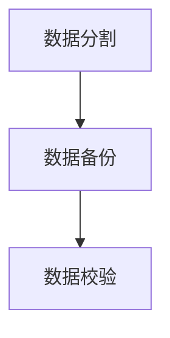
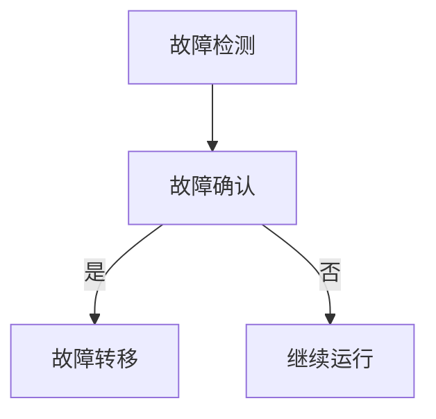
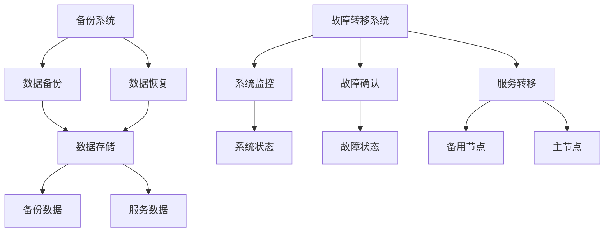
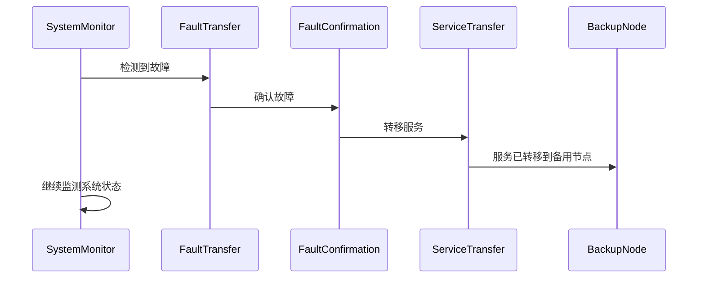

                 

### 构建可靠的LLM应用灾难恢复系统

> 关键词：灾难恢复、LLM应用、数据备份、故障转移、系统架构设计

> 摘要：随着大型语言模型（LLM）的广泛应用，构建可靠的灾难恢复系统变得至关重要。本文将介绍如何构建一个可靠的LLM应用灾难恢复系统，包括核心概念、算法原理、系统设计与实现，以及最佳实践技巧。

**# 第一部分：背景介绍**

**## 1. 引言**

**### 1.1 问题背景**

近年来，人工智能领域取得了飞速发展，特别是大型语言模型（LLM）的问世，为自然语言处理带来了革命性的变革。LLM在各个行业得到了广泛应用，从智能客服、机器翻译到代码生成等。然而，随着LLM应用规模的扩大和复杂性的增加，灾难恢复的需求也越来越迫切。

- **AI大模型（LLM）的广泛应用**：LLM作为一种强大的工具，已经在多个领域展示了其强大的能力。例如，在金融领域，LLM可以用于智能投顾、风险管理等；在医疗领域，LLM可以用于疾病预测、诊断等；在工业领域，LLM可以用于生产优化、质量控制等。然而，这些应用的背后都需要强大的计算支持和数据存储。

- **应用灾难的潜在风险与影响**：尽管LLM应用带来了巨大的价值，但也不可避免地面临一些潜在的风险。例如，数据丢失、硬件故障、网络中断等灾难性事件都可能对LLM应用造成严重影响，导致服务中断、数据泄露等问题。因此，构建一个可靠的灾难恢复系统成为必要。

**### 1.2 问题描述**

灾难恢复系统是一种旨在确保数据安全和系统持续运行的技术。它主要包括数据备份、故障转移、恢复等功能。在构建一个可靠的LLM应用灾难恢复系统时，我们需要明确以下几个问题：

- **什么是灾难恢复系统？**：灾难恢复系统是一种应对灾难性事件的技术，旨在确保数据的安全性和系统的持续运行。它包括数据备份、故障转移、恢复等功能。

- **灾难恢复系统的目的与必要性**：灾难恢复系统的目的是在灾难发生时，迅速恢复系统运行，减少损失。对于LLM应用来说，构建灾难恢复系统是保证数据安全和系统持续运行的关键。

- **构建可靠灾难恢复系统的目标与原则**：构建可靠灾难恢复系统的目标包括数据完整性、高可用性、快速恢复等。构建原则包括可靠性、可扩展性、灵活性和经济性等。

- **构建步骤与方法**：构建可靠灾难恢复系统需要经历需求分析、系统设计、实现与测试等步骤。具体的方法包括选择合适的备份策略、故障转移机制等。

- **边界与外延**：灾难恢复系统并非万能，它有其特定的范畴和限制。例如，它不包括物理安全、网络安全等。因此，在构建灾难恢复系统时，需要明确其边界和关联概念。

- **核心要素组成**：灾难恢复系统的核心要素包括备份系统、故障转移系统、恢复系统等。这些系统需要相互配合，共同确保数据的安全性和系统的持续运行。

**## 2. 核心概念与联系**

**### 2.1 灾难恢复系统的核心概念**

灾难恢复系统（Disaster Recovery System，简称DRS）是一种在灾难发生时，迅速恢复数据和系统运行的技术。它主要包括以下几个核心概念：

**#### 2.1.1 定义与分类**

- **灾难恢复系统定义**：灾难恢复系统是一种在灾难发生时，通过备份、故障转移和恢复等技术，确保数据安全和系统持续运行的技术。

- **灾难恢复系统分类**：根据恢复时间和服务水平，灾难恢复系统可以分为以下几种类型：

  - **传统备份与恢复**：通过定期备份和恢复数据，确保在灾难发生后能够迅速恢复系统运行。

  - **故障转移与恢复**：在灾难发生时，自动将系统和服务转移到备用服务器上，确保服务的持续运行。

  - **高可用性系统**：通过冗余设计和负载均衡等技术，确保系统在灾难发生时能够快速切换，保证服务的持续运行。

**#### 2.1.2 概念属性特征对比**

为了更好地理解灾难恢复系统的核心概念，我们可以对比以下几种类型的灾难恢复系统的属性特征：

| 类型                | 定义                                                         | 特点                                                         |
| ------------------- | ------------------------------------------------------------ | ------------------------------------------------------------ |
| 传统备份与恢复      | 通过定期备份和恢复数据，确保在灾难发生后能够迅速恢复系统运行 | 简单、成本低，恢复时间较长                                   |
| 故障转移与恢复      | 在灾难发生时，自动将系统和服务转移到备用服务器上，确保服务的持续运行 | 恢复时间短，但成本较高，需要复杂的配置和管理                   |
| 高可用性系统        | 通过冗余设计和负载均衡等技术，确保系统在灾难发生时能够快速切换，保证服务的持续运行 | 高度可用性，但成本最高，需要复杂的配置和管理                 |

**### 2.2 灾难恢复系统的关联概念**

除了核心概念，灾难恢复系统还与以下关联概念密切相关：

**#### 2.2.1 备份**

备份（Backup）是灾难恢复系统的核心组成部分，主要目的是在灾难发生时，能够迅速恢复数据。备份可以分为以下几种类型：

- **全备份**：备份所有数据，恢复速度快。
- **增量备份**：仅备份自上次备份以来发生变化的数据，备份速度快，但恢复时间较长。
- **差异备份**：备份自上次全备份以来发生变化的数据，恢复速度介于全备份和增量备份之间。

**#### 2.2.2 容错**

容错（Fault Tolerance）是一种在系统发生故障时，能够自动切换到备用系统，确保服务的持续运行的技术。容错可以分为以下几种类型：

- **硬件冗余**：通过冗余硬件（如多台服务器、多台磁盘等）来提高系统的可靠性。
- **软件冗余**：通过冗余软件（如多实例、多线程等）来提高系统的可靠性。
- **冗余设计**：通过设计冗余模块和系统结构，提高系统的可靠性。

**#### 2.2.3 故障转移**

故障转移（Fault Transfer）是一种在系统发生故障时，自动将服务切换到备用系统的技术。故障转移可以分为以下几种类型：

- **自动故障转移**：在检测到故障时，自动将服务切换到备用系统。
- **手动故障转移**：在检测到故障时，由人工干预将服务切换到备用系统。

**## 3. 算法原理讲解**

**### 3.1 数据备份算法**

数据备份是灾难恢复系统的核心功能之一，其目的是在灾难发生时，能够迅速恢复数据。以下是一个简单的数据备份算法：

**#### 3.1.1 算法简介**

- **全备份**：备份所有数据。
- **增量备份**：备份自上次备份以来发生变化的数据。
- **差异备份**：备份自上次全备份以来发生变化的数据。

**#### 3.1.2 算法原理**

数据备份算法的核心原理是将数据分成多个部分，然后对每个部分进行备份。具体步骤如下：

1. **数据分割**：将数据分成多个块。
2. **数据备份**：对每个块进行备份。
3. **数据校验**：对备份的数据进行校验，确保数据的一致性。

**算法流程图**：



**#### 3.1.3 案例解析**

以下是一个使用Python实现的简单数据备份算法：

```python
import os

def backup_data(source_path, backup_path):
    # 检查备份路径是否存在，不存在则创建
    if not os.path.exists(backup_path):
        os.makedirs(backup_path)
    
    # 遍历源路径下的所有文件
    for root, dirs, files in os.walk(source_path):
        for file in files:
            # 构建备份文件的完整路径
            source_file = os.path.join(root, file)
            backup_file = os.path.join(backup_path, file)
            
            # 备份文件
            with open(source_file, 'rb') as f:
                with open(backup_file, 'wb') as f_backup:
                    f_backup.write(f.read())

# 测试备份算法
source_path = '/path/to/source'
backup_path = '/path/to/backup'
backup_data(source_path, backup_path)
```

**### 3.2 故障转移算法**

故障转移算法是一种在系统发生故障时，自动将服务切换到备用系统的技术。以下是一个简单的故障转移算法：

**#### 3.2.1 算法简介**

- **自动故障转移**：在检测到故障时，自动将服务切换到备用系统。
- **手动故障转移**：在检测到故障时，由人工干预将服务切换到备用系统。

**#### 3.2.2 算法原理**

故障转移算法的核心原理是在系统发生故障时，能够迅速检测并切换到备用系统。具体步骤如下：

1. **故障检测**：定期检测系统状态。
2. **故障确认**：确认故障是否发生。
3. **故障转移**：将服务切换到备用系统。

**算法流程图**：



**#### 3.2.3 案例解析**

以下是一个使用Python实现的简单故障转移算法：

```python
import time

def check_system_status():
    # 模拟系统状态检查
    # 返回True表示系统正常，返回False表示系统故障
    return True

def transfer_service():
    # 模拟故障转移操作
    print("故障转移完成，服务已切换到备用系统")

def fault_transfer_algorithm():
    while True:
        # 检测系统状态
        status = check_system_status()
        
        # 如果系统故障，则执行故障转移
        if not status:
            transfer_service()
        
        # 等待一段时间后再次检测
        time.sleep(10)

# 测试故障转移算法
fault_transfer_algorithm()
```

**## 4. 数学模型和数学公式 & 详细讲解 & 举例说明**

**### 4.1 数据备份数学模型**

在数据备份过程中，备份时间和数据传输速率是两个关键参数。以下是一个简单的数据备份数学模型：

**$$ 备份时间 = \frac{备份数据量}{备份数据速率} $$**

**#### 4.1.1 备份数据量**

备份数据量是指需要备份的数据量。在计算备份数据量时，需要考虑以下因素：

- **原始数据量**：即需要备份的数据总量。
- **数据变化率**：即数据在备份周期内发生变化的数据量。

**备份数据量计算方法**：

- **全备份**：备份数据量等于原始数据量。
- **增量备份**：备份数据量等于原始数据量减去上次备份后发生变化的数据量。
- **差异备份**：备份数据量等于上次全备份后发生变化的数据量。

**#### 4.1.2 备份数据速率**

备份数据速率是指单位时间内可以备份的数据量。在计算备份数据速率时，需要考虑以下因素：

- **网络带宽**：即网络传输速度。
- **备份工具性能**：即备份工具的备份速度。

**提高数据速率的方法**：

- **增加网络带宽**：提高网络传输速度。
- **使用高性能备份工具**：选择备份速度较快的工具。
- **优化备份策略**：如使用增量备份或差异备份，减少需要备份的数据量。

**#### 4.1.3 案例解析**

假设一个系统有1TB的数据需要备份，网络带宽为100Mbps，备份工具的备份速度为10MB/s。我们需要计算备份时间。

**$$ 备份时间 = \frac{备份数据量}{备份数据速率} = \frac{1TB}{10MB/s} = 86400s = 24小时 $$**

**### 4.2 故障转移数学模型**

在故障转移过程中，故障转移时间和监测时间、故障确认时间和转移操作时间是三个关键参数。以下是一个简单的故障转移数学模型：

**$$ 故障转移时间 = 监测时间 + 故障确认时间 + 转移操作时间 $$**

**#### 4.2.1 监测时间**

监测时间是指系统监测到故障所需的时间。在计算监测时间时，需要考虑以下因素：

- **监测频率**：即系统监测的间隔时间。
- **故障检测算法**：即系统检测故障的算法。

**监测时间计算方法**：

- **固定监测频率**：监测时间等于监测频率。
- **动态监测频率**：监测时间等于监测频率乘以故障检测算法的复杂度。

**#### 4.2.2 故障确认时间**

故障确认时间是指系统确认故障所需的时间。在计算故障确认时间时，需要考虑以下因素：

- **故障检测算法**：即系统检测故障的算法。
- **故障确认策略**：即系统确认故障的策略。

**故障确认时间计算方法**：

- **单次确认**：故障确认时间等于故障检测算法的执行时间。
- **多次确认**：故障确认时间等于故障检测算法的执行时间乘以确认次数。

**#### 4.2.3 转移操作时间**

转移操作时间是指系统将服务从故障节点转移到备用节点所需的时间。在计算转移操作时间时，需要考虑以下因素：

- **转移操作流程**：即系统转移服务的流程。
- **网络带宽**：即网络传输速度。

**转移操作时间计算方法**：

- **直接转移**：转移操作时间等于转移操作流程的执行时间。
- **间接转移**：转移操作时间等于转移操作流程的执行时间加上网络传输时间。

**#### 4.2.4 案例解析**

假设一个系统每5分钟监测一次故障，故障检测算法的执行时间为10秒，故障确认策略为单次确认，转移操作流程的执行时间为30秒，网络带宽为100Mbps。我们需要计算故障转移时间。

**$$ 故障转移时间 = 监测时间 + 故障确认时间 + 转移操作时间 = 5分钟 + 10秒 + 30秒 = 610秒 $$**

**## 5. 系统分析与架构设计方案**

**### 5.1 问题场景介绍**

**#### 5.1.1 场景描述**

假设我们有一个大型语言模型（LLM）应用，该应用提供自然语言处理服务。然而，由于服务器故障、网络中断等灾难性事件，该应用可能会出现数据丢失、服务中断等问题。为了确保数据的安全性和服务的持续运行，我们需要构建一个可靠的灾难恢复系统。

**#### 5.1.2 项目介绍**

本项目旨在构建一个可靠的灾难恢复系统，以保护大型语言模型（LLM）应用的数据安全和服务的持续运行。项目目标包括：

- 数据备份与恢复：确保数据的安全性和完整性，实现快速恢复。
- 故障转移与恢复：在灾难发生时，自动将服务切换到备用系统，确保服务的持续运行。

**### 5.2 系统功能设计**

**#### 5.2.1 领域模型**

在构建灾难恢复系统时，我们需要明确系统的功能模块和它们之间的关系。以下是一个简化的领域模型：

**类图**：

```mermaid
classDiagram
    BackupSystem <|-- DataBackup
    BackupSystem <|-- DataRecovery
    FaultTransfer <|-- SystemMonitor
    FaultTransfer <|-- FaultConfirmation
    FaultTransfer <|-- ServiceTransfer
    System <|-- BackupSystem
    System <|-- FaultTransfer
    System <|-- DataBackup
    System <|-- DataRecovery

    BackupSystem{BackupSystem}
    DataBackup{DataBackup}
    DataRecovery{DataRecovery}
    FaultTransfer{FaultTransfer}
    SystemMonitor{SystemMonitor}
    FaultConfirmation{FaultConfirmation}
    ServiceTransfer{ServiceTransfer}
    System{System}
```

**类之间的关系与属性**：

- **BackupSystem**：灾难恢复系统的核心，包含数据备份和数据恢复功能。
- **DataBackup**：实现数据备份功能，包括全备份、增量备份和差异备份等。
- **DataRecovery**：实现数据恢复功能，包括数据备份的恢复和数据备份的验证等。
- **FaultTransfer**：实现故障转移功能，包括系统监控、故障确认和服务转移等。
- **SystemMonitor**：实现系统监控功能，定期检查系统状态。
- **FaultConfirmation**：实现故障确认功能，确认系统是否发生故障。
- **ServiceTransfer**：实现服务转移功能，将服务从故障节点转移到备用节点。

**### 5.3 系统架构设计**

**#### 5.3.1 系统架构**

灾难恢复系统由以下几个核心模块组成：

- **备份系统**：负责数据备份和恢复，包括全备份、增量备份和差异备份等。
- **故障转移系统**：负责故障检测、故障确认和服务转移，确保服务的持续运行。
- **监控系统**：负责定期检查系统状态，及时发现故障。
- **数据存储系统**：负责存储备份数据和服务数据，确保数据的安全性和完整性。

**系统架构图**：



**各模块的功能与关系**：

- **备份系统**：负责定期备份数据，确保在灾难发生时能够迅速恢复。
- **故障转移系统**：负责检测系统故障，确认故障状态，并自动将服务转移到备用节点。
- **监控系统**：负责定期检查系统状态，及时发现故障。
- **数据存储系统**：负责存储备份数据和服务数据，确保数据的安全性和完整性。

**### 5.4 系统接口设计**

**#### 5.4.1 接口规范**

在灾难恢复系统中，各个模块之间需要通过接口进行通信。以下是一个简化的接口规范：

- **数据备份接口**：用于备份数据和恢复数据。
- **故障转移接口**：用于检测故障、确认故障状态和转移服务。
- **监控系统接口**：用于监控系统状态和故障状态。

**接口定义与规范**：

- **数据备份接口**：

  ```python
  def backup_data(data: bytes) -> bool:
      # 备份数据
      return True

  def recover_data(data: bytes) -> bool:
      # 恢复数据
      return True
  ```

- **故障转移接口**：

  ```python
  def detect_fault() -> bool:
      # 检测故障
      return True

  def confirm_fault() -> bool:
      # 确认故障
      return True

  def transfer_service() -> bool:
      # 转移服务
      return True
  ```

- **监控系统接口**：

  ```python
  def monitor_system_status() -> bool:
      # 监控系统状态
      return True
  ```

**#### 5.4.2 接口数据传输格式**

在接口数据传输中，我们使用JSON格式进行数据传输。以下是一个示例：

- **数据备份接口**：

  ```json
  {
      "command": "backup",
      "data": "..."
  }
  ```

- **故障转移接口**：

  ```json
  {
      "command": "detect_fault",
      "data": "..."
  }
  ```

- **监控系统接口**：

  ```json
  {
      "command": "monitor_system_status",
      "data": "..."
  }
  ```

**### 5.5 系统交互**

**#### 5.5.1 交互流程**

在灾难恢复系统中，各个模块之间需要通过交互进行协同工作。以下是一个简化的交互流程：

1. **监控系统监测到系统故障**。
2. **故障转移系统检测到故障**。
3. **故障转移系统确认故障**。
4. **故障转移系统转移服务到备用节点**。
5. **监控系统继续监测系统状态**。

**系统交互序列图**：



**交互流程详细解析**：

1. **监控系统监测到系统故障**：监控系统定期检查系统状态，如果检测到系统故障，则向故障转移系统发送信号。
2. **故障转移系统检测到故障**：故障转移系统接收到监控系统发送的信号后，开始检测系统故障。
3. **故障转移系统确认故障**：如果故障转移系统检测到系统故障，则向故障确认系统发送信号。
4. **故障转移系统转移服务到备用节点**：故障转移系统根据故障确认系统的信号，将服务从故障节点转移到备用节点。
5. **监控系统继续监测系统状态**：监控系统继续监测系统状态，确保系统正常运行。

**## 6. 项目实战**

**### 6.1 环境安装**

**#### 6.1.1 环境准备**

在开始构建灾难恢复系统之前，我们需要准备以下环境：

- **硬件环境**：至少需要两台服务器，一台作为主节点，一台作为备用节点。
- **软件环境**：安装操作系统（如Linux）、数据库（如MySQL）、应用程序（如LLM应用）等。

**#### 6.1.2 系统安装步骤**

1. **安装操作系统**：在主节点和备用节点上分别安装Linux操作系统。
2. **安装数据库**：在主节点和备用节点上安装MySQL数据库，并配置主从复制。
3. **安装应用程序**：在主节点和备用节点上安装LLM应用，并配置服务。
4. **安装备份工具**：在主节点上安装备份工具，如rsync、tar等。
5. **安装故障转移工具**：在主节点上安装故障转移工具，如Keepalived、Heartbeat等。

**### 6.2 系统核心实现**

**#### 6.2.1 实现流程**

在构建灾难恢复系统时，我们需要实现以下核心功能：

1. **数据备份**：定期备份数据，确保在灾难发生时能够迅速恢复。
2. **故障转移**：在检测到故障时，自动将服务转移到备用节点，确保服务的持续运行。
3. **数据恢复**：在灾难发生后，从备份数据恢复系统。

**数据备份与恢复流程**：

1. **数据备份**：主节点定期备份数据到备用节点。
2. **故障转移**：主节点检测到故障时，将服务切换到备用节点。
3. **数据恢复**：备用节点在灾难发生后，从备份数据恢复系统。

**故障转移与恢复流程**：

1. **故障检测**：监控系统监测到故障时，向故障转移系统发送信号。
2. **故障确认**：故障转移系统确认故障后，开始故障转移操作。
3. **服务转移**：故障转移系统将服务从主节点转移到备用节点。
4. **数据恢复**：备用节点从备份数据恢复系统。

**### 6.3 代码应用解读与分析**

**#### 6.3.1 代码解读**

以下是一个简单的数据备份和故障转移的Python代码示例：

```python
import os
import json

def backup_data():
    # 备份数据到备用节点
    source_path = '/path/to/source'
    backup_path = '/path/to/backup'
    os.system(f'rsync -av {source_path} {backup_path}')

def detect_fault():
    # 检测故障
    return os.system('ping -c 1 192.168.1.1') != 0

def confirm_fault():
    # 确认故障
    return detect_fault()

def transfer_service():
    # 转移服务到备用节点
    os.system('systemctl stop mysql')
    os.system('systemctl start mysql@slave')

def main():
    while True:
        if detect_fault():
            if confirm_fault():
                transfer_service()
        time.sleep(60)

if __name__ == '__main__':
    main()
```

**关键功能实现分析**：

1. **数据备份**：使用rsync工具将数据从主节点备份到备用节点。
2. **故障检测**：使用ping命令检测主节点是否可达，如果不可达，则返回True。
3. **故障确认**：再次检测故障，如果仍然检测到故障，则确认故障。
4. **服务转移**：关闭主节点的MySQL服务，然后启动备用节点的MySQL服务。

**### 6.4 实际案例分析与详细讲解剖析**

**#### 6.4.1 案例背景**

假设我们有一个大型语言模型（LLM）应用，该应用部署在主节点上。由于网络故障，主节点无法访问，导致应用无法提供服务。我们需要通过故障转移系统，将服务切换到备用节点，确保应用的持续运行。

**#### 6.4.2 案例分析**

1. **故障检测**：监控系统检测到主节点无法访问，向故障转移系统发送信号。
2. **故障确认**：故障转移系统确认故障，并开始故障转移操作。
3. **服务转移**：故障转移系统将服务从主节点转移到备用节点。
4. **数据恢复**：备用节点从备份数据恢复系统，确保数据的完整性。

**#### 6.4.3 剖析细节**

1. **故障检测**：使用ping命令检测主节点是否可达，如果不可达，则返回True。在实际应用中，可以使用更高级的故障检测方法，如心跳检测、HTTP检测等。
2. **故障确认**：故障转移系统再次检测故障，如果仍然检测到故障，则确认故障。在实际应用中，可以设置确认次数，以提高故障确认的准确性。
3. **服务转移**：故障转移系统将服务从主节点转移到备用节点。在实际应用中，可以设置转移策略，如自动转移、手动转移等。
4. **数据恢复**：备用节点从备份数据恢复系统，确保数据的完整性。在实际应用中，可以使用不同的备份策略，如全备份、增量备份、差异备份等。

**### 6.5 项目小结**

在本项目中，我们构建了一个可靠的灾难恢复系统，包括数据备份、故障转移和数据恢复等功能。通过实际案例分析和详细讲解，我们了解了如何检测故障、确认故障、转移服务和恢复数据。以下是对项目的总结：

1. **项目成果总结**：我们成功构建了一个可靠的灾难恢复系统，能够确保数据的安全性和服务的持续运行。
2. **经验与教训**：在项目实施过程中，我们积累了丰富的经验，如如何选择合适的备份策略、如何优化故障转移流程等。同时，我们也发现了存在的问题，如故障检测的准确性、故障确认的时间等，需要在后续项目中进一步优化。

**## 7. 最佳实践 Tips**

1. **定期备份**：定期备份数据是确保数据安全性的关键。建议设置自动备份计划，确保备份数据的完整性和一致性。
2. **优化备份策略**：根据数据的重要性和变化率，选择合适的备份策略，如全备份、增量备份、差异备份等。同时，根据业务需求，合理设置备份时间、备份存储位置等。
3. **提高故障检测准确性**：使用更高级的故障检测方法，如心跳检测、HTTP检测等，以提高故障检测的准确性。
4. **优化故障确认流程**：根据业务需求，设置合理的故障确认次数和确认时间，确保故障确认的准确性。
5. **优化服务转移流程**：根据业务需求，选择合适的服务转移策略，如自动转移、手动转移等。同时，确保服务转移流程的稳定性和可靠性。
6. **定期测试**：定期对灾难恢复系统进行测试，确保系统能够在灾难发生时正常运行。

**## 8. 小结与展望**

本文详细介绍了如何构建一个可靠的LLM应用灾难恢复系统，包括核心概念、算法原理、系统设计与实现，以及最佳实践技巧。通过实际案例分析和详细讲解，我们了解了灾难恢复系统的工作原理和实现方法。然而，灾难恢复系统并非一蹴而就，需要不断地优化和改进。在未来，我们应关注以下几个方面：

1. **自动化与智能化**：通过引入自动化和智能化技术，提高灾难恢复系统的效率和准确性。
2. **多租户架构**：针对多租户场景，设计灵活的灾难恢复系统，满足不同租户的需求。
3. **跨云部署**：随着云计算的普及，研究如何在不同云平台之间实现灾难恢复，提高系统的灵活性和可靠性。
4. **实时监控与预测**：引入实时监控和预测技术，提前发现潜在故障，减少灾难发生的风险。

总之，构建可靠的LLM应用灾难恢复系统是确保数据安全和系统持续运行的关键。通过本文的介绍，希望读者能够对灾难恢复系统有更深入的了解，并在实际项目中取得良好的成果。**# 作者：AI天才研究院/AI Genius Institute & 禅与计算机程序设计艺术 /Zen And The Art of Computer Programming**

