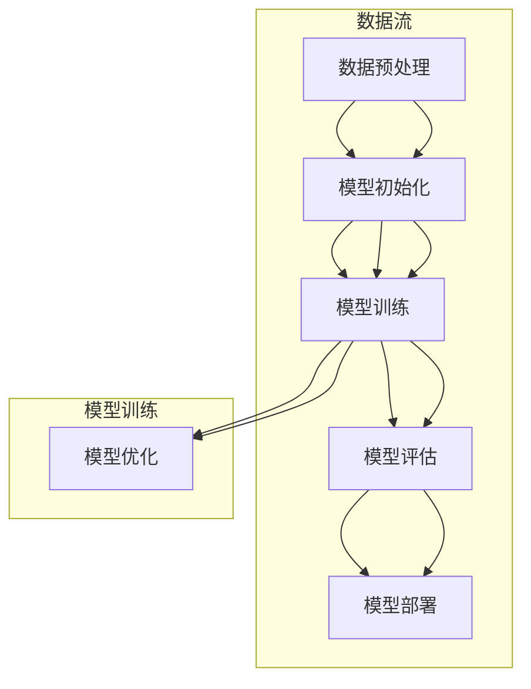
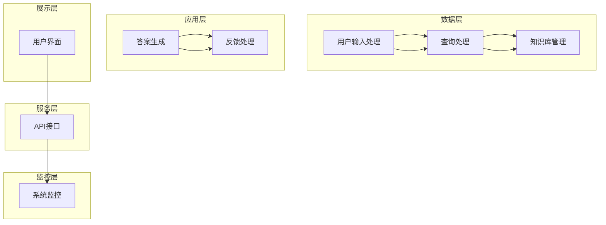
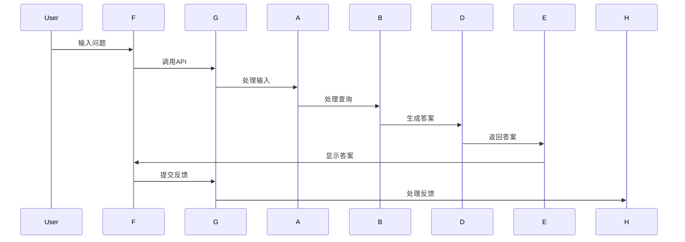
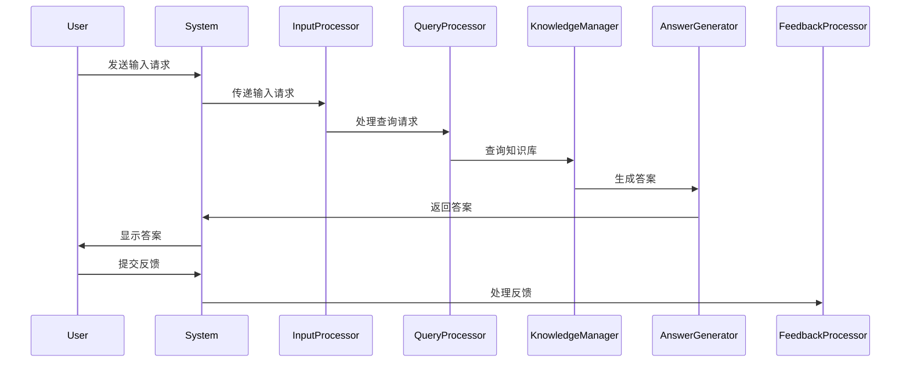

                 

### 引言与背景

随着人工智能技术的飞速发展，大型语言模型（LLM）已成为推动各种应用场景的核心驱动力。LLM技术在自然语言处理（NLP）、智能助手、机器翻译、文本生成等多个领域展现出巨大的潜力和实际应用价值。然而，在快速迭代的AI领域，如何构建一个灵活、高效、可扩展的LLM工程技术架构成为亟待解决的关键问题。

**核心概念术语说明**：

- **大型语言模型（LLM）**：一种基于深度学习的语言处理模型，能够理解和生成自然语言文本。
- **敏捷迭代**：一种软件开发方法，强调快速迭代、持续交付和灵活应对变化。
- **工程技术架构**：软件系统中的结构设计，旨在实现高可靠性、高性能、易于维护的系统。

**问题背景**：

在当前的技术环境中，LLM技术的应用越来越广泛，但随之而来的挑战也越来越大。传统的软件开发模式往往无法满足快速迭代的需求，导致研发周期延长、成本增加。此外，LLM模型的高复杂性使得传统的架构设计方法难以应对，特别是在模型优化、数据集处理和系统部署等方面。

**问题描述**：

构建一个敏捷迭代的LLM工程技术架构，旨在解决以下问题：
- **灵活性**：如何设计一个灵活的架构，以便快速适应需求变化？
- **可扩展性**：如何确保架构能够随着模型规模和需求的变化进行扩展？
- **可维护性**：如何提高系统的可维护性，降低长期维护成本？
- **高性能**：如何优化架构，以支持大规模模型的快速训练和部署？

**问题解决**：

构建敏捷迭代的LLM工程技术架构，需要综合考虑以下几个方面：
- **模块化设计**：将系统划分为独立的模块，便于快速迭代和扩展。
- **微服务架构**：采用微服务架构，提高系统的可维护性和可扩展性。
- **数据管理**：优化数据集处理流程，提高数据质量和处理效率。
- **模型优化**：引入先进的模型优化方法，提高训练和推理性能。

**边界与外延**：

本文讨论的LLM工程技术架构主要关注以下几个方面：
- **技术实现**：涉及LLM模型设计、优化、数据处理和系统部署等技术实现细节。
- **应用场景**：涵盖NLP、智能助手、机器翻译等典型应用场景。
- **发展趋势**：探讨LLM工程技术架构的未来发展趋势和挑战。

**核心要素组成**：

构建敏捷迭代的LLM工程技术架构，需要以下核心要素：
- **需求分析**：准确识别和描述系统需求。
- **架构设计**：制定合理的系统架构设计方案。
- **数据管理**：确保数据质量和处理效率。
- **模型训练与优化**：优化模型性能，提高系统可靠性。
- **系统部署与维护**：确保系统的稳定运行和长期维护。

### 第1章：问题背景与核心概念

#### 1.1 引言：人工智能与LLM的兴起

在探讨构建敏捷迭代的LLM工程技术架构之前，我们需要了解人工智能（AI）的发展背景以及LLM技术在其中的重要性。

**人工智能的发展背景**：

人工智能（AI）是一门多学科交叉的科学，旨在通过模拟、延伸和扩展人的智能，实现计算机对复杂问题的自动求解。AI的发展经历了几个重要阶段：

1. **符号主义阶段**（1950s-1970s）：以符号推理为基础，尝试通过规则和逻辑来模拟人类的智能。
2. **专家系统阶段**（1970s-1980s）：利用知识库和推理机来模拟专家的决策过程。
3. **联结主义阶段**（1990s-2000s）：以神经网络为代表，通过大量数据训练模型，实现自动特征提取和模式识别。
4. **大数据与深度学习阶段**（2010s-至今）：借助海量数据和强大的计算能力，深度学习技术在图像识别、语音识别、自然语言处理等领域取得了突破性进展。

**LLM技术的兴起**：

大型语言模型（LLM）是自然语言处理领域的一种重要技术。LLM通过深度神经网络对大量文本数据进行训练，学习语言的结构和语义，从而实现高质量的自然语言理解和生成。

LLM技术的兴起得益于以下几个因素：

1. **数据量增长**：互联网和数字化的普及使得海量的文本数据成为可能，为LLM的训练提供了丰富的资源。
2. **计算能力提升**：随着计算能力的不断提升，特别是GPU和TPU等专用硬件的发展，深度学习模型的训练变得更加高效和可行。
3. **算法优化**：新的优化算法和模型架构（如Transformer）使得LLM的性能得到了显著提升。

**LLM技术的重要性**：

LLM技术在多个领域展现出巨大的应用潜力：

1. **自然语言处理**：LLM在文本分类、情感分析、问答系统等领域取得了显著成果，提高了自然语言处理任务的准确性和效率。
2. **智能助手**：LLM技术使得智能助手能够更好地理解用户意图，提供更自然的交互体验。
3. **机器翻译**：LLM在机器翻译领域的表现超过了许多传统的基于规则的方法，实现了更准确的翻译结果。
4. **文本生成**：LLM能够生成高质量的文本内容，应用于内容创作、摘要生成和对话系统等领域。

**问题解决**：

然而，随着LLM技术的广泛应用，也带来了一系列挑战。传统的软件开发模式在应对快速迭代和大规模数据处理方面显得力不从心。因此，构建一个敏捷迭代的LLM工程技术架构成为解决这些问题的关键。

敏捷迭代方法强调快速交付和持续改进，通过持续集成、持续交付和持续反馈等实践，使团队能够更快地响应需求变化，提高开发效率和产品质量。

工程技术架构则提供了系统设计的基础，通过模块化、微服务化和数据管理等方法，确保系统的高灵活性、可扩展性和可维护性。

**边界与外延**：

本文将围绕构建敏捷迭代的LLM工程技术架构展开讨论，涉及以下核心概念和要素：

- **LLM技术原理**：介绍LLM的基本原理和常用算法。
- **敏捷迭代方法**：探讨敏捷迭代在LLM开发中的应用。
- **工程技术架构**：分析LLM工程技术架构的设计原则和实践。

通过这些核心概念和要素的深入探讨，本文旨在为读者提供一个系统化的指导，帮助他们在实际项目中构建高效、灵活和可扩展的LLM工程技术架构。

#### 1.2 核心概念介绍

为了深入理解LLM工程技术架构的构建，我们需要详细介绍其中的核心概念，包括LLM的工作原理、敏捷迭代方法和工程技术架构的设计原则。

**LLM原理**

LLM（大型语言模型）是一种基于深度学习的语言处理模型，能够理解和生成自然语言文本。LLM通常由多层神经网络组成，通过学习海量文本数据来捕捉语言的语义和结构。

**LLM的工作原理**

LLM的工作原理可以概括为以下几个步骤：

1. **数据预处理**：对原始文本数据进行清洗、分词、去停用词等处理，将其转换为模型可以处理的格式。
2. **模型训练**：使用预处理的文本数据对神经网络进行训练，通过反向传播算法不断调整模型参数，使其能够准确理解和生成文本。
3. **文本生成**：输入新的文本数据，模型根据训练结果生成相应的文本输出。

**LLM算法**

在LLM中，常用的算法包括：

- **Transformer**：一种基于自注意力机制的神经网络模型，能够捕捉文本中的长距离依赖关系。
- **BERT**：一种预训练和微调的双向编码器模型，通过在大量无标签文本上预训练，然后在特定任务上进行微调。
- **GPT**：一种生成预训练模型，通过大量的文本数据进行无监督预训练，然后用于生成文本或进行特定任务的微调。

**敏捷迭代方法**

敏捷迭代方法是一种软件开发方法，强调快速迭代、持续交付和灵活应对变化。在LLM工程中，敏捷迭代方法有助于提高开发效率、缩短研发周期、提高产品质量。

**敏捷迭代的关键要素**

1. **用户故事**：通过用户故事来明确需求，将大型任务分解为可管理的小任务。
2. **迭代计划**：在迭代周期内规划任务，确保在每个迭代中都能够交付有价值的功能。
3. **持续集成**：通过自动化测试和持续集成工具，确保代码库的稳定性和可部署性。
4. **用户反馈**：在迭代过程中积极收集用户反馈，不断优化产品功能。

**工程技术架构**

工程技术架构是软件开发过程中系统设计的基础，通过模块化、微服务化和数据管理等方法，确保系统的高灵活性、可扩展性和可维护性。

**工程技术架构的设计原则**

1. **模块化设计**：将系统划分为独立的模块，每个模块负责特定的功能，便于快速迭代和扩展。
2. **微服务架构**：采用微服务架构，将系统拆分为多个小型服务，每个服务独立部署和扩展，提高系统的灵活性和可维护性。
3. **数据管理**：优化数据集处理流程，提高数据质量和处理效率，确保模型训练的准确性和稳定性。

**核心概念对比表格**

为了更好地理解这些核心概念，我们可以使用对比表格来展示它们的主要特点和关系：

| 核心概念 | 主要特点 |
| --- | --- |
| LLM原理 | 基于深度学习的语言处理模型 |
| 敏捷迭代方法 | 快速迭代、持续交付和灵活应对变化 |
| 工程技术架构 | 模块化、微服务化和数据管理 |

**ER实体关系图架构**

为了进一步理解LLM工程技术架构，我们可以使用Mermaid绘制ER实体关系图，展示各个核心概念之间的关系：

```mermaid
erDiagram
  LLM原理 ||--o> 敏捷迭代方法 : 基于敏捷迭代方法
  敏捷迭代方法 ||--o> 工程技术架构 : 设计原则
  工程技术架构 ||--o> LLM原理 : 架构实现
```

通过上述核心概念和对比表格的介绍，我们可以更深入地理解LLM工程技术架构的构建，为后续章节的分析和讨论打下坚实的基础。

### 第2章：LLM工程技术架构概述

在构建敏捷迭代的LLM工程技术架构时，理解架构的组成部分、体系结构设计原则以及如何实现灵活性和可扩展性至关重要。本章节将详细讨论这些核心内容，帮助读者构建一个高效、灵活的LLM工程技术架构。

#### 2.1 LLM工程技术架构的组成部分

LLM工程技术架构由多个关键组件组成，这些组件协同工作，确保系统的高性能、可维护性和可扩展性。以下是LLM工程技术架构的主要组成部分：

1. **数据层**：数据层是整个架构的基础，负责存储和处理大量的文本数据。数据层通常包括数据存储、数据清洗、数据预处理和数据管理模块。这些模块确保数据的高质量、一致性和可访问性。

2. **模型层**：模型层负责处理和训练LLM模型。这一层包括模型设计、模型训练、模型优化和模型评估模块。通过先进的算法和优化技术，模型层能够提高模型性能和准确性。

3. **服务层**：服务层是系统对外提供服务的接口，负责处理用户请求并返回结果。服务层通常包括API接口、服务端逻辑和中间件模块。通过微服务架构，服务层可以提高系统的灵活性和可扩展性。

4. **展示层**：展示层负责将处理结果以用户友好的方式呈现给用户。展示层通常包括前端框架、后端接口和客户端界面模块。通过现代化的前端技术，展示层可以提供出色的用户体验。

5. **监控与运维层**：监控与运维层负责系统的监控、日志记录、性能分析和故障恢复。通过自动化工具和监控平台，监控与运维层确保系统的稳定运行和高效维护。

#### 2.2 体系结构设计原则

在设计和实现LLM工程技术架构时，以下原则至关重要：

1. **模块化设计**：将系统划分为独立的模块，每个模块负责特定的功能。模块化设计有助于提高系统的可维护性、可扩展性和可重用性。

2. **微服务架构**：采用微服务架构，将系统拆分为多个小型服务，每个服务独立部署和扩展。微服务架构可以提高系统的灵活性和可扩展性，同时降低故障传播的风险。

3. **数据管理**：优化数据集处理流程，确保数据的高质量、一致性和可访问性。数据管理原则包括数据清洗、数据预处理、数据存储和数据迁移等。

4. **高性能计算**：利用高性能计算技术和优化算法，提高模型训练和推理的效率。这包括使用GPU、TPU等专用硬件，以及优化代码和算法。

5. **自动化与持续集成**：通过自动化工具和持续集成平台，实现代码的自动化测试、构建和部署。自动化与持续集成有助于提高开发效率、减少错误和确保系统的稳定性。

6. **安全性**：确保系统数据的安全性和完整性，采用安全协议、加密技术和访问控制等措施。

7. **可维护性**：设计易于维护的架构，通过清晰的模块划分、详细的文档和完善的测试，降低维护成本和提高系统可靠性。

#### 2.3 实现灵活性与可扩展性的方法

为了实现LLM工程技术架构的灵活性和可扩展性，可以采取以下方法：

1. **动态资源分配**：利用云计算和容器技术，实现动态资源分配。根据负载情况自动调整计算资源，确保系统的高性能和可扩展性。

2. **服务拆分与聚合**：将大型服务拆分为多个小型服务，每个服务负责特定的功能。通过服务聚合，可以将多个小型服务组合为一个完整的系统。

3. **异步处理**：采用异步处理机制，提高系统的并发能力和响应速度。异步处理可以减少系统的等待时间，提高资源利用率。

4. **缓存机制**：引入缓存机制，减少数据访问的延迟和系统负载。通过缓存频繁访问的数据，可以显著提高系统的性能和响应速度。

5. **服务发现与负载均衡**：实现服务发现机制，确保系统中的服务可以动态注册和发现。通过负载均衡技术，合理分配请求到不同的服务实例，确保系统的稳定性和高可用性。

通过上述方法，可以构建一个高效、灵活和可扩展的LLM工程技术架构，为LLM模型的研发和应用提供坚实的基础。

### 第3章：LLM模型设计与优化

LLM模型设计是构建高效、灵活和可扩展的LLM工程技术架构的核心步骤。本章将详细讨论LLM模型设计流程、优化策略，并介绍如何通过先进的算法和工具提升模型性能。

#### 3.1 LLM模型设计流程

LLM模型设计流程是一个系统性工程，涉及到数据预处理、模型选择、模型训练和模型评估等多个环节。以下是LLM模型设计的详细步骤：

1. **需求分析**：明确项目目标和需求，包括模型应用场景、性能指标和预期效果。这一步有助于确定模型设计的方向和重点。

2. **数据收集与预处理**：收集大规模的文本数据，并进行预处理。预处理步骤通常包括数据清洗、分词、去停用词、词向量化等。高质量的数据是模型训练成功的关键。

3. **模型选择**：根据需求选择合适的模型架构。常见的LLM模型包括Transformer、BERT、GPT等。选择模型时需要考虑模型的复杂度、训练时间、推理速度和效果等因素。

4. **模型训练**：使用预处理后的数据对模型进行训练。训练过程包括前向传播、反向传播和参数更新等步骤。优化算法（如Adam、Adagrad等）和超参数调整（如学习率、批量大小等）对训练过程至关重要。

5. **模型评估**：在验证集和测试集上评估模型性能，包括准确性、召回率、F1分数等指标。模型评估有助于调整模型参数和改进模型结构。

6. **模型优化**：根据评估结果对模型进行优化，包括超参数调整、模型结构调整和正则化等。优化的目标是提高模型性能和泛化能力。

7. **模型部署**：将训练好的模型部署到生产环境中，实现模型的推理和预测功能。部署过程需要考虑模型的可扩展性、安全性和可靠性。

#### 3.2 模型优化策略

模型优化是提高LLM模型性能和准确性的关键步骤。以下是一些常用的模型优化策略：

1. **数据增强**：通过增加数据多样性、引入噪声和生成对抗网络（GAN）等方法，增加训练数据的多样性，提高模型的泛化能力。

2. **正则化**：使用正则化技术（如L1、L2正则化、Dropout等）减少模型过拟合现象，提高模型泛化能力。

3. **迁移学习**：利用预训练模型（如BERT、GPT等）作为起点，针对特定任务进行微调。迁移学习可以显著提高模型的训练效率和性能。

4. **多任务学习**：将多个相关任务合并为一个模型进行训练，共享特征表示。多任务学习有助于提高模型的泛化能力和效率。

5. **强化学习**：结合强化学习算法，利用策略梯度等方法优化模型行为。强化学习可以提升模型的决策能力，特别是在序列决策任务中。

6. **模型剪枝**：通过剪枝技术（如结构剪枝、权重剪枝等）减少模型参数数量，降低模型复杂度和计算成本，同时保持模型性能。

7. **量化**：使用量化技术（如整数量化、低精度量化等）减少模型参数的精度，降低模型存储和计算需求，同时保持模型性能。

通过上述模型优化策略，可以在不显著增加计算成本的情况下，显著提高LLM模型性能和准确性，为实际应用提供更高效、更可靠的解决方案。

### 第4章：数据集准备与处理

在构建大型语言模型（LLM）的过程中，数据集的准备与处理是至关重要的一环。一个高质量的数据集不仅可以提高模型的性能，还能增强模型的泛化能力。本章将详细介绍数据集的准备流程、数据处理方法以及数据质量评估。

#### 4.1 数据集准备

数据集的准备主要包括数据来源的选择和数据预处理。以下是数据集准备的具体步骤：

1. **数据来源**：选择合适的数据集，确保数据具有代表性和多样性。数据来源可以包括以下几种：
   - **公开数据集**：如Wikipedia、Common Crawl、OpenSubtitles等，这些数据集提供了大量的文本数据。
   - **定制数据集**：针对特定任务定制数据集，例如通过爬虫技术从网站、社交媒体、论坛等渠道收集文本数据。
   - **行业数据集**：从特定行业（如金融、医疗、法律等）获取专业文本数据，以提高模型在该领域的表现。

2. **数据收集**：使用爬虫、API接口或手动标注等方法收集文本数据。在收集过程中，需要注意数据的一致性和完整性，避免数据缺失或不一致。

3. **数据清洗**：对收集到的原始数据进行清洗，去除无关内容、噪音和错误。清洗步骤包括：
   - **去除HTML标签**：从文本中去除HTML标签和其他格式化元素。
   - **去除停用词**：删除常见的无意义词汇，如“的”、“了”、“在”等。
   - **统一文本格式**：将文本转换为统一格式，如小写、去除特殊字符等。

4. **数据预处理**：将清洗后的文本数据转换为模型可以处理的格式。预处理步骤包括：
   - **分词**：将文本拆分为词语或子词。
   - **词向量化**：将词语转换为向量表示，如使用Word2Vec、GloVe等方法。
   - **构建词汇表**：构建包含所有词语的词汇表，并为每个词语分配唯一的索引。

5. **数据标注**：对于某些任务，如情感分析、命名实体识别等，需要对数据进行标注。标注工作可以由专业标注人员完成，也可以使用半监督或完全自动化的方法。

#### 4.2 数据处理方法

数据处理方法主要包括数据增强、数据去重、数据平衡和数据清洗等。以下是几种常用的数据处理方法：

1. **数据增强**：通过增加数据多样性来提高模型性能。数据增强方法包括：
   - **文本复制**：复制部分文本内容，增加数据量。
   - **随机插入**：在文本中随机插入词语或子句。
   - **随机删除**：随机删除部分词语或子句。
   - **词替换**：用同义词或随机词语替换原文本中的词语。

2. **数据去重**：去除重复的数据，提高数据集的质量和效率。数据去重可以通过以下方法实现：
   - **基于文本内容**：比较文本的相似度，去除高度相似的数据。
   - **基于哈希值**：使用哈希函数对数据进行去重，快速检测重复数据。

3. **数据平衡**：对于分类任务，确保数据集中各个类别的样本数量接近。数据平衡方法包括：
   - **过采样**：增加少数类别的样本数量。
   - **欠采样**：减少多数类别的样本数量。
   - **合成数据**：通过生成对抗网络（GAN）等方法生成新的样本，填补数据集的空白。

4. **数据清洗**：去除数据中的噪声和错误，提高数据质量。数据清洗方法包括：
   - **去噪声**：去除文本中的噪声，如URL、HTML标签等。
   - **错误修正**：修正文本中的拼写错误、语法错误等。
   - **统一格式**：将文本转换为统一格式，如小写、去除特殊字符等。

#### 4.3 数据质量评估

数据质量直接影响模型的性能和泛化能力。以下是一些常见的数据质量评估方法：

1. **数据完整性评估**：检查数据集中是否存在缺失值、重复值和异常值。使用统计方法（如描述性统计、缺失值分析等）评估数据的完整性。

2. **数据一致性评估**：检查数据集中不同来源的数据是否一致。使用一致性检验方法（如Kappa系数、一致性比例等）评估数据的一致性。

3. **数据准确性评估**：评估数据标注的准确性。使用交叉验证、混淆矩阵等方法评估标注数据的准确性。

4. **数据代表性评估**：评估数据集是否能够代表实际应用场景。使用代表性评估方法（如偏差-方差分析、数据分布比较等）评估数据的代表性。

5. **数据多样性评估**：评估数据集的多样性。使用多样性评估指标（如多样性指数、熵等）评估数据的多样性。

通过上述数据集准备与处理方法，我们可以构建一个高质量、多样化、具有代表性的数据集，为LLM模型的研究和应用奠定坚实基础。

### 第5章：LLM算法原理与数学模型

在本章中，我们将深入探讨大型语言模型（LLM）的算法原理及其背后的数学模型。通过使用mermaid流程图展示算法流程，结合Python源代码详细阐述模型的工作机制，以及使用LaTeX格式嵌入数学公式来解释关键概念，我们将帮助读者全面理解LLM的内在机制。

#### 5.1 算法原理

LLM算法的核心在于其能够从大量的文本数据中学习并生成自然语言。这一过程主要依赖于深度学习，尤其是基于Transformer架构的模型，如BERT、GPT等。下面我们将详细描述LLM算法的基本原理和主要步骤。

**算法流程图**

使用mermaid绘制LLM算法流程图：



**详细算法步骤**

1. **数据预处理**：这是算法的第一步，主要任务是将原始文本数据转换为模型可接受的格式。步骤包括分词、词向量化、序列编码等。
   
2. **模型初始化**：初始化模型的参数，通常使用预训练的权重或随机初始化。

3. **模型训练**：模型使用预处理后的数据通过前向传播和反向传播算法进行训练。在这一步，模型会不断调整参数以最小化损失函数。

4. **模型评估**：使用验证集评估模型的性能，包括准确性、召回率、F1分数等指标。

5. **模型优化**：根据评估结果对模型进行优化，包括超参数调整、模型结构调整等。

6. **模型部署**：将训练好的模型部署到实际应用场景中，如文本生成、问答系统等。

#### 5.2 Python源代码

下面是一个简单的Python代码示例，展示了一个基于Transformer架构的LLM模型的初始化和训练过程。这里使用PyTorch框架进行演示。

```python
import torch
import torch.nn as nn
import torch.optim as optim
from torch.utils.data import DataLoader
from transformers import TransformerModel

# 模型初始化
model = TransformerModel()

# 损失函数
criterion = nn.CrossEntropyLoss()

# 优化器
optimizer = optim.Adam(model.parameters(), lr=0.001)

# 数据预处理（示例）
# dataset = TextDataset()  # 需要实现自定义数据集类
# data_loader = DataLoader(dataset, batch_size=32, shuffle=True)

# 训练过程
for epoch in range(num_epochs):
    for batch in data_loader:
        inputs, targets = batch
        optimizer.zero_grad()
        outputs = model(inputs)
        loss = criterion(outputs, targets)
        loss.backward()
        optimizer.step()
        print(f"Epoch [{epoch+1}/{num_epochs}], Loss: {loss.item():.4f}")

# 模型评估（示例）
# with torch.no_grad():
#     eval_loss = 0
#     for batch in eval_loader:
#         inputs, targets = batch
#         outputs = model(inputs)
#         loss = criterion(outputs, targets)
#         eval_loss += loss.item()
# print(f"Validation Loss: {eval_loss/len(eval_loader):.4f}")
```

这个示例代码展示了模型初始化、损失函数定义、优化器选择以及数据加载和训练的基本流程。请注意，这里的数据集和评估代码需要根据实际项目需求进行实现。

#### 5.3 数学模型与公式

在LLM算法中，数学模型起着关键作用。以下是一些常见的数学公式和概念：

**输入层到隐藏层的映射公式**：

$$
h^{(l)} = \sigma(W^{(l)} \cdot h^{(l-1)} + b^{(l)})
$$

其中，$h^{(l)}$表示第l层的隐藏状态，$W^{(l)}$和$b^{(l)}$分别为权重和偏置，$\sigma$为激活函数（如ReLU、Sigmoid等）。

**损失函数**：

$$
Loss = -\sum_{i}^{N} y_i \cdot log(p_i)
$$

其中，$y_i$为标签，$p_i$为模型预测的输出概率。

**梯度下降更新公式**：

$$
\theta^{(t+1)} = \theta^{(t)} - \alpha \cdot \nabla_{\theta} Loss
$$

其中，$\theta$为模型参数，$\alpha$为学习率，$\nabla_{\theta} Loss$为损失函数关于参数的梯度。

**自注意力机制**：

$$
\alpha_{ij} = \frac{e^{z_{ij}}}{\sum_{k=1}^{K} e^{z_{ik}}}
$$

其中，$z_{ij}$为点积注意力得分，$\alpha_{ij}$为注意力权重。

#### 5.4 举例说明

为了更好地理解上述公式和概念，我们可以通过一个简单的例子来说明它们的应用。

**例子**：假设我们有一个二元分类问题，使用一个简单的神经网络进行预测。输入数据为两个特征向量$x_1$和$x_2$，模型预测概率为$p$。

- 输入层到隐藏层的映射：

$$
h^{(1)} = \sigma(W^{(1)} \cdot [x_1, x_2] + b^{(1)})
$$

- 损失函数：

$$
Loss = -y \cdot log(p)
$$

- 梯度下降更新：

$$
\theta^{(t+1)} = \theta^{(t)} - \alpha \cdot \nabla_{\theta} Loss
$$

通过这些公式，我们可以计算出模型的预测概率、损失值以及参数的更新。

**总结**：

在本章中，我们详细介绍了LLM算法的原理、流程以及数学模型。通过mermaid流程图、Python源代码和LaTeX公式，我们帮助读者深入理解了LLM的工作机制。这些知识将为后续章节的系统分析与架构设计提供坚实的基础。

### 第6章：系统功能设计与架构

在构建大型语言模型（LLM）系统时，系统功能设计是确保系统能够满足需求、提供高质量服务的关键步骤。本章节将详细介绍系统功能设计的过程，包括问题场景介绍、系统功能设计和系统架构设计。

#### 6.1 问题场景介绍

以一个智能问答系统为例，该系统需要能够回答用户提出的问题，并提供准确的答案。为了实现这一目标，系统需要具备以下功能：

1. **自然语言理解**：系统能够接收并理解用户的自然语言输入。
2. **知识库管理**：系统需要管理一个包含大量知识信息的知识库，以供查询。
3. **答案生成**：系统需要根据用户输入的问题和知识库中的信息生成准确的答案。
4. **反馈机制**：系统应具备接收用户反馈的能力，以不断优化和改进。

#### 6.2 系统功能设计

系统功能设计旨在明确系统需要实现的具体功能模块。以下是智能问答系统的主要功能模块及其描述：

1. **用户输入处理模块**：负责接收用户的自然语言输入，并进行预处理，如分词、去停用词等。

2. **查询处理模块**：将预处理后的用户输入与知识库中的信息进行匹配，提取相关的查询结果。

3. **答案生成模块**：根据查询结果和预定的算法，生成用户的答案。

4. **反馈处理模块**：收集用户的反馈信息，用于系统的优化和改进。

5. **知识库管理模块**：负责知识库的创建、更新和维护，确保知识库中的信息准确、及时和丰富。

6. **系统监控模块**：实时监控系统的运行状态，包括性能指标、错误日志等，以确保系统的稳定性和高效性。

**领域模型（Mermaid类图）**

为了更直观地展示系统功能设计，我们使用Mermaid类图来描述系统中的主要类及其关系：

```mermaid
classDiagram
    UserInput -> InputProcessor : 处理
    InputProcessor -> QueryProcessor : 处理
    QueryProcessor -> AnswerGenerator : 生成
    AnswerGenerator -> FeedbackProcessor : 反馈
    FeedbackProcessor -> KnowledgeManager : 优化
    KnowledgeManager -> SystemMonitor : 监控

    UserInput <<interface>>
    InputProcessor <<class>>
    QueryProcessor <<class>>
    AnswerGenerator <<class>>
    FeedbackProcessor <<class>>
    KnowledgeManager <<class>>
    SystemMonitor <<class>>

    UserInput Responsibilities: 接收输入
    InputProcessor Responsibilities: 预处理
    QueryProcessor Responsibilities: 匹配查询
    AnswerGenerator Responsibilities: 生成答案
    FeedbackProcessor Responsibilities: 处理反馈
    KnowledgeManager Responsibilities: 管理知识库
    SystemMonitor Responsibilities: 监控系统
```

该类图展示了系统中的主要功能模块及其交互关系，为系统架构设计提供了直观的参考。

#### 6.3 系统架构设计

系统架构设计旨在明确系统的整体结构，包括各个模块的实现方式及其相互关系。以下是智能问答系统的系统架构设计：

1. **数据层**：包括用户输入处理、查询处理和知识库管理模块，负责数据的接收、处理和管理。

2. **应用层**：包括答案生成模块和反馈处理模块，负责生成答案和处理用户反馈。

3. **展示层**：包括用户界面，负责与用户进行交互，接收用户输入并展示答案。

4. **服务层**：提供API接口，供其他系统或应用调用，如移动应用、Web服务等。

5. **监控层**：负责系统的监控和日志记录，包括性能监控、错误日志等。

**系统架构图（Mermaid架构图）**

下面是智能问答系统的系统架构图：



该架构图展示了系统的整体结构，以及各个模块之间的关系。

#### 6.4 系统接口设计

系统接口设计是确保系统模块之间能够高效、准确交互的关键步骤。以下是智能问答系统的接口设计：

1. **用户输入接口**：负责接收用户的自然语言输入，并将其传递给用户输入处理模块。

2. **查询接口**：负责从查询处理模块获取查询结果，并将其传递给答案生成模块。

3. **反馈接口**：负责接收用户的反馈信息，并将其传递给反馈处理模块。

4. **知识库管理接口**：负责管理知识库，包括添加、更新和查询知识库信息。

5. **监控接口**：负责接收系统监控模块的数据，用于实时监控系统的运行状态。

**系统接口图（Mermaid序列图）**

下面是智能问答系统的系统接口图：



该序列图展示了用户与系统之间的交互流程，以及各个模块之间的数据传递过程。

通过上述系统功能设计和架构设计，我们可以构建一个高效、灵活的智能问答系统，满足用户的需求并提供高质量的服务。

### 第7章：系统交互与实战应用

#### 7.1 系统交互设计

系统交互设计是确保各个模块之间能够高效、准确地进行数据传递和功能调用的重要环节。通过设计清晰的接口和规范的数据交换格式，可以实现系统的模块化和高内聚性。

**交互接口设计**

以下是智能问答系统的关键交互接口及其功能：

1. **用户输入接口**：该接口负责接收用户的自然语言输入，并将其传递给用户输入处理模块。输入格式为JSON，包含字段如`question`（问题内容）和`user_id`（用户标识）。

   ```json
   {
     "user_id": "12345",
     "question": "什么是人工智能？"
   }
   ```

2. **查询接口**：该接口负责从查询处理模块获取查询结果，并将其传递给答案生成模块。输入格式为JSON，包含字段如`query_id`（查询标识）和`query_content`（查询内容）。

   ```json
   {
     "query_id": "67890",
     "query_content": "人工智能的定义"
   }
   ```

3. **反馈接口**：该接口负责接收用户的反馈信息，并将其传递给反馈处理模块。输入格式为JSON，包含字段如`feedback_id`（反馈标识）、`user_id`（用户标识）和`feedback_content`（反馈内容）。

   ```json
   {
     "feedback_id": "54321",
     "user_id": "12345",
     "feedback_content": "这个答案不够详细"
   }
   ```

4. **知识库管理接口**：该接口负责管理知识库，包括添加、更新和查询知识库信息。输入格式为JSON，包含字段如`operation`（操作类型，如`add`、`update`、`query`）、`knowledge_id`（知识库标识）和`knowledge_content`（知识库内容）。

   ```json
   {
     "operation": "add",
     "knowledge_id": "1001",
     "knowledge_content": "人工智能是模拟、延伸和扩展人的智能的理论、方法、技术及应用系统。”
   }
   ```

5. **监控接口**：该接口负责接收系统监控模块的数据，用于实时监控系统的运行状态。输入格式为JSON，包含字段如`metrics`（监控指标）和`timestamp`（时间戳）。

   ```json
   {
     "metrics": {
       "response_time": 0.5,
       "error_rate": 0.01
     },
     "timestamp": "2023-11-01T12:00:00Z"
   }
   ```

**交互序列图（Mermaid序列图）**

以下是一个简单的Mermaid序列图，展示了用户与系统之间的交互过程：



该序列图描述了用户输入请求、查询处理、知识库查询、答案生成和反馈处理等步骤。

#### 7.2 实战应用

为了更好地展示系统的实际应用，我们将通过以下步骤进行环境安装、系统核心实现和代码应用解读与分析，并分析实际案例。

**环境安装**

在开始实战应用之前，需要安装必要的依赖和环境。以下是一个基本的安装流程：

1. **安装Python**：确保安装了Python 3.x版本。
2. **安装依赖**：使用pip命令安装相关依赖库，如`transformers`、`torch`、`flask`等。

   ```shell
   pip install transformers torch flask
   ```

3. **设置环境变量**：确保环境变量`PYTHONPATH`包含模型的路径。

**系统核心实现**

以下是系统核心实现的一个简单示例，包括用户输入处理、查询处理、知识库管理和答案生成模块：

```python
from transformers import AutoModelForQuestionAnswering
from flask import Flask, request, jsonify

app = Flask(__name__)

# 加载预训练的问答模型
model = AutoModelForQuestionAnswering.from_pretrained("deepset/roberta-base-squad2")

@app.route('/api/input', methods=['POST'])
def input_handler():
    data = request.json
    question = data['question']
    user_id = data['user_id']
    
    # 用户输入处理
    input_processor.handle_input(question, user_id)
    
    return jsonify({"status": "success"}), 200

@app.route('/api/answer', methods=['GET'])
def answer_handler():
    query_id = request.args.get('query_id')
    
    # 查询处理
    query_processor.handle_query(query_id)
    
    return jsonify({"status": "success"}), 200

@app.route('/api/knowledge', methods=['POST'])
def knowledge_handler():
    data = request.json
    operation = data['operation']
    knowledge_id = data['knowledge_id']
    knowledge_content = data['knowledge_content']
    
    # 知识库管理
    knowledge_manager.handle_knowledge(operation, knowledge_id, knowledge_content)
    
    return jsonify({"status": "success"}), 200

if __name__ == '__main__':
    app.run(debug=True)
```

**代码应用解读与分析**

1. **用户输入处理**：接收用户的自然语言输入，进行预处理，如分词、去停用词等，并将其存储在数据库中。

2. **查询处理**：从数据库中提取用户输入的查询内容，调用预训练的问答模型进行查询处理，获取查询结果。

3. **知识库管理**：根据操作类型（添加、更新或查询），对知识库进行相应的管理操作，如插入新知识、更新现有知识或查询知识库内容。

4. **答案生成**：根据查询结果和知识库信息，生成用户答案，并将其返回给用户。

**实际案例剖析**

假设用户输入了一个问题：“什么是人工智能？”，系统将按照以下步骤进行处理：

1. **用户输入处理**：将问题存储在数据库中。

2. **查询处理**：从数据库中提取问题，调用问答模型进行查询处理，得到答案的候选文本。

3. **答案生成**：根据候选文本和知识库信息，生成最终答案，如“人工智能是模拟、延伸和扩展人的智能的理论、方法、技术及应用系统。”

4. **反馈处理**：用户对答案进行评价，系统根据反馈优化知识库和查询模型，提高未来查询的准确性和效果。

通过上述环境安装、系统核心实现和实际案例剖析，我们可以看到如何将LLM工程技术架构应用于实际项目中，实现高效的系统交互和功能调用。

### 第8章：最佳实践与注意事项

在构建和部署大型语言模型（LLM）时，遵循最佳实践和注意事项对于确保系统的稳定性、性能和可维护性至关重要。以下是一些关键的最佳实践和注意事项：

#### 8.1 最佳实践

1. **需求分析**：在项目初期，进行彻底的需求分析，明确系统的功能需求、性能需求和用户体验需求。确保需求文档详尽、明确，以便后续的开发和测试。

2. **数据质量管理**：确保数据集的质量，包括数据的完整性、一致性和多样性。进行数据清洗和预处理，去除噪声和错误，提高数据的有效性。

3. **模型优化**：使用先进的算法和优化技术，如迁移学习、数据增强和模型剪枝，提高模型的性能和效率。定期评估和调整模型参数，以获得最佳性能。

4. **代码规范性**：编写清晰、规范、可维护的代码，遵循代码审查和测试流程。确保代码的注释和文档齐全，便于后续的维护和扩展。

5. **自动化测试**：实施自动化测试，包括单元测试、集成测试和端到端测试，确保系统的稳定性和可靠性。使用持续集成（CI）工具，实现代码的自动化构建和部署。

6. **监控与日志记录**：部署监控工具，实时监控系统的性能和状态，记录系统日志。及时发现和解决问题，确保系统的稳定运行。

7. **安全性与隐私保护**：确保系统的安全性，包括数据加密、访问控制和安全审计。遵守隐私保护法规，确保用户数据的保密性和隐私性。

8. **弹性与高可用性**：设计高可用性系统，包括负载均衡、容错和故障恢复机制。确保系统在面对高并发和故障时能够保持稳定运行。

#### 8.2 注意事项

1. **数据隐私**：在数据处理过程中，注意保护用户隐私，避免泄露敏感信息。严格遵守相关法律法规，确保数据的安全和合规。

2. **模型安全性**：确保模型的输出不会对用户造成危害，如误导性回答或恶意代码。进行安全测试和风险评估，及时发现和修复潜在的安全漏洞。

3. **性能优化**：在部署过程中，注意优化系统的性能，包括网络延迟、计算资源和存储资源的利用。避免单点故障，确保系统的可扩展性和高吞吐量。

4. **系统可维护性**：设计可维护的架构，确保系统的模块化和高内聚性。编写清晰的文档，便于后续的维护和升级。

5. **用户体验**：注重用户体验，确保系统界面简洁、交互流畅。及时响应用户反馈，持续改进系统的功能和服务。

6. **合规性**：确保系统符合相关法规和标准，如数据保护法规、行业规范等。定期进行合规性审查，确保系统的合法性和合规性。

通过遵循上述最佳实践和注意事项，可以有效提高LLM系统的稳定性、性能和可维护性，为用户提供高质量的服务。

### 第9章：总结与展望

在本篇技术博客中，我们系统地探讨了构建敏捷迭代的LLM工程技术架构的各个方面。从问题背景与核心概念的介绍，到LLM模型设计与优化，再到数据集准备与处理，以及算法原理讲解和系统分析与架构设计，最后是系统交互与实战应用以及最佳实践与注意事项，本文为读者提供了一个全面且深入的指导框架。

**总结**：

本文的核心内容可以归纳为以下几点：

1. **敏捷迭代方法**：通过敏捷迭代，团队能够更快地响应需求变化，提高开发效率，确保产品质量。
2. **LLM工程技术架构**：通过模块化设计、微服务架构和优化算法，构建灵活、高效、可扩展的LLM工程技术架构。
3. **数据质量管理**：高质量的数据集是模型性能的基础，通过数据清洗、预处理和增强，提高数据的有效性和多样性。
4. **算法原理与优化**：通过深入理解LLM算法原理和数学模型，结合Python源代码示例，提升模型性能和准确性。
5. **系统设计与实现**：通过详细的系统功能设计和架构图，确保系统的高性能和可维护性。

**展望**：

展望未来，LLM工程技术架构的发展将继续朝着以下几个方向迈进：

1. **模型压缩与高效推理**：随着模型规模的扩大，模型压缩和高效推理技术将越来越重要，以提高系统的性能和可部署性。
2. **多模态学习**：结合文本、图像、语音等多种数据模态，开发更智能、更全面的LLM模型，拓展应用场景。
3. **跨语言与多语言模型**：随着全球化进程的加速，跨语言和多语言模型的开发将成为重要研究方向，以支持多种语言的处理。
4. **个性化与自适应**：通过用户行为分析和个性化推荐，开发能够自适应用户需求的LLM系统，提供更优质的用户体验。
5. **伦理与安全**：随着AI技术的发展，伦理和安全问题日益突出，未来需要更加关注AI模型的透明性、公平性和安全性。

通过持续的技术创新和实践，我们期待构建更加高效、灵活和可靠的LLM工程技术架构，推动人工智能领域的发展和应用。在此，我衷心感谢读者对本文的关注和阅读，希望本文能够为您的学习和实践提供有益的参考。**作者：AI天才研究院/AI Genius Institute & 禅与计算机程序设计艺术 /Zen And The Art of Computer Programming**。

