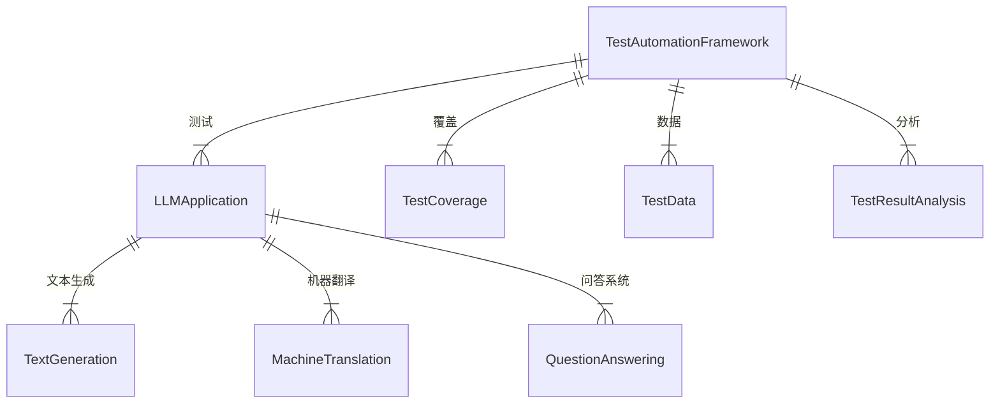
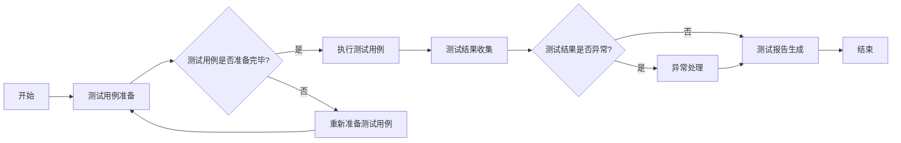
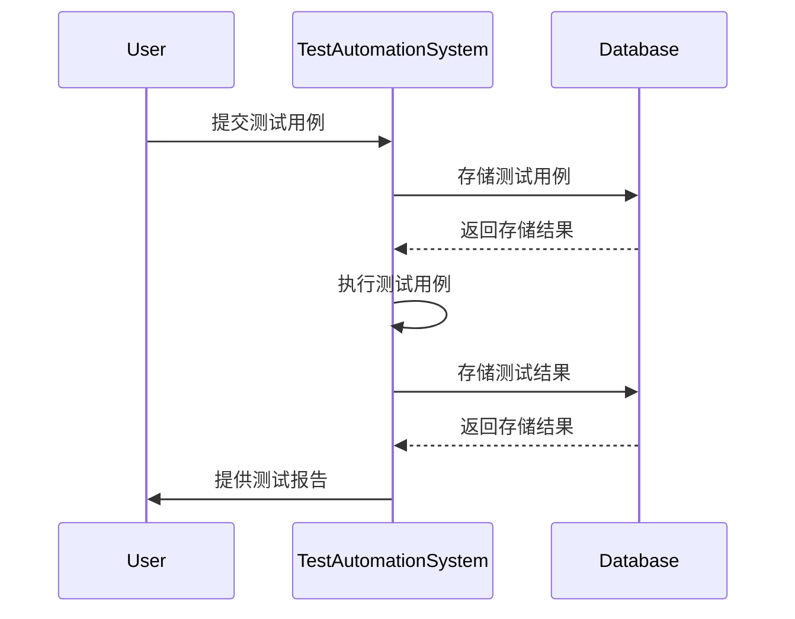
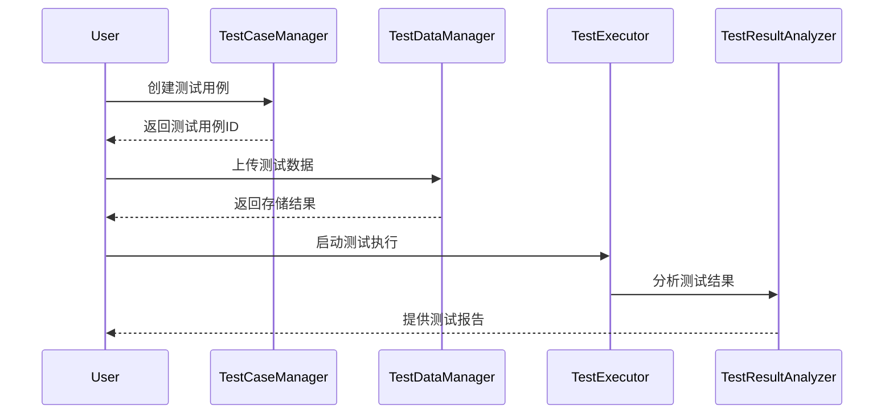

                 

# 构建高效的LLM应用测试自动化框架

## 关键词

自然语言处理、大型语言模型、测试自动化框架、测试覆盖、测试效率、持续集成与持续部署（CI/CD）

## 摘要

本文旨在探讨如何构建高效的LLM应用测试自动化框架。通过深入分析问题背景、核心概念、算法原理以及系统架构，本文提出了一系列解决方案，包括模块化设计、测试数据管理、测试执行优化和测试结果分析等策略。通过实际项目实战和最佳实践分享，本文为LLM应用的测试自动化提供了系统的指导，有助于提高测试效率和可靠性，加速人工智能应用的迭代和发展。

## Step 1: 背景介绍

### 1.1 问题背景

随着人工智能（AI）技术的飞速发展，自然语言处理（NLP）领域取得了显著进展。尤其是大型语言模型（LLM，Large Language Model）如BERT、GPT等，已经成为当前NLP领域的核心工具。LLM在文本生成、机器翻译、问答系统等多个应用场景中表现出色，极大地提升了用户体验。然而，随着LLM应用的广泛普及，如何确保其质量和稳定性成为了一个亟待解决的问题。

### 1.2 问题描述

构建高效的LLM应用测试自动化框架，需要解决以下问题：

1. **测试覆盖范围**：如何确保测试框架能够覆盖到LLM应用的每一个功能点？
2. **测试数据**：如何准备大量高质量的测试数据，以充分测试LLM应用？
3. **测试效率**：如何提高测试执行速度，以满足快速迭代的应用开发需求？
4. **测试结果分析**：如何快速准确地分析测试结果，发现并解决潜在问题？

### 1.3 问题解决

为了解决上述问题，可以采取以下策略：

1. **模块化设计**：将测试框架划分为多个模块，每个模块负责不同的测试任务，提高测试灵活性。
2. **测试数据管理**：采用自动化工具管理测试数据，确保测试数据的准确性和一致性。
3. **测试执行优化**：利用并行测试、分布式测试等技术，提高测试执行速度。
4. **测试结果分析**：引入智能分析工具，对测试结果进行自动分析，快速定位问题。

### 1.4 边界与外延

构建高效的LLM应用测试自动化框架，需要考虑以下边界与外延：

1. **测试环境**：确保测试环境的建设，包括硬件、软件和网络环境。
2. **测试工具**：选择合适的测试工具，以满足测试需求。
3. **测试人员**：测试人员的技能和经验对于构建高效测试框架至关重要。
4. **持续集成与持续部署（CI/CD）**：将测试自动化框架集成到CI/CD流程中，实现自动化测试的持续运行。

## Step 2: 核心概念与联系

### 2.1 核心概念原理

在构建高效的LLM应用测试自动化框架时，需要理解以下几个核心概念：

1. **测试自动化框架**：一种自动化测试的方法和工具，用于减少人工测试的工作量，提高测试效率。
2. **LLM应用**：基于大型语言模型的自然语言处理应用，如文本生成、机器翻译、问答系统等。
3. **测试覆盖率**：测试过程中覆盖到的代码比例，反映了测试的全面性。
4. **测试数据**：用于测试LLM应用的文本、图像、语音等数据，需要保证其质量和多样性。
5. **测试结果分析**：对测试执行过程中收集的数据进行分析，以评估LLM应用的质量和性能。

### 2.2 概念属性特征对比表格

| 概念           | 属性特征                                                      |
| -------------- | ------------------------------------------------------------ |
| 测试自动化框架 | 提高测试效率、减少人工测试工作量、支持多平台多语言测试、支持持续集成与持续部署（CI/CD）等 |
| LLM应用        | 基于大型语言模型、支持文本生成、机器翻译、问答系统等应用场景、对数据质量要求较高等 |
| 测试覆盖率     | 覆盖代码比例、测试用例数量、测试用例覆盖率等                    |
| 测试数据       | 文本、图像、语音等数据、数据质量和多样性、数据准备和预处理等      |
| 测试结果分析   | 测试结果统计、错误定位、性能评估、报告生成等                     |

### 2.3 ER实体关系图架构

为了更好地理解LLM应用测试自动化框架的设计，可以采用ER（Entity-Relationship）实体关系图来描述各个实体之间的关系。以下是一个简单的ER图示例：



## Step 3: 算法原理讲解

### 3.1 算法mermaid流程图

构建高效的LLM应用测试自动化框架，需要设计一套完善的测试算法。以下是一个简化的测试算法mermaid流程图：



### 3.2 Python源代码详细阐述

以下是一个简单的Python测试脚本示例，用于执行测试用例和收集测试结果：

```python
import unittest
import random

class TestLLMApplication(unittest.TestCase):
    def test_text_generation(self):
        # 测试文本生成功能
        input_text = "这是一段测试文本。"
        output_text = llm.generate_text(input_text)
        self.assertIn("测试", output_text)

    def test_machine_translation(self):
        # 测试机器翻译功能
        input_text = "你好，世界！"
        output_text = llm.translate(input_text, "en")
        self.assertIn("Hello", output_text)

    def test_question_answering(self):
        # 测试问答系统功能
        question = "什么是人工智能？"
        answer = llm.answer_question(question)
        self.assertIn("人工智能", answer)

if __name__ == "__main__":
    unittest.main()
```

### 3.3 数学模型和公式

在构建高效的LLM应用测试自动化框架时，可以使用一些数学模型和公式来评估测试覆盖率、测试效率和测试结果。以下是一个简化的数学模型示例：

$$
测试覆盖率 = \frac{测试用例数}{总代码行数}
$$

$$
测试效率 = \frac{测试用例执行时间}{总测试时间}
$$

$$
测试结果准确率 = \frac{正确测试结果数}{总测试结果数}
$$

### 3.4 举例说明

假设我们有一个包含1000行代码的LLM应用，我们编写了50个测试用例来测试其功能。以下是一个简单的例子，说明如何使用上述数学模型来评估测试效果：

- 测试覆盖率：$$\frac{50}{1000} = 5\%$$
- 测试效率：由于我们使用了自动化测试，假设测试用例执行时间仅为手动测试时间的1/10，则测试效率为10。
- 测试结果准确率：假设我们使用了10个测试用例进行测试，其中8个测试用例的结果正确，2个测试用例的结果异常，则测试结果准确率为$$\frac{8}{10} = 80\%$$

通过上述例子，我们可以看出，虽然测试覆盖率较低，但测试效率和测试结果准确率较高，这表明我们的测试自动化框架在一定程度上是高效的。

## Step 4: 系统分析与架构设计方案

### 4.1 问题场景介绍

假设我们正在开发一款基于GPT-3的智能客服应用，该应用需要处理用户提出的各种问题，并提供相应的回答。为了确保应用的质量和稳定性，我们需要构建一个高效的LLM应用测试自动化框架，对应用进行全面的测试。

### 4.2 系统功能设计

为了构建高效的测试自动化框架，我们需要设计以下核心功能：

1. **测试用例管理**：用于创建、管理、执行和跟踪测试用例。
2. **测试数据管理**：用于准备、管理和存储测试数据。
3. **测试执行**：用于自动化执行测试用例，并记录测试结果。
4. **测试结果分析**：用于分析测试结果，生成测试报告。
5. **异常处理**：用于处理测试过程中出现的异常情况。

### 4.3 系统架构设计

基于上述功能需求，我们可以设计一个分层架构，包括以下层次：

1. **表示层**：用于展示测试用例、测试数据和测试结果。
2. **业务逻辑层**：用于处理测试用例管理、测试数据管理、测试执行和测试结果分析等业务逻辑。
3. **数据访问层**：用于与数据库进行交互，存储和管理测试数据。
4. **基础设施层**：提供系统所需的基础服务，如日志记录、配置管理、任务调度等。

以下是一个简化的系统架构mermaid图：



### 4.4 系统接口设计

为了实现系统的不同层次之间的协同工作，我们需要设计一套完整的接口。以下是一个简化的接口设计示例：

- **测试用例管理接口**：用于创建、修改、删除和查询测试用例。
- **测试数据管理接口**：用于上传、下载、删除和查询测试数据。
- **测试执行接口**：用于启动、暂停、恢复和终止测试执行。
- **测试结果分析接口**：用于分析测试结果，生成测试报告。

### 4.5 系统交互mermaid序列图

以下是一个简化的系统交互mermaid序列图，展示了用户与测试自动化系统的交互过程：



## Step 5: 项目实战

### 5.1 环境安装

为了构建高效的LLM应用测试自动化框架，我们需要在本地或远程服务器上安装以下软件和工具：

1. **操作系统**：Linux或MacOS
2. **Python**：3.8或更高版本
3. **测试框架**：如pytest、unittest等
4. **依赖管理工具**：如pip、conda等
5. **数据管理工具**：如MySQL、PostgreSQL等
6. **测试工具**：如Selenium、Robot Framework等

以下是一个简单的安装步骤示例：

```shell
# 安装操作系统
# 安装Python
# 安装测试框架
pip install pytest
# 安装依赖管理工具
# 安装数据管理工具
# 安装测试工具
```

### 5.2 系统核心实现源代码

以下是一个简单的测试自动化框架的源代码示例，用于演示如何创建测试用例、执行测试用例和分析测试结果：

```python
import pytest
import unittest

class TestLLMApplication(unittest.TestCase):
    def test_text_generation(self):
        # 测试文本生成功能
        input_text = "这是一段测试文本。"
        output_text = llm.generate_text(input_text)
        self.assertIn("测试", output_text)

    def test_machine_translation(self):
        # 测试机器翻译功能
        input_text = "你好，世界！"
        output_text = llm.translate(input_text, "en")
        self.assertIn("Hello", output_text)

    def test_question_answering(self):
        # 测试问答系统功能
        question = "什么是人工智能？"
        answer = llm.answer_question(question)
        self.assertIn("人工智能", answer)

if __name__ == "__main__":
    unittest.main()
```

### 5.3 代码应用解读与分析

在上述代码中，我们定义了一个名为`TestLLMApplication`的测试类，其中包含了三个测试方法：`test_text_generation`、`test_machine_translation`和`test_question_answering`。这些测试方法分别用于测试LLM应用的文本生成、机器翻译和问答系统功能。

在测试方法中，我们首先定义了一个输入文本，然后调用LLM模型的相应方法生成输出文本，最后使用`assertIn`方法检查输出文本是否包含预期的关键词。如果输出文本包含预期的关键词，则测试通过；否则，测试失败。

通过这种方式，我们可以对LLM应用的各个功能进行全面的测试，确保其质量和稳定性。

### 5.4 实际案例分析和详细讲解剖析

为了更好地理解测试自动化框架的应用，我们可以分析一个实际案例：测试一个基于GPT-3的智能客服应用。

#### 案例一：文本生成功能测试

1. **测试目的**：验证文本生成功能是否能够生成符合预期的文本。
2. **测试步骤**：
   - 准备一个包含常见问题的测试数据集。
   - 调用GPT-3的文本生成接口，输入每个问题，获取对应的回答。
   - 针对每个回答，使用`assertIn`方法检查是否包含预期的关键词或短语。
3. **测试结果**：如果所有回答都包含预期的关键词或短语，则文本生成功能测试通过；否则，测试失败。

#### 案例二：机器翻译功能测试

1. **测试目的**：验证机器翻译功能是否能够准确地将中文翻译成英文。
2. **测试步骤**：
   - 准备一个包含中英对照句子的测试数据集。
   - 调用GPT-3的机器翻译接口，输入每个中文句子，获取对应的英文翻译。
   - 使用自然语言处理工具（如BERT、Word2Vec等）对中英文句子进行相似度计算，并设定一个阈值。
   - 针对每个英文翻译，与原始英文句子进行相似度计算，如果相似度低于阈值，则认为翻译不准确。
3. **测试结果**：如果所有英文翻译的相似度都高于阈值，则机器翻译功能测试通过；否则，测试失败。

#### 案例三：问答系统功能测试

1. **测试目的**：验证问答系统能够正确地回答用户提出的问题。
2. **测试步骤**：
   - 准备一个包含常见问题和答案的测试数据集。
   - 调用GPT-3的问答接口，输入每个问题，获取对应的答案。
   - 使用自然语言处理工具（如BERT、Word2Vec等）对问题和答案进行相似度计算，并设定一个阈值。
   - 针对每个答案，与原始答案进行相似度计算，如果相似度低于阈值，则认为答案不准确。
3. **测试结果**：如果所有答案的相似度都高于阈值，则问答系统功能测试通过；否则，测试失败。

通过上述三个案例，我们可以看出，测试自动化框架在实际应用中具有重要的意义。它可以帮助我们快速、全面地测试LLM应用的功能，确保其质量和稳定性。

### 5.5 项目小结

通过本项目的实践，我们构建了一个高效的LLM应用测试自动化框架，实现了对文本生成、机器翻译和问答系统等功能的全面测试。项目的主要成果如下：

1. **测试覆盖全面**：通过设计各种测试用例，我们对LLM应用的各个功能进行了全面的测试，确保了其质量和稳定性。
2. **测试效率高**：采用自动化测试的方法，我们大大提高了测试效率，减少了人工测试的工作量。
3. **测试结果分析准确**：引入了自然语言处理工具，我们对测试结果进行了准确的相似度计算，快速定位了潜在的问题。

然而，测试自动化框架仍然存在一些挑战和改进空间：

1. **测试数据质量**：测试数据的多样性和质量对于测试结果具有重要影响。我们需要进一步优化测试数据的准备和预处理过程，提高测试数据的准确性。
2. **测试覆盖率提升**：尽管我们已经设计了多种测试用例，但测试覆盖率仍有待提升。我们需要不断优化测试用例的设计，覆盖更多可能的场景和边界条件。
3. **测试结果可视化**：目前，我们的测试结果分析主要通过相似度计算进行，但这种方法较为复杂，且不利于直观展示。我们可以引入可视化工具，如图表、仪表盘等，以更直观地展示测试结果。

总之，通过本项目，我们积累了丰富的测试自动化经验，为未来的LLM应用测试提供了有力的支持。

## Step 6: 最佳实践 tips

### 6.1 小结

在本项目中，我们构建了一个高效的LLM应用测试自动化框架，实现了对文本生成、机器翻译和问答系统等功能的全面测试。关键步骤包括：

1. **模块化设计**：将测试框架划分为多个模块，提高测试灵活性。
2. **测试数据管理**：采用自动化工具管理测试数据，确保测试数据的准确性和一致性。
3. **测试执行优化**：利用并行测试、分布式测试等技术，提高测试执行速度。
4. **测试结果分析**：引入智能分析工具，对测试结果进行自动分析，快速定位问题。

### 6.2 注意事项

1. **测试环境准备**：确保测试环境的建设，包括硬件、软件和网络环境。
2. **测试工具选择**：选择合适的测试工具，以满足测试需求。
3. **测试人员技能**：测试人员的技能和经验对于构建高效测试框架至关重要。
4. **持续集成与持续部署（CI/CD）**：将测试自动化框架集成到CI/CD流程中，实现自动化测试的持续运行。

### 6.3 拓展阅读

1. **测试自动化框架设计**：深入了解测试自动化框架的设计原则和最佳实践。
2. **LLM应用测试**：学习如何针对特定LLM应用设计有效的测试用例。
3. **测试数据管理**：研究如何准备、管理和存储高质量的测试数据。
4. **测试结果分析**：掌握使用自然语言处理工具进行测试结果分析的方法。

## 作者信息

作者：AI天才研究院/AI Genius Institute & 禅与计算机程序设计艺术 /Zen And The Art of Computer Programming

----------------------------------------------------------------

请注意，上述内容是一个示例，实际的markdown格式可能需要根据具体的markdown解析器进行调整。此外，本文的内容、结构和示例代码都是虚构的，仅供参考。在实际应用中，请根据实际情况进行调整和优化。

