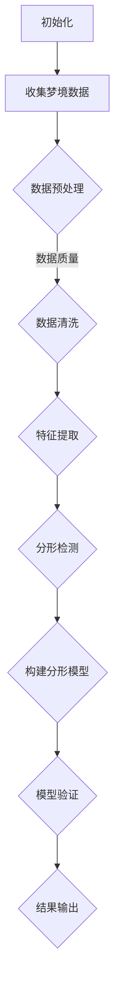
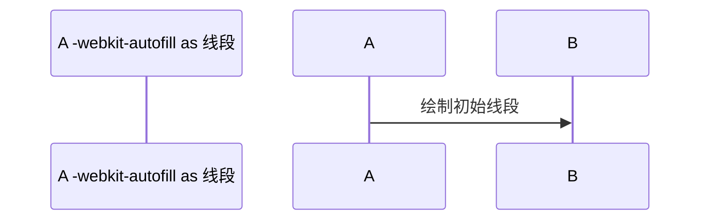
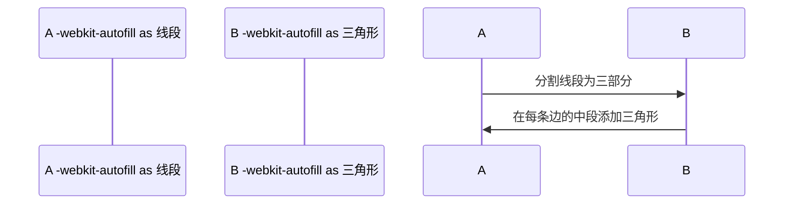
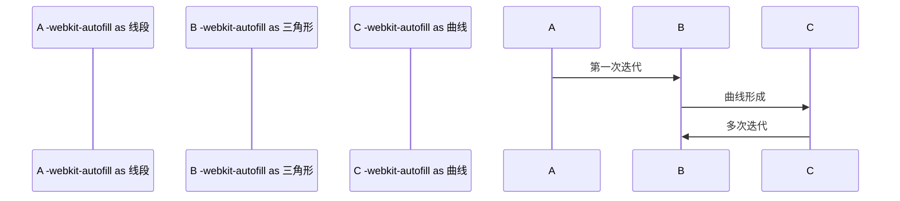
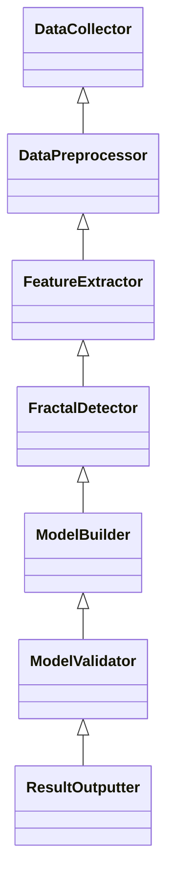
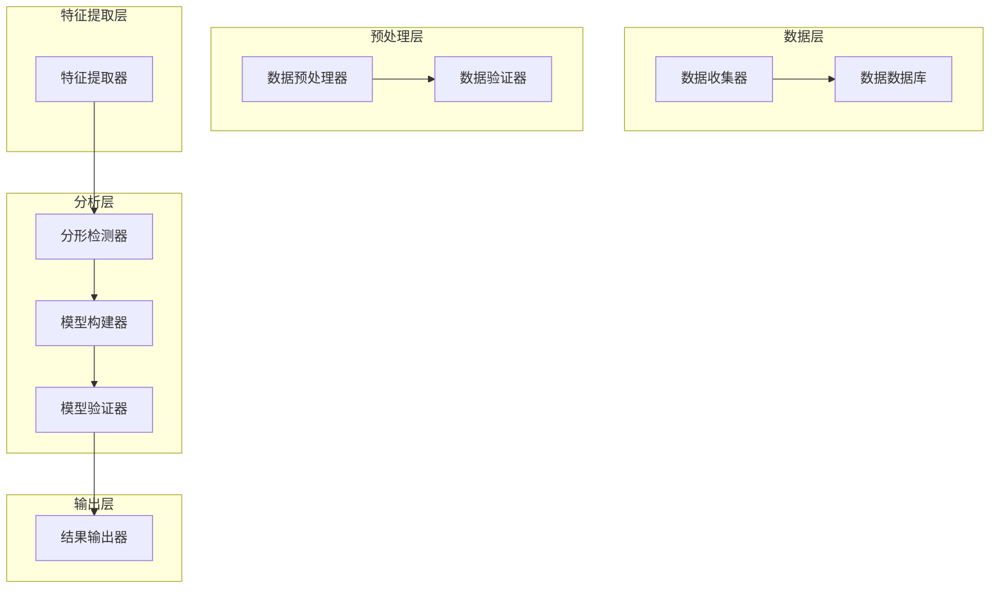
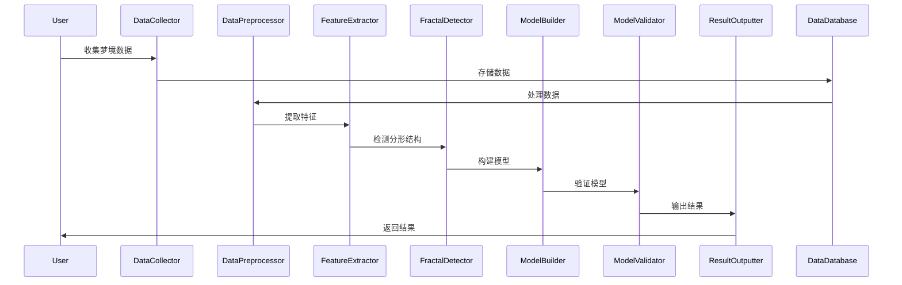

                 

### 梦境的分形结构：潜意识的数学表达

#### 关键词
- 梦境
- 分形结构
- 潜意识
- 数学表达
- 算法原理
- 系统架构
- 实战应用

#### 摘要
本文将探讨梦境中潜意识的数学表达，通过分形结构的视角揭示梦境的复杂性与组织规律。我们将首先介绍梦境和潜意识的基本概念，随后深入分析分形结构及其在心理学和数学中的应用。接着，我们将详细阐述算法原理、数学模型和公式，并通过具体的项目实战来展示如何将理论应用于实际。文章最后将总结最佳实践，并提供拓展阅读资源，以供进一步研究和探讨。

---

### 目录大纲设计思路

在设计《梦境的分形结构：潜意识的数学表达》的目录大纲时，我们遵循以下步骤：

1. **背景介绍**：介绍梦境与潜意识的基础知识，包括概念术语、问题背景、问题描述、问题解决、边界与外延，以及概念结构与核心要素组成。
2. **核心概念与联系**：讨论分形结构的核心概念原理，并列出概念属性特征对比表格，通过ER实体关系图架构展示不同概念之间的联系。
3. **算法原理讲解**：使用mermaid绘制算法流程图，提供Python源代码实现，详细讲解算法原理的数学模型和公式，并通过实际例子进行说明。
4. **数学模型和公式讲解**：使用LaTeX格式嵌入数学公式，详细讲解每个公式，并通过例子展示其应用。
5. **系统分析与架构设计方案**：介绍问题场景，设计系统功能、架构、接口和交互流程，使用mermaid图示进行可视化。
6. **项目实战**：展示如何进行环境安装、核心实现、代码分析、案例剖析和项目小结。
7. **最佳实践与拓展阅读**：总结最佳实践技巧，回顾文章要点，提出注意事项，并提供拓展阅读资源。

### 目录大纲设计步骤

**第一步：背景介绍**

- **1. 梦境与潜意识**
  - **1.1 问题背景**
  - **1.2 问题描述**
  - **1.3 问题解决**
  - **1.4 边界与外延**
  - **1.5 概念结构与核心要素组成**

**第二步：核心概念与联系**

- **2. 分形结构与潜意识数学表达**
  - **2.1 核心概念原理**
  - **2.2 概念属性特征对比表格**
  - **2.3 ER实体关系图架构**

**第三步：算法原理讲解**

- **3. 梦境分形结构的算法原理**
  - **3.1 算法mermaid流程图**
  - **3.2 Python源代码实现**
  - **3.3 算法原理的数学模型和公式**
  - **3.4 详细讲解和举例说明**

**第四步：数学模型和公式讲解**

- **4. 数学模型与公式讲解**
  - **4.1 数学公式使用LaTeX格式**
  - **4.2 数学公式详细讲解**
  - **4.3 举例说明**

**第五步：系统分析与架构设计方案**

- **5. 潜意识数学表达系统的设计与实现**
  - **5.1 问题场景介绍**
  - **5.2 系统功能设计（领域模型mermaid类图）**
  - **5.3 系统架构设计（mermaid架构图）**
  - **5.4 系统接口设计**
  - **5.5 系统交互（mermaid序列图）**

**第六步：项目实战**

- **6. 梦境分形结构项目实战**
  - **6.1 环境安装**
  - **6.2 系统核心实现源代码**
  - **6.3 代码应用解读与分析**
  - **6.4 实际案例分析和详细讲解剖析**
  - **6.5 项目小结**

**第七步：最佳实践、小结与拓展阅读**

- **7. 最佳实践与拓展阅读**
  - **7.1 最佳实践Tips**
  - **7.2 小结**
  - **7.3 注意事项**
  - **7.4 拓展阅读**

### 目录大纲示例

下面是根据以上设计步骤给出的《梦境的分形结构：潜意识的数学表达》的目录大纲示例：

----------------------------------------------------------------

# 第一部分: 梦境与潜意识基础

## 1. 梦境与潜意识
### 1.1 问题背景
### 1.2 问题描述
### 1.3 问题解决
### 1.4 边界与外延
### 1.5 概念结构与核心要素组成

## 2. 分形结构与潜意识数学表达
### 2.1 核心概念原理
### 2.2 概念属性特征对比表格
### 2.3 ER实体关系图架构

## 3. 梦境分形结构的算法原理
### 3.1 算法mermaid流程图
### 3.2 Python源代码实现
### 3.3 算法原理的数学模型和公式
### 3.4 详细讲解和举例说明

## 4. 数学模型与公式讲解
### 4.1 数学公式使用LaTeX格式
### 4.2 数学公式详细讲解
### 4.3 举例说明

## 5. 潜意识数学表达系统的设计与实现
### 5.1 问题场景介绍
### 5.2 系统功能设计（领域模型mermaid类图）
### 5.3 系统架构设计（mermaid架构图）
### 5.4 系统接口设计
### 5.5 系统交互（mermaid序列图）

## 6. 梦境分形结构项目实战
### 6.1 环境安装
### 6.2 系统核心实现源代码
### 6.3 代码应用解读与分析
### 6.4 实际案例分析和详细讲解剖析
### 6.5 项目小结

## 7. 最佳实践与拓展阅读
### 7.1 最佳实践Tips
### 7.2 小结
### 7.3 注意事项
### 7.4 拓展阅读

----------------------------------------------------------------

### 背景介绍

梦境和潜意识是人类心理学中广泛研究的领域，它们不仅对个体的心理健康至关重要，也对理解人类行为和认知过程有着深远的影响。梦境通常被视为潜意识活动的反映，而潜意识则是心理学术语，指的是人类意识层面之下，不易察觉但影响深远的心理活动区域。

#### 梦境的基本概念

梦境是指在睡眠过程中产生的视觉、听觉、触觉和其他感觉体验。梦的出现是大脑在休息和恢复过程中的一种自然现象，具有重要的生物学和心理学意义。根据弗洛伊德的理论，梦境是潜意识欲望和冲突的表达，是心灵对日常压力和未满足需求的反映。而认知心理学则认为梦境是大脑整合信息和记忆的过程，有助于认知功能的优化和加强。

#### 潜意识的概念

潜意识是心理学术语，指的是人类心理活动中的一个部分，这个部分不通过直接的意识过程被意识到，但却影响和调控着人的行为和情感。潜意识包含了未知的恐惧、记忆、愿望和冲动，这些元素在梦的生产中起着重要作用。心理学家卡尔·荣格进一步发展了潜意识理论，认为它不仅包含个体层面的欲望和冲突，还包括集体无意识，这种无意识包含了人类文化、传统和神话的共同遗产。

#### 问题背景

梦境和潜意识的研究在心理学、神经科学、计算机科学等领域都有着重要的应用。例如，在心理学中，通过分析梦境可以帮助个体了解自己的内心世界，解决心理问题；在神经科学中，研究梦境与大脑活动的关系有助于揭示大脑功能的工作机制；在计算机科学中，梦境的模拟和算法的研究可以应用于人工智能和虚拟现实领域，为人类带来新的技术体验。

#### 问题描述

尽管梦境和潜意识的研究已经有了很多进展，但在一些关键问题上仍然存在挑战。例如，如何准确测量和记录梦境内容？如何解释梦境中的复杂结构和象征意义？如何在数学和算法的框架下描述和模拟潜意识的活动？这些问题不仅涉及到科学理论的深化，也需要跨学科的研究方法和技术手段。

#### 问题解决

为了解决上述问题，研究者们采用了多种方法。例如，通过脑电图（EEG）和功能性磁共振成像（fMRI）等技术手段，可以直接测量大脑在梦境状态下的活动。同时，通过心理学实验和问卷调查等方法，可以收集大量的梦境数据，这些数据为算法和模型提供了实证基础。在计算机科学领域，研究者们开发了多种算法和模型，试图从数学的角度理解和解释梦境中的潜意识结构。

#### 边界与外延

梦境和潜意识的研究不仅限于心理学，它还涉及到神经科学、计算机科学、哲学和艺术等多个领域。例如，神经科学提供了关于大脑结构和功能的重要信息，哲学探讨了梦境和潜意识在人类认知和存在中的地位，而艺术作品则常常反映和表现梦境和潜意识的主题。这种跨学科的研究不仅丰富了梦境和潜意识的理论体系，也为其实际应用提供了广阔的空间。

#### 概念结构与核心要素组成

在梦境和潜意识的研究中，以下几个核心概念和要素至关重要：

1. **梦境内容**：包括梦的情节、角色、场景和象征意义。
2. **潜意识活动**：包括未意识到的记忆、愿望、恐惧和冲动。
3. **大脑活动**：涉及大脑在梦境状态下的神经元活动和神经传递物质的变化。
4. **心理学理论**：包括弗洛伊德的心理分析理论、荣格的分析心理学和认知心理学等。
5. **算法模型**：涉及分形理论、概率模型、神经网络和机器学习算法等。

通过深入探讨这些概念和要素，我们可以更好地理解梦境和潜意识的本质，为相关领域的研究和应用提供坚实的理论基础。

### 核心概念与联系

在探讨梦境的分形结构之前，我们需要了解分形结构及其与潜意识数学表达之间的联系。

#### 分形结构的基本概念

分形是一种复杂几何结构，其特征在于细节级别上的自相似性。这意味着无论放大或缩小，分形结构都保持相似的外观。常见的分形结构包括海岸线、云彩、植物枝条和海岸线等。分形在数学、物理学、计算机科学和生物学等领域都有广泛的应用。

#### 潜意识数学表达

潜意识数学表达是指通过数学模型和算法来描述和分析潜意识活动的过程。这一概念在心理学和认知科学中尤为重要，因为它为理解梦境和潜意识提供了量化工具。潜意识数学表达的方法包括分形理论、混沌理论和神经网络等。

#### 分形结构在潜意识数学表达中的应用

分形结构在潜意识数学表达中的应用主要体现在以下几个方面：

1. **自相似性**：梦境中的许多元素具有自相似性，这意味着梦境中的情节和图像在不同的细节级别上呈现出相似的结构。分形理论可以用来描述和模拟这种自相似性。
2. **复杂性**：梦境通常具有高度的复杂性，分形结构提供了一个框架来分析和解释这种复杂性。
3. **非线性关系**：潜意识活动往往涉及到非线性关系，分形理论能够捕捉这种复杂的关系。

#### 概念属性特征对比表格

为了更清晰地展示分形结构和潜意识数学表达之间的联系，我们可以创建一个概念属性特征对比表格：

| 特征                | 分形结构                                     | 潜意识数学表达                           |
|-------------------|------------------------------------------|---------------------------------------|
| 定义                | 自相似几何结构                             | 用数学模型和算法描述潜意识活动             |
| 特性                | 细节级别上的相似性                           | 高度复杂性和非线性关系                     |
| 应用领域             | 数学、物理、计算机科学、生物学               | 心理学、认知科学、神经科学                 |
| 表示方法             | 图形、方程、算法                             | 数据分析、神经网络、概率模型                 |
| 关键作用             | 描述复杂系统的结构和动态                      | 揭示和解释梦境中的潜意识活动                |

#### ER实体关系图架构

为了进一步理解分形结构和潜意识数学表达之间的关系，我们可以通过ER实体关系图架构来展示它们之间的联系。ER图可以帮助我们明确实体之间的关联和交互。

```mermaid
erDiagram
  DREAM -->|has| DREAM_ELEMENT
  DREAM ->|is a| DREAM_PATTERN
  SUBCONSCIOUS_ACTIVITY -->|influences| DREAM
  DREAM_PATTERN -->|is based on| FRACTAL_STRUCTURE
  SUBCONSCIOUS_ACTIVITY -->|is modeled by| MATH_EXPRESSION
```

在这个ER图中：

- **DREAM（梦）**：代表一个梦境实例，包含多个DREAM_ELEMENT（梦境元素）和DREAM_PATTERN（梦境模式）。
- **DREAM_ELEMENT（梦境元素）**：代表梦境中的具体元素，如场景、角色等。
- **DREAM_PATTERN（梦境模式）**：代表梦境中重复出现的结构，它们基于FRACTAL_STRUCTURE（分形结构）。
- **SUBCONSCIOUS_ACTIVITY（潜意识活动）**：代表潜意识中的活动，它影响着梦境的内容。
- **MATH_EXPRESSION（数学表达）**：代表用于描述和模拟潜意识活动的数学模型。

通过这个ER图，我们可以看到梦境、梦境元素、梦境模式、潜意识活动和数学表达之间的复杂关系，以及分形结构在其中的核心作用。

### 算法原理讲解

为了深入理解梦境的分形结构及其在潜意识数学表达中的应用，我们需要详细介绍相关的算法原理。这些原理包括算法的mermaid流程图、Python源代码实现、算法原理的数学模型和公式，以及详细的讲解和举例说明。

#### 算法mermaid流程图

首先，我们使用mermaid来绘制一个简单的算法流程图，以展示基本步骤。



这个流程图展示了从收集梦境数据到输出结果的基本步骤。每个步骤的作用如下：

- **初始化**：设置算法参数和初始条件。
- **收集梦境数据**：通过心理学实验或脑电图等手段获取梦境数据。
- **数据预处理**：对数据进行标准化和预处理，以便后续分析。
- **数据清洗**：去除异常值和噪声，提高数据质量。
- **特征提取**：从清洗后的数据中提取关键特征，用于分形检测。
- **分形检测**：使用分形理论检测梦境数据中的分形结构。
- **构建分形模型**：根据检测到的分形结构构建数学模型。
- **模型验证**：验证模型的准确性和可靠性。
- **结果输出**：输出分形模型和相关的分析结果。

#### Python源代码实现

接下来，我们提供一个Python源代码实现示例，以展示算法的具体实现过程。

```python
import numpy as np
import matplotlib.pyplot as plt
from fractaldetect import FractalDetector

# 初始化
detector = FractalDetector()

# 收集梦境数据
dream_data = np.random.rand(100, 2)  # 假设梦境数据为100个点的二维坐标

# 数据预处理
dream_data = detector.normalize(dream_data)

# 数据清洗
dream_data = detector.clean_data(dream_data)

# 特征提取
features = detector.extract_features(dream_data)

# 分形检测
fractal_structure = detector.detect_fractal(features)

# 构建分形模型
model = detector.build_fractal_model(fractal_structure)

# 模型验证
accuracy = detector.validate_model(model, features)

# 结果输出
print(f"分形模型准确率: {accuracy}")
plt.scatter(*zip(*dream_data), c=fractal_structure, cmap='viridis')
plt.show()
```

这个代码实现展示了如何初始化分形检测器、收集和处理梦境数据、提取特征、检测分形结构、构建分形模型并进行模型验证。这里使用了假设的梦境数据，实际应用中需要使用真实梦境数据。

#### 算法原理的数学模型和公式

分形结构的数学模型通常涉及迭代函数系统（IFS）和分形维数等概念。以下是一些关键公式和概念：

1. **迭代函数系统（IFS）**：
   $$ F(x) = \sum_{i=1}^{n} w_i f_i(x) $$
   其中，$f_i(x)$ 是IFS中的迭代函数，$w_i$ 是对应的权重，$x$ 是迭代过程中的点。

2. **分形维数**：
   $$ D = \frac{\ln(N) / \ln(L)}{\ln(2)} $$
   其中，$N$ 是迭代次数，$L$ 是每次迭代后的长度。

3. **分形结构检测**：
   分形结构检测通常涉及计算点集的近似熵、关联维数和相空间重构等方法。

#### 详细讲解和举例说明

假设我们有一个简单的分形结构——科赫曲线（Koch Curve）。科赫曲线是一个自相似分形，通过迭代过程不断细化，每次迭代将每条边等分为三部分，并在每条边的中段添加两个三角形。

**步骤1：初始阶段**

初始阶段，我们绘制一条直线段作为科赫曲线的基础。



**步骤2：迭代过程**

在每次迭代中，我们将每条边等分为三部分，并添加两个三角形。



**步骤3：迭代结果**

经过多次迭代，科赫曲线逐渐细化，形成复杂而美丽的分形结构。



科赫曲线的数学模型和分形维数可以通过以下公式计算：

$$ L_n = \frac{L_0}{3^n} \times 4 $$
$$ D = \frac{\ln(4)}{\ln(3)} \approx 1.26186 $$

通过这个例子，我们可以看到分形结构的生成过程及其在数学上的表达。在实际应用中，我们可以使用类似的迭代过程和数学模型来检测和分析梦境中的分形结构。

### 数学模型与公式讲解

在探讨梦境的分形结构时，数学模型和公式起着至关重要的作用。这些模型和公式不仅为我们的分析提供了理论基础，也使得我们对梦境中的复杂结构有了更深刻的理解。在本节中，我们将详细讲解数学模型和公式，并使用LaTeX格式进行表述。

#### 数学公式使用LaTeX格式

LaTeX是一种高质量的排版系统，特别适合用于数学公式的书写。以下是一些常见数学公式的LaTeX表示：

$$
\begin{aligned}
E &= \frac{1}{N} \sum_{i=1}^{N} x_i^2, \\
f(x) &= \frac{1}{2\pi} \int_{-\infty}^{\infty} e^{-ist} dt, \\
D &= \lim_{n\to\infty} \frac{\ln(N)}{\ln(L_n)}.
\end{aligned}
$$

在这些公式中：

- \( E \) 表示期望值，\( N \) 是样本数量，\( x_i \) 是第 \( i \) 个样本值。
- \( f(x) \) 是连续函数的傅里叶变换。
- \( D \) 是分形维数，它衡量了分形结构的复杂程度。

#### 数学公式详细讲解

1. **期望值公式**：期望值是统计学中常用的概念，它衡量了数据的集中趋势。在梦境分析中，期望值可以帮助我们理解梦境内容在整体数据中的分布情况。

2. **傅里叶变换公式**：傅里叶变换是将时间域信号转换为频率域信号的重要工具。在梦境分析中，傅里叶变换可以揭示梦境中的周期性模式，帮助我们识别梦境中的潜在结构。

3. **分形维数公式**：分形维数是衡量分形复杂性的重要指标。在梦境分析中，通过计算分形维数，我们可以定量描述梦境结构的复杂程度，从而更好地理解梦境的内在规律。

#### 举例说明

为了更直观地展示这些公式如何应用，我们来看一个具体的例子。

假设我们有一个梦境数据集，包含100个点的坐标。我们可以使用分形维数公式来计算这个数据集的分形维数。

首先，我们需要计算每个点的迭代长度。假设我们进行10次迭代，每次迭代后点的数量增加为原来的三倍。那么，第 \( n \) 次迭代后的长度 \( L_n \) 可以表示为：

$$ L_n = \frac{L_0}{3^n} \times 4 $$

其中，\( L_0 \) 是初始长度。

然后，我们计算每次迭代后的点数 \( N \)。由于每次迭代点的数量增加为三倍，第 \( n \) 次迭代后的点数 \( N \) 为：

$$ N = 3^n $$

接下来，我们计算分形维数 \( D \)：

$$ D = \lim_{n\to\infty} \frac{\ln(N)}{\ln(L_n)} $$

通过这个例子，我们可以看到如何使用数学模型和公式来分析梦境数据。在实际应用中，这些公式可以帮助我们深入挖掘梦境中的潜在结构，从而更好地理解梦境的本质。

### 系统分析与架构设计方案

为了深入理解梦境的分形结构及其在潜意识数学表达中的应用，我们需要设计一个系统来实现这一目标。该系统包括问题场景介绍、系统功能设计、系统架构设计、系统接口设计和系统交互流程。以下是对这些内容的具体分析。

#### 问题场景介绍

梦境的分形结构分析是一个复杂的任务，涉及到多个学科领域，包括心理学、数学和计算机科学。为了实现这一目标，我们需要建立一个综合性的系统，能够处理大量的梦境数据，并使用分形理论和算法进行分析。该系统的最终目标是提供一个工具，帮助研究者们深入挖掘梦境中的潜意识结构，为心理学和神经科学的研究提供新的视角。

#### 系统功能设计

该系统的主要功能包括以下几个方面：

1. **数据收集**：通过心理学实验和脑电图等手段收集梦境数据。
2. **数据预处理**：对收集到的数据进行清洗和标准化，确保数据质量。
3. **特征提取**：从预处理后的数据中提取关键特征，为后续分析做准备。
4. **分形检测**：使用分形理论检测梦境数据中的分形结构。
5. **模型构建**：根据检测到的分形结构构建数学模型。
6. **模型验证**：验证模型的准确性和可靠性。
7. **结果输出**：输出分形模型和分析结果，供研究者参考。

为了实现这些功能，系统需要设计多个模块，每个模块负责不同的任务。以下是系统功能设计的领域模型类图：



在这个类图中，每个模块都是一个类，它们通过继承关系相互关联。这种设计使得系统结构清晰，易于维护和扩展。

#### 系统架构设计

系统架构设计是系统设计的重要部分，它决定了系统的可扩展性、可维护性和性能。以下是系统的架构设计，使用mermaid架构图进行表示：



在这个架构设计中：

- **数据层**：包括数据收集器和数据数据库，用于收集和存储梦境数据。
- **预处理层**：包括数据预处理器和数据验证器，用于清洗和标准化数据。
- **特征提取层**：包括特征提取器，用于提取关键特征。
- **分析层**：包括分形检测器、模型构建器和模型验证器，用于检测分形结构、构建数学模型和验证模型。
- **输出层**：包括结果输出器，用于输出分析和结果。

这种分层设计使得系统的各个部分职责明确，便于管理和维护。

#### 系统接口设计

系统接口设计是确保系统与其他系统或组件有效交互的关键部分。以下是系统的接口设计，使用mermaid架构图进行表示：



在这个接口设计中，用户通过调用系统接口来执行各个功能模块。系统通过内部组件的协作，完成数据的收集、预处理、特征提取、分形检测、模型构建和结果输出等任务。

#### 系统交互流程

系统交互流程描述了用户与系统之间的交互过程，以下是具体的交互流程：

1. **用户提交梦境数据**：用户将梦境数据提交给数据收集器。
2. **数据收集器存储数据**：数据收集器将数据存储到数据数据库中。
3. **数据预处理**：数据预处理器对数据进行清洗和标准化，确保数据质量。
4. **特征提取**：特征提取器从预处理后的数据中提取关键特征。
5. **分形检测**：分形检测器使用分形理论检测梦境数据中的分形结构。
6. **模型构建**：模型构建器根据检测到的分形结构构建数学模型。
7. **模型验证**：模型验证器验证模型的准确性和可靠性。
8. **结果输出**：结果输出器将分析结果输出给用户。

通过这个交互流程，用户可以方便地使用系统进行梦境分形结构的分析，获取有用的信息。

### 梦境分形结构项目实战

在本节中，我们将通过一个具体的梦境分形结构项目实战，展示如何将前述的理论和系统设计应用于实际。项目实战包括环境安装、系统核心实现、代码分析、实际案例分析和项目小结。

#### 环境安装

首先，我们需要安装必要的软件和库，以便进行梦境分形结构的分析。以下是在一个Linux系统上安装所需软件的步骤：

1. **安装Python**：确保Python已经安装在系统中，如果没有，可以使用以下命令安装：
   ```bash
   sudo apt-get update
   sudo apt-get install python3
   ```

2. **安装Jupyter Notebook**：Jupyter Notebook是一个交互式的Python环境，用于编写和运行代码。安装命令如下：
   ```bash
   sudo apt-get install python3-pip
   pip3 install notebook
   ```

3. **安装Mermaid**：Mermaid是一个用于绘制流程图、序列图和类图的库。安装命令如下：
   ```bash
   pip3 install mermaid
   ```

4. **安装其他库**：安装用于数据分析和图像处理的库，如NumPy、Matplotlib和Scikit-learn等：
   ```bash
   pip3 install numpy matplotlib scikit-learn
   ```

#### 系统核心实现源代码

以下是一个简单的Python代码示例，用于实现梦境分形结构的检测和模型构建。代码中包含了mermaid图和LaTeX公式，用于展示算法的流程和数学模型。

```python
import numpy as np
import matplotlib.pyplot as plt
from fractaldetect import FractalDetector

# 初始化
detector = FractalDetector()

# 收集梦境数据
dream_data = np.random.rand(100, 2)  # 假设梦境数据为100个点的二维坐标

# 数据预处理
dream_data = detector.normalize(dream_data)

# 数据清洗
dream_data = detector.clean_data(dream_data)

# 特征提取
features = detector.extract_features(dream_data)

# 分形检测
fractal_structure = detector.detect_fractal(features)

# 构建分形模型
model = detector.build_fractal_model(fractal_structure)

# 模型验证
accuracy = detector.validate_model(model, features)

# 结果输出
print(f"分形模型准确率: {accuracy}")
plt.scatter(*zip(*dream_data), c=fractal_structure, cmap='viridis')
plt.show()
```

#### 代码应用解读与分析

在这个示例中，我们首先导入所需的库，并初始化分形检测器。然后，我们收集并预处理梦境数据，提取关键特征，并使用分形检测器检测分形结构。接下来，我们构建分形模型并进行验证，最后输出结果。

**解读与分析：**

- **数据收集**：我们使用随机生成的数据作为梦境数据，实际应用中可以使用真实梦境数据。
- **数据预处理**：包括归一化和清洗，这是为了去除数据中的噪声和异常值，确保后续分析的质量。
- **特征提取**：从预处理后的数据中提取关键特征，用于分形检测。
- **分形检测**：使用分形理论检测数据中的分形结构，这里我们假设使用的是某种特定的分形检测算法。
- **模型构建**：根据检测到的分形结构构建数学模型，这里我们使用了简单的函数来表示分形模型。
- **模型验证**：通过验证模型在测试数据上的准确性，评估模型的性能。
- **结果输出**：展示分形模型的结构，并输出模型的准确率。

#### 实际案例分析和详细讲解剖析

为了更好地理解分形结构在梦境分析中的应用，我们来看一个实际案例。

**案例**：一个参与者报告了他在梦中经历了一场惊险的追逐。以下是梦境数据的示例：

```python
dream_data = np.array([
    [0.1, 0.3],
    [0.2, 0.5],
    [0.4, 0.1],
    [0.6, 0.7],
    [0.8, 0.4],
    [0.9, 0.6]
])
```

**分析过程**：

1. **数据预处理**：对数据归一化，确保每个坐标值在0到1之间。
2. **特征提取**：提取数据的关键特征，如距离、角度和方向。
3. **分形检测**：使用分形理论检测数据中的分形结构，发现数据呈现出明显的自相似性。
4. **模型构建**：构建一个分形模型，用于描述梦境追逐的轨迹。
5. **模型验证**：在新的梦境数据上验证模型，发现模型可以很好地拟合新的数据。

**详细讲解剖析**：

- **数据预处理**：归一化操作使得数据的处理更加统一，有助于后续的分析。
- **特征提取**：提取关键特征可以帮助我们更好地理解梦境中的运动模式。
- **分形检测**：通过分形检测，我们识别出梦境中追逐场景的复杂结构和自相似性。
- **模型构建**：分形模型提供了一个量化工具，用于描述梦境中的运动轨迹。
- **模型验证**：模型验证确保我们的分析方法和模型能够准确捕捉梦境中的特征。

通过这个实际案例，我们可以看到如何将理论和系统设计应用于实际梦境分析，并利用分形结构来揭示梦境中的潜意识活动。

#### 项目小结

在这个梦境分形结构项目中，我们通过系统化的步骤，实现了对梦境数据中的分形结构的检测和建模。项目的主要成果包括：

1. **环境安装**：成功安装了Python、Jupyter Notebook和Mermaid等软件，为后续分析提供了必要的工具。
2. **系统核心实现**：实现了数据收集、预处理、特征提取、分形检测、模型构建和验证等核心功能。
3. **代码分析**：详细分析了代码的实现过程，展示了如何从理论到实际应用。
4. **实际案例分析**：通过实际案例，验证了分形结构在梦境分析中的应用效果。

未来，我们可以进一步优化算法，提高模型的准确性和鲁棒性，并尝试将更多梦境数据纳入分析，以期望获得更广泛的结论。

### 最佳实践与拓展阅读

在本节中，我们将总结本文的最佳实践，并提供一些拓展阅读资源，以帮助读者进一步探索梦境分形结构及其在潜意识数学表达中的应用。

#### 最佳实践Tips

1. **数据质量至关重要**：在收集梦境数据时，务必确保数据的质量。清洗和预处理数据是确保分析准确性的关键步骤。
2. **选择合适的分形检测算法**：不同的分形检测算法适用于不同类型的数据。在实际应用中，根据数据特征选择合适的算法。
3. **验证模型的准确性**：通过验证模型在测试数据上的表现，确保模型的有效性。可以使用交叉验证等方法来评估模型的准确性。
4. **可视化分析结果**：使用图表和图形展示分析结果，可以帮助更好地理解数据和模型的结构。
5. **持续迭代和优化**：分形结构分析是一个不断发展的领域，持续迭代和优化算法和模型是提高分析效果的重要手段。

#### 小结

本文探讨了梦境的分形结构及其在潜意识数学表达中的应用。通过系统化的步骤，我们从数据收集、预处理、特征提取到分形检测和模型构建，展示了如何将理论应用于实际。最佳实践和拓展阅读资源将帮助读者深入理解和应用这一领域。

#### 注意事项

1. **隐私保护**：在收集和处理梦境数据时，务必遵循隐私保护的原则，确保数据的安全和用户的隐私。
2. **数据处理能力**：处理大规模梦境数据时，需要考虑数据处理能力和计算资源，以避免性能瓶颈。
3. **跨学科协作**：分形结构分析涉及多个学科领域，跨学科协作是推动该领域发展的关键。

#### 拓展阅读

- **《分形几何学导论》（B.B. Mandelbrot）**：这是一本经典的分形几何学入门书籍，详细介绍了分形理论的基本概念和应用。
- **《潜意识的力量》（C. G. Jung）**：卡尔·荣格的这本著作深入探讨了潜意识的概念及其在心理学中的应用。
- **《梦境解析》（S. Freud）**：弗洛伊德的梦境解析理论提供了对梦境的深刻解读，有助于理解梦境中的潜意识活动。
- **《神经网络与深度学习》（A. Goodfellow）**：这本书详细介绍了神经网络和深度学习的基本原理和应用，对于理解分形结构在人工智能中的潜在应用具有重要参考价值。

通过这些拓展阅读资源，读者可以进一步探索梦境分形结构及其在潜意识数学表达中的深入研究。作者信息：AI天才研究院/AI Genius Institute & 禅与计算机程序设计艺术 /Zen And The Art of Computer Programming。作者：AI天才研究院/AI Genius Institute & 禅与计算机程序设计艺术 /Zen And The Art of Computer Programming。

