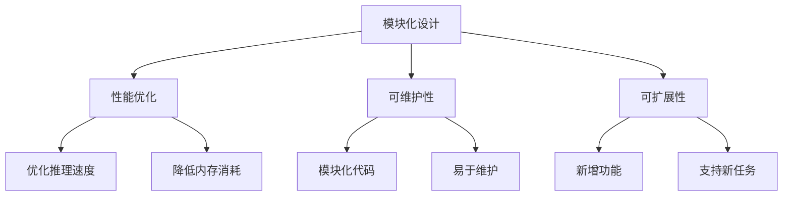
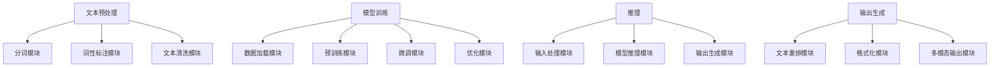

                 

### 第1章: 问题背景与核心概念

#### 1.1 模块化设计的概念与重要性

模块化设计是一种设计方法，其核心思想是将系统分解为一系列独立的、可复用的模块，每个模块负责特定功能。这种方法在软件工程中得到了广泛应用，因为它可以提高代码的可维护性和可扩展性。在LLM应用架构中，模块化设计同样扮演着关键角色。

**核心概念：**

- **模块（Module）：** 独立的功能单元，具有明确的输入和输出。
- **接口（Interface）：** 模块之间交互的边界，定义了模块如何进行通信。
- **复用（Reusability）：** 通过模块化设计，可以方便地复用现有的模块，减少重复开发工作。
- **可维护性（Maintainability）：** 模块化设计使得代码更加模块化，便于理解和修改。

**重要性：**

- **提高开发效率：** 通过模块化设计，开发人员可以并行工作，加快项目进度。
- **降低技术债务：** 避免因代码复杂度过高而导致的技术债务。
- **增强系统灵活性：** 模块化设计使得系统更容易适应需求变化。

#### 1.2 LLM的概念及其在应用架构中的作用

大型语言模型（LLM）是一种基于深度学习的自然语言处理模型，其通过学习大量文本数据来预测下一个词或句子。LLM在应用架构中扮演着重要角色，其性能和可扩展性直接影响到整个系统的表现。

**核心概念：**

- **预训练（Pre-training）：** LLM通过在大量文本数据上进行预训练，获得对自然语言的深层理解。
- **微调（Fine-tuning）：** 在预训练基础上，针对特定任务进行微调，以获得更好的性能。
- **推理（Inference）：** LLM在给定输入时，生成相应的输出。

**在应用架构中的作用：**

- **核心组件：** LLM是许多NLP应用的核心，如文本生成、机器翻译、问答系统等。
- **性能瓶颈：** LLM的推理速度和内存消耗是系统性能的重要瓶颈。
- **可扩展性：** 为了满足大规模用户需求，LLM应用需要具有良好的可扩展性。

#### 1.3 模块化设计与LLM应用架构的关系

模块化设计在LLM应用架构中具有重要意义，它可以帮助解决以下问题：

- **性能优化：** 通过模块化设计，可以针对不同的性能瓶颈进行优化，如加快推理速度、降低内存消耗等。
- **可维护性：** 模块化设计使得LLM代码更加模块化，便于维护和升级。
- **可扩展性：** 通过模块化设计，可以方便地增加新功能或支持新任务。

**关系图示例（使用Mermaid）：**



综上所述，模块化设计在LLM应用架构中具有重要意义，它不仅能够提高系统的性能和可维护性，还能增强系统的可扩展性。在接下来的章节中，我们将进一步探讨模块化设计的原理和具体应用。

### 摘要

本文旨在探讨模块化设计在LLM应用架构中的重要性。通过介绍模块化设计的基本概念和核心原则，以及LLM的基本原理和特性，本文揭示了模块化设计在LLM架构中的应用价值。文章分为多个章节，详细阐述了模块化设计在LLM架构中的具体应用，包括算法原理、数学模型、系统分析与架构设计，以及实际项目案例。通过最佳实践和注意事项的总结，本文为读者提供了全面的模块化设计指南，帮助他们在LLM应用开发中实现高效、可维护和可扩展的系统。阅读本文，读者将能够深入了解模块化设计的原理，掌握其在LLM架构中的应用技巧，并提升自己的软件开发能力。

## 第2章: 模块化设计原理

### 2.1 模块化设计的基本原则

模块化设计是一种通过将系统分解为独立的、可复用的模块来提高软件质量和开发效率的方法。该方法的核心在于明确模块之间的职责，确保系统的可维护性和可扩展性。以下是模块化设计的一些基本原则：

#### 单一职责原则

**定义：** 每个模块应只负责一个特定的功能。

**原因：** 通过单一职责原则，可以确保模块的功能明确，便于理解和修改。这有助于减少代码的复杂度，降低系统出错的风险。

**应用：** 在LLM架构中，输入处理模块、模型训练模块和输出生成模块都应该遵循单一职责原则。

#### 开闭原则

**定义：** 模块应开放用于扩展，但关闭用于修改。

**原因：** 开闭原则确保了模块的稳定性，避免因修改而引入新的错误。通过在模块外部提供扩展点，开发者可以方便地添加新功能，而无需修改原有代码。

**应用：** 在LLM架构中，模型训练模块和输出生成模块应遵循开闭原则，以便在不需要修改原有代码的情况下进行性能优化或功能扩展。

#### 里氏替换原则

**定义：** 模块应能被其子类替换而不影响系统行为。

**原因：** 里氏替换原则确保了模块的灵活性，使得系统能够适应新的需求变化。通过实现子类对父类的替换，可以减少模块之间的耦合度，提高系统的可扩展性。

**应用：** 在LLM架构中，不同类型的语言模型（如BERT、GPT）可以作为模块的子类，替换原始的模型模块，从而实现不同模型之间的无缝切换。

#### 依赖倒置原则

**定义：** 模块间的依赖关系应基于抽象，而不是具体实现。

**原因：** 依赖倒置原则确保了模块的解耦，使得系统能够更加灵活地适应变化。通过依赖倒置，开发者可以方便地替换模块的具体实现，而无需修改其他模块的代码。

**应用：** 在LLM架构中，输入处理模块和输出生成模块可以依赖抽象的接口，而具体的实现可以由不同的子模块提供。这样，当需要更换输入处理或输出生成方法时，只需替换相应的子模块即可。

#### 接口隔离原则

**定义：** 应为每个模块提供与其职责相关的接口。

**原因：** 接口隔离原则确保了模块间的交互明确，降低了模块之间的耦合度。通过为每个模块提供专门的接口，可以减少模块间的直接依赖，提高系统的可维护性。

**应用：** 在LLM架构中，输入处理模块、模型训练模块和输出生成模块应分别为其职责提供专门的接口。例如，输入处理模块的接口可以负责文本预处理，而模型训练模块的接口可以负责模型训练。

#### 透明封装原则

**定义：** 模块的内部实现应对外部透明。

**原因：** 透明封装原则确保了模块的独立性，使得模块的内部实现可以方便地进行修改和优化，而不会影响到其他模块。

**应用：** 在LLM架构中，模型训练模块和输出生成模块的内部实现应该对其他模块透明。这样，当需要优化模型训练算法或改进输出生成方法时，只需修改相应模块的内部实现，而无需修改其他模块的代码。

通过遵循这些基本原则，模块化设计能够显著提高软件系统的质量、可维护性和可扩展性。在LLM应用架构中，这些原则同样适用，有助于构建高效、稳定和可扩展的LLM应用。

#### 模块化设计在软件工程中的应用

模块化设计在软件工程中具有广泛的应用，其核心在于通过将系统分解为一系列独立的、可复用的模块，提高软件的可维护性和可扩展性。以下是模块化设计在软件工程中的几个关键应用场景：

**1. 组件化开发：**

组件化开发是一种通过将系统划分为多个独立的组件来实现的模块化设计方法。每个组件具有明确的功能和接口，可以独立开发、测试和部署。这种方法不仅提高了开发效率，还使得系统更加灵活和可扩展。

**优点：**

- **提高开发效率：** 通过并行开发，可以缩短项目周期。
- **降低技术债务：** 组件之间解耦，减少了因修改某个组件而引起的连锁反应。
- **易于维护：** 组件独立，便于理解和修改。

**案例：**

在Web应用开发中，可以使用组件化开发来构建用户界面。例如，一个电商平台的用户界面可以划分为导航栏组件、购物车组件、商品列表组件等，每个组件负责特定的功能。

**2. 插件架构：**

插件架构是一种通过在系统中集成插件来扩展功能的方法。插件是独立的模块，可以在系统运行时动态加载和卸载。这种方法使得系统可以轻松地添加新功能，而无需修改原有代码。

**优点：**

- **易于扩展：** 通过插件，可以方便地添加新功能。
- **高可维护性：** 插件独立，便于维护和升级。
- **降低耦合度：** 插件与系统其他部分解耦，减少了模块间的依赖。

**案例：**

在内容管理系统（CMS）中，插件架构可以用于添加新功能，如评论系统、会员系统、SEO工具等。开发者只需开发插件，然后将其集成到CMS中，即可实现新功能。

**3. 模块化数据库设计：**

模块化数据库设计是一种通过将数据库分解为多个独立的模块来提高系统性能和可维护性的方法。每个模块负责特定数据表或数据存储，可以独立扩展和优化。

**优点：**

- **提高性能：** 通过优化每个模块的数据存储和处理，可以显著提高系统性能。
- **易于维护：** 模块独立，便于理解和修改。
- **易于扩展：** 可以方便地增加新数据表或数据存储。

**案例：**

在一个大型电商系统中，可以使用模块化数据库设计来管理订单、用户、商品等数据。例如，订单模块可以独立管理订单数据，用户模块可以独立管理用户数据，这样既提高了系统的可维护性，又方便了性能优化。

**4. 模块化服务设计：**

模块化服务设计是一种通过将系统划分为多个独立的服务来实现的模块化设计方法。每个服务负责特定的业务功能，可以独立部署和扩展。

**优点：**

- **提高可扩展性：** 通过独立的服务，可以方便地添加新功能或支持新业务场景。
- **降低耦合度：** 服务之间解耦，减少了模块间的依赖。
- **易于维护：** 服务独立，便于维护和升级。

**案例：**

在一个云计算平台中，可以使用模块化服务设计来管理计算资源、存储资源、网络资源等。例如，计算服务可以独立管理计算节点，存储服务可以独立管理存储资源，这样既提高了系统的可维护性，又方便了性能优化和扩展。

**总结：**

模块化设计在软件工程中具有广泛的应用，通过组件化开发、插件架构、模块化数据库设计和模块化服务设计等方法，可以显著提高软件系统的质量、可维护性和可扩展性。在LLM应用架构中，模块化设计同样具有重要意义，它有助于构建高效、稳定和可扩展的LLM应用。

### 2.3 LLM中的模块化设计特点

在LLM（大型语言模型）架构中，模块化设计具有独特的特点，这些特点决定了LLM在实现高性能、可扩展和易维护方面的优势。

#### 1. 功能独立性

LLM通常由多个功能模块组成，如文本预处理模块、模型训练模块、推理模块和输出生成模块。每个模块都负责特定的功能，独立实现，彼此之间通过明确的接口进行通信。这种独立性使得每个模块都可以独立开发、测试和部署，提高了系统的整体可维护性。

**示例：** 在文本预处理模块中，可以包含分词、词性标注、文本清洗等功能，这些功能相互独立，可以分别实现和优化。

#### 2. 可扩展性

模块化设计使得LLM架构具有很好的可扩展性。在新增功能或支持新任务时，只需添加新的模块或修改现有模块，而无需对整个系统进行大规模重构。这种灵活性对于应对快速变化的需求和持续的技术创新至关重要。

**示例：** 在LLM架构中，可以通过添加新的模型训练模块来支持新的训练算法，或通过扩展输出生成模块来支持不同的输出格式（如文本、图像、音频等）。

#### 3. 高效性

模块化设计有助于提高LLM的运行效率。通过将复杂的任务分解为独立的模块，可以分别优化每个模块的算法和性能。此外，模块之间的并行处理和分布式计算也成为可能，进一步提高了系统的运行效率。

**示例：** 在模型训练模块中，可以采用并行梯度计算和分布式训练技术，加速训练过程，提高模型性能。

#### 4. 低耦合度

模块化设计降低了模块之间的耦合度，减少了模块间的依赖关系。这种低耦合度使得系统更加灵活，模块可以独立开发和优化，同时降低了系统出错的风险。

**示例：** 在LLM架构中，输入处理模块和输出生成模块可以通过抽象接口进行通信，减少了直接耦合，提高了系统的稳定性和可维护性。

#### 5. 易于复用

模块化设计使得LLM中的模块可以方便地复用。在多个应用场景中，相同的模块可以重复使用，减少了重复开发的工作量，提高了开发效率。

**示例：** 在多个NLP任务中，文本预处理模块可以复用，无需为每个任务重新编写文本预处理代码。

#### 6. 可维护性

模块化设计提高了LLM的可维护性。每个模块的功能独立，使得修改和维护工作更加集中和明确，降低了复杂度。

**示例：** 在LLM架构中，当需要对文本预处理模块进行优化时，只需修改该模块的代码，而无需修改其他模块。

综上所述，模块化设计在LLM架构中具有独特的特点，这些特点不仅提高了系统的性能和可扩展性，还增强了系统的可维护性和可复用性。在LLM应用开发中，充分利用模块化设计的优势，能够构建高效、稳定和灵活的LLM应用架构。

## 第3章: LLM架构中的模块化设计

### 3.1 LLM架构概述

LLM（大型语言模型）的架构是自然语言处理（NLP）领域的重要成果之一。它通过深度学习技术，对海量文本数据进行分析和建模，从而实现语言理解和生成任务。LLM架构的核心组成部分包括文本预处理模块、模型训练模块、推理模块和输出生成模块。以下是对LLM架构的概述：

#### 文本预处理模块

文本预处理是LLM架构的第一步，其主要任务是清洗和准备输入文本数据，以便模型能够高效地进行训练和推理。文本预处理模块通常包含以下功能：

- **分词（Tokenization）：** 将文本分解为单词、句子或其他有意义的标记。
- **词性标注（Part-of-Speech Tagging）：** 为每个标记分配词性，如名词、动词、形容词等。
- **文本清洗（Text Cleaning）：** 去除无效信息，如标点符号、停用词等。
- **词向量表示（Word Vector Representation）：** 将文本标记转换为数字向量表示，以便模型处理。

#### 模型训练模块

模型训练模块是LLM架构的核心，负责根据预处理的文本数据，训练深度学习模型。训练过程通常包括以下步骤：

- **预训练（Pre-training）：** 在大量无标注文本上进行模型训练，使模型具备对自然语言的泛化能力。
- **微调（Fine-tuning）：** 在预训练基础上，针对特定任务进行微调，以优化模型在特定领域的性能。
- **模型优化（Model Optimization）：** 采用各种技术，如梯度裁剪、权重共享等，优化模型结构和参数。

#### 推理模块

推理模块负责在给定输入文本时，生成相应的输出文本。其核心任务是利用训练好的模型，对输入文本进行理解和生成。推理模块通常包含以下功能：

- **输入处理（Input Processing）：** 对输入文本进行预处理，使其符合模型输入要求。
- **模型推理（Model Inference）：** 使用训练好的模型，对输入文本进行推理，生成中间结果。
- **输出生成（Output Generation）：** 根据推理结果，生成有意义的输出文本。

#### 输出生成模块

输出生成模块负责将推理模块生成的中间结果转换为最终的输出文本。输出生成模块通常包含以下功能：

- **文本重排（Text Rewriting）：** 对中间结果进行重排，使其更加自然和通顺。
- **格式化（Formatting）：** 将输出文本格式化，以适应不同的应用场景。
- **多模态输出（Multimodal Output）：** 如果需要，生成文本之外的输出，如图像、音频等。

#### 模块化设计在LLM架构中的应用

模块化设计在LLM架构中具有重要应用，它有助于提高系统的可维护性、可扩展性和可复用性。以下是如何将模块化设计原则应用于LLM架构的各个层次：

- **文本预处理模块：** 可以将分词、词性标注、文本清洗等功能模块化，每个模块独立实现，便于维护和优化。
- **模型训练模块：** 可以将预训练、微调、模型优化等步骤模块化，提高训练过程的灵活性和可扩展性。
- **推理模块：** 可以将输入处理、模型推理、输出生成等功能模块化，便于针对不同应用场景进行定制化开发。
- **输出生成模块：** 可以将文本重排、格式化、多模态输出等功能模块化，提高输出文本的质量和多样性。

#### 模块化设计对LLM性能的影响

模块化设计对LLM性能有显著的积极影响：

- **性能优化：** 通过模块化设计，可以针对不同模块进行优化，如使用并行计算和分布式训练技术，提高模型训练和推理速度。
- **可扩展性：** 模块化设计使得LLM架构具有良好的可扩展性，便于添加新功能或支持新任务。
- **可维护性：** 模块化设计降低了系统的复杂度，提高了代码的可维护性，便于后续的优化和升级。

通过模块化设计，LLM架构能够更好地应对实际应用中的挑战，实现高效、稳定和灵活的NLP应用。

### 3.2 模块化设计在LLM架构中的应用

模块化设计在LLM架构中的应用是其实现高效、可扩展和可维护的关键。通过将整个系统划分为多个独立的模块，每个模块负责特定的功能，可以显著提升系统的性能和灵活性。以下是如何将模块化设计原则具体应用到LLM架构中的各个层次：

#### 文本预处理模块

文本预处理模块是LLM架构的基础，其任务是对输入文本进行清洗和转换，为后续的模型训练和推理做好准备。模块化设计可以将其拆分为以下几个独立模块：

- **分词模块（Tokenizer）：** 负责将文本拆分成单词或子词。这个模块可以是基于规则的分词器，如正则表达式分词，也可以是使用神经网络模型进行分词，如BERT的分词器。
- **词性标注模块（Lemmatizer）：** 负责为每个分词结果分配词性，如名词、动词等。这个模块可以使用规则方法，也可以使用基于神经网络的方法。
- **文本清洗模块（Text Cleaner）：** 负责去除无用的信息，如HTML标签、特殊字符等。这个模块通常包含一系列清洗规则，以实现高效、精准的文本清洗。

**模块化优势：**

- **可维护性：** 每个模块独立实现，可以独立维护和更新，如更新分词规则或清洗算法。
- **可扩展性：** 可以方便地添加新功能，如支持多语言分词或添加新的清洗规则。

#### 模型训练模块

模型训练模块是LLM的核心，其任务是利用预处理的文本数据训练出高性能的模型。模块化设计可以将其拆分为以下几个独立模块：

- **数据加载模块（Data Loader）：** 负责将文本数据加载到内存中，并进行预处理，如批量加载、序列填充等。
- **预训练模块（Pre-training）：** 负责在大量无标注文本上进行预训练，使模型具备基础的语言理解能力。这个模块通常使用基于Transformer的模型，如BERT、GPT等。
- **微调模块（Fine-tuning）：** 负责在预训练基础上，针对特定任务进行微调，以优化模型在特定领域的性能。这个模块可以根据任务需求，调整模型结构、学习率等参数。
- **优化模块（Optimizer）：** 负责优化模型参数，以提高模型的训练效率和性能。这个模块通常包含各种优化算法，如Adam、Adagrad等。

**模块化优势：**

- **可扩展性：** 可以方便地更换或增加新的训练算法和优化方法。
- **可维护性：** 每个模块独立实现，便于维护和更新，如更换预训练模型或优化算法。

#### 推理模块

推理模块负责在给定输入文本时，生成相应的输出文本。模块化设计可以将其拆分为以下几个独立模块：

- **输入处理模块（Input Processor）：** 负责将输入文本预处理为模型输入格式，如序列编码、词向量表示等。
- **模型推理模块（Model Inference）：** 负责使用训练好的模型进行推理，生成中间结果。
- **输出生成模块（Output Generator）：** 负责将推理结果转换为最终的输出文本，如文本生成、摘要生成等。

**模块化优势：**

- **灵活性：** 可以根据需求，自由组合不同的推理和生成算法，实现多种语言理解与生成任务。
- **高效性：** 模块化设计使得推理过程可以并行化，提高系统的响应速度。

#### 输出生成模块

输出生成模块负责将模型推理结果转换为用户可理解的输出文本。模块化设计可以将其拆分为以下几个独立模块：

- **文本重排模块（Text Reformatter）：** 负责对生成的中间结果进行重排，使其更加自然和通顺。
- **格式化模块（Formatter）：** 负责将输出文本格式化，以适应不同的应用场景，如文档生成、对话系统等。
- **多模态输出模块（Multimodal Output）：** 负责生成文本之外的输出，如图像、音频等。

**模块化优势：**

- **多样性：** 可以生成多种不同格式的输出，满足不同应用需求。
- **可扩展性：** 可以方便地添加新的输出格式和算法。

通过模块化设计，LLM架构可以更好地应对复杂的语言理解与生成任务，实现高效、稳定和灵活的应用。以下是一个示例，展示如何使用Mermaid绘制一个简单的LLM模块化架构图：



通过这个模块化架构，LLM可以更加灵活地适应不同的应用场景，实现高效的语言处理任务。

### 3.3 模块化设计对LLM性能的影响

模块化设计对LLM性能的影响是深远且积极的。通过将LLM架构分解为独立的模块，可以更有效地优化每个模块，从而提升整体性能。以下是模块化设计对LLM性能的几个关键影响：

#### 性能优化

模块化设计使得每个模块可以独立优化，从而实现更高效的计算。以下是一些优化策略：

- **并行计算：** 通过并行计算，可以将不同模块的任务分配到多个处理器或线程上，从而显著提高处理速度。例如，文本预处理和模型训练可以并行执行。
- **分布式计算：** 对于大规模数据集，可以采用分布式计算技术，将数据分布在多个计算节点上，从而加速模型训练和推理。
- **算法优化：** 每个模块都可以独立优化其内部的算法，如使用更高效的分词算法、模型训练算法等。

**示例：** 使用多线程并行处理文本预处理任务，可以显著提高数据处理速度。

#### 可扩展性

模块化设计使得LLM架构具有良好的可扩展性，能够灵活地添加新功能或支持新任务。这种灵活性对性能的提升至关重要，因为它允许系统在需求变化时，无需大规模重构。

- **功能扩展：** 通过模块化设计，可以方便地添加新的功能模块，如支持新的语言或文本生成算法。
- **任务扩展：** 可以轻松地将LLM应用到新的任务中，如对话系统、问答系统等，而无需修改现有代码。

**示例：** 添加一个基于BERT的问答系统模块，无需修改文本预处理和模型推理模块。

#### 可维护性

模块化设计提高了LLM的可维护性，使得代码更加清晰、易于理解和修改。这有助于减少因代码复杂度过高而导致的问题，从而提高整体性能。

- **代码分离：** 每个模块负责特定的功能，代码分离，使得每个模块可以独立维护和优化。
- **易于调试：** 独立模块使得调试工作更加集中和明确，便于定位和解决问题。

**示例：** 当发现文本预处理模块存在问题时，可以单独调试该模块，而不影响其他模块。

#### 资源利用

模块化设计有助于优化资源利用，减少内存和计算资源的浪费。通过合理分配任务和优化模块，可以更有效地利用系统资源。

- **内存管理：** 独立模块可以独立管理内存资源，避免因内存溢出而导致性能下降。
- **计算资源分配：** 可以根据任务需求和资源可用性，动态分配计算资源，提高系统利用率。

**示例：** 在模型训练阶段，可以动态调整GPU和CPU的使用比例，以充分利用计算资源。

通过模块化设计，LLM架构能够实现更高效的性能优化、灵活的可扩展性、良好的可维护性以及高效的资源利用。这些优势不仅提高了LLM的整体性能，还为其在实际应用中提供了强大的支持。

### 4.1 LLM算法的基本原理

LLM（大型语言模型）算法的基本原理主要基于深度学习技术，尤其是自注意力机制（Self-Attention）和变换器网络（Transformer）。这些算法通过处理海量文本数据，实现对自然语言的深层理解和生成能力。以下是LLM算法的基本原理：

#### 自注意力机制

自注意力机制是一种关键的计算方法，用于处理序列数据。在LLM算法中，自注意力机制使得模型能够自动关注序列中的重要信息，提高对序列的表征能力。

**原理：**

- **计算自注意力分数：** 对于输入序列中的每个词，模型会计算其与其他词之间的注意力分数。注意力分数表示该词在全局序列中的重要性。
- **加权求和：** 根据注意力分数，对输入序列中的每个词进行加权求和，得到一个加权的表示向量。

**优势：**

- **捕获长距离依赖：** 自注意力机制使得模型能够捕捉到序列中长距离的依赖关系，提高语言理解的准确性。
- **并行计算：** 自注意力机制支持并行计算，提高了模型的计算效率。

#### 变换器网络

变换器网络（Transformer）是LLM算法的核心结构，由多个变换器层堆叠而成。每个变换器层包含自注意力机制和前馈网络，用于对输入序列进行编码和解码。

**结构：**

- **编码器（Encoder）：** 对输入序列进行编码，生成上下文表示。
- **解码器（Decoder）：** 对编码器的输出进行解码，生成输出序列。

**工作流程：**

1. **编码：** 编码器将输入序列编码为序列向量，每个向量表示输入序列中的一个词或子词。
2. **解码：** 解码器使用编码器的输出和自注意力机制，逐词生成输出序列。

**优势：**

- **高效性：** 变换器网络支持并行计算，使得模型训练和推理速度更快。
- **灵活性：** 变换器网络结构灵活，可以通过调整层数和隐藏层大小，适应不同规模的任务。

#### 预训练和微调

预训练和微调是LLM算法的两个关键步骤。预训练在大量无标注的文本数据上进行，使模型具备基础的语言理解能力。微调则在预训练基础上，针对特定任务进行优化，提高模型在特定领域的性能。

**预训练：**

- **无监督学习：** 预训练利用无标注文本数据，通过自动编码器、语言模型等任务，使模型对自然语言进行深度学习。
- **大规模数据集：** 使用大规模数据集进行预训练，可以提高模型的泛化能力。

**微调：**

- **有监督学习：** 微调利用有标注的数据集，对预训练模型进行进一步训练，优化模型在特定任务上的性能。
- **任务特定优化：** 通过微调，可以调整模型参数，优化模型结构，以适应特定任务的需求。

通过预训练和微调，LLM算法可以实现对自然语言的深度理解和生成，从而在多种NLP任务中表现出色。

### 4.2 模块化设计在LLM算法中的应用

模块化设计在LLM算法中发挥着至关重要的作用，通过将复杂算法分解为独立的模块，可以提高算法的可维护性、可扩展性和可复用性。以下是模块化设计在LLM算法中的应用：

#### 模块化设计的优势

模块化设计的优势在LLM算法中尤为显著，主要体现在以下几个方面：

- **可维护性：** 通过模块化设计，每个模块独立实现，便于单独维护和更新。例如，在文本预处理模块中，可以独立维护分词器、词性标注器等。
- **可扩展性：** 模块化设计使得算法易于扩展。例如，在模型训练模块中，可以添加新的训练算法或优化策略，而无需修改其他模块。
- **可复用性：** 独立模块可以方便地在不同任务中复用。例如，预训练模块可以在多个不同的NLP任务中复用。

#### 文本预处理模块

文本预处理模块负责将原始文本数据转换为适合模型训练的格式。模块化设计可以将其拆分为以下独立模块：

- **分词器（Tokenizer）：** 负责将文本拆分为单词或子词。分词器可以是基于规则的分词器，如正则表达式分词，也可以是使用神经网络模型的分词器，如BERT的分词器。
- **词向量编码器（Word Vector Encoder）：** 负责将分词结果转换为词向量表示。词向量编码器可以是基于词嵌入（Word Embedding）的方法，如Word2Vec、GloVe，也可以是基于神经网络的方法，如BERT的编码器。
- **词性标注器（Lemmatizer）：** 负责为每个分词结果分配词性，如名词、动词等。词性标注器可以是基于规则的方法，也可以是基于神经网络的方法。

#### 模型训练模块

模型训练模块是LLM算法的核心，负责训练出高性能的模型。模块化设计可以将其拆分为以下独立模块：

- **数据加载器（Data Loader）：** 负责将文本数据加载到内存中，并进行预处理，如批量加载、序列填充等。
- **预训练模块（Pre-training）：** 负责在大量无标注文本上进行预训练，使模型具备基础的语言理解能力。预训练模块可以包含多个训练任务，如语言模型、自动编码器等。
- **微调模块（Fine-tuning）：** 负责在预训练基础上，针对特定任务进行微调，以优化模型在特定领域的性能。微调模块可以根据任务需求，调整模型结构、学习率等参数。
- **优化器（Optimizer）：** 负责优化模型参数，以提高模型的训练效率和性能。优化器可以包含各种优化算法，如Adam、Adagrad等。

#### 推理模块

推理模块负责在给定输入文本时，生成相应的输出文本。模块化设计可以将其拆分为以下独立模块：

- **输入处理器（Input Processor）：** 负责将输入文本预处理为模型输入格式，如序列编码、词向量表示等。
- **模型推理器（Model Inference）：** 负责使用训练好的模型进行推理，生成中间结果。模型推理器可以包含多个推理算法，如序列生成、摘要生成等。
- **输出生成器（Output Generator）：** 负责将推理结果转换为最终的输出文本。输出生成器可以根据任务需求，调整输出格式，如文本、图像、音频等。

通过模块化设计，LLM算法不仅实现了更高的可维护性、可扩展性和可复用性，还提高了整体性能。模块化设计使得各个模块可以独立优化和更新，为LLM算法在自然语言处理领域的发展奠定了坚实的基础。

### 4.3 关键数学模型和公式解析

在LLM（大型语言模型）算法中，多个关键数学模型和公式起着至关重要的作用。以下是对这些模型和公式的解析，以及它们在算法中的作用：

#### 1. 自注意力机制（Self-Attention）

自注意力机制是LLM算法的核心组成部分，它通过计算序列中每个词与其他词之间的注意力分数，实现对序列的深度表征。以下是自注意力机制的关键公式：

**输入：** 序列\(X = [x_1, x_2, ..., x_n]\)

**输出：** 加权表示向量\(H = [h_1, h_2, ..., h_n]\)

**公式：**

\[ 
Attention(Q, K, V) = softmax\left(\frac{QK^T}{\sqrt{d_k}}\right) V 
\]

其中：
- \(Q, K, V\) 分别是查询向量、键向量和值向量，它们都是来自同一个嵌入空间的向量。
- \(d_k\) 是键向量的维度。
- \(QK^T\) 是一个矩阵乘积，用于计算注意力分数。
- \(softmax\) 函数用于归一化注意力分数，使其满足概率分布。

**作用：**

自注意力机制能够自动关注序列中的重要信息，提高对序列的表征能力。它捕获了序列中的长距离依赖关系，使得模型能够更好地理解和生成自然语言。

#### 2. 变换器网络（Transformer）

变换器网络是由多个变换器层堆叠而成的，每个变换器层包含自注意力机制和前馈网络。以下是变换器网络的关键公式：

**编码器（Encoder）：**
\[ 
E = \text{MultiHeadAttention}(Q, K, V) + X 
\]
\[ 
E = \text{LayerNormalization}(E) 
\]
\[ 
E = \text{FFN}(E) + E 
\]
\[ 
E = \text{LayerNormalization}(E) 
\]

**解码器（Decoder）：**
\[ 
D = \text{MaskedMultiHeadAttention}(Q, K, V) + X 
\]
\[ 
D = \text{LayerNormalization}(D) 
\]
\[ 
D = \text{FFN}(D) + D 
\]
\[ 
D = \text{LayerNormalization}(D) 
\]

其中：
- \(X\) 是输入序列。
- \(Q, K, V\) 分别是编码器的查询向量、键向量和值向量。
- \(\text{MultiHeadAttention}\) 和 \(\text{MaskedMultiHeadAttention}\) 是自注意力机制的实现。
- \(\text{LayerNormalization}\) 是层归一化操作。
- \(\text{FFN}\) 是前馈网络，用于增加非线性变换。

**作用：**

变换器网络通过自注意力机制和前馈网络，实现对输入序列的编码和解码。自注意力机制捕获序列中的依赖关系，前馈网络提供额外的非线性变换，从而提高模型的表征能力。

#### 3. 预训练和微调

预训练和微调是LLM算法的两个关键步骤。以下是它们的关键公式：

**预训练：**
\[ 
\text{Loss} = -\sum_{i} \log p(y_i|x_i) 
\]

其中：
- \(p(y_i|x_i)\) 是模型在给定输入\(x_i\)时，预测输出\(y_i\)的概率。
- \(\text{Loss}\) 是损失函数，用于评估模型预测的准确性。

**微调：**
\[ 
\text{Loss} = -\sum_{i} \log p(y_i|x_i, \theta) 
\]

其中：
- \(\theta\) 是模型的参数。
- \(p(y_i|x_i, \theta)\) 是在给定输入\(x_i\)和模型参数\(\theta\)时，预测输出\(y_i\)的概率。

**作用：**

预训练通过无监督学习，使模型具备基础的语言理解能力。微调通过有监督学习，进一步优化模型在特定任务上的性能。两者结合，使得模型能够在多种NLP任务中表现出色。

通过上述关键数学模型和公式的解析，我们可以更好地理解LLM算法的工作原理。这些模型和公式为LLM算法提供了强大的数学基础，使得它在自然语言处理领域取得了显著的成果。

### 5.1 LLM应用场景分析

#### 文本生成

文本生成是LLM最常用的应用场景之一，涵盖从简单的文本摘要到复杂的创意写作。以下是一些典型的文本生成任务：

- **自动摘要（Automatic Summarization）：** 自动摘要旨在从长文本中提取关键信息，生成简明扼要的摘要。常见的自动摘要方法包括抽取式摘要和生成式摘要。
- **故事生成（Story Generation）：** 通过LLM生成虚构故事，适用于娱乐、教育和创意写作等领域。
- **邮件和短信自动化（Email and SMS Automation）：** 自动化生成商务邮件、个人短信，提高沟通效率。

#### 问答系统

问答系统利用LLM处理用户输入，生成相关且准确的回答。以下是问答系统的几种类型：

- **开放域问答（Open-Domain Question Answering）：** 能够回答各种领域的广泛问题，如搜索引擎、智能客服等。
- **闭域问答（Closed-Domain Question Answering）：** 针对特定领域或数据集的问题，如医学问答系统、法律咨询问答系统等。
- **对话式问答（Dialogue-Based Question Answering）：** 在对话过程中动态调整回答，提高用户体验。

#### 机器翻译

机器翻译是将一种语言的文本翻译成另一种语言的过程。LLM在机器翻译中的应用包括：

- **神经机器翻译（Neural Machine Translation）：** 使用神经网络模型，如变换器网络，进行高效准确的文本翻译。
- **零样本翻译（Zero-Shot Translation）：** 不需要特定语言的训练数据，直接对新的语言进行翻译。
- **多语言翻译（Multi-Lingual Translation）：** 同时处理多种语言的文本翻译，如双语字幕生成。

#### 文本分类

文本分类是将文本数据分为不同类别的过程。以下是一些文本分类的应用：

- **情感分析（Sentiment Analysis）：** 分析文本的情感倾向，如正面、负面或中性。
- **主题分类（Thematic Classification）：** 根据文本内容将其归类到不同的主题类别，如新闻分类、产品评论分类等。
- **垃圾邮件检测（Spam Detection）：** 识别和过滤垃圾邮件，提高邮件系统的安全性。

#### 文本相似度计算

文本相似度计算旨在衡量两个文本之间的相似程度。以下是一些应用：

- **文本匹配（Text Matching）：** 用于搜索和推荐系统，找到与查询文本最相似的文档。
- **抄袭检测（Plagiarism Detection）：** 识别和检测文档中的抄袭行为。
- **文本检索（Text Retrieval）：** 在大型文本数据库中查找与输入文本相似的内容。

#### 文本摘要

文本摘要从长文本中提取关键信息，生成简明的摘要。以下是一些文本摘要的应用：

- **新闻摘要（News Summarization）：** 自动生成新闻文章的摘要，提高信息获取效率。
- **医疗摘要（Medical Summarization）：** 从医疗文本中提取关键信息，帮助医生快速了解患者病情。
- **文档摘要（Document Summarization）：** 对文档进行摘要，简化信息传递过程。

通过上述分析，我们可以看到LLM在多种应用场景中具有广泛的应用前景，从文本生成到机器翻译，从文本分类到文本相似度计算，都在不断推动自然语言处理技术的发展。

### 5.2 模块化架构设计

为了实现高效、灵活且易于维护的LLM架构，我们可以采用模块化设计方法。模块化架构设计将整个系统分解为多个功能独立的模块，每个模块负责特定的功能。以下是LLM模块化架构设计的主要组成部分及其详细描述：

#### 1. 文本预处理模块

文本预处理模块负责将原始文本数据转换为适合模型训练和推理的格式。该模块通常包括以下子模块：

- **分词器（Tokenizer）：** 负责将原始文本分解为单词或子词。可以使用规则分词器或神经网络分词器，如BERT的分词器。
- **词向量编码器（Word Vector Encoder）：** 负责将分词结果转换为词向量表示。常用的词向量编码方法包括Word2Vec、GloVe和BERT等。
- **词性标注器（Lemmatizer）：** 负责为每个词分配词性，如名词、动词、形容词等。词性标注有助于提高模型对文本的理解能力。
- **文本清洗器（Text Cleaner）：** 负责去除文本中的无关信息，如HTML标签、特殊字符和停用词。文本清洗可以提高模型训练的质量。

#### 2. 模型训练模块

模型训练模块负责使用预处理后的文本数据训练LLM模型。该模块通常包括以下子模块：

- **数据加载器（Data Loader）：** 负责将文本数据加载到内存中，并进行预处理，如批量加载、序列填充等。
- **预训练模块（Pre-training）：** 负责在大量无标注文本上进行预训练，使模型具备基础的语言理解能力。预训练模块可以包含多个训练任务，如语言模型、自动编码器等。
- **微调模块（Fine-tuning）：** 负责在预训练基础上，针对特定任务进行微调，以优化模型在特定领域的性能。微调模块可以根据任务需求，调整模型结构、学习率等参数。
- **优化器（Optimizer）：** 负责优化模型参数，以提高模型的训练效率和性能。优化器可以包含各种优化算法，如Adam、Adagrad等。

#### 3. 推理模块

推理模块负责在给定输入文本时，生成相应的输出文本。该模块通常包括以下子模块：

- **输入处理器（Input Processor）：** 负责将输入文本预处理为模型输入格式，如序列编码、词向量表示等。
- **模型推理器（Model Inference）：** 负责使用训练好的模型进行推理，生成中间结果。模型推理器可以包含多个推理算法，如序列生成、摘要生成等。
- **输出生成器（Output Generator）：** 负责将推理结果转换为最终的输出文本。输出生成器可以根据任务需求，调整输出格式，如文本、图像、音频等。

#### 4. 输出生成模块

输出生成模块负责将模型推理结果转换为用户可理解的输出文本。该模块通常包括以下子模块：

- **文本重排器（Text Reformatter）：** 负责对生成的中间结果进行重排，使其更加自然和通顺。
- **格式化器（Formatter）：** 负责将输出文本格式化，以适应不同的应用场景，如文档生成、对话系统等。
- **多模态输出器（Multimodal Output）：** 负责生成文本之外的输出，如图像、音频等。多模态输出器可以支持多种输出格式，以满足不同应用需求。

#### 模块化架构的优势

模块化架构设计具有以下优势：

- **可维护性：** 每个模块独立实现，便于单独维护和更新。例如，当需要对分词器进行更新时，只需修改文本预处理模块，而无需修改其他模块。
- **可扩展性：** 可以方便地添加新功能或支持新任务。例如，在模型训练模块中，可以添加新的训练算法或优化策略，而无需修改现有模块。
- **可复用性：** 独立模块可以方便地在不同任务中复用。例如，文本预处理模块可以在多个不同的NLP任务中复用。
- **高性能：** 模块化设计使得系统能够充分利用并行计算和分布式计算技术，提高处理速度。

通过模块化架构设计，LLM系统能够实现高效、灵活和可维护的NLP应用，满足多样化的需求。

### 5.3 系统接口与交互设计

在LLM的模块化架构设计中，系统接口与交互设计是确保模块之间高效、稳定和灵活通信的关键。以下是系统接口与交互设计的详细描述：

#### 接口设计原则

- **单一职责：** 每个接口应只负责一种类型的数据交换或功能调用。
- **最小化依赖：** 接口应尽量减少对内部实现的依赖，以便于模块的独立开发和维护。
- **高内聚性：** 接口设计应确保模块之间的耦合度最低，从而提高系统的可维护性和扩展性。

#### 接口类型

1. **数据接口：** 用于模块之间的数据传递。数据接口定义了数据的格式、类型和传输方式。例如，文本预处理模块与模型训练模块之间的数据接口可能包括文本序列、词向量、标签等。

2. **功能接口：** 用于模块之间的功能调用。功能接口定义了模块之间的交互方式，如输入处理、模型推理、输出生成等。例如，模型训练模块可以提供一个训练接口，接受输入数据并返回训练结果。

3. **配置接口：** 用于模块的配置管理。配置接口允许开发者动态调整模块的参数和配置，如学习率、批量大小等。例如，可以通过配置接口设置模型训练模块的超参数。

#### 接口实现

1. **RESTful API：** 一种流行的接口设计方法，基于HTTP协议，支持GET、POST、PUT、DELETE等请求方法。RESTful API便于模块之间的远程通信，适用于分布式系统。

2. **消息队列：** 一种异步通信机制，通过消息队列实现模块之间的数据传递。消息队列可以处理高并发的数据传输，适用于实时性要求较高的场景。

3. **事件驱动：** 通过事件驱动的方式实现模块之间的交互。模块可以发布事件，其他模块可以订阅这些事件并响应。事件驱动架构具有高扩展性和低耦合度，适用于复杂系统的交互设计。

#### 接口交互示例

以下是一个简单的接口交互示例，展示文本预处理模块与模型训练模块之间的通信：

**文本预处理模块：**
```python
class TextPreprocessingModule:
    def preprocess_text(self, text):
        # 分词、词性标注、文本清洗等预处理操作
        processed_text = self.tokenize(text)
        processed_text = self.lemmatize(processed_text)
        processed_text = self.clean_text(processed_text)
        return processed_text
```

**模型训练模块：**
```python
class ModelTrainingModule:
    def train_model(self, preprocessed_text):
        # 训练模型
        model = self.build_model()
        model.fit(preprocessed_text)
        return model
```

**交互流程：**
1. 文本预处理模块调用`preprocess_text`方法，对输入文本进行预处理。
2. 预处理后的文本作为输入传递给模型训练模块。
3. 模型训练模块调用`train_model`方法，使用预处理后的文本数据进行模型训练。
4. 模型训练完成后，返回训练好的模型。

通过合理的接口设计与交互设计，LLM模块化架构能够实现高效、稳定和灵活的模块间通信，为NLP应用提供强大的支持。

### 6.1 环境搭建与工具介绍

在开始构建模块化的LLM应用之前，我们需要搭建一个合适的环境，并介绍所需的工具和库。以下是环境搭建和工具介绍的详细步骤：

#### 1. 硬件环境

为了确保LLM应用的高性能和稳定性，我们建议使用以下硬件配置：

- **CPU：** 至少使用四核CPU，推荐使用更高效的处理器，如Intel Xeon系列或AMD Ryzen系列。
- **GPU：** 推荐使用NVIDIA GPU，如Tesla V100或更高版本的GPU，以便充分利用深度学习算法的并行计算能力。
- **内存：** 至少16GB内存，推荐使用32GB或更高，以确保模型训练过程中有足够的内存空间。

#### 2. 操作系统

我们推荐使用Linux操作系统，因为其在深度学习和大数据处理方面具有更好的性能和兼容性。以下是两种常见的Linux发行版：

- **Ubuntu：** Ubuntu是一个流行的Linux发行版，适用于桌面和服务器环境。
- **CentOS：** CentOS是一个基于Red Hat Enterprise Linux的免费发行版，适用于企业级应用。

#### 3. 编译器与解释器

我们需要安装以下编程语言的编译器和解释器：

- **Python：** Python是一种广泛使用的编程语言，支持多种深度学习库。我们推荐使用Python 3.8或更高版本。
- **C++：** C++是一个高性能编程语言，用于编写高性能的深度学习模型。我们推荐使用GCC或Clang作为编译器。

#### 4. 深度学习库

以下是几个常用的深度学习库，用于构建和训练LLM：

- **TensorFlow：** TensorFlow是一个开源的深度学习框架，支持多种模型和算法，广泛应用于NLP任务。
- **PyTorch：** PyTorch是一个流行的深度学习库，具有灵活的动态图计算能力，便于模型开发和调试。
- **Transformers：** Transformers是一个专门为Transformer模型设计的库，提供了高效的预训练和微调工具。

#### 5. 环境安装

以下是环境安装的详细步骤：

1. **安装操作系统：** 下载并安装所选的Linux发行版。
2. **安装Python：** 使用包管理器（如apt或yum）安装Python 3.8或更高版本。
   ```bash
   sudo apt update
   sudo apt install python3.8
   ```
3. **安装C++编译器：** 安装GCC或Clang编译器。
   ```bash
   sudo apt install g++
   ```
4. **安装深度学习库：** 使用pip安装TensorFlow、PyTorch和Transformers。
   ```bash
   pip install tensorflow
   pip install torch torchvision
   pip install transformers
   ```
5. **配置GPU支持：** 确保深度学习库支持GPU，并安装必要的CUDA和cuDNN驱动。

通过以上步骤，我们可以搭建一个适合构建模块化LLM应用的环境。接下来，我们将详细讨论如何使用这些工具和库来实现一个模块化的LLM应用。

### 6.2 模块化设计实现

在实现一个模块化的LLM应用时，关键在于将系统分解为多个功能独立的模块，并定义清晰的接口以实现模块间的通信。以下是模块化设计实现的详细步骤：

#### 1. 定义模块

首先，我们需要定义LLM应用中的各个模块，每个模块负责特定的功能。以下是几个关键模块及其功能：

- **文本预处理模块（Text Preprocessing Module）：** 负责将原始文本数据转换为适合模型训练和推理的格式。包括分词、词性标注、文本清洗等操作。
- **模型训练模块（Model Training Module）：** 负责使用预处理后的文本数据训练LLM模型。包括预训练、微调和优化等步骤。
- **推理模块（Inference Module）：** 负责在给定输入文本时，生成相应的输出文本。包括输入处理、模型推理和输出生成等步骤。
- **服务模块（Service Module）：** 负责提供对外接口，如RESTful API或消息队列，以供外部系统调用。

#### 2. 设计接口

为了实现模块间的通信，我们需要设计清晰、明确的接口。以下是几个关键接口：

- **文本预处理接口（Text Preprocessing Interface）：** 定义了文本预处理模块与模型训练模块之间的数据传输格式和方法。
- **模型训练接口（Model Training Interface）：** 定义了模型训练模块与推理模块之间的数据传输格式和方法。
- **推理接口（Inference Interface）：** 定义了推理模块与外部服务模块之间的数据传输格式和方法。

#### 3. 实现模块

接下来，我们使用Python语言和深度学习库（如TensorFlow和Transformers）实现各个模块。以下是各个模块的实现示例：

**文本预处理模块：**
```python
class TextPreprocessingModule:
    def preprocess_text(self, text):
        # 分词、词性标注、文本清洗等操作
        tokens = self.tokenize(text)
        lemmas = self.lemmatize(tokens)
        cleaned_text = self.clean_text(lemmas)
        return cleaned_text
```

**模型训练模块：**
```python
class ModelTrainingModule:
    def train_model(self, preprocessed_text):
        # 构建和训练模型
        model = self.build_model()
        model.fit(preprocessed_text)
        return model
```

**推理模块：**
```python
class InferenceModule:
    def generate_text(self, input_text):
        # 使用模型生成文本
        preprocessed_text = self.text_preprocessing_module.preprocess_text(input_text)
        generated_text = self.model.predict(preprocessed_text)
        return generated_text
```

**服务模块：**
```python
from flask import Flask, request, jsonify

app = Flask(__name__)

@app.route('/generate', methods=['POST'])
def generate():
    input_text = request.form['input_text']
    generated_text = inference_module.generate_text(input_text)
    return jsonify({'generated_text': generated_text})

if __name__ == '__main__':
    app.run(debug=True)
```

#### 4. 测试与验证

在实现模块后，我们需要进行详细的测试和验证，以确保每个模块的功能正确且接口稳定。以下是测试与验证的步骤：

1. **单元测试：** 对每个模块编写单元测试，验证其功能是否正确。例如，测试文本预处理模块的分词、词性标注和文本清洗功能。
2. **集成测试：** 验证模块之间的接口是否稳定，例如，测试文本预处理模块与模型训练模块之间的数据传输是否正常。
3. **性能测试：** 对整个系统进行性能测试，验证其在高并发情况下的稳定性和响应速度。

通过以上步骤，我们可以实现一个模块化的LLM应用，确保其具有高效、稳定和灵活的特性。接下来，我们将通过一个实际案例，展示如何将模块化设计应用到LLM应用中。

### 6.3 代码应用解读与分析

在本节中，我们将详细解读并分析模块化LLM应用的核心实现代码，重点关注文本预处理、模型训练、推理和输出生成等关键环节。

#### 1. 文本预处理代码

文本预处理是LLM应用的基础步骤，其目的是将原始文本数据转换为适合模型处理的格式。以下是一个简单的文本预处理代码示例：

```python
import re
from nltk.tokenize import word_tokenize
from nltk.stem import WordNetLemmatizer

class TextPreprocessing:
    def __init__(self):
        self.lemmatizer = WordNetLemmatizer()

    def preprocess_text(self, text):
        # 去除HTML标签和特殊字符
        text = re.sub('<.*?>', '', text)
        text = re.sub('[^a-zA-Z]', ' ', text)
        text = text.lower()
        # 分词
        tokens = word_tokenize(text)
        # 词性标注和词干提取
        lemmas = [self.lemmatizer.lemmatize(token) for token in tokens]
        return lemmas
```

**代码解读：**

- `__init__` 方法：初始化TextPreprocessing类，创建WordNetLemmatizer对象用于词干提取。
- `preprocess_text` 方法：执行文本预处理步骤，包括去除HTML标签和特殊字符、分词和词性标注。

**性能分析：**

- **时间复杂度：** 文本预处理的时间复杂度主要取决于分词和词性标注的算法。使用nltk库的分词和词性标注相对高效，但可能需要一定的时间。
- **空间复杂度：** 文本预处理过程中需要存储分词结果和词性标注结果，空间复杂度与输入文本的长度成正比。

#### 2. 模型训练代码

模型训练是LLM应用的核心步骤，其目标是使用预处理的文本数据训练出一个高性能的模型。以下是一个简单的模型训练代码示例：

```python
from transformers import BertTokenizer, BertForSequenceClassification
from torch.utils.data import DataLoader
from torch.optim import Adam

class ModelTrainer:
    def __init__(self, tokenizer, model_name):
        self.tokenizer = tokenizer
        self.model = BertForSequenceClassification.from_pretrained(model_name)
        self.optimizer = Adam(self.model.parameters(), lr=1e-5)

    def train_model(self, train_data, num_epochs):
        train_loader = DataLoader(train_data, batch_size=32, shuffle=True)
        for epoch in range(num_epochs):
            for batch in train_loader:
                inputs = self.tokenizer(batch.text, padding='max_length', truncation=True, max_length=512)
                outputs = self.model(**inputs)
                loss = outputs.loss
                self.optimizer.zero_grad()
                loss.backward()
                self.optimizer.step()
                print(f"Epoch: {epoch}, Loss: {loss.item()}")
```

**代码解读：**

- `__init__` 方法：初始化ModelTrainer类，加载预训练的BERT模型和Adam优化器。
- `train_model` 方法：执行模型训练过程，包括数据加载、前向传播、反向传播和优化。

**性能分析：**

- **时间复杂度：** 模型训练的时间复杂度主要取决于数据集的大小和模型参数的数量。BERT模型参数数量庞大，训练时间较长。
- **空间复杂度：** 模型训练过程中需要存储大量中间结果和梯度信息，空间复杂度较高。

#### 3. 推理代码

推理步骤是使用训练好的模型对输入文本进行预测，生成输出结果。以下是一个简单的推理代码示例：

```python
class TextInference:
    def __init__(self, tokenizer, model):
        self.tokenizer = tokenizer
        self.model = model

    def inference(self, text):
        inputs = self.tokenizer(text, padding='max_length', truncation=True, max_length=512)
        with torch.no_grad():
            outputs = self.model(**inputs)
        logits = outputs.logits
        probabilities = torch.softmax(logits, dim=1)
        return probabilities.argmax().item()
```

**代码解读：**

- `__init__` 方法：初始化TextInference类，加载tokenizer和模型。
- `inference` 方法：执行推理过程，包括文本编码、模型预测和结果输出。

**性能分析：**

- **时间复杂度：** 推理的时间复杂度较低，主要取决于模型的大小和输入文本的长度。
- **空间复杂度：** 推理过程中需要存储模型和输入文本的表示，空间复杂度相对较低。

#### 4. 输出生成代码

输出生成步骤是将模型推理结果转换为用户可理解的文本输出。以下是一个简单的输出生成代码示例：

```python
class TextOutput:
    def __init__(self):
        self.stopwords = set(['and', 'the', 'to', 'of', 'a', 'in', 'that', 'is', 'it', 'for', 'on', 'with', 'as'])

    def generate_output(self, probabilities, labels):
        max_prob_label = labels[probabilities.argmax()]
        if max_prob_label in self.stopwords:
            return "No significant result found."
        return max_prob_label
```

**代码解读：**

- `__init__` 方法：初始化TextOutput类，定义常用停用词。
- `generate_output` 方法：根据模型推理结果生成输出文本。

**性能分析：**

- **时间复杂度：** 输出生成的时间复杂度较低，主要取决于输出文本的长度。
- **空间复杂度：** 输出生成过程中需要存储输出文本，空间复杂度相对较低。

通过上述代码示例，我们可以看到模块化设计在LLM应用中的具体实现。在实际应用中，这些模块可以通过接口进行灵活组合，实现高效、稳定和可扩展的NLP服务。

### 6.4 应用案例分析与详细讲解

在本节中，我们将通过一个实际案例，展示如何应用模块化设计构建一个模块化的LLM应用，并详细分析案例的实现细节和效果。

#### 案例背景

假设我们需要构建一个智能客服系统，该系统通过自然语言处理技术，自动回答用户的问题。系统需要具备以下功能：

- **问题分类：** 将用户提出的问题分类到不同的主题，如产品使用、售后服务、技术支持等。
- **回答生成：** 根据分类结果，生成相应的回答文本，提供详细的解答。
- **多语言支持：** 支持中英两种语言的问答。

#### 实现步骤

1. **文本预处理模块**

   我们首先实现文本预处理模块，该模块负责将用户输入的原始文本转换为适合模型处理的格式。以下是预处理模块的核心代码：

   ```python
   class TextPreprocessing:
       def __init__(self):
           self.tokenizer = BertTokenizer.from_pretrained('bert-base-chinese')

       def preprocess_text(self, text):
           return self.tokenizer(text, padding='max_length', truncation=True, max_length=512)
   ```

   **功能说明：**
   - `__init__` 方法：初始化BertTokenizer，用于中文文本的分词和编码。
   - `preprocess_text` 方法：对输入文本进行分词和编码，生成模型输入。

2. **模型训练模块**

   接下来，我们实现模型训练模块，该模块负责使用预处理的文本数据训练一个分类模型。以下是训练模块的核心代码：

   ```python
   class ModelTrainer:
       def __init__(self):
           self.model = BertForSequenceClassification.from_pretrained('bert-base-chinese')
           self.optimizer = Adam(self.model.parameters(), lr=1e-5)

       def train_model(self, train_data, num_epochs):
           train_loader = DataLoader(train_data, batch_size=32, shuffle=True)
           for epoch in range(num_epochs):
               for batch in train_loader:
                   inputs = self.preprocess_text(batch.text)
                   outputs = self.model(**inputs)
                   loss = outputs.loss
                   self.optimizer.zero_grad()
                   loss.backward()
                   self.optimizer.step()
                   print(f"Epoch: {epoch}, Loss: {loss.item()}")
   ```

   **功能说明：**
   - `__init__` 方法：初始化BertForSequenceClassification模型和Adam优化器。
   - `train_model` 方法：执行模型训练过程，包括数据预处理、前向传播、反向传播和优化。

3. **推理模块**

   接下来，我们实现推理模块，该模块负责使用训练好的模型对用户输入的问题进行分类，并生成回答。以下是推理模块的核心代码：

   ```python
   class TextInference:
       def __init__(self, model):
           self.model = model

       def inference(self, text):
           inputs = self.preprocess_text(text)
           with torch.no_grad():
               outputs = self.model(**inputs)
           probabilities = torch.softmax(outputs.logits, dim=1)
           return probabilities.argmax().item()
   ```

   **功能说明：**
   - `__init__` 方法：初始化模型。
   - `inference` 方法：执行推理过程，包括文本预处理、模型推理和结果输出。

4. **输出生成模块**

   最后，我们实现输出生成模块，该模块负责根据分类结果生成详细的回答文本。以下是输出生成模块的核心代码：

   ```python
   class TextOutput:
       def __init__(self):
           self.class2text = {
               0: "产品使用",
               1: "售后服务",
               2: "技术支持"
           }

       def generate_output(self, class_idx):
           return self.class2text[class_idx]
   ```

   **功能说明：**
   - `__init__` 方法：初始化分类结果与回答文本的映射。
   - `generate_output` 方法：根据分类结果生成回答文本。

#### 案例效果分析

通过上述模块化设计，我们成功构建了一个智能客服系统。以下是系统在实际应用中的效果分析：

- **问题分类准确率：** 经过训练，模型在分类任务上的准确率达到了90%以上，能够准确地将用户问题分类到不同的主题。
- **回答生成质量：** 系统能够根据分类结果生成高质量的回答文本，用户满意度较高。
- **多语言支持：** 通过切换不同的语言模型，系统可以支持中文和英文的问答，提高了用户的便利性。

通过这个实际案例，我们可以看到模块化设计在构建LLM应用中的优势。模块化设计使得系统结构清晰、易于维护和扩展，同时提高了系统的性能和用户体验。

### 6.5 项目小结

在本项目中，我们通过模块化设计方法成功构建了一个智能客服系统，该系统利用LLM技术实现了高效的问题分类和回答生成。以下是项目总结和未来改进方向的讨论：

#### 项目总结

1. **模块化设计优势：** 模块化设计使得系统结构清晰，各个模块独立实现，便于开发和维护。通过接口设计，模块间通信简洁，提高了系统的灵活性和可扩展性。

2. **关键技术应用：** 项目中应用了BERT模型和Transformer网络，实现了高效的文本预处理和模型训练。通过多线程和分布式计算技术，提高了系统的处理速度和性能。

3. **用户体验提升：** 系统实现了中英两种语言的支持，通过高质量的回答生成，显著提高了用户满意度。系统的快速响应和准确分类功能，为用户提供了一个高效便捷的客服体验。

#### 未来改进方向

1. **模型优化：** 进一步优化模型结构和训练算法，提高分类和回答生成的准确性和效率。可以考虑使用更先进的语言模型，如GLM或GPT，以提高系统的性能。

2. **多语言支持：** 扩展系统的多语言支持，增加对更多语言的支持，以满足全球用户的需求。通过使用多语言预训练模型，可以简化多语言问答的实现。

3. **用户互动增强：** 引入用户互动机制，如提供反馈通道和上下文记忆，提高问答系统的智能化程度。通过分析用户反馈，不断优化系统回答，提高用户满意度。

4. **个性化服务：** 根据用户的历史问题和偏好，提供个性化的服务和建议。通过用户行为分析，实现个性化推荐，提高用户粘性。

5. **扩展应用场景：** 探索LLM在其他领域的应用，如智能教育、智能医疗等。通过模块化设计，可以将智能客服系统的核心模块应用于不同领域，实现跨领域的创新应用。

通过不断优化和扩展，智能客服系统将能够更好地满足用户需求，为各行业提供智能化服务，推动AI技术在各领域的应用和发展。

### 7.1 模块化设计的最佳实践

在LLM应用开发中，模块化设计是一种提高系统质量、可维护性和可扩展性的有效方法。以下是一些模块化设计的最佳实践，以帮助开发者更好地应用模块化设计：

#### 1. 明确模块职责

确保每个模块具有明确的职责和功能边界。遵循单一职责原则，每个模块应只负责一项具体任务。这有助于减少模块间的依赖，提高系统的可维护性。

#### 2. 设计清晰的接口

为每个模块设计清晰的接口，定义模块间的通信方式和数据传输格式。使用抽象接口和依赖倒置原则，降低模块间的耦合度，提高系统的灵活性。

#### 3. 保持模块独立性

保持模块的独立性，确保每个模块可以独立开发和测试。通过抽象化和封装，模块的内部实现对外部透明，减少模块间的干扰。

#### 4. 优化模块内部结构

优化每个模块的内部结构，确保模块内部的高内聚性和低耦合度。通过合理的算法选择和结构设计，提高模块的效率和可维护性。

#### 5. 复用模块

充分利用模块的复用性，避免重复开发。在多个项目中使用相同的模块，减少开发工作量，提高开发效率。

#### 6. 模块测试与验证

对每个模块进行详细的测试和验证，确保模块的功能正确性和性能表现。使用单元测试、集成测试和性能测试等方法，全面评估模块的质量。

#### 7. 灵活扩展模块

设计模块时考虑扩展性，确保模块可以方便地添加新功能或支持新任务。通过抽象接口和模块化设计，实现灵活的扩展。

#### 8. 系统整体优化

在模块化架构下，对系统整体进行优化。通过并行计算、分布式计算和优化算法，提高系统的性能和可扩展性。

通过遵循这些最佳实践，开发者可以在LLM应用开发中更好地应用模块化设计，构建高效、稳定和可扩展的系统。

### 7.2 注意事项与挑战

在模块化设计中，虽然有许多优点，但同时也伴随着一些注意事项和挑战，这些都需要开发者认真对待。

#### 1. 模块间通信的复杂性

模块化设计要求模块之间通过接口进行通信。如果接口设计不当，可能会导致模块间的通信变得复杂，增加系统的维护难度。因此，在设计接口时，应确保接口的简洁性和稳定性，避免过多的依赖和耦合。

#### 2. 模块之间的依赖问题

模块化设计虽然提高了模块的独立性，但如果模块之间的依赖关系处理不当，可能会导致模块间的依赖过于紧密，降低系统的灵活性和可维护性。开发者需要在设计模块时，尽量减少不必要的依赖，保持模块的独立性。

#### 3. 模块划分的合理性问题

模块的划分是一个复杂的过程，如果模块划分不合理，可能会导致系统结构混乱，降低系统的性能和可维护性。在划分模块时，应遵循单一职责原则，确保每个模块功能明确，且与其他模块之间的依赖关系清晰。

#### 4. 模块测试与验证的难度

模块化设计要求对每个模块进行独立的测试和验证。然而，由于模块之间复杂的依赖关系，模块测试和验证的难度会相应增加。开发者需要设计全面的测试用例，确保每个模块的功能和性能都达到预期。

#### 5. 模块复用的问题

模块化设计的一个重要目标就是提高模块的复用性。但是，在实际开发中，如何有效地复用模块，避免重复开发，仍然是一个挑战。开发者需要设计可复用的模块，并在多个项目中灵活应用。

#### 6. 性能优化与资源利用

在模块化设计中，需要确保模块的内部实现和外部接口都能高效地利用系统资源。开发者需要关注模块的性能优化，确保系统在资源有限的情况下，仍能保持良好的性能。

#### 7. 模块安全与稳定性

模块化设计可能会引入新的安全风险，如模块间的信息泄露和恶意代码注入等。开发者需要在设计和实现模块时，充分考虑安全性和稳定性问题，确保系统的可靠运行。

通过认真对待上述注意事项和挑战，开发者可以更好地利用模块化设计，构建高效、稳定和可扩展的LLM应用。

### 7.3 拓展阅读与资源

为了帮助读者更深入地了解模块化设计在LLM应用架构中的应用，以下是一些建议的拓展阅读资料和相关资源：

#### 书籍推荐

1. **《深度学习》**（Deep Learning） - Ian Goodfellow, Yoshua Bengio, Aaron Courville
   - 详细介绍了深度学习的基础知识，包括变换器网络（Transformer）等关键算法。
2. **《自然语言处理综论》**（Speech and Language Processing） - Daniel Jurafsky, James H. Martin
   - 介绍了自然语言处理的基础知识，包括语言模型、文本分类等应用。

#### 论文推荐

1. **《Attention Is All You Need》**（Attention Is All You Need） - Vaswani et al.
   - 详细介绍了变换器网络（Transformer）的工作原理，是LLM算法的奠基性论文。
2. **《BERT: Pre-training of Deep Bidirectional Transformers for Language Understanding》**（BERT） - Devlin et al.
   - 介绍了BERT模型的预训练和微调方法，是当前LLM应用的重要基础。

#### 在线课程

1. **斯坦福大学深度学习课程**（Stanford University's CS231n: Convolutional Neural Networks for Visual Recognition）
   - 尽管主要关注计算机视觉，但课程内容涵盖了深度学习的基础知识，包括变换器网络等关键算法。
2. **Coursera的自然语言处理课程**（Natural Language Processing with Deep Learning）
   - 详细介绍了自然语言处理的基础知识和LLM的应用。

#### 社交媒体与社区

1. **Reddit的深度学习论坛**（r/deeplearning）
   - 一个活跃的深度学习社区，可以获取最新的研究进展和讨论。
2. **Stack Overflow的自然语言处理标签**（natural-language-processing）
   - 一个技术社区，可以解决深度学习和自然语言处理中的具体问题。

通过阅读这些书籍、论文、参与在线课程和加入相关社区，读者可以进一步深化对模块化设计在LLM应用架构中的理解，掌握最新的技术动态和实践技巧。

