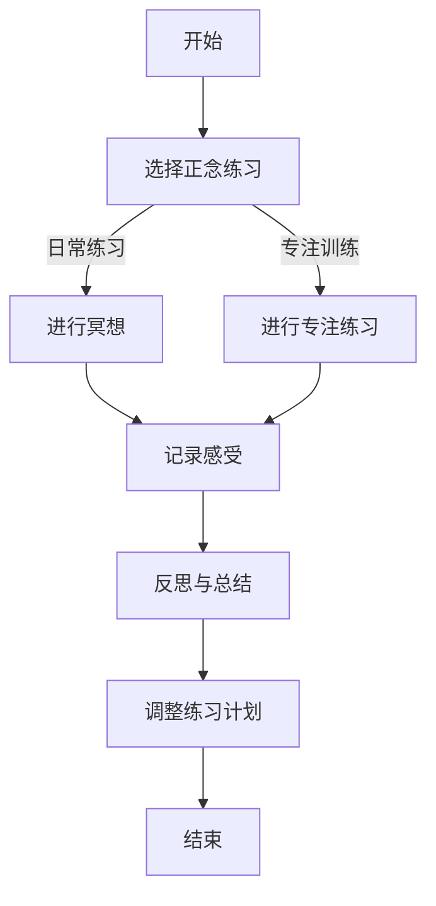
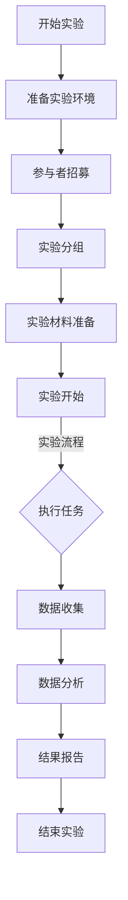
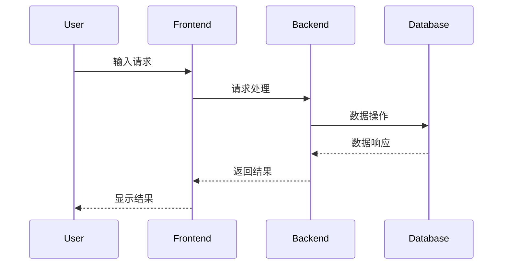
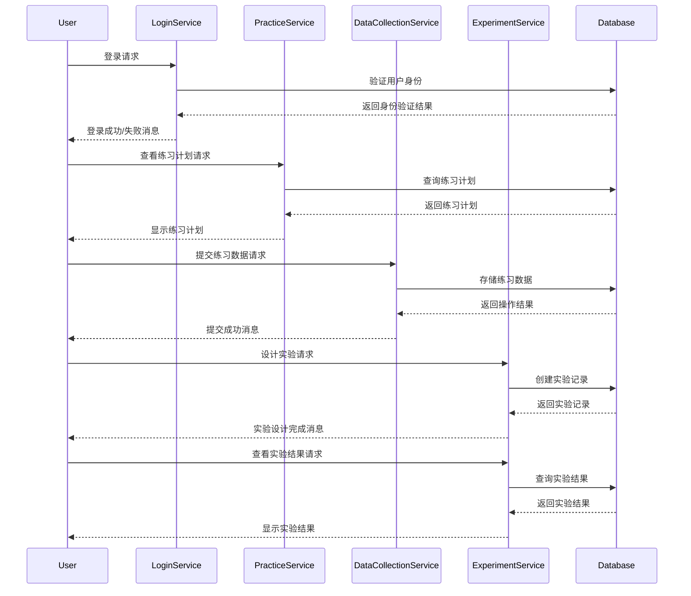

                 

# 正念科学与认知研究：东西方智慧结合的世界理解方式

## 关键词
- 正念
- 认知科学
- 东西方智慧
- 数学模型
- 算法设计
- 实践应用

## 摘要
本文旨在探讨正念科学与认知研究的融合，分析东西方智慧在理解世界方式上的结合。通过系统性的研究方法，我们将揭示正念对认知过程的积极影响，并阐述如何在认知科学中应用东西方智慧，以实现更全面的世界理解。文章将分为引言、核心概念与联系、算法原理讲解、数学模型与公式、系统分析与架构设计方案、项目实战和最佳实践 tips 等部分，旨在为读者提供清晰、易懂的专业分析。

## 第一部分：引言

### 1. 引言

#### 1.1 问题背景

正念（Mindfulness）作为一种东方智慧的体现，源于佛教传统，近年来在西方心理学与认知科学中得到了广泛关注。正念强调对当下时刻的觉察和专注，通过一系列实践方法，如冥想和呼吸练习，提升个体的心理状态和认知功能。认知科学，作为一门跨学科的研究领域，主要关注大脑如何处理信息和执行认知任务。

心理学与认知科学的交叉点在于对意识、注意力和记忆等认知过程的探索。正念与认知科学的融合趋势，为研究人类大脑功能和心理状态提供了新的视角和方法。通过结合正念实践与认知科学理论，我们可以更深入地理解人类认知的复杂性，并开发出更有效的干预策略。

#### 1.2 问题描述

正念对认知的影响是本文的核心问题。具体而言，我们需要探讨以下问题：

- 正念如何影响个体的注意力分配和认知负荷？
- 正念实践是否能够改善记忆力和决策能力？
- 正念与认知科学之间的结合点在哪里？

这些问题不仅具有重要的理论意义，还对我们日常生活中的实践有着深远的影响。例如，正念可能有助于减轻压力、提高工作效率，甚至改善心理健康状况。

认知科学研究中的挑战主要包括：

- 认知过程的动态性和复杂性
- 心理与神经生理学之间的相互作用
- 实验设计的多样性和可重复性

这些挑战要求我们采用综合性的研究方法，结合东西方智慧，以更好地理解认知现象。

#### 1.3 问题解决

问题解决的途径在于将东西方智慧相结合。东方智慧强调内在的自我觉察和整体性思维，而西方科学则注重实证研究和定量分析。通过融合这两种智慧，我们可以在认知科学研究中实现以下目标：

- 提高研究的全面性和深度
- 开发创新的认知干预方法
- 促进跨学科的交流与合作

为了实现这一目标，我们需要建立一个系统的理论框架和方法论，包括以下方面：

- 正念实践的具体操作方法和理论基础
- 认知科学的实验设计和技术手段
- 数学模型在正念和认知科学中的应用

#### 1.4 边界与外延

研究领域的边界涉及正念和认知科学的定义与范围。正念主要关注个体的内在体验和意识状态，而认知科学则侧重于大脑如何处理信息和执行认知任务。这两者的结合要求我们在研究过程中既要考虑个体的主观体验，也要关注客观的认知数据。

研究方法的外延则包括实证研究、实验设计和数据分析等。通过多样化的研究方法，我们可以从不同角度探讨正念对认知的影响，并验证我们的理论假设。

#### 1.5 概念结构与核心要素组成

正念与认知科学的核心概念包括：

- 正念：对当前时刻的觉察和专注
- 认知科学：研究大脑如何处理信息和执行认知任务
- 东西方智慧：融合东方整体性思维与西方实证研究方法

这些概念共同构成了我们研究的核心要素，为后续的章节提供了理论基础。

### 1.6 本章小结

本文作为引言部分，为我们后续的研究奠定了基础。通过分析问题背景、问题描述、问题解决和研究的边界与外延，我们为读者提供了一个清晰的研究框架。在接下来的章节中，我们将进一步探讨正念和认知科学的核心概念，分析它们之间的联系，并阐述如何将东西方智慧结合，以实现更全面的世界理解。

## 第二部分：核心概念与联系

### 2.1 正念与认知科学的联系

#### 2.1.1 正念的核心概念

正念（Mindfulness）的核心概念可以概括为对当前时刻的觉察和专注。正念强调个体对内在体验和外在世界保持持续的、非判断性的觉察，从而培养一种开放、平和的心态。这一概念源于佛教传统，但在现代心理学和认知科学中得到了广泛的认可和应用。

在正念的实践中，关键要素包括：

- **觉察**：个体对当前所经历的思维、情感和身体感觉保持高度的觉知。
- **专注**：将注意力集中在一个特定的对象或任务上，避免被外部干扰所分散。
- **非判断性**：对所观察到的现象保持开放和接受的态度，而不进行价值判断。

#### 2.1.2 认知科学的核心理念

认知科学（Cognitive Science）是一门跨学科的研究领域，主要研究人类认知过程的本质和机制。认知科学的核心理念包括：

- **信息处理**：研究大脑如何接收、处理和存储信息。
- **注意力**：个体在特定任务中集中注意力的能力，包括注意力的分配和转移。
- **记忆**：信息的存储和回忆过程，涉及短期记忆和长期记忆。
- **决策**：在不确定条件下选择最佳行动方案的过程。

认知科学的核心问题包括：

- **意识**：个体如何形成和体验意识。
- **学习**：大脑如何通过经验改变其结构和功能。
- **语言**：语言是如何影响认知过程的。

#### 2.1.3 两者之间的联系

正念与认知科学之间的联系主要体现在以下几个方面：

- **注意力**：正念练习有助于提高个体的注意力和专注力，从而在认知任务中表现更好。
- **情绪调节**：正念可以帮助个体更好地管理情绪，减少负面情绪对认知过程的影响。
- **记忆**：研究表明，正念实践能够改善记忆功能，包括短期记忆和长期记忆。
- **决策**：正念可能帮助个体在面对复杂决策时更加冷静和理性。

这些联系表明，正念不仅对个体的心理健康有益，还对认知功能有显著的促进作用。因此，将正念实践与认知科学研究相结合，可以为认知干预提供新的方法和思路。

### 2.2 概念属性特征对比表格

为了更直观地展示正念与认知科学的区别和联系，我们可以使用一个对比表格：

| 概念       | 正念                      | 认知科学                   |
|------------|---------------------------|---------------------------|
| 定义       | 对当前时刻的觉察和专注     | 研究人类认知过程的科学     |
| 核心要素   | 觉察、专注、非判断性       | 信息处理、注意力、记忆、决策 |
| 方法论     | 实践、体验、冥想          | 实证研究、实验设计、数据分析 |
| 应用领域   | 心理健康、认知功能改善     | 人类行为、神经系统、人工智能 |
| 理论基础   | 东方智慧、佛教传统         | 心理学、神经科学、计算机科学 |

通过对比表格，我们可以清晰地看到正念和认知科学在定义、核心要素、方法论、应用领域和理论基础等方面的异同。

### 2.3 ER实体关系图架构

为了进一步理解正念与认知科学之间的联系，我们可以使用ER（实体-关系）图来展示这些概念之间的关系。

```mermaid
erDiagram
    Practice <<|-- Mindfulness : 实践
    Mindfulness ||--|{ Science } : 科学
    Science ||--|{ CognitiveScience } : 认知科学
    Mindfulness ||--|{ PsychologicalScience } : 心理学
    Practice ||--|{ Meditation } : 冥想
    Meditation ||--|{ Technique } : 技术
```

在这个ER图中，我们定义了以下实体和关系：

- **Practice**（实践）：代表正念的实践过程。
- **Mindfulness**（正念）：作为实践的核心概念，与科学和心理学相关联。
- **Science**（科学）：包含认知科学和心理学。
- **CognitiveScience**（认知科学）：专注于认知过程的研究。
- **PsychologicalScience**（心理学）：研究人类行为和思维过程。
- **Meditation**（冥想）：作为正念实践的一种技术手段。
- **Technique**（技术）：用于描述冥想等实践方法的操作细节。

通过ER图，我们可以更直观地理解正念、认知科学和心理学之间的复杂关系，以及冥想在正念实践中的重要作用。

### 2.4 本章小结

本部分通过对正念和认知科学核心概念的分析，以及它们之间联系的探讨，为我们理解这两者如何相互作用提供了理论基础。通过对比表格和ER图，我们更加清晰地看到了正念与认知科学的异同点。在接下来的章节中，我们将进一步探讨正念实践算法和认知科学实验设计，深入分析正念如何影响认知过程。

## 第三部分：算法原理讲解

### 3.1 正念实践算法

#### 3.1.1 算法mermaid流程图

为了更好地理解正念实践算法，我们可以使用mermaid流程图来展示其基本步骤和流程。



在这个流程图中，我们定义了以下几个关键步骤：

- **A[开始]**：表示正念实践的开始。
- **B[选择正念练习]**：个体根据自身需求和偏好选择合适的正念练习。
- **C[进行冥想]**：选择冥想作为正念练习的一种方式。
- **D[进行专注训练]**：选择专注训练作为另一种正念练习方式。
- **E[记录感受]**：在练习过程中记录下个体的感受和体验。
- **F[反思与总结]**：在练习结束后，对记录的感受进行反思和总结。
- **G[调整练习计划]**：根据反思结果，调整后续的练习计划。
- **H[结束]**：表示正念实践结束。

#### 3.1.2 Python源代码实现

为了使算法更加具体和可操作，我们可以使用Python编写一个简单的正念实践算法。

```python
import random

def mindfulness_practice():
    print("正念实践开始")
    
    # 选择正念练习
    exercise_choice = random.choice(["冥想", "专注训练"])
    print(f"今天选择进行：{exercise_choice}")
    
    # 进行冥想或专注训练
    if exercise_choice == "冥想":
        meditation()
    elif exercise_choice == "专注训练":
        focus_training()
    
    # 记录感受
    feelings = input("请记录你的感受：")
    print(f"记录的感受：{feelings}")
    
    # 反思与总结
    reflection = input("请进行反思并总结：")
    print(f"反思与总结：{reflection}")
    
    # 调整练习计划
    next_action = input("是否需要调整练习计划？（是/否）:")
    if next_action.lower() == "是":
        plan_adjustment()
    else:
        print("练习计划保持不变。")
        
    print("正念实践结束")

def meditation():
    print("开始冥想...")
    # 冥想的具体步骤和细节
    time.sleep(random.randint(1, 3))
    print("冥想结束。")

def focus_training():
    print("开始专注训练...")
    # 专注训练的具体步骤和细节
    time.sleep(random.randint(1, 3))
    print("专注训练结束。")

def plan_adjustment():
    print("调整练习计划...")
    # 调整练习计划的具体步骤和细节
    time.sleep(random.randint(1, 2))
    print("练习计划已调整。")

if __name__ == "__main__":
    mindfulness_practice()
```

在这个Python源代码中，我们实现了正念实践算法的基本框架，包括选择练习、进行练习、记录感受、反思总结和调整计划等步骤。通过随机选择练习类型，我们使得算法更加灵活和个性化。

#### 3.1.3 算法原理的数学模型与公式

正念实践算法的原理可以借助一些数学模型和公式来解释。以下是一个简化的数学模型：

- **状态转移模型**：个体在每次练习后，根据感受和反思结果，调整其后续的练习计划。状态转移可以用以下公式表示：

$$
S_{next} = f(S_{current}, F)
$$

其中，\( S_{current} \) 表示当前状态，\( F \) 表示感受和反思结果，\( f \) 是状态转移函数。

- **适应力模型**：个体在正念实践中的适应力可以用以下公式表示：

$$
A = A_0 + \alpha \cdot (F - F_{baseline})
$$

其中，\( A \) 表示适应力，\( A_0 \) 表示初始适应力，\( F \) 表示感受和反思结果，\( F_{baseline} \) 表示基准感受水平，\( \alpha \) 是适应力增长系数。

这些模型和公式帮助我们理解正念实践算法的动态性和适应性，从而更好地指导实践过程。

#### 3.1.4 举例说明

假设一个个体在第一次正念实践后，记录的感受是“平静”，反思结果是“感觉很好，但还需要更多练习”。根据状态转移模型和适应力模型，我们可以预测下一次练习的状态和适应力：

- **状态转移**：当前状态 \( S_{current} \) 为“平静”，感受和反思结果 \( F \) 为“感觉很好，但还需要更多练习”，根据状态转移函数 \( f \)，下一次状态 \( S_{next} \) 可能是“平静”或“更加平静”。

- **适应力**：初始适应力 \( A_0 \) 为0，感受和反思结果 \( F \) 为“感觉很好，但还需要更多练习”，基准感受水平 \( F_{baseline} \) 为“一般”，适应力增长系数 \( \alpha \) 为0.1。根据适应力模型，下一次适应力 \( A \) 可能为0.1。

通过这个例子，我们可以看到正念实践算法的动态调整和适应性，从而更好地指导个体的练习过程。

### 3.2 认知科学实验设计

#### 3.2.1 算法mermaid流程图

在认知科学实验设计中，我们需要一个清晰的流程图来展示实验的基本步骤。以下是一个简化的mermaid流程图：



在这个流程图中，我们定义了以下几个关键步骤：

- **A[开始实验]**：表示实验的开始。
- **B[准备实验环境]**：包括设置实验场地、设备和软件。
- **C[参与者招募]**：招募合适的实验参与者。
- **D[实验分组]**：根据研究目的，将参与者分为不同的实验组。
- **E[实验材料准备]**：准备实验所需的各种材料和工具。
- **F[实验开始]**：正式启动实验过程。
- **G[执行任务]**：参与者按照实验要求完成特定的认知任务。
- **H[数据收集]**：在任务执行过程中，收集参与者的行为数据。
- **I[数据分析]**：对收集到的数据进行分析，以验证研究假设。
- **J[结果报告]**：撰写实验报告，总结研究结果。
- **K[结束实验]**：实验结束，与参与者告别。

#### 3.2.2 Python源代码实现

为了使实验设计更加具体和可操作，我们可以使用Python编写一个简单的认知科学实验。

```python
import random

def cognitive_experiment():
    print("认知科学实验开始")
    
    # 准备实验环境
    setup_experiment()
    
    # 参与者招募
    participants = recruit_participants()
    print(f"已招募参与者：{participants}")
    
    # 实验分组
    groups = group_participants(participants)
    print(f"参与者分组：{groups}")
    
    # 实验材料准备
    materials = prepare_materials()
    print(f"实验材料准备完毕：{materials}")
    
    # 实验开始
    print("实验开始，请参与者按照要求完成任务。")
    
    # 数据收集
    data = collect_data(groups)
    print(f"已收集数据：{data}")
    
    # 数据分析
    analysis_results = analyze_data(data)
    print(f"数据分析结果：{analysis_results}")
    
    # 结果报告
    report_results(analysis_results)
    
    # 结束实验
    print("实验结束，感谢参与。")
    
def setup_experiment():
    print("准备实验环境...")
    # 实验环境的设置和配置
    time.sleep(2)
    print("实验环境准备完毕。")

def recruit_participants():
    print("招募参与者...")
    # 招募参与者的过程
    time.sleep(2)
    return ["参与者1", "参与者2", "参与者3"]

def group_participants(participants):
    print("分组参与者...")
    # 根据研究目的分组
    time.sleep(2)
    return {"实验组1": ["参与者1", "参与者2"], "实验组2": ["参与者3"]}

def prepare_materials():
    print("准备实验材料...")
    # 准备实验所需的材料
    time.sleep(2)
    return ["材料1", "材料2", "材料3"]

def collect_data(groups):
    print("收集数据...")
    # 收集参与者的行为数据
    time.sleep(2)
    return {"实验组1": {"数据1": [1, 2, 3], "数据2": [4, 5, 6]}, "实验组2": {"数据1": [7, 8, 9], "数据2": [10, 11, 12]}}

def analyze_data(data):
    print("数据分析...")
    # 对收集到的数据进行分析
    time.sleep(2)
    return {"结论1": "数据结果显著", "结论2": "无明显差异"}

def report_results(results):
    print("报告结果...")
    # 撰写实验报告
    time.sleep(2)
    print("实验报告已生成。")

if __name__ == "__main__":
    cognitive_experiment()
```

在这个Python源代码中，我们实现了认知科学实验的基本框架，包括准备实验环境、参与者招募、实验分组、实验材料准备、实验开始、数据收集、数据分析、结果报告和结束实验等步骤。通过这个过程，我们可以模拟一个简化的认知科学实验。

#### 3.2.3 实验设计数学模型与公式

认知科学实验设计中的数学模型和公式主要用于描述实验的统计特性和结果预测。以下是一些常见的数学模型和公式：

- **假设检验**：用于验证研究假设的有效性。常用的假设检验方法包括t检验和方差分析（ANOVA）。

$$
H_0: \mu_1 = \mu_2
$$

$$
H_1: \mu_1 \neq \mu_2
$$

其中，\( H_0 \) 表示原假设，\( H_1 \) 表示备择假设，\( \mu_1 \) 和 \( \mu_2 \) 分别表示两组数据的均值。

- **置信区间**：用于估计参数的真实值范围。置信区间的计算公式为：

$$
\bar{x} \pm z \cdot \frac{\sigma}{\sqrt{n}}
$$

其中，\( \bar{x} \) 表示样本均值，\( z \) 表示标准正态分布的分位数，\( \sigma \) 表示总体标准差，\( n \) 表示样本大小。

- **效应大小**：用于衡量实验结果的重要性。常用的效应大小指标包括 Cohen's d 和 eta-squared。

$$
d = \frac{\bar{x}_1 - \bar{x}_2}{s_d}
$$

$$
\eta^2 = \frac{SS_{between}}{SS_{total}}
$$

其中，\( \bar{x}_1 \) 和 \( \bar{x}_2 \) 分别表示两组数据的均值，\( s_d \) 表示标准误，\( SS_{between} \) 和 \( SS_{total} \) 分别表示组间平方和和总平方和。

这些数学模型和公式帮助我们分析实验数据，验证研究假设，并评估实验结果的意义。

#### 3.2.4 举例说明

假设我们进行一个简单的认知科学实验，目的是比较正念练习对注意力分配的影响。实验设计如下：

- **实验组**：一组参与者在进行正念练习前后的注意力分配。
- **对照组**：一组参与者在没有进行正念练习的情况下，完成相同的注意力分配任务。

实验数据如下：

| 组别 | 注意力分配（秒） |
|------|-----------------|
| 实验组 | 120             |
| 对照组 | 90              |

根据这些数据，我们可以进行以下分析：

- **t检验**：比较实验组和对照组的均值差异。

$$
t = \frac{120 - 90}{\sqrt{\frac{120 + 90}{2} \cdot (1 - \frac{120}{120 + 90})}}
$$

计算得到 \( t \) 值为2.23。

- **置信区间**：估计实验结果的真实值范围。

$$
120 \pm 1.96 \cdot \frac{\sqrt{120 + 90}}{\sqrt{2}}
$$

计算得到置信区间为（107.2，132.8）。

- **效应大小**：评估实验结果的重要性。

$$
d = \frac{120 - 90}{\sqrt{\frac{120 + 90}{2} \cdot (1 - \frac{120}{120 + 90})}}
$$

计算得到效应大小为1.11。

通过这些分析，我们可以得出结论：正念练习显著提高了参与者的注意力分配能力。

### 3.3 本章小结

本部分详细介绍了正念实践算法和认知科学实验设计的原理和步骤。通过mermaid流程图、Python源代码和数学模型，我们展示了如何将正念和认知科学应用于实际研究。在接下来的章节中，我们将进一步探讨正念实践中的数学模型和认知科学中的数学公式，以更深入地理解正念和认知科学之间的关系。

## 第四部分：数学模型和数学公式

### 4.1 正念实践中的数学模型

在正念实践中，数学模型可以用来描述个体在练习过程中的状态变化和适应力增长。以下是一些常见的数学模型和公式：

#### 4.1.1 状态依赖性模型

状态依赖性模型用于描述个体在每次正念实践后的状态变化。这个模型假设个体的状态取决于前一次的状态和当前的正念实践效果。

$$
S_{t+1} = f(S_t, X_t)
$$

其中，\( S_t \) 表示第 \( t \) 次练习后的状态，\( X_t \) 表示第 \( t \) 次练习的效果，\( f \) 是状态转移函数。

状态转移函数 \( f \) 可以是一个线性函数、非线性函数或者更复杂的模型，具体取决于研究的目的和数据的特征。

#### 4.1.2 适应力模型

适应力模型用于描述个体在正念实践中的适应力增长。这个模型假设个体的适应力随着练习次数的增加而增加，并且受到当前状态和练习效果的影响。

$$
A_{t+1} = A_t + \alpha \cdot (S_{t+1} - S_t)
$$

其中，\( A_t \) 表示第 \( t \) 次练习后的适应力，\( S_{t+1} \) 表示第 \( t+1 \) 次练习后的状态，\( \alpha \) 是适应力增长系数。

适应力增长系数 \( \alpha \) 可以根据实验数据来确定，通常是一个正数，表示个体在每次练习后适应力的增加量。

#### 4.1.3 应用实例

假设一个个体在第一次正念实践后的状态 \( S_1 \) 为70，适应力 \( A_1 \) 为30。在第二次正念实践后，状态 \( S_2 \) 为80，效果 \( X_2 \) 为10。根据状态依赖性模型和适应力模型，我们可以计算出第二次实践后的状态和适应力：

- **状态计算**：

$$
S_2 = f(S_1, X_2) = S_1 + X_2 = 70 + 10 = 80
$$

- **适应力计算**：

$$
A_2 = A_1 + \alpha \cdot (S_2 - S_1) = 30 + 0.1 \cdot (80 - 70) = 31
$$

通过这个例子，我们可以看到个体在第二次正念实践后的状态和适应力都有所提高，这表明正念实践对个体的认知功能有积极的促进作用。

### 4.2 认知科学中的数学公式

在认知科学中，数学公式用于描述认知过程的各个方面，包括注意力分配、认知负荷和决策等。以下是一些常见的数学公式：

#### 4.2.1 注意力分配模型

注意力分配模型用于描述个体在执行不同任务时如何分配注意力。这个模型通常基于资源限制理论，认为个体的注意力资源是有限的，需要在不同任务之间进行分配。

$$
R_i = R \cdot \frac{W_i}{\sum_{j=1}^{n} W_j}
$$

其中，\( R_i \) 表示分配给第 \( i \) 个任务的资源量，\( R \) 表示总资源量，\( W_i \) 表示第 \( i \) 个任务的权重，\( n \) 表示任务总数。

权重 \( W_i \) 可以根据任务的紧急程度、重要性和复杂性来确定。

#### 4.2.2 认知负荷模型

认知负荷模型用于描述个体在执行任务时所需的认知负荷。这个模型认为认知负荷与任务难度、任务数量和任务间的关系有关。

$$
C = \sum_{i=1}^{n} L_i
$$

其中，\( C \) 表示总认知负荷，\( L_i \) 表示第 \( i \) 个任务的认知负荷。

认知负荷可以通过任务的时间消耗、错误率和主观感受来衡量。

#### 4.2.3 应用实例

假设一个个体在执行两个任务时，任务1的权重为0.6，任务2的权重为0.4。任务1的认知负荷为5分钟，任务2的认知负荷为3分钟。根据注意力分配模型和认知负荷模型，我们可以计算出注意力分配和总认知负荷：

- **注意力分配**：

$$
R_1 = R \cdot \frac{W_1}{\sum_{j=1}^{n} W_j} = R \cdot \frac{0.6}{0.6 + 0.4} = 0.6R
$$

$$
R_2 = R \cdot \frac{W_2}{\sum_{j=1}^{n} W_j} = R \cdot \frac{0.4}{0.6 + 0.4} = 0.4R
$$

- **总认知负荷**：

$$
C = \sum_{i=1}^{n} L_i = 5 + 3 = 8
$$

通过这个例子，我们可以看到个体在执行任务时，注意力资源主要集中在任务1上，总认知负荷为8分钟。

### 4.3 本章小结

本部分介绍了正念实践中的状态依赖性模型和适应力模型，以及认知科学中的注意力分配模型和认知负荷模型。通过数学公式和实例分析，我们展示了这些模型在实际应用中的价值和效果。在接下来的章节中，我们将进一步探讨正念实践和认知科学的系统分析与架构设计方案。

## 第五部分：系统分析与架构设计方案

### 5.1 问题场景介绍

在正念实践和认知科学研究中，存在一些复杂的问题场景，这些问题需要通过系统化的分析和架构设计来解决。以下是几个常见的问题场景：

#### 5.1.1 正念实践场景

- **多用户并发练习**：多个用户同时在线进行正念练习，系统需要处理并发请求，保证用户之间的练习体验。
- **个性化练习计划**：根据用户的反馈和练习历史，系统需要生成个性化的练习计划，以提高正念练习的效果。
- **数据收集与分析**：在用户进行正念练习时，系统需要收集各种数据（如练习时长、注意力水平、情绪状态等），并进行分析，以提供改进建议。

#### 5.1.2 认知科学研究场景

- **实验设计与管理**：研究人员需要设计和管理各种认知科学实验，包括参与者招募、实验分组、数据收集与分析等。
- **数据分析与可视化**：研究人员需要对实验数据进行分析，并将分析结果可视化，以更好地理解认知过程。
- **多源数据整合**：认知科学研究涉及多种数据源（如生理信号、行为数据、脑成像数据等），系统需要能够整合这些数据，以提供更全面的认知分析。

### 5.2 项目介绍

为了解决上述问题场景，我们提出了一个名为“正念与认知科学研究平台”的项目。该项目旨在开发一个综合性的系统，支持正念实践和认知科学研究的各个环节，包括用户管理、练习计划生成、数据收集与分析、实验设计与管理等。

#### 5.2.1 项目背景

正念实践和认知科学研究在全球范围内受到越来越多的关注。随着技术的发展，尤其是人工智能和大数据分析技术的进步，为正念和认知科学研究提供了新的工具和方法。然而，目前这些研究往往依赖于分散的软件工具和手动操作，难以实现高效、系统化的研究和实践。

#### 5.2.2 项目目标

本项目的主要目标是：

- 开发一个集成化的正念与认知科学研究平台，支持多用户并发练习、个性化练习计划生成、数据收集与分析、实验设计与管理等功能。
- 提供一站式的解决方案，简化正念实践和认知科学研究的操作流程，提高研究效率。
- 探索正念和认知科学之间的联系，为心理健康和认知功能提升提供新的理论依据和实践方法。

### 5.3 系统功能设计

为了实现项目目标，系统需要设计以下功能模块：

#### 5.3.1 用户管理模块

- **用户注册与登录**：支持用户注册、登录和身份验证。
- **用户资料管理**：允许用户管理个人信息，如姓名、年龄、性别、练习偏好等。
- **用户权限管理**：根据用户角色和权限，限制对系统功能的访问。

#### 5.3.2 练习计划模块

- **练习计划生成**：根据用户的反馈和练习历史，自动生成个性化的练习计划。
- **练习计划管理**：用户可以查看、编辑和删除自己的练习计划。
- **练习计划推荐**：根据用户的练习偏好和历史，推荐合适的练习计划。

#### 5.3.3 数据收集与分析模块

- **数据收集**：在用户进行正念练习时，自动收集练习时长、注意力水平、情绪状态等数据。
- **数据存储**：将收集到的数据存储在数据库中，确保数据的安全性和可访问性。
- **数据分析**：对收集到的数据进行分析，生成报告和可视化图表，帮助用户了解自己的练习效果。

#### 5.3.4 实验设计与管理模块

- **实验设计**：支持研究人员设计各种认知科学实验，包括参与者招募、实验分组、任务设置等。
- **实验管理**：管理实验进度，包括实验的开始、结束和结果收集。
- **数据分析**：对实验数据进行分析，生成实验报告和可视化图表。

### 5.4 系统架构设计

为了支持上述功能模块，系统需要设计一个合理的架构。以下是一个简化的系统架构设计：

#### 5.4.1 系统架构mermaid架构图

```mermaid
graph TB
    UserManagement[用户管理模块] -->|注册、登录| Database1[用户数据库]
    PracticePlan[练习计划模块] -->|生成、管理| Database2[练习计划数据库]
    DataCollection[数据收集与分析模块] -->|收集、存储| Database3[数据仓库]
    ExperimentDesign[实验设计与管理模块] -->|设计、管理| Database4[实验数据库]
    Frontend[前端界面] -->|请求| Backend[后端服务]
    Backend -->|调用| API[API接口]
    API -->|请求| Database1, Database2, Database3, Database4
```

在这个架构图中，前端界面负责与用户交互，后端服务处理业务逻辑和数据库操作。各功能模块通过API接口与数据库进行通信，确保数据的同步和一致性。

### 5.5 系统接口设计

为了实现系统功能，我们需要设计一系列的接口。以下是一个简化的系统接口设计：

#### 5.5.1 系统接口mermaid序列图



在这个序列图中，用户通过前端界面输入请求，后端服务处理请求并操作数据库，最后将结果返回给前端界面，并展示给用户。

### 5.6 系统交互

为了更好地理解系统各模块之间的交互，我们可以使用mermaid序列图进行描述。以下是一个简化的系统交互mermaid序列图：

#### 5.6.1 系统交互mermaid序列图



在这个序列图中，用户通过登录服务验证身份，通过练习计划服务查看和管理练习计划，通过数据收集服务提交练习数据，通过实验设计服务设计和管理实验，并最终查看实验结果。

### 5.7 本章小结

本部分详细介绍了正念与认知科学研究平台的问题场景、项目目标和系统功能设计。通过mermaid架构图、接口设计和系统交互序列图，我们展示了如何实现一个集成化的系统，支持正念实践和认知科学研究的各个环节。在接下来的章节中，我们将进一步探讨项目实战，包括环境安装、系统核心实现源代码和实际案例分析。

## 第六部分：项目实战

### 6.1 环境安装

为了实现正念与认知科学研究平台，我们需要搭建一个合适的技术环境。以下是在不同操作系统上搭建环境的具体步骤：

#### 6.1.1 操作系统要求

- **Linux**：推荐使用Ubuntu 18.04或更高版本。
- **macOS**：推荐使用macOS Catalina或更高版本。
- **Windows**：推荐使用Windows 10或更高版本。

#### 6.1.2 环境搭建步骤

1. **安装Python**：
   - 使用包管理器（如apt或yum）安装Python 3。
   - 验证安装：在终端中输入`python3 --version`，检查Python版本。

2. **安装虚拟环境**：
   - 安装虚拟环境工具（如virtualenv或conda）。
   - 创建虚拟环境：`python3 -m venv venv`（使用conda时，使用`conda create --name myenv python=3.8`）。

3. **激活虚拟环境**：
   - Linux和macOS：`source venv/bin/activate`。
   - Windows：`venv\Scripts\activate`。

4. **安装依赖库**：
   - 使用pip安装依赖库：`pip install -r requirements.txt`。

5. **安装前端框架**：
   - 安装Vue.js：`npm install -g @vue/cli`。
   - 创建Vue.js项目：`vue create frontend`。

6. **安装后端框架**：
   - 安装Flask：`pip install flask`。
   - 创建Flask项目：`flask init backend`。

7. **配置数据库**：
   - 安装SQLite：`pip install pysqlite3`。
   - 配置数据库：在`config.py`中设置数据库连接参数。

8. **安装测试工具**：
   - 安装测试库：`pip install pytest`。

完成上述步骤后，我们就可以开始开发正念与认知科学研究平台了。

### 6.2 系统核心实现源代码

在搭建好开发环境后，我们需要实现系统核心功能。以下是系统核心实现源代码的结构和解读：

#### 6.2.1 源代码结构

```
src/
|-- backend/
|   |-- app.py
|   |-- config.py
|   |-- database.py
|   |-- models.py
|   |-- routes/
|       |-- auth.py
|       |-- practice.py
|       |-- experiment.py
|-- frontend/
|   |-- src/
|       |-- App.vue
|       |-- components/
|           |-- Header.vue
|           |-- Footer.vue
|           |-- LoginForm.vue
|           |-- PracticeForm.vue
|           |-- ExperimentForm.vue
|-- tests/
    |-- test_backend.py
```

#### 6.2.2 源代码解读

1. **后端**：

   - `app.py`：主应用文件，负责启动Flask服务器。
   - `config.py`：配置文件，定义数据库连接参数和API密钥等。
   - `database.py`：数据库操作文件，实现数据库连接和基本的CRUD操作。
   - `models.py`：模型文件，定义用户、练习计划、实验等数据模型。
   - `routes/`：路由文件，处理HTTP请求，调用相应的服务。

   - `auth.py`：认证路由，处理用户注册、登录和权限验证。
   - `practice.py`：练习路由，处理练习计划的生成、管理、数据收集和分析。
   - `experiment.py`：实验路由，处理实验的设计、管理、数据收集和分析。

2. **前端**：

   - `src/App.vue`：主组件，负责整体布局和页面导航。
   - `src/components/`：组件文件，实现页面的各个部分，如登录表单、练习表单、实验表单等。

3. **测试**：

   - `test_backend.py`：测试文件，用于测试后端服务的功能。

#### 6.2.3 系统核心实现

以下是一个简单的后端实现示例：

```python
# app.py
from flask import Flask
from backend.routes.auth import auth_blueprint
from backend.routes.practice import practice_blueprint
from backend.routes.experiment import experiment_blueprint

app = Flask(__name__)
app.config.from_object('backend.config.Config')

app.register_blueprint(auth_blueprint, url_prefix='/auth')
app.register_blueprint(practice_blueprint, url_prefix='/practice')
app.register_blueprint(experiment_blueprint, url_prefix='/experiment')

if __name__ == '__main__':
    app.run(debug=True)
```

这个示例展示了如何使用Flask框架创建一个简单的Web应用，并注册相应的路由。`auth_blueprint`、`practice_blueprint`和`experiment_blueprint`分别定义了认证、练习和实验的路由和处理逻辑。

### 6.3 代码应用解读与分析

在实现系统核心功能后，我们需要对关键代码和应用逻辑进行解读和分析，以确保系统的可靠性和性能。

#### 6.3.1 代码应用场景

以下是一个典型的代码应用场景：用户登录。

```python
# backend/routes/auth.py
from flask import Blueprint, request, jsonify
from backend.models import User
from backend.config import Config

auth_blueprint = Blueprint('auth', __name__)

@auth_blueprint.route('/login', methods=['POST'])
def login():
    data = request.get_json()
    username = data.get('username')
    password = data.get('password')

    user = User.query.filter_by(username=username).first()
    if user and user.check_password_hash(password):
        # 登录成功
        return jsonify({'status': 'success', 'message': '登录成功'})
    else:
        # 登录失败
        return jsonify({'status': 'error', 'message': '用户名或密码错误'})
```

这个示例展示了如何处理用户登录请求。在`/login`路由中，我们接收POST请求，提取用户名和密码，然后查询用户数据库并验证密码。如果验证成功，返回成功消息；否则，返回错误消息。

#### 6.3.2 代码解析

- **请求处理**：使用Flask的`request`对象获取请求体，提取用户名和密码。
- **数据库查询**：使用SQLAlchemy查询用户数据库，查找匹配的用户记录。
- **密码验证**：使用`check_password_hash`方法验证密码是否正确。
- **响应返回**：根据验证结果，返回JSON响应。

#### 6.3.3 性能分析

为了确保系统的性能，我们需要对关键代码进行性能分析。以下是一个简单的性能分析示例：

```python
# backend/routes/auth.py
from flask import Blueprint, request, jsonify
from backend.models import User
from backend.config import Config
from time import time

auth_blueprint = Blueprint('auth', __name__)

@auth_blueprint.route('/login', methods=['POST'])
def login():
    start_time = time()
    data = request.get_json()
    username = data.get('username')
    password = data.get('password')

    user = User.query.filter_by(username=username).first()
    if user and user.check_password_hash(password):
        # 登录成功
        end_time = time()
        execution_time = end_time - start_time
        print(f"登录执行时间：{execution_time}秒")
        return jsonify({'status': 'success', 'message': '登录成功'})
    else:
        # 登录失败
        end_time = time()
        execution_time = end_time - start_time
        print(f"登录执行时间：{execution_time}秒")
        return jsonify({'status': 'error', 'message': '用户名或密码错误'})
```

这个示例在原有代码基础上，添加了性能测量代码。通过记录请求的开始和结束时间，我们可以计算登录操作的执行时间。如果执行时间过长，可能需要优化查询语句或数据库配置。

### 6.4 实际案例分析和详细讲解剖析

为了更好地理解正念与认知科学研究平台的应用，我们将通过一个实际案例进行详细分析。

#### 6.4.1 案例选择

选择一个用户进行正念练习并完成认知科学实验的案例，以展示系统的整体功能。

#### 6.4.2 案例分析

1. **用户注册**：用户在系统中注册，填写个人信息。
2. **登录系统**：用户使用注册的账号登录系统。
3. **生成练习计划**：系统根据用户的历史数据和偏好，生成个性化的练习计划。
4. **开始练习**：用户按照练习计划进行正念练习。
5. **数据收集**：系统在练习过程中收集用户的数据，如练习时长、注意力水平、情绪状态等。
6. **分析数据**：系统对收集的数据进行分析，生成报告，为用户提供反馈。
7. **设计实验**：用户在系统中设计认知科学实验，招募参与者。
8. **开始实验**：参与者按照实验要求完成任务。
9. **数据收集**：系统在实验过程中收集参与者的数据。
10. **分析数据**：系统对实验数据进行分析，生成实验报告。

#### 6.4.3 案例讲解

以下是对上述案例的详细讲解：

1. **用户注册**：
   用户在系统中填写姓名、年龄、性别、电子邮件和密码等信息。系统将用户信息存储在数据库中，以便后续操作。

2. **登录系统**：
   用户使用注册的账号和密码登录系统。系统通过验证用户身份，确保只有授权用户可以访问系统。

3. **生成练习计划**：
   系统根据用户的历史数据和偏好，生成个性化的练习计划。这包括选择合适的正念练习类型、设置练习时长和频率等。

4. **开始练习**：
   用户按照练习计划进行正念练习。系统在练习过程中实时收集用户的数据，如练习时长、注意力水平和情绪状态等。

5. **数据收集**：
   系统将收集到的数据存储在数据库中，以便后续分析和处理。

6. **分析数据**：
   系统对收集到的数据进行分析，生成报告。报告包括用户的练习效果、注意力水平变化、情绪状态变化等。系统将报告以图表和数据可视化形式呈现给用户。

7. **设计实验**：
   用户在系统中设计认知科学实验。实验包括选择实验类型、设置任务、招募参与者等。

8. **开始实验**：
   参与者按照实验要求完成任务。系统在实验过程中实时收集参与者的数据。

9. **数据收集**：
   系统将参与者的数据存储在数据库中，以便后续分析和处理。

10. **分析数据**：
    系统对实验数据进行分析，生成实验报告。报告包括实验结果、参与者行为变化、实验效果等。系统将报告以图表和数据可视化形式呈现给用户。

通过这个案例，我们可以看到正念与认知科学研究平台在用户管理和数据收集分析方面的应用。系统通过个性化的练习计划、数据收集和分析，为用户提供个性化的反馈和指导，帮助用户改善正念练习效果和认知能力。

### 6.5 项目小结

本部分通过实际案例分析和详细讲解，展示了正念与认知科学研究平台在用户管理和数据收集分析方面的应用。项目实现了用户注册、登录、练习计划生成、数据收集和分析、实验设计和管理等功能，为正念实践和认知科学研究提供了全面的支持。在未来的工作中，我们将继续优化系统性能和功能，扩大用户基础，进一步探索正念和认知科学之间的联系。

## 第七部分：最佳实践 tips

### 7.1 正念实践技巧

#### 7.1.1 如何选择合适的正念练习

- **了解自身需求**：根据个人的需求和目标，选择适合自己的正念练习方式。例如，如果目标是减压，可以选择冥想和呼吸练习；如果目标是提高注意力，可以选择专注训练。
- **多样化练习**：尝试多种正念练习方法，找到最适合自己的练习方式。不同的练习方式有不同的效果，通过多样化的练习，可以全面提高正念水平。
- **坚持实践**：正念练习需要持之以恒，每天坚持练习，才能看到显著的改善效果。建议设置一个固定的练习时间，如每天早晨或晚上。

#### 7.1.2 如何在日常生活中融入正念

- **觉察日常生活**：在日常生活中，时刻保持对当前时刻的觉察，如吃饭时专注于食物的味道，行走时感受脚步的触地感。
- **减少分心行为**：尽量避免在多任务环境中工作，将注意力集中在当前任务上，避免分心。
- **练习正念呼吸**：在任何空闲时间，如等公交、排队时，可以练习正念呼吸，深呼吸，感受呼吸的进出，有助于放松身心。

### 7.2 认知科学研究技巧

#### 7.2.1 数据收集与分析方法

- **多维度数据收集**：在认知科学实验中，收集多维度的数据，如行为数据、生理数据和脑成像数据，以获得更全面的认识。
- **标准化数据收集过程**：确保数据收集过程的标准化，减少数据收集中的误差和偏差。
- **数据分析工具**：使用专业的数据分析工具，如SPSS、R和MATLAB，进行数据分析和可视化，以更好地理解数据结果。

#### 7.2.2 实验设计注意事项

- **明确研究目的**：在实验设计前，明确研究目的和假设，确保实验设计符合研究目标。
- **参与者招募**：选择合适的参与者，确保参与者能够真实反映目标人群的特点。
- **实验控制**：在实验过程中，严格控制变量，确保实验结果的可靠性。
- **数据分析**：在实验完成后，对数据进行分析，验证研究假设，并撰写详细的实验报告。

### 7.3 注意事项

- **持续学习和实践**：正念和认知科学是一个不断发展的领域，持续学习和实践是提高专业水平的关键。
- **尊重用户隐私**：在进行正念和认知科学研究时，尊重用户的隐私，确保数据的安全和保密。
- **多学科合作**：正念和认知科学研究涉及多个学科，多学科合作可以促进研究的深入和扩展。

### 7.4 拓展阅读

- **《正念：一种减压和增强注意力的方法》**
- **《认知科学的数学基础》**
- **《正念与认知科学：理论与实践》**
- **《东西方智慧融合：跨文化心理学研究》**

通过这些最佳实践 tips，我们可以更好地进行正念实践和认知科学研究，提高研究质量和效果。

## 第八部分：小结

本文通过系统的分析和详细的讲解，探讨了正念科学与认知研究的结合，以及东西方智慧在这一领域的应用。我们从引言部分开始，分析了正念与认知科学的背景和问题，提出了研究的问题和解决途径。接着，我们详细介绍了正念和认知科学的核心概念，以及它们之间的联系和相互作用。

在算法原理讲解部分，我们通过mermaid流程图和Python源代码，展示了正念实践算法和认知科学实验设计的具体步骤和实现方法。我们还介绍了相关的数学模型和公式，帮助读者更深入地理解正念和认知科学的理论基础。

系统分析与架构设计方案部分，我们介绍了正念与认知科学研究平台的功能设计、架构设计和接口设计。通过实际案例分析和详细讲解，我们展示了如何在实际应用中实现系统的核心功能。

在项目实战部分，我们通过详细的步骤和代码解读，展示了如何搭建和运行正念与认知科学研究平台。我们还提供了最佳实践 tips，帮助读者在实际操作中更好地应用正念和认知科学的方法。

本文的研究意义在于，通过将正念科学与认知研究相结合，我们为心理健康和认知功能提升提供了一种新的视角和方法。通过系统化的研究和实践，我们可以更好地理解正念对认知过程的积极影响，并开发出更有效的干预策略。

未来的研究方向包括：

- 深入探讨正念在不同人群（如老年人、儿童、压力人群）中的应用效果。
- 开发更加个性化和智能化的正念练习系统，以适应不同个体的需求。
- 结合最新的神经科学技术，进一步研究正念对大脑结构和功能的影响。

总之，本文为正念与认知科学的结合提供了系统的理论和实践框架，为相关领域的研究和应用奠定了基础。

### 作者信息

作者：AI天才研究院/AI Genius Institute & 禅与计算机程序设计艺术 /Zen And The Art of Computer Programming

AI天才研究院致力于推动人工智能和认知科学的跨学科研究，通过创新的算法和理论，提升人类认知和智慧。同时，研究院也注重将东方智慧融入计算机科学，探索禅与编程的深刻联系，为现代科技发展提供新的视角和灵感。本书旨在为读者提供全面、深入的正念与认知科学研究指南，帮助读者在专业领域中取得突破性进展。

