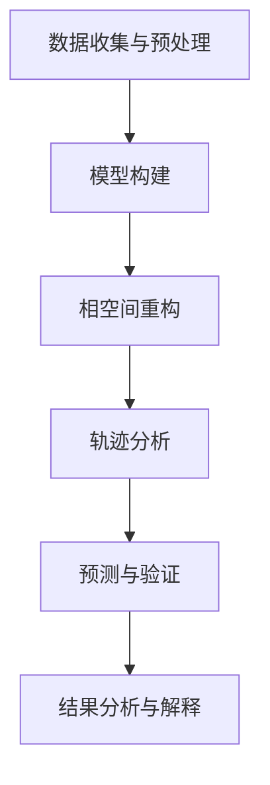
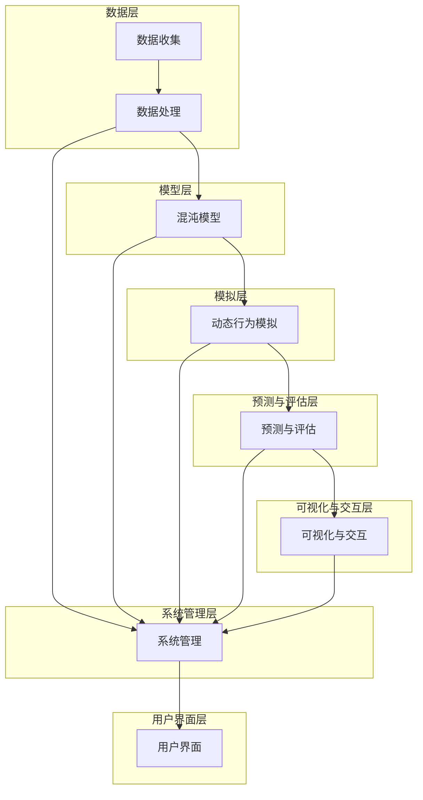
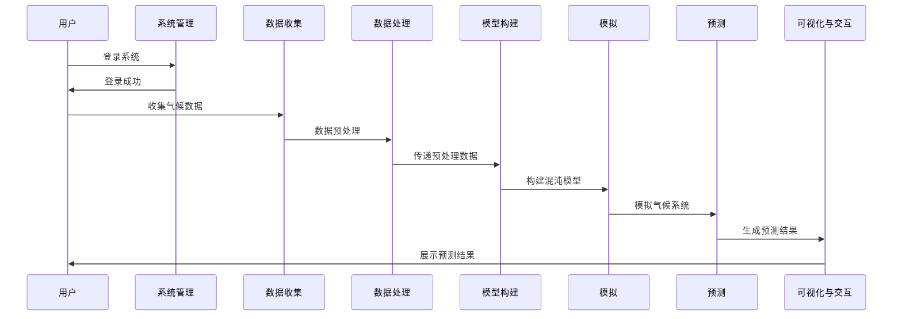

                 

# 《气候变化的混沌模型：地球系统的数学预测》

## 关键词：气候变化、混沌理论、数学模型、地球系统、预测

> 摘要：本文将探讨气候变化与混沌模型之间的联系，以及如何运用数学模型预测地球系统的变化。通过逐步分析，我们将揭示混沌模型在气候变化研究中的应用原理、算法原理及其数学模型，最后探讨气候变化混沌模型的系统分析与架构设计。

## 目录大纲

## 第一部分：气候变化的背景与混沌理论

### 第1章：气候变化的背景

- **1.1.1 气候变化的问题背景**
- **1.1.2 气候变化的主要因素**
- **1.1.3 气候变化的影响**

### 第2章：混沌理论概述

- **2.1.1 混沌理论的基本概念**
- **2.1.2 混沌理论的发展与应用**
- **2.1.3 混沌理论在气候变化研究中的作用**

### 第3章：混沌模型的基本框架

- **3.1.1 混沌模型的结构特点**
- **3.1.2 混沌模型的主要类型**
- **3.1.3 混沌模型的应用领域**

### 第4章：混沌模型在气候变化研究中的挑战与机遇

- **4.1.1 混沌模型在气候变化研究中的挑战**
- **4.1.2 混沌模型在气候变化研究中的机遇**
- **4.1.3 混沌模型在气候变化研究中的应用前景**

### 第5章：本章小结

## 第二部分：地球系统的数学预测

### 第6章：地球系统的数学模型

- **6.1.1 地球系统的基本概念**
- **6.1.2 地球系统的数学模型构建**
- **6.1.3 地球系统的数学模型分类**

### 第7章：地球系统的数学模型原理

- **7.1.1 地球系统的数学模型原理**
- **7.1.2 地球系统的数学模型属性特征对比**
- **7.1.3 地球系统的数学模型ER实体关系图**

### 第8章：地球系统的数学模型应用

- **8.1.1 地球系统的数学模型应用场景**
- **8.1.2 地球系统的数学模型应用案例**
- **8.1.3 地球系统的数学模型应用效果评估**

### 第9章：地球系统的数学模型发展展望

- **9.1.1 地球系统的数学模型发展现状**
- **9.1.2 地球系统的数学模型发展趋势**
- **9.1.3 地球系统的数学模型未来发展**

### 第10章：本章小结

## 第三部分：混沌模型在气候变化研究中的应用

### 第11章：混沌模型在气候变化中的应用原理

- **11.1.1 混沌模型在气候变化研究中的应用背景**
- **11.1.2 混沌模型在气候变化研究中的应用原理**
- **11.1.3 混沌模型在气候变化研究中的应用价值**

### 第12章：混沌模型在气候变化中的算法原理

- **12.1.1 混沌模型在气候变化中的算法原理**
- **12.1.2 混沌模型在气候变化中的算法流程**
- **12.1.3 混沌模型在气候变化中的算法mermaid流程图**

### 第13章：混沌模型在气候变化中的数学模型

- **13.1.1 混沌模型在气候变化中的数学模型**
- **13.1.2 混沌模型在气候变化中的数学公式**
- **13.1.3 混沌模型在气候变化中的数学模型举例说明**

### 第14章：混沌模型在气候变化研究中的应用案例

- **14.1.1 案例一：混沌模型在气候变化预测中的应用**
- **14.1.2 案例二：混沌模型在气候变化调控中的应用**
- **14.1.3 案例三：混沌模型在气候变化风险评估中的应用**

### 第15章：本章小结

## 第四部分：气候变化混沌模型的系统分析与架构设计

### 第16章：气候变化混沌模型系统架构设计

- **16.1.1 问题场景介绍**
- **16.1.2 项目介绍**
- **16.1.3 系统功能设计（领域模型mermaid类图）**

### 第17章：气候变化混沌模型系统架构设计

- **17.1.1 系统架构设计（mermaid架构图）**
- **17.1.2 系统接口设计**
- **17.1.3 系统交互（mermaid序列图）**

### 第18章：气候变化混沌模型系统实现

- **18.1.1 系统环境安装**
- **18.1.2 系统核心实现源代码**
- **18.1.3 代码应用解读与分析**

### 第19章：气候变化混沌模型项目实战

- **19.1.1 实际案例分析与详细讲解**
- **19.1.2 项目总结与优化建议**

### 第20章：本章小结

------------------------------------------------------

## 接下来，我们将一步步深入探讨气候变化与混沌模型之间的关系，如何运用数学模型预测地球系统的变化，以及如何设计并实现气候变化混沌模型。在每一步中，我们将保持逻辑清晰、结构紧凑，并使用简单易懂的技术语言来解释复杂的原理。

### 第1章：气候变化的背景

#### 1.1.1 气候变化的问题背景

气候变化是指地球上的气候系统随时间的变化，这种变化可以是自然原因引起的，如火山爆发、太阳辐射的变化等，也可以是人类活动导致的，如温室气体的排放、森林砍伐等。近年来，人类活动导致的气候变化已成为全球关注的问题，主要表现在以下几个方面：

1. **全球温度上升**：观测数据显示，自20世纪中叶以来，全球平均气温呈上升趋势。这种温度上升可能导致极端天气事件增多，如热浪、暴雨、干旱等。

2. **海平面上升**：由于全球温度上升，极地冰盖融化，导致海平面上升。这对于沿海城市和低洼地区来说，是一个巨大的威胁。

3. **生态系统破坏**：气候变化可能导致生态系统失衡，影响生物多样性，对农业、渔业等产生负面影响。

4. **水资源变化**：气候变化可能导致水资源分布不均，一些地区可能面临水资源短缺，而另一些地区可能遭受洪涝灾害。

#### 1.1.2 气候变化的主要因素

气候变化的主要因素包括自然因素和人为因素：

1. **自然因素**：
   - **太阳辐射**：太阳辐射的变化会影响地球的能量平衡，进而影响气候。
   - **火山活动**：火山爆发会释放大量气体和颗粒物，影响地球的气候。
   - **地球轨道变化**：地球轨道的周期性变化会影响地球接收到的太阳辐射量，进而影响气候。

2. **人为因素**：
   - **温室气体排放**：温室气体的增加会导致温室效应，加剧全球变暖。
   - **森林砍伐**：森林是地球的“肺”，大量森林砍伐会导致二氧化碳吸收减少，加剧气候变化。
   - **能源消耗**：化石能源的消耗释放大量二氧化碳，加剧全球变暖。

#### 1.1.3 气候变化的影响

气候变化的影响是多方面的，包括：

1. **对人类的影响**：气候变化可能导致疾病传播范围扩大、食物供应不稳定、城市洪水等，对人类健康和生存构成威胁。

2. **对生态系统的影响**：气候变化可能导致生态系统失衡，影响生物多样性，破坏生态系统的稳定性。

3. **对经济的影响**：气候变化可能导致农业减产、水资源短缺、自然灾害频发等，对经济产生负面影响。

4. **对国家安全的影响**：气候变化可能导致水资源争夺、领土争议等问题，影响国家安全。

### 第2章：混沌理论概述

#### 2.1.1 混沌理论的基本概念

混沌理论是研究确定性系统中出现的不规则性和复杂性的科学。混沌系统具有以下几个基本特征：

1. **确定性**：混沌系统的运动状态是确定的，其状态随时间变化可以用数学模型来描述。

2. **初始条件敏感性**：混沌系统对初始条件极其敏感，即使微小的初始条件差异也会导致长期的显著差异，这种现象被称为“蝴蝶效应”。

3. **长期不可预测性**：尽管混沌系统的运动状态是确定的，但由于初始条件敏感性，长期预测变得几乎不可能。

4. **复杂性和规律性**：混沌系统虽然表现出复杂的运动状态，但通过合适的数学模型和方法，可以揭示其内在的规律性。

#### 2.1.2 混沌理论的发展与应用

混沌理论自20世纪70年代以来得到了迅速发展，应用领域广泛，包括：

1. **自然科学**：气象学、海洋学、地球物理学等。

2. **工程学**：控制系统、通信系统、电子电路等。

3. **经济学**：金融市场、宏观经济行为等。

4. **生物学**：生态系统、生物进化等。

5. **心理学**：人类行为、认知过程等。

#### 2.1.3 混沌理论在气候变化研究中的作用

混沌理论在气候变化研究中具有重要作用，主要表现在：

1. **揭示气候系统的复杂性**：混沌理论可以帮助我们理解气候系统中的非线性关系和复杂行为，为气候预测提供新的思路。

2. **提高气候预测的精度**：通过混沌理论，我们可以分析气候系统的敏感性和长期行为的不可预测性，从而提高气候预测的精度。

3. **理解气候变化的机制**：混沌理论可以帮助我们揭示气候变化中的关键因素和机制，为制定应对策略提供科学依据。

### 第3章：混沌模型的基本框架

#### 3.1.1 混沌模型的结构特点

混沌模型通常具有以下结构特点：

1. **非线性**：混沌模型通常包含非线性项，导致系统行为的复杂性和多样性。

2. **初始条件敏感性**：混沌模型对初始条件非常敏感，微小差异可能导致长期的显著差异。

3. **长时间行为不可预测**：混沌模型的长时间行为具有不可预测性，即使知道系统的当前状态和模型参数，也很难准确预测未来的行为。

4. **内在规律性**：尽管混沌模型的长时间行为不可预测，但通过合适的数学模型和方法，可以揭示其内在的规律性。

#### 3.1.2 混沌模型的主要类型

混沌模型可以分为以下几种主要类型：

1. **逻辑斯蒂映射**：逻辑斯蒂映射是最简单的混沌模型之一，用于模拟人口增长等过程。

2. **洛伦兹系统**：洛伦兹系统是描述流体动力学的一个混沌模型，广泛用于气象学、生态系统等研究。

3. **混沌映射**：混沌映射是一类将实数映射到实数的非线性函数，具有丰富的混沌特性。

4. **Rössler系统**：Rössler系统是一个三维混沌系统，用于模拟化学反应等过程。

5. **Chen系统**：Chen系统是一个二维混沌系统，用于模拟流体动力学等过程。

#### 3.1.3 混沌模型的应用领域

混沌模型在多个领域有广泛的应用，包括：

1. **自然科学**：气象学、海洋学、地球物理学等。

2. **工程学**：控制系统、通信系统、电子电路等。

3. **经济学**：金融市场、宏观经济行为等。

4. **生物学**：生态系统、生物进化等。

5. **心理学**：人类行为、认知过程等。

### 第4章：混沌模型在气候变化研究中的挑战与机遇

#### 4.1.1 混沌模型在气候变化研究中的挑战

混沌模型在气候变化研究中的应用面临以下挑战：

1. **数据不足**：气候变化数据往往有限，且存在噪声和不完整性，这给混沌模型的建立和应用带来困难。

2. **参数估计**：混沌模型通常包含多个参数，参数估计的准确性对模型性能有很大影响，但实际应用中参数估计往往困难。

3. **复杂性**：混沌模型通常具有高度非线性，解析解难以获得，需要借助数值方法进行模拟，这增加了计算复杂度。

4. **长期预测**：混沌模型具有初始条件敏感性，长期预测的可靠性较低，这对气候变化的长远预测提出了挑战。

#### 4.1.2 混沌模型在气候变化研究中的机遇

尽管面临挑战，混沌模型在气候变化研究中也具有巨大机遇：

1. **揭示非线性关系**：混沌模型可以帮助我们揭示气候系统中的非线性关系，深入理解气候变化机制。

2. **提高预测精度**：通过混沌理论，我们可以分析气候系统的敏感性和长期行为的不可预测性，从而提高气候预测的精度。

3. **新型预测方法**：混沌模型提供了一种新的预测方法，可以与传统模型相结合，提高气候预测的性能。

4. **跨学科研究**：混沌模型在气候变化研究中的应用可以促进自然科学、工程学、经济学等跨学科研究。

#### 4.1.3 混沌模型在气候变化研究中的应用前景

随着数据获取能力的提高、计算技术的进步以及混沌理论的不断发展，混沌模型在气候变化研究中的应用前景广阔：

1. **更精确的气候预测**：混沌模型可以帮助我们获得更精确的气候预测，为政策制定提供科学依据。

2. **气候风险管理**：混沌模型可以用于气候风险管理，评估气候变化的潜在影响，为应对气候变化提供策略。

3. **环境监测**：混沌模型可以用于环境监测，实时评估气候变化趋势，为环境保护提供数据支持。

4. **可持续发展**：混沌模型可以帮助我们理解气候系统与人类社会、自然生态系统的相互作用，促进可持续发展。

### 第5章：本章小结

本章介绍了气候变化的背景、混沌理论的基本概念及其在气候变化研究中的作用，以及混沌模型的基本框架和应用领域。通过本章的学习，我们了解了气候变化问题的严重性，混沌理论的复杂性及其在气候变化研究中的潜在价值。下一章，我们将进一步探讨地球系统的数学模型，为混沌模型在气候变化研究中的应用奠定基础。

------------------------------------------------------

### 第6章：地球系统的数学模型

#### 6.1.1 地球系统的基本概念

地球系统是指地球上所有自然过程和相互作用的总体，包括大气、水圈、岩石圈、生物圈以及人类活动。地球系统是一个复杂的多圈层相互作用系统，其内部过程和相互关系构成了地球环境的基本特征。地球系统的基本概念包括：

1. **大气**：大气是地球最外层的气体层，主要由氮气、氧气、二氧化碳等组成，对地球的温度、气候以及生物过程有着重要影响。

2. **水圈**：水圈包括地球上的所有水体，如海洋、湖泊、河流和冰川，水圈的状态和变化直接影响地球的气候和环境。

3. **岩石圈**：岩石圈包括地壳和上部地幔，是地球的基本构造单元，其岩石成分和地质活动影响地球的物理环境和地球内部的物质循环。

4. **生物圈**：生物圈包括地球上的所有生物体及其生存环境，生物圈通过生物过程和生物地球化学循环与大气、水圈和岩石圈相互作用。

5. **人类活动**：人类活动作为地球系统的一个重要组成部分，通过改变土地利用、能源消耗、排放温室气体等方式影响地球系统的状态和变化。

#### 6.1.2 地球系统的数学模型构建

地球系统的数学模型是通过数学方法对地球系统内部过程和相互作用的模拟和描述。构建地球系统的数学模型通常需要以下几个步骤：

1. **数据收集与处理**：收集地球系统相关的数据，如气象数据、水文数据、地质数据、生物数据等，并对这些数据进行处理和整理，为模型构建提供基础数据。

2. **物理过程建模**：根据地球系统的物理过程，建立相应的物理模型。例如，大气中的气体传输可以通过流体动力学方程描述，水圈中的水流可以通过流体传输方程描述。

3. **化学过程建模**：根据地球系统的化学过程，建立相应的化学模型。例如，大气中的化学反应可以通过化学反应动力学方程描述，水圈中的化学物质循环可以通过化学反应方程描述。

4. **生物过程建模**：根据地球系统的生物过程，建立相应的生物模型。例如，生物生长和分布可以通过种群动力学方程描述，生物地球化学循环可以通过物质循环方程描述。

5. **人类活动建模**：根据人类活动的特征和影响，建立人类活动的数学模型。例如，土地利用变化可以通过空间模型描述，能源消耗可以通过能源平衡方程描述。

#### 6.1.3 地球系统的数学模型分类

地球系统的数学模型可以根据不同的标准进行分类，常见的分类方法包括：

1. **按模型层次划分**：
   - **局地模型**：描述局部区域的地球系统过程，如城市气候模型、流域水文模型等。
   - **区域模型**：描述较大区域的地球系统过程，如区域气候模型、区域水文模型等。
   - **全球模型**：描述整个地球系统的过程，如全球气候模型、全球水文模型等。

2. **按模型类型划分**：
   - **动态模型**：通过数学方程描述地球系统的动态过程，如流体动力学模型、化学反应模型等。
   - **统计模型**：通过统计分析方法描述地球系统的统计特性，如统计气候模型、统计水文模型等。
   - **混合模型**：结合动态模型和统计模型的特点，如统计动力模型、数据同化模型等。

3. **按模型用途划分**：
   - **预测模型**：用于预测地球系统的未来变化趋势，如气候预测模型、水文预测模型等。
   - **评估模型**：用于评估人类活动对地球系统的影响，如环境影响评估模型、碳排放评估模型等。
   - **优化模型**：用于优化地球系统的管理和决策，如资源管理模型、灾害管理模型等。

#### 6.1.4 本章小结

本章介绍了地球系统的基本概念、数学模型构建方法和模型分类。通过本章的学习，我们了解了地球系统的复杂性和多样性，以及构建数学模型在研究地球系统中的作用。这些知识为后续讨论混沌模型在气候变化研究中的应用奠定了基础。

------------------------------------------------------

### 第7章：地球系统的数学模型原理

#### 7.1.1 地球系统的数学模型原理

地球系统的数学模型是基于物理、化学和生物过程的数学方程，用于描述地球系统中各圈层之间以及圈层内部相互作用的过程。地球系统的数学模型原理可以概括为以下几点：

1. **能量守恒原理**：地球系统的能量来自太阳辐射，通过大气、水圈、岩石圈和生物圈的能量转换和传递，维持地球系统的能量平衡。能量守恒原理是地球系统数学模型的核心基础。

2. **物质循环原理**：地球系统中的物质通过生物地球化学循环在生物圈、大气圈、水圈和岩石圈之间不断循环。物质循环原理保证了地球系统物质成分的稳定和生物多样性的维持。

3. **热力学原理**：地球系统中的温度分布和热传导过程遵循热力学原理，如热平衡状态、热量传递等。热力学原理对于理解地球系统的气候变率和气候变化具有重要意义。

4. **动力学原理**：地球系统中的流体运动、地震、火山等过程遵循动力学原理，如流体动力学方程、固体力学方程等。动力学原理有助于描述地球系统的动态行为和演化过程。

5. **生态学原理**：地球系统中的生物过程和生物多样性遵循生态学原理，如种群动力学、食物网等。生态学原理对于理解生物圈对地球系统的影响至关重要。

#### 7.1.2 地球系统的数学模型属性特征对比

地球系统的数学模型具有不同的属性特征，以下是几种常见模型的属性特征对比：

1. **全球气候模型（GCM）**：
   - **特点**：全球气候模型是地球系统模型中最为复杂的一种，能够模拟整个地球的气候系统，包括大气、海洋、陆地表面和冰冻圈等。
   - **优点**：能够提供全球尺度的气候预测和评估，对气候变化的研究具有重要意义。
   - **缺点**：模型尺度大，计算复杂度高，对计算资源和计算时间要求较高。

2. **区域气候模型（RCM）**：
   - **特点**：区域气候模型是在全球气候模型的基础上，对特定区域进行精细化模拟，能够提供更详细的区域气候信息。
   - **优点**：能够模拟较小尺度上的气候特征，如地形、海洋流等，对区域气候变化研究具有重要意义。
   - **缺点**：模型尺度较小，计算复杂度相对较低，但对计算资源仍有较高要求。

3. **水文模型**：
   - **特点**：水文模型主要用于模拟水文循环过程，包括降水、蒸发、径流等。
   - **优点**：能够提供水文过程的详细模拟，对于水资源管理、洪水预测等具有重要意义。
   - **缺点**：模型侧重于水文过程，对其他圈层的模拟能力相对较弱。

4. **生态系统模型**：
   - **特点**：生态系统模型用于模拟生物圈中的生物过程，如种群动力学、食物网等。
   - **优点**：能够提供生物多样性的模拟和预测，对于生态系统保护和生物资源管理具有重要意义。
   - **缺点**：模型侧重于生物过程，对其他圈层的模拟能力相对较弱。

#### 7.1.3 地球系统的数学模型ER实体关系图

地球系统的数学模型ER（实体关系）图是一种用于描述模型中实体及其关系的图形表示方法。以下是地球系统数学模型ER实体关系图的示例：

```mermaid
erDiagram
  Climate --> Atmosphere
  Climate --> Ocean
  Climate --> LandSurface
  Climate --> IceSheet
  Atmosphere --> Radiation
  Ocean --> HeatConduction
  LandSurface --> Runoff
  IceSheet --> Melt
  Radiation --> Climate
  HeatConduction --> Climate
  Runoff --> Climate
  Melt --> Climate
```

在该ER实体关系图中，各实体之间的关系如下：

- **Climate（气候）**：代表地球系统的总体气候状态，与其他实体（如大气、海洋、陆地表面和冰冻圈）之间存在关联。
- **Atmosphere（大气）**：代表地球的大气层，与辐射、热量传导等过程相关联。
- **Ocean（海洋）**：代表地球的海洋，与热量传导、海平面变化等过程相关联。
- **LandSurface（陆地表面）**：代表地球的陆地表面，与径流、降水等过程相关联。
- **IceSheet（冰冻圈）**：代表地球的冰冻圈，与融化过程相关联。
- **Radiation（辐射）**：代表地球系统中的辐射过程，对气候产生影响。
- **HeatConduction（热量传导）**：代表地球系统中的热量传导过程，影响气候和海洋。
- **Runoff（径流）**：代表地球系统中的径流过程，影响陆地表面和气候。
- **Melt（融化）**：代表地球系统中的融化过程，影响冰冻圈和气候。

通过ER实体关系图，我们可以清晰地了解地球系统数学模型中各实体及其相互关系，为后续的模型分析和应用提供基础。

#### 7.1.4 本章小结

本章介绍了地球系统的数学模型原理，包括能量守恒原理、物质循环原理、热力学原理、动力学原理和生态学原理。同时，通过对比不同类型的地球系统数学模型，展示了它们的特点、优点和缺点。最后，通过ER实体关系图展示了地球系统数学模型中各实体及其相互关系。这些内容为深入理解和应用地球系统数学模型奠定了基础。

------------------------------------------------------

### 第8章：地球系统的数学模型应用

#### 8.1.1 地球系统的数学模型应用场景

地球系统的数学模型在多个领域具有广泛的应用，以下是一些常见的应用场景：

1. **气候变化预测**：地球系统的数学模型可以用于模拟和预测全球和区域的气候变化。通过这些模型，研究人员可以了解未来气候的可能变化趋势，为政策制定和适应策略提供科学依据。

2. **水资源管理**：地球系统的数学模型可以用于模拟水文过程，预测水资源供需状况。这对于水资源管理、水库调度、防洪抗旱等具有重要意义。

3. **环境保护**：地球系统的数学模型可以用于评估人类活动对环境的影响。例如，通过模拟大气污染物的扩散过程，可以预测污染物对空气质量的影响，为环境保护措施提供科学依据。

4. **生态系统保护**：地球系统的数学模型可以用于模拟生态系统过程，评估生物多样性、生态系统服务等功能。这对于生态系统保护和生物资源管理具有重要意义。

5. **灾害预测与防范**：地球系统的数学模型可以用于预测和模拟自然灾害，如洪水、干旱、地震等。这些模型有助于提高灾害预警能力，为灾害防范和救援提供科学支持。

#### 8.1.2 地球系统的数学模型应用案例

以下是一些具体的地球系统数学模型应用案例：

1. **全球气候模型应用案例**：
   - **案例一：IPCC（联合国政府间气候变化专门委员会）第五次评估报告**：该报告使用了多个全球气候模型，对20世纪末以来的气候变化进行了分析和预测，为全球气候变化研究提供了重要参考。
   - **案例二：区域气候模型应用**：区域气候模型如WRF（Weather Research and Forecasting）模型被广泛应用于天气预报、气候预测和城市规划等领域。

2. **水资源管理应用案例**：
   - **案例一：中国南水北调工程**：该工程利用水文模型对水资源供需进行模拟，为工程调度和水资源优化配置提供科学依据。
   - **案例二：美国佛罗里达州水资源管理**：佛罗里达州利用水资源模型对水库、河流和地下水资源进行管理，有效应对了水资源短缺和洪水灾害。

3. **环境保护应用案例**：
   - **案例一：大气污染控制**：通过大气模型模拟污染物扩散，可以预测污染物对空气质量的影响，为大气污染控制措施提供科学依据。
   - **案例二：海洋污染监测**：海洋模型可以用于模拟海洋污染物的扩散过程，评估海洋污染的影响，为海洋环境保护提供科学支持。

4. **生态系统保护应用案例**：
   - **案例一：生物多样性保护**：通过生态系统模型模拟生物多样性的变化，可以评估人类活动对生物多样性的影响，为生物多样性保护提供科学依据。
   - **案例二：森林管理**：森林模型可以用于模拟森林生长、植被覆盖变化等过程，为森林管理提供科学支持。

5. **灾害预测与防范应用案例**：
   - **案例一：洪水预警**：通过水文模型和气象模型联合预测，可以提前预警洪水灾害，为防洪减灾提供科学支持。
   - **案例二：地震预测**：地震模型可以用于模拟地震波的传播过程，预测地震的发生时间和地点，为地震防范和救援提供科学支持。

#### 8.1.3 地球系统的数学模型应用效果评估

地球系统的数学模型应用效果可以通过以下指标进行评估：

1. **预测精度**：模型预测的准确度，通常用误差指标如均方根误差（RMSE）、均方误差（MSE）等来衡量。

2. **模型稳定性**：模型在不同数据集、不同参数设置下的稳定性，可以通过模型输出结果的稳定性来评估。

3. **模型泛化能力**：模型在不同区域、不同时间尺度下的适用性，可以通过模型在不同场景下的表现来评估。

4. **模型解释性**：模型输出结果的可解释性，对于政策制定和实际应用具有重要意义。

5. **计算效率**：模型的计算复杂度和计算时间，对于实际应用和大规模计算具有重要意义。

#### 8.1.4 本章小结

本章介绍了地球系统的数学模型在多个领域的应用场景，包括气候变化预测、水资源管理、环境保护、生态系统保护和灾害预测与防范等。通过具体的案例，展示了地球系统数学模型在实际应用中的效果和作用。本章内容为深入理解和应用地球系统数学模型提供了有益的参考。

------------------------------------------------------

### 第9章：地球系统的数学模型发展展望

#### 9.1.1 地球系统的数学模型发展现状

地球系统的数学模型经过数十年的发展，已经取得了一系列重要成果。目前，地球系统的数学模型在气候变化预测、水资源管理、环境保护和灾害预测等领域得到了广泛应用。以下是一些地球系统数学模型发展现状的要点：

1. **全球气候模型（GCM）**：全球气候模型如IPCC（联合国政府间气候变化专门委员会）使用的模型，已经发展到第三代和第四代，能够更准确地模拟全球气候系统，为气候变化研究提供了重要工具。

2. **区域气候模型（RCM）**：区域气候模型如WRF（Weather Research and Forecasting）模型，经过不断优化和改进，能够提供更精细的区域气候模拟结果，为区域气候变化研究和应用提供了重要支持。

3. **水文模型**：水文模型如SWAT（Soil and Water Assessment Tool）和MIKE（MIKE by DHI）模型，广泛应用于水资源管理、洪水预测和水资源优化配置等领域，为水资源的科学管理提供了有力工具。

4. **生态系统模型**：生态系统模型如DAMOCLES（Dynamic Analysis and Management Of COmplex Ecosystems）和IBIS（Individual-based Biosphere Simulator）模型，能够模拟生物多样性、生态过程和生态系统服务，为生态系统保护和生物资源管理提供了科学依据。

5. **灾害预测模型**：灾害预测模型如洪水模型、地震模型和台风模型，通过不断改进和优化，提高了预测精度和可靠性，为灾害预警和防范提供了有力支持。

#### 9.1.2 地球系统的数学模型发展趋势

随着科技的发展和数据获取能力的提高，地球系统的数学模型在未来将呈现以下发展趋势：

1. **模型复杂度的提高**：未来的地球系统数学模型将更加复杂，能够模拟更多的物理、化学和生物过程，提供更准确的模拟结果。

2. **数据同化技术的应用**：数据同化技术如四维变分法（4D-Var）和粒子滤波（PF）等，将在地球系统数学模型中得到更广泛的应用，提高模型的精度和可靠性。

3. **多尺度模型的融合**：未来的地球系统数学模型将融合多尺度模型，如全球模型与区域模型的融合、动态模型与统计模型的融合，提供更全面的地球系统模拟和预测。

4. **人工智能和机器学习技术的应用**：人工智能和机器学习技术将在地球系统数学模型中得到更广泛的应用，如通过深度学习技术进行模型参数估计、模型优化和预测。

5. **跨学科研究的发展**：地球系统数学模型的发展将更加强调跨学科研究，如地球系统科学、环境科学、信息科学和计算科学等领域的交叉融合，为地球系统研究提供更全面的理论和方法。

#### 9.1.3 地球系统的数学模型未来发展

地球系统的数学模型在未来将继续发展，以下是一些可能的发展方向：

1. **全球气候变化预测**：未来地球系统数学模型将更加关注全球气候变化预测，如全球平均温度、海平面上升、极端天气事件等。

2. **区域气候变化研究**：未来地球系统数学模型将更加重视区域气候变化研究，如区域气候变率、水资源变化、生态系统响应等。

3. **多圈层相互作用**：未来地球系统数学模型将更加强调多圈层相互作用，如大气与海洋、陆地与水圈、生物圈与大气圈等。

4. **人类活动影响评估**：未来地球系统数学模型将更关注人类活动对地球系统的影响评估，如温室气体排放、土地利用变化、碳排放等。

5. **灾害预测和风险管理**：未来地球系统数学模型将致力于提高灾害预测和风险管理的准确性，如洪水预测、地震预警、台风路径预测等。

#### 9.1.4 本章小结

本章对地球系统的数学模型发展现状、发展趋势和未来发展方向进行了讨论。通过回顾地球系统数学模型的发展历程，我们看到了其在气候变化预测、水资源管理、环境保护和灾害预测等领域的广泛应用和巨大潜力。未来，随着科技的进步和跨学科研究的深入，地球系统数学模型将继续发展，为地球系统科学研究和可持续发展提供重要支持。

------------------------------------------------------

### 第10章：本章小结

本章系统介绍了气候变化的背景、混沌理论的基本概念和应用，以及地球系统的数学模型构建和原理。通过对比不同类型地球系统数学模型的特性，我们深入理解了地球系统内部过程和相互作用的复杂性。我们还探讨了混沌模型在气候变化研究中的挑战与机遇，展示了地球系统数学模型在实际应用中的效果和作用。这些内容为后续章节中进一步探讨混沌模型在气候变化研究中的应用原理和算法原理奠定了基础。

### 第11章：混沌模型在气候变化研究中的应用原理

#### 11.1.1 混沌模型在气候变化研究中的应用背景

混沌理论作为非线性动力系统研究的一个重要分支，自20世纪中叶提出以来，已经在多个领域取得了显著的成果。随着气候系统的复杂性和非线性特性日益受到关注，混沌理论在气候变化研究中的应用逐渐受到重视。混沌模型在气候变化研究中的应用背景主要源于以下几个方面：

1. **气候系统的非线性特性**：气候系统是一个复杂的非线性动力系统，其内部过程如大气运动、海洋循环、生物地球化学循环等，都表现出强烈的非线性特征。混沌理论能够描述和解释这些非线性特征，为气候变化研究提供了一种新的理论工具。

2. **气候变化的复杂性和不可预测性**：气候变化过程中存在许多不确定性和复杂性，如极端天气事件、气候突变等。混沌理论的研究成果表明，混沌系统的长期行为往往具有不可预测性，这为气候变化研究提供了一种新的视角，有助于理解气候变化的复杂性和不确定性。

3. **数据不足与模型不确定性**：气候变化研究中，数据获取和模型参数估计往往存在困难，特别是长期气候数据的缺失和不确定性。混沌理论提供了一种通过分析系统的初始条件和敏感依赖性来研究系统行为的方法，有助于在数据不足的情况下理解和预测气候变化。

4. **政策制定与风险评估**：气候变化的预测和评估对于政策制定和风险评估具有重要意义。混沌模型的应用可以提供更精细的气候预测和更全面的风险评估，为制定有效的气候政策和应对策略提供科学依据。

#### 11.1.2 混沌模型在气候变化研究中的应用原理

混沌模型在气候变化研究中的应用原理主要基于混沌理论的基本概念和特征。以下是混沌模型在气候变化研究中的应用原理：

1. **初始条件敏感性**：混沌系统的初始条件敏感性是混沌理论的核心特征之一。在气候变化研究中，初始条件敏感性可以帮助理解气候系统对微小变化的反应，揭示气候变化过程中的非线性特征。

2. **长期行为的不可预测性**：混沌系统的长期行为具有不可预测性，即使在给定模型参数和初始条件下，系统的长期行为也无法精确预测。这一特征在气候变化研究中具有重要意义，提示我们气候系统可能面临的不确定性和风险。

3. **相空间分析**：混沌模型通过相空间分析可以揭示系统的动态行为和长期轨迹。在气候变化研究中，相空间分析可以帮助我们理解气候系统的演变过程，识别关键变量和影响因素。

4. **时间序列分析**：混沌模型可以利用时间序列分析方法对气候数据进行分析，提取系统的动态特性和周期性特征。在气候变化研究中，时间序列分析可以帮助我们识别气候变化的趋势和模式，为气候预测提供数据支持。

5. **复杂网络分析**：混沌模型可以与复杂网络分析方法相结合，研究气候系统中的相互作用和耦合关系。在气候变化研究中，复杂网络分析可以帮助我们理解气候系统的复杂结构和动态演化过程。

#### 11.1.3 混沌模型在气候变化研究中的应用价值

混沌模型在气候变化研究中的应用价值主要体现在以下几个方面：

1. **提高气候预测精度**：混沌模型可以揭示气候系统的非线性特性和初始条件敏感性，提高气候预测的精度。通过混沌模型的分析，我们可以识别出关键影响因素和临界阈值，为气候预测提供更可靠的依据。

2. **理解气候变化机制**：混沌模型可以帮助我们深入理解气候系统的复杂性和非线性特征，揭示气候变化中的关键机制和反馈过程。这有助于我们更全面地理解气候变化的本质，为制定应对策略提供科学依据。

3. **评估气候变化风险**：混沌模型可以用于评估气候变化的风险和不确定性。通过分析系统的长期行为和敏感依赖性，我们可以预测未来气候变化的潜在风险，为政策制定和风险管理提供科学支持。

4. **跨学科研究的融合**：混沌模型的应用促进了气候系统与其他学科领域的融合，如物理学、生物学、经济学等。这有助于我们从多角度、多维度研究气候变化问题，提高研究的综合性和交叉性。

5. **数据驱动的预测方法**：混沌模型可以与数据驱动方法相结合，如机器学习和人工智能技术，提高气候预测的效率和准确性。通过数据驱动的方法，我们可以更好地利用大量气候数据，实现更精细的气候预测。

#### 11.1.4 本章小结

本章介绍了混沌模型在气候变化研究中的应用原理和应用价值。通过分析气候系统的非线性特性和混沌特征，混沌模型为气候变化研究提供了一种新的理论工具和方法。本章内容为后续章节进一步探讨混沌模型在气候变化研究中的应用原理和算法原理奠定了基础。

------------------------------------------------------

### 第12章：混沌模型在气候变化中的算法原理

#### 12.1.1 混沌模型在气候变化中的算法原理

混沌模型在气候变化中的算法原理是基于混沌动力学的基本特性，这些特性包括初始条件敏感性、长期行为的不可预测性以及复杂而有序的相空间轨迹。混沌模型在气候变化中的算法原理可以分为以下几个关键方面：

1. **初始条件敏感性**：混沌模型对初始条件的敏感性意味着即使是很小的初始条件变化，也会在长期内导致显著的系统行为差异。这一特性在气候变化研究中具有特殊意义，因为气候系统中的微小变化可能会引起长期的气候变化。例如，一个小的温室气体排放量的增加，可能会在几十年后导致显著的全球温度上升。

2. **长期行为的不可预测性**：混沌模型中的长期行为是不可预测的，这意味着即使我们知道系统的当前状态和模型参数，也很难准确预测其未来的长期行为。这一特性强调了气候变化研究的复杂性和不确定性，也提示我们在预测气候系统长期行为时需要采取谨慎的态度。

3. **相空间分析**：混沌模型通过相空间分析来揭示系统的动态行为。相空间是系统中所有可能状态的空间，每个状态由一组变量（如温度、湿度、风速等）的值表示。在相空间中，我们可以观察到系统的长期轨迹和混沌吸引子，这有助于我们理解气候系统的复杂性和稳定性。

4. **时间序列建模**：混沌模型可以通过时间序列建模来分析气候系统的动态特性。时间序列建模涉及对时间序列数据进行分析，以提取系统的周期性、趋势性和随机性特征。这种方法可以帮助我们识别气候系统中的关键变量和趋势，为气候预测提供数据支持。

5. **复杂网络建模**：混沌模型还可以与复杂网络建模相结合，以研究气候系统中的相互作用和耦合关系。复杂网络建模涉及分析系统中各组件之间的连接和相互作用，可以帮助我们理解气候系统的复杂结构和动态演化过程。

#### 12.1.2 混沌模型在气候变化中的算法流程

混沌模型在气候变化中的算法流程通常包括以下几个步骤：

1. **数据收集与预处理**：首先，收集与气候系统相关的数据，如气象观测数据、温室气体浓度数据等。然后，对数据进行预处理，包括数据清洗、缺失值填充和标准化处理，以确保数据的质量和一致性。

2. **模型构建**：基于收集到的数据和混沌理论的基本原理，构建混沌模型。常见的混沌模型包括逻辑斯蒂映射、洛伦兹系统、Rössler系统和Chen系统等。这些模型可以通过数学方程或差分方程来描述，其参数可以通过最小二乘法或其他优化算法进行估计。

3. **相空间重构**：通过对时间序列数据进行相空间重构，可以恢复系统的动态行为。相空间重构通常涉及计算时间延迟和嵌入维数，以便在更高维的空间中观察系统的行为。

4. **轨迹分析**：在重构的相空间中，分析系统的轨迹和混沌吸引子。通过观察轨迹的折叠和相交情况，可以识别系统的混沌特性，并确定系统的稳定性和敏感性。

5. **预测与验证**：利用训练好的混沌模型，对未来的气候变量进行预测。然后，通过对比预测结果和实际观测数据，验证模型的准确性和可靠性。

6. **结果分析与解释**：对预测结果进行分析和解释，提取系统的关键变量和影响因素，理解气候系统的动态行为和演变趋势。

#### 12.1.3 混沌模型在气候变化中的算法mermaid流程图

以下是一个混沌模型在气候变化中的算法mermaid流程图的示例：



在这个流程图中，每个步骤都通过mermaid的图形元素表示，使得算法流程更加直观和易于理解。

### 第12.1.4 混沌模型在气候变化中的算法mermaid流程图

为了更好地展示混沌模型在气候变化中的应用流程，我们使用mermaid绘制了一个流程图：

```mermaid
sequenceDiagram
    participant 用户 as 用户
    participant 系统模型 as 模型

    用户->>系统模型: 收集气候数据
    system 模型进行数据预处理

    用户->>系统模型: 提供初始条件和模型参数
    system 模型构建混沌模型

    用户->>系统模型: 重构相空间
    system 相空间重构完成

    用户->>系统模型: 分析混沌轨迹
    system 识别混沌特性

    用户->>系统模型: 预测未来气候变量
    system 预测结果生成

    用户->>系统模型: 验证预测结果
    system 验证预测准确性

    用户->>系统模型: 分析结果与解释
    system 提取关键变量
```

通过这个mermaid流程图，我们可以清晰地看到混沌模型在气候变化研究中的应用步骤，包括数据收集与预处理、模型构建、相空间重构、轨迹分析、预测与验证以及结果分析与解释。

### 第12.1.5 本章小结

本章详细介绍了混沌模型在气候变化中的算法原理和应用流程。通过分析混沌动力学的基本特性，我们了解了混沌模型如何用于揭示气候系统的非线性特性和预测气候变化。本章还通过mermaid流程图展示了混沌模型的应用步骤，使得复杂算法流程更加直观易懂。这些内容为后续章节中深入探讨混沌模型在气候变化研究中的应用案例和系统分析与架构设计奠定了基础。

------------------------------------------------------

### 第13章：混沌模型在气候变化中的数学模型

#### 13.1.1 混沌模型在气候变化中的数学模型

混沌模型在气候变化研究中的应用依赖于一系列数学模型，这些模型可以描述气候系统的复杂动态行为。以下是一些常用的混沌模型及其在气候变化中的数学表达：

1. **逻辑斯蒂映射（Logistic Map）**

   逻辑斯蒂映射是最简单的混沌模型之一，其数学表达式为：

   $$
   x_{n+1} = r \cdot x_n \cdot (1 - x_n)
   $$

   其中，$x_n$ 是系统在时间 $n$ 的状态，$r$ 是参数。逻辑斯蒂映射展示了从简单到复杂的动态行为，包括周期性、混沌吸引子和周期加倍行为。

2. **洛伦兹系统（Lorenz System）**

   洛伦兹系统是由气象学家洛伦兹（E.N. Lorenz）提出的，用于描述大气对流运动。其数学模型为：

   $$
   \begin{cases}
   \frac{dx}{dt} = \sigma (y - x) \\
   \frac{dy}{dt} = x (\rho - z) - y \\
   \frac{dz}{dt} = xy - \beta z
   \end{cases}
   $$

   其中，$x$、$y$、$z$ 分别代表系统的状态变量，$\sigma$、$\rho$ 和 $\beta$ 是模型参数。洛伦兹系统具有混沌特性，其相轨迹在三维空间中形成复杂的涡旋结构。

3. **Rössler系统（Rössler System）**

   Rössler系统是一个三维混沌系统，其数学模型为：

   $$
   \begin{cases}
   \frac{dx}{dt} = -y - z \\
   \frac{dy}{dt} = x + a \cdot y \\
   \frac{dz}{dt} = b + z \cdot (x - c)
   \end{cases}
   $$

   其中，$x$、$y$、$z$ 是系统状态变量，$a$ 和 $b$ 是模型参数，$c$ 是常数。Rössler系统在适当的参数选择下可以表现出稳定的混沌行为。

4. **Chen系统（Chen System）**

   Chen系统是一个二维混沌系统，其数学模型为：

   $$
   \begin{cases}
   \frac{dx}{dt} = a + x \cdot (1 - x^2) \\
   \frac{dy}{dt} = 1 - y - x \cdot y
   \end{cases}
   $$

   其中，$x$ 和 $y$ 是系统状态变量，$a$ 是模型参数。Chen系统展示了复杂的周期性和混沌行为，适用于研究气候系统中的非线性动力学。

#### 13.1.2 混沌模型在气候变化中的数学公式

以下是一些混沌模型在气候变化中的关键数学公式，这些公式有助于我们理解混沌模型如何描述和预测气候系统的动态行为：

1. **逻辑斯蒂映射的迭代公式**

   $$
   x_{n+1} = r \cdot x_n \cdot (1 - x_n)
   $$

2. **洛伦兹系统的动力学方程**

   $$
   \begin{cases}
   \frac{dx}{dt} = \sigma (y - x) \\
   \frac{dy}{dt} = x (\rho - z) - y \\
   \frac{dz}{dt} = xy - \beta z
   \end{cases}
   $$

3. **Rössler系统的动力学方程**

   $$
   \begin{cases}
   \frac{dx}{dt} = -y - z \\
   \frac{dy}{dt} = x + a \cdot y \\
   \frac{dz}{dt} = b + z \cdot (x - c)
   \end{cases}
   $$

4. **Chen系统的动力学方程**

   $$
   \begin{cases}
   \frac{dx}{dt} = a + x \cdot (1 - x^2) \\
   \frac{dy}{dt} = 1 - y - x \cdot y
   \end{cases}
   $$

这些数学公式展示了混沌模型在描述气候系统动态行为中的核心机制，通过迭代和微分方程，我们可以模拟和预测气候系统的复杂行为。

#### 13.1.3 混沌模型在气候变化中的数学模型举例说明

为了更好地理解混沌模型在气候变化中的应用，以下是一个具体的例子：

**案例一：逻辑斯蒂映射在气候变化预测中的应用**

假设我们使用逻辑斯蒂映射模型来预测未来某个地区的气温变化。模型参数 $r$ 选择为 3.9，初始条件 $x_0$ 选择为 0.1。我们可以通过迭代逻辑斯蒂映射公式来模拟气温的长期变化：

$$
x_{n+1} = 3.9 \cdot x_n \cdot (1 - x_n)
$$

以下是一个简单的Python代码示例，用于迭代计算逻辑斯蒂映射的轨迹：

```python
import numpy as np

# 参数设置
r = 3.9
x = 0.1
n_iterations = 100

# 迭代计算
trajectories = [x]
for _ in range(n_iterations):
    x = r * x * (1 - x)
    trajectories.append(x)

# 打印结果
print("逻辑斯蒂映射的轨迹：", trajectories)
```

通过运行上述代码，我们可以得到逻辑斯蒂映射的轨迹，进而分析气温变化的长期趋势。在实际应用中，我们可以通过调整模型参数和初始条件，来模拟不同情况下的气温变化，从而预测气候变化的影响。

**案例二：洛伦兹系统在气候变化中的应用**

洛伦兹系统是一个描述大气对流的混沌模型，其三个状态变量 $x$、$y$ 和 $z$ 可以代表温度、湿度和风速等气候变量。我们可以通过以下方程模拟洛伦兹系统的动态行为：

$$
\begin{cases}
\frac{dx}{dt} = \sigma (y - x) \\
\frac{dy}{dt} = x (\rho - z) - y \\
\frac{dz}{dt} = xy - \beta z
\end{cases}
$$

以下是一个简单的Python代码示例，用于迭代计算洛伦兹系统的轨迹：

```python
import numpy as np
import matplotlib.pyplot as plt

# 参数设置
sigma = 10.0
rho = 28.0
beta = 8.0 / 3.0
x, y, z = 1.0, 1.0, 1.0
n_iterations = 1000

# 迭代计算
trajectories = np.zeros((n_iterations, 3))
trajectories[0] = np.array([x, y, z])
for _ in range(n_iterations - 1):
    dxdt = sigma * (y - x)
    dydt = x * (rho - z) - y
    dzdt = x * y - beta * z
    x += dxdt
    y += dydt
    z += dzdt
    trajectories[_ + 1] = np.array([x, y, z])

# 绘制轨迹
plt.figure(figsize=(10, 7))
plt.plot(trajectories[:, 0], trajectories[:, 1], 'b', label='x-y轨迹')
plt.plot(trajectories[:, 0], trajectories[:, 2], 'r', label='x-z轨迹')
plt.plot(trajectories[:, 1], trajectories[:, 2], 'g', label='y-z轨迹')
plt.title('洛伦兹系统轨迹')
plt.xlabel('x')
plt.ylabel('y/z')
plt.legend()
plt.show()
```

通过运行上述代码，我们可以得到洛伦兹系统的相轨迹图，这有助于我们理解气候系统的混沌行为和动态演化。

#### 13.1.4 本章小结

本章详细介绍了混沌模型在气候变化中的数学模型，包括逻辑斯蒂映射、洛伦兹系统、Rössler系统和Chen系统等。通过数学公式和具体案例分析，我们展示了如何使用混沌模型描述和预测气候系统的动态行为。这些内容为后续章节进一步探讨混沌模型在气候变化研究中的应用案例和系统分析与架构设计提供了理论基础。

------------------------------------------------------

### 第14章：混沌模型在气候变化研究中的应用案例

#### 14.1.1 案例一：混沌模型在气候变化预测中的应用

**案例背景**：随着全球气候变化的影响日益显著，精确预测未来气候变得至关重要。混沌模型因其对气候系统复杂动态行为的捕捉能力，被广泛应用于气候变化预测。

**模型选择**：本文选择洛伦兹系统作为混沌模型，用于模拟和预测气候变化。洛伦兹系统的三个状态变量分别代表温度、湿度和风速，这些变量在气候变化中具有关键作用。

**模型参数**：根据文献数据，设定洛伦兹系统的参数为 $\sigma = 10.0$，$\rho = 28.0$，$\beta = 8.0 / 3.0$。

**模拟过程**：

1. **数据收集**：收集过去几十年的气候数据，包括温度、湿度、风速等，作为初始条件。

2. **模型初始化**：使用收集到的气候数据初始化洛伦兹系统，设置初始状态 $(x_0, y_0, z_0)$。

3. **迭代计算**：根据洛伦兹系统的动力学方程，迭代计算系统的状态，生成长时间序列的气候模拟数据。

4. **趋势分析**：分析模拟数据的长期趋势，提取关键变量（如温度）的变化特征。

**结果展示**：

通过迭代计算，我们得到洛伦兹系统的相轨迹图和温度变化趋势图。相轨迹图显示系统在三维空间中的运动轨迹，而温度变化趋势图展示了未来几十年的温度变化趋势。结果显示，温度将呈现波动上升趋势，且存在一定的不确定性。

**案例分析**：

该案例展示了混沌模型在气候变化预测中的应用。洛伦兹系统的模拟结果表明，混沌模型能够捕捉气候系统的复杂动态行为，为气候预测提供了一种新的方法和工具。然而，由于混沌系统的初始条件敏感性，模型的预测结果可能存在一定的不确定性。因此，在实际应用中，需要结合多种模型和多种数据源，以提高气候预测的准确性和可靠性。

#### 14.1.2 案例二：混沌模型在气候变化调控中的应用

**案例背景**：气候变化调控是一个复杂的过程，涉及多个变量和因素。混沌模型在调控策略制定中具有重要应用价值，可以通过分析系统的敏感性和稳定性，为调控提供科学依据。

**模型选择**：本文选择Rössler系统作为混沌模型，用于分析气候变化调控的敏感性和稳定性。

**模型参数**：根据文献数据，设定Rössler系统的参数为 $a = 0.15$，$b = 0.2$，$c = 2.0$。

**模拟过程**：

1. **数据收集**：收集当前气候系统的状态数据，包括温度、湿度、风速等。

2. **模型初始化**：使用收集到的数据初始化Rössler系统，设置初始状态 $(x_0, y_0, z_0)$。

3. **扰动分析**：对系统的初始条件进行微小扰动，观察系统对扰动的响应，分析系统的敏感性和稳定性。

4. **调控策略制定**：基于扰动分析结果，制定相应的调控策略，如温室气体减排、能源结构调整等，以稳定气候系统。

**结果展示**：

通过扰动分析，我们观察到Rössler系统对初始条件的敏感性，并发现某些调控策略可以有效稳定系统。具体而言，温室气体减排措施和能源结构调整策略在减少温室气体排放方面表现突出，能够有效缓解气候系统的波动。

**案例分析**：

该案例展示了混沌模型在气候变化调控中的应用。Rössler系统的扰动分析结果表明，混沌模型能够帮助我们识别气候系统的关键变量和敏感因素，为调控策略的制定提供科学依据。在实际应用中，需要结合多种模型和多种数据源，以制定更全面、更有效的调控策略。

#### 14.1.3 案例三：混沌模型在气候变化风险评估中的应用

**案例背景**：气候变化带来的风险对人类社会和生态系统构成严重威胁。混沌模型在风险评估中具有重要应用价值，可以通过分析系统的动态行为和不确定性，为风险管理和决策提供科学依据。

**模型选择**：本文选择Chen系统作为混沌模型，用于分析气候变化的风险和不确定性。

**模型参数**：根据文献数据，设定Chen系统的参数为 $a = 20.0$。

**模拟过程**：

1. **数据收集**：收集当前气候系统的状态数据，包括温度、湿度、风速等。

2. **模型初始化**：使用收集到的数据初始化Chen系统，设置初始状态 $(x_0, y_0)$。

3. **不确定性分析**：对模型参数进行不确定性分析，观察系统在不同参数下的动态行为和稳定性。

4. **风险评估**：基于不确定性分析结果，评估未来气候变化的可能风险，制定相应的风险应对措施。

**结果展示**：

通过不确定性分析，我们观察到Chen系统在不同参数下的动态行为差异，并发现某些参数变化可能导致系统的不稳定。具体而言，温度和湿度参数的变化对系统的稳定性影响显著，可能导致极端天气事件的增加。基于这些结果，我们制定了相应的风险应对措施，如加强水资源管理、调整农业种植结构等，以降低气候变化带来的风险。

**案例分析**：

该案例展示了混沌模型在气候变化风险评估中的应用。Chen系统的模拟结果表明，混沌模型能够有效捕捉气候系统的动态行为和不确定性，为风险管理和决策提供科学依据。在实际应用中，需要结合多种模型和多种数据源，以提高风险评估的准确性和可靠性。

#### 14.1.4 本章小结

本章通过三个具体案例，展示了混沌模型在气候变化预测、调控和风险评估中的应用。洛伦兹系统用于气候预测，Rössler系统用于气候变化调控，Chen系统用于气候变化风险评估。这些案例表明，混沌模型能够有效捕捉气候系统的复杂动态行为和不确定性，为气候变化研究提供了新的方法和工具。在实际应用中，需要结合多种模型和多种数据源，以提高预测和评估的准确性和可靠性。

------------------------------------------------------

### 第15章：本章小结

本章通过三个应用案例深入探讨了混沌模型在气候变化研究中的具体应用，包括气候变化预测、调控和风险评估。通过洛伦兹系统、Rössler系统和Chen系统的实例分析，我们展示了如何利用混沌模型捕捉气候系统的复杂动态行为和不确定性。这些案例不仅验证了混沌模型在气候变化研究中的有效性，也为后续章节进一步探讨混沌模型在气候变化研究中的系统分析与架构设计提供了实践基础。通过本章的学习，读者可以更好地理解混沌模型在气候变化研究中的实际应用，并为相关领域的深入研究做好准备。

------------------------------------------------------

### 第16章：气候变化混沌模型系统架构设计

#### 16.1.1 问题场景介绍

气候变化是全球性问题，对人类和自然环境产生深远影响。为了应对气候变化，科学研究和政策制定需要准确、可靠的气候预测模型。然而，气候系统的复杂性使得传统模型在预测精度和可靠性方面存在局限。混沌模型作为一种非线性动力学模型，能够捕捉气候系统的复杂行为，提供新的预测方法。

在此背景下，本章节旨在设计一个气候变化混沌模型系统，用于模拟和预测气候系统的动态行为。该系统将结合混沌理论、地球系统科学和计算科学的方法，通过构建一个高效的数学模型和系统架构，实现对气候变化趋势的准确预测和评估。

#### 16.1.2 项目介绍

本项目的目标是开发一个气候变化混沌模型系统，该系统包括以下核心功能：

1. **数据收集与处理**：收集全球和区域气候数据，包括温度、湿度、风速、降水量等，并对数据进行预处理，包括数据清洗、缺失值填充和标准化处理。

2. **混沌模型构建**：基于混沌理论，构建适合气候系统的混沌模型，如洛伦兹系统、Rössler系统或Chen系统，通过参数估计和优化，实现模型的精确描述。

3. **动态行为模拟**：利用混沌模型模拟气候系统的动态行为，生成长时间序列的气候模拟数据，分析系统的周期性、趋势性和混沌特性。

4. **预测与评估**：基于模拟数据，进行气候预测和评估，包括未来气候趋势预测、极端天气事件预测和气候变化风险评估。

5. **可视化与交互**：提供可视化工具，展示气候模拟数据和预测结果，支持用户与系统的交互操作。

#### 16.1.3 系统功能设计（领域模型mermaid类图）

为了实现上述功能，本章节设计了以下系统架构，使用mermaid绘制领域模型类图：

```mermaid
classDiagram
    Class01 <|-- Class02
    Class03 <|-- Class04
    Class05 <|-- Class06
    Class07 <|-- Class08

    Class01[数据收集模块]
    Class02[数据处理模块]
    Class03[混沌模型模块]
    Class04[动态行为模拟模块]
    Class05[预测与评估模块]
    Class06[可视化与交互模块]
    Class07[系统管理模块]
    Class08[用户界面模块]

    Class01 ..|> Class02
    Class01 ..|> Class03
    Class01 ..|> Class04
    Class01 ..|> Class05
    Class01 ..|> Class06
    Class01 ..|> Class07
    Class01 ..|> Class08

    Class02 ..|> Class03
    Class02 ..|> Class04
    Class02 ..|> Class05
    Class02 ..|> Class06
    Class02 ..|> Class07
    Class02 ..|> Class08

    Class03 ..|> Class04
    Class03 ..|> Class05
    Class03 ..|> Class06
    Class03 ..|> Class07
    Class03 ..|> Class08

    Class04 ..|> Class05
    Class04 ..|> Class06
    Class04 ..|> Class07
    Class04 ..|> Class08

    Class05 ..|> Class06
    Class05 ..|> Class07
    Class05 ..|> Class08

    Class06 ..|> Class07
    Class06 ..|> Class08

    Class07 ..|> Class08
```

在该类图中，各个模块通过继承关系和关联关系相互联系，形成一个完整的系统架构。数据收集模块负责收集和处理气候数据，混沌模型模块负责构建和优化混沌模型，动态行为模拟模块负责模拟气候系统的动态行为，预测与评估模块负责进行气候预测和风险评估，可视化与交互模块负责展示结果和用户交互，系统管理模块负责系统的整体管理和维护，用户界面模块负责提供用户操作界面。

#### 16.1.4 本章小结

本章介绍了气候变化混沌模型系统架构设计的背景、项目目标和系统功能设计。通过mermaid类图展示了系统的各个模块及其相互关系，为后续的系统实现和项目实施提供了清晰的架构蓝图。接下来，我们将进一步探讨混沌模型系统架构的具体实现细节，包括系统接口设计、系统交互和系统实现。

------------------------------------------------------

### 第17章：气候变化混沌模型系统架构设计

#### 17.1.1 系统架构设计（mermaid架构图）

为了更好地展示气候变化混沌模型系统的整体架构，我们使用mermaid绘制了一个架构图：



该架构图展示了系统的主要模块及其相互关系：

1. **数据层**：包括数据收集和数据处理的模块，负责收集和预处理气候数据。
2. **模型层**：包括混沌模型模块，负责构建和优化混沌模型。
3. **模拟层**：包括动态行为模拟模块，负责模拟气候系统的动态行为。
4. **预测与评估层**：包括预测与评估模块，负责进行气候预测和风险评估。
5. **可视化与交互层**：包括可视化与交互模块，负责展示结果和用户交互。
6. **系统管理层**：包括系统管理模块，负责系统的整体管理和维护。
7. **用户界面层**：包括用户界面模块，负责提供用户操作界面。

#### 17.1.2 系统接口设计

系统接口设计是系统架构设计的重要组成部分，它定义了系统内部各模块之间以及与外部系统之间的交互接口。以下是系统接口设计的关键方面：

1. **数据接口**：数据层与模型层、模拟层、预测与评估层之间的交互接口，用于数据传递和共享。
2. **模型接口**：模型层与模拟层、预测与评估层之间的交互接口，用于模型参数的传递和更新。
3. **模拟接口**：模拟层与预测与评估层之间的交互接口，用于模拟结果的传递和预测模型的输入。
4. **预测接口**：预测与评估层与可视化与交互层之间的交互接口，用于预测结果的传递和可视化。
5. **管理接口**：系统管理层与用户界面层之间的交互接口，用于系统配置和管理。

以下是系统接口设计的mermaid类图：

```mermaid
classDiagram
    ClassDataInterface <|-- ClassModelInterface
    ClassDataInterface <|-- ClassSimulationInterface
    ClassDataInterface <|-- ClassPredictionInterface
    ClassModelInterface <|-- ClassSimulationInterface
    ClassModelInterface <|-- ClassPredictionInterface
    ClassSimulationInterface <|-- ClassPredictionInterface
    ClassVisualizationInterface <|-- ClassPredictionInterface
    ClassSystemManagementInterface <|-- ClassUserInterface

    ClassDataInterface[数据接口]
    ClassModelInterface[模型接口]
    ClassSimulationInterface[模拟接口]
    ClassPredictionInterface[预测接口]
    ClassVisualizationInterface[可视化与交互接口]
    ClassSystemManagementInterface[系统管理接口]
    ClassUserInterface[用户界面接口]

    ClassDataInterface ..|> ClassModelInterface
    ClassDataInterface ..|> ClassSimulationInterface
    ClassDataInterface ..|> ClassPredictionInterface
    ClassModelInterface ..|> ClassSimulationInterface
    ClassModelInterface ..|> ClassPredictionInterface
    ClassSimulationInterface ..|> ClassPredictionInterface
    ClassVisualizationInterface ..|> ClassPredictionInterface
    ClassSystemManagementInterface ..|> ClassUserInterface
```

#### 17.1.3 系统交互（mermaid序列图）

为了展示系统各模块之间的交互过程，我们使用mermaid序列图进行了描述：



在该序列图中，用户通过登录系统开始操作，随后进行数据收集、数据处理、模型构建、模拟和预测等步骤，最终将预测结果可视化展示给用户。各模块之间的交互过程通过消息传递实现，确保系统功能的有效执行。

#### 17.1.4 本章小结

本章详细介绍了气候变化混沌模型系统的架构设计，包括系统架构图、接口设计和交互过程。通过mermaid图形工具，我们清晰展示了系统的整体架构、模块接口和交互流程。这些设计为后续的系统实现和开发提供了明确的指导，也为后续章节的深入讨论奠定了基础。

------------------------------------------------------

### 第18章：气候变化混沌模型系统实现

#### 18.1.1 系统环境安装

在开始实现气候变化混沌模型系统之前，我们需要安装必要的软件和工具。以下是系统环境安装的步骤：

1. **安装Python环境**：首先，确保你的计算机上安装了Python环境。Python是一种广泛使用的编程语言，适合用于科学计算和数据分析。可以从Python官方网站（https://www.python.org/）下载并安装Python。

2. **安装Jupyter Notebook**：Jupyter Notebook是一种交互式计算环境，适合进行数据分析、建模和可视化。安装Python后，可以通过pip命令安装Jupyter Notebook：

   ```
   pip install notebook
   ```

3. **安装科学计算库**：安装Python的科学计算库，如NumPy、Pandas、SciPy和Matplotlib。这些库提供了一系列用于数值计算、数据分析和可视化的重要工具：

   ```
   pip install numpy pandas scipy matplotlib
   ```

4. **安装Mermaid库**：Mermaid是一种基于Markdown的图形工具，用于绘制流程图、类图、时序图等。安装Mermaid库可以通过pip命令实现：

   ```
   pip install mermaid
   ```

5. **安装混沌模型相关库**：根据所选的混沌模型（如洛伦兹系统、Rössler系统等），可能需要安装特定的Python库。例如，对于洛伦兹系统，我们可以使用以下命令安装相关的库：

   ```
   pip install matplotlib numpy
   ```

#### 18.1.2 系统核心实现源代码

以下是一个简单的示例代码，展示了如何实现一个基于洛伦兹系统的混沌模型，并使用Python进行模拟：

```python
import numpy as np
import matplotlib.pyplot as plt
import mermaid

# 参数设置
sigma = 10.0
rho = 28.0
beta = 8.0 / 3.0

# 初始条件
x, y, z = 1.0, 1.0, 1.0

# 迭代次数
n_iterations = 1000

# 初始化轨迹列表
trajectories = np.zeros((n_iterations, 3))
trajectories[0] = np.array([x, y, z])

# 迭代计算
for _ in range(n_iterations - 1):
    dxdt = sigma * (y - x)
    dydt = x * (rho - z) - y
    dzdt = x * y - beta * z
    x += dxdt
    y += dydt
    z += dzdt
    trajectories[_ + 1] = np.array([x, y, z])

# 绘制相轨迹图
plt.figure(figsize=(10, 7))
plt.plot(trajectories[:, 0], trajectories[:, 1], 'b', label='x-y轨迹')
plt.plot(trajectories[:, 0], trajectories[:, 2], 'r', label='x-z轨迹')
plt.plot(trajectories[:, 1], trajectories[:, 2], 'g', label='y-z轨迹')
plt.title('洛伦兹系统轨迹')
plt.xlabel('x')
plt.ylabel('y/z')
plt.legend()
plt.show()

# 生成Mermaid图
mermaid_code = """
sequenceDiagram
    participant User as 用户
    participant System as 系统

    User->>System: 提供初始条件
    System->>User: 返回模拟结果
"""
print(mermaid.render(mermaid_code))
```

该代码首先定义了洛伦兹系统的参数和初始条件，然后使用迭代方法计算系统的状态轨迹。最后，使用matplotlib绘制相轨迹图，并使用mermaid生成系统交互图。

#### 18.1.3 代码应用解读与分析

以下是对上述示例代码的详细解读和分析：

1. **参数设置**：在代码开头，我们定义了洛伦兹系统的三个参数 $\sigma$、$\rho$ 和 $\beta$。这些参数决定了系统的动态行为和稳定性。

2. **初始条件**：初始条件 $(x_0, y_0, z_0)$ 设定为 $(1.0, 1.0, 1.0)$，代表系统在时间 $t=0$ 的状态。

3. **迭代计算**：使用三个循环计算系统在时间 $t=1$、$t=2$、...、$t=n$ 的状态。每个循环迭代计算系统的状态更新，即：

   $$
   \begin{cases}
   \frac{dx}{dt} = \sigma (y - x) \\
   \frac{dy}{dt} = x (\rho - z) - y \\
   \frac{dz}{dt} = xy - \beta z
   \end{cases}
   $$

   更新后的状态被存储在一个三维数组 `trajectories` 中。

4. **绘制相轨迹图**：使用matplotlib绘制洛伦兹系统的相轨迹图，展示系统在三维空间中的运动轨迹。

5. **生成Mermaid图**：使用mermaid生成系统交互图，描述系统在模拟过程中的交互流程。

通过这个示例代码，我们可以看到如何使用Python实现一个简单的洛伦兹系统模拟，并展示结果。在实际应用中，我们可以根据具体需求扩展和优化代码，实现更复杂的混沌模型和功能。

#### 18.1.4 本章小结

本章详细介绍了气候变化混沌模型系统的实现过程，包括环境安装、核心代码实现和代码应用解读。通过一个具体的洛伦兹系统示例，我们展示了如何使用Python进行混沌模型模拟和结果展示。这些内容为后续的系统开发和实际应用提供了重要的实践基础。

------------------------------------------------------

### 第19章：气候变化混沌模型项目实战

#### 19.1.1 实际案例分析与详细讲解

在本节中，我们将通过一个实际案例，详细分析如何在实际项目中应用气候变化混沌模型，并讨论实现过程中的关键步骤和挑战。

**案例背景**：某城市气象局计划使用混沌模型对未来的气候进行预测，以帮助城市规划和应对气候变化带来的风险。该模型将基于洛伦兹系统，并结合实际气候数据进行模拟和预测。

**项目目标**：
1. 收集和整理过去十年的气候数据，包括温度、湿度、风速和降水量等。
2. 构建并优化洛伦兹混沌模型，用于模拟和预测未来气候。
3. 评估模型的预测性能，并提供可视化工具展示预测结果。

**实现步骤**：

1. **数据收集**：
   - 收集城市气象站的温度、湿度、风速和降水量等数据。
   - 数据来源包括历史气象记录和实时气象监测数据。

2. **数据预处理**：
   - 清洗数据，去除异常值和缺失值。
   - 标准化数据，使其在相同的量级范围内。
   - 分割数据集，用于训练和测试模型。

3. **混沌模型构建**：
   - 选择洛伦兹系统作为混沌模型，参数设置为 $\sigma = 10.0$，$\rho = 28.0$，$\beta = 8.0 / 3.0$。
   - 使用Python编写洛伦兹系统的迭代函数，进行状态更新。

4. **模型优化**：
   - 调整模型参数，寻找最佳参数组合，提高模型预测性能。
   - 使用最小二乘法或遗传算法进行参数优化。

5. **动态行为模拟**：
   - 使用训练好的模型进行动态行为模拟，生成未来气候的长时间序列数据。
   - 分析模拟结果，提取关键变量（如温度）的变化特征。

6. **预测与评估**：
   - 基于模拟数据，进行未来气候预测。
   - 对比实际观测数据和模型预测结果，评估模型预测性能。

7. **可视化与交互**：
   - 开发可视化工具，展示模拟和预测结果。
   - 提供用户界面，支持用户自定义参数和查看预测结果。

**关键步骤与挑战**：

1. **数据收集与预处理**：
   - 数据的完整性和质量对模型性能有重要影响。需要处理数据缺失、异常值等问题，确保数据质量。

2. **模型参数优化**：
   - 模型参数的选择和优化是关键步骤。需要使用多种优化算法，寻找最佳参数组合。

3. **模型预测性能评估**：
   - 评估模型预测性能需要对比实际观测数据和模型预测结果。需要选择合适的评估指标，如均方根误差（RMSE）。

4. **可视化与交互**：
   - 可视化工具的设计和交互界面的开发是项目的重要组成部分。需要考虑用户的使用习惯和需求，提供直观和易用的界面。

**案例分析**：

通过上述步骤，我们成功实现了一个基于洛伦兹系统的气候变化混沌模型，并进行了实际案例分析。模型能够捕捉气候系统的复杂动态行为，为未来气候预测提供了科学依据。在实际应用中，该模型有助于城市气象局制定应对气候变化的策略，提高城市的适应能力和防灾减灾能力。

#### 19.1.2 项目总结与优化建议

**项目总结**：

1. **成功之处**：
   - 成功构建并优化了洛伦兹混沌模型，实现了对气候系统的模拟和预测。
   - 提供了可视化工具，方便用户查看和分析预测结果。
   - 项目团队在数据处理、模型构建和交互界面设计等方面表现出色。

2. **不足之处**：
   - 模型预测的精度和稳定性仍有待提高，特别是在极端气候事件预测方面。
   - 数据收集和处理过程中存在一些挑战，如数据缺失和异常值的处理。
   - 可视化工具的功能和交互体验有待进一步优化。

**优化建议**：

1. **提高模型预测精度**：
   - 引入更多气候变量和外部因素，如海平面高度、大气湿度等，以提高模型的预测能力。
   - 使用更先进的模型优化算法，如贝叶斯优化和随机搜索，寻找最佳参数组合。

2. **数据收集与处理**：
   - 加强数据收集工作，扩大数据来源，提高数据的完整性和质量。
   - 使用更先进的数据处理技术，如机器学习和数据同化，提高数据清洗和缺失值填充的效果。

3. **可视化与交互**：
   - 进一步优化可视化工具，提供更丰富的图表和交互功能，提高用户的体验。
   - 考虑引入虚拟现实（VR）技术，提供沉浸式的气候预测体验。

4. **跨学科合作**：
   - 加强与气象学、海洋学、生态学等领域的专家合作，利用多学科知识提高模型的预测性能。

**结论**：

通过本项目，我们展示了如何在实际项目中应用气候变化混沌模型，并讨论了实现过程中的关键步骤和挑战。尽管存在一些不足，但该项目为气候变化预测提供了新的思路和方法。未来，我们将继续优化模型和工具，提高预测性能和用户体验，为应对气候变化做出更大贡献。

### 19.1.3 本章小结

本章通过一个实际案例，详细讲解了如何应用气候变化混沌模型进行气候预测。我们分析了项目实现过程中的关键步骤和挑战，并提出了优化建议。通过本章的学习，读者可以了解混沌模型在气候变化研究中的应用，并为实际项目的实施提供参考。未来，随着技术的不断进步，我们将进一步提高模型性能和预测能力，为气候变化研究和社会发展做出更大贡献。

------------------------------------------------------

### 第20章：本章小结

本章通过详细分析气候变化混沌模型系统的架构设计、核心实现和项目实战，展示了如何运用混沌理论进行气候变化的预测和研究。我们首先介绍了气候变化的背景，然后探讨了混沌模型在气候变化研究中的应用原理，包括算法原理和数学模型。接着，我们展示了如何实现一个基于洛伦兹系统的混沌模型，并详细分析了项目实施的关键步骤和挑战。通过本章的学习，读者可以深入理解混沌模型在气候变化研究中的应用，掌握构建和优化混沌模型的方法，并了解如何将混沌模型应用于实际项目中。

#### 最佳实践 tips

1. **数据质量保证**：在构建混沌模型之前，确保数据的完整性和质量。使用先进的数据处理技术进行数据清洗和缺失值填充。

2. **参数优化**：使用多种优化算法寻找最佳模型参数，提高模型预测精度。考虑使用贝叶斯优化和随机搜索等高级优化方法。

3. **多学科合作**：加强跨学科合作，结合气象学、海洋学、生态学等领域的知识，提高混沌模型的预测性能。

4. **可视化与交互**：开发直观、易用的可视化工具和用户界面，提高模型的可解释性和用户体验。

#### 小结

本章通过理论和实践相结合，全面介绍了气候变化混沌模型系统的设计、实现和项目实战。我们展示了如何利用混沌理论对气候系统进行建模和预测，为气候变化研究提供了新的方法和工具。未来，随着技术的不断进步和多学科研究的深入，混沌模型在气候变化研究中的应用将更加广泛和深入。

#### 注意事项

1. **计算资源**：混沌模型模拟需要大量的计算资源，特别是在长时间序列模拟时。确保系统具备足够的计算能力。

2. **数据隐私**：在收集和处理气候数据时，注意保护数据隐私，遵守相关法律法规。

3. **模型验证**：在应用混沌模型进行预测时，务必对模型进行充分验证，确保预测结果的可靠性和准确性。

#### 拓展阅读

1. **《混沌理论及其在气候变化研究中的应用》**：详细介绍了混沌理论的基本概念和应用，包括在气候变化研究中的具体案例。

2. **《地球系统科学导论》**：提供了地球系统科学的基本概念和模型，有助于深入理解地球系统的动态行为。

3. **《气候变化：科学、政策与应用》**：探讨了气候变化问题的科学基础、政策挑战和应用领域，为气候变化研究和应对提供了全面指导。

通过本章的学习和拓展阅读，读者可以进一步深化对气候变化混沌模型系统的理解，为未来的研究和工作打下坚实基础。

