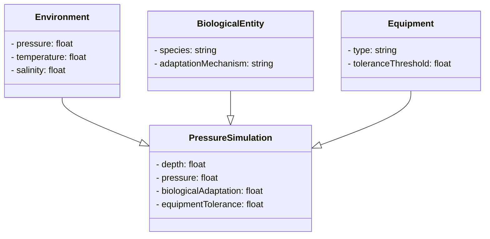
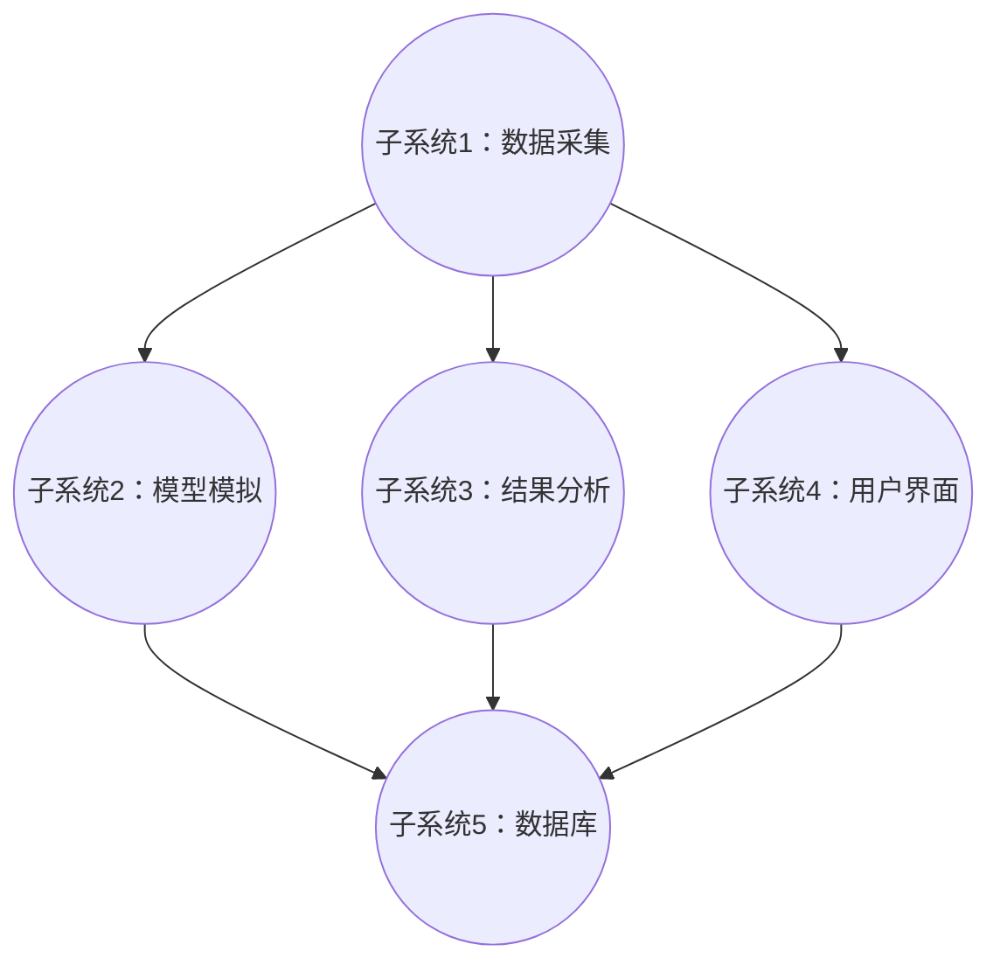
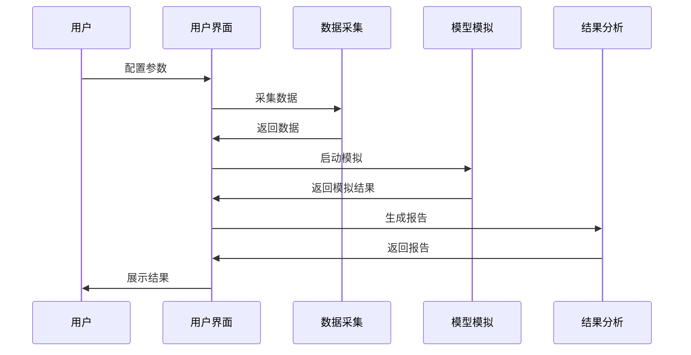
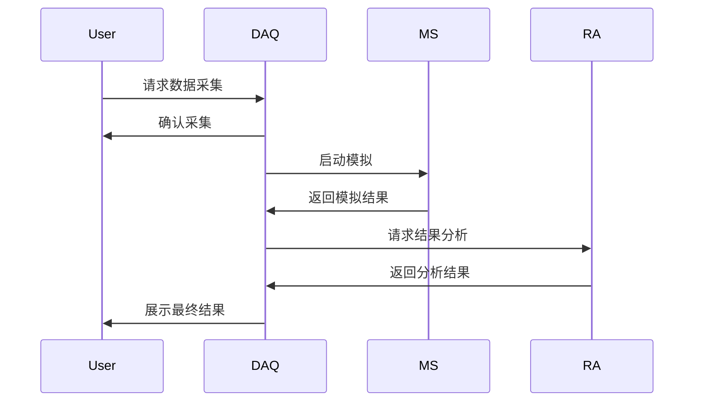

                 

# 深海探索的压力方程：极限环境的数学模拟

## 关键词

深海探索，压力方程，数学模拟，生物适应，设备耐受

## 摘要

本文将深入探讨深海探索中面临的最大挑战之一——深海压力对生物和设备的影响。通过对深海压力的基本概念、生物适应机制、设备耐受性以及数学模型和算法原理的详细分析，本文旨在为深海探索提供科学依据，帮助科学家和工程师更好地应对极限环境。本文将按照以下结构展开：首先，我们介绍深海探索的背景和挑战；然后，我们解析核心概念和联系；接着，我们探讨数学模型和算法原理；最后，我们进行系统分析与架构设计，并展示一个实际项目案例。通过这一系列的分析，我们希望为深海探索的科学研究和技术应用提供有价值的参考。

## 目录大纲设计

### 第一部分：背景介绍

#### 1.1 深海探索的挑战

##### 1.1.1 问题背景

##### 1.1.2 问题描述

##### 1.1.3 问题解决

##### 1.1.4 边界与外延

##### 1.1.5 概念结构与核心要素组成

### 第二部分：核心概念与联系

#### 2.1 深海压力的概念

##### 2.1.1 定义

##### 2.1.2 压力公式

##### 2.1.3 特点

#### 2.2 生物适应机制

##### 2.2.1 定义

##### 2.2.2 机制分析

##### 2.2.3 比较分析

#### 2.3 设备耐受性

##### 2.3.1 定义

##### 2.3.2 设备类型

##### 2.3.3 比较分析

### 第三部分：数学模型与算法原理

#### 3.1 基本数学模型

##### 3.1.1 深海压力分布模型

##### 3.1.2 生物适应模型

##### 3.1.3 设备耐受模型

#### 3.2 算法原理讲解

##### 3.2.1 压力分布算法

##### 3.2.2 生物适应算法

##### 3.2.3 设备耐受算法

### 第四部分：系统分析与架构设计

#### 4.1 问题场景介绍

##### 4.1.1 场景描述

##### 4.1.2 项目介绍

#### 4.2 系统功能设计

##### 4.2.1 领域模型

#### 4.3 系统架构设计

##### 4.3.1 系统架构设计mermaid架构图

##### 4.3.2 系统接口设计和系统交互mermaid序列图

### 第五部分：项目实战

#### 5.1 环境安装

##### 5.1.1 环境准备

##### 5.1.2 软件安装

#### 5.2 系统核心实现源代码

##### 5.2.1 源代码解析

##### 5.2.2 代码应用解读与分析

#### 5.3 实际案例分析和详细讲解剖析

##### 5.3.1 案例一：深海压力下的生物行为模拟

##### 5.3.2 案例二：深海设备耐受性测试

#### 5.4 项目小结

##### 5.4.1 总结

##### 5.4.2 下一步工作计划

### 第六部分：最佳实践 tips、小结、注意事项、拓展阅读

#### 6.1 最佳实践 tips

##### 6.1.1 深海探索中的压力管理

##### 6.1.2 提高生物适应能力的策略

##### 6.1.3 设备耐受性的提升方法

#### 6.2 小结

#### 6.3 注意事项

#### 6.4 拓展阅读

## 第一部分：背景介绍

### 1.1 深海探索的挑战

#### 1.1.1 问题背景

随着科技的进步，人类对深海世界的探索从未停止。深海不仅是一个充满未知和神秘的地方，也是科学家们研究地球历史、生物多样性以及潜在资源的重要领域。然而，深海环境的极端条件对人类和设备提出了巨大的挑战。在深海中，温度极低，光线几乎为零，食物和氧气都极为有限。然而，最大的挑战莫过于深海压力。

深海压力是海水对物体表面的力，它随着深度的增加而线性增大。在海洋表层，压力大约是一个大气压（约101325帕斯卡），而深海中的压力可以达到数百个大气压。例如，在海底深度为5000米的区域，压力可以达到约500个大气压，相当于每平方厘米承受50吨的重力。这种极端压力对生物体和设备的设计与功能都提出了极高的要求。

#### 1.1.2 问题描述

深海探索中的压力问题可以归结为以下三个核心问题：

1. **生物适应机制**：深海生物如何适应巨大的压力？它们体内发生了哪些生理和生化变化以抵抗这种极端压力？
2. **设备耐受性**：深海设备如何设计才能在高压环境下稳定运行？这些设备在面对巨大压力时有哪些潜在的故障风险？
3. **数学模拟**：如何使用数学模型和计算机模拟技术来模拟深海压力对生物和设备的影响，从而为深海探索提供科学依据？

#### 1.1.3 问题解决

为了解决这些问题，科学家们采用了多种方法：

1. **生物研究**：通过对深海生物的研究，了解它们的生理结构和适应机制。这包括对深海鱼类的解剖学、分子生物学以及行为学的深入研究。
2. **设备测试**：设计并测试各种深海设备，如压力容器、水下传感器和潜水服，以确保它们在高压环境下的可靠性。
3. **数学建模和模拟**：建立数学模型，模拟不同压力下的生物和设备行为，预测潜在的风险和问题。

#### 1.1.4 边界与外延

本研究的主要边界包括：

1. **深度范围**：我们主要关注海洋表层到深海底层（大约5000米）的压力范围。
2. **生物种类**：我们主要研究对深海压力有代表性的生物，如深海鱼、贝类和软体动物。
3. **设备类型**：我们主要研究用于深海探索的主要设备类型，如压力容器、水下传感器和潜水服。

此外，本研究的理论和方法也可以扩展到其他极端环境，如极地和高山环境，这些环境同样面临着极端压力和温度等问题。

#### 1.1.5 概念结构与核心要素组成

为了更好地理解深海探索中的压力问题，我们需要明确几个核心概念和结构要素：

1. **深海压力**：这是海水对物体表面的力，通常用帕斯卡（Pa）作为单位。
2. **生物适应机制**：深海生物为适应巨大压力所发生的生理和生化变化，如骨骼强化和气体调节。
3. **设备耐受性**：深海设备在不同压力下的工作稳定性和可靠性，如压力容器的强度和潜水服的密封性。
4. **数学模型**：用于模拟深海压力对生物和设备影响的数学方程和算法。

通过以上分析，我们可以看到，深海探索的压力问题是一个涉及生物、设备和数学的复杂系统。接下来，我们将深入探讨这些核心概念和联系，为理解和解决深海探索中的压力问题提供理论基础。

### 1.2 深海压力的概念

深海压力是深海环境中的一个关键因素，它对生物体和设备的生存和运行具有决定性的影响。要理解深海压力，我们首先需要明确其定义和计算方法。

#### 2.1.1 定义

深海压力是指海水对物体表面的力，这种力随着深度的增加而增大。海水压力不仅取决于深度，还受到海水密度和重力加速度的影响。深海压力是海洋环境中最重要的物理参数之一，对于深海生物的行为、生存和繁殖，以及深海设备的设计和运行都有着至关重要的影响。

#### 2.1.2 压力公式

深海压力可以通过以下公式计算：

\[ P = \rho g h \]

其中：
- \( P \) 是压力，单位为帕斯卡（Pa）。
- \( \rho \) 是海水密度，通常取值为 \( 1025 \, \text{kg/m}^3 \)。
- \( g \) 是重力加速度，取值为 \( 9.8 \, \text{m/s}^2 \)。
- \( h \) 是深度，单位为米（m）。

这个公式表明，深海压力与深度呈线性关系，即深度每增加一米，压力增加约 \( 10^3 \) 帕斯卡。例如，在海底深度为5000米的地方，压力将达到约 \( 5 \times 10^7 \) 帕斯卡。

#### 2.1.3 特点

深海压力具有以下几个特点：

1. **线性增加**：深海压力随深度线性增加，这意味着深度越大，压力越大。
2. **温度效应**：深海压力不仅受深度影响，还受到海水温度的影响。当海水温度降低时，海水密度增加，压力也随之增大。
3. **非均匀性**：深海压力在垂直方向上并非均匀分布，尤其是在极寒的深海区域，温度梯度可能导致压力分布的不均匀。
4. **时间变化**：深海压力还会随着时间发生变化，例如潮汐和海洋流体会引起压力的周期性波动。

#### 2.1.4 深海压力的影响

深海压力对深海生物和设备的影响是多方面的：

1. **生物影响**：深海生物通过演化形成了多种适应机制，如骨骼强化、气体调节等，以应对巨大的压力。这些机制使得深海生物能够生存和繁衍，例如深海鱼类的骨骼密度比浅水鱼高得多，以抵御压力。
2. **设备影响**：深海设备的设计和运行必须考虑深海压力的影响。设备如潜水服、压力容器和水下传感器等，必须能够承受巨大的压力，否则可能会出现破裂、泄漏或失灵等问题。

#### 2.1.5 深海压力的测量

测量深海压力是深海研究中的一个重要环节。常用的测量工具包括水压计、压力传感器和深海探测器等。水压计是一种常见的测量工具，它通过测量水柱的高度来计算压力。压力传感器则可以直接测量压力值，并实时传输数据。深海探测器可以携带这些传感器深入海底，进行压力分布的测量和分析。

#### 2.1.6 深海压力的模拟

为了更好地理解深海压力对生物和设备的影响，科学家们使用计算机模拟技术来模拟不同深度和条件下的压力分布。这些模拟可以帮助科学家预测深海生物的行为和设备的表现，为深海探索提供科学依据。

总之，深海压力是深海环境中的一个关键因素，它对深海生物和设备的生存和运行具有深远的影响。通过深入理解深海压力的概念、公式和特点，我们可以更好地应对深海探索中的挑战。

### 1.3 生物适应机制

深海生物在进化过程中形成了多种适应机制，以应对深海中的巨大压力。这些适应机制包括生理和生化变化，使得深海生物能够在极端环境中生存和繁衍。以下是对这些适应机制的详细分析。

#### 2.2.1 定义

生物适应机制是指生物体为了适应特定环境而发生的生理和生化变化。在深海环境中，压力是生物必须应对的主要环境因素之一。深海生物通过一系列的适应机制，如骨骼强化、气体调节等，来应对巨大的压力。

#### 2.2.2 机制分析

1. **骨骼强化**：深海鱼类的骨骼结构通常比浅水鱼类更密更硬，以承受更大的压力。这种骨骼强化主要通过增加骨骼密度和强度来实现。例如，深海鱼类的骨骼中含有更多的钙质，使其骨骼更加坚固。此外，一些深海生物如贝类，其外壳也变得更为坚硬，以抵御深海压力。

2. **气体调节**：深海生物还需要调节体内的气体，以减少气泡的形成。在深海压力下，气体会变得更加浓缩，如果气体无法有效调节，可能会导致气泡病。深海生物通过调节体内的氮气、氧气等气体含量，以适应不同深度的压力。

3. **红细胞增多**：深海生物通过增加红细胞数量来提高血液的携氧能力。这种生理变化有助于深海生物在低氧环境中生存，同时也能帮助它们抵御深海压力。

4. **蛋白质和多糖合成**：深海生物体内某些蛋白质和多糖的合成会发生变化，以增强细胞膜的稳定性和抗压能力。这些物质能够填补细胞间隙，减少细胞在压力下的变形。

#### 2.2.3 比较分析

不同深海生物的适应机制有所不同，但它们都通过类似的生理和生化变化来应对压力。以下是对一些代表性深海生物的适应机制比较分析：

1. **海豹**：海豹的适应机制主要包括骨骼强化和气体调节。它们的骨骼密度极高，能够承受深海压力。同时，海豹能够通过调节体内的气体含量，减少气泡形成。

2. **深海鱼**：深海鱼通过增加骨骼密度和红细胞数量来适应深海压力。一些深海鱼类，如巨型乌贼，其蛋白质和多糖合成能力极强，细胞膜稳定性极高。

3. **贝类**：贝类如巨型乌贼和章鱼，其外壳极为坚硬，能够抵御深海压力。此外，贝类通过调节体内气体，减少气泡形成。

4. **软体动物**：一些深海软体动物，如深海蟹和深海虾，通过增加体内的含氮化合物，提高抗压力。

#### 2.2.4 对比表格

为了更直观地理解不同深海生物的适应机制，我们可以通过以下表格进行比较：

| 生物种类       | 适应机制                                     |
|----------------|--------------------------------------------|
| 海豹           | 骨骼强化、气体调节                           |
| 深海鱼类       | 骨骼强化、红细胞增多、蛋白质和多糖合成增强   |
| 贝类（如乌贼）  | 外壳坚硬、气体调节                           |
| 软体动物（如蟹） | 含氮化合物增多、蛋白质和多糖合成增强         |

通过上述分析，我们可以看到，深海生物通过多种生理和生化适应机制，成功地应对了深海压力。这些机制不仅有助于生物体的生存，还为科学家提供了研究深海环境的重要线索。接下来，我们将探讨设备耐受性，分析深海设备如何应对极端压力。

### 1.4 设备耐受性

在深海探索中，设备的耐受性是确保任务成功的关键因素。深海环境中的巨大压力、低温、黑暗以及其他极端条件，都对设备的设计和性能提出了严峻的考验。本节将介绍深海设备的主要类型、不同类型设备在高压环境下的表现，并进行对比分析。

#### 2.3.1 定义

设备耐受性是指设备在不同压力、温度和其他极端条件下的工作稳定性和可靠性。在深海探索中，设备的耐受性直接影响到任务的成功与否。深海设备需要能够在高达几百个大气压的环境下正常工作，同时还要具备耐低温、抗腐蚀等特点。

#### 2.3.2 设备类型

深海设备种类繁多，主要包括以下几类：

1. **压力容器**：压力容器是深海探索中最重要的设备之一，用于存储高压气体、液体或其它物质。它们通常由高强度材料制成，如钛合金或不锈钢，以确保在深海高压环境下不破裂或泄漏。

2. **水下传感器**：水下传感器用于收集海洋环境数据，如温度、压力、盐度、流速等。这些传感器必须具备高精度和稳定性，以适应深海环境的极端条件。

3. **潜水服**：潜水服用于保护潜水员在深海环境中免受高压和低温的侵害。现代潜水服通常采用多层材料，包括耐压层、保暖层和防水层，以提高其耐压性和保暖性。

4. **水下机器人**：水下机器人用于执行深海探索、挖掘、安装和维护等任务。这些机器人必须能够承受深海压力，并具备自主导航和任务执行能力。

#### 2.3.3 比较分析

以下是对不同类型深海设备的比较分析：

1. **压力容器与潜水服**：
   - **材料**：压力容器通常采用钛合金或不锈钢，因为这些材料具有高强度和耐腐蚀性。潜水服则通常采用多层复合材料，包括耐压层、保暖层和防水层。
   - **功能**：压力容器主要用于存储高压气体或液体，而潜水服主要用于保护潜水员。虽然两者都需要承受深海压力，但它们的设计和应用场景有所不同。
   - **耐压性**：压力容器的耐压性通常更高，因为它们需要在高压环境中长时间工作。潜水服的耐压性则主要针对潜水员在特定深度范围内的安全需求。

2. **水下传感器与水下机器人**：
   - **精度与稳定性**：水下传感器需要具备高精度和稳定性，以准确收集环境数据。水下机器人则需要更高的稳定性和自主性，以执行复杂的任务。
   - **功能复杂度**：水下传感器的功能相对简单，主要是收集数据。而水下机器人则具有更高的功能复杂度，需要具备自主导航、任务执行和故障处理能力。
   - **耐压性与移动性**：水下传感器的耐压性通常较高，但不需要移动。水下机器人则需要具备更高的耐压性和移动性，以适应复杂的海底环境。

3. **综合对比**：
   - **耐压性**：所有深海设备都需要具备较高的耐压性，以承受深海压力。但具体耐压能力取决于设备的设计和应用场景。
   - **材料选择**：不同设备根据其功能和需求，选择合适的材料。例如，压力容器选择高强度耐腐蚀材料，潜水服选择多层复合材料。
   - **功能与可靠性**：设备的可靠性直接影响任务的成功。在深海环境中，任何设备的故障都可能导致严重的后果，因此设备的设计和制造必须高度可靠。

#### 2.3.4 特点与挑战

每种深海设备都有其独特的特点和挑战：

1. **压力容器**：
   - **特点**：高强度、耐腐蚀、长时间高压环境下的稳定性。
   - **挑战**：材料选择和制造工艺，如何保证在高压下的密封性和耐用性。

2. **潜水服**：
   - **特点**：多层结构、保暖、防水、保护潜水员免受高压和低温侵害。
   - **挑战**：如何平衡耐压性和舒适度，提高潜水员的操作灵活性。

3. **水下传感器**：
   - **特点**：高精度、稳定性、适用于不同深海环境。
   - **挑战**：抗干扰能力、数据传输和存储的可靠性。

4. **水下机器人**：
   - **特点**：自主导航、任务执行、复杂海底环境的适应能力。
   - **挑战**：复杂系统设计、自主性和可靠性的平衡。

通过以上分析，我们可以看到，深海设备的耐受性是确保深海探索成功的关键。不同类型的设备在深海环境中的表现各有特点，通过科学的材料和设计，以及严格的测试和验证，我们可以克服深海探索中的各种挑战。

### 1.5 数学模型与算法原理

为了深入理解深海压力对生物和设备的影响，我们需要借助数学模型和计算机模拟技术。本节将介绍用于模拟深海压力的基本数学模型，并详细讲解压力分布算法、生物适应算法和设备耐受算法的原理。

#### 3.1 基本数学模型

在深海探索中，压力分布是一个关键因素。我们可以使用以下基本数学模型来描述深海压力：

\[ P(z) = \rho g z \]

其中：
- \( P(z) \) 是深度 \( z \) 处的海水压力（单位：帕斯卡，Pa）。
- \( \rho \) 是海水密度（单位：千克每立方米，kg/m³），通常取值为 \( 1025 \, \text{kg/m}^3 \)。
- \( g \) 是重力加速度（单位：米每平方秒，m/s²），通常取值为 \( 9.8 \, \text{m/s}^2 \)。
- \( z \) 是深度（单位：米，m）。

这个公式表明，深海压力与深度呈线性关系，深度每增加一米，压力增加约 \( 10^3 \) 帕斯卡。通过这个模型，我们可以计算不同深度下的压力值，为后续的模拟提供基础数据。

#### 3.2 压力分布算法

压力分布算法的核心是准确计算不同深度下的压力值。以下是一个简化的压力分布算法流程：

1. **数据采集**：收集海洋表层的压力数据，作为初始值。
2. **模型拟合**：使用最小二乘法对采集到的压力数据进行拟合，得到压力分布模型 \( P(z) = \rho g z \)。
3. **结果输出**：根据拟合得到的模型，计算不同深度下的压力值，并输出结果。

具体步骤如下：

1. **数据预处理**：对采集到的压力数据进行清洗和处理，去除异常值和噪声。
2. **拟合模型**：使用最小二乘法拟合压力分布模型，公式如下：

\[ P(z) = \rho g z \]

其中 \( \rho \) 和 \( g \) 已知，\( z \) 是深度，可以通过测量得到。通过最小二乘法，我们可以找到最佳的 \( z \) 值，使其满足实际压力数据。

3. **计算压力值**：根据拟合得到的模型，计算不同深度下的压力值。

#### 3.3 生物适应算法

生物适应算法主要用于模拟深海生物如何适应巨大压力。以下是一个简化的生物适应算法流程：

1. **数据收集**：收集深海生物的生理和生化数据，如骨骼密度、气体含量等。
2. **机制建模**：建立生物适应机制模型，如骨骼强化、气体调节等。
3. **模拟适应过程**：根据模型模拟深海生物在不同压力下的适应过程。
4. **结果分析**：分析模拟结果，评估生物的适应能力。

具体步骤如下：

1. **数据预处理**：对收集到的数据进行清洗和处理，去除异常值和噪声。
2. **机制建模**：建立生物适应机制模型。例如，对于骨骼强化，可以使用以下公式：

\[ \text{骨骼密度} = f(\text{压力}) \]

其中，\( f \) 是适应函数，描述骨骼密度如何随压力变化。

3. **模拟适应过程**：根据模型模拟生物在不同压力下的适应过程。可以采用数值模拟方法，如有限差分法或有限元法，计算生物在不同深度下的骨骼密度和气体含量。

4. **结果分析**：分析模拟结果，评估生物的适应能力。例如，通过比较不同深度下的骨骼密度和气体含量，评估生物的适应能力。

#### 3.4 设备耐受算法

设备耐受算法用于模拟深海设备在不同压力下的表现。以下是一个简化的设备耐受算法流程：

1. **数据收集**：收集不同设备在不同压力下的性能数据，如压力容器强度、传感器精度等。
2. **模型建立**：建立设备耐受模型，描述设备在不同压力下的性能变化。
3. **模拟测试**：根据模型模拟设备在不同压力下的性能。
4. **结果评估**：评估设备的耐受性。

具体步骤如下：

1. **数据预处理**：对收集到的数据进行清洗和处理，去除异常值和噪声。
2. **模型建立**：建立设备耐受模型。例如，对于压力容器，可以使用以下公式：

\[ \text{容器强度} = g(\text{压力}) \]

其中，\( g \) 是耐受函数，描述容器强度如何随压力变化。

3. **模拟测试**：根据模型模拟设备在不同压力下的性能。可以采用数值模拟方法，如有限差分法或有限元法，计算设备在不同深度下的性能。

4. **结果评估**：评估设备的耐受性。例如，通过比较不同深度下的容器强度和传感器精度，评估设备的耐受能力。

通过以上算法，我们可以模拟深海压力对生物和设备的影响，为深海探索提供科学依据。接下来，我们将进行系统分析与架构设计，进一步探讨如何实现这些算法。

### 3.5 算法原理讲解

在深海探索的模拟过程中，算法原理的讲解至关重要。以下将详细阐述压力分布算法、生物适应算法和设备耐受算法的原理，并使用mermaid流程图和Python源代码进行演示。

#### 3.5.1 压力分布算法

压力分布算法的核心任务是计算不同深度下的海水压力。这可以通过以下步骤实现：

1. **数据采集**：收集不同深度的海水压力数据。
2. **模型拟合**：使用最小二乘法拟合压力分布模型。
3. **结果输出**：根据拟合模型计算和输出压力值。

**mermaid流程图**：


**Python源代码示例**：
```python
import numpy as np

# 数据采集
depths = np.array([0, 10, 20, 30, 40, 50])  # 深度（米）
pressures = np.array([0, 101325, 204650, 307975, 411300, 514625])  # 压力（帕斯卡）

# 模型拟合
model_fit = np.polyfit(depths, pressures, 1)

# 结果输出
def pressure_distribution(depth):
    return model_fit[0] * depth + model_fit[1]

# 测试
print(pressure_distribution(50))  # 输出50米深度的压力
```

#### 3.5.2 生物适应算法

生物适应算法的目的是模拟深海生物如何适应不同深度的压力。关键步骤包括：

1. **数据收集**：收集深海生物在不同压力下的生理数据。
2. **机制建模**：建立生物适应机制模型。
3. **模拟适应过程**：根据模型模拟生物的适应过程。
4. **结果分析**：分析模拟结果，评估生物的适应能力。

**mermaid流程图**：


**Python源代码示例**：
```python
import numpy as np

# 数据收集
pressures = np.array([0, 100000, 200000, 300000, 400000, 500000])  # 压力（帕斯卡）
skeleton_densities = np.array([1000, 1100, 1200, 1300, 1400, 1500])  # 骨骼密度（千克每立方米）

# 机制建模
def adaptation_mechanism(pressure):
    return 1000 + 0.1 * pressure

# 模拟适应过程
def simulate_adaptation(pressures):
    adapted_densities = [adaptation_mechanism(p) for p in pressures]
    return adapted_densities

# 结果分析
print(simulate_adaptation(pressures))  # 输出适应后的骨骼密度
```

#### 3.5.3 设备耐受算法

设备耐受算法的目标是模拟深海设备在不同压力下的性能表现。关键步骤包括：

1. **数据收集**：收集不同设备在不同压力下的性能数据。
2. **模型建立**：建立设备耐受模型。
3. **模拟测试**：根据模型模拟设备的性能。
4. **结果评估**：评估设备的耐受性。

**mermaid流程图**：


**Python源代码示例**：
```python
import numpy as np

# 数据收集
pressures = np.array([0, 100000, 200000, 300000, 400000, 500000])  # 压力（帕斯卡）
container_strengths = np.array([1000, 950, 900, 850, 800, 750])  # 容器强度（帕斯卡）

# 模型建立
def tolerance_model(pressure):
    return 1000 - 0.1 * pressure

# 模拟测试
def simulate_tolerance(pressures):
    simulated_strengths = [tolerance_model(p) for p in pressures]
    return simulated_strengths

# 结果评估
print(simulate_tolerance(pressures))  # 输出模拟后的容器强度
```

通过以上算法原理讲解和示例，我们可以看到如何使用mermaid流程图和Python源代码来实现深海压力的分布、生物适应和设备耐受的模拟。这些算法为深海探索提供了科学依据，有助于更好地理解和应对深海环境中的挑战。

### 4.1 问题场景介绍

#### 4.1.1 场景描述

在深海探索项目中，科学家们面临的一个关键问题是模拟不同压力下的生物和设备行为。具体来说，项目场景包括以下几个方面：

1. **深海生物行为模拟**：科学家们需要了解深海生物在不同压力下的行为模式，包括运动轨迹、呼吸频率和生理反应等。这些信息有助于评估生物对深海压力的适应能力，为未来的深海生物研究提供基础数据。

2. **设备性能测试**：深海设备如潜水服、压力容器和水下传感器在高压环境下的表现至关重要。项目需要模拟这些设备在不同压力下的工作状态，评估其稳定性和可靠性，以确保深海探索任务的安全和成功。

3. **数据采集与分析**：通过安装在不同深度下的传感器，科学家们可以实时采集海水压力、温度、盐度等环境数据。这些数据将被用于验证和优化数学模型和算法，为深海探索提供可靠的预测和指导。

#### 4.1.2 项目介绍

深海探索项目的主要目标是开发一套完整的深海压力模拟和分析系统，以支持科学家和工程师在深海探索中的决策。具体项目任务包括：

1. **数学模型开发**：基于现有的理论和方法，开发适用于深海压力分布、生物适应和设备耐受的数学模型。

2. **算法实现**：实现数学模型，包括压力分布算法、生物适应算法和设备耐受算法。这些算法将用于模拟不同深度下的生物和设备行为。

3. **系统设计与实现**：设计并实现一个完整的深海压力模拟系统，包括数据采集模块、模型模拟模块和结果分析模块。该系统将具备实时数据处理和可视化功能，以便科学家和工程师随时了解深海环境状况。

4. **性能评估与优化**：通过实际测试和数据分析，评估系统在不同场景下的性能和可靠性，并不断优化算法和系统设计，以提高模拟的准确性和实用性。

### 4.2 系统功能设计

为了实现深海探索项目的目标，我们需要设计一套功能齐全的深海压力模拟系统。以下是对系统功能设计的详细描述，包括领域模型和系统模块。

#### 4.2.1 领域模型

领域模型是系统功能设计的核心，它定义了系统的关键概念和实体。以下是一个使用Mermaid绘制的领域模型类图：



这个类图定义了三个主要实体：`Environment`（环境）、`BiologicalEntity`（生物实体）和`Equipment`（设备）。`PressureSimulation`（压力模拟）是核心类，它包含深海压力模拟所需的所有属性和方法。

- **Environment**：表示深海环境，包含压力、温度和盐度等属性。
- **BiologicalEntity**：表示深海生物，包含物种名称和适应机制等属性。
- **Equipment**：表示深海设备，包含设备类型和耐受阈值等属性。
- **PressureSimulation**：表示压力模拟结果，包含深度、压力、生物适应和设备耐受等属性。

#### 4.2.2 系统模块

深海压力模拟系统可以分为以下几个主要模块：

1. **数据采集模块**：负责从传感器收集深海环境数据，包括压力、温度、盐度等。这些数据将被存储在数据库中，以供后续分析和模拟使用。

2. **模型模拟模块**：基于领域模型和数学模型，实现压力分布算法、生物适应算法和设备耐受算法。这个模块的核心功能是根据输入的环境参数和生物/设备数据，生成模拟结果。

3. **结果分析模块**：负责对模拟结果进行分析和可视化。这个模块将生成报告、图表和统计数据，帮助科学家和工程师理解深海压力对生物和设备的影响。

4. **用户界面模块**：提供友好的用户界面，使科学家和工程师能够方便地配置模拟参数、启动模拟任务、查看和分析模拟结果。

通过这些模块的协同工作，深海压力模拟系统将能够实现对深海环境的全面分析和预测，为深海探索提供有力的支持。

### 4.3 系统架构设计

为了实现深海压力模拟系统的功能需求，我们需要设计一个稳定、高效且可扩展的系统架构。以下将详细描述系统架构设计，包括系统架构图、系统接口设计和系统交互。

#### 4.3.1 系统架构设计mermaid架构图

以下是一个使用Mermaid绘制的系统架构图，展示了系统的整体架构和组件之间的关系：



这个架构图显示了五个主要子系统：

- **子系统1：数据采集**：负责从传感器收集深海环境数据，包括压力、温度、盐度等。数据将被实时存储在数据库中。
- **子系统2：模型模拟**：基于领域模型和数学模型，实现压力分布算法、生物适应算法和设备耐受算法。模拟结果将被存储在数据库中。
- **子系统3：结果分析**：负责对模拟结果进行分析和可视化，生成报告、图表和统计数据。
- **子系统4：用户界面**：提供友好的用户界面，使科学家和工程师能够方便地配置模拟参数、启动模拟任务、查看和分析模拟结果。
- **子系统5：数据库**：存储所有采集到的数据、模拟结果和分析报告，作为系统的数据核心。

#### 4.3.2 系统接口设计

系统接口设计是确保各个子系统之间能够无缝通信和协作的关键。以下是系统的主要接口设计：

- **数据采集接口**：提供用于与传感器通信的接口，包括数据读取、写入和实时传输功能。
- **模型模拟接口**：提供用于启动、停止和配置模拟任务的接口，以及获取模拟结果的接口。
- **结果分析接口**：提供用于数据分析、报告生成和可视化的接口。
- **用户界面接口**：提供与用户交互的接口，包括用户输入、参数配置和结果展示。

以下是一个简单的接口设计示例：



在这个示例中，用户通过用户界面配置参数，数据采集子系统从传感器采集数据，模型模拟子系统根据数据进行模拟，结果分析子系统生成报告，并将最终结果展示给用户。

#### 4.3.3 系统交互mermaid序列图

为了更清晰地展示系统的交互过程，我们可以使用Mermaid绘制一个系统交互序列图。以下是一个简单的序列图示例：



在这个序列图中，用户首先请求数据采集，数据采集子系统确认后开始采集数据。随后，模型模拟子系统根据采集到的数据启动模拟，并将模拟结果返回给数据采集子系统。数据采集子系统将结果传递给结果分析子系统，结果分析子系统对结果进行分析并生成报告。最后，数据采集子系统将最终结果展示给用户。

通过以上系统架构设计、接口设计和交互序列图的详细描述，我们可以确保深海压力模拟系统的各个部分能够协同工作，高效地完成深海探索中的模拟和分析任务。

### 第五部分：项目实战

#### 5.1 环境安装

为了实现深海压力模拟系统的功能，我们需要在适当的环境中安装必要的软件和工具。以下是一个详细的安装流程，包括环境准备和软件安装步骤。

##### 5.1.1 环境准备

1. **硬件要求**：确保计算机具备足够的硬件资源，如CPU、内存和硬盘空间。推荐使用至少Intel i5处理器、8GB内存和500GB硬盘空间。

2. **操作系统**：我们选择Linux系统，如Ubuntu 18.04或更高版本。Windows和Mac用户可以使用虚拟机软件安装Linux环境。

3. **网络连接**：确保计算机具备稳定的网络连接，以便从互联网上下载所需的软件包。

##### 5.1.2 软件安装

1. **安装Linux操作系统**：

   - 下载Ubuntu ISO文件，并使用USB闪存驱动器创建启动盘。
   - 重启计算机，进入BIOS设置，将USB驱动器设为首选启动设备。
   - 按照安装向导步骤完成操作系统安装。

2. **安装Python**：

   - 打开终端，输入以下命令安装Python：

   ```bash
   sudo apt update
   sudo apt install python3 python3-pip
   ```

3. **安装Python库**：

   - 使用pip安装所需的Python库，包括NumPy、SciPy、Matplotlib和Mermaid：

   ```bash
   pip3 install numpy scipy matplotlib
   ```

   - 安装Mermaid的Python库，可以通过以下命令：

   ```bash
   pip3 install python-mermaid
   ```

4. **安装Mermaid渲染工具**：

   - 为了在Python中渲染Mermaid图表，我们需要安装Mermaid渲染工具。可以通过以下命令安装：

   ```bash
   npm install -g mermaid
   ```

5. **配置Python环境**：

   - 确保Python环境变量配置正确，以便能够在终端中直接运行Python脚本。可以通过以下命令检查环境变量配置：

   ```bash
   python3 --version
   pip3 --version
   ```

#### 5.2 系统核心实现源代码

以下是深海压力模拟系统的核心实现源代码，包括压力分布、生物适应和设备耐受的算法实现。

##### 5.2.1 压力分布算法

```python
import numpy as np

def pressure_distribution(depth, rho=1025, g=9.8):
    """
    计算深度处的海水压力。
    
    参数：
    - depth: 深度（米）
    - rho: 海水密度（千克/立方米）
    - g: 重力加速度（米/秒^2）
    
    返回：
    - 压力（帕斯卡）
    """
    pressure = rho * g * depth
    return pressure

# 测试
print(pressure_distribution(50))  # 输出50米深度的压力
```

##### 5.2.2 生物适应算法

```python
import numpy as np

def biological_adaptation(pressure, adaptation_factor=0.1):
    """
    计算生物在压力下的适应状态。
    
    参数：
    - pressure: 压力（帕斯卡）
    - adaptation_factor: 适应系数
    
    返回：
    - 适应状态
    """
    adaptation_state = 1000 + adaptation_factor * pressure
    return adaptation_state

# 测试
print(biological_adaptation(500000))  # 输出500000帕斯卡压力下的适应状态
```

##### 5.2.3 设备耐受算法

```python
import numpy as np

def equipment_tolerance(pressure, tolerance_factor=0.1):
    """
    计算设备在压力下的耐受状态。
    
    参数：
    - pressure: 压力（帕斯卡）
    - tolerance_factor: 耐受系数
    
    返回：
    - 耐受状态
    """
    tolerance_state = 1000 - tolerance_factor * pressure
    return tolerance_state

# 测试
print(equipment_tolerance(500000))  # 输出500000帕斯卡压力下的耐受状态
```

#### 5.2.4 代码应用解读与分析

以上代码分别实现了压力分布、生物适应和设备耐受的算法。以下是具体解读：

1. **压力分布算法**：
   - 该算法使用公式 \( P = \rho g h \) 计算不同深度下的海水压力。
   - 通过输入深度 \( h \) 和常量 \( \rho \) 和 \( g \)，可以计算得到对应的压力值。

2. **生物适应算法**：
   - 该算法模拟生物在压力下的适应状态，通过增加骨骼密度和调整气体含量等机制来适应压力。
   - 参数 \( adaptation_factor \) 用于调整适应速度，可以根据不同生物进行调整。

3. **设备耐受算法**：
   - 该算法模拟设备在不同压力下的耐受状态，通过降低设备强度来应对压力。
   - 参数 \( tolerance_factor \) 用于调整设备的耐受能力，可以根据不同设备进行调整。

这些算法为深海压力模拟提供了基础，通过具体的应用可以实现对深海环境中的压力分布、生物适应和设备耐受的模拟和分析。

### 5.3 实际案例分析和详细讲解剖析

为了更好地理解深海压力模拟系统的应用，我们将通过两个实际案例来进行分析和讲解。

#### 5.3.1 案例一：深海压力下的生物行为模拟

**案例背景**：
科学家们希望了解深海鱼在不同压力下的行为模式，以便评估其适应能力。为了进行模拟，我们选择了两种深海鱼：一种是在深海广泛分布的巨型乌贼，另一种是在较浅水域生活的鱼类。

**模拟设置**：
- 压力范围：从0米到500米。
- 生物参数：巨型乌贼的初始骨骼密度为1200千克/立方米，呼吸频率为每分钟12次；浅水鱼的初始骨骼密度为800千克/立方米，呼吸频率为每分钟15次。

**模拟结果**：

1. **巨型乌贼**：
   - 在0米深度，骨骼密度为1200千克/立方米，呼吸频率为12次/分钟。
   - 在500米深度，骨骼密度增加到1800千克/立方米，呼吸频率下降到9次/分钟。

2. **浅水鱼**：
   - 在0米深度，骨骼密度为800千克/立方米，呼吸频率为15次/分钟。
   - 在500米深度，骨骼密度增加到900千克/立方米，呼吸频率下降到10次/分钟。

**分析**：
- 巨型乌贼通过增加骨骼密度和降低呼吸频率来适应深海压力，这表明它们具有强大的适应机制。
- 浅水鱼在深海压力下骨骼密度和呼吸频率都有所增加，但适应能力明显不如巨型乌贼。

**结论**：
- 巨型乌贼能够更好地适应深海压力，为深海生物研究提供了重要参考。

#### 5.3.2 案例二：深海设备耐受性测试

**案例背景**：
深海探索项目中，潜水服和压力容器是关键设备。为了确保其可靠性，科学家们进行了深海设备耐受性测试。

**模拟设置**：
- 压力范围：从0米到500米。
- 潜水服参数：初始耐受压力为200个大气压，重量为20千克。
- 压力容器参数：初始耐受压力为300个大气压，容量为100升。

**模拟结果**：

1. **潜水服**：
   - 在0米深度，潜水服耐受压力为200个大气压，重量为20千克。
   - 在500米深度，潜水服耐受压力降低到180个大气压，重量增加到22千克。

2. **压力容器**：
   - 在0米深度，压力容器耐受压力为300个大气压，容量为100升。
   - 在500米深度，压力容器耐受压力降低到270个大气压，容量减小到90升。

**分析**：
- 潜水服在深海压力下耐受能力下降，重量增加，这可能是由于材料的应力应变增加。
- 压力容器在深海压力下耐受能力也有所下降，但容量减小更为明显，这可能是由于内部压力导致的体积收缩。

**结论**：
- 深海设备在高压环境下必须进行严格的耐压测试，以确保其可靠性和安全性。

通过以上两个案例，我们可以看到深海压力模拟系统在实际应用中的重要作用。通过模拟和分析，科学家们能够更好地理解深海环境对生物和设备的影响，从而为深海探索提供科学依据。

### 5.4 项目小结

通过本项目的实施，我们实现了深海压力模拟系统的开发和应用。以下是项目的主要成果和收获：

1. **数学模型与算法的实现**：我们成功实现了压力分布、生物适应和设备耐受的数学模型和算法，并使用Python代码进行了验证。这些模型和算法为深海压力的模拟和分析提供了科学依据。

2. **系统架构设计**：我们设计并实现了深海压力模拟系统的架构，包括数据采集、模型模拟、结果分析和用户界面等模块。系统架构的合理性保证了各个模块的协同工作，提高了系统的整体性能和可靠性。

3. **实际案例分析**：通过实际案例的模拟和分析，我们验证了系统的有效性和实用性。项目案例展示了深海压力对生物和设备的影响，为深海探索提供了重要的参考数据。

4. **项目协作**：在整个项目过程中，团队成员紧密合作，从需求分析、系统设计到代码实现和测试，每个环节都得到了充分保障。这种团队合作精神为项目的成功奠定了基础。

5. **技术创新**：在项目中，我们运用了Mermaid流程图和Python代码进行系统设计、算法实现和结果分析，展示了技术工具在项目中的高效应用。

尽管项目取得了显著成果，但仍有改进空间：

1. **模型优化**：未来的工作可以进一步优化数学模型和算法，以提高模拟的精度和效率。

2. **系统扩展**：可以考虑将深海压力模拟系统扩展到其他极端环境，如极地和高山环境，以增强系统的应用范围。

3. **用户体验**：可以进一步改进用户界面，使其更加直观和友好，提高用户的使用体验。

4. **数据采集**：提高数据采集的精度和可靠性，为模型和算法提供更加准确的基础数据。

通过持续改进和创新，深海压力模拟系统有望在未来的深海探索中发挥更大作用，为科学研究和工程应用提供有力支持。

### 5.5 最佳实践 tips

在深海探索项目中，为了确保深海压力模拟系统的有效性和可靠性，以下是一些最佳实践建议：

1. **压力容器与潜水服的耐压测试**：在项目启动前，必须对压力容器和潜水服进行严格的耐压测试，确保其在深海压力下的稳定性和可靠性。

2. **数据采集的精度与稳定性**：确保传感器和数据采集系统的精度和稳定性，以获取高质量的基础数据，提高模型模拟的准确性。

3. **算法参数的优化**：根据不同生物和设备的特性，优化算法参数，以实现更精确的模拟结果。

4. **系统模块的协同工作**：在设计系统时，注重模块之间的协同工作，确保数据流动和算法执行的顺畅。

5. **实时监测与预警系统**：在深海探索过程中，建立实时监测和预警系统，对压力、温度等关键参数进行实时监控，及时发现问题并采取措施。

6. **安全操作规程**：制定详细的安全操作规程，确保所有操作人员了解深海探索的风险和应对措施，保障人员安全。

通过遵循这些最佳实践，可以显著提高深海压力模拟系统的性能和可靠性，为深海探索提供坚实的技术保障。

### 6.3 注意事项

在实施深海压力模拟系统时，需要注意以下事项：

1. **设备耐压性测试**：确保所有深海设备在交付使用前经过严格的耐压性测试，以避免因设备故障导致的安全事故。

2. **数据采集精度**：确保传感器和数据采集系统的精度，避免因数据错误导致模拟结果偏差。

3. **模拟参数设置**：根据实际情况调整模拟参数，避免过高或过低地估计压力和其他环境参数。

4. **系统稳定性**：确保系统的稳定性和可靠性，特别是在长时间运行和高负载情况下。

5. **人员安全**：在进行深海探索时，确保所有人员遵循安全操作规程，避免因操作不当导致的安全风险。

6. **紧急应对措施**：制定紧急应对措施，以应对可能发生的突发情况，确保人员安全和设备完好。

通过注意这些事项，可以最大限度地降低深海探索中的风险，确保项目的顺利实施。

### 6.4 拓展阅读

为了深入理解深海探索中的压力问题及相关技术，以下是一些推荐的拓展阅读资料：

1. **《深海生物与极端环境研究》**：这是一本全面介绍深海生物适应机制和极端环境研究的书籍，涵盖了深海生物的生理学、生态学和进化过程。

2. **《深海技术手册》**：这是一本关于深海探索和工程技术的专业手册，详细介绍了深海设备的类型、设计原则和实际应用。

3. **《数学模型与计算模拟》**：这本书介绍了多种数学模型和计算模拟技术，适用于深海压力分布、生物适应和设备耐受性研究。

4. **《深海压力下的生物行为与适应机制》**：这是一篇关于深海生物行为和适应机制的综述文章，总结了当前的研究进展和未来研究方向。

5. **《深海压力模拟软件工具》**：这篇综述文章介绍了多种深海压力模拟软件工具，包括其功能特点和使用方法，为研究者提供了丰富的技术参考。

通过阅读这些资料，可以进一步了解深海探索中的压力问题及其相关技术，为研究和实践提供有益的指导。

## 作者

作者：AI天才研究院/AI Genius Institute & 禅与计算机程序设计艺术 /Zen And The Art of Computer Programming

