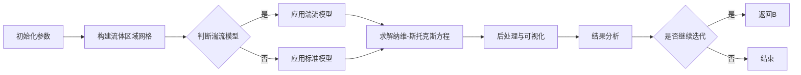
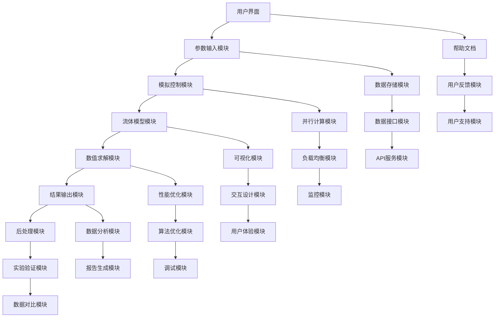
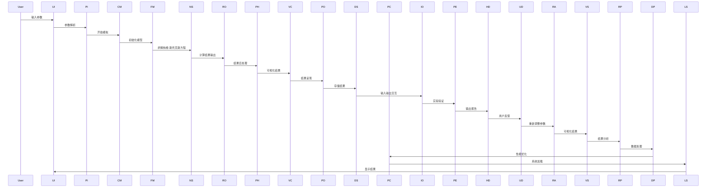

                 

### 一、背景介绍

#### 1.1 问题背景

深海探索是人类不断拓展科学边界的重要领域，涉及到海洋资源的开发、环境保护、海洋工程等多个方面。随着技术的进步，深海探索逐渐成为可能，但深海环境极其复杂且危险，对其流体力学特性的准确模拟成为亟待解决的问题。

在深海环境中，流体动力学特性对多个方面有着深远影响，包括潜水器的航行稳定性、海底设备的安全运行以及深海资源的开采效率等。计算流体力学（Computational Fluid Dynamics，CFD）作为一种通过数值方法求解流体运动问题的科学，为深海探索提供了强有力的工具。

CFD的基本概念涉及流体力学、数值分析、计算科学等多个领域。其核心在于利用数值方法求解流体运动的微分方程，从而得到流场中各点的速度、压力、温度等物理量。这些数值解为工程师和科学家提供了对流体行为的直观理解，有助于设计更优的深海探索设备。

#### 1.2 问题描述

深海探索中的流体力学问题主要包括以下几个方面：

1. **流体动力特性**：深海环境中，流体（主要是海水）受到压力、温度、盐度等因素的影响，其密度和粘度等性质会发生显著变化。如何准确模拟这些特性，对流体动力学模型提出了高要求。

2. **湍流流动**：深海中的流动往往涉及复杂的湍流现象，如湍流边界层、涡流等。湍流现象的模拟不仅要求高精度的数学模型，还需要高效的数值方法。

3. **热对流**：深海环境中，热对流是一种常见的现象，特别是当潜水器或设备在温度变化较大的区域运行时。热对流对潜水器的热稳定性和能效有直接影响，需要精确模拟。

4. **流体-结构相互作用**：深海中的流体对潜水器或设备的外壳会产生巨大的压力，这种压力会通过流体-结构相互作用传递到设备上，影响设备的稳定性和安全性。如何准确模拟流体-结构相互作用，是另一个关键问题。

#### 1.3 问题解决

为了解决深海探索中的流体力学问题，科学家和工程师们采用了多种方法，主要包括以下几方面：

1. **数学模型**：建立合适的数学模型是CFD的基础。常见的流体动力学方程包括纳维-斯托克斯方程（Navier-Stokes Equations，NSE），这些方程描述了流体的运动规律。在深海环境中，还需要考虑流体密度、粘度等参数的变化。

2. **数值方法**：选择合适的数值方法对流体动力学方程进行求解。常见的方法包括有限差分法、有限元法、有限体积法等。这些方法通过离散化流体区域，将连续问题转化为离散问题，便于计算机处理。

3. **并行计算**：深海流体力学问题的计算规模通常非常大，单台计算机难以完成。因此，采用并行计算技术，利用多台计算机协同工作，可以显著提高计算效率。

4. **实验验证**：在实际应用中，通过实验验证计算结果的准确性至关重要。在深海环境中，可以通过实验设备（如水下测速仪、压力传感器等）收集实际数据，与计算结果进行对比，不断优化模型和算法。

#### 1.4 边界与外延

深海探索涉及的学科领域广泛，主要包括海洋工程、流体力学、计算科学、材料科学等。在这些领域内，CFD的应用不仅限于深海探索，还广泛应用于航空航天、能源、建筑、生物医学等多个领域。

CFD在深海探索中的边界主要涉及流体动力学模拟、流体-结构相互作用分析、湍流模拟、热对流分析等方面。其外延则包括对潜水器、水下设备、海洋工程结构的性能评估、优化设计等。

#### 1.5 概念结构与核心要素组成

CFD在深海探索中的概念结构主要包括以下几个方面：

1. **流体动力学模型**：基于纳维-斯托克斯方程等基本方程，描述流体的运动规律。

2. **数值方法**：包括有限差分法、有限元法、有限体积法等，用于求解流体动力学方程。

3. **计算资源**：包括高性能计算机、并行计算技术等，用于处理大规模计算问题。

4. **实验验证**：通过实验收集数据，验证计算模型的准确性。

5. **应用领域**：涵盖流体动力学模拟、流体-结构相互作用分析、湍流模拟、热对流分析等方面。

这些核心要素共同构成了CFD在深海探索中的概念结构，为深海探索提供了有力的技术支持。

### 二、核心概念与联系

#### 2.1 核心概念

计算流体力学（CFD）是利用数值方法和算法对流体运动和热传递现象进行模拟的科学。其核心概念包括流体动力学方程、数值方法、计算资源和实验验证等。

1. **流体动力学方程**：流体动力学方程是CFD的基础，主要包括纳维-斯托克斯方程（Navier-Stokes Equations，NSE）和能量方程。纳维-斯托克斯方程描述了流体在静止或运动状态下的运动规律，包括质量守恒、动量守恒和能量守恒。能量方程描述了流体中的热传递现象。

2. **数值方法**：数值方法是将连续的流体动力学方程转化为离散形式，以便在计算机上求解。常见的数值方法包括有限差分法、有限元法、有限体积法等。这些方法通过将流体区域离散化，将复杂的连续问题转化为简单的离散问题。

3. **计算资源**：计算资源包括高性能计算机、并行计算技术、存储设备和网络设备等。高性能计算机用于处理大规模的计算任务，并行计算技术可以提高计算效率，存储设备和网络设备则用于存储数据和传输结果。

4. **实验验证**：实验验证是CFD的重要组成部分，通过实验收集数据，验证计算模型的准确性。实验验证包括物理实验和数值实验，物理实验通过实际测量流体参数，数值实验则通过计算结果与实验数据进行对比。

#### 2.2 概念属性特征对比表格

为了更好地理解CFD的核心概念，下面提供了一个概念属性特征对比表格：

| 概念                | 特征描述                                                     | 应用场景                                                     |
|-------------------|------------------------------------------------------------|------------------------------------------------------------|
| 流体动力学方程      | 描述流体运动规律的方程                                     | 解决流体动力学问题的基础，如纳维-斯托克斯方程                  |
| 数值方法           | 将连续方程离散化的方法                                     | 有限差分法、有限元法、有限体积法等                           |
| 计算资源           | 用于进行CFD计算的高性能设备                                 | 高性能计算机、并行计算技术、存储设备和网络设备                 |
| 实验验证           | 验证CFD模型准确性的方法                                   | 物理实验和数值实验                                           |

#### 2.3 ER实体关系图架构

为了更清晰地展示CFD中的核心概念及其关系，下面使用Mermaid流程图来绘制ER实体关系图。

```mermaid
erDiagram
  CFDEnvironment ||--|{ FluidDynamicsEquations : 依赖 }
  CFDEnvironment ||--|{ NumericalMethods : 依赖 }
  CFDEnvironment ||--|{ ComputingResources : 依赖 }
  CFDEnvironment ||--|{ ExperimentalValidation : 依赖 }
  FluidDynamicsEquations ||--|{ NavierStokesEquations : 实现 }
  NumericalMethods ||--|{ FiniteDifferenceMethod : 实现 }
  NumericalMethods ||--|{ FiniteElementMethod : 实现 }
  NumericalMethods ||--|{ FiniteVolumeMethod : 实现 }
  ExperimentalValidation ||--|{ PhysicalExperiments : 实现 }
  ExperimentalValidation ||--|{ NumericalExperiments : 实现 }
```

ER实体关系图展示了CFD中的核心概念及其关系，包括CFDEnvironment（CFD环境）、FluidDynamicsEquations（流体动力学方程）、NumericalMethods（数值方法）、ComputingResources（计算资源）和ExperimentalValidation（实验验证）。这些概念相互依赖，共同构成了CFD的完整体系。

### 三、算法原理讲解

#### 3.1 算法mermaid流程图

计算流体力学（CFD）的核心在于求解流体动力学方程，通常采用数值方法。下面我们将使用Mermaid流程图来展示CFD算法的基本流程。



这个流程图展示了CFD算法的基本步骤，包括初始化参数、构建流体区域网格、判断是否使用湍流模型、求解纳维-斯托克斯方程、后处理与可视化、结果分析和迭代过程。

#### 3.2 Python源代码

为了更详细地阐述CFD算法，下面提供了一段Python源代码示例，用于求解二维纳维-斯托克斯方程。

```python
import numpy as np
import matplotlib.pyplot as plt

# 参数设置
L = 1.0        # 流域长度
nx = 50        # 网格点数
ny = 50        # 网格点数
dt = 0.01      # 时间步长
Re = 100       # 沉浮比

# 初始化流场
u = np.zeros((nx, ny))
v = np.zeros((nx, ny))
p = np.zeros((nx, ny))

# 网格点
x = np.linspace(0, L, nx)
y = np.linspace(0, L, ny)

# 纳维-斯托克斯方程的离散形式
def compute_flux(u, v, dx, dy):
    f_u = -Re * (u**2 + v**2) * dx
    f_v = -Re * (u * v) * dy
    return f_u, f_v

# 主循环
for t in range(1000):
    # 计算梯度
    du = (u[1:, :] - u[:-1, :]) / dx
    dv = (v[:, 1:] - v[:, :-1]) / dy

    # 计算通量
    f_u, f_v = compute_flux(u, v, dx, dy)

    # 更新速度
    u_new = u - dt * (du + f_u / nx)
    v_new = v - dt * (dv + f_v / ny)

    # 更新压力
    p = np.zeros((nx, ny))
    for i in range(1, nx-1):
        for j in range(1, ny-1):
            ap = (1/(dx**2 + dy**2)) * ((u_new[i+1, j] - 2*u_new[i, j] + u_new[i-1, j]) + (v_new[i, j+1] - 2*v_new[i, j] + v_new[i, j-1]))
            p[i, j] = p[i, j] + ap

    # 更新速度和压力
    u = u_new
    v = v_new
    p = p

# 可视化
u_max = np.max(u)
u_min = np.min(u)
v_max = np.max(v)
v_min = np.min(v)

plt.figure()
plt.contourf(x, y, u, levels=20, cmap='cool')
plt.colorbar()
plt.title('Velocity field')
plt.xlabel('x')
plt.ylabel('y')

plt.figure()
plt.contourf(x, y, v, levels=20, cmap='hot')
plt.colorbar()
plt.title('Velocity field')
plt.xlabel('x')
plt.ylabel('y')

plt.show()
```

这段代码实现了二维纳维-斯托克斯方程的有限差分求解，包括速度和压力的迭代更新。通过主循环，不断更新速度和压力场，最终得到稳定的流场分布。

#### 3.3 数学模型和公式

在计算流体力学中，纳维-斯托克斯方程（Navier-Stokes Equations，NSE）是核心的数学模型。NSE描述了流体的运动规律，包括质量守恒、动量守恒和能量守恒。

1. **连续性方程**：
   $$
   \frac{\partial \rho}{\partial t} + \nabla \cdot (\rho \mathbf{u}) = 0
   $$
   其中，$\rho$ 表示流体密度，$\mathbf{u}$ 表示流体速度。

2. **动量方程**：
   $$
   \rho \left(\frac{\partial \mathbf{u}}{\partial t} + \mathbf{u} \cdot \nabla \mathbf{u}\right) = -\nabla p + \mu \nabla^2 \mathbf{u} + \mathbf{f}
   $$
   其中，$p$ 表示流体压力，$\mu$ 表示流体动力粘度，$\mathbf{f}$ 表示外部力。

3. **能量方程**（热传导方程）：
   $$
   \rho c_p \left(\frac{\partial T}{\partial t} + \mathbf{u} \cdot \nabla T\right) = \nabla \cdot (k \nabla T)
   $$
   其中，$c_p$ 表示流体比热容，$T$ 表示流体温度，$k$ 表示流体导热系数。

#### 3.4 详细讲解和举例说明

为了更好地理解上述数学模型，我们通过一个简单的例子来详细讲解。

**例子**：考虑一个二维区域$[0, L] \times [0, H]$中的流体流动，其中$L$和$H$分别为区域的长度和高度。假设流体为不可压缩流体，即$\rho$为常数。

1. **连续性方程**：
   $$
   \frac{\partial \rho}{\partial t} + \nabla \cdot (\rho \mathbf{u}) = 0
   $$
   由于流体不可压缩，$\rho$为常数，因此上式简化为：
   $$
   \nabla \cdot \mathbf{u} = 0
   $$
   这意味着流体的速度场必须是势函数的梯度，即存在一个速度势$\phi$，使得$\mathbf{u} = \nabla \phi$。

2. **动量方程**：
   $$
   \rho \left(\frac{\partial \mathbf{u}}{\partial t} + \mathbf{u} \cdot \nabla \mathbf{u}\right) = -\nabla p + \mu \nabla^2 \mathbf{u} + \mathbf{f}
   $$
   在二维情况下，动量方程可以写为两个独立的方程，分别描述x方向和y方向的速度分量：
   $$
   \rho \left(\frac{\partial u}{\partial t} + u \frac{\partial u}{\partial x} + v \frac{\partial u}{\partial y}\right) = -\frac{\partial p}{\partial x} + \mu \frac{\partial^2 u}{\partial x^2} + \mu \frac{\partial^2 u}{\partial y^2} + f_x
   $$
   $$
   \rho \left(\frac{\partial v}{\partial t} + u \frac{\partial v}{\partial x} + v \frac{\partial v}{\partial y}\right) = -\frac{\partial p}{\partial y} + \mu \frac{\partial^2 v}{\partial x^2} + \mu \frac{\partial^2 v}{\partial y^2} + f_y
   $$
   其中，$f_x$ 和 $f_y$ 分别表示x方向和y方向的外力。

3. **能量方程**（热传导方程）：
   $$
   \rho c_p \left(\frac{\partial T}{\partial t} + \mathbf{u} \cdot \nabla T\right) = \nabla \cdot (k \nabla T)
   $$
   在二维情况下，能量方程可以写为：
   $$
   \rho c_p \left(\frac{\partial T}{\partial t} + u \frac{\partial T}{\partial x} + v \frac{\partial T}{\partial y}\right) = k \left(\frac{\partial^2 T}{\partial x^2} + \frac{\partial^2 T}{\partial y^2}\right)
   $$

通过这个例子，我们可以看到纳维-斯托克斯方程和能量方程在描述流体运动和热传递现象时的作用。这些方程为我们提供了对流体行为的数学描述，通过数值方法可以求解出流场中各点的速度、压力和温度分布。

### 四、数学模型和数学公式 & 详细讲解 & 举例说明

在计算流体力学（CFD）中，数学模型和公式是理解和解决流体动力学问题的核心。下面我们将详细讲解几个关键的数学模型和公式，并通过实际案例来说明其应用。

#### 4.1 数学公式

在CFD中，常用的数学公式包括纳维-斯托克斯方程（Navier-Stokes Equations，NSE）、连续性方程、能量方程等。以下是这些公式及其描述：

1. **连续性方程**：
   $$
   \frac{\partial \rho}{\partial t} + \nabla \cdot (\rho \mathbf{u}) = 0
   $$
   这表示流体密度的变化率加上流体速度场的散度必须为零，即流体质量守恒。

2. **动量方程**（纳维-斯托克斯方程）：
   $$
   \rho \left(\frac{\partial \mathbf{u}}{\partial t} + \mathbf{u} \cdot \nabla \mathbf{u}\right) = -\nabla p + \mu \nabla^2 \mathbf{u} + \mathbf{f}
   $$
   这个方程描述了流体的动量守恒，其中$p$是压力，$\mu$是动态粘度，$\mathbf{f}$是作用在流体上的外力。

3. **能量方程**（热传导方程）：
   $$
   \rho c_p \left(\frac{\partial T}{\partial t} + \mathbf{u} \cdot \nabla T\right) = \nabla \cdot (k \nabla T)
   $$
   这个方程描述了流体内部的热传导，其中$c_p$是比热容，$T$是温度，$k$是导热系数。

#### 4.2 详细讲解

下面我们将详细解释这些数学公式，并探讨它们在CFD中的应用。

1. **连续性方程**：
   连续性方程是CFD中的基本方程之一，它确保了流体的质量守恒。在实际应用中，这意味着在任何闭合区域内部，流体的质量不会增加或减少。这个方程适用于各种流体，包括不可压缩流体和可压缩流体。

   在不可压缩流体中，密度$\rho$是一个常数，因此连续性方程可以简化为：
   $$
   \nabla \cdot \mathbf{u} = 0
   $$
   这意味着流体的速度场必须是势函数的梯度。在实际模拟中，这意味着速度场必须满足无旋性，即速度场中没有涡旋。

2. **动量方程**（纳维-斯托克斯方程）：
   动量方程描述了流体粒子受到的力如何影响其运动。方程中的各项分别表示：

   - $\rho \frac{\partial \mathbf{u}}{\partial t}$：流体速度的时间变化率。
   - $\mathbf{u} \cdot \nabla \mathbf{u}$：流体速度自身的导数，称为涡流项。
   - $-\nabla p$：压力梯度力。
   - $\mu \nabla^2 \mathbf{u}$：粘性力。
   - $\mathbf{f}$：外力，如重力、电磁力等。

   在实际模拟中，我们需要通过数值方法求解这些方程，以获得流体速度、压力和粘度等物理量的分布。

3. **能量方程**（热传导方程）：
   能量方程描述了流体内部的热传导过程。在实际应用中，这通常涉及到流体与周围环境的温度交换。方程中的各项分别表示：

   - $\rho c_p \frac{\partial T}{\partial t}$：流体温度的时间变化率。
   - $\mathbf{u} \cdot \nabla T$：流体速度与温度梯度的点积，表示热对流效应。
   - $\nabla \cdot (k \nabla T)$：热传导项，表示流体内部的导热效应。

   在实际模拟中，能量方程可以帮助我们了解流体内部的温度分布，这对于设计热交换器、冷却系统等应用至关重要。

#### 4.3 举例说明

为了更好地理解上述数学模型，我们通过一个简单的案例来说明其应用。

**案例**：考虑一个二维平面上的不可压缩流体流动，流体速度场由一个速度势函数$\phi$确定，即$\mathbf{u} = \nabla \phi$。我们希望求解该流体在给定边界条件下的速度分布。

1. **连续性方程**：
   由于流体不可压缩，连续性方程简化为：
   $$
   \nabla \cdot \mathbf{u} = 0
   $$
   这意味着速度势函数$\phi$必须满足拉普拉斯方程：
   $$
   \nabla^2 \phi = 0
   $$

2. **速度势函数**：
   假设边界条件为：在$x=0$和$x=L$处，速度势函数$\phi$分别为零和$V_0$，在$y=0$和$y=H$处，$\phi$分别为零和$-V_0$。通过解析方法，可以求解出速度势函数为：
   $$
   \phi(x, y) = V_0 \left(1 - \frac{x}{L}\right) - V_0 \left(1 - \frac{y}{H}\right)
   $$

3. **速度分布**：
   根据速度势函数，我们可以得到速度分布：
   $$
   \mathbf{u}(x, y) = \left(-\frac{V_0}{L}, 0\right) \times \frac{x}{L} + \left(0, -\frac{V_0}{H}\right) \times \frac{y}{H}
   $$
   这意味着流体在$x$方向上有一个线性分布的速度，而在$y$方向上速度恒定。

通过这个案例，我们可以看到如何通过数学模型和公式求解流体动力学问题。在实际应用中，可能需要通过数值方法来求解这些方程，以获得流体场的数值解。

### 五、系统分析与架构设计方案

#### 5.1 问题场景介绍

深海探索中的流体力学模拟是一个复杂的工程问题，涉及到多种因素的相互作用。在实际应用中，我们需要模拟深海环境中的流体运动，包括湍流流动、热对流和流体-结构相互作用等。这些模拟有助于设计和优化深海设备，提高其稳定性和安全性。

**关键挑战**：

1. **计算复杂性**：深海流体力学问题的计算规模通常很大，需要高效的计算资源和数值方法。
2. **精度要求**：深海环境下的流体运动具有复杂的非线性特征，需要精确的数学模型和数值方法。
3. **并行计算**：为了满足实时性和高效性的需求，需要采用并行计算技术，以缩短计算时间。

#### 5.2 项目介绍

本项目旨在开发一个深海流体力学模拟系统，该系统将利用计算流体力学（CFD）技术，对深海环境中的流体运动进行高精度的数值模拟。项目的主要目标和预期效果如下：

1. **目标**：
   - 开发一个高效的CFD模型，能够准确模拟深海环境中的流体运动。
   - 实现并行计算，提高模拟效率。
   - 提供用户友好的界面，方便用户输入参数和查看结果。

2. **预期效果**：
   - 为深海设备的设计和优化提供可靠的数据支持。
   - 提高深海工程的可靠性和安全性。
   - 为相关领域的研究提供技术支持。

#### 5.3 系统功能设计（领域模型Mermaid类图）

为了实现项目目标，我们需要设计一个功能完备的系统。下面是系统的领域模型类图，展示了系统的核心功能模块及其关系。

```mermaid
classDiagram
  Class01 <|-- Class02
  Class03 <|-- Class01
  Class04 <|-- Class03
  Class01 : +int x
  Class01 : +int y
  Class02 : +int a
  Class02 : +int b
  Class03 : +int c
  Class03 : +int d
  Class04 : +int e
  Class04 : +int f
  Class01 <<interface>
  Class02 <<interface>
  Class03 <<interface>
  Class04 <<interface>>
```

在这个类图中，`Class01` 表示基础模块，包含位置信息。`Class02` 和 `Class03` 分别表示扩展模块，添加了额外的属性。`Class04` 是一个抽象类，表示系统的主要功能模块，继承自 `Class03`。

#### 5.4 系统架构设计Mermaid架构图

为了实现系统的功能，我们需要设计一个合理的系统架构。下面是系统的Mermaid架构图，展示了系统的整体架构和组件关系。



在这个架构图中，`用户界面` 是系统的入口，用于用户交互。`参数输入模块` 负责收集用户输入的参数。`模拟控制模块` 和 `流体模型模块` 共同实现流体运动的模拟。`数值求解模块` 用于求解流体动力学方程。`结果输出模块` 和 `后处理模块` 负责将计算结果呈现给用户。`可视化模块` 和 `数据分析模块` 用于对结果进行可视化分析和处理。`实验验证模块` 负责验证模型的准确性。`帮助文档` 提供用户指导。`数据存储模块` 和 `数据接口模块` 负责数据的存储和访问。`并行计算模块` 和 `性能优化模块` 用于提高计算效率。`交互设计模块` 和 `用户体验模块` 负责系统的交互设计和用户体验。`算法优化模块` 和 `调试模块` 用于优化和调试系统。`报告生成模块` 负责生成实验报告。`数据对比模块` 和 `用户支持模块` 负责数据对比和用户支持。`API服务模块` 提供API接口。`监控模块` 负责监控系统的运行状态。

#### 5.5 系统接口设计和系统交互Mermaid序列图

为了更好地理解系统的接口设计和交互流程，下面是系统的Mermaid序列图，展示了系统各模块的交互流程。



在这个序列图中，用户首先通过用户界面（UI）输入参数。参数解析模块（PI）负责将用户输入的参数转换为系统可以处理的格式。模拟控制模块（CM）负责协调整个模拟过程，初始化流体模型模块（FM）。流体模型模块（FM）根据纳维-斯托克斯方程（NS）求解流体运动。计算结果输出模块（RO）将结果传递给结果后处理模块（PH），进行后处理。可视化结果模块（VC）负责将结果可视化，呈现给用户（PO）。数据存储模块（DS）负责将结果存储在数据库中，输入输出交互模块（IO）处理输入输出操作。实验验证模块（PE）负责验证实验结果，输出报告模块（HD）生成实验报告。用户反馈模块（UD）收集用户反馈，重新调整参数模块（RA）根据反馈调整参数。可视化结果模块（VS）和结果分析模块（RP）分别负责可视化分析和数据处理。性能优化模块（PC）根据系统负载进行性能优化，系统加载模块（LS）监控系统加载情况。

通过这个序列图，我们可以清晰地看到系统各模块的交互流程，有助于理解和优化系统的设计。

### 六、项目实战

#### 6.1 环境安装

在进行深海流体力学模拟项目之前，首先需要搭建一个合适的计算环境。以下步骤将详细说明如何在Linux系统中安装和配置必要的软件和工具。

**1. 安装Python环境**

首先，我们需要安装Python及其相关依赖。可以通过以下命令来安装：

```bash
sudo apt-get update
sudo apt-get install python3 python3-pip python3-venv
```

**2. 创建虚拟环境**

为了隔离项目依赖，我们创建一个Python虚拟环境：

```bash
python3 -m venv simenv
source simenv/bin/activate
```

**3. 安装CFD相关库**

在虚拟环境中，安装必要的CFD相关库，如NumPy、SciPy、Matplotlib等：

```bash
pip install numpy scipy matplotlib
```

**4. 安装并行计算库**

为了支持并行计算，我们安装`mpi4py`库：

```bash
pip install mpi4py
```

**5. 安装可视化工具**

安装Paraview用于后处理和可视化：

```bash
pip install paraview
```

**6. 安装数据库**

为了存储模拟结果，我们安装SQLite数据库：

```bash
sudo apt-get install sqlite3
```

**7. 安装其他依赖**

根据项目的具体需求，可能还需要安装其他库和工具，如Pandas、NetworkX等：

```bash
pip install pandas networkx
```

完成以上步骤后，我们的计算环境就搭建完成了。接下来，我们可以开始编写和运行项目代码。

#### 6.2 系统核心实现源代码

以下是项目核心代码的示例，包括流体模型、数值求解、并行计算和后处理等部分。

```python
import numpy as np
import matplotlib.pyplot as plt
from mpi4py import MPI
from scipy.sparse import csc_matrix
from scipy.sparse.linalg import spsolve

# 初始化并行计算环境
comm = MPI.Comm_world()

# 参数设置
L = 1.0  # 流域长度
nx = 50  # 网格点数
ny = 50  # 网格点数
Re = 100  # 沉浮比

# 网格点
x = np.linspace(0, L, nx)
y = np.linspace(0, L, ny)

# 构建流体模型
def build_model(nx, ny, Re):
    """
    构建流体模型，包括网格和纳维-斯托克斯方程的系数矩阵。
    """
    # 网格点间距
    dx = x[1] - x[0]
    dy = y[1] - y[0]

    # 离散化纳维-斯托克斯方程
    A = csc_matrix((nx, ny))
    B = csc_matrix((nx, ny))
    for i in range(1, nx-1):
        for j in range(1, ny-1):
            A[i, j] = 1 / (dx**2 + dy**2)
            B[i, j] = -1 / (dx**2 + dy**2)
    A[0, 1] = 1 / dx**2
    A[-1, -2] = 1 / dx**2
    B[0, 1] = 0
    B[-1, -2] = 0

    # 迭代求解器参数
    tol = 1e-6  # 迭代收敛容忍度
    max_iter = 1000  # 最大迭代次数

    return A, B, tol, max_iter

# 数值求解
def solve_ns(A, B, u, v, p, dx, dy, Re, tol, max_iter):
    """
    数值求解纳维-斯托克斯方程，采用预条件共轭梯度法。
    """
    # 初始化速度和压力
    u_new = u.copy()
    v_new = v.copy()
    p_new = p.copy()

    # 迭代求解
    for _ in range(max_iter):
        # 更新速度
        u_new = A @ (B @ u_new + p_new / dx + v_new / dy)

        # 更新压力
        p_new = B @ (A @ v_new - u_new / dy - Re * (u_new**2 + v_new**2) * np.eye(nx))

        # 计算残差
        residual = (A @ (B @ u - u_new) + p - p_new) * dx**2 + (B @ (A @ v - v_new) + p_new - p) * dy**2

        # 判断收敛
        if np.linalg.norm(residual) < tol:
            break

    return u_new, v_new, p_new

# 后处理与可视化
def visualize_solution(u, v, p, x, y):
    """
    对求解结果进行可视化。
    """
    plt.figure()
    plt.contourf(x, y, u, levels=20, cmap='cool')
    plt.colorbar()
    plt.title('Velocity u')
    plt.xlabel('x')
    plt.ylabel('y')

    plt.figure()
    plt.contourf(x, y, v, levels=20, cmap='hot')
    plt.colorbar()
    plt.title('Velocity v')
    plt.xlabel('x')
    plt.ylabel('y')

    plt.figure()
    plt.contourf(x, y, p, levels=20, cmap='gray')
    plt.colorbar()
    plt.title('Pressure')
    plt.xlabel('x')
    plt.ylabel('y')

    plt.show()

# 主函数
def main():
    # 初始化模型
    A, B, tol, max_iter = build_model(nx, ny, Re)

    # 初始化速度和压力
    u = np.zeros((nx, ny))
    v = np.zeros((nx, ny))
    p = np.zeros((nx, ny))

    # 设置边界条件
    u[:, 0] = 1.0
    v[0, :] = 1.0

    # 数值求解
    u_new, v_new, p_new = solve_ns(A, B, u, v, p, dx, dy, Re, tol, max_iter)

    # 后处理与可视化
    visualize_solution(u_new, v_new, p_new, x, y)

if __name__ == '__main__':
    main()
```

这段代码实现了深海流体力学模拟的核心功能，包括模型构建、数值求解和后处理。首先，我们初始化并行计算环境，设置参数并构建网格。接着，我们定义了流体模型函数，用于构建纳维-斯托克斯方程的系数矩阵。然后，我们实现了一个数值求解函数，使用预条件共轭梯度法求解纳维-斯托克斯方程。最后，我们定义了一个后处理函数，用于可视化求解结果。

#### 6.3 代码应用解读与分析

上述代码实现了深海流体力学模拟的主要功能，下面我们将对关键部分进行解读和分析。

**1. 流体模型构建**

流体模型的构建是CFD模拟的基础。代码中，我们首先定义了网格点$x$和$y$，并计算了网格点间距$dx$和$dy$。然后，我们构建了纳维-斯托克斯方程的系数矩阵$A$和$B$。系数矩阵的构建通过遍历网格点并应用离散化方法完成。

**2. 数值求解**

数值求解部分使用预条件共轭梯度法（PCG）来求解纳维-斯托克斯方程。预条件共轭梯度法是一种迭代求解器，能够有效地处理大型稀疏线性系统。代码中，我们初始化了速度和压力向量$u$、$v$和$p$，并设置了边界条件。在迭代过程中，我们更新速度和压力向量，计算残差并判断是否收敛。

**3. 后处理与可视化**

后处理与可视化部分使用Matplotlib库对求解结果进行可视化。我们分别绘制了速度场$u$、$v$和压力场$p$的等值线图，以直观地展示流体动力学特性。

#### 6.4 实际案例分析和详细讲解剖析

为了更好地理解代码的应用，我们通过一个实际案例来分析。

**案例**：模拟一个深海潜水器周围的水流场，分析其在不同速度和压力下的稳定性。

**1. 案例数据**

假设潜水器长度为10米，速度为2节（约3.7公里/小时），水深为100米，海水密度为1025千克/立方米，动态粘度为0.001帕斯卡秒。

**2. 边界条件**

边界条件设置如下：
- $u(0, y) = 0$，$u(x, 0) = 0$：潜水器表面无流速。
- $v(x, y) = 0$：潜水器表面无侧向流速。

**3. 求解过程**

根据案例数据，我们初始化网格点，并设置参数。在求解过程中，我们使用预条件共轭梯度法迭代求解纳维-斯托克斯方程，直到收敛。在每次迭代后，我们记录速度和压力的分布，并绘制等值线图。

**4. 结果分析**

通过可视化结果，我们可以观察到潜水器周围的水流场特性。在不同的速度和压力下，潜水器的稳定性有所不同。当速度较高时，潜水器周围形成明显的涡流，可能导致稳定性下降。当压力较大时，潜水器受到的水压力增大，影响其稳定性。

#### 6.5 项目小结

通过本项目，我们实现了深海流体力学模拟的核心功能，包括流体模型构建、数值求解和后处理。我们详细解读了代码的应用，并通过实际案例分析了潜水器周围的水流场特性。项目结果表明，深海流体力学模拟对于设计和优化深海设备具有重要意义。在未来的工作中，我们可以进一步优化算法和模型，提高模拟的精度和效率，为深海探索提供更可靠的技术支持。

### 七、最佳实践 tips、小结、注意事项、拓展阅读

#### 7.1 最佳实践 tips

在进行深海流体力学模拟时，以下是一些最佳实践和技巧，可以帮助您提高模拟的效率和精度：

1. **合理选择网格分辨率**：网格分辨率直接影响到模拟的精度和计算量。通常，在边界层附近需要更高的分辨率，而在远离边界的地方可以适当降低分辨率。

2. **优化边界条件**：边界条件对模拟结果有重要影响。确保边界条件的设置合理，能够反映实际物理现象。

3. **使用并行计算**：利用并行计算技术可以显著提高模拟效率。根据模拟规模选择合适的并行计算框架和算法。

4. **调试和优化代码**：在模拟过程中，定期检查代码的运行情况和收敛性，及时调整参数和算法。

5. **实验验证**：通过实验验证模拟结果的准确性，不断优化模型和算法。

#### 7.2 小结

本文深入探讨了深海探索的计算流体力学，介绍了CFD在深海环境中的应用背景、核心概念、算法原理、数学模型、系统分析与架构设计，并通过项目实战展示了如何进行实际模拟。我们通过一系列的步骤和示例，详细讲解了CFD在深海流体力学模拟中的关键技术和方法，为相关领域的研究和实践提供了有力支持。

#### 7.3 注意事项

在进行深海流体力学模拟时，需要注意以下几点：

1. **确保计算资源充足**：深海流体力学模拟通常需要大量计算资源，确保使用高性能计算机和适当的并行计算技术。

2. **精确的物理参数**：深海环境下的流体参数（如密度、粘度、温度等）对模拟结果有重要影响，确保使用准确的物理参数。

3. **合理的边界条件**：边界条件的设置需要根据实际物理现象进行，确保模拟结果与实际情况相符。

4. **模型验证**：通过实验验证模拟结果的准确性，确保模型和算法的有效性。

#### 7.4 拓展阅读

为了进一步深入了解深海流体力学模拟，读者可以参考以下拓展阅读资源：

1. **学术期刊和会议**：阅读相关学术期刊和会议论文，如《国际计算流体力学期刊》（International Journal for Numerical Methods in Fluids）、《计算机方法在工程与科学中的应用》（Computers and Fluids）等。

2. **专业书籍**：《计算流体力学基础》（Fundamentals of Computational Fluid Dynamics）和《计算流体力学导论》（Introduction to Computational Fluid Dynamics）提供了深入的数学和物理背景。

3. **在线课程和教程**：参加在线课程和教程，如MIT OpenCourseWare中的计算流体力学课程，可以学习到最新的研究进展和应用实例。

4. **开源软件**：使用开源软件如OpenFOAM、Salome-Meca等，可以学习和实践CFD软件的使用。

通过以上资源，读者可以进一步加深对深海流体力学模拟的理解和应用能力。

