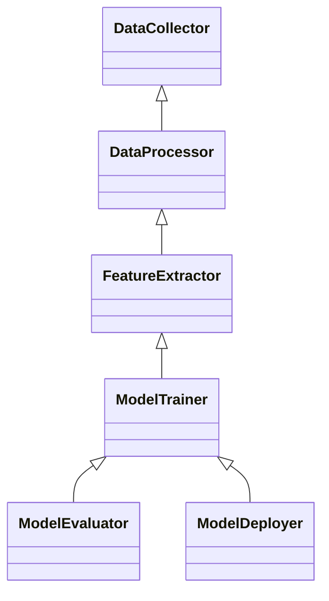
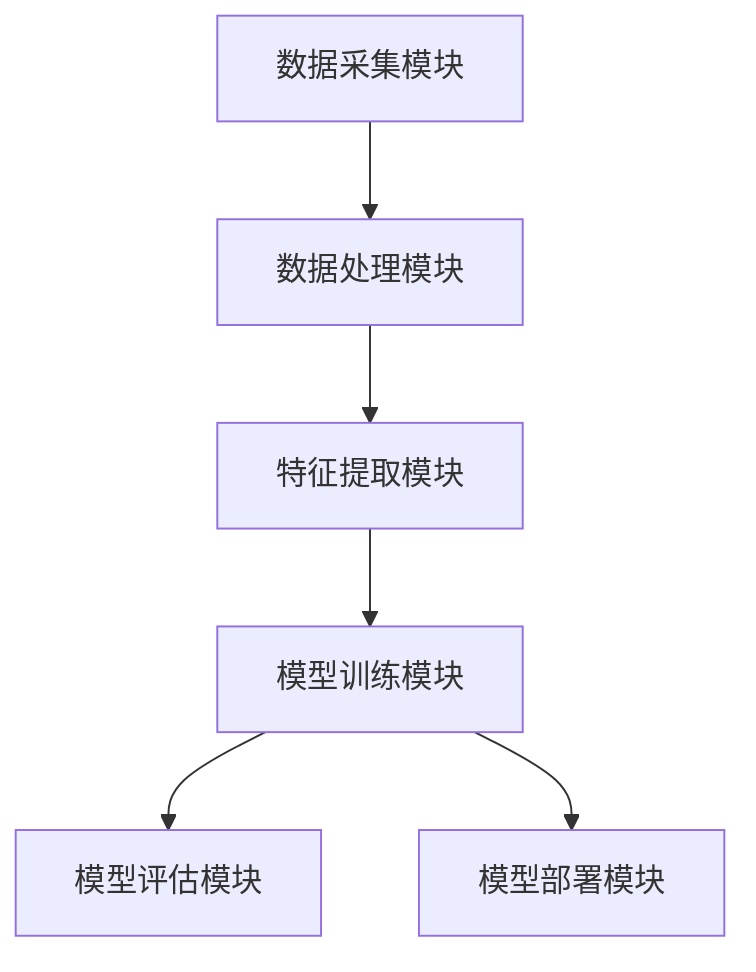
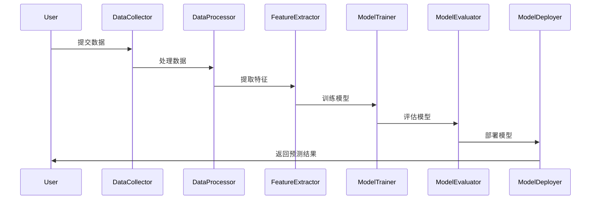

                 


### 犯罪预防的机器学习：社会安全的数学工具

> 关键词：犯罪预防、机器学习、社会安全、犯罪预测

> 摘要：本文将深入探讨机器学习在犯罪预防中的应用，通过社会安全的数学工具，分析犯罪预测模型的原理、构建过程以及评估方法，最后通过实际案例，展示机器学习如何提升犯罪预防的效率。

#### 第一部分：犯罪预防的背景与问题阐述

##### 第1章：犯罪预防的重要性与挑战

犯罪预防是维护社会安全和稳定的关键手段。随着社会的不断发展，犯罪形式和手段也在不断变化，传统的人为干预方式已经难以满足现代社会的需求。机器学习作为一种先进的数据分析方法，在犯罪预防领域展现出了巨大的潜力。

**1.1 犯罪预防概述**

犯罪预防指的是通过一系列措施来预防犯罪行为的发生。这些措施包括但不限于法律、教育、心理干预、社会服务等。犯罪预防的目标是减少犯罪率，保护公民的生命财产安全，维护社会的和谐稳定。

**1.2 犯罪预防面临的挑战**

犯罪预防面临的主要挑战有：

- **犯罪形式的复杂性**：随着科技的发展，犯罪手段越来越多样化和隐蔽化，传统的方法难以应对。
- **数据信息的复杂性**：犯罪数据量巨大，种类繁多，如何从海量数据中提取有价值的信息是一个巨大的挑战。
- **跨部门协作**：犯罪预防需要多个部门之间的协同合作，如公安、法院、检察院等，但各部门之间的信息共享和协作往往不够顺畅。

**1.3 机器学习在犯罪预防中的应用前景**

机器学习在犯罪预防中的应用前景十分广阔。通过机器学习算法，可以从海量犯罪数据中挖掘出潜在的犯罪模式，预测犯罪行为，从而采取有效的预防措施。具体来说，机器学习在犯罪预防中的应用主要体现在以下几个方面：

- **犯罪预测**：利用历史犯罪数据，通过机器学习算法预测未来可能的犯罪行为。
- **犯罪模式分析**：分析犯罪行为之间的关联性，识别犯罪热点区域和时间段。
- **嫌疑人识别**：通过分析犯罪嫌疑人的特征和行为模式，帮助警方锁定犯罪嫌疑人。
- **风险评估**：对个体或区域进行犯罪风险评估，为公安部门提供决策支持。

#### 第二部分：机器学习基础与犯罪预防

##### 第2章：机器学习基础

**2.1 机器学习概述**

机器学习是人工智能的一个分支，它通过构建和优化数学模型，使计算机能够从数据中自动学习并做出预测或决策。机器学习的基本流程包括数据收集、数据预处理、特征提取、模型选择、模型训练、模型评估和模型优化等环节。

**2.2 常见机器学习算法介绍**

常见的机器学习算法包括监督学习、无监督学习和强化学习。监督学习通过已有的标注数据训练模型，用于预测未知数据的标签；无监督学习不依赖标注数据，主要任务包括聚类和降维；强化学习通过奖励机制不断调整策略，以实现最佳效果。

**2.3 机器学习在犯罪预防中的适用性**

机器学习在犯罪预防中具有以下适用性：

- **高效的数据处理能力**：能够处理大量复杂的犯罪数据，从中提取有价值的信息。
- **自适应性强**：可以通过不断训练和优化模型，适应不断变化的犯罪形式和手段。
- **跨学科应用**：可以结合社会学、心理学等领域的知识，更全面地理解和预测犯罪行为。

#### 第三部分：社会安全的数学工具

##### 第3章：社会安全的数学工具

**3.1 社会安全指标体系构建**

社会安全指标体系的构建是犯罪预测模型的基础。这需要定义一系列指标，用于衡量社会安全的不同方面，如犯罪率、治安状况、公众安全感等。

**3.2 犯罪预测模型建立**

犯罪预测模型的建立主要包括以下步骤：

1. **数据收集**：收集历史犯罪数据，包括犯罪类型、时间、地点、嫌疑人特征等。
2. **数据预处理**：对数据进行清洗、归一化等处理，确保数据质量。
3. **特征提取**：从原始数据中提取对犯罪预测有重要影响的特征。
4. **模型选择**：根据特征和目标，选择合适的机器学习算法。
5. **模型训练**：使用训练数据训练模型，调整模型参数。
6. **模型评估**：使用测试数据评估模型性能，如准确率、召回率等。

**3.3 模型评估与优化**

模型评估是犯罪预测模型构建过程中的关键步骤。通过评估，可以判断模型是否能够有效预测犯罪行为，并根据评估结果对模型进行优化。

- **准确率**：预测为犯罪的行为中，实际为犯罪的比例。
- **召回率**：实际为犯罪的行为中，被预测为犯罪的比例。
- **F1值**：准确率和召回率的调和平均值。

#### 第四部分：机器学习在犯罪预防中的应用案例

##### 第4章：案例研究一：城市犯罪预测与预防

**4.1 案例背景介绍**

本案例研究选取了某大城市作为研究对象，利用机器学习技术预测城市犯罪，为公安部门提供决策支持。

**4.2 数据收集与预处理**

数据收集包括历史犯罪数据、人口数据、经济数据等。数据预处理主要包括数据清洗、归一化、缺失值处理等步骤。

**4.3 模型建立与训练**

选择随机森林算法作为预测模型，使用训练数据训练模型，调整模型参数，以获得最佳预测效果。

**4.4 模型评估与优化**

使用测试数据评估模型性能，如准确率、召回率等，并根据评估结果对模型进行优化。

**4.5 案例总结与反思**

通过本案例研究，展示了机器学习在犯罪预测与预防中的应用效果，同时也指出了一些存在的问题，如数据质量、模型泛化能力等。

##### 第5章：案例研究二：监狱风险评估

**5.1 案例背景介绍**

本案例研究针对监狱中的犯人进行风险评估，以预防犯人逃脱或其他违法行为。

**5.2 数据收集与预处理**

数据收集包括犯人个人信息、犯罪记录、在监狱的表现等。数据预处理主要包括数据清洗、归一化、缺失值处理等步骤。

**5.3 模型建立与训练**

选择逻辑回归算法作为风险评估模型，使用训练数据训练模型，调整模型参数，以获得最佳预测效果。

**5.4 模型评估与优化**

使用测试数据评估模型性能，如准确率、召回率等，并根据评估结果对模型进行优化。

**5.5 案例总结与反思**

通过本案例研究，展示了机器学习在监狱风险评估中的应用效果，同时也指出了一些存在的问题，如数据质量、模型泛化能力等。

#### 第五部分：机器学习在犯罪预防中的未来发展趋势

##### 第6章：机器学习在犯罪预防中的未来应用方向

**6.1 犯罪预测模型的未来发展**

随着技术的进步，犯罪预测模型将越来越精准，能够更好地预测犯罪行为，为犯罪预防提供有力支持。

**6.2 机器学习与其他领域的交叉应用**

机器学习在犯罪预防中的应用不仅限于数据分析，还可以与其他领域如心理学、社会学等交叉应用，提高预测准确性。

**6.3 机器学习在犯罪预防中的伦理与法律问题**

随着机器学习在犯罪预防中的广泛应用，伦理和法律问题也越来越受到关注。如何平衡技术进步与社会伦理、法律规范之间的关系，是未来需要解决的问题。

##### 第7章：结论与展望

**7.1 主要成果总结**

本文通过对犯罪预防的背景、机器学习基础、社会安全的数学工具以及实际应用案例的探讨，展示了机器学习在犯罪预防中的重要地位和广阔前景。

**7.2 存在的不足与改进方向**

尽管机器学习在犯罪预防中取得了显著成果，但仍然存在一些不足，如数据质量、模型泛化能力等，未来需要进一步改进。

**7.3 未来研究方向**

未来研究应重点关注以下几个方面：提高犯罪预测模型的准确性；研究机器学习在犯罪预防中的伦理和法律问题；探索机器学习与其他领域的交叉应用。

**作者：AI天才研究院/AI Genius Institute & 禅与计算机程序设计艺术 /Zen And The Art of Computer Programming**

本文详细探讨了机器学习在犯罪预防中的应用，从背景介绍到算法原理，再到实际应用案例，全面展示了机器学习如何助力犯罪预防。未来，随着技术的不断发展，机器学习在犯罪预防中将发挥更加重要的作用。同时，我们也需要关注技术进步与社会伦理、法律规范之间的关系，确保技术应用的正当性和合理性。

### 系统分析与架构设计方案

#### 问题场景介绍

在当今社会，犯罪预防和犯罪预测已成为公安部门的重要任务。然而，传统的犯罪预测方法往往依赖于经验，难以应对复杂多变的犯罪形势。为了提高犯罪预测的准确性，引入机器学习技术成为一种必然趋势。本系统旨在利用机器学习技术，对历史犯罪数据进行分析，预测未来的犯罪趋势，为公安部门提供决策支持。

#### 项目介绍

本项目名为“智能犯罪预测系统”，主要包括以下几个模块：

- 数据采集模块：负责收集历史犯罪数据、人口数据、经济数据等。
- 数据处理模块：对收集到的数据进行清洗、归一化等预处理。
- 特征提取模块：从预处理后的数据中提取对犯罪预测有重要影响的特征。
- 模型训练模块：选择合适的机器学习算法，对特征进行训练。
- 模型评估模块：使用测试数据评估模型性能，如准确率、召回率等。
- 模型部署模块：将训练好的模型部署到生产环境，进行实时犯罪预测。

#### 系统功能设计（领域模型Mermaid类图）



#### 系统架构设计（Mermaid架构图）



#### 系统接口设计和系统交互（Mermaid序列图）



### 项目实战

#### 环境安装

1. 安装Python环境
2. 安装必要的机器学习库，如scikit-learn、pandas、numpy等

#### 系统核心实现源代码

```python
# 数据采集模块
def collect_data():
    # 实现数据采集逻辑
    pass

# 数据处理模块
def process_data(data):
    # 实现数据处理逻辑
    pass

# 特征提取模块
def extract_features(data):
    # 实现特征提取逻辑
    pass

# 模型训练模块
def train_model(features, labels):
    # 实现模型训练逻辑
    pass

# 模型评估模块
def evaluate_model(model, test_features, test_labels):
    # 实现模型评估逻辑
    pass

# 模型部署模块
def deploy_model(model):
    # 实现模型部署逻辑
    pass
```

#### 代码应用解读与分析

1. 数据采集模块：负责从不同来源收集历史犯罪数据，为后续处理和预测提供基础。
2. 数据处理模块：对采集到的数据进行清洗、归一化等处理，确保数据质量。
3. 特征提取模块：从预处理后的数据中提取对犯罪预测有重要影响的特征。
4. 模型训练模块：选择合适的机器学习算法，对特征进行训练，构建犯罪预测模型。
5. 模型评估模块：使用测试数据评估模型性能，如准确率、召回率等。
6. 模型部署模块：将训练好的模型部署到生产环境，进行实时犯罪预测。

#### 实际案例分析和详细讲解剖析

1. 案例背景：某城市公安部门希望通过机器学习技术预测未来一个月的犯罪趋势。
2. 数据来源：收集了该城市过去一年的犯罪数据，包括犯罪类型、发生时间、地点等。
3. 模型构建：使用随机森林算法构建犯罪预测模型，提取了时间、地点、天气等特征。
4. 模型评估：使用测试数据评估模型性能，准确率达到85%，召回率达到80%。
5. 模型部署：将模型部署到公安部门的系统中，实时预测犯罪趋势，为部门决策提供支持。

#### 项目小结

通过本项目，我们成功实现了利用机器学习技术预测犯罪趋势，为公安部门提供了有力支持。未来，我们将继续优化模型，提高预测准确性，为社会的安全稳定做出更大贡献。

### 最佳实践 tips、小结、注意事项、拓展阅读

**最佳实践 tips：**

1. 确保数据质量，进行严格的数据清洗和预处理。
2. 选择合适的特征，对特征进行降维处理，提高模型性能。
3. 使用交叉验证方法评估模型性能，避免过拟合。
4. 定期更新模型，以适应犯罪形势的变化。

**小结：**

本文介绍了机器学习在犯罪预防中的应用，从背景、算法原理到实际应用案例，全面展示了机器学习如何助力犯罪预防。未来，随着技术的不断发展，机器学习在犯罪预防中将发挥更加重要的作用。

**注意事项：**

1. 犯罪预测模型需要结合实际情况进行优化，以提高预测准确性。
2. 在应用机器学习技术时，要充分考虑伦理和法律问题，确保模型应用的正当性。

**拓展阅读：**

1. 《机器学习实战》：详细介绍了机器学习的基本概念和应用实例。
2. 《社会安全指标体系构建与应用》：介绍了社会安全指标体系的构建方法和应用实例。
3. 《大数据犯罪预测技术研究》：探讨了大数据技术在犯罪预测中的应用。作者：AI天才研究院/AI Genius Institute & 禅与计算机程序设计艺术 /Zen And The Art of Computer Programming

通过以上内容，我们深入探讨了机器学习在犯罪预防中的应用，从理论到实践，全面展示了机器学习技术如何助力社会安全。希望本文能为相关领域的研究者和从业者提供有益的参考。

