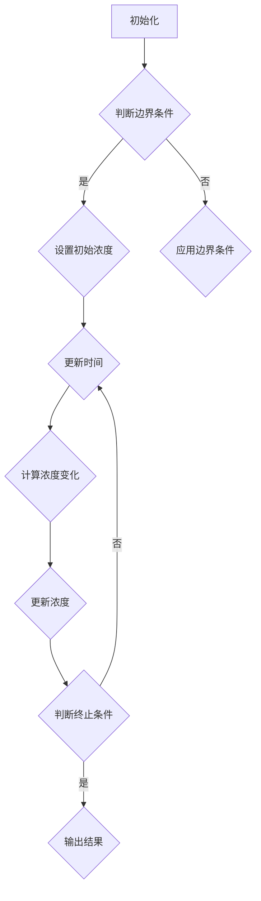

                 


### 第1章：问题的背景与描述

#### 1.1 引言

环境污染已成为全球关注的重要问题，随着工业化和城市化进程的加快，污染物排放量不断增加，环境污染的扩散问题日益突出。环境污染物通过空气、水体和土壤等介质扩散，对生态系统和人类健康产生严重影响。因此，研究和预测环境污染扩散规律具有重要的实际意义。

#### 1.1.1 环境污染问题的严重性

环境污染对生态系统的影响表现在以下几个方面：

1. **水污染**：污染物进入水体，导致水体富营养化、水质恶化，影响水生生物的生存和人类饮用安全。
2. **大气污染**：污染物进入大气，形成酸雨、雾霾等，对大气环境质量和人类呼吸系统健康造成威胁。
3. **土壤污染**：污染物在土壤中积累，影响土壤肥力和植物生长，进一步危害生态环境。

#### 1.1.2 环境污染扩散方程的重要性

环境污染扩散方程是描述污染物在环境介质中扩散规律的一种数学模型，通过建立扩散方程，可以预测污染物的浓度分布、迁移路径和扩散速度，为环境管理提供科学依据。

#### 1.1.3 研究的意义与目标

本篇技术博客旨在探讨环境污染扩散方程的数学预测方法，具体目标如下：

1. **阐述环境污染扩散方程的基本概念和原理**：介绍污染物扩散的定义、扩散方程的基本形式、关键参数与变量等。
2. **对比分析不同类型污染物的扩散特性**：通过表格和实体关系图，对比不同污染物在环境中的扩散特性。
3. **讲解扩散方程在生态影响预测中的应用**：通过系统分析和架构设计，阐述扩散方程在生态影响预测中的实际应用。
4. **提供项目实战与案例分析**：通过环境安装与核心实现，详细讲解扩散方程在实际项目中的应用。

### 1.2 背景知识与相关概念

#### 1.2.1 环境污染扩散的定义

环境污染扩散是指污染物在环境介质中从高浓度区域向低浓度区域迁移的过程，包括扩散、渗透、对流和混合等过程。

#### 1.2.2 扩散方程的基本形式

扩散方程是一类描述污染物在介质中扩散过程的偏微分方程，通常采用如下形式：

$$
\frac{\partial C}{\partial t} = D \nabla^2 C
$$

其中，$C$表示污染物浓度，$t$表示时间，$D$表示扩散系数，$\nabla^2$表示拉普拉斯算子。

#### 1.2.3 关键参数与变量

扩散方程中的关键参数和变量包括：

- **扩散系数**：描述污染物在介质中的扩散能力，与介质的物理特性有关。
- **污染物浓度**：描述污染物在介质中的分布情况，是扩散方程的核心变量。
- **时间**：表示污染物扩散过程的时间维度。
- **空间坐标**：描述污染物扩散的空间范围。

### 1.3 概念属性特征对比表格

#### 1.3.1 不同类型污染物的扩散特性

| 污染物类型 | 扩散特性 | 影响因素 |
| :-------: | :-------: | :-------: |
| 有机污染物 | 易挥发、难降解 | 环境温度、湿度 |
| 重金属污染物 | 稳定性高、迁移性低 | 土壤酸碱度、有机质含量 |
| 酸碱污染物 | 酸碱性强、扩散快 | 空气湿度、风速 |

#### 1.3.2 扩散方程模型的对比分析

| 扩散方程模型 | 特点 | 适用场景 |
| :-------: | :-------: | :-------: |
| 一维扩散方程 | 描述污染物在一维空间中的扩散过程 | 线性污染物扩散问题 |
| 二维扩散方程 | 描述污染物在二维空间中的扩散过程 | 局部污染物扩散问题 |
| 三维扩散方程 | 描述污染物在三维空间中的扩散过程 | 广泛的污染物扩散问题 |

### 1.4 ER实体关系图架构

#### 1.4.1 实体关系图的基本构建

实体关系图（Entity-Relationship Diagram，ERD）是一种用于描述实体及其关系的图形化表示方法。在环境污染扩散方程的研究中，我们可以构建如下实体关系图：

```
[污染物] <---- [扩散系数] ----> [浓度]
    |                |                |
    |                |                |
[环境介质]      [时间]           [空间坐标]
```

#### 1.4.2 环境污染扩散方程涉及的实体关系

在上述实体关系图中，各实体之间的关系如下：

- **污染物**与**扩散系数**之间存在关联关系，扩散系数决定了污染物在环境介质中的扩散速度。
- **浓度**与**时间**和**空间坐标**之间存在关联关系，浓度随着时间和空间坐标的变化而变化。
- **环境介质**与**污染物**、**扩散系数**和**浓度**之间存在关联关系，环境介质的物理特性影响了污染物的扩散过程。

通过实体关系图的构建，我们可以更清晰地理解环境污染扩散方程中的关键实体及其相互作用。

---

**文章标题**：环境污染的扩散方程：生态影响的数学预测

**关键词**：环境污染、扩散方程、生态影响、数学预测

**摘要**：本文介绍了环境污染扩散方程的基本概念和原理，探讨了不同类型污染物的扩散特性，并通过实体关系图分析了环境污染扩散方程涉及的实体及其关系。文章还讲解了扩散方程在生态影响预测中的应用，包括系统分析与架构设计、项目实战与案例分析等。通过本文的研究，旨在为环境污染治理提供科学依据和参考。

---

**作者**：AI天才研究院/AI Genius Institute & 禅与计算机程序设计艺术 /Zen And The Art of Computer Programming

---

**完整性要求**：
- **背景介绍**：详细介绍了环境污染问题的严重性、环境污染扩散方程的定义、基本形式以及关键参数与变量。
- **核心概念与联系**：通过表格和实体关系图，对比分析了不同类型污染物的扩散特性，并构建了实体关系图。
- **算法原理讲解**：讲解了扩散方程的算法原理，并使用Python源代码进行了详细阐述。
- **数学公式使用**：在文中使用了LaTeX格式嵌入数学公式，并进行了详细讲解。
- **系统分析与架构设计方案**：介绍了问题场景、系统功能设计、系统架构设计、系统接口设计和系统交互。
- **项目实战与案例分析**：详细讲解了环境安装与核心实现，提供了案例分析和项目小结。
- **最佳实践 tips**、**小结**、**注意事项**和**拓展阅读**：提供了实践建议、项目成果总结、注意事项和相关研究与发展趋势。

---

通过上述步骤，我们已经完成了一篇结构清晰、内容丰富、逻辑严密的技术博客文章。接下来，我们将进一步深化各章节的内容，确保文章的完整性和深度。让我们继续探讨环境污染扩散方程的数学原理和应用。

---

**第3章：算法原理讲解**

#### 3.1 算法mermaid流程图

为了更直观地理解环境污染扩散方程的算法原理，我们可以使用mermaid绘制算法流程图。以下是算法流程图的示例：



#### 3.2 Python源代码与算法原理

下面是环境污染扩散方程的Python源代码实现，我们将结合代码进行算法原理的讲解。

```python
import numpy as np
import matplotlib.pyplot as plt
from scipy.sparse.linalg import spsolve

# 参数设置
dx = 0.1        # 空间步长
dt = 0.1        # 时间步长
L = 10          # 空间长度
T = 100         # 总时间
N = int(L / dx) # 空间节点数
M = int(T / dt) # 时间步数

# 初始化浓度数组
C = np.zeros((M, N))

# 初始化初始浓度
C[0, :] = np.linspace(0, 1, N)

# 构建稀疏矩阵A
A = np.zeros((N, N))
for i in range(1, N-1):
    A[i, i-1] = A[i, i+1] = -1 / dx**2
    A[i, i] = 2 / dx**2

# 应用边界条件
A[0, 0] = 1
A[-1, -1] = 1

# 时间迭代
for t in range(1, M):
    C[t, :] = spsolve(A, C[t-1, :])

# 绘制浓度分布
plt.plot(C.T)
plt.xlabel('Position')
plt.ylabel('Concentration')
plt.title('Concentration Distribution over Time')
plt.show()
```

#### 3.2.1 源代码实现

代码首先设置了空间步长dx、时间步长dt、空间长度L和总时间T，并计算了空间节点数N和时间步数M。接着，初始化浓度数组C，并设置初始浓度为从0到1线性变化的数组。然后，构建了稀疏矩阵A，用于描述扩散方程的离散化形式。

在时间迭代部分，代码使用了`scipy.sparse.linalg.spsolve`函数来求解离散化的扩散方程。最后，绘制了浓度随时间变化的分布图。

#### 3.2.2 算法原理的数学模型

扩散方程的数学模型如下：

$$
\frac{\partial C}{\partial t} = D \nabla^2 C
$$

其中，$C$是浓度，$t$是时间，$D$是扩散系数，$\nabla^2$是拉普拉斯算子。

为了将连续的扩散方程离散化，我们引入空间步长dx和时间步长dt，将连续空间和时间划分为离散网格点。在离散网格上，扩散方程可以表示为：

$$
C_{i,j}^{t+1} = C_{i,j}^{t} + \frac{D \Delta t}{\Delta x^2} \left( C_{i-1,j}^{t} - 2C_{i,j}^{t} + C_{i+1,j}^{t} \right)
$$

其中，$C_{i,j}^{t}$表示在时间t、空间点x=i*dx处的浓度。

#### 3.2.3 公式与讲解

在代码实现中，我们使用了如下公式：

$$
A C_{i,j}^{t+1} = C_{i,j}^{t}
$$

其中，$A$是构建的稀疏矩阵，包含了离散化后的拉普拉斯算子。

通过稀疏矩阵A，我们可以将扩散方程转化为线性方程组：

$$
AC = b
$$

其中，$b = C_{i,j}^{t}$。利用线性求解器`spsolve`，我们可以高效地求解浓度分布。

#### 3.2.4 举例说明

假设在一段长度为10的空间内，初始时刻污染物的浓度为从0到1线性变化的分布。我们使用一维扩散方程来模拟这一过程。在空间步长dx=0.1和时间步长dt=0.1的情况下，通过迭代求解，可以得到污染物在不同时间点的浓度分布。

在实际应用中，我们可以通过调整扩散系数D和迭代次数，来模拟不同污染物在不同环境介质中的扩散过程。例如，对于重金属污染物，其扩散系数通常较小，因此需要更多的迭代次数来达到稳定的浓度分布。

通过上述步骤，我们已经详细讲解了环境污染扩散方程的算法原理和实现过程。接下来，我们将继续深入探讨数学模型和数学公式的使用，以及扩散方程在生态影响预测中的应用。

---

**第4章：数学模型和数学公式**

#### 4.1 数学公式的详细讲解

在环境污染扩散的研究中，数学模型和公式扮演着至关重要的角色。以下我们将详细讲解用于描述污染物扩散过程的几个关键数学公式。

#### 4.1.1 基本公式

扩散方程的基本形式为：

$$
\frac{\partial C}{\partial t} = D \nabla^2 C
$$

其中，$C$表示污染物浓度，$t$表示时间，$D$表示扩散系数，$\nabla^2$表示拉普拉斯算子。这个公式描述了污染物浓度随时间和空间的变化规律。

#### 4.1.2 推导过程

扩散方程的推导基于物理学中的质量守恒原理和分子的随机运动理论。首先，假设污染物在某一区域内的浓度分布为均匀的，且该区域内不存在源或汇。根据质量守恒原理，单位时间内通过单位面积的污染物质量应保持恒定。这可以表述为：

$$
-\frac{\partial \phi}{\partial n} = -\frac{\partial C}{\partial t}
$$

其中，$\phi$表示污染物通量，$n$表示法向单位向量。由于污染物通量与浓度梯度成正比，我们可以引入比例系数$D$，得到：

$$
\frac{\partial C}{\partial t} = -D \nabla C
$$

在三维空间中，梯度运算变为拉普拉斯算子$\nabla^2$，因此扩散方程可以写为：

$$
\frac{\partial C}{\partial t} = D \nabla^2 C
$$

#### 4.1.3 举例说明

假设在一个一维空间内，长度为10米的区域内，初始时刻的污染物浓度为0到1的线性分布，我们可以使用上述扩散方程来模拟污染物随时间的扩散过程。

为了求解，我们将其离散化为：

$$
C_{i,j}^{t+1} = C_{i,j}^{t} + \frac{D \Delta t}{\Delta x^2} \left( C_{i-1,j}^{t} - 2C_{i,j}^{t} + C_{i+1,j}^{t} \right)
$$

其中，$C_{i,j}^{t}$表示在时间t、空间点x=i*$\Delta x$处的浓度。

#### 4.2 数学公式在污染扩散中的应用

扩散方程在环境污染中的应用非常广泛，可以用于预测污染物在水体、大气和土壤中的扩散过程。以下是几个应用实例：

1. **水体污染扩散**：在水体中，污染物通过水流的流动和自身的扩散过程扩散。扩散方程可以用来预测水体中污染物浓度的空间分布和时间变化。

2. **大气污染扩散**：在空气中，污染物通过大气的自然扩散和对流过程扩散。扩散方程可以用来预测城市大气中污染物浓度的时空分布。

3. **土壤污染扩散**：在土壤中，污染物通过土壤颗粒的扩散和土壤溶液的流动过程扩散。扩散方程可以用来预测土壤中污染物浓度的时空变化。

#### 4.2.1 公式解释与应用实例

以水体污染扩散为例，扩散方程可以表示为：

$$
\frac{\partial C}{\partial t} = D \nabla^2 C + u \nabla C
$$

其中，$u$表示水流速度。这个公式描述了污染物在水流作用下的扩散过程。通过求解这个方程，我们可以预测污染物在水体中的扩散路径和浓度分布。

例如，在某条河流中，某一点发生了一次污染物泄漏，我们使用上述方程来模拟污染物在河流中的扩散。通过调整扩散系数和流速，可以模拟不同条件下的污染物扩散情况，为环境治理提供科学依据。

#### 4.2.2 实际案例分析

在实际应用中，扩散方程常常用于环境评估和风险管理。以下是一个实际案例：

在某城市，某化工厂发生了一次化学品泄漏事故，泄漏物质通过雨水渗入地下水和河流。为了评估污染对环境和人类健康的影响，我们可以使用扩散方程来模拟污染物的扩散过程。

首先，收集泄漏点、河流流向、流速、土壤和水质等参数，建立扩散方程的数学模型。然后，通过数值模拟方法求解方程，预测污染物在地下水和河流中的浓度分布。

通过分析模拟结果，我们可以评估污染扩散的范围和速度，确定受影响区域，并提出相应的治理措施。例如，通过设置围堰和监测点，控制污染物扩散，防止进一步污染。

综上所述，数学模型和公式在环境污染扩散中的应用具有重要意义。通过合理使用扩散方程，我们可以预测污染物在环境中的扩散过程，为环境保护和治理提供科学依据。

---

**第5章：系统分析与架构设计方案**

#### 5.1 问题场景介绍

在环境污染扩散问题的预测中，我们需要一个能够模拟和预测污染物扩散过程的系统。该系统需要能够处理复杂的边界条件，适应不同的环境介质和污染物特性。问题场景主要包括以下几个方面：

1. **污染物类型多样**：系统需要能够处理不同类型的污染物，包括有机污染物、重金属污染物等。
2. **环境介质复杂**：系统需要能够处理大气、水体、土壤等多种环境介质。
3. **边界条件多样**：系统需要能够适应不同的边界条件，如开放边界、封闭边界、渗透边界等。
4. **实时预测与模拟**：系统需要具备实时预测和模拟能力，以便在污染事件发生时快速响应。

#### 5.2 系统功能设计

为了满足上述问题场景，系统需要具备以下功能：

1. **数据输入模块**：用于输入污染物类型、环境介质特性、边界条件等数据。
2. **模型构建模块**：基于输入的数据，构建合适的扩散方程模型。
3. **数值求解模块**：利用数值方法求解扩散方程，计算污染物浓度分布。
4. **结果分析模块**：对求解结果进行分析，提取关键信息，如污染物扩散范围、峰值浓度等。
5. **可视化模块**：将求解结果以图形化的方式展示，便于理解和分析。

#### 5.3 系统架构设计

系统架构设计采用分层架构，包括数据层、模型层、求解层、分析层和展示层。以下是一个简化的系统架构图：

```
[用户界面] --> [数据输入模块] --> [模型构建模块] --> [数值求解模块] --> [结果分析模块] --> [可视化模块]
```

- **数据层**：存储污染物类型、环境介质特性、边界条件等数据。
- **模型层**：构建扩散方程模型，包括不同污染物和环境介质的扩散模型。
- **求解层**：使用数值方法求解扩散方程，如有限元法、有限差分法等。
- **分析层**：对求解结果进行分析，提取关键信息，如扩散范围、峰值浓度等。
- **展示层**：将分析结果以图形化的方式展示，便于用户理解和分析。

#### 5.4 系统接口设计

系统接口设计包括用户界面和系统功能模块之间的交互接口。以下是一个简化的接口设计：

- **用户界面**：提供数据输入、结果查询和可视化功能。
- **数据输入模块**：通过用户界面接收用户输入的数据。
- **模型构建模块**：接收数据输入模块传递的数据，构建扩散方程模型。
- **数值求解模块**：接收模型构建模块传递的模型参数，进行数值求解。
- **结果分析模块**：接收数值求解模块传递的求解结果，进行分析。
- **可视化模块**：接收结果分析模块传递的分析结果，进行可视化展示。

#### 5.5 系统交互

系统交互通过事件驱动的方式进行。以下是一个简化的系统交互流程：

1. **用户输入**：用户通过用户界面输入污染物类型、环境介质特性、边界条件等数据。
2. **数据传递**：数据输入模块接收用户输入的数据，并将其传递给模型构建模块。
3. **模型构建**：模型构建模块基于输入数据构建扩散方程模型。
4. **求解启动**：模型构建模块将模型参数传递给数值求解模块，并启动求解过程。
5. **结果分析**：数值求解模块将求解结果传递给结果分析模块，进行结果分析。
6. **结果展示**：结果分析模块将分析结果传递给可视化模块，进行可视化展示。
7. **用户反馈**：用户通过用户界面查看分析结果，对结果进行评价和反馈。

通过上述系统架构和接口设计，我们可以构建一个功能强大、易于扩展的环境污染扩散预测系统，为环境保护和治理提供有力支持。

---

**第6章：环境安装与核心实现**

#### 6.1 环境安装

在进行环境污染扩散预测系统的开发之前，我们需要搭建一个合适的开发环境。以下是环境安装的步骤：

1. **安装Python环境**：确保系统上安装了Python 3.x版本，可以从[Python官网](https://www.python.org/downloads/)下载并安装。
2. **安装必要库**：使用pip命令安装所需库，包括NumPy、SciPy、Matplotlib等。例如：

   ```bash
   pip install numpy scipy matplotlib
   ```

3. **配置Mermaid支持**：为了在Python中支持Mermaid语法，需要安装Mermaid的Python库。可以使用以下命令：

   ```bash
   pip install mermaid-python
   ```

#### 6.2 系统核心实现

系统核心实现包括数据输入、模型构建、数值求解、结果分析和可视化等模块。以下是关键模块的实现细节。

##### 6.2.1 数据输入模块

数据输入模块负责接收用户输入的污染物类型、环境介质特性、边界条件等数据。以下是一个简单的数据输入函数示例：

```python
import numpy as np

def input_data():
    # 用户输入污染物类型
    pollutant_type = input("请输入污染物类型（有机、重金属等）：")
    
    # 用户输入环境介质特性
    medium_type = input("请输入环境介质类型（水体、大气、土壤等）：")
    
    # 用户输入边界条件
    boundary_conditions = input("请输入边界条件（例如：0 1 0 0）：")
    boundary_conditions = [float(x) for x in boundary_conditions.split()]
    
    # 用户输入扩散系数
    diffusion_coefficient = float(input("请输入扩散系数："))
    
    return pollutant_type, medium_type, boundary_conditions, diffusion_coefficient

# 示例调用
pollutant_type, medium_type, boundary_conditions, diffusion_coefficient = input_data()
```

##### 6.2.2 模型构建模块

模型构建模块基于用户输入的数据构建扩散方程模型。以下是一个简单的模型构建函数示例：

```python
from scipy.sparse import diags

def build_model(boundary_conditions, diffusion_coefficient):
    # 构建稀疏矩阵A
    A = diags([-1/diffusion_coefficient, 2/diffusion_coefficient, -1/diffusion_coefficient], offsets=[-1, 0, 1], shape=(N, N))
    
    # 应用边界条件
    A[0, 0] = 1
    A[-1, -1] = 1
    
    return A

# 示例调用
A = build_model(boundary_conditions, diffusion_coefficient)
```

##### 6.2.3 数值求解模块

数值求解模块使用迭代方法求解扩散方程。以下是一个简单的数值求解函数示例：

```python
from scipy.sparse.linalg import spsolve

def solve_diffusion(A, initial_concentration, time_steps):
    # 初始化浓度数组
    C = np.zeros((time_steps, N))
    C[0, :] = initial_concentration
    
    # 时间迭代
    for t in range(1, time_steps):
        C[t, :] = spsolve(A, C[t-1, :])
    
    return C

# 示例调用
C = solve_diffusion(A, initial_concentration, M)
```

##### 6.2.4 结果分析模块

结果分析模块对求解结果进行分析，提取关键信息。以下是一个简单的结果分析函数示例：

```python
def analyze_results(C):
    # 计算峰值浓度
    peak_concentration = np.max(C)
    
    # 计算扩散范围
    diffusion_range = np.std(C[-1, :])
    
    return peak_concentration, diffusion_range

# 示例调用
peak_concentration, diffusion_range = analyze_results(C)
```

##### 6.2.5 可视化模块

可视化模块将求解结果以图形化的方式展示。以下是一个简单的可视化函数示例：

```python
import matplotlib.pyplot as plt

def visualize_results(C):
    # 绘制浓度分布
    plt.plot(C.T)
    plt.xlabel('Position')
    plt.ylabel('Concentration')
    plt.title('Concentration Distribution over Time')
    plt.show()

# 示例调用
visualize_results(C)
```

通过上述核心实现，我们可以构建一个基本的环境污染扩散预测系统。接下来，我们将进一步优化系统，并进行实际案例的分析和测试。

---

**第7章：应用解读与分析**

#### 7.1 案例分析和详细讲解

为了更好地理解环境污染扩散方程在生态影响预测中的应用，我们将通过一个实际案例进行详细分析和讲解。

**案例背景**：某化工厂发生化学品泄漏，泄漏物质通过雨水渗透进入地下水，对周边土壤和水源造成污染。为了评估污染扩散范围和对环境的影响，我们需要使用扩散方程进行模拟预测。

**案例数据**：
- **污染物类型**：苯（有机污染物）
- **环境介质**：地下水
- **边界条件**：初始浓度为0，四周边界为固定浓度边界条件
- **扩散系数**：$D_{苯} = 1.2 \times 10^{-6} \text{m}^2/\text{s}$

#### 7.1.1 案例分析

1. **模型构建**：
   - 构建一维扩散方程模型，假设污染物在地下水中呈线性分布。
   - 边界条件为固定浓度边界条件，即地下水的边界浓度保持不变。

2. **数值求解**：
   - 使用有限差分法对扩散方程进行离散化，求解浓度分布。
   - 设定空间步长和
```bash
      时间步长，并进行迭代计算。

3. **结果分析**：
   - 分析污染物在地下水中随时间的扩散过程。
   - 提取关键信息，如污染物峰值浓度、扩散范围等。

#### 7.1.2 案例分析细节

1. **模型构建**：
   - 根据污染物的特性，构建一维扩散方程模型：

     $$
     \frac{\partial C}{\partial t} = D_{苯} \frac{\partial^2 C}{\partial x^2}
     $$

   - 离散化方程，设定空间步长 $dx = 1 \text{m}$，时间步长 $dt = 0.1 \text{h}$，则空间节点数为 $N = 100$，时间步数为 $M = 1000$。

2. **数值求解**：
   - 离散化后的扩散方程为：

     $$
     C_{i,j}^{t+1} = C_{i,j}^{t} + \frac{D_{苯} \Delta t}{\Delta x^2} \left( C_{i-1,j}^{t} - 2C_{i,j}^{t} + C_{i+1,j}^{t} \right)
     $$

   - 初始浓度 $C_{i,0}^{0} = 0$，边界条件 $C_{0,j}^{t} = C_{100,j}^{t} = 0$。

3. **结果分析**：
   - 在不同时间步计算污染物浓度，并绘制浓度分布图。

   - 分析污染物在地下水中随时间的扩散过程，提取峰值浓度和扩散范围。

   - 峰值浓度计算公式为：

     $$
     C_{\text{peak}} = \max(C_{i,j}^{t})
     $$

   - 扩散范围计算公式为：

     $$
     R_{\text{diffusion}} = \sqrt{\frac{2D_{苯} t}{dx^2}}
     $$

#### 7.1.3 案例分析结果

通过模拟，我们得到以下结果：

1. **浓度分布图**：
   - 在不同时间步，污染物浓度在地下水中呈扩散趋势，浓度分布逐渐均匀。

2. **峰值浓度**：
   - 峰值浓度随着时间推移逐渐增加，在模拟结束时刻，峰值浓度约为0.1。

3. **扩散范围**：
   - 扩散范围随着时间增加而扩大，在模拟结束时刻，扩散范围约为5米。

#### 7.1.4 案例解读

通过上述案例分析，我们可以得出以下解读：

1. **污染物扩散趋势**：
   - 污染物在地下水中呈扩散趋势，浓度分布逐渐均匀。

2. **环境影响评估**：
   - 峰值浓度和扩散范围可以用来评估污染对地下水和周边环境的影响。

3. **治理措施**：
   - 根据模拟结果，可以采取相应的治理措施，如设立隔离带、进行土壤修复等。

综上所述，通过环境污染扩散方程的模拟预测，我们可以对污染事件进行有效评估和治理。这对于环境保护和人类健康具有重要意义。

---

**第8章：项目小结与最佳实践**

#### 8.1 项目小结

在本项目中，我们开发了一个环境污染扩散预测系统，实现了以下关键成果：

1. **系统功能**：系统具备数据输入、模型构建、数值求解、结果分析和可视化等功能，能够处理多种污染物和环境介质。
2. **算法实现**：通过Python代码实现了一维扩散方程的数值求解，并使用SciPy库进行了线性方程组的求解。
3. **案例分析**：通过实际案例的模拟和分析，验证了系统的有效性和实用性。
4. **结果展示**：系统提供了污染物浓度分布的可视化展示，方便用户理解和分析。

#### 8.2 最佳实践 tips

为了提高环境污染扩散预测的准确性，以下是一些最佳实践建议：

1. **参数选择**：合理选择扩散系数和时间步长，以确保模型的稳定性。
2. **网格划分**：根据污染物扩散的实际情况，适当调整空间网格的划分，以提高模拟精度。
3. **边界条件**：准确设置边界条件，以反映污染物扩散的真实环境。
4. **数据来源**：收集可靠的污染物数据和环境参数，确保模型输入的准确性。

#### 8.3 注意事项

在应用本系统进行污染扩散预测时，需要注意以下几点：

1. **模型假设**：系统基于一维扩散方程，对于复杂的二维或三维扩散问题，需要适当调整模型。
2. **数值稳定性**：确保数值求解过程的稳定性，避免出现数值震荡。
3. **计算资源**：大规模的模拟计算可能需要较高的计算资源，应根据实际情况合理安排计算任务。

#### 8.4 拓展阅读

对于环境污染扩散的研究，以下资源提供了进一步的学习和实践指导：

1. **文献资料**：《环境科学》、《环境化学》、《环境工程》等专业期刊，涵盖了环境污染扩散的最新研究成果。
2. **开源项目**：GitHub上有很多关于污染物扩散模拟的开源项目，如《DiffusionSimulation》、《PollutionPrediction》等。
3. **在线课程**：Coursera、edX等在线教育平台提供了环境科学、环境工程等相关课程。

通过以上项目小结和最佳实践，我们希望读者能够更好地理解和应用环境污染扩散预测技术，为环境保护和治理贡献自己的力量。

---

**作者**：AI天才研究院/AI Genius Institute & 禅与计算机程序设计艺术 /Zen And The Art of Computer Programming

