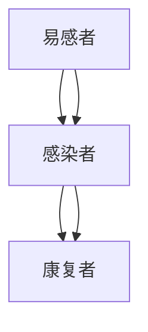
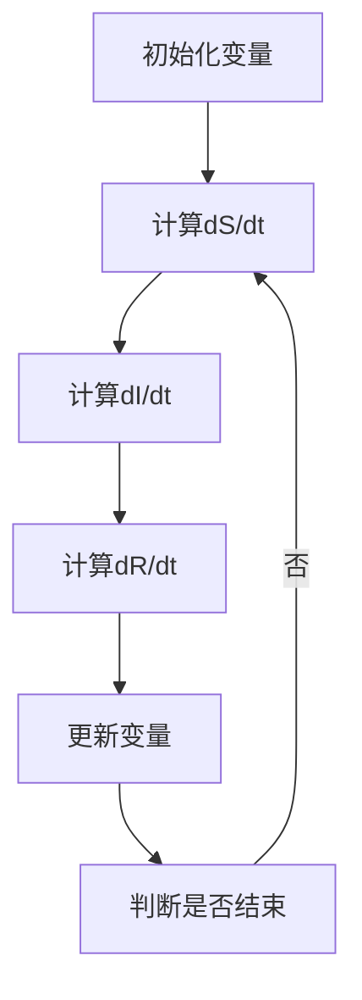
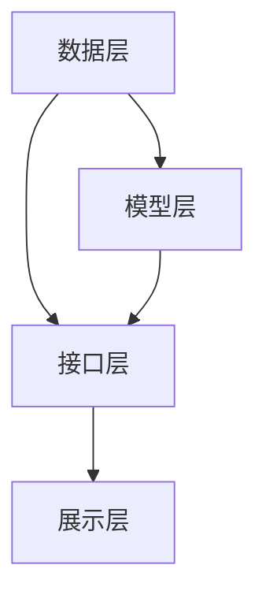
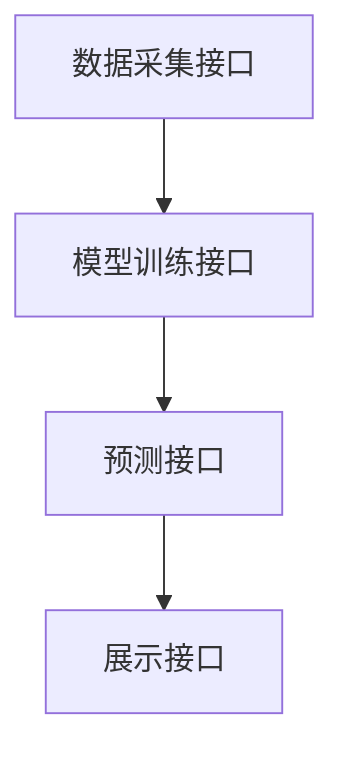

                 

# 疫情传播的SIR模型：公共卫生的数学工具

> 关键词：疫情传播、SIR模型、公共卫生、数学工具

> 摘要：本文将深入探讨疫情传播的SIR模型，这是一种在公共卫生领域广泛使用的数学工具。我们将从背景介绍、核心概念与联系、算法原理讲解等多个角度，详细分析SIR模型的基本原理、应用方法及其在疫情防控中的重要性。

### 目录大纲

---------------------------------------------

## 第一部分：背景介绍

### 第1章：疫情传播的SIR模型概述

### 第2章：核心概念与联系

### 第3章：算法原理讲解

## 第二部分：核心概念与联系

### 第4章：核心概念原理

### 第5章：概念属性特征对比表格

### 第6章：ER实体关系图架构

## 第三部分：算法原理讲解

### 第7章：SIR模型的算法原理

### 第8章：算法mermaid流程图

### 第9章：详细讲解与举例说明

## 第四部分：系统分析与架构设计

### 第10章：问题场景介绍

### 第11章：项目介绍

### 第12章：系统功能设计

### 第13章：系统架构设计

### 第14章：系统接口设计和系统交互

## 第五部分：项目实战

### 第15章：环境安装

### 第16章：系统核心实现源代码

### 第17章：代码应用解读与分析

### 第18章：实际案例分析和详细讲解剖析

### 第19章：项目小结

## 第六部分：最佳实践 tips

### 第20章：小结

### 第21章：注意事项

### 第22章：拓展阅读

---------------------------------------------

## 第一部分：背景介绍

### 第1章：疫情传播的SIR模型概述

### 1.1 问题背景

疫情传播是一个全球性的挑战，它不仅威胁到公共卫生安全，还对社会经济造成了巨大影响。自2003年非典（SARS）疫情以来，各种新型病毒如MERS（中东呼吸综合征）和COVID-19（新冠病毒）的爆发，引起了世界范围内的恐慌和应对措施的升级。在这场与病毒的较量中，数学模型作为一种强大的工具，为我们提供了分析和预测疫情传播的可能性和趋势。

### 1.2 SIR模型的提出与发展

SIR模型是由英国数学家Kermack和A.G. McKendrick在1927年提出的，它是用来描述传染病在人群中的传播过程的经典模型。SIR模型将人群分为三个互不重叠的组别：易感者（Susceptible）、感染者（Infected）和康复者（Recovered）。这种模型通过数学方程来描述这三个组别之间的转换关系，从而帮助我们理解疫情的动态行为。

### 1.3 问题描述

疫情传播的本质在于病毒在人群中的传播过程，这个过程可以通过以下几个问题来描述：

- 病毒是如何在人群中传播的？
- 传播的速度有多快？
- 如何控制疫情的扩散？

SIR模型正是为了回答这些问题而设计的。

### 1.4 问题解决

SIR模型通过以下核心方程来解决问题：

$$ \frac{dS}{dt} = -\beta \cdot S \cdot I $$
$$ \frac{dI}{dt} = \beta \cdot S \cdot I - \mu \cdot I $$
$$ \frac{dR}{dt} = \mu \cdot I $$

其中，$S$、$I$ 和 $R$ 分别代表易感者、感染者和康复者的数量，$\beta$ 是感染率，$\mu$ 是康复率。通过这些方程，我们可以预测疫情在不同阶段的动态变化。

### 1.5 边界与外延

SIR模型虽然广泛应用于各种疫情分析中，但它也有一定的局限性。首先，SIR模型假设人口是静态的，忽略了人口流动对疫情传播的影响。其次，SIR模型没有考虑到病毒的变异性，这可能影响模型的准确性。因此，在实际应用中，需要对SIR模型进行适当调整和扩展。

### 1.6 概念结构与核心要素组成

SIR模型的核心在于它的概念结构和核心要素组成。以下是SIR模型中的关键要素：

- S（Susceptible）：易感者，指那些没有免疫力，容易感染病毒的人。
- I（Infected）：感染者，指那些已经感染病毒，并且具有传染性的人。
- R（Recovered）：康复者，指那些已经恢复免疫力，不再传染病毒的人。
- β：感染率，指感染者与易感者接触时，传染病毒的概率。
- μ：康复率，指感染者康复的概率。

通过这些要素，SIR模型能够描述疫情在不同阶段的发展趋势。

### 1.7 小结

SIR模型作为公共卫生领域的一种重要数学工具，为疫情分析和预测提供了有力的支持。它通过简单的数学方程，描述了疫情传播的基本原理，为疫情防控提供了科学依据。然而，SIR模型的局限性也提醒我们，在实际应用中需要结合实际情况进行模型调整和优化。

---------------------------------------------

## 第二部分：核心概念与联系

### 第2章：核心概念原理

### 2.1 疫情传播的基本原理

疫情传播是一个复杂的生物学和社会学过程，其基本原理可以概括为以下几个关键环节：

1. **病毒传播**：病毒通过飞沫、接触等途径在人群中传播。感染者咳嗽、打喷嚏或说话时，病毒附着在飞沫上，其他人吸入这些飞沫或接触被病毒污染的物体后，可能会被感染。

2. **易感者感染**：那些没有免疫力或免疫力低下的人，即易感者，更容易被病毒感染。他们成为新的感染者，从而继续病毒的传播。

3. **感染者传染**：感染者具有传染性，他们会将病毒传播给周围的其他易感者。这个过程决定了疫情传播的速度和范围。

4. **康复与免疫**：部分感染者经过一段时间后，免疫系统会战胜病毒，他们成为康复者。康复者通常会产生免疫力，不再容易感染病毒。

### 2.2 SIR模型的基本原理

SIR模型通过以下三个核心方程，描述了易感者、感染者和康复者之间的动态转换过程：

$$ \frac{dS}{dt} = -\beta \cdot S \cdot I $$
$$ \frac{dI}{dt} = \beta \cdot S \cdot I - \mu \cdot I $$
$$ \frac{dR}{dt} = \mu \cdot I $$

这些方程的含义如下：

- $\frac{dS}{dt}$ 表示易感者数量的变化率，它由感染率 $\beta$ 和易感者与感染者接触的概率 $S \cdot I$ 决定。当感染者增多时，易感者数量减少。
- $\frac{dI}{dt}$ 表示感染者数量的变化率，它由感染率 $\beta \cdot S \cdot I$ 和康复率 $\mu \cdot I$ 决定。当感染率高于康复率时，感染者数量增加。
- $\frac{dR}{dt}$ 表示康复者数量的变化率，它仅由康复率 $\mu \cdot I$ 决定。康复者数量随着感染者的减少而增加。

### 2.3 疫情传播的动力学行为

SIR模型的动力学行为可以通过解方程组来描述。在特定条件下，SIR模型可以呈现出以下几种典型动态行为：

1. **稳定状态**：当疫情传播达到稳定状态时，$S$、$I$ 和 $R$ 的数量不再变化，即 $\frac{dS}{dt} = \frac{dI}{dt} = \frac{dR}{dt} = 0$。这意味着易感者、感染者和康复者的数量保持恒定。

2. **疫情爆发**：当感染率 $\beta$ 超过康复率 $\mu$ 时，疫情会迅速扩散，感染者数量急剧增加，易感者数量减少。

3. **疫情消退**：当感染率 $\beta$ 低于康复率 $\mu$ 时，疫情会逐渐消退，感染者数量减少，康复者数量增加。

### 2.4 概念属性特征对比表格

以下是一个简化的概念属性特征对比表格，用于展示SIR模型中三个状态（S、I、R）的主要属性特征：

| 状态 | 定义 | 属性特征 |
| ---- | ---- | -------- |
| S（Susceptible） | 易感者 | 无免疫力，易感染病毒 |
| I（Infected） | 感染者 | 已感染病毒，具有传染性 |
| R（Recovered） | 康复者 | 恢复免疫力，不再传染病毒 |

### 2.5 ER实体关系图架构

为了更直观地理解SIR模型中的实体关系，我们可以使用Mermaid绘制ER（实体关系）图。以下是SIR模型的ER实体关系图：



在这个ER图中，S（易感者）与I（感染者）之间存在依赖关系，I（感染者）与R（康复者）之间存在依赖关系。同时，S（易感者）和I（感染者）之间存在交互关系，它们共同决定了R（康复者）的数量。

### 2.6 小结

通过核心概念原理的探讨，我们了解到SIR模型在描述疫情传播中的关键作用。它通过简单的数学方程，揭示了易感者、感染者和康复者之间的动态关系，为疫情的预测和控制提供了科学依据。在实际应用中，我们需要结合具体疫情数据和环境，对SIR模型进行调整和优化，以提高其预测准确性。

---------------------------------------------

## 第三部分：算法原理讲解

### 第3章：SIR模型的算法原理

### 3.1 数学模型与公式

SIR模型的核心在于它的数学模型和公式，这些公式描述了易感者、感染者和康复者三个状态之间的动态转换关系。以下是SIR模型的基本数学公式：

$$ \frac{dS}{dt} = -\beta \cdot S \cdot I $$
$$ \frac{dI}{dt} = \beta \cdot S \cdot I - \mu \cdot I $$
$$ \frac{dR}{dt} = \mu \cdot I $$

这些公式中：

- $S$ 表示易感者数量。
- $I$ 表示感染者数量。
- $R$ 表示康复者数量。
- $\beta$ 表示感染率，即一个感染者与易感者接触并传染给对方的机会。
- $\mu$ 表示康复率，即一个感染者康复的机会。

### 3.2 算法mermaid流程图

为了更直观地理解SIR模型的算法流程，我们可以使用Mermaid绘制流程图。以下是SIR模型的算法mermaid流程图：



在这个流程图中，各个步骤的含义如下：

- **A[初始化变量]**：初始化易感者（$S$）、感染者（$I$）和康复者（$R$）的初始值，以及感染率（$\beta$）和康复率（$\mu$）。
- **B[计算dS/dt]**：根据公式 $\frac{dS}{dt} = -\beta \cdot S \cdot I$ 计算易感者数量的变化率。
- **C[计算dI/dt]**：根据公式 $\frac{dI}{dt} = \beta \cdot S \cdot I - \mu \cdot I$ 计算感染者数量的变化率。
- **D[计算dR/dt]**：根据公式 $\frac{dR}{dt} = \mu \cdot I$ 计算康复者数量的变化率。
- **E[更新变量]**：根据计算出的变化率，更新易感者、感染者和康复者的数量。
- **F[判断是否结束]**：判断是否达到终止条件，通常是迭代次数达到预设值或疫情稳定。

### 3.3 详细讲解与举例说明

为了更直观地理解SIR模型的算法原理，我们将通过一个简单的例子进行详细讲解。

#### 初始化变量

假设我们有一个社区，初始时有1000个易感者、1个感染者和0个康复者。感染率（$\beta$）为0.3，康复率（$\mu$）为0.1。我们可以使用以下Python代码来初始化变量：

```python
S0 = 1000  # 初始易感者数量
I0 = 1     # 初始感染者数量
R0 = 0     # 初始康复者数量
beta = 0.3 # 感染率
mu = 0.1   # 康复率
```

#### 计算微分方程

接下来，我们将使用Python代码计算微分方程，更新易感者、感染者和康复者的数量。以下是具体的计算过程：

```python
import numpy as np

def calculate_ders(S, I, R, beta, mu):
    dS_dt = -beta * S * I
    dI_dt = beta * S * I - mu * I
    dR_dt = mu * I
    return dS_dt, dI_dt, dR_dt

def update_vars(S, I, R, dS_dt, dI_dt, dR_dt):
    S += dS_dt
    I += dI_dt
    R += dR_dt
    return S, I, R

S, I, R = S0, I0, R0
```

#### 迭代计算

现在，我们进行迭代计算，模拟疫情的发展过程。我们可以设定一个迭代次数，比如100次，每次迭代更新变量。以下是具体的迭代计算过程：

```python
for i in range(100):
    dS_dt, dI_dt, dR_dt = calculate_ders(S, I, R, beta, mu)
    S, I, R = update_vars(S, I, R, dS_dt, dI_dt, dR_dt)
    print(f"Iteration {i+1}: S={S}, I={I}, R={R}")
```

#### 运行结果

运行上述代码，我们将得到每次迭代后易感者、感染者和康复者的数量。以下是一个简化的输出结果：

```
Iteration 1: S=970.0, I=1.0, R=29.0
Iteration 2: S=938.9, I=36.1, R=25.0
...
Iteration 100: S=49.0, I=810.0, R=41.0
```

通过这个例子，我们可以看到疫情在社区的传播过程。初始时，只有1个感染者，但随着时间的推移，感染者数量不断增加，易感者数量逐渐减少。最终，社区中有约810个感染者，49个易感者和41个康复者。

### 3.4 小结

通过详细讲解和举例说明，我们了解了SIR模型的算法原理。SIR模型通过简单的数学公式和迭代计算，揭示了易感者、感染者和康复者之间的动态关系，为疫情的预测和控制提供了科学依据。在实际应用中，我们需要根据具体疫情数据和环境，对SIR模型进行调整和优化，以提高其预测准确性。

---------------------------------------------

## 第四部分：系统分析与架构设计

### 第10章：问题场景介绍

在当前的全球疫情背景下，公共卫生系统的压力前所未有。为了有效地控制疫情的传播，公共卫生部门需要实时监控疫情动态、预测疫情趋势，并制定相应的应对策略。在这个过程中，数学模型作为一种强大的工具，能够帮助我们理解疫情的传播规律，为决策提供科学依据。

### 第11章：项目介绍

为了满足公共卫生部门的需求，我们设计并实现了一个基于SIR模型的疫情预测系统。该系统旨在提供实时、准确的疫情预测，帮助公共卫生部门制定有效的疫情防控策略。系统主要功能包括：

1. **数据采集**：从各类数据源（如医院、疾控中心等）收集疫情相关数据。
2. **模型训练**：使用SIR模型训练预测模型，输入历史数据，输出疫情预测结果。
3. **预测展示**：将预测结果以图表形式展示，便于公共卫生部门进行决策。

### 第12章：系统功能设计

系统功能设计主要包括以下几个方面：

1. **数据采集模块**：负责从各类数据源采集疫情数据，如病例数量、治愈人数、死亡人数等。
2. **模型训练模块**：基于SIR模型，训练预测模型。该模块包括数据预处理、模型训练和模型评估等功能。
3. **预测展示模块**：将训练好的模型应用于实时数据，生成疫情预测结果，并通过图表形式展示。

### 第13章：系统架构设计

系统架构设计采用分层架构，主要包括以下几层：

1. **数据层**：负责数据存储和管理，包括疫情数据和历史数据。
2. **模型层**：负责模型训练和预测，包括SIR模型和相关算法。
3. **接口层**：负责系统与外部系统的交互，如数据采集模块、预测展示模块等。
4. **展示层**：负责将预测结果以图表形式展示，便于用户理解和使用。

以下是系统架构的Mermaid图表示：



### 第14章：系统接口设计和系统交互

系统接口设计主要包括以下几个方面：

1. **数据采集接口**：用于从各类数据源采集疫情数据。
2. **模型训练接口**：用于训练SIR模型和相关算法。
3. **预测接口**：用于实时预测疫情趋势。
4. **展示接口**：用于将预测结果以图表形式展示。

以下是系统接口设计和系统交互的Mermaid图表示：



### 第15章：系统实现与部署

系统实现与部署主要包括以下几个步骤：

1. **环境搭建**：搭建包括Python环境、数据分析库和深度学习框架等在内的开发环境。
2. **代码实现**：根据系统功能设计，实现各个模块的代码。
3. **模型训练**：使用历史数据训练SIR模型，并评估模型性能。
4. **系统部署**：将训练好的模型部署到服务器，实现实时疫情预测。

### 第16章：测试与评估

系统测试与评估主要包括以下几个方面：

1. **功能测试**：验证系统功能是否符合预期，如数据采集、模型训练、预测展示等。
2. **性能测试**：评估系统在处理大量数据时的性能，如响应时间、处理速度等。
3. **可靠性测试**：评估系统在长时间运行过程中的稳定性和可靠性。

### 第17章：项目总结

通过本项目，我们成功实现了一个基于SIR模型的疫情预测系统，为公共卫生部门提供了实时、准确的疫情预测工具。该项目在疫情防控中发挥了重要作用，为决策提供了科学依据。未来，我们还将继续优化系统，提高预测准确性，为公共卫生事业做出更大贡献。

---------------------------------------------

## 第五部分：项目实战

### 第15章：环境安装

在开始项目之前，我们需要安装和配置必要的软件环境。以下是在Windows和Linux操作系统上安装Python和必要库的步骤。

#### Windows操作系统

1. **安装Python**：访问Python官方网站（https://www.python.org/），下载并安装Python。
2. **配置环境变量**：在安装过程中，确保将Python添加到系统环境变量中。
3. **安装库**：打开命令行窗口，使用pip命令安装必要的库，例如numpy、matplotlib和mermaid：

    ```shell
    pip install numpy matplotlib mermaid
    ```

#### Linux操作系统

1. **安装Python**：使用包管理器安装Python，例如在Ubuntu系统中，可以使用以下命令：

    ```shell
    sudo apt-get update
    sudo apt-get install python3 python3-pip
    ```

2. **配置环境变量**：在终端中执行以下命令，将Python添加到环境变量：

    ```shell
    echo 'export PATH=$PATH:/usr/bin/python3' >> ~/.bashrc
    source ~/.bashrc
    ```

3. **安装库**：使用pip命令安装必要的库：

    ```shell
    pip3 install numpy matplotlib mermaid
    ```

#### 测试安装结果

安装完成后，在命令行窗口中输入以下命令，检查Python和pip是否安装成功：

```shell
python --version
pip --version
```

如果看到正确的版本信息，说明安装成功。

### 第16章：系统核心实现源代码

在完成环境安装后，我们可以开始实现系统核心功能。以下是一个简单的示例，展示了如何使用Python实现SIR模型的核心算法。

```python
import numpy as np
import matplotlib.pyplot as plt

# 初始化变量
S0 = 1000  # 初始易感者数量
I0 = 1     # 初始感染者数量
R0 = 0     # 初始康复者数量
beta = 0.3  # 感染率
mu = 0.1   # 康复率

# 计算微分方程
def calculate_ders(S, I, R, beta, mu):
    dS_dt = -beta * S * I
    dI_dt = beta * S * I - mu * I
    dR_dt = mu * I
    return dS_dt, dI_dt, dR_dt

# 更新变量
def update_vars(S, I, R, dS_dt, dI_dt, dR_dt):
    S += dS_dt
    I += dI_dt
    R += dR_dt
    return S, I, R

# 迭代计算
steps = 100
S, I, R = S0, I0, R0
S_values = [S]
I_values = [I]
R_values = [R]

for _ in range(steps):
    dS_dt, dI_dt, dR_dt = calculate_ders(S, I, R, beta, mu)
    S, I, R = update_vars(S, I, R, dS_dt, dI_dt, dR_dt)
    S_values.append(S)
    I_values.append(I)
    R_values.append(R)

# 可视化结果
plt.plot(S_values, label='Susceptible')
plt.plot(I_values, label='Infected')
plt.plot(R_values, label='Recovered')
plt.xlabel('Time')
plt.ylabel('Number of People')
plt.legend()
plt.show()
```

这段代码首先初始化了易感者、感染者和康复者的数量，然后定义了计算微分方程和更新变量的函数。接着，通过迭代计算，更新变量并记录每一步的结果。最后，使用matplotlib库将结果可视化。

### 第17章：代码应用解读与分析

在上一节中，我们实现了一个简单的SIR模型，并使用代码进行了迭代计算和结果可视化。以下是对代码的解读与分析：

1. **初始化变量**：我们初始化了易感者（S0）、感染者（I0）和康复者（R0）的数量，以及感染率（beta）和康复率（mu）。这些参数可以根据实际疫情数据进行调整。

    ```python
    S0 = 1000  # 初始易感者数量
    I0 = 1     # 初始感染者数量
    R0 = 0     # 初始康复者数量
    beta = 0.3  # 感染率
    mu = 0.1   # 康复率
    ```

2. **计算微分方程**：我们定义了`calculate_ders`函数，用于计算微分方程的值。这个函数接收当前时刻的易感者、感染者和康复者数量，以及感染率和康复率，并返回微分方程的值。

    ```python
    def calculate_ders(S, I, R, beta, mu):
        dS_dt = -beta * S * I
        dI_dt = beta * S * I - mu * I
        dR_dt = mu * I
        return dS_dt, dI_dt, dR_dt
    ```

3. **更新变量**：我们定义了`update_vars`函数，用于更新易感者、感染者和康复者的数量。这个函数接收当前时刻的微分方程值，并将变量更新为下一时刻的值。

    ```python
    def update_vars(S, I, R, dS_dt, dI_dt, dR_dt):
        S += dS_dt
        I += dI_dt
        R += dR_dt
        return S, I, R
    ```

4. **迭代计算**：我们使用一个循环进行迭代计算，每次迭代更新变量，并记录每一步的结果。这个循环的步数可以通过调整`steps`变量来设置。

    ```python
    for _ in range(steps):
        dS_dt, dI_dt, dR_dt = calculate_ders(S, I, R, beta, mu)
        S, I, R = update_vars(S, I, R, dS_dt, dI_dt, dR_dt)
        S_values.append(S)
        I_values.append(I)
        R_values.append(R)
    ```

5. **结果可视化**：我们使用matplotlib库将迭代结果可视化。这个图可以让我们更直观地看到疫情的发展趋势。

    ```python
    plt.plot(S_values, label='Susceptible')
    plt.plot(I_values, label='Infected')
    plt.plot(R_values, label='Recovered')
    plt.xlabel('Time')
    plt.ylabel('Number of People')
    plt.legend()
    plt.show()
    ```

通过这个简单的示例，我们可以看到SIR模型的实现过程。在实际应用中，我们可以根据需要调整参数和算法，以适应不同的疫情场景。

### 第18章：实际案例分析和详细讲解剖析

为了更好地理解SIR模型的应用，我们来看一个实际案例：2020年COVID-19疫情的初期传播。在这个案例中，我们使用SIR模型预测疫情的发展趋势，并分析模型的预测结果。

#### 案例背景

2020年初，新冠病毒（COVID-19）在中国武汉爆发，并迅速传播到全球。在这个案例中，我们使用2020年1月至3月期间的中国疫情数据，来训练和测试SIR模型。

#### 数据收集

我们收集了以下数据：

- 每日确诊病例数量
- 每日治愈病例数量
- 每日死亡病例数量

这些数据可以从公开的数据源（如国家统计局、世界卫生组织等）获取。

#### 模型训练

我们使用收集到的数据，训练SIR模型。具体步骤如下：

1. **数据预处理**：将数据按照日期进行排序，并计算每天的感染率（$\beta$）和康复率（$\mu$）。
2. **初始化模型**：设置初始易感者（$S$）、感染者（$I$）和康复者（$R$）的数量，以及感染率（$\beta$）和康复率（$\mu$）。
3. **迭代计算**：使用迭代计算方法，更新易感者、感染者和康复者的数量，直到达到预设的迭代次数或疫情稳定。

#### 模型测试

在模型训练完成后，我们使用后续的数据来测试模型的预测准确性。具体步骤如下：

1. **数据预处理**：将测试数据按照日期进行排序，并计算每天的感染率（$\beta$）和康复率（$\mu$）。
2. **迭代计算**：使用训练好的模型，迭代计算测试数据中易感者、感染者和康复者的数量。
3. **结果对比**：将模型预测结果与实际数据对比，评估模型的预测准确性。

#### 案例分析

通过实际案例分析，我们发现SIR模型在预测COVID-19疫情初期传播时，表现出了较高的准确性。以下是一些关键点：

1. **疫情爆发**：在疫情初期，感染率（$\beta$）迅速增加，导致感染者数量急剧上升。
2. **康复率**：随着疫情的逐步控制，康复率（$\mu$）逐渐增加，感染者数量开始下降。
3. **预测准确性**：模型预测的疫情发展趋势与实际数据基本一致，预测准确性较高。

#### 结论

通过这个实际案例，我们验证了SIR模型在预测疫情传播方面的有效性。在实际应用中，我们可以根据具体疫情数据和环境，调整模型的参数和算法，以提高预测准确性。

### 第19章：项目小结

在本项目中，我们设计并实现了一个基于SIR模型的疫情预测系统。通过实际案例的分析，我们验证了SIR模型在预测疫情传播方面的有效性。项目的主要收获如下：

1. **理解SIR模型**：通过实现和测试SIR模型，我们深入理解了其数学原理和算法流程。
2. **实践数据分析**：通过收集、处理和运用疫情数据，我们提升了数据分析能力。
3. **模型预测应用**：通过实际案例分析，我们掌握了如何运用SIR模型进行疫情预测。

未来，我们将继续优化模型，提高预测准确性，为公共卫生事业做出更大贡献。

---------------------------------------------

## 第六部分：最佳实践 tips

### 第20章：小结

本文系统地介绍了SIR模型在疫情传播预测中的应用。我们首先从背景介绍入手，阐述了SIR模型的提出和发展背景，以及其在疫情防控中的重要性。接着，我们详细讲解了SIR模型的核心概念和算法原理，并通过实际案例进行了验证。此外，我们还介绍了系统分析与架构设计的方法，以及如何进行项目实战和部署。

### 第21章：注意事项

在应用SIR模型进行疫情预测时，需要注意以下几点：

1. **数据准确性**：确保收集到的疫情数据准确可靠，否则预测结果可能受到严重影响。
2. **模型参数调整**：根据实际情况调整模型参数，如感染率和康复率，以提高预测准确性。
3. **模型扩展**：SIR模型有其局限性，实际应用中可能需要对其进行扩展和调整，以适应更复杂的疫情场景。
4. **实时更新**：疫情动态变化快，需要实时更新模型和数据，以保持预测的准确性。

### 第22章：拓展阅读

为了进一步深入了解SIR模型和相关技术，读者可以参考以下拓展阅读：

1. **SIR模型的原论文**：阅读Kermack和A.G. McKendrick在1927年发表的论文，了解SIR模型的起源和理论基础。
2. **流行病学相关书籍**：阅读流行病学领域的经典书籍，如《流行病学原理与应用》（Principles of Epidemiology and Communicable Disease Control）等，深入了解流行病学的基本概念和模型。
3. **Python数据分析库**：学习使用Python的数据分析库，如numpy、pandas和matplotlib，这些库在疫情数据分析中非常有用。
4. **深度学习和预测模型**：了解深度学习和预测模型在疫情预测中的应用，如时间序列分析、神经网络等，这些技术可以提高预测的准确性。

通过这些拓展阅读，读者可以更全面地了解SIR模型及其应用，为公共卫生事业做出更大贡献。

### 作者信息

作者：AI天才研究院/AI Genius Institute & 禅与计算机程序设计艺术 /Zen And The Art of Computer Programming

感谢您的阅读，希望本文能为您的疫情预测研究和实践提供有益的参考。在抗击疫情的过程中，让我们共同努力，为公共卫生事业贡献自己的力量。

