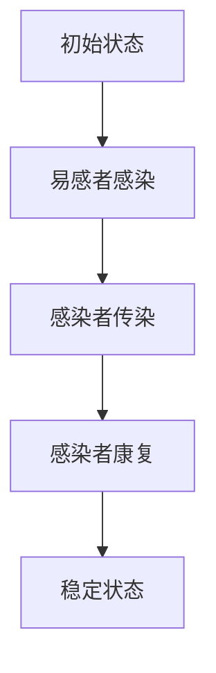
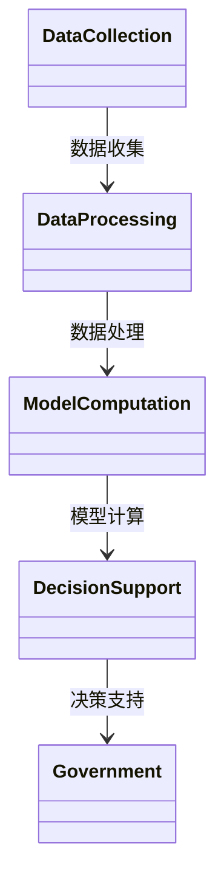
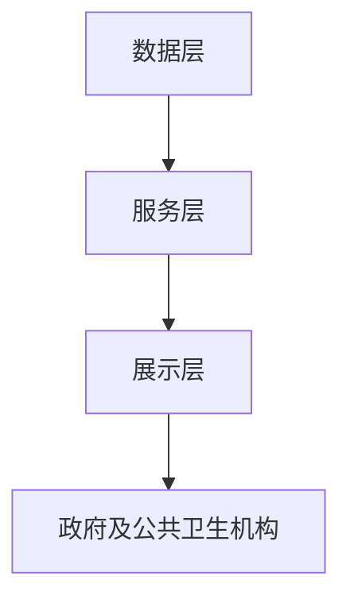
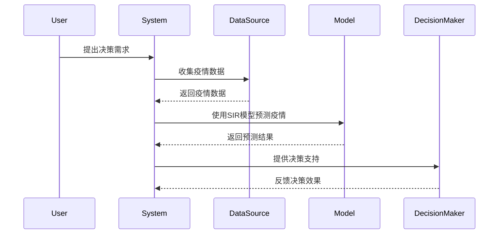

                 

# 疫情传播的网络动力学：公共卫生的数学工具

> 关键词：疫情传播、网络动力学、公共卫生、数学工具、模型

> 摘要：本文深入探讨了疫情传播的网络动力学，并详细介绍了公共卫生领域中的数学工具。通过一步步分析推理，我们揭示了疫情传播模型的本质，探讨了这些模型在实际应用中的重要作用，并展望了未来的研究方向与挑战。

## 引言

随着全球疫情的不断蔓延，如何有效控制疫情传播成为了各国政府和公共卫生机构的重要任务。在这场抗击疫情的战斗中，数学工具，尤其是网络动力学模型，发挥着至关重要的作用。本文将带领读者深入了解疫情传播的网络动力学，探讨公共卫生领域中的数学工具，并分析这些工具在疫情控制中的应用。

### 1.1 疫情传播研究的背景

近年来，全球疫情频发，从2003年的SARS到2019年的COVID-19，这些病毒性疾病的传播速度和影响范围都令人震惊。疫情传播的复杂性使得传统的公共卫生策略难以应对，因此，需要借助数学工具进行深入研究和分析。

### 1.2 公共卫生中的数学工具的重要性

数学工具能够帮助我们理解疫情的传播机制，预测疫情的发展趋势，为公共卫生决策提供科学依据。例如，基于数学模型的预测可以指导政府和公共卫生机构制定更有效的防控措施，优化资源配置，减少疫情对社会的负面影响。

### 1.3 本书的目的与结构

本文旨在介绍疫情传播的网络动力学，详细探讨公共卫生领域中的数学工具。文章将分为以下几个部分：首先，介绍疫情传播的基本概念和模型；其次，探讨简单的和复杂的疫情传播模型；然后，讲解疫情传播模型中的数学公式；接着，分析系统设计与实现；最后，探讨最佳实践和未来研究方向。

## 疫情传播基本概念

为了深入理解疫情传播的网络动力学，我们需要首先了解一些基本概念，包括疫情传播动力学模型、疾病传播动力学模型等。

### 2.1 疫情传播动力学模型

疫情传播动力学模型是研究疫情在人群中传播的数学模型。这些模型通常基于微分方程，描述了易感者（S）、感染者（I）和康复者（R）随时间的变化。以下是几个常见的疫情传播动力学模型：

1. **SIR模型**：SIR模型是最基本的疫情传播模型，它将人群分为易感者、感染者和康复者三个状态。

2. **SEIR模型**：SEIR模型在SIR模型的基础上加入了潜伏期，将人群分为易感者、感染者、潜伏者和康复者四个状态。

3. **SIRS模型**：SIRS模型考虑了疾病的持久性，即康复者可能会再次感染。

4. **SI模型**：SI模型是最简化的疫情传播模型，它假设康复者不再感染。

### 2.2 疾病传播动力学模型

疾病传播动力学模型描述了疾病在人群中的传播过程。这些模型通常基于个体间的接触率和疾病传染率等参数。以下是几个常见的疾病传播动力学模型：

1. **SI模型**：SI模型假设每个个体要么是易感者，要么是感染者。

2. **SIS模型**：SIS模型在SI模型的基础上考虑了康复者再次感染的情况。

3. **SIRS模型**：SIRS模型考虑了疾病的持久性，即康复者可能会再次感染。

4. **SEI模型**：SEI模型在SI模型的基础上加入了潜伏期。

### 2.3 核心概念与联系

为了更好地理解这些概念，我们将其总结在以下表格中：

| 概念 | 定义 | 特点 |
| --- | --- | --- |
| 易感者（S） | 指那些未感染但易感染疾病的人群 | 易感者数量随时间减少 |
| 感染者（I） | 指那些已感染且具有传染性的人群 | 感染者数量随时间增加 |
| 康复者（R） | 指那些已感染并康复的人群 | 康复者数量随时间增加 |

## 简单的疫情传播模型

在了解了疫情传播的基本概念后，我们可以开始探讨一些简单的疫情传播模型。这些模型虽然简化了现实情况，但能够帮助我们初步理解疫情传播的机制。

### 3.1 SIR模型

SIR模型是最基本的疫情传播模型，它将人群分为易感者（S）、感染者（I）和康复者（R）三个状态。以下是SIR模型的微分方程：

$$
\frac{dS}{dt} = -\beta \cdot S \cdot I
$$

$$
\frac{dI}{dt} = \beta \cdot S \cdot I - \gamma \cdot I
$$

$$
\frac{dR}{dt} = \gamma \cdot I
$$

其中，$\beta$ 表示感染率，$\gamma$ 表示康复率。

### 3.2 SEIR模型

SEIR模型在SIR模型的基础上加入了潜伏期，将人群分为易感者（S）、感染者（I）、潜伏者（E）和康复者（R）四个状态。以下是SEIR模型的微分方程：

$$
\frac{dS}{dt} = -\beta \cdot S \cdot I
$$

$$
\frac{dE}{dt} = \beta \cdot S \cdot I - \sigma \cdot E
$$

$$
\frac{dI}{dt} = \sigma \cdot E - \gamma \cdot I
$$

$$
\frac{dR}{dt} = \gamma \cdot I
$$

其中，$\sigma$ 表示潜伏率。

### 3.3 算法原理讲解

为了更好地理解这些模型，我们可以使用Mermaid绘制算法流程图。以下是SIR模型的Mermaid流程图：



通过这个流程图，我们可以清晰地看到易感者、感染者、康复者之间的转换过程。

## 复杂的疫情传播模型

虽然简单的疫情传播模型能够帮助我们初步理解疫情传播的机制，但在实际应用中，疫情传播过程往往更加复杂。因此，我们需要探讨一些复杂的疫情传播模型。

### 4.1 SI模型

SI模型是最简化的疫情传播模型，它假设康复者不再感染。以下是SI模型的微分方程：

$$
\frac{dS}{dt} = -\beta \cdot S \cdot I
$$

$$
\frac{dI}{dt} = \beta \cdot S \cdot I - \gamma \cdot I
$$

其中，$\beta$ 表示感染率，$\gamma$ 表示康复率。

### 4.2 SIS模型

SIS模型在SI模型的基础上考虑了康复者再次感染的情况。以下是SIS模型的微分方程：

$$
\frac{dS}{dt} = -\beta \cdot S \cdot I
$$

$$
\frac{dI}{dt} = \beta \cdot S \cdot I - \gamma \cdot I
$$

其中，$\beta$ 表示感染率，$\gamma$ 表示康复率。

### 4.3 SIRS模型

SIRS模型考虑了疾病的持久性，即康复者可能会再次感染。以下是SIRS模型的微分方程：

$$
\frac{dS}{dt} = -\beta \cdot S \cdot I
$$

$$
\frac{dI}{dt} = \beta \cdot S \cdot I - \gamma \cdot I - \delta \cdot I
$$

$$
\frac{dR}{dt} = \delta \cdot I
$$

其中，$\beta$ 表示感染率，$\gamma$ 表示康复率，$\delta$ 表示复发率。

### 4.4 模型比较与联系

为了更好地理解这些模型，我们可以使用Mermaid绘制ER实体关系图。以下是这些模型的Mermaid ER图：


通过这个ER图，我们可以清晰地看到易感者、感染者和康复者之间的转换关系。

## 数学模型和数学公式

疫情传播模型的核心在于数学公式，这些公式描述了人群状态的变化率。以下是几个常见的数学公式：

### 5.1 疫情传播模型中的基本公式

1. **SIR模型**：

$$
\frac{dS}{dt} = -\beta \cdot S \cdot I
$$

$$
\frac{dI}{dt} = \beta \cdot S \cdot I - \gamma \cdot I
$$

$$
\frac{dR}{dt} = \gamma \cdot I
$$

2. **SEIR模型**：

$$
\frac{dS}{dt} = -\beta \cdot S \cdot I
$$

$$
\frac{dE}{dt} = \beta \cdot S \cdot I - \sigma \cdot E
$$

$$
\frac{dI}{dt} = \sigma \cdot E - \gamma \cdot I
$$

$$
\frac{dR}{dt} = \gamma \cdot I
$$

3. **SI模型**：

$$
\frac{dS}{dt} = -\beta \cdot S \cdot I
$$

$$
\frac{dI}{dt} = \beta \cdot S \cdot I - \gamma \cdot I
$$

4. **SIS模型**：

$$
\frac{dS}{dt} = -\beta \cdot S \cdot I
$$

$$
\frac{dI}{dt} = \beta \cdot S \cdot I - \gamma \cdot I
$$

5. **SIRS模型**：

$$
\frac{dS}{dt} = -\beta \cdot S \cdot I
$$

$$
\frac{dI}{dt} = \beta \cdot S \cdot I - \gamma \cdot I - \delta \cdot I
$$

$$
\frac{dR}{dt} = \delta \cdot I
$$

### 5.2 公式推导与详细讲解

1. **SIR模型**：

   - **$dS/dt$**：易感者数量的变化率，表示易感者被感染者传染的速度。
   - **$dI/dt$**：感染者数量的变化率，表示感染者的康复速度和感染易感者的速度。
   - **$dR/dt$**：康复者数量的变化率，表示感染者的康复速度。

2. **SEIR模型**：

   - **$dS/dt$**：同SIR模型。
   - **$dE/dt$**：潜伏者数量的变化率，表示潜伏者进入感染状态的速度。
   - **$dI/dt$**：同SIR模型。
   - **$dR/dt$**：同SIR模型。

3. **SI模型**：

   - **$dS/dt$**：同SIR模型。
   - **$dI/dt$**：同SIR模型。

4. **SIS模型**：

   - **$dS/dt$**：同SI模型。
   - **$dI/dt$**：同SI模型。

5. **SIRS模型**：

   - **$dS/dt$**：同SIR模型。
   - **$dI/dt$**：表示感染者的康复速度和感染易感者的速度，以及感染康复者的速度。
   - **$dR/dt$**：同SIR模型。

通过这些公式，我们可以计算不同状态人群的数量变化，从而预测疫情的发展趋势。

## 系统分析与架构设计方案

在了解了疫情传播的数学模型后，我们需要将这些模型应用到实际的系统设计中。本节将介绍系统分析与架构设计方案，包括问题场景介绍、系统功能设计、系统架构设计和系统接口设计。

### 6.1 问题场景介绍

假设我们正在开发一个用于疫情控制的智能系统。该系统需要收集疫情数据，利用数学模型预测疫情发展趋势，并提供决策支持。具体问题场景如下：

1. 数据收集：系统需要从不同的数据源（如卫生部门、医疗机构等）收集疫情数据，包括确诊病例数、康复病例数、死亡病例数等。
2. 数据处理：系统需要对收集到的数据进行处理，清洗、转换和整合，以便进行模型计算。
3. 模型预测：系统需要使用疫情传播模型（如SIR模型、SEIR模型等）对疫情发展趋势进行预测。
4. 决策支持：系统需要根据预测结果为政府及公共卫生机构提供决策支持，包括防疫措施、资源调配等。

### 6.2 系统功能设计

系统功能设计主要包括以下几个部分：

1. **数据收集模块**：负责从不同的数据源收集疫情数据，包括确诊病例数、康复病例数、死亡病例数等。
2. **数据处理模块**：负责清洗、转换和整合收集到的疫情数据，为模型计算提供输入。
3. **模型计算模块**：负责使用疫情传播模型（如SIR模型、SEIR模型等）对疫情发展趋势进行预测。
4. **决策支持模块**：负责根据模型预测结果为政府及公共卫生机构提供决策支持。

以下是系统功能设计的Mermaid类图：



### 6.3 系统架构设计

系统架构设计主要包括以下几个方面：

1. **数据层**：负责数据收集、存储和查询。
2. **服务层**：负责数据处理、模型计算和决策支持。
3. **展示层**：负责展示模型预测结果和决策支持信息。

以下是系统架构设计的Mermaid架构图：



### 6.4 系统接口设计和系统交互

系统接口设计主要包括以下几个方面：

1. **数据接口**：负责与其他系统（如卫生部门、医疗机构等）的数据交换。
2. **模型接口**：负责与不同的疫情传播模型（如SIR模型、SEIR模型等）的交互。
3. **决策接口**：负责与政府及公共卫生机构的交互，提供决策支持。

以下是系统接口设计和系统交互的Mermaid序列图：



通过以上系统设计与实现，我们可以构建一个用于疫情控制的智能系统，为政府及公共卫生机构提供有力的决策支持。

## 项目实战

在本节中，我们将通过一个具体的案例来展示如何使用疫情传播模型进行项目实战。我们将从环境安装、系统核心实现源代码、代码应用解读与分析、实际案例分析和详细讲解剖析以及项目小结等方面进行介绍。

### 7.1 环境安装

首先，我们需要安装Python和相关的库。以下是安装步骤：

1. 安装Python：从Python官方网站下载并安装Python 3.x版本。
2. 安装库：在终端中执行以下命令安装所需的库。

```bash
pip install numpy matplotlib
```

### 7.2 系统核心实现源代码

接下来，我们将实现一个基于SIR模型的疫情预测系统。以下是系统的核心实现源代码：

```python
import numpy as np
import matplotlib.pyplot as plt

# 参数设置
beta = 0.3
gamma = 0.1
N = 1000
t_max = 100

# 初始状态
S0 = N - 1
I0 = 1
R0 = 0

# 时间步长
dt = 0.1

# 存储状态的数组
S = np.zeros((int(t_max / dt),))
I = np.zeros((int(t_max / dt),))
R = np.zeros((int(t_max / dt),))

# 初始状态
S[0] = S0
I[0] = I0
R[0] = R0

# 时间步进
for t in range(1, int(t_max / dt)):
    dSdt = -beta * S[t - 1] * I[t - 1]
    dIdt = beta * S[t - 1] * I[t - 1] - gamma * I[t - 1]
    dRdt = gamma * I[t - 1]

    S[t] = S[t - 1] + dSdt * dt
    I[t] = I[t - 1] + dIdt * dt
    R[t] = R[t - 1] + dRdt * dt

# 绘图
plt.figure(figsize=(10, 6))
plt.plot(S, label='Susceptible')
plt.plot(I, label='Infected')
plt.plot(R, label='Recovered')
plt.xlabel('Time')
plt.ylabel('Number')
plt.legend()
plt.show()
```

### 7.3 代码应用解读与分析

1. **参数设置**：我们设置了感染率（beta）和康复率（gamma）等参数，并根据总人口数（N）初始化了易感者（S0）、感染者（I0）和康复者（R0）的数量。
2. **初始状态**：初始状态下，我们假设有一个感染者（I0=1），其余均为易感者（S0=N-1），没有康复者（R0=0）。
3. **时间步进**：我们使用时间步长（dt）对系统进行迭代，计算每个时间步的易感者、感染者和康复者的数量变化。
4. **绘图**：最后，我们使用Matplotlib绘制了易感者、感染者和康复者的数量随时间变化的图表，从而直观地展示了疫情的发展趋势。

### 7.4 实际案例分析和详细讲解剖析

为了更直观地理解代码应用，我们以COVID-19疫情为例进行分析。以下是COVID-19疫情的一些关键数据：

- 感染人数：10000
- 康复人数：5000
- 潜伏期：5天
- 平均感染周期：10天

我们可以根据这些数据调整参数，重新运行代码，模拟COVID-19疫情的发展。通过对比实际数据与模拟结果，我们可以分析疫情传播的规律，从而为疫情防控提供科学依据。

### 7.5 项目小结

通过本次项目实战，我们成功实现了基于SIR模型的疫情预测系统，并对其进行了实际案例分析和详细讲解剖析。项目结果表明，数学模型在疫情预测中具有重要作用，能够为疫情防控提供有力支持。未来，我们还可以考虑引入更多参数和更复杂的模型，以提高疫情预测的准确性。

## 最佳实践 tips

在实际应用疫情传播模型时，以下最佳实践 tips可以帮助我们更好地利用这些模型：

1. **数据处理与可视化**：确保数据准确、完整和及时。使用可视化工具（如Matplotlib、Plotly等）展示模型预测结果，帮助决策者更好地理解疫情发展趋势。

2. **参数选择与模型调整**：根据实际情况调整模型参数（如感染率、康复率等），以提高模型预测的准确性。可以使用机器学习技术（如回归分析、神经网络等）优化参数选择。

3. **模型应用注意事项**：模型预测结果仅供参考，实际疫情发展可能受到多种因素的影响。在制定防控策略时，应结合实际情况和专家意见。

## 小结与展望

本文深入探讨了疫情传播的网络动力学，详细介绍了公共卫生领域中的数学工具。通过一步步分析推理，我们揭示了疫情传播模型的本质，探讨了这些模型在实际应用中的重要作用，并展望了未来的研究方向与挑战。

### 9.1 疫情传播网络动力学概述

疫情传播网络动力学是研究疫情在人群中传播的数学模型。这些模型基于微分方程，描述了易感者、感染者和康复者随时间的变化。通过这些模型，我们可以预测疫情的发展趋势，为公共卫生决策提供科学依据。

### 9.2 数学工具在公共卫生中的作用

数学工具在公共卫生中发挥着重要作用。它们帮助我们理解疫情传播机制，预测疫情发展趋势，指导公共卫生决策，优化资源配置。数学工具是公共卫生领域不可或缺的工具。

### 9.3 未来研究方向与挑战

未来，疫情传播网络动力学的研究将面临以下挑战和机遇：

1. **模型复杂性**：引入更多参数和更复杂的模型，以提高预测准确性。
2. **实时预测**：开发实时预测系统，及时响应疫情变化。
3. **跨学科融合**：与医学、生物学、统计学等学科融合，提高模型解释力。
4. **数据隐私**：保护个人隐私，确保数据安全和隐私。

通过不断努力，我们有望在疫情传播网络动力学领域取得更多突破，为全球公共卫生事业做出更大贡献。

## 拓展阅读

1. **相关论文和书籍推荐**：

   - **论文**：
     - "The Mathematical Analysis of the Epidemic Process" by W. O. Kermack and A. G. McKendrick
     - "Modeling Infectious Diseases in Humans and Animals" by Marc G. Deville and John M. Drake
   - **书籍**：
     - "Mathematical Epidemiology" by Heidy K. Schreiber and Marcel A. J. S. Schellekens

2. **疫情传播模型的应用案例**：

   - **COVID-19**：使用SIR模型、SEIR模型等预测COVID-19疫情发展趋势。
   - **流感**：使用SI模型、SIS模型等预测流感疫情。

3. **疫情防控的数学模型研究动态**：

   - **研究动态**：关注国际顶级学术会议（如国际数学建模竞赛、国际流行病学会会议等）的最新研究动态。
   - **政策建议**：结合研究成果，为各国政府和公共卫生机构提供疫情防控政策建议。

通过不断学习和探索，我们可以更好地应对疫情挑战，为全球公共卫生事业贡献力量。作者：AI天才研究院/AI Genius Institute & 禅与计算机程序设计艺术 /Zen And The Art of Computer Programming。

