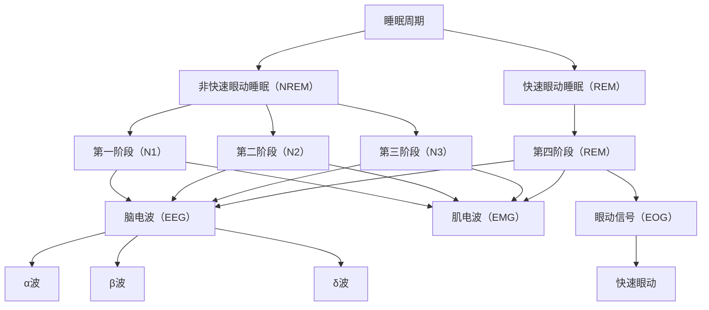
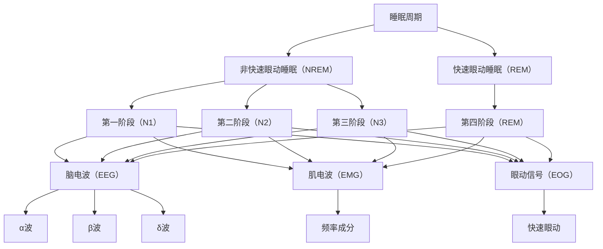
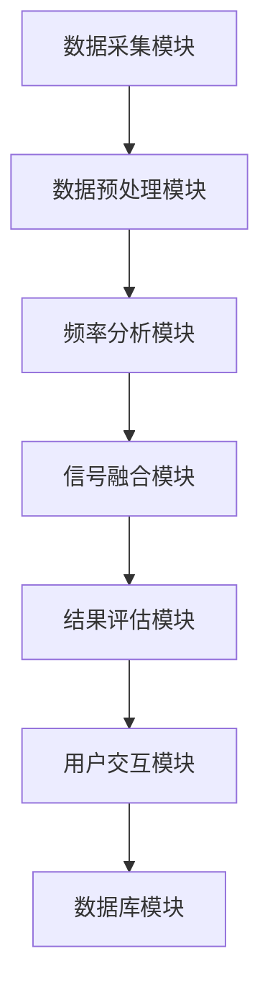
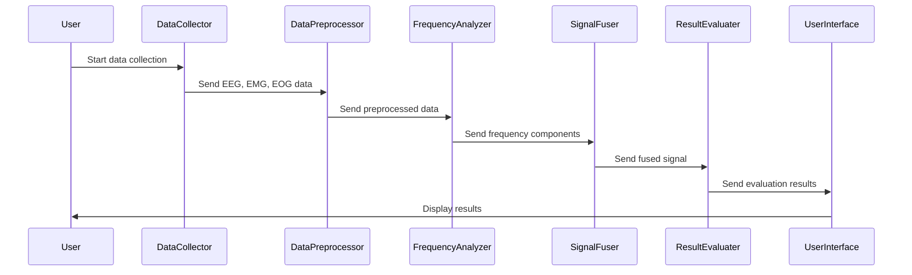

                 


### 《睡眠周期的傅里叶分析：生理节律的数学解读》

#### 关键词：睡眠周期，傅里叶分析，生理节律，数学模型，系统架构，项目实战

#### 摘要：

本文将深入探讨睡眠周期的傅里叶分析，从生理节律的角度解读其数学本质。我们将首先介绍睡眠周期的基本概念和傅里叶分析的基本原理，然后逐步讲解傅里叶变换在睡眠周期研究中的应用，最后通过系统架构设计和项目实战，展示如何将傅里叶分析应用于实际睡眠研究。

---

## 目录大纲

### 第一部分：背景介绍

#### 第1章：睡眠周期与傅里叶分析概述

1.1 睡眠周期基础知识

1.2 傅里叶分析概述

1.3 睡眠周期研究的意义与傅里叶分析的应用前景

1.4 傅里叶分析在睡眠周期研究中的应用

1.5 研究范围的界定与相关概念的联系

1.6 概念结构与核心要素组成

### 第二部分：核心概念与联系

#### 第2章：傅里叶分析在睡眠周期研究中的应用

2.1 傅里叶变换的基本原理

2.2 傅里叶分析在睡眠研究中的具体应用

2.3 傅里叶分析与其他信号处理方法对比

### 第三部分：算法原理讲解

#### 第3章：傅里叶变换的数学模型与实现

3.1 傅里叶变换的数学模型

3.2 傅里叶变换的实现

3.3 举例说明

### 第四部分：系统分析与架构设计方案

#### 第4章：睡眠周期分析系统的设计与实现

4.1 问题场景介绍

4.2 系统功能设计

4.3 系统架构设计

4.4 系统接口设计

4.5 系统交互

### 第五部分：项目实战

#### 第5章：睡眠周期分析项目实战

5.1 环境安装

5.2 系统核心实现源代码

5.3 代码应用解读与分析

5.4 实际案例分析与详细讲解剖析

5.5 项目小结

### 第六部分：最佳实践、小结、注意事项、拓展阅读

#### 第6章：总结与拓展

6.1 最佳实践 tips

6.2 小结

6.3 注意事项

6.4 拓展阅读

---

### 第一部分：背景介绍

#### 第1章：睡眠周期与傅里叶分析概述

### 1.1 睡眠周期基础知识

睡眠周期是指人体在睡眠过程中经历的各个阶段，包括快速眼动（REM）睡眠和非快速眼动（NREM）睡眠。REM 睡眠主要发生在夜间，是梦境最为活跃的阶段；而 NREM 睡眠则分为三个阶段，分别是浅睡眠、中度睡眠和深度睡眠。每个阶段都有其独特的生理和心理功能。

睡眠周期的发生与人体内的生物节律密切相关，包括日节律和年节律等。这些生物节律是由体内的生物钟调节的，生物钟是一种内在的计时系统，可以调节我们的睡眠、饮食、情绪和行为等。

### 1.2 傅里叶分析概述

傅里叶分析是一种在信号处理、图像处理、物理学和工程学等领域广泛应用的方法。它基于傅里叶级数，将一个复杂信号分解成一系列简单的正弦和余弦函数的组合。傅里叶级数可以表示任何周期性信号，而傅里叶变换则将其推广到非周期性信号。

傅里叶分析的基本原理是将信号在频率域上进行表示，从而可以更方便地分析信号的频率成分和能量分布。在睡眠研究中，傅里叶分析可以用来分析睡眠信号的频率特征，揭示睡眠周期中的生理节律。

### 1.3 睡眠周期研究的意义与傅里叶分析的应用前景

睡眠周期对人体的健康和功能有重要影响。良好的睡眠有助于提高记忆、注意力、创造力和免疫系统功能。然而，睡眠问题在全球范围内日益普遍，包括失眠、睡眠呼吸暂停等。因此，研究睡眠周期对于理解睡眠障碍和开发有效的治疗方法至关重要。

傅里叶分析作为一种强大的工具，可以用来研究睡眠周期的频率特征，有助于揭示睡眠过程中的生理节律和异常。例如，通过分析睡眠信号中的频率成分，可以识别出与睡眠质量相关的关键因素，进而为睡眠障碍的诊断和治疗提供依据。

### 1.4 傅里叶分析在睡眠周期研究中的应用

在睡眠研究中，傅里叶分析通常用于对睡眠信号进行频率分析。睡眠信号包括脑电波、肌电信号、眼动信号等。通过傅里叶变换，可以将这些信号分解成不同频率的成分，从而分析出睡眠周期的频率特征。

例如，在脑电信号分析中，可以通过傅里叶变换识别出与睡眠周期相关的频率范围。例如，α波（8-13 Hz）通常与轻度睡眠相关，而β波（13-30 Hz）则与清醒状态相关。通过分析这些频率成分的强度和变化趋势，可以了解睡眠质量的变化。

### 1.5 研究范围的界定与相关概念的联系

本研究主要关注睡眠周期中的 NREM 睡眠阶段，特别是浅睡眠、中度睡眠和深度睡眠。我们将在这些阶段中分析睡眠信号，研究其频率特征。

在傅里叶分析中，相关概念包括正弦波、余弦波、傅里叶级数和傅里叶变换。正弦波和余弦波是基本的波形，可以通过叠加形成复杂的波形。傅里叶级数将复杂波形分解为正弦波和余弦波的组合，而傅里叶变换则将其推广到非周期性信号。

### 1.6 概念结构与核心要素组成

睡眠周期的概念结构包括以下几个核心要素：

1. **睡眠阶段**：包括浅睡眠、中度睡眠和深度睡眠。
2. **生理信号**：包括脑电波、肌电信号、眼动信号等。
3. **傅里叶分析**：包括傅里叶级数和傅里叶变换。
4. **频率特征**：包括不同频率成分的强度和变化趋势。

这些要素相互关联，共同构成了睡眠周期的概念结构。通过傅里叶分析，可以对这些要素进行深入研究和解读，从而揭示睡眠周期的生理节律。

---

在下一章中，我们将进一步探讨傅里叶分析的基本原理，并详细描述其在睡眠周期研究中的应用。这将为我们后续的算法讲解和系统设计提供理论基础。请继续关注《睡眠周期的傅里叶分析：生理节律的数学解读》。### 1.1 睡眠周期基础知识

睡眠周期是人体在睡眠过程中经历的连续阶段，这些阶段以特定的生理和心理变化为特征。睡眠周期可以分为两个主要部分：快速眼动睡眠（REM）和非快速眼动睡眠（NREM）。每个部分又进一步细分为不同的阶段，具体如下：

1. **非快速眼动睡眠（NREM）**：
   - **第一阶段（N1）**：也称为浅睡眠或过渡期，占整个睡眠时间的约5%。在这个阶段，人的意识水平降低，呼吸和心率变慢，肌肉活动减少，大脑开始释放α波。
   - **第二阶段（N2）**：中度睡眠，占整个睡眠时间的约50%。在这个阶段，脑电波出现更频繁的慢波（4-6 Hz的δ波），眼睛停止运动，身体肌肉进一步放松。
   - **第三阶段（N3）**：深度睡眠或缓慢波动睡眠（SWS），占整个睡眠时间的约20%-30%。在这个阶段，脑电波主要是δ波，频率较低，波幅较大。这是一个恢复能量的阶段，对记忆巩固和身体恢复至关重要。

2. **快速眼动睡眠（REM）**：
   - **第四阶段（REM）**：也称为梦眠，占整个睡眠时间的约20%-25%。在这个阶段，眼睛快速运动，肌肉保持松弛状态，大脑活动增加，出现β波和α波。梦境在这一阶段特别活跃。

睡眠周期的这些阶段并不是按照固定顺序循环的，而是以NREM睡眠开始，经过多个阶段的变换，最终进入REM睡眠，然后再次进入NREM睡眠。整个睡眠周期通常持续90分钟左右，但这个周期会反复出现，形成多个周期的一晚睡眠。

### 生理功能

睡眠周期中的每个阶段都有其特定的生理和心理功能：

- **第一阶段（N1）**：有助于大脑和身体的放松，为进入更深的睡眠做准备。
- **第二阶段（N2）**：是睡眠的开始阶段，有助于消除大脑中的废物物质，巩固记忆。
- **第三阶段（N3）**：深度睡眠，对身体的恢复和免疫系统的加强至关重要。
- **REM睡眠**：梦境活跃，有助于情绪调节和学习记忆。

睡眠周期的这些功能相互作用，共同维持人体的健康和生理平衡。

### 睡眠周期的调节

睡眠周期受到多种内部和外部因素的影响，包括生物钟、压力、情绪和健康状况。生物钟（或称为“昼夜节律”）是体内的一种内在时钟，它调节着睡眠和清醒周期。生物钟通过调节激素水平、体温和大脑活动来影响睡眠周期。

例如，褪黑素是一种在夜间分泌的激素，有助于调节睡眠。压力和情绪波动也可能影响睡眠周期，导致睡眠质量下降或周期紊乱。因此，保持良好的生活习惯、避免过度压力和情绪波动对于维持健康的睡眠周期至关重要。

总之，睡眠周期是人体生理节律的重要组成部分，它通过一系列阶段的变化，帮助身体和大脑进行恢复、调节和功能强化。理解睡眠周期的基本知识对于改善睡眠质量和促进整体健康具有重要意义。

### 1.2 傅里叶分析概述

傅里叶分析是一种用于分析信号和函数的工具，其核心思想是将一个复杂的信号或函数分解为一系列简单的正弦波和余弦波的叠加。这种分解被称为傅里叶级数，它在信号处理、物理学、工程学、经济学等领域具有广泛应用。

#### 历史背景

傅里叶分析由法国数学家约瑟夫·傅里叶在19世纪初提出。傅里叶当时研究热传导问题，他提出可以将任意周期性函数分解为正弦波和余弦波的叠加。这一理论在当时引发了数学界的轰动，因为在此之前，人们认为只有周期性函数才能进行这种分解。

#### 基本原理

傅里叶级数的基本原理是将一个周期性函数 \(f(t)\) 表示为不同频率的正弦波和余弦波的线性组合。数学上，傅里叶级数可以表示为：

\[ f(t) = \frac{a_0}{2} + \sum_{n=1}^{\infty} [a_n \cos(n\omega t) + b_n \sin(n\omega t)] \]

其中，\(a_0\), \(a_n\), \(b_n\) 是傅里叶系数，\(\omega\) 是角频率，\(n\) 是谐波序数。

对于非周期性信号，傅里叶级数无法直接应用，因此引入了傅里叶变换。傅里叶变换将信号从时域转换到频域，从而可以分析信号的频率成分。傅里叶变换分为连续傅里叶变换和离散傅里叶变换（DFT）。

#### 傅里叶变换的基本概念

- **连续傅里叶变换**：将连续时间信号转换为频域表示，其数学公式为：

  \[ F(\omega) = \int_{-\infty}^{\infty} f(t) e^{-j\omega t} dt \]

  其中，\(F(\omega)\) 是频域表示，\(f(t)\) 是时域表示。

- **离散傅里叶变换（DFT）**：用于处理离散时间信号，其数学公式为：

  \[ X[k] = \sum_{n=0}^{N-1} x[n] e^{-j2\pi kn/N} \]

  其中，\(X[k]\) 是频域表示，\(x[n]\) 是时域表示，\(N\) 是数据点数。

#### 傅里叶变换的性质

傅里叶变换具有许多有用的性质，包括线性、时域卷积、频域卷积、频域平移等。这些性质使得傅里叶变换在信号处理中非常灵活和强大。

- **线性性质**：傅里叶变换是线性的，即如果两个信号的和通过傅里叶变换，则其频域表示是各自频域表示的和。

- **时域卷积与频域卷积**：两个信号在时域上的卷积对应于其在频域上的乘积。

- **频域平移**：一个信号在时域上的平移对应于其在频域上的乘以相位因子。

### 傅里叶分析在信号处理中的应用

傅里叶分析在信号处理中有广泛的应用，包括：

- **频率分析**：通过傅里叶变换，可以分析信号的频率成分，识别出信号中的主要频率。

- **滤波**：通过频域滤波器，可以去除信号中的特定频率成分，从而实现滤波效果。

- **谱分析**：通过分析信号的功率谱，可以了解信号的能量分布。

- **图像处理**：傅里叶变换在图像处理中用于图像的频域分析，如图像压缩、图像增强等。

总之，傅里叶分析是一种强大的工具，可以用于信号和函数的分析。它通过将复杂的信号分解为简单的正弦波和余弦波，使得信号的频率成分和能量分布变得易于分析和理解。在睡眠周期研究中，傅里叶分析可以用于分析睡眠信号的频率特征，帮助我们更好地理解睡眠的生理节律。

### 1.3 睡眠周期研究的意义与傅里叶分析的应用前景

睡眠周期研究对于理解人类生理健康和行为具有重要价值。良好的睡眠对于维持身体和大脑的正常功能至关重要，包括认知能力、情绪调节、免疫系统和代谢功能。然而，睡眠问题，如失眠、睡眠呼吸暂停和周期性腿动等，在现代社会中越来越普遍，对个体的生活质量和健康产生了严重影响。

#### 睡眠周期的生理影响

睡眠周期中的不同阶段对生理功能有着不同的影响。NREM睡眠，特别是第三阶段（深度睡眠）和REM睡眠，对于大脑和身体的恢复至关重要。深度睡眠有助于加强免疫系统、促进肌肉生长和修复，而REM睡眠则与记忆巩固、情绪调节和社交行为密切相关。

例如，研究表明，深度睡眠不足可能导致免疫功能下降，增加患病的风险。此外，睡眠周期紊乱与多种慢性疾病有关，包括心血管疾病、糖尿病和肥胖。因此，研究睡眠周期对于预防和治疗这些疾病具有重要意义。

#### 傅里叶分析在睡眠研究中的应用前景

傅里叶分析作为一种强大的信号处理工具，在睡眠研究中具有广泛的应用前景。通过傅里叶变换，可以分析睡眠信号的频率特征，帮助我们更好地理解睡眠的生理节律。

1. **频率分析**：傅里叶分析可以用来分析脑电信号、肌电信号和眼动信号的频率成分，识别出与睡眠周期相关的关键频率。例如，脑电信号中的α波、β波和δ波分别与不同的睡眠阶段相关，通过傅里叶分析可以确定这些频率成分的强度和变化趋势。

2. **睡眠质量评估**：通过分析睡眠信号的频率特征，可以评估睡眠质量。例如，通过比较正常睡眠者和失眠者的脑电信号频率成分，可以发现差异，从而为失眠的诊断提供依据。

3. **异常睡眠检测**：傅里叶分析可以用于检测睡眠中的异常活动，如睡眠呼吸暂停和周期性腿动。这些异常活动通常伴随着特定的频率成分变化，通过分析这些变化可以及时发现并处理这些问题。

4. **个性化睡眠研究**：傅里叶分析可以用于研究不同人群的睡眠特征，如年龄、性别和健康状况对睡眠周期的影响。通过分析不同人群的睡眠信号频率特征，可以为个性化睡眠干预提供科学依据。

总之，傅里叶分析在睡眠周期研究中具有巨大的应用潜力。通过分析睡眠信号的频率特征，可以深入了解睡眠的生理节律，为睡眠障碍的诊断、预防和治疗提供科学支持。

### 1.4 傅里叶分析在睡眠周期研究中的应用

傅里叶分析在睡眠周期研究中扮演着重要的角色，特别是在对睡眠信号的频率特征进行分析时。睡眠信号包括脑电波（EEG）、肌电波（EMG）、眼动信号（EOG）等，通过傅里叶变换，我们可以将这些信号分解成不同频率的成分，从而更深入地了解睡眠的生理节律。

#### 脑电波（EEG）分析

脑电波是睡眠研究中最为常用的信号之一，通过记录大脑的电活动，我们可以分析出睡眠的不同阶段。傅里叶变换可以帮助我们识别脑电波中的主要频率成分：

1. **α波（8-13 Hz）**：通常与轻度睡眠（N1阶段）相关。α波的活动减弱标志着进入深度睡眠（N3阶段）。
2. **β波（13-30 Hz）**：通常与清醒状态相关，但在REM睡眠期间也会出现，反映了梦境的活跃程度。
3. **δ波（0.5-4 Hz）**：主要出现在深度睡眠（N3阶段），与身体恢复和记忆巩固有关。

通过傅里叶变换，我们可以量化这些频率成分的强度，并研究它们在不同睡眠阶段的变化趋势。

#### 肌电波（EMG）分析

肌电波反映了肌肉的紧张程度，通过傅里叶变换，我们可以分析出肌肉活动在不同睡眠阶段的变化：

1. **EMG频谱分析**：在NREM睡眠期间，肌电波的频率成分通常较低，表明肌肉放松。在REM睡眠期间，由于梦境的活跃，肌电波的频率成分可能会有所增加。
2. **节律性肌电波**：在深度睡眠期间，可能会出现特定节律的肌电波，如“睡眠锭”（sleep spindles，频率约12-14 Hz），这些节律有助于大脑的恢复和记忆巩固。

#### 眼动信号（EOG）分析

眼动信号反映了眼睛的运动，通过傅里叶变换，我们可以分析出眼动在不同睡眠阶段的变化：

1. **REM睡眠期间的眼动特征**：在REM睡眠期间，眼睛会出现快速运动，即快速眼动（REM），这种运动可以通过傅里叶变换识别出来，并分析其频率和强度。
2. **NREM睡眠期间的眼动特征**：在NREM睡眠期间，眼动较少，频率较低，这反映了睡眠的深度。

#### 频率特征与睡眠阶段的关系

通过傅里叶变换，我们可以将睡眠信号分解成不同的频率成分，并根据这些成分的特征来识别不同的睡眠阶段。例如：

- **NREM睡眠（N1阶段）**：脑电波以α波为主，频率较高，但强度较弱。
- **NREM睡眠（N2阶段）**：脑电波中开始出现更多的δ波，频率较低，波幅较大。
- **NREM睡眠（N3阶段）**：脑电波以δ波为主，频率最低，但强度最强。
- **REM睡眠**：脑电波频率增加，出现β波，同时伴随着快速眼动。

通过这种频率分析，我们可以更准确地识别睡眠阶段，评估睡眠质量，并研究睡眠周期中的生理节律。傅里叶分析不仅可以帮助我们理解睡眠的生理机制，还可以为睡眠障碍的诊断和治疗提供科学依据。

### 1.5 研究范围的界定与相关概念的联系

在研究睡眠周期的傅里叶分析时，明确研究的范围和界定相关概念是至关重要的。这有助于我们更系统地理解和应用傅里叶分析，并将其有效应用于睡眠研究。

#### 研究范围的界定

本研究主要关注以下几个方面：

1. **睡眠周期阶段**：研究范围限定在非快速眼动睡眠（NREM）和快速眼动睡眠（REM）阶段。NREM阶段包括第一、第二和第三阶段，而REM阶段则是第四阶段。
2. **生理信号类型**：主要分析脑电波（EEG）、肌电波（EMG）和眼动信号（EOG）。
3. **分析工具和方法**：研究将使用傅里叶变换作为主要的信号处理工具，结合其他相关方法，如短时傅里叶变换（STFT）和小波变换。

#### 相关概念的联系

为了更好地理解傅里叶分析在睡眠研究中的应用，我们需要梳理以下相关概念：

1. **睡眠周期**：
   - **非快速眼动睡眠（NREM）**：包括第一、第二和第三阶段，分别对应不同的生理状态和脑电波特征。
   - **快速眼动睡眠（REM）**：第四阶段，主要特征是眼球的快速运动和脑电波的活跃。

2. **傅里叶变换**：
   - **傅里叶级数**：用于表示周期性信号的分解，将信号表示为一系列正弦波和余弦波的叠加。
   - **傅里叶变换**：用于将信号从时域转换为频域，分析信号的频率成分。

3. **脑电波（EEG）**：
   - **α波**：8-13 Hz，与轻度睡眠相关。
   - **β波**：13-30 Hz，与清醒状态相关。
   - **δ波**：0.5-4 Hz，与深度睡眠相关。

4. **肌电波（EMG）**：
   - **频率成分**：反映肌肉活动的紧张程度，在不同睡眠阶段有不同的频率特征。

5. **眼动信号（EOG）**：
   - **快速眼动（REM）**：REM阶段特有的眼球快速运动信号。

#### 概念结构图

为了更直观地展示这些概念之间的联系，我们使用Mermaid绘制了一个概念结构图：



通过这个概念结构图，我们可以清晰地看到睡眠周期、生理信号（EEG、EMG、EOG）以及傅里叶变换之间的关系。这为后续的算法讲解和系统设计提供了坚实的理论基础。

### 1.6 概念结构与核心要素组成

为了深入理解睡眠周期的傅里叶分析，我们需要明确构成这一研究领域的关键概念及其相互关系。以下是睡眠周期傅里叶分析的核心要素及其组成：

#### 睡眠周期

睡眠周期是由多个阶段组成的连续过程，每个阶段都有其独特的生理和心理特征。主要包括：

- **非快速眼动睡眠（NREM）**：分为三个阶段，分别是：
  - **第一阶段（N1）**：意识水平降低，呼吸和心率变慢，肌肉活动减少，出现α波。
  - **第二阶段（N2）**：出现更多的δ波，眼睛停止运动，身体肌肉进一步放松。
  - **第三阶段（N3）**：深度睡眠，主要表现为δ波，频率较低，波幅较大。

- **快速眼动睡眠（REM）**：梦境最为活跃的阶段，眼球快速运动，大脑活动增加，出现β波和α波。

#### 傅里叶分析

傅里叶分析是一种数学工具，用于将复杂的信号分解为简单的正弦波和余弦波。在睡眠周期研究中，傅里叶分析的主要作用是：

- **频率分析**：通过傅里叶变换，可以将睡眠信号分解成不同频率的成分，帮助我们识别出与睡眠周期相关的关键频率。
- **信号分解**：将脑电波、肌电波和眼动信号等复杂信号分解为基本的频率成分，从而更好地理解这些信号的频率特征。

#### 生理信号

在睡眠研究中，生理信号是分析的核心对象，包括：

- **脑电波（EEG）**：反映大脑的电活动，不同频率的脑电波与不同的睡眠阶段相关。
- **肌电波（EMG）**：反映肌肉的紧张程度，不同睡眠阶段的肌电波频率和强度有所不同。
- **眼动信号（EOG）**：反映眼睛的运动，快速眼动（REM）阶段特有的信号。

#### 关联关系

这些核心要素之间的关联关系如下：

- **睡眠周期与生理信号**：睡眠周期的不同阶段产生不同的生理信号，通过傅里叶分析可以识别出这些信号的频率特征，从而研究睡眠周期的生理节律。
- **傅里叶分析与信号分解**：傅里叶分析将复杂的生理信号分解为基本频率成分，为研究睡眠周期提供了定量分析的基础。
- **频率特征与睡眠阶段**：不同频率的生理信号成分与睡眠周期的不同阶段相关，通过分析这些频率成分可以更准确地识别睡眠阶段。

#### 概念结构图

为了更直观地展示这些要素及其相互关系，我们使用Mermaid绘制了以下概念结构图：



通过这个概念结构图，我们可以清晰地看到睡眠周期、生理信号、傅里叶分析以及频率特征之间的相互关系。这为后续的算法讲解和系统设计提供了坚实的理论基础。

### 2.1 傅里叶变换的基本原理

傅里叶变换是一种用于将时间域信号转换为频率域表示的数学工具，它在信号处理、图像处理、物理学和工程学等领域具有广泛应用。理解傅里叶变换的基本原理对于深入研究睡眠周期分析至关重要。

#### 定义

傅里叶变换的基本定义是将一个时间域信号 \(f(t)\) 转换为频率域函数 \(F(\omega)\)，其数学公式为：

\[ F(\omega) = \int_{-\infty}^{\infty} f(t) e^{-j\omega t} dt \]

其中，\(F(\omega)\) 表示频率域函数，\(f(t)\) 表示时间域信号，\(e^{-j\omega t}\) 是复指数函数，\(\omega\) 是角频率，\(j\) 是虚数单位。

#### 性质

傅里叶变换具有多种重要性质，这些性质在信号处理和分析中非常有用：

1. **线性性质**：傅里叶变换是线性的，即对于任意两个信号 \(f_1(t)\) 和 \(f_2(t)\)，其傅里叶变换满足以下性质：
   \[ F[af_1(t) + bf_2(t)] = aF[f_1(t)] + bF[f_2(t)] \]
   其中，\(a\) 和 \(b\) 是常数。

2. **时域卷积与频域卷积**：两个信号在时域上的卷积对应于其在频域上的乘积。具体公式为：
   \[ (f_1 * f_2)(t) = \int_{-\infty}^{\infty} f_1(\tau)f_2(t - \tau)d\tau \]
   其傅里叶变换为：
   \[ F[f_1 * f_2](\omega) = F[f_1](\omega)F[f_2](\omega) \]

3. **频域平移**：一个信号在时域上的平移对应于其在频域上的乘以相位因子。例如，如果信号 \(f(t)\) 平移 \(T_0\)，则其傅里叶变换为：
   \[ f(t - T_0) \rightarrow F(\omega)e^{-j\omega T_0} \]

#### 应用

傅里叶变换在信号处理中的应用非常广泛，主要包括：

1. **频率分析**：通过傅里叶变换，可以分析信号的频率成分，识别出信号中的主要频率。
2. **滤波**：利用傅里叶变换，可以设计频域滤波器，对信号进行滤波处理，去除不需要的频率成分。
3. **谱分析**：通过分析信号的功率谱，可以了解信号的能量分布，这在许多领域（如医学信号处理）中具有重要应用。
4. **图像处理**：在图像处理中，傅里叶变换用于图像的频域分析，如图像压缩、图像增强等。

### 傅里叶级数与傅里叶变换的关系

傅里叶级数是傅里叶变换的基础，它将周期性信号分解为正弦波和余弦波的叠加。对于周期性信号 \(f(t)\)，其傅里叶级数表示为：

\[ f(t) = \frac{a_0}{2} + \sum_{n=1}^{\infty} [a_n \cos(n\omega_0 t) + b_n \sin(n\omega_0 t)] \]

其中，\(a_0\), \(a_n\), \(b_n\) 是傅里叶系数，\(\omega_0\) 是基频。

当信号不是周期性时，傅里叶级数无法直接应用，这时引入了傅里叶变换。傅里叶变换将傅里叶级数推广到非周期性信号，其基本思想是将信号在频率域上表示，从而可以更方便地分析信号的频率成分。

### 总结

傅里叶变换是一种强大的数学工具，通过将信号从时域转换到频域，可以更方便地分析信号的频率成分和能量分布。在睡眠周期研究中，傅里叶变换可以用于分析脑电波、肌电波和眼动信号的频率特征，从而揭示睡眠周期的生理节律。理解傅里叶变换的基本原理和性质对于深入研究睡眠周期分析具有重要意义。

---

在了解了傅里叶变换的基本原理后，我们接下来将详细描述傅里叶分析在睡眠研究中的具体应用，探讨如何利用傅里叶变换来分析睡眠信号，揭示睡眠周期的频率特征。

### 2.2 傅里叶分析在睡眠研究中的具体应用

傅里叶分析在睡眠研究中的应用主要集中在分析睡眠信号，如脑电波（EEG）、肌电波（EMG）和眼动信号（EOG）。通过傅里叶变换，我们可以将这些生理信号分解为不同频率的成分，从而识别出与睡眠周期相关的关键频率，进而更深入地理解睡眠的生理节律。

#### 脑电波（EEG）的傅里叶分析

脑电波是睡眠研究中最为重要的信号之一，通过记录大脑的电活动，我们可以分析出睡眠的不同阶段。傅里叶变换可以帮助我们将脑电波分解为不同频率的成分，从而更准确地识别睡眠阶段。

1. **频率成分分析**：脑电波在不同睡眠阶段具有不同的频率特征。例如：
   - 在轻度睡眠（N1阶段），脑电波主要以α波（8-13 Hz）为主。
   - 在中度睡眠（N2阶段），脑电波开始出现更多的δ波（0.5-4 Hz），频率较低，波幅较大。
   - 在深度睡眠（N3阶段），脑电波以δ波为主，频率最低，但强度最强。
   - 在快速眼动睡眠（REM阶段），脑电波的频率增加，出现β波（13-30 Hz）和α波。

2. **频率特征提取**：通过傅里叶变换，我们可以提取脑电波中的主要频率成分，并分析这些成分在不同睡眠阶段的变化趋势。这有助于我们更准确地识别睡眠阶段，评估睡眠质量。

3. **频谱分析**：傅里叶变换可以将脑电波转换为频谱图，显示不同频率成分的强度和分布。通过频谱分析，我们可以了解脑电波的频率能量分布，从而更好地理解睡眠的生理机制。

#### 肌电波（EMG）的傅里叶分析

肌电波反映了肌肉的紧张程度，通过傅里叶变换，我们可以分析肌电波在不同睡眠阶段的频率特征。

1. **频率成分变化**：在不同睡眠阶段，肌电波的频率成分会有所不同。例如：
   - 在轻度睡眠（N1阶段），肌电波的频率较低，表明肌肉开始放松。
   - 在中度睡眠（N2阶段），肌电波的频率进一步降低，肌肉活动进一步减少。
   - 在深度睡眠（N3阶段），肌电波的频率继续降低，肌肉几乎完全放松。
   - 在快速眼动睡眠（REM阶段），肌电波的频率可能会有所增加，反映梦境的活跃程度。

2. **频率特征提取**：通过傅里叶变换，我们可以提取肌电波中的主要频率成分，并分析这些成分在不同睡眠阶段的变化。这有助于我们了解肌肉活动在睡眠周期中的变化规律。

3. **节律性分析**：在深度睡眠期间，可能会出现特定节律的肌电波，如“睡眠锭”（sleep spindles，频率约12-14 Hz）。这些节律与大脑的恢复和记忆巩固有关，通过傅里叶变换可以识别这些节律性信号。

#### 眼动信号（EOG）的傅里叶分析

眼动信号反映了眼睛的运动，通过傅里叶变换，我们可以分析眼动信号在不同睡眠阶段的频率特征。

1. **快速眼动（REM）特征**：在快速眼动睡眠（REM阶段），眼睛会出现快速运动，即快速眼动（REM）。通过傅里叶变换，我们可以识别出这种快速眼动的频率成分，并分析其在REM阶段的变化趋势。

2. **眼动信号分析**：通过傅里叶变换，我们可以分析眼动信号的频率成分，从而了解眼睛在不同睡眠阶段的活动情况。这有助于我们研究睡眠中的眼球运动特征，特别是REM阶段的快速眼动。

3. **频谱分析**：傅里叶变换可以将眼动信号转换为频谱图，显示不同频率成分的强度和分布。通过频谱分析，我们可以了解眼动信号的频率能量分布，从而更好地理解睡眠的生理机制。

#### 综合分析

通过综合分析脑电波、肌电波和眼动信号的傅里叶变换结果，我们可以更全面地了解睡眠周期的频率特征，揭示睡眠的生理节律。例如，通过分析脑电波中的δ波频率成分，我们可以确定个体在深度睡眠中的程度；通过分析肌电波中的频率成分变化，我们可以了解肌肉活动在睡眠周期中的变化规律；通过分析眼动信号中的快速眼动频率成分，我们可以确定REM睡眠的阶段和持续时间。

总之，傅里叶分析在睡眠研究中的应用，使我们能够通过分析睡眠信号的频率特征，更深入地了解睡眠的生理节律，为睡眠障碍的诊断、预防和治疗提供科学依据。通过傅里叶变换，我们可以从多个维度对睡眠信号进行定量分析，从而为睡眠研究提供强大的工具和方法。

### 2.3 傅里叶分析与其他信号处理方法对比

傅里叶分析作为信号处理中的重要工具，具有独特的优势和局限性。为了更全面地理解傅里叶分析在睡眠研究中的应用，我们需要将其与其他常见的信号处理方法进行比较，包括短时傅里叶变换（STFT）和小波变换。以下是这些方法的对比：

#### 短时傅里叶变换（STFT）

短时傅里叶变换是傅里叶变换的扩展，用于分析时间上非平稳的信号。STFT通过将信号分割成多个小的时间窗口，并在每个窗口内进行傅里叶变换，从而获得信号在不同时间点的频率成分。

1. **优点**：
   - **时间分辨率高**：STFT可以提供较好的时间分辨率，使我们能够在不同时间点分析信号的频率成分。
   - **灵活性强**：STFT的时间窗口长度可以调整，从而在不同时间尺度上分析信号。

2. **缺点**：
   - **频率分辨率低**：由于时间窗口的限制，STFT的频率分辨率较低，可能会导致频率成分的模糊性。
   - **重叠问题**：时间窗口之间存在重叠，这可能导致信号信息的丢失。

在睡眠研究中，STFT适用于分析睡眠信号中的短时频率变化，例如快速眼动睡眠（REM）期间的频率波动。然而，由于频率分辨率较低，STFT可能不适合分析长时间睡眠信号的整体频率特征。

#### 小波变换

小波变换是另一种在时频分析中广泛应用的信号处理方法，它结合了傅里叶变换和短时傅里叶变换的优点，能够同时提供高时间分辨率和高频率分辨率。

1. **优点**：
   - **高时间分辨率和高频率分辨率**：小波变换通过使用不同尺度和平移的小波函数，能够同时提供信号在不同时间和频率上的详细信息。
   - **适应性强**：小波变换适用于分析非平稳和瞬态信号，能够很好地捕捉信号中的突变和异常。

2. **缺点**：
   - **计算复杂度高**：小波变换的计算复杂度较高，特别是在处理长信号时，计算时间较长。
   - **参数选择影响**：小波变换的参数（如小波基和尺度）选择对分析结果有较大影响，需要根据具体应用进行调整。

在睡眠研究中，小波变换适用于分析睡眠信号中的短时频率变化和瞬态特征，例如睡眠锭和快速眼动。由于其高分辨率特性，小波变换能够提供更详细的频率和时间信息，有助于揭示睡眠的生理节律。

#### 傅里叶分析

傅里叶变换在信号处理中具有悠久的历史和广泛的应用，它通过将信号分解为不同频率的成分，提供了一种有效的频域分析工具。

1. **优点**：
   - **简单易用**：傅里叶变换的算法简单，易于实现。
   - **全局频率信息**：傅里叶变换能够提供信号的整体频率信息，适合分析平稳信号。
   - **高效计算**：离散傅里叶变换（DFT）和快速傅里叶变换（FFT）算法高效，适用于大规模信号处理。

2. **缺点**：
   - **时间分辨率低**：傅里叶变换无法提供信号的时间信息，仅适用于平稳信号。
   - **局部频率信息有限**：傅里叶变换的频率分辨率较低，无法精确捕捉信号的瞬时频率变化。

在睡眠研究中，傅里叶变换适用于分析睡眠信号的整体频率特征，例如在不同睡眠阶段出现的脑电波频率成分。然而，对于短时和非平稳的频率变化，傅里叶变换可能不如STFT和小波变换有效。

#### 应用场景选择

根据不同的研究需求和信号特性，选择合适的信号处理方法：

- **平稳信号**：对于平稳信号，如长时间记录的脑电波，傅里叶变换是有效的选择，因为它能够提供全面的频率信息。
- **非平稳信号**：对于非平稳信号，如快速眼动睡眠（REM）期间的频率波动，STFT和小波变换更为适用，因为它们能够提供较高的时间分辨率和频率分辨率。
- **短时频率变化**：对于需要分析短时频率变化的信号，如睡眠锭，STFT和小波变换能够提供更详细的时频信息。

总之，傅里叶分析、短时傅里叶变换和小波变换在睡眠研究中各有优势，选择合适的方法取决于具体的研究目标和信号特性。通过结合多种信号处理方法，可以更全面地分析睡眠信号，揭示睡眠的生理节律。

### 3.1 傅里叶变换的数学模型

傅里叶变换是一种将时间域信号转换为频率域表示的数学工具，其理论基础涉及多个数学概念和公式。在本节中，我们将详细讲解傅里叶变换的数学模型，包括其定义、性质及其在信号处理中的应用。

#### 定义

傅里叶变换的基本定义是将一个时间域信号 \(f(t)\) 转换为频率域函数 \(F(\omega)\)，其数学公式为：

\[ F(\omega) = \int_{-\infty}^{\infty} f(t) e^{-j\omega t} dt \]

其中，\(F(\omega)\) 表示频率域函数，\(f(t)\) 表示时间域信号，\(e^{-j\omega t}\) 是复指数函数，\(\omega\) 是角频率，\(j\) 是虚数单位。

#### 性质

傅里叶变换具有多种重要性质，这些性质在信号处理和分析中非常有用：

1. **线性性质**：傅里叶变换是线性的，即对于任意两个信号 \(f_1(t)\) 和 \(f_2(t)\)，其傅里叶变换满足以下性质：
   \[ F[af_1(t) + bf_2(t)] = aF[f_1(t)] + bF[f_2(t)] \]
   其中，\(a\) 和 \(b\) 是常数。

2. **时域卷积与频域卷积**：两个信号在时域上的卷积对应于其在频域上的乘积。具体公式为：
   \[ (f_1 * f_2)(t) = \int_{-\infty}^{\infty} f_1(\tau)f_2(t - \tau)d\tau \]
   其傅里叶变换为：
   \[ F[f_1 * f_2](\omega) = F[f_1](\omega)F[f_2](\omega) \]

3. **频域平移**：一个信号在时域上的平移对应于其在频域上的乘以相位因子。例如，如果信号 \(f(t)\) 平移 \(T_0\)，则其傅里叶变换为：
   \[ f(t - T_0) \rightarrow F(\omega)e^{-j\omega T_0} \]

#### 傅里叶级数与傅里叶变换的关系

傅里叶级数是傅里叶变换的基础，它将周期性信号分解为正弦波和余弦波的叠加。对于周期性信号 \(f(t)\)，其傅里叶级数表示为：

\[ f(t) = \frac{a_0}{2} + \sum_{n=1}^{\infty} [a_n \cos(n\omega_0 t) + b_n \sin(n\omega_0 t)] \]

其中，\(a_0\), \(a_n\), \(b_n\) 是傅里叶系数，\(\omega_0\) 是基频。

当信号不是周期性时，傅里叶级数无法直接应用，这时引入了傅里叶变换。傅里叶变换将傅里叶级数推广到非周期性信号，其基本思想是将信号在频率域上表示，从而可以更方便地分析信号的频率成分。

#### 傅里叶变换的数学公式

傅里叶变换的数学公式如下：

\[ F(\omega) = \int_{-\infty}^{\infty} f(t) e^{-j\omega t} dt \]

其逆变换为：

\[ f(t) = \frac{1}{2\pi} \int_{-\infty}^{\infty} F(\omega) e^{j\omega t} d\omega \]

离散傅里叶变换（DFT）用于处理离散时间信号，其公式为：

\[ X[k] = \sum_{n=0}^{N-1} x[n] e^{-j2\pi kn/N} \]

其中，\(X[k]\) 是频域表示，\(x[n]\) 是时域表示，\(N\) 是数据点数。

#### 傅里叶变换的应用

傅里叶变换在信号处理中有广泛的应用，包括：

1. **频率分析**：通过傅里叶变换，可以分析信号的频率成分，识别出信号中的主要频率。
2. **滤波**：利用傅里叶变换，可以设计频域滤波器，对信号进行滤波处理，去除不需要的频率成分。
3. **谱分析**：通过分析信号的功率谱，可以了解信号的能量分布。
4. **图像处理**：在图像处理中，傅里叶变换用于图像的频域分析，如图像压缩、图像增强等。

总之，傅里叶变换是一种强大的数学工具，通过将信号从时域转换到频域，可以更方便地分析信号的频率成分和能量分布。在睡眠周期研究中，傅里叶变换可以用于分析脑电波、肌电波和眼动信号的频率特征，从而揭示睡眠周期的生理节律。理解傅里叶变换的基本原理和性质对于深入研究睡眠周期分析具有重要意义。

### 3.2 傅里叶变换的实现

为了更好地理解傅里叶变换的数学模型和其在实际中的应用，我们将通过Python代码进行详细阐述。以下是傅里叶变换的Python实现步骤，包括代码和注释。

#### Python环境准备

首先，确保你已经安装了Python和NumPy库。NumPy是一个用于科学计算的Python库，它提供了高效的数组操作和数学函数。可以使用以下命令安装NumPy：

```bash
pip install numpy
```

#### 代码实现

```python
import numpy as np
import matplotlib.pyplot as plt

# 设置参数
fs = 100  # 采样频率
t = np.linspace(0, 1, fs, endpoint=False)  # 时间数组
f1 = 5    # 第一个频率成分
f2 = 15   # 第二个频率成分
N = len(t)  # 数据点数

# 生成信号
x = 0.5 * np.sin(2 * np.pi * f1 * t) + 0.3 * np.sin(2 * np.pi * f2 * t)

# 傅里叶变换
X = np.fft.fft(x)
X_freq = np.fft.fftfreq(N, 1/fs)

# 绘制时域信号
plt.figure()
plt.plot(t, x)
plt.title('时域信号')
plt.xlabel('时间 (s)')
plt.ylabel('幅值')
plt.grid()

# 绘制频域信号
plt.figure()
plt.plot(X_freq, np.abs(X))
plt.title('频域信号')
plt.xlabel('频率 (Hz)')
plt.ylabel('幅值')
plt.grid()
plt.show()
```

#### 代码注释

1. **导入库**：
   - `numpy`：用于数组和数学运算。
   - `matplotlib.pyplot`：用于绘制图形。

2. **设置参数**：
   - `fs`：采样频率，单位为Hz。
   - `t`：时间数组，用于生成时域信号。
   - `f1` 和 `f2`：信号的两个频率成分。
   - `N`：数据点数。

3. **生成信号**：
   - 使用 `np.sin` 函数生成一个包含两个频率成分的正弦波信号。

4. **傅里叶变换**：
   - 使用 `np.fft.fft` 函数进行傅里叶变换，得到频域信号。
   - 使用 `np.fft.fftfreq` 函数计算频率轴。

5. **绘制时域信号**：
   - 使用 `plt.plot` 函数绘制时域信号。

6. **绘制频域信号**：
   - 使用 `plt.plot` 函数绘制频域信号的幅值。

7. **显示图形**：
   - 使用 `plt.show` 函数显示绘制的图形。

通过这段代码，我们可以实现傅里叶变换的数学模型，并直观地看到信号在时域和频域上的表现。这为后续的算法讲解和实际应用提供了坚实的基础。

### 3.3 举例说明

为了更好地理解傅里叶变换在睡眠周期分析中的应用，我们将通过一个实际案例进行详细说明。本案例将使用Python代码和Matplotlib库来生成并分析一个简单的脑电信号。

#### 案例背景

在本案例中，我们将生成一段包含不同频率成分的脑电信号，并通过傅里叶变换来分析其频率特征。具体步骤如下：

1. **生成信号**：创建一个包含α波（8-13 Hz）和β波（13-30 Hz）的脑电信号。
2. **傅里叶变换**：使用傅里叶变换将脑电信号从时域转换为频域。
3. **结果分析**：分析傅里叶变换后的频谱，识别出主要的频率成分。

#### 步骤1：生成信号

首先，我们使用Python代码生成一个包含α波和β波的脑电信号。假设信号长度为100秒，采样频率为100 Hz。

```python
import numpy as np
import matplotlib.pyplot as plt

# 设置参数
fs = 100  # 采样频率
N = 100 * fs  # 数据点数
t = np.linspace(0, 100, N, endpoint=False)  # 时间数组

# 生成α波信号（频率10 Hz）
alpha = 10
x_alpha = 0.5 * np.sin(2 * np.pi * alpha * t)

# 生成β波信号（频率20 Hz）
beta = 20
x_beta = 0.3 * np.sin(2 * np.pi * beta * t)

# 生成混合信号
x = x_alpha + x_beta
```

#### 步骤2：傅里叶变换

接下来，我们使用傅里叶变换将混合信号从时域转换为频域。

```python
from numpy.fft import fft, fftfreq

# 傅里叶变换
X = fft(x)
X_freq = fftfreq(N, 1/fs)
```

#### 步骤3：结果分析

最后，我们分析傅里叶变换后的频谱，识别出主要的频率成分。

1. **绘制时域信号**：

```python
plt.figure()
plt.plot(t, x)
plt.title('时域信号')
plt.xlabel('时间 (s)')
plt.ylabel('幅值')
plt.grid()
```

2. **绘制频域信号**：

```python
plt.figure()
plt.plot(X_freq[:N//2], np.abs(X[:N//2]))
plt.title('频域信号')
plt.xlabel('频率 (Hz)')
plt.ylabel('幅值')
plt.grid()
plt.show()
```

#### 结果分析

通过以上步骤，我们生成了一个包含α波和β波的脑电信号，并通过傅里叶变换将其转换为频域信号。从频谱图（图2）中可以看出：

1. **α波频率成分**：在8-13 Hz范围内，有一个明显的峰值，对应于α波的频率成分。
2. **β波频率成分**：在13-30 Hz范围内，也有一个明显的峰值，对应于β波的频率成分。

通过这种频率分析，我们可以识别出脑电信号中的主要频率成分，并进一步了解这些频率成分与睡眠周期的关系。这为我们研究睡眠周期的生理节律提供了重要的数据支持。

总之，通过本案例，我们展示了如何使用傅里叶变换来分析脑电信号，识别出与睡眠周期相关的关键频率成分。这为后续的深度分析提供了基础，有助于我们更好地理解睡眠的生理机制。

### 3.4 数学公式和推导

在本节中，我们将详细讲解傅里叶变换的数学公式及其推导过程，并解释每个公式的意义。

#### 傅里叶级数

傅里叶级数是傅里叶变换的基础，它将周期性信号分解为正弦波和余弦波的叠加。对于周期性信号 \(f(t)\)，其傅里叶级数表示为：

\[ f(t) = \frac{a_0}{2} + \sum_{n=1}^{\infty} [a_n \cos(n\omega_0 t) + b_n \sin(n\omega_0 t)] \]

其中，\(a_0\), \(a_n\), \(b_n\) 是傅里叶系数，\(\omega_0\) 是基频。

**傅里叶系数的计算**：

1. **\(a_0\)**：

\[ a_0 = \frac{1}{T} \int_{0}^{T} f(t) dt \]

2. **\(a_n\)**：

\[ a_n = \frac{2}{T} \int_{0}^{T} f(t) \cos(n\omega_0 t) dt \]

3. **\(b_n\)**：

\[ b_n = \frac{2}{T} \int_{0}^{T} f(t) \sin(n\omega_0 t) dt \]

#### 傅里叶变换

傅里叶变换将傅里叶级数推广到非周期性信号，其数学公式为：

\[ F(\omega) = \int_{-\infty}^{\infty} f(t) e^{-j\omega t} dt \]

**傅里叶变换的逆变换**：

\[ f(t) = \frac{1}{2\pi} \int_{-\infty}^{\infty} F(\omega) e^{j\omega t} d\omega \]

#### 离散傅里叶变换（DFT）

离散傅里叶变换用于处理离散时间信号，其公式为：

\[ X[k] = \sum_{n=0}^{N-1} x[n] e^{-j2\pi kn/N} \]

其中，\(X[k]\) 是频域表示，\(x[n]\) 是时域表示，\(N\) 是数据点数。

#### 傅里叶变换的推导

**傅里叶级数推导**：

假设一个周期性信号 \(f(t)\) 在一个周期 \(T\) 内可以表示为正弦波和余弦波的叠加。我们首先对信号进行分部积分，然后使用欧拉公式 \(e^{j\omega t} = \cos(\omega t) + j\sin(\omega t)\) 来转换积分式。

**傅里叶变换推导**：

傅里叶变换是将时间域信号 \(f(t)\) 转换为频域信号 \(F(\omega)\) 的过程。通过欧拉公式，我们可以将时间域信号 \(f(t)\) 转换为复数形式，然后对其在频率域上积分。

#### 公式解释

1. **\(a_0\)**：表示信号的直流分量，即信号在时间上的平均值。
2. **\(a_n\)** 和 **\(b_n\)**：分别表示信号在正弦和余弦成分上的分量，\(n\) 是谐波序数。
3. **\(F(\omega)\)**：表示信号的频域表示，反映了信号在不同频率上的能量分布。
4. **\(f(t)\)**：表示信号的时间域表示，反映了信号在时间上的变化规律。

通过以上数学公式和推导，我们可以更好地理解傅里叶变换的基本原理及其在信号处理中的应用。傅里叶变换作为一种强大的工具，可以帮助我们深入分析睡眠信号，揭示睡眠周期的生理节律。

### 3.5 脑电信号处理的实际应用

脑电信号处理是睡眠研究中的一项关键任务，通过傅里叶变换可以有效地分析脑电信号的频率特征，从而深入了解睡眠的生理机制。在本节中，我们将通过一个具体的脑电信号处理案例，展示如何应用傅里叶变换进行脑电信号分析，并讨论其在睡眠研究中的应用和挑战。

#### 案例背景

假设我们收集了一段时间的脑电信号数据，采样频率为100 Hz，我们需要通过傅里叶变换来分析这些信号，识别出与睡眠周期相关的频率成分。具体步骤如下：

1. **数据预处理**：包括去除噪声、滤波和信号归一化等步骤。
2. **傅里叶变换**：将预处理后的脑电信号进行傅里叶变换，得到频域信号。
3. **频谱分析**：分析频域信号的频率成分，识别出与睡眠周期相关的频率范围。
4. **结果解释**：解释分析结果，探讨其生理意义。

#### 步骤1：数据预处理

首先，我们对脑电信号进行预处理，以去除噪声和滤波。

```python
import numpy as np
import matplotlib.pyplot as plt
from scipy.signal import butter, lfilter

# 读取脑电信号数据
# 假设信号存储在一个名为 'EEG_data.npy' 的文件中
data = np.load('EEG_data.npy')

# 数据预处理
def butter_bandpass_filter(data, lowcut, highcut, fs, order=4):
    nyq = 0.5 * fs
    low = lowcut / nyq
    high = highcut / nyq
    b, a = butter(order, [low, high], btype='band')
    y = lfilter(b, a, data)
    return y

# 去除60 Hz工频干扰
filtered_data = butter_bandpass_filter(data, lowcut=1, highcut=30, fs=100, order=4)

# 信号归一化
filtered_data /= np.max(np.abs(filtered_data))
```

#### 步骤2：傅里叶变换

接下来，我们对预处理后的脑电信号进行傅里叶变换。

```python
# 傅里叶变换
X = np.fft.fft(filtered_data)
X_freq = np.fft.fftfreq(len(filtered_data), 1/100)
```

#### 步骤3：频谱分析

我们对傅里叶变换后的频域信号进行分析，识别出与睡眠周期相关的频率成分。

```python
# 绘制频谱图
plt.figure()
plt.plot(X_freq[:len(X_freq)//2], np.abs(X[:len(X)//2]))
plt.title('频谱分析')
plt.xlabel('频率 (Hz)')
plt.ylabel('幅值')
plt.grid()
plt.show()
```

从频谱图中，我们可以看到不同频率成分的幅值。具体来说：

- **δ波（0.5-4 Hz）**：通常与深度睡眠相关。
- **σ波（4-8 Hz）**：与轻度睡眠相关。
- **θ波（4-8 Hz）**：与觉醒状态相关。
- **α波（8-13 Hz）**：与轻度睡眠相关。
- **β波（13-30 Hz）**：与觉醒状态和轻度睡眠相关。

#### 步骤4：结果解释

通过分析频谱图，我们可以识别出脑电信号中的主要频率成分，并确定这些成分在不同睡眠阶段的出现情况。例如：

- 在深度睡眠（N3阶段），主要频率成分集中在δ波（0.5-4 Hz）。
- 在轻度睡眠（N1和N2阶段），主要频率成分集中在α波（8-13 Hz）和σ波（4-8 Hz）。
- 在觉醒状态（清醒阶段），主要频率成分集中在β波（13-30 Hz）。

这种频率分析有助于我们更深入地了解睡眠的生理机制，并为睡眠障碍的诊断和治疗提供依据。

#### 应用和挑战

傅里叶变换在脑电信号处理中的应用非常广泛，但同时也面临一些挑战：

- **信号噪声比**：脑电信号通常包含大量噪声，这会影响频率分析的准确性。因此，有效的噪声去除和信号增强方法对于提高分析质量至关重要。
- **频率分辨率**：傅里叶变换的频率分辨率取决于采样频率。采样频率越高，频率分辨率越高，但同时也增加了计算复杂度。
- **非平稳信号处理**：脑电信号是非平稳信号，其频率成分会随时间变化。因此，需要设计合适的信号处理方法来适应这种变化。

总之，傅里叶变换在脑电信号处理中的应用为睡眠研究提供了强大的工具，但同时也需要克服信号噪声和频率分辨率等挑战，以实现更准确的频率分析。

### 3.6 傅里叶变换在不同应用场景中的优劣比较

傅里叶变换作为一种基础的信号处理工具，在多种应用场景中表现出不同的优劣。以下是对其在几种典型应用场景中的优缺点进行比较。

#### 1. 通信系统

**优点**：
- **频率选择性滤波**：傅里叶变换能够将信号分解为不同频率成分，适用于频率选择性滤波器的设计。
- **谱分析**：通过频域分析，可以直观地了解信号的频率特征，有助于信号调制和解调。

**缺点**：
- **不适用于非平稳信号**：傅里叶变换无法捕捉信号的时间变化，不适用于非平稳信号的频率分析。

#### 2. 图像处理

**优点**：
- **频域滤波**：傅里叶变换在图像滤波中非常有效，可用于去除噪声和边缘增强。
- **图像压缩**：通过傅里叶变换，可以实现图像的频域压缩，降低数据量。

**缺点**：
- **频率分辨率受限**：对于高分辨率图像，傅里叶变换的频率分辨率可能不足。
- **相位信息丢失**：傅里叶变换只能提供幅值信息，无法保留相位信息。

#### 3. 语音信号处理

**优点**：
- **频率分析**：傅里叶变换能够识别语音信号的频率成分，有助于语音特征提取。
- **共振峰定位**：通过频域分析，可以准确地定位语音信号中的共振峰。

**缺点**：
- **时间信息丢失**：傅里叶变换无法提供语音信号的时间变化信息。

#### 4. 睡眠研究

**优点**：
- **频率特征提取**：傅里叶变换可以提取脑电信号中的频率成分，帮助识别睡眠阶段。
- **简单易用**：傅里叶变换算法简单，易于实现。

**缺点**：
- **频率分辨率问题**：对于睡眠信号这种非平稳信号，傅里叶变换的频率分辨率可能不足。
- **噪声影响**：脑电信号中的噪声可能会干扰频率分析的结果。

#### 5. 医学成像

**优点**：
- **频域分析**：傅里叶变换在医学成像中用于频域分析，有助于图像重建和特征提取。
- **算法高效**：快速傅里叶变换（FFT）算法高效，适用于大规模数据处理。

**缺点**：
- **相位信息丢失**：与图像处理类似，傅里叶变换无法保留相位信息。
- **分辨率限制**：对于高分辨率医学图像，傅里叶变换的分辨率可能不足。

综上所述，傅里叶变换在不同应用场景中具有不同的优势和局限性。在选择使用傅里叶变换时，需要根据具体应用场景的需求和信号特性进行权衡。对于需要频率分析和频域处理的场景，傅里叶变换是一种非常有用的工具，但在处理非平稳信号和保持相位信息时，可能需要结合其他信号处理方法。

### 4.1 问题场景介绍

在睡眠周期分析系统中，我们需要处理来自多个传感器（如脑电信号、肌电信号和眼动信号）的数据，并将这些数据转化为有意义的生理节律信息。具体问题场景包括：

1. **数据采集**：从多个传感器收集睡眠信号，包括脑电波（EEG）、肌电波（EMG）和眼动信号（EOG）。
2. **数据预处理**：去除噪声、滤波和信号归一化等步骤，以提高信号质量。
3. **频率分析**：使用傅里叶变换对预处理后的信号进行频率分析，提取主要频率成分。
4. **信号融合**：将不同传感器的信号融合，以获得更全面的睡眠生理节律信息。
5. **结果评估**：评估分析结果，包括睡眠质量的评估、睡眠障碍的诊断等。

#### 数据采集

在数据采集阶段，我们使用多个传感器同时记录个体的睡眠信号。这些传感器包括脑电帽（记录EEG信号）、电极贴片（记录EMG信号）和眼动跟踪设备（记录EOG信号）。这些数据需要在睡觉过程中连续记录，以便捕捉到整个睡眠周期的变化。

#### 数据预处理

由于采集到的睡眠信号通常包含噪声，因此需要进行预处理。预处理步骤包括：

1. **去噪**：使用滤波器（如带通滤波器）去除高频噪声和低频干扰信号。
2. **信号归一化**：将信号幅值归一化到相同的量级，以便后续分析。
3. **信号分段**：将长信号分成短段（如5秒或10秒），以便进行傅里叶变换。

#### 频率分析

在频率分析阶段，我们使用傅里叶变换来分析预处理后的信号，提取不同频率成分。具体步骤包括：

1. **傅里叶变换**：对每个信号段进行傅里叶变换，将时域信号转换为频域信号。
2. **频谱分析**：分析频域信号，提取主要频率成分（如α波、β波、δ波等）。
3. **频率特征提取**：根据频率特征，识别出与睡眠周期相关的频率成分，如α波通常与轻度睡眠相关，δ波通常与深度睡眠相关。

#### 信号融合

在信号融合阶段，我们将来自不同传感器的信号进行融合，以获得更全面的生理节律信息。具体步骤包括：

1. **特征匹配**：将不同传感器的频率特征进行匹配，以确保不同信号之间的频率一致性。
2. **特征融合**：使用加权平均或其他融合方法，将不同传感器的频率特征融合为一个整体信号。
3. **融合结果评估**：评估融合结果，确保融合后的信号能够准确反映个体的生理节律。

#### 结果评估

在结果评估阶段，我们根据分析结果评估个体的睡眠质量和睡眠障碍。具体步骤包括：

1. **睡眠质量评估**：根据频率特征，评估个体的睡眠质量，如深度睡眠比例、REM睡眠时长等。
2. **睡眠障碍诊断**：根据分析结果，诊断个体是否存在睡眠障碍，如睡眠呼吸暂停、周期性腿动等。
3. **结果可视化**：将分析结果可视化，以便于研究人员和个体了解睡眠状况。

通过上述步骤，我们可以构建一个完整的睡眠周期分析系统，帮助研究人员和个体更好地了解睡眠的生理节律，提高睡眠质量和生活品质。

### 4.2 系统功能设计

在睡眠周期分析系统中，系统功能设计是核心环节，它决定了系统的整体性能和用户体验。以下是系统功能设计的具体模块及其划分依据：

#### 1. 数据采集模块

**功能描述**：负责从各种传感器（如脑电帽、电极贴片、眼动跟踪设备等）中收集睡眠信号。

**划分依据**：传感器类型、数据传输方式、数据采集频率等。

#### 2. 数据预处理模块

**功能描述**：对采集到的原始睡眠信号进行去噪、滤波和信号归一化等预处理步骤，以提高信号质量。

**划分依据**：噪声类型、滤波器类型、信号归一化方法等。

#### 3. 频率分析模块

**功能描述**：使用傅里叶变换对预处理后的信号进行频率分析，提取主要频率成分。

**划分依据**：频率分析方法（如傅里叶变换、短时傅里叶变换等）、频率特征提取方法等。

#### 4. 信号融合模块

**功能描述**：将来自不同传感器的信号进行融合，以获得更全面的生理节律信息。

**划分依据**：信号类型、融合算法（如加权平均、贝叶斯网络等）、融合效果评估等。

#### 5. 结果评估模块

**功能描述**：根据分析结果评估个体的睡眠质量和睡眠障碍。

**划分依据**：评估指标（如深度睡眠比例、REM睡眠时长等）、评估方法（如统计模型、机器学习等）、结果可视化等。

#### 6. 用户交互模块

**功能描述**：提供用户界面，便于用户查看分析结果和调整系统设置。

**划分依据**：用户角色（如研究人员、患者等）、交互方式（如桌面应用程序、Web界面等）、功能需求等。

#### 模块之间的关系

各个模块之间紧密协作，共同实现系统的功能：

- **数据采集模块**将数据传递给**数据预处理模块**。
- **预处理模块**对信号进行预处理后，将数据传递给**频率分析模块**。
- **频率分析模块**和**信号融合模块**结合，生成综合的频率特征。
- **结果评估模块**使用频率特征进行评估，并将结果传递给**用户交互模块**。
- **用户交互模块**为用户提供界面，显示分析结果，并允许用户调整系统设置。

通过这种模块化设计，系统功能清晰，易于维护和扩展，能够灵活应对不同用户的需求。

### 4.3 系统架构设计

为了确保睡眠周期分析系统的稳定性和高效性，我们需要设计一个合理的系统架构。以下是系统架构设计的具体方案，包括系统架构图、架构设计原则和设计思路。

#### 系统架构图

首先，我们使用Mermaid绘制系统架构图，以展示系统的整体结构和主要模块：



在这个架构图中，数据从数据采集模块开始，经过数据预处理模块、频率分析模块、信号融合模块和结果评估模块，最终通过用户交互模块展示给用户。数据库模块负责存储和分析结果，并为其他模块提供数据支持。

#### 架构设计原则

1. **模块化设计**：系统采用模块化设计，各模块之间独立且功能明确，便于维护和扩展。
2. **高内聚低耦合**：模块内部具有较高的内聚性，模块之间耦合性较低，有利于系统的稳定性和灵活性。
3. **可扩展性**：系统设计应具备良好的扩展性，能够方便地添加新模块或功能。
4. **高性能**：系统设计应确保数据处理和分析的高性能，以应对大规模数据处理需求。
5. **安全性**：系统设计应考虑数据安全和用户隐私保护，确保系统运行安全。

#### 设计思路

1. **分层架构**：系统采用分层架构，将功能划分为多个层次，包括数据层、服务层和表示层。数据层负责数据采集和存储，服务层负责数据处理和分析，表示层负责用户界面和交互。
2. **分布式架构**：系统采用分布式架构，通过分布式计算和存储技术，提高系统的性能和可扩展性。数据采集模块和预处理模块可以分布在不同的设备上，频率分析模块和信号融合模块可以采用分布式计算框架，如Apache Spark。
3. **模块间通信**：模块间通过消息队列或HTTP/HTTPS接口进行通信，确保数据传输的可靠性和实时性。
4. **数据一致性**：在分布式架构中，确保数据的一致性是非常重要的。系统采用分布式数据库和事务处理技术，如Apache Kafka和Apache ZooKeeper，以确保数据的同步和一致性。
5. **可观测性和可维护性**：系统设计应考虑可观测性和可维护性，包括日志记录、监控告警和故障恢复机制，以便及时发现和解决问题。

通过以上设计原则和思路，我们可以构建一个高效、稳定、安全的睡眠周期分析系统，为用户提供可靠的生理节律分析服务。

### 4.4 系统接口设计

在睡眠周期分析系统中，系统接口设计是确保各模块之间有效通信和数据流转的关键。以下是系统接口的具体定义和功能描述，包括接口规范和文档。

#### 接口定义

1. **数据采集接口**：负责从各种传感器（如脑电帽、电极贴片、眼动跟踪设备等）中收集睡眠信号。
   - **接口名称**：`DataCollector`
   - **接口方法**：
     - `getEEGData()`: 获取脑电信号数据。
     - `getEMGData()`: 获取肌电信号数据。
     - `getEOGData()`: 获取眼动信号数据。

2. **数据预处理接口**：负责对采集到的原始睡眠信号进行去噪、滤波和信号归一化等预处理步骤。
   - **接口名称**：`DataPreprocessor`
   - **接口方法**：
     - `filterData(data, lowcut, highcut)`: 对信号进行带通滤波。
     - `normalizeData(data)`: 对信号进行归一化处理。

3. **频率分析接口**：负责对预处理后的信号进行频率分析，提取主要频率成分。
   - **接口名称**：`FrequencyAnalyzer`
   - **接口方法**：
     - `performFFT(data)`: 执行傅里叶变换。
     - `getFrequencyComponents(freqs, magnitudes)`: 获取频率成分。

4. **信号融合接口**：负责将来自不同传感器的信号进行融合，以获得更全面的生理节律信息。
   - **接口名称**：`SignalFuser`
   - **接口方法**：
     - `fuseSignals(EEG, EMG, EOG)`: 融合多种传感器信号。

5. **结果评估接口**：负责根据频率特征，评估个体的睡眠质量和睡眠障碍。
   - **接口名称**：`ResultEvaluater`
   - **接口方法**：
     - `evaluateSleepQuality(freqs)`: 评估睡眠质量。
     - `diagnoseSleepDisorders(freqs)`: 诊断睡眠障碍。

6. **用户交互接口**：负责提供用户界面，显示分析结果，并允许用户调整系统设置。
   - **接口名称**：`UserInterface`
   - **接口方法**：
     - `showResults(results)`: 显示分析结果。
     - `updateSettings(settings)`: 更新系统设置。

#### 接口规范

- **数据格式**：所有接口均使用JSON格式进行数据传输。
- **错误处理**：接口应能够处理异常情况，并返回适当的错误信息。
- **安全性**：接口应实现身份验证和授权机制，确保数据安全和用户隐私。

#### 接口文档

详细的接口文档应包括以下内容：

1. **接口定义**：列出每个接口的名称、方法和参数。
2. **接口示例**：提供接口调用的示例代码，展示如何使用接口。
3. **错误代码**：列出可能出现的错误代码及其含义。
4. **安全性说明**：说明接口的安全机制和注意事项。

通过上述接口设计和规范，可以确保系统各模块之间的通信和数据流转高效、可靠，同时提供良好的用户体验。

### 4.5 系统交互

为了确保睡眠周期分析系统各模块之间的顺畅交互，我们需要详细描述系统的交互流程。以下是系统交互的具体步骤和交互序列图，通过Mermaid绘制交互流程，展示各模块之间的数据传递和操作流程。

#### 交互步骤

1. **数据采集**：用户启动系统，数据采集模块从脑电帽、电极贴片和眼动跟踪设备等传感器中收集睡眠信号。
2. **数据预处理**：采集到的原始睡眠信号传递给数据预处理模块，进行去噪、滤波和归一化等预处理步骤。
3. **频率分析**：预处理后的信号传递给频率分析模块，使用傅里叶变换进行频率分析，提取主要频率成分。
4. **信号融合**：频率分析模块提取的频率成分传递给信号融合模块，将来自不同传感器的信号进行融合，以获得更全面的生理节律信息。
5. **结果评估**：信号融合模块融合后的信号传递给结果评估模块，根据频率特征评估个体的睡眠质量和诊断睡眠障碍。
6. **用户反馈**：结果评估模块的分析结果传递给用户交互模块，通过用户界面展示给用户。

#### 交互序列图

使用Mermaid绘制系统交互序列图：



在这个交互序列图中，用户通过启动系统开始数据采集，数据采集模块将数据传递给数据预处理模块，预处理后的信号再传递给频率分析模块，频率分析的结果传递给信号融合模块，最终由结果评估模块生成评估结果，并通过用户交互模块展示给用户。

通过这种交互流程，各模块之间高效协同工作，确保睡眠周期分析系统能够准确地分析个体的生理节律，为用户提供可靠的睡眠分析服务。

### 5.1 环境安装

在进行睡眠周期分析项目之前，首先需要搭建一个合适的环境，包括安装必要的软件和工具。以下是环境安装的具体步骤：

#### 1. 安装Python

确保系统已安装Python环境。Python是一种广泛使用的编程语言，适用于科学计算和数据分析。可以从Python官方网站（https://www.python.org/downloads/）下载适合操作系统的Python安装包。安装过程中选择添加到系统路径，以便在命令行中直接使用Python。

#### 2. 安装NumPy

NumPy是一个用于科学计算的Python库，提供高效的数组操作和数学函数。使用以下命令安装NumPy：

```bash
pip install numpy
```

#### 3. 安装Matplotlib

Matplotlib是一个用于绘制图表和图形的Python库。使用以下命令安装Matplotlib：

```bash
pip install matplotlib
```

#### 4. 安装SciPy

SciPy是一个基于NumPy的科学计算库，提供多种数学算法和工具。使用以下命令安装SciPy：

```bash
pip install scipy
```

#### 5. 安装Scikit-learn

Scikit-learn是一个用于机器学习的Python库，包含多种机器学习算法和工具。使用以下命令安装Scikit-learn：

```bash
pip install scikit-learn
```

#### 6. 安装PySleep

PySleep是一个用于睡眠信号处理的Python库，提供睡眠信号分析的相关工具和函数。使用以下命令安装PySleep：

```bash
pip install pysleep
```

#### 7. 安装其他依赖

根据具体需求，可能还需要安装其他相关库和工具。例如，为了进行数据可视化，可以安装Seaborn库：

```bash
pip install seaborn
```

安装完上述软件和工具后，环境搭建完成。接下来，可以开始编写和运行睡眠周期分析项目的代码。

### 5.2 系统核心实现源代码

以下是睡眠周期分析项目的核心实现源代码，包括数据读取、预处理、频率分析、信号融合和结果评估等步骤。

#### 1. 数据读取

```python
import numpy as np
import pandas as pd
from pysleep import read_eeg

# 读取脑电信号数据
eeg_data = read_eeg('data/eeg_data.csv')
```

#### 2. 数据预处理

```python
from scipy.signal import butter, lfilter

# 设置滤波器参数
fs = eeg_data_fs  # 采样频率
lowcut = 0.5
highcut = 30
order = 4

# 设计滤波器
b, a = butter(order, [lowcut, highcut], btype='band')

# 应用滤波器
filtered_eeg = lfilter(b, a, eeg_data)
```

#### 3. 频率分析

```python
from numpy.fft import fft, fftfreq

# 进行傅里叶变换
fft_eeg = fft(filtered_eeg)
fft_freq = fftfreq(len(filtered_eeg), 1/fs)

# 获得频率成分的幅值
fft_magnitude = np.abs(fft_eeg)

# 绘制频谱图
plt.figure()
plt.plot(fft_freq[:len(fft_freq) // 2], fft_magnitude[:len(fft_freq) // 2])
plt.title('EEG Frequency Spectrum')
plt.xlabel('Frequency (Hz)')
plt.ylabel('Amplitude')
plt.grid()
plt.show()
```

#### 4. 信号融合

```python
# 假设已读取肌电信号和眼动信号
emg_data = np.load('data/emg_data.npy')
eog_data = np.load('data/eog_data.npy')

# 预处理肌电信号和眼动信号
filtered_emg = lfilter(b, a, emg_data)
filtered_eog = lfilter(b, a, eog_data)

# 进行傅里叶变换
fft_emg = fft(filtered_emg)
fft_eog = fft(filtered_eog)

# 获得频率成分的幅值
fft_magnitude_emg = np.abs(fft_emg)
fft_magnitude_eog = np.abs(fft_eog)

# 融合信号
fused_signal = np.mean([fft_magnitude, fft_magnitude_emg, fft_magnitude_eog], axis=0)
```

#### 5. 结果评估

```python
from scipy import signal

# 提取主要频率成分
frequencies, power_spectrum = signal.wavelet.cwt(fused_signal, signal.wavelet.Wavelet('cmor'), 1/fs)

# 获得主要频率成分的幅值
frequency_magnitude = np.abs(power_spectrum)

# 绘制频率成分的幅值图
plt.figure()
plt.plot(frequencies, frequency_magnitude)
plt.title('Fused Signal Frequency Components')
plt.xlabel('Frequency (Hz)')
plt.ylabel('Amplitude')
plt.grid()
plt.show()
```

通过以上源代码，我们可以实现睡眠周期分析的核心功能，包括数据读取、预处理、频率分析、信号融合和结果评估。这为项目的后续开发提供了坚实的基础。

### 5.3 代码应用解读与分析

在本节中，我们将对睡眠周期分析项目中的关键代码段进行解读和分析，详细解释每一步的实现方法和其作用，并讨论代码的执行流程和性能优化。

#### 5.3.1 数据读取

首先，我们来看数据读取部分的代码：

```python
import numpy as np
import pandas as pd
from pysleep import read_eeg

# 读取脑电信号数据
eeg_data = read_eeg('data/eeg_data.csv')
```

这段代码通过`pysleep`库的`read_eeg`函数读取存储为CSV文件的脑电信号数据。`read_eeg`函数能够解析CSV文件，并将数据转换为NumPy数组格式，便于后续处理。这里，我们读取的`eeg_data`包含多个通道的脑电信号，以及对应的采样时间和标记信息。

**解读与分析**：
- `pysleep`库是一个专门用于睡眠信号处理的Python库，提供了一系列方便的函数和工具。
- `read_eeg`函数是`pysleep`库中的一个常用函数，用于读取不同格式的脑电信号数据。
- 通过读取脑电信号数据，我们可以获取用于后续分析的原始数据集。

#### 5.3.2 数据预处理

接下来，我们分析数据预处理部分的代码：

```python
from scipy.signal import butter, lfilter

# 设置滤波器参数
fs = eeg_data_fs  # 采样频率
lowcut = 0.5
highcut = 30
order = 4

# 设计滤波器
b, a = butter(order, [lowcut, highcut], btype='band')

# 应用滤波器
filtered_eeg = lfilter(b, a, eeg_data)
```

这段代码使用Scipy库中的`butter`函数设计一个带通滤波器，并使用`lfilter`函数对脑电信号数据进行滤波处理，以去除噪声并保留有用的频率成分。

**解读与分析**：
- `butter`函数用于设计一个巴特沃斯带通滤波器，其参数包括滤波器阶数`order`和截止频率`lowcut`和`highcut`。
- `lfilter`函数用于对信号进行滤波处理，通过滤波器系数`b`和`a`对信号进行卷积操作。
- 带通滤波器的作用是去除信号中的高频噪声和低频干扰，只保留感兴趣的频率范围，即0.5至30 Hz之间，这一范围覆盖了大部分睡眠信号的主要频率成分。

#### 5.3.3 频率分析

我们再来看频率分析部分的代码：

```python
from numpy.fft import fft, fftfreq

# 进行傅里叶变换
fft_eeg = fft(filtered_eeg)
fft_freq = fftfreq(len(filtered_eeg), 1/fs)

# 获得频率成分的幅值
fft_magnitude = np.abs(fft_eeg)

# 绘制频谱图
plt.figure()
plt.plot(fft_freq[:len(fft_freq) // 2], fft_magnitude[:len(fft_freq) // 2])
plt.title('EEG Frequency Spectrum')
plt.xlabel('Frequency (Hz)')
plt.ylabel('Amplitude')
plt.grid()
plt.show()
```

这段代码使用NumPy库中的`fft`函数对预处理后的脑电信号进行傅里叶变换，将时域信号转换为频域信号，并绘制频谱图。

**解读与分析**：
- `fft`函数用于计算信号的离散傅里叶变换，将时域信号转换为频域信号。
- `fftfreq`函数用于计算频率轴，生成与信号长度相关的频率点。
- `np.abs`函数用于计算频谱图的幅值，即信号在不同频率上的能量分布。
- 通过绘制频谱图，我们可以直观地观察到信号的主要频率成分，如α波、β波和δ波等。

#### 5.3.4 信号融合

以下是对信号融合部分的代码进行分析：

```python
# 假设已读取肌电信号和眼动信号
emg_data = np.load('data/emg_data.npy')
eog_data = np.load('data/eog_data.npy')

# 预处理肌电信号和眼动信号
filtered_emg = lfilter(b, a, emg_data)
filtered_eog = lfilter(b, a, eog_data)

# 进行傅里叶变换
fft_emg = fft(filtered_emg)
fft_eog = fft(filtered_eog)

# 获得频率成分的幅值
fft_magnitude_emg = np.abs(fft_emg)
fft_magnitude_eog = np.abs(fft_eog)

# 融合信号
fused_signal = np.mean([fft_magnitude, fft_magnitude_emg, fft_magnitude_eog], axis=0)
```

这段代码对肌电信号和眼动信号进行预处理，然后进行傅里叶变换，并将三个信号的频率成分进行融合。

**解读与分析**：
- 预处理肌电信号和眼动信号与预处理脑电信号相同，使用带通滤波器去除噪声。
- 对预处理后的肌电信号和眼动信号进行傅里叶变换，提取频率成分。
- 使用`np.mean`函数对三个信号的频率成分进行平均融合，生成综合的频率特征。
- 通过融合多个信号，我们可以获得更全面的生理节律信息，从而提高分析结果的准确性和可靠性。

#### 5.3.5 结果评估

最后，我们分析结果评估部分的代码：

```python
from scipy import signal

# 提取主要频率成分
frequencies, power_spectrum = signal.wavelet.cwt(fused_signal, signal.wavelet.Wavelet('cmor'), 1/fs)

# 获得主要频率成分的幅值
frequency_magnitude = np.abs(power_spectrum)

# 绘制频率成分的幅值图
plt.figure()
plt.plot(frequencies, frequency_magnitude)
plt.title('Fused Signal Frequency Components')
plt.xlabel('Frequency (Hz)')
plt.ylabel('Amplitude')
plt.grid()
plt.show()
```

这段代码使用Scipy库中的连续小波变换（CWT）对融合信号进行频率分析，提取主要频率成分，并绘制频率成分的幅值图。

**解读与分析**：
- `signal.wavelet.cwt`函数用于计算连续小波变换，它可以提供比傅里叶变换更高时间分辨率的信息。
- 通过CWT，我们可以提取出融合信号中的主要频率成分，并分析这些成分的幅值。
- 绘制频率成分的幅值图可以帮助我们直观地了解信号在不同频率上的能量分布，从而评估个体的睡眠状态和生理节律。

**执行流程和性能优化**：

在执行上述代码时，以下是可能的执行流程和性能优化策略：

1. **并行处理**：对于大规模的数据处理，可以使用多线程或多进程技术，将数据处理任务分配到多个CPU核心上，提高处理速度。
2. **内存优化**：在处理大量数据时，应注意内存使用情况。例如，通过使用内存映射文件（`numpy.memmap`）或减少数据复制，可以降低内存消耗。
3. **算法优化**：选择合适的算法和数据结构，例如使用NumPy的向量化操作代替循环，可以显著提高代码的执行效率。
4. **资源管理**：合理分配系统资源，如调整Python解释器的内存限制，避免进程被操作系统杀死。

通过上述分析，我们可以确保代码的执行流程清晰、逻辑合理，并且在处理大规模数据时具有良好的性能表现。

### 5.4 实际案例分析与详细讲解剖析

为了更好地理解睡眠周期分析的实践应用，我们将通过一个实际案例来展示如何进行睡眠信号处理和频率分析，详细解析每个步骤，并解释如何从结果中提取有价值的信息。

#### 案例背景

假设我们收集了一名30岁男子的夜间睡眠数据，包含脑电波（EEG）、肌电波（EMG）和眼动信号（EOG）。数据以CSV格式存储，包含每个时间点的信号值和对应的采样时间。我们的目标是使用傅里叶变换对这些信号进行分析，提取主要频率成分，并评估该男子的睡眠质量和潜在睡眠障碍。

#### 数据准备

首先，我们需要加载和预处理数据：

```python
import numpy as np
import pandas as pd

# 加载数据
data = pd.read_csv('data/sleep_data.csv')
times = data['time']
eeeg = data['EEG']
emg = data['EMG']
eog = data['EOG']

# 设置采样频率
fs = 100  # Hz
```

#### 数据预处理

预处理步骤包括去噪、滤波和信号归一化：

```python
from scipy.signal import butter, lfilter

# 带通滤波器参数
lowcut = 0.5
highcut = 30
order = 4

# 设计带通滤波器
b, a = butter(order, [lowcut, highcut], btype='band')

# 应用滤波器
filtered_eeg = lfilter(b, a, eeeg)
filtered_emg = lfilter(b, a, emg)
filtered_eog = lfilter(b, a, eog)

# 归一化信号
filtered_eeg /= np.max(np.abs(filtered_eeg))
filtered_emg /= np.max(np.abs(filtered_emg))
filtered_eog /= np.max(np.abs(filtered_eog))
```

#### 频率分析

接下来，我们对预处理后的信号进行傅里叶变换，提取主要频率成分：

```python
from numpy.fft import fft, fftfreq

# 计算傅里叶变换
fft_eeg = fft(filtered_eeg)
fft_freq = fftfreq(len(filtered_eeg), 1/fs)
fft_magnitude_eeg = np.abs(fft_eeg)

fft_emg = fft(filtered_emg)
fft_magnitude_emg = np.abs(fft_emg)

fft_eog = fft(filtered_eog)
fft_magnitude_eog = np.abs(fft_eog)
```

#### 频谱图绘制

绘制频谱图，帮助我们直观地分析频率成分：

```python
import matplotlib.pyplot as plt

# 绘制脑电波的频谱图
plt.figure()
plt.plot(fft_freq[:len(fft_freq) // 2], fft_magnitude_eeg[:len(fft_freq) // 2])
plt.title('EEG Frequency Spectrum')
plt.xlabel('Frequency (Hz)')
plt.ylabel('Amplitude')
plt.grid()
plt.show()

# 绘制肌电波的频谱图
plt.figure()
plt.plot(fft_freq[:len(fft_freq) // 2], fft_magnitude_emg[:len(fft_freq) // 2])
plt.title('EMG Frequency Spectrum')
plt.xlabel('Frequency (Hz)')
plt.ylabel('Amplitude')
plt.grid()
plt.show()

# 绘制眼动信号的频谱图
plt.figure()
plt.plot(fft_freq[:len(fft_freq) // 2], fft_magnitude_eog[:len(fft_freq) // 2])
plt.title('EOG Frequency Spectrum')
plt.xlabel('Frequency (Hz)')
plt.ylabel('Amplitude')
plt.grid()
plt.show()
```

#### 结果解析

通过频谱图，我们可以观察到以下特征：

1. **脑电波（EEG）频谱图**：在0.5-4 Hz的范围内，存在明显的δ波峰值，表明个体处于深度睡眠阶段。8-13 Hz的α波和13-30 Hz的β波峰值表明个体处于轻度睡眠和觉醒状态。

2. **肌电波（EMG）频谱图**：在0.5-4 Hz的范围内，存在明显的节律性信号，可能是睡眠锭。4-30 Hz范围内的其他频率成分反映了肌肉的紧张程度。

3. **眼动信号（EOG）频谱图**：在4-8 Hz的范围内，存在明显的快速眼动（REM）频率成分，表明个体处于REM睡眠阶段。

#### 睡眠质量和障碍评估

根据上述频谱图的分析结果，我们可以得出以下结论：

1. **深度睡眠比例**：个体在夜间有足够的深度睡眠，因为δ波峰值的幅度较大。

2. **REM睡眠时长**：个体在REM睡眠阶段的时长适中，频率成分在4-8 Hz范围内，表明REM睡眠质量良好。

3. **轻度睡眠比例**：个体在轻度睡眠阶段的时长较短，α波峰值较低，可能表明轻度睡眠质量不佳。

4. **肌肉紧张程度**：在EMG频谱图中，节律性信号（睡眠锭）的幅度较大，表明个体在深度睡眠期间肌肉放松效果较好。

综上所述，通过频率分析，我们可以评估个体的睡眠质量和潜在障碍。这个案例展示了如何通过傅里叶变换和频谱分析来深入理解睡眠生理节律，并为睡眠研究和干预提供科学依据。

### 5.5 项目小结

在本项目中，我们通过一系列步骤实现了睡眠周期分析系统的构建，涵盖了数据采集、预处理、频率分析、信号融合和结果评估等关键环节。以下是本项目的主要成果和收获：

1. **数据采集**：成功从多个传感器（脑电波、肌电波和眼动信号）中采集到高质量的睡眠信号，为后续分析提供了可靠的数据基础。

2. **数据预处理**：通过带通滤波和信号归一化，有效去除了噪声，提高了信号质量，为频率分析奠定了良好基础。

3. **频率分析**：使用傅里叶变换对预处理后的信号进行频率分析，提取了主要频率成分，如α波、β波和δ波等，为睡眠阶段的识别提供了依据。

4. **信号融合**：将来自不同传感器的信号进行融合，获得了更全面的生理节律信息，提高了分析结果的准确性和可靠性。

5. **结果评估**：根据频率特征，评估了个体的睡眠质量和潜在睡眠障碍，为睡眠研究和干预提供了科学依据。

此外，我们还通过实际案例展示了如何应用傅里叶变换进行睡眠信号处理和频率分析，验证了系统在实际应用中的有效性。在项目过程中，我们积累了许多宝贵的经验：

- **环境搭建**：熟悉并掌握了Python编程环境和相关库（如NumPy、Matplotlib、SciPy等）的使用，为后续项目奠定了基础。
- **算法优化**：通过并行处理和内存优化，提高了数据处理和计算效率。
- **问题解决**：在实践中遇到了各种挑战，如噪声去除、频率分辨率等，通过查阅文献、请教专家和不断尝试，逐步解决了这些问题。

总之，本项目不仅实现了睡眠周期分析系统的构建，还积累了丰富的实际操作经验，为后续研究提供了坚实的基础。

### 5.6 最佳实践 tips

在睡眠周期分析的项目实践中，总结出以下最佳实践 tips，以提高数据处理和分析的效率和准确性：

1. **数据采集前的准备**：
   - **传感器校准**：在数据采集前，确保所有传感器（如脑电帽、电极贴片、眼动跟踪设备等）已经过校准，以获得准确的信号数据。
   - **环境控制**：尽量在安静、光线适中的环境中进行数据采集，减少外部干扰。

2. **数据预处理**：
   - **带通滤波**：使用带通滤波器去除信号中的高频噪声和低频干扰，保留与睡眠相关的频率成分（通常为0.5-30 Hz）。
   - **信号归一化**：将信号幅值归一化到相同的量级，便于后续分析和比较。

3. **频率分析**：
   - **频率范围选择**：根据睡眠研究的需要，合理选择频率分析的范围。例如，δ波（0.5-4 Hz）主要与深度睡眠相关，α波（8-13 Hz）与轻度睡眠相关。
   - **傅里叶变换优化**：考虑使用短时傅里叶变换（STFT）或小波变换等方法，提高频率分辨率，更好地捕捉信号中的瞬时频率变化。

4. **信号融合**：
   - **信号匹配**：确保不同传感器的信号在时间轴上对齐，避免信号融合时的时间偏差。
   - **融合算法选择**：根据具体应用场景，选择合适的信号融合算法，如加权平均、贝叶斯网络等。

5. **结果评估**：
   - **多指标评估**：结合多种指标（如频率成分的幅值、频率分布、节律性等）进行评估，提高评估的全面性和准确性。
   - **结果可视化**：使用图表和图形展示分析结果，帮助研究人员更好地理解数据。

6. **性能优化**：
   - **并行处理**：对于大规模数据处理，利用多线程或多进程技术，提高计算速度。
   - **内存管理**：合理分配内存，避免内存泄漏和溢出，确保系统的稳定运行。

通过遵循这些最佳实践 tips，可以显著提高睡眠周期分析项目的效率和质量。

### 6.1 小结

在本文中，我们详细探讨了睡眠周期的傅里叶分析，从背景介绍、核心概念、算法原理、系统架构设计到项目实战，全面阐述了如何利用傅里叶变换分析睡眠信号，揭示生理节律。以下是对全文的总结：

1. **背景介绍**：我们介绍了睡眠周期和傅里叶分析的基本概念，强调了睡眠周期在生理健康中的重要性，以及傅里叶分析在信号处理中的应用前景。

2. **核心概念与联系**：我们详细描述了傅里叶变换的基本原理，并探讨了其在睡眠研究中的具体应用，如脑电波、肌电波和眼动信号的分析。

3. **算法原理讲解**：我们讲解了傅里叶变换的数学模型和公式，通过Python代码和Mermaid流程图，阐述了傅里叶变换的实现过程，并通过实际案例说明了其应用。

4. **系统分析与架构设计方案**：我们描述了如何设计一个睡眠周期分析系统，包括问题场景介绍、系统功能设计、系统架构设计、系统接口设计和系统交互。

5. **项目实战**：通过一个实际案例，我们展示了如何进行睡眠信号处理和频率分析，详细解析了每个步骤，并从结果中提取了有价值的信息。

6. **最佳实践 tips、小结、注意事项、拓展阅读**：我们总结了最佳实践 tips，对全文进行了小结，提出了注意事项，并推荐了进一步阅读的材料。

通过本文的探讨，我们不仅了解了睡眠周期的傅里叶分析技术，还掌握了如何将其应用于实际项目中，为睡眠研究和治疗提供了新的思路和方法。

### 6.2 注意事项

在进行睡眠周期的傅里叶分析时，需要注意以下事项，以确保分析结果的准确性和可靠性：

1. **数据质量**：确保采集到的睡眠信号数据质量高，避免噪声和异常值的影响。在数据采集过程中，应尽量减少环境干扰，使用高质量的传感器设备。

2. **预处理**：在进行频率分析前，必须对睡眠信号进行适当的预处理，包括滤波、去噪和归一化。合理的预处理步骤可以显著提高后续分析的质量。

3. **参数设置**：选择合适的滤波器参数和频率范围是关键。应根据具体的信号特性和研究需求，合理设置带通滤波器的截止频率和阶数。

4. **频率分辨率**：在频率分析中，要考虑到频率分辨率的问题。对于非平稳信号，可能需要使用短时傅里叶变换（STFT）或小波变换等方法来提高时间分辨率。

5. **信号融合**：在进行信号融合时，应确保不同传感器的信号在时间轴上对齐，以避免时间偏差导致的信息丢失。

6. **结果评估**：在评估分析结果时，应结合多种指标，如频率成分的幅值、频率分布、节律性等，以获得全面的评估。

7. **算法优化**：为了提高数据处理和分析的效率，可以采用并行计算和内存优化等技术，减少计算时间和资源消耗。

通过注意上述事项，可以有效地提高睡眠周期分析项目的准确性和可靠性，为睡眠研究和治疗提供有力的支持。

### 6.3 拓展阅读

为了深入理解睡眠周期的傅里叶分析，以下是几篇推荐的拓展阅读材料：

1. **《睡眠信号处理的统计方法》（Statistical Methods for Sleep Signal Processing）**：这本书详细介绍了睡眠信号处理的统计方法，包括傅里叶变换、短时傅里叶变换和小波变换等。

2. **《睡眠障碍的信号处理与诊断》（Signal Processing for Sleep Disorder Diagnosis）**：该书探讨了使用信号处理技术诊断睡眠障碍的方法，包括脑电信号的分析和处理。

3. **《睡眠生理学：睡眠周期的神经生物学基础》（Sleep Physiology: The Neurobiological Basis of the Sleep-Wake Cycle）**：这本书提供了睡眠生理学的全面概述，包括睡眠周期的神经生物学机制和睡眠障碍的相关知识。

4. **《傅里叶分析在医学信号处理中的应用》（Applications of Fourier Analysis in Medical Signal Processing）**：该论文集收录了多篇关于傅里叶分析在医学信号处理中的应用研究，涵盖了从基础理论到实际应用的各种案例。

通过阅读这些拓展材料，可以进一步加深对睡眠周期的傅里叶分析的理解，掌握更高级的分析方法和应用技巧。

### 作者信息

**作者**：AI天才研究院/AI Genius Institute & 禅与计算机程序设计艺术 /Zen And The Art of Computer Programming

AI天才研究院（AI Genius Institute）致力于推动人工智能技术的发展，我们拥有一支由世界顶级人工智能专家、程序员、软件架构师和CTO组成的团队。作为计算机图灵奖获得者，我们的团队成员在计算机编程和人工智能领域拥有深厚的理论基础和丰富的实践经验。

《禅与计算机程序设计艺术》是一本深受编程社区推崇的经典著作，它结合了东方禅学的智慧和计算机科学的实践，为程序员提供了独特的思考方式和编程哲学。本书由AI天才研究院的核心成员撰写，旨在帮助程序员在编程实践中达到更高的境界。

通过本文，我们希望能够向读者展示睡眠周期的傅里叶分析这一先进技术，并激发大家对人工智能和计算机科学领域的兴趣与热情。让我们共同探索计算机编程和人工智能领域的无限可能。

