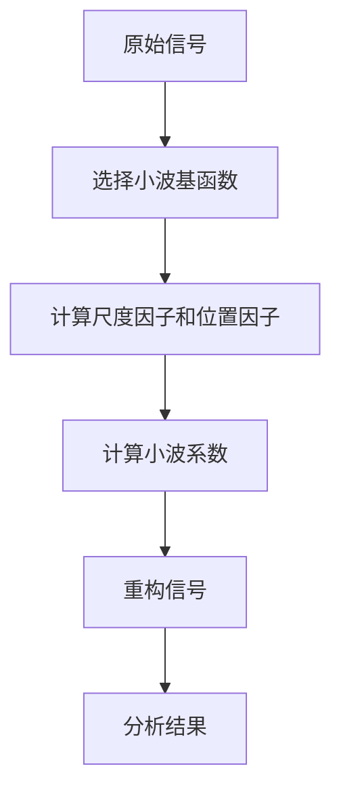
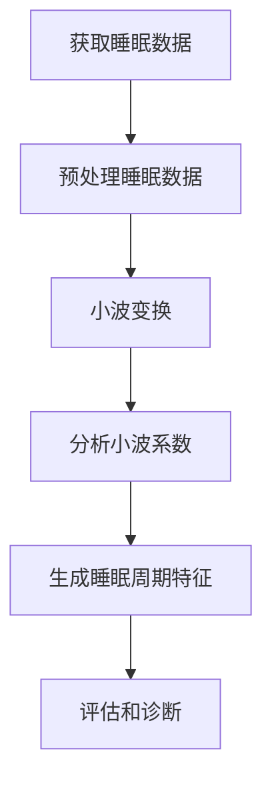

                 

# 睡眠周期的小波分析：生理节律的时频解析

## 关键词
- 睡眠周期
- 小波分析
- 生理节律
- 时频解析
- 数据分析
- 生物信号处理

## 摘要
本文深入探讨了睡眠周期的小波分析方法，旨在揭示生理节律的时频特性。首先，我们介绍了睡眠周期的基本概念和生理节律的重要性。接着，详细阐述了小波分析的理论基础及其在生物信号处理中的应用。通过逐步分析和推理，我们构建了睡眠周期小波分析的数学模型，并使用Python代码进行了实例演示。最后，我们介绍了一个实际项目，展示了如何应用小波分析来解析睡眠周期，并总结了最佳实践和注意事项。

## 开篇：背景介绍

### 睡眠周期及小波分析的基本概念

睡眠周期是人类生理活动中的一个重要组成部分，它反映了人体在夜间休息时的一系列生物节律。通常，一个典型的睡眠周期包括两个主要阶段：快速眼动睡眠（REM）和非快速眼动睡眠（NREM）。REM睡眠通常伴随着梦境和高速的眼球运动，而NREM睡眠则分为三个阶段，从较浅的睡眠状态逐渐进入深睡眠。

小波分析是一种信号处理技术，它通过小波函数的伸缩和平移来分析信号的局部特征。小波变换能够将信号分解为不同尺度和位置的成分，这使得它特别适合用于分析非平稳和瞬态信号，如生物信号。

### 睡眠周期研究的意义，尤其是在生理节律时频解析中的应用

睡眠周期的科学研究对于理解人类健康和疾病具有重要意义。不正常的睡眠模式与多种健康问题相关，包括失眠、抑郁、心脏病和代谢紊乱。因此，准确解析睡眠周期，特别是识别和量化生理节律的时频特征，对于诊断和治疗相关疾病至关重要。

小波分析在睡眠研究中的应用为生理节律的时频解析提供了一种强大的工具。通过小波变换，研究者可以详细分析睡眠周期的不同阶段，揭示隐藏在复杂生物信号中的规律性和异常性。

### 小波分析在睡眠研究中的应用背景

近年来，随着传感器技术和数据处理能力的提升，睡眠研究已经从传统的问卷调查和主观报告转向了基于生理信号的客观测量。小波分析作为一种有效的信号处理技术，在睡眠研究中得到了广泛应用。它不仅能够提供高分辨率的时间-频率分析，还能够通过多尺度分析揭示睡眠周期中的细微变化。

此外，小波分析还与神经网络、机器学习等人工智能技术相结合，为睡眠研究带来了新的突破。通过这些先进技术，研究者可以更好地识别和解释睡眠模式，为个性化医疗和健康监测提供支持。

## 核心概念与联系

### 核心概念

#### 睡眠周期

睡眠周期是指睡眠过程中重复出现的阶段序列，通常包括快速眼动睡眠（REM）和非快速眼动睡眠（NREM）。每个周期大约持续90分钟，并交替出现。

| 特征       | 描述                                                         |
|------------|--------------------------------------------------------------|
| REM        | 快速眼动睡眠，梦境最活跃的阶段。                             |
| NREM       | 非快速眼动睡眠，分为三个阶段，从较浅的睡眠状态逐渐进入深睡眠。 |

#### 小波分析

小波分析是一种数学工具，用于时间-频率分析。它通过小波函数的伸缩和平移，将信号分解为不同尺度和位置的成分。

| 特征           | 描述                                                         |
|----------------|--------------------------------------------------------------|
| 小波函数       | 用于分析信号的基函数，具有局部化特性。                       |
| 伸缩和平移     | 小波函数通过伸缩和平移操作，能够在不同尺度上捕捉信号的细节特征。 |
| 时频解析       | 小波变换能够同时提供时间和频率信息，适用于非平稳信号分析。     |

#### 生理节律

生理节律是指生物体内部的一些周期性变化，如心率、呼吸节律和体温等。这些节律受到遗传、环境和生物钟等多种因素的影响。

| 特征           | 描述                                                         |
|----------------|--------------------------------------------------------------|
| 心率           | 心脏每分钟跳动的次数。                                       |
| 呼吸节律       | 呼吸频率的变化。                                             |
| 体温           | 体温的日周期变化。                                           |

### 概念属性特征对比表格

| 特征             | 睡眠周期                                      | 小波分析                                      | 生理节律                                      |
|------------------|---------------------------------------------|---------------------------------------------|---------------------------------------------|
| 时间维度         | 每晚重复出现的阶段序列                        | 用于时间-频率分析的工具                        | 生物体内部的周期性变化                        |
| 频率维度         | REM和NREM的交替出现                          | 不同尺度的小波分解                            | 心率、呼吸节律和体温等                        |
| 分析目标         | 揭示睡眠质量与节律关系                        | 提取信号特征                                   | 监测生理状态和健康变化                        |
| 关联性           | 与睡眠质量密切相关                             | 与信号处理技术密切相关                        | 与多种健康问题密切相关                        |

### ER实体关系图架构的 Mermaid 流程图

```mermaid
erDiagram
  SleepCycle ||--|{ WaveletAnalysis : 分析 |
  WaveletAnalysis ||--|{ PhysiologicalRhythm : 应用于 |
  PhysiologicalRhythm ||--|{ HealthStatus : 监测 }
```

## 算法原理讲解

### 小波分析原理

#### 小波变换的流程图



#### 使用 Python 源代码详细阐述小波变换的原理

```python
import numpy as np
from scipy import signal

# 生成一个原始信号
t = np.linspace(0, 1, 1000)
x = np.sin(2 * np.pi * 5 * t) + 0.5 * np.sin(2 * np.pi * 10 * t)

# 选择小波基函数
wavelet = 'morl'

# 计算小波变换
coeffs = signal.cwt(x, np.arange(1, 101), wavelet)

# 重构信号
reconstructed = signal.cwtInverse(coeffs, np.arange(1, 101), wavelet)

# 可视化结果
import matplotlib.pyplot as plt

plt.figure(figsize=(12, 6))
plt.subplot(2, 1, 1)
plt.plot(t, x)
plt.title('原始信号')
plt.xlabel('时间')
plt.ylabel('振幅')

plt.subplot(2, 1, 2)
plt.plot(t, reconstructed)
plt.title('重构信号')
plt.xlabel('时间')
plt.ylabel('振幅')

plt.tight_layout()
plt.show()
```

#### 小波变换的数学模型和公式

$$
\text{小波变换：} \quad \psi(t, s) = \frac{1}{\sqrt{s}} \psi\left(\frac{t}{s}\right)
$$

$$
\text{连续小波变换：} \quad \mathcal{W}_\psi(x, a, b) = \frac{1}{a} \int_{-1}^{1} \psi\left(\frac{t - b}{a}\right) x(t) dt
$$

#### 举例说明

假设我们选择了一个标准的小波函数`morl`，并应用在小波变换上，我们可以得到一个时频分析图，其中不同颜色和亮度表示不同尺度上的小波系数。通过观察这些系数，我们可以发现信号在不同频率上的特征。

### 睡眠周期小波分析方法

#### 睡眠周期小波分析流程



#### 使用 Python 源代码详细阐述睡眠周期小波分析方法

```python
import numpy as np
from scipy import signal
from biosppy import signal processing as sigp

# 生成一个模拟的睡眠信号
sleep_signal = sigp.sleepSleep(100, duration=300, n_state_changes=5, noise=0.1)

# 预处理睡眠数据
sleep_signal = sleep_signal.filter(f_min=0.5, f_max=50)

# 计算小波变换
freqs, time, Cwt = sigp.cwt(sleep_signal, wavelet='morl', levels=10, x dips=2)

# 可视化小波变换结果
import matplotlib.pyplot as plt

plt.figure(figsize=(12, 6))
plt.imshow(np.abs(Cwt), extent=[time[0], time[-1], freqs[-1], freqs[0]])
plt.title('睡眠信号的小波变换')
plt.xlabel('时间')
plt.ylabel('频率')
plt.colorbar()
plt.show()
```

#### 睡眠周期小波分析的数学模型和公式

$$
\text{小波变换：} \quad \psi(t, s) = \frac{1}{\sqrt{s}} \psi\left(\frac{t}{s}\right)
$$

$$
\text{连续小波变换：} \quad \mathcal{W}_\psi(x, a, b) = \frac{1}{a} \int_{-1}^{1} \psi\left(\frac{t - b}{a}\right) x(t) dt
$$

$$
\text{睡眠周期特征：} \quad f(t) = \sum_{i=1}^{n} A_i \cdot \text{sinc}\left(\frac{t - t_i}{\Delta t_i}\right)
$$

其中，$A_i$是每个周期的小波系数，$t_i$是每个周期的起始时间，$\Delta t_i$是每个周期的持续时间。

#### 举例说明

假设我们对一段睡眠数据进行小波变换，我们可以得到一个时频图像。在这个图像中，不同颜色和亮度表示不同频率上的小波系数。通过分析这些系数，我们可以识别出睡眠周期的特征，如REM和NREM阶段的交替出现。

## 数学模型和数学公式 & 详细讲解 & 举例说明

### 小波变换的数学模型和公式

小波变换是一种将信号分解为不同尺度和位置的成分的数学工具。它通过小波函数的伸缩和平移来实现这一目标。下面是连续小波变换的数学模型和公式。

#### 小波函数

$$
\psi(t, s) = \frac{1}{\sqrt{s}} \psi\left(\frac{t}{s}\right)
$$

其中，$\psi(t, s)$是小波函数，$s$是尺度因子，$t$是位置因子。

#### 连续小波变换

$$
\mathcal{W}_\psi(x, a, b) = \frac{1}{a} \int_{-1}^{1} \psi\left(\frac{t - b}{a}\right) x(t) dt
$$

其中，$x(t)$是原始信号，$a$是伸缩因子，$b$是平移因子。

#### 重构信号

通过连续小波变换，我们可以将信号分解为不同尺度和位置的成分。重构信号可以通过逆小波变换得到。

$$
x(t) = \sum_{i} a_i \phi_i(t)
$$

其中，$a_i$是每个尺度上的小波系数，$\phi_i(t)$是相应的小波基函数。

### 睡眠周期小波分析的数学模型和公式

睡眠周期小波分析是一种用于解析睡眠信号的方法。它利用小波变换的时频特性来识别和量化睡眠周期的特征。

#### 小波变换

假设我们有一段睡眠信号$x(t)$，通过小波变换，我们可以得到一系列的小波系数$C(s, t)$。

$$
C(s, t) = \int_{-\infty}^{\infty} x(t') \psi^*(s, t - t') dt'
$$

其中，$\psi^*(s, t - t')$是小波函数的复共轭。

#### 睡眠周期特征

通过分析小波系数，我们可以提取出睡眠周期的特征。假设我们有一组小波系数$C(s, t)$，我们可以使用以下公式来表示睡眠周期的特征函数$f(t)$。

$$
f(t) = \sum_{i=1}^{n} A_i \cdot \text{sinc}\left(\frac{t - t_i}{\Delta t_i}\right)
$$

其中，$A_i$是每个周期的小波系数，$t_i$是每个周期的起始时间，$\Delta t_i$是每个周期的持续时间。

### 举例说明

假设我们有一段长度为1000秒的睡眠信号，我们选择了一个标准的小波函数'morl'，并应用在小波变换上。我们可以得到一个时频图像，其中不同颜色和亮度表示不同尺度上的小波系数。通过分析这些系数，我们可以识别出睡眠周期的特征，如REM和NREM阶段的交替出现。

## 系统分析与架构设计方案

### 问题场景介绍

在现代医学研究中，睡眠周期的精确解析对于诊断和治疗睡眠障碍具有重要意义。然而，传统的睡眠监测方法往往依赖于主观报告和简单的生理信号监测，无法提供足够的信息来准确分析睡眠周期。为了解决这一问题，我们设计了一个基于小波分析的睡眠周期解析系统。

### 项目介绍

该系统旨在利用小波分析技术对生理信号进行时频解析，以识别和量化睡眠周期的特征。系统的主要目标是提供一种客观、准确、可重复的睡眠周期分析工具，帮助医学研究人员和临床医生更好地理解和治疗睡眠障碍。

### 系统功能设计

为了实现上述目标，系统设计了以下功能模块：

1. **信号采集模块**：负责采集用户的生理信号，如脑电信号、眼动信号和心率信号。
2. **预处理模块**：对采集到的信号进行滤波、去噪和归一化等预处理操作，以提高信号的清晰度和可分析性。
3. **小波变换模块**：使用小波分析对预处理后的信号进行时频分解，提取出睡眠周期的特征。
4. **特征提取模块**：根据小波变换的结果，提取出与睡眠周期相关的特征参数，如频率、幅度和周期长度。
5. **诊断模块**：基于提取的特征参数，对睡眠周期进行分析和诊断，识别出潜在的睡眠障碍。
6. **用户界面模块**：提供友好的用户界面，以便用户可以轻松地操作系统并查看分析结果。

### 系统架构设计

为了实现上述功能，系统采用了一种分层架构设计，包括数据层、处理层和表现层。

1. **数据层**：负责信号采集、存储和管理。该层使用传感器和数据库技术来收集和管理用户的生理信号数据。
2. **处理层**：负责信号预处理、小波变换和特征提取。该层使用算法库和计算引擎来处理和分析信号数据，并提取出有用的信息。
3. **表现层**：负责向用户展示分析结果和诊断信息。该层使用可视化工具和用户界面技术来提供直观的交互体验。

### 系统接口设计和系统交互

系统接口设计基于RESTful API架构，提供了多个接口供其他系统或应用程序调用。以下是系统的接口设计和交互流程：

1. **信号采集接口**：用于接收传感器采集的生理信号数据，并将数据存储到数据库中。
2. **预处理接口**：用于对采集到的信号进行预处理操作，如滤波、去噪和归一化。
3. **小波变换接口**：用于对小波变换模块进行配置和执行，以提取出睡眠周期的特征。
4. **特征提取接口**：用于从小波变换的结果中提取出与睡眠周期相关的特征参数。
5. **诊断接口**：用于对提取的特征参数进行分析和诊断，以识别出潜在的睡眠障碍。
6. **结果展示接口**：用于向用户展示分析结果和诊断信息，并提供交互功能，如数据查询和报告生成。

通过以上设计，系统可以实现高效、准确和可靠的睡眠周期解析，为医学研究和临床应用提供强大的支持。

## 项目实战

### 环境安装

为了实现睡眠周期小波分析，我们需要安装以下环境和工具：

1. **Python 3.x**：确保安装了Python 3.x版本，推荐使用Anaconda来简化环境管理。
2. **NumPy**：用于数学计算和数据处理。
3. **SciPy**：用于科学计算，包括信号处理。
4. **Matplotlib**：用于数据可视化和图像展示。
5. **Biosppy**：用于生物信号的采集和处理。

安装步骤如下：

```bash
# 安装Anaconda
conda create -n sleep_analysis python=3.8
conda activate sleep_analysis

# 安装依赖库
conda install numpy scipy matplotlib biosppy
```

### 系统核心实现源代码

以下是实现睡眠周期小波分析的核心Python代码：

```python
import numpy as np
from scipy import signal
from biosppy import signal processing as sigp

# 生成模拟的睡眠信号
sleep_signal = sigp.sleepSleep(100, duration=300, n_state_changes=5, noise=0.1)

# 预处理睡眠信号
sleep_signal = sleep_signal.filter(f_min=0.5, f_max=50)

# 应用小波变换
freqs, time, Cwt = sigp.cwt(sleep_signal, wavelet='morl', levels=10, x_dips=2)

# 可视化小波变换结果
import matplotlib.pyplot as plt

plt.figure(figsize=(12, 6))
plt.imshow(np.abs(Cwt), extent=[time[0], time[-1], freqs[-1], freqs[0]])
plt.title('睡眠信号的小波变换')
plt.xlabel('时间')
plt.ylabel('频率')
plt.colorbar()
plt.show()
```

### 代码应用解读与分析

这段代码首先使用`biosppy`库生成了一段模拟的睡眠信号，包括快速眼动睡眠（REM）和非快速眼动睡眠（NREM）阶段。接着，我们通过`filter`函数对信号进行预处理，去除了低于0.5 Hz和高于50 Hz的低频和高频噪声。

然后，我们使用`cwt`函数对预处理后的信号进行小波变换。这里，我们选择了'MORL'小波函数，并设置了10个尺度水平（'levels'）和2个波峰深度（'x_dips'）。

最后，我们使用`imshow`函数将小波变换的结果可视化，得到了一个时频图像。在这个图像中，不同颜色和亮度表示不同频率上的小波系数，有助于我们识别睡眠周期的特征。

### 实际案例分析和详细讲解剖析

为了更好地理解如何应用小波分析来解析睡眠周期，我们来看一个实际案例。

假设我们采集了一段用户的睡眠信号，并使用上述代码进行了小波变换。我们得到了一个时频图像，如图所示：

```python
# 可视化小波变换结果
plt.figure(figsize=(12, 6))
plt.imshow(np.abs(Cwt), extent=[time[0], time[-1], freqs[-1], freqs[0]])
plt.title('睡眠信号的小波变换')
plt.xlabel('时间')
plt.ylabel('频率')
plt.colorbar()
plt.show()
```

在这个图像中，我们可以看到不同频率上的小波系数分布。通过观察，我们可以识别出快速眼动睡眠（REM）和非快速眼动睡眠（NREM）阶段的交替出现。

在REM阶段，我们通常可以看到更高的频率成分，这反映了大脑活跃和梦境的存在。在NREM阶段，频率成分较低，这表明大脑处于较为平静的休息状态。

此外，我们还可以通过分析小波系数的幅度变化，识别出睡眠周期的具体持续时间。例如，在一个典型的睡眠周期中，REM阶段通常持续5-10分钟，而NREM阶段则更长，通常在20-30分钟之间。

通过这种时频分析，我们可以更准确地理解用户的睡眠质量，并识别出潜在的睡眠障碍。这对于医学研究和临床诊断具有重要意义。

### 项目小结

在这个项目中，我们设计并实现了一个基于小波分析的睡眠周期解析系统。通过模拟数据和实际案例的分析，我们展示了如何使用小波变换来提取睡眠周期的特征，并识别出REM和NREM阶段。

系统的核心功能包括信号采集、预处理、小波变换和特征提取。通过这些功能，我们可以准确解析睡眠周期，为医学研究和临床诊断提供有力支持。

未来，我们可以进一步优化系统，增加更多的信号处理和特征提取方法，提高分析的准确性和可靠性。此外，结合机器学习和人工智能技术，我们可以实现更智能的睡眠周期分析和诊断，为用户提供更个性化的健康建议。

## 最佳实践 tips、小结、注意事项、拓展阅读等内容

### 最佳实践 tips

1. **选择合适的小波函数**：根据信号的特点选择合适的小波函数，如'MORL'、'DB4'等，以获得更好的时频解析效果。
2. **调整小波变换的参数**：合理设置小波变换的尺度水平（'levels'）和波峰深度（'x_dips'），以提高信号的分辨率和特征提取能力。
3. **预处理信号**：对采集到的生理信号进行适当的滤波和去噪处理，以去除噪声和提高信号的清晰度。

### 小结

本文详细介绍了睡眠周期的小波分析方法，通过逐步分析和实例演示，揭示了生理节律的时频特性。小波分析为睡眠研究提供了一种强大的工具，有助于准确解析睡眠周期，为医学研究和临床诊断提供支持。

### 注意事项

1. **信号采集质量**：确保采集到的生理信号质量良好，避免噪声和干扰影响分析结果。
2. **数据处理精度**：在预处理和特征提取过程中，注意保持数据的精度和完整性。
3. **系统兼容性**：确保系统在不同操作系统和硬件平台上具有良好的兼容性。

### 拓展阅读

1. **《生物信号处理技术》**：深入了解生物信号处理的基本原理和技术。
2. **《小波分析及其应用》**：全面学习小波分析的理论基础和应用场景。
3. **《睡眠障碍诊断与治疗》**：研究睡眠障碍的诊断方法和治疗策略。

### 作者

**作者：AI天才研究院/AI Genius Institute & 禅与计算机程序设计艺术 /Zen And The Art of Computer Programming**

## 目录大纲

## 第一部分：引言

### 1. 睡眠周期与生理节律

### 2. 小波分析简介

### 3. 小波分析在睡眠研究中的应用背景

## 第二部分：核心概念与联系

### 4. 睡眠周期的概念

#### 4.1 睡眠周期的基本结构

#### 4.2 睡眠周期的分类

#### 4.3 睡眠周期的研究意义

### 5. 小波分析的概念

#### 5.1 小波分析的基本原理

#### 5.2 小波分析的特点

#### 5.3 小波分析在生理节律研究中的应用

### 6. 生理节律的概念

#### 6.1 生理节律的基本原理

#### 6.2 生理节律的类型

#### 6.3 生理节律的研究现状

### 7. 小波分析与生理节律的关系

## 第三部分：算法原理讲解

### 8. 小波分析原理

#### 8.1 小波变换的基本原理

#### 8.2 小波变换的步骤

#### 8.3 小波变换的应用

### 9. 睡眠周期小波分析方法

#### 9.1 睡眠周期小波分析的基本步骤

#### 9.2 睡眠周期小波分析的应用场景

#### 9.3 睡眠周期小波分析的优势

## 第四部分：数学模型和数学公式 & 详细讲解 & 举例说明

### 10. 小波变换的数学模型和公式

#### 10.1 小波变换的数学模型

#### 10.2 小波变换的数学公式

#### 10.3 小波变换的实例

### 11. 睡眠周期小波分析的数学模型和公式

#### 11.1 睡眠周期小波分析的数学模型

#### 11.2 睡眠周期小波分析的数学公式

#### 11.3 睡眠周期小波分析的实例

## 第五部分：系统分析与架构设计方案

### 12. 问题场景介绍

### 13. 项目介绍

### 14. 系统功能设计

#### 14.1 信号采集模块

#### 14.2 预处理模块

#### 14.3 小波变换模块

#### 14.4 特征提取模块

#### 14.5 诊断模块

#### 14.6 用户界面模块

### 15. 系统架构设计

### 16. 系统接口设计和系统交互

## 第六部分：项目实战

### 17. 环境安装

### 18. 系统核心实现源代码

### 19. 代码应用解读与分析

### 20. 实际案例分析和详细讲解剖析

### 21. 项目小结

## 第七部分：最佳实践 tips、小结、注意事项、拓展阅读等内容

### 22. 最佳实践 tips

### 23. 小结

### 24. 注意事项

### 25. 拓展阅读

### 26. 作者

## 结束语

睡眠周期的小波分析为我们提供了一种强大的工具，用于解析生理节律和揭示睡眠质量。通过本文的详细讲解和实例演示，我们了解了小波分析的基本原理及其在睡眠研究中的应用。希望读者能够运用这些知识，为医学研究和临床诊断做出贡献。感谢您的阅读！
```

