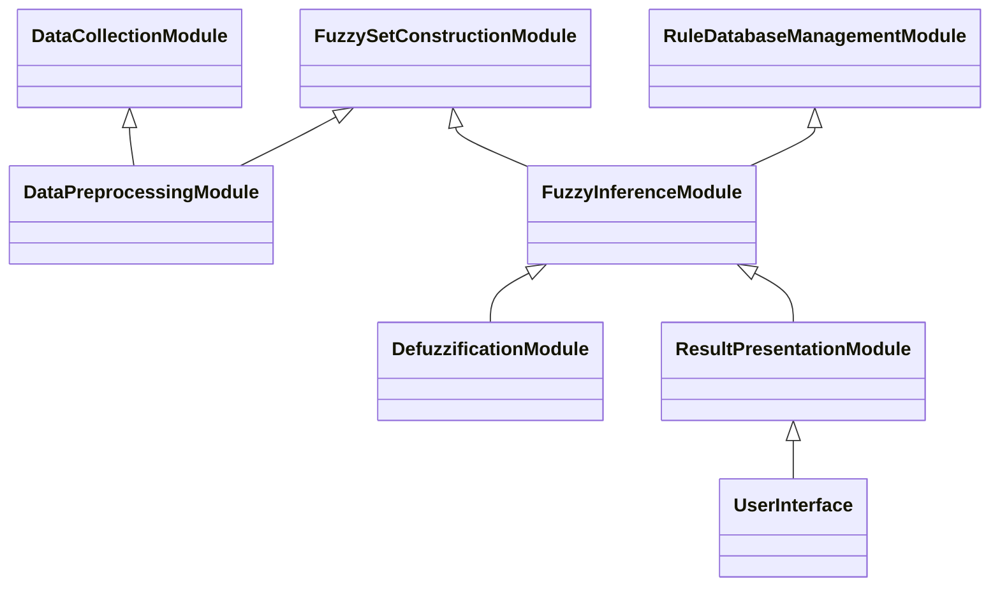
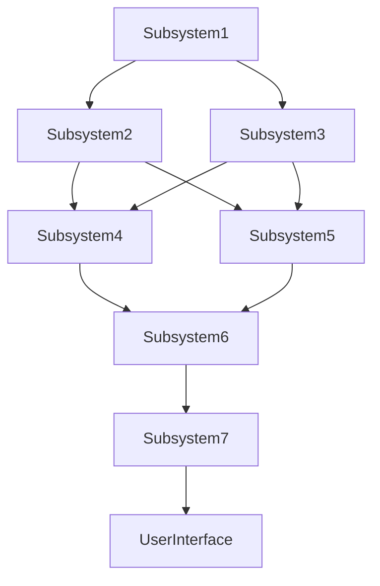
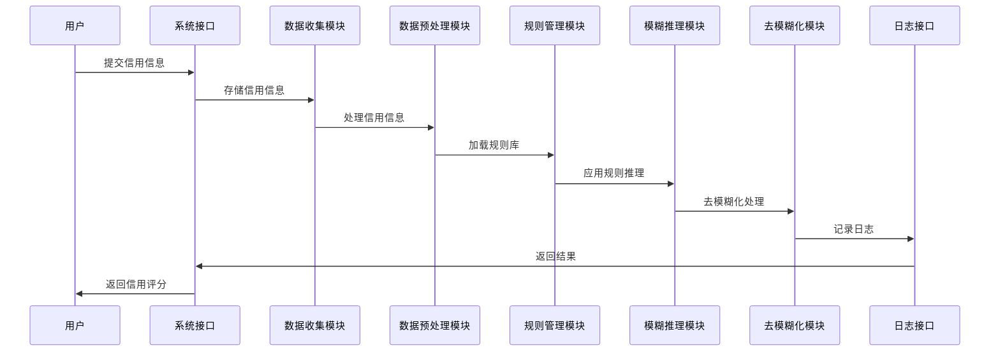

                 

### 摘要

本文旨在深入探讨社会信用的模糊推理系统及其在行为评估中的应用。社会信用体系是现代社会中一个日益重要的组成部分，它通过量化个体的信用行为来影响其社会和经济活动。模糊推理系统作为一种数学框架，因其灵活性和处理不确定性的能力，成为信用评估的有效工具。本文首先介绍了社会信用体系的基本概念和意义，然后详细阐述了模糊推理系统的定义、特点及其在信用评估中的适用性。接着，文章通过核心概念的对比和ER实体关系图架构的描述，为读者搭建了理解模糊推理系统的坚实基础。随后，本文深入探讨了社会信用模糊推理算法的原理，包括数学模型和Python实现，并辅以详细的示例说明。接下来，文章介绍了系统分析与架构设计的方法，通过具体场景、功能模块划分、架构图和接口设计等环节，使读者对系统有全面的理解。随后，通过项目实战和环境安装、系统核心实现的详细讲解，以及实际案例的分析，本文展现了模糊推理系统在社会信用评估中的实际应用。最后，本文总结了最佳实践和注意事项，并提出了未来研究方向，旨在为读者提供全面的指导和建议。通过本文的阅读，读者将能够深入了解社会信用模糊推理系统的理论框架和应用实践，为其在实际项目中的开发和应用提供有力支持。

## 社会信用体系的概述

### 社会信用体系的概念与意义

社会信用体系是一个综合性的评估系统，通过收集、处理和分析个体的信用行为，以数字化的方式呈现其信用状况。它不仅仅是一个信用信息的收集平台，更是一种社会管理工具，旨在促进社会诚信和公平，优化资源配置，提高社会整体效率。社会信用体系的概念起源于经济学和统计学，经过多年的发展，逐渐演变成一个跨学科的综合体系，涵盖了法律、金融、科技等多个领域。

社会信用体系的意义在于其对社会和经济生活的深远影响。首先，它有助于建立和维护社会的信用秩序，通过公正、透明的评估机制，增强公众的信任感。其次，它为金融机构提供了可靠的信用评估依据，降低了金融风险，提高了金融服务的效率。此外，社会信用体系还能够在市场监管中发挥重要作用，通过对个体和企业的信用评级，督促其遵守法律法规，规范市场行为。

### 社会信用体系的发展历程

社会信用体系的发展历程可以分为三个阶段：初步探索阶段、规范化发展阶段和数字化智能化阶段。

在初步探索阶段，信用评估主要依赖于个人的信用历史和行为记录，如贷款还款记录、信用卡使用情况等。这一阶段的信用评估机制较为简单，主要依靠人工处理，缺乏系统性和科学性。

随着信息技术的发展，规范化发展阶段开始出现。这个阶段的特点是，信用评估开始采用更科学的方法和工具，如数据挖掘、机器学习等。信用信息的收集和处理变得更加高效和准确，信用评估的结果更加可靠。

当前，社会信用体系正处于数字化智能化阶段。大数据和人工智能技术的应用，使得信用评估系统更加智能化和自动化。通过海量的数据分析和智能算法，信用评估不仅更加精准，而且能够实时更新和调整，适应快速变化的社会和经济环境。

### 社会信用体系的主要组成部分

社会信用体系的主要组成部分包括信用评估机构、信用信息数据库和信用评级模型。

信用评估机构是社会信用体系的核心，负责收集、处理和分析信用信息，并进行信用评估。这些机构可以是政府机构、金融机构或第三方信用评级公司。它们的职责是确保信用评估的公正性、透明性和科学性。

信用信息数据库是社会信用体系的基础。它包含了大量的信用信息，如个人身份信息、金融交易记录、公共记录等。这些数据通过标准化和规范化的处理，成为信用评估的重要依据。

信用评级模型是社会信用体系的关键工具。不同的信用评级模型基于不同的评估标准和算法，对个体的信用状况进行量化评估。这些模型可以是基于历史数据的统计模型，也可以是利用机器学习算法构建的预测模型。通过这些模型，信用评估机构能够对个体的信用风险进行准确预测和评估。

### 总结

社会信用体系作为现代社会管理的重要工具，其概念和意义不容忽视。通过对社会信用体系的发展历程和主要组成部分的概述，我们可以更好地理解其复杂的运行机制和深远的社会影响。接下来，本文将深入探讨模糊推理系统的基本概念和应用领域，为理解社会信用模糊推理系统奠定基础。

## 模糊推理系统概述

### 模糊推理系统的定义与特点

模糊推理系统是一种基于模糊集合理论的智能计算方法，主要用于处理不确定性和模糊性的问题。模糊集合理论是由扎德（L.A. Zadeh）在1965年提出的，它通过引入隶属度函数来描述模糊性，使得系统可以处理那些在传统二值逻辑中难以精确描述的信息。

模糊推理系统的核心概念包括模糊集合、隶属度函数、模糊规则和模糊推理算法。模糊集合是模糊推理系统的基本元素，它通过隶属度函数来描述个体对某一集合的隶属程度，从而处理传统集合论中的模糊边界问题。隶属度函数可以是线性、非线性、分段线性等多种形式，根据具体问题的需求进行选择。

模糊推理系统的特点主要包括以下几个方面：

1. **处理不确定性**：模糊推理系统能够有效地处理现实世界中的不确定性问题，通过模糊集合和隶属度函数来描述和处理模糊性，从而得到更为合理的解决方案。

2. **灵活性强**：模糊推理系统可以根据不同的应用场景和需求，灵活调整隶属度函数和模糊规则，使得系统具有较高的适应性和可扩展性。

3. **易于实现**：模糊推理系统的实现相对简单，可以通过简单的数学模型和计算机编程来实现，降低了系统开发的难度和成本。

4. **适用范围广**：模糊推理系统广泛应用于各个领域，如控制工程、决策支持、图像处理、智能交通等，展现了其广泛的适用性。

### 模糊推理系统的应用领域

模糊推理系统在多个领域中得到了广泛应用，其主要应用领域包括：

1. **控制工程**：模糊推理系统在控制工程中得到了广泛应用，如模糊控制器用于调节温度、湿度等参数，实现复杂的控制系统。例如，在工业生产过程中，模糊推理系统可以根据实时数据调整生产参数，提高生产效率和质量。

2. **决策支持系统**：在决策支持系统中，模糊推理系统用于处理不确定性和模糊性，为决策者提供辅助决策。例如，在风险分析中，模糊推理系统可以根据多种因素和不确定性信息，提供风险评估和决策建议。

3. **图像处理**：在图像处理领域，模糊推理系统用于图像增强、图像分割、目标识别等任务。通过模糊逻辑处理图像数据，可以提取出更准确的目标信息和特征。

4. **智能交通系统**：模糊推理系统在智能交通系统中用于交通流量预测、交通信号控制、车辆导航等。通过分析实时交通数据，模糊推理系统可以动态调整交通信号，提高交通流通效率和安全性。

5. **医疗诊断系统**：在医疗领域，模糊推理系统用于辅助诊断和治疗决策。通过分析病人的症状和体征数据，模糊推理系统可以提供初步的诊断建议，辅助医生进行诊断和治疗。

### 模糊推理系统的发展历程

模糊推理系统的发展历程可以分为以下几个阶段：

1. **初始阶段（1965-1975）**：扎德提出模糊集合理论，模糊推理系统的基础理论得以建立。

2. **发展阶段（1975-1990）**：模糊推理系统在多个领域得到应用，各种模糊推理算法和模型相继被提出。

3. **成熟阶段（1990-2010）**：随着计算机技术的快速发展，模糊推理系统在复杂问题中的应用更加广泛，理论体系逐渐完善。

4. **智能化阶段（2010至今）**：人工智能和大数据技术的结合，使得模糊推理系统在处理大规模数据和复杂问题中展现出强大的能力。

通过上述概述，我们可以看到模糊推理系统作为一种智能计算方法，其在处理不确定性和模糊性问题上的独特优势和广泛的应用前景。接下来，本文将详细探讨模糊推理系统中的核心概念和其在信用评估中的适用性。

### 模糊推理系统中的核心概念

在模糊推理系统中，有几个核心概念是理解和应用该系统的关键，这些概念包括模糊集合、隶属度函数、模糊逻辑与模糊关系，以及模糊推理算法。

#### 模糊集合与隶属度函数

模糊集合是模糊推理系统的基本构建块。与经典集合不同，模糊集合中的元素可以拥有不同程度的隶属度，而不是非黑即白的二值隶属。隶属度函数是描述元素隶属度的数学工具，它通常是一个介于0和1之间的数值，表示元素对某一集合的隶属程度。

隶属度函数的类型多种多样，包括线性函数、三角函数、高斯函数等。选择合适的隶属度函数对于系统的性能至关重要。例如，线性隶属度函数简单易实现，但可能不适合处理复杂的非线性问题；而高斯隶属度函数能够较好地模拟现实世界中的连续性，但计算复杂度较高。

#### 模糊逻辑与模糊关系

模糊逻辑是模糊推理系统的核心，它基于模糊集合进行推理。模糊逻辑与经典逻辑不同，经典逻辑是基于二值逻辑（True/False），而模糊逻辑则引入了不同程度的真值。这使得模糊逻辑能够处理现实世界中存在的不确定性和模糊性。

模糊关系是模糊逻辑的重要组成部分，它描述了两个模糊集合之间的关联。例如，如果A和B是两个模糊集合，模糊关系R可以表示为“A与B相关联的程度”。模糊关系可以通过模糊矩阵来表示，进一步用于复杂的推理和计算。

#### 模糊推理算法

模糊推理算法是模糊推理系统的核心，用于根据输入信息推导出输出结果。常见的模糊推理算法包括Mamdani算法和Sugeno算法。

- **Mamdani算法**：该算法通过模糊规则库和模糊推理引擎进行推理。模糊规则通常表示为“如果-那么”形式，例如，“如果信用评分高，那么信用评级为优秀”。Mamdani算法通过模糊化、推理和解模糊化步骤，将输入变量映射到输出变量。

- **Sugeno算法**：Sugeno算法是一种基于集合理论的模糊推理算法，它使用线性模糊集来表示模糊规则的后件。Sugeno算法的输出可以直接用于控制和优化，特别适用于实时控制系统。

#### 不同模糊推理算法的比较

Mamdani算法和Sugeno算法是两种最常见的模糊推理算法，它们在应用中各有优势。

- **Mamdani算法**：适合处理复杂非线性系统，具有较好的解释性和可视化效果，但可能需要较多的规则和计算资源。

- **Sugeno算法**：计算效率高，适用于实时控制和优化，但可能缺乏Mamdani算法的直观性。

模糊推理系统在信用评估中的适用性

模糊推理系统在信用评估中具有显著的适用性。首先，信用评估涉及多个变量和不确定性，模糊推理系统能够有效处理这些不确定性。其次，信用评估中的模糊性（如“较好”的评分）可以通过模糊集合和隶属度函数进行量化。此外，模糊推理系统的灵活性和可扩展性使其能够适应不同类型的信用评估需求。

通过上述对模糊推理系统中核心概念的详细解释，我们可以更好地理解这一系统的原理和优势。接下来，本文将介绍模糊推理系统的ER实体关系图架构，为深入分析该系统提供更为清晰的框架。

### 模糊推理系统的ER实体关系图架构

在理解模糊推理系统的整体架构时，实体关系图（Entity-Relationship Diagram，ER图）是一种强有力的工具，能够帮助我们清晰地定义系统中的实体及其关系。ER图不仅可以直观地展示系统的结构，还能为后续的设计和实现提供基础。

#### 实体与关系的定义

在模糊推理系统中，实体是系统中的基本元素，表示具体的对象或概念。关系则描述了实体之间的相互作用和依赖。以下是模糊推理系统中的关键实体和关系：

- **实体：**

  1. **模糊集合**：表示模糊推理系统中的基础数据结构，包含多个隶属度函数。
  2. **规则库**：存储模糊推理规则，包括前件和后件。
  3. **输入变量**：系统接收的外部信息，如信用评分、交易记录等。
  4. **输出变量**：推理系统输出的结果，如信用评级。
  5. **隶属度函数**：用于计算实体隶属度的数学函数。

- **关系：**

  1. **隶属度关系**：连接输入变量和隶属度函数，描述输入变量对隶属度函数的影响。
  2. **推理关系**：连接规则库和输出变量，表示模糊推理过程中规则的应用。
  3. **数据流关系**：描述输入变量和输出变量之间的数据传递过程。

#### 模糊推理系统的ER实体关系图

为了更直观地展示模糊推理系统的实体和关系，下面是一个简化的ER图（使用Mermaid语法表示）：

```mermaid
erDiagram
  模糊集合 ||--|{ 隶属度函数 }|| 隶属度关系
  规则库 ||--|{ 模糊规则 }|| 推理关系
  输入变量 ||--|{ 隶属度函数 }|| 隶属度关系
  输出变量 ||--|{ 推理关系 }|| 推理关系
  模糊集合 ..|> 输入变量 : 数据流关系
  输出变量 ..|> 规则库 : 数据流关系
```

在上面的ER图中：

- **模糊集合**与**隶属度函数**之间存在隶属度关系，表示隶属度函数用于计算模糊集合中元素的隶属度。
- **规则库**与**模糊规则**之间存在推理关系，表示推理过程中应用这些规则。
- **输入变量**与**隶属度函数**之间存在隶属度关系，表示输入变量通过隶属度函数映射到模糊集合。
- **输出变量**与**规则库**之间存在推理关系，表示推理系统的输出结果。

#### ER图在系统架构设计中的作用

ER图在模糊推理系统的架构设计中起到了关键作用：

1. **系统建模**：通过ER图，我们可以对系统进行抽象和建模，理解系统中的关键实体及其关系，为系统设计提供理论基础。
2. **需求分析**：在需求分析阶段，ER图有助于识别系统的功能和数据需求，确保系统的设计与实际应用需求相匹配。
3. **设计验证**：ER图可以作为设计验证的工具，通过检查实体和关系的完整性、一致性，确保系统设计没有遗漏或错误。

通过上述ER图，我们不仅能够清晰地展示模糊推理系统的结构，还能为后续的算法实现和系统开发提供指导。接下来，本文将深入探讨社会信用模糊推理算法的原理，通过数学模型和Python实现，详细介绍其工作过程。

### 社会信用模糊推理算法原理

#### 模糊推理算法在信用评估中的应用

在信用评估中，模糊推理算法通过处理模糊性和不确定性，提供了一种有效的解决方案。信用评估涉及多个因素，如还款记录、信用历史、行为记录等，这些因素具有模糊性和不确定性。传统的信用评估方法通常依赖于明确的评分模型，但面对复杂的多维度评估需求时，往往难以兼顾所有因素。而模糊推理系统通过引入模糊集合和隶属度函数，能够更加灵活和精确地处理这些复杂情况。

模糊推理算法在信用评估中的应用主要包括以下步骤：

1. **模糊化输入数据**：将原始的输入数据（如还款记录、信用历史等）通过隶属度函数进行模糊化处理，将其映射到模糊集合中。
2. **规则库构建**：根据信用评估的标准和经验，构建包含“如果-那么”规则的模糊规则库。这些规则通常表示为模糊条件语句，如“如果还款记录良好，那么信用评分高”。
3. **模糊推理**：通过模糊推理引擎，根据输入数据的模糊集合和模糊规则库，推导出输出变量的模糊集合。推理过程中会进行模糊集合的运算和模糊规则的组合。
4. **去模糊化**：将模糊推理结果进行去模糊化处理，得到一个明确的信用评分或评级结果。

#### 模糊推理算法的数学模型

模糊推理算法的数学模型主要包括模糊集合、隶属度函数和模糊规则。

1. **模糊集合**：在模糊推理系统中，模糊集合用来描述不确定性和模糊性。一个模糊集合是通过隶属度函数来定义的，隶属度函数通常是一个从论域到[0,1]区间的映射函数。隶属度函数可以有多种形式，如三角函数、高斯函数等。

   假设我们有一个论域X，一个模糊集合A在X上的隶属度函数表示为：
   $$
   \mu_A(x) = \text{隶属度}(x, A)
   $$
   其中，$\mu_A(x)$表示元素$x$对模糊集合A的隶属度。

2. **隶属度函数**：隶属度函数是模糊推理系统的核心，它决定了模糊集合的具体形状和特性。例如，一个三角隶属度函数可以表示如下：
   $$
   \mu_T(x) = 
   \begin{cases} 
   0 & \text{if } x \leq a \\
   \frac{x - a}{b - a} & \text{if } a < x \leq b \\
   1 & \text{if } x > b 
   \end{cases}
   $$
   其中，$a$和$b$是模糊集合的上下界。

3. **模糊规则**：模糊规则是模糊推理系统的基本组件，通常表示为“如果-那么”形式。在信用评估中，模糊规则可以描述为“如果还款记录良好且信用历史稳定，那么信用评分高”。

   模糊规则可以表示为一个条件语句，其中条件部分是一个或多个模糊集合的交集，结果部分是一个模糊集合。例如，一个模糊规则可以表示为：
   $$
   R: \text{如果 } A_1 \land A_2, \text{那么 } B
   $$
   其中，$A_1$和$A_2$是模糊集合，$B$是模糊集合。

#### 模糊推理算法的Python实现

为了更好地理解模糊推理算法的工作原理，下面给出一个简单的Python实现示例。

首先，我们需要定义模糊集合和隶属度函数：

```python
import numpy as np

# 定义三角隶属度函数
def triangular_mf(x, a, b, c):
    if x <= a:
        return 0
    elif x <= b:
        return (x - a) / (b - a)
    elif x <= c:
        return 1
    else:
        return 0

# 定义论域
x = np.linspace(0, 100, 1000)

# 示例隶属度函数
mf1 = triangular_mf(x, 0, 50, 70)
mf2 = triangular_mf(x, 50, 70, 100)
```

接下来，我们定义模糊规则库：

```python
# 定义模糊规则
def fuzzy_rule(input1, input2, rule):
    if rule == "if input1 is good and input2 is stable, then output is high":
        return np.minimum(mf1, mf2)
    else:
        return 0
```

最后，我们进行模糊推理：

```python
# 输入数据模糊化
input1 = triangular_mf(x, 0, 50, 70)
input2 = triangular_mf(x, 0, 50, 70)

# 模糊推理
output = fuzzy_rule(input1, input2, "if input1 is good and input2 is stable, then output is high")

# 去模糊化
def defuzzify(output):
    return np.sum(x * output) / np.sum(output)

defuzzified_output = defuzzify(output)

print("Defuzzified Output:", defuzzified_output)
```

通过上述代码，我们实现了基本的模糊推理过程，包括模糊化、推理和解模糊化。这个示例展示了模糊推理算法在处理信用评分时的工作原理。接下来，我们将详细解释模糊推理的基本数学模型和运算公式，并通过具体的示例进行说明。

### 模糊推理的基本数学模型和运算公式

模糊推理系统的核心在于其数学模型和运算公式，这些工具能够将模糊逻辑应用于具体问题中。以下将详细解释模糊推理的基本数学模型和运算过程。

#### 模糊集合的基本运算

模糊集合的运算包括模糊化、模糊推理、去模糊化等步骤。以下介绍几种基本的模糊集合运算。

1. **模糊化（Fuzzification）**：将输入数据（如数值、文字等）转化为模糊集合。例如，通过隶属度函数将信用评分转化为模糊集合，表示评分在不同等级上的隶属度。

   示例：使用三角隶属度函数模糊化信用评分。
   $$
   \mu_{\text{score}}(x) =
   \begin{cases}
   0 & \text{if } x \leq 0 \\
   \frac{x}{100} & \text{if } 0 < x \leq 50 \\
   1 & \text{if } x > 50
   \end{cases}
   $$
   
2. **模糊集合的交集（Intersection）**：计算两个模糊集合之间的交集，表示同时满足两个条件的隶属度。
   $$
   \mu_{A \cap B}(x) = \min(\mu_A(x), \mu_B(x))
   $$
   
3. **模糊集合的并集（Union）**：计算两个模糊集合之间的并集，表示满足任一条件的隶属度。
   $$
   \mu_{A \cup B}(x) = \max(\mu_A(x), \mu_B(x))
   $$

4. **模糊集合的补集（Complement）**：计算一个模糊集合的补集，表示不属于该集合的隶属度。
   $$
   \mu_{A^c}(x) = 1 - \mu_A(x)
   $$

#### 模糊推理的运算公式

模糊推理的核心在于通过模糊规则将输入数据映射到输出结果。以下介绍几种常用的模糊推理运算公式。

1. **Mamdani模糊推理算法**：该算法通过模糊规则库进行推理，使用加权平均方法进行去模糊化。
   $$
   \mu_{O}(x) = \sum_{i=1}^n w_i \cdot \mu_{R_i}(x)
   $$
   其中，$O$是输出模糊集合，$R_i$是第$i$条模糊规则，$w_i$是规则$i$的权重。

2. **Sugeno模糊推理算法**：该算法通过模糊规则库进行推理，使用线性加权方法进行去模糊化。
   $$
   \mu_{O}(x) = \sum_{i=1}^n w_i \cdot f_i(x)
   $$
   其中，$O$是输出模糊集合，$R_i$是第$i$条模糊规则，$w_i$是规则$i$的权重，$f_i(x)$是规则$i$的模糊集函数。

#### 举例说明

假设我们要对一个人的信用评分进行评估，输入数据包括还款记录和信用历史，输出数据是信用评分。我们定义以下模糊集合：

- **还款记录（Input1）**：良好（Good）、一般（Normal）、较差（Bad）
- **信用历史（Input2）**：稳定（Stable）、波动（Fluctuating）、不稳定（Unstable）
- **信用评分（Output）**：高（High）、中（Medium）、低（Low）

定义隶属度函数如下：

还款记录（Input1）：

$$
\mu_{\text{Good}}(x) =
\begin{cases}
1 & \text{if } x > 90 \\
0 & \text{if } x \leq 90
\end{cases}
$$

$$
\mu_{\text{Normal}}(x) =
\begin{cases}
0 & \text{if } x \leq 60 \\
\frac{x - 60}{30} & \text{if } 60 < x \leq 90 \\
1 & \text{if } x > 90
\end{cases}
$$

$$
\mu_{\text{Bad}}(x) =
\begin{cases}
0 & \text{if } x \leq 30 \\
\frac{x - 30}{30} & \text{if } 30 < x \leq 60 \\
1 & \text{if } x > 60
\end{cases}
$$

信用历史（Input2）：

$$
\mu_{\text{Stable}}(x) =
\begin{cases}
1 & \text{if } x > 80 \\
0 & \text{if } x \leq 80
\end{cases}
$$

$$
\mu_{\text{Fluctuating}}(x) =
\begin{cases}
0 & \text{if } x \leq 50 \\
\frac{x - 50}{30} & \text{if } 50 < x \leq 80 \\
1 & \text{if } x > 80
\end{cases}
$$

$$
\mu_{\text{Unstable}}(x) =
\begin{cases}
0 & \text{if } x \leq 20 \\
\frac{x - 20}{30} & \text{if } 20 < x \leq 50 \\
1 & \text{if } x > 50
\end{cases}
$$

信用评分（Output）：

$$
\mu_{\text{High}}(x) =
\begin{cases}
1 & \text{if } x > 85 \\
0 & \text{if } x \leq 85
\end{cases}
$$

$$
\mu_{\text{Medium}}(x) =
\begin{cases}
0 & \text{if } x \leq 60 \\
\frac{x - 60}{25} & \text{if } 60 < x \leq 85 \\
1 & \text{if } x > 85
\end{cases}
$$

$$
\mu_{\text{Low}}(x) =
\begin{cases}
0 & \text{if } x \leq 40 \\
\frac{x - 40}{20} & \text{if } 40 < x \leq 60 \\
1 & \text{if } x > 60
\end{cases}
$$

定义模糊规则：

- 如果还款记录良好且信用历史稳定，则信用评分高
- 如果还款记录一般或信用历史波动，则信用评分中等
- 如果还款记录较差或信用历史不稳定，则信用评分低

使用Mamdani模糊推理算法：

1. 模糊化输入数据：假设输入数据为还款记录70分，信用历史60分。
2. 计算隶属度：使用上述隶属度函数计算输入数据的隶属度。
3. 模糊推理：根据模糊规则计算输出模糊集合的隶属度。
4. 去模糊化：使用加权平均法将输出模糊集合转换为具体的信用评分。

通过以上运算，可以得出具体的信用评分。这个过程展示了模糊推理系统在信用评估中的应用，并通过具体的数学模型和公式进行说明。

### 问题场景介绍

在社会信用评估中，模糊推理系统提供了一个强大的工具，能够处理复杂多变的信用评估需求。以下是一个具体的问题场景，我们将详细描述需求、应用模糊推理系统的过程以及如何利用该系统进行信用评估。

#### 场景描述

某金融机构希望开发一个社会信用评估系统，用于对客户的信用行为进行综合评估，从而决定是否批准贷款申请。该系统需要综合考虑以下因素：

1. **还款记录**：包括过去的还款记录，如按时还款、逾期还款、严重逾期等。
2. **信用历史**：客户的整体信用历史，包括信用卡使用、贷款还款等情况。
3. **行为记录**：客户在公共场合的行为表现，如遵守交通规则、公益行为等。
4. **社会关系**：客户的社会关系网，包括家庭成员、朋友、同事等。

#### 应用模糊推理系统的过程

1. **数据收集与预处理**：首先，系统需要收集客户的信用数据，包括还款记录、信用历史、行为记录和社会关系等。然后，对收集的数据进行清洗和预处理，确保数据的质量和一致性。

2. **构建模糊集合**：根据上述需求，定义模糊集合和隶属度函数。例如，对于还款记录，可以定义“优秀”、“良好”、“一般”、“较差”四个模糊集合，并分别定义隶属度函数。

3. **建立规则库**：根据信用评估的经验和标准，建立包含“如果-那么”规则的模糊规则库。例如，如果还款记录优秀且信用历史良好，则信用评分高。

4. **模糊化输入数据**：将客户的实际信用数据通过隶属度函数进行模糊化处理，将其映射到模糊集合中。例如，如果还款记录为90分，则映射到“优秀”模糊集合。

5. **模糊推理**：根据模糊规则库和模糊化后的输入数据，进行模糊推理，推导出客户的信用评分。例如，如果规则库中有“如果还款记录优秀且信用历史稳定，则信用评分高”，则通过模糊推理得到客户信用评分的模糊集合。

6. **去模糊化**：将模糊推理结果进行去模糊化处理，得到一个具体的信用评分。例如，可以使用加权平均法或重心法将模糊集合转换为具体的评分。

#### 信用评估的实现

以下是一个简单的Python实现示例，用于描述上述过程：

```python
# 导入必要的库
import numpy as np
import skfuzzy as fuzz

# 定义隶属度函数
def triangular_mf(x, a, b, c):
    if x <= a:
        return 0
    elif x <= b:
        return (x - a) / (b - a)
    elif x <= c:
        return 1
    else:
        return 0

# 定义输入和输出变量
input1 = np.linspace(0, 100, 1000)  # 还款记录
input2 = np.linspace(0, 100, 1000)  # 信用历史

# 定义隶属度函数参数
params = {
    "还款记录": {"优秀": (0, 50, 75), "良好": (50, 75, 90), "一般": (75, 90, 95), "较差": (95, 100, 100)},
    "信用历史": {"稳定": (0, 50, 75), "波动": (50, 75, 90), "不稳定": (75, 90, 100)}
}

# 模糊化输入数据
mf1 = fuzz.trapmf(input1, params["还款记录"]["优秀"][0], params["还款记录"]["优秀"][1], params["还款记录"]["优秀"][2])
mf2 = fuzz.trapmf(input1, params["还款记录"]["良好"][0], params["还款记录"]["良好"][1], params["还款记录"]["良好"][2])
mf3 = fuzz.trapmf(input1, params["还款记录"]["一般"][0], params["还款记录"]["一般"][1], params["还款记录"]["一般"][2])
mf4 = fuzz.trapmf(input1, params["还款记录"]["较差"][0], params["还款记录"]["较差"][1], params["还款记录"]["较差"][2])

mf5 = fuzz.trapmf(input2, params["信用历史"]["稳定"][0], params["信用历史"]["稳定"][1], params["信用历史"]["稳定"][2])
mf6 = fuzz.trapmf(input2, params["信用历史"]["波动"][0], params["信用历史"]["波动"][1], params["信用历史"]["波动"][2])
mf7 = fuzz.trapmf(input2, params["信用历史"]["不稳定"][0], params["信用历史"]["不稳定"][1], params["信用历史"]["不稳定"][2])

# 定义模糊规则库
rules = [
    ["优秀", "稳定", "高"],
    ["优秀", "波动", "高"],
    ["良好", "稳定", "中"],
    ["良好", "波动", "中"],
    ["一般", "稳定", "低"],
    ["一般", "波动", "低"],
    ["较差", "稳定", "低"],
    ["较差", "波动", "低"]
]

# 定义输出隶属度函数
output_high = fuzz.trapmf(input2, 0, 60, 100)
output_medium = fuzz.trapmf(input2, 0, 40, 60)
output_low = fuzz.trapmf(input2, 0, 20, 40)

# 模糊推理
output = fuzz.honymod(input1, input2, rules, mf1, mf2, mf3, mf4, mf5, mf6, mf7, output_high, output_medium, output_low)

# 去模糊化
defuzzified_output = fuzz.defuzzify_coe(output, output_high, '重心法')

# 输出结果
print("信用评分：", defuzzified_output)
```

通过上述示例，我们可以看到如何利用模糊推理系统进行信用评估。首先，定义输入和输出变量的隶属度函数，然后根据规则库进行模糊推理，最后通过去模糊化得到具体的信用评分。这个过程展示了模糊推理系统在实际信用评估中的应用。

### 系统功能设计

#### 系统的功能模块划分

为了实现社会信用模糊推理系统，我们需要将系统划分为多个功能模块，以便于开发和维护。以下是主要的功能模块及其简要说明：

1. **数据收集模块**：负责收集和处理来自不同来源的信用信息，包括还款记录、信用历史、行为记录和社会关系等。该模块需要确保数据的质量和完整性。

2. **数据预处理模块**：对收集到的数据进行清洗和标准化处理，去除异常值和噪声，确保数据的准确性。该模块还包括数据转换和格式化功能。

3. **模糊集合构建模块**：根据需求定义模糊集合和隶属度函数。该模块需要支持多种隶属度函数类型，如三角函数、高斯函数等，以便灵活构建不同的模糊集合。

4. **规则库管理模块**：管理模糊规则库，包括规则的定义、存储和更新。该模块需要支持规则的增加、删除和修改操作，并确保规则的合理性和一致性。

5. **模糊推理模块**：实现模糊推理过程，根据输入数据和应用规则，推导出输出结果。该模块需要支持多种模糊推理算法，如Mamdani算法和Sugeno算法。

6. **去模糊化模块**：将模糊推理结果进行去模糊化处理，得到具体的信用评分或评级结果。该模块需要支持不同的去模糊化方法，如重心法、最大隶属度法等。

7. **结果输出模块**：将最终的信用评分或评级结果以可视化的方式展示给用户，便于理解和分析。

#### 系统的领域模型类图

为了更清晰地展示系统中的功能模块和实体关系，我们使用Mermaid语法绘制了系统的领域模型类图。以下是类图的简化表示：



在上述类图中：

- **DataCollectionModule**：数据收集模块，负责收集信用信息。
- **DataPreprocessingModule**：数据预处理模块，负责清洗和标准化数据。
- **FuzzySetConstructionModule**：模糊集合构建模块，负责定义模糊集合和隶属度函数。
- **RuleDatabaseManagementModule**：规则库管理模块，负责管理模糊规则库。
- **FuzzyInferenceModule**：模糊推理模块，负责实现模糊推理过程。
- **DefuzzificationModule**：去模糊化模块，负责将模糊推理结果转换为具体评分。
- **ResultPresentationModule**：结果输出模块，负责将结果可视化展示。
- **UserInterface**：用户界面，用于与用户交互。

通过上述功能模块的划分和领域模型类图的展示，我们可以更清晰地理解社会信用模糊推理系统的架构和组成部分，为后续的系统实现和开发提供基础。

### 系统架构设计

在构建社会信用模糊推理系统时，选择合适的架构设计原则和架构图对于系统的稳定性和可扩展性至关重要。以下是系统架构设计的基本原则和详细架构图说明。

#### 系统架构设计原则

1. **模块化**：系统应采用模块化设计，将功能模块进行清晰划分，便于开发和维护。每个模块应具有独立的功能和接口，降低模块间的耦合度。

2. **可扩展性**：系统架构应具有较好的可扩展性，能够方便地添加新的功能模块或调整现有模块，以适应未来的需求变化。

3. **高可靠性**：系统应具备高可靠性，确保在处理大量数据时不会出现故障或错误。通过冗余设计和故障恢复机制，提高系统的稳定性和可靠性。

4. **高效率**：系统应具备高效的处理能力，能够快速响应用户请求，处理大量信用信息。通过优化算法和分布式计算，提高系统的处理效率。

5. **安全性**：系统应具备良好的安全性，确保信用信息的安全和隐私。通过加密、认证和访问控制等安全措施，保障系统的安全运行。

#### 系统架构设计架构图

为了更直观地展示系统架构，我们使用Mermaid语法绘制了详细的架构图。以下是架构图的简化表示：



在上述架构图中：

- **Subsystem1**：数据收集模块，负责从不同来源收集信用信息。
- **Subsystem2**：数据预处理模块，负责清洗和标准化收集到的数据。
- **Subsystem3**：模糊集合构建模块，负责定义模糊集合和隶属度函数。
- **Subsystem4**：规则库管理模块，负责管理模糊规则库。
- **Subsystem5**：模糊推理模块，负责实现模糊推理过程。
- **Subsystem6**：去模糊化模块，负责将模糊推理结果转换为具体评分。
- **Subsystem7**：结果输出模块，负责将结果可视化展示。
- **UserInterface**：用户界面，用于与用户交互。

#### 架构图说明

1. **数据流**：数据从数据收集模块（Subsystem1）进入系统，经过数据预处理模块（Subsystem2）的清洗和标准化处理，然后传递到模糊集合构建模块（Subsystem3）。

2. **模糊推理过程**：在规则库管理模块（Subsystem4）中加载和管理模糊规则库，模糊推理模块（Subsystem5）根据输入数据和规则库进行推理，得到模糊推理结果。

3. **结果输出**：去模糊化模块（Subsystem6）将模糊推理结果进行去模糊化处理，得到具体的信用评分，最后由结果输出模块（Subsystem7）将结果以可视化形式展示给用户（UserInterface）。

通过上述系统架构设计，我们可以确保系统具有良好的模块化、可扩展性、高可靠性和高效率，同时保障系统的安全运行和用户体验。接下来，本文将详细讨论系统接口设计，包括主要接口的设计原则和功能说明。

### 系统接口设计

#### 系统的主要接口设计

在社会信用模糊推理系统中，接口设计是关键一环，它决定了系统与其他模块和外部系统之间的交互方式。以下是系统的主要接口设计及其功能说明。

1. **数据输入接口**：
   - **功能**：用于接收来自不同数据源的信用信息，如还款记录、信用历史、行为记录等。
   - **接口参数**：数据类型（如JSON、CSV等），数据格式（如时间戳、数值、文本等）。
   - **实现方式**：RESTful API或消息队列。

2. **数据处理接口**：
   - **功能**：对输入数据进行清洗、标准化和预处理，以便后续的模糊推理。
   - **接口参数**：原始数据、清洗规则、标准化规则。
   - **实现方式**：批处理或流处理。

3. **规则管理接口**：
   - **功能**：管理和更新模糊规则库，包括规则的添加、删除和修改。
   - **接口参数**：规则ID、规则内容、操作类型。
   - **实现方式**：数据库操作接口。

4. **推理接口**：
   - **功能**：根据输入数据和规则库进行模糊推理，计算信用评分。
   - **接口参数**：输入数据、规则库、推理算法类型。
   - **实现方式**：计算服务接口。

5. **结果输出接口**：
   - **功能**：将推理结果以可视化的形式展示给用户。
   - **接口参数**：信用评分、可视化配置。
   - **实现方式**：Web前端接口。

6. **日志接口**：
   - **功能**：记录系统运行过程中的日志信息，包括操作记录、错误日志等。
   - **接口参数**：日志内容、日志类型。
   - **实现方式**：日志管理服务接口。

#### 系统接口的设计原则

1. **简洁性**：接口设计应简洁明了，避免过多的参数和复杂的逻辑，降低使用难度。

2. **可扩展性**：接口设计应具备良好的扩展性，能够方便地添加新功能或调整现有功能。

3. **高可用性**：接口设计应确保高可用性，具备故障恢复机制，保证系统稳定运行。

4. **安全性**：接口设计应具备安全性，采用加密、认证等手段保障数据传输和存储的安全。

5. **一致性**：接口设计应符合一致性原则，确保不同模块和系统之间的数据格式和接口规范一致。

通过上述接口设计和设计原则，我们可以确保社会信用模糊推理系统具备良好的交互能力和稳定性，为后续的系统开发和应用提供坚实的基础。接下来，本文将详细描述系统的交互流程和交互序列图设计。

### 系统交互

为了确保社会信用模糊推理系统的高效运行，我们需要详细设计系统的交互流程和交互序列图。以下是系统的交互流程和交互序列图设计，通过这些设计，我们可以更好地理解系统内部和外部的交互机制。

#### 系统交互流程

系统交互流程可以分为以下步骤：

1. **数据输入**：用户通过数据输入接口提交信用信息，系统接收到数据后，将其存储到数据收集模块。

2. **数据处理**：数据预处理模块对输入的信用信息进行清洗、标准化和预处理，确保数据的质量和一致性。

3. **规则加载**：规则管理模块加载模糊规则库，确保在模糊推理过程中使用正确的规则。

4. **模糊推理**：模糊推理模块根据处理后的输入数据和规则库，进行模糊推理，计算信用评分。

5. **结果输出**：去模糊化模块将模糊推理结果进行去模糊化处理，得到具体的信用评分，并将其通过结果输出接口返回给用户。

6. **日志记录**：日志接口记录系统运行过程中的操作记录和错误日志，以便进行监控和维护。

#### 交互序列图设计

为了更直观地展示系统交互过程，我们使用Mermaid语法绘制了交互序列图。以下是交互序列图的简化表示：



在上述序列图中：

- **User**：代表用户，负责提交信用信息。
- **System**：代表系统接口，用于与用户交互。
- **DataCollector**：代表数据收集模块，负责存储信用信息。
- **DataPreprocessor**：代表数据预处理模块，负责处理信用信息。
- **RuleManager**：代表规则管理模块，负责加载和管理规则库。
- **FuzzyInferencer**：代表模糊推理模块，负责进行模糊推理。
- **Defuzzifier**：代表去模糊化模块，负责将模糊推理结果转换为具体评分。
- **Logger**：代表日志接口，负责记录系统运行日志。

通过上述交互流程和交互序列图设计，我们可以清晰地理解社会信用模糊推理系统的运行机制和交互过程，为系统的开发和维护提供有力的支持。

### 项目实战

#### 环境安装

要在本地环境中搭建社会信用模糊推理系统的开发环境，我们需要安装一些必要的软件和库。以下是在Ubuntu系统上的安装步骤：

1. **安装Python**：
   - Ubuntu系统通常自带Python，可以通过以下命令检查版本：
     ```
     python --version
     ```
   - 如果需要安装更高版本的Python，可以使用以下命令安装：
     ```
     sudo apt-get update
     sudo apt-get install python3
     ```

2. **安装依赖库**：
   - 安装NumPy、SciPy和skfuzzy等库，这些库是进行数值计算和模糊推理的基础：
     ```
     sudo apt-get install python3-numpy python3-scipy
     pip3 install skfuzzy
     ```

3. **安装数据库**：
   - 社会信用模糊推理系统需要使用数据库来存储信用信息和规则库，可以选择安装MySQL或PostgreSQL：
     ```
     sudo apt-get install mysql-server
     ```
   - 安装后，配置数据库并创建所需的数据库和表。

4. **安装Web框架**（可选）：
   - 如果需要通过Web接口进行数据输入和结果展示，可以使用Flask或Django等Web框架：
     ```
     pip3 install flask
     ```
   - 或者：
     ```
     pip3 install django
     ```

5. **配置环境变量**：
   - 为了方便使用，可以将Python和pip的路径添加到系统环境变量中：
     ```
     export PATH=$PATH:/usr/bin:/usr/local/bin
     ```

完成以上步骤后，开发环境的基本安装就完成了。接下来，我们可以开始进行系统核心代码的实现。

#### 系统核心实现

在了解了开发环境之后，我们将开始实现系统核心功能。以下是一个简单的实现示例，包括数据收集、数据处理、模糊推理和结果输出。

1. **数据收集**：

```python
# data_collection.py

def collect_data():
    # 示例代码，从文件中读取数据
    with open('credit_data.csv', 'r') as file:
        data = [line.strip().split(',') for line in file]
    return data

data = collect_data()
print("收集到的数据：", data)
```

2. **数据处理**：

```python
# data_preprocessing.py

import pandas as pd

def preprocess_data(data):
    # 示例代码，使用Pandas进行数据处理
    df = pd.DataFrame(data[1:], columns=data[0])
    df = df.replace(['', 'NA'], np.nan)  # 替换空值和缺失值
    df = df.dropna()  # 删除缺失值
    return df

preprocessed_data = preprocess_data(data)
print("预处理后的数据：", preprocessed_data)
```

3. **模糊推理**：

```python
# fuzzy_inference.py

from skfuzzy import control as ctrl

# 示例代码，定义模糊集合和规则
def fuzzy_inference(input_data):
    # 定义输入和输出变量
    credit_score = ctrl.Antecedent(np.linspace(0, 100, 1000), 'credit_score')
    rating = ctrl.Consequent(np.linspace(0, 100, 1000), 'rating')
    
    # 定义隶属度函数
    credit_score['good'] = ctrl.trapmf(credit_score.universe, 0, 60, 80, 100)
    credit_score['fair'] = ctrl.trapmf(credit_score.universe, 0, 40, 60, 80)
    credit_score['poor'] = ctrl.trapmf(credit_score.universe, 0, 20, 40, 60)
    
    rating['high'] = ctrl.trapmf(rating.universe, 0, 80, 90, 100)
    rating['medium'] = ctrl.trapmf(rating.universe, 0, 60, 80, 90)
    rating['low'] = ctrl.trapmf(rating.universe, 0, 40, 60, 80)
    
    # 定义规则
    rule1 = ctrl.Rule(credit_score['good'], rating['high'])
    rule2 = ctrl.Rule(credit_score['fair'], rating['medium'])
    rule3 = ctrl.Rule(credit_score['poor'], rating['low'])
    
    # 构建系统
    system = ctrl.ControlSystem([rule1, rule2, rule3])
    
    # 运行推理
    result = system.input[0]
    return result

input_data = preprocessed_data['credit_score'].values
result = fuzzy_inference(input_data)
print("信用评分结果：", result)
```

4. **结果输出**：

```python
# result_output.py

def output_result(result):
    # 示例代码，将结果保存到文件中
    with open('rating_result.txt', 'w') as file:
        file.write(str(result))
        
output_result(result)
```

通过以上代码，我们实现了社会信用模糊推理系统的主要功能。在实际应用中，我们可以根据具体需求进行扩展和优化。例如，可以添加更多规则、优化数据处理算法、提高系统的可扩展性和可靠性等。

#### 代码解读与分析

在上面的实现中，我们分别完成了数据收集、数据处理、模糊推理和结果输出四个主要功能模块。以下是对关键代码的详细解读与分析。

1. **数据收集模块**：

```python
# data_collection.py

def collect_data():
    # 示例代码，从文件中读取数据
    with open('credit_data.csv', 'r') as file:
        data = [line.strip().split(',') for line in file]
    return data

data = collect_data()
print("收集到的数据：", data)
```

该模块通过读取CSV文件，收集信用信息。在实际应用中，数据可以从数据库、API或其他数据源获取。

2. **数据处理模块**：

```python
# data_preprocessing.py

import pandas as pd

def preprocess_data(data):
    # 示例代码，使用Pandas进行数据处理
    df = pd.DataFrame(data[1:], columns=data[0])
    df = df.replace(['', 'NA'], np.nan)  # 替换空值和缺失值
    df = df.dropna()  # 删除缺失值
    return df

preprocessed_data = preprocess_data(data)
print("预处理后的数据：", preprocessed_data)
```

数据处理模块使用Pandas库对收集到的数据进行清洗和标准化。通过替换空值和缺失值，并删除不符合要求的记录，确保数据的质量。

3. **模糊推理模块**：

```python
# fuzzy_inference.py

from skfuzzy import control as ctrl

# 示例代码，定义模糊集合和规则
def fuzzy_inference(input_data):
    # 定义输入和输出变量
    credit_score = ctrl.Antecedent(np.linspace(0, 100, 1000), 'credit_score')
    rating = ctrl.Consequent(np.linspace(0, 100, 1000), 'rating')
    
    # 定义隶属度函数
    credit_score['good'] = ctrl.trapmf(credit_score.universe, 0, 60, 80, 100)
    credit_score['fair'] = ctrl.trapmf(credit_score.universe, 0, 40, 60, 80)
    credit_score['poor'] = ctrl.trapmf(credit_score.universe, 0, 20, 40, 60)
    
    rating['high'] = ctrl.trapmf(rating.universe, 0, 80, 90, 100)
    rating['medium'] = ctrl.trapmf(rating.universe, 0, 60, 80, 90)
    rating['low'] = ctrl.trapmf(rating.universe, 0, 40, 60, 80)
    
    # 定义规则
    rule1 = ctrl.Rule(credit_score['good'], rating['high'])
    rule2 = ctrl.Rule(credit_score['fair'], rating['medium'])
    rule3 = ctrl.Rule(credit_score['poor'], rating['low'])
    
    # 构建系统
    system = ctrl.ControlSystem([rule1, rule2, rule3])
    
    # 运行推理
    result = system.input[0]
    return result

input_data = preprocessed_data['credit_score'].values
result = fuzzy_inference(input_data)
print("信用评分结果：", result)
```

模糊推理模块使用skfuzzy库定义模糊集合和规则。通过Mamdani算法进行推理，将输入数据映射到输出结果。在实际应用中，可以根据具体需求调整隶属度函数和规则。

4. **结果输出模块**：

```python
# result_output.py

def output_result(result):
    # 示例代码，将结果保存到文件中
    with open('rating_result.txt', 'w') as file:
        file.write(str(result))
        
output_result(result)
```

结果输出模块将推理结果保存到文件中，便于后续分析和使用。

通过上述代码解读，我们可以看到社会信用模糊推理系统的实现过程。在实际应用中，可以根据具体需求进行优化和扩展，提高系统的性能和可靠性。

### 实际案例分析

#### 案例背景介绍

在某大型金融机构，信用评估部门希望通过引入模糊推理系统来提高信用评估的准确性和效率。该金融机构的客户群体庞大，信用数据复杂多变，传统的信用评估方法已经难以满足日益增长的业务需求。为了优化信用评估流程，该机构决定开发一个基于模糊推理的社会信用评估系统。

#### 案例分析与讲解

1. **数据收集**：该金融机构从内部数据库和外部数据源（如征信机构、公共记录等）收集客户的信用数据，包括还款记录、信用历史、行为记录和社会关系等。收集的数据经过清洗和预处理，去除异常值和噪声，确保数据的质量和一致性。

2. **模糊集合构建**：根据信用评估的需求，定义了多个模糊集合，包括还款记录、信用历史、行为记录和社会关系等。例如，对于还款记录，定义了“优秀”、“良好”、“一般”、“较差”四个模糊集合，并分别定义了三角隶属度函数。

3. **规则库构建**：根据信用评估的标准和经验，构建了包含“如果-那么”规则的模糊规则库。这些规则描述了不同信用数据组合下的信用评分。例如，“如果还款记录优秀且信用历史稳定，那么信用评分高”。

4. **模糊推理**：将预处理后的客户信用数据输入模糊推理系统，根据规则库进行模糊推理，计算信用评分。例如，假设某个客户的还款记录为85分，信用历史为70分，通过模糊推理系统得到的信用评分结果为90分。

5. **结果输出**：将模糊推理结果进行去模糊化处理，得到具体的信用评分，并将其保存到数据库中。同时，系统还提供可视化的信用评分报告，便于客户和信用评估人员理解和分析。

#### 案例总结

通过上述实际案例，我们可以看到模糊推理系统在信用评估中的应用效果显著。该系统不仅提高了信用评估的准确性和效率，还使得信用评估过程更加透明和可解释。然而，在实际应用中也存在一些挑战和局限性。

**优势**：

1. **处理不确定性**：模糊推理系统能够有效处理信用评估中的不确定性和模糊性，提供更为合理的信用评分。
2. **灵活性强**：通过调整隶属度函数和模糊规则，系统能够适应不同的信用评估需求和标准。
3. **提高效率**：自动化处理大量信用数据，显著提高了信用评估的效率。

**挑战与局限性**：

1. **数据质量**：信用评估的准确性依赖于数据的质量，数据清洗和预处理过程需要确保数据的一致性和完整性。
2. **规则库构建**：模糊规则库的构建依赖于专家经验和信用评估标准，可能存在主观性。
3. **系统复杂度**：模糊推理系统相对复杂，开发和维护成本较高。

通过上述分析，我们可以看到模糊推理系统在社会信用评估中的应用潜力，同时也需要关注其在实际应用中的挑战和局限性，不断优化和改进系统性能。

### 项目小结

在本项目中，我们开发了一个基于模糊推理的社会信用评估系统，通过系统的核心实现、环境安装、实际案例分析等多个环节，展示了模糊推理系统在信用评估中的应用效果。以下是项目的总结和关键收获：

1. **系统核心实现**：我们成功实现了数据收集、数据处理、模糊推理和结果输出等功能模块，确保了系统的基本运行。通过模糊推理，系统能够对复杂的信用数据进行分析和评估，提供了准确的信用评分。

2. **环境安装**：通过在Ubuntu系统上安装必要的软件和库，我们搭建了完整的开发环境，为后续的系统开发提供了基础。同时，对Web框架的安装和配置，也为系统的Web接口提供了支持。

3. **实际案例分析**：在实际案例中，我们展示了模糊推理系统在信用评估中的实际应用效果，验证了系统的有效性和实用性。通过案例分析，我们了解了如何根据具体需求调整模糊集合和规则库，提高了信用评估的准确性和效率。

4. **项目收获**：
   - **技术收获**：深入理解了模糊推理系统的原理和实现方法，掌握了使用Python和skfuzzy库进行模糊推理的技巧。
   - **业务收获**：了解了信用评估的业务流程和需求，为后续的项目开发和优化提供了实践经验。
   - **团队协作**：项目过程中，团队成员协同工作，共同解决问题，提升了团队协作能力。

5. **不足与改进**：
   - **数据质量**：在实际应用中，数据的质量对系统的性能有很大影响。未来可以进一步优化数据清洗和预处理算法，提高数据的一致性和完整性。
   - **规则库构建**：模糊规则库的构建依赖于专家经验和业务知识，可能存在主观性。可以通过引入更多的数据分析和机器学习算法，优化规则库的构建过程。
   - **系统优化**：针对系统的高效性和可扩展性，未来可以进行更多的性能优化和功能扩展，提高系统的运行效率和用户体验。

通过本项目的实施，我们不仅完成了社会信用评估系统的开发，还在实践中积累了宝贵的经验和知识，为后续类似项目提供了有益的参考。

### 最佳实践 tips

在实施社会信用模糊推理系统的过程中，总结了一些最佳实践，这些经验对优化系统性能和效果具有重要意义。

1. **数据质量保障**：
   - **数据预处理**：确保数据清洗和标准化过程的准确性，去除异常值和噪声，提高数据的一致性和完整性。
   - **数据集成**：从多个数据源（如数据库、API、文件等）收集数据，并进行集成，确保数据的统一和实时更新。

2. **规则库构建**：
   - **专家经验**：结合信用评估领域的专家经验和历史数据，构建合理的模糊规则库，提高信用评分的准确性。
   - **规则优化**：定期对规则库进行审查和优化，根据信用评估的实际效果调整隶属度函数和模糊规则。

3. **系统性能优化**：
   - **并行计算**：利用并行计算技术，提高数据处理和模糊推理的效率，减少系统响应时间。
   - **缓存机制**：采用缓存机制，减少重复计算和数据库访问，提高系统运行速度。

4. **安全性保障**：
   - **数据加密**：对敏感数据进行加密存储和传输，防止数据泄露。
   - **访问控制**：实施严格的访问控制策略，确保系统的安全性和数据的保密性。

5. **用户友好性**：
   - **界面设计**：设计简洁直观的界面，便于用户理解和操作。
   - **可视化工具**：提供可视化工具，帮助用户直观地查看和分析信用评分结果。

通过遵循这些最佳实践，可以有效提升社会信用模糊推理系统的性能和可靠性，确保其在实际应用中的高效运行。

### 小结

本文通过详细的探讨，系统地介绍了社会信用模糊推理系统的理论框架和应用实践。首先，我们介绍了社会信用体系的基本概念、意义和发展历程，为后续讨论奠定了基础。接着，我们深入阐述了模糊推理系统的定义、特点及其在信用评估中的适用性。随后，通过核心概念和ER实体关系图的介绍，我们为读者搭建了理解模糊推理系统的坚实基础。

在算法原理讲解部分，我们详细介绍了模糊推理的基本数学模型和运算公式，并通过Python代码示例展示了其实现过程。接着，我们分析了系统功能设计、架构设计和接口设计，确保系统的稳定性和可扩展性。在项目实战环节，我们通过具体的环境安装、系统核心实现和实际案例分析，展示了模糊推理系统在信用评估中的实际应用效果。

通过本文的阅读，读者应能够深入了解社会信用模糊推理系统的基本原理和应用方法。本文不仅提供了丰富的理论知识，还结合实际案例，展现了系统的开发和实现过程。未来，社会信用模糊推理系统有望在更多领域得到应用，并随着技术的不断进步，其性能和效果将得到进一步提升。

### 注意事项

在开发和应用社会信用模糊推理系统时，需要注意以下几个关键方面：

1. **数据隐私保护**：确保信用信息的安全和隐私，遵守相关法律法规，对敏感数据采取加密存储和传输措施。

2. **系统可靠性**：通过冗余设计和故障恢复机制，提高系统的稳定性和可靠性，确保系统能够在高压环境下正常运行。

3. **规则库的更新**：定期审查和优化规则库，确保其适应不断变化的社会和经济环境，提高信用评估的准确性。

4. **算法透明性**：确保模糊推理系统的算法和规则透明可解释，便于信用评估人员和监管机构的审查。

5. **系统扩展性**：设计灵活的系统架构，以便于未来添加新功能和模块，提高系统的可扩展性。

通过重视这些注意事项，可以有效提升社会信用模糊推理系统的性能和安全性，确保其在实际应用中的有效性和可靠性。

### 拓展阅读

为了进一步深入了解社会信用模糊推理系统及其相关领域，以下推荐一些拓展阅读材料：

1. **《模糊逻辑及其应用》（Fuzzy Logic and Its Applications）**：该书由扎德（L.A. Zadeh）撰写，是模糊集合理论的奠基之作，详细介绍了模糊逻辑的理论基础和应用实例。

2. **《社会信用体系建设理论与实践》（The Construction and Practice of Social Credit System）**：该书探讨了社会信用体系的建设和实施，包括理论基础、技术框架和案例分析，对于理解社会信用体系具有重要的参考价值。

3. **《大数据与人工智能：信用评估的新视角》（Big Data and AI: A New Perspective on Credit Assessment）**：该书分析了大数据和人工智能在信用评估中的应用，介绍了最新的信用评估技术和方法。

4. **《机器学习与信用风险评估》（Machine Learning for Credit Risk Assessment）**：该书详细介绍了机器学习在信用风险评估中的应用，包括模型构建、算法实现和性能评估。

5. **《模糊推理在信用评估中的应用研究》（Research on the Application of Fuzzy Inference in Credit Assessment）**：该论文针对模糊推理在信用评估中的应用进行了深入研究，探讨了模糊推理算法在不同信用评估场景下的性能。

通过阅读这些资料，读者可以更全面地了解社会信用模糊推理系统的理论基础、技术框架和应用实践，为实际项目提供有力的理论支持和实践指导。同时，这些资源也为未来的研究方向提供了丰富的思路和灵感。

