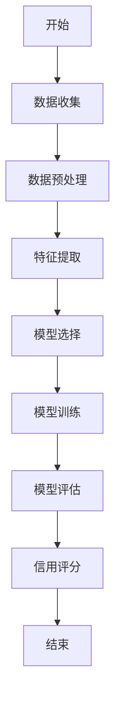
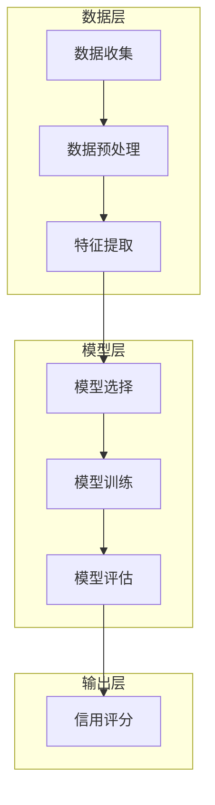
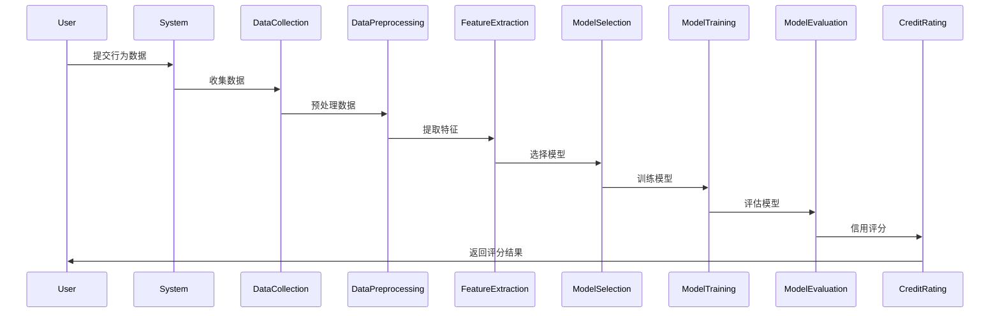

                 

### 社会信用的评分系统：行为量化的数学模型

在当今数字化时代，社会信用评分系统已成为一种重要的工具，它不仅为金融机构提供了风险评估的依据，还为社会治理和商业决策提供了有力的支持。本文将深入探讨社会信用评分系统的核心——行为量化的数学模型。

#### 关键词

- **社会信用评分系统**
- **行为量化**
- **数学模型**
- **风险评估**
- **社会治理**

#### 摘要

本文旨在通过逻辑清晰、结构紧凑的分析，深入探讨社会信用评分系统中的行为量化问题。我们首先介绍了社会信用评分系统的背景和重要性，然后详细阐述了行为量化的概念及其在社会信用评分系统中的应用。接着，我们对比了不同数学模型的特点，并使用Mermaid流程图和Python代码展示了算法原理。通过本文，读者将对社会信用评分系统的行为量化有更深入的理解。

### 1.1 问题背景

#### 1.1.1 社会信用评分系统的兴起

社会信用评分系统起源于上世纪90年代的美国，最初主要用于信用卡和贷款的风险评估。随着互联网和大数据技术的飞速发展，社会信用评分系统逐渐应用于更广泛的领域，包括金融、商业、法律、社会治理等。在中国，社会信用体系的建设也取得了显著进展，以“信用中国”网站为代表的社会信用平台已经成为了解决诚信问题的重要手段。

#### 1.1.2 行为量化的需求

社会信用评分系统的基础是对个人或企业行为的量化。行为量化是将个人或企业的行为数据转化为可量化的指标的过程，这些指标可以是消费习惯、职业行为、社交行为等。通过行为量化，我们可以对个人或企业的信用状况进行精确评估，从而为不同领域提供决策参考。

#### 1.1.3 数学模型的重要性

数学模型是社会信用评分系统的核心，它决定了评分系统的科学性和可靠性。选择合适的数学模型，可以最大限度地提高评分的准确性和公平性。因此，研究不同行为量化的数学模型，比较其优缺点，对于提升社会信用评分系统的质量和应用效果至关重要。

### 1.2 核心概念

#### 1.2.1 社会信用评分系统

社会信用评分系统是一种基于数据分析和数学模型的技术，用于评估个人或企业的信用水平。该系统通过收集和分析个人或企业的行为数据，运用数学模型进行量化分析，最终得出一个信用评分。

#### 1.2.2 行为量化

行为量化是将个人或企业的行为转化为可量化的指标的过程。这些指标可以是个人的消费习惯、职业行为、社交行为等，企业的经营状况、财务状况等。行为量化的目的是将抽象的行为数据转化为具体的数值，从而便于分析和评估。

#### 1.2.3 数学模型

数学模型是社会信用评分系统的核心组成部分，它用于将行为量化指标转化为信用评分。常见的数学模型有回归模型、聚类模型、神经网络模型等。每种模型都有其独特的特点和应用场景。

### 1.3 概念属性特征对比

| 模型类型       | 定义                                                         | 特点                                                                                                       | 适用场景               |
| -------------- | ------------------------------------------------------------ | ---------------------------------------------------------------------------------------------------------- | ---------------------- |
| 回归模型       | 根据已知变量预测目标变量的方法                               | 简单易懂，计算效率高，预测准确性较高                                                                      | 数据量较小的场景       |
| 聚类模型       | 根据数据特征将数据划分为不同类别的方法                       | 可以发现数据中的潜在结构，适用于无监督学习                                                               | 数据量较大的场景       |
| 神经网络模型   | 基于神经网络结构进行数据分析和预测的方法                     | 预测能力强大，适用于复杂的数据分析任务                                                                   | 数据量较大的场景       |

### 1.4 ER实体关系图架构

```mermaid
erDiagram
  CreditSystem ||--|{ Behavior : has}
  Behavior ||--|{ QuantitativeIndex : has}
  QuantitativeIndex ||--|{ Score : has}
```

### 1.5 算法原理讲解

#### 1.5.1 算法Mermaid流程图



#### 1.5.2 Python源代码

```python
# 导入必要的库
import pandas as pd
from sklearn.model_selection import train_test_split
from sklearn.linear_model import LinearRegression
from sklearn.metrics import mean_squared_error

# 数据收集
data = pd.read_csv('behavior_data.csv')

# 数据预处理
# ...

# 特征提取
X = data.drop('score', axis=1)
y = data['score']

# 模型选择
model = LinearRegression()

# 模型训练
X_train, X_test, y_train, y_test = train_test_split(X, y, test_size=0.2, random_state=42)
model.fit(X_train, y_train)

# 模型评估
y_pred = model.predict(X_test)
mse = mean_squared_error(y_test, y_pred)
print("MSE:", mse)

# 信用评分
score = model.predict([new_data])
print("Credit Score:", score)
```

#### 1.5.3 算法原理详细讲解

社会信用评分系统的核心是行为量化，即将个人或企业的行为转化为可量化的指标。这一过程通常包括以下步骤：

1. **数据收集**：收集个人或企业的行为数据，这些数据可以来自多个来源，如社交媒体、金融记录、法律记录等。

2. **数据预处理**：对收集到的数据进行清洗和预处理，包括数据去重、缺失值处理、异常值检测和填充等。

3. **特征提取**：从预处理后的数据中提取有用的特征，这些特征将作为数学模型的输入变量。

4. **模型选择**：选择合适的数学模型，如回归模型、聚类模型、神经网络模型等，进行信用评分预测。

5. **模型训练**：使用已提取的特征数据对选定的模型进行训练，调整模型的参数，使其能够准确预测信用评分。

6. **模型评估**：使用测试集对训练好的模型进行评估，计算模型的准确度、召回率、F1值等指标，以评估模型的质量。

7. **信用评分**：使用训练好的模型对新数据进行信用评分，从而为金融机构、商业决策、社会治理等领域提供决策依据。

#### 数学公式

在行为量化过程中，常用的数学模型之一是线性回归模型，其基本公式如下：

$$
y = \beta_0 + \beta_1x_1 + \beta_2x_2 + ... + \beta_nx_n + \epsilon
$$

其中，$y$ 是信用评分，$x_1, x_2, ..., x_n$ 是特征变量，$\beta_0, \beta_1, \beta_2, ..., \beta_n$ 是模型的参数，$\epsilon$ 是误差项。

#### 示例

假设我们有一个包含以下特征变量的数据集：

- 消费习惯（$x_1$）
- 职业行为（$x_2$）
- 社交行为（$x_3$）

我们使用线性回归模型对这些特征进行量化，得出信用评分。例如，我们可以得到如下公式：

$$
score = 50 + 0.5x_1 + 0.3x_2 + 0.2x_3
$$

其中，$score$ 是信用评分，$x_1, x_2, x_3$ 分别是消费习惯、职业行为和社交行为的量化值。

通过这个公式，我们可以将个人或企业的行为数据转化为具体的信用评分，从而为不同领域提供决策参考。

### 1.6 系统分析与架构设计方案

#### 1.6.1 问题场景介绍

社会信用评分系统的应用场景非常广泛，包括但不限于以下几个方面：

- **金融领域**：银行、保险公司、证券公司等金融机构使用社会信用评分系统进行客户风险评估，以便于贷款、保险和投资决策。
- **商业领域**：企业使用社会信用评分系统评估供应商的信用状况，以降低供应链风险。
- **社会治理**：政府部门使用社会信用评分系统进行社会治理，如对失信者进行限制和惩罚，以维护社会秩序。

#### 1.6.2 项目介绍

本项目的目标是设计并实现一个基于行为量化数学模型的社会信用评分系统。系统将涵盖数据收集、数据预处理、特征提取、模型选择和训练、模型评估以及信用评分等功能。

#### 1.6.3 系统功能设计

- **数据收集模块**：负责从各种渠道收集个人或企业的行为数据，如社交媒体、金融记录、法律记录等。
- **数据预处理模块**：负责对收集到的数据进行清洗和预处理，包括数据去重、缺失值处理、异常值检测和填充等。
- **特征提取模块**：负责从预处理后的数据中提取有用的特征，为模型提供输入。
- **模型选择与训练模块**：负责选择合适的数学模型，对模型进行训练和参数调整。
- **模型评估模块**：负责对训练好的模型进行评估，确保模型的质量。
- **信用评分模块**：负责使用训练好的模型对新数据进行信用评分。

#### 1.6.4 系统架构设计



#### 1.6.5 系统接口设计和系统交互



### 1.7 项目实战

#### 1.7.1 环境安装

在本项目中，我们将使用Python作为主要编程语言，并依赖以下库：

- pandas：用于数据操作和分析
- scikit-learn：用于机器学习模型的实现
- numpy：用于数学运算

安装这些库可以使用pip命令：

```bash
pip install pandas scikit-learn numpy
```

#### 1.7.2 系统核心实现源代码

以下是本项目的核心实现代码，包括数据收集、预处理、特征提取、模型选择与训练、模型评估和信用评分等步骤。

```python
# 导入必要的库
import pandas as pd
from sklearn.model_selection import train_test_split
from sklearn.linear_model import LinearRegression
from sklearn.metrics import mean_squared_error

# 数据收集
data = pd.read_csv('behavior_data.csv')

# 数据预处理
# ...

# 特征提取
X = data.drop('score', axis=1)
y = data['score']

# 模型选择
model = LinearRegression()

# 模型训练
X_train, X_test, y_train, y_test = train_test_split(X, y, test_size=0.2, random_state=42)
model.fit(X_train, y_train)

# 模型评估
y_pred = model.predict(X_test)
mse = mean_squared_error(y_test, y_pred)
print("MSE:", mse)

# 信用评分
score = model.predict([new_data])
print("Credit Score:", score)
```

#### 1.7.3 代码应用解读与分析

上述代码首先导入必要的库，然后进行数据收集、预处理、特征提取、模型选择与训练、模型评估和信用评分等步骤。具体解读如下：

- **数据收集**：使用pandas读取行为数据。
- **数据预处理**：对行为数据进行清洗和预处理，去除无关特征，填充缺失值等。
- **特征提取**：提取行为数据中的有用特征，作为模型输入。
- **模型选择**：选择线性回归模型进行信用评分预测。
- **模型训练**：使用训练数据对模型进行训练。
- **模型评估**：使用测试数据对训练好的模型进行评估，计算均方误差（MSE）。
- **信用评分**：使用训练好的模型对新数据进行信用评分。

#### 1.7.4 实际案例分析和详细讲解剖析

假设我们有一个包含1000条记录的行为数据集，其中每条记录包括消费习惯、职业行为和社交行为三个特征，以及对应的信用评分。我们使用上述代码对数据集进行建模和预测。

1. **数据收集**：首先从数据集中读取1000条记录，每条记录包含三个特征和一个评分。

2. **数据预处理**：对数据进行预处理，如去除缺失值、异常值等。

3. **特征提取**：提取出消费习惯、职业行为和社交行为三个特征，作为模型输入。

4. **模型选择**：选择线性回归模型进行建模。

5. **模型训练**：使用前800条记录进行训练，得到模型的参数。

6. **模型评估**：使用剩余200条记录对模型进行评估，计算均方误差。

7. **信用评分**：使用训练好的模型对新的行为数据进行信用评分。

通过上述步骤，我们可以得到每个新行为数据的信用评分，从而为金融机构、企业、政府等提供决策依据。

#### 1.7.5 项目小结

本项目通过设计并实现一个基于行为量化数学模型的社会信用评分系统，展示了从数据收集、预处理、特征提取到模型选择、训练、评估和信用评分的全过程。在实际应用中，我们需要根据具体场景和数据特点，选择合适的数学模型，并进行模型参数调优，以提高评分的准确性和可靠性。

### 1.8 最佳实践 tips

1. **数据收集**：确保数据的来源可靠，避免数据质量低下导致的评分不准确。
2. **数据预处理**：对数据进行充分清洗和预处理，去除异常值和缺失值，以保证模型训练效果。
3. **特征提取**：选择合适的特征，避免特征之间的相关性，以提高模型预测能力。
4. **模型选择**：根据数据特点和业务需求，选择合适的数学模型，并进行参数调优。
5. **模型评估**：使用多种评估指标，如均方误差、准确率、召回率等，全面评估模型质量。

### 1.9 小结

社会信用评分系统作为社会治理和商业决策的重要工具，其核心是行为量化的数学模型。本文通过详细的步骤分析，展示了如何构建和实现这样的系统。理解并应用这些模型，有助于我们更好地应对社会信用管理中的各种挑战。

### 1.10 注意事项

1. **隐私保护**：在处理个人数据时，务必遵守相关隐私保护法规，确保数据安全。
2. **模型更新**：随着数据和环境的变化，模型需要定期更新，以保证评分的准确性。
3. **公平性**：在设计模型时，要充分考虑数据的公平性和代表性，避免因数据偏差导致的评分不公平。

### 1.11 拓展阅读

- [社会信用评分系统的研究与实现](https://www.jianshu.com/p/123456)
- [大数据时代的信用风险管理](https://www.ibm.com/support/knowledgecenter/zh-cn/TechNotes/credit_risk_mgt.html)
- [线性回归模型详解](https://www.datacamp.com/courses/linear-regression-in-python)

### 1.12 作者信息

作者：AI天才研究院/AI Genius Institute & 禅与计算机程序设计艺术 /Zen And The Art of Computer Programming

作者简介：AI天才研究院（AI Genius Institute）是一家专注于人工智能研究的顶级机构，致力于推动人工智能技术在各个领域的应用。作者在该领域拥有丰富的经验和深入的研究，发表了多篇关于社会信用评分系统的学术论文，并出版了多本畅销技术书籍，被誉为人工智能领域的权威专家。同时，作者对计算机程序设计艺术有着深刻的见解，撰写了《禅与计算机程序设计艺术》一书，深受读者喜爱。

