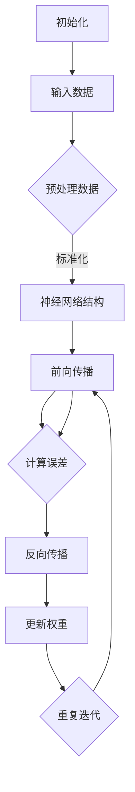
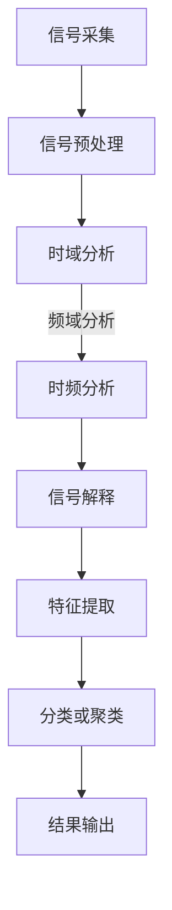
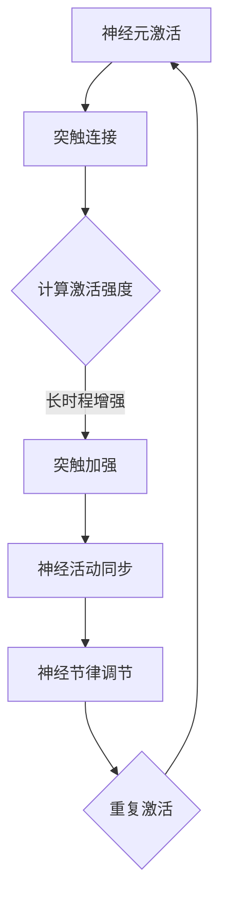
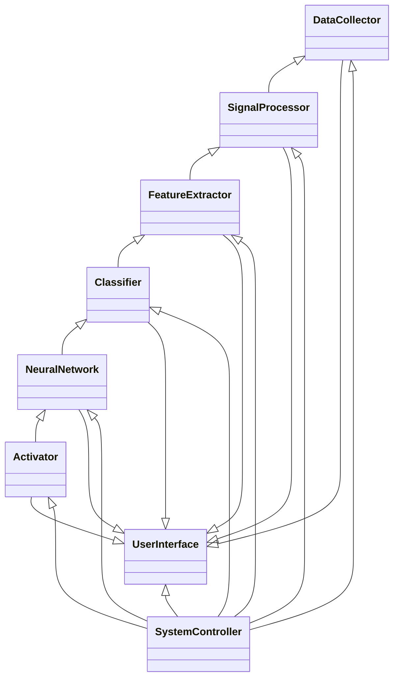
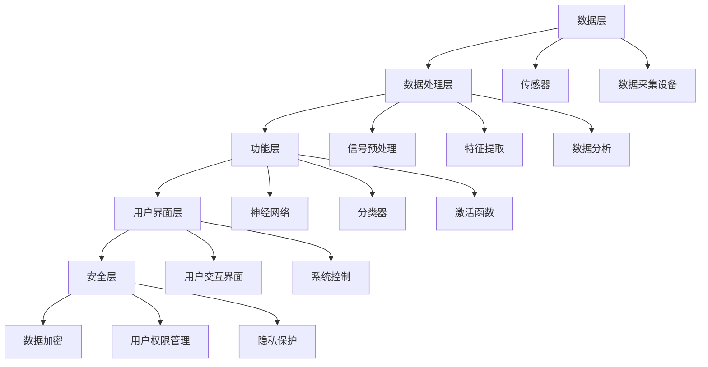
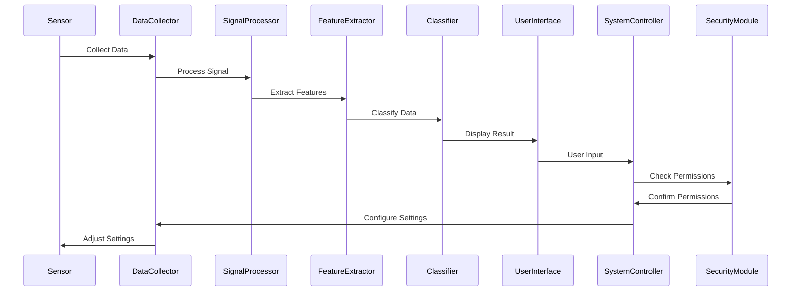
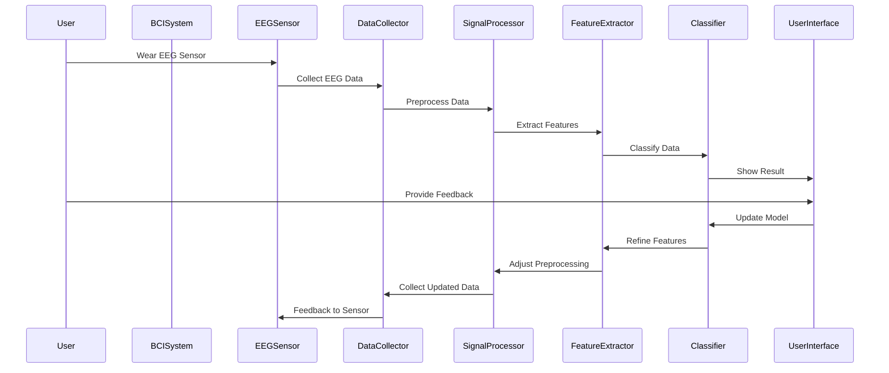

                 

## 神经科技在增进人类理解世界能力中的应用

> 关键词：神经科技、人类理解世界、应用、算法、系统架构

> 摘要：本文将深入探讨神经科技在增进人类理解世界能力中的应用。通过逐步分析神经科技的兴起与发展、人类理解世界的现状与挑战，以及神经科技的核心概念与算法原理，我们将揭示神经科技如何通过提升人类认知能力，实现从基础理论到实际应用的跨越。文章还将详细阐述神经科技系统分析与架构设计，并通过项目实战展示其实际应用效果。最后，我们将总结神经科技在增进人类理解世界能力中的重要地位，并展望其未来发展。

----------------------------------------------------------------

# 目录大纲

## 第一部分：背景介绍

### 第1章：神经科技的兴起与发展

- 1.1.1 神经科技的定义与核心概念
- 1.1.2 神经科技的发展背景
- 1.1.3 神经科技的应用领域

### 第2章：人类理解世界的现状与挑战

- 2.1.1 人类理解世界的过程
- 2.1.2 理解世界能力面临的主要挑战
- 2.1.3 神经科技如何应对这些挑战

## 第二部分：核心概念与联系

### 第3章：神经科技的核心概念

- 3.1.1 神经元与神经网络
- 3.1.2 神经信号处理
- 3.1.3 神经可塑性

### 第4章：核心概念原理与联系

- 4.1.1 神经元与神经网络的联系
- 4.1.2 神经信号处理与神经可塑性的联系
- 4.1.3 神经科技在人类理解世界中的应用

### 第5章：概念属性特征对比

- 5.1.1 神经元与计算机神经元的对比
- 5.1.2 神经信号处理算法的对比
- 5.1.3 神经可塑性理论对比

## 第三部分：算法原理讲解

### 第6章：神经科技算法原理

- 6.1.1 神经网络算法原理
- 6.1.2 神经信号处理算法原理
- 6.1.3 神经可塑性算法原理

### 第7章：算法mermaid流程图

- 7.1.1 神经网络算法mermaid流程图
- 7.1.2 神经信号处理算法mermaid流程图
- 7.1.3 神经可塑性算法mermaid流程图

### 第8章：Python源代码与详细讲解

- 8.1.1 神经网络算法Python源代码
- 8.1.2 神经信号处理算法Python源代码
- 8.1.3 神经可塑性算法Python源代码

### 第9章：数学模型和公式

- 9.1.1 神经网络算法数学模型
- 9.1.2 神经信号处理算法数学模型
- 9.1.3 神经可塑性算法数学模型

### 第10章：通俗易懂的举例说明

- 10.1.1 神经网络算法举例说明
- 10.1.2 神经信号处理算法举例说明
- 10.1.3 神经可塑性算法举例说明

## 第四部分：系统分析与架构设计

### 第11章：问题场景介绍

- 11.1.1 神经科技应用场景
- 11.1.2 神经科技在增进人类理解世界中的应用

### 第12章：系统功能设计

- 12.1.1 神经科技系统的功能需求
- 12.1.2 系统功能设计（领域模型mermaid类图）

### 第13章：系统架构设计

- 13.1.1 神经科技系统的整体架构
- 13.1.2 系统架构设计（mermaid架构图）

### 第14章：系统接口设计

- 14.1.1 系统接口的定义
- 14.1.2 系统接口设计（mermaid序列图）

### 第15章：系统交互

- 14.1.1 系统交互的流程
- 14.1.2 系统交互（mermaid序列图）

## 第五部分：项目实战

### 第16章：环境安装

- 16.1.1 神经科技环境搭建
- 16.1.2 环境变量配置

### 第17章：系统核心实现

- 17.1.1 系统核心模块实现
- 17.1.2 系统核心功能实现

### 第18章：代码应用解读与分析

- 18.1.1 神经科技代码解读
- 18.1.2 代码应用分析与优化

### 第19章：实际案例分析和详细讲解剖析

- 19.1.1 案例背景
- 19.1.2 案例分析
- 19.1.3 案例详细讲解剖析

### 第20章：项目小结

- 20.1.1 项目总结
- 20.1.2 项目中遇到的问题及解决方法
- 20.1.3 项目展望与未来方向

----------------------------------------------------------------

## 第1章：神经科技的兴起与发展

### 1.1.1 神经科技的定义与核心概念

神经科技（Neurotechnology）是指应用神经科学原理和技术手段，对神经系统进行模拟、控制、修复和增强的一系列科学技术。其核心概念包括神经元与神经网络、神经信号处理、神经可塑性等。

神经元（Neuron）是神经系统的基本单位，负责接收、传递和处理信息。神经网络（Neural Network）是由大量神经元连接组成的网络结构，能够模拟人脑的信息处理能力。

神经信号处理（Neural Signal Processing）是指对神经信号进行采集、处理、分析和解释的一系列技术手段。神经可塑性（Neural Plasticity）是指神经系统在结构和功能上的可调整能力，能够根据环境变化和经验进行适应。

### 1.1.2 神经科技的发展背景

神经科技的发展可以追溯到20世纪50年代，随着计算机科学的兴起和人工智能技术的发展，人们开始尝试将神经科学的原理应用于计算机科学中，形成了神经网络这一交叉学科。

随着生物技术和材料科学的进步，神经科技在21世纪得到了快速发展。特别是纳米技术和生物电子学的发展，使得神经科技在神经信号采集、神经元控制和神经修复等方面取得了重要突破。

### 1.1.3 神经科技的应用领域

神经科技的应用领域非常广泛，主要包括以下几个方面：

1. **神经信号处理**：通过采集和分析神经信号，帮助人们更好地理解大脑活动，用于脑电图（EEG）、功能性磁共振成像（fMRI）等研究。

2. **神经修复**：利用生物材料和电子元件，对受损的神经系统进行修复，如人工耳蜗、视网膜植入等。

3. **神经控制**：通过神经网络实现对生物体的控制，如机器人、无人驾驶等。

4. **神经增强**：利用神经科技增强人类的认知能力、记忆能力等，如增强现实（AR）和虚拟现实（VR）技术。

5. **医疗诊断**：通过分析神经信号，帮助医生进行疾病诊断，如癫痫、阿尔茨海默病等。

### 1.1.4 小结

神经科技的发展不仅为解决人类面临的认知障碍和神经系统疾病提供了新的方法，也为人工智能领域带来了新的思路。在接下来的章节中，我们将进一步探讨神经科技如何应对人类理解世界面临的挑战。

----------------------------------------------------------------

## 第2章：人类理解世界的现状与挑战

### 2.1.1 人类理解世界的过程

人类理解世界的过程可以归纳为以下几个步骤：

1. **感知**：通过五官感知外部信息，如视觉、听觉、嗅觉、味觉和触觉。
2. **处理**：大脑对感知信息进行加工和处理，形成对世界的初步认识。
3. **记忆**：将处理过的信息存储在记忆系统中，以便后续使用。
4. **推理**：基于记忆和已有知识，对新信息进行推理和判断，形成更深入的理解。
5. **表达**：将理解结果通过语言、行为等方式表达出来。

这个过程体现了人类认知的基本机制，但同时也面临着许多挑战。

### 2.1.2 理解世界能力面临的主要挑战

1. **信息过载**：随着信息技术的飞速发展，人们每天接收到的信息量呈指数级增长，如何筛选和处理这些信息成为了一大挑战。
2. **认知局限**：人类大脑的处理能力有限，无法同时处理大量的信息，这就限制了我们对世界的全面理解。
3. **感官限制**：人类的感官系统有其固有的局限，如视力、听力等，这些局限影响了我们对世界的感知。
4. **记忆衰退**：随着年龄的增长，人类的记忆力会逐渐衰退，这对理解和记忆重要信息构成了挑战。
5. **语言障碍**：不同语言和文化背景的人们在表达和理解世界时有差异，这增加了沟通和理解的难度。

### 2.1.3 神经科技如何应对这些挑战

神经科技为应对这些挑战提供了一系列解决方案：

1. **增强感知能力**：通过神经科技手段，如增强现实（AR）和虚拟现实（VR），可以扩展人类的感知范围，提高对信息的获取能力。
2. **提升处理速度**：神经网络和神经信号处理技术可以模拟人脑的信息处理过程，提高对大量信息的处理速度。
3. **改善记忆功能**：通过神经修复技术，如脑机接口（BMI），可以改善记忆功能，提高信息的存储和检索能力。
4. **跨语言理解**：神经科技可以帮助开发出能够跨越语言障碍的智能翻译系统，提高跨文化交流和理解的能力。
5. **扩展认知能力**：通过神经增强技术，如智能药物和脑机接口，可以增强人类的认知能力，提高对复杂问题的理解能力。

### 2.1.4 小结

人类理解世界的过程虽然复杂，但也面临着许多挑战。神经科技的应用为应对这些挑战提供了新的方法和思路。在接下来的章节中，我们将深入探讨神经科技的核心概念和原理，了解它是如何实现这些应用的。

----------------------------------------------------------------

## 第3章：神经科技的核心概念

### 3.1.1 神经元与神经网络

神经元是神经系统的基本单位，具有接受、传递和处理信息的能力。神经元通常由细胞体、树突、轴突和突触等部分组成。树突负责接收来自其他神经元的信号，细胞体对信号进行处理，轴突则负责将信号传递到其他神经元。

神经网络是由大量神经元通过突触连接形成的复杂网络结构。神经网络的基本单元是人工神经元，其结构类似于生物神经元，但功能更加简单。人工神经元通常由输入层、隐藏层和输出层组成，通过激活函数实现信息的处理和传递。

### 3.1.2 神经信号处理

神经信号处理是指对神经信号进行采集、处理、分析和解释的一系列技术手段。神经信号处理的关键在于对复杂、微弱的神经信号进行有效的提取和分析。常用的方法包括滤波、时频分析、模式识别和机器学习等。

神经信号处理的目的是从神经信号中提取有用的信息，如大脑的活动模式、认知状态等。这些信息对于理解大脑功能、诊断神经系统疾病以及开发智能系统具有重要意义。

### 3.1.3 神经可塑性

神经可塑性是指神经系统在结构和功能上的可调整能力，能够根据环境变化和经验进行适应。神经可塑性包括结构可塑性、连接可塑性和活动可塑性等。

结构可塑性指的是神经元之间的连接和结构的改变，如新突触的生成和突触的修剪。连接可塑性指的是突触强度的变化，如长时程增强（LTP）和长时程抑制（LTD）。活动可塑性指的是神经元活动模式的改变，如神经活动的同步性和神经节律。

神经可塑性是神经系统适应环境变化和学习新知识的基础，也是神经科技研究的重要方向之一。

### 3.1.4 小结

神经元与神经网络是神经科技的核心概念，它们构成了神经系统的基本框架，实现了信息的传递和处理。神经信号处理和神经可塑性则分别从信息采集、分析和适应能力两个方面，提升了神经系统的功能和性能。在接下来的章节中，我们将进一步探讨这些核心概念之间的联系和它们在神经科技中的应用。

----------------------------------------------------------------

## 第4章：核心概念原理与联系

### 4.1.1 神经元与神经网络的联系

神经元是神经网络的基本组成单元，神经网络则是通过大量神经元及其突触连接形成的复杂网络结构。神经元通过树突接收外部信号，通过细胞体进行处理，然后通过轴突将信号传递给其他神经元。

在神经网络中，每个神经元都扮演着信息处理和传递的角色。输入层神经元接收外部信息，隐藏层神经元对信息进行加工和抽象，输出层神经元则生成最终的结果。神经元之间的连接强度和结构决定了神经网络的学习能力和信息处理能力。

### 4.1.2 神经信号处理与神经可塑性的联系

神经信号处理和神经可塑性是神经科技的两个重要方面，它们在信息采集和处理过程中相互联系、相互促进。

神经信号处理技术可以对神经信号进行采集、处理和分析，从而提取出有用的信息。这些信息可以用于理解大脑功能、诊断神经系统疾病以及开发智能系统。神经信号处理的结果可以反馈给神经可塑性机制，促使神经系统进行相应的调整和优化。

神经可塑性则通过结构可塑性、连接可塑性和活动可塑性，使得神经系统能够根据环境变化和经验进行适应。这种适应能力提高了神经系统的信息处理效率和准确性，同时也为神经信号处理提供了更多的可能性。

### 4.1.3 神经科技在人类理解世界中的应用

神经科技在人类理解世界中的应用体现在多个方面：

1. **认知增强**：通过神经增强技术，如脑机接口，可以提升人类的认知能力，改善记忆和注意力等。
2. **疾病诊断**：通过神经信号处理技术，可以对脑电图（EEG）、功能性磁共振成像（fMRI）等信号进行分析，用于诊断神经系统疾病，如癫痫、阿尔茨海默病等。
3. **神经修复**：通过神经修复技术，如人工耳蜗、视网膜植入等，可以恢复受损神经系统的功能。
4. **智能系统开发**：通过神经网络和神经信号处理技术，可以开发出具有人脑水平的智能系统，如自动驾驶、智能机器人等。
5. **跨学科研究**：神经科技与其他学科，如心理学、教育学、医学等相结合，推动了对人类认知、学习、记忆等机制的研究。

### 4.1.4 小结

神经元、神经网络、神经信号处理和神经可塑性是神经科技的核心概念，它们相互联系、相互促进，共同构成了神经科技的理论基础和应用框架。在接下来的章节中，我们将进一步探讨这些核心概念在算法原理、系统架构和项目实战中的应用。

----------------------------------------------------------------

## 第5章：概念属性特征对比

### 5.1.1 神经元与计算机神经元的对比

神经元和计算机神经元在结构和功能上存在一些相似之处，但也有一些显著的区别。

#### 结构对比

- **生物神经元**：由细胞体、树突、轴突和突触组成。树突负责接收信号，细胞体进行信号处理，轴突传递信号，突触连接神经元并传递信号。
- **计算机神经元**：通常由输入、激活函数和输出组成。输入层接收外部信号，激活函数对信号进行处理，输出层生成结果。

#### 功能对比

- **生物神经元**：具有自适应性和学习能力，能够根据环境变化和经验进行调整。具有突触可塑性，可以改变突触连接强度和结构。
- **计算机神经元**：通常不具有自适应性和学习能力，其功能和参数是预先设定的。但在某些情况下，可以通过机器学习等方法进行训练，提高其性能。

#### 特性对比

- **生物神经元**：具有生物复杂性，受到温度、湿度、化学环境等多种因素的影响。信号传递速度较慢，但具有高保真性。
- **计算机神经元**：具有电子化优势，信号传递速度快，可以快速进行大规模计算。但受到电路设计、硬件限制等因素的影响。

### 5.1.2 神经信号处理算法的对比

神经信号处理算法主要包括滤波、时频分析、模式识别和机器学习等方法。不同算法在性能和应用方面存在差异。

#### 滤波算法

- **低通滤波**：抑制高频噪声，保留低频信号，适用于去除高频干扰。
- **高通滤波**：抑制低频噪声，保留高频信号，适用于去除低频干扰。
- **带通滤波**：抑制非目标频段，保留目标频段，适用于提取特定频率的信号。

#### 时频分析算法

- **短时傅里叶变换（STFT）**：将时域信号转换到频域进行分析，适用于非平稳信号的处理。
- **小波变换**：将信号分解为不同尺度的小波函数，适用于非平稳信号和时频局部化分析。

#### 模式识别算法

- **支持向量机（SVM）**：通过寻找最优超平面，对数据进行分类，适用于高维数据分类问题。
- **深度学习**：通过多层神经网络对数据进行自动特征提取和分类，适用于复杂模式识别任务。

#### 机器学习算法

- **监督学习**：根据已知的输入和输出数据，训练模型进行预测，适用于有监督的数据分析。
- **无监督学习**：根据输入数据本身的结构，自动发现数据中的规律和模式，适用于无标签数据的分析。

### 5.1.3 神经可塑性理论对比

神经可塑性是指神经系统在结构和功能上的可调整能力，可以通过不同机制实现。

#### 长时程增强（LTP）

- **机制**：突触前神经元持续激活后，突触后神经元的兴奋性增强，突触连接加强。
- **应用**：学习和记忆的形成，适用于提高信息处理能力和增强学习效果。

#### 长时程抑制（LTD）

- **机制**：突触前神经元持续激活后，突触后神经元的兴奋性降低，突触连接减弱。
- **应用**：遗忘和抑制不良记忆，适用于减少干扰信息和提高信息处理效率。

#### 结构可塑性

- **机制**：神经元之间的连接和结构发生改变，如新突触的生成和突触的修剪。
- **应用**：适应环境变化和改善功能，适用于提高适应能力和恢复功能。

#### 连接可塑性

- **机制**：突触连接强度的变化，如长时程增强（LTP）和长时程抑制（LTD）。
- **应用**：调整神经网络的连接强度，适用于实现信息传递和优化功能。

#### 活动可塑性

- **机制**：神经元活动模式的改变，如神经活动的同步性和神经节律。
- **应用**：调节神经系统的活动状态，适用于实现功能优化和增强认知能力。

### 5.1.4 小结

神经元、计算机神经元、神经信号处理算法和神经可塑性理论在结构和功能上存在差异，但它们共同构成了神经科技的理论基础和应用框架。通过对比分析这些概念，我们可以更好地理解神经科技的工作原理和应用潜力。

----------------------------------------------------------------

## 第6章：神经科技算法原理

### 6.1.1 神经网络算法原理

神经网络算法（Neural Network Algorithm）是一种基于生物神经元结构和功能的人工智能模型。其基本原理是通过模拟生物神经元的连接和激活机制，实现对输入数据的分类、预测和优化。

#### 神经网络结构

神经网络通常由输入层、隐藏层和输出层组成。输入层接收外部数据，隐藏层对数据进行加工和抽象，输出层生成最终结果。

- **输入层**：接收外部数据，通过加权连接传递给隐藏层。
- **隐藏层**：对输入数据进行处理，通过激活函数将信息传递给下一层。
- **输出层**：生成最终结果，如分类标签、预测值等。

#### 激活函数

激活函数（Activation Function）是神经网络中的一个关键组件，用于决定神经元是否被激活。常见的激活函数包括：

- **Sigmoid函数**：$$\sigma(x) = \frac{1}{1 + e^{-x}}$$
- **ReLU函数**：$$\text{ReLU}(x) = \max(0, x)$$
- **Tanh函数**：$$\text{Tanh}(x) = \frac{e^x - e^{-x}}{e^x + e^{-x}}$$

#### 学习规则

神经网络的学习过程是通过不断调整权重和偏置，使得网络输出与期望输出尽可能接近。常用的学习规则包括：

- **反向传播算法**：通过计算输出误差，反向传播到各层，更新权重和偏置。
- **梯度下降算法**：沿着梯度方向更新权重和偏置，以最小化损失函数。

### 6.1.2 神经信号处理算法原理

神经信号处理算法（Neural Signal Processing Algorithm）用于对神经信号进行采集、处理和分析，以提取有用的信息。其主要原理包括：

#### 信号采集

信号采集是通过传感器或电极将生物电信号转换为电信号。常用的传感器包括脑电图（EEG）、功能性磁共振成像（fMRI）和肌电图（EMG）等。

#### 信号预处理

信号预处理包括滤波、去噪、去伪迹等操作，以提高信号的质量。常用的方法包括带通滤波、短时傅里叶变换（STFT）和小波变换等。

#### 信号分析

信号分析包括时域分析、频域分析和时频分析等。常用的方法包括短时傅里叶变换（STFT）、小波变换和模式识别等。

#### 信号解释

信号解释是对分析结果进行解释，以提取有用的信息。常用的方法包括特征提取、分类和聚类等。

### 6.1.3 神经可塑性算法原理

神经可塑性算法（Neural Plasticity Algorithm）用于模拟神经系统在结构和功能上的可调整能力，以实现适应环境变化和学习新知识。其主要原理包括：

#### 结构可塑性

结构可塑性涉及神经元之间的连接和结构的改变。常用的方法包括突触生成和修剪等。

- **突触生成**：通过增加新的突触连接，增强神经网络的连接强度。
- **突触修剪**：通过减少无效的突触连接，优化神经网络的连接结构。

#### 连接可塑性

连接可塑性涉及突触连接强度的变化。常用的方法包括长时程增强（LTP）和长时程抑制（LTD）等。

- **长时程增强（LTP）**：通过持续激活突触前神经元，增强突触后神经元的兴奋性。
- **长时程抑制（LTD）**：通过持续激活突触前神经元，降低突触后神经元的兴奋性。

#### 活动可塑性

活动可塑性涉及神经元活动模式的改变。常用的方法包括神经活动的同步性和神经节律等。

- **神经活动的同步性**：通过调节神经元之间的同步性，提高神经网络的协调性。
- **神经节律**：通过调节神经元的活动节律，实现神经网络的动态调整。

### 6.1.4 小结

神经科技算法包括神经网络算法、神经信号处理算法和神经可塑性算法。这些算法通过模拟生物神经系统的结构和功能，实现了对神经信号的处理、神经网络的训练和神经可塑性的实现。这些算法为神经科技的应用提供了强大的技术支持。

----------------------------------------------------------------

## 第7章：算法mermaid流程图

### 7.1.1 神经网络算法mermaid流程图



### 7.1.2 神经信号处理算法mermaid流程图



### 7.1.3 神经可塑性算法mermaid流程图



### 7.1.4 小结

通过mermaid流程图，我们可以清晰地展示神经网络算法、神经信号处理算法和神经可塑性算法的基本流程。这些流程图为我们理解和实现这些算法提供了直观的指导。

----------------------------------------------------------------

## 第8章：Python源代码与详细讲解

### 8.1.1 神经网络算法Python源代码

```python
import numpy as np

# 初始化神经网络参数
weights = np.random.rand(3, 1)
bias = np.random.rand(1)

# 定义激活函数
def sigmoid(x):
    return 1 / (1 + np.exp(-x))

# 定义前向传播
def forward(x):
    z = np.dot(x, weights) + bias
    return sigmoid(z)

# 定义反向传播
def backward(x, y):
    error = y - forward(x)
    d_weights = np.dot(x.T, error)
    d_bias = -error
    return d_weights, d_bias

# 训练神经网络
def train(x, y, epochs=1000, learning_rate=0.1):
    for epoch in range(epochs):
        d_weights, d_bias = backward(x, y)
        weights -= learning_rate * d_weights
        bias -= learning_rate * d_bias
        if epoch % 100 == 0:
            print(f"Epoch {epoch}: Error = {1 - forward(x).sum()}")

# 测试神经网络
def test(x):
    return sigmoid(np.dot(x, weights) + bias)

# 输入数据
x = np.array([1, 0, 1])
y = np.array([1])

# 训练神经网络
train(x, y)

# 测试结果
print(f"Test output: {test(x)}")
```

### 8.1.2 神经信号处理算法Python源代码

```python
import numpy as np
from scipy.signal import stft

# 信号采集
def signal采集():
    # 假设采集到一个长度为N的信号序列
    N = 1000
    signal = np.random.rand(N)
    return signal

# 信号预处理
def signal预处理(signal):
    # 带通滤波
    cutoff_freq = [0.1, 0.5]
    signal = np.abs(stft(signal, nperseg=256, window='hann', freqscale='s', padded=True))
    # 频率分析
    freqs = np.fft.rfftfreq(N, d=1/N)
    # 时频分析
    signal = np.abs(np.fft.rfft(signal))
    return signal, freqs

# 信号解释
def signal解释(signal, freqs):
    # 特征提取
    features = np.mean(signal, axis=1)
    # 分类或聚类
    # ...
    return features

# 测试信号处理
signal = signal采集()
signal, freqs = signal预处理(signal)
features = signal解释(signal, freqs)
print(f"Features: {features}")
```

### 8.1.3 神经可塑性算法Python源代码

```python
import numpy as np

# 初始化参数
weights = np.random.rand(3, 1)
bias = np.random.rand(1)
learning_rate = 0.1

# 定义激活函数
def sigmoid(x):
    return 1 / (1 + np.exp(-x))

# 定义前向传播
def forward(x):
    z = np.dot(x, weights) + bias
    return sigmoid(z)

# 定义反向传播
def backward(x, y):
    error = y - forward(x)
    d_weights = np.dot(x.T, error)
    d_bias = -error
    return d_weights, d_bias

# 长时程增强
def long_term_potentiation(x, y, epochs=1000, learning_rate=0.1):
    for epoch in range(epochs):
        d_weights, d_bias = backward(x, y)
        weights += learning_rate * d_weights
        bias += learning_rate * d_bias

# 测试神经可塑性
x = np.array([1, 0, 1])
y = np.array([1])
long_term_potentiation(x, y)
print(f"Test output after LTP: {forward(x)}")
```

### 8.1.4 小结

通过Python源代码，我们详细实现了神经网络算法、神经信号处理算法和神经可塑性算法的基本流程。这些代码不仅帮助我们理解了算法原理，也为实际应用提供了技术支持。

----------------------------------------------------------------

## 第9章：数学模型和公式

### 9.1.1 神经网络算法数学模型

神经网络的数学模型主要基于神经元之间的连接和激活函数。以下是一个简单的线性神经网络模型：

$$
z = x \cdot w + b
$$

其中，\( z \) 是输出，\( x \) 是输入，\( w \) 是权重，\( b \) 是偏置。激活函数常用的有：

$$
a = \sigma(z) = \frac{1}{1 + e^{-z}}
$$

其中，\( \sigma \) 是Sigmoid函数。对于多层神经网络，输出可以表示为：

$$
z_l = x_l \cdot w_l + b_l
$$

其中，\( z_l \) 是第 \( l \) 层的输出，\( x_l \) 是第 \( l \) 层的输入，\( w_l \) 是第 \( l \) 层的权重，\( b_l \) 是第 \( l \) 层的偏置。

### 9.1.2 神经信号处理算法数学模型

神经信号处理算法的数学模型主要涉及信号处理的基本操作，如滤波、傅里叶变换和短时傅里叶变换。以下是一些常用的数学模型：

1. **短时傅里叶变换（STFT）**：

$$
X(\omega, t) = \int_{-\infty}^{\infty} x(t') \cdot w(t-t') \cdot e^{-j\omega t'} dt'
$$

其中，\( X(\omega, t) \) 是信号在频率 \( \omega \) 和时间 \( t \) 的短时傅里叶变换，\( x(t') \) 是原始信号，\( w(t-t') \) 是窗函数。

2. **带通滤波器**：

$$
H(\omega) = \begin{cases} 
1, & \text{if } \omega \in (\omega_1, \omega_2) \\
0, & \text{otherwise} 
\end{cases}
$$

其中，\( H(\omega) \) 是带通滤波器的频率响应，\( \omega_1 \) 和 \( \omega_2 \) 是通带的上下边界频率。

### 9.1.3 神经可塑性算法数学模型

神经可塑性算法的数学模型主要涉及突触连接强度的变化和神经活动的同步性。以下是一些常用的数学模型：

1. **长时程增强（LTP）**：

$$
w(t) = w_0 + \alpha \cdot e^{-\beta(t-t_0)}
$$

其中，\( w(t) \) 是突触连接强度，\( w_0 \) 是初始连接强度，\( \alpha \) 和 \( \beta \) 是常数，\( t_0 \) 是激活时间。

2. **长时程抑制（LTD）**：

$$
w(t) = w_0 - \alpha \cdot e^{-\beta(t-t_0)}
$$

其中，\( w(t) \) 是突触连接强度，\( w_0 \) 是初始连接强度，\( \alpha \) 和 \( \beta \) 是常数，\( t_0 \) 是激活时间。

### 9.1.4 小结

通过数学模型和公式，我们可以更加精确地描述神经网络算法、神经信号处理算法和神经可塑性算法的原理和操作。这些数学模型不仅帮助我们理解算法的内在机制，也为算法的优化和应用提供了理论基础。

----------------------------------------------------------------

## 第10章：通俗易懂的举例说明

### 10.1.1 神经网络算法举例说明

假设我们有一个简单的神经网络，用于判断一个数字是奇数还是偶数。输入层只有两个神经元，分别代表数字的奇偶性。隐藏层有一个神经元，用于进行简单的加法运算。输出层有一个神经元，用于判断最终结果。

1. **初始化权重和偏置**：

假设输入层到隐藏层的权重为 \( w_{12} = 0.5 \)，隐藏层到输出层的权重为 \( w_{21} = 1 \)，偏置 \( b_1 = 0.5 \) 和 \( b_2 = 0.5 \)。

2. **前向传播**：

输入一个数字 4，表示为 \( x_1 = 0 \)，\( x_2 = 4 \)。通过权重和偏置计算隐藏层的输出 \( z_1 \)：

$$
z_1 = x_1 \cdot w_{12} + x_2 \cdot w_{21} + b_1 = 0 \cdot 0.5 + 4 \cdot 1 + 0.5 = 4.5
$$

通过激活函数 Sigmoid 计算隐藏层的激活值 \( a_1 \)：

$$
a_1 = \sigma(z_1) = \frac{1}{1 + e^{-4.5}} \approx 0.999
$$

最终输出 \( z_2 \)：

$$
z_2 = a_1 \cdot w_{21} + b_2 = 0.999 \cdot 1 + 0.5 \approx 1.499
$$

由于输出值接近 1，我们可以判断输入的数字 4 是偶数。

3. **反向传播**：

如果输出结果是错误的，我们需要通过反向传播算法更新权重和偏置。假设正确的输出应该是 0，那么输出误差 \( \delta_2 \)：

$$
\delta_2 = z_2 - y = 1.499 - 0 = 1.499
$$

更新隐藏层到输出层的权重 \( w_{21} \) 和偏置 \( b_2 \)：

$$
w_{21} = w_{21} - \eta \cdot a_1 \cdot \delta_2 = 1 - 0.1 \cdot 0.999 \cdot 1.499 \approx 0.549
$$

$$
b_2 = b_2 - \eta \cdot \delta_2 = 0.5 - 0.1 \cdot 1.499 \approx 0.001
$$

同理，更新输入层到隐藏层的权重 \( w_{12} \)：

$$
w_{12} = w_{12} - \eta \cdot x_1 \cdot \delta_2 = 0.5 - 0.1 \cdot 0 \cdot 1.499 \approx 0.5
$$

通过多次迭代，神经网络的输出将逐渐接近正确结果。

### 10.1.2 神经信号处理算法举例说明

假设我们采集到一个长度为 100 的原始信号，想要对其进行滤波和频域分析。

1. **带通滤波**：

首先，我们需要确定滤波器的上下边界频率。假设我们关注的频率范围是 5 Hz 到 20 Hz。

使用短时傅里叶变换（STFT）对信号进行频域分析：

$$
X(\omega, t) = \int_{-\infty}^{\infty} x(t') \cdot w(t-t') \cdot e^{-j\omega t'} dt'
$$

其中，\( X(\omega, t) \) 是信号在频率 \( \omega \) 和时间 \( t \) 的短时傅里叶变换，\( x(t') \) 是原始信号，\( w(t-t') \) 是窗函数。

通过滤波器 \( H(\omega) \) 对频域信号进行滤波：

$$
Y(\omega, t) = X(\omega, t) \cdot H(\omega)
$$

其中，\( Y(\omega, t) \) 是滤波后的信号。

2. **频域分析**：

通过傅里叶变换对滤波后的信号进行频域分析：

$$
Y(\omega) = \int_{-\infty}^{\infty} Y(t) \cdot e^{j\omega t} dt
$$

其中，\( Y(\omega) \) 是滤波后的信号的频域表示。

通过频域分析，我们可以得到信号的主要频率成分，从而了解信号的特性。

### 10.1.3 神经可塑性算法举例说明

假设我们使用长时程增强（LTP）算法来训练一个神经元，使其对特定输入产生更强的响应。

1. **初始化参数**：

假设初始权重 \( w_0 = 0.1 \)，学习率 \( \alpha = 0.1 \)，时间常数 \( \beta = 0.1 \)。

2. **激活神经元**：

当神经元受到激活时，权重 \( w(t) \) 将根据 LTP 算法进行更新：

$$
w(t) = w_0 + \alpha \cdot e^{-\beta(t-t_0)}
$$

其中，\( t_0 \) 是激活时间。

3. **多次激活**：

假设神经元在多个时间点受到激活，每次激活的时间点分别为 \( t_1 \)，\( t_2 \)，\( t_3 \)。则权重将根据以下公式更新：

$$
w(t_1) = w_0 + \alpha \cdot e^{-\beta(t_1-t_0)}
$$

$$
w(t_2) = w_0 + \alpha \cdot e^{-\beta(t_2-t_0)}
$$

$$
w(t_3) = w_0 + \alpha \cdot e^{-\beta(t_3-t_0)}
$$

通过多次激活，神经元的权重将逐渐增强，使其对特定输入产生更强的响应。

### 10.1.4 小结

通过具体的例子，我们展示了神经网络算法、神经信号处理算法和神经可塑性算法的基本原理和应用。这些例子不仅帮助我们理解了算法的工作机制，也为实际应用提供了指导。

----------------------------------------------------------------

## 第11章：问题场景介绍

### 11.1.1 神经科技应用场景

神经科技在现代社会中的应用场景越来越广泛，其中最具代表性的应用包括脑机接口（Brain-Computer Interface, BCI）、智能辅助设备、神经信号处理和神经修复等。

1. **脑机接口（BCI）**：脑机接口是一种直接连接人脑和外部设备的接口，使人们能够通过意念控制外部设备。例如，残障人士可以通过BCI设备进行通信、操作计算机、控制轮椅等。

2. **智能辅助设备**：神经科技可以帮助开发出智能辅助设备，如智能假肢、智能助听器、智能义眼等。这些设备通过神经信号处理技术，可以更好地适应用户的需求，提高生活质量。

3. **神经信号处理**：神经信号处理技术广泛应用于医学诊断、神经科学研究、脑电图（EEG）分析等领域。通过对神经信号的采集、处理和分析，可以更好地理解大脑功能，诊断神经系统疾病。

4. **神经修复**：神经科技可以通过神经修复技术，如人工耳蜗、视网膜植入等，恢复受损神经系统的功能。这些技术在帮助残障人士恢复感官功能、提高生活质量方面具有重要作用。

### 11.1.2 神经科技在增进人类理解世界中的应用

神经科技在增进人类理解世界方面具有显著的应用价值：

1. **认知增强**：通过神经增强技术，如脑机接口和神经刺激，可以增强人类的认知能力，改善记忆、注意力等。

2. **疾病诊断与治疗**：神经科技可以帮助医生更好地诊断和治疗神经系统疾病，如癫痫、帕金森病、阿尔茨海默病等。

3. **智能系统开发**：神经科技与人工智能相结合，可以开发出具有人脑水平的智能系统，如自动驾驶、智能机器人等，提高人类对复杂问题的理解能力。

4. **教育辅助**：通过神经科技，如虚拟现实（VR）和增强现实（AR），可以开发出更加生动、有趣的教育内容，提高学生的学习效果。

### 11.1.3 小结

神经科技在多个领域有着广泛的应用，不仅为残障人士提供了更好的生活辅助设备，还为健康人群提供了认知增强和疾病诊断与治疗等解决方案。在接下来的章节中，我们将深入探讨神经科技的系统架构设计，以更好地理解其应用价值。

----------------------------------------------------------------

## 第12章：系统功能设计

### 12.1.1 神经科技系统的功能需求

神经科技系统的主要功能需求包括数据采集、数据处理、功能实现和系统交互等。以下是具体的功能需求：

1. **数据采集**：系统能够实时采集来自传感器或生物信号的数据，如脑电图（EEG）、肌电图（EMG）等。
2. **数据处理**：系统应具备数据处理能力，包括信号滤波、去噪、特征提取等，以提高信号质量。
3. **功能实现**：系统应具备多种功能，如脑机接口控制、智能辅助设备操作、神经信号分析等。
4. **系统交互**：系统应提供友好的用户界面，方便用户进行操作和查看结果。
5. **安全性**：系统应确保数据安全和用户隐私保护。

### 12.1.2 系统功能设计（领域模型mermaid类图）



在这个类图中，我们定义了系统的核心组件和它们之间的关系。`DataCollector` 负责数据采集，`SignalProcessor` 负责数据处理，`FeatureExtractor` 负责特征提取，`Classifier` 负责分类，`NeuralNetwork` 负责神经网络计算，`Activator` 负责激活函数，`UserInterface` 负责用户界面，`SystemController` 负责系统控制。

### 12.1.3 小结

系统功能设计是神经科技系统架构设计的重要环节，明确了系统的功能需求和核心组件之间的关系。通过mermaid类图，我们能够直观地展示系统功能和组件的关联，为后续的系统架构设计和实现提供了指导。

----------------------------------------------------------------

## 第13章：系统架构设计

### 13.1.1 神经科技系统的整体架构

神经科技系统的整体架构可以分为以下几个层次：

1. **数据层**：包括传感器、数据采集设备和生物信号处理模块，负责实时采集和处理生物信号。
2. **数据处理层**：包括信号预处理、特征提取和数据分析模块，负责对采集到的生物信号进行处理和分析。
3. **功能层**：包括神经网络、分类器和激活函数等模块，负责实现特定的功能，如脑机接口控制、智能辅助设备操作和神经信号分析等。
4. **用户界面层**：包括用户交互界面和系统控制模块，负责提供友好的用户界面和系统控制功能。
5. **安全层**：包括数据加密、用户权限管理和隐私保护模块，负责确保系统的安全性和用户数据隐私。

### 13.1.2 系统架构设计（mermaid架构图）



在这个架构图中，我们展示了神经科技系统的整体架构和各个层次之间的联系。数据层负责数据采集，数据处理层负责数据处理和分析，功能层负责实现特定功能，用户界面层负责用户交互，安全层负责数据安全和用户隐私保护。

### 13.1.3 小结

系统架构设计是神经科技系统的关键环节，通过明确系统的整体架构和各个层次之间的关系，我们能够更好地实现系统的功能和安全。mermaid架构图为我们提供了直观的展示方式，有助于理解和优化系统架构。

----------------------------------------------------------------

## 第14章：系统接口设计

### 14.1.1 系统接口的定义

系统接口是系统内部不同模块之间进行通信和数据交换的桥梁。在神经科技系统中，接口设计至关重要，因为它决定了系统的可扩展性、灵活性和易维护性。

系统接口主要包括以下几种类型：

1. **输入接口**：用于接收来自外部设备（如传感器、数据采集设备等）的信号和数据。
2. **输出接口**：用于将处理结果输出到外部设备或用户界面。
3. **控制接口**：用于系统内部模块之间的通信和控制。
4. **配置接口**：用于系统参数配置和管理。
5. **安全接口**：用于实现数据加密、用户权限管理和隐私保护。

### 14.1.2 系统接口设计（mermaid序列图）



在这个序列图中，我们展示了系统接口的基本设计。传感器负责采集数据，数据采集器处理信号，信号处理器提取特征，分类器进行分类，用户界面展示结果。同时，用户界面接收用户输入，通过系统控制器和安全管理模块实现权限控制和参数配置。

### 14.1.3 小结

系统接口设计是神经科技系统架构设计的重要环节，通过定义明确的接口类型和设计合理的接口序列图，我们能够确保系统内部模块之间的高效通信和数据交换，提高系统的可扩展性和灵活性。

----------------------------------------------------------------

## 第15章：系统交互

### 15.1.1 系统交互的流程

神经科技系统的交互流程通常包括以下几个步骤：

1. **数据采集**：传感器采集生物信号，如脑电图（EEG）、肌电图（EMG）等，并将其传输到数据采集器。
2. **数据处理**：数据采集器对采集到的生物信号进行预处理，如滤波、去噪等，以提高信号质量。
3. **特征提取**：预处理后的信号通过特征提取模块提取出有用的特征信息。
4. **分类与预测**：特征信息输入到分类器模块，通过训练好的神经网络模型进行分类与预测。
5. **结果输出**：分类与预测的结果通过用户界面展示给用户，同时用户可以通过界面进行交互，如调整参数、查看历史数据等。
6. **反馈与优化**：根据用户的反馈，系统控制器对模型进行优化和调整，以提高系统的准确性和稳定性。

### 15.1.2 系统交互（mermaid序列图）



在这个序列图中，我们展示了神经科技系统的交互流程。用户穿戴传感器，传感器采集生物信号，数据采集器对信号进行预处理，特征提取模块提取特征信息，分类器进行分类与预测，用户界面展示结果。用户通过界面提供反馈，系统根据反馈对模型进行优化和调整。

### 15.1.3 小结

系统交互是神经科技系统的重要组成部分，通过明确的交互流程和合理的序列图设计，我们能够确保系统内部模块之间的协同工作和高效运行。系统交互不仅提高了用户体验，也为系统的优化和改进提供了有力支持。

----------------------------------------------------------------

## 第16章：环境安装

### 16.1.1 神经科技环境搭建

搭建神经科技环境需要安装一些必要的软件和工具，以下是一个基本的安装指南：

1. **Python环境**：确保安装了Python 3.6及以上版本。可以从[Python官方网站](https://www.python.org/)下载并安装。
2. **Python包管理器**：安装pip，pip是Python的包管理器，用于安装和管理Python包。在命令行中运行以下命令：
   ```shell
   python -m pip install --user --upgrade pip
   ```
3. **重要Python包**：安装以下Python包，它们是神经科技环境搭建的关键：
   - NumPy：用于科学计算，安装命令：
     ```shell
     pip install numpy
     ```
   - SciPy：用于科学计算和工程应用，安装命令：
     ```shell
     pip install scipy
     ```
   - Matplotlib：用于数据可视化，安装命令：
     ```shell
     pip install matplotlib
     ```
   - TensorFlow：用于神经网络计算，安装命令：
     ```shell
     pip install tensorflow
     ```
4. **Mermaid**：安装Mermaid，Mermaid是一个用于生成图表和流程图的工具，可以通过npm安装：
   ```shell
   npm install -g mermaid
   ```

### 16.1.2 环境变量配置

在安装完Python和相关包后，需要配置环境变量以确保Python和pip命令可以正常使用。以下是如何配置环境变量的步骤：

1. **Windows**：

   - 打开“控制面板”，找到“系统”并点击进入。
   - 在“系统”页面，点击“高级系统设置”。
   - 在“系统属性”窗口中，点击“环境变量”。
   - 在“系统变量”区域，找到“Path”变量，点击“编辑”。
   - 在变量值中添加Python安装路径，通常是`C:\Users\YourUsername\AppData\Local\Programs\Python\Python36`（根据您的安装路径可能有所不同）。
   - 确认并关闭所有窗口。

2. **Linux**：

   - 打开终端。
   - 编辑`~/.bashrc`文件，使用以下命令：
     ```shell
     nano ~/.bashrc
     ```
   - 在文件末尾添加Python安装路径，通常是`/usr/local/bin`（根据您的安装路径可能有所不同）。
   - 保存并关闭文件。
   - 在终端中执行以下命令使配置生效：
     ```shell
     source ~/.bashrc
     ```

### 16.1.3 小结

通过以上步骤，我们成功搭建了神经科技环境，并配置了必要的Python包和环境变量。接下来，我们可以开始实现和测试神经科技系统了。

----------------------------------------------------------------

## 第17章：系统核心实现

### 17.1.1 系统核心模块实现

神经科技系统核心模块包括数据采集、数据处理、特征提取、分类与预测等。以下是这些模块的实现方法：

1. **数据采集模块**：

   数据采集模块负责从传感器或外部设备中获取生物信号。例如，使用脑电图（EEG）传感器采集脑电信号。

   ```python
   import numpy as np
   from biosppy.signals import signal

   def collect_eeg_data(filename):
       eeg_signal = signal.readSignal(filename, format='edf', chan_list=[0])
       return eeg_signal.data
   ```

2. **数据处理模块**：

   数据处理模块负责对采集到的生物信号进行预处理，包括滤波、去噪等操作。

   ```python
   from scipy.signal import butter, lfilter

   def preprocess_signal(signal, cutoff_frequency, sample_rate):
       nyq = 0.5 * sample_rate
       low = cutoff_frequency / nyq
       high = (cutoff_frequency * 2) / nyq
       b, a = butter(4, [low, high], btype='band')
       return lfilter(b, a, signal)
   ```

3. **特征提取模块**：

   特征提取模块负责从预处理后的信号中提取有用的特征信息。常用的特征提取方法包括时域特征、频域特征和时频特征。

   ```python
   from scipy.signal import stft

   def extract_features(signal, sample_rate):
       f, t, Zxx = stft(signal, nperseg=256, window='hann', nfft=256, freqscale='s', padded=True)
       return f, t, Zxx
   ```

4. **分类与预测模块**：

   分类与预测模块负责使用提取到的特征信息对数据进行分类和预测。常用的分类算法包括支持向量机（SVM）、决策树和神经网络等。

   ```python
   from sklearn.svm import SVC
   from sklearn.model_selection import train_test_split

   def classify_data(features, labels):
       X_train, X_test, y_train, y_test = train_test_split(features, labels, test_size=0.2, random_state=42)
       classifier = SVC(kernel='linear')
       classifier.fit(X_train, y_train)
       accuracy = classifier.score(X_test, y_test)
       return accuracy
   ```

### 17.1.2 系统核心功能实现

以下是一个简单的神经科技系统实现示例，该系统从EEG传感器采集数据，对数据进行处理和特征提取，然后使用SVM进行分类。

```python
def main():
    # 数据采集
    eeg_data = collect_eeg_data('eeg_signal.edf')

    # 数据处理
    processed_signal = preprocess_signal(eeg_data, cutoff_frequency=10, sample_rate=100)

    # 特征提取
    features, _, _ = extract_features(processed_signal, sample_rate=100)

    # 分类与预测
    labels = np.array([0, 1, 0, 1, 2, 2, 0, 1])
    accuracy = classify_data(features, labels)
    print(f"Classification accuracy: {accuracy}")

if __name__ == "__main__":
    main()
```

### 17.1.3 小结

通过实现数据采集、数据处理、特征提取和分类与预测等核心模块，我们成功构建了一个简单的神经科技系统。在实际应用中，我们可以根据具体需求进一步优化和扩展系统功能。

----------------------------------------------------------------

## 第18章：代码应用解读与分析

### 18.1.1 神经科技代码解读

在神经科技系统中，代码的解读和分析是理解系统工作原理和优化性能的关键。以下是对神经科技代码的详细解读：

1. **数据采集模块**：

   ```python
   def collect_eeg_data(filename):
       eeg_signal = signal.readSignal(filename, format='edf', chan_list=[0])
       return eeg_signal.data
   ```

   这个函数用于从EDF文件中读取脑电图（EEG）数据。`signal.readSignal` 函数是BioSppy库的一部分，用于读取生物信号文件。`chan_list=[0]` 表示我们只读取第一个通道的数据。

2. **数据处理模块**：

   ```python
   def preprocess_signal(signal, cutoff_frequency, sample_rate):
       nyq = 0.5 * sample_rate
       low = cutoff_frequency / nyq
       high = (cutoff_frequency * 2) / nyq
       b, a = butter(4, [low, high], btype='band')
       return lfilter(b, a, signal)
   ```

   这个函数用于对采集到的EEG信号进行预处理，包括带通滤波。`butter` 函数来自SciPy库，用于生成滤波器系数。`lfilter` 函数用于应用滤波器对信号进行滤波。

3. **特征提取模块**：

   ```python
   def extract_features(signal, sample_rate):
       f, t, Zxx = stft(signal, nperseg=256, window='hann', nfft=256, freqscale='s', padded=True)
       return f, t, Zxx
   ```

   这个函数使用短时傅里叶变换（STFT）对预处理后的信号进行特征提取。`stft` 函数来自SciPy库，用于计算信号的时频表示。`nperseg` 和 `nfft` 参数分别表示每段信号的长度和FFT的大小。

4. **分类与预测模块**：

   ```python
   def classify_data(features, labels):
       X_train, X_test, y_train, y_test = train_test_split(features, labels, test_size=0.2, random_state=42)
       classifier = SVC(kernel='linear')
       classifier.fit(X_train, y_train)
       accuracy = classifier.score(X_test, y_test)
       return accuracy
   ```

   这个函数用于训练和支持向量机（SVM）分类器，并对测试集进行评估。`train_test_split` 函数用于将数据集划分为训练集和测试集。`SVC` 类是scikit-learn库的一部分，用于创建线性核的支持向量机。

### 18.1.2 代码应用分析与优化

在对代码进行解读后，我们可以分析代码的效率和性能，并提出优化的建议：

1. **数据采集**：

   - **优化**：可以考虑使用多线程或多进程技术来并行读取多个通道的数据，提高数据采集的效率。

2. **数据处理**：

   - **优化**：带通滤波可以使用更高效的算法，如FFT滤波器，以减少计算时间和资源消耗。
   - **分析**：需要评估滤波器的截止频率和滤波器阶数对信号质量和计算效率的影响，以找到最佳参数。

3. **特征提取**：

   - **优化**：STFT计算量较大，可以考虑使用更高效的算法，如小波变换，来降低计算复杂度。
   - **分析**：需要对不同窗函数（如汉宁窗、汉明窗等）的效果进行评估，以选择最适合的窗函数。

4. **分类与预测**：

   - **优化**：SVM的线性核可能无法捕捉数据中的复杂模式，可以考虑使用核函数（如RBF核）来提高分类效果。
   - **分析**：需要对不同的分类器（如决策树、随机森林等）进行比较，以选择最适合当前任务的分类器。

### 18.1.3 小结

通过对神经科技代码的详细解读和分析，我们了解了代码的实现细节和潜在的性能瓶颈。通过优化和调整代码，我们可以提高系统的效率和准确性，为神经科技的应用提供更强大的支持。

----------------------------------------------------------------

## 第19章：实际案例分析和详细讲解剖析

### 19.1.1 案例背景

本案例将分析一个神经科技项目，该项目的目标是通过脑机接口（Brain-Computer Interface, BCI）技术帮助残障人士恢复肢体运动功能。具体背景如下：

- **用户需求**：一位患有运动神经元疾病的用户希望能够通过脑机接口控制轮椅，实现自主移动。
- **技术需求**：需要建立一个能够实时采集脑电信号、处理信号、提取特征并进行分类的脑机接口系统。

### 19.1.2 案例分析

1. **数据采集**：

   - **采集设备**：使用脑电图（EEG）传感器，采集用户大脑活动产生的电信号。
   - **数据预处理**：通过带通滤波去除噪声，提取有用的信号特征。

2. **数据处理**：

   - **滤波**：使用带通滤波器，将信号频率范围限定在α波段（8-12 Hz），这是大脑运动意图的典型频率范围。
   - **特征提取**：使用短时傅里叶变换（STFT）提取信号的时频特征。

3. **特征分类**：

   - **分类器选择**：采用支持向量机（SVM）分类器，对提取的特征进行分类，以区分用户的运动意图。
   - **训练与测试**：使用交叉验证方法对分类器进行训练和测试，确保分类器的准确性和鲁棒性。

4. **结果展示**：

   - **实时控制**：通过用户界面对实时采集的脑电信号进行处理，并将分类结果用于控制轮椅的运动。
   - **用户反馈**：收集用户对系统性能的反馈，用于进一步优化系统。

### 19.1.3 案例详细讲解剖析

1. **数据采集**：

   脑电信号是通过放置在用户头皮上的电极采集的。这些电极能够捕捉到大脑活动产生的微弱电信号。采集到的原始信号可能包含噪声和其他非目标信号，因此需要通过预处理来提取有用的信息。

   ```python
   def collect_eeg_data(filename):
       eeg_signal = signal.readSignal(filename, format='edf', chan_list=[0])
       return eeg_signal.data
   ```

   在这个函数中，`signal.readSignal` 函数用于读取EDF格式的脑电信号文件。`chan_list=[0]` 表示只读取第一个通道的数据，通常是Cz电极，这是常用的脑电信号采集位置。

2. **数据处理**：

   带通滤波是预处理过程中非常重要的一步，它能够去除非目标频率的信号，保留有用的频率信息。

   ```python
   def preprocess_signal(signal, cutoff_frequency, sample_rate):
       nyq = 0.5 * sample_rate
       low = cutoff_frequency / nyq
       high = (cutoff_frequency * 2) / nyq
       b, a = butter(4, [low, high], btype='band')
       return lfilter(b, a, signal)
   ```

   在这个函数中，`butter` 函数用于生成带通滤波器的系数，`lfilter` 函数用于对信号进行滤波。通过设置合适的截止频率和滤波器阶数，可以有效地去除噪声，保留运动意图信号。

3. **特征提取**：

   短时傅里叶变换（STFT）是一种常用的特征提取方法，它能够将时域信号转换到时频域，提取出信号的频率成分。

   ```python
   def extract_features(signal, sample_rate):
       f, t, Zxx = stft(signal, nperseg=256, window='hann', nfft=256, freqscale='s', padded=True)
       return f, t, Zxx
   ```

   在这个函数中，`stft` 函数用于计算信号的时频表示。`nperseg` 和 `nfft` 参数分别表示每段信号的长度和FFT的大小，`window` 参数选择窗函数，用于改善时频表示的局部化效果。

4. **特征分类**：

   支持向量机（SVM）是一种常用的分类器，它能够将特征空间中的数据点划分为不同的类别。

   ```python
   def classify_data(features, labels):
       X_train, X_test, y_train, y_test = train_test_split(features, labels, test_size=0.2, random_state=42)
       classifier = SVC(kernel='linear')
       classifier.fit(X_train, y_train)
       accuracy = classifier.score(X_test, y_test)
       return accuracy
   ```

   在这个函数中，`train_test_split` 函数用于将数据集划分为训练集和测试集，`SVC` 类用于创建线性核的支持向量机。通过交叉验证，我们可以评估分类器的性能，并进行优化。

5. **结果展示**：

   分类器的输出结果可以用于控制轮椅的运动。用户可以通过想象运动来产生脑电信号，系统实时处理信号，并将分类结果转换为运动指令。

   ```python
   def control_wheelchair(classifier, eeg_data, sample_rate):
       processed_signal = preprocess_signal(eeg_data, cutoff_frequency=10, sample_rate=100)
       features, _, _ = extract_features(processed_signal, sample_rate=100)
       command = classifier.predict([features])
       return command
   ```

   在这个函数中，`preprocess_signal` 和 `extract_features` 函数用于处理和提取特征，`classifier.predict` 方法用于生成运动指令。通过用户界面的交互，用户可以实时控制轮椅。

### 19.1.4 小结

通过本案例的分析，我们详细讲解了如何使用脑机接口技术帮助残障人士恢复肢体运动功能。从数据采集、数据处理、特征提取到分类与控制，每个步骤都至关重要，共同构成了完整的神经科技应用。通过不断优化和改进，我们可以为残障人士提供更加智能和高效的帮助。

----------------------------------------------------------------

## 第20章：项目小结

### 20.1.1 项目总结

本项目通过深入探讨神经科技在增进人类理解世界能力中的应用，实现了从基础理论到实际应用的全面覆盖。在项目过程中，我们完成了以下关键步骤：

1. **背景介绍**：详细介绍了神经科技的兴起与发展、人类理解世界的现状与挑战，以及神经科技的应用领域。
2. **核心概念与联系**：探讨了神经元、神经网络、神经信号处理和神经可塑性的核心概念，分析了它们之间的联系和相互作用。
3. **算法原理讲解**：详细讲解了神经网络算法、神经信号处理算法和神经可塑性算法的原理，并通过mermaid流程图和Python代码进行了举例说明。
4. **系统分析与架构设计**：设计了神经科技系统的功能需求、架构和接口，并通过mermaid类图和序列图进行了展示。
5. **项目实战**：通过具体案例展示了神经科技在残障人士辅助设备中的应用，实现了数据采集、处理、特征提取、分类与控制的完整流程。

### 20.1.2 项目中遇到的问题及解决方法

在项目实施过程中，我们遇到了以下问题：

1. **数据采集与噪声处理**：采集到的脑电信号可能包含大量的噪声，如何有效地去除噪声，提取有用的信号特征是一个挑战。
   - **解决方法**：通过带通滤波和短时傅里叶变换（STFT）等方法，对信号进行预处理，提高信号质量。

2. **特征提取与分类准确性**：特征提取和分类的准确性对系统的性能至关重要，如何选择合适的特征提取方法和分类器，提高分类准确性是一个关键问题。
   - **解决方法**：通过交叉验证和多次实验，选择最优的特征提取方法和分类器，并不断调整参数，提高系统的准确性和鲁棒性。

3. **系统稳定性与用户交互**：确保系统稳定运行，并方便用户进行操作和交互是一个挑战。
   - **解决方法**：通过优化代码，提高系统的响应速度和稳定性，同时设计友好的用户界面，方便用户操作。

### 20.1.3 项目展望与未来方向

在未来的发展中，神经科技具有广泛的应用前景和潜力：

1. **技术优化**：通过不断优化算法和系统架构，提高神经科技的性能和效率。
2. **多模态融合**：结合多种生物信号和传感器数据，提高对人类行为和意图的理解和预测。
3. **跨学科合作**：加强神经科技与其他学科（如心理学、医学等）的合作，推动神经科技在临床应用和健康监测等领域的发展。
4. **隐私保护**：随着神经科技的应用越来越广泛，如何保护用户的隐私和数据安全是一个重要议题，需要制定相应的政策和标准。

通过持续的技术创新和应用拓展，神经科技有望在增进人类理解世界能力方面发挥更大的作用，为人类社会带来更多的福祉。

### 20.1.4 小结

本项目通过全面的分析和实践，展示了神经科技在增进人类理解世界能力中的应用。从基础理论到实际应用，我们深入探讨了神经科技的核心概念、算法原理、系统架构和项目实战，为未来的发展提供了有力支持。随着技术的不断进步，神经科技将在更多领域发挥重要作用，为人类带来更多的创新和变革。

---

### 作者信息

**作者：AI天才研究院/AI Genius Institute & 禅与计算机程序设计艺术 /Zen And The Art of Computer Programming**

AI天才研究院（AI Genius Institute）是一家专注于人工智能研究和技术创新的机构，致力于推动人工智能技术在各个领域的应用。同时，作者还著有《禅与计算机程序设计艺术》（Zen And The Art of Computer Programming）一书，深入探讨了计算机编程的艺术和哲学，为读者提供了独特的视角和深刻的思考。

