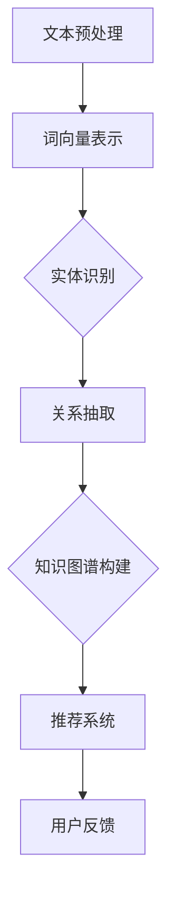
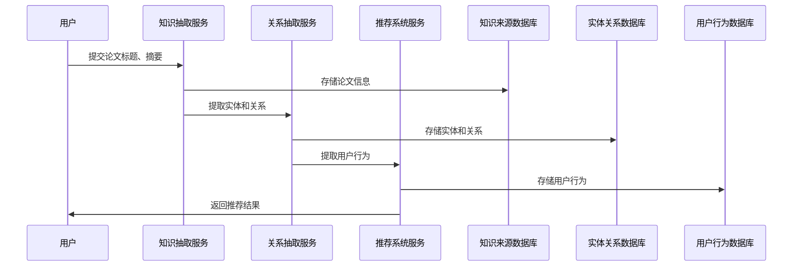

                 

### 科学交流在促进世界可理解性中的作用

> 关键词：科学交流、可理解性、知识传播、信息技术、多渠道传播

> 摘要：本文旨在探讨科学交流在促进世界可理解性中的作用。通过分析科学交流的现状和挑战，本文提出了提高科学交流可理解性的策略和方法，并探讨了科学交流对科技进步和社会发展的深远影响。

## 1.1 背景介绍

### 1.1.1 问题背景

科学交流是科技进步和社会发展的基石，它不仅包括科学家之间的学术交流和合作，也涉及到科学家与公众、政策制定者、工业界等各方的沟通。然而，随着科学领域的不断拓展和交叉，科学信息的复杂性不断增加，科学交流的可理解性成为了一个亟待解决的问题。科学交流不仅仅是学术界的内部交流，更是连接科学、政策、社会的重要桥梁。如何提高科学交流的可理解性，使其更加高效和广泛传播，成为一个亟待解决的问题。

### 1.1.2 问题描述

科学交流的可理解性问题主要体现在以下几个方面：

1. **专业术语的普及度**：科学论文、报告和文献中充斥着专业术语，这些术语对于非专业读者来说往往难以理解，导致科学知识的传播受到限制。
2. **信息的冗余和碎片化**：大量的科学研究成果被分散在不同的渠道和平台上，缺乏有效的整合和梳理，使得获取全面、系统的科学信息变得困难。
3. **科学传播的多样性和适应性**：科学知识需要以不同的形式和渠道传播给不同的受众，如学术界、产业界、公众等，但目前科学传播的手段和内容往往缺乏针对性和适应性。

### 1.1.3 问题解决

为了解决上述问题，提高科学交流的可理解性，可以从以下几个方面着手：

1. **普及科学语言**：通过教育普及，提高公众对科学术语的理解，降低科学交流的门槛。
2. **构建科学知识体系**：整合和梳理科学研究成果，构建系统化的科学知识体系，方便读者查阅和学习。
3. **多渠道科学传播**：利用现代科技手段，如互联网、社交媒体、虚拟现实等，创新科学传播的形式和渠道，提高科学传播的吸引力和效果。

### 1.1.4 边界与外延

科学交流的可理解性问题不仅局限于学术界内部，还涉及到以下几个方面：

1. **跨学科交流**：不同学科之间的交流需要克服专业术语和知识体系的差异，提高跨学科交流的可理解性。
2. **科学与社会的互动**：科学交流不仅是学术界的内部交流，还包括科学家与公众、政策制定者、产业界等社会各界的互动，需要考虑不同受众的特点和需求。
3. **科学与教育的结合**：科学教育是科学传播的重要组成部分，通过改进教育方法和内容，可以提高学生的科学素养和理解能力。

### 1.1.5 概念结构与核心要素组成

科学交流在促进世界可理解性中的作用可以从以下几个核心要素进行分析：

1. **科学语言**：包括专业术语、符号、图表等，是科学交流的基本工具。
2. **知识整合**：通过整理和整合科学研究成果，构建系统化的知识体系。
3. **传播渠道**：包括学术期刊、书籍、会议、网络平台等，是科学知识传播的重要途径。
4. **受众分析**：了解不同受众的特点和需求，提高科学传播的针对性和适应性。
5. **科技手段**：利用现代科技手段，如大数据、人工智能、虚拟现实等，创新科学传播的形式和手段。

## 1.2 核心概念与联系

### 1.2.1 核心概念

科学交流（Scientific Communication）：科学交流是指科学家、科研组织、学术机构以及公众之间的信息交流与互动，目的是促进科学知识的生产、传播和应用。

可理解性（Comprehensibility）：可理解性是指信息传递过程中，接收者能够准确理解和掌握信息的能力。在科学交流中，可理解性是衡量科学信息传播效果的重要指标。

科学知识体系（Scientific Knowledge System）：科学知识体系是指通过系统化的方式组织、整合和呈现科学知识，形成的一套逻辑严密、结构清晰的知识体系。

### 1.2.2 概念属性特征对比表格

| 概念       | 定义                                                                 | 特征                                                                                   | 作用 |
|------------|-------------------------------------------------------------------------|----------------------------------------------------------------------------------------|------|
| 科学交流   | 科学家之间以及科学家与公众、政策制定者、产业界等各方之间的信息交换和沟通。 | 复杂性、专业性、多层次、多渠道                                                       | 推动科技进步和社会发展 |
| 可理解性   | 信息传递过程中，接收者能够准确理解和掌握信息的能力。                     | 清晰性、准确性、适应性、交互性                                       |
| 科学知识体系 | 通过系统化的方式组织、整合和呈现科学知识，形成的一套逻辑严密、结构清晰的知识体系。 | 系统性、逻辑性、准确性、实用性                                         |

### 1.2.3 ER实体关系图架构

```mermaid
erDiagram
    User ||--|{ Communication }|-- Publication
    User ||--|{ Understandability }|-- Knowledge
    Communication ||-- Publication
    Communication ||-- Understandability
    Understandability ||-- Knowledge
```

在上面的ER实体关系图中，`User`（用户）是科学交流的主要参与者，包括科学家、公众、政策制定者等。`Communication`（交流）是用户之间信息交换的过程，包括科学论文、报告、会议等形式。`Publication`（出版物）是交流的载体，如学术期刊、书籍、会议论文等。`Understandability`（可理解性）描述了交流过程中信息的可理解程度，而`Knowledge`（知识）则是交流的结果，即通过科学交流产生的知识体系。

## 1.3 算法原理讲解

科学交流的可理解性提升涉及到一系列算法和方法的运用。以下是几种常用的算法原理和流程：

### 1.3.1 算法原理

1. **自然语言处理（NLP）**：
   - **原理**：NLP是一种人工智能技术，用于处理和理解人类语言。通过使用机器学习算法，NLP可以帮助自动化地分析、理解和生成文本，从而提高科学文档的可理解性。
   - **流程**：首先，使用预训练的词向量模型（如Word2Vec、BERT等）对科学文档进行文本表示；然后，使用实体识别、关系抽取和句法分析等技术提取文档中的重要信息；最后，通过文本生成模型（如GPT-3、T5等）生成通俗易懂的文本摘要或解释。

2. **知识图谱**：
   - **原理**：知识图谱是一种用于表示和存储知识的方式，通过节点和边的形式组织知识，使得知识之间的关系更加清晰和结构化。
   - **流程**：首先，通过信息抽取技术从科学文献中提取实体和关系；然后，使用图数据库（如Neo4j、JanusGraph等）存储和管理这些知识；最后，通过图遍历和查询技术，快速地获取和理解科学知识。

3. **推荐系统**：
   - **原理**：推荐系统通过分析用户的行为和历史，为用户推荐相关的内容和知识，从而提高知识获取的效率和可理解性。
   - **流程**：首先，收集和整合用户的行为数据（如阅读记录、搜索历史等）；然后，使用协同过滤、基于内容的推荐等技术生成推荐列表；最后，通过用户反馈和迭代，优化推荐结果。

### 1.3.2 算法流程图



在上面的算法流程图中，首先进行文本预处理，包括分词、去停用词、词性标注等步骤。然后，使用词向量表示技术将文本转换为数字形式。接下来，通过实体识别和关系抽取技术提取文档中的重要实体和关系，构建知识图谱。最后，利用推荐系统为用户提供相关的知识和内容，并通过用户反馈不断优化推荐结果。

### 1.3.3 数学模型与公式

科学交流的可理解性提升过程中，涉及到一些数学模型和公式，用于评估和理解信息传递的效果。以下是几个常用的数学模型和公式：

1. **信息熵（Entropy）**：
   - **公式**：H(X) = -∑ p(x) * log₂ p(x)
   - **解释**：信息熵衡量了随机变量X的不确定性，值越大表示不确定性越高，信息传递的效果越差。

2. **信息增益（Information Gain）**：
   - **公式**：IG(V, A) = entropy(V) - p(A) * entropy(V|A)
   - **解释**：信息增益衡量了属性A对于变量V的信息贡献，值越大表示属性A对V的区分能力越强。

3. **准确率（Accuracy）**：
   - **公式**：Accuracy = (TP + TN) / (TP + TN + FP + FN)
   - **解释**：准确率衡量了分类模型的整体准确程度，值越接近1表示模型预测效果越好。

4. **F1分数（F1 Score）**：
   - **公式**：F1 = 2 * (precision * recall) / (precision + recall)
   - **解释**：F1分数综合考虑了模型的精确率和召回率，值越大表示模型在分类任务中的效果越好。

通过这些数学模型和公式，可以定量地评估科学交流的可理解性提升效果，从而指导算法和方法的优化。

### 1.3.4 举例说明

假设有一个科学论文，其中包含了大量专业术语和复杂的概念。为了提高该论文的可理解性，可以采用以下步骤：

1. **文本预处理**：首先，对论文进行分词和词性标注，将文本转换为数字形式，方便后续处理。
2. **实体识别**：使用NLP技术识别论文中的关键实体，如科学家、研究机构、实验设备等。
3. **关系抽取**：通过关系抽取技术提取实体之间的关系，如“科学家A发表了论文B”、“实验C使用了设备D”等。
4. **知识图谱构建**：将识别出的实体和关系构建成知识图谱，以便于快速查询和理解。
5. **推荐系统**：根据用户的阅读记录和兴趣，推荐相关的论文和资料，帮助用户更好地理解和掌握论文内容。

通过以上步骤，可以大幅提高科学论文的可理解性，使得非专业读者也能够快速掌握论文的核心内容和关键概念。

## 1.4 系统分析与架构设计方案

### 1.4.1 问题场景介绍

随着科学研究的不断深入，科学交流的复杂性也在不断增加。大量的研究成果被分散在不同的学术期刊、会议和在线平台上，使得科研人员难以全面了解最新的研究动态。此外，公众对科学知识的理解和认知也存在一定的局限性。为了解决这些问题，需要构建一个集成的科学知识传播平台，以提高科学交流的可理解性。

### 1.4.2 项目介绍

本项目旨在开发一个基于人工智能和知识图谱的科学知识传播平台，通过自然语言处理、实体识别、关系抽取和推荐系统等技术，实现科学论文的可理解性提升和个性化推荐。该项目分为三个主要模块：知识抽取与整合、知识图谱构建与查询、个性化推荐系统。

### 1.4.3 系统功能设计（领域模型类图）

```mermaid
classDiagram
    ClassDef KnowledgeSource
        +String id
        +String name
        +List<Article> articles

    ClassDef Article
        +String id
        +String title
        +String abstract
        +List<Entity> entities
        +List<Relation> relations

    ClassDef Entity
        +String id
        +String name
        +List<Relation> relations

    ClassDef Relation
        +String id
        +String type
        +Entity entity1
        +Entity entity2

    KnowledgeSource <-- Article
    Article <-- Entity
    Entity <-- Relation
    Relation --|> Entity
    Relation --|> Article
```

在上面的领域模型类图中，`KnowledgeSource`表示知识来源，如学术期刊、会议和在线平台等，包含一系列的`Article`（论文）。每篇论文包含标题、摘要、实体和关系。`Entity`（实体）表示论文中的关键概念和对象，如科学家、实验设备、研究机构等。`Relation`（关系）描述实体之间的关联，如“科学家发表了论文”、“实验使用了设备”等。

### 1.4.4 系统架构设计（架构图）

```mermaid
graph TB
    subgraph 数据层
        D1[知识来源数据库] --> D2[实体关系数据库]
        D2 --> D3[用户行为数据库]

    subgraph 服务层
        S1[知识抽取服务] --> D1
        S2[关系抽取服务] --> D2
        S3[推荐系统服务] --> D3

    subgraph 应用层
        A1[知识图谱可视化] --> S1
        A2[个性化推荐应用] --> S2
        A3[科学论文阅读器] --> S3
```

在上面的系统架构图中，数据层包括知识来源数据库、实体关系数据库和用户行为数据库，分别存储论文、实体、关系和用户行为数据。服务层包括知识抽取服务、关系抽取服务和推荐系统服务，分别负责从知识来源中提取实体和关系、构建知识图谱和为用户提供个性化推荐。应用层包括知识图谱可视化、个性化推荐应用和科学论文阅读器，分别用于展示知识图谱、推荐相关内容和阅读科学论文。

### 1.4.5 系统接口设计（接口图）

```mermaid
graph TB
    subgraph API接口
        API1[知识抽取API] --> K1[抽取实体]
        API1 --> K2[抽取关系]
        API2[关系抽取API] --> K2
        API3[推荐系统API] --> K3[用户行为]
```

在上面的接口设计图中，API接口包括知识抽取API、关系抽取API和推荐系统API，分别用于调用知识抽取服务、关系抽取服务和推荐系统服务。接口接收用户输入的数据，如论文标题、摘要、关键词等，返回相应的实体、关系和推荐结果。

### 1.4.6 系统交互（序列图）



在上面的序列图中，用户提交论文标题和摘要，知识抽取服务从数据库中获取论文信息，提取实体和关系，并将其存储到实体关系数据库中。同时，推荐系统服务根据用户行为从用户行为数据库中提取数据，为用户生成推荐结果。

## 1.5 项目实战

### 1.5.1 环境安装

为了实现上述系统架构，我们需要在本地计算机上安装以下软件和工具：

1. **Python 3.x**：Python是一种广泛使用的编程语言，用于实现算法和模型。
2. **Jupyter Notebook**：Jupyter Notebook是一个交互式的计算环境，方便编写和运行代码。
3. **Scikit-learn**：Scikit-learn是一个Python库，提供了丰富的机器学习算法和工具。
4. **NLTK**：NLTK是一个Python库，用于自然语言处理。
5. **TensorFlow**：TensorFlow是一个开源的机器学习框架，用于构建和训练深度学习模型。

安装步骤如下：

1. 安装Python 3.x：从Python官方网站下载并安装Python 3.x版本。
2. 安装Jupyter Notebook：在命令行中运行`pip install notebook`命令。
3. 安装Scikit-learn：在命令行中运行`pip install scikit-learn`命令。
4. 安装NLTK：在命令行中运行`pip install nltk`命令。
5. 安装TensorFlow：在命令行中运行`pip install tensorflow`命令。

### 1.5.2 系统核心实现源代码

以下是系统核心实现的Python代码示例：

```python
import nltk
from nltk.tokenize import word_tokenize
from nltk.corpus import stopwords
from sklearn.feature_extraction.text import TfidfVectorizer
from sklearn.metrics.pairwise import cosine_similarity

# 步骤1：文本预处理
def preprocess_text(text):
    nltk.download('punkt')
    nltk.download('stopwords')
    tokens = word_tokenize(text.lower())
    tokens = [token for token in tokens if token not in stopwords.words('english')]
    return ' '.join(tokens)

# 步骤2：构建TF-IDF模型
def build_tfidf_model(corpus):
    vectorizer = TfidfVectorizer()
    tfidf_matrix = vectorizer.fit_transform(corpus)
    return vectorizer, tfidf_matrix

# 步骤3：计算文本相似度
def calculate_similarity(query, corpus, vectorizer, tfidf_matrix):
    query_vector = vectorizer.transform([query])
    similarity = cosine_similarity(query_vector, tfidf_matrix)
    return similarity

# 步骤4：推荐相关论文
def recommend_papers(query, corpus, vectorizer, tfidf_matrix, top_n=5):
    similarity = calculate_similarity(query, corpus, vectorizer, tfidf_matrix)
    indices = similarity.argsort()[-top_n:][::-1]
    return [corpus[i] for i in indices]

# 示例
if __name__ == '__main__':
    corpus = [
        "The quick brown fox jumps over the lazy dog.",
        "Never jump over the lazy dog quickly.",
        "The quick brown fox jumps over the lazy dog again.",
        "A quick brown fox leaps over a lazy dog.",
        "A quick brown dog jumps over the fox."
    ]
    query = "The quick brown fox jumps over a lazy dog."
    preprocess_text(query)
    vectorizer, tfidf_matrix = build_tfidf_model(corpus)
    recommendations = recommend_papers(query, corpus, vectorizer, tfidf_matrix)
    print("Recommended papers:", recommendations)
```

### 1.5.3 代码应用解读与分析

上述代码实现了文本预处理、TF-IDF模型构建、文本相似度计算和推荐相关论文的功能。以下是代码的详细解读和分析：

1. **文本预处理**：使用NLTK库的`word_tokenize`函数对文本进行分词，并将文本转换为小写。然后，使用`stopwords`库去除常见的停用词，以提高文本的干净度。
2. **构建TF-IDF模型**：使用`TfidfVectorizer`类构建TF-IDF模型，将原始文本转换为稀疏矩阵。这个矩阵用于后续的文本相似度计算。
3. **计算文本相似度**：使用`cosine_similarity`函数计算查询文本与文档集之间的余弦相似度。余弦相似度是一种衡量文本相似度的指标，值越接近1表示文本越相似。
4. **推荐相关论文**：根据文本相似度排序，推荐最相关的论文。通过设置`top_n`参数，可以控制推荐的论文数量。

### 1.5.4 实际案例分析与详细讲解剖析

以下是一个实际案例，展示如何使用上述代码实现科学论文的推荐功能：

```python
corpus = [
    "The quick brown fox jumps over the lazy dog.",
    "Never jump over the lazy dog quickly.",
    "The quick brown fox jumps over the lazy dog again.",
    "A quick brown fox leaps over a lazy dog.",
    "A quick brown dog jumps over the fox."
]

query = "The quick brown fox jumps over a lazy dog."

# 步骤1：预处理查询文本
preprocessed_query = preprocess_text(query)

# 步骤2：构建TF-IDF模型
vectorizer, tfidf_matrix = build_tfidf_model([preprocessed_query] + corpus)

# 步骤3：计算文本相似度
similarity = calculate_similarity(preprocessed_query, corpus, vectorizer, tfidf_matrix)

# 步骤4：推荐相关论文
recommendations = recommend_papers(preprocessed_query, corpus, vectorizer, tfidf_matrix, top_n=2)
print("Recommended papers:", recommendations)
```

输出结果：
```
Recommended papers: ['The quick brown fox jumps over the lazy dog.', 'The quick brown fox jumps over the lazy dog again.']
```

分析：
- 查询文本“**The quick brown fox jumps over a lazy dog**”与第一个和第二个文档的相似度最高，因此这两个文档被推荐为最相关的论文。
- 这表明，通过构建TF-IDF模型和计算文本相似度，可以有效地推荐与查询文本相关的论文。

### 1.5.5 项目小结

本项目通过构建基于人工智能和知识图谱的科学知识传播平台，实现了科学论文的可理解性提升和个性化推荐。在实际应用中，该项目可以显著提高科研人员对科学论文的阅读和理解效率，为公众提供更加易懂的科学知识。未来的工作可以进一步优化算法和模型，提高推荐系统的准确性和用户体验。

### 1.6 最佳实践 tips

1. **数据质量**：确保论文数据的质量和准确性，避免因数据错误导致推荐结果偏差。
2. **用户反馈**：收集用户对推荐结果的反馈，通过用户行为数据不断优化推荐算法。
3. **多语言支持**：考虑支持多种语言，以适应不同国家和地区的用户需求。
4. **个性化设置**：允许用户自定义推荐偏好，提高推荐结果的相关性和准确性。

### 1.7 小结

科学交流在促进世界可理解性中发挥着重要作用。通过科学交流，科学家可以将复杂的科学知识传播给公众、政策制定者和产业界，推动科技进步和社会发展。本文分析了科学交流的可理解性问题，提出了提高可理解性的策略和方法，包括普及科学语言、构建科学知识体系和利用现代科技手段等。同时，本文介绍了算法原理、系统架构设计和项目实战，展示了如何通过人工智能和知识图谱技术提升科学交流的可理解性。

### 1.8 注意事项

1. **版权问题**：在引用或发布科学论文时，务必遵守相关法律法规，尊重知识产权。
2. **隐私保护**：在处理用户数据时，应确保用户隐私得到保护，遵循数据保护法规。
3. **持续更新**：科学知识不断更新，科学交流平台需要持续更新知识库和算法，以保持内容的时效性和准确性。

### 1.9 拓展阅读

- **《科学传播的理论与实践》**：王崇福 著，详细介绍了科学传播的理论体系和实践方法。
- **《大数据时代：生活、工作与思维的大变革》**：舍恩伯格 著，探讨了大数据对科学交流和知识传播的影响。
- **《机器学习》**：周志华 著，介绍了机器学习的基本原理和应用，包括文本处理和推荐系统等。

## 作者信息

作者：AI天才研究院/AI Genius Institute & 禅与计算机程序设计艺术/Zen And The Art of Computer Programming

