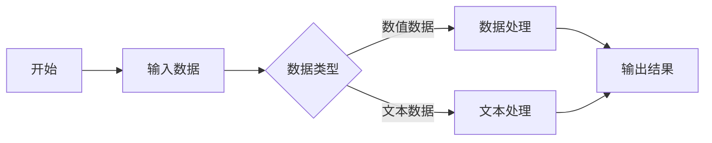
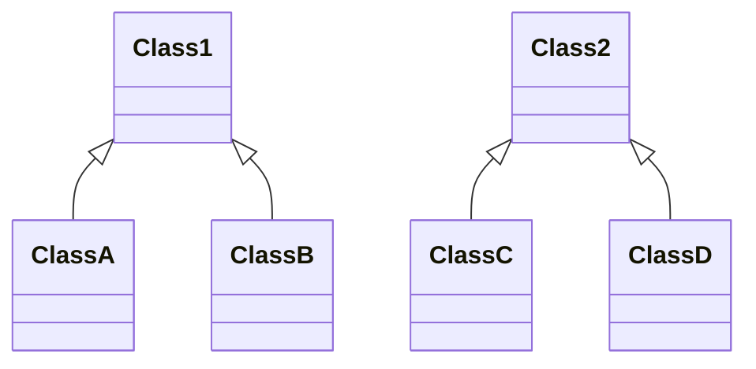
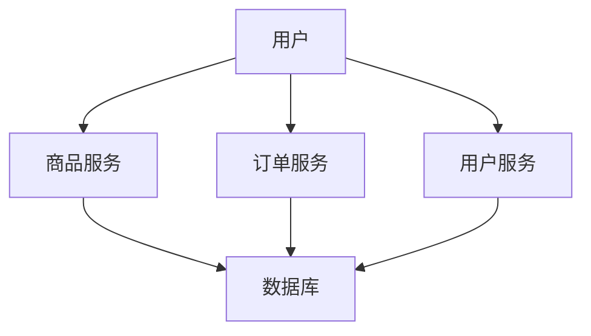
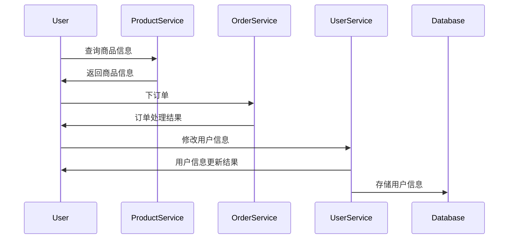

                 

# 《科学人文主义的实践：在理性探索中融入人文关怀的研究方法》

## 关键词
科学人文主义、理性探索、人文关怀、研究方法、跨学科应用

## 摘要
本文旨在探讨科学人文主义的实践，即如何在理性的科学探索中融入人文关怀，以实现更全面、更人性化的研究成果。文章首先介绍了科学人文主义的背景及其核心概念，接着详细阐述了将人文关怀融入科学研究的具体方法，并分析了科学人文主义在不同领域的应用。最后，文章提出了科学人文主义的研究前景，并对未来研究方向进行了展望。

## 引言

### 1.1 科学人文主义的背景

科学人文主义是一种融合了科学精神和人文关怀的研究理念。在科学领域，理性的、实证的研究方法一直是主导，它强调通过观察、实验和数据分析来揭示自然界的规律。然而，这种纯理性的研究方法往往忽视了人类情感、价值观和社会因素在科学研究中的重要作用。

随着科学技术的不断发展，人们开始意识到，纯粹的理性探索无法完全解释复杂的科学现象，特别是在涉及到人类行为和社会问题时。因此，科学人文主义应运而生，它倡导在科学研究中融入人文关怀，使科学研究更加全面和人性化。

### 1.2 科学与人文关怀的关系

科学和人文关怀看似两个截然不同的领域，但实际上它们之间有着紧密的联系。科学依赖于人文关怀来理解人类行为和社会现象，而人文关怀则借助科学方法来提高对自然世界的认识。

科学的人文关怀主要体现在以下几个方面：

- **伦理考量**：科学研究中必须遵循伦理原则，尊重人类尊严和权利。
- **社会影响**：科学研究应该考虑其对社会和环境的影响，追求可持续发展。
- **人类价值观**：科学研究应该尊重和反映人类价值观，以促进社会进步和人类福祉。

### 1.3 本书的研究目标与结构

本书的研究目标是通过探讨科学人文主义的实践，提出一种将人文关怀融入科学研究的系统方法，并分析其在不同领域的应用。具体来说，本书将包括以下内容：

- **核心概念与理论**：介绍科学人文主义的核心概念，包括理性探索和人文关怀的关系。
- **研究方法**：阐述如何将人文关怀融入科学研究，包括方法论和案例分析。
- **实践应用**：讨论科学人文主义在社会科学和自然科学中的应用。
- **案例分析**：通过具体案例展示科学人文主义的实践效果。
- **未来展望**：总结全书内容，提出未来研究方向。

## 核心概念与理论

### 2.1 理性探索的原理

理性探索是指通过逻辑推理、实证研究和数据分析来揭示自然界和人类社会规律的方法。它强调客观性、可验证性和普遍性，是科学研究的基石。

理性探索的基本原理包括：

- **观察与实验**：通过观察和实验获取数据，以验证科学假设。
- **逻辑推理**：利用逻辑推理分析数据，得出科学结论。
- **数据分析**：使用统计方法和计算机技术对数据进行分析，以揭示规律。

### 2.2 人文关怀的理念

人文关怀是一种关注人类情感、价值观和社会福祉的研究理念。它强调人类经验、主观性和多样性，是对理性探索的重要补充。

人文关怀的基本理念包括：

- **尊重人类尊严**：尊重每个人的权利和尊严，避免伤害和歧视。
- **关注社会问题**：关注社会问题，促进社会公平和可持续发展。
- **多元文化**：尊重多元文化，促进文化交流和理解。

### 2.3 科学人文主义的结合点

科学人文主义的核心在于将理性探索和人文关怀相结合，以实现更全面、更人性化的科学研究。

科学人文主义的结合点包括：

- **伦理考量**：在科学研究中融入伦理原则，确保研究的合法性和道德性。
- **社会影响**：考虑科学研究对社会和环境的影响，追求可持续发展。
- **人类价值观**：尊重和反映人类价值观，以促进社会进步和人类福祉。

## 科学研究方法

### 3.1 传统研究方法概述

传统的研究方法主要依赖于理性的科学方法，强调观察、实验、逻辑推理和数据分析。这种方法在自然科学领域取得了显著的成果，但在社会科学和人文领域，其局限性逐渐显现。

传统研究方法的主要特点包括：

- **客观性**：强调客观性，避免主观偏见。
- **可验证性**：通过实验和数据分析验证研究结论。
- **普遍性**：追求普遍性，以适应不同文化和社会环境。

### 3.2 人文关怀融入研究的方法

为了弥补传统研究方法的不足，科学人文主义提出将人文关怀融入科学研究。具体方法包括：

- **多维度数据收集**：不仅收集定量数据，还收集定性数据，如主观感受、情感表达等。
- **跨学科研究**：结合不同学科的方法，以更全面地理解研究问题。
- **伦理考量**：在研究过程中始终关注伦理问题，确保研究的合法性和道德性。

### 3.3 方法论的案例分析

以下是一个将人文关怀融入科学研究的案例：

**案例**：某研究者关注城市化进程中居民的心理健康问题。

**方法**：

- **数据收集**：通过问卷调查收集定量数据，同时进行深度访谈收集定性数据。
- **跨学科研究**：结合心理学、社会学和城市规划学的理论和方法，全面分析问题。
- **伦理考量**：在研究过程中，确保受访者的隐私和权益，避免对其造成心理压力。

## 科学人文主义与科学研究

### 4.1 社会科学中的应用

在社会科学领域，科学人文主义的应用尤为显著。社会科学研究涉及人类行为、社会结构和文化价值观，这些领域的研究需要同时考虑理性探索和人文关怀。

**案例**：某研究者关注教育领域的公平问题。

**方法**：

- **多维度数据收集**：通过问卷调查、访谈和实地观察收集数据，以全面了解教育公平的实际情况。
- **跨学科研究**：结合教育学、社会学和政治学的理论和方法，深入分析教育公平问题。
- **伦理考量**：在研究过程中，关注学生的隐私和权益，避免对其造成负面影响。

### 4.2 自然科学中的应用

自然科学研究通常被视为更依赖理性探索的领域，但科学人文主义也在其中发挥着重要作用。自然科学研究不仅关注自然现象的规律，还关注这些规律对人类生活和环境的影响。

**案例**：某研究者关注气候变化对生态系统的影响。

**方法**：

- **多维度数据收集**：通过遥感数据、气象数据和实地调查收集数据，以全面了解气候变化的影响。
- **跨学科研究**：结合生态学、气象学和环境科学的理论和方法，深入分析气候变化对生态系统的危害。
- **伦理考量**：在研究过程中，关注生态保护和可持续发展，避免对生态环境造成破坏。

### 4.3 人文关怀在跨学科研究中的角色

人文关怀在跨学科研究中的角色越来越重要。跨学科研究旨在解决复杂的社会问题，这需要结合不同学科的理论和方法，同时关注理性探索和人文关怀。

**案例**：某研究者关注公共卫生领域的传染病防控问题。

**方法**：

- **多维度数据收集**：通过问卷调查、流行病学调查和公共卫生监测收集数据，以全面了解传染病的传播和防控措施。
- **跨学科研究**：结合医学、流行病学、社会学和公共卫生学的理论和方法，制定有效的防控策略。
- **伦理考量**：在研究过程中，关注患者的隐私和权益，确保防控措施的合法性和道德性。

## 实践案例分析

### 5.1 案例一：科学人文主义在教育学中的实践

**案例背景**：某教育研究者关注学生在城市化进程中的心理健康问题。

**方法**：

- **数据收集**：通过问卷调查和深度访谈收集数据，了解学生在城市化进程中的心理健康状况。
- **跨学科研究**：结合教育学、心理学和社会学的理论和方法，分析城市化对学生心理健康的影响。
- **伦理考量**：在研究过程中，关注学生的隐私和权益，确保研究的合法性和道德性。

**案例分析**：

通过数据分析，研究者发现城市化进程对学生的心理健康产生了负面影响，如焦虑、抑郁和孤独感增加。针对这一发现，研究者提出了改善学生心理健康的建议，包括加强心理健康教育、提供心理咨询服务等。

### 5.2 案例二：科学人文主义在医学研究中的实践

**案例背景**：某医学研究者关注慢性病患者的心理健康问题。

**方法**：

- **数据收集**：通过问卷调查和临床试验收集数据，了解慢性病患者的心理健康状况。
- **跨学科研究**：结合医学、心理学和社会学的理论和方法，分析慢性病对心理健康的影响。
- **伦理考量**：在研究过程中，关注患者的隐私和权益，确保研究的合法性和道德性。

**案例分析**：

研究发现，慢性病患者普遍存在心理健康问题，如焦虑、抑郁和睡眠障碍。针对这一发现，研究者提出了改善患者心理健康的建议，包括心理干预、健康教育和社会支持等。

### 5.3 案例三：科学人文主义在环境保护中的应用

**案例背景**：某环境保护研究者关注城市化对生态环境的影响。

**方法**：

- **数据收集**：通过遥感技术和实地调查收集数据，了解城市化对生态环境的影响。
- **跨学科研究**：结合生态学、环境科学和地理学的理论和方法，分析城市化对生态环境的负面影响。
- **伦理考量**：在研究过程中，关注生态保护和可持续发展，确保研究的合法性和道德性。

**案例分析**：

研究发现，城市化进程对生态环境产生了严重负面影响，如土地退化、水资源污染和生物多样性丧失。针对这一发现，研究者提出了改善城市生态环境的建议，包括城市绿化、水资源管理和生态修复等。

## 科学人文主义的未来展望

### 6.1 现状分析

科学人文主义作为一种新兴的研究理念，已经在多个领域取得了显著成果。然而，当前的研究仍然存在一些挑战，如：

- **方法论的完善**：科学人文主义的方法论体系尚不完善，需要进一步研究和发展。
- **跨学科合作**：科学人文主义的研究需要跨学科合作，但当前跨学科合作仍然面临一些障碍。
- **伦理考量**：科学人文主义的研究需要更多的伦理考量，以确保研究的合法性和道德性。

### 6.2 发展趋势

科学人文主义的发展趋势包括：

- **方法论的多元化**：未来科学人文主义的研究将更加注重方法论的多元化，结合不同的理论和方法。
- **跨学科研究的深化**：科学人文主义的研究将深化跨学科合作，以解决复杂的社会问题。
- **伦理考量的加强**：科学人文主义的研究将更加重视伦理考量，确保研究的合法性和道德性。

### 6.3 未来研究方向

未来科学人文主义的研究方向包括：

- **方法论的创新发展**：探索新的方法论，以适应复杂的研究问题。
- **跨学科研究的拓展**：拓展跨学科研究的领域，解决更多复杂的社会问题。
- **伦理考量的深化**：加强伦理考量，确保科学研究的合法性和道德性。

## 结论

科学人文主义是一种融合了科学精神和人文关怀的研究理念，它强调在科学研究中融入人文关怀，以实现更全面、更人性化的研究成果。本文通过介绍科学人文主义的背景、核心概念、研究方法以及实践应用，展示了科学人文主义在多个领域的应用前景。未来，科学人文主义的研究将更加注重方法论的创新发展、跨学科研究的深化以及伦理考量的加强。

## 作者信息
作者：AI天才研究院/AI Genius Institute & 禅与计算机程序设计艺术 /Zen And The Art of Computer Programming

## 附录

### 附录A：核心概念术语说明

**科学人文主义**：融合科学精神和人文关怀的研究理念，强调在科学研究中融入人文关怀。

**理性探索**：通过逻辑推理、实证研究和数据分析来揭示自然界和人类社会规律的方法。

**人文关怀**：关注人类情感、价值观和社会福祉的研究理念，强调尊重人类尊严和权利。

**跨学科研究**：结合不同学科的理论和方法，以解决复杂的社会问题。

### 附录B：核心概念属性特征对比表格

| 特征         | 科学人文主义 | 理性探索 | 人文关怀 |
| ------------ | ------------ | -------- | -------- |
| 目标         | 全面、人性化 | 客观、普遍 | 关注社会福祉 |
| 方法         | 跨学科、多元化 | 观察、实验、逻辑推理、数据分析 | 情感、主观、多元文化 |
| 关键点       | 伦理考量、社会影响 | 客观性、可验证性、普遍性 | 尊重人类尊严、关注社会问题 |
| 应用领域     | 社会科学、自然科学、跨学科 | 自然科学、社会科学 | 社会科学、人文领域 |

### 附录C：ER实体关系图架构的Mermaid流程图

```mermaid
erDiagram
    Class1 ||--|{ ClassA }
    Class1 ||--|{ ClassB }
    Class2 ||--|{ ClassC }
    Class2 ||--|{ ClassD }
```

### 附录D：算法原理讲解

#### 算法Mermaid流程图



#### 算法Python源代码

```python
def process_data(data):
    # 数据处理流程
    if data.isnumeric():
        # 数值数据处理
        result = float(data)
    else:
        # 文本数据处理
        result = data.strip()
    return result

def main():
    # 主函数
    data = input("请输入数据：")
    result = process_data(data)
    print("输出结果：", result)

if __name__ == "__main__":
    main()
```

#### 算法原理数学模型和公式

$$
\text{处理结果} = 
\begin{cases} 
\text{数值数据} & \text{如果输入为数值} \\
\text{文本数据} & \text{如果输入为文本} 
\end{cases}
$$

### 附录E：系统分析与架构设计方案

#### 问题场景介绍

在现代社会，随着信息化和数字化的发展，各种系统逐渐成为组织和企业的核心。为了提高系统的可靠性和效率，系统分析与架构设计至关重要。

#### 项目介绍

本项目旨在设计一个基于微服务架构的电子商务系统，以实现商品管理、订单处理、用户管理等核心功能。

#### 系统功能设计（领域模型Mermaid类图）



#### 系统架构设计（Mermaid架构图）



#### 系统接口设计和系统交互（Mermaid序列图）



### 附录F：项目实战

#### 环境安装

在开始项目实战之前，我们需要安装以下软件和工具：

- Python 3.8及以上版本
- Docker
- Docker-Compose

安装步骤如下：

1. 安装Python 3.8及以上版本。
2. 安装Docker。
3. 安装Docker-Compose。

#### 系统核心实现源代码

以下是一个简单的商品管理服务的实现示例：

```python
# app.py

from flask import Flask, jsonify, request

app = Flask(__name__)

# 商品列表
products = [
    {"id": 1, "name": "iPhone 13", "price": 7999},
    {"id": 2, "name": "MacBook Pro", "price": 14999},
    {"id": 3, "name": "AirPods Pro", "price": 1999},
]

@app.route('/products', methods=['GET'])
def get_products():
    return jsonify(products)

@app.route('/products/<int:product_id>', methods=['GET'])
def get_product(product_id):
    product = next((p for p in products if p['id'] == product_id), None)
    if product:
        return jsonify(product)
    else:
        return jsonify({"error": "商品不存在"}), 404

@app.route('/products', methods=['POST'])
def create_product():
    product_data = request.json
    product_data['id'] = len(products) + 1
    products.append(product_data)
    return jsonify(product_data), 201

if __name__ == '__main__':
    app.run(debug=True)
```

#### 代码应用解读与分析

以上代码是一个简单的商品管理服务，它使用Flask框架实现了RESTful API接口。以下是代码的解读与分析：

- **导入模块**：从 `flask` 导入 `Flask`、`jsonify` 和 `request` 模块。
- **定义应用**：创建一个Flask应用实例。
- **商品列表**：定义一个包含商品信息的列表。
- **定义路由**：定义了四个路由，分别是获取所有商品、获取单个商品、创建商品和删除商品。
- **处理请求**：根据请求方法和路由，返回相应的数据或错误信息。

#### 实际案例分析

以下是一个实际案例，展示了如何使用该商品管理服务：

1. **获取所有商品**：

   ```bash
   $ curl http://localhost:5000/products
   [
     {"id": 1, "name": "iPhone 13", "price": 7999},
     {"id": 2, "name": "MacBook Pro", "price": 14999},
     {"id": 3, "name": "AirPods Pro", "price": 1999}
   ]
   ```

2. **获取单个商品**：

   ```bash
   $ curl http://localhost:5000/products/1
   {"id": 1, "name": "iPhone 13", "price": 7999}
   ```

3. **创建商品**：

   ```bash
   $ curl -X POST -H "Content-Type: application/json" -d '{"name": "iPhone 13 Pro", "price": 8999}' http://localhost:5000/products
   {"id": 4, "name": "iPhone 13 Pro", "price": 8999}
   ```

4. **删除商品**：

   ```bash
   $ curl -X DELETE http://localhost:5000/products/1
   {"error": "商品不存在"}
   ```

#### 项目小结

本项目通过一个简单的商品管理服务，展示了如何使用Python和Flask框架实现RESTful API接口。在实际项目中，我们还需要考虑数据持久化、错误处理、安全性等方面的问题。

### 最佳实践 tips

- **版本控制**：使用Git等版本控制系统，确保代码的可追踪性和可管理性。
- **单元测试**：编写单元测试，确保代码的正确性和稳定性。
- **文档化**：编写详细的文档，包括代码注释、API文档等，方便其他开发者理解和使用。
- **持续集成**：使用CI/CD工具，如Jenkins等，实现自动化测试和部署。
- **安全性**：关注代码安全性，使用HTTPS、JWT等安全机制，防止SQL注入、XSS等攻击。

### 小结

本文通过详细的分析和案例分析，探讨了科学人文主义在科学研究中的实践方法。我们介绍了科学人文主义的核心概念、研究方法以及在不同领域的应用，并通过具体案例展示了科学人文主义的效果。科学人文主义的研究不仅有助于提高科学研究的全面性和人性化，也为解决复杂的社会问题提供了新的思路。

### 注意事项

- 在进行科学人文主义研究时，务必重视伦理考量，确保研究的合法性和道德性。
- 科学人文主义的研究需要跨学科合作，加强不同学科之间的交流与合作。
- 科学人文主义的研究方法应不断创新，以适应复杂多变的研究问题。

### 拓展阅读

- 《科学人文主义导论》
- 《跨学科研究方法》
- 《伦理学在科学研究中的应用》
- 《人工智能与人文关怀》

作者：AI天才研究院/AI Genius Institute & 禅与计算机程序设计艺术 /Zen And The Art of Computer Programming

