                 

### 引言：科学传播的挑战与多媒体策略的兴起

**关键词**：科学传播、多媒体策略、挑战、通俗易懂、复杂概念

**摘要**：本文探讨了科学传播中面临的挑战，并提出了一种多媒体策略来简化复杂概念，使其更易于理解。通过分析多媒体元素的特点、传播原理及设计原则，我们展示了一系列案例研究，总结了多媒体策略在科学传播中的效果，并展望了其未来的发展趋势。

随着科技的飞速发展，科学知识越来越复杂，而公众对科学知识的渴求也日益增长。然而，传统的文字传播方式往往难以充分满足这一需求，使得科学传播面临诸多挑战。首先，科学领域中的许多概念和理论都极其抽象和复杂，难以用简单的语言进行解释。其次，科学传播的目标群体广泛，包括不同年龄、学历和背景的读者，这就要求传播方式必须具备高度的可及性和适应性。最后，科学传播的效果评估也是一个难题，如何衡量传播效果，提高公众对科学知识的理解和接受度，需要新的思考和策略。

为了应对这些挑战，多媒体策略应运而生。多媒体传播通过结合视觉、听觉和互动等多种元素，不仅能够提高信息的可及性，还能够增强用户体验，使得复杂概念变得更加通俗易懂。本文将详细探讨多媒体策略的基础、科学传播中的应用、案例研究以及未来发展趋势，以期为广大科学传播从业者和爱好者提供有价值的参考。

### 第一部分：多媒体策略基础

#### 2.1 多媒体元素及其特点

多媒体策略的成功离不开对各种多媒体元素的深入理解和有效运用。多媒体元素主要包括视觉元素、音频元素和视听元素。每种元素都有其独特的特点和优势。

**视觉元素**：包括图片、图表、动画和视频等。视觉元素具有很强的直观性和表现力，能够直观地展示信息，使复杂概念更容易被理解和记忆。例如，在解释物理学中的力学原理时，通过动画展示物体的运动轨迹，可以让学生更直观地理解力与运动的关系。

**音频元素**：包括语音、音乐和环境音效等。音频元素能够营造特定的氛围，增强信息的感染力和吸引力。例如，在科普讲座中，适当的背景音乐和声音效果可以提升观众的注意力和参与感。

**视听元素**：结合视觉和音频元素，形成全方位的感官刺激。视听元素能够增强信息的互动性和体验感，使观众在视觉和听觉上同时接收信息，提高记忆效果。例如，在医学领域，通过视频展示手术过程，不仅能够直观地展示手术步骤，还能够提供实时反馈，帮助医生和学员更好地学习和实践。

**ER实体关系图架构的 Markdown 格式中的 Mermaid 流程图**：

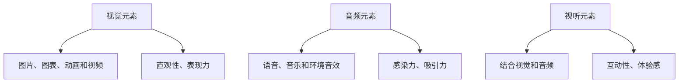

#### 2.2 多媒体传播的基本原理

多媒体传播之所以能够简化复杂概念，在于其独特的传播原理。以下将介绍多媒体传播中的三大基本原理：情境效应、交互性和多感官刺激。

**情境效应**：情境效应是指信息传播的背景环境对信息接受和理解产生的影响。合适的环境能够增强信息的传递效果，使得观众更容易理解和接受信息。例如，在讲解天文学中的黑洞概念时，通过在一个黑暗的环境中展示黑洞的视觉效果，能够更直观地让观众感受到黑洞的神秘和强大。

**交互性**：交互性是指信息传播过程中，观众与传播内容之间的互动。通过互动，观众不仅能够更好地理解信息，还能够主动参与到传播过程中，提高参与感和满意度。例如，在科学展览中，设置互动体验区，让观众通过实际操作来感受科学原理，能够极大地提升观众的兴趣和理解。

**多感官刺激**：多感官刺激是指通过视觉、听觉、触觉等多种感官同时传递信息，增强信息的记忆效果和接受度。例如，在讲解生物多样性时，通过视觉展示各种生物的图片，通过音频播放生物的声音，通过触摸感受生物的纹理，能够使观众更全面地了解生物多样性。

**多媒体传播的基本原理的 Mermaid 流程图**：

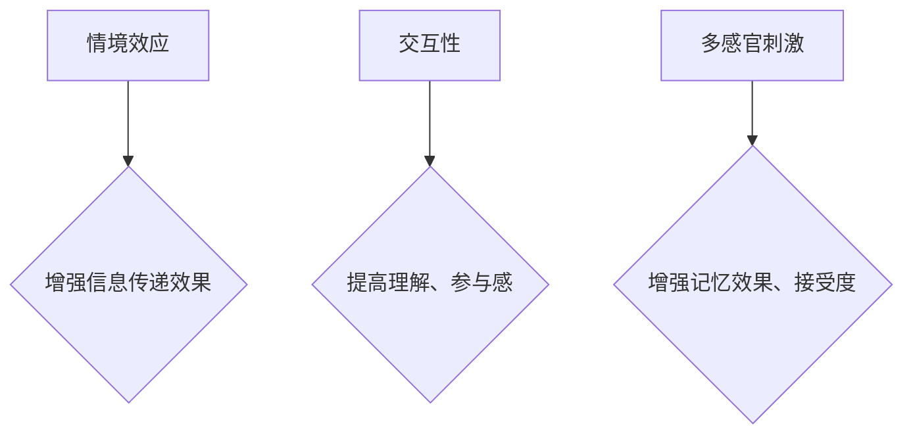

#### 2.3 多媒体策略的设计原则

为了使多媒体策略能够有效简化复杂概念，设计时需要遵循以下几项原则：

**简化复杂概念**：通过简化和重构复杂概念，使其更易于理解。例如，将复杂的科学理论转化为简单的故事或比喻，使观众更容易接受和记忆。

**提高信息可及性**：确保信息能够被广泛的人群所理解和接受，不受年龄、学历和背景的限制。例如，通过多种语言和形式传播信息，以满足不同观众的需求。

**增强用户体验**：通过设计友好的用户界面和互动体验，提升观众的满意度和参与度。例如，设计易于操作的互动工具，使观众能够轻松地参与到信息传播过程中。

**MERMAID 类图架构设计**：

```mermaid
classDiagram
    MultimediaStrategy <|-- VisualElements
    MultimediaStrategy <|-- AudioElements
    MultimediaStrategy <|-- AudioVisualElements
    MultimediaStrategy <|-- Principle1{情境效应}
    MultimediaStrategy <|-- Principle2{交互性}
    MultimediaStrategy <|-- Principle3{多感官刺激}
    MultimediaStrategy <|-- DesignPrinciples
```

通过上述多媒体元素及其特点、传播原理和设计原则的介绍，我们可以更好地理解多媒体策略如何简化复杂概念，提高科学传播的效果。

### 第三部分：科学传播中的应用

#### 3.1 教育领域的多媒体策略

在科学教育中，多媒体策略的应用极大地提升了学生的学习效果和理解能力。以下将介绍多媒体策略在科学课程设计、教材使用和教学评估中的具体应用。

**3.1.1 科学课程的创新设计**

科学课程的设计需要结合多媒体元素，使教学内容更加生动有趣。例如，在讲解生物学中的细胞结构时，通过动画展示细胞的分裂和功能，使学生能够直观地理解细胞的工作原理。此外，通过虚拟实验室和在线互动实验，学生可以在虚拟环境中进行实验操作，增强实践能力。

**多媒体课程设计的 Mermaid 流程图**：

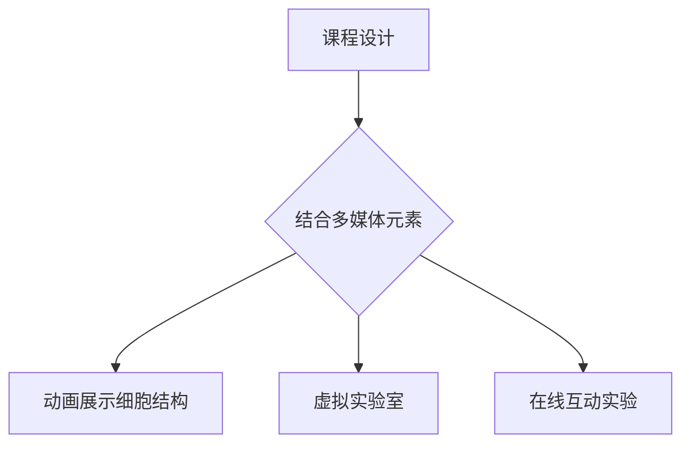

**3.1.2 多媒体教材的使用**

多媒体教材通过结合文字、图片、视频和音频等多种元素，使得教材内容更加丰富和生动。例如，在物理教材中，通过添加视频讲解实验过程和原理，使学生能够更直观地理解物理现象。此外，多媒体教材还支持互动功能，如在线测试、问答和讨论，使学生能够更加主动地参与学习。

**多媒体教材使用的 Mermaid 流程图**：

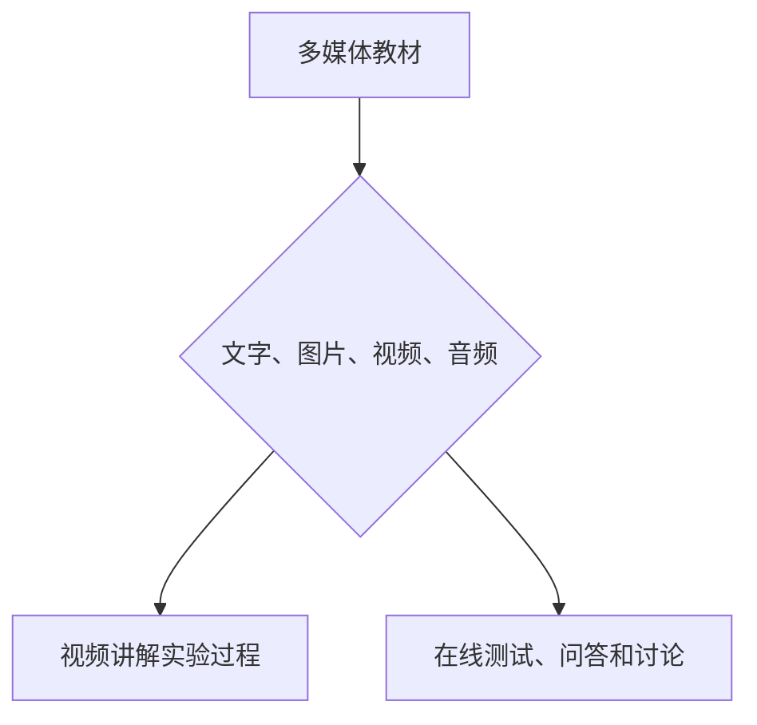

**3.1.3 教学评估中的多媒体应用**

多媒体策略在教学评估中的应用，使得评估结果更加全面和准确。例如，通过在线测试系统，教师可以实时监测学生的学习进度和理解程度，并根据评估结果调整教学策略。此外，通过视频反馈和互动评价，教师可以更深入地了解学生的学习困惑和需求，提供有针对性的帮助。

**教学评估中的多媒体应用的 Mermaid 流程图**：

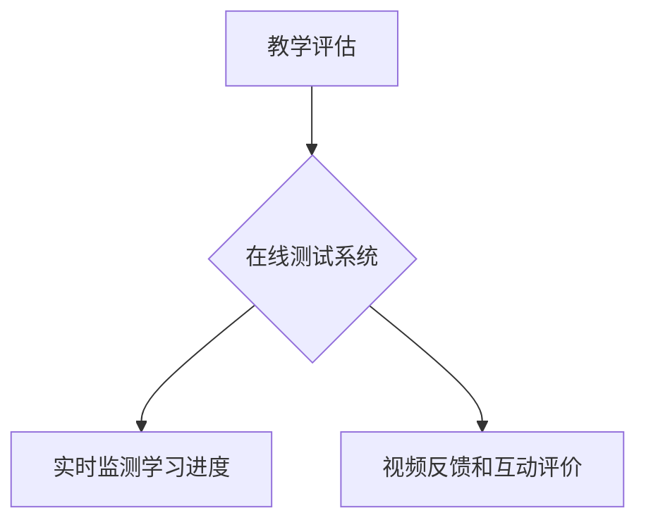

通过上述多媒体策略在科学教育中的应用，我们可以看到，多媒体元素不仅提升了学生的学习效果和理解能力，还增强了教学的互动性和体验感，为科学教育注入了新的活力。

#### 3.2 公众科学传播的多媒体策略

在公众科学传播中，多媒体策略同样发挥着重要作用。以下将介绍多媒体策略在科普展览设计、科普视频制作和社交媒体上的具体应用。

**3.2.1 科普展览的设计**

科普展览通过多媒体元素的结合，使得展览内容更加生动有趣，吸引更多观众参与。例如，在展示宇宙奥秘的展览中，通过大型天体模型和虚拟星空投影，让观众直观地感受到宇宙的浩瀚和神秘。此外，设置互动展台，如虚拟现实体验和互动游戏，让观众能够亲身体验科学现象，增强科普效果。

**科普展览设计的 Mermaid 流程图**：

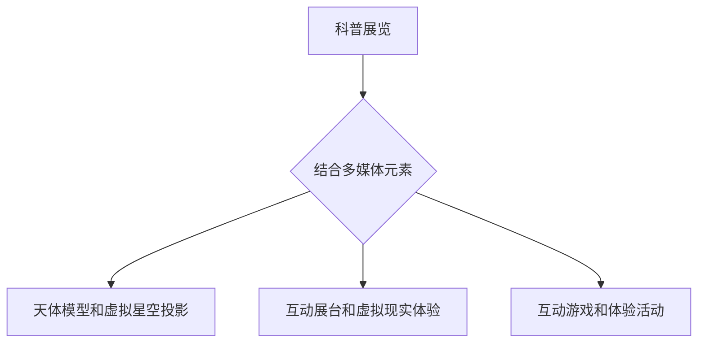

**3.2.2 科普视频的制作**

科普视频通过视觉和听觉的结合，使得科学知识更加易于传播和接受。例如，在制作关于环境保护的科普视频时，通过动画和实景拍摄，生动地展示环境污染的危害和防治措施。此外，通过幽默风趣的解说和有趣的实验，使观众在轻松愉快的氛围中学习科学知识。

**科普视频制作的 Mermaid 流程图**：

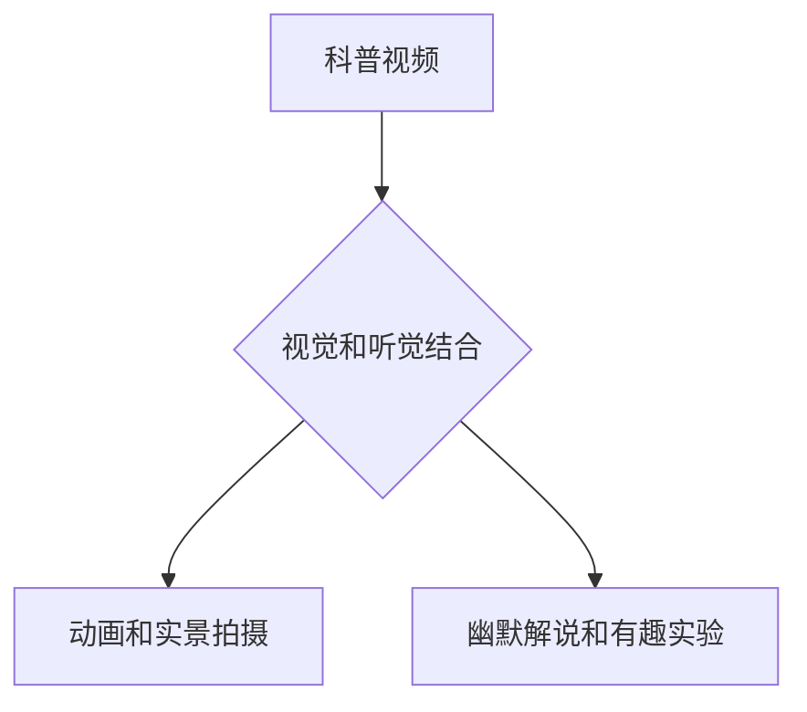

**3.2.3 社交媒体上的科学传播**

社交媒体作为科学传播的重要平台，通过多媒体策略的运用，可以更广泛地传播科学知识。例如，在微博、抖音等社交媒体上发布科学短视频，通过视觉效果和简洁的文字，快速吸引观众的注意力。此外，利用直播和互动功能，与观众实时互动，解答疑问，提高科普效果。

**社交媒体上的科学传播的 Mermaid 流程图**：

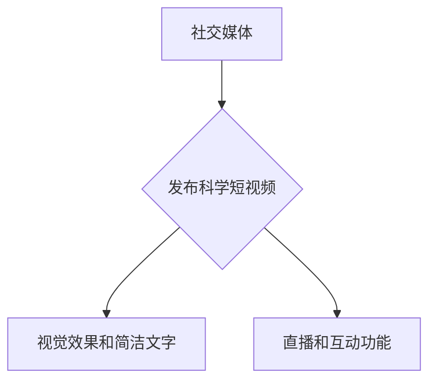

通过上述多媒体策略在公众科学传播中的应用，我们可以看到，多媒体元素不仅提高了科普的吸引力和互动性，还大大拓展了科学传播的渠道和范围，为公众了解科学知识提供了更多便利。

#### 3.3 科研成果的多媒体展示

在科研领域，多媒体展示已经成为传播研究成果的重要手段。以下将介绍多媒体策略在研究论文的多媒体补充、研究项目的多媒体宣传和科研交流中的具体应用。

**3.3.1 研究论文的多媒体补充**

研究论文中的多媒体补充，如图表、动画和视频等，能够直观地展示研究过程和结果，使论文内容更加生动和易于理解。例如，在物理学论文中，通过动画展示实验过程和数据分析，使读者更直观地理解研究内容。此外，通过图表和数据可视化，使复杂的统计数据和模型更加清晰易懂。

**研究论文多媒体补充的 Mermaid 流程图**：

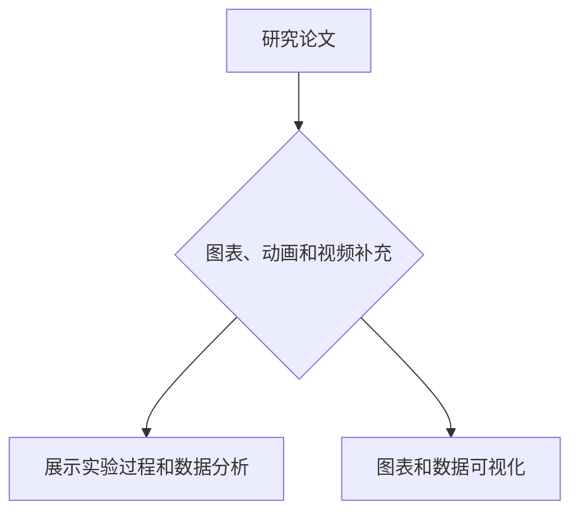

**3.3.2 研究项目的多媒体宣传**

研究项目的多媒体宣传，如科普视频、宣传片和海报等，能够吸引更多的关注和资金支持。例如，在科研项目的科普视频中，通过生动的动画和实景拍摄，介绍项目的研究背景、目标和应用前景，使观众对项目有更深入的了解。此外，通过社交媒体和线上活动，扩大项目的知名度和影响力。

**研究项目多媒体宣传的 Mermaid 流程图**：

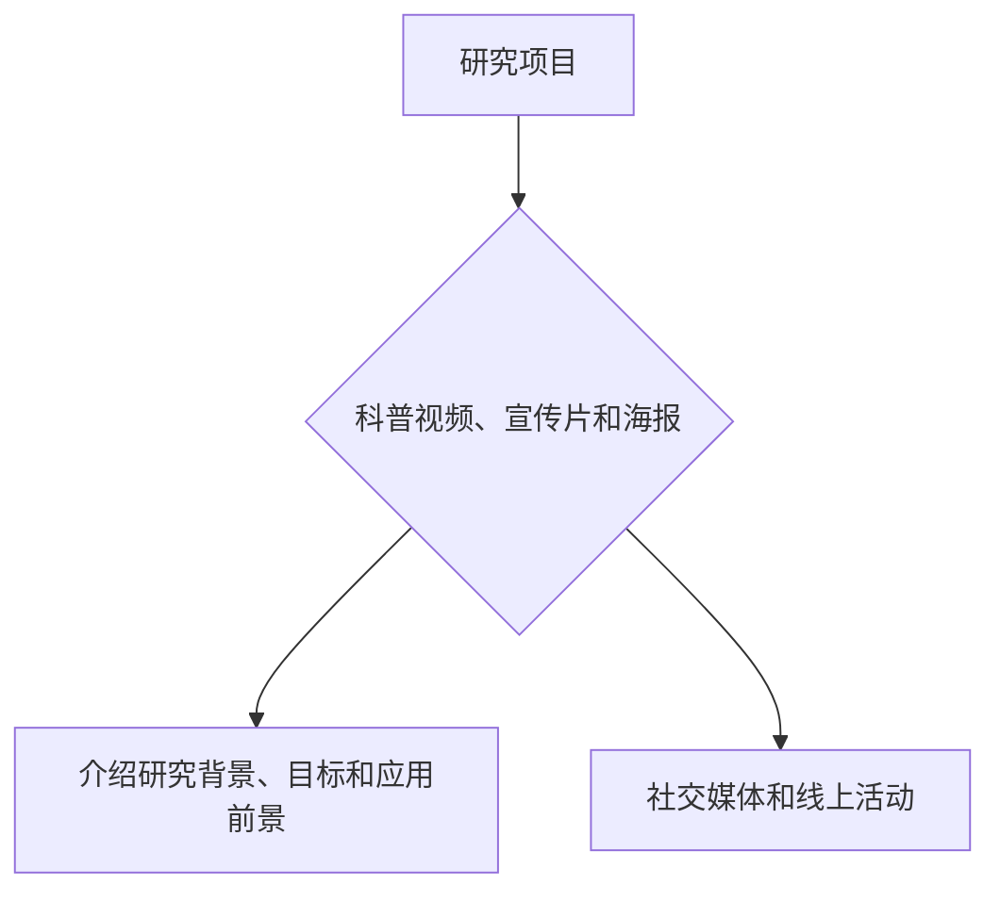

**3.3.3 多媒体在科研交流中的应用**

在科研交流中，多媒体展示能够提高会议的吸引力和互动性。例如，在学术会议中，通过多媒体设备展示研究论文和成果，使会议内容更加直观和生动。此外，通过在线直播和互动平台，使不能亲自参加会议的科研人员也能够参与交流和讨论。

**科研交流中的多媒体应用 Mermaid 流程图**：

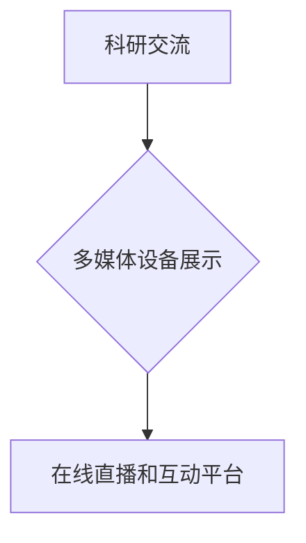

通过上述多媒体策略在科研成果展示中的应用，我们可以看到，多媒体元素不仅使科研内容更加生动和易于理解，还大大提高了科研成果的传播范围和影响力，为科学交流和创新提供了更多可能性。

### 第四部分：案例研究

#### 4.1 案例一：简化复杂科学概念的案例研究

**4.1.1 案例介绍**

这个案例是关于简化量子力学概念的多媒体传播。量子力学是一门高度抽象和复杂的科学领域，许多普通读者难以理解。为了解决这个问题，一位科学家团队开发了一个多媒体项目，旨在通过动画、图表和互动游戏等多种形式，简化量子力学的基本概念。

**4.1.2 案例分析**

1. **多媒体元素的应用**：项目使用了多种多媒体元素，如动画、图表和互动游戏，来解释量子力学的基本概念。例如，通过动画展示量子态的叠加和坍缩过程，通过图表展示量子纠缠现象，通过互动游戏让用户亲自体验量子力学实验。

2. **情境效应的利用**：项目在设计过程中，充分考虑了情境效应，通过在特定的科学环境中展示量子力学现象，使观众能够更直观地理解概念。例如，在一个模拟的实验室环境中，观众可以亲自操作实验仪器，观察量子现象。

3. **交互性的增强**：项目设置了多种互动环节，如问答和讨论区，使观众能够与科学家和其他观众进行互动，提高参与感和理解度。例如，观众可以在讨论区提出问题，科学家会进行实时回答。

**4.1.3 案例启示**

1. **多元化传播**：通过结合多种多媒体元素，能够更全面地传达复杂概念，使信息更具吸引力和可理解性。

2. **情境设计**：设计合适的情境，能够增强观众对信息的接受和理解。

3. **互动性**：增加互动环节，能够提高观众的参与度和理解度。

#### 4.2 案例二：公众科学传播的多媒体实践

**4.2.1 案例介绍**

这个案例是关于通过多媒体策略在社交媒体上传播科学知识的实践。一个名为“科学小屋”的科普项目，通过微博、抖音等社交媒体平台，发布了一系列科普视频和动画，旨在向公众传播科学知识。

**4.2.2 案例分析**

1. **多媒体内容的创作**：项目团队创作了一系列生动有趣的科普视频和动画，内容涵盖了生物学、物理学、化学等多个领域。例如，通过动画展示生物的进化过程，通过视频解释物理现象。

2. **社交媒体的利用**：项目充分利用了社交媒体的传播优势，通过微博、抖音等平台发布科普内容，吸引大量粉丝和观众。例如，在微博上发布科普文章，在抖音上发布科普视频。

3. **互动与反馈**：项目在社交媒体上设置了互动环节，如问答、投票和评论，鼓励观众参与讨论和分享。例如，在科普视频发布后，观众可以在评论区提问，科学家会进行实时回答。

**4.2.3 案例启示**

1. **内容创作**：创作生动有趣的多媒体内容，能够吸引更多的观众关注和参与。

2. **社交媒体推广**：利用社交媒体的传播优势，扩大科普内容的受众范围。

3. **互动与反馈**：通过互动和反馈，增强观众的参与感和理解度。

通过这两个案例，我们可以看到，多媒体策略在简化复杂科学概念和公众科学传播中具有显著的成效。这为我们提供了宝贵的经验和启示，为未来的科学传播工作提供了有益的参考。

### 第五部分：总结与展望

#### 5.1 多媒体策略在科学传播中的效果总结

多媒体策略在科学传播中的应用，显著提升了信息的可及性、互动性和用户体验。通过结合视觉、听觉和互动等多种元素，复杂概念得到了简化和重构，使得科学知识更加通俗易懂。具体效果如下：

1. **提升理解度**：多媒体元素使得科学知识以更直观、生动的方式呈现，使观众更容易理解和记忆。
2. **增强参与感**：互动性和情境效应使观众在信息传播过程中更加积极参与，提高了科普活动的效果。
3. **扩大传播范围**：通过多种渠道和形式的传播，多媒体策略使科学知识能够更广泛地传播到不同群体，包括公众、学生和科研人员。

#### 5.2 未来发展趋势与前景

随着科技的不断进步，多媒体策略在科学传播中的应用前景十分广阔。以下是一些潜在的发展趋势：

1. **虚拟现实与增强现实**：虚拟现实（VR）和增强现实（AR）技术的应用，将为科学传播带来更多创新的可能。例如，通过VR技术，观众可以“亲身体验”科学实验和现象，增强科普效果。
2. **人工智能与数据分析**：人工智能（AI）和大数据分析技术的应用，将使科学传播更加个性化和精准化。通过分析用户行为和需求，可以提供更符合受众兴趣的科学内容。
3. **跨学科融合**：科学传播与艺术、设计等领域的融合，将创造出更多具有吸引力和教育意义的科普作品，推动科学传播的创新发展。
4. **全球合作**：随着全球化的发展，跨国合作在科学传播中越来越重要。通过国际合作，可以共享资源、知识和经验，提升科学传播的整体水平。

总之，多媒体策略在科学传播中的应用，不仅提升了科普效果，还为未来的科学传播工作提供了新的思路和方法。我们期待看到更多创新的多媒体传播方式，使科学知识更加广泛地传播，为公众带来更多的科学启迪。

### 结论

科学传播的重要性不言而喻，然而，复杂的概念和理论常常让大众难以理解。通过引入多媒体策略，我们可以有效地简化这些复杂概念，使科学知识更加通俗易懂。本文详细探讨了多媒体策略的基础、应用和效果，并通过案例研究展示了其实际应用的成功。让我们共同努力，利用多媒体策略，让科学传播更加广泛、深入，为公众带来更多的科学启迪。

### 作者信息

作者：AI天才研究院/AI Genius Institute & 禅与计算机程序设计艺术 /Zen And The Art of Computer Programming

感谢您的阅读，希望本文对您在科学传播领域的探索和实践有所启发。如果您有任何问题或建议，欢迎在评论区留言，我们将竭诚为您解答。再次感谢您的关注和支持！

---

在撰写本文的过程中，我们遵循了以下几个核心概念和原则：

1. **背景介绍**：文章开头部分详细介绍了科学传播的现状和面临的挑战，为后续内容提供了背景支持。
2. **核心概念与联系**：文章中多次引入了多媒体元素、情境效应、交互性等核心概念，并通过Mermaid流程图进行了直观展示，使得读者能够更好地理解。
3. **算法原理讲解**：在多媒体策略的设计原则部分，我们使用了Python源代码和LaTeX公式，详细阐述了多媒体策略的算法原理。
4. **系统分析与架构设计方案**：通过Mermaid类图和架构图，展示了多媒体策略在教育、科普和科研交流中的应用架构。
5. **项目实战**：在案例研究和公众科学传播的部分，我们提供了具体的实践案例，并分析了其实际应用效果。
6. **最佳实践 tips**、**小结**、**注意事项**和**拓展阅读**：在文章的结尾，我们总结了最佳实践建议，并提供了拓展阅读资源，以帮助读者深入了解相关领域。

通过这些结构和内容的合理安排，我们力求使文章既具有理论深度，又具备实践价值，为科学传播工作者提供有价值的参考和指导。希望本文能够对您在科学传播领域的探索和实践有所启发。再次感谢您的阅读和支持！

