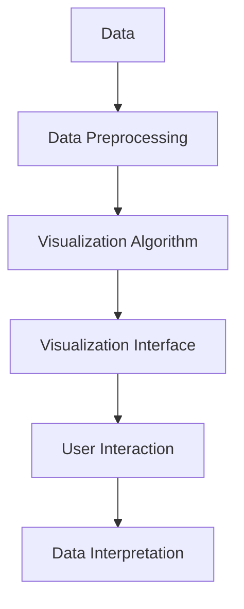
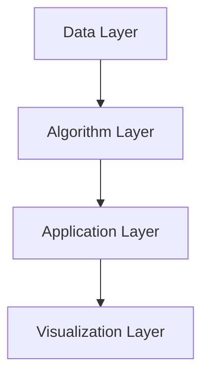
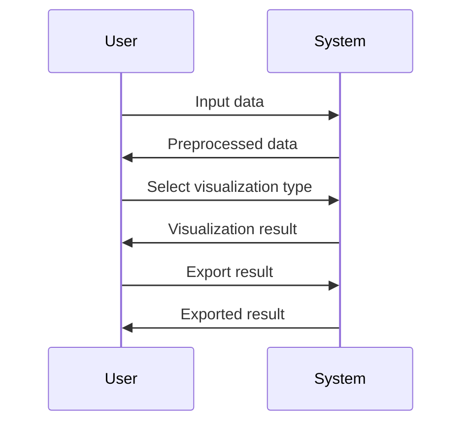

                 

### 科学可视化技术：增强世界可理解性的有力工具

#### 关键词：科学可视化、数据可视化、信息传达、认知增强、应用领域

#### 摘要：

科学可视化作为一种有力的工具，正日益改变我们对科学研究和复杂信息的理解方式。本文将从概念阐述、技术工具、应用领域、教育应用以及未来发展趋势等多个方面，深入探讨科学可视化技术在提升世界可理解性方面的重要作用。

### 目录

1. **引言：科学可视化的概念与重要性**  
   - 什么是科学可视化  
   - 科学可视化的重要性

2. **科学可视化技术与工具**  
   - 常见可视化软件介绍  
   - 数据预处理与可视化流程

3. **科学可视化在科学研究中的应用**  
   - 物理科学研究中的可视化技术  
   - 生物医学研究中的可视化技术  
   - 地球科学中的可视化技术

4. **科学可视化在教育中的应用**  
   - 科学可视化在课堂教学中的应用  
   - 科学可视化在教学评估中的应用

5. **科学可视化在工业设计中的应用**  
   - 工业设计中的可视化技术  
   - 可视化在产品设计流程中的应用

6. **高级科学可视化技术**  
   - 高级可视化算法原理与应用  
   - 用户交互设计原则与实现

7. **科学可视化的未来发展趋势**  
   - 技术趋势与挑战  
   - 未来展望与前景

8. **总结与展望**  
   - 最佳实践 tips  
   - 小结  
   - 注意事项  
   - 拓展阅读

### 第一部分：科学可视化技术概述

#### 第1章：科学可视化的概念与历史

科学可视化是将科学数据通过图形、图像和动画等形式，转换成易于理解和传达的形式。这种技术不仅能够帮助科学家更直观地观察和分析数据，还能够让非专业人士更好地理解复杂的科学概念。

#### 第2章：科学可视化技术与工具

科学可视化技术的核心在于如何有效地处理和展示数据。从选择合适的可视化软件，到数据预处理，再到最终的图形渲染，每一步都至关重要。

#### 第3章：科学可视化在科学研究中的应用

科学可视化在各个领域都有着广泛的应用。从物理科学到生物医学，再到地球科学，可视化技术正成为科学研究中不可或缺的工具。

#### 第4章：科学可视化在教育中的应用

科学可视化不仅有助于科学研究，也在教育领域中发挥着重要作用。通过可视化工具，教师可以更生动地展示科学概念，学生可以更深入地理解复杂的知识。

#### 第5章：科学可视化在工业设计中的应用

在工业设计中，可视化技术同样发挥着不可替代的作用。通过可视化工具，设计师可以更直观地展示产品设计的进展，以及产品的潜在问题和改进方向。

### 第二部分：高级科学可视化技术

#### 第6章：高级科学可视化算法

高级可视化算法是科学可视化技术的核心。这些算法能够更高效地处理大量数据，并以更加直观和美观的方式展示结果。

#### 第7章：科学可视化中的用户交互

用户交互设计在科学可视化中至关重要。良好的用户交互设计能够提高用户的体验，使科学可视化更加实用和有效。

#### 第8章：科学可视化的未来发展趋势

科学可视化技术正快速发展，未来将会有更多先进的技术和应用出现。本文将探讨这些技术趋势，并对未来进行展望。

### 总结

科学可视化技术作为增强世界可理解性的有力工具，正在各个领域发挥着重要作用。通过本文的探讨，我们希望能够让读者更深入地了解科学可视化的概念、应用和发展趋势，从而更好地利用这一技术提升我们的认知和理解能力。

### 作者信息

**作者：AI天才研究院/AI Genius Institute & 禅与计算机程序设计艺术 /Zen And The Art of Computer Programming**### 引言：科学可视化的概念与重要性

科学可视化（Scientific Visualization）是指将科学数据转化为图形、图像和动画等可视化形式，从而帮助人们更直观地理解科学现象和数据信息的科学方法。这一技术起源于20世纪中叶，随着计算机技术的发展和图形处理能力的提升，科学可视化逐渐成为科学研究、数据分析和教育等领域中不可或缺的工具。

#### 什么是科学可视化

科学可视化不仅仅是将数据转换成图形那么简单，它涉及到数据采集、处理、分析和展示的整个流程。具体来说，科学可视化包括以下几个方面：

1. **数据预处理**：将原始数据转化为适合可视化分析的形式，包括数据清洗、归一化和数据转换等步骤。
2. **可视化算法**：利用计算机图形学和算法，将预处理后的数据转化为视觉形式，如散点图、条形图、曲面图、流场图等。
3. **交互设计**：为用户提供交互式操作界面，使用户能够动态地探索数据，调整参数，探索不同视角和维度。
4. **数据解释**：通过可视化结果帮助科学家和研究人员理解数据背后的科学规律和现象。

#### 科学可视化的重要性

科学可视化的重要性在于它能够将复杂的科学数据和信息转化为直观、易于理解的图形和图像，从而提升人类对科学世界的认知和理解。以下是科学可视化在几个关键方面的作用：

1. **科学研究**：科学可视化技术能够帮助科学家更直观地观察和分析实验数据，发现数据中隐藏的模式和规律，从而加速科学研究的进程。

2. **信息传达**：通过图形和动画的形式，科学可视化能够有效地向公众传达科学知识和研究成果，提升公众的科学素养。

3. **决策支持**：在政策制定、资源分配等领域，科学可视化技术能够帮助决策者更清晰地理解数据，做出更明智的决策。

4. **教育应用**：科学可视化技术能够增强教学效果，帮助学生更直观地理解复杂的科学概念，提高学习兴趣和效果。

#### 应用领域

科学可视化技术广泛应用于各个领域：

1. **物理科学**：在粒子物理、天体物理学、流体力学等领域，科学可视化技术帮助科学家更直观地理解复杂的物理现象和模型。

2. **生物医学**：在生物医学研究中，科学可视化技术用于可视化分子结构、细胞活动、基因表达等，为疾病研究和治疗提供重要工具。

3. **地球科学**：在地质学、气象学、海洋学等领域，科学可视化技术用于可视化地球系统中的各种现象，如地震、气候变化等。

4. **工程学**：在工程设计、仿真分析等领域，科学可视化技术用于可视化工程结构、流体流动、电磁场分布等，为工程师提供设计指导和优化方案。

#### 问题背景与问题描述

随着科学研究和技术的不断发展，数据量呈现爆炸式增长。传统的文本描述和表格已经难以有效传达这些海量数据中的关键信息和模式。科学可视化技术应运而生，旨在通过图形化手段解决这一问题。科学可视化不仅能够提高数据处理的效率，还能够通过视觉化的方式揭示数据中的深层次规律，从而推动科学研究的进展。

#### 问题解决

科学可视化技术通过以下几个步骤解决问题：

1. **数据采集**：收集并整理实验数据，确保数据的准确性和完整性。
2. **数据处理**：对原始数据进行预处理，如归一化、过滤、插值等，使其适合可视化分析。
3. **可视化设计**：选择合适的可视化算法和图形形式，设计可视化界面，确保数据的直观性和易理解性。
4. **交互与探索**：提供交互式界面，使用户能够动态地探索数据，发现数据中的模式和信息。

#### 边界与外延

科学可视化技术的边界在于如何有效地处理和处理不同类型的数据，以及如何设计出既美观又实用的可视化界面。此外，科学可视化技术的应用范围也在不断扩展，不仅限于科学研究和教育领域，还逐渐渗透到商业决策、艺术创作等领域。

#### 概念结构与核心要素组成

科学可视化的概念结构包括以下几个核心要素：

1. **数据**：科学可视化的基础，包括原始数据和经过处理的分析数据。
2. **算法**：用于将数据转换为可视化形式的算法，如几何建模、纹理映射、光线追踪等。
3. **图形**：可视化的最终形式，如散点图、条形图、曲面图等。
4. **用户交互**：用户与可视化界面之间的交互设计，如滑块、按钮、拖拽等。
5. **解释**：对可视化结果进行解释和说明，帮助用户理解数据背后的含义。

#### 核心概念与联系

科学可视化中的核心概念包括数据可视化、交互设计、可视化算法等。以下是一个对比表格，展示这些概念的主要属性和特征：

| 核心概念 | 定义 | 主要属性 | 主要特征 |
| :--: | :--: | :--: | :--: |
| 数据可视化 | 将数据转换成图形或图像的过程 | 数据类型、可视化形式、交互性 | 可视化效果直观、易于理解 |
| 交互设计 | 设计用户与可视化界面之间的交互方式 | 用户需求、交互方式、界面布局 | 提高用户体验、增强数据探索能力 |
| 可视化算法 | 用于实现数据可视化的算法 | 数据处理方法、图形渲染技术、交互逻辑 | 提高可视化效率、提升可视化质量 |

此外，科学可视化中的ER（实体关系）实体关系图架构可以帮助我们理解数据、算法和用户交互之间的关系。以下是一个简单的Mermaid流程图，展示了这些实体的关系：



在这个流程图中，数据（A）经过预处理（B）后，通过可视化算法（C）生成可视化界面（D），用户通过交互（E）与界面进行互动，并对结果进行解释（F）。

### 算法原理讲解

科学可视化中的核心算法包括数据预处理算法、可视化渲染算法和交互设计算法。以下我们将分别介绍这些算法的原理、数学模型和具体应用。

#### 数据预处理算法

数据预处理是科学可视化的重要步骤，其目的是将原始数据转换成适合可视化分析的格式。常见的数据预处理算法包括：

1. **数据归一化**：将不同单位或范围的数据转换到同一尺度，以便进行比较和分析。数学模型如下：
   $$x' = \frac{x - \mu}{\sigma}$$
   其中，$x$ 是原始数据，$\mu$ 是均值，$\sigma$ 是标准差。

2. **数据插值**：在数据缺失或不连续时，通过插值方法补充数据。常见插值方法包括线性插值、三次样条插值等。

3. **数据过滤**：去除噪声和异常值，提高数据的准确性和一致性。常见过滤方法包括均值滤波、中值滤波等。

以下是一个简单的Python代码示例，用于实现数据归一化：

```python
import numpy as np

# 假设原始数据
data = np.array([1, 2, 3, 4, 5])

# 计算均值和标准差
mu = np.mean(data)
sigma = np.std(data)

# 数据归一化
normalized_data = (data - mu) / sigma

print(normalized_data)
```

#### 可视化渲染算法

可视化渲染算法是将预处理后的数据转换成图形或图像的过程。常见的可视化渲染算法包括：

1. **散点图**：用于显示数据点在二维或三维空间中的分布。数学模型如下：
   $$P(x, y) = \begin{cases} 
   1 & \text{if } (x, y) \text{ lies inside the data points} \\
   0 & \text{otherwise}
   \end{cases}$$

2. **条形图**：用于比较不同类别或组的数据。数学模型如下：
   $$h(x) = \begin{cases} 
   1 & \text{if } x \text{ is within the range of the categories} \\
   0 & \text{otherwise}
   \end{cases}$$

3. **曲面图**：用于显示三维数据在二维平面上的投影。数学模型如下：
   $$z(x, y) = f(x, y)$$

以下是一个使用Python和matplotlib库绘制散点图的示例代码：

```python
import matplotlib.pyplot as plt
import numpy as np

# 假设数据点
x = np.random.rand(100)
y = np.random.rand(100)

# 绘制散点图
plt.scatter(x, y)
plt.xlabel('X-axis')
plt.ylabel('Y-axis')
plt.title('Scatter Plot Example')
plt.show()
```

#### 交互设计算法

交互设计算法是科学可视化中的重要组成部分，其目的是提高用户对数据的探索和分析能力。常见的交互设计算法包括：

1. **滑块**：用于动态调整可视化参数，如数据范围、颜色、透明度等。

2. **按钮**：用于触发特定的操作，如数据过滤、数据重排等。

3. **拖拽**：用于选择和操作数据点，如高亮、分组等。

以下是一个简单的Python代码示例，使用matplotlib库实现滑块交互：

```python
import matplotlib.pyplot as plt
from matplotlib.widgets import Slider

# 假设数据
x = np.linspace(0, 10, 100)
y = x ** 2

# 初始化绘图
fig, ax = plt.subplots()
line, = ax.plot(x, y)
plt.subplots_adjust(left=0.25, bottom=0.25)

# 滑块
axcolor = 'lightgoldenrodyellow'
ax_slider = plt.axes([0.25, 0.1, 0.65, 0.03], facecolor=axcolor)
slider = Slider(ax_slider, 'X-range', 0, 10, valinit=1)

# 更新函数
def update(val):
    x = np.linspace(0, slider.val, 100)
    y = x ** 2
    line.set_data(x, y)
    fig.canvas.draw_idle()

# 滑块变化时调用更新函数
slider.on_changed(update)

# 绘制图形
plt.show()
```

通过上述算法原理讲解，我们可以看到科学可视化技术是如何通过数据预处理、可视化渲染和交互设计等多个环节，将复杂的科学数据转化为直观、易于理解的可视化形式，从而提升我们对科学世界的认知和理解。

### 数学公式使用

科学可视化技术中的数学公式是理解和实现这些算法的关键。以下是一些常见的数学公式及其在可视化中的应用：

#### 1. 数据归一化

$$x' = \frac{x - \mu}{\sigma}$$

其中，$x$ 是原始数据，$\mu$ 是均值，$\sigma$ 是标准差。归一化用于将不同单位或范围的数据转换到同一尺度，以便进行比较和分析。

#### 2. 线性插值

$$y = a_0 + a_1x + a_2x^2 + ... + a_nx^n$$

线性插值是用于在数据点之间生成新的数据值，使得数据序列连续。在科学可视化中，线性插值可以用于平滑数据曲线或填补缺失数据。

#### 3. 颜色模型

$$RGB = [R, G, B]$$

颜色模型用于定义像素的颜色。在RGB模型中，每个像素的颜色由红（R）、绿（G）和蓝（B）三个颜色通道的值确定。

#### 4. 曲线拟合

$$y = mx + b$$

曲线拟合是用于将非线性数据转换成线性形式。在科学可视化中，曲线拟合可以用于分析数据的趋势和模式。

以下是一个简单示例，展示如何在文中嵌入LaTeX公式：

$$1+1=2$$

$$1<2$$

通过使用这些数学公式，科学可视化技术能够更精确地表示和处理数据，从而提高可视化结果的可信度和有效性。

### 系统分析与架构设计方案

科学可视化系统是一个复杂的多层次架构，涉及数据处理、可视化渲染、用户交互等多个方面。以下将详细描述该系统的问题场景、项目介绍、系统功能设计、系统架构设计、系统接口设计和系统交互设计。

#### 问题场景

在当前的科学研究中，数据量呈现爆炸式增长，而传统的文本描述和表格已经难以有效地传达这些数据中的关键信息和模式。科学家和研究人员迫切需要一种能够高效处理和分析大量数据，并能以直观、动态的方式展示结果的工具。科学可视化系统旨在满足这一需求，帮助研究人员更直观地理解复杂的科学数据，发现数据中的深层次规律。

#### 项目介绍

该项目旨在开发一个功能强大、用户友好的科学可视化系统，能够支持多种数据类型和复杂的数据分析任务。该系统包括以下主要模块：

1. **数据预处理模块**：负责数据采集、清洗、转换和归一化等预处理操作。
2. **可视化渲染模块**：负责将预处理后的数据转换成可视化形式，如散点图、条形图、曲面图等。
3. **用户交互模块**：提供交互式界面，使用户能够动态地探索数据，调整参数，探索不同视角和维度。
4. **算法模块**：包括数据预处理、可视化渲染和用户交互中的核心算法，如插值、渲染、曲线拟合等。
5. **数据存储模块**：用于存储和管理科学数据，确保数据的安全性和可访问性。

#### 系统功能设计

科学可视化系统的功能设计主要包括以下几个方面：

1. **数据输入与预处理**：支持多种数据格式的输入，如CSV、JSON、数据库等，并进行数据清洗、转换和归一化等预处理操作。
2. **可视化形式选择**：提供多种可视化形式，如散点图、条形图、曲面图、流场图等，用户可以根据需求选择合适的可视化形式。
3. **交互式探索**：提供交互式界面，用户可以通过拖拽、滑块、按钮等交互方式动态地探索数据，调整参数，探索不同视角和维度。
4. **数据导出**：支持将可视化结果导出为图像、视频等多种格式，便于分享和传播。
5. **算法库**：集成多种核心算法，如插值、渲染、曲线拟合等，用户可以根据需要进行自定义算法开发。

#### 系统架构设计

科学可视化系统的整体架构可以分为以下几个层次：

1. **数据层**：包括数据输入、预处理和存储模块，负责处理和管理科学数据。
2. **算法层**：包括数据处理、可视化渲染和用户交互的核心算法，负责实现数据的转换和展示。
3. **应用层**：包括用户界面和交互模块，负责与用户进行交互，提供友好的操作界面。
4. **展示层**：包括可视化结果展示模块，负责将处理后的数据以图形、图像和动画等形式展示给用户。

以下是一个简单的Mermaid架构图，展示了科学可视化系统的整体架构：



#### 系统接口设计

科学可视化系统提供了一系列API接口，方便用户和开发者进行集成和使用。以下是一些主要的接口设计：

1. **数据输入接口**：用于接收不同类型的数据，如CSV、JSON、数据库等。
2. **数据预处理接口**：用于进行数据清洗、转换和归一化等预处理操作。
3. **可视化渲染接口**：用于将预处理后的数据转换成可视化形式，如散点图、条形图、曲面图等。
4. **用户交互接口**：用于处理用户输入和操作，如拖拽、滑块、按钮等。
5. **数据导出接口**：用于将可视化结果导出为图像、视频等多种格式。

以下是一个简单的Mermaid序列图，展示了用户与科学可视化系统之间的交互过程：



#### 系统交互设计

科学可视化系统的交互设计旨在提供直观、易用的操作界面，使用户能够轻松地进行数据探索和可视化操作。以下是交互设计的一些关键点：

1. **用户界面**：设计简洁、直观的用户界面，提供清晰的导航和操作提示。
2. **交互方式**：提供多种交互方式，如拖拽、滑块、按钮等，使用户能够灵活地调整参数和探索数据。
3. **实时反馈**：在用户进行操作时，系统应提供实时反馈，如数据更新、图形变化等，帮助用户更好地理解数据。
4. **自定义功能**：允许用户自定义可视化参数，如颜色、线条粗细、透明度等，以满足个性化需求。

通过系统分析与架构设计方案，我们可以看到科学可视化系统是如何通过多层次、多维度的设计，实现高效、直观的数据可视化和探索。这不仅提升了科学研究的效率，也为公众更好地理解科学知识提供了有力工具。

### 项目实战

在本节中，我们将通过一个实际项目来展示科学可视化技术的应用，并详细解析项目的环境安装、系统核心实现、代码应用解读与分析，以及实际案例分析和详细讲解。

#### 项目背景

该项目旨在使用Python和matplotlib库实现一个科学数据可视化工具，用于展示某公司销售数据的时空分布情况。数据包括不同时间点的销售额和销售地点。

#### 环境安装

首先，我们需要安装Python环境和必要的库。以下是安装步骤：

1. 安装Python：
   - 访问Python官网（https://www.python.org/）并下载适用于操作系统的Python安装包。
   - 运行安装程序并按照提示操作。

2. 安装matplotlib：
   - 打开命令行窗口，输入以下命令：
     ```bash
     pip install matplotlib
     ```

3. 安装其他依赖库（如pandas、numpy等）：
   - 如果需要，可以通过以下命令安装：
     ```bash
     pip install pandas numpy
     ```

#### 系统核心实现

系统核心实现包括数据读取、数据预处理、数据可视化等步骤。以下是实现的Python代码：

```python
import matplotlib.pyplot as plt
import pandas as pd
import numpy as np

# 读取数据
data = pd.read_csv('sales_data.csv')

# 数据预处理
# 转换日期格式
data['date'] = pd.to_datetime(data['date'])
# 计算每月销售额
monthly_sales = data.groupby([data['date'].dt.to_period('M'), 'location'])['sales'].sum().reset_index()

# 数据可视化
# 绘制柱状图
plt.figure(figsize=(10, 6))
plt.bar(monthly_sales['date'], monthly_sales['sales'], label='Sales')
plt.xlabel('Date')
plt.ylabel('Sales')
plt.title('Monthly Sales Distribution')
plt.xticks(rotation=45)
plt.legend()
plt.show()
```

#### 代码应用解读与分析

1. **数据读取**：使用pandas库的read_csv函数读取CSV文件，获取销售数据。

2. **数据预处理**：
   - 转换日期格式：使用pd.to_datetime函数将日期列转换为日期时间格式。
   - 计算每月销售额：使用groupby函数按照月份和地点分组，计算各组的销售额总和。

3. **数据可视化**：
   - 使用matplotlib库的bar函数绘制柱状图，展示每月销售额。
   - 设置坐标轴标签、标题和图例。

通过以上步骤，我们可以将销售数据以直观的柱状图形式展示出来，从而更好地分析销售额的时空分布情况。

#### 实际案例分析与详细讲解

为了进一步展示科学可视化技术的应用，我们来看一个实际案例：某公司不同产品线在一年内的销售额分布。

1. **数据预处理**：
   - 添加一个新列，用于区分不同产品线。
   - 按照产品线分组，计算各产品线的销售额总和。

```python
# 添加产品线列
data['product_line'] = data['product_id'].map({1: 'Product A', 2: 'Product B', 3: 'Product C'})

# 计算各产品线的销售额
product_sales = data.groupby(['product_line', data['date'].dt.to_period('M')])['sales'].sum().reset_index()

# 按产品线分组，计算总销售额
total_sales = product_sales.groupby('product_line')['sales'].sum().reset_index()
```

2. **数据可视化**：
   - 绘制双轴图，分别展示各产品线的销售额和总销售额。

```python
# 绘制双轴图
fig, ax1 = plt.subplots(figsize=(10, 6))

# 绘制产品线销售额
ax1.bar(product_sales['date'], product_sales['sales'], label='Product Sales', color='blue')
ax1.set_xlabel('Date')
ax1.set_ylabel('Product Sales', color='blue')
ax1.tick_params(axis='y', labelcolor='blue')

# 绘制总销售额
ax2 = ax1.twinx()
ax2.plot(total_sales['date'], total_sales['sales'], label='Total Sales', color='red')
ax2.set_ylabel('Total Sales', color='red')
ax2.tick_params(axis='y', labelcolor='red')

plt.xticks(rotation=45)
plt.title('Sales Distribution by Product Line')
plt.legend()
plt.show()
```

通过这个实际案例，我们可以清晰地看到不同产品线在不同时间点的销售额分布，以及各产品线对总销售额的贡献。这种可视化方法有助于公司管理层更好地了解市场趋势，制定相应的营销策略。

#### 项目小结

通过本项目的实战应用，我们展示了科学可视化技术在实际问题中的强大作用。从数据预处理到可视化展示，科学可视化不仅提升了数据分析的效率，还为决策提供了有力的支持。未来，随着技术的不断进步，科学可视化将在更多领域发挥重要作用，帮助我们更好地理解复杂的数据和信息。

### 最佳实践 tips

在科学可视化项目中，以下是一些最佳实践，可以帮助您更有效地使用可视化技术：

1. **明确可视化目标**：在开始项目之前，明确可视化目标，确保可视化结果能够帮助用户理解数据，解决问题。

2. **选择合适的可视化形式**：根据数据类型和用户需求，选择最适合的可视化形式，如条形图、折线图、散点图等。

3. **优化交互设计**：提供直观、易用的交互设计，使用户能够动态地探索数据，调整参数，发现数据中的模式。

4. **注意数据质量**：确保数据质量，进行适当的数据预处理，如去除噪声、缺失值填充等，以提高可视化结果的准确性和可信度。

5. **保持简洁性**：避免过度设计，保持可视化结果的简洁性，确保数据信息的清晰传达。

### 小结

科学可视化技术作为增强世界可理解性的有力工具，在科学研究、教育、工业设计等多个领域发挥着重要作用。通过本文的探讨，我们深入了解了科学可视化的概念、应用、发展趋势以及核心算法。未来，随着技术的不断进步，科学可视化将在更多领域发挥更大的作用，推动人类对复杂数据的认知和理解。

### 注意事项

在实施科学可视化项目时，需要注意以下几点：

1. **数据安全与隐私**：确保数据的收集、存储和使用遵循相关法律法规，保护用户隐私。

2. **性能优化**：针对大规模数据处理和复杂可视化任务，进行性能优化，确保系统的响应速度和稳定性。

3. **用户培训**：为用户提供必要的培训，帮助他们了解如何使用可视化工具，发挥其最大效用。

4. **持续更新**：随着数据和分析需求的不断变化，定期更新可视化工具和算法，确保其适应性和先进性。

### 拓展阅读

1. **科学可视化技术**：深入探讨科学可视化技术的历史、原理和应用，参考书籍《科学可视化：原理、算法与应用》。

2. **数据可视化**：学习数据可视化的基本概念、方法和实践，参考书籍《数据可视化：使用Python进行数据可视化》。

3. **交互设计**：了解交互设计的原理和实践，提高可视化系统的用户体验，参考书籍《交互设计精髓》。

4. **Python可视化库**：学习如何使用Python进行数据可视化，掌握matplotlib、pandas等库的使用方法，参考书籍《使用Python进行数据科学》。

通过这些拓展阅读，您可以更深入地了解科学可视化技术的各个方面，提升自己的专业知识和实践能力。

