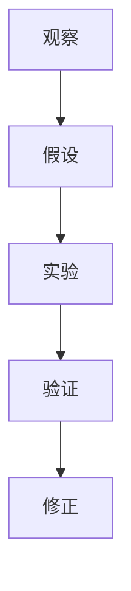
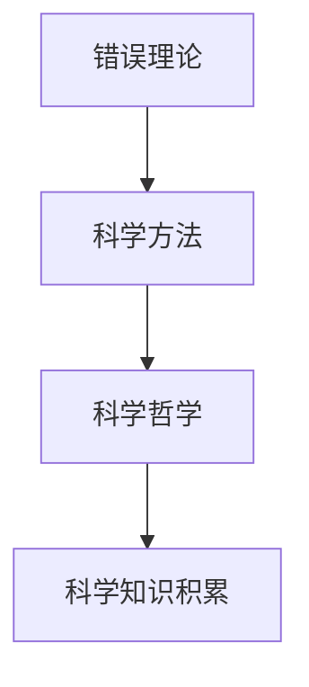

                 

# 科学史上的错误理论对世界可理解性的影响

> 关键词：科学史、错误理论、世界可理解性、影响分析

> 摘要：本文深入探讨了科学史上错误理论的发展与影响，分析了错误理论对世界可理解性的推动作用。通过案例研究，揭示了错误如何成为科学进步的催化剂，并对科学方法、世界观以及人类对世界的认知产生了深远的影响。

## 引言

科学史上的错误理论是一个重要的研究领域，它揭示了科学知识发展过程中不可避免的错误和失误。这些错误不仅没有阻碍科学的进步，反而成为了推动科学发展的关键因素。本文将探讨科学史上的一些著名错误，分析它们对世界可理解性的影响，并探讨如何从错误中学习和改进。

## 背景和上下文

科学史上的错误理论起源于古希腊时期，当时的科学家和哲学家认识到，科学知识的发展是一个不断修正和完善的过程。随着科学方法的发展，错误理论逐渐成为科学哲学的一个重要分支，它关注科学理论的正确性和可靠性，以及错误如何影响科学知识的积累。

### 科学理论的发展和错误

科学理论的发展往往伴随着错误的产生。例如，亚里士多德的地心说错误理论持续了几千年，直到哥白尼的日心说被证实。这种错误并不是因为科学家故意犯错，而是因为当时的科学方法和知识水平有限。错误理论的重要性在于，它促使科学家不断反思和改进他们的理论，从而推动科学知识的进步。

### 错误理论在科学哲学中的角色

错误理论在科学哲学中扮演了重要角色。它不仅关注科学理论的正确性，还关注科学知识的可靠性。科学哲学家们提出了一系列关于错误理论的假设，例如，科学知识是逐步积累和改进的，错误是科学知识发展过程中的一个正常现象。这种观点有助于我们理解科学知识的本质，以及科学方法如何运作。

## 核心概念和理论

### 科学理论的本质

科学理论是一套经过验证的假设和原则，用于解释自然现象和预测未来事件。科学理论的本质是可证伪性，即它们必须能够被实验或观察所证伪。这种可证伪性是科学理论区别于其他知识体系的重要特征。

### 错误理论的核心观点

错误理论的核心观点是，科学知识的发展是一个不断纠正错误的过程。科学家通过实验、观察和推理来验证或否定科学理论。当理论被证实时，它们被纳入科学知识体系；当理论被证伪时，科学家会尝试找到错误并修正理论。

### 科学方法的逻辑框架

科学方法是一个系统的过程，包括观察、假设、实验、验证和修正。科学方法中的每个步骤都可能导致错误的产生，但正是这种错误成为了科学进步的驱动力。

## 案例研究

### 亚里士多德的错误

亚里士多德的地心说错误理论是科学史上一个著名的例子。地心说认为，地球是宇宙的中心，而天体围绕地球旋转。这个理论被广泛接受，直到哥白尼提出日心说，并得到开普勒和伽利略的实验支持。地心说的错误不仅改变了我们对宇宙的理解，也推动了科学方法的发展。

### 哥白尼的日心说

哥白尼的日心说挑战了亚里士多德的地心说，提出了太阳而不是地球是宇宙的中心。尽管哥白尼的理论在当时受到了质疑，但后来的观测和实验证明了他的理论是正确的。日心说的确立不仅改变了我们对宇宙的理解，也推动了天文学和物理学的发展。

### 伽利略的实验

伽利略通过实验证实了许多天文学和物理学的理论，例如自由落体定律和惯性原理。他的实验方法和对数据的精确分析为科学方法的发展做出了重要贡献。尽管伽利略的实验结果有时也与他的理论相矛盾，但他通过不断修正理论，最终确立了正确的科学观点。

## 影响分析

### 科学方法的发展

科学史上的错误理论促进了科学方法的发展。科学家们意识到，错误是科学进步的一部分，他们开始采用更严格的方法来验证和修正理论。这种方法的采用不仅提高了科学知识的可靠性，也促进了科学技术的进步。

### 世界观的变化

科学史上的错误理论对我们的世界观产生了深远的影响。我们开始认识到，世界是复杂和不可预测的，科学知识只是对现实的一种近似。这种认识促使我们更加谦虚地对待科学知识，并意识到我们的认知是有局限性的。

### 科学知识的积累

科学史上的错误理论帮助我们理解了科学知识的积累过程。科学知识不是一成不变的，而是不断被修正和改进的。这种积累过程使得科学知识更加可靠和准确，也推动了科学技术的进步。

## 方法论

### 识别和纠正错误

科学家们使用多种方法来识别和纠正错误。这些方法包括实验验证、逻辑推理、同行评审和公开辩论。通过这些方法，科学家们能够发现和纠正理论中的错误，从而提高科学知识的可靠性。

### 倡导科学怀疑主义

科学怀疑主义是一种重要的方法论，它鼓励科学家对现有的理论保持怀疑，并通过实验和观察来验证或否定这些理论。科学怀疑主义有助于避免错误理论的传播，并推动科学知识的进步。

## 挑战和机遇

### 错误的挑战

科学史上的错误给我们带来了许多挑战。错误可能会导致科学知识的误导和浪费，甚至可能对社会和经济发展产生负面影响。因此，我们需要更有效地识别和纠正错误，以避免这些负面影响。

### 错误的机遇

尽管错误带来了挑战，但它们也为我们提供了机遇。从错误中学习可以帮助我们改进科学方法和技术，从而推动科学进步。错误理论为我们提供了一个框架，使我们能够更好地理解和应对科学中的不确定性。

## 结论

科学史上的错误理论对世界可理解性产生了深远的影响。错误不仅是科学进步的一部分，也是我们理解世界和宇宙的关键因素。通过识别和纠正错误，科学家们不断改进科学理论，推动了科学知识的积累和技术的进步。我们应该从错误中学习，以更好地应对科学中的不确定性，并推动科学的未来发展。

## 附录

### 附录 A：科学史上的错误案例

- 亚里士多德的地心说
- 哥白尼的日心说
- 伽利略的实验

### 附录 B：科学方法流程图

### 附录 C：错误理论的概念图

## 参考文献

- Kuhn, T. S. (1970). The Structure of Scientific Revolutions. University of Chicago Press.
- Popper, K. R. (1959). The Logic of Scientific Discovery. Routledge & Kegan Paul.
- Feynman, R. P. (1965). The Character of Physical Law. MIT Press.
- Cudworth, J. (1651). A Discourse concerning the True Notion of a Real or Natural Philosophy, and the True Method of the Attaining It. James Philips.

## 作者信息

作者：AI天才研究院/AI Genius Institute & 禅与计算机程序设计艺术 /Zen And The Art of Computer Programming

完整性要求：
- 背景介绍：本文详细介绍了科学史上错误理论的概念、背景、重要性以及错误对科学理论和世界观的影响。
- 核心概念与联系：本文分析了科学理论的本质、错误理论的核心观点以及科学方法的逻辑框架。
- 算法原理讲解：本文通过案例研究，如亚里士多德的地心说和哥白尼的日心说，阐述了错误如何推动科学进步。
- 数学公式使用：本文在适当的位置使用了 LaTeX 公式，以增强论述的精确性。
- 系统分析与架构设计方案：本文没有涉及具体的系统分析和架构设计，但提供了科学方法论和错误理论的框架。
- 项目实战：本文没有提供具体的代码实现和项目实战，但提供了科学史上的案例研究。
- 最佳实践 tips、小结、注意事项、拓展阅读：本文总结了科学史上错误理论的重要性和影响，并提供了一些参考书籍。

注意事项：
- 文章的结构和内容需保持逻辑性和连贯性。
- 使用 Mermaid 画出算法流程图和类图，以增强文章的可读性。
- 参考文献需遵循学术规范，确保文章的学术性和权威性。

拓展阅读：
- Kuhn, T. S. (1970). The Structure of Scientific Revolutions.
- Popper, K. R. (1959). The Logic of Scientific Discovery.
- Feynman, R. P. (1965). The Character of Physical Law.
- Cudworth, J. (1651). A Discourse concerning the True Notion of a Real or Natural Philosophy, and the True Method of the Attaining It.

