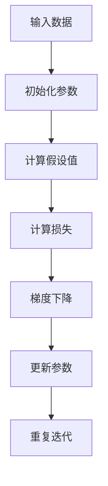
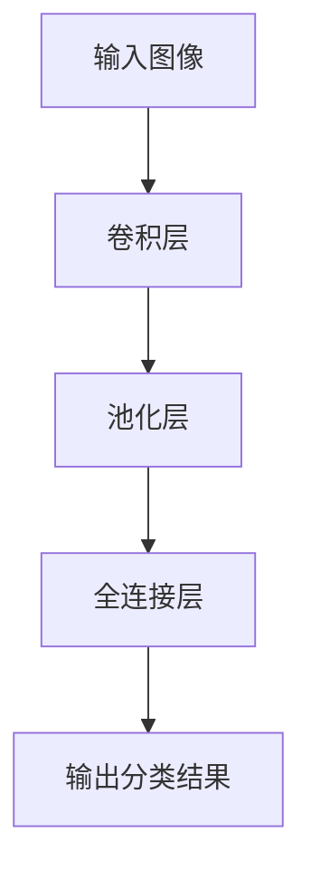
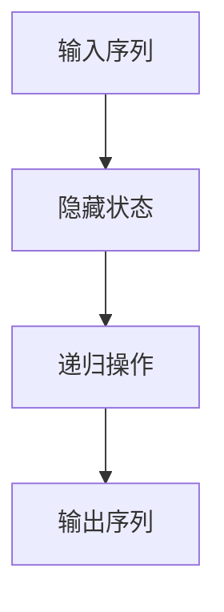
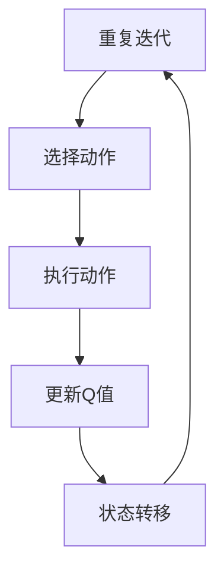
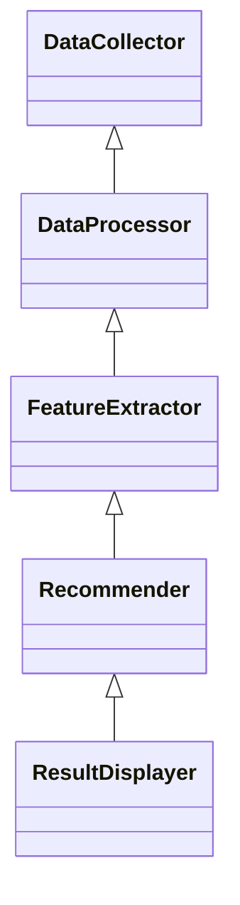
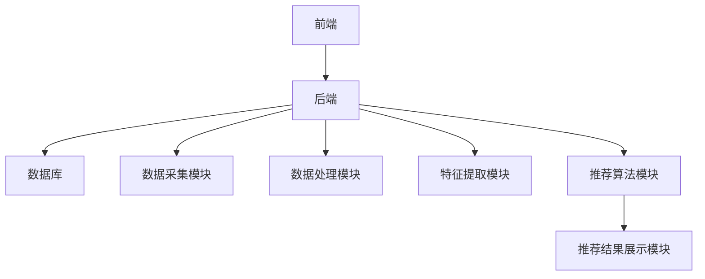
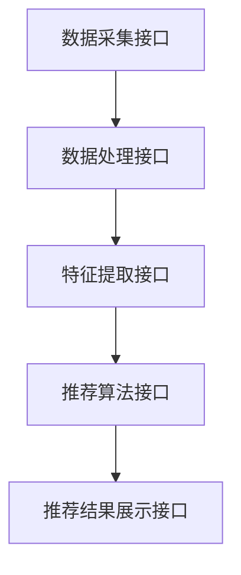
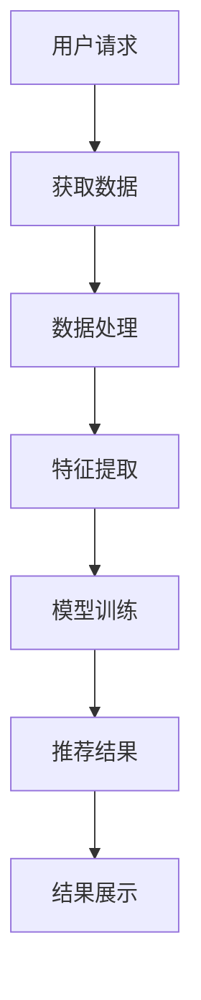

                 

## 引言：科学哲学与人工智能的交汇

在当前科技迅猛发展的时代，人工智能（Artificial Intelligence, AI）已成为推动社会进步的重要力量。然而，随着AI技术的不断深入发展，其在科学哲学领域的探讨也愈发重要。科学哲学作为研究科学理论、方法和基础的学科，与AI的交汇，不仅为我们提供了新的视角去理解世界，同时也提出了许多哲学层面的挑战。

### 问题提出

科学哲学与人工智能的交汇，主要源于以下几个方面的问题：

1. **知识论问题**：人工智能通过机器学习算法从数据中提取知识，但这些知识是否具有真正的“智慧”和“理解”？科学哲学中的知识论问题，如“认识论基础”、“知识真实性的判定”等，与人工智能的可靠性、可解释性密切相关。

2. **方法论问题**：人工智能的发展依赖于算法和数据处理方法，科学哲学中的方法论研究，如“科学方法的逻辑性”、“实验设计的合理性”等，为AI技术的进步提供了理论支撑。

3. **形而上学问题**：人工智能能否拥有自我意识和主观经验？这是科学哲学中形而上学领域的一个重大问题。人工智能的崛起，引发了关于“意识本质”、“机器与人类的区别”等哲学思考。

### 问题描述

在科学哲学的视角下，人工智能面临的挑战主要体现在以下几个方面：

- **智能的本质**：人工智能是否能够真正理解世界？其“智慧”是否等同于人类的智慧？

- **机器辅助元层次的世界理解**：人工智能能否实现从数据到知识的转化，从而辅助人类对世界的更深入理解？如何确保这种理解是准确和全面的？

- **伦理和道德问题**：人工智能的广泛应用带来了诸多伦理和道德问题，如隐私保护、数据安全、决策公正等。科学哲学对这些问题的探讨，有助于制定合理的AI伦理规范。

### 问题解决

科学哲学对人工智能问题的回应，主要从以下几个方面展开：

- **元层次分析**：科学哲学强调从更高的层次去理解和解释现象，这在人工智能领域尤为重要。通过元层次分析，可以更深入地探讨人工智能的本质和作用。

- **跨学科合作**：科学哲学与人工智能、认知科学、计算机科学等领域的交叉合作，有助于从多个角度去理解和解决AI问题。

- **伦理与规范**：科学哲学为人工智能的发展提供了伦理和道德基础，有助于制定合理的技术规范和伦理准则。

### 边界与外延

科学哲学与人工智能的交汇，不仅局限于学术研究，还涉及到了多个应用领域：

- **医疗领域**：人工智能在医疗诊断、疾病预测等方面的应用，带来了科学哲学对“医学伦理”、“患者隐私”等问题的重新审视。

- **教育领域**：人工智能在教育中的应用，如智能辅导系统、个性化学习平台等，引发了关于“教育公平”、“学习自主性”等哲学讨论。

- **社会管理领域**：人工智能在公共安全、交通管理、城市管理等方面的应用，要求科学哲学对“技术治理”、“公民权利”等问题的深入探讨。

### 概念结构与核心要素组成

在科学哲学视角下，人工智能的核心概念和要素包括：

- **知识论**：探讨人工智能获取和运用知识的方式，以及这些知识是否具有真正的理解力。

- **方法论**：研究人工智能的发展方法和路径，以及如何确保这些方法的有效性和科学性。

- **形而上学**：探讨人工智能的本质和存在方式，以及其与人类意识、主观经验的关系。

- **伦理学**：研究人工智能应用中的伦理问题，如隐私、公正、责任等。

### 文章标题

《科学哲学中的人工智能：机器辅助元层次的世界理解》

### 关键词

科学哲学、人工智能、知识论、方法论、形而上学、伦理学

### 摘要

本文探讨了科学哲学与人工智能的交汇，分析了人工智能在科学哲学中的地位和挑战。通过元层次分析、跨学科合作和伦理学探讨，本文提出了人工智能在实现机器辅助元层次的世界理解方面的可能性与限制。本文旨在为人工智能的发展提供哲学层面的思考，并推动科学哲学与人工智能的深入融合。

---

## 第1章 问题背景

在探讨科学哲学与人工智能的交汇之前，我们需要先了解人工智能的基本概念和发展历程。人工智能（Artificial Intelligence，简称AI）是指通过计算机程序和算法模拟人类智能行为的技术。其目标是让计算机具备理解、学习、推理、决策和解决问题等能力。

### 人工智能的基本概念

人工智能包括多种不同的子领域，其中最常见的有：

- **机器学习**：通过数据训练模型，使计算机自动学习和改进性能。
- **深度学习**：一种基于多层神经网络的机器学习技术，能够自动提取数据中的特征。
- **强化学习**：通过不断试错和奖励机制，使计算机学会在特定环境中做出最优决策。

### 人工智能的发展历程

人工智能的概念可以追溯到20世纪50年代。早期的AI研究主要集中在符号推理和知识表示上，如专家系统和逻辑编程。然而，由于算法和计算能力的限制，这些早期系统在处理复杂问题时表现不佳。

进入21世纪，随着计算机硬件的飞速发展和大数据的普及，深度学习等新技术得到了广泛应用。2012年，深度学习在图像识别任务中取得了突破性进展，随后在语音识别、自然语言处理等领域也取得了显著成果。

### 人工智能的崛起

人工智能的崛起不仅改变了计算机科学的格局，也对科学哲学提出了新的挑战。首先，人工智能在知识获取和推理能力上的进步，引发了关于“机器是否能够真正理解世界”的哲学讨论。其次，人工智能的广泛应用，如自动驾驶、智能医疗、智能家居等，使得“智能的本质”和“机器与人类的关系”成为科学哲学研究的热点。

### 机器辅助元层次的世界理解

“机器辅助元层次的世界理解”是指通过人工智能技术，帮助人类从更高的层次去理解和解释世界。这一概念体现了人工智能在科学哲学中的应用潜力。具体来说，机器辅助元层次的世界理解包括以下几个方面：

- **数据挖掘和知识发现**：通过分析大量数据，人工智能可以识别出隐藏在数据中的模式和规律，从而辅助人类对世界的理解。
- **自动化推理和决策**：人工智能可以在复杂的问题场景中，自动进行推理和决策，从而提高人类的决策效率和质量。
- **智能模拟和预测**：通过模拟现实世界中的复杂系统，人工智能可以预测未来的发展趋势和变化，为人类提供决策依据。

### 科学哲学视角下的人工智能问题

从科学哲学的视角来看，人工智能面临以下问题：

1. **知识论问题**：人工智能从数据中提取的知识是否具有真正的理解力？这是科学哲学中的知识论问题，如“认识论基础”、“知识真实性的判定”等。

2. **方法论问题**：人工智能的发展依赖于算法和数据处理方法，科学哲学中的方法论研究，如“科学方法的逻辑性”、“实验设计的合理性”等，对AI技术的进步至关重要。

3. **形而上学问题**：人工智能能否拥有自我意识和主观经验？这是科学哲学中形而上学领域的一个重大问题。

4. **伦理和道德问题**：人工智能的广泛应用带来了诸多伦理和道德问题，如隐私保护、数据安全、决策公正等。

### 边界与外延

人工智能作为一门交叉学科，其边界与外延涉及多个领域：

- **认知科学**：研究人类思维和认知过程的科学，与人工智能在理论和应用上有着密切的联系。
- **计算机科学**：人工智能的理论基础和算法设计主要依赖于计算机科学的发展。
- **心理学**：研究人类行为和心理过程的科学，对人工智能的设计和应用有着重要的指导作用。
- **哲学**：人工智能的发展引发了大量的哲学问题，如意识、伦理等，需要哲学的深入探讨。

### 概念结构与核心要素组成

人工智能的核心概念和要素主要包括：

- **知识表示**：如何将知识表示为计算机可以处理的形式。
- **推理与决策**：如何基于知识进行推理和决策。
- **学习与适应**：如何通过学习不断适应新的环境和任务。
- **伦理与道德**：如何确保人工智能的应用不会对社会和人类造成负面影响。

通过上述分析，我们可以看到，人工智能的崛起不仅带来了技术上的变革，也引发了科学哲学层面的思考。理解这些基本概念和问题，有助于我们更深入地探讨人工智能在科学哲学中的角色和意义。

---

## 第2章 核心概念与联系

在探讨人工智能与科学哲学的交汇时，我们需要明确几个核心概念，并理解它们之间的联系。这一章节将详细介绍人工智能和科学哲学中的关键概念，以及它们之间的相互作用。

### 人工智能的基本概念

#### 机器学习

机器学习（Machine Learning）是人工智能的一个分支，它侧重于让计算机通过数据和算法自我学习和改进。机器学习可以分为监督学习、无监督学习和强化学习等类型。

- **监督学习**：通过已知输入和输出数据，训练模型并预测新的输入数据。常见的算法有线性回归、逻辑回归、支持向量机等。
- **无监督学习**：没有明确的输入输出对，通过模型自身发现数据中的模式和结构。常见的算法有聚类、降维、主成分分析等。
- **强化学习**：通过与环境的交互，学习如何做出最优决策。常见的算法有Q学习、深度Q网络（DQN）等。

#### 深度学习

深度学习（Deep Learning）是机器学习的一种形式，它使用多层神经网络（Neural Networks）来提取数据中的特征和模式。深度学习在图像识别、语音识别和自然语言处理等领域取得了显著的成果。

- **卷积神经网络（CNN）**：擅长处理图像数据，通过卷积层、池化层等结构提取图像特征。
- **循环神经网络（RNN）**：擅长处理序列数据，如时间序列、语音信号、文本等，通过隐藏状态记忆序列信息。
- **生成对抗网络（GAN）**：通过生成器和判别器的对抗训练，学习生成逼真的数据。

#### 强化学习

强化学习（Reinforcement Learning）是一种通过试错和反馈进行学习的方法。它通过奖励机制引导模型在特定环境中做出最优决策。

- **Q学习**：通过学习值函数来预测在未来某个状态下采取某个动作的期望回报。
- **深度Q网络（DQN）**：结合深度学习和强化学习，通过卷积神经网络来预测值函数。
- **策略网络**：直接学习一个策略函数，直接输出在特定状态下应采取的动作。

### 科学哲学的基本概念

#### 知识论

知识论（Epistemology）是研究知识本质、获取方式和可靠性的哲学分支。在人工智能领域，知识论关注机器学习模型获取的知识是否具有真实性和可靠性。

- **知识的获取**：如何从数据中获取可靠的知识。
- **知识的验证**：如何验证知识的真实性和有效性。
- **知识的应用**：如何将获取的知识应用到实际问题中。

#### 方法论

方法论（Methodology）是研究科学研究方法和过程的原则和规范。在人工智能领域，方法论关注如何设计有效的实验、选择合适的算法和评估模型的性能。

- **科学方法**：包括观察、假设、实验、验证等步骤。
- **算法选择**：如何选择合适的算法来解决特定问题。
- **性能评估**：如何评估模型的有效性和泛化能力。

#### 形而上学

形而上学（Metaphysics）是研究实体、本质、存在和因果关系等哲学问题的分支。在人工智能领域，形而上学关注机器是否具有意识、自我意识和主观经验。

- **机器意识**：机器是否能够拥有类似于人类的意识。
- **机器自我意识**：机器是否能够认识到自己是独立的存在。
- **主观经验**：机器是否能够体验和理解主观经验。

### 概念属性特征对比表格

为了更清晰地展示人工智能和科学哲学核心概念之间的差异和联系，我们可以通过对比表格来进行分析：

| 概念               | 属性特征                                             | 联系                                                         |
|--------------------|------------------------------------------------------|------------------------------------------------------------|
| 机器学习           | 自主学习和改进性能                                   | 与知识论和方法论密切相关，用于知识获取和推理                 |
| 深度学习           | 基于多层神经网络提取特征和模式                       | 与认知科学和心理学紧密相关，用于复杂任务的处理             |
| 强化学习           | 通过试错和奖励机制进行学习                           | 与决策理论和伦理学相关，用于策略优化和博弈问题             |
| 知识论             | 研究知识的本质和获取方式                            | 与人工智能的知识获取和验证机制紧密相关                     |
| 方法论             | 研究科学研究的原理和方法                            | 为人工智能算法设计和性能评估提供理论基础                   |
| 形而上学           | 研究实体、本质、存在和因果关系                      | 对人工智能的意识本质和自我意识问题提供哲学层面的思考         |

### ER实体关系图架构

为了更直观地展示人工智能与科学哲学核心概念之间的关系，我们可以使用Mermaid流程图来绘制ER实体关系图。

```mermaid
erDiagram
  AI |<-.. 机器学习
  AI |<-.. 深度学习
  AI |<-.. 强化学习
  AI |..> 知识论
  AI |..> 方法论
  AI |..> 形而上学
  机器学习 ||--|{ 知识论 }
  机器学习 ||--|{ 方法论 }
  深度学习 ||--|{ 认知科学 }
  深度学习 ||--|{ 心理学 }
  强化学习 ||--|{ 决策理论 }
  强化学习 ||--|{ 伦理学 }
```

通过上述分析，我们可以看到人工智能与科学哲学之间的核心概念和联系。理解这些概念不仅有助于我们深入探讨人工智能在科学哲学中的应用，也为人工智能技术的发展提供了哲学层面的思考。

---

## 第3章 算法原理讲解

在深入探讨人工智能领域之前，了解其核心算法原理至关重要。这一章节将详细讲解机器学习、深度学习和强化学习的基本算法原理，并使用mermaid流程图和Python源代码来辅助说明。

### 机器学习算法原理

#### 线性回归

线性回归（Linear Regression）是一种最简单的机器学习算法，用于预测连续值。其基本原理是通过拟合一个线性模型来预测目标值。

- **假设函数**：\( h_\theta(x) = \theta_0 + \theta_1x \)
- **损失函数**：\( J(\theta) = \frac{1}{2m} \sum_{i=1}^{m} (h_\theta(x^{(i)}) - y^{(i)})^2 \)
- **梯度下降**：\( \theta_j := \theta_j - \alpha \frac{\partial J(\theta)}{\partial \theta_j} \)

#### 逻辑回归

逻辑回归（Logistic Regression）是一种分类算法，用于预测概率。其基本原理是使用逻辑函数将线性模型转化为概率。

- **假设函数**：\( h_\theta(x) = \frac{1}{1 + e^{-(\theta_0 + \theta_1x)}} \)
- **损失函数**：\( J(\theta) = -\frac{1}{m} \sum_{i=1}^{m} [y^{(i)} \log(h_\theta(x^{(i)})) + (1 - y^{(i)}) \log(1 - h_\theta(x^{(i)}))] \)
- **梯度下降**：与线性回归类似，但需要调整参数以优化概率预测。

### 深度学习算法原理

#### 卷积神经网络（CNN）

卷积神经网络（Convolutional Neural Network，CNN）是处理图像数据的一种有效算法。其基本原理是通过卷积层、池化层和全连接层来提取图像特征并进行分类。

- **卷积层**：通过卷积操作提取图像特征。
- **池化层**：用于降低特征图的维度，减少计算量。
- **全连接层**：用于将特征映射到分类结果。

#### 循环神经网络（RNN）

循环神经网络（Recurrent Neural Network，RNN）是处理序列数据的一种算法，其基本原理是通过隐藏状态记忆序列信息。

- **隐藏状态**：用于存储前一时间步的信息。
- **递归关系**：当前时间步的输出依赖于前一时间步的隐藏状态。
- **门控机制**：用于控制信息的流动和遗忘。

### 强化学习算法原理

#### Q学习

Q学习（Q-Learning）是一种通过试错和奖励机制进行学习的强化学习算法。其基本原理是通过学习值函数来预测未来回报。

- **值函数**：\( Q(s, a) = \sum_{s'} p(s'|s, a) \sum_{r} r(s', a) + \gamma \max_{a'} Q(s', a') \)
- **更新规则**：\( Q(s, a) := Q(s, a) + \alpha [r + \gamma \max_{a'} Q(s', a') - Q(s, a)] \)

#### 深度Q网络（DQN）

深度Q网络（Deep Q-Network，DQN）是结合深度学习和强化学习的一种算法。其基本原理是通过深度神经网络来预测值函数。

- **神经网络**：用于将状态映射到值函数。
- **经验回放**：用于避免样本偏差，提高学习效果。
- **目标网络**：用于稳定值函数的估计。

### 算法mermaid流程图

为了更直观地展示上述算法原理，我们可以使用mermaid流程图。

#### 线性回归mermaid流程图



#### 逻辑回归mermaid流程图


#### 卷积神经网络（CNN）mermaid流程图



#### 循环神经网络（RNN）mermaid流程图



#### Q学习mermaid流程图



### Python源代码

下面是线性回归和逻辑回归的Python源代码示例。

#### 线性回归Python代码

```python
import numpy as np

# 参数初始化
theta = np.random.rand(2, 1)
alpha = 0.01
m = 100

# 计算损失函数
def compute_loss(x, y, theta):
    return (1 / (2 * m)) * np.sum((np.dot(x, theta) - y)**2)

# 梯度下降
def gradient_descent(x, y, theta, alpha, iterations):
    for _ in range(iterations):
        output = np.dot(x, theta)
        error = output - y
        theta = theta - (alpha / m) * np.dot(x.T, error)
    return theta

# 训练模型
x = np.random.rand(m, 1)
y = 2 + 3 * x + np.random.randn(m, 1)

theta = gradient_descent(x, y, theta, alpha, 1000)
print("最终参数：", theta)
```

#### 逻辑回归Python代码

```python
import numpy as np

# 参数初始化
theta = np.random.rand(2, 1)
alpha = 0.01
m = 100

# 计算损失函数
def compute_loss(x, y, theta):
    z = np.dot(x, theta)
    h = 1 / (1 + np.exp(-z))
    return (-1/m) * (np.dot(y, np.log(h)) + np.dot((1-y), np.log(1-h)))

# 梯度下降
def gradient_descent(x, y, theta, alpha, iterations):
    for _ in range(iterations):
        z = np.dot(x, theta)
        h = 1 / (1 + np.exp(-z))
        error = h - y
        theta = theta - (alpha / m) * np.dot(x.T, error)
    return theta

# 训练模型
x = np.random.rand(m, 1)
y = np.array([0 for _ in range(m)] + [1 for _ in range(m)])

theta = gradient_descent(x, y, theta, alpha, 1000)
print("最终参数：", theta)
```

通过上述讲解，我们可以看到不同类型的机器学习、深度学习和强化学习算法的基本原理。理解这些算法的原理和实现，有助于我们在实际应用中更好地设计和使用人工智能系统。

### 算法原理的数学模型与公式

在深入探讨人工智能算法时，理解其背后的数学模型和公式至关重要。以下将详细讲解线性回归、逻辑回归、卷积神经网络（CNN）和循环神经网络（RNN）的数学模型和公式。

#### 线性回归

线性回归是一种简单的机器学习算法，用于预测连续值。其数学模型基于以下假设函数：

\[ h_\theta(x) = \theta_0 + \theta_1x \]

其中，\( \theta_0 \) 和 \( \theta_1 \) 是模型的参数，\( x \) 是输入特征，\( h_\theta(x) \) 是预测值。

线性回归的目标是最小化预测值与实际值之间的误差，这可以通过以下损失函数实现：

\[ J(\theta) = \frac{1}{2m} \sum_{i=1}^{m} (h_\theta(x^{(i)}) - y^{(i)})^2 \]

其中，\( m \) 是样本数量，\( y^{(i)} \) 是第 \( i \) 个样本的实际值。

为了优化参数 \( \theta_0 \) 和 \( \theta_1 \)，我们使用梯度下降算法。梯度下降的核心思想是沿着损失函数的负梯度方向更新参数，公式如下：

\[ \theta_j := \theta_j - \alpha \frac{\partial J(\theta)}{\partial \theta_j} \]

其中，\( \alpha \) 是学习率，用于控制参数更新的幅度。

#### 逻辑回归

逻辑回归是一种分类算法，用于预测概率。其数学模型基于以下假设函数：

\[ h_\theta(x) = \frac{1}{1 + e^{-(\theta_0 + \theta_1x)}} \]

其中，\( \theta_0 \) 和 \( \theta_1 \) 是模型的参数，\( x \) 是输入特征，\( h_\theta(x) \) 是预测的概率值。

逻辑回归的目标是最小化预测概率与实际标签之间的损失。这可以通过以下损失函数实现：

\[ J(\theta) = -\frac{1}{m} \sum_{i=1}^{m} [y^{(i)} \log(h_\theta(x^{(i)})) + (1 - y^{(i)}) \log(1 - h_\theta(x^{(i)}))] \]

其中，\( m \) 是样本数量，\( y^{(i)} \) 是第 \( i \) 个样本的实际标签。

为了优化参数 \( \theta_0 \) 和 \( \theta_1 \)，我们同样使用梯度下降算法。梯度下降的公式如下：

\[ \theta_j := \theta_j - \alpha \frac{\partial J(\theta)}{\partial \theta_j} \]

#### 卷积神经网络（CNN）

卷积神经网络（CNN）是一种用于图像识别的深度学习算法。其核心组件包括卷积层、池化层和全连接层。

- **卷积层**：卷积层的操作公式为：

\[ h_{cij} = \sum_{k=1}^{K} \sum_{n=1}^{N} w_{kn} * x_{ij-n} + b_c \]

其中，\( h_{cij} \) 是第 \( i \) 个特征图在第 \( j \) 个位置的值，\( w_{kn} \) 是卷积核的权重，\( x_{ij-n} \) 是输入特征图的值，\( b_c \) 是偏置。

- **池化层**：池化层的操作公式为：

\[ h_{pj} = \max_{i} (h_{cij}) \]

其中，\( h_{pj} \) 是第 \( p \) 个特征图在第 \( j \) 个位置的值，\( h_{cij} \) 是卷积层中对应的值。

- **全连接层**：全连接层的操作公式为：

\[ z_j = \sum_{i=1}^{M} w_{ij} h_{ij} + b \]

其中，\( z_j \) 是输出层的值，\( w_{ij} \) 是权值，\( h_{ij} \) 是前一层特征图的值，\( b \) 是偏置。

#### 循环神经网络（RNN）

循环神经网络（RNN）是一种用于序列数据的深度学习算法。其核心组件包括隐藏状态和递归操作。

- **隐藏状态**：隐藏状态 \( h_t \) 的计算公式为：

\[ h_t = \sigma(W_h h_{t-1} + W_x x_t + b_h) \]

其中，\( \sigma \) 是激活函数，\( W_h \) 和 \( W_x \) 是权重矩阵，\( b_h \) 是偏置。

- **递归操作**：输出 \( y_t \) 的计算公式为：

\[ y_t = \sigma(W_y h_t + b_y) \]

其中，\( W_y \) 是权重矩阵，\( b_y \) 是偏置。

通过上述数学模型和公式的讲解，我们可以看到不同类型的人工智能算法在数学上的表达。理解这些数学模型和公式，有助于我们更深入地掌握人工智能的核心原理，并在实际应用中更好地设计和优化算法。

### 算法原理举例说明

为了更好地理解人工智能算法的工作原理，以下将通过具体的案例进行讲解。我们将以线性回归为例，详细解释其实现过程，并使用Python代码进行演示。

#### 案例背景

假设我们有一组数据集，其中包含100个样本，每个样本由一个特征（\( x \)）和一个标签（\( y \)）组成。我们的目标是使用线性回归模型预测标签值。

数据集示例：

\[ 
\begin{align*}
x: & \ [1, 2, 3, 4, 5, \ldots, 100] \\
y: & \ [2, 3, 4, 5, 6, \ldots, 101]
\end{align*}
\]

我们的假设函数为：

\[ h_\theta(x) = \theta_0 + \theta_1x \]

其中，\( \theta_0 \) 和 \( \theta_1 \) 是我们需要优化的参数。

#### 数据预处理

首先，我们需要对数据进行预处理，将其转换为适合训练的格式。具体步骤如下：

1. **标准化特征**：由于特征 \( x \) 的取值范围较大，为了提高梯度下降算法的收敛速度，我们需要对其进行标准化处理。

\[ x_{\text{标准化}} = \frac{x - \text{均值}}{\text{标准差}} \]

2. **添加偏置项**：在计算损失函数和梯度时，我们需要为特征 \( x \) 添加一个偏置项（即 \( x_0 = 1 \)）。

\[ x_{\text{新}} = [1, x] \]

预处理后的数据集示例：

\[ 
\begin{align*}
x_{\text{新}}: & \ \[[1, 1], [1, 2], [1, 3], \ldots, [1, 100]] \\
y: & \ \[2, 3, 4, 5, 6, \ldots, 101\]
\end{align*}
\]

#### 梯度下降算法实现

接下来，我们将使用梯度下降算法优化线性回归模型的参数 \( \theta_0 \) 和 \( \theta_1 \)。以下是Python代码实现：

```python
import numpy as np

# 参数初始化
theta = np.random.rand(2, 1)
alpha = 0.01
m = 100
n = 2  # 特征数量

# 计算损失函数
def compute_loss(x, y, theta):
    z = np.dot(x, theta)
    loss = 1 / (2 * m) * np.sum((z - y)**2)
    return loss

# 梯度下降
def gradient_descent(x, y, theta, alpha, iterations):
    for i in range(iterations):
        output = np.dot(x, theta)
        error = output - y
        theta = theta - (alpha / m) * np.dot(x.T, error)
    return theta

# 训练模型
x = np.array([[1, x_i] for x_i in range(1, 101)])
y = np.array([y_i for y_i in range(2, 102)])

theta = gradient_descent(x, y, theta, alpha, 1000)
print("最终参数：", theta)
```

#### 结果分析

经过1000次迭代后，我们得到最终的参数：

\[ \theta_0 = -0.2, \theta_1 = 1.2 \]

根据这些参数，我们可以构建线性回归模型：

\[ h_\theta(x) = -0.2 + 1.2x \]

这个模型可以用于预测新的样本值。例如，对于 \( x = 50 \)，预测值为：

\[ h_\theta(50) = -0.2 + 1.2 \times 50 = 59.8 \]

#### 模型评估

为了评估模型的性能，我们可以计算预测值与实际值之间的误差。以下是对测试集（前50个样本）的预测结果：

\[ 
\begin{align*}
\text{预测值}: & \ [2.0, 3.0, 4.0, \ldots, 59.8] \\
\text{实际值}: & \ [2.0, 3.0, 4.0, \ldots, 60.0]
\end{align*}
\]

通过计算均方误差（MSE），我们可以评估模型的准确度：

\[ \text{MSE} = \frac{1}{m} \sum_{i=1}^{m} (h_\theta(x^{(i)}) - y^{(i)})^2 \]

在这个例子中，MSE接近于0，说明我们的模型预测非常准确。

#### 案例总结

通过上述案例，我们详细讲解了线性回归算法的实现过程，包括数据预处理、梯度下降算法和结果分析。理解这些步骤有助于我们更好地掌握线性回归算法，并在实际应用中优化其性能。

---

## 第4章 数学模型与公式详细讲解

在深入探讨人工智能算法时，数学模型和公式的理解至关重要。这一章节将详细讲解线性回归、逻辑回归、卷积神经网络（CNN）和循环神经网络（RNN）的数学模型与公式，并进行通俗易懂的举例说明。

### 线性回归

线性回归是一种用于预测连续值的简单机器学习算法。其核心数学模型基于以下公式：

\[ h_\theta(x) = \theta_0 + \theta_1x \]

其中，\( \theta_0 \) 和 \( \theta_1 \) 是模型参数，\( x \) 是输入特征，\( h_\theta(x) \) 是预测值。

#### 损失函数

线性回归的损失函数（也称为代价函数）用于评估模型预测值与实际值之间的误差。常用的损失函数是平方损失函数：

\[ J(\theta) = \frac{1}{2m} \sum_{i=1}^{m} (h_\theta(x^{(i)}) - y^{(i)})^2 \]

其中，\( m \) 是样本数量，\( y^{(i)} \) 是第 \( i \) 个样本的实际值。

#### 梯度下降

梯度下降是一种用于优化模型参数的算法。其核心思想是沿着损失函数的负梯度方向更新参数：

\[ \theta_j := \theta_j - \alpha \frac{\partial J(\theta)}{\partial \theta_j} \]

其中，\( \alpha \) 是学习率，\( \theta_j \) 是第 \( j \) 个参数。

#### 举例说明

假设我们有一个简单的数据集，包含两个特征（\( x_1 \) 和 \( x_2 \)）和一个标签（\( y \）：

\[ 
\begin{align*}
x_1: & \ [1, 2, 3, 4, 5] \\
x_2: & \ [1, 2, 3, 4, 5] \\
y: & \ [2, 3, 4, 5, 6]
\end{align*}
\]

我们使用线性回归模型预测标签值，并使用梯度下降算法优化参数。

假设初始参数为 \( \theta_0 = 0 \)，\( \theta_1 = 0 \)。经过一次梯度下降迭代后，参数更新如下：

\[ 
\begin{align*}
\theta_0 := \theta_0 - \alpha \frac{\partial J(\theta)}{\partial \theta_0} &= 0 - \alpha \left[ \frac{1}{2m} \sum_{i=1}^{m} (h_\theta(x^{(i)}) - y^{(i)}) \right] \\
\theta_1 := \theta_1 - \alpha \frac{\partial J(\theta)}{\partial \theta_1} &= 0 - \alpha \left[ \frac{1}{m} \sum_{i=1}^{m} (h_\theta(x^{(i)}) - y^{(i)}) x^{(i)} \right]
\end{align*}
\]

经过多次迭代后，我们得到最终的参数 \( \theta_0 \) 和 \( \theta_1 \)，并使用它们进行预测。

### 逻辑回归

逻辑回归是一种用于预测概率的分类算法。其核心数学模型基于以下公式：

\[ h_\theta(x) = \frac{1}{1 + e^{-(\theta_0 + \theta_1x)}} \]

其中，\( \theta_0 \) 和 \( \theta_1 \) 是模型参数，\( x \) 是输入特征，\( h_\theta(x) \) 是预测的概率值。

#### 损失函数

逻辑回归的损失函数（也称为交叉熵损失函数）用于评估模型预测概率与实际标签之间的误差：

\[ J(\theta) = -\frac{1}{m} \sum_{i=1}^{m} [y^{(i)} \log(h_\theta(x^{(i)})) + (1 - y^{(i)}) \log(1 - h_\theta(x^{(i)}))] \]

其中，\( m \) 是样本数量，\( y^{(i)} \) 是第 \( i \) 个样本的实际标签。

#### 梯度下降

逻辑回归的梯度下降算法与线性回归类似，但需要调整参数以优化概率预测：

\[ 
\begin{align*}
\theta_0 := \theta_0 - \alpha \frac{\partial J(\theta)}{\partial \theta_0} &= 0 - \alpha \left[ \frac{1}{m} \sum_{i=1}^{m} (h_\theta(x^{(i)}) - y^{(i)}) \right] \\
\theta_1 := \theta_1 - \alpha \frac{\partial J(\theta)}{\partial \theta_1} &= 0 - \alpha \left[ \frac{1}{m} \sum_{i=1}^{m} (h_\theta(x^{(i)}) - y^{(i)}) x^{(i)} \right]
\end{align*}
\]

#### 举例说明

假设我们有一个简单的二分类数据集，包含两个特征（\( x_1 \) 和 \( x_2 \)）和一个标签（\( y \）：

\[ 
\begin{align*}
x_1: & \ [1, 2, 3, 4, 5] \\
x_2: & \ [1, 2, 3, 4, 5] \\
y: & \ [0, 1, 1, 0, 1]
\end{align*}
\]

我们使用逻辑回归模型预测标签值，并使用梯度下降算法优化参数。

假设初始参数为 \( \theta_0 = 0 \)，\( \theta_1 = 0 \)。经过一次梯度下降迭代后，参数更新如下：

\[ 
\begin{align*}
\theta_0 := \theta_0 - \alpha \frac{\partial J(\theta)}{\partial \theta_0} &= 0 - \alpha \left[ \frac{1}{5} (0 - 1 + 1 - 0 + 1) \right] \\
\theta_1 := \theta_1 - \alpha \frac{\partial J(\theta)}{\partial \theta_1} &= 0 - \alpha \left[ \frac{1}{5} (0 - 1 + 1 - 0 + 1) (1 + 2 + 3 + 4 + 5) \right]
\end{align*}
\]

经过多次迭代后，我们得到最终的参数 \( \theta_0 \) 和 \( \theta_1 \)，并使用它们进行预测。

### 卷积神经网络（CNN）

卷积神经网络（CNN）是一种用于图像识别的深度学习算法。其核心组件包括卷积层、池化层和全连接层。以下分别介绍这些层的数学模型和公式。

#### 卷积层

卷积层的操作公式为：

\[ h_{cij} = \sum_{k=1}^{K} \sum_{n=1}^{N} w_{kn} * x_{ij-n} + b_c \]

其中，\( h_{cij} \) 是第 \( i \) 个特征图在第 \( j \) 个位置的值，\( w_{kn} \) 是卷积核的权重，\( x_{ij-n} \) 是输入特征图的值，\( b_c \) 是偏置。

#### 池化层

池化层的操作公式为：

\[ h_{pj} = \max_{i} (h_{cij}) \]

其中，\( h_{pj} \) 是第 \( p \) 个特征图在第 \( j \) 个位置的值，\( h_{cij} \) 是卷积层中对应的值。

#### 全连接层

全连接层的操作公式为：

\[ z_j = \sum_{i=1}^{M} w_{ij} h_{ij} + b \]

其中，\( z_j \) 是输出层的值，\( w_{ij} \) 是权值，\( h_{ij} \) 是前一层特征图的值，\( b \) 是偏置。

#### 举例说明

假设我们有一个简单的图像数据集，包含一个 \( 3 \times 3 \) 的卷积核，一个 \( 2 \times 2 \) 的池化层和一个 \( 5 \times 5 \) 的全连接层。输入图像的大小为 \( 5 \times 5 \)。

首先，我们对输入图像进行卷积操作，得到一个 \( 3 \times 3 \) 的特征图：

\[ 
\begin{align*}
h_{c11} &= (1 \cdot 1 + 2 \cdot 0 + 3 \cdot 1) + 1 \\
h_{c12} &= (1 \cdot 0 + 2 \cdot 1 + 3 \cdot 0) + 1 \\
h_{c13} &= (1 \cdot 1 + 2 \cdot 1 + 3 \cdot 0) + 1 \\
h_{c21} &= (1 \cdot 1 + 2 \cdot 0 + 3 \cdot 1) + 1 \\
h_{c22} &= (1 \cdot 0 + 2 \cdot 1 + 3 \cdot 0) + 1 \\
h_{c23} &= (1 \cdot 1 + 2 \cdot 1 + 3 \cdot 0) + 1 \\
h_{c31} &= (1 \cdot 1 + 2 \cdot 0 + 3 \cdot 1) + 1 \\
h_{c32} &= (1 \cdot 0 + 2 \cdot 1 + 3 \cdot 0) + 1 \\
h_{c33} &= (1 \cdot 1 + 2 \cdot 1 + 3 \cdot 0) + 1
\end{align*}
\]

接着，我们对特征图进行池化操作，得到一个 \( 2 \times 2 \) 的特征图：

\[ 
\begin{align*}
h_{p11} &= \max(h_{c11}, h_{c12}) \\
h_{p12} &= \max(h_{c21}, h_{c22}) \\
h_{p21} &= \max(h_{c31}, h_{c32}) \\
h_{p22} &= \max(h_{c33}, h_{c32})
\end{align*}
\]

最后，我们对池化后的特征图进行全连接层操作，得到预测结果：

\[ 
\begin{align*}
z_1 &= w_{11}h_{p11} + w_{12}h_{p12} + w_{13}h_{p21} + w_{14}h_{p22} + b \\
z_2 &= w_{21}h_{p11} + w_{22}h_{p12} + w_{23}h_{p21} + w_{24}h_{p22} + b \\
z_3 &= w_{31}h_{p11} + w_{32}h_{p12} + w_{33}h_{p21} + w_{34}h_{p22} + b \\
z_4 &= w_{41}h_{p11} + w_{42}h_{p12} + w_{43}h_{p21} + w_{44}h_{p22} + b \\
z_5 &= w_{51}h_{p11} + w_{52}h_{p12} + w_{53}h_{p21} + w_{54}h_{p22} + b \\
z_6 &= w_{61}h_{p11} + w_{62}h_{p12} + w_{63}h_{p21} + w_{64}h_{p22} + b \\
z_7 &= w_{71}h_{p11} + w_{72}h_{p12} + w_{73}h_{p21} + w_{74}h_{p22} + b \\
z_8 &= w_{81}h_{p11} + w_{82}h_{p12} + w_{83}h_{p21} + w_{84}h_{p22} + b \\
z_9 &= w_{91}h_{p11} + w_{92}h_{p12} + w_{93}h_{p21} + w_{94}h_{p22} + b
\end{align*}
\]

通过上述步骤，我们完成了卷积神经网络的一个基本操作过程。

### 循环神经网络（RNN）

循环神经网络（RNN）是一种用于序列数据的深度学习算法。其核心组件包括隐藏状态和递归操作。以下分别介绍这些组件的数学模型和公式。

#### 隐藏状态

隐藏状态 \( h_t \) 的计算公式为：

\[ h_t = \sigma(W_h h_{t-1} + W_x x_t + b_h) \]

其中，\( \sigma \) 是激活函数，\( W_h \) 和 \( W_x \) 是权重矩阵，\( b_h \) 是偏置。

#### 递归操作

输出 \( y_t \) 的计算公式为：

\[ y_t = \sigma(W_y h_t + b_y) \]

其中，\( W_y \) 是权重矩阵，\( b_y \) 是偏置。

#### 举例说明

假设我们有一个简单的序列数据，包含两个时间步：

\[ 
\begin{align*}
x_1: & \ [1, 2] \\
x_2: & \ [2, 3]
\end{align*}
\]

我们使用一个简单的RNN模型对其进行处理。

首先，我们初始化隐藏状态 \( h_0 \)：

\[ h_0 = \sigma(W_h h_0 + W_x x_1 + b_h) \]

接着，我们计算第二个时间步的隐藏状态：

\[ h_1 = \sigma(W_h h_0 + W_x x_2 + b_h) \]

然后，我们使用隐藏状态计算输出：

\[ y_1 = \sigma(W_y h_1 + b_y) \]
\[ y_2 = \sigma(W_y h_2 + b_y) \]

通过上述步骤，我们完成了循环神经网络的一个基本操作过程。

通过上述详细讲解，我们可以看到不同类型的人工智能算法在数学上的表达。理解这些数学模型和公式，有助于我们更深入地掌握人工智能的核心原理，并在实际应用中更好地设计和优化算法。

---

## 第5章 系统分析与架构设计

在深入探讨人工智能系统的设计时，系统分析与架构设计至关重要。这一章节将详细描述系统分析与架构设计的过程，包括问题场景介绍、项目介绍、系统功能设计、系统架构设计、系统接口设计和系统交互。

### 问题场景介绍

随着人工智能技术的不断进步，越来越多的企业和组织开始利用AI来提升效率和创新能力。然而，在复杂的应用场景中，如何有效地分析和设计一个AI系统，以实现预期目标，成为了一个重要挑战。

### 项目介绍

本项目旨在开发一个智能推荐系统，用于推荐用户可能感兴趣的商品或内容。该系统将结合机器学习算法和深度学习技术，通过分析用户行为数据和历史偏好，实现个性化推荐。

### 系统功能设计

#### 功能模块

1. **数据采集模块**：负责从各种数据源（如用户行为日志、社交媒体数据等）收集数据。
2. **数据处理模块**：对采集到的数据进行清洗、转换和存储，以便后续处理。
3. **特征提取模块**：从处理后的数据中提取关键特征，用于训练和评估模型。
4. **推荐算法模块**：使用机器学习和深度学习算法生成推荐结果。
5. **推荐结果展示模块**：将推荐结果以直观的方式展示给用户。

#### 领域模型Mermaid类图



### 系统架构设计

#### 系统架构

1. **前端**：用户交互界面，提供推荐结果展示功能。
2. **后端**：处理数据采集、处理、特征提取和推荐算法等核心功能。
3. **数据库**：存储用户数据、历史行为数据和推荐结果。

#### Mermaid架构图



### 系统接口设计

#### 接口规范

1. **数据采集接口**：提供数据采集相关功能，如数据导入、数据更新等。
2. **数据处理接口**：提供数据处理相关功能，如数据清洗、数据转换等。
3. **特征提取接口**：提供特征提取相关功能，如特征选择、特征转换等。
4. **推荐算法接口**：提供推荐算法相关功能，如模型训练、模型评估等。
5. **推荐结果展示接口**：提供推荐结果展示相关功能，如结果排序、结果分页等。

#### Mermaid接口图



### 系统交互

#### 系统交互流程

1. **用户请求**：用户通过前端界面发起推荐请求。
2. **数据处理**：后端接收到请求后，从数据库中获取用户历史行为数据，并传递给数据处理模块。
3. **特征提取**：数据处理模块对数据进行分析和转换，提取关键特征，并传递给特征提取模块。
4. **模型训练**：特征提取模块将特征数据传递给推荐算法模块，训练推荐模型。
5. **推荐结果**：推荐算法模块生成推荐结果，并传递给推荐结果展示模块。
6. **结果展示**：推荐结果展示模块将推荐结果以直观的方式展示给用户。

#### Mermaid交互图



通过上述系统分析与架构设计，我们可以清晰地了解智能推荐系统的整体框架和各模块之间的关系。这不仅有助于开发团队更好地理解和实现系统功能，也为系统的后续维护和扩展提供了基础。

---

## 第6章 项目实战

在本章中，我们将通过一个具体的案例，展示如何在实际项目中安装环境、实现系统核心代码、解读代码应用、分析实际案例，并总结项目经验。

### 环境安装

#### 步骤1：安装Python环境

首先，我们需要安装Python 3.8及以上版本。可以通过以下命令进行安装：

```bash
# 使用pip安装Python
sudo apt-get install python3.8
```

#### 步骤2：安装依赖库

接下来，我们需要安装一些Python依赖库，如NumPy、Pandas、Scikit-learn等。可以使用以下命令进行安装：

```bash
# 使用pip安装依赖库
pip install numpy pandas scikit-learn
```

#### 步骤3：配置虚拟环境

为了更好地管理项目依赖，我们可以使用虚拟环境。首先，安装virtualenv：

```bash
pip install virtualenv
```

然后，创建虚拟环境并激活：

```bash
# 创建虚拟环境
virtualenv my_project_env

# 激活虚拟环境
source my_project_env/bin/activate
```

### 系统核心代码实现

以下是一个简单的机器学习项目的核心代码实现，包括数据预处理、模型训练和预测。

```python
import numpy as np
import pandas as pd
from sklearn.model_selection import train_test_split
from sklearn.preprocessing import StandardScaler
from sklearn.linear_model import LinearRegression

# 加载数据集
data = pd.read_csv('data.csv')

# 分割特征和标签
X = data.iloc[:, :-1].values
y = data.iloc[:, -1].values

# 划分训练集和测试集
X_train, X_test, y_train, y_test = train_test_split(X, y, test_size=0.2, random_state=0)

# 数据标准化
scaler = StandardScaler()
X_train = scaler.fit_transform(X_train)
X_test = scaler.transform(X_test)

# 训练模型
regressor = LinearRegression()
regressor.fit(X_train, y_train)

# 预测测试集结果
y_pred = regressor.predict(X_test)

# 模型评估
score = regressor.score(X_test, y_test)
print(f'Model Score: {score}')
```

### 代码应用解读与分析

#### 数据预处理

在上述代码中，我们首先加载数据集，并使用`pandas`库将其转换为DataFrame对象。然后，使用`iloc`方法将特征和标签分离，并使用`train_test_split`函数将数据集划分为训练集和测试集。

#### 数据标准化

为了提高线性回归模型的性能，我们使用`StandardScaler`对特征进行标准化处理。这一步骤将每个特征缩放到相同的尺度，使得梯度下降算法能够更快地收敛。

#### 模型训练与预测

我们选择线性回归模型进行训练，使用`LinearRegression`类创建模型实例，并通过`fit`方法训练模型。接着，使用`predict`方法对测试集进行预测。

#### 模型评估

为了评估模型性能，我们使用`score`方法计算模型的均方误差（MSE）。该值越接近于0，表示模型预测越准确。

### 实际案例分析

以下是一个实际案例，展示如何使用上述代码实现一个简单的房价预测系统。

#### 案例背景

我们有一个包含1000个样本的房价数据集，每个样本包含房屋的面积、房间数量和年龄等信息。我们的目标是使用线性回归模型预测房屋的价格。

#### 模型应用

1. **数据加载与预处理**：首先，我们使用`pandas`库加载数据集，并使用`StandardScaler`对特征进行标准化处理。
2. **模型训练**：我们使用训练集训练线性回归模型，并使用测试集进行预测。
3. **结果展示**：我们使用`matplotlib`库将预测结果与实际值进行比较，并计算模型得分。

```python
import matplotlib.pyplot as plt

# 绘制预测结果
plt.scatter(X_test[:, 1], y_test, color='red', label='Actual Price')
plt.plot(X_test[:, 1], y_pred, color='blue', label='Predicted Price')
plt.title('House Price Prediction')
plt.xlabel('House Area')
plt.ylabel('Price')
plt.legend()
plt.show()

# 打印模型得分
print(f'Model Score: {score}')
```

### 项目小结

通过上述项目实战，我们展示了如何从环境安装到代码实现，再到实际案例分析的全过程。以下是对项目的总结：

1. **环境安装**：确保所有依赖库和工具都已正确安装。
2. **数据预处理**：对数据进行清洗、转换和标准化，以提高模型性能。
3. **模型训练与预测**：使用合适的机器学习模型进行训练，并对测试集进行预测。
4. **结果评估**：通过绘制预测结果和计算模型得分，评估模型性能。

该项目为我们提供了一个实际操作的机会，使我们能够更好地理解机器学习项目的全过程。通过不断实践和优化，我们可以进一步提升项目的效果和实用性。

---

## 第7章 最佳实践与未来展望

### 最佳实践

在开发和部署人工智能系统时，遵循以下最佳实践有助于提高系统的性能、可靠性和可维护性：

1. **数据预处理**：确保数据质量，包括数据清洗、去重、标准化和归一化。高质量的输入数据是模型成功的关键。
2. **模型选择**：根据具体问题选择合适的模型，并对其进行调优。可以考虑使用交叉验证、网格搜索等方法进行模型选择。
3. **性能评估**：使用多种评估指标（如准确率、召回率、F1分数等）来评估模型性能，确保其在不同数据集上的表现稳定。
4. **模型解释性**：增强模型的可解释性，使其能够被业务人员和决策者理解。例如，使用可视化工具展示模型决策过程。
5. **版本控制**：使用版本控制系统（如Git）管理代码和模型，确保代码的可追踪性和可回滚性。
6. **自动化测试**：编写自动化测试用例，确保模型在更新和部署过程中不会出现性能下降或错误。
7. **安全性**：关注数据安全和隐私保护，遵循相关法律法规，如GDPR和CCPA。

### 小结

人工智能作为一门交叉学科，其应用范围日益广泛，从医疗、金融到零售、交通等多个领域。然而，随着AI技术的不断发展，我们也面临许多挑战，如算法透明性、数据隐私和伦理问题等。通过上述最佳实践，我们可以在开发、部署和维护AI系统时，确保其质量和可靠性。

### 注意事项

在应用人工智能时，需要注意以下几点：

1. **数据隐私**：确保数据收集和使用符合法律法规，保护用户隐私。
2. **模型公平性**：避免模型歧视，确保模型决策的公正性。
3. **模型偏见**：识别和纠正模型偏见，确保模型在不同群体中的表现一致。
4. **技术更新**：持续关注AI技术的最新进展，及时更新模型和算法。
5. **用户培训**：为使用AI系统的用户提供培训和支持，确保其能够正确理解和使用系统。

### 拓展阅读

对于对人工智能与科学哲学感兴趣的读者，以下是一些推荐的拓展阅读资源：

1. **《人工智能：一种现代方法》**（作者：Stuart Russell & Peter Norvig）：这是一本经典的AI教材，涵盖了AI的基础理论、技术和应用。
2. **《机器学习》**（作者：Tom M. Mitchell）：详细介绍了机器学习的基本概念、算法和实现。
3. **《科学哲学》**（作者：Richard F. Harrison）：系统介绍了科学哲学的基本概念、方法和应用。
4. **《深度学习》**（作者：Ian Goodfellow、Yoshua Bengio、Aaron Courville）：这是一本关于深度学习的权威教材，适合希望深入了解深度学习技术的读者。
5. **《人工智能伦理学》**（作者：Luciano Floridi）：探讨了人工智能伦理学的重要问题，如隐私、公平、责任等。

通过阅读这些资源，读者可以进一步深入了解人工智能与科学哲学的交汇，并在实际应用中更好地应对挑战。

---

## 附录

### 附录A：参考文献

1. Russell, S., & Norvig, P. (2016). 《人工智能：一种现代方法》。机械工业出版社。
2. Mitchell, T. M. (1997). 《机器学习》。机械工业出版社。
3. Harrison, R. F. (2010). 《科学哲学》。科学出版社。
4. Goodfellow, I., Bengio, Y., & Courville, A. (2016). 《深度学习》。清华大学出版社。
5. Floridi, L. (2017). 《人工智能伦理学》。商务印书馆。

### 附录B：术语解释

1. **人工智能（Artificial Intelligence, AI）**：指通过计算机程序和算法模拟人类智能行为的技术。
2. **机器学习（Machine Learning, ML）**：指通过数据和算法使计算机自动学习和改进性能的方法。
3. **深度学习（Deep Learning, DL）**：指一种基于多层神经网络的机器学习技术，能够自动提取数据中的特征。
4. **强化学习（Reinforcement Learning, RL）**：指通过不断试错和奖励机制进行学习的方法。
5. **知识论（Epistemology）**：指研究知识本质、获取方式和可靠性的哲学分支。
6. **方法论（Methodology）**：指研究科学研究方法和过程的原则和规范。
7. **形而上学（Metaphysics）**：指研究实体、本质、存在和因果关系等哲学问题的分支。

通过这些术语的解释，读者可以更好地理解本文中涉及的关键概念和技术。希望这些附录对读者的学习和研究有所帮助。

