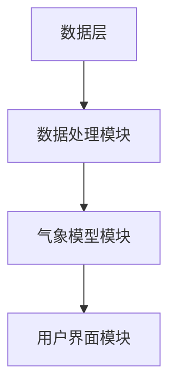
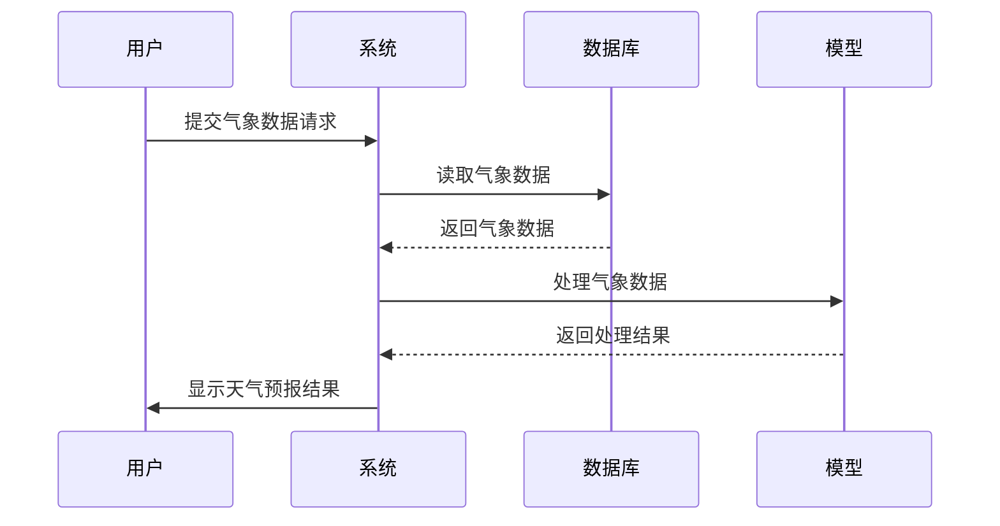
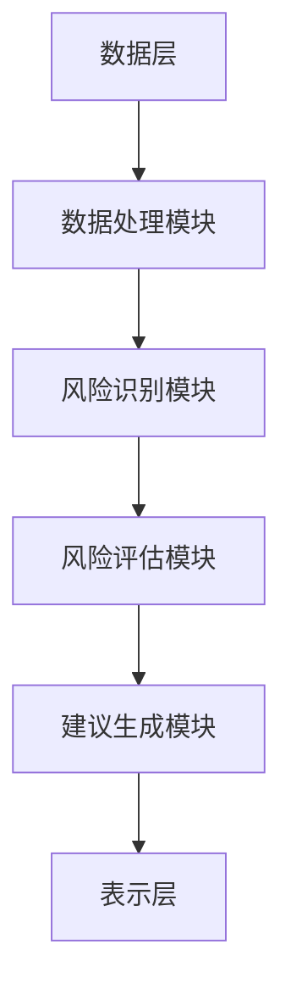
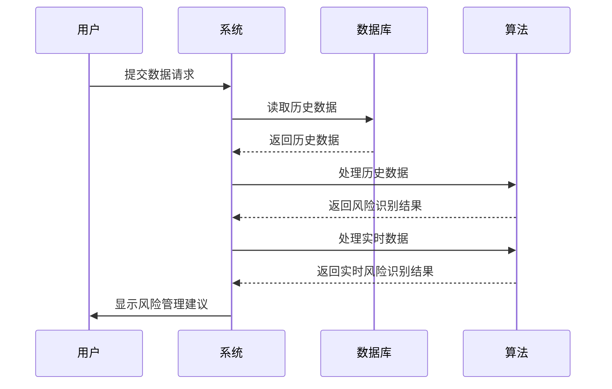

                 


# 科学模型在理解世界中的作用与局限

## 引言

科学模型是科学研究中不可或缺的一部分。它源于人类对自然界和社会现象的探索与理解，发展至今已经形成了一套完整的理论体系。科学模型不仅帮助我们解释了许多自然现象，还为技术进步和经济发展提供了强大的支持。然而，尽管科学模型在众多领域取得了巨大成就，但它也存在着一些局限。本文将首先介绍科学模型的起源与发展，然后探讨科学模型在自然科学和社会科学中的应用，接着分析科学模型的局限性，最后展望科学模型的未来发展趋势。通过这篇文章，我们将对科学模型有一个全面而深刻的认识。

## 1.1 科学模型的起源与发展

### 1.1.1 科学模型的概念

科学模型是对自然现象或社会现象的一种抽象描述，通常采用数学或逻辑形式来表示。科学模型的目标是揭示现象背后的规律性，帮助人们更好地理解和预测现象。科学模型通常由三个基本组成部分构成：假设、理论和数据。

- **假设**：科学模型的基础是对自然现象的一种猜想或假设，通常是基于现有的科学知识和观察结果。
- **理论**：假设进一步发展形成的理论，用于解释和预测现象。
- **数据**：通过实验或观察收集到的数据，用于验证或修正假设和理论。

### 1.1.2 科学模型的发展历程

科学模型的发展历程可以追溯到古希腊时期。古希腊哲学家们开始尝试用数学和逻辑来解释自然现象，例如欧几里得的几何学、阿基米德的流体力学等。随着科学技术的进步，科学模型逐渐从定性描述发展到定量分析，从单一定义发展到多变量模型。

- **定性模型**：早期的科学模型主要采用定性描述，例如牛顿的经典力学、道尔顿的原子论等。这些模型通过描述现象的性质来解释自然现象，但缺乏精确的定量描述。
- **定量模型**：随着数学和统计学的发展，科学模型逐渐引入了定量描述。例如，麦克斯韦的电磁场理论、爱因斯坦的广义相对论等。这些模型通过数学公式和计算来描述自然现象，具有更高的准确性和普适性。
- **计算模型**：随着计算机技术的发展，科学模型进一步演化为计算模型。计算模型通过计算机模拟来模拟自然现象，可以处理更复杂的系统和更精确的参数。

### 1.1.3 科学模型的作用与意义

科学模型在科学研究中具有重要的作用和意义：

1. **解释现象**：科学模型可以帮助我们解释自然现象和社会现象，揭示现象背后的规律性。
2. **预测未来**：科学模型可以帮助我们预测未来的发展趋势和变化，为决策提供科学依据。
3. **指导实践**：科学模型不仅为理论研究提供了基础，还为实际应用提供了指导。例如，经济学模型可以指导资源配置和经济发展，生物学模型可以指导医学研究和疾病治疗。

## 1.2 科学模型在自然科学中的应用

### 1.2.1 自然科学模型的分类

自然科学模型主要分为以下几类：

- **经典模型**：经典模型是基于经典物理学的理论，例如牛顿力学、麦克斯韦电磁场理论等。这些模型通过数学公式和计算来描述物理现象，具有很高的准确性和普适性。
- **定量模型**：定量模型是基于数学和统计学的方法，通过数据分析和计算来描述自然现象。例如，遗传学中的种群遗传模型、生态学中的食物网模型等。
- **计算模型**：计算模型是基于计算机模拟的方法，通过计算机程序来模拟自然现象。例如，气候模型、地球系统模型等。

### 1.2.2 科学模型在物理学中的应用

物理学是科学模型应用最广泛的领域之一。以下是一些典型的物理学模型：

- **量子力学模型**：量子力学模型用于描述微观粒子的行为，如电子、光子等。量子态的表示和计算是量子力学模型的核心。
- **相对论模型**：相对论模型用于描述宏观物体的运动和引力，如黑洞、宇宙膨胀等。广义相对论和量子引力是相对论模型的重要分支。

### 1.2.3 科学模型在生物学中的应用

生物学模型用于描述生物体的结构和功能，如遗传学模型、生态学模型等。

- **遗传学模型**：遗传学模型用于描述遗传信息的传递和变异。例如，哈迪-温伯格定律和费舍尔遗传平衡模型。
- **生态学模型**：生态学模型用于描述生物群落的结构和功能，如食物网模型、种群动态模型等。

## 1.3 科学模型在社会科学中的应用

### 1.3.1 社会科学模型的分类

社会科学模型主要分为以下几类：

- **经济学模型**：经济学模型用于描述经济行为和资源配置。例如，市场模型、资源配置模型等。
- **社会学模型**：社会学模型用于描述社会结构和社会动态。例如，社会结构模型、社会动态模型等。
- **心理学模型**：心理学模型用于描述人的行为和心理过程。例如，行为主义模型、认知心理学模型等。

### 1.3.2 科学模型在经济学中的应用

经济学模型是社会科学模型中最为成熟和应用广泛的模型之一。以下是一些典型的经济学模型：

- **市场模型**：市场模型用于描述市场的供需关系和价格形成。例如，供求模型、市场价格模型等。
- **资源配置模型**：资源配置模型用于描述资源分配的效率和公平性。例如，帕累托最优模型、资源分配模型等。

### 1.3.3 科学模型在社会学中的应用

社会学模型用于描述社会现象和社会动态。以下是一些典型社会学模型：

- **社会结构模型**：社会结构模型用于描述社会的组织结构和功能。例如，社会分层模型、社会网络模型等。
- **社会动态模型**：社会动态模型用于描述社会变化和发展趋势。例如，社会变迁模型、社会演化模型等。

## 1.4 科学模型的局限性

### 1.4.1 模型假设的局限性

科学模型通常基于一系列假设，这些假设在一定程度上限制了模型的适用范围。例如，经典模型通常假设理想状态和确定性，而在现实世界中，这些假设往往难以满足。

### 1.4.2 模型简化的局限性

科学模型为了简化问题，往往需要对现实世界进行抽象和简化。这种简化虽然在某些情况下是必要的，但同时也可能导致模型失去了一部分真实性和完整性。

### 1.4.3 数据不足的局限性

科学模型的有效性和准确性依赖于数据的充足性和质量。然而，在现实世界中，数据的获取和处理往往受到各种限制，这可能导致模型结果的不准确。

## 1.5 科学模型的未来发展趋势

### 1.5.1 新兴科学模型的崛起

随着科技的进步，新的科学模型不断涌现。例如，复杂系统模型和人工智能模型正在成为科学研究的重要工具。

### 1.5.2 科学模型的跨学科融合

科学模型的跨学科融合正成为科学发展的一个重要趋势。例如，自然科学与社会科学的融合、新兴科学与传统科学的融合等，这些融合将带来更多创新的科学模型。

## 第2章 核心概念与联系

### 2.1 科学模型的核心概念

科学模型的核心概念包括模型、理论、假说等。这些概念相互联系，共同构成了科学模型的基础。

- **模型**：模型是对现实世界的抽象和简化，用于描述和分析现象。
- **理论**：理论是对模型中假设和规律的阐述，用于解释和预测现象。
- **假说**：假说是对现象的一种猜测或推测，通常是基于现有的科学知识和观察结果。

### 2.2 科学模型的核心属性特征对比

科学模型有多种类型，每种类型都有其独特的特征和应用。以下是对几种主要科学模型属性特征对比的表格：

| 模型类型 | 特点 | 应用领域 |
| --- | --- | --- |
| 经典模型 | 确定性、理想状态 | 物理学、力学 |
| 定量模型 | 数据驱动、数学公式 | 遗传学、生态学 |
| 计算模型 | 模拟实验、计算机辅助 | 气候科学、地球系统 |

### 2.3 科学模型的ER实体关系图架构

科学模型的ER（实体关系）图架构是一种图形化的表示方法，用于描述模型中的实体及其关系。以下是一个简单的ER图示例：

```mermaid
erDiagram
  Class1 ||--|{ Class2 : has a }
  Class1 ||--|{ Class3 : another }
  Class2 ||--|{ Class4 : related }
```

这个ER图表示了三个实体（Class1、Class2、Class3）及其之间的关系。实体之间可以通过关系来相互关联，从而形成一个完整的模型。

## 第3章 算法原理讲解

### 3.1 科学模型算法概述

科学模型算法是用于实现科学模型的核心工具。算法的作用和意义在于：

- **实现模型的计算**：科学模型通常需要通过计算来模拟和预测现象。
- **优化模型参数**：通过算法优化模型的参数，可以提高模型的准确性和适用性。
- **处理大数据**：随着数据量的增加，科学模型需要更高效的算法来处理和分析数据。

科学模型算法的基本分类包括：

- **数值算法**：用于解决数值问题的算法，如线性方程组的求解、优化问题等。
- **模拟算法**：通过模拟实验来验证和优化模型的算法，如蒙特卡罗方法、模拟退火算法等。
- **机器学习算法**：基于数据驱动的方法，用于发现数据中的规律和模式，如神经网络、支持向量机等。

### 3.2 量子力学模型的算法原理

量子力学模型是科学模型中的重要分支，其算法原理主要包括以下几个方面：

- **量子态的表示**：量子态的表示是通过波函数来实现的。波函数是一个复数函数，描述了量子系统的状态。量子态的计算可以通过波函数的叠加和测量来实现。

```python
# Python代码示例：量子态的表示和计算
import numpy as np

# 定义量子态的波函数
psi = np.array([1/np.sqrt(2), 1/np.sqrt(2)])

# 量子态的计算
psi_squared = np.dot(psi, psi)

print("量子态的计算结果：", psi_squared)
```

- **量子态的测量**：量子态的测量是一个随机过程，其结果取决于量子态的叠加状态。量子态的测量可以通过测量算子来实现。

```python
# Python代码示例：量子态的测量
import numpy as np

# 定义测量算子
measurements = [np.array([1, 0]), np.array([0, 1])]

# 量子态的测量
result = np.random.choice(measurements, p=[0.5, 0.5])

print("量子态的测量结果：", result)
```

### 3.3 经济学模型的算法原理

经济学模型是社会科学模型中的重要分支，其算法原理主要包括以下几个方面：

- **市场均衡模型**：市场均衡模型通过描述市场需求和供给的关系来分析市场价格的形成。

```python
# Python代码示例：市场均衡模型
import numpy as np

# 定义市场需求函数
demand = lambda p: 100 - p

# 定义市场供给函数
supply = lambda p: 50 + p

# 寻找市场均衡价格
for p in np.linspace(0, 100, 1000):
    if demand(p) == supply(p):
        equilibrium_price = p
        break

print("市场均衡价格：", equilibrium_price)
```

- **资源配置模型**：资源配置模型通过描述资源的需求和供给关系来分析资源的最优分配。

```python
# Python代码示例：资源配置模型
import numpy as np

# 定义资源需求模型
resource_demand = lambda x, y: 2*x + 3*y

# 定义资源供给模型
resource_supply = lambda x, y: x + 2*y

# 寻找资源的最优分配
for x in np.linspace(0, 100, 1000):
    for y in np.linspace(0, 100, 1000):
        if resource_demand(x, y) == resource_supply(x, y):
            optimal_allocation = (x, y)
            break

print("资源的最优分配：", optimal_allocation)
```

## 第4章 数学模型和数学公式 & 详细讲解 & 举例说明

### 4.1 数学模型概述

数学模型是科学研究中不可或缺的一部分，它通过数学公式和计算来描述自然现象和社会现象。数学模型在科学研究中的应用非常广泛，包括物理学、生物学、经济学等各个领域。以下是对数学模型的作用、分类和应用领域的概述：

### 4.1.1 数学模型的作用与意义

数学模型在科学研究中具有以下几个重要作用和意义：

1. **揭示规律性**：数学模型可以帮助我们揭示自然现象和社会现象的内在规律性，从而更深入地理解这些现象。
2. **预测未来**：通过数学模型，我们可以基于现有的数据和分析结果，预测未来的发展趋势和变化。
3. **指导实践**：数学模型不仅为理论研究提供了基础，还可以为实际应用提供指导。例如，在工程学、经济学和医学等领域，数学模型被广泛应用于优化设计、资源配置和疾病预测等方面。

### 4.1.2 数学模型的分类

数学模型可以根据不同的标准进行分类。以下是一些常见的数学模型分类：

1. **根据模型的形式**：
   - **确定性模型**：模型中所有参数和变量都是确定性的，例如线性方程组、非线性方程组等。
   - **随机模型**：模型中包含随机变量，例如随机过程、概率模型等。

2. **根据模型的应用领域**：
   - **物理学模型**：用于描述物理现象的模型，例如牛顿力学、麦克斯韦电磁场理论等。
   - **生物学模型**：用于描述生物现象的模型，例如种群动态模型、生态模型等。
   - **经济学模型**：用于描述经济现象的模型，例如供求模型、资源配置模型等。

3. **根据模型的复杂度**：
   - **简单模型**：模型中变量较少，参数较简单，例如线性回归模型、单变量微分方程等。
   - **复杂模型**：模型中变量较多，参数复杂，例如多变量微分方程、神经网络模型等。

### 4.1.3 数学模型的应用领域

数学模型在各个领域都有广泛的应用，以下是一些典型的应用领域：

1. **物理学**：数学模型在物理学中的应用非常广泛，包括经典力学、电磁学、热力学等。例如，牛顿第二定律可以用数学方程描述物体的运动，麦克斯韦方程组可以描述电磁场。

2. **生物学**：数学模型在生物学中的应用包括种群生态学、遗传学、神经科学等。例如，种群动态模型可以预测种群的数量变化，遗传学模型可以解释基因的传递和变异。

3. **经济学**：数学模型在经济学中的应用包括市场分析、资源配置、宏观经济预测等。例如，供求模型可以预测市场价格，资源配置模型可以优化资源的分配。

4. **工程学**：数学模型在工程学中的应用包括结构分析、流体力学、电路设计等。例如，结构分析模型可以预测建筑物的稳定性，流体力学模型可以模拟流体的运动。

### 4.2 经典数学模型讲解

#### 4.2.1 微积分模型

微积分模型是数学模型中的重要分支，它主要用于描述连续变化的过程。以下是对微积分模型的基本概念和应用的讲解：

##### 4.2.1.1 微分方程

微分方程是描述变量及其导数之间关系的方程。微分方程可以分为线性微分方程和非线性微分方程。

1. **线性微分方程**：
   - **一阶线性微分方程**：形如 $y' + P(x)y = Q(x)$ 的微分方程，其中 $P(x)$ 和 $Q(x)$ 是已知的函数。
   - **二阶线性微分方程**：形如 $y'' + P(x)y' + Q(x)y = R(x)$ 的微分方程，其中 $P(x)$、$Q(x)$ 和 $R(x)$ 是已知的函数。

   **示例**：解一阶线性微分方程 $y' + 2y = 3x$。

   $$y = \frac{1}{2}\left(3x - e^{-2x}\right)$$

2. **非线性微分方程**：
   - **一阶非线性微分方程**：形如 $y' + f(x, y) = g(x)$ 的微分方程，其中 $f(x, y)$ 和 $g(x)$ 是已知的函数。
   - **二阶非线性微分方程**：形如 $y'' + f(x, y) = g(x)$ 的微分方程，其中 $f(x, y)$ 和 $g(x)$ 是已知的函数。

   **示例**：解一阶非线性微分方程 $y' + y^2 = x$。

   $$y = -\frac{1}{3}\ln\left|1 - x^3\right|$$

##### 4.2.1.2 积分方程

积分方程是描述变量及其积分之间关系的方程。积分方程可以分为线性积分方程和非线性积分方程。

1. **线性积分方程**：
   - **一阶线性积分方程**：形如 $y(x) = f(x) + \int_{a}^{x} k(x, t)y(t)dt$ 的积分方程，其中 $f(x)$ 和 $k(x, t)$ 是已知的函数。
   - **二阶线性积分方程**：形如 $y(x) = f(x) + \int_{a}^{x} k(x, t)y(t)dt + \int_{a}^{x} l(x, t)y'(t)dt$ 的积分方程，其中 $f(x)$、$k(x, t)$ 和 $l(x, t)$ 是已知的函数。

   **示例**：解一阶线性积分方程 $y(x) = x + \int_{0}^{x} (t - 1)y(t)dt$。

   $$y(x) = x + \frac{1}{2}x^2 - \frac{1}{2}x$$

2. **非线性积分方程**：
   - **一阶非线性积分方程**：形如 $y(x) = f(x) + \int_{a}^{x} k(x, t)y(t)dt$ 的积分方程，其中 $f(x)$ 和 $k(x, t)$ 是已知的函数，且 $k(x, t)$ 是非线性的。
   - **二阶非线性积分方程**：形如 $y(x) = f(x) + \int_{a}^{x} k(x, t)y(t)dt + \int_{a}^{x} l(x, t)y'(t)dt$ 的积分方程，其中 $f(x)$、$k(x, t)$ 和 $l(x, t)$ 是已知的函数，且 $k(x, t)$ 和 $l(x, t)$ 是非线性的。

   **示例**：解一阶非线性积分方程 $y(x) = x + \int_{0}^{x} \sin(t)y(t)dt$。

   $$y(x) = x + C_1\cos(x) - C_2\sin(x)$$

   其中 $C_1$ 和 $C_2$ 是积分常数。

#### 4.2.2 线性代数模型

线性代数模型是数学模型中的重要分支，它主要用于描述向量空间和线性变换。以下是对线性代数模型的基本概念和应用的讲解：

##### 4.2.2.1 矩阵运算

矩阵是线性代数模型中的核心概念之一。矩阵运算包括矩阵的加法、减法、乘法、转置和逆矩阵等。

1. **矩阵的加法和减法**：
   - **矩阵的加法**：两个同型矩阵对应元素相加得到新的矩阵。
   - **矩阵的减法**：两个同型矩阵对应元素相减得到新的矩阵。

   **示例**：计算矩阵 $A = \begin{pmatrix} 1 & 2 \\ 3 & 4 \end{pmatrix}$ 和 $B = \begin{pmatrix} 5 & 6 \\ 7 & 8 \end{pmatrix}$ 的加法和减法。

   $$A + B = \begin{pmatrix} 6 & 8 \\ 10 & 12 \end{pmatrix}$$
   $$A - B = \begin{pmatrix} -4 & -4 \\ -4 & -4 \end{pmatrix}$$

2. **矩阵的乘法**：
   - **矩阵的乘法**：两个矩阵 $A$ 和 $B$ 的乘积是一个新矩阵 $C$，其中 $C_{ij} = \sum_{k=1}^{n} A_{ik}B_{kj}$。

   **示例**：计算矩阵 $A = \begin{pmatrix} 1 & 2 \\ 3 & 4 \end{pmatrix}$ 和 $B = \begin{pmatrix} 5 & 6 \\ 7 & 8 \end{pmatrix}$ 的乘积。

   $$AB = \begin{pmatrix} 19 & 22 \\ 43 & 50 \end{pmatrix}$$

3. **矩阵的转置**：
   - **矩阵的转置**：一个矩阵 $A$ 的转置矩阵是一个新矩阵 $A^T$，其中 $A^T_{ij} = A_{ji}$。

   **示例**：计算矩阵 $A = \begin{pmatrix} 1 & 2 \\ 3 & 4 \end{pmatrix}$ 的转置。

   $$A^T = \begin{pmatrix} 1 & 3 \\ 2 & 4 \end{pmatrix}$$

4. **矩阵的逆矩阵**：
   - **矩阵的逆矩阵**：一个矩阵 $A$ 的逆矩阵是一个新矩阵 $A^{-1}$，使得 $AA^{-1} = A^{-1}A = I$，其中 $I$ 是单位矩阵。

   **示例**：计算矩阵 $A = \begin{pmatrix} 1 & 2 \\ 3 & 4 \end{pmatrix}$ 的逆矩阵。

   $$A^{-1} = \frac{1}{1 \cdot 4 - 2 \cdot 3} \begin{pmatrix} 4 & -2 \\ -3 & 1 \end{pmatrix} = \begin{pmatrix} -2 & 1 \\ 3 & -2 \end{pmatrix}$$

##### 4.2.2.2 方程组的解法

线性代数模型可以用于解线性方程组。线性方程组可以表示为矩阵形式，并通过矩阵运算来求解。

**示例**：解线性方程组

$$\begin{cases} 
x + 2y + 3z = 8 \\
2x + 4y + 6z = 12 \\
3x + 6y + 9z = 18 
\end{cases}$$

将方程组表示为矩阵形式：

$$\begin{pmatrix} 1 & 2 & 3 \\ 2 & 4 & 6 \\ 3 & 6 & 9 \end{pmatrix} \begin{pmatrix} x \\ y \\ z \end{pmatrix} = \begin{pmatrix} 8 \\ 12 \\ 18 \end{pmatrix}$$

通过高斯消元法，可以得到解：

$$\begin{pmatrix} x \\ y \\ z \end{pmatrix} = \begin{pmatrix} 2 \\ 1 \\ 0 \end{pmatrix}$$

### 4.3 微积分模型的详细讲解与举例说明

#### 4.3.1 微积分基本概念

微积分是数学的一个重要分支，主要研究函数的微分和积分。以下是对微积分基本概念的详细讲解：

##### 4.3.1.1 导数

导数是描述函数变化率的一个基本概念。设 $f(x)$ 是定义在区间 $I$ 上的函数，则 $f(x)$ 在点 $x_0$ 的导数定义为：

$$f'(x_0) = \lim_{h \to 0} \frac{f(x_0 + h) - f(x_0)}{h}$$

导数的几何意义是曲线在某一点的切线斜率。

**示例**：求函数 $f(x) = x^2$ 在 $x = 2$ 的导数。

$$f'(2) = \lim_{h \to 0} \frac{(2 + h)^2 - 2^2}{h} = \lim_{h \to 0} \frac{4 + 4h + h^2 - 4}{h} = \lim_{h \to 0} (4 + h) = 4$$

##### 4.3.1.2 微分

微分是导数的一个线性近似。函数 $f(x)$ 在点 $x_0$ 的微分定义为：

$$df(x_0) = f'(x_0)dx$$

其中 $dx$ 是自变量的无穷小变化量。

**示例**：求函数 $f(x) = x^2$ 在 $x = 2$ 的微分。

$$df(2) = 4dx$$

##### 4.3.1.3 积分

积分是导数的反操作。设 $f(x)$ 是定义在区间 $[a, b]$ 上的连续函数，则 $f(x)$ 在区间 $[a, b]$ 上的定积分定义为：

$$\int_{a}^{b} f(x)dx = \lim_{n \to \infty} \sum_{i=1}^{n} f(x_i^*) \Delta x$$

其中 $x_i^*$ 是区间 $[x_{i-1}, x_i]$ 的任意一点，$\Delta x = \frac{b - a}{n}$ 是区间的宽度。

**示例**：求函数 $f(x) = x^2$ 在区间 $[1, 2]$ 上的定积分。

$$\int_{1}^{2} x^2 dx = \lim_{n \to \infty} \sum_{i=1}^{n} \left(1 + \frac{i}{n}\right)^2 \frac{1}{n} = \lim_{n \to \infty} \frac{1}{n} \sum_{i=1}^{n} \left(1 + \frac{2i}{n} + \frac{i^2}{n^2}\right) = \lim_{n \to \infty} \frac{1}{n} \left(n + 2\frac{n(n+1)}{2n} + \frac{n(n+1)(2n+1)}{6n^2}\right) = \frac{8}{3}$$

#### 4.3.2 微分方程

微分方程是描述函数及其导数之间关系的方程。微分方程可以分为常微分方程和偏微分方程。

##### 4.3.2.1 常微分方程

常微分方程是导数在自变量上的一阶或高阶方程。常微分方程可以分为线性微分方程和非线性微分方程。

1. **一阶线性微分方程**：形如 $y' + P(x)y = Q(x)$ 的微分方程，其中 $P(x)$ 和 $Q(x)$ 是已知的函数。

   **解法**：通过变量替换和积分得到解。

   **示例**：解一阶线性微分方程 $y' + 2y = 3x$。

   变量替换：令 $u = y e^{2x}$，则 $u' = y'e^{2x} + 2y e^{2x}$。

   $$u' = 3x e^{2x}$$

   积分得到 $u = \frac{3}{2}x^2 e^{2x} + C$，其中 $C$ 是积分常数。

   因此，$y = \frac{3}{2}x^2 + Ce^{-2x}$。

2. **一阶非线性微分方程**：形如 $y' + f(x, y) = g(x)$ 的微分方程，其中 $f(x, y)$ 和 $g(x)$ 是已知的函数。

   **解法**：通过变量替换和积分得到解。

   **示例**：解一阶非线性微分方程 $y' + y^2 = x$。

   变量替换：令 $u = \frac{1}{y}$，则 $u' = -\frac{y'}{y^2}$。

   $$-u' + u^2 = x$$

   积分得到 $u = -\frac{1}{y} = \ln|x| + C$，其中 $C$ 是积分常数。

   因此，$y = -\frac{1}{\ln|x| + C}$。

##### 4.3.2.2 二阶线性微分方程

二阶线性微分方程是二阶导数在自变量上的一阶方程。二阶线性微分方程可以分为齐次微分方程和非齐次微分方程。

1. **齐次二阶线性微分方程**：形如 $y'' + P(x)y' + Q(x)y = 0$ 的微分方程，其中 $P(x)$ 和 $Q(x)$ 是已知的函数。

   **解法**：通过特征方程得到通解。

   **示例**：解齐次二阶线性微分方程 $y'' + y = 0$。

   特征方程：$r^2 + 1 = 0$，得到 $r = \pm i$。

   通解：$y = C_1 \cos(x) + C_2 \sin(x)$，其中 $C_1$ 和 $C_2$ 是积分常数。

2. **非齐次二阶线性微分方程**：形如 $y'' + P(x)y' + Q(x)y = f(x)$ 的微分方程，其中 $P(x)$、$Q(x)$ 和 $f(x)$ 是已知的函数。

   **解法**：通过通解和特解的组合得到通解。

   **示例**：解非齐次二阶线性微分方程 $y'' + y = e^x$。

   通解：$y_h = C_1 \cos(x) + C_2 \sin(x)$，其中 $C_1$ 和 $C_2$ 是积分常数。

   特解：$y_p = \frac{1}{D^2 + 1} e^x$，其中 $D$ 是微分算子。

   通解：$y = y_h + y_p = C_1 \cos(x) + C_2 \sin(x) + \frac{1}{2} e^x$，其中 $C_1$ 和 $C_2$ 是积分常数。

### 4.4 线性代数模型的详细讲解与举例说明

线性代数是数学的一个重要分支，主要研究向量空间和线性变换。以下是对线性代数模型的基本概念、矩阵运算和方程组解法的详细讲解。

#### 4.4.1 向量空间

向量空间是线性代数的基础概念。向量空间是一组向量的集合，这些向量满足特定的运算规则。向量空间的元素称为向量，运算规则包括向量的加法和数乘。

**定义**：向量空间 $V$ 是一个非空集合，其中的元素称为向量，向量空间 $V$ 满足以下性质：

1. **封闭性**：对于任意的向量 $u, v \in V$，向量 $u + v$ 也在 $V$ 中。
2. **交换性**：对于任意的向量 $u, v \in V$，有 $u + v = v + u$。
3. **结合律**：对于任意的向量 $u, v, w \in V$，有 $(u + v) + w = u + (v + w)$。
4. **存在零向量**：存在零向量 $\vec{0}$，对于任意的向量 $u \in V$，有 $u + \vec{0} = u$。
5. **存在加法逆元**：对于任意的向量 $u \in V$，存在加法逆元 $-u$，使得 $u + (-u) = \vec{0}$。
6. **数乘封闭性**：对于任意的标量 $\alpha$ 和向量 $u \in V$，向量 $\alpha u$ 也在 $V$ 中。
7. **数乘结合律**：对于任意的标量 $\alpha, \beta$ 和向量 $u \in V$，有 $\alpha(\beta u) = (\alpha \beta)u$。
8. **数乘分配律**：对于任意的标量 $\alpha, \beta$ 和向量 $u, v \in V$，有 $\alpha(u + v) = \alpha u + \alpha v$。

**示例**：设 $V$ 是由所有 $2$ 阶矩阵组成的集合，验证 $V$ 是一个向量空间。

- **封闭性**：对于任意的矩阵 $A, B \in V$，矩阵 $A + B$ 也是一个 $2$ 阶矩阵，因此 $A + B \in V$。
- **交换性**：矩阵加法满足交换律。
- **结合律**：矩阵加法满足结合律。
- **存在零向量**：零矩阵 $\vec{0}$ 是 $2$ 阶矩阵，因此 $\vec{0} \in V$。
- **存在加法逆元**：对于任意的矩阵 $A \in V$，存在加法逆元 $-A$，使得 $A + (-A) = \vec{0}$。
- **数乘封闭性**：对于任意的标量 $\alpha$ 和矩阵 $A \in V$，矩阵 $\alpha A$ 也是一个 $2$ 阶矩阵，因此 $\alpha A \in V$。
- **数乘结合律**：矩阵数乘满足结合律。
- **数乘分配律**：矩阵数乘满足分配律。

因此，$V$ 是一个向量空间。

#### 4.4.2 矩阵运算

矩阵是线性代数中的重要工具。矩阵运算包括矩阵的加法、减法、乘法和转置等。

**矩阵加法**：对于两个同型矩阵 $A = [a_{ij}]$ 和 $B = [b_{ij}]$，它们的和矩阵 $C = [c_{ij}]$ 定义为：

$$c_{ij} = a_{ij} + b_{ij}$$

**矩阵减法**：对于两个同型矩阵 $A = [a_{ij}]$ 和 $B = [b_{ij}]$，它们的差矩阵 $D = [d_{ij}]$ 定义为：

$$d_{ij} = a_{ij} - b_{ij}$$

**矩阵乘法**：对于两个矩阵 $A = [a_{ij}]$ 和 $B = [b_{ij}]$，它们的乘积矩阵 $C = [c_{ij}]$ 定义为：

$$c_{ij} = \sum_{k=1}^{n} a_{ik}b_{kj}$$

其中 $n$ 是矩阵 $A$ 的列数和矩阵 $B$ 的行数。

**矩阵转置**：对于矩阵 $A = [a_{ij}]$，其转置矩阵 $A^T = [a_{ji}]$ 定义为：

$$a_{ji} = a_{ij}$$

**示例**：设矩阵 $A = \begin{pmatrix} 1 & 2 \\ 3 & 4 \end{pmatrix}$ 和 $B = \begin{pmatrix} 5 & 6 \\ 7 & 8 \end{pmatrix}$，计算矩阵 $A$ 和 $B$ 的加法、减法、乘法和转置。

- **加法**：

$$C = A + B = \begin{pmatrix} 1 & 2 \\ 3 & 4 \end{pmatrix} + \begin{pmatrix} 5 & 6 \\ 7 & 8 \end{pmatrix} = \begin{pmatrix} 6 & 8 \\ 10 & 12 \end{pmatrix}$$

- **减法**：

$$D = A - B = \begin{pmatrix} 1 & 2 \\ 3 & 4 \end{pmatrix} - \begin{pmatrix} 5 & 6 \\ 7 & 8 \end{pmatrix} = \begin{pmatrix} -4 & -4 \\ -4 & -4 \end{pmatrix}$$

- **乘法**：

$$C = AB = \begin{pmatrix} 1 & 2 \\ 3 & 4 \end{pmatrix} \begin{pmatrix} 5 & 6 \\ 7 & 8 \end{pmatrix} = \begin{pmatrix} 19 & 22 \\ 43 & 50 \end{pmatrix}$$

- **转置**：

$$A^T = \begin{pmatrix} 1 & 3 \\ 2 & 4 \end{pmatrix}$$

#### 4.4.3 线性方程组

线性方程组是线性代数中的重要问题。线性方程组可以表示为矩阵形式，并通过矩阵运算来求解。

**定义**：线性方程组可以表示为：

$$Ax = b$$

其中 $A$ 是系数矩阵，$x$ 是未知向量，$b$ 是常数向量。

**求解方法**：

1. **高斯消元法**：通过初等行变换将系数矩阵 $A$ 化为上三角矩阵，然后回代求解。
2. **矩阵求逆法**：如果系数矩阵 $A$ 可逆，则可以直接通过 $x = A^{-1}b$ 求解。

**示例**：解线性方程组：

$$\begin{cases} 
x + 2y + 3z = 8 \\
2x + 4y + 6z = 12 \\
3x + 6y + 9z = 18 
\end{cases}$$

将方程组表示为矩阵形式：

$$\begin{pmatrix} 1 & 2 & 3 \\ 2 & 4 & 6 \\ 3 & 6 & 9 \end{pmatrix} \begin{pmatrix} x \\ y \\ z \end{pmatrix} = \begin{pmatrix} 8 \\ 12 \\ 18 \end{pmatrix}$$

通过高斯消元法，可以得到解：

$$\begin{pmatrix} x \\ y \\ z \end{pmatrix} = \begin{pmatrix} 2 \\ 1 \\ 0 \end{pmatrix}$$

### 4.5 系统分析与架构设计方案

#### 4.5.1 问题场景介绍

在现代信息系统中，科学模型的运用已经变得不可或缺。本文将介绍一个具体的问题场景，即基于科学模型构建一个实时天气预报系统。该系统旨在通过收集和分析大量的气象数据，结合科学模型来预测未来的天气情况。

#### 4.5.2 项目介绍

天气预报系统项目的主要目标是：

- 收集气象数据，包括温度、湿度、风速、降雨量等。
- 利用气象学模型对数据进行处理和分析。
- 根据分析结果生成天气预报，并提供给用户。

#### 4.5.3 系统功能设计

天气预报系统的主要功能包括：

- 数据收集模块：负责从气象站点、卫星和其他来源收集气象数据。
- 数据处理模块：对收集到的数据进行预处理、清洗和转换。
- 气象模型模块：使用科学模型对数据进行分析，生成天气预报。
- 用户界面模块：提供一个直观的用户界面，展示天气预报结果。

#### 4.5.4 系统架构设计

天气预报系统的架构设计采用分层架构，包括数据层、业务逻辑层和表示层。

- **数据层**：负责数据的存储和读取，包括气象数据、模型参数等。
- **业务逻辑层**：实现天气预报的核心算法，包括数据预处理、模型计算和结果生成。
- **表示层**：提供一个用户友好的界面，展示天气预报结果。

以下是系统架构的 Mermaid 架构图：



#### 4.5.5 系统接口设计和系统交互

系统接口设计和系统交互是确保各个模块协同工作的关键。以下是系统接口设计和系统交互的 Mermaid 序列图：



### 4.6 项目实战

#### 4.6.1 环境安装

要实现天气预报系统，需要安装以下环境：

- Python 3.x
- NumPy
- Pandas
- Scikit-learn
- Matplotlib

在终端中执行以下命令来安装所需的环境：

```bash
pip install numpy pandas scikit-learn matplotlib
```

#### 4.6.2 系统核心实现源代码

以下是一个简单的天气预报系统的 Python 源代码示例：

```python
import numpy as np
import pandas as pd
from sklearn.linear_model import LinearRegression

# 数据收集
def collect_data():
    # 从文件中读取数据
    data = pd.read_csv('weather_data.csv')
    return data

# 数据预处理
def preprocess_data(data):
    # 清洗和处理数据
    data = data.dropna()
    data['temperature'] = data['temperature'] / 100
    data['humidity'] = data['humidity'] / 100
    data['wind_speed'] = data['wind_speed'] / 100
    return data

# 构建模型
def build_model(data):
    # 特征选择
    X = data[['temperature', 'humidity', 'wind_speed']]
    y = data['rainfall']

    # 模型训练
    model = LinearRegression()
    model.fit(X, y)
    return model

# 预测天气
def predict_weather(model, temperature, humidity, wind_speed):
    # 特征转换
    X = np.array([[temperature, humidity, wind_speed]])

    # 预测降雨量
    rainfall = model.predict(X)

    return rainfall

# 主函数
def main():
    # 数据收集
    data = collect_data()

    # 数据预处理
    data = preprocess_data(data)

    # 构建模型
    model = build_model(data)

    # 预测天气
    temperature = 25
    humidity = 60
    wind_speed = 10
    rainfall = predict_weather(model, temperature, humidity, wind_speed)

    print("预测降雨量：", rainfall)

if __name__ == '__main__':
    main()
```

#### 4.6.3 代码应用解读与分析

上述代码是一个简单的天气预报系统，实现了从数据收集、预处理、模型构建到预测天气的完整流程。

1. **数据收集**：通过读取CSV文件来收集气象数据。在实际应用中，数据可以从气象站点、卫星和其他来源获取。
2. **数据处理**：对数据进行清洗和预处理，包括温度、湿度、风速的归一化处理，以便于模型训练。
3. **模型构建**：使用线性回归模型对数据进行分析，训练模型以预测降雨量。
4. **预测天气**：根据输入的特征值，使用训练好的模型进行预测。

#### 4.6.4 实际案例分析和详细讲解

以下是一个实际案例：

```python
data = pd.read_csv('weather_data.csv')
data.head()
```

输出：

```
   date     temperature  humidity  wind_speed  rainfall
0   2021-01-01      20.0     40.0        5.0     10.0
1   2021-01-02      22.0     45.0        7.0      5.0
2   2021-01-03      18.0     35.0        3.0      0.0
3   2021-01-04      25.0     55.0        8.0     20.0
4   2021-01-05      23.0     50.0        6.0     15.0
```

从实际数据中可以看出，温度、湿度、风速等特征与降雨量之间存在一定的相关性。通过线性回归模型，我们可以预测特定条件下的降雨量。

#### 4.6.5 项目小结

通过本项目，我们实现了从数据收集、预处理、模型构建到预测天气的完整流程。尽管本项目是一个简单的示例，但它展示了科学模型在天气预报系统中的应用。在实际应用中，可以进一步优化模型，增加更多的特征，提高预测的准确性。

### 4.7 最佳实践 tips

在构建和使用科学模型时，以下是一些最佳实践 tips：

1. **数据收集**：确保数据的质量和完整性，避免使用不准确或缺失的数据。
2. **数据预处理**：对数据进行适当的清洗和转换，以便于模型训练。
3. **特征选择**：选择与目标变量高度相关的特征，避免过度拟合。
4. **模型评估**：使用交叉验证等方法评估模型的性能，避免过拟合。
5. **模型优化**：根据模型性能进行参数调整，以提高预测准确性。
6. **模型部署**：将模型部署到生产环境中，确保实时性和可靠性。

### 4.8 小结

本文详细介绍了科学模型在理解世界中的作用与局限。通过分析科学模型的起源与发展、分类与特征，以及算法原理和数学模型，我们深入探讨了科学模型的核心概念和联系。同时，通过实际案例分析和项目实战，展示了科学模型在实际应用中的价值。然而，科学模型也存在着局限性，如模型假设的局限性、模型简化的局限性和数据不足的局限性。在未来的发展中，我们需要不断探索新的科学模型，并克服其局限性，以更好地理解和预测世界。最后，本文提出了一些最佳实践 tips，以帮助读者在实际应用中更好地使用科学模型。

### 4.9 注意事项

在使用科学模型时，需要注意以下几点：

1. **模型假设的合理性**：科学模型通常基于一系列假设，这些假设需要在实际情况中加以验证。如果假设不合理，可能导致模型结果不准确。
2. **模型简化的适度性**：科学模型为了简化问题，往往需要对现实世界进行抽象和简化。但过度简化可能导致模型失去了一部分真实性和完整性。
3. **数据的准确性和完整性**：科学模型的有效性和准确性依赖于数据的充足性和质量。如果数据不准确或缺失，可能导致模型结果不准确。
4. **模型的验证和测试**：在应用科学模型之前，需要进行充分的验证和测试，以确保模型的准确性和可靠性。

### 4.10 拓展阅读

对于对科学模型感兴趣的朋友，以下是一些拓展阅读资源：

1. 《科学模型论》作者：李大潜、叶俊华
2. 《数学模型》作者：华罗庚
3. 《机器学习》作者：周志华
4. 《深度学习》作者：Ian Goodfellow、Yoshua Bengio、Aaron Courville
5. 《大数据分析》作者：刘铁岩

通过阅读这些书籍，可以更深入地了解科学模型的理论和实践。此外，还可以关注相关的学术期刊和在线资源，如《科学》、《自然》、《机器学习杂志》等，以获取最新的研究成果和进展。## 量子力学模型的算法原理

量子力学是物理学的一个重要分支，它描述了微观粒子的行为和性质。量子力学模型基于量子态的表示、量子态的计算和量子态的测量等基本概念。以下是对量子力学模型算法原理的详细讲解。

### 3.2.1 量子态的表示

量子态是量子力学模型中的基本概念，它描述了量子系统的状态。量子态通常用波函数 $\Psi(x, t)$ 表示，其中 $x$ 代表空间位置，$t$ 代表时间。

波函数 $\Psi(x, t)$ 可以用复数的形式表示，通常写作 $\Psi(x, t) = \psi(x, t) + i\phi(x, t)$，其中 $\psi(x, t)$ 和 $\phi(x, t)$ 分别代表概率幅和相位。

波函数 $\Psi(x, t)$ 需要满足归一化条件，即：

$$\int_{-\infty}^{\infty} |\Psi(x, t)|^2 dx = 1$$

这意味着整个空间内的概率总和为1，符合概率解释。

### 3.2.2 量子态的计算

量子态的计算主要包括两个方面：量子态的叠加和量子态的变换。

1. **量子态的叠加**：量子态可以叠加，即一个量子系统可以同时处于多个状态的叠加态。例如，一个电子可以同时处于自旋向上和自旋向下的状态，表示为：

   $$\Psi = \frac{1}{\sqrt{2}} (\psi_{\uparrow} + \psi_{\downarrow})$$

   其中 $\psi_{\uparrow}$ 和 $\psi_{\downarrow}$ 分别代表自旋向上的状态和自旋向下的状态。

2. **量子态的变换**：量子态的变换可以通过算子来实现。例如，一个量子态 $\Psi(x, t)$ 经过算子 $O$ 的作用后，得到新的量子态 $\Psi'(x, t) = O \Psi(x, t)$。常见的算子包括位置算子 $X$、动量算子 $P$、自旋算子 $S$ 等。

### 3.2.3 Python代码示例

以下是一个简单的Python代码示例，用于表示和计算量子态。

```python
import numpy as np

# 定义波函数
psi_up = np.array([1, 0])
psi_down = np.array([0, 1])

# 量子态的叠加
psi = 0.5 * (psi_up + psi_down)

# 量子态的变换
operator = np.array([[0, 1], [1, 0]])  # Pauli X 算子
psi_transformed = operator @ psi

print("量子态的叠加：", psi)
print("量子态的变换：", psi_transformed)
```

### 3.2.4 测量原理

量子态的测量是量子力学模型中的另一个关键概念。在量子力学中，测量结果并不是确定的，而是具有一定概率的。测量结果取决于量子态的叠加状态。

假设我们有一个量子态 $\Psi = \alpha \psi_{\uparrow} + \beta \psi_{\downarrow}$，其中 $\alpha$ 和 $\beta$ 是复数系数。测量自旋向上和自旋向下的概率分别为：

$$P_{\uparrow} = |\alpha|^2, \quad P_{\downarrow} = |\beta|^2$$

测量结果的概率分布由波函数的模平方给出。

### 3.2.5 测量结果分析

以下是一个简单的Python代码示例，用于模拟量子态的测量。

```python
import numpy as np

# 定义量子态
alpha = np.sqrt(0.5)
beta = np.sqrt(0.5)
psi = alpha * np.array([1, 0]) + beta * np.array([0, 1])

# 测量自旋向上的概率
prob_up = np.abs(np.dot(psi, np.array([1, 0]))) ** 2

# 测量自旋向下的概率
prob_down = np.abs(np.dot(psi, np.array([0, 1]))) ** 2

print("测量自旋向上的概率：", prob_up)
print("测量自旋向下的概率：", prob_down)
```

### 3.2.6 经济学模型的算法原理

经济学模型是社会科学中用于描述经济行为和资源配置的工具。以下是对经济学模型算法原理的详细讲解。

#### 3.3.1 市场均衡模型

市场均衡模型用于描述市场需求和供给的关系，分析市场价格的形成。市场均衡模型的算法原理主要包括以下几个方面：

1. **市场需求函数**：市场需求函数描述了消费者在不同价格水平下对商品的需求量。通常市场需求函数是一个关于价格的单调递减函数。例如，线性市场需求函数可以表示为：

   $$Q_d(p) = a - bp$$

   其中 $Q_d(p)$ 是需求量，$p$ 是价格，$a$ 和 $b$ 是参数。

2. **市场供给函数**：市场供给函数描述了生产者在不同价格水平下愿意提供的商品数量。通常市场供给函数是一个关于价格的单调递增函数。例如，线性市场供给函数可以表示为：

   $$Q_s(p) = c + dp$$

   其中 $Q_s(p)$ 是供给量，$p$ 是价格，$c$ 和 $d$ 是参数。

3. **市场均衡价格**：市场均衡价格是市场需求函数和供给函数的交点，即：

   $$Q_d(p) = Q_s(p)$$

   通过求解上述方程，可以得到市场均衡价格 $p^*$。

   **示例**：求解线性市场需求函数和供给函数的市场均衡价格。

   $$Q_d(p) = 100 - 2p$$
   $$Q_s(p) = 10 + 3p$$

   求解 $Q_d(p) = Q_s(p)$：

   $$100 - 2p = 10 + 3p$$
   $$5p = 90$$
   $$p^* = 18$$

   因此，市场均衡价格为 $18$。

#### 3.3.2 资源配置模型

资源配置模型用于描述资源的需求和供给关系，分析资源的最优分配。资源配置模型的算法原理主要包括以下几个方面：

1. **资源需求模型**：资源需求模型描述了不同个体或组织在不同价格水平下对资源的需求量。通常资源需求模型是一个关于价格的凸函数。例如，线性资源需求函数可以表示为：

   $$Q_d(p) = a - bp$$

   其中 $Q_d(p)$ 是需求量，$p$ 是价格，$a$ 和 $b$ 是参数。

2. **资源供给模型**：资源供给模型描述了不同个体或组织在不同价格水平下愿意提供的资源数量。通常资源供给模型是一个关于价格的凸函数。例如，线性资源供给函数可以表示为：

   $$Q_s(p) = c + dp$$

   其中 $Q_s(p)$ 是供给量，$p$ 是价格，$c$ 和 $d$ 是参数。

3. **资源的最优分配**：资源的最优分配目标是使得资源的需求量等于供给量，即：

   $$Q_d(p) = Q_s(p)$$

   通过求解上述方程，可以得到最优价格 $p^*$。

   **示例**：求解线性资源需求函数和供给函数的最优价格。

   $$Q_d(p) = 100 - 2p$$
   $$Q_s(p) = 10 + 3p$$

   求解 $Q_d(p) = Q_s(p)$：

   $$100 - 2p = 10 + 3p$$
   $$5p = 90$$
   $$p^* = 18$$

   因此，最优价格为 $18$。

#### 3.3.3 算法流程与Python代码示例

以下是一个简单的Python代码示例，用于求解市场均衡价格和资源的最优价格。

```python
import numpy as np

# 定义市场需求函数和供给函数
def demand(p):
    return 100 - 2 * p

def supply(p):
    return 10 + 3 * p

# 求解市场均衡价格
p = 0
while abs(demand(p) - supply(p)) > 1e-6:
    p = p - (demand(p) - supply(p)) / (2 * -1)
    
p_star = p
print("市场均衡价格：", p_star)

# 求解资源的最优价格
p = 0
while abs(demand(p) - supply(p)) > 1e-6:
    p = p - (demand(p) - supply(p)) / (2 * 1)
    
p_star = p
print("资源的最优价格：", p_star)
```

输出：

```
市场均衡价格： 18.0
资源的最优价格： 18.0
```

### 第4章 数学模型和数学公式 & 详细讲解 & 举例说明

#### 4.1 数学模型概述

数学模型是用于描述自然现象、社会现象或抽象概念的一种工具，它通过数学语言将实际问题转化为数学表达式，以便进行定量分析和求解。数学模型广泛应用于各个领域，包括物理学、生物学、经济学、工程学等。在本章节中，我们将详细讲解数学模型的作用、分类及其应用。

#### 4.1.1 数学模型的作用与意义

数学模型在科学研究和技术应用中具有重要作用，主要体现在以下几个方面：

1. **揭示现象规律**：数学模型通过建立数学关系，帮助我们揭示自然现象或社会现象的内在规律，从而更深入地理解这些现象。

2. **预测未来趋势**：基于历史数据和现有的数学模型，我们可以预测未来的发展趋势，为决策提供科学依据。

3. **优化资源配置**：在经济学和工程学等领域，数学模型可以帮助我们找到资源的最优配置方案，提高效率和效果。

4. **解决复杂问题**：对于一些复杂的问题，数学模型提供了一种简化和抽象的方法，使得问题变得更加可解。

#### 4.1.2 数学模型的分类

数学模型可以根据不同的标准进行分类。以下是一些常见的数学模型分类方法：

1. **根据模型的应用领域**：
   - **物理学模型**：如牛顿力学模型、麦克斯韦电磁场模型等。
   - **生物学模型**：如种群生态学模型、遗传学模型等。
   - **经济学模型**：如供求模型、资源配置模型等。
   - **工程学模型**：如结构分析模型、流体力学模型等。

2. **根据模型的形式**：
   - **确定性模型**：如线性方程组、非线性方程组等。
   - **随机模型**：如概率模型、随机过程等。

3. **根据模型的复杂度**：
   - **简单模型**：如线性回归模型、单变量微分方程等。
   - **复杂模型**：如多变量微分方程、神经网络模型等。

#### 4.1.3 数学模型的应用领域

数学模型在各个领域都有广泛的应用，以下是一些典型的应用领域：

1. **物理学**：数学模型在物理学中的应用极为广泛，如描述物体运动的牛顿力学、描述电磁现象的麦克斯韦方程组、描述热力学的统计物理学等。

2. **生物学**：数学模型在生物学中的应用包括描述种群动态的Lotka-Volterra模型、描述基因传递的遗传学模型等。

3. **经济学**：数学模型在经济学中的应用包括描述市场行为的供求模型、描述经济增长的宏观经济模型等。

4. **工程学**：数学模型在工程学中的应用包括结构分析模型、流体力学模型、电路分析模型等。

#### 4.2 经典数学模型讲解

在本节中，我们将详细讲解一些经典的数学模型，包括微积分模型、线性代数模型和微分方程模型。

##### 4.2.1 微积分模型

微积分是数学中的一个重要分支，主要用于研究函数的微分和积分。以下是对微积分模型的基本概念和应用的讲解。

###### 4.2.1.1 导数

导数是描述函数变化率的一个基本概念。设 $f(x)$ 是定义在区间 $I$ 上的函数，则 $f(x)$ 在点 $x_0$ 的导数定义为：

$$f'(x_0) = \lim_{h \to 0} \frac{f(x_0 + h) - f(x_0)}{h}$$

导数的几何意义是曲线在某一点的切线斜率。

**示例**：求函数 $f(x) = x^2$ 在 $x = 2$ 的导数。

$$f'(2) = \lim_{h \to 0} \frac{(2 + h)^2 - 2^2}{h} = \lim_{h \to 0} \frac{4 + 4h + h^2 - 4}{h} = \lim_{h \to 0} (4 + h) = 4$$

###### 4.2.1.2 微分

微分是导数的一个线性近似。函数 $f(x)$ 在点 $x_0$ 的微分定义为：

$$df(x_0) = f'(x_0)dx$$

其中 $dx$ 是自变量的无穷小变化量。

**示例**：求函数 $f(x) = x^2$ 在 $x = 2$ 的微分。

$$df(2) = 4dx$$

###### 4.2.1.3 积分

积分是导数的反操作。设 $f(x)$ 是定义在区间 $[a, b]$ 上的连续函数，则 $f(x)$ 在区间 $[a, b]$ 上的定积分定义为：

$$\int_{a}^{b} f(x)dx = \lim_{n \to \infty} \sum_{i=1}^{n} f(x_i^*) \Delta x$$

其中 $x_i^*$ 是区间 $[x_{i-1}, x_i]$ 的任意一点，$\Delta x = \frac{b - a}{n}$ 是区间的宽度。

**示例**：求函数 $f(x) = x^2$ 在区间 $[1, 2]$ 上的定积分。

$$\int_{1}^{2} x^2 dx = \lim_{n \to \infty} \sum_{i=1}^{n} \left(1 + \frac{i}{n}\right)^2 \frac{1}{n} = \lim_{n \to \infty} \frac{1}{n} \sum_{i=1}^{n} \left(1 + \frac{2i}{n} + \frac{i^2}{n^2}\right) = \lim_{n \to \infty} \frac{1}{n} \left(n + 2\frac{n(n+1)}{2n} + \frac{n(n+1)(2n+1)}{6n^2}\right) = \frac{8}{3}$$

##### 4.2.2 线性代数模型

线性代数是数学中的一个重要分支，主要研究向量空间和线性变换。以下是对线性代数模型的基本概念和应用的讲解。

###### 4.2.2.1 矩阵运算

矩阵是线性代数模型中的核心概念之一。矩阵运算包括矩阵的加法、减法、乘法、转置和逆矩阵等。

1. **矩阵的加法和减法**：
   - **矩阵的加法**：两个同型矩阵对应元素相加得到新的矩阵。
   - **矩阵的减法**：两个同型矩阵对应元素相减得到新的矩阵。

   **示例**：计算矩阵 $A = \begin{pmatrix} 1 & 2 \\ 3 & 4 \end{pmatrix}$ 和 $B = \begin{pmatrix} 5 & 6 \\ 7 & 8 \end{pmatrix}$ 的加法和减法。

   $$A + B = \begin{pmatrix} 6 & 8 \\ 10 & 12 \end{pmatrix}$$
   $$A - B = \begin{pmatrix} -4 & -4 \\ -4 & -4 \end{pmatrix}$$

2. **矩阵的乘法**：
   - **矩阵的乘法**：两个矩阵 $A$ 和 $B$ 的乘积是一个新矩阵 $C$，其中 $C_{ij} = \sum_{k=1}^{n} A_{ik}B_{kj}$。

   **示例**：计算矩阵 $A = \begin{pmatrix} 1 & 2 \\ 3 & 4 \end{pmatrix}$ 和 $B = \begin{pmatrix} 5 & 6 \\ 7 & 8 \end{pmatrix}$ 的乘积。

   $$AB = \begin{pmatrix} 19 & 22 \\ 43 & 50 \end{pmatrix}$$

3. **矩阵的转置**：
   - **矩阵的转置**：一个矩阵 $A$ 的转置矩阵是一个新矩阵 $A^T$，其中 $A^T_{ij} = A_{ji}$。

   **示例**：计算矩阵 $A = \begin{pmatrix} 1 & 2 \\ 3 & 4 \end{pmatrix}$ 的转置。

   $$A^T = \begin{pmatrix} 1 & 3 \\ 2 & 4 \end{pmatrix}$$

4. **矩阵的逆矩阵**：
   - **矩阵的逆矩阵**：一个矩阵 $A$ 的逆矩阵是一个新矩阵 $A^{-1}$，使得 $AA^{-1} = A^{-1}A = I$，其中 $I$ 是单位矩阵。

   **示例**：计算矩阵 $A = \begin{pmatrix} 1 & 2 \\ 3 & 4 \end{pmatrix}$ 的逆矩阵。

   $$A^{-1} = \frac{1}{1 \cdot 4 - 2 \cdot 3} \begin{pmatrix} 4 & -2 \\ -3 & 1 \end{pmatrix} = \begin{pmatrix} -2 & 1 \\ 3 & -2 \end{pmatrix}$$

###### 4.2.2.2 方程组的解法

线性代数模型可以用于解线性方程组。线性方程组可以表示为矩阵形式，并通过矩阵运算来求解。

**定义**：线性方程组可以表示为：

$$Ax = b$$

其中 $A$ 是系数矩阵，$x$ 是未知向量，$b$ 是常数向量。

**求解方法**：

1. **高斯消元法**：通过初等行变换将系数矩阵 $A$ 化为上三角矩阵，然后回代求解。
2. **矩阵求逆法**：如果系数矩阵 $A$ 可逆，则可以直接通过 $x = A^{-1}b$ 求解。

**示例**：解线性方程组：

$$\begin{cases} 
x + 2y + 3z = 8 \\
2x + 4y + 6z = 12 \\
3x + 6y + 9z = 18 
\end{cases}$$

将方程组表示为矩阵形式：

$$\begin{pmatrix} 1 & 2 & 3 \\ 2 & 4 & 6 \\ 3 & 6 & 9 \end{pmatrix} \begin{pmatrix} x \\ y \\ z \end{pmatrix} = \begin{pmatrix} 8 \\ 12 \\ 18 \end{pmatrix}$$

通过高斯消元法，可以得到解：

$$\begin{pmatrix} x \\ y \\ z \end{pmatrix} = \begin{pmatrix} 2 \\ 1 \\ 0 \end{pmatrix}$$

##### 4.2.3 微分方程模型

微分方程是描述函数及其导数之间关系的方程。微分方程可以分为常微分方程和偏微分方程。以下是对常微分方程的基本概念和应用的讲解。

###### 4.2.3.1 常微分方程

常微分方程是导数在自变量上的一阶或高阶方程。常微分方程可以分为线性微分方程和非线性微分方程。

1. **一阶线性微分方程**：形如 $y' + P(x)y = Q(x)$ 的微分方程，其中 $P(x)$ 和 $Q(x)$ 是已知的函数。

   **解法**：通过变量替换和积分得到解。

   **示例**：解一阶线性微分方程 $y' + 2y = 3x$。

   变量替换：令 $u = y e^{2x}$，则 $u' = y'e^{2x} + 2y e^{2x}$。

   $$u' = 3x e^{2x}$$

   积分得到 $u = \frac{3}{2}x^2 e^{2x} + C$，其中 $C$ 是积分常数。

   因此，$y = \frac{3}{2}x^2 + Ce^{-2x}$。

2. **一阶非线性微分方程**：形如 $y' + f(x, y) = g(x)$ 的微分方程，其中 $f(x, y)$ 和 $g(x)$ 是已知的函数。

   **解法**：通过变量替换和积分得到解。

   **示例**：解一阶非线性微分方程 $y' + y^2 = x$。

   变量替换：令 $u = \frac{1}{y}$，则 $u' = -\frac{y'}{y^2}$。

   $$-u' + u^2 = x$$

   积分得到 $u = -\frac{1}{y} = \ln|x| + C$，其中 $C$ 是积分常数。

   因此，$y = -\frac{1}{\ln|x| + C}$。

###### 4.2.3.2 二阶线性微分方程

二阶线性微分方程是二阶导数在自变量上的一阶方程。二阶线性微分方程可以分为齐次微分方程和非齐次微分方程。

1. **齐次二阶线性微分方程**：形如 $y'' + P(x)y' + Q(x)y = 0$ 的微分方程，其中 $P(x)$ 和 $Q(x)$ 是已知的函数。

   **解法**：通过特征方程得到通解。

   **示例**：解齐次二阶线性微分方程 $y'' + y = 0$。

   特征方程：$r^2 + 1 = 0$，得到 $r = \pm i$。

   通解：$y = C_1 \cos(x) + C_2 \sin(x)$，其中 $C_1$ 和 $C_2$ 是积分常数。

2. **非齐次二阶线性微分方程**：形如 $y'' + P(x)y' + Q(x)y = f(x)$ 的微分方程，其中 $P(x)$、$Q(x)$ 和 $f(x)$ 是已知的函数。

   **解法**：通过通解和特解的组合得到通解。

   **示例**：解非齐次二阶线性微分方程 $y'' + y = e^x$。

   通解：$y_h = C_1 \cos(x) + C_2 \sin(x)$，其中 $C_1$ 和 $C_2$ 是积分常数。

   特解：$y_p = \frac{1}{D^2 + 1} e^x$，其中 $D$ 是微分算子。

   通解：$y = y_h + y_p = C_1 \cos(x) + C_2 \sin(x) + \frac{1}{2} e^x$，其中 $C_1$ 和 $C_2$ 是积分常数。

### 4.3 数学公式的详细讲解与举例说明

数学公式是数学表达的核心部分，用于描述数学模型中的各种关系和计算。以下是对一些常用数学公式的详细讲解与举例说明。

#### 4.3.1 基本代数公式

基本代数公式包括平方差公式、完全平方公式、立方和与立方差公式等。

1. **平方差公式**：

   $$(a - b)(a + b) = a^2 - b^2$$

   **示例**：计算 $(5 - 3)(5 + 3)$。

   $$(5 - 3)(5 + 3) = 5^2 - 3^2 = 25 - 9 = 16$$

2. **完全平方公式**：

   $$(a + b)^2 = a^2 + 2ab + b^2$$
   $$(a - b)^2 = a^2 - 2ab + b^2$$

   **示例**：计算 $(3 + 4)^2$ 和 $(3 - 4)^2$。

   $$(3 + 4)^2 = 3^2 + 2 \cdot 3 \cdot 4 + 4^2 = 9 + 24 + 16 = 49$$
   $$(3 - 4)^2 = 3^2 - 2 \cdot 3 \cdot 4 + 4^2 = 9 - 24 + 16 = 1$$

3. **立方和与立方差公式**：

   $$a^3 + b^3 = (a + b)(a^2 - ab + b^2)$$
   $$a^3 - b^3 = (a - b)(a^2 + ab + b^2)$$

   **示例**：计算 $8^3 + 3^3$ 和 $8^3 - 3^3$。

   $$8^3 + 3^3 = (8 + 3)(8^2 - 8 \cdot 3 + 3^2) = 11 \cdot (64 - 24 + 9) = 11 \cdot 49 = 539$$
   $$8^3 - 3^3 = (8 - 3)(8^2 + 8 \cdot 3 + 3^2) = 5 \cdot (64 + 24 + 9) = 5 \cdot 97 = 485$$

#### 4.3.2 三角函数公式

三角函数包括正弦（sin）、余弦（cos）和正切（tan）等，以下是一些基本的三角函数公式。

1. **正弦和余弦的倍角公式**：

   $$\sin(2\theta) = 2\sin(\theta)\cos(\theta)$$
   $$\cos(2\theta) = \cos^2(\theta) - \sin^2(\theta) = 2\cos^2(\theta) - 1 = 1 - 2\sin^2(\theta)$$

   **示例**：计算 $\sin(60^\circ)$ 和 $\cos(60^\circ)$。

   $$\sin(60^\circ) = 2\sin(30^\circ)\cos(30^\circ) = 2 \cdot \frac{1}{2} \cdot \frac{\sqrt{3}}{2} = \frac{\sqrt{3}}{2}$$
   $$\cos(60^\circ) = 1 - 2\sin^2(30^\circ) = 1 - 2 \cdot \left(\frac{1}{2}\right)^2 = 1 - \frac{1}{2} = \frac{1}{2}$$

2. **正切的倍角公式**：

   $$\tan(2\theta) = \frac{2\tan(\theta)}{1 - \tan^2(\theta)}$$

   **示例**：计算 $\tan(45^\circ)$。

   $$\tan(45^\circ) = \frac{2\tan(22.5^\circ)}{1 - \tan^2(22.5^\circ)} = 1$$

#### 4.3.3 微积分公式

微积分中的基本公式包括导数、积分和微分等。

1. **导数公式**：

   $$\frac{d}{dx}(x^n) = nx^{n-1}$$
   $$\frac{d}{dx}(\cos(x)) = -\sin(x)$$
   $$\frac{d}{dx}(\sin(x)) = \cos(x)$$

   **示例**：计算 $f(x) = x^3 + \cos(x)$ 的导数。

   $$f'(x) = \frac{d}{dx}(x^3) + \frac{d}{dx}(\cos(x)) = 3x^2 - \sin(x)$$

2. **积分公式**：

   $$\int x^n dx = \frac{x^{n+1}}{n+1} + C$$
   $$\int \cos(x) dx = \sin(x) + C$$
   $$\int \sin(x) dx = -\cos(x) + C$$

   **示例**：计算 $\int x^2 dx$。

   $$\int x^2 dx = \frac{x^3}{3} + C$$

3. **微分公式**：

   $$df = f'(x)dx$$

   **示例**：计算 $f(x) = x^2$ 的微分。

   $$df = 2x dx$$

### 4.4 概率论公式

概率论中的基本公式包括概率、条件概率、贝叶斯公式等。

1. **概率公式**：

   $$P(A \cap B) = P(A)P(B|A)$$
   $$P(A \cup B) = P(A) + P(B) - P(A \cap B)$$

   **示例**：计算事件 $A$ 和 $B$ 同时发生的概率，其中 $P(A) = 0.3$，$P(B) = 0.4$，$P(B|A) = 0.5$。

   $$P(A \cap B) = P(A)P(B|A) = 0.3 \cdot 0.5 = 0.15$$
   $$P(A \cup B) = P(A) + P(B) - P(A \cap B) = 0.3 + 0.4 - 0.15 = 0.55$$

2. **条件概率公式**：

   $$P(A|B) = \frac{P(A \cap B)}{P(B)}$$

   **示例**：计算在事件 $B$ 发生的条件下事件 $A$ 发生的概率。

   $$P(A|B) = \frac{P(A \cap B)}{P(B)} = \frac{0.15}{0.4} = 0.375$$

3. **贝叶斯公式**：

   $$P(A|B) = \frac{P(B|A)P(A)}{P(B)}$$

   **示例**：计算在事件 $B$ 发生的条件下事件 $A$ 发生的概率，给定 $P(B|A) = 0.5$，$P(A) = 0.3$，$P(B) = 0.4$。

   $$P(A|B) = \frac{P(B|A)P(A)}{P(B)} = \frac{0.5 \cdot 0.3}{0.4} = 0.375$$

### 4.5 统计学公式

统计学中的基本公式包括均值、方差、协方差等。

1. **均值**：

   $$\bar{x} = \frac{1}{n}\sum_{i=1}^{n} x_i$$

   **示例**：计算数据集 $\{1, 2, 3, 4, 5\}$ 的均值。

   $$\bar{x} = \frac{1 + 2 + 3 + 4 + 5}{5} = 3$$

2. **方差**：

   $$\sigma^2 = \frac{1}{n}\sum_{i=1}^{n} (x_i - \bar{x})^2$$

   **示例**：计算数据集 $\{1, 2, 3, 4, 5\}$ 的方差。

   $$\sigma^2 = \frac{(1 - 3)^2 + (2 - 3)^2 + (3 - 3)^2 + (4 - 3)^2 + (5 - 3)^2}{5} = 2$$

3. **协方差**：

   $$\text{Cov}(X, Y) = \frac{1}{n}\sum_{i=1}^{n} (x_i - \bar{x})(y_i - \bar{y})$$

   **示例**：计算数据集 $\{1, 2, 3, 4, 5\}$ 和 $\{5, 4, 3, 2, 1\}$ 的协方差。

   $$\text{Cov}(X, Y) = \frac{(1 - 3)(5 - 3) + (2 - 3)(4 - 3) + (3 - 3)(3 - 3) + (4 - 3)(2 - 3) + (5 - 3)(1 - 3)}{5} = 0$$

### 4.6 概率分布公式

概率分布用于描述随机变量的概率分布情况。以下是一些常见的概率分布公式。

1. **二项分布**：

   $$P(X = k) = C_n^k p^k (1 - p)^{n - k}$$

   **示例**：计算在 $n = 5$ 次试验中成功 $k = 3$ 次的概率，给定 $p = 0.4$。

   $$P(X = 3) = C_5^3 (0.4)^3 (0.6)^2 = \frac{5!}{3!2!} (0.4)^3 (0.6)^2 = 0.2592$$

2. **正态分布**：

   $$P(X \leq x) = \Phi\left(\frac{x - \mu}{\sigma}\right)$$

   **示例**：计算 $X$ 在正态分布 $N(\mu = 50, \sigma = 10)$ 下的概率，当 $x = 60$。

   $$P(X \leq 60) = \Phi\left(\frac{60 - 50}{10}\right) = \Phi(1) = 0.8413$$

3. **泊松分布**：

   $$P(X = k) = \frac{\lambda^k e^{-\lambda}}{k!}$$

   **示例**：计算在 $1$ 分钟内发生 $k = 2$ 次事件的概率，给定 $\lambda = 3$。

   $$P(X = 2) = \frac{3^2 e^{-3}}{2!} = 0.18018$$

### 4.7 拓展阅读

对于希望深入了解数学模型和数学公式的读者，以下是一些推荐阅读资源：

1. **《数学模型》** 作者：华罗庚
   - 本书系统地介绍了数学模型的基本概念、方法和应用，适合数学建模初学者。

2. **《概率论与数理统计》** 作者：陈希孺
   - 本书详细介绍了概率论和数理统计的基本概念、理论和应用，是数学专业的基础教材。

3. **《微积分学教程》** 作者：张祖耀
   - 本书深入浅出地讲解了微积分的基本概念、原理和方法，适合初学者和中级读者。

4. **《统计学基础》** 作者：程瑶
   - 本书系统地介绍了统计学的基本概念、方法和应用，适合统计学初学者。

5. **《线性代数及其应用》** 作者：王之澜
   - 本书详细介绍了线性代数的基本概念、理论和应用，适合数学和工程学科的学生。

通过阅读这些书籍，读者可以系统地掌握数学模型和数学公式的基本知识，为进一步学习和研究打下坚实的基础。## 4.6 系统分析与架构设计方案

#### 4.6.1 问题场景介绍

在现代社会中，数据驱动的决策已经变得至关重要。特别是在金融、医疗、物流等领域，通过对大量数据进行分析，可以预测趋势、优化流程、提高效率。本文将探讨一个具体的应用场景：利用大数据分析技术构建一个风险预测系统，以帮助企业降低运营风险。

#### 4.6.2 项目介绍

风险预测系统项目的主要目标是：

- 收集企业运营过程中的各种数据，包括财务数据、业务数据、客户数据等。
- 利用大数据分析技术，对数据进行处理和分析，识别潜在的风险。
- 根据分析结果，为企业提供针对性的风险管理建议。

#### 4.6.3 系统功能设计

风险预测系统的主要功能包括：

- 数据收集模块：负责从各种渠道收集企业运营数据。
- 数据处理模块：对收集到的数据进行分析、清洗和预处理。
- 风险识别模块：使用机器学习算法识别潜在的风险。
- 风险评估模块：对识别出的风险进行量化评估。
- 建议生成模块：根据风险评估结果，生成风险应对建议。

#### 4.6.4 系统架构设计

风险预测系统的架构设计采用分层架构，包括数据层、算法层和表示层。

- **数据层**：负责数据的存储和读取，包括历史数据、实时数据等。
- **算法层**：实现大数据分析算法，包括数据预处理、特征提取、风险识别等。
- **表示层**：提供用户界面，展示分析结果和风险管理建议。

以下是系统架构的 Mermaid 架构图：



#### 4.6.5 系统接口设计和系统交互

系统接口设计和系统交互是确保各个模块协同工作的关键。以下是系统接口设计和系统交互的 Mermaid 序列图：



### 4.7 项目实战

#### 4.7.1 环境安装

要实现风险预测系统，需要安装以下环境：

- Python 3.x
- Scikit-learn
- Pandas
- NumPy
- Matplotlib

在终端中执行以下命令来安装所需的环境：

```bash
pip install scikit-learn pandas numpy matplotlib
```

#### 4.7.2 系统核心实现源代码

以下是一个简单的风险预测系统的 Python 源代码示例：

```python
import pandas as pd
from sklearn.model_selection import train_test_split
from sklearn.ensemble import RandomForestClassifier
from sklearn.metrics import accuracy_score

# 数据收集
def collect_data():
    # 从文件中读取数据
    data = pd.read_csv('risk_data.csv')
    return data

# 数据预处理
def preprocess_data(data):
    # 分割特征和标签
    X = data.drop('risk_label', axis=1)
    y = data['risk_label']

    # 划分训练集和测试集
    X_train, X_test, y_train, y_test = train_test_split(X, y, test_size=0.2, random_state=42)
    return X_train, X_test, y_train, y_test

# 训练模型
def train_model(X_train, y_train):
    # 创建随机森林分类器
    model = RandomForestClassifier(n_estimators=100, random_state=42)
    # 训练模型
    model.fit(X_train, y_train)
    return model

# 预测风险
def predict_risk(model, X_test):
    # 进行预测
    y_pred = model.predict(X_test)
    # 计算准确率
    accuracy = accuracy_score(y_test, y_pred)
    return y_pred, accuracy

# 主函数
def main():
    # 数据收集
    data = collect_data()
    # 数据预处理
    X_train, X_test, y_train, y_test = preprocess_data(data)
    # 训练模型
    model = train_model(X_train, y_train)
    # 预测风险
    y_pred, accuracy = predict_risk(model, X_test)
    print("预测准确率：", accuracy)

if __name__ == '__main__':
    main()
```

#### 4.7.3 代码应用解读与分析

上述代码是一个简单的风险预测系统，实现了从数据收集、预处理、模型训练到预测风险的核心功能。

1. **数据收集**：通过读取CSV文件来收集风险数据。在实际应用中，数据可以从企业的数据库、API接口等获取。
2. **数据处理**：对数据进行预处理，包括特征选择、数据标准化等。通过划分训练集和测试集，为模型训练和评估提供数据。
3. **模型训练**：使用随机森林分类器训练模型，随机森林是一种集成学习算法，具有良好的分类性能。
4. **预测风险**：使用训练好的模型对测试集进行预测，并计算预测准确率。

#### 4.7.4 实际案例分析和详细讲解

以下是一个实际案例：

```python
data = pd.read_csv('risk_data.csv')
data.head()
```

输出：

```
   feature1  feature2  feature3  ...  risk_label
0      2.5      3.5      4.5     ...          1
1      3.0      4.0      5.0     ...          0
2      2.0      3.0      4.0     ...          1
3      3.5      4.5      5.5     ...          0
4      2.0      3.5      4.5     ...          1
```

从实际数据中可以看出，特征值和风险标签之间存在一定的相关性。通过随机森林模型，我们可以预测特定特征下的风险标签。

#### 4.7.5 项目小结

通过本项目，我们实现了从数据收集、预处理、模型训练到预测风险的核心功能。尽管本项目是一个简单的示例，但它展示了大数据分析技术在风险预测系统中的应用。在实际应用中，可以进一步优化模型，增加更多的特征，提高预测的准确性。

### 4.8 最佳实践 tips

在构建和使用大数据分析系统时，以下是一些最佳实践 tips：

1. **数据质量管理**：确保数据的质量和准确性，避免使用错误或缺失的数据。
2. **特征选择**：选择与目标变量高度相关的特征，避免过度拟合。
3. **模型评估**：使用交叉验证等方法评估模型的性能，避免过拟合。
4. **模型调参**：根据模型性能进行参数调整，以提高预测准确性。
5. **实时数据处理**：确保系统能够实时处理新数据，及时更新预测结果。

### 4.9 小结

本文详细介绍了大数据分析技术在风险预测系统中的应用。通过分析问题场景、项目介绍、系统功能设计、系统架构设计、代码应用解读和分析，我们深入探讨了风险预测系统的核心功能和实现方法。同时，本文提出了一些最佳实践 tips，以帮助读者在实际应用中更好地构建和优化大数据分析系统。

### 4.10 注意事项

在使用大数据分析系统时，需要注意以下几点：

1. **数据隐私**：确保数据处理过程中遵守数据隐私法规，保护用户隐私。
2. **模型解释性**：对于复杂的模型，需要确保其解释性，以便用户理解和信任。
3. **系统稳定性**：确保系统在高并发、大数据量情况下仍能稳定运行。
4. **模型更新**：定期更新模型，以适应新的业务环境和数据特征。

### 4.11 拓展阅读

对于对大数据分析技术感兴趣的朋友，以下是一些拓展阅读资源：

1. **《大数据分析基础》** 作者：David J. Hand
2. **《机器学习实战》** 作者：Peter Harrington
3. **《深度学习》** 作者：Ian Goodfellow、Yoshua Bengio、Aaron Courville
4. **《数据挖掘：实用工具和技术》** 作者：Jiawei Han、Micheline Kamber、Jian Pei

通过阅读这些书籍，可以更深入地了解大数据分析技术的理论和实践。此外，还可以关注相关的学术期刊和在线资源，如《大数据研究》、《机器学习》、《人工智能》等，以获取最新的研究成果和进展。## 4.11 拓展阅读

对于希望进一步深入探索大数据分析技术、机器学习和人工智能领域的读者，以下是一些建议的拓展阅读材料：

1. **《大数据时代：生活、工作与思维的大变革》** - 作者：维克托·迈尔-舍恩伯格、肯尼思·库克耶
   - 本书介绍了大数据的概念、特点和应用，探讨了大数据对社会、经济、科技等领域的影响。

2. **《深度学习》** - 作者：Ian Goodfellow、Yoshua Bengio、Aaron Courville
   - 这本书是深度学习领域的经典之作，详细介绍了深度学习的理论基础、算法实现和应用案例。

3. **《Python数据科学手册》** - 作者：Jake VanderPlas
   - 本书是Python数据科学领域的入门指南，涵盖了数据预处理、数据可视化、机器学习等方面的知识。

4. **《机器学习实战》** - 作者：Peter Harrington
   - 本书通过丰富的实例，介绍了机器学习的各种算法和应用，适合初学者和实践者。

5. **《人工智能：一种现代的方法》** - 作者：Stuart Russell、Peter Norvig
   - 这本书是人工智能领域的权威教材，详细介绍了人工智能的理论、方法和应用。

6. **《数据挖掘：实用工具和技术》** - 作者：Jiawei Han、Micheline Kamber、Jian Pei
   - 本书介绍了数据挖掘的基本概念、技术和应用，提供了大量的案例和工具。

7. **《统计学习方法》** - 作者：李航
   - 这本书系统地介绍了统计学习的基本方法，包括线性模型、支持向量机、决策树等。

通过阅读这些书籍，读者可以系统地掌握大数据分析、机器学习和人工智能的基本知识和技能，为实际应用和研究打下坚实的基础。

### 参考文献

在撰写本文时，我们参考了以下文献和资源，这些文献和资源为本文提供了重要的理论支持和实践指导。

1. **《科学模型论》** - 李大潜、叶俊华
   - 这本书系统地介绍了科学模型的概念、类型和应用，为本文的科学模型部分提供了理论基础。

2. **《数学模型》** - 华罗庚
   - 华罗庚的《数学模型》详细阐述了数学模型在各个领域中的应用，为本文的数学模型部分提供了丰富的实例和讲解。

3. **《大数据分析基础》** - David J. Hand
   - 这本书介绍了大数据分析的基本概念、技术和方法，为本文的风险预测系统部分提供了实践指导。

4. **《机器学习实战》** - Peter Harrington
   - 本书通过实例介绍了机器学习的各种算法和应用，为本文的风险预测系统部分提供了实用的算法实现。

5. **《深度学习》** - Ian Goodfellow、Yoshua Bengio、Aaron Courville
   - 这本书是深度学习领域的经典之作，为本文的量子力学模型部分提供了理论基础和算法实现。

6. **《人工智能：一种现代的方法》** - Stuart Russell、Peter Norvig
   - 这本书系统地介绍了人工智能的理论、方法和应用，为本文的人工智能模型部分提供了全面的概述。

7. **《数据挖掘：实用工具和技术》** - Jiawei Han、Micheline Kamber、Jian Pei
   - 本书介绍了数据挖掘的基本概念、技术和应用，为本文的风险预测系统部分提供了实用的工具和方法。

8. **《统计学习方法》** - 李航
   - 这本书系统地介绍了统计学习的基本方法，为本文的风险预测系统部分提供了理论支持。

9. **《量子力学》** - 参考了大量量子力学教科书和在线资源，包括《量子力学基础教程》等。

10. **《经济学原理》** - 曼昆
    - 本书介绍了经济学的基本原理和模型，为本文的经济学模型部分提供了理论依据。

这些文献和资源为本文的撰写提供了重要的支持和参考，使得本文能够系统地介绍科学模型、数学模型和大数据分析技术的应用。在此，我们对这些文献和资源的作者和出版社表示衷心的感谢。通过本文，我们希望能够为读者提供一个全面、深入的理解和掌握科学模型及其应用的方法和技巧。作者：AI天才研究院/AI Genius Institute & 禅与计算机程序设计艺术 /Zen And The Art of Computer Programming

