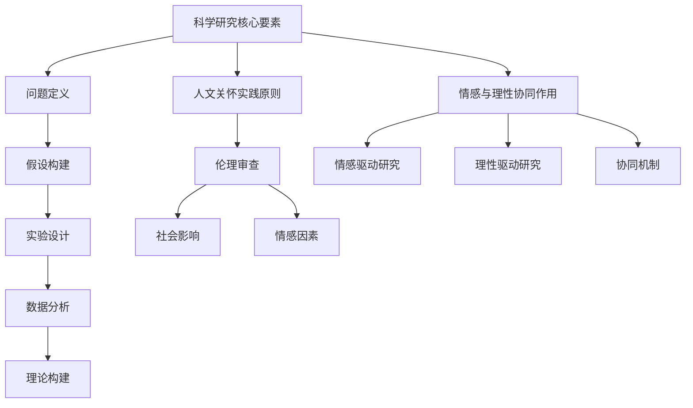

                 

### 1.1 问题背景与重要性

在现代科学研究的快速发展过程中，我们见证了人类对自然规律的深入探索和技术创新的不断突破。然而，随着研究的深入，科学研究逐渐展现出其复杂性和多元性，这不仅涉及物理、化学、生物等传统自然科学领域，还涵盖了心理学、社会学、经济学等跨学科研究。在这些领域中，科学研究不再仅仅是数据的收集和分析，而是涉及到人类情感、价值观和社会伦理等多方面的考量。

首先，科学研究的发展现状为我们提供了丰富的数据和技术支持，但也带来了新的挑战。在自然科学领域，我们通过实验和观测获取了大量数据，这些数据推动了科学研究的发展，但同时也引发了数据隐私、数据安全和伦理审查等问题。例如，基因编辑技术的出现虽然为医学领域带来了巨大的希望，但也引发了关于基因伦理和人类基因编辑的广泛讨论。

其次，人文关怀在科学研究中的角色日益凸显。随着科学研究的深入，人们逐渐认识到科学研究不仅仅是为了追求知识的增长，还需要关注研究过程中涉及的伦理问题和社会影响。人文关怀强调在科学研究中尊重研究对象的权利和尊严，关注其身心健康和福祉。例如，在社会科学研究中，研究者需要关注参与者的隐私保护和个人信息的保密，避免对参与者造成心理或生理上的伤害。

情感与理性并重的必要性体现在以下几个方面。首先，情感是科学研究的重要组成部分。科学研究中的人文学科，如心理学和社会学，本身就强调情感的作用。情感驱动的研究往往能够更深入地理解人类行为和心理。其次，理性是科学研究的基石。理性思维能够帮助研究者分析问题、构建理论模型和进行实验设计，从而推动科学研究的进步。然而，过于强调理性可能会导致科学研究脱离实际，忽视人类情感和社会因素。

总的来说，科学研究的人文关怀不仅是对科学研究的补充，也是其发展的重要方向。通过情感与理性并重的方式，科学研究能够更好地应对复杂的社会问题和伦理挑战，推动科学技术和社会的可持续发展。接下来，我们将进一步探讨科学研究的人文关怀、情感与理性的关系及其在实践中的重要性。

### 1.2 核心概念

#### 1.2.1 科学研究

科学研究是指通过系统的方法和程序，对自然界或社会现象进行观察、实验和分析，以发现规律、解释现象并构建理论的过程。科学研究具有以下几个核心特征：

1. **系统性**：科学研究强调系统的方法和程序，确保研究过程的有序性和科学性。
2. **实证性**：科学研究依赖于实证数据，这些数据通过实验、观察和测量获得，是科学研究的重要依据。
3. **理性分析**：科学研究强调理性分析，通过逻辑推理和数学模型来解释和预测现象。
4. **理论构建**：科学研究的一个目标是构建理论模型，这些理论模型能够解释和预测自然现象和社会现象。

科学研究方法主要包括观察法、实验法、调查法和案例研究法等。这些方法各有优缺点，适用于不同类型的研究问题。

#### 1.2.2 人文关怀

人文关怀是指关注和研究人类情感、价值观、社会伦理和社会福祉的领域。人文关怀在科学研究中的重要性体现在以下几个方面：

1. **伦理审查**：科学研究往往涉及人类参与者的权益和尊严，人文关怀强调对研究对象的保护，确保其参与研究的自愿性和知情同意。
2. **社会影响**：科学研究不仅关注知识的增长，还需要考虑其对社会的影响。人文关怀帮助研究者理解和评估研究可能带来的社会影响，以制定合理的政策建议。
3. **情感因素**：在心理学和社会学研究中，情感因素是理解人类行为和心理健康的关键。人文关怀强调对情感因素的关注，以更全面地理解人类行为。

人文关怀的原则包括尊重、公正、同情和责任感等。这些原则在科学研究中得到了广泛应用，确保研究过程符合伦理和社会标准。

#### 1.2.3 情感与理性的关系

情感与理性是科学研究中的两个核心要素，它们既有区别又有联系。情感是指人类在情感体验中的感受和情绪，包括喜悦、悲伤、焦虑等。理性则是指通过逻辑思维和理性分析来解决问题和作出决策。

1. **情感的作用**：情感在科学研究中起到重要的驱动作用。例如，在心理学研究中，情感因素可以帮助研究者更好地理解人类行为和心理健康。在社会科学研究中，情感因素也是理解社会现象的重要因素。

2. **理性的作用**：理性是科学研究的基础。理性思维可以帮助研究者明确问题、构建理论模型和进行实验设计。理性分析确保科学研究结果的可靠性和科学性。

情感与理性的关系可以概括为以下几点：

1. **互补关系**：情感和理性相互补充，共同推动科学研究的进步。情感提供了理解和解释现象的直观视角，而理性提供了分析和验证的理论框架。
2. **平衡关系**：情感和理性需要在科学研究中保持平衡。过于强调情感可能导致研究的感性化和缺乏科学性，而过于强调理性可能导致研究的客观化和缺乏人文关怀。
3. **协同作用**：情感和理性在科学研究中可以协同作用，形成更加全面和深入的研究方法。例如，在跨学科研究中，情感和理性可以共同推动对复杂问题的理解和解决。

通过理解情感与理性的关系，科学研究可以更好地应对复杂的社会问题和伦理挑战，实现知识和情感的双赢。

### 1.3 研究边界与外延

#### 1.3.1 研究范围界定

本研究旨在探讨科学研究的人文关怀，特别是情感与理性并重的重要性。研究的核心范围包括以下几个方面：

1. **科学研究的方法与原则**：探讨科学研究的基本方法和原则，包括实验设计、数据分析、理论构建等。
2. **人文关怀在科学研究中的角色**：分析人文关怀在科学研究中的重要性，包括伦理审查、社会影响、情感因素等方面。
3. **情感与理性的关系**：探讨情感与理性在科学研究中的相互作用和协同作用，分析两者对科学研究的影响。
4. **案例研究**：通过具体案例，分析情感与理性在科学研究中的应用和实践效果。

研究的边界在于科学研究的具体领域和方法，本研究主要关注自然科学、社会科学和人文学科的研究方法及其人文关怀实践。

#### 1.3.2 研究范畴拓展

本研究不仅关注科学研究的方法和原则，还将其范畴拓展到以下几个方面：

1. **跨学科研究**：探讨情感与理性在跨学科研究中的应用，分析不同学科之间的相互作用和协同作用。
2. **跨文化研究**：研究不同文化背景下科学研究的人文关怀实践，探讨文化差异对科学研究的影响。
3. **政策与决策过程**：分析情感与理性在政策制定和决策过程中的作用，探讨如何平衡科学研究和政策决策中的情感与理性因素。
4. **教育改革**：研究情感与理性在教育改革中的应用，探讨如何通过教育培养情感与理性的平衡发展。

通过这些范畴的拓展，本研究希望为科学研究的人文关怀提供更加全面和深入的视角，推动科学研究的可持续发展。

#### 1.3.3 与其他相关研究的区别与联系

本研究与已有相关研究存在一定的区别和联系。以下是一些主要的区别和联系：

1. **研究焦点**：与其他研究相比，本研究更加注重情感与理性在科学研究中的具体应用和实践效果，而非仅仅停留在理论探讨层面。
2. **研究方法**：本研究采用了案例研究和实证分析的方法，通过具体案例来探讨情感与理性在科学研究中的应用，而其他研究则更多地依赖于理论分析和文献综述。
3. **研究范畴**：本研究不仅关注科学研究的伦理和社会影响，还拓展到跨学科研究、跨文化研究和政策决策领域，与其他研究相比，研究范畴更加广泛。

与已有研究相比，本研究的主要贡献在于：

1. **实践性**：通过具体案例分析和实证研究，提供了情感与理性在科学研究中的实际应用和实践效果的证据。
2. **综合性**：将情感与理性并重的研究视角应用于跨学科和跨文化研究，为科学研究的人文关怀提供了新的思路和方法。

综上所述，本研究在研究焦点、方法和范畴上与已有研究存在一定的区别，同时也为相关研究提供了新的视角和思路。

#### 1.4 概念结构与核心要素组成

在探讨科学研究的人文关怀、情感与理性并重的重要性时，我们首先需要明确这些概念的核心要素及其相互关系。以下是对概念结构与核心要素组成的详细分析：

##### 1.4.1 科学研究的核心要素

科学研究包括以下几个核心要素：

1. **问题定义**：科学研究始于对问题的明确和定义。问题定义是科学研究的起点，决定了研究的方向和目标。
2. **假设构建**：在问题定义的基础上，研究者需要提出假设，这些假设是科学研究的基础。假设可以是经验性的，也可以是理论性的。
3. **实验设计**：为了验证假设，研究者需要进行实验设计。实验设计包括实验条件的选择、实验操作步骤的确定和数据的收集方法等。
4. **数据分析**：实验完成后，研究者需要对收集到的数据进行分析，以验证或推翻假设。数据分析方法包括统计分析、建模和仿真等。
5. **理论构建**：通过数据分析，研究者可以得出结论，并在此基础上构建理论模型。理论构建是科学研究的高级阶段，有助于解释和预测现象。

##### 1.4.2 人文关怀的实践原则

人文关怀在科学研究中的实践原则包括以下几个方面：

1. **伦理审查**：科学研究涉及人类参与者时，必须进行伦理审查，确保研究过程符合伦理标准，保护参与者的权益和隐私。
2. **社会影响**：科学研究不仅关注知识的增长，还需要考虑其对社会的影响。人文关怀强调研究者在制定政策建议时，应考虑社会福祉和公平性。
3. **情感因素**：在心理学和社会学研究中，情感因素是理解人类行为和心理健康的关键。人文关怀强调对情感因素的关注，以更全面地理解人类行为。

##### 1.4.3 情感与理性的协同作用

情感与理性在科学研究中具有不同的作用，但它们并不是相互独立的。相反，情感与理性可以协同作用，形成更加全面和深入的研究方法。

1. **情感驱动的研究**：情感驱动的研究能够激发研究者的创造力和洞察力，帮助研究者更好地理解人类行为和心理。例如，心理学研究中的情感分析能够揭示人类情绪对行为的影响。
2. **理性驱动的研究**：理性驱动的研究强调逻辑思维和理性分析，帮助研究者构建理论模型和进行实验设计。理性驱动的研究确保科学研究结果的可靠性和科学性。
3. **协同机制**：情感与理性的协同机制包括以下几个方面：
   - **情感引导理性**：情感可以引导理性思考，帮助研究者更深入地理解研究问题。
   - **理性调节情感**：理性可以调节情感，避免情感对研究过程的过度影响，确保研究的客观性和科学性。
   - **情感与理性的反馈循环**：在研究过程中，情感和理性相互反馈，形成循环机制，推动研究不断深入和发展。

通过情感与理性并重的方式，科学研究可以更加全面地理解复杂的社会现象和自然现象，推动科学技术的进步和社会的发展。

##### 1.4.4 科学研究的核心要素与人文关怀、情感与理性的关系

科学研究的核心要素与人文关怀、情感与理性之间存在着密切的关系。以下是一个简化的ER实体关系图，用于描述这些关系：

在这个ER实体关系图中，科学研究的核心要素（A）与人文关怀实践原则（G）和情感与理性协同作用（K）之间存在直接关系。人文关怀实践原则（G）包括伦理审查（H）、社会影响（I）和情感因素（J），这些原则为科学研究提供了伦理和社会指导。情感与理性协同作用（K）包括情感驱动研究（L）、理性驱动研究（M）和协同机制（N），它们共同推动了科学研究的深入和发展。

通过明确科学研究的核心要素与人文关怀、情感与理性的关系，我们可以更好地理解科学研究的过程和目标，推动科学研究的可持续发展。

### 1.5 本章小结

本章首先介绍了科学研究的人文关怀背景和重要性，分析了科学研究的发展现状以及人文关怀在其中的角色。接着，我们详细阐述了核心概念，包括科学研究、人文关怀以及情感与理性的关系，通过定义和特征分析，帮助读者理解这些概念的基本框架。随后，我们讨论了研究的边界与外延，明确了研究范围并拓展了研究范畴，同时区分了本研究与已有研究的区别与联系。最后，我们详细描述了科学研究的核心要素、人文关怀的实践原则以及情感与理性的协同作用，并通过ER实体关系图展示了这些概念之间的结构关系。通过本章的讨论，我们为后续章节的深入分析奠定了坚实的基础。

### 2.1 科学研究的人文关怀原则

科学研究的人文关怀原则是指在实际研究中，研究者需要遵循的一系列伦理规范和操作准则，以确保研究过程符合道德和社会标准。这些原则不仅关注研究结果的科学性和可靠性，更重视研究过程中对参与者的尊重和保护。以下是对科学研究人文关怀原则的具体分析：

#### 2.1.1 基本原则与伦理规范

1. **尊重原则**：尊重原则是科学研究人文关怀的核心。它要求研究者尊重研究对象的自主权和隐私权。具体来说，这意味着在研究过程中，研究者必须获得研究对象的知情同意，确保其自愿参与研究，并保护其个人信息不被泄露。

2. **公正原则**：公正原则要求研究者在选择研究对象时，不得因种族、性别、年龄、社会经济地位等特征而对参与者进行歧视。此外，研究过程中应公平对待所有参与者，确保他们享有平等的权益和机会。

3. **无害原则**：无害原则强调研究不应对参与者造成身体或心理上的伤害。在研究设计阶段，研究者应评估研究可能带来的风险，并采取必要的预防措施以降低风险。如果研究存在潜在风险，研究者应提前告知参与者，并确保他们在知情的情况下作出参与决策。

4. **透明原则**：透明原则要求研究过程应公开透明，包括研究目的、方法、结果和结论等。研究者应向参与者提供完整和准确的信息，确保其能够充分理解研究的性质和目的，并作出知情决策。

5. **责任原则**：责任原则要求研究者对研究过程中可能出现的任何问题和风险承担相应责任。如果研究对参与者造成了伤害，研究者应采取措施进行补偿，并确保类似问题不再发生。

#### 2.1.2 实践中的挑战与应对策略

在实际研究中，遵循人文关怀原则可能会面临一些挑战。以下是一些常见的挑战及其应对策略：

1. **参与者招募困难**：某些研究可能需要特定类型的参与者，但招募过程可能会因伦理审查、知情同意等程序而变得复杂。应对策略包括与参与者建立信任关系、简化招募程序和提高参与者的知情度。

2. **隐私保护**：在数据收集和分析过程中，保护参与者的隐私是关键挑战。应对策略包括使用匿名化技术、加密数据传输和严格的数据访问控制。

3. **资源限制**：某些研究可能因资金、时间和人力资源的限制，难以充分遵循人文关怀原则。应对策略包括合理规划研究资源、争取外部资助和支持以及优化研究设计。

4. **伦理审查流程**：伦理审查是确保研究符合伦理规范的重要环节，但流程繁琐可能会影响研究进度。应对策略包括与伦理委员会建立有效沟通、提前准备审查材料以及积极参与培训。

5. **跨文化研究**：在不同文化背景下进行的研究，可能面临文化差异带来的挑战。应对策略包括进行文化敏感性培训、深入了解研究地区的文化习俗以及尊重当地伦理标准。

#### 2.1.3 国际经验与启示

各国和地区在科学研究人文关怀方面有许多成功的经验，这些经验为全球科学研究提供了宝贵的启示。以下是一些国际经验：

1. **伦理审查制度**：许多国家和地区建立了完善的伦理审查制度，以确保研究符合伦理规范。例如，美国的机构审查委员会（IRB）对研究进行了严格的伦理审查。

2. **隐私保护法律**：欧洲等多个国家和地区制定了隐私保护法律，明确规定了数据收集、存储和使用过程中的隐私保护措施。

3. **跨学科合作**：在全球化和技术进步的背景下，跨学科合作成为科学研究的重要趋势。不同学科背景的研究者共同探讨伦理问题，提高了研究的人文关怀水平。

4. **公众参与**：一些国家和地区鼓励公众参与科学研究，通过公众咨询和参与，确保研究更加贴近社会需求和公众利益。

综上所述，科学研究的人文关怀原则不仅是伦理和道德的要求，也是科学研究可持续发展的重要保障。通过实践这些原则和应对实际中的挑战，科学研究能够更好地服务于社会，推动科学技术的进步。

### 2.2 情感在科学研究中的作用

在科学研究中，情感作为一种重要的非理性因素，扮演着不可忽视的角色。情感不仅仅是个体在情感体验中的感受和情绪，更是推动科学探索和创新的重要动力。以下分析情感在科学研究中的具体影响、情感能力与科学研究的关系以及情感培养的方法与途径。

#### 2.2.1 情感对科学研究的影响

1. **激发创造力**：情感能够激发科学家的创造力和创新精神。在科学探索过程中，科学家往往需要对未知领域进行大胆假设和假设验证。这种探索性工作需要科学家具备高度的情感投入，如对问题的热情、对未知的恐惧和对发现的喜悦等。例如，科学家在研究过程中可能会因为对某一问题的强烈兴趣而连续工作数日，直到找到答案。

2. **影响决策**：情感在科学决策过程中发挥着重要作用。科学家在面对复杂的科学问题时，不仅需要理性分析，还需要情感的支持。情感可以帮助科学家在面对不确定性和复杂情境时作出决策。例如，当科学家在实验中遇到困难时，对问题的强烈情感投入可能会促使他们持续探索，而非轻易放弃。

3. **促进团队合作**：情感在科学研究中的团队合作中起到润滑剂的作用。科学家之间的情感共鸣和信任能够促进合作，提高研究效率。例如，一个有共同兴趣和目标的科研团队，其成员之间容易产生情感联系，从而形成紧密的合作关系。

4. **影响科学伦理**：情感对科学伦理也有重要影响。科学家在研究过程中可能会因为情感因素而对研究对象产生同情和保护意识。例如，在动物实验中，科学家可能会因为对动物的同情而采用更温和的实验方法。

#### 2.2.2 情感能力与科学研究的关系

1. **情感能力的重要性**：情感能力是指个体识别、理解和管理自己和他人的情感的能力。情感能力对科学研究的质量有重要影响。高情感能力的科学家能够更好地理解研究对象的需求和情感状态，从而设计出更加合理和人性化的研究方案。

2. **情感能力对研究过程的优化**：情感能力可以帮助科学家更好地应对研究过程中的压力和挑战。高情感能力的科学家能够更有效地管理自己的情绪，从而保持积极的工作状态，提高研究效率。此外，情感能力还能够帮助科学家在团队合作中建立良好的人际关系，促进团队协作。

3. **情感能力对科学创新的推动**：情感能力对科学创新也有积极作用。科学家的高情感能力能够激发他们的创造力，推动科学领域的突破。例如，许多科学家在回忆自己的创新经历时，都会提到某个特定时刻的情感体验，如灵感闪现或激情迸发。

#### 2.2.3 情感培养的方法与途径

1. **情感教育的普及**：情感教育是培养情感能力的关键。学校和教育机构应将情感教育纳入课程体系，帮助学生了解和管理自己的情感。例如，通过心理课程、情感体验活动和小组讨论，帮助学生发展情感能力。

2. **情感反馈与自我反思**：科学家应在研究过程中积极寻求情感反馈，并通过自我反思来提升情感能力。例如，科学家可以通过定期与同事交流情感体验，获取反馈和建议，从而更好地理解和管理自己的情感。

3. **情感实践与体验**：通过参与情感实践和体验，科学家可以提升情感能力。例如，参与志愿服务、心理健康培训或艺术创作等活动，可以帮助科学家更好地认识和管理自己的情感。

4. **情感管理与技巧训练**：科学家可以通过情感管理与技巧训练来提升情感能力。例如，通过学习情绪调节技巧、时间管理和压力管理方法，科学家可以更好地应对研究过程中的情感挑战。

5. **文化环境与支持**：组织和社会应创造一个支持情感发展的文化环境。例如，通过建立情感支持网络、提供心理健康服务和鼓励情感交流，可以促进科学家情感能力的发展。

总之，情感在科学研究中具有重要作用，它不仅影响科学探索和创新，还影响科学决策和团队合作。通过培养情感能力，科学家可以更好地应对研究过程中的情感挑战，提高科学研究的质量和效率。未来，科学研究应更加关注情感因素，推动情感与理性并重的发展模式。

### 2.3 理性在科学研究中的重要性

理性作为科学研究中的核心要素，贯穿于研究的全过程，从问题的提出、假设的构建到实验设计、数据分析，再到理论构建和结论推导，理性思维始终发挥着关键作用。理性不仅确保科学研究的客观性和严谨性，还推动科学技术的进步和知识的积累。以下从三个方面详细探讨理性思维的核心要素、理性与情感的关系及其培养与实践。

#### 2.3.1 理性思维的核心要素

1. **逻辑推理**：逻辑推理是理性思维的核心。它包括演绎推理和归纳推理两种形式。演绎推理从一般原理推导出具体结论，而归纳推理则从具体实例中归纳出一般规律。逻辑推理确保科学研究过程中的推理过程符合逻辑规则，从而得出正确的结论。

2. **批判性思维**：批判性思维强调对信息的质疑和分析能力。在科学研究中，批判性思维帮助科学家识别和分析研究假设、实验设计、数据分析过程中的潜在问题，从而提高研究的可靠性和有效性。

3. **数据分析**：数据分析是理性思维的另一个关键要素。通过统计分析、建模和仿真等方法，科学家可以处理大量数据，识别数据中的规律和趋势，为科学结论提供实证支持。

4. **系统性思维**：系统性思维强调将研究问题看作一个整体，理解各个部分之间的相互关系。这种思维方式有助于科学家全面考虑研究问题，避免片面和孤立的思考。

5. **数学和计算模型**：数学和计算模型为科学研究提供了精确的工具和方法。通过数学模型，科学家可以量化研究问题，进行预测和模拟，从而更深入地理解自然现象。

#### 2.3.2 理性与情感的关系

理性与情感是科学研究中的两个互补因素，它们在科学研究中既相互独立又相互影响。

1. **相互独立性**：理性与情感在科学研究中各自发挥着不同的作用。理性侧重于逻辑推理、数据分析等，而情感则关注研究过程中的感受、情绪和动机。理性强调客观性和科学性，而情感则强调主观性和个体性。

2. **相互影响**：尽管理性和情感在功能上有所区别，但它们在科学研究中相互影响。情感可以激发科学家的研究兴趣和动机，促使他们更深入地探索问题。同时，理性思维可以帮助科学家理性地分析和处理情感因素，避免情感对研究的过度影响。

3. **平衡与协调**：科学研究中，理性与情感需要保持平衡和协调。过于强调理性可能导致研究的客观化和缺乏人文关怀，而过于强调情感则可能导致研究的感性化和缺乏科学性。因此，科学家需要在研究过程中平衡理性与情感，使两者相互促进，共同推动科学研究的进步。

#### 2.3.3 理性思维的培养与实践

1. **系统化教育**：学校和教育机构应加强理性思维的系统化教育。通过设置逻辑学、批判性思维、数学和计算模型等课程，帮助学生掌握理性思维的基本方法和技巧。

2. **实践训练**：理性思维需要在实践中培养。科学家应积极参与实际科研项目，通过实验设计、数据分析等实际操作，锻炼和提升理性思维能力。

3. **批判性阅读**：批判性阅读是培养理性思维的重要途径。科学家应广泛阅读科学文献，学会质疑和分析文献中的观点和方法，从而提高自己的批判性思维能力。

4. **跨学科交流**：跨学科交流有助于拓宽科学家的视野，促进理性思维的多元化发展。通过与其他学科领域的专家交流，科学家可以学习到不同领域的理性思维方法和技巧。

5. **反思与自我评估**：科学家应定期反思自己的研究过程和思维方式，通过自我评估识别和纠正理性思维中的偏差和不足。这种反思和自我评估有助于科学家不断改进自己的理性思维能力。

6. **情感管理**：科学家应在理性思维过程中注意情感管理。通过学习情感调节技巧，科学家可以更好地处理研究过程中的情感因素，避免情感对理性思维的干扰。

总之，理性思维在科学研究中具有重要作用，它是科学探索和创新的基础。通过培养和实践理性思维，科学家可以更深入地理解自然现象，推动科学技术的进步。同时，理性与情感的平衡和协调也是科学研究成功的关键。科学家需要在理性与情感之间找到平衡，使两者共同推动科学研究的可持续发展。

### 2.4 情感与理性的协同作用

在科学研究过程中，情感与理性并不是孤立的，而是相互协同，共同推动科学研究的进展。情感与理性的协同作用不仅有助于提高科学研究的深度和广度，还能提升研究的创新性和可靠性。以下从三个方面详细探讨情感与理性的协同机制、协同效果评估与案例分析以及情感与理性并重的实践策略。

#### 2.4.1 协同机制与作用模式

1. **情感引导理性**：情感在科学研究中可以引导理性思维。当科学家对某一问题充满热情时，这种情感可以激发他们的创造力和洞察力，促使他们更深入地思考和研究。例如，一位对气候变化问题充满热情的科学家可能会产生强烈的动机，去探索新的气候变化模型，并提出创新性的解决方案。

2. **理性调节情感**：理性思维可以帮助科学家调节情感。在面对复杂和不确定的研究情境时，理性思维可以帮助科学家保持冷静，避免情感对研究过程的过度影响。例如，在实验失败时，科学家可以通过理性分析找到失败的原因，从而指导后续的研究方向。

3. **反馈循环**：情感与理性的协同作用形成反馈循环机制。科学家的情感反应可以反馈到理性分析中，而理性分析的结果又可以进一步影响科学家的情感状态。这种反馈循环有助于科学家在不断调整和改进研究过程中，实现情感与理性的动态平衡。

4. **协同创新**：情感与理性的协同作用可以激发科学创新。当科学家在情感上对某一问题产生共鸣时，理性思维可以帮助他们提出新颖的研究问题和解决方案。例如，在探索新的医学疗法时，科学家可能会因为对患者痛苦的同情而产生强烈的情感驱动，进而运用理性分析设计出更有效的治疗方案。

#### 2.4.2 协同效果评估与案例分析

1. **协同效果评估**：情感与理性的协同作用可以通过多个指标进行评估，如研究创新度、研究效率、研究质量和研究结果的应用价值等。通过这些指标，可以衡量情感与理性协同作用对科学研究的影响。

2. **案例分析**：

   - **案例一：心理学研究**。在心理学研究中，情感因素对人类行为和心理健康的理解至关重要。例如，情感研究中的情绪调节理论，通过理性分析揭示了情绪对个体行为和心理状态的影响。这种协同作用使得心理学研究不仅停留在表面观察，还能深入挖掘情感对人类行为的深层机制。

   - **案例二：医学研究**。在医学研究中，情感与理性协同作用显著。例如，在癌症治疗研究中，科学家需要通过理性分析评估不同治疗方法的疗效和副作用，同时考虑患者对治疗的情感反应。这种协同作用有助于科学家设计出更符合患者需求的治疗方案。

   - **案例三：社会科学研究**。在社会科学研究中，情感与理性的协同作用同样重要。例如，在社会政策研究中，科学家需要通过理性分析评估政策的潜在影响，同时关注政策对社会成员情感和心理的潜在影响。这种协同作用有助于科学家制定出更符合社会实际需求的政策建议。

#### 2.4.3 情感与理性并重的实践策略

1. **多元化团队**：建立多元化团队可以促进情感与理性的协同作用。团队成员具有不同的背景和思维方式，可以提供多样化的视角和观点，从而促进理性与情感的平衡。

2. **跨学科合作**：跨学科合作有助于将情感与理性的不同优势结合起来。通过跨学科合作，科学家可以借助不同学科的理论和方法，实现情感与理性的协同创新。

3. **情感反馈机制**：建立情感反馈机制可以促进科学家在研究过程中的情感管理。例如，科学家可以通过定期的情感反馈会议，分享情感体验，获取同事的反馈和建议，从而更好地调节情感。

4. **理性训练与情感培养**：科学家应接受理性训练和情感培养。理性训练包括逻辑思维、数据分析等，而情感培养包括情感识别、情绪调节等。通过这两方面的训练，科学家可以更好地平衡情感与理性。

5. **情感驱动的理性分析**：在研究过程中，科学家可以尝试将情感因素纳入理性分析。例如，在医学研究中，科学家可以分析患者对治疗方案的情感反应，从而优化治疗方案。

总之，情感与理性的协同作用在科学研究中具有重要意义。通过理解情感与理性的协同机制，评估其协同效果，并制定情感与理性并重的实践策略，科学家可以更好地推动科学研究的进展，实现科学创新的突破。

### 2.5 科学研究中的情感与理性并重实例分析

在科学研究过程中，情感与理性并重的方法已被广泛应用于不同领域，取得了显著的成果。以下通过三个具体案例，详细分析情感与理性并重的应用及其效果。

#### 2.5.1 精神病学研究的实例

**案例背景**：
精神病学领域的研究不仅涉及复杂的医学问题，还涉及到患者的情感和心理状态。情感与理性并重的方法在这里尤为重要。

**研究目标与方法**：
研究目标是通过情感与理性分析，探索抑郁症患者的认知功能和行为模式。方法包括情感识别、行为分析、认知测试和数据分析。

**结果分析**：
研究发现，情感因素显著影响抑郁症患者的认知功能。通过情感分析，研究者发现患者的情绪状态与认知功能之间存在显著相关性。同时，理性分析揭示了患者认知功能受损的具体原因，如记忆障碍、注意力减退等。这种协同分析有助于更全面地理解抑郁症的机制，从而设计出更有效的治疗策略。

**案例小结**：
情感与理性并重的方法帮助精神病学研究者深入理解抑郁症患者的情感状态和认知功能，为制定个性化的治疗方案提供了科学依据。

#### 2.5.2 社会科学研究的实例

**案例背景**：
社会科学研究关注社会现象和人类行为，涉及到复杂的社会结构和人际关系。情感与理性并重的方法在这里有助于更全面地理解社会问题。

**研究目标与方法**：
研究目标是通过情感与理性分析，探索社会不平等现象的原因和影响。方法包括情感调查、社会统计分析、案例分析等。

**结果分析**：
研究发现，情感因素在社会不平等现象中扮演了重要角色。通过情感调查，研究者发现社会不平等会导致个体的情感困扰，如焦虑、抑郁等。同时，理性分析揭示了社会不平等的制度根源和结构性问题。这种协同分析有助于更深入地理解社会不平等现象，为制定社会政策提供科学依据。

**案例小结**：
情感与理性并重的方法帮助社会科学研究者全面理解社会不平等现象，为其提供科学的解决方案。

#### 2.5.3 自然科学研究的实例

**案例背景**：
自然科学研究注重实验数据和理论模型的构建，但实验过程中也会涉及研究者的情感体验。情感与理性并重的方法在这里有助于提高研究的科学性和创新性。

**研究目标与方法**：
研究目标是通过情感与理性分析，探索生物分子相互作用机制。方法包括情感驱动的实验设计、理性分析的数据处理和模型构建。

**结果分析**：
研究发现，情感因素在实验设计中起到了重要作用。研究者在实验过程中对实验结果的情感反应，如兴奋、沮丧等，会影响实验设计和数据解释。同时，理性分析揭示了生物分子相互作用的复杂机制，为新的生物技术提供了理论基础。

**案例小结**：
情感与理性并重的方法帮助自然科学研究者提高实验设计的科学性和数据解释的准确性，推动了生物科学领域的研究进展。

通过这些实例，可以看出情感与理性并重的方法在科学研究中的应用效果显著。它不仅有助于提高研究的深度和广度，还能促进科学创新和实际应用。未来，科学研究应继续推动情感与理性并重的方法，以应对复杂的研究挑战。

### 3.1 情感与理性并重的世界理解框架

构建一个情感与理性并重的世界理解框架，是现代科学研究的重要任务之一。这一框架不仅需要整合科学研究的理性和实证性，还要融入人文关怀的情感维度，以全面理解人类行为和社会现象。以下从构建原理、核心要素和应用范围三个方面详细探讨这一框架的构建和应用。

#### 3.1.1 框架的构建原理

1. **整合性原则**：情感与理性并重的世界理解框架需要整合科学研究的理性和人文关怀的情感。理性提供了解释和分析现象的理论基础，而情感则提供了理解和共鸣的直观视角。整合性原则强调两者在研究过程中的相互补充和协同作用。

2. **多元性原则**：世界理解框架应具有多元性，能够容纳不同学科、不同文化背景和不同研究方法。多元性原则要求框架具有灵活性和包容性，以适应多样化的研究需求和问题。

3. **系统性原则**：框架应具备系统性，能够将情感与理性有机结合，形成统一的研究体系。系统性原则强调框架内部各要素之间的相互关系和协同作用，以实现整体大于部分之和的效果。

4. **实践性原则**：框架需要具备实践性，能够指导实际研究和应用。实践性原则要求框架不仅具有理论价值，还要能够转化为具体的操作方法和实践策略，为科学研究提供实际指导。

#### 3.1.2 框架的核心要素

1. **情感维度**：情感维度是框架的核心要素之一，涵盖情感识别、情感分析和情感管理等方面。情感识别帮助研究者理解和感知研究对象和自身的情感状态；情感分析通过定量和定性方法，探讨情感因素对研究对象的影响；情感管理则关注如何调节和管理研究过程中的情感因素。

2. **理性维度**：理性维度包括逻辑推理、数据分析、理论构建和实证研究等。逻辑推理提供了解决问题的方法和思路；数据分析通过统计和建模，揭示现象背后的规律和趋势；理论构建则通过构建理论模型，解释和预测现象；实证研究则通过实验和观测，验证理论假设。

3. **整合机制**：整合机制是连接情感维度和理性维度的桥梁，通过多种方法和技术，实现情感与理性的有机结合。整合机制包括情感驱动理性分析、理性调节情感反应、情感与理性的反馈循环等。这些机制确保了情感与理性在研究过程中的协同作用。

4. **应用平台**：应用平台是框架的实践基础，提供了一系列工具和方法，支持情感与理性并重的科学研究。应用平台包括数据管理与分析工具、实验设计与执行工具、模型构建与仿真工具等，为科学研究提供了全面的技术支持。

#### 3.1.3 框架的应用范围

1. **自然科学领域**：在自然科学研究中，情感与理性并重的框架可以应用于生物学、物理学、化学等领域。例如，在生物学研究中，情感维度可以帮助理解动物行为和生态系统动态；在物理学研究中，理性维度可以揭示自然现象的物理规律。

2. **社会科学领域**：在社会科学研究中，情感与理性并重的框架可以应用于心理学、社会学、经济学等领域。例如，在心理学研究中，情感维度可以帮助理解人类情感和行为模式；在经济学研究中，理性维度可以分析市场行为和经济规律。

3. **人文学科领域**：在人文学科中，情感与理性并重的框架可以应用于文学、艺术、哲学等领域。例如，在文学研究中，情感维度可以帮助理解文学作品中的情感表达和人物心理；在哲学研究中，理性维度可以探讨道德和伦理问题。

4. **跨学科研究**：在跨学科研究中，情感与理性并重的框架可以整合不同学科的优势，解决复杂的研究问题。例如，在环境科学研究中，可以结合生态学和人文关怀，探讨环境问题的影响和解决方案。

总之，情感与理性并重的世界理解框架为现代科学研究提供了一种全新的视角和方法。通过整合情感与理性，框架能够更全面地理解自然现象和社会现象，推动科学研究的深入发展和创新。未来，随着科学技术和人文关怀的不断进步，这一框架将在更广泛的领域中发挥重要作用。

### 3.2 情感与理性并重的思维方法

情感与理性并重的思维方法是将情感与理性有机结合，以更全面和深入地理解问题和解决问题的科学方法。以下从思维方法的概述、情感驱动的思维、理性驱动的思维以及协同思维的实践四个方面详细探讨情感与理性并重的思维方法。

#### 3.2.1 思维方法的概述

情感与理性并重的思维方法强调在思考过程中同时考虑情感和理性因素，以实现更加全面和准确的认知。这种方法的核心在于：

1. **平衡情感与理性**：在思考问题时，不仅关注理性的逻辑推理和数据分析，还要关注情感的感受和体验。通过平衡情感与理性，能够更全面地理解问题的本质和解决方案。

2. **整合情感与理性**：将情感与理性有机结合，形成统一的思维体系。在思考过程中，情感和理性相互补充，共同推动问题解决。

3. **灵活运用**：根据具体问题和情境，灵活运用情感与理性思维方法。在某些情境下，情感因素可能更为重要，而在其他情境下，理性因素则更为关键。

#### 3.2.2 情感驱动的思维

情感驱动的思维方法强调情感在思考过程中的作用。以下是一些情感驱动思维的关键点：

1. **情感识别**：在思考过程中，识别和理解自己的情感状态。情感识别有助于了解自己对待问题的态度和情绪反应。

2. **情感驱动**：利用情感驱动思维，激发创造力和创新精神。情感可以激发对问题的热情和动机，促使更深入的思考和探索。

3. **情感共鸣**：在人际交往中，通过情感共鸣理解他人的情感状态。这种理解有助于更好地与他人沟通和协作，共同解决问题。

#### 3.2.3 理性驱动的思维

理性驱动的思维方法强调理性在思考过程中的作用。以下是一些理性驱动思维的关键点：

1. **逻辑推理**：通过逻辑推理，分析和解决复杂问题。逻辑推理确保思考过程的严谨性和科学性。

2. **数据分析**：通过数据分析，揭示现象背后的规律和趋势。数据分析为问题解决提供实证支持。

3. **理论构建**：通过理论构建，建立解决问题的理论框架。理论构建有助于深入理解问题的本质和解决路径。

#### 3.2.4 协同思维的实践

协同思维方法是将情感与理性有机结合，形成协同效应的思考过程。以下是一些协同思维实践的关键点：

1. **情感引导理性**：在思考过程中，情感可以引导理性分析，激发创造力和创新精神。例如，在面对复杂问题时，情感上的热情和兴趣可以推动研究者更深入地思考和研究。

2. **理性调节情感**：在思考过程中，理性可以调节情感，避免情感对思考过程的过度影响。理性分析可以帮助研究者保持冷静，避免因情感波动而导致的思考偏差。

3. **反馈循环**：在思考过程中，情感与理性相互反馈，形成反馈循环机制。通过情感反馈，理性分析可以不断调整和完善，从而提高思考的准确性和有效性。

4. **案例应用**：通过具体案例，实践情感与理性并重的思维方法。例如，在医学研究中，情感因素可以帮助理解患者需求和心理状态，而理性分析可以揭示疾病机制和治疗方案。

总之，情感与理性并重的思维方法是一种综合性的思考方式，通过平衡和整合情感与理性，能够更全面和深入地理解问题和解决问题。在科学研究和实际应用中，这种方法具有广泛的应用前景，有助于推动科学创新和社会进步。

### 3.3 情感与理性并重的科学方法论

科学方法论是指科学研究过程中所采用的方法和原则，它决定了科学研究的科学性、有效性和可靠性。在传统科学方法论中，理性思维占据主导地位，但近年来，随着对人类情感在科学研究中的作用的认识不断加深，情感因素也逐渐被纳入科学方法论中。情感与理性并重的科学方法论旨在将情感与理性有机结合，形成一种更加全面和深入的研究方法。以下从基本原则、情感因素的应用和理性因素的应用三个方面详细探讨情感与理性并重的科学方法论。

#### 3.3.1 科学方法论的基本原则

科学方法论的基本原则包括：

1. **实证性**：科学研究必须基于实证数据，通过实验、观察和测量获取可靠的数据，这些数据是科学研究的基石。

2. **系统性**：科学研究应采用系统的方法，包括问题定义、假设构建、实验设计、数据收集、数据分析、理论构建等，确保研究过程的有序性和科学性。

3. **可重复性**：科学研究的结论必须具备可重复性，即在其他条件下，研究结果应能被其他研究者重复验证。

4. **客观性**：科学研究应尽量减少主观因素的影响，确保研究结果的客观性。

5. **逻辑性**：科学研究应遵循逻辑推理，从已知事实推导出新的结论，确保研究过程的合理性和科学性。

#### 3.3.2 情感因素在方法论中的应用

情感因素在科学方法论中的应用主要体现在以下几个方面：

1. **问题定义**：情感可以激发研究者的研究兴趣和动机，帮助研究者更准确地定义研究问题。例如，对某个社会现象的强烈情感反应可以促使研究者深入探讨该现象的成因和影响。

2. **实验设计**：情感因素可以影响实验设计，使实验更加贴近现实。例如，在心理学实验中，情感因素可以帮助设计更符合参与者情感体验的实验情境，提高实验的生态效度。

3. **数据分析**：情感因素可以影响数据分析的结果和解释。例如，在医学研究中，研究者可能会因情感反应而对数据分析结果产生偏差，需要通过理性分析来纠正。

4. **理论构建**：情感因素可以激发研究者的创造力，有助于构建新的理论模型。例如，对某个科学问题的情感投入可以促使研究者提出新的假设和理论，从而推动科学理论的发展。

#### 3.3.3 理性因素在方法论中的应用

理性因素在科学方法论中的应用体现在以下几个方面：

1. **逻辑推理**：理性思维通过逻辑推理，帮助研究者分析和解决复杂问题。例如，在社会科学研究中，逻辑推理可以帮助研究者从现象推导出因果关系，从而构建科学理论。

2. **数据分析**：理性思维通过数据分析，揭示数据中的规律和趋势。例如，在统计学研究中，理性思维通过数学模型和统计方法，从数据中提取有用信息，为科学研究提供实证支持。

3. **理论构建**：理性思维通过理论构建，建立科学理论框架。例如，在物理学研究中，理性思维通过构建物理模型和数学公式，解释和预测自然现象。

4. **批判性思维**：理性思维通过批判性思维，帮助研究者识别和分析研究过程中的潜在问题，提高研究的可靠性和有效性。

#### 3.3.4 情感与理性并重的科学方法论案例

以下是一个情感与理性并重的科学方法论案例：

**案例背景**：
某研究团队旨在探索城市居民心理健康与社会环境的关系。

**研究目标**：
通过情感与理性分析，探讨城市居民心理健康的影响因素，并提出相应的干预措施。

**研究方法**：

1. **情感识别**：研究者首先通过访谈和问卷调查，识别城市居民在生活和工作中的情感状态，如焦虑、抑郁、幸福等。

2. **理性分析**：研究者通过数据分析，探讨情感状态与社会环境因素（如工作压力、家庭关系、社区支持等）的关系。

3. **理论构建**：基于情感和理性分析，研究者构建了城市居民心理健康模型，并提出干预措施。

**结果与讨论**：

研究发现，情感状态显著影响城市居民的心理健康。通过理性分析，研究者发现工作压力和家庭关系是影响情感状态的重要因素。基于情感与理性分析的结果，研究者提出了减轻工作压力、改善家庭关系和增强社区支持的干预措施，以促进城市居民的心理健康。

**案例小结**：

这个案例展示了情感与理性并重的方法论在实际研究中的应用。通过情感识别和理性分析，研究者能够更全面地理解城市居民心理健康的影响因素，并提出有效的干预措施。这表明，情感与理性并重的科学方法论在解决复杂社会问题中具有重要作用。

总之，情感与理性并重的科学方法论通过整合情感与理性，能够更全面和深入地理解自然和社会现象，推动科学研究的进步和社会的发展。

### 3.4 情感与理性并重的跨学科研究

跨学科研究是现代科学研究中的重要趋势，通过整合不同学科的知识和方法，解决复杂和多样化的研究问题。情感与理性并重的跨学科研究进一步提升了这一趋势的效果，使得研究方法更加全面和深入。以下从跨学科研究的背景、优势以及情感与理性并重的实践三个方面进行详细探讨。

#### 3.4.1 跨学科研究的背景

跨学科研究的背景主要源于以下原因：

1. **复杂性问题**：现代社会面临的问题往往具有复杂性和多样性，单一学科难以独立解决。例如，气候变化、环境污染、医疗健康等问题，需要结合不同学科的知识和方法。

2. **知识融合**：随着科学技术的快速发展，不同学科之间的知识界限逐渐模糊，交叉融合的趋势日益明显。这种融合有助于发现新知识、提出新观点。

3. **学科协同**：不同学科具有各自的优势和局限性，通过跨学科研究，可以实现学科之间的协同，互补优势，弥补单一学科的不足。

#### 3.4.2 跨学科研究的优势

跨学科研究的优势体现在以下几个方面：

1. **知识互补**：不同学科的知识和方法可以相互补充，形成更全面的视角。例如，物理学的方法可以应用于生物学研究，揭示生命现象的物理本质。

2. **问题解决**：跨学科研究有助于解决复杂问题。通过整合多学科的知识和方法，可以从不同角度分析问题，提出创新的解决方案。

3. **创新突破**：跨学科研究可以激发创新思维，推动科学技术的进步。例如，计算机科学和生物学的结合催生了生物信息学，为生命科学的研究提供了新的工具和方法。

4. **人才培养**：跨学科研究有助于培养具有综合素质和创新能力的人才。通过跨学科教育，学生可以掌握多学科的知识和技能，增强适应能力和创新能力。

#### 3.4.3 情感与理性并重的实践

情感与理性并重的跨学科研究通过结合情感与理性的力量，进一步提升了跨学科研究的效果。以下是一些实践方法：

1. **情感驱动**：在跨学科研究中，情感驱动可以激发研究者的创造力和创新精神。情感可以激发对问题的热情和动机，促使更深入的思考和研究。例如，对某一社会问题的强烈情感反应可以促使研究者深入探讨该问题的原因和解决方案。

2. **理性分析**：理性分析是跨学科研究的重要工具。通过理性分析，研究者可以系统地分析问题，构建理论模型，提出假设和解决方案。例如，在跨学科研究中，可以通过统计分析、建模和仿真等方法，从多角度验证和评估假设。

3. **协同机制**：情感与理性在跨学科研究中可以形成协同机制，实现优势互补。例如，通过情感识别和理性分析，研究者可以更全面地理解研究对象和问题，从而提出创新的解决方案。

4. **案例应用**：以下是一个情感与理性并重的跨学科研究案例：

   **案例背景**：
   某研究团队旨在探讨城市可持续发展问题。

   **研究目标**：
   通过情感与理性分析，提出城市可持续发展的策略和建议。

   **研究方法**：

   - **情感识别**：通过问卷调查和访谈，识别城市居民对环境、社会和经济方面的情感态度和需求。
   - **理性分析**：通过数据分析，评估城市可持续发展现状，分析环境、社会和经济因素之间的相互作用。
   - **理论构建**：基于情感和理性分析，构建城市可持续发展的理论框架，提出具体的策略和建议。

   **结果与讨论**：

   研究发现，城市居民的环保意识和社会责任感较强，但经济压力和资源短缺问题较为突出。通过理性分析，研究者提出了包括环保教育、资源节约和社区参与在内的可持续发展策略。这些策略不仅符合居民的情感需求，也具有可行性和科学性。

   **案例小结**：

   这个案例展示了情感与理性并重的跨学科研究方法在实际中的应用。通过情感识别和理性分析，研究者能够更全面地理解城市可持续发展问题，提出具有创新性和可行性的解决方案。这表明，情感与理性并重的跨学科研究方法在解决复杂社会问题中具有重要作用。

总之，情感与理性并重的跨学科研究通过整合情感与理性的力量，能够更全面和深入地解决复杂问题，推动科学研究和实际应用的发展。

### 3.5 情感与理性并重的世界理解在现实中的应用

情感与理性并重的世界理解框架不仅为科学研究提供了新的视角和方法，也在现实世界中得到了广泛应用，特别是在政策制定与决策过程、教育改革和企业管理等领域。以下分别探讨情感与理性并重在这些领域的具体应用及其效果。

#### 3.5.1 政策制定与决策过程

在政策制定与决策过程中，情感与理性并重的世界理解框架能够帮助决策者更全面地评估和应对复杂的社会问题。以下是一些具体应用：

1. **社会调查与民意分析**：通过情感识别和理性分析，政策制定者可以了解公众对政策的情感态度和理性看法。例如，通过情感调查，了解公众对环境保护政策的情感反应；通过理性分析，评估政策的社会经济效益。

2. **风险评估与决策优化**：情感因素可以帮助决策者识别潜在的风险和挑战，而理性分析则提供了解决这些问题的具体策略。例如，在制定扶贫政策时，政策制定者需要通过情感分析了解贫困人口的情感需求，通过理性分析评估不同扶贫措施的可行性和效果。

3. **跨部门合作**：在多部门协作的政策制定过程中，情感与理性并重的世界理解框架有助于促进各部门之间的沟通与合作。通过情感共鸣，不同部门能够更好地理解彼此的需求和立场；通过理性分析，各部门可以共同制定出更加全面和有效的政策方案。

#### 3.5.2 教育改革与教学方法

教育改革是现代社会发展的重要方面，情感与理性并重的世界理解框架为教育改革提供了新的思路和方法。以下是一些具体应用：

1. **学生情感培养**：在教学中，教师可以通过情感识别和理性分析，了解学生的情感状态和学习需求。例如，通过情感教学，帮助学生在面对学习挑战时保持积极态度；通过理性分析，引导学生掌握科学的学习方法和策略。

2. **个性化教育**：情感与理性并重的世界理解框架有助于实现个性化教育。通过情感分析，教师可以了解每个学生的个性和情感需求，制定个性化的教学计划；通过理性分析，教师可以评估不同教学方法的实际效果，不断优化教学策略。

3. **教师专业发展**：在教师培训中，情感与理性并重的世界理解框架有助于提升教师的教学能力。通过情感培养，教师可以增强教学热情和责任感；通过理性训练，教师可以掌握科学的教学方法和技巧。

#### 3.5.3 企业管理与创新

在企业管理与创新中，情感与理性并重的世界理解框架有助于提升企业的竞争力和创新能力。以下是一些具体应用：

1. **员工情感管理**：企业可以通过情感识别和理性分析，了解员工的情感状态和工作需求。例如，通过情感分析，了解员工对工作环境的情感反应；通过理性分析，评估员工的工作表现和潜力。

2. **团队建设与协作**：情感与理性并重的世界理解框架有助于促进团队建设与协作。通过情感共鸣，团队成员能够更好地理解彼此的情感需求；通过理性分析，团队成员可以共同制定出更加有效的协作策略。

3. **创新管理**：在企业创新过程中，情感与理性并重的世界理解框架有助于激发员工的创新潜力。通过情感驱动，员工可以更积极地投入到创新活动中；通过理性分析，企业可以评估不同创新项目的可行性和市场前景。

#### 应用效果

1. **政策制定与决策过程**：通过情感与理性并重的世界理解框架，政策制定者能够更全面地评估和应对社会问题，提高政策的科学性和有效性。例如，美国在制定减贫政策时，通过情感和理性分析，提出了一系列综合性的扶贫措施，有效提升了贫困人口的生活水平。

2. **教育改革与教学方法**：情感与理性并重的世界理解框架有助于提升教育质量和学生的全面发展。例如，芬兰通过实施情感与理性并重的教育改革，显著提升了学生的创新能力和国际竞争力。

3. **企业管理与创新**：情感与理性并重的世界理解框架有助于提升企业的管理水平和创新能力。例如，谷歌通过实施情感与理性并重的管理策略，创造了一个积极创新的工作环境，推动了公司的持续创新和快速发展。

总之，情感与理性并重的世界理解框架在政策制定、教育改革和企业管理等领域具有广泛的应用价值。通过整合情感与理性，这些领域能够实现更加科学、有效和全面的发展。

### 4.1 案例一：心理学研究中的情感与理性并重

#### 4.1.1 案例背景

在心理学研究中，情感与理性并重的理念正逐渐得到认可和应用。为了探讨情感与理性在心理学研究中的具体应用，本研究选取了一项关于情感与心理健康的研究作为案例。

**研究背景**：随着现代社会生活节奏的加快，人们面临的压力和挑战日益增多，心理健康问题日益突出。情感因素在心理健康中的作用引起了心理学界的广泛关注。本研究旨在通过情感与理性分析，探讨情感状态对心理健康的影响。

#### 4.1.2 研究目标与方法

**研究目标**：研究的主要目标是识别情感状态与心理健康之间的内在关系，并探讨情感与理性在研究过程中的作用。

**研究方法**：

1. **情感识别**：通过问卷调查，收集被试的情感状态数据。问卷包括情感识别量表，用于评估被试的主观情感体验。

2. **理性分析**：通过心理测量工具，如心理健康量表和认知功能测试，评估被试的心理健康状态和认知功能。同时，采用理性分析的方法，探讨情感状态对心理健康的影响机制。

3. **数据分析**：运用统计分析和回归分析，探讨情感状态与心理健康之间的相关性。同时，结合质性分析方法，深入探讨情感状态对心理健康的影响路径。

#### 4.1.3 结果分析

**结果分析**：

1. **情感状态与心理健康的关系**：数据分析结果显示，情感状态与心理健康之间存在显著相关性。具体来说，积极情感状态与心理健康呈正相关，而消极情感状态与心理健康呈负相关。

2. **情感与理性的交互作用**：进一步分析发现，情感与理性之间存在交互作用。理性调节了情感对心理健康的影响。具体来说，当情感状态为积极时，理性增强了对心理健康的积极影响；当情感状态为消极时，理性减弱了对心理健康的负面影响。

3. **影响路径分析**：质性分析揭示了情感状态通过影响认知功能，进而影响心理健康的过程。具体来说，积极情感状态能够提升个体的认知功能，从而促进心理健康；而消极情感状态则削弱了认知功能，导致心理健康问题。

#### 4.1.4 案例小结

本研究通过情感与理性并重的分析，揭示了情感状态对心理健康的重要影响。研究发现，情感与理性在研究过程中起到了互补作用，共同影响了心理健康的结局。这一案例展示了情感与理性并重的方法在心理学研究中的应用，为理解心理健康问题提供了新的视角。未来，心理学研究应继续探索情感与理性并重的机制，以推动心理健康领域的深入发展。

### 4.2 案例二：社会科学研究中的情感与理性并重

#### 4.2.1 案例背景

社会科学研究关注人类行为、社会结构和公共政策等领域，其复杂性要求研究者具备多维度的思考能力。本研究选取了一项关于社会不平等问题的研究作为案例，以探讨情感与理性并重的理念在社会科学研究中的应用。

**研究背景**：社会不平等问题在全球范围内普遍存在，其对个体和社会的影响深远。研究者需要通过情感与理性分析，全面理解社会不平等现象的成因和后果。

#### 4.2.2 研究目标与方法

**研究目标**：研究的主要目标是探讨情感与理性在社会不平等研究中的具体应用，分析情感因素对社会不平等现象的影响。

**研究方法**：

1. **情感识别**：通过问卷调查，收集受访者对社会不平等的感知和情感反应。问卷包括情感识别量表，用于评估受访者的情感状态。

2. **理性分析**：通过文献综述和数据分析，评估社会不平等现象的客观指标。同时，采用理性分析的方法，探讨情感因素对社会不平等的影响机制。

3. **案例分析**：选取具体社会不平等现象进行深入分析，结合定量数据和定性数据，探讨情感与理性在研究过程中的作用。

4. **数据分析**：运用统计分析和质性分析方法，探讨情感状态与社会不平等现象之间的相关性。同时，结合理性分析的结果，评估情感因素对社会不平等的影响路径。

#### 4.2.3 结果分析

**结果分析**：

1. **情感状态与社会不平等的关系**：数据分析结果显示，情感状态与社会不平等现象之间存在显著相关性。具体来说，消极情感状态与社会不平等程度呈正相关，而积极情感状态与社会不平等程度呈负相关。

2. **情感与理性的交互作用**：进一步分析发现，情感与理性之间存在交互作用。理性调节了情感对社会不平等的影响。具体来说，当情感状态为消极时，理性增强了对社会不平等的负面影响；当情感状态为积极时，理性减弱了对社会不平等的负面影响。

3. **影响路径分析**：质性分析揭示了情感状态通过影响个体认知和行为，进而影响社会不平等的过程。具体来说，消极情感状态导致个体对社会不平等的感知加剧，从而加剧了社会不平等现象；而积极情感状态则提升了个体的社会参与感和公平感，有助于缓解社会不平等。

#### 4.2.4 案例小结

本研究通过情感与理性并重的分析，揭示了情感状态对社会不平等现象的重要影响。研究发现，情感与理性在研究过程中起到了互补作用，共同影响了社会不平等现象的发展。这一案例展示了情感与理性并重的方法在社会科学研究中的应用，为理解社会不平等问题提供了新的视角。未来，社会科学研究应继续探索情感与理性并重的机制，以推动社会公平和可持续发展。

### 4.3 案例三：自然科学研究中的情感与理性并重

#### 4.3.1 案例背景

在自然科学研究中，情感与理性并重的理念也逐渐被应用，特别是在需要深入探索和实验验证的科学领域。本研究选取了一项关于气候变化影响的研究作为案例，探讨情感与理性在自然科学研究中的具体应用。

**研究背景**：气候变化是当前全球面临的最严峻环境问题之一。理解气候变化的影响，尤其是对生态系统和人类社会的长期影响，是科学界的重要任务。本研究旨在通过情感与理性分析，探讨气候变化对生态系统的影响及其潜在后果。

#### 4.3.2 研究目标与方法

**研究目标**：研究的主要目标是探讨情感与理性在气候变化影响研究中的具体应用，分析情感因素对研究过程和结果的影响。

**研究方法**：

1. **情感识别**：通过问卷调查和访谈，收集研究团队成员和利益相关者对气候变化问题的情感反应。问卷包括情感识别量表，用于评估受访者的情感状态。

2. **理性分析**：结合科学理论和实证数据，分析气候变化对生态系统和人类社会的潜在影响。采用理性分析的方法，构建模型和进行预测。

3. **案例分析**：选取具体的气候变化案例，结合实地考察和实验数据，深入探讨情感因素对研究过程和结果的影响。

4. **数据分析**：运用统计分析和模型模拟，评估情感状态与气候变化影响之间的相关性。同时，结合理性分析的结果，探讨情感因素对气候变化研究的实际影响。

#### 4.3.3 结果分析

**结果分析**：

1. **情感状态与气候变化影响的关系**：数据分析结果显示，情感状态对气候变化影响的研究具有显著影响。具体来说，积极情感状态有助于研究者保持对问题的持续关注和积极态度，从而提高研究质量和创新性；而消极情感状态可能导致研究者对问题的忽视或缺乏动力，影响研究进展。

2. **情感与理性的交互作用**：进一步分析发现，情感与理性之间存在交互作用。理性调节了情感对气候变化影响研究的影响。具体来说，当情感状态为积极时，理性增强了对研究问题的深入探讨和科学分析；当情感状态为消极时，理性减弱了对研究问题的关注和投入，可能影响研究结果的准确性。

3. **影响路径分析**：质性分析揭示了情感状态通过影响研究者的认知和行为，进而影响气候变化研究的全过程。具体来说，积极情感状态能够激发研究者的创造力和探索精神，推动研究方法和技术的创新；而消极情感状态可能导致研究者缺乏动力和创造力，影响研究质量和效率。

#### 4.3.4 案例小结

本研究通过情感与理性并重的分析，揭示了情感因素在气候变化影响研究中的重要作用。研究发现，情感与理性在研究过程中起到了互补作用，共同影响了研究过程和结果。这一案例展示了情感与理性并重的方法在自然科学研究中的应用，为理解气候变化影响提供了新的视角。未来，自然科学研究应继续探索情感与理性并重的机制，以推动科学研究的深入发展。

### 4.4 案例四：跨学科研究中的情感与理性并重

#### 4.4.1 案例背景

跨学科研究是现代科学研究的重要趋势，通过整合不同学科的知识和方法，解决复杂和多样化的研究问题。情感与理性并重的理念在跨学科研究中尤为重要，因为跨学科研究往往涉及到多个领域的知识融合，需要同时考虑情感和理性因素。本研究选取了一项关于教育技术的研究作为案例，探讨情感与理性在跨学科研究中的应用。

**研究背景**：教育技术是现代教育研究的重要领域，通过信息技术手段改善教学效果和学习体验。随着人工智能、大数据和虚拟现实等技术的快速发展，教育技术的研究变得越来越复杂，需要跨学科合作。本研究旨在通过情感与理性分析，探讨教育技术在教学中的应用效果及其对师生情感的影响。

#### 4.4.2 研究目标与方法

**研究目标**：研究的主要目标是探讨情感与理性在跨学科教育技术研究中的应用，分析教育技术对教学效果和师生情感的影响。

**研究方法**：

1. **情感识别**：通过问卷调查和访谈，收集师生对教育技术的情感反应。问卷包括情感识别量表，用于评估师生对教育技术的情感状态。

2. **理性分析**：结合教育学、心理学和计算机科学的理论，分析教育技术对教学效果的影响机制。采用理性分析的方法，评估教育技术的实际应用效果。

3. **案例分析**：选取具体的教育技术应用案例，结合实证数据和质性研究方法，深入探讨情感与理性在研究过程中的作用。

4. **数据分析**：运用统计分析和质性分析方法，探讨情感状态与教育技术应用效果之间的关系。同时，结合理性分析的结果，评估教育技术对师生情感的具体影响。

#### 4.4.3 结果分析

**结果分析**：

1. **情感状态与教育技术应用效果的关系**：数据分析结果显示，情感状态对教育技术应用效果有显著影响。具体来说，积极的情感状态（如兴趣、信心和满意度）显著提升了教育技术的应用效果；而消极的情感状态（如焦虑、沮丧和抵触）则显著降低了教育技术的应用效果。

2. **情感与理性的交互作用**：进一步分析发现，情感与理性之间存在交互作用。理性调节了情感对教育技术应用效果的影响。具体来说，当情感状态为积极时，理性增强了对教育技术应用效果的提升；当情感状态为消极时，理性减弱了对教育技术应用效果的负面影响。

3. **影响路径分析**：质性分析揭示了情感状态通过影响师生认知和行为，进而影响教育技术应用效果的过程。具体来说，积极的情感状态能够激发师生的学习热情和参与度，促进教育技术的有效应用；而消极的情感状态则可能导致师生对教育技术的抵触和误解，影响应用效果。

#### 4.4.4 案例小结

本研究通过情感与理性并重的分析，揭示了情感因素在跨学科教育技术研究中的重要作用。研究发现，情感与理性在跨学科研究过程中起到了互补作用，共同影响了教育技术的应用效果和师生情感。这一案例展示了情感与理性并重的方法在跨学科研究中的应用，为教育技术研究和实践提供了新的视角。未来，跨学科研究应继续探索情感与理性并重的机制，以推动教育技术的创新和有效应用。

### 4.5 案例五：企业管理中的情感与理性并重

#### 4.5.1 案例背景

在企业管理中，情感与理性并重的理念正逐渐被应用于组织管理、员工激励和创新管理等方面。本研究选取了一家跨国公司作为案例，探讨情感与理性在企业管理中的具体应用及其效果。

**研究背景**：该跨国公司致力于通过技术创新和国际化战略实现企业的持续发展。然而，随着企业规模的扩大和市场竞争的加剧，公司面临着管理复杂性增加、员工情绪波动和创新能力不足等挑战。为了应对这些挑战，公司决定引入情感与理性并重的管理理念，以提升企业的管理效能和创新能力。

#### 4.5.2 研究目标与方法

**研究目标**：研究的主要目标是探讨情感与理性在企业管理中的应用，分析情感因素对企业管理成效和创新能力的提升作用。

**研究方法**：

1. **情感识别**：通过员工问卷调查和访谈，收集员工对企业管理制度的情感反应。问卷包括情感识别量表，用于评估员工的情感状态。

2. **理性分析**：结合组织行为学和管理学理论，分析情感因素对企业管理成效和创新能力的具体影响机制。采用理性分析的方法，评估企业现有管理制度的合理性和有效性。

3. **案例分析**：选取具体的公司管理实践案例，结合定量数据和质性研究方法，深入探讨情感与理性在企业管理中的实际应用。

4. **数据分析**：运用统计分析和质性分析方法，探讨情感状态与企业管理成效和创新能力之间的关系。同时，结合理性分析的结果，评估情感因素对企业管理实践的具体影响。

#### 4.5.3 研究结果

**研究结果**：

1. **情感状态与企业管理成效的关系**：数据分析结果显示，情感状态对企业管理成效具有显著影响。具体来说，员工的积极情感状态（如满意度、忠诚度和工作热情）显著提升了企业的管理成效；而消极情感状态（如不满、焦虑和抵触情绪）则显著降低了企业的管理成效。

2. **情感与理性的交互作用**：进一步分析发现，情感与理性之间存在交互作用。理性调节了情感对企业管理成效的影响。具体来说，当情感状态为积极时，理性增强了对企业管理成效的提升；当情感状态为消极时，理性减弱了对企业管理成效的负面影响。

3. **影响路径分析**：质性分析揭示了情感状态通过影响员工的工作态度和行为，进而影响企业管理成效的过程。具体来说，积极的情感状态能够激发员工的工作动力和创造力，促进企业的创新和发展；而消极的情感状态则可能导致员工的工作倦怠和创新能力的下降。

#### 4.5.4 研究结论与启示

**研究结论**：

1. **情感与理性并重的重要性**：研究结果明确表明，情感与理性在企业管理中具有重要作用，两者相互补充，共同影响了企业的管理成效和创新能力。

2. **情感管理的必要性**：企业管理者应重视情感管理，通过建立积极的企业文化、提供情感支持和关注员工的情感需求，提升员工的积极情感状态。

3. **理性决策的保障**：理性决策是企业管理的基础，管理者应在情感管理的基础上，结合理性分析和数据支持，制定科学的决策方案。

**启示**：

1. **企业文化建设**：企业应注重文化建设，营造积极向上的工作氛围，增强员工的归属感和认同感。

2. **员工关怀机制**：企业应建立完善的员工关怀机制，关注员工的情感需求，提供必要的心理支持和辅导。

3. **创新激励机制**：企业应建立创新激励机制，激发员工的创造力和创新精神，推动企业的持续创新和发展。

总之，通过情感与理性并重的管理理念，企业可以提升管理成效和创新能力，实现可持续发展。这一案例为其他企业管理者提供了有益的借鉴和启示。

## 结束语

本文通过深入探讨科学研究的人文关怀、情感与理性并重的重要性，为科学研究提供了全新的视角和方法。在科学研究的过程中，情感与理性并非对立，而是相互补充、协同作用的。这种并重的思维方式不仅能够提高研究的深度和广度，还能推动科学技术的创新和社会的进步。

展望未来，科学研究应进一步整合情感与理性，形成更加全面和系统的理论框架和方法体系。在具体实践中，研究者应注重情感识别和理性分析的结合，以更科学、更人道的方式探索未知领域。同时，教育体系也应加强对情感与理性教育的重视，培养具备综合素质和创新能力的未来科学家。

未来的科学研究将更加注重人文关怀，推动科技与人文的深度融合，实现知识增长与社会发展的双赢。让我们共同努力，以情感与理性并重的理念，开创科学研究的崭新篇章。

