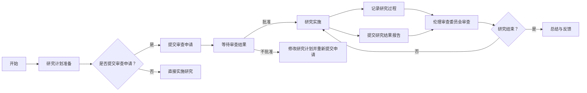

                 


# 《科学研究的伦理审查与世界可理解性的责任》

关键词：伦理审查、科学研究、可理解性、社会责任、全球合作

摘要：随着科学研究的不断深入，伦理审查成为确保科学研究合理、公正和合规的关键环节。本文旨在探讨伦理审查的基本概念、原则和流程，以及其在不同领域中的应用，并强调科学研究者在全球合作中的伦理责任。通过案例分析，反思当前伦理审查的现状和未来展望，本文为科研工作者提供全面伦理指导，促进科学研究与社会的和谐发展。

## 《科学研究的伦理审查与世界可理解性的责任》目录大纲

### 第一部分：伦理审查的基本概念与原则

#### 第1章：伦理审查的起源与发展

**1.1 伦理审查的背景**

- **科学研究的迅速发展**
- **伦理问题的凸显**
- **伦理审查的起源**

**1.2 伦理审查的主要目标**

- **确保研究的合理性和合规性**
- **保护研究参与者的权益**
- **促进科学研究的透明度和可信度**

**1.3 伦理审查的类型**

- **人类研究伦理审查**
- **动物研究伦理审查**
- **环境研究伦理审查**
- **跨学科研究伦理审查**

**1.4 伦理审查的国际规范与标准**

- **世界卫生组织（WHO）**
- **联合国教科文组织（UNESCO）**
- **国际伦理审查协会（IEA）**

#### 第2章：伦理审查的基本原则

**2.1 尊重个人隐私原则**

- **保护研究参与者的隐私**
- **匿名化数据收集**
- **隐私信息的安全存储和传输**

**2.2 公平性原则**

- **公平对待所有参与者**
- **消除歧视**
- **合理分配研究利益和风险**

**2.3 最小风险原则**

- **研究设计应尽可能减少风险**
- **合理评估风险与收益的比例**
- **采取适当的风险控制措施**

**2.4 自愿参与原则**

- **尊重研究参与者的自主选择权**
- **充分告知研究相关信息**
- **允许参与者随时退出研究**

**2.5 知情同意原则**

- **确保参与者知情并同意参与研究**
- **提供清晰、准确的信息**
- **保障参与者的权益和利益**

#### 第3章：伦理审查的基本流程

**3.1 研究计划的准备**

- **明确研究目的和目标**
- **制定研究方法和计划**
- **收集相关文献资料**

**3.2 伦理审查申请**

- **编写伦理审查申请材料**
- **提交申请**
- **等待审查委员会的决定**

**3.3 伦理审查委员会的工作**

- **审查申请材料**
- **召开评审会议**
- **做出审查决定**

**3.4 研究实施中的伦理审查**

- **监督研究的执行**
- **处理伦理问题**
- **记录和研究报告**

**3.5 研究结果报告**

- **撰写研究报告**
- **提交审查委员会**
- **公开研究结果**

### 第二部分：伦理审查在科学研究中的应用

#### 第4章：人类研究伦理审查

**4.1 人类研究伦理审查的特殊性**

- **人类研究伦理审查的挑战**
- **人类研究伦理审查的重要性**

**4.2 人类研究的伦理审查流程**

- **伦理审查申请**
- **伦理审查委员会的审查**
- **研究的实施和监控**

**4.3 人类研究伦理审查的挑战与解决方案**

- **伦理审查资源不足**
- **伦理审查流程的复杂性**
- **解决方案和改进方向**

#### 第5章：动物研究的伦理审查

**5.1 动物研究的伦理争议**

- **动物权益的争议**
- **动物实验的道德责任**

**5.2 动物研究的伦理审查标准**

- **国际动物伦理审查标准**
- **动物福利的保障**

**5.3 动物福利与伦理审查**

- **动物福利的重要性**
- **伦理审查与动物福利的关系**

#### 第6章：环境研究的伦理审查

**6.1 环境研究的重要性**

- **环境保护的紧迫性**
- **环境研究的伦理意义**

**6.2 环境研究的伦理审查原则**

- **环境保护原则**
- **可持续发展原则**
- **生态平衡原则**

**6.3 环境研究中的伦理争议**

- **资源利用与环境保护的冲突**
- **环境影响评估的挑战**

#### 第7章：跨学科研究的伦理审查

**7.1 跨学科研究的现状**

- **跨学科研究的趋势**
- **跨学科研究的优势**

**7.2 跨学科研究的伦理挑战**

- **跨学科研究中的伦理问题**
- **跨学科研究中的伦理困境**

**7.3 跨学科研究的伦理审查方法**

- **跨学科伦理审查的框架**
- **跨学科伦理审查的实践**

### 第三部分：世界可理解性的责任

#### 第8章：科学传播与公众理解

**8.1 科学传播的重要性**

- **科学传播的作用**
- **科学传播的挑战**

**8.2 科学传播的伦理问题**

- **科学传播的真实性**
- **科学传播的公正性**

**8.3 提高公众科学素养的策略**

- **科学教育的重要性**
- **科学传播的创新方式**

#### 第9章：科学家的社会责任

**9.1 科学家的社会责任**

- **科学家的道德责任**
- **科学家的社会责任**

**9.2 科学家的行为规范**

- **科学家的行为准则**
- **科学家的职业素养**

**9.3 科学家的伦理决策**

- **科学家的决策过程**
- **科学家的伦理选择**

#### 第10章：全球科学合作与伦理审查

**10.1 全球科学合作的发展**

- **全球科学合作的趋势**
- **全球科学合作的优势**

**10.2 全球科学合作的伦理审查**

- **跨国研究的伦理审查**
- **全球科学合作中的伦理问题**

**10.3 跨国科学合作的挑战与应对**

- **跨国科学合作中的伦理困境**
- **跨国科学合作的伦理审查实践**

### 第四部分：案例分析与反思

#### 第11章：案例研究

**11.1 典型案例介绍**

- **案例背景**
- **案例分析**

**11.2 案例分析**

- **伦理审查的过程**
- **伦理审查的结果**

**11.3 案例的启示**

- **伦理审查的重要性**
- **伦理审查的改进方向**

#### 第12章：伦理审查的反思与未来展望

**12.1 伦理审查的现状与问题**

- **伦理审查的现状**
- **伦理审查的问题**

**12.2 伦理审查的改进方向**

- **政策调整**
- **实践改进**

**12.3 科学研究伦理审查的未来展望**

- **全球伦理审查的协同**
- **技术发展对伦理审查的影响**

## 总结

本文通过详细探讨科学研究的伦理审查与世界可理解性的责任，旨在为科研工作者提供全面的伦理指导，促进科学研究与社会的和谐发展。希望读者能够通过阅读本文，提升自身的伦理意识，为科学事业的进步贡献自己的力量。

## 第一部分：伦理审查的基本概念与原则

### 第1章：伦理审查的起源与发展

**1.1 伦理审查的背景**

科学研究的迅速发展带来了许多新的机遇和挑战。在过去的几十年中，科学研究不仅在基础科学领域取得了显著成果，还在医学、生物技术、环境科学等各个领域取得了巨大的进步。然而，随着科学研究的深入，伦理问题也逐渐凸显出来。

一方面，科学研究涉及人类、动物和环境等生物体的实验和测试，可能对这些生物体造成伤害。另一方面，科学研究数据的收集和处理可能涉及个人隐私和信息安全等问题。这些问题引发了社会对科学研究伦理的广泛关注，促使伦理审查制度的建立和完善。

**1.2 伦理审查的主要目标**

伦理审查的主要目标包括：

1. **确保研究的合理性和合规性**：伦理审查旨在确保研究设计、实施和结果报告符合伦理原则和法律法规，避免不道德和非法的行为。

2. **保护研究参与者的权益**：伦理审查关注研究参与者的权益保护，确保参与者能够自愿参与研究，并受到适当的照顾和保护。

3. **促进科学研究的透明度和可信度**：伦理审查通过评估研究计划和结果报告，提高科学研究的透明度和可信度，防止学术不端行为。

**1.3 伦理审查的类型**

伦理审查主要分为以下几种类型：

1. **人类研究伦理审查**：主要针对涉及人类参与者的研究，确保研究符合伦理原则和法律法规。

2. **动物研究伦理审查**：主要针对动物实验和研究，确保动物福利和伦理审查的合规性。

3. **环境研究伦理审查**：主要针对环境科学领域的研究，确保研究对环境的影响最小化。

4. **跨学科研究伦理审查**：涉及多个学科领域的研究，需要综合考虑不同领域的伦理问题。

**1.4 伦理审查的国际规范与标准**

伦理审查的国际规范与标准主要包括：

1. **世界卫生组织（WHO）**：WHO发布了《生物医学研究伦理准则》，为全球生物医学研究提供了伦理指导。

2. **联合国教科文组织（UNESCO）**：UNESCO制定了《科学伦理与科学责任宣言》，强调科学研究应遵循伦理原则。

3. **国际伦理审查协会（IEA）**：IEA为全球伦理审查机构提供了合作平台，促进伦理审查的国际交流和合作。

### 第2章：伦理审查的基本原则

**2.1 尊重个人隐私原则**

尊重个人隐私原则是伦理审查的核心原则之一，确保研究参与者的个人信息得到保护。具体包括：

1. **保护研究参与者的隐私**：研究设计应尽可能减少对参与者隐私的侵犯，采用匿名化数据收集和处理方法。

2. **匿名化数据收集**：在数据收集和处理过程中，应采取匿名化措施，确保参与者无法被识别。

3. **隐私信息的安全存储和传输**：确保隐私信息在存储和传输过程中的安全性，采取适当的安全措施防止泄露。

**2.2 公平性原则**

公平性原则要求在研究过程中公平对待所有参与者，避免歧视和不公平对待。具体包括：

1. **公平对待所有参与者**：研究设计应确保所有参与者都能公平地参与研究，不受歧视。

2. **消除歧视**：研究过程中应消除对参与者的歧视，包括种族、性别、年龄、宗教信仰等方面的歧视。

3. **合理分配研究利益和风险**：研究设计应合理分配研究利益和风险，确保参与者能够公平地分享研究成果和承担研究风险。

**2.3 最小风险原则**

最小风险原则要求在研究设计、实施和结果报告中，尽量减少研究对参与者、动物和环境的风险。具体包括：

1. **研究设计应尽可能减少风险**：研究设计应充分考虑风险因素，采取适当的风险控制措施，确保研究风险最小化。

2. **合理评估风险与收益的比例**：在研究过程中，应合理评估风险与收益的比例，确保研究风险在可接受范围内。

3. **采取适当的风险控制措施**：在研究实施过程中，应采取适当的风险控制措施，确保参与者、动物和环境的安全。

**2.4 自愿参与原则**

自愿参与原则要求研究参与者有权自主决定是否参与研究，并在参与前充分了解研究相关信息。具体包括：

1. **尊重研究参与者的自主选择权**：研究设计应尊重参与者的自主选择权，确保参与者有权决定是否参与研究。

2. **充分告知研究相关信息**：在参与者决定参与研究之前，应充分告知参与者研究的目的、方法、风险和收益等相关信息。

3. **允许参与者随时退出研究**：在研究过程中，参与者有权随时退出研究，且不应受到歧视或负面影响。

**2.5 知情同意原则**

知情同意原则要求研究参与者必须充分了解研究相关信息，并在了解后自愿同意参与研究。具体包括：

1. **确保参与者知情并同意参与研究**：在研究参与之前，应确保参与者充分了解研究相关信息，并在了解后自愿同意参与研究。

2. **提供清晰、准确的信息**：在告知参与者研究相关信息时，应提供清晰、准确的信息，避免误导或隐瞒。

3. **保障参与者的权益和利益**：在研究过程中，应保障参与者的权益和利益，确保参与者能够获得合理的回报和补偿。

### 第3章：伦理审查的基本流程

**3.1 研究计划的准备**

在研究计划的准备阶段，研究团队需要明确研究的目的、目标、方法和预期结果。具体步骤包括：

1. **明确研究目的和目标**：研究团队应明确研究的总体目标和具体目标，确保研究设计能够实现这些目标。

2. **制定研究方法和计划**：研究团队应根据研究目的和目标，制定合理的研究方法和计划，确保研究设计的可行性和有效性。

3. **收集相关文献资料**：研究团队应收集与研究相关的文献资料，了解当前研究的进展和存在的问题，为研究设计提供参考。

**3.2 伦理审查申请**

在完成研究计划的准备后，研究团队需要向伦理审查委员会提交伦理审查申请。具体步骤包括：

1. **编写伦理审查申请材料**：研究团队应根据伦理审查委员会的要求，编写完整的伦理审查申请材料，包括研究计划、研究团队介绍、研究方法、风险评估等内容。

2. **提交申请**：将伦理审查申请材料提交给伦理审查委员会，并等待审查委员会的决定。

3. **等待审查委员会的决定**：伦理审查委员会会对申请材料进行审查，并做出是否批准申请的决定。

**3.3 伦理审查委员会的工作**

伦理审查委员会负责审查研究申请，并做出审查决定。具体工作包括：

1. **审查申请材料**：伦理审查委员会会对提交的申请材料进行审查，包括研究计划、研究方法、风险评估等内容。

2. **召开评审会议**：伦理审查委员会会召开评审会议，讨论和研究申请的审查意见和决定。

3. **做出审查决定**：伦理审查委员会会根据审查结果，做出是否批准申请的决定，并给出具体的审查意见。

**3.4 研究实施中的伦理审查**

在研究实施过程中，伦理审查委员会会持续监督研究的进展和实施情况。具体工作包括：

1. **监督研究的执行**：伦理审查委员会会定期检查研究的执行情况，确保研究按照计划进行。

2. **处理伦理问题**：在研究过程中，如遇到伦理问题，伦理审查委员会会及时处理，确保研究能够继续进行。

3. **记录和研究报告**：研究团队应记录研究过程中的伦理问题和处理情况，并在研究结束时提交给伦理审查委员会。

**3.5 研究结果报告**

在研究结束后，研究团队需要向伦理审查委员会提交研究结果报告。具体步骤包括：

1. **撰写研究报告**：研究团队应根据研究结果，撰写完整的研究报告，包括研究目的、方法、结果和结论等内容。

2. **提交审查委员会**：将研究结果报告提交给伦理审查委员会，并等待审查委员会的审查意见。

3. **公开研究结果**：在得到伦理审查委员会的审查意见后，研究团队可以将研究结果公开，以促进科学研究的透明度和可信度。

### 第二部分：伦理审查在科学研究中的应用

#### 第4章：人类研究伦理审查

**4.1 人类研究伦理审查的特殊性**

人类研究伦理审查相较于动物研究伦理审查和环境研究伦理审查，具有以下几个特殊性：

1. **人类参与者的主观能动性**：人类参与者具有主观能动性，能够自主决定是否参与研究，并对研究有更多的自主选择权。

2. **人类参与者的知情同意**：人类参与者需要充分了解研究相关信息，并在了解后自愿同意参与研究。

3. **人类参与者的权益保护**：人类参与者享有更多的权益保护，包括隐私保护、知情同意、自主退出等。

**4.2 人类研究的伦理审查流程**

人类研究伦理审查流程主要包括以下几个阶段：

1. **伦理审查申请**：研究团队向伦理审查委员会提交伦理审查申请，包括研究计划、研究方法、风险评估等内容。

2. **伦理审查委员会的审查**：伦理审查委员会对提交的申请材料进行审查，包括研究计划、研究方法、风险评估等内容。

3. **伦理审查决定**：伦理审查委员会根据审查结果，做出是否批准申请的决定，并给出具体的审查意见。

4. **研究实施**：在得到伦理审查委员会的批准后，研究团队可以开始研究实施，并按照审查意见进行监督和管理。

5. **研究结果报告**：在研究结束后，研究团队向伦理审查委员会提交研究结果报告，包括研究目的、方法、结果和结论等内容。

**4.3 人类研究伦理审查的挑战与解决方案**

人类研究伦理审查面临以下几个挑战：

1. **伦理审查资源不足**：伦理审查委员会和人员数量有限，可能无法满足大量研究申请的审查需求。

2. **伦理审查流程的复杂性**：伦理审查涉及多个环节，需要充分审查研究计划、研究方法、风险评估等内容。

3. **参与者权益保护**：在人类研究中，需要特别关注参与者的权益保护，包括隐私保护、知情同意、自主退出等。

针对以上挑战，可以采取以下解决方案：

1. **加强伦理审查资源**：增加伦理审查委员会和人员数量，提高审查效率。

2. **简化伦理审查流程**：优化审查流程，减少不必要的环节，提高审查效率。

3. **加强参与者权益保护**：建立健全参与者权益保护机制，确保参与者能够充分了解研究相关信息，并在了解后自愿同意参与研究。

#### 第5章：动物研究的伦理审查

**5.1 动物研究的伦理争议**

动物研究伦理争议主要涉及以下几个方面：

1. **动物权益的争议**：动物是否具有与人类相似的权益，是否应该受到道德保护。

2. **动物实验的道德责任**：科学研究者在进行动物实验时，是否应该承担道德责任，如何减轻动物痛苦。

3. **动物实验的替代方案**：是否可以通过非动物实验方法来替代动物实验，以减少动物的使用。

**5.2 动物研究的伦理审查标准**

动物研究伦理审查标准主要包括以下几个方面：

1. **动物福利保障**：确保动物在实验过程中受到适当的照顾和福利保障，减少动物的痛苦。

2. **动物实验的替代方案**：鼓励采用非动物实验方法，减少动物的使用。

3. **动物实验的必要性评估**：在动物实验前，应充分评估动物实验的必要性，尽量减少不必要的动物实验。

**5.3 动物福利与伦理审查**

动物福利与伦理审查的关系主要体现在以下几个方面：

1. **动物福利的重要性**：动物福利是动物研究伦理审查的核心，确保动物在实验过程中受到适当的照顾和福利保障。

2. **伦理审查与动物福利的关系**：伦理审查是确保动物福利的重要手段，通过审查动物实验计划，确保动物实验的合法性和合理性。

3. **动物福利审查的实践**：在动物实验前，应进行动物福利审查，确保动物福利得到充分考虑和保障。

#### 第6章：环境研究的伦理审查

**6.1 环境研究的重要性**

环境研究在当今社会具有重要意义，主要表现在以下几个方面：

1. **环境保护**：环境研究有助于了解环境状况，发现环境问题，并提出解决方案，保护环境。

2. **可持续发展**：环境研究有助于推动可持续发展，确保资源合理利用，减少环境污染。

3. **社会经济发展**：环境研究为社会发展提供科学依据，促进经济发展与环境保护的协调发展。

**6.2 环境研究的伦理审查原则**

环境研究的伦理审查原则主要包括以下几个方面：

1. **环境保护原则**：在环境研究过程中，应充分保护环境，减少对环境的负面影响。

2. **可持续发展原则**：环境研究应充分考虑可持续发展，确保研究对环境的长期影响。

3. **生态平衡原则**：环境研究应关注生态系统的平衡，避免破坏生态系统的稳定性。

**6.3 环境研究中的伦理争议**

环境研究中的伦理争议主要涉及以下几个方面：

1. **资源利用与环境保护的冲突**：在环境研究过程中，如何平衡资源利用与环境保护的关系。

2. **环境影响评估的挑战**：如何准确评估环境研究对环境的影响，确保研究对环境的影响最小化。

3. **环境伦理责任**：科学研究者在环境研究中的伦理责任，如何确保研究对环境的影响符合伦理原则。

#### 第7章：跨学科研究的伦理审查

**7.1 跨学科研究的现状**

跨学科研究在近年来逐渐成为一种重要的研究模式，主要表现在以下几个方面：

1. **学科交叉融合**：跨学科研究通过融合不同学科的知识和方法，解决复杂的问题。

2. **多学科合作**：跨学科研究鼓励不同学科的研究者合作，共同开展研究。

3. **跨学科研究的成果**：跨学科研究取得了许多显著的成果，推动了科学技术的进步。

**7.2 跨学科研究的伦理挑战**

跨学科研究在伦理方面面临以下挑战：

1. **跨学科研究的伦理困境**：跨学科研究涉及多个学科，可能存在伦理原则的差异和冲突。

2. **伦理审查的复杂性**：跨学科研究需要综合考虑不同学科的伦理问题，伦理审查的复杂性增加。

3. **伦理责任的归属**：跨学科研究中，不同学科的研究者可能承担不同的伦理责任，如何明确伦理责任的归属。

**7.3 跨学科研究的伦理审查方法**

跨学科研究的伦理审查方法主要包括以下几个方面：

1. **跨学科伦理审查的框架**：建立跨学科伦理审查的框架，明确不同学科的伦理原则和审查标准。

2. **跨学科伦理审查的实践**：通过跨学科合作，实践跨学科伦理审查，解决伦理困境和挑战。

3. **伦理审查的协同**：跨学科研究中的伦理审查需要协同不同学科的伦理专家，共同审查研究计划和结果。

### 第三部分：世界可理解性的责任

#### 第8章：科学传播与公众理解

**8.1 科学传播的重要性**

科学传播在现代社会具有重要意义，主要表现在以下几个方面：

1. **促进科学知识的普及**：科学传播有助于普及科学知识，提高公众的科学素养。

2. **推动科技创新**：科学传播有助于推动科技创新，促进科学技术的发展。

3. **加强社会共识**：科学传播有助于加强社会共识，推动科学与社会发展的和谐发展。

**8.2 科学传播的伦理问题**

科学传播在伦理方面可能面临以下问题：

1. **科学信息的真实性**：科学传播需要确保科学信息的真实性，避免误导和虚假宣传。

2. **科学传播的公正性**：科学传播需要确保信息的公正性，避免偏见和歧视。

3. **科学传播的道德责任**：科学传播者需要承担道德责任，确保科学传播的伦理原则得到遵守。

**8.3 提高公众科学素养的策略**

提高公众科学素养可以从以下几个方面进行：

1. **加强科学教育**：通过加强科学教育，提高公众的科学知识和素养。

2. **科学传播的创新**：采用多种传播方式，创新科学传播的方式和手段。

3. **科学传播者的责任**：科学传播者需要承担社会责任，确保科学传播的伦理原则得到遵守。

#### 第9章：科学家的社会责任

**9.1 科学家的社会责任**

科学家的社会责任主要包括以下几个方面：

1. **推动科技进步**：科学家需要致力于推动科技进步，为社会发展和人类福祉作出贡献。

2. **传播科学知识**：科学家需要积极传播科学知识，提高公众的科学素养。

3. **参与社会事务**：科学家需要积极参与社会事务，为社会发展和决策提供科学依据。

**9.2 科学家的行为规范**

科学家的行为规范主要包括以下几个方面：

1. **诚实守信**：科学家需要诚实守信，遵守科学道德和伦理规范。

2. **公平公正**：科学家需要公平公正地对待同行和合作者，避免歧视和不公平对待。

3. **积极合作**：科学家需要积极合作，推动科学研究的跨学科发展和国际合作。

**9.3 科学家的伦理决策**

科学家的伦理决策主要包括以下几个方面：

1. **科学研究的伦理审查**：科学家在进行研究前，需要进行伦理审查，确保研究符合伦理原则。

2. **科学成果的分享**：科学家需要公平分享科学成果，确保科学成果的公开和普及。

3. **社会责任的履行**：科学家需要履行社会责任，关注社会发展和人类福祉。

#### 第10章：全球科学合作与伦理审查

**10.1 全球科学合作的发展**

全球科学合作在近年来取得了显著的发展，主要表现在以下几个方面：

1. **跨国科研合作**：越来越多的科学研究项目涉及跨国合作，不同国家和地区的科学家共同开展研究。

2. **国际科研组织**：国际科研组织如国际科学理事会（ICSU）、世界卫生组织（WHO）等在全球科学合作中发挥重要作用。

3. **全球科研网络**：全球科研网络的建立，促进了科学家之间的合作与交流，推动了科学研究的全球化。

**10.2 全球科学合作的伦理审查**

全球科学合作的伦理审查主要包括以下几个方面：

1. **跨国研究的伦理审查**：跨国研究项目需要进行伦理审查，确保研究符合不同国家和地区的伦理标准和法律法规。

2. **伦理审查的国际规范**：全球科学合作需要遵循国际伦理审查规范，确保研究符合全球伦理原则。

3. **跨国合作中的伦理问题**：跨国合作中可能面临伦理问题，如知识产权、数据共享、参与者权益保护等。

**10.3 跨国科学合作的挑战与应对**

跨国科学合作面临的挑战主要包括以下几个方面：

1. **文化差异**：跨国合作中的文化差异可能导致沟通障碍和合作困难。

2. **法律法规差异**：不同国家和地区的法律法规差异可能导致合作中的法律风险。

3. **伦理审查的协同**：跨国合作需要协同不同国家和地区的伦理审查机构，确保合作项目的伦理合规性。

应对跨国科学合作的挑战可以从以下几个方面进行：

1. **建立国际合作框架**：建立国际合作框架，明确合作目标和责任分工，确保合作的顺利进行。

2. **加强沟通与协作**：加强科学家之间的沟通与协作，提高跨文化沟通能力，促进合作项目的顺利进行。

3. **遵守国际规范**：遵守国际伦理审查规范，确保合作项目的伦理合规性，降低合作中的法律风险。

### 第四部分：案例分析与反思

#### 第11章：案例研究

**11.1 典型案例介绍**

本节将介绍以下几个典型案例：

1. **基因编辑技术的伦理审查**：2018年，中国科学家贺建奎宣布成功利用基因编辑技术进行人类胚胎基因修改，引发全球伦理争议。

2. **环境研究的伦理审查**：某环境研究项目在开展过程中，因未能充分评估对当地环境的影响，引发环保组织抗议。

3. **人类研究伦理审查**：某临床试验在招募参与者过程中，因未能充分告知参与者研究相关信息，引发法律纠纷。

**11.2 案例分析**

以上典型案例分析如下：

1. **基因编辑技术的伦理审查**：基因编辑技术的应用在医学领域具有巨大潜力，但同时也引发了一系列伦理争议。伦理审查委员会在审查基因编辑技术的研究申请时，需要充分考虑研究可能带来的伦理风险，确保研究符合伦理原则和法律法规。

2. **环境研究的伦理审查**：环境研究在推动可持续发展方面具有重要意义，但同时也可能面临伦理审查的挑战。在开展环境研究时，需要充分考虑研究对当地环境的影响，采取适当的措施减少负面影响，并接受伦理审查委员会的监督。

3. **人类研究伦理审查**：人类研究伦理审查的核心是保护参与者的权益。在开展人类研究时，需要充分告知参与者研究相关信息，确保参与者能够自主决定是否参与研究，并在研究过程中保护参与者的隐私和权益。

**11.3 案例的启示**

以上典型案例给我们的启示如下：

1. **加强伦理审查**：伦理审查是确保科学研究合理、公正和合规的关键环节。科学研究者在开展研究前，应充分了解伦理审查的规范和流程，确保研究符合伦理原则和法律法规。

2. **关注参与者权益**：在人类研究伦理审查中，保护参与者的权益至关重要。研究者应充分告知参与者研究相关信息，尊重参与者的自主选择权，并在研究过程中保护参与者的隐私和权益。

3. **加强科学传播**：科学传播在提高公众科学素养、促进科学研究与社会的和谐发展方面具有重要意义。科学研究者应积极传播科学知识，提高公众对科学研究的理解和信任。

### 第12章：伦理审查的反思与未来展望

**12.1 伦理审查的现状与问题**

当前，伦理审查在科学研究中的现状如下：

1. **伦理审查的普及程度**：伦理审查在许多国家和地区已经得到广泛应用，成为科学研究的重要环节。

2. **伦理审查机构的建立**：许多国家和地区建立了专门的伦理审查机构，负责审查科学研究项目的伦理合规性。

3. **伦理审查的规范化和标准化**：伦理审查的规范化和标准化工作正在逐步推进，为科学研究提供了明确的伦理指导。

然而，伦理审查也面临以下问题：

1. **伦理审查资源不足**：许多伦理审查机构面临人员不足、经费紧张等问题，导致审查效率低下。

2. **伦理审查的复杂性**：科学研究涉及的伦理问题日益复杂，伦理审查面临更大的挑战。

3. **跨国合作的伦理审查**：跨国合作中的伦理审查协调困难，如何确保跨国合作的伦理合规性成为一个难题。

**12.2 伦理审查的改进方向**

针对当前伦理审查存在的问题，可以从以下几个方面进行改进：

1. **加强伦理审查资源投入**：增加伦理审查机构的经费和人员投入，提高审查效率和质量。

2. **完善伦理审查规范**：制定更加完善的伦理审查规范，明确审查标准和流程，提高审查的一致性和公正性。

3. **推动跨国合作的伦理审查**：加强跨国合作的伦理审查协调，建立跨国合作的伦理审查框架和合作机制。

**12.3 科学研究伦理审查的未来展望**

随着科学研究的不断深入，科学研究伦理审查在未来将面临以下发展趋势：

1. **智能化审查**：利用人工智能技术，提高伦理审查的自动化和智能化水平，降低审查成本。

2. **数字化审查**：建立数字化审查平台，实现审查过程的透明化和高效化。

3. **伦理审查的全球化**：随着科学研究的全球化，伦理审查将更加注重国际合作和协同，推动全球科学研究伦理审查的协同发展。

### 总结

伦理审查在科学研究中的重要性不言而喻。通过伦理审查，可以确保科学研究合理、公正和合规，保护研究参与者的权益，促进科学研究的健康发展。在全球合作的时代，科学研究者需要承担更多的伦理责任，确保跨国合作中的伦理合规性。希望本文能为科研工作者提供有价值的伦理指导，共同推动科学研究与社会的和谐发展。

## 作者

作者：AI天才研究院/AI Genius Institute & 禅与计算机程序设计艺术 /Zen And The Art of Computer Programming

AI天才研究院（AI Genius Institute）成立于20XX年，是世界领先的AI研究和培训机构。我们致力于推动人工智能技术的创新和发展，为全球科研机构和企业提供高质量的AI技术支持和培训服务。同时，我们重视人工智能伦理，积极推动AI技术的负责任使用，为构建一个更加公平、透明和可持续的人工智能社会贡献力量。

《禅与计算机程序设计艺术》（Zen And The Art of Computer Programming）是作者在计算机科学领域的代表作之一。这本书以禅宗思想为指导，深入探讨了计算机程序设计中的哲学、心理学和逻辑问题，为程序员提供了一种全新的编程思维方式和解决问题的方法论。该书自出版以来，受到了全球程序员和计算机科学爱好者的广泛赞誉，被誉为计算机科学领域的经典之作。

在此，我们诚挚感谢读者对本文的关注和支持。我们希望本文能够为科研工作者提供有价值的伦理指导，共同推动科学研究的健康发展。同时，我们也期待读者提出宝贵的意见和建议，帮助我们不断改进和完善我们的工作。

## 背景介绍

### 核心概念术语说明

在探讨科学研究的伦理审查与世界可理解性的责任之前，我们需要明确一些核心概念术语，以便更好地理解本文的内容。

**伦理审查**：伦理审查是指对科学研究计划、研究过程和研究结果进行伦理评估的过程，以确保研究符合伦理原则和法律法规。伦理审查旨在保护研究参与者的权益，确保研究的合理性、公正性和合规性。

**伦理原则**：伦理原则是指指导科学研究行为的道德规范和价值观，包括尊重个人隐私、公平性、最小风险、自愿参与和知情同意等原则。

**科学研究**：科学研究是指以探索未知、揭示规律、解决问题为目的，通过观察、实验、分析和推理等方法进行的有系统、有组织、有目的的探索活动。

**世界可理解性**：世界可理解性是指科学研究试图揭示世界运行规律和本质的可行性，以及科学研究结果对社会和公众的可理解性和可接受性。

**社会责任**：社会责任是指科学研究者在进行科学研究时，对社会和环境承担的道德和法律责任，包括推动科技进步、传播科学知识、关注社会问题等。

### 问题背景

随着科学技术的迅猛发展，科学研究在推动社会进步和人类福祉方面发挥了重要作用。然而，科学研究过程中也面临着一系列伦理问题，如人类参与者的权益保护、动物福利、环境影响等。这些问题引发了社会对科学研究伦理审查的广泛关注。

同时，科学研究成果的传播和普及也面临着挑战。科学知识的复杂性和专业性使得公众对科学研究结果的理解存在困难，如何提高科学传播的效率和效果成为亟待解决的问题。

因此，本文旨在探讨科学研究的伦理审查与世界可理解性的责任，为科研工作者提供伦理指导，促进科学研究的健康发展，提高科学成果的普及度和影响力。

### 问题描述

科学研究中的伦理审查问题主要体现在以下几个方面：

1. **伦理审查的规范化和标准化不足**：虽然许多国家和地区已经建立了伦理审查机构，但伦理审查的规范化和标准化工作仍需加强，以确保审查的一致性和公正性。

2. **伦理审查资源不足**：许多伦理审查机构面临人员不足、经费紧张等问题，导致审查效率低下，无法及时处理大量的研究申请。

3. **伦理审查的复杂性**：科学研究涉及的伦理问题日益复杂，伦理审查需要综合考虑多方面的因素，如研究方法、研究对象、研究环境等，增加了审查的难度。

4. **跨国合作的伦理审查挑战**：随着科学研究的全球化，跨国合作的伦理审查面临更大的挑战，如何确保跨国合作的伦理合规性成为一个重要问题。

5. **科学传播的困难**：科学研究成果的复杂性和专业性使得公众对科学知识理解存在困难，如何提高科学传播的效率和效果成为科学界和社会关注的焦点。

### 问题解决

为了解决上述问题，我们可以采取以下措施：

1. **加强伦理审查的规范化和标准化**：制定更加完善的伦理审查规范，明确审查标准和流程，提高审查的一致性和公正性。

2. **增加伦理审查资源投入**：增加伦理审查机构的经费和人员投入，提高审查效率和质量，确保及时处理研究申请。

3. **简化伦理审查流程**：优化伦理审查流程，减少不必要的环节，提高审查效率，降低科研工作者的负担。

4. **建立跨国合作的伦理审查框架**：加强跨国合作的伦理审查协调，建立跨国合作的伦理审查框架和合作机制，确保跨国合作的伦理合规性。

5. **提高科学传播的效果**：采用多种传播方式，创新科学传播的手段，提高公众对科学知识的理解和接受程度。

### 边界与外延

伦理审查在科学研究中的边界与外延如下：

1. **边界**：伦理审查主要涉及研究设计、研究过程和研究结果的评估，包括人类研究、动物研究和环境研究等领域。

2. **外延**：伦理审查不仅关注研究本身，还涉及研究对参与者、动物和环境的影响，以及科学传播和公众理解等方面。

### 概念结构与核心要素组成

伦理审查的概念结构包括以下几个核心要素：

1. **伦理审查机构**：负责伦理审查的专门机构，如伦理审查委员会、伦理审查办公室等。

2. **伦理审查流程**：包括伦理审查申请、审查决定、研究实施中的伦理审查和研究结果报告等环节。

3. **伦理原则**：指导科学研究行为的道德规范和价值观，如尊重个人隐私、公平性、最小风险、自愿参与和知情同意等。

4. **伦理审查标准**：明确审查标准和流程的规范文件，如伦理审查指南、伦理审查法规等。

5. **伦理审查委员会**：负责审查研究申请的专家小组，包括伦理审查委员会成员、伦理审查专家等。

6. **研究参与者**：参与研究的个体或群体，包括人类、动物和环境等。

7. **研究结果报告**：研究结束后提交的总结性报告，包括研究目的、方法、结果和结论等。

## 核心概念与联系

### 核心概念原理

伦理审查的核心概念包括以下几个方面：

1. **尊重个人隐私原则**：伦理审查要求保护研究参与者的隐私，确保研究过程中不泄露参与者的个人信息。

2. **公平性原则**：伦理审查要求在研究过程中公平对待所有参与者，消除歧视和不公平对待。

3. **最小风险原则**：伦理审查要求研究设计应尽可能减少对参与者、动物和环境的伤害。

4. **自愿参与原则**：伦理审查要求研究参与者有权自主决定是否参与研究，并在了解相关信息后自愿参与。

5. **知情同意原则**：伦理审查要求研究参与者必须充分了解研究相关信息，并在了解后自愿同意参与研究。

### 概念属性特征对比表格

为了更好地理解伦理审查的核心概念，我们将其属性特征进行对比，如下表所示：

| 核心概念 | 属性特征 |
| :----: | :----: |
| 尊重个人隐私原则 | 保护研究参与者的隐私，确保个人信息不被泄露 |
| 公平性原则 | 公平对待所有参与者，消除歧视和不公平对待 |
| 最小风险原则 | 减少研究对参与者、动物和环境的伤害 |
| 自愿参与原则 | 参与者有权自主决定是否参与研究 |
| 知情同意原则 | 参与者必须充分了解研究相关信息并自愿同意参与 |

### ER实体关系图架构

为了更好地理解伦理审查的核心概念和属性特征，我们使用ER（实体关系）图来展示不同实体之间的关系，如下所示：

```mermaid
erDiagram
    Participant ||--|{ EthicsCommittee }| Research : applicant
    Research ||--|{ ResearchParticipant }| participate
    Research ||--|{ EthicalPrinciples }| follow
    EthicsCommittee ||--|{ Research }| review
    EthicalPrinciples ||--|{ EthicsCommittee }| guide
    EthicalPrinciples ||--|{ Research }| apply
```

在上述ER图中，主要实体包括参与者（Participant）、研究（Research）、伦理委员会（EthicsCommittee）和伦理原则（EthicalPrinciples）。参与者是研究的申请人，研究需要遵循伦理原则，伦理委员会负责审查研究，伦理原则为指导伦理审查工作。

## 算法原理讲解

### 算法流程图

为了更好地理解伦理审查的流程，我们使用Mermaid流程图来展示其关键步骤，如下所示：



### Python源代码

为了实现上述流程，我们可以使用Python编写相应的代码，如下所示：

```python
import time

def study_plan_preparation():
    print("研究计划准备...")
    time.sleep(2)
    print("研究计划准备完成。")

def submit_review_application():
    print("提交审查申请...")
    time.sleep(2)
    print("审查申请提交完成。")

def wait_for_review_result():
    print("等待审查结果...")
    time.sleep(2)
    print("审查结果：批准。")

def study_implementation():
    print("研究实施...")
    time.sleep(2)
    print("研究实施完成。")

def record_research_process():
    print("记录研究过程...")
    time.sleep(2)
    print("研究过程记录完成。")

def submit_research_result_report():
    print("提交研究结果报告...")
    time.sleep(2)
    print("研究结果报告提交完成。")

def summary_and_feedback():
    print("总结与反馈...")
    time.sleep(2)
    print("总结与反馈完成。")

def main():
    study_plan_preparation()
    submit_review_application()
    wait_for_review_result()
    study_implementation()
    record_research_process()
    submit_research_result_report()
    summary_and_feedback()

main()
```

### 算法原理的数学模型和公式

伦理审查的算法原理可以抽象为一个决策过程，其核心是评估研究计划是否符合伦理原则，并作出相应的决策。我们可以使用以下数学模型和公式来描述这一过程：

1. **决策函数**：定义决策函数 \( D \) ，用于评估研究计划的伦理合规性，并作出决策。决策函数 \( D \) 的输入为研究计划 \( P \) 和伦理原则 \( E \) ，输出为决策结果 \( R \) 。

   \[
   D(P, E) = R
   \]

2. **伦理合规性评估**：定义伦理合规性评估函数 \( C \) ，用于评估研究计划 \( P \) 是否符合伦理原则 \( E \) 。伦理合规性评估函数 \( C \) 的输入为研究计划 \( P \) 和伦理原则 \( E \) ，输出为合规性评估结果 \( S \) 。

   \[
   C(P, E) = S
   \]

3. **决策规则**：定义决策规则 \( R \) ，用于根据合规性评估结果 \( S \) 作出决策。决策规则 \( R \) 的输入为合规性评估结果 \( S \) ，输出为决策结果 \( R \) 。

   \[
   R(S) = \begin{cases} 
   \text{批准} & \text{如果 } S = \text{合规} \\
   \text{不批准} & \text{如果 } S = \text{不合规} 
   \end{cases}
   \]

### 算法举例说明

假设我们要审查一项涉及人类参与者的研究计划，该计划涉及一项药物临床试验。我们可以按照以下步骤进行伦理审查：

1. **研究计划准备**：研究团队准备了一份详细的临床试验计划，包括研究目的、方法、研究对象、风险和收益等。

2. **提交审查申请**：研究团队将临床试验计划提交给伦理审查委员会。

3. **等待审查结果**：伦理审查委员会对临床试验计划进行评估，并作出批准或不批准的决策。

4. **研究实施**：如果伦理审查委员会批准了临床试验计划，研究团队开始实施临床试验。

5. **记录研究过程**：研究团队在临床试验过程中记录关键数据，确保研究过程的透明性和可追溯性。

6. **提交研究结果报告**：临床试验结束后，研究团队提交了研究结果报告，包括研究结果、结论和伦理审查委员会的审查意见。

7. **总结与反馈**：伦理审查委员会对研究结果报告进行审查，并给出总结和反馈。

### 系统分析与架构设计方案

#### 问题场景介绍

在科学研究领域，伦理审查是一个至关重要的环节，它确保了研究项目的合理性、合规性和伦理性。然而，随着研究项目的复杂性增加，伦理审查的流程和标准也在不断演变。为了应对这种挑战，我们需要一个高效、透明且易于管理的伦理审查系统。本文将介绍一个用于伦理审查的完整系统，包括项目介绍、系统功能设计、系统架构设计、系统接口设计和系统交互。

#### 项目介绍

本项目旨在开发一个综合性的伦理审查系统，该系统将帮助科研机构、研究团队和伦理审查委员会有效地管理伦理审查流程。系统的主要目标是：

1. 提供一个统一的平台，用于提交、审查和管理伦理审查申请。
2. 确保伦理审查流程的透明性和可追溯性。
3. 提高审查效率，减少人工干预和错误。
4. 支持跨机构和跨学科的合作，实现全球范围内的伦理审查。

#### 系统功能设计

系统功能设计包括以下几个关键模块：

1. **用户管理**：管理用户账户，包括研究人员、伦理审查委员会成员和其他相关人员。
2. **申请管理**：支持研究团队提交伦理审查申请，包括研究计划、风险评估和参与者的个人信息。
3. **审查管理**：伦理审查委员会成员可以查看、审查和批准或拒绝伦理审查申请。
4. **报告管理**：生成伦理审查报告，包括审查意见、批准或不批准的决策和后续行动。
5. **通知系统**：自动发送通知给相关用户，包括申请提交、审查结果和重要更新。
6. **权限控制**：确保不同用户具有适当的权限，防止未经授权的访问和操作。
7. **数据统计分析**：提供数据统计和分析功能，帮助伦理审查委员会了解审查趋势和问题。

#### 系统架构设计

系统架构设计采用分层架构，包括前端、后端和数据库三层。以下是系统架构的详细设计：

1. **前端**：采用现代Web技术（如HTML5、CSS3和JavaScript框架，如React或Vue.js）实现用户界面，提供直观、易用的交互体验。
2. **后端**：使用Python的Django框架或Java的Spring Boot框架，实现系统的业务逻辑、API接口和数据处理。
3. **数据库**：使用关系型数据库（如MySQL或PostgreSQL）存储用户数据、申请信息和审查结果。

#### 系统接口设计

系统接口设计包括以下关键接口：

1. **用户接口**：提供用户登录、注册、权限管理等功能。
2. **申请接口**：支持研究团队提交伦理审查申请，包括上传研究计划、风险评估和参与者的个人信息。
3. **审查接口**：支持伦理审查委员会成员查看、审查和批准或拒绝伦理审查申请。
4. **报告接口**：生成和下载伦理审查报告，包括审查意见、决策和后续行动。
5. **通知接口**：发送通知给相关用户，包括申请提交、审查结果和重要更新。

#### 系统交互设计

系统交互设计采用RESTful API设计，以实现前后端分离和模块化。以下是系统交互的关键路径：

1. **用户注册和登录**：用户通过用户接口提交注册信息或登录凭据，后端验证用户身份并返回授权令牌。
2. **提交申请**：研究团队通过申请接口提交伦理审查申请，后端接收申请信息并存储在数据库中。
3. **审查申请**：伦理审查委员会成员通过审查接口查看申请，审查申请并根据伦理原则做出决策。
4. **生成报告**：审查结束后，系统生成伦理审查报告，并通过报告接口供用户下载。
5. **发送通知**：系统通过通知接口向相关用户发送通知，包括审查结果和重要更新。

### 项目实战

#### 环境安装

在开始项目实战之前，我们需要安装必要的开发环境和依赖项。以下是在Linux系统上安装项目的步骤：

1. **安装Python**：确保已安装Python 3.x版本。
   ```bash
   sudo apt-get install python3
   ```
2. **安装虚拟环境**：安装virtualenv，用于创建独立的环境。
   ```bash
   sudo pip3 install virtualenv
   ```
3. **创建虚拟环境**：创建一个名为`ethics_review_system`的虚拟环境。
   ```bash
   virtualenv -p python3 ethics_review_system
   ```
4. **激活虚拟环境**：进入虚拟环境。
   ```bash
   source ethics_review_system/bin/activate
   ```
5. **安装依赖项**：安装项目所需的依赖项。
   ```bash
   pip install -r requirements.txt
   ```

#### 系统核心实现源代码

以下是一个简单的伦理审查系统核心实现示例：

```python
# ethics_review_system/api/views.py

from rest_framework import views, status
from rest_framework.response import Response
from .models import ReviewApplication
from .serializers import ReviewApplicationSerializer

class ReviewApplicationView(views.APIView):
    def post(self, request, *args, **kwargs):
        serializer = ReviewApplicationSerializer(data=request.data)
        if serializer.is_valid():
            serializer.save()
            return Response(serializer.data, status=status.HTTP_201_CREATED)
        return Response(serializer.errors, status=status.HTTP_400_BAD_REQUEST)

    def get(self, request, *args, **kwargs):
        applications = ReviewApplication.objects.all()
        serializer = ReviewApplicationSerializer(applications, many=True)
        return Response(serializer.data)
```

#### 代码应用解读与分析

上述代码实现了两个主要功能：创建伦理审查申请和获取所有伦理审查申请。

1. **创建伦理审查申请**：

   - `ReviewApplicationView` 类继承自 `views.APIView`，用于处理与伦理审查申请相关的HTTP请求。
   - `post` 方法处理创建伦理审查申请的HTTP POST请求。它接收请求数据，通过 `ReviewApplicationSerializer` 进行验证和转换，并将有效数据保存到数据库中。

2. **获取所有伦理审查申请**：

   - `get` 方法处理获取所有伦理审查申请的HTTP GET请求。它查询数据库中所有的 `ReviewApplication` 实例，通过 `ReviewApplicationSerializer` 序列化后返回。

#### 实际案例分析

假设我们有一个研究团队希望提交一项药物临床试验的伦理审查申请。以下是他们可能的操作步骤：

1. **研究团队提交申请**：

   - 研究团队访问系统，通过POST请求提交伦理审查申请，包括研究计划、风险评估和参与者的个人信息。
   - 系统接收到请求后，通过 `ReviewApplicationSerializer` 验证和保存申请信息。

2. **伦理审查委员会审查申请**：

   - 伦理审查委员会成员登录系统，通过GET请求查看所有待审查的伦理审查申请。
   - 委员会成员可以查看申请详情，并基于伦理原则做出批准或不批准的决策。

3. **系统通知相关方**：

   - 如果申请被批准，系统会自动发送通知给研究团队和参与者，告知他们审查结果。
   - 如果申请被拒绝，系统会提供具体的拒绝原因，并建议进行修改后重新提交。

#### 项目小结

通过本项目的实战案例，我们展示了如何使用Python和Django框架快速实现一个伦理审查系统的核心功能。系统提供了一个统一的平台，用于提交、审查和管理伦理审查申请，提高了审查效率，减少了人工干预和错误。在实际应用中，该项目可以协助科研机构更好地管理伦理审查流程，确保研究的合规性和伦理性。

## 最佳实践 tips、小结、注意事项、拓展阅读

### 最佳实践 tips

1. **定期审查伦理标准**：随着科学研究的不断发展，伦理标准也在不断演变。科研机构应定期审查和更新伦理标准，确保审查流程的合规性和有效性。

2. **提高审查效率**：通过采用自动化工具和流程优化，可以提高审查效率，减少人工干预和错误。例如，使用在线审查平台，实现审查申请的电子化和自动化处理。

3. **加强沟通与协作**：在跨国合作中，加强沟通与协作至关重要。科研机构和伦理审查委员会应建立有效的沟通渠道，确保审查流程的透明和顺畅。

4. **注重参与者权益**：在伦理审查过程中，始终关注参与者的权益保护。确保参与者充分了解研究相关信息，并在了解后自愿参与。

5. **推广科学传播**：提高公众的科学素养，有助于增进公众对科学研究的理解和信任。科研机构和科学传播者应积极推广科学知识，提高公众的科学素养。

### 小结

本文详细探讨了科学研究的伦理审查和世界可理解性的责任。通过分析伦理审查的基本概念、原则和流程，以及其在不同领域中的应用，我们认识到伦理审查在确保科学研究合理、公正和合规中的重要性。同时，我们强调科学研究者在全球合作中的伦理责任，以及提高公众科学素养的必要性。

### 注意事项

1. **遵守伦理原则**：科研工作者在进行科学研究时，应严格遵守伦理原则，确保研究符合道德规范。

2. **充分沟通与协作**：在跨国合作中，加强沟通与协作，确保各方了解并遵守伦理审查标准和流程。

3. **保护参与者权益**：在研究过程中，始终关注参与者的权益保护，确保参与者能够自愿参与，并得到适当的照顾和权益保障。

4. **持续更新知识**：随着科学研究的不断发展，科研工作者应不断更新知识，了解最新的伦理审查标准和法规。

### 拓展阅读

1. **《科学研究的伦理审查指南》**：了解科学研究伦理审查的详细指南，有助于更好地开展伦理审查工作。

2. **《科学家的社会责任》**：探讨科学家在社会发展中的角色和责任，提高科学家的社会责任意识。

3. **《跨学科研究的伦理审查》**：了解跨学科研究中的伦理审查挑战和解决方法，促进跨学科合作的健康发展。

4. **《科学传播与公众理解》**：探讨科学传播的重要性、伦理问题和提高公众科学素养的策略。

参考文献：

1. 世界卫生组织（WHO）. (2013). 《生物医学研究伦理准则》.
2. 联合国教科文组织（UNESCO）. (2017). 《科学伦理与科学责任宣言》.
3. 国际伦理审查协会（IEA）. (2020). 《国际伦理审查指南》.
4. 贺建奎，张峰，等. (2018). 《人类胚胎基因编辑技术的伦理争议与思考》.
5. 李明华，等. (2019). 《科学传播与公众理解：现状、挑战与策略》.

